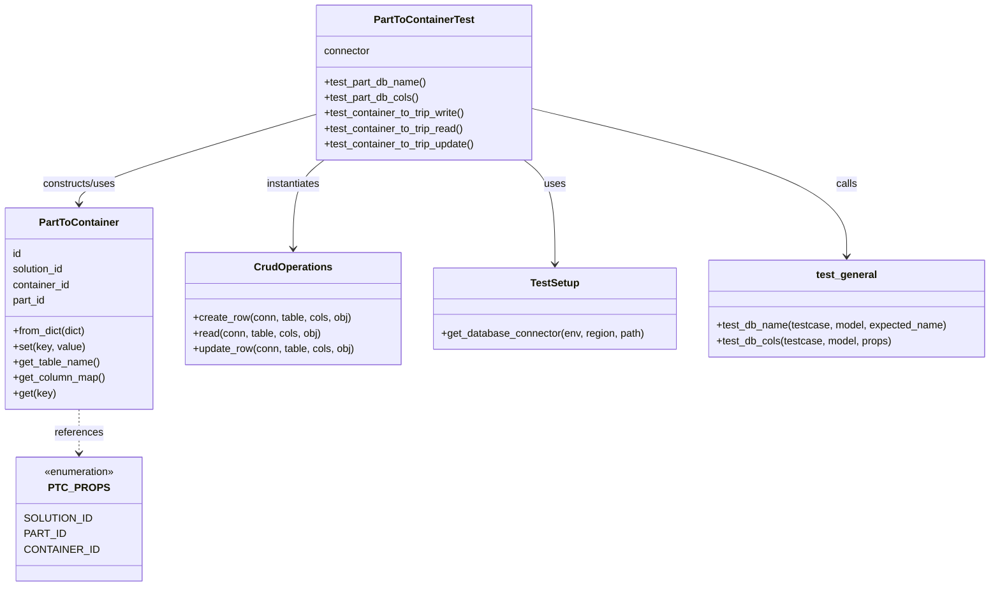
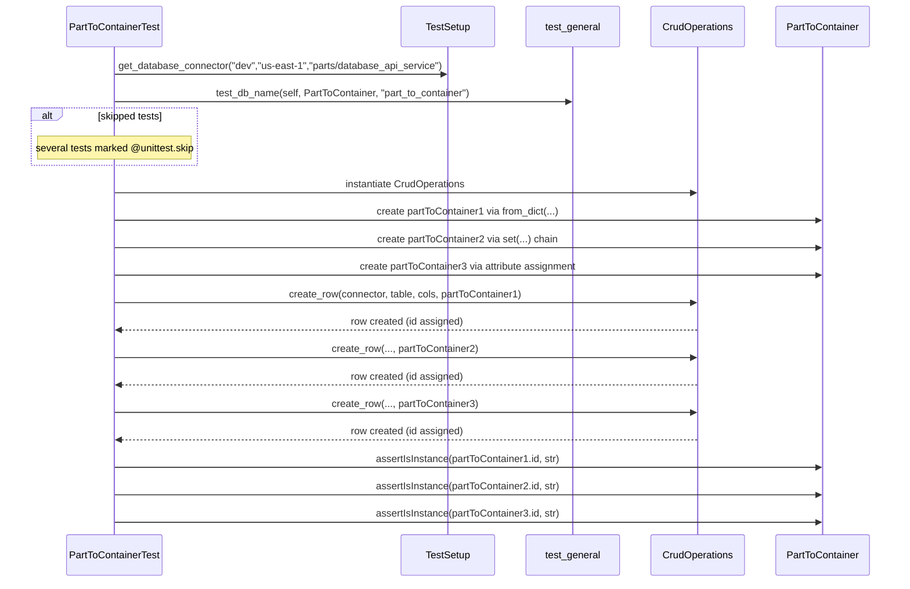

# Diagram: partview_core/partview_service/partview_service/tests/unit/core/datamodel/part_to_container_test.py

> Auto-generated by Obscura crawlers

## Diagram 1

### SVG

<svg id="container" width="1531.9453125" xmlns="http://www.w3.org/2000/svg" class="classDiagram" height="908" viewBox="0 0 1531.9453125 908" role="graphics-document document" aria-roledescription="class"><g><defs><marker id="container_class-aggregationStart" class="marker aggregation class" refX="18" refY="7" markerWidth="190" markerHeight="240" orient="auto"><path d="M 18,7 L9,13 L1,7 L9,1 Z"></path></marker></defs><defs><marker id="container_class-aggregationEnd" class="marker aggregation class" refX="1" refY="7" markerWidth="20" markerHeight="28" orient="auto"><path d="M 18,7 L9,13 L1,7 L9,1 Z"></path></marker></defs><defs><marker id="container_class-extensionStart" class="marker extension class" refX="18" refY="7" markerWidth="190" markerHeight="240" orient="auto"><path d="M 1,7 L18,13 V 1 Z"></path></marker></defs><defs><marker id="container_class-extensionEnd" class="marker extension class" refX="1" refY="7" markerWidth="20" markerHeight="28" orient="auto"><path d="M 1,1 V 13 L18,7 Z"></path></marker></defs><defs><marker id="container_class-compositionStart" class="marker composition class" refX="18" refY="7" markerWidth="190" markerHeight="240" orient="auto"><path d="M 18,7 L9,13 L1,7 L9,1 Z"></path></marker></defs><defs><marker id="container_class-compositionEnd" class="marker composition class" refX="1" refY="7" markerWidth="20" markerHeight="28" orient="auto"><path d="M 18,7 L9,13 L1,7 L9,1 Z"></path></marker></defs><defs><marker id="container_class-dependencyStart" class="marker dependency class" refX="6" refY="7" markerWidth="190" markerHeight="240" orient="auto"><path d="M 5,7 L9,13 L1,7 L9,1 Z"></path></marker></defs><defs><marker id="container_class-dependencyEnd" class="marker dependency class" refX="13" refY="7" markerWidth="20" markerHeight="28" orient="auto"><path d="M 18,7 L9,13 L14,7 L9,1 Z"></path></marker></defs><defs><marker id="container_class-lollipopStart" class="marker lollipop class" refX="13" refY="7" markerWidth="190" markerHeight="240" orient="auto"><circle stroke="black" fill="transparent" cx="7" cy="7" r="6"></circle></marker></defs><defs><marker id="container_class-lollipopEnd" class="marker lollipop class" refX="1" refY="7" markerWidth="190" markerHeight="240" orient="auto"><circle stroke="black" fill="transparent" cx="7" cy="7" r="6"></circle></marker></defs><g class="root"><g class="clusters"></g><g class="edgePaths"><path d="M809.692,248L817.667,254.167C825.641,260.333,841.59,272.667,849.565,299.5C857.539,326.333,857.539,367.667,857.539,388.333L857.539,409" id="id_PartToContainerTest_TestSetup_1" class="edge-thickness-normal edge-pattern-solid relation" style=";;;" data-edge="true" data-et="edge" data-id="id_PartToContainerTest_TestSetup_1" data-points="W3sieCI6ODA5LjY5MjMxNDM5MDkyMzYsInkiOjI0OH0seyJ4Ijo4NTcuNTM5MDYyNSwieSI6Mjg1fSx7IngiOjg1Ny41MzkwNjI1LCJ5Ijo0MTV9XQ==" marker-end="url(#container_class-dependencyEnd)"></path><path d="M499.335,248L491.361,254.167C483.386,260.333,467.437,272.667,459.463,295.5C451.488,318.333,451.488,351.667,451.488,368.333L451.488,385" id="id_PartToContainerTest_CrudOperations_2" class="edge-thickness-normal edge-pattern-solid relation" style=";;;" data-edge="true" data-et="edge" data-id="id_PartToContainerTest_CrudOperations_2" data-points="W3sieCI6NDk5LjMzNTAyOTM1OTA3NjQzLCJ5IjoyNDh9LHsieCI6NDUxLjQ4ODI4MTI1LCJ5IjoyODV9LHsieCI6NDUxLjQ4ODI4MTI1LCJ5IjozOTF9XQ==" marker-end="url(#container_class-dependencyEnd)"></path><path d="M486.654,177.403L425.724,195.336C364.793,213.269,242.932,249.134,182.001,272.234C121.07,295.333,121.07,305.667,121.07,310.833L121.07,316" id="id_PartToContainerTest_PartToContainer_3" class="edge-thickness-normal edge-pattern-solid relation" style=";;;" data-edge="true" data-et="edge" data-id="id_PartToContainerTest_PartToContainer_3" data-points="W3sieCI6NDg2LjY1NDI5Njg3NSwieSI6MTc3LjQwMzQxMTY0OTY5NjN9LHsieCI6MTIxLjA3MDMxMjUsInkiOjI4NX0seyJ4IjoxMjEuMDcwMzEyNSwieSI6MzIyfV0=" marker-end="url(#container_class-dependencyEnd)"></path><path d="M121.07,634L121.07,640.167C121.07,646.333,121.07,658.667,121.07,670C121.07,681.333,121.07,691.667,121.07,696.833L121.07,702" id="id_PartToContainer_PTC_PROPS_4" class="edge-thickness-normal edge-pattern-dashed relation" style=";;;" data-edge="true" data-et="edge" data-id="id_PartToContainer_PTC_PROPS_4" data-points="W3sieCI6MTIxLjA3MDMxMjUsInkiOjYzNH0seyJ4IjoxMjEuMDcwMzEyNSwieSI6NjcxfSx7IngiOjEyMS4wNzAzMTI1LCJ5Ijo3MDh9XQ==" marker-end="url(#container_class-dependencyEnd)"></path><path d="M822.373,168.199L903.66,187.666C984.947,207.133,1147.52,246.066,1228.807,284.2C1310.094,322.333,1310.094,359.667,1310.094,378.333L1310.094,397" id="id_PartToContainerTest_test_general_5" class="edge-thickness-normal edge-pattern-solid relation" style=";;;" data-edge="true" data-et="edge" data-id="id_PartToContainerTest_test_general_5" data-points="W3sieCI6ODIyLjM3MzA0Njg3NSwieSI6MTY4LjE5OTM5NDAyNDI1Njl9LHsieCI6MTMxMC4wOTM3NSwieSI6Mjg1fSx7IngiOjEzMTAuMDkzNzUsInkiOjQwM31d" marker-end="url(#container_class-dependencyEnd)"></path></g><g class="edgeLabels"><g class="edgeLabel" transform="translate(857.5390625, 285)"><g class="label" data-id="id_PartToContainerTest_TestSetup_1" transform="translate(-16.4921875, -12)"><foreignObject width="32.984375" height="24">

uses

</foreignObject></g></g><g class="edgeLabel" transform="translate(451.48828125, 285)"><g class="label" data-id="id_PartToContainerTest_CrudOperations_2" transform="translate(-42.9140625, -12)"><foreignObject width="85.828125" height="24">

instantiates

</foreignObject></g></g><g class="edgeLabel" transform="translate(121.0703125, 285)"><g class="label" data-id="id_PartToContainerTest_PartToContainer_3" transform="translate(-58.25, -12)"><foreignObject width="116.5" height="24">

constructs/uses

</foreignObject></g></g><g class="edgeLabel" transform="translate(121.0703125, 671)"><g class="label" data-id="id_PartToContainer_PTC_PROPS_4" transform="translate(-37.828125, -12)"><foreignObject width="75.65625" height="24">

references

</foreignObject></g></g><g class="edgeLabel" transform="translate(1310.09375, 285)"><g class="label" data-id="id_PartToContainerTest_test_general_5" transform="translate(-16.4453125, -12)"><foreignObject width="32.890625" height="24">

calls

</foreignObject></g></g></g><g class="nodes"><g class="node default" id="classId-PartToContainerTest-0" transform="translate(654.513671875, 128)"><g class="basic label-container"><path d="M-167.859375 -120 L167.859375 -120 L167.859375 120 L-167.859375 120" stroke="none" stroke-width="0" fill="#ECECFF" style=""></path><path d="M-167.859375 -120 C-57.14591135531708 -120, 53.567552289365835 -120, 167.859375 -120 M-167.859375 -120 C-82.55474187344096 -120, 2.7498912531180792 -120, 167.859375 -120 M167.859375 -120 C167.859375 -27.29188873306701, 167.859375 65.41622253386598, 167.859375 120 M167.859375 -120 C167.859375 -48.57967114420616, 167.859375 22.84065771158768, 167.859375 120 M167.859375 120 C81.61061387389779 120, -4.638147252204419 120, -167.859375 120 M167.859375 120 C62.41654539923455 120, -43.0262842015309 120, -167.859375 120 M-167.859375 120 C-167.859375 44.47421728573153, -167.859375 -31.051565428536946, -167.859375 -120 M-167.859375 120 C-167.859375 38.56165712682437, -167.859375 -42.87668574635126, -167.859375 -120" stroke="#9370DB" stroke-width="1.3" fill="none" stroke-dasharray="0 0" style=""></path></g><g class="annotation-group text" transform="translate(0, -96)"></g><g class="label-group text" transform="translate(-74.46875, -96)"><g class="label" style="font-weight: bolder" transform="translate(0,-12)"><foreignObject width="148.9375" height="24">

PartToContainerTest

</foreignObject></g></g><g class="members-group text" transform="translate(-155.859375, -48)"><g class="label" style="" transform="translate(0,-12)"><foreignObject width="72.859375" height="24">

connector

</foreignObject></g></g><g class="methods-group text" transform="translate(-155.859375, 0)"><g class="label" style="" transform="translate(0,-12)"><foreignObject width="159.6875" height="24">

+test_part_db_name()

</foreignObject></g><g class="label" style="" transform="translate(0,12)"><foreignObject width="147.6875" height="24">

+test_part_db_cols()

</foreignObject></g><g class="label" style="" transform="translate(0,36)"><foreignObject width="222.328125" height="24">

+test_container_to_trip_write()

</foreignObject></g><g class="label" style="" transform="translate(0,60)"><foreignObject width="218.765625" height="24">

+test_container_to_trip_read()

</foreignObject></g><g class="label" style="" transform="translate(0,84)"><foreignObject width="237.25" height="24">

+test_container_to_trip_update()

</foreignObject></g></g><g class="divider" style=""><path d="M-167.859375 -72 C-61.19743739266714 -72, 45.46450021466572 -72, 167.859375 -72 M-167.859375 -72 C-91.47681565660615 -72, -15.094256313212298 -72, 167.859375 -72" stroke="#9370DB" stroke-width="1.3" fill="none" stroke-dasharray="0 0" style=""></path></g><g class="divider" style=""><path d="M-167.859375 -24 C-95.59795570446637 -24, -23.336536408932744 -24, 167.859375 -24 M-167.859375 -24 C-51.20518844523255 -24, 65.4489981095349 -24, 167.859375 -24" stroke="#9370DB" stroke-width="1.3" fill="none" stroke-dasharray="0 0" style=""></path></g></g><g class="node default" id="classId-PartToContainer-1" transform="translate(121.0703125, 478)"><g class="basic label-container"><path d="M-113.0703125 -156 L113.0703125 -156 L113.0703125 156 L-113.0703125 156" stroke="none" stroke-width="0" fill="#ECECFF" style=""></path><path d="M-113.0703125 -156 C-47.163381912141986 -156, 18.743548675716028 -156, 113.0703125 -156 M-113.0703125 -156 C-45.723086682477046 -156, 21.62413913504591 -156, 113.0703125 -156 M113.0703125 -156 C113.0703125 -88.18919273154009, 113.0703125 -20.37838546308018, 113.0703125 156 M113.0703125 -156 C113.0703125 -36.86733221732784, 113.0703125 82.26533556534432, 113.0703125 156 M113.0703125 156 C24.849739183148756 156, -63.37083413370249 156, -113.0703125 156 M113.0703125 156 C38.9136334704384 156, -35.2430455591232 156, -113.0703125 156 M-113.0703125 156 C-113.0703125 35.851566201538006, -113.0703125 -84.29686759692399, -113.0703125 -156 M-113.0703125 156 C-113.0703125 90.6953608013503, -113.0703125 25.39072160270061, -113.0703125 -156" stroke="#9370DB" stroke-width="1.3" fill="none" stroke-dasharray="0 0" style=""></path></g><g class="annotation-group text" transform="translate(0, -132)"></g><g class="label-group text" transform="translate(-59.21875, -132)"><g class="label" style="font-weight: bolder" transform="translate(0,-12)"><foreignObject width="118.4375" height="24">

PartToContainer

</foreignObject></g></g><g class="members-group text" transform="translate(-101.0703125, -84)"><g class="label" style="" transform="translate(0,-12)"><foreignObject width="14.09375" height="24">

id

</foreignObject></g><g class="label" style="" transform="translate(0,12)"><foreignObject width="82.234375" height="24">

solution_id

</foreignObject></g><g class="label" style="" transform="translate(0,36)"><foreignObject width="90.328125" height="24">

container_id

</foreignObject></g><g class="label" style="" transform="translate(0,60)"><foreignObject width="52.40625" height="24">

part_id

</foreignObject></g></g><g class="methods-group text" transform="translate(-101.0703125, 36)"><g class="label" style="" transform="translate(0,-12)"><foreignObject width="115.234375" height="24">

+from_dict(dict)

</foreignObject></g><g class="label" style="" transform="translate(0,12)"><foreignObject width="111.21875" height="24">

+set(key, value)

</foreignObject></g><g class="label" style="" transform="translate(0,36)"><foreignObject width="134.625" height="24">

+get_table_name()

</foreignObject></g><g class="label" style="" transform="translate(0,60)"><foreignObject width="142.921875" height="24">

+get_column_map()

</foreignObject></g><g class="label" style="" transform="translate(0,84)"><foreignObject width="65.5" height="24">

+get(key)

</foreignObject></g></g><g class="divider" style=""><path d="M-113.0703125 -108 C-64.16064089293003 -108, -15.250969285860066 -108, 113.0703125 -108 M-113.0703125 -108 C-59.578899949714575 -108, -6.0874873994291505 -108, 113.0703125 -108" stroke="#9370DB" stroke-width="1.3" fill="none" stroke-dasharray="0 0" style=""></path></g><g class="divider" style=""><path d="M-113.0703125 12 C-61.210878137478126 12, -9.351443774956252 12, 113.0703125 12 M-113.0703125 12 C-25.004565880463886 12, 63.06118073907223 12, 113.0703125 12" stroke="#9370DB" stroke-width="1.3" fill="none" stroke-dasharray="0 0" style=""></path></g></g><g class="node default" id="classId-CrudOperations-2" transform="translate(451.48828125, 478)"><g class="basic label-container"><path d="M-167.34765625 -87 L167.34765625 -87 L167.34765625 87 L-167.34765625 87" stroke="none" stroke-width="0" fill="#ECECFF" style=""></path><path d="M-167.34765625 -87 C-81.89873163593307 -87, 3.5501929781338504 -87, 167.34765625 -87 M-167.34765625 -87 C-78.23680681653481 -87, 10.874042616930382 -87, 167.34765625 -87 M167.34765625 -87 C167.34765625 -24.05604482943305, 167.34765625 38.8879103411339, 167.34765625 87 M167.34765625 -87 C167.34765625 -34.23108404273848, 167.34765625 18.53783191452304, 167.34765625 87 M167.34765625 87 C42.86229006238125 87, -81.6230761252375 87, -167.34765625 87 M167.34765625 87 C45.78834127206211 87, -75.77097370587578 87, -167.34765625 87 M-167.34765625 87 C-167.34765625 40.800084502346124, -167.34765625 -5.399830995307752, -167.34765625 -87 M-167.34765625 87 C-167.34765625 29.710014265240538, -167.34765625 -27.579971469518924, -167.34765625 -87" stroke="#9370DB" stroke-width="1.3" fill="none" stroke-dasharray="0 0" style=""></path></g><g class="annotation-group text" transform="translate(0, -63)"></g><g class="label-group text" transform="translate(-57.6171875, -63)"><g class="label" style="font-weight: bolder" transform="translate(0,-12)"><foreignObject width="115.234375" height="24">

CrudOperations

</foreignObject></g></g><g class="members-group text" transform="translate(-155.34765625, -15)"></g><g class="methods-group text" transform="translate(-155.34765625, 15)"><g class="label" style="" transform="translate(0,-12)"><foreignObject width="246.59375" height="24">

+create_row(conn, table, cols, obj)

</foreignObject></g><g class="label" style="" transform="translate(0,12)"><foreignObject width="199.75" height="24">

+read(conn, table, cols, obj)

</foreignObject></g><g class="label" style="" transform="translate(0,36)"><foreignObject width="253.078125" height="24">

+update_row(conn, table, cols, obj)

</foreignObject></g></g><g class="divider" style=""><path d="M-167.34765625 -39 C-82.81824762564892 -39, 1.7111609987021552 -39, 167.34765625 -39 M-167.34765625 -39 C-47.643594225064206 -39, 72.06046779987159 -39, 167.34765625 -39" stroke="#9370DB" stroke-width="1.3" fill="none" stroke-dasharray="0 0" style=""></path></g><g class="divider" style=""><path d="M-167.34765625 -15 C-98.71684859542562 -15, -30.086040940851234 -15, 167.34765625 -15 M-167.34765625 -15 C-35.14477680430008 -15, 97.05810264139984 -15, 167.34765625 -15" stroke="#9370DB" stroke-width="1.3" fill="none" stroke-dasharray="0 0" style=""></path></g></g><g class="node default" id="classId-TestSetup-3" transform="translate(857.5390625, 478)"><g class="basic label-container"><path d="M-188.703125 -63 L188.703125 -63 L188.703125 63 L-188.703125 63" stroke="none" stroke-width="0" fill="#ECECFF" style=""></path><path d="M-188.703125 -63 C-88.92070756662118 -63, 10.86170986675765 -63, 188.703125 -63 M-188.703125 -63 C-46.9522440371006 -63, 94.7986369257988 -63, 188.703125 -63 M188.703125 -63 C188.703125 -30.355161382626832, 188.703125 2.2896772347463354, 188.703125 63 M188.703125 -63 C188.703125 -32.89633629972669, 188.703125 -2.7926725994533825, 188.703125 63 M188.703125 63 C58.37953230347938 63, -71.94406039304124 63, -188.703125 63 M188.703125 63 C100.8498588913257 63, 12.99659278265139 63, -188.703125 63 M-188.703125 63 C-188.703125 25.531185283993096, -188.703125 -11.937629432013807, -188.703125 -63 M-188.703125 63 C-188.703125 17.136304986651126, -188.703125 -28.727390026697748, -188.703125 -63" stroke="#9370DB" stroke-width="1.3" fill="none" stroke-dasharray="0 0" style=""></path></g><g class="annotation-group text" transform="translate(0, -39)"></g><g class="label-group text" transform="translate(-36.6875, -39)"><g class="label" style="font-weight: bolder" transform="translate(0,-12)"><foreignObject width="73.375" height="24">

TestSetup

</foreignObject></g></g><g class="members-group text" transform="translate(-176.703125, 9)"></g><g class="methods-group text" transform="translate(-176.703125, 39)"><g class="label" style="" transform="translate(0,-12)"><foreignObject width="316.71875" height="24">

+get_database_connector(env, region, path)

</foreignObject></g></g><g class="divider" style=""><path d="M-188.703125 -15 C-45.12534901851805 -15, 98.4524269629639 -15, 188.703125 -15 M-188.703125 -15 C-76.82425807863298 -15, 35.05460884273404 -15, 188.703125 -15" stroke="#9370DB" stroke-width="1.3" fill="none" stroke-dasharray="0 0" style=""></path></g><g class="divider" style=""><path d="M-188.703125 9 C-76.68338341627063 9, 35.33635816745874 9, 188.703125 9 M-188.703125 9 C-73.84171570581164 9, 41.019693588376725 9, 188.703125 9" stroke="#9370DB" stroke-width="1.3" fill="none" stroke-dasharray="0 0" style=""></path></g></g><g class="node default" id="classId-PTC_PROPS-4" transform="translate(121.0703125, 804)"><g class="basic label-container"><path d="M-92.03515625 -96 L92.03515625 -96 L92.03515625 96 L-92.03515625 96" stroke="none" stroke-width="0" fill="#ECECFF" style=""></path><path d="M-92.03515625 -96 C-34.94387480261888 -96, 22.147406644762242 -96, 92.03515625 -96 M-92.03515625 -96 C-53.21431656685674 -96, -14.393476883713475 -96, 92.03515625 -96 M92.03515625 -96 C92.03515625 -37.8484968056737, 92.03515625 20.303006388652605, 92.03515625 96 M92.03515625 -96 C92.03515625 -35.76556394133606, 92.03515625 24.468872117327876, 92.03515625 96 M92.03515625 96 C28.393441702132307 96, -35.248272845735386 96, -92.03515625 96 M92.03515625 96 C48.9346195215177 96, 5.834082793035407 96, -92.03515625 96 M-92.03515625 96 C-92.03515625 47.402396920525064, -92.03515625 -1.1952061589498726, -92.03515625 -96 M-92.03515625 96 C-92.03515625 48.18867131417288, -92.03515625 0.37734262834575816, -92.03515625 -96" stroke="#9370DB" stroke-width="1.3" fill="none" stroke-dasharray="0 0" style=""></path></g><g class="annotation-group text" transform="translate(-55.5546875, -72)"><g class="label" style="" transform="translate(0,-12)"><foreignObject width="111.109375" height="24">

«enumeration»

</foreignObject></g></g><g class="label-group text" transform="translate(-41.8046875, -48)"><g class="label" style="font-weight: bolder" transform="translate(0,-12)"><foreignObject width="83.609375" height="24">

PTC_PROPS

</foreignObject></g></g><g class="members-group text" transform="translate(-80.03515625, 0)"><g class="label" style="" transform="translate(0,-12)"><foreignObject width="96.296875" height="24">

SOLUTION_ID

</foreignObject></g><g class="label" style="" transform="translate(0,12)"><foreignObject width="57.6875" height="24">

PART_ID

</foreignObject></g><g class="label" style="" transform="translate(0,36)"><foreignObject width="104.515625" height="24">

CONTAINER_ID

</foreignObject></g></g><g class="methods-group text" transform="translate(-80.03515625, 96)"></g><g class="divider" style=""><path d="M-92.03515625 -24 C-28.37133083317061 -24, 35.29249458365878 -24, 92.03515625 -24 M-92.03515625 -24 C-51.99895206442152 -24, -11.962747878843047 -24, 92.03515625 -24" stroke="#9370DB" stroke-width="1.3" fill="none" stroke-dasharray="0 0" style=""></path></g><g class="divider" style=""><path d="M-92.03515625 72 C-36.39507774456059 72, 19.245000760878824 72, 92.03515625 72 M-92.03515625 72 C-45.420029522302904 72, 1.195097205394191 72, 92.03515625 72" stroke="#9370DB" stroke-width="1.3" fill="none" stroke-dasharray="0 0" style=""></path></g></g><g class="node default" id="classId-test_general-5" transform="translate(1310.09375, 478)"><g class="basic label-container"><path d="M-213.8515625 -75 L213.8515625 -75 L213.8515625 75 L-213.8515625 75" stroke="none" stroke-width="0" fill="#ECECFF" style=""></path><path d="M-213.8515625 -75 C-88.20963879094721 -75, 37.43228491810558 -75, 213.8515625 -75 M-213.8515625 -75 C-88.74887848931597 -75, 36.35380552136806 -75, 213.8515625 -75 M213.8515625 -75 C213.8515625 -32.0040174030747, 213.8515625 10.991965193850604, 213.8515625 75 M213.8515625 -75 C213.8515625 -23.83492651015969, 213.8515625 27.33014697968062, 213.8515625 75 M213.8515625 75 C74.72771660065283 75, -64.39612929869435 75, -213.8515625 75 M213.8515625 75 C119.86298870509786 75, 25.874414910195725 75, -213.8515625 75 M-213.8515625 75 C-213.8515625 21.84949758186, -213.8515625 -31.30100483628, -213.8515625 -75 M-213.8515625 75 C-213.8515625 23.15298976028324, -213.8515625 -28.69402047943352, -213.8515625 -75" stroke="#9370DB" stroke-width="1.3" fill="none" stroke-dasharray="0 0" style=""></path></g><g class="annotation-group text" transform="translate(0, -51)"></g><g class="label-group text" transform="translate(-45.890625, -51)"><g class="label" style="font-weight: bolder" transform="translate(0,-12)"><foreignObject width="91.78125" height="24">

test_general

</foreignObject></g></g><g class="members-group text" transform="translate(-201.8515625, -3)"></g><g class="methods-group text" transform="translate(-201.8515625, 27)"><g class="label" style="" transform="translate(0,-12)"><foreignObject width="357.8125" height="24">

+test_db_name(testcase, model, expected_name)

</foreignObject></g><g class="label" style="" transform="translate(0,12)"><foreignObject width="272.46875" height="24">

+test_db_cols(testcase, model, props)

</foreignObject></g></g><g class="divider" style=""><path d="M-213.8515625 -27 C-103.63513689377154 -27, 6.58128871245691 -27, 213.8515625 -27 M-213.8515625 -27 C-102.8404477756737 -27, 8.17066694865261 -27, 213.8515625 -27" stroke="#9370DB" stroke-width="1.3" fill="none" stroke-dasharray="0 0" style=""></path></g><g class="divider" style=""><path d="M-213.8515625 -3 C-80.79689371609228 -3, 52.25777506781543 -3, 213.8515625 -3 M-213.8515625 -3 C-71.70442096335944 -3, 70.44272057328112 -3, 213.8515625 -3" stroke="#9370DB" stroke-width="1.3" fill="none" stroke-dasharray="0 0" style=""></path></g></g></g></g></g></svg>

## Diagram 2

### SVG

<svg id="container" width="1515.5" xmlns="http://www.w3.org/2000/svg" height="995" viewBox="-117.5 -10 1515.5 995" role="graphics-document document" aria-roledescription="sequence"><g><rect x="1198" y="909" fill="#eaeaea" stroke="#666" width="150" height="65" name="PartToContainer" rx="3" ry="3" class="actor actor-bottom"></rect><text x="1273" y="941.5" dominant-baseline="central" alignment-baseline="central" class="actor actor-box" style="text-anchor: middle; font-size: 16px; font-weight: 400;"><tspan x="1273" dy="0">PartToContainer</tspan></text></g><g><rect x="998" y="909" fill="#eaeaea" stroke="#666" width="150" height="65" name="CrudOperations" rx="3" ry="3" class="actor actor-bottom"></rect><text x="1073" y="941.5" dominant-baseline="central" alignment-baseline="central" class="actor actor-box" style="text-anchor: middle; font-size: 16px; font-weight: 400;"><tspan x="1073" dy="0">CrudOperations</tspan></text></g><g><rect x="798" y="909" fill="#eaeaea" stroke="#666" width="150" height="65" name="test_general" rx="3" ry="3" class="actor actor-bottom"></rect><text x="873" y="941.5" dominant-baseline="central" alignment-baseline="central" class="actor actor-box" style="text-anchor: middle; font-size: 16px; font-weight: 400;"><tspan x="873" dy="0">test_general</tspan></text></g><g><rect x="598" y="909" fill="#eaeaea" stroke="#666" width="150" height="65" name="TestSetup" rx="3" ry="3" class="actor actor-bottom"></rect><text x="673" y="941.5" dominant-baseline="central" alignment-baseline="central" class="actor actor-box" style="text-anchor: middle; font-size: 16px; font-weight: 400;"><tspan x="673" dy="0">TestSetup</tspan></text></g><g><rect x="0" y="909" fill="#eaeaea" stroke="#666" width="166" height="65" name="PartToContainerTest" rx="3" ry="3" class="actor actor-bottom"></rect><text x="83" y="941.5" dominant-baseline="central" alignment-baseline="central" class="actor actor-box" style="text-anchor: middle; font-size: 16px; font-weight: 400;"><tspan x="83" dy="0">PartToContainerTest</tspan></text></g><g><line id="actor4" x1="1273" y1="65" x2="1273" y2="909" class="actor-line 200" stroke-width="0.5px" stroke="#999" name="PartToContainer"></line><g id="root-4"><rect x="1198" y="0" fill="#eaeaea" stroke="#666" width="150" height="65" name="PartToContainer" rx="3" ry="3" class="actor actor-top"></rect><text x="1273" y="32.5" dominant-baseline="central" alignment-baseline="central" class="actor actor-box" style="text-anchor: middle; font-size: 16px; font-weight: 400;"><tspan x="1273" dy="0">PartToContainer</tspan></text></g></g><g><line id="actor3" x1="1073" y1="65" x2="1073" y2="909" class="actor-line 200" stroke-width="0.5px" stroke="#999" name="CrudOperations"></line><g id="root-3"><rect x="998" y="0" fill="#eaeaea" stroke="#666" width="150" height="65" name="CrudOperations" rx="3" ry="3" class="actor actor-top"></rect><text x="1073" y="32.5" dominant-baseline="central" alignment-baseline="central" class="actor actor-box" style="text-anchor: middle; font-size: 16px; font-weight: 400;"><tspan x="1073" dy="0">CrudOperations</tspan></text></g></g><g><line id="actor2" x1="873" y1="65" x2="873" y2="909" class="actor-line 200" stroke-width="0.5px" stroke="#999" name="test_general"></line><g id="root-2"><rect x="798" y="0" fill="#eaeaea" stroke="#666" width="150" height="65" name="test_general" rx="3" ry="3" class="actor actor-top"></rect><text x="873" y="32.5" dominant-baseline="central" alignment-baseline="central" class="actor actor-box" style="text-anchor: middle; font-size: 16px; font-weight: 400;"><tspan x="873" dy="0">test_general</tspan></text></g></g><g><line id="actor1" x1="673" y1="65" x2="673" y2="909" class="actor-line 200" stroke-width="0.5px" stroke="#999" name="TestSetup"></line><g id="root-1"><rect x="598" y="0" fill="#eaeaea" stroke="#666" width="150" height="65" name="TestSetup" rx="3" ry="3" class="actor actor-top"></rect><text x="673" y="32.5" dominant-baseline="central" alignment-baseline="central" class="actor actor-box" style="text-anchor: middle; font-size: 16px; font-weight: 400;"><tspan x="673" dy="0">TestSetup</tspan></text></g></g><g><line id="actor0" x1="83" y1="65" x2="83" y2="909" class="actor-line 200" stroke-width="0.5px" stroke="#999" name="PartToContainerTest"></line><g id="root-0"><rect x="0" y="0" fill="#eaeaea" stroke="#666" width="166" height="65" name="PartToContainerTest" rx="3" ry="3" class="actor actor-top"></rect><text x="83" y="32.5" dominant-baseline="central" alignment-baseline="central" class="actor actor-box" style="text-anchor: middle; font-size: 16px; font-weight: 400;"><tspan x="83" dy="0">PartToContainerTest</tspan></text></g></g><g></g><defs><symbol id="computer" width="24" height="24"><path transform="scale(.5)" d="M2 2v13h20v-13h-20zm18 11h-16v-9h16v9zm-10.228 6l.466-1h3.524l.467 1h-4.457zm14.228 3h-24l2-6h2.104l-1.33 4h18.45l-1.297-4h2.073l2 6zm-5-10h-14v-7h14v7z"></path></symbol></defs><defs><symbol id="database" fill-rule="evenodd" clip-rule="evenodd"><path transform="scale(.5)" d="M12.258.001l.256.004.255.005.253.008.251.01.249.012.247.015.246.016.242.019.241.02.239.023.236.024.233.027.231.028.229.031.225.032.223.034.22.036.217.038.214.04.211.041.208.043.205.045.201.046.198.048.194.05.191.051.187.053.183.054.18.056.175.057.172.059.168.06.163.061.16.063.155.064.15.066.074.033.073.033.071.034.07.034.069.035.068.035.067.035.066.035.064.036.064.036.062.036.06.036.06.037.058.037.058.037.055.038.055.038.053.038.052.038.051.039.05.039.048.039.047.039.045.04.044.04.043.04.041.04.04.041.039.041.037.041.036.041.034.041.033.042.032.042.03.042.029.042.027.042.026.043.024.043.023.043.021.043.02.043.018.044.017.043.015.044.013.044.012.044.011.045.009.044.007.045.006.045.004.045.002.045.001.045v17l-.001.045-.002.045-.004.045-.006.045-.007.045-.009.044-.011.045-.012.044-.013.044-.015.044-.017.043-.018.044-.02.043-.021.043-.023.043-.024.043-.026.043-.027.042-.029.042-.03.042-.032.042-.033.042-.034.041-.036.041-.037.041-.039.041-.04.041-.041.04-.043.04-.044.04-.045.04-.047.039-.048.039-.05.039-.051.039-.052.038-.053.038-.055.038-.055.038-.058.037-.058.037-.06.037-.06.036-.062.036-.064.036-.064.036-.066.035-.067.035-.068.035-.069.035-.07.034-.071.034-.073.033-.074.033-.15.066-.155.064-.16.063-.163.061-.168.06-.172.059-.175.057-.18.056-.183.054-.187.053-.191.051-.194.05-.198.048-.201.046-.205.045-.208.043-.211.041-.214.04-.217.038-.22.036-.223.034-.225.032-.229.031-.231.028-.233.027-.236.024-.239.023-.241.02-.242.019-.246.016-.247.015-.249.012-.251.01-.253.008-.255.005-.256.004-.258.001-.258-.001-.256-.004-.255-.005-.253-.008-.251-.01-.249-.012-.247-.015-.245-.016-.243-.019-.241-.02-.238-.023-.236-.024-.234-.027-.231-.028-.228-.031-.226-.032-.223-.034-.22-.036-.217-.038-.214-.04-.211-.041-.208-.043-.204-.045-.201-.046-.198-.048-.195-.05-.19-.051-.187-.053-.184-.054-.179-.056-.176-.057-.172-.059-.167-.06-.164-.061-.159-.063-.155-.064-.151-.066-.074-.033-.072-.033-.072-.034-.07-.034-.069-.035-.068-.035-.067-.035-.066-.035-.064-.036-.063-.036-.062-.036-.061-.036-.06-.037-.058-.037-.057-.037-.056-.038-.055-.038-.053-.038-.052-.038-.051-.039-.049-.039-.049-.039-.046-.039-.046-.04-.044-.04-.043-.04-.041-.04-.04-.041-.039-.041-.037-.041-.036-.041-.034-.041-.033-.042-.032-.042-.03-.042-.029-.042-.027-.042-.026-.043-.024-.043-.023-.043-.021-.043-.02-.043-.018-.044-.017-.043-.015-.044-.013-.044-.012-.044-.011-.045-.009-.044-.007-.045-.006-.045-.004-.045-.002-.045-.001-.045v-17l.001-.045.002-.045.004-.045.006-.045.007-.045.009-.044.011-.045.012-.044.013-.044.015-.044.017-.043.018-.044.02-.043.021-.043.023-.043.024-.043.026-.043.027-.042.029-.042.03-.042.032-.042.033-.042.034-.041.036-.041.037-.041.039-.041.04-.041.041-.04.043-.04.044-.04.046-.04.046-.039.049-.039.049-.039.051-.039.052-.038.053-.038.055-.038.056-.038.057-.037.058-.037.06-.037.061-.036.062-.036.063-.036.064-.036.066-.035.067-.035.068-.035.069-.035.07-.034.072-.034.072-.033.074-.033.151-.066.155-.064.159-.063.164-.061.167-.06.172-.059.176-.057.179-.056.184-.054.187-.053.19-.051.195-.05.198-.048.201-.046.204-.045.208-.043.211-.041.214-.04.217-.038.22-.036.223-.034.226-.032.228-.031.231-.028.234-.027.236-.024.238-.023.241-.02.243-.019.245-.016.247-.015.249-.012.251-.01.253-.008.255-.005.256-.004.258-.001.258.001zm-9.258 20.499v.01l.001.021.003.021.004.022.005.021.006.022.007.022.009.023.01.022.011.023.012.023.013.023.015.023.016.024.017.023.018.024.019.024.021.024.022.025.023.024.024.025.052.049.056.05.061.051.066.051.07.051.075.051.079.052.084.052.088.052.092.052.097.052.102.051.105.052.11.052.114.051.119.051.123.051.127.05.131.05.135.05.139.048.144.049.147.047.152.047.155.047.16.045.163.045.167.043.171.043.176.041.178.041.183.039.187.039.19.037.194.035.197.035.202.033.204.031.209.03.212.029.216.027.219.025.222.024.226.021.23.02.233.018.236.016.24.015.243.012.246.01.249.008.253.005.256.004.259.001.26-.001.257-.004.254-.005.25-.008.247-.011.244-.012.241-.014.237-.016.233-.018.231-.021.226-.021.224-.024.22-.026.216-.027.212-.028.21-.031.205-.031.202-.034.198-.034.194-.036.191-.037.187-.039.183-.04.179-.04.175-.042.172-.043.168-.044.163-.045.16-.046.155-.046.152-.047.148-.048.143-.049.139-.049.136-.05.131-.05.126-.05.123-.051.118-.052.114-.051.11-.052.106-.052.101-.052.096-.052.092-.052.088-.053.083-.051.079-.052.074-.052.07-.051.065-.051.06-.051.056-.05.051-.05.023-.024.023-.025.021-.024.02-.024.019-.024.018-.024.017-.024.015-.023.014-.024.013-.023.012-.023.01-.023.01-.022.008-.022.006-.022.006-.022.004-.022.004-.021.001-.021.001-.021v-4.127l-.077.055-.08.053-.083.054-.085.053-.087.052-.09.052-.093.051-.095.05-.097.05-.1.049-.102.049-.105.048-.106.047-.109.047-.111.046-.114.045-.115.045-.118.044-.12.043-.122.042-.124.042-.126.041-.128.04-.13.04-.132.038-.134.038-.135.037-.138.037-.139.035-.142.035-.143.034-.144.033-.147.032-.148.031-.15.03-.151.03-.153.029-.154.027-.156.027-.158.026-.159.025-.161.024-.162.023-.163.022-.165.021-.166.02-.167.019-.169.018-.169.017-.171.016-.173.015-.173.014-.175.013-.175.012-.177.011-.178.01-.179.008-.179.008-.181.006-.182.005-.182.004-.184.003-.184.002h-.37l-.184-.002-.184-.003-.182-.004-.182-.005-.181-.006-.179-.008-.179-.008-.178-.01-.176-.011-.176-.012-.175-.013-.173-.014-.172-.015-.171-.016-.17-.017-.169-.018-.167-.019-.166-.02-.165-.021-.163-.022-.162-.023-.161-.024-.159-.025-.157-.026-.156-.027-.155-.027-.153-.029-.151-.03-.15-.03-.148-.031-.146-.032-.145-.033-.143-.034-.141-.035-.14-.035-.137-.037-.136-.037-.134-.038-.132-.038-.13-.04-.128-.04-.126-.041-.124-.042-.122-.042-.12-.044-.117-.043-.116-.045-.113-.045-.112-.046-.109-.047-.106-.047-.105-.048-.102-.049-.1-.049-.097-.05-.095-.05-.093-.052-.09-.051-.087-.052-.085-.053-.083-.054-.08-.054-.077-.054v4.127zm0-5.654v.011l.001.021.003.021.004.021.005.022.006.022.007.022.009.022.01.022.011.023.012.023.013.023.015.024.016.023.017.024.018.024.019.024.021.024.022.024.023.025.024.024.052.05.056.05.061.05.066.051.07.051.075.052.079.051.084.052.088.052.092.052.097.052.102.052.105.052.11.051.114.051.119.052.123.05.127.051.131.05.135.049.139.049.144.048.147.048.152.047.155.046.16.045.163.045.167.044.171.042.176.042.178.04.183.04.187.038.19.037.194.036.197.034.202.033.204.032.209.03.212.028.216.027.219.025.222.024.226.022.23.02.233.018.236.016.24.014.243.012.246.01.249.008.253.006.256.003.259.001.26-.001.257-.003.254-.006.25-.008.247-.01.244-.012.241-.015.237-.016.233-.018.231-.02.226-.022.224-.024.22-.025.216-.027.212-.029.21-.03.205-.032.202-.033.198-.035.194-.036.191-.037.187-.039.183-.039.179-.041.175-.042.172-.043.168-.044.163-.045.16-.045.155-.047.152-.047.148-.048.143-.048.139-.05.136-.049.131-.05.126-.051.123-.051.118-.051.114-.052.11-.052.106-.052.101-.052.096-.052.092-.052.088-.052.083-.052.079-.052.074-.051.07-.052.065-.051.06-.05.056-.051.051-.049.023-.025.023-.024.021-.025.02-.024.019-.024.018-.024.017-.024.015-.023.014-.023.013-.024.012-.022.01-.023.01-.023.008-.022.006-.022.006-.022.004-.021.004-.022.001-.021.001-.021v-4.139l-.077.054-.08.054-.083.054-.085.052-.087.053-.09.051-.093.051-.095.051-.097.05-.1.049-.102.049-.105.048-.106.047-.109.047-.111.046-.114.045-.115.044-.118.044-.12.044-.122.042-.124.042-.126.041-.128.04-.13.039-.132.039-.134.038-.135.037-.138.036-.139.036-.142.035-.143.033-.144.033-.147.033-.148.031-.15.03-.151.03-.153.028-.154.028-.156.027-.158.026-.159.025-.161.024-.162.023-.163.022-.165.021-.166.02-.167.019-.169.018-.169.017-.171.016-.173.015-.173.014-.175.013-.175.012-.177.011-.178.009-.179.009-.179.007-.181.007-.182.005-.182.004-.184.003-.184.002h-.37l-.184-.002-.184-.003-.182-.004-.182-.005-.181-.007-.179-.007-.179-.009-.178-.009-.176-.011-.176-.012-.175-.013-.173-.014-.172-.015-.171-.016-.17-.017-.169-.018-.167-.019-.166-.02-.165-.021-.163-.022-.162-.023-.161-.024-.159-.025-.157-.026-.156-.027-.155-.028-.153-.028-.151-.03-.15-.03-.148-.031-.146-.033-.145-.033-.143-.033-.141-.035-.14-.036-.137-.036-.136-.037-.134-.038-.132-.039-.13-.039-.128-.04-.126-.041-.124-.042-.122-.043-.12-.043-.117-.044-.116-.044-.113-.046-.112-.046-.109-.046-.106-.047-.105-.048-.102-.049-.1-.049-.097-.05-.095-.051-.093-.051-.09-.051-.087-.053-.085-.052-.083-.054-.08-.054-.077-.054v4.139zm0-5.666v.011l.001.02.003.022.004.021.005.022.006.021.007.022.009.023.01.022.011.023.012.023.013.023.015.023.016.024.017.024.018.023.019.024.021.025.022.024.023.024.024.025.052.05.056.05.061.05.066.051.07.051.075.052.079.051.084.052.088.052.092.052.097.052.102.052.105.051.11.052.114.051.119.051.123.051.127.05.131.05.135.05.139.049.144.048.147.048.152.047.155.046.16.045.163.045.167.043.171.043.176.042.178.04.183.04.187.038.19.037.194.036.197.034.202.033.204.032.209.03.212.028.216.027.219.025.222.024.226.021.23.02.233.018.236.017.24.014.243.012.246.01.249.008.253.006.256.003.259.001.26-.001.257-.003.254-.006.25-.008.247-.01.244-.013.241-.014.237-.016.233-.018.231-.02.226-.022.224-.024.22-.025.216-.027.212-.029.21-.03.205-.032.202-.033.198-.035.194-.036.191-.037.187-.039.183-.039.179-.041.175-.042.172-.043.168-.044.163-.045.16-.045.155-.047.152-.047.148-.048.143-.049.139-.049.136-.049.131-.051.126-.05.123-.051.118-.052.114-.051.11-.052.106-.052.101-.052.096-.052.092-.052.088-.052.083-.052.079-.052.074-.052.07-.051.065-.051.06-.051.056-.05.051-.049.023-.025.023-.025.021-.024.02-.024.019-.024.018-.024.017-.024.015-.023.014-.024.013-.023.012-.023.01-.022.01-.023.008-.022.006-.022.006-.022.004-.022.004-.021.001-.021.001-.021v-4.153l-.077.054-.08.054-.083.053-.085.053-.087.053-.09.051-.093.051-.095.051-.097.05-.1.049-.102.048-.105.048-.106.048-.109.046-.111.046-.114.046-.115.044-.118.044-.12.043-.122.043-.124.042-.126.041-.128.04-.13.039-.132.039-.134.038-.135.037-.138.036-.139.036-.142.034-.143.034-.144.033-.147.032-.148.032-.15.03-.151.03-.153.028-.154.028-.156.027-.158.026-.159.024-.161.024-.162.023-.163.023-.165.021-.166.02-.167.019-.169.018-.169.017-.171.016-.173.015-.173.014-.175.013-.175.012-.177.01-.178.01-.179.009-.179.007-.181.006-.182.006-.182.004-.184.003-.184.001-.185.001-.185-.001-.184-.001-.184-.003-.182-.004-.182-.006-.181-.006-.179-.007-.179-.009-.178-.01-.176-.01-.176-.012-.175-.013-.173-.014-.172-.015-.171-.016-.17-.017-.169-.018-.167-.019-.166-.02-.165-.021-.163-.023-.162-.023-.161-.024-.159-.024-.157-.026-.156-.027-.155-.028-.153-.028-.151-.03-.15-.03-.148-.032-.146-.032-.145-.033-.143-.034-.141-.034-.14-.036-.137-.036-.136-.037-.134-.038-.132-.039-.13-.039-.128-.041-.126-.041-.124-.041-.122-.043-.12-.043-.117-.044-.116-.044-.113-.046-.112-.046-.109-.046-.106-.048-.105-.048-.102-.048-.1-.05-.097-.049-.095-.051-.093-.051-.09-.052-.087-.052-.085-.053-.083-.053-.08-.054-.077-.054v4.153zm8.74-8.179l-.257.004-.254.005-.25.008-.247.011-.244.012-.241.014-.237.016-.233.018-.231.021-.226.022-.224.023-.22.026-.216.027-.212.028-.21.031-.205.032-.202.033-.198.034-.194.036-.191.038-.187.038-.183.04-.179.041-.175.042-.172.043-.168.043-.163.045-.16.046-.155.046-.152.048-.148.048-.143.048-.139.049-.136.05-.131.05-.126.051-.123.051-.118.051-.114.052-.11.052-.106.052-.101.052-.096.052-.092.052-.088.052-.083.052-.079.052-.074.051-.07.052-.065.051-.06.05-.056.05-.051.05-.023.025-.023.024-.021.024-.02.025-.019.024-.018.024-.017.023-.015.024-.014.023-.013.023-.012.023-.01.023-.01.022-.008.022-.006.023-.006.021-.004.022-.004.021-.001.021-.001.021.001.021.001.021.004.021.004.022.006.021.006.023.008.022.01.022.01.023.012.023.013.023.014.023.015.024.017.023.018.024.019.024.02.025.021.024.023.024.023.025.051.05.056.05.06.05.065.051.07.052.074.051.079.052.083.052.088.052.092.052.096.052.101.052.106.052.11.052.114.052.118.051.123.051.126.051.131.05.136.05.139.049.143.048.148.048.152.048.155.046.16.046.163.045.168.043.172.043.175.042.179.041.183.04.187.038.191.038.194.036.198.034.202.033.205.032.21.031.212.028.216.027.22.026.224.023.226.022.231.021.233.018.237.016.241.014.244.012.247.011.25.008.254.005.257.004.26.001.26-.001.257-.004.254-.005.25-.008.247-.011.244-.012.241-.014.237-.016.233-.018.231-.021.226-.022.224-.023.22-.026.216-.027.212-.028.21-.031.205-.032.202-.033.198-.034.194-.036.191-.038.187-.038.183-.04.179-.041.175-.042.172-.043.168-.043.163-.045.16-.046.155-.046.152-.048.148-.048.143-.048.139-.049.136-.05.131-.05.126-.051.123-.051.118-.051.114-.052.11-.052.106-.052.101-.052.096-.052.092-.052.088-.052.083-.052.079-.052.074-.051.07-.052.065-.051.06-.05.056-.05.051-.05.023-.025.023-.024.021-.024.02-.025.019-.024.018-.024.017-.023.015-.024.014-.023.013-.023.012-.023.01-.023.01-.022.008-.022.006-.023.006-.021.004-.022.004-.021.001-.021.001-.021-.001-.021-.001-.021-.004-.021-.004-.022-.006-.021-.006-.023-.008-.022-.01-.022-.01-.023-.012-.023-.013-.023-.014-.023-.015-.024-.017-.023-.018-.024-.019-.024-.02-.025-.021-.024-.023-.024-.023-.025-.051-.05-.056-.05-.06-.05-.065-.051-.07-.052-.074-.051-.079-.052-.083-.052-.088-.052-.092-.052-.096-.052-.101-.052-.106-.052-.11-.052-.114-.052-.118-.051-.123-.051-.126-.051-.131-.05-.136-.05-.139-.049-.143-.048-.148-.048-.152-.048-.155-.046-.16-.046-.163-.045-.168-.043-.172-.043-.175-.042-.179-.041-.183-.04-.187-.038-.191-.038-.194-.036-.198-.034-.202-.033-.205-.032-.21-.031-.212-.028-.216-.027-.22-.026-.224-.023-.226-.022-.231-.021-.233-.018-.237-.016-.241-.014-.244-.012-.247-.011-.25-.008-.254-.005-.257-.004-.26-.001-.26.001z"></path></symbol></defs><defs><symbol id="clock" width="24" height="24"><path transform="scale(.5)" d="M12 2c5.514 0 10 4.486 10 10s-4.486 10-10 10-10-4.486-10-10 4.486-10 10-10zm0-2c-6.627 0-12 5.373-12 12s5.373 12 12 12 12-5.373 12-12-5.373-12-12-12zm5.848 12.459c.202.038.202.333.001.372-1.907.361-6.045 1.111-6.547 1.111-.719 0-1.301-.582-1.301-1.301 0-.512.77-5.447 1.125-7.445.034-.192.312-.181.343.014l.985 6.238 5.394 1.011z"></path></symbol></defs><defs><marker id="arrowhead" refX="7.9" refY="5" markerUnits="userSpaceOnUse" markerWidth="12" markerHeight="12" orient="auto-start-reverse"><path d="M -1 0 L 10 5 L 0 10 z"></path></marker></defs><defs><marker id="crosshead" markerWidth="15" markerHeight="8" orient="auto" refX="4" refY="4.5"><path fill="none" stroke="#000000" stroke-width="1pt" d="M 1,2 L 6,7 M 6,2 L 1,7" style="stroke-dasharray: 0, 0;"></path></marker></defs><defs><marker id="filled-head" refX="15.5" refY="7" markerWidth="20" markerHeight="28" orient="auto"><path d="M 18,7 L9,13 L14,7 L9,1 Z"></path></marker></defs><defs><marker id="sequencenumber" refX="15" refY="15" markerWidth="60" markerHeight="40" orient="auto"><circle cx="15" cy="15" r="6"></circle></marker></defs><g><rect x="-57.5" y="216" fill="#EDF2AE" stroke="#666" width="281" height="39" class="note"></rect><text x="83" y="221" text-anchor="middle" dominant-baseline="middle" alignment-baseline="middle" class="noteText" dy="1em" style="font-size: 16px; font-weight: 400;"><tspan x="83">several tests marked @unittest.skip</tspan></text></g><g><line x1="-67.5" y1="171" x2="233.5" y2="171" class="loopLine"></line><line x1="233.5" y1="171" x2="233.5" y2="265" class="loopLine"></line><line x1="-67.5" y1="265" x2="233.5" y2="265" class="loopLine"></line><line x1="-67.5" y1="171" x2="-67.5" y2="265" class="loopLine"></line><polygon points="-67.5,171 -17.5,171 -17.5,184 -25.9,191 -67.5,191" class="labelBox"></polygon><text x="-42" y="184" text-anchor="middle" dominant-baseline="middle" alignment-baseline="middle" class="labelText" style="font-size: 16px; font-weight: 400;">alt</text><text x="108" y="189" text-anchor="middle" class="loopText" style="font-size: 16px; font-weight: 400;"><tspan x="108">[skipped tests]</tspan></text></g><text x="377" y="80" text-anchor="middle" dominant-baseline="middle" alignment-baseline="middle" class="messageText" dy="1em" style="font-size: 16px; font-weight: 400;">get_database_connector("dev","us-east-1","parts/database_api_service")</text><line x1="84" y1="113" x2="669" y2="113" class="messageLine0" stroke-width="2" stroke="none" marker-end="url(#arrowhead)" style="fill: none;"></line><text x="477" y="128" text-anchor="middle" dominant-baseline="middle" alignment-baseline="middle" class="messageText" dy="1em" style="font-size: 16px; font-weight: 400;">test_db_name(self, PartToContainer, "part_to_container")</text><line x1="84" y1="161" x2="869" y2="161" class="messageLine0" stroke-width="2" stroke="none" marker-end="url(#arrowhead)" style="fill: none;"></line><text x="577" y="280" text-anchor="middle" dominant-baseline="middle" alignment-baseline="middle" class="messageText" dy="1em" style="font-size: 16px; font-weight: 400;">instantiate CrudOperations</text><line x1="84" y1="313" x2="1069" y2="313" class="messageLine0" stroke-width="2" stroke="none" marker-end="url(#arrowhead)" style="fill: none;"></line><text x="677" y="328" text-anchor="middle" dominant-baseline="middle" alignment-baseline="middle" class="messageText" dy="1em" style="font-size: 16px; font-weight: 400;">create partToContainer1 via from_dict(...)</text><line x1="84" y1="361" x2="1269" y2="361" class="messageLine0" stroke-width="2" stroke="none" marker-end="url(#arrowhead)" style="fill: none;"></line><text x="677" y="376" text-anchor="middle" dominant-baseline="middle" alignment-baseline="middle" class="messageText" dy="1em" style="font-size: 16px; font-weight: 400;">create partToContainer2 via set(...) chain</text><line x1="84" y1="409" x2="1269" y2="409" class="messageLine0" stroke-width="2" stroke="none" marker-end="url(#arrowhead)" style="fill: none;"></line><text x="677" y="424" text-anchor="middle" dominant-baseline="middle" alignment-baseline="middle" class="messageText" dy="1em" style="font-size: 16px; font-weight: 400;">create partToContainer3 via attribute assignment</text><line x1="84" y1="457" x2="1269" y2="457" class="messageLine0" stroke-width="2" stroke="none" marker-end="url(#arrowhead)" style="fill: none;"></line><text x="577" y="472" text-anchor="middle" dominant-baseline="middle" alignment-baseline="middle" class="messageText" dy="1em" style="font-size: 16px; font-weight: 400;">create_row(connector, table, cols, partToContainer1)</text><line x1="84" y1="505" x2="1069" y2="505" class="messageLine0" stroke-width="2" stroke="none" marker-end="url(#arrowhead)" style="fill: none;"></line><text x="580" y="520" text-anchor="middle" dominant-baseline="middle" alignment-baseline="middle" class="messageText" dy="1em" style="font-size: 16px; font-weight: 400;">row created (id assigned)</text><line x1="1072" y1="553" x2="87" y2="553" class="messageLine1" stroke-width="2" stroke="none" marker-end="url(#arrowhead)" style="stroke-dasharray: 3, 3; fill: none;"></line><text x="577" y="568" text-anchor="middle" dominant-baseline="middle" alignment-baseline="middle" class="messageText" dy="1em" style="font-size: 16px; font-weight: 400;">create_row(..., partToContainer2)</text><line x1="84" y1="601" x2="1069" y2="601" class="messageLine0" stroke-width="2" stroke="none" marker-end="url(#arrowhead)" style="fill: none;"></line><text x="580" y="616" text-anchor="middle" dominant-baseline="middle" alignment-baseline="middle" class="messageText" dy="1em" style="font-size: 16px; font-weight: 400;">row created (id assigned)</text><line x1="1072" y1="649" x2="87" y2="649" class="messageLine1" stroke-width="2" stroke="none" marker-end="url(#arrowhead)" style="stroke-dasharray: 3, 3; fill: none;"></line><text x="577" y="664" text-anchor="middle" dominant-baseline="middle" alignment-baseline="middle" class="messageText" dy="1em" style="font-size: 16px; font-weight: 400;">create_row(..., partToContainer3)</text><line x1="84" y1="697" x2="1069" y2="697" class="messageLine0" stroke-width="2" stroke="none" marker-end="url(#arrowhead)" style="fill: none;"></line><text x="580" y="712" text-anchor="middle" dominant-baseline="middle" alignment-baseline="middle" class="messageText" dy="1em" style="font-size: 16px; font-weight: 400;">row created (id assigned)</text><line x1="1072" y1="745" x2="87" y2="745" class="messageLine1" stroke-width="2" stroke="none" marker-end="url(#arrowhead)" style="stroke-dasharray: 3, 3; fill: none;"></line><text x="677" y="760" text-anchor="middle" dominant-baseline="middle" alignment-baseline="middle" class="messageText" dy="1em" style="font-size: 16px; font-weight: 400;">assertIsInstance(partToContainer1.id, str)</text><line x1="84" y1="793" x2="1269" y2="793" class="messageLine0" stroke-width="2" stroke="none" marker-end="url(#arrowhead)" style="fill: none;"></line><text x="677" y="808" text-anchor="middle" dominant-baseline="middle" alignment-baseline="middle" class="messageText" dy="1em" style="font-size: 16px; font-weight: 400;">assertIsInstance(partToContainer2.id, str)</text><line x1="84" y1="841" x2="1269" y2="841" class="messageLine0" stroke-width="2" stroke="none" marker-end="url(#arrowhead)" style="fill: none;"></line><text x="677" y="856" text-anchor="middle" dominant-baseline="middle" alignment-baseline="middle" class="messageText" dy="1em" style="font-size: 16px; font-weight: 400;">assertIsInstance(partToContainer3.id, str)</text><line x1="84" y1="889" x2="1269" y2="889" class="messageLine0" stroke-width="2" stroke="none" marker-end="url(#arrowhead)" style="fill: none;"></line></svg>
