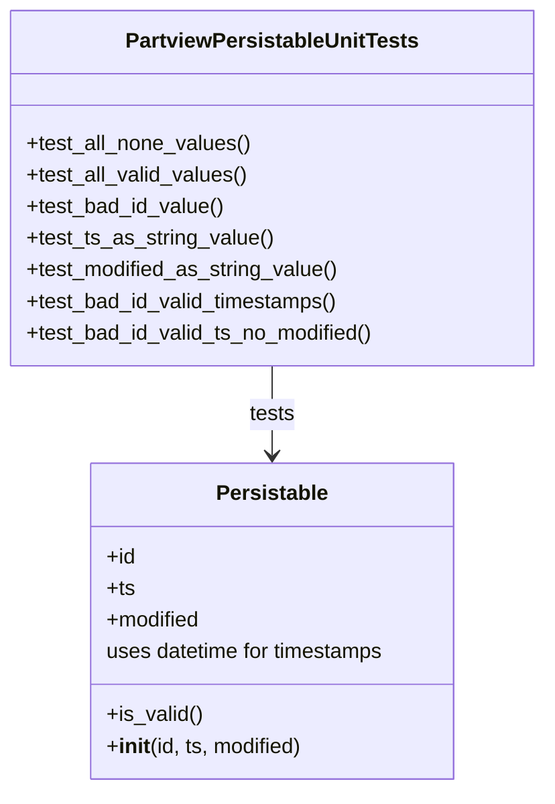

# Diagram: partview_core/partview_service/partview_service/tests/unit/core/datamodel/partview_persistable_test.py

> Auto-generated by Obscura crawlers

## Mermaid

### SVG

<svg id="container" width="414.5390625" xmlns="http://www.w3.org/2000/svg" class="classDiagram" height="600" viewBox="0 0 414.5390625 600" role="graphics-document document" aria-roledescription="class"><g><defs><marker id="container_class-aggregationStart" class="marker aggregation class" refX="18" refY="7" markerWidth="190" markerHeight="240" orient="auto"><path d="M 18,7 L9,13 L1,7 L9,1 Z"></path></marker></defs><defs><marker id="container_class-aggregationEnd" class="marker aggregation class" refX="1" refY="7" markerWidth="20" markerHeight="28" orient="auto"><path d="M 18,7 L9,13 L1,7 L9,1 Z"></path></marker></defs><defs><marker id="container_class-extensionStart" class="marker extension class" refX="18" refY="7" markerWidth="190" markerHeight="240" orient="auto"><path d="M 1,7 L18,13 V 1 Z"></path></marker></defs><defs><marker id="container_class-extensionEnd" class="marker extension class" refX="1" refY="7" markerWidth="20" markerHeight="28" orient="auto"><path d="M 1,1 V 13 L18,7 Z"></path></marker></defs><defs><marker id="container_class-compositionStart" class="marker composition class" refX="18" refY="7" markerWidth="190" markerHeight="240" orient="auto"><path d="M 18,7 L9,13 L1,7 L9,1 Z"></path></marker></defs><defs><marker id="container_class-compositionEnd" class="marker composition class" refX="1" refY="7" markerWidth="20" markerHeight="28" orient="auto"><path d="M 18,7 L9,13 L1,7 L9,1 Z"></path></marker></defs><defs><marker id="container_class-dependencyStart" class="marker dependency class" refX="6" refY="7" markerWidth="190" markerHeight="240" orient="auto"><path d="M 5,7 L9,13 L1,7 L9,1 Z"></path></marker></defs><defs><marker id="container_class-dependencyEnd" class="marker dependency class" refX="13" refY="7" markerWidth="20" markerHeight="28" orient="auto"><path d="M 18,7 L9,13 L14,7 L9,1 Z"></path></marker></defs><defs><marker id="container_class-lollipopStart" class="marker lollipop class" refX="13" refY="7" markerWidth="190" markerHeight="240" orient="auto"><circle stroke="black" fill="transparent" cx="7" cy="7" r="6"></circle></marker></defs><defs><marker id="container_class-lollipopEnd" class="marker lollipop class" refX="1" refY="7" markerWidth="190" markerHeight="240" orient="auto"><circle stroke="black" fill="transparent" cx="7" cy="7" r="6"></circle></marker></defs><g class="root"><g class="clusters"></g><g class="edgePaths"><path d="M207.27,278L207.27,284.167C207.27,290.333,207.27,302.667,207.27,314C207.27,325.333,207.27,335.667,207.27,340.833L207.27,346" id="id_PartviewPersistableUnitTests_Persistable_1" class="edge-thickness-normal edge-pattern-solid relation" style=";;;" data-edge="true" data-et="edge" data-id="id_PartviewPersistableUnitTests_Persistable_1" data-points="W3sieCI6MjA3LjI2OTUzMTI1LCJ5IjoyNzh9LHsieCI6MjA3LjI2OTUzMTI1LCJ5IjozMTV9LHsieCI6MjA3LjI2OTUzMTI1LCJ5IjozNTJ9XQ==" marker-end="url(#container_class-dependencyEnd)"></path></g><g class="edgeLabels"><g class="edgeLabel" transform="translate(207.26953125, 315)"><g class="label" data-id="id_PartviewPersistableUnitTests_Persistable_1" transform="translate(-17.4921875, -12)"><foreignObject width="34.984375" height="24">

tests

</foreignObject></g></g></g><g class="nodes"><g class="node default" id="classId-Persistable-0" transform="translate(207.26953125, 472)"><g class="basic label-container"><path d="M-140.94921875 -120 L140.94921875 -120 L140.94921875 120 L-140.94921875 120" stroke="none" stroke-width="0" fill="#ECECFF" style=""></path><path d="M-140.94921875 -120 C-62.69142420103259 -120, 15.566370347934821 -120, 140.94921875 -120 M-140.94921875 -120 C-40.30709147578544 -120, 60.33503579842912 -120, 140.94921875 -120 M140.94921875 -120 C140.94921875 -43.253936697914256, 140.94921875 33.49212660417149, 140.94921875 120 M140.94921875 -120 C140.94921875 -65.87688867342557, 140.94921875 -11.753777346851138, 140.94921875 120 M140.94921875 120 C71.95868896366821 120, 2.9681591773364175 120, -140.94921875 120 M140.94921875 120 C64.55436905438198 120, -11.840480641236041 120, -140.94921875 120 M-140.94921875 120 C-140.94921875 39.04680247800333, -140.94921875 -41.90639504399334, -140.94921875 -120 M-140.94921875 120 C-140.94921875 36.72357777657501, -140.94921875 -46.552844446849974, -140.94921875 -120" stroke="#9370DB" stroke-width="1.3" fill="none" stroke-dasharray="0 0" style=""></path></g><g class="annotation-group text" transform="translate(0, -96)"></g><g class="label-group text" transform="translate(-40.9765625, -96)"><g class="label" style="font-weight: bolder" transform="translate(0,-12)"><foreignObject width="81.953125" height="24">

Persistable

</foreignObject></g></g><g class="members-group text" transform="translate(-128.94921875, -48)"><g class="label" style="" transform="translate(0,-12)"><foreignObject width="22.078125" height="24">

+id

</foreignObject></g><g class="label" style="" transform="translate(0,12)"><foreignObject width="21.15625" height="24">

+ts

</foreignObject></g><g class="label" style="" transform="translate(0,36)"><foreignObject width="72.609375" height="24">

+modified

</foreignObject></g><g class="label" style="" transform="translate(0,60)"><foreignObject width="216.921875" height="24">

uses datetime for timestamps

</foreignObject></g></g><g class="methods-group text" transform="translate(-128.94921875, 72)"><g class="label" style="" transform="translate(0,-12)"><foreignObject width="72.796875" height="24">

+is_valid()

</foreignObject></g><g class="label" style="" transform="translate(0,12)"><foreignObject width="150.90625" height="24">

+<strong>init</strong>(id, ts, modified)

</foreignObject></g></g><g class="divider" style=""><path d="M-140.94921875 -72 C-68.49624471304344 -72, 3.956729323913123 -72, 140.94921875 -72 M-140.94921875 -72 C-52.199966486020514 -72, 36.54928577795897 -72, 140.94921875 -72" stroke="#9370DB" stroke-width="1.3" fill="none" stroke-dasharray="0 0" style=""></path></g><g class="divider" style=""><path d="M-140.94921875 48 C-42.357246438874924 48, 56.23472587225015 48, 140.94921875 48 M-140.94921875 48 C-56.7379576007512 48, 27.473303548497597 48, 140.94921875 48" stroke="#9370DB" stroke-width="1.3" fill="none" stroke-dasharray="0 0" style=""></path></g></g><g class="node default" id="classId-PartviewPersistableUnitTests-1" transform="translate(207.26953125, 143)"><g class="basic label-container"><path d="M-199.26953125 -135 L199.26953125 -135 L199.26953125 135 L-199.26953125 135" stroke="none" stroke-width="0" fill="#ECECFF" style=""></path><path d="M-199.26953125 -135 C-57.44260502190116 -135, 84.38432120619768 -135, 199.26953125 -135 M-199.26953125 -135 C-118.04593411213838 -135, -36.822336974276766 -135, 199.26953125 -135 M199.26953125 -135 C199.26953125 -29.676348796191974, 199.26953125 75.64730240761605, 199.26953125 135 M199.26953125 -135 C199.26953125 -47.104218182361436, 199.26953125 40.79156363527713, 199.26953125 135 M199.26953125 135 C45.979021780366395 135, -107.31148768926721 135, -199.26953125 135 M199.26953125 135 C90.05302473711085 135, -19.16348177577831 135, -199.26953125 135 M-199.26953125 135 C-199.26953125 71.73022642808074, -199.26953125 8.460452856161481, -199.26953125 -135 M-199.26953125 135 C-199.26953125 55.11887744310654, -199.26953125 -24.762245113786918, -199.26953125 -135" stroke="#9370DB" stroke-width="1.3" fill="none" stroke-dasharray="0 0" style=""></path></g><g class="annotation-group text" transform="translate(0, -111)"></g><g class="label-group text" transform="translate(-107.0546875, -111)"><g class="label" style="font-weight: bolder" transform="translate(0,-12)"><foreignObject width="214.109375" height="24">

PartviewPersistableUnitTests

</foreignObject></g></g><g class="members-group text" transform="translate(-187.26953125, -63)"></g><g class="methods-group text" transform="translate(-187.26953125, -33)"><g class="label" style="" transform="translate(0,-12)"><foreignObject width="170.71875" height="24">

+test_all_none_values()

</foreignObject></g><g class="label" style="" transform="translate(0,12)"><foreignObject width="168.671875" height="24">

+test_all_valid_values()

</foreignObject></g><g class="label" style="" transform="translate(0,36)"><foreignObject width="150.84375" height="24">

+test_bad_id_value()

</foreignObject></g><g class="label" style="" transform="translate(0,60)"><foreignObject width="187.140625" height="24">

+test_ts_as_string_value()

</foreignObject></g><g class="label" style="" transform="translate(0,84)"><foreignObject width="239.15625" height="24">

+test_modified_as_string_value()

</foreignObject></g><g class="label" style="" transform="translate(0,108)"><foreignObject width="240.140625" height="24">

+test_bad_id_valid_timestamps()

</foreignObject></g><g class="label" style="" transform="translate(0,132)"><foreignObject width="267.484375" height="24">

+test_bad_id_valid_ts_no_modified()

</foreignObject></g></g><g class="divider" style=""><path d="M-199.26953125 -87 C-41.83054921799015 -87, 115.6084328140197 -87, 199.26953125 -87 M-199.26953125 -87 C-47.364783919882626 -87, 104.53996341023475 -87, 199.26953125 -87" stroke="#9370DB" stroke-width="1.3" fill="none" stroke-dasharray="0 0" style=""></path></g><g class="divider" style=""><path d="M-199.26953125 -63 C-74.1070756886749 -63, 51.05537987265021 -63, 199.26953125 -63 M-199.26953125 -63 C-112.5186523688225 -63, -25.767773487645 -63, 199.26953125 -63" stroke="#9370DB" stroke-width="1.3" fill="none" stroke-dasharray="0 0" style=""></path></g></g></g></g></g></svg>
