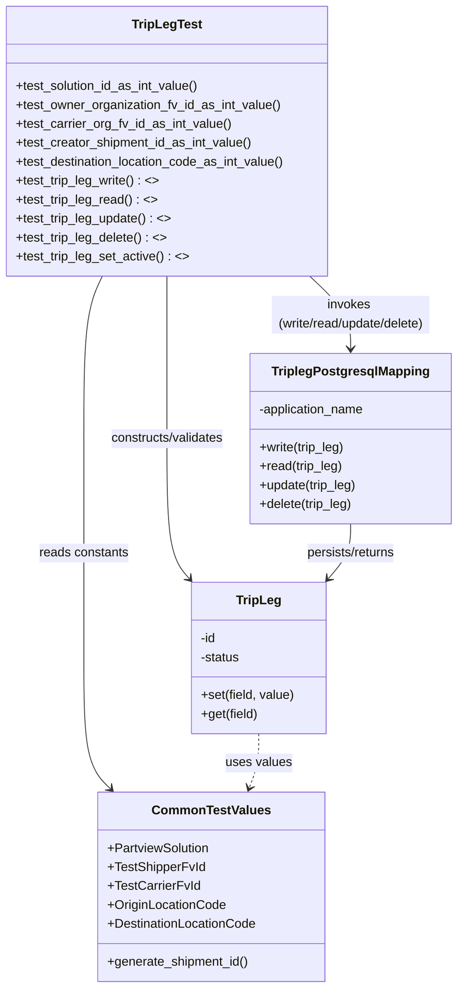
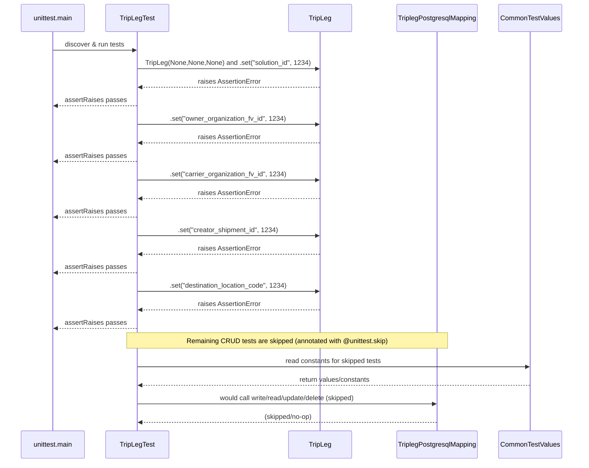

# Diagram: partview_core/partview_service/partview_service/tests/unit/core/datamodel/trip_leg_test.py

> Auto-generated by Obscura crawlers

## Diagram 1

### SVG

<svg id="container" width="588.34375" xmlns="http://www.w3.org/2000/svg" class="classDiagram" height="1252" viewBox="0 0 588.34375 1252" role="graphics-document document" aria-roledescription="class"><g><defs><marker id="container_class-aggregationStart" class="marker aggregation class" refX="18" refY="7" markerWidth="190" markerHeight="240" orient="auto"><path d="M 18,7 L9,13 L1,7 L9,1 Z"></path></marker></defs><defs><marker id="container_class-aggregationEnd" class="marker aggregation class" refX="1" refY="7" markerWidth="20" markerHeight="28" orient="auto"><path d="M 18,7 L9,13 L1,7 L9,1 Z"></path></marker></defs><defs><marker id="container_class-extensionStart" class="marker extension class" refX="18" refY="7" markerWidth="190" markerHeight="240" orient="auto"><path d="M 1,7 L18,13 V 1 Z"></path></marker></defs><defs><marker id="container_class-extensionEnd" class="marker extension class" refX="1" refY="7" markerWidth="20" markerHeight="28" orient="auto"><path d="M 1,1 V 13 L18,7 Z"></path></marker></defs><defs><marker id="container_class-compositionStart" class="marker composition class" refX="18" refY="7" markerWidth="190" markerHeight="240" orient="auto"><path d="M 18,7 L9,13 L1,7 L9,1 Z"></path></marker></defs><defs><marker id="container_class-compositionEnd" class="marker composition class" refX="1" refY="7" markerWidth="20" markerHeight="28" orient="auto"><path d="M 18,7 L9,13 L1,7 L9,1 Z"></path></marker></defs><defs><marker id="container_class-dependencyStart" class="marker dependency class" refX="6" refY="7" markerWidth="190" markerHeight="240" orient="auto"><path d="M 5,7 L9,13 L1,7 L9,1 Z"></path></marker></defs><defs><marker id="container_class-dependencyEnd" class="marker dependency class" refX="13" refY="7" markerWidth="20" markerHeight="28" orient="auto"><path d="M 18,7 L9,13 L14,7 L9,1 Z"></path></marker></defs><defs><marker id="container_class-lollipopStart" class="marker lollipop class" refX="13" refY="7" markerWidth="190" markerHeight="240" orient="auto"><circle stroke="black" fill="transparent" cx="7" cy="7" r="6"></circle></marker></defs><defs><marker id="container_class-lollipopEnd" class="marker lollipop class" refX="1" refY="7" markerWidth="190" markerHeight="240" orient="auto"><circle stroke="black" fill="transparent" cx="7" cy="7" r="6"></circle></marker></defs><g class="root"><g class="clusters"></g><g class="edgePaths"><path d="M213.781,350L213.781,358.167C213.781,366.333,213.781,382.667,213.781,417C213.781,451.333,213.781,503.667,213.781,554C213.781,604.333,213.781,652.667,218.748,682.383C223.714,712.099,233.646,723.198,238.613,728.748L243.579,734.297" id="id_TripLegTest_TripLeg_1" class="edge-thickness-normal edge-pattern-solid relation" style=";;;" data-edge="true" data-et="edge" data-id="id_TripLegTest_TripLeg_1" data-points="W3sieCI6MjEzLjc4MTI1LCJ5IjozNTB9LHsieCI6MjEzLjc4MTI1LCJ5IjozOTl9LHsieCI6MjEzLjc4MTI1LCJ5Ijo1NTZ9LHsieCI6MjEzLjc4MTI1LCJ5Ijo3MDF9LHsieCI6MjQ3LjU4MDA3ODEyNSwieSI6NzM4Ljc2ODM0MjExMjYwNDR9XQ==" marker-end="url(#container_class-dependencyEnd)"></path><path d="M398.806,350L407.642,358.167C416.478,366.333,434.151,382.667,442.988,398C451.824,413.333,451.824,427.667,451.824,434.833L451.824,442" id="id_TripLegTest_TriplegPostgresqlMapping_2" class="edge-thickness-normal edge-pattern-solid relation" style=";;;" data-edge="true" data-et="edge" data-id="id_TripLegTest_TriplegPostgresqlMapping_2" data-points="W3sieCI6Mzk4LjgwNTU1NzUyODQwOTA1LCJ5IjozNTB9LHsieCI6NDUxLjgyNDIxODc1LCJ5IjozOTl9LHsieCI6NDUxLjgyNDIxODc1LCJ5Ijo0NDh9XQ==" marker-end="url(#container_class-dependencyEnd)"></path><path d="M130.323,350L126.337,358.167C122.351,366.333,114.38,382.667,110.394,417C106.408,451.333,106.408,503.667,106.408,554C106.408,604.333,106.408,652.667,106.408,699C106.408,745.333,106.408,789.667,106.408,834C106.408,878.333,106.408,922.667,112.212,950.313C118.017,977.96,129.625,988.921,135.429,994.401L141.233,999.881" id="id_TripLegTest_CommonTestValues_3" class="edge-thickness-normal edge-pattern-solid relation" style=";;;" data-edge="true" data-et="edge" data-id="id_TripLegTest_CommonTestValues_3" data-points="W3sieCI6MTMwLjMyMzEwOTAxOTg4NjM3LCJ5IjozNTB9LHsieCI6MTA2LjQwODIwMzEyNSwieSI6Mzk5fSx7IngiOjEwNi40MDgyMDMxMjUsInkiOjU1Nn0seyJ4IjoxMDYuNDA4MjAzMTI1LCJ5Ijo3MDF9LHsieCI6MTA2LjQwODIwMzEyNSwieSI6ODM0fSx7IngiOjEwNi40MDgyMDMxMjUsInkiOjk2N30seyJ4IjoxNDUuNTk1OTY0MzcxMDE5MSwieSI6MTAwNH1d" marker-end="url(#container_class-dependencyEnd)"></path><path d="M451.824,664L451.824,670.167C451.824,676.333,451.824,688.667,446.858,700.383C441.892,712.099,431.959,723.198,426.993,728.748L422.027,734.297" id="id_TriplegPostgresqlMapping_TripLeg_4" class="edge-thickness-normal edge-pattern-solid relation" style=";;;" data-edge="true" data-et="edge" data-id="id_TriplegPostgresqlMapping_TripLeg_4" data-points="W3sieCI6NDUxLjgyNDIxODc1LCJ5Ijo2NjR9LHsieCI6NDUxLjgyNDIxODc1LCJ5Ijo3MDF9LHsieCI6NDE4LjAyNTM5MDYyNSwieSI6NzM4Ljc2ODM0MjExMjYwNDR9XQ==" marker-end="url(#container_class-dependencyEnd)"></path><path d="M332.803,930L332.803,936.167C332.803,942.333,332.803,954.667,330.799,966.066C328.796,977.466,324.789,987.931,322.785,993.164L320.782,998.397" id="id_TripLeg_CommonTestValues_5" class="edge-thickness-normal edge-pattern-dashed relation" style=";;;" data-edge="true" data-et="edge" data-id="id_TripLeg_CommonTestValues_5" data-points="W3sieCI6MzMyLjgwMjczNDM3NSwieSI6OTMwfSx7IngiOjMzMi44MDI3MzQzNzUsInkiOjk2N30seyJ4IjozMTguNjM2MzcwNDIxOTc0NSwieSI6MTAwNH1d" marker-end="url(#container_class-dependencyEnd)"></path></g><g class="edgeLabels"><g class="edgeLabel" transform="translate(213.78125, 556)"><g class="label" data-id="id_TripLegTest_TripLeg_1" transform="translate(-74.5234375, -12)"><foreignObject width="149.046875" height="24">

constructs/validates

</foreignObject></g></g><g class="edgeLabel" transform="translate(451.82421875, 399)"><g class="label" data-id="id_TripLegTest_TriplegPostgresqlMapping_2" transform="translate(-100, -24)"><foreignObject width="200" height="48">

invokes (write/read/update/delete)

</foreignObject></g></g><g class="edgeLabel" transform="translate(106.408203125, 701)"><g class="label" data-id="id_TripLegTest_CommonTestValues_3" transform="translate(-57.3828125, -12)"><foreignObject width="114.765625" height="24">

reads constants

</foreignObject></g></g><g class="edgeLabel" transform="translate(451.82421875, 701)"><g class="label" data-id="id_TriplegPostgresqlMapping_TripLeg_4" transform="translate(-58.6171875, -12)"><foreignObject width="117.234375" height="24">

persists/returns

</foreignObject></g></g><g class="edgeLabel" transform="translate(332.802734375, 967)"><g class="label" data-id="id_TripLeg_CommonTestValues_5" transform="translate(-41.7890625, -12)"><foreignObject width="83.578125" height="24">

uses values

</foreignObject></g></g></g><g class="nodes"><g class="node default" id="classId-TripLegTest-0" transform="translate(213.78125, 179)"><g class="basic label-container"><path d="M-205.78125 -171 L205.78125 -171 L205.78125 171 L-205.78125 171" stroke="none" stroke-width="0" fill="#ECECFF" style=""></path><path d="M-205.78125 -171 C-65.87585934445588 -171, 74.02953131108825 -171, 205.78125 -171 M-205.78125 -171 C-64.47272092487293 -171, 76.83580815025414 -171, 205.78125 -171 M205.78125 -171 C205.78125 -37.744423753356045, 205.78125 95.51115249328791, 205.78125 171 M205.78125 -171 C205.78125 -102.37117102493339, 205.78125 -33.74234204986678, 205.78125 171 M205.78125 171 C46.531736785200394 171, -112.71777642959921 171, -205.78125 171 M205.78125 171 C96.23668739142103 171, -13.307875217157942 171, -205.78125 171 M-205.78125 171 C-205.78125 43.76228141384598, -205.78125 -83.47543717230803, -205.78125 -171 M-205.78125 171 C-205.78125 101.9375630945594, -205.78125 32.87512618911879, -205.78125 -171" stroke="#9370DB" stroke-width="1.3" fill="none" stroke-dasharray="0 0" style=""></path></g><g class="annotation-group text" transform="translate(0, -147)"></g><g class="label-group text" transform="translate(-42.296875, -147)"><g class="label" style="font-weight: bolder" transform="translate(0,-12)"><foreignObject width="84.59375" height="24">

TripLegTest

</foreignObject></g></g><g class="members-group text" transform="translate(-193.78125, -99)"></g><g class="methods-group text" transform="translate(-193.78125, -69)"><g class="label" style="" transform="translate(0,-12)"><foreignObject width="234.734375" height="24">

+test_solution_id_as_int_value()

</foreignObject></g><g class="label" style="" transform="translate(0,12)"><foreignObject width="337.5" height="24">

+test_owner_organization_fv_id_as_int_value()

</foreignObject></g><g class="label" style="" transform="translate(0,36)"><foreignObject width="273.671875" height="24">

+test_carrier_org_fv_id_as_int_value()

</foreignObject></g><g class="label" style="" transform="translate(0,60)"><foreignObject width="301.734375" height="24">

+test_creator_shipment_id_as_int_value()

</foreignObject></g><g class="label" style="" transform="translate(0,84)"><foreignObject width="345.265625" height="24">

+test_destination_location_code_as_int_value()

</foreignObject></g><g class="label" style="" transform="translate(0,108)"><foreignObject width="182.046875" height="24">

+test_trip_leg_write() : &lt;&gt;

</foreignObject></g><g class="label" style="" transform="translate(0,132)"><foreignObject width="178.46875" height="24">

+test_trip_leg_read() : &lt;&gt;

</foreignObject></g><g class="label" style="" transform="translate(0,156)"><foreignObject width="196.96875" height="24">

+test_trip_leg_update() : &lt;&gt;

</foreignObject></g><g class="label" style="" transform="translate(0,180)"><foreignObject width="191.5" height="24">

+test_trip_leg_delete() : &lt;&gt;

</foreignObject></g><g class="label" style="" transform="translate(0,204)"><foreignObject width="219.078125" height="24">

+test_trip_leg_set_active() : &lt;&gt;

</foreignObject></g></g><g class="divider" style=""><path d="M-205.78125 -123 C-115.30019809854669 -123, -24.819146197093374 -123, 205.78125 -123 M-205.78125 -123 C-102.68219014682919 -123, 0.4168697063416289 -123, 205.78125 -123" stroke="#9370DB" stroke-width="1.3" fill="none" stroke-dasharray="0 0" style=""></path></g><g class="divider" style=""><path d="M-205.78125 -99 C-117.94000789557622 -99, -30.09876579115243 -99, 205.78125 -99 M-205.78125 -99 C-64.6864796271573 -99, 76.4082907456854 -99, 205.78125 -99" stroke="#9370DB" stroke-width="1.3" fill="none" stroke-dasharray="0 0" style=""></path></g></g><g class="node default" id="classId-TripLeg-1" transform="translate(332.802734375, 834)"><g class="basic label-container"><path d="M-85.22265625 -96 L85.22265625 -96 L85.22265625 96 L-85.22265625 96" stroke="none" stroke-width="0" fill="#ECECFF" style=""></path><path d="M-85.22265625 -96 C-21.297399375261172 -96, 42.627857499477656 -96, 85.22265625 -96 M-85.22265625 -96 C-19.87805321678472 -96, 45.46654981643056 -96, 85.22265625 -96 M85.22265625 -96 C85.22265625 -25.894855309623708, 85.22265625 44.210289380752585, 85.22265625 96 M85.22265625 -96 C85.22265625 -29.390337725802695, 85.22265625 37.21932454839461, 85.22265625 96 M85.22265625 96 C25.264466068511574 96, -34.69372411297685 96, -85.22265625 96 M85.22265625 96 C44.49318581232265 96, 3.763715374645301 96, -85.22265625 96 M-85.22265625 96 C-85.22265625 45.252716322516804, -85.22265625 -5.494567354966392, -85.22265625 -96 M-85.22265625 96 C-85.22265625 43.46526917047734, -85.22265625 -9.069461659045317, -85.22265625 -96" stroke="#9370DB" stroke-width="1.3" fill="none" stroke-dasharray="0 0" style=""></path></g><g class="annotation-group text" transform="translate(0, -72)"></g><g class="label-group text" transform="translate(-27.0546875, -72)"><g class="label" style="font-weight: bolder" transform="translate(0,-12)"><foreignObject width="54.109375" height="24">

TripLeg

</foreignObject></g></g><g class="members-group text" transform="translate(-73.22265625, -24)"><g class="label" style="" transform="translate(0,-12)"><foreignObject width="20.53125" height="24">

-id

</foreignObject></g><g class="label" style="" transform="translate(0,12)"><foreignObject width="50.859375" height="24">

-status

</foreignObject></g></g><g class="methods-group text" transform="translate(-73.22265625, 48)"><g class="label" style="" transform="translate(0,-12)"><foreignObject width="119.390625" height="24">

+set(field, value)

</foreignObject></g><g class="label" style="" transform="translate(0,12)"><foreignObject width="73.015625" height="24">

+get(field)

</foreignObject></g></g><g class="divider" style=""><path d="M-85.22265625 -48 C-46.78018983070733 -48, -8.337723411414657 -48, 85.22265625 -48 M-85.22265625 -48 C-37.15528350597085 -48, 10.9120892380583 -48, 85.22265625 -48" stroke="#9370DB" stroke-width="1.3" fill="none" stroke-dasharray="0 0" style=""></path></g><g class="divider" style=""><path d="M-85.22265625 24 C-43.547118433321565 24, -1.8715806166431292 24, 85.22265625 24 M-85.22265625 24 C-20.944747019590352 24, 43.333162210819296 24, 85.22265625 24" stroke="#9370DB" stroke-width="1.3" fill="none" stroke-dasharray="0 0" style=""></path></g></g><g class="node default" id="classId-TriplegPostgresqlMapping-2" transform="translate(451.82421875, 556)"><g class="basic label-container"><path d="M-128.51953125 -108 L128.51953125 -108 L128.51953125 108 L-128.51953125 108" stroke="none" stroke-width="0" fill="#ECECFF" style=""></path><path d="M-128.51953125 -108 C-62.49154861522 -108, 3.536434019560005 -108, 128.51953125 -108 M-128.51953125 -108 C-73.27554985585823 -108, -18.031568461716446 -108, 128.51953125 -108 M128.51953125 -108 C128.51953125 -57.48414287995257, 128.51953125 -6.968285759905143, 128.51953125 108 M128.51953125 -108 C128.51953125 -63.567280728337515, 128.51953125 -19.13456145667503, 128.51953125 108 M128.51953125 108 C73.46827839982564 108, 18.417025549651257 108, -128.51953125 108 M128.51953125 108 C50.999848689673286 108, -26.51983387065343 108, -128.51953125 108 M-128.51953125 108 C-128.51953125 38.29537127664976, -128.51953125 -31.40925744670048, -128.51953125 -108 M-128.51953125 108 C-128.51953125 33.57005056209461, -128.51953125 -40.859898875810785, -128.51953125 -108" stroke="#9370DB" stroke-width="1.3" fill="none" stroke-dasharray="0 0" style=""></path></g><g class="annotation-group text" transform="translate(0, -84)"></g><g class="label-group text" transform="translate(-95.8828125, -84)"><g class="label" style="font-weight: bolder" transform="translate(0,-12)"><foreignObject width="191.765625" height="24">

TriplegPostgresqlMapping

</foreignObject></g></g><g class="members-group text" transform="translate(-116.51953125, -36)"><g class="label" style="" transform="translate(0,-12)"><foreignObject width="137.15625" height="24">

-application_name

</foreignObject></g></g><g class="methods-group text" transform="translate(-116.51953125, 12)"><g class="label" style="" transform="translate(0,-12)"><foreignObject width="110.234375" height="24">

+write(trip_leg)

</foreignObject></g><g class="label" style="" transform="translate(0,12)"><foreignObject width="106.34375" height="24">

+read(trip_leg)

</foreignObject></g><g class="label" style="" transform="translate(0,36)"><foreignObject width="125.15625" height="24">

+update(trip_leg)

</foreignObject></g><g class="label" style="" transform="translate(0,60)"><foreignObject width="119.6875" height="24">

+delete(trip_leg)

</foreignObject></g></g><g class="divider" style=""><path d="M-128.51953125 -60 C-56.94547008946266 -60, 14.62859107107468 -60, 128.51953125 -60 M-128.51953125 -60 C-73.81256319346812 -60, -19.10559513693623 -60, 128.51953125 -60" stroke="#9370DB" stroke-width="1.3" fill="none" stroke-dasharray="0 0" style=""></path></g><g class="divider" style=""><path d="M-128.51953125 -12 C-64.25511110205397 -12, 0.009309045892052836 -12, 128.51953125 -12 M-128.51953125 -12 C-63.743862095918445 -12, 1.0318070581631105 -12, 128.51953125 -12" stroke="#9370DB" stroke-width="1.3" fill="none" stroke-dasharray="0 0" style=""></path></g></g><g class="node default" id="classId-CommonTestValues-3" transform="translate(272.69140625, 1124)"><g class="basic label-container"><path d="M-142.59765625 -120 L142.59765625 -120 L142.59765625 120 L-142.59765625 120" stroke="none" stroke-width="0" fill="#ECECFF" style=""></path><path d="M-142.59765625 -120 C-40.57214077273068 -120, 61.453374704538646 -120, 142.59765625 -120 M-142.59765625 -120 C-32.10422206751694 -120, 78.38921211496611 -120, 142.59765625 -120 M142.59765625 -120 C142.59765625 -35.84523101799999, 142.59765625 48.309537964000015, 142.59765625 120 M142.59765625 -120 C142.59765625 -64.26315136373637, 142.59765625 -8.52630272747274, 142.59765625 120 M142.59765625 120 C58.30468226657017 120, -25.988291716859663 120, -142.59765625 120 M142.59765625 120 C30.057999498403134 120, -82.48165725319373 120, -142.59765625 120 M-142.59765625 120 C-142.59765625 45.95045587679343, -142.59765625 -28.099088246413146, -142.59765625 -120 M-142.59765625 120 C-142.59765625 59.07560341849564, -142.59765625 -1.8487931630087218, -142.59765625 -120" stroke="#9370DB" stroke-width="1.3" fill="none" stroke-dasharray="0 0" style=""></path></g><g class="annotation-group text" transform="translate(0, -96)"></g><g class="label-group text" transform="translate(-70.9453125, -96)"><g class="label" style="font-weight: bolder" transform="translate(0,-12)"><foreignObject width="141.890625" height="24">

CommonTestValues

</foreignObject></g></g><g class="members-group text" transform="translate(-130.59765625, -48)"><g class="label" style="" transform="translate(0,-12)"><foreignObject width="130.625" height="24">

+PartviewSolution

</foreignObject></g><g class="label" style="" transform="translate(0,12)"><foreignObject width="122.515625" height="24">

+TestShipperFvId

</foreignObject></g><g class="label" style="" transform="translate(0,36)"><foreignObject width="115.265625" height="24">

+TestCarrierFvId

</foreignObject></g><g class="label" style="" transform="translate(0,60)"><foreignObject width="150.34375" height="24">

+OriginLocationCode

</foreignObject></g><g class="label" style="" transform="translate(0,84)"><foreignObject width="190.25" height="24">

+DestinationLocationCode

</foreignObject></g></g><g class="methods-group text" transform="translate(-130.59765625, 96)"><g class="label" style="" transform="translate(0,-12)"><foreignObject width="180.671875" height="24">

+generate_shipment_id()

</foreignObject></g></g><g class="divider" style=""><path d="M-142.59765625 -72 C-68.7678172038877 -72, 5.0620218422245955 -72, 142.59765625 -72 M-142.59765625 -72 C-43.893970261788624 -72, 54.80971572642275 -72, 142.59765625 -72" stroke="#9370DB" stroke-width="1.3" fill="none" stroke-dasharray="0 0" style=""></path></g><g class="divider" style=""><path d="M-142.59765625 72 C-43.288989596492854 72, 56.01967705701429 72, 142.59765625 72 M-142.59765625 72 C-59.85717999968239 72, 22.883296250635226 72, 142.59765625 72" stroke="#9370DB" stroke-width="1.3" fill="none" stroke-dasharray="0 0" style=""></path></g></g></g></g></g></svg>

## Diagram 2

### SVG

<svg id="container" width="1466" xmlns="http://www.w3.org/2000/svg" height="1180" viewBox="-50 -10 1466 1180" role="graphics-document document" aria-roledescription="sequence"><g><rect x="1206" y="1094" fill="#eaeaea" stroke="#666" width="160" height="65" name="CV" rx="3" ry="3" class="actor actor-bottom"></rect><text x="1286" y="1126.5" dominant-baseline="central" alignment-baseline="central" class="actor actor-box" style="text-anchor: middle; font-size: 16px; font-weight: 400;"><tspan x="1286" dy="0">CommonTestValues</tspan></text></g><g><rect x="948" y="1094" fill="#eaeaea" stroke="#666" width="208" height="65" name="Mapping" rx="3" ry="3" class="actor actor-bottom"></rect><text x="1052" y="1126.5" dominant-baseline="central" alignment-baseline="central" class="actor actor-box" style="text-anchor: middle; font-size: 16px; font-weight: 400;"><tspan x="1052" dy="0">TriplegPostgresqlMapping</tspan></text></g><g><rect x="675" y="1094" fill="#eaeaea" stroke="#666" width="150" height="65" name="TL" rx="3" ry="3" class="actor actor-bottom"></rect><text x="750" y="1126.5" dominant-baseline="central" alignment-baseline="central" class="actor actor-box" style="text-anchor: middle; font-size: 16px; font-weight: 400;"><tspan x="750" dy="0">TripLeg</tspan></text></g><g><rect x="215" y="1094" fill="#eaeaea" stroke="#666" width="150" height="65" name="Test" rx="3" ry="3" class="actor actor-bottom"></rect><text x="290" y="1126.5" dominant-baseline="central" alignment-baseline="central" class="actor actor-box" style="text-anchor: middle; font-size: 16px; font-weight: 400;"><tspan x="290" dy="0">TripLegTest</tspan></text></g><g><rect x="0" y="1094" fill="#eaeaea" stroke="#666" width="150" height="65" name="Runner" rx="3" ry="3" class="actor actor-bottom"></rect><text x="75" y="1126.5" dominant-baseline="central" alignment-baseline="central" class="actor actor-box" style="text-anchor: middle; font-size: 16px; font-weight: 400;"><tspan x="75" dy="0">unittest.main</tspan></text></g><g><line id="actor4" x1="1286" y1="65" x2="1286" y2="1094" class="actor-line 200" stroke-width="0.5px" stroke="#999" name="CV"></line><g id="root-4"><rect x="1206" y="0" fill="#eaeaea" stroke="#666" width="160" height="65" name="CV" rx="3" ry="3" class="actor actor-top"></rect><text x="1286" y="32.5" dominant-baseline="central" alignment-baseline="central" class="actor actor-box" style="text-anchor: middle; font-size: 16px; font-weight: 400;"><tspan x="1286" dy="0">CommonTestValues</tspan></text></g></g><g><line id="actor3" x1="1052" y1="65" x2="1052" y2="1094" class="actor-line 200" stroke-width="0.5px" stroke="#999" name="Mapping"></line><g id="root-3"><rect x="948" y="0" fill="#eaeaea" stroke="#666" width="208" height="65" name="Mapping" rx="3" ry="3" class="actor actor-top"></rect><text x="1052" y="32.5" dominant-baseline="central" alignment-baseline="central" class="actor actor-box" style="text-anchor: middle; font-size: 16px; font-weight: 400;"><tspan x="1052" dy="0">TriplegPostgresqlMapping</tspan></text></g></g><g><line id="actor2" x1="750" y1="65" x2="750" y2="1094" class="actor-line 200" stroke-width="0.5px" stroke="#999" name="TL"></line><g id="root-2"><rect x="675" y="0" fill="#eaeaea" stroke="#666" width="150" height="65" name="TL" rx="3" ry="3" class="actor actor-top"></rect><text x="750" y="32.5" dominant-baseline="central" alignment-baseline="central" class="actor actor-box" style="text-anchor: middle; font-size: 16px; font-weight: 400;"><tspan x="750" dy="0">TripLeg</tspan></text></g></g><g><line id="actor1" x1="290" y1="65" x2="290" y2="1094" class="actor-line 200" stroke-width="0.5px" stroke="#999" name="Test"></line><g id="root-1"><rect x="215" y="0" fill="#eaeaea" stroke="#666" width="150" height="65" name="Test" rx="3" ry="3" class="actor actor-top"></rect><text x="290" y="32.5" dominant-baseline="central" alignment-baseline="central" class="actor actor-box" style="text-anchor: middle; font-size: 16px; font-weight: 400;"><tspan x="290" dy="0">TripLegTest</tspan></text></g></g><g><line id="actor0" x1="75" y1="65" x2="75" y2="1094" class="actor-line 200" stroke-width="0.5px" stroke="#999" name="Runner"></line><g id="root-0"><rect x="0" y="0" fill="#eaeaea" stroke="#666" width="150" height="65" name="Runner" rx="3" ry="3" class="actor actor-top"></rect><text x="75" y="32.5" dominant-baseline="central" alignment-baseline="central" class="actor actor-box" style="text-anchor: middle; font-size: 16px; font-weight: 400;"><tspan x="75" dy="0">unittest.main</tspan></text></g></g><g></g><defs><symbol id="computer" width="24" height="24"><path transform="scale(.5)" d="M2 2v13h20v-13h-20zm18 11h-16v-9h16v9zm-10.228 6l.466-1h3.524l.467 1h-4.457zm14.228 3h-24l2-6h2.104l-1.33 4h18.45l-1.297-4h2.073l2 6zm-5-10h-14v-7h14v7z"></path></symbol></defs><defs><symbol id="database" fill-rule="evenodd" clip-rule="evenodd"><path transform="scale(.5)" d="M12.258.001l.256.004.255.005.253.008.251.01.249.012.247.015.246.016.242.019.241.02.239.023.236.024.233.027.231.028.229.031.225.032.223.034.22.036.217.038.214.04.211.041.208.043.205.045.201.046.198.048.194.05.191.051.187.053.183.054.18.056.175.057.172.059.168.06.163.061.16.063.155.064.15.066.074.033.073.033.071.034.07.034.069.035.068.035.067.035.066.035.064.036.064.036.062.036.06.036.06.037.058.037.058.037.055.038.055.038.053.038.052.038.051.039.05.039.048.039.047.039.045.04.044.04.043.04.041.04.04.041.039.041.037.041.036.041.034.041.033.042.032.042.03.042.029.042.027.042.026.043.024.043.023.043.021.043.02.043.018.044.017.043.015.044.013.044.012.044.011.045.009.044.007.045.006.045.004.045.002.045.001.045v17l-.001.045-.002.045-.004.045-.006.045-.007.045-.009.044-.011.045-.012.044-.013.044-.015.044-.017.043-.018.044-.02.043-.021.043-.023.043-.024.043-.026.043-.027.042-.029.042-.03.042-.032.042-.033.042-.034.041-.036.041-.037.041-.039.041-.04.041-.041.04-.043.04-.044.04-.045.04-.047.039-.048.039-.05.039-.051.039-.052.038-.053.038-.055.038-.055.038-.058.037-.058.037-.06.037-.06.036-.062.036-.064.036-.064.036-.066.035-.067.035-.068.035-.069.035-.07.034-.071.034-.073.033-.074.033-.15.066-.155.064-.16.063-.163.061-.168.06-.172.059-.175.057-.18.056-.183.054-.187.053-.191.051-.194.05-.198.048-.201.046-.205.045-.208.043-.211.041-.214.04-.217.038-.22.036-.223.034-.225.032-.229.031-.231.028-.233.027-.236.024-.239.023-.241.02-.242.019-.246.016-.247.015-.249.012-.251.01-.253.008-.255.005-.256.004-.258.001-.258-.001-.256-.004-.255-.005-.253-.008-.251-.01-.249-.012-.247-.015-.245-.016-.243-.019-.241-.02-.238-.023-.236-.024-.234-.027-.231-.028-.228-.031-.226-.032-.223-.034-.22-.036-.217-.038-.214-.04-.211-.041-.208-.043-.204-.045-.201-.046-.198-.048-.195-.05-.19-.051-.187-.053-.184-.054-.179-.056-.176-.057-.172-.059-.167-.06-.164-.061-.159-.063-.155-.064-.151-.066-.074-.033-.072-.033-.072-.034-.07-.034-.069-.035-.068-.035-.067-.035-.066-.035-.064-.036-.063-.036-.062-.036-.061-.036-.06-.037-.058-.037-.057-.037-.056-.038-.055-.038-.053-.038-.052-.038-.051-.039-.049-.039-.049-.039-.046-.039-.046-.04-.044-.04-.043-.04-.041-.04-.04-.041-.039-.041-.037-.041-.036-.041-.034-.041-.033-.042-.032-.042-.03-.042-.029-.042-.027-.042-.026-.043-.024-.043-.023-.043-.021-.043-.02-.043-.018-.044-.017-.043-.015-.044-.013-.044-.012-.044-.011-.045-.009-.044-.007-.045-.006-.045-.004-.045-.002-.045-.001-.045v-17l.001-.045.002-.045.004-.045.006-.045.007-.045.009-.044.011-.045.012-.044.013-.044.015-.044.017-.043.018-.044.02-.043.021-.043.023-.043.024-.043.026-.043.027-.042.029-.042.03-.042.032-.042.033-.042.034-.041.036-.041.037-.041.039-.041.04-.041.041-.04.043-.04.044-.04.046-.04.046-.039.049-.039.049-.039.051-.039.052-.038.053-.038.055-.038.056-.038.057-.037.058-.037.06-.037.061-.036.062-.036.063-.036.064-.036.066-.035.067-.035.068-.035.069-.035.07-.034.072-.034.072-.033.074-.033.151-.066.155-.064.159-.063.164-.061.167-.06.172-.059.176-.057.179-.056.184-.054.187-.053.19-.051.195-.05.198-.048.201-.046.204-.045.208-.043.211-.041.214-.04.217-.038.22-.036.223-.034.226-.032.228-.031.231-.028.234-.027.236-.024.238-.023.241-.02.243-.019.245-.016.247-.015.249-.012.251-.01.253-.008.255-.005.256-.004.258-.001.258.001zm-9.258 20.499v.01l.001.021.003.021.004.022.005.021.006.022.007.022.009.023.01.022.011.023.012.023.013.023.015.023.016.024.017.023.018.024.019.024.021.024.022.025.023.024.024.025.052.049.056.05.061.051.066.051.07.051.075.051.079.052.084.052.088.052.092.052.097.052.102.051.105.052.11.052.114.051.119.051.123.051.127.05.131.05.135.05.139.048.144.049.147.047.152.047.155.047.16.045.163.045.167.043.171.043.176.041.178.041.183.039.187.039.19.037.194.035.197.035.202.033.204.031.209.03.212.029.216.027.219.025.222.024.226.021.23.02.233.018.236.016.24.015.243.012.246.01.249.008.253.005.256.004.259.001.26-.001.257-.004.254-.005.25-.008.247-.011.244-.012.241-.014.237-.016.233-.018.231-.021.226-.021.224-.024.22-.026.216-.027.212-.028.21-.031.205-.031.202-.034.198-.034.194-.036.191-.037.187-.039.183-.04.179-.04.175-.042.172-.043.168-.044.163-.045.16-.046.155-.046.152-.047.148-.048.143-.049.139-.049.136-.05.131-.05.126-.05.123-.051.118-.052.114-.051.11-.052.106-.052.101-.052.096-.052.092-.052.088-.053.083-.051.079-.052.074-.052.07-.051.065-.051.06-.051.056-.05.051-.05.023-.024.023-.025.021-.024.02-.024.019-.024.018-.024.017-.024.015-.023.014-.024.013-.023.012-.023.01-.023.01-.022.008-.022.006-.022.006-.022.004-.022.004-.021.001-.021.001-.021v-4.127l-.077.055-.08.053-.083.054-.085.053-.087.052-.09.052-.093.051-.095.05-.097.05-.1.049-.102.049-.105.048-.106.047-.109.047-.111.046-.114.045-.115.045-.118.044-.12.043-.122.042-.124.042-.126.041-.128.04-.13.04-.132.038-.134.038-.135.037-.138.037-.139.035-.142.035-.143.034-.144.033-.147.032-.148.031-.15.03-.151.03-.153.029-.154.027-.156.027-.158.026-.159.025-.161.024-.162.023-.163.022-.165.021-.166.02-.167.019-.169.018-.169.017-.171.016-.173.015-.173.014-.175.013-.175.012-.177.011-.178.01-.179.008-.179.008-.181.006-.182.005-.182.004-.184.003-.184.002h-.37l-.184-.002-.184-.003-.182-.004-.182-.005-.181-.006-.179-.008-.179-.008-.178-.01-.176-.011-.176-.012-.175-.013-.173-.014-.172-.015-.171-.016-.17-.017-.169-.018-.167-.019-.166-.02-.165-.021-.163-.022-.162-.023-.161-.024-.159-.025-.157-.026-.156-.027-.155-.027-.153-.029-.151-.03-.15-.03-.148-.031-.146-.032-.145-.033-.143-.034-.141-.035-.14-.035-.137-.037-.136-.037-.134-.038-.132-.038-.13-.04-.128-.04-.126-.041-.124-.042-.122-.042-.12-.044-.117-.043-.116-.045-.113-.045-.112-.046-.109-.047-.106-.047-.105-.048-.102-.049-.1-.049-.097-.05-.095-.05-.093-.052-.09-.051-.087-.052-.085-.053-.083-.054-.08-.054-.077-.054v4.127zm0-5.654v.011l.001.021.003.021.004.021.005.022.006.022.007.022.009.022.01.022.011.023.012.023.013.023.015.024.016.023.017.024.018.024.019.024.021.024.022.024.023.025.024.024.052.05.056.05.061.05.066.051.07.051.075.052.079.051.084.052.088.052.092.052.097.052.102.052.105.052.11.051.114.051.119.052.123.05.127.051.131.05.135.049.139.049.144.048.147.048.152.047.155.046.16.045.163.045.167.044.171.042.176.042.178.04.183.04.187.038.19.037.194.036.197.034.202.033.204.032.209.03.212.028.216.027.219.025.222.024.226.022.23.02.233.018.236.016.24.014.243.012.246.01.249.008.253.006.256.003.259.001.26-.001.257-.003.254-.006.25-.008.247-.01.244-.012.241-.015.237-.016.233-.018.231-.02.226-.022.224-.024.22-.025.216-.027.212-.029.21-.03.205-.032.202-.033.198-.035.194-.036.191-.037.187-.039.183-.039.179-.041.175-.042.172-.043.168-.044.163-.045.16-.045.155-.047.152-.047.148-.048.143-.048.139-.05.136-.049.131-.05.126-.051.123-.051.118-.051.114-.052.11-.052.106-.052.101-.052.096-.052.092-.052.088-.052.083-.052.079-.052.074-.051.07-.052.065-.051.06-.05.056-.051.051-.049.023-.025.023-.024.021-.025.02-.024.019-.024.018-.024.017-.024.015-.023.014-.023.013-.024.012-.022.01-.023.01-.023.008-.022.006-.022.006-.022.004-.021.004-.022.001-.021.001-.021v-4.139l-.077.054-.08.054-.083.054-.085.052-.087.053-.09.051-.093.051-.095.051-.097.05-.1.049-.102.049-.105.048-.106.047-.109.047-.111.046-.114.045-.115.044-.118.044-.12.044-.122.042-.124.042-.126.041-.128.04-.13.039-.132.039-.134.038-.135.037-.138.036-.139.036-.142.035-.143.033-.144.033-.147.033-.148.031-.15.03-.151.03-.153.028-.154.028-.156.027-.158.026-.159.025-.161.024-.162.023-.163.022-.165.021-.166.02-.167.019-.169.018-.169.017-.171.016-.173.015-.173.014-.175.013-.175.012-.177.011-.178.009-.179.009-.179.007-.181.007-.182.005-.182.004-.184.003-.184.002h-.37l-.184-.002-.184-.003-.182-.004-.182-.005-.181-.007-.179-.007-.179-.009-.178-.009-.176-.011-.176-.012-.175-.013-.173-.014-.172-.015-.171-.016-.17-.017-.169-.018-.167-.019-.166-.02-.165-.021-.163-.022-.162-.023-.161-.024-.159-.025-.157-.026-.156-.027-.155-.028-.153-.028-.151-.03-.15-.03-.148-.031-.146-.033-.145-.033-.143-.033-.141-.035-.14-.036-.137-.036-.136-.037-.134-.038-.132-.039-.13-.039-.128-.04-.126-.041-.124-.042-.122-.043-.12-.043-.117-.044-.116-.044-.113-.046-.112-.046-.109-.046-.106-.047-.105-.048-.102-.049-.1-.049-.097-.05-.095-.051-.093-.051-.09-.051-.087-.053-.085-.052-.083-.054-.08-.054-.077-.054v4.139zm0-5.666v.011l.001.02.003.022.004.021.005.022.006.021.007.022.009.023.01.022.011.023.012.023.013.023.015.023.016.024.017.024.018.023.019.024.021.025.022.024.023.024.024.025.052.05.056.05.061.05.066.051.07.051.075.052.079.051.084.052.088.052.092.052.097.052.102.052.105.051.11.052.114.051.119.051.123.051.127.05.131.05.135.05.139.049.144.048.147.048.152.047.155.046.16.045.163.045.167.043.171.043.176.042.178.04.183.04.187.038.19.037.194.036.197.034.202.033.204.032.209.03.212.028.216.027.219.025.222.024.226.021.23.02.233.018.236.017.24.014.243.012.246.01.249.008.253.006.256.003.259.001.26-.001.257-.003.254-.006.25-.008.247-.01.244-.013.241-.014.237-.016.233-.018.231-.02.226-.022.224-.024.22-.025.216-.027.212-.029.21-.03.205-.032.202-.033.198-.035.194-.036.191-.037.187-.039.183-.039.179-.041.175-.042.172-.043.168-.044.163-.045.16-.045.155-.047.152-.047.148-.048.143-.049.139-.049.136-.049.131-.051.126-.05.123-.051.118-.052.114-.051.11-.052.106-.052.101-.052.096-.052.092-.052.088-.052.083-.052.079-.052.074-.052.07-.051.065-.051.06-.051.056-.05.051-.049.023-.025.023-.025.021-.024.02-.024.019-.024.018-.024.017-.024.015-.023.014-.024.013-.023.012-.023.01-.022.01-.023.008-.022.006-.022.006-.022.004-.022.004-.021.001-.021.001-.021v-4.153l-.077.054-.08.054-.083.053-.085.053-.087.053-.09.051-.093.051-.095.051-.097.05-.1.049-.102.048-.105.048-.106.048-.109.046-.111.046-.114.046-.115.044-.118.044-.12.043-.122.043-.124.042-.126.041-.128.04-.13.039-.132.039-.134.038-.135.037-.138.036-.139.036-.142.034-.143.034-.144.033-.147.032-.148.032-.15.03-.151.03-.153.028-.154.028-.156.027-.158.026-.159.024-.161.024-.162.023-.163.023-.165.021-.166.02-.167.019-.169.018-.169.017-.171.016-.173.015-.173.014-.175.013-.175.012-.177.01-.178.01-.179.009-.179.007-.181.006-.182.006-.182.004-.184.003-.184.001-.185.001-.185-.001-.184-.001-.184-.003-.182-.004-.182-.006-.181-.006-.179-.007-.179-.009-.178-.01-.176-.01-.176-.012-.175-.013-.173-.014-.172-.015-.171-.016-.17-.017-.169-.018-.167-.019-.166-.02-.165-.021-.163-.023-.162-.023-.161-.024-.159-.024-.157-.026-.156-.027-.155-.028-.153-.028-.151-.03-.15-.03-.148-.032-.146-.032-.145-.033-.143-.034-.141-.034-.14-.036-.137-.036-.136-.037-.134-.038-.132-.039-.13-.039-.128-.041-.126-.041-.124-.041-.122-.043-.12-.043-.117-.044-.116-.044-.113-.046-.112-.046-.109-.046-.106-.048-.105-.048-.102-.048-.1-.05-.097-.049-.095-.051-.093-.051-.09-.052-.087-.052-.085-.053-.083-.053-.08-.054-.077-.054v4.153zm8.74-8.179l-.257.004-.254.005-.25.008-.247.011-.244.012-.241.014-.237.016-.233.018-.231.021-.226.022-.224.023-.22.026-.216.027-.212.028-.21.031-.205.032-.202.033-.198.034-.194.036-.191.038-.187.038-.183.04-.179.041-.175.042-.172.043-.168.043-.163.045-.16.046-.155.046-.152.048-.148.048-.143.048-.139.049-.136.05-.131.05-.126.051-.123.051-.118.051-.114.052-.11.052-.106.052-.101.052-.096.052-.092.052-.088.052-.083.052-.079.052-.074.051-.07.052-.065.051-.06.05-.056.05-.051.05-.023.025-.023.024-.021.024-.02.025-.019.024-.018.024-.017.023-.015.024-.014.023-.013.023-.012.023-.01.023-.01.022-.008.022-.006.023-.006.021-.004.022-.004.021-.001.021-.001.021.001.021.001.021.004.021.004.022.006.021.006.023.008.022.01.022.01.023.012.023.013.023.014.023.015.024.017.023.018.024.019.024.02.025.021.024.023.024.023.025.051.05.056.05.06.05.065.051.07.052.074.051.079.052.083.052.088.052.092.052.096.052.101.052.106.052.11.052.114.052.118.051.123.051.126.051.131.05.136.05.139.049.143.048.148.048.152.048.155.046.16.046.163.045.168.043.172.043.175.042.179.041.183.04.187.038.191.038.194.036.198.034.202.033.205.032.21.031.212.028.216.027.22.026.224.023.226.022.231.021.233.018.237.016.241.014.244.012.247.011.25.008.254.005.257.004.26.001.26-.001.257-.004.254-.005.25-.008.247-.011.244-.012.241-.014.237-.016.233-.018.231-.021.226-.022.224-.023.22-.026.216-.027.212-.028.21-.031.205-.032.202-.033.198-.034.194-.036.191-.038.187-.038.183-.04.179-.041.175-.042.172-.043.168-.043.163-.045.16-.046.155-.046.152-.048.148-.048.143-.048.139-.049.136-.05.131-.05.126-.051.123-.051.118-.051.114-.052.11-.052.106-.052.101-.052.096-.052.092-.052.088-.052.083-.052.079-.052.074-.051.07-.052.065-.051.06-.05.056-.05.051-.05.023-.025.023-.024.021-.024.02-.025.019-.024.018-.024.017-.023.015-.024.014-.023.013-.023.012-.023.01-.023.01-.022.008-.022.006-.023.006-.021.004-.022.004-.021.001-.021.001-.021-.001-.021-.001-.021-.004-.021-.004-.022-.006-.021-.006-.023-.008-.022-.01-.022-.01-.023-.012-.023-.013-.023-.014-.023-.015-.024-.017-.023-.018-.024-.019-.024-.02-.025-.021-.024-.023-.024-.023-.025-.051-.05-.056-.05-.06-.05-.065-.051-.07-.052-.074-.051-.079-.052-.083-.052-.088-.052-.092-.052-.096-.052-.101-.052-.106-.052-.11-.052-.114-.052-.118-.051-.123-.051-.126-.051-.131-.05-.136-.05-.139-.049-.143-.048-.148-.048-.152-.048-.155-.046-.16-.046-.163-.045-.168-.043-.172-.043-.175-.042-.179-.041-.183-.04-.187-.038-.191-.038-.194-.036-.198-.034-.202-.033-.205-.032-.21-.031-.212-.028-.216-.027-.22-.026-.224-.023-.226-.022-.231-.021-.233-.018-.237-.016-.241-.014-.244-.012-.247-.011-.25-.008-.254-.005-.257-.004-.26-.001-.26.001z"></path></symbol></defs><defs><symbol id="clock" width="24" height="24"><path transform="scale(.5)" d="M12 2c5.514 0 10 4.486 10 10s-4.486 10-10 10-10-4.486-10-10 4.486-10 10-10zm0-2c-6.627 0-12 5.373-12 12s5.373 12 12 12 12-5.373 12-12-5.373-12-12-12zm5.848 12.459c.202.038.202.333.001.372-1.907.361-6.045 1.111-6.547 1.111-.719 0-1.301-.582-1.301-1.301 0-.512.77-5.447 1.125-7.445.034-.192.312-.181.343.014l.985 6.238 5.394 1.011z"></path></symbol></defs><defs><marker id="arrowhead" refX="7.9" refY="5" markerUnits="userSpaceOnUse" markerWidth="12" markerHeight="12" orient="auto-start-reverse"><path d="M -1 0 L 10 5 L 0 10 z"></path></marker></defs><defs><marker id="crosshead" markerWidth="15" markerHeight="8" orient="auto" refX="4" refY="4.5"><path fill="none" stroke="#000000" stroke-width="1pt" d="M 1,2 L 6,7 M 6,2 L 1,7" style="stroke-dasharray: 0, 0;"></path></marker></defs><defs><marker id="filled-head" refX="15.5" refY="7" markerWidth="20" markerHeight="28" orient="auto"><path d="M 18,7 L9,13 L14,7 L9,1 Z"></path></marker></defs><defs><marker id="sequencenumber" refX="15" refY="15" markerWidth="60" markerHeight="40" orient="auto"><circle cx="15" cy="15" r="6"></circle></marker></defs><g><rect x="265" y="843" fill="#EDF2AE" stroke="#666" width="812" height="39" class="note"></rect><text x="671" y="848" text-anchor="middle" dominant-baseline="middle" alignment-baseline="middle" class="noteText" dy="1em" style="font-size: 16px; font-weight: 400;"><tspan x="671">Remaining CRUD tests are skipped (annotated with @unittest.skip)</tspan></text></g><text x="181" y="80" text-anchor="middle" dominant-baseline="middle" alignment-baseline="middle" class="messageText" dy="1em" style="font-size: 16px; font-weight: 400;">discover &amp; run tests</text><line x1="76" y1="113" x2="286" y2="113" class="messageLine0" stroke-width="2" stroke="none" marker-end="url(#arrowhead)" style="fill: none;"></line><text x="519" y="128" text-anchor="middle" dominant-baseline="middle" alignment-baseline="middle" class="messageText" dy="1em" style="font-size: 16px; font-weight: 400;">TripLeg(None,None,None) and .set("solution_id", 1234)</text><line x1="291" y1="161" x2="746" y2="161" class="messageLine0" stroke-width="2" stroke="none" marker-end="url(#arrowhead)" style="fill: none;"></line><text x="522" y="176" text-anchor="middle" dominant-baseline="middle" alignment-baseline="middle" class="messageText" dy="1em" style="font-size: 16px; font-weight: 400;">raises AssertionError</text><line x1="749" y1="209" x2="294" y2="209" class="messageLine1" stroke-width="2" stroke="none" marker-end="url(#arrowhead)" style="stroke-dasharray: 3, 3; fill: none;"></line><text x="184" y="224" text-anchor="middle" dominant-baseline="middle" alignment-baseline="middle" class="messageText" dy="1em" style="font-size: 16px; font-weight: 400;">assertRaises passes</text><line x1="289" y1="257" x2="79" y2="257" class="messageLine1" stroke-width="2" stroke="none" marker-end="url(#arrowhead)" style="stroke-dasharray: 3, 3; fill: none;"></line><text x="519" y="272" text-anchor="middle" dominant-baseline="middle" alignment-baseline="middle" class="messageText" dy="1em" style="font-size: 16px; font-weight: 400;">.set("owner_organization_fv_id", 1234)</text><line x1="291" y1="305" x2="746" y2="305" class="messageLine0" stroke-width="2" stroke="none" marker-end="url(#arrowhead)" style="fill: none;"></line><text x="522" y="320" text-anchor="middle" dominant-baseline="middle" alignment-baseline="middle" class="messageText" dy="1em" style="font-size: 16px; font-weight: 400;">raises AssertionError</text><line x1="749" y1="353" x2="294" y2="353" class="messageLine1" stroke-width="2" stroke="none" marker-end="url(#arrowhead)" style="stroke-dasharray: 3, 3; fill: none;"></line><text x="184" y="368" text-anchor="middle" dominant-baseline="middle" alignment-baseline="middle" class="messageText" dy="1em" style="font-size: 16px; font-weight: 400;">assertRaises passes</text><line x1="289" y1="401" x2="79" y2="401" class="messageLine1" stroke-width="2" stroke="none" marker-end="url(#arrowhead)" style="stroke-dasharray: 3, 3; fill: none;"></line><text x="519" y="416" text-anchor="middle" dominant-baseline="middle" alignment-baseline="middle" class="messageText" dy="1em" style="font-size: 16px; font-weight: 400;">.set("carrier_organization_fv_id", 1234)</text><line x1="291" y1="449" x2="746" y2="449" class="messageLine0" stroke-width="2" stroke="none" marker-end="url(#arrowhead)" style="fill: none;"></line><text x="522" y="464" text-anchor="middle" dominant-baseline="middle" alignment-baseline="middle" class="messageText" dy="1em" style="font-size: 16px; font-weight: 400;">raises AssertionError</text><line x1="749" y1="497" x2="294" y2="497" class="messageLine1" stroke-width="2" stroke="none" marker-end="url(#arrowhead)" style="stroke-dasharray: 3, 3; fill: none;"></line><text x="184" y="512" text-anchor="middle" dominant-baseline="middle" alignment-baseline="middle" class="messageText" dy="1em" style="font-size: 16px; font-weight: 400;">assertRaises passes</text><line x1="289" y1="545" x2="79" y2="545" class="messageLine1" stroke-width="2" stroke="none" marker-end="url(#arrowhead)" style="stroke-dasharray: 3, 3; fill: none;"></line><text x="519" y="560" text-anchor="middle" dominant-baseline="middle" alignment-baseline="middle" class="messageText" dy="1em" style="font-size: 16px; font-weight: 400;">.set("creator_shipment_id", 1234)</text><line x1="291" y1="593" x2="746" y2="593" class="messageLine0" stroke-width="2" stroke="none" marker-end="url(#arrowhead)" style="fill: none;"></line><text x="522" y="608" text-anchor="middle" dominant-baseline="middle" alignment-baseline="middle" class="messageText" dy="1em" style="font-size: 16px; font-weight: 400;">raises AssertionError</text><line x1="749" y1="641" x2="294" y2="641" class="messageLine1" stroke-width="2" stroke="none" marker-end="url(#arrowhead)" style="stroke-dasharray: 3, 3; fill: none;"></line><text x="184" y="656" text-anchor="middle" dominant-baseline="middle" alignment-baseline="middle" class="messageText" dy="1em" style="font-size: 16px; font-weight: 400;">assertRaises passes</text><line x1="289" y1="689" x2="79" y2="689" class="messageLine1" stroke-width="2" stroke="none" marker-end="url(#arrowhead)" style="stroke-dasharray: 3, 3; fill: none;"></line><text x="519" y="704" text-anchor="middle" dominant-baseline="middle" alignment-baseline="middle" class="messageText" dy="1em" style="font-size: 16px; font-weight: 400;">.set("destination_location_code", 1234)</text><line x1="291" y1="737" x2="746" y2="737" class="messageLine0" stroke-width="2" stroke="none" marker-end="url(#arrowhead)" style="fill: none;"></line><text x="522" y="752" text-anchor="middle" dominant-baseline="middle" alignment-baseline="middle" class="messageText" dy="1em" style="font-size: 16px; font-weight: 400;">raises AssertionError</text><line x1="749" y1="785" x2="294" y2="785" class="messageLine1" stroke-width="2" stroke="none" marker-end="url(#arrowhead)" style="stroke-dasharray: 3, 3; fill: none;"></line><text x="184" y="800" text-anchor="middle" dominant-baseline="middle" alignment-baseline="middle" class="messageText" dy="1em" style="font-size: 16px; font-weight: 400;">assertRaises passes</text><line x1="289" y1="833" x2="79" y2="833" class="messageLine1" stroke-width="2" stroke="none" marker-end="url(#arrowhead)" style="stroke-dasharray: 3, 3; fill: none;"></line><text x="787" y="897" text-anchor="middle" dominant-baseline="middle" alignment-baseline="middle" class="messageText" dy="1em" style="font-size: 16px; font-weight: 400;">read constants for skipped tests</text><line x1="291" y1="930" x2="1282" y2="930" class="messageLine0" stroke-width="2" stroke="none" marker-end="url(#arrowhead)" style="fill: none;"></line><text x="790" y="945" text-anchor="middle" dominant-baseline="middle" alignment-baseline="middle" class="messageText" dy="1em" style="font-size: 16px; font-weight: 400;">return values/constants</text><line x1="1285" y1="978" x2="294" y2="978" class="messageLine1" stroke-width="2" stroke="none" marker-end="url(#arrowhead)" style="stroke-dasharray: 3, 3; fill: none;"></line><text x="670" y="993" text-anchor="middle" dominant-baseline="middle" alignment-baseline="middle" class="messageText" dy="1em" style="font-size: 16px; font-weight: 400;">would call write/read/update/delete (skipped)</text><line x1="291" y1="1026" x2="1048" y2="1026" class="messageLine0" stroke-width="2" stroke="none" marker-end="url(#arrowhead)" style="fill: none;"></line><text x="673" y="1041" text-anchor="middle" dominant-baseline="middle" alignment-baseline="middle" class="messageText" dy="1em" style="font-size: 16px; font-weight: 400;">(skipped/no-op)</text><line x1="1051" y1="1074" x2="294" y2="1074" class="messageLine1" stroke-width="2" stroke="none" marker-end="url(#arrowhead)" style="stroke-dasharray: 3, 3; fill: none;"></line></svg>
