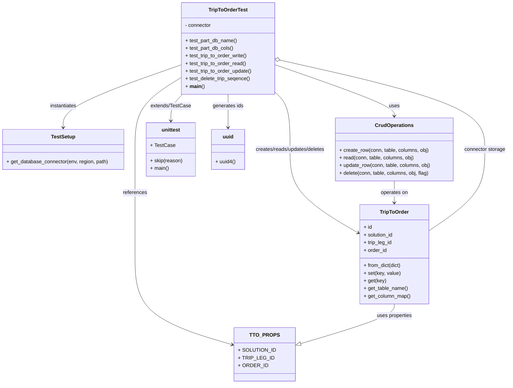

# Diagram: partview_core/partview_service/partview_service/tests/unit/core/datamodel/trip_to_order_test.py

> Auto-generated by Obscura crawlers

## Mermaid

### SVG

<svg id="container" width="1610.2109375" xmlns="http://www.w3.org/2000/svg" class="classDiagram" height="1204" viewBox="0 0 1610.2109375 1204" role="graphics-document document" aria-roledescription="class"><g><defs><marker id="container_class-aggregationStart" class="marker aggregation class" refX="18" refY="7" markerWidth="190" markerHeight="240" orient="auto"><path d="M 18,7 L9,13 L1,7 L9,1 Z"></path></marker></defs><defs><marker id="container_class-aggregationEnd" class="marker aggregation class" refX="1" refY="7" markerWidth="20" markerHeight="28" orient="auto"><path d="M 18,7 L9,13 L1,7 L9,1 Z"></path></marker></defs><defs><marker id="container_class-extensionStart" class="marker extension class" refX="18" refY="7" markerWidth="190" markerHeight="240" orient="auto"><path d="M 1,7 L18,13 V 1 Z"></path></marker></defs><defs><marker id="container_class-extensionEnd" class="marker extension class" refX="1" refY="7" markerWidth="20" markerHeight="28" orient="auto"><path d="M 1,1 V 13 L18,7 Z"></path></marker></defs><defs><marker id="container_class-compositionStart" class="marker composition class" refX="18" refY="7" markerWidth="190" markerHeight="240" orient="auto"><path d="M 18,7 L9,13 L1,7 L9,1 Z"></path></marker></defs><defs><marker id="container_class-compositionEnd" class="marker composition class" refX="1" refY="7" markerWidth="20" markerHeight="28" orient="auto"><path d="M 18,7 L9,13 L1,7 L9,1 Z"></path></marker></defs><defs><marker id="container_class-dependencyStart" class="marker dependency class" refX="6" refY="7" markerWidth="190" markerHeight="240" orient="auto"><path d="M 5,7 L9,13 L1,7 L9,1 Z"></path></marker></defs><defs><marker id="container_class-dependencyEnd" class="marker dependency class" refX="13" refY="7" markerWidth="20" markerHeight="28" orient="auto"><path d="M 18,7 L9,13 L14,7 L9,1 Z"></path></marker></defs><defs><marker id="container_class-lollipopStart" class="marker lollipop class" refX="13" refY="7" markerWidth="190" markerHeight="240" orient="auto"><circle stroke="black" fill="transparent" cx="7" cy="7" r="6"></circle></marker></defs><defs><marker id="container_class-lollipopEnd" class="marker lollipop class" refX="1" refY="7" markerWidth="190" markerHeight="240" orient="auto"><circle stroke="black" fill="transparent" cx="7" cy="7" r="6"></circle></marker></defs><g class="root"><g class="clusters"></g><g class="edgePaths"><path d="M568.309,203.631L506.727,225.192C445.146,246.754,321.983,289.877,260.402,322.605C198.82,355.333,198.82,377.667,198.82,388.833L198.82,400" id="id_TripToOrderTest_TestSetup_1" class="edge-thickness-normal edge-pattern-solid relation" style=";;;" data-edge="true" data-et="edge" data-id="id_TripToOrderTest_TestSetup_1" data-points="W3sieCI6NTY4LjMwODU5Mzc1LCJ5IjoyMDMuNjMwNjYwNjUxODEwODd9LHsieCI6MTk4LjgyMDMxMjUsInkiOjMzM30seyJ4IjoxOTguODIwMzEyNSwieSI6NDA2fV0=" marker-end="url(#container_class-dependencyEnd)"></path><path d="M863.23,201.853L927.884,223.711C992.538,245.569,1121.845,289.284,1186.499,316.309C1251.152,343.333,1251.152,353.667,1251.152,358.833L1251.152,364" id="id_TripToOrderTest_CrudOperations_2" class="edge-thickness-normal edge-pattern-solid relation" style=";;;" data-edge="true" data-et="edge" data-id="id_TripToOrderTest_CrudOperations_2" data-points="W3sieCI6ODYzLjIzMDQ2ODc1LCJ5IjoyMDEuODUyOTgxOTQ5MjQ3NzV9LHsieCI6MTI1MS4xNTIzNDM3NSwieSI6MzMzfSx7IngiOjEyNTEuMTUyMzQzNzUsInkiOjM3MH1d" marker-end="url(#container_class-dependencyEnd)"></path><path d="M863.23,284.879L872.131,292.899C881.031,300.919,898.832,316.96,907.732,347.646C916.633,378.333,916.633,423.667,916.633,469C916.633,514.333,916.633,559.667,953.607,603.666C990.581,647.664,1064.53,690.329,1101.504,711.661L1138.479,732.993" id="id_TripToOrderTest_TripToOrder_3" class="edge-thickness-normal edge-pattern-solid relation" style=";;;" data-edge="true" data-et="edge" data-id="id_TripToOrderTest_TripToOrder_3" data-points="W3sieCI6ODYzLjIzMDQ2ODc1LCJ5IjoyODQuODc4NTkwNDU5MTUwOX0seyJ4Ijo5MTYuNjMyODEyNSwieSI6MzMzfSx7IngiOjkxNi42MzI4MTI1LCJ5Ijo0Njl9LHsieCI6OTE2LjYzMjgxMjUsInkiOjYwNX0seyJ4IjoxMTQzLjY3NTc4MTI1LCJ5Ijo3MzUuOTkxNzMyNTQ1NTExOX1d" marker-end="url(#container_class-dependencyEnd)"></path><path d="M568.309,243.679L544.364,258.566C520.419,273.453,472.53,303.226,448.585,340.78C424.641,378.333,424.641,423.667,424.641,469C424.641,514.333,424.641,559.667,424.641,614.5C424.641,669.333,424.641,733.667,424.641,798C424.641,862.333,424.641,926.667,478.003,974.458C531.365,1022.249,638.09,1053.497,691.452,1069.121L744.814,1084.746" id="id_TripToOrderTest_TTO_PROPS_4" class="edge-thickness-normal edge-pattern-solid relation" style=";;;" data-edge="true" data-et="edge" data-id="id_TripToOrderTest_TTO_PROPS_4" data-points="W3sieCI6NTY4LjMwODU5Mzc1LCJ5IjoyNDMuNjc5MDc3OTQyODE0MjJ9LHsieCI6NDI0LjY0MDYyNSwieSI6MzMzfSx7IngiOjQyNC42NDA2MjUsInkiOjQ2OX0seyJ4Ijo0MjQuNjQwNjI1LCJ5Ijo2MDV9LHsieCI6NDI0LjY0MDYyNSwieSI6Nzk4fSx7IngiOjQyNC42NDA2MjUsInkiOjk5MX0seyJ4Ijo3NTAuNTcyMjY1NjI1LCJ5IjoxMDg2LjQzMTc0Njc1MTkyN31d" marker-end="url(#container_class-dependencyEnd)"></path><path d="M573.305,296L567.204,302.167C561.103,308.333,548.901,320.667,542.8,334.5C536.699,348.333,536.699,363.667,536.699,371.333L536.699,379" id="id_TripToOrderTest_unittest_5" class="edge-thickness-normal edge-pattern-solid relation" style=";;;" data-edge="true" data-et="edge" data-id="id_TripToOrderTest_unittest_5" data-points="W3sieCI6NTczLjMwNDc1MjI0NDQ3NTEsInkiOjI5Nn0seyJ4Ijo1MzYuNjk5MjE4NzUsInkiOjMzM30seyJ4Ijo1MzYuNjk5MjE4NzUsInkiOjM4NX1d" marker-end="url(#container_class-dependencyEnd)"></path><path d="M715.77,296L715.77,302.167C715.77,308.333,715.77,320.667,715.77,338C715.77,355.333,715.77,377.667,715.77,388.833L715.77,400" id="id_TripToOrderTest_uuid_6" class="edge-thickness-normal edge-pattern-solid relation" style=";;;" data-edge="true" data-et="edge" data-id="id_TripToOrderTest_uuid_6" data-points="W3sieCI6NzE1Ljc2OTUzMTI1LCJ5IjoyOTZ9LHsieCI6NzE1Ljc2OTUzMTI1LCJ5IjozMzN9LHsieCI6NzE1Ljc2OTUzMTI1LCJ5Ijo0MDZ9XQ==" marker-end="url(#container_class-dependencyEnd)"></path><path d="M1251.152,568L1251.152,574.167C1251.152,580.333,1251.152,592.667,1251.152,604C1251.152,615.333,1251.152,625.667,1251.152,630.833L1251.152,636" id="id_CrudOperations_TripToOrder_7" class="edge-thickness-normal edge-pattern-solid relation" style=";;;" data-edge="true" data-et="edge" data-id="id_CrudOperations_TripToOrder_7" data-points="W3sieCI6MTI1MS4xNTIzNDM3NSwieSI6NTY4fSx7IngiOjEyNTEuMTUyMzQzNzUsInkiOjYwNX0seyJ4IjoxMjUxLjE1MjM0Mzc1LCJ5Ijo2NDJ9XQ==" marker-end="url(#container_class-dependencyEnd)"></path><path d="M1251.152,954L1251.152,960.167C1251.152,966.333,1251.152,978.667,1199.59,999.931C1148.027,1021.195,1044.901,1051.39,993.338,1066.487L941.776,1081.585" id="id_TripToOrder_TTO_PROPS_8" class="edge-thickness-normal edge-pattern-solid relation" style=";;;" data-edge="true" data-et="edge" data-id="id_TripToOrder_TTO_PROPS_8" data-points="W3sieCI6MTI1MS4xNTIzNDM3NSwieSI6OTU0fSx7IngiOjEyNTEuMTUyMzQzNzUsInkiOjk5MX0seyJ4Ijo5MjUuMjIwNzAzMTI1LCJ5IjoxMDg2LjQzMTc0Njc1MTkyN31d" marker-end="url(#container_class-extensionEnd)"></path><path d="M880.076,188.213L989.566,212.344C1099.056,236.475,1318.036,284.738,1427.526,331.535C1537.016,378.333,1537.016,423.667,1537.016,469C1537.016,514.333,1537.016,559.667,1507.285,602.406C1477.553,645.146,1418.091,685.292,1388.36,705.365L1358.629,725.437" id="id_TripToOrderTest_TripToOrder_9" class="edge-thickness-normal edge-pattern-solid relation" style=";;;" data-edge="true" data-et="edge" data-id="id_TripToOrderTest_TripToOrder_9" data-points="W3sieCI6ODYzLjIzMDQ2ODc1LCJ5IjoxODQuNDk5OTE2NzYxNDAwMTN9LHsieCI6MTUzNy4wMTU2MjUsInkiOjMzM30seyJ4IjoxNTM3LjAxNTYyNSwieSI6NDY5fSx7IngiOjE1MzcuMDE1NjI1LCJ5Ijo2MDV9LHsieCI6MTM1OC42Mjg5MDYyNSwieSI6NzI1LjQzNzQyMjI4MTczOTh9XQ==" marker-start="url(#container_class-aggregationStart)"></path></g><g class="edgeLabels"><g class="edgeLabel" transform="translate(198.8203125, 333)"><g class="label" data-id="id_TripToOrderTest_TestSetup_1" transform="translate(-42.9140625, -12)"><foreignObject width="85.828125" height="24">

instantiates

</foreignObject></g></g><g class="edgeLabel" transform="translate(1251.15234375, 333)"><g class="label" data-id="id_TripToOrderTest_CrudOperations_2" transform="translate(-16.4921875, -12)"><foreignObject width="32.984375" height="24">

uses

</foreignObject></g></g><g class="edgeLabel" transform="translate(916.6328125, 469)"><g class="label" data-id="id_TripToOrderTest_TripToOrder_3" transform="translate(-113.8515625, -12)"><foreignObject width="227.703125" height="24">

creates/reads/updates/deletes

</foreignObject></g></g><g class="edgeLabel" transform="translate(424.640625, 605)"><g class="label" data-id="id_TripToOrderTest_TTO_PROPS_4" transform="translate(-37.828125, -12)"><foreignObject width="75.65625" height="24">

references

</foreignObject></g></g><g class="edgeLabel" transform="translate(536.69921875, 333)"><g class="label" data-id="id_TripToOrderTest_unittest_5" transform="translate(-64.1171875, -12)"><foreignObject width="128.234375" height="24">

extends/TestCase

</foreignObject></g></g><g class="edgeLabel" transform="translate(715.76953125, 333)"><g class="label" data-id="id_TripToOrderTest_uuid_6" transform="translate(-48.3671875, -12)"><foreignObject width="96.734375" height="24">

generates ids

</foreignObject></g></g><g class="edgeLabel" transform="translate(1251.15234375, 605)"><g class="label" data-id="id_CrudOperations_TripToOrder_7" transform="translate(-43.2890625, -12)"><foreignObject width="86.578125" height="24">

operates on

</foreignObject></g></g><g class="edgeLabel" transform="translate(1251.15234375, 991)"><g class="label" data-id="id_TripToOrder_TTO_PROPS_8" transform="translate(-56.3203125, -12)"><foreignObject width="112.640625" height="24">

uses properties

</foreignObject></g></g><g class="edgeLabel" transform="translate(1537.015625, 469)"><g class="label" data-id="id_TripToOrderTest_TripToOrder_9" transform="translate(-65.1953125, -12)"><foreignObject width="130.390625" height="24">

connector storage

</foreignObject></g></g></g><g class="nodes"><g class="node default" id="classId-TripToOrderTest-0" transform="translate(715.76953125, 152)"><g class="basic label-container"><path d="M-147.4609375 -144 L147.4609375 -144 L147.4609375 144 L-147.4609375 144" stroke="none" stroke-width="0" fill="#ECECFF" style=""></path><path d="M-147.4609375 -144 C-57.73912654878268 -144, 31.982684402434643 -144, 147.4609375 -144 M-147.4609375 -144 C-78.33009649865807 -144, -9.19925549731613 -144, 147.4609375 -144 M147.4609375 -144 C147.4609375 -63.19771979661742, 147.4609375 17.60456040676516, 147.4609375 144 M147.4609375 -144 C147.4609375 -72.1427548842083, 147.4609375 -0.2855097684166026, 147.4609375 144 M147.4609375 144 C51.500678747130024 144, -44.45958000573995 144, -147.4609375 144 M147.4609375 144 C59.7318683730107 144, -27.997200753978603 144, -147.4609375 144 M-147.4609375 144 C-147.4609375 46.134570463345284, -147.4609375 -51.73085907330943, -147.4609375 -144 M-147.4609375 144 C-147.4609375 47.17595658036194, -147.4609375 -49.64808683927612, -147.4609375 -144" stroke="#9370DB" stroke-width="1.3" fill="none" stroke-dasharray="0 0" style=""></path></g><g class="annotation-group text" transform="translate(0, -120)"></g><g class="label-group text" transform="translate(-59.046875, -120)"><g class="label" style="font-weight: bolder" transform="translate(0,-12)"><foreignObject width="118.09375" height="24">

TripToOrderTest

</foreignObject></g></g><g class="members-group text" transform="translate(-135.4609375, -72)"><g class="label" style="" transform="translate(0,-12)"><foreignObject width="83.546875" height="24">

- connector

</foreignObject></g></g><g class="methods-group text" transform="translate(-135.4609375, -24)"><g class="label" style="" transform="translate(0,-12)"><foreignObject width="164.015625" height="24">

+ test_part_db_name()

</foreignObject></g><g class="label" style="" transform="translate(0,12)"><foreignObject width="152.015625" height="24">

+ test_part_db_cols()

</foreignObject></g><g class="label" style="" transform="translate(0,36)"><foreignObject width="196.953125" height="24">

+ test_trip_to_order_write()

</foreignObject></g><g class="label" style="" transform="translate(0,60)"><foreignObject width="193.390625" height="24">

+ test_trip_to_order_read()

</foreignObject></g><g class="label" style="" transform="translate(0,84)"><foreignObject width="211.875" height="24">

+ test_trip_to_order_update()

</foreignObject></g><g class="label" style="" transform="translate(0,108)"><foreignObject width="205.53125" height="24">

+ test_delete_trip_seqence()

</foreignObject></g><g class="label" style="" transform="translate(0,132)"><foreignObject width="58.65625" height="24">

+ <strong>main</strong>()

</foreignObject></g></g><g class="divider" style=""><path d="M-147.4609375 -96 C-54.282267034525105 -96, 38.89640343094979 -96, 147.4609375 -96 M-147.4609375 -96 C-35.93582196336868 -96, 75.58929357326264 -96, 147.4609375 -96" stroke="#9370DB" stroke-width="1.3" fill="none" stroke-dasharray="0 0" style=""></path></g><g class="divider" style=""><path d="M-147.4609375 -48 C-72.97892897037008 -48, 1.5030795592598452 -48, 147.4609375 -48 M-147.4609375 -48 C-82.45358078470403 -48, -17.44622406940806 -48, 147.4609375 -48" stroke="#9370DB" stroke-width="1.3" fill="none" stroke-dasharray="0 0" style=""></path></g></g><g class="node default" id="classId-TestSetup-1" transform="translate(198.8203125, 469)"><g class="basic label-container"><path d="M-190.8203125 -63 L190.8203125 -63 L190.8203125 63 L-190.8203125 63" stroke="none" stroke-width="0" fill="#ECECFF" style=""></path><path d="M-190.8203125 -63 C-52.31065186641112 -63, 86.19900876717776 -63, 190.8203125 -63 M-190.8203125 -63 C-77.2281383220503 -63, 36.3640358558994 -63, 190.8203125 -63 M190.8203125 -63 C190.8203125 -26.36776654735113, 190.8203125 10.264466905297738, 190.8203125 63 M190.8203125 -63 C190.8203125 -23.18326172949544, 190.8203125 16.633476541009117, 190.8203125 63 M190.8203125 63 C55.1682528014035 63, -80.483806897193 63, -190.8203125 63 M190.8203125 63 C101.19738901266061 63, 11.574465525321216 63, -190.8203125 63 M-190.8203125 63 C-190.8203125 27.12101802988088, -190.8203125 -8.757963940238241, -190.8203125 -63 M-190.8203125 63 C-190.8203125 35.77526916651537, -190.8203125 8.550538333030737, -190.8203125 -63" stroke="#9370DB" stroke-width="1.3" fill="none" stroke-dasharray="0 0" style=""></path></g><g class="annotation-group text" transform="translate(0, -39)"></g><g class="label-group text" transform="translate(-36.6875, -39)"><g class="label" style="font-weight: bolder" transform="translate(0,-12)"><foreignObject width="73.375" height="24">

TestSetup

</foreignObject></g></g><g class="members-group text" transform="translate(-178.8203125, 9)"></g><g class="methods-group text" transform="translate(-178.8203125, 39)"><g class="label" style="" transform="translate(0,-12)"><foreignObject width="320.953125" height="24">

+ get_database_connector(env, region, path)

</foreignObject></g></g><g class="divider" style=""><path d="M-190.8203125 -15 C-79.78587249572445 -15, 31.248567508551105 -15, 190.8203125 -15 M-190.8203125 -15 C-49.13265556114848 -15, 92.55500137770304 -15, 190.8203125 -15" stroke="#9370DB" stroke-width="1.3" fill="none" stroke-dasharray="0 0" style=""></path></g><g class="divider" style=""><path d="M-190.8203125 9 C-77.6663728532025 9, 35.48756679359499 9, 190.8203125 9 M-190.8203125 9 C-42.30771214292446 9, 106.20488821415108 9, 190.8203125 9" stroke="#9370DB" stroke-width="1.3" fill="none" stroke-dasharray="0 0" style=""></path></g></g><g class="node default" id="classId-CrudOperations-2" transform="translate(1251.15234375, 469)"><g class="basic label-container"><path d="M-185.66796875 -99 L185.66796875 -99 L185.66796875 99 L-185.66796875 99" stroke="none" stroke-width="0" fill="#ECECFF" style=""></path><path d="M-185.66796875 -99 C-109.78476066180247 -99, -33.90155257360493 -99, 185.66796875 -99 M-185.66796875 -99 C-38.27242058988671 -99, 109.12312757022659 -99, 185.66796875 -99 M185.66796875 -99 C185.66796875 -38.682126098471485, 185.66796875 21.63574780305703, 185.66796875 99 M185.66796875 -99 C185.66796875 -41.625628049508215, 185.66796875 15.74874390098357, 185.66796875 99 M185.66796875 99 C90.52966029534039 99, -4.608648159319216 99, -185.66796875 99 M185.66796875 99 C53.493150721548574 99, -78.68166730690285 99, -185.66796875 99 M-185.66796875 99 C-185.66796875 19.861105198935363, -185.66796875 -59.277789602129275, -185.66796875 -99 M-185.66796875 99 C-185.66796875 45.021796570826254, -185.66796875 -8.956406858347492, -185.66796875 -99" stroke="#9370DB" stroke-width="1.3" fill="none" stroke-dasharray="0 0" style=""></path></g><g class="annotation-group text" transform="translate(0, -75)"></g><g class="label-group text" transform="translate(-57.6171875, -75)"><g class="label" style="font-weight: bolder" transform="translate(0,-12)"><foreignObject width="115.234375" height="24">

CrudOperations

</foreignObject></g></g><g class="members-group text" transform="translate(-173.66796875, -27)"></g><g class="methods-group text" transform="translate(-173.66796875, 3)"><g class="label" style="" transform="translate(0,-12)"><foreignObject width="283.234375" height="24">

+ create_row(conn, table, columns, obj)

</foreignObject></g><g class="label" style="" transform="translate(0,12)"><foreignObject width="236.390625" height="24">

+ read(conn, table, columns, obj)

</foreignObject></g><g class="label" style="" transform="translate(0,36)"><foreignObject width="289.71875" height="24">

+ update_row(conn, table, columns, obj)

</foreignObject></g><g class="label" style="" transform="translate(0,60)"><foreignObject width="284.078125" height="24">

+ delete(conn, table, columns, obj, flag)

</foreignObject></g></g><g class="divider" style=""><path d="M-185.66796875 -51 C-66.8135961118972 -51, 52.040776526205605 -51, 185.66796875 -51 M-185.66796875 -51 C-66.74974006343164 -51, 52.16848862313671 -51, 185.66796875 -51" stroke="#9370DB" stroke-width="1.3" fill="none" stroke-dasharray="0 0" style=""></path></g><g class="divider" style=""><path d="M-185.66796875 -27 C-69.36304341448161 -27, 46.94188192103678 -27, 185.66796875 -27 M-185.66796875 -27 C-105.75793458001324 -27, -25.847900410026483 -27, 185.66796875 -27" stroke="#9370DB" stroke-width="1.3" fill="none" stroke-dasharray="0 0" style=""></path></g></g><g class="node default" id="classId-TripToOrder-3" transform="translate(1251.15234375, 798)"><g class="basic label-container"><path d="M-107.4765625 -156 L107.4765625 -156 L107.4765625 156 L-107.4765625 156" stroke="none" stroke-width="0" fill="#ECECFF" style=""></path><path d="M-107.4765625 -156 C-51.899945170373414 -156, 3.6766721592531724 -156, 107.4765625 -156 M-107.4765625 -156 C-43.820430110010236 -156, 19.83570227997953 -156, 107.4765625 -156 M107.4765625 -156 C107.4765625 -84.5381764213392, 107.4765625 -13.076352842678403, 107.4765625 156 M107.4765625 -156 C107.4765625 -73.64229741758722, 107.4765625 8.715405164825569, 107.4765625 156 M107.4765625 156 C62.02794514636554 156, 16.57932779273108 156, -107.4765625 156 M107.4765625 156 C59.87789438422073 156, 12.279226268441462 156, -107.4765625 156 M-107.4765625 156 C-107.4765625 72.19710693250111, -107.4765625 -11.605786134997771, -107.4765625 -156 M-107.4765625 156 C-107.4765625 61.64057299936874, -107.4765625 -32.718854001262514, -107.4765625 -156" stroke="#9370DB" stroke-width="1.3" fill="none" stroke-dasharray="0 0" style=""></path></g><g class="annotation-group text" transform="translate(0, -132)"></g><g class="label-group text" transform="translate(-43.796875, -132)"><g class="label" style="font-weight: bolder" transform="translate(0,-12)"><foreignObject width="87.59375" height="24">

TripToOrder

</foreignObject></g></g><g class="members-group text" transform="translate(-95.4765625, -84)"><g class="label" style="" transform="translate(0,-12)"><foreignObject width="26.3125" height="24">

+ id

</foreignObject></g><g class="label" style="" transform="translate(0,12)"><foreignObject width="94.453125" height="24">

+ solution_id

</foreignObject></g><g class="label" style="" transform="translate(0,36)"><foreignObject width="90.15625" height="24">

+ trip_leg_id

</foreignObject></g><g class="label" style="" transform="translate(0,60)"><foreignObject width="72.859375" height="24">

+ order_id

</foreignObject></g></g><g class="methods-group text" transform="translate(-95.4765625, 36)"><g class="label" style="" transform="translate(0,-12)"><foreignObject width="119.71875" height="24">

+ from_dict(dict)

</foreignObject></g><g class="label" style="" transform="translate(0,12)"><foreignObject width="115.46875" height="24">

+ set(key, value)

</foreignObject></g><g class="label" style="" transform="translate(0,36)"><foreignObject width="69.734375" height="24">

+ get(key)

</foreignObject></g><g class="label" style="" transform="translate(0,60)"><foreignObject width="138.875" height="24">

+ get_table_name()

</foreignObject></g><g class="label" style="" transform="translate(0,84)"><foreignObject width="147.15625" height="24">

+ get_column_map()

</foreignObject></g></g><g class="divider" style=""><path d="M-107.4765625 -108 C-35.62750370047297 -108, 36.22155509905406 -108, 107.4765625 -108 M-107.4765625 -108 C-55.23670785279075 -108, -2.996853205581502 -108, 107.4765625 -108" stroke="#9370DB" stroke-width="1.3" fill="none" stroke-dasharray="0 0" style=""></path></g><g class="divider" style=""><path d="M-107.4765625 12 C-24.896034425359787 12, 57.68449364928043 12, 107.4765625 12 M-107.4765625 12 C-29.767451944942863 12, 47.941658610114274 12, 107.4765625 12" stroke="#9370DB" stroke-width="1.3" fill="none" stroke-dasharray="0 0" style=""></path></g></g><g class="node default" id="classId-TTO_PROPS-4" transform="translate(837.896484375, 1112)"><g class="basic label-container"><path d="M-87.32421875 -84 L87.32421875 -84 L87.32421875 84 L-87.32421875 84" stroke="none" stroke-width="0" fill="#ECECFF" style=""></path><path d="M-87.32421875 -84 C-31.055777496449956 -84, 25.21266375710009 -84, 87.32421875 -84 M-87.32421875 -84 C-50.38199535957367 -84, -13.439771969147344 -84, 87.32421875 -84 M87.32421875 -84 C87.32421875 -25.06961538969373, 87.32421875 33.86076922061254, 87.32421875 84 M87.32421875 -84 C87.32421875 -20.14502030963046, 87.32421875 43.70995938073908, 87.32421875 84 M87.32421875 84 C43.80411917015404 84, 0.2840195903080769 84, -87.32421875 84 M87.32421875 84 C51.66354715472624 84, 16.002875559452477 84, -87.32421875 84 M-87.32421875 84 C-87.32421875 41.53293933216635, -87.32421875 -0.9341213356672995, -87.32421875 -84 M-87.32421875 84 C-87.32421875 49.13028268658695, -87.32421875 14.260565373173904, -87.32421875 -84" stroke="#9370DB" stroke-width="1.3" fill="none" stroke-dasharray="0 0" style=""></path></g><g class="annotation-group text" transform="translate(0, -60)"></g><g class="label-group text" transform="translate(-42.1328125, -60)"><g class="label" style="font-weight: bolder" transform="translate(0,-12)"><foreignObject width="84.265625" height="24">

TTO_PROPS

</foreignObject></g></g><g class="members-group text" transform="translate(-75.32421875, -12)"><g class="label" style="" transform="translate(0,-12)"><foreignObject width="108.515625" height="24">

+ SOLUTION_ID

</foreignObject></g><g class="label" style="" transform="translate(0,12)"><foreignObject width="100.703125" height="24">

+ TRIP_LEG_ID

</foreignObject></g><g class="label" style="" transform="translate(0,36)"><foreignObject width="84.875" height="24">

+ ORDER_ID

</foreignObject></g></g><g class="methods-group text" transform="translate(-75.32421875, 84)"></g><g class="divider" style=""><path d="M-87.32421875 -36 C-33.363561308832125 -36, 20.59709613233575 -36, 87.32421875 -36 M-87.32421875 -36 C-18.6715107437402 -36, 49.9811972625196 -36, 87.32421875 -36" stroke="#9370DB" stroke-width="1.3" fill="none" stroke-dasharray="0 0" style=""></path></g><g class="divider" style=""><path d="M-87.32421875 60 C-19.282709162192333 60, 48.758800425615334 60, 87.32421875 60 M-87.32421875 60 C-50.87612566080343 60, -14.428032571606863 60, 87.32421875 60" stroke="#9370DB" stroke-width="1.3" fill="none" stroke-dasharray="0 0" style=""></path></g></g><g class="node default" id="classId-unittest-5" transform="translate(536.69921875, 469)"><g class="basic label-container"><path d="M-77.05859375 -84 L77.05859375 -84 L77.05859375 84 L-77.05859375 84" stroke="none" stroke-width="0" fill="#ECECFF" style=""></path><path d="M-77.05859375 -84 C-35.674891062804434 -84, 5.7088116243911315 -84, 77.05859375 -84 M-77.05859375 -84 C-43.17689207107509 -84, -9.295190392150175 -84, 77.05859375 -84 M77.05859375 -84 C77.05859375 -49.073601969729886, 77.05859375 -14.147203939459772, 77.05859375 84 M77.05859375 -84 C77.05859375 -22.76544514920832, 77.05859375 38.46910970158336, 77.05859375 84 M77.05859375 84 C18.33818954639907 84, -40.38221465720186 84, -77.05859375 84 M77.05859375 84 C16.567869567611467 84, -43.922854614777066 84, -77.05859375 84 M-77.05859375 84 C-77.05859375 34.25596555100472, -77.05859375 -15.488068897990559, -77.05859375 -84 M-77.05859375 84 C-77.05859375 46.591915058061645, -77.05859375 9.18383011612329, -77.05859375 -84" stroke="#9370DB" stroke-width="1.3" fill="none" stroke-dasharray="0 0" style=""></path></g><g class="annotation-group text" transform="translate(0, -60)"></g><g class="label-group text" transform="translate(-28.8515625, -60)"><g class="label" style="font-weight: bolder" transform="translate(0,-12)"><foreignObject width="57.703125" height="24">

unittest

</foreignObject></g></g><g class="members-group text" transform="translate(-65.05859375, -12)"><g class="label" style="" transform="translate(0,-12)"><foreignObject width="75.125" height="24">

+ TestCase

</foreignObject></g></g><g class="methods-group text" transform="translate(-65.05859375, 36)"><g class="label" style="" transform="translate(0,-12)"><foreignObject width="101.265625" height="24">

+ skip(reason)

</foreignObject></g><g class="label" style="" transform="translate(0,12)"><foreignObject width="58.90625" height="24">

+ main()

</foreignObject></g></g><g class="divider" style=""><path d="M-77.05859375 -36 C-16.07359099228062 -36, 44.91141176543876 -36, 77.05859375 -36 M-77.05859375 -36 C-44.72563720830436 -36, -12.392680666608726 -36, 77.05859375 -36" stroke="#9370DB" stroke-width="1.3" fill="none" stroke-dasharray="0 0" style=""></path></g><g class="divider" style=""><path d="M-77.05859375 12 C-34.368286807523155 12, 8.32202013495369 12, 77.05859375 12 M-77.05859375 12 C-24.963359765024066 12, 27.131874219951868 12, 77.05859375 12" stroke="#9370DB" stroke-width="1.3" fill="none" stroke-dasharray="0 0" style=""></path></g></g><g class="node default" id="classId-uuid-6" transform="translate(715.76953125, 469)"><g class="basic label-container"><path d="M-52.01171875 -63 L52.01171875 -63 L52.01171875 63 L-52.01171875 63" stroke="none" stroke-width="0" fill="#ECECFF" style=""></path><path d="M-52.01171875 -63 C-11.495461093128043 -63, 29.020796563743914 -63, 52.01171875 -63 M-52.01171875 -63 C-13.97591247412273 -63, 24.05989380175454 -63, 52.01171875 -63 M52.01171875 -63 C52.01171875 -22.02434272186852, 52.01171875 18.951314556262957, 52.01171875 63 M52.01171875 -63 C52.01171875 -26.854489366160905, 52.01171875 9.29102126767819, 52.01171875 63 M52.01171875 63 C14.845097825028468 63, -22.321523099943064 63, -52.01171875 63 M52.01171875 63 C21.966564721665197 63, -8.078589306669606 63, -52.01171875 63 M-52.01171875 63 C-52.01171875 24.81679120734296, -52.01171875 -13.366417585314082, -52.01171875 -63 M-52.01171875 63 C-52.01171875 18.148969858388547, -52.01171875 -26.702060283222906, -52.01171875 -63" stroke="#9370DB" stroke-width="1.3" fill="none" stroke-dasharray="0 0" style=""></path></g><g class="annotation-group text" transform="translate(0, -39)"></g><g class="label-group text" transform="translate(-16.2109375, -39)"><g class="label" style="font-weight: bolder" transform="translate(0,-12)"><foreignObject width="32.421875" height="24">

uuid

</foreignObject></g></g><g class="members-group text" transform="translate(-40.01171875, 9)"></g><g class="methods-group text" transform="translate(-40.01171875, 39)"><g class="label" style="" transform="translate(0,-12)"><foreignObject width="63.8125" height="24">

+ uuid4()

</foreignObject></g></g><g class="divider" style=""><path d="M-52.01171875 -15 C-29.506152457880614 -15, -7.000586165761227 -15, 52.01171875 -15 M-52.01171875 -15 C-23.340615216559712 -15, 5.330488316880576 -15, 52.01171875 -15" stroke="#9370DB" stroke-width="1.3" fill="none" stroke-dasharray="0 0" style=""></path></g><g class="divider" style=""><path d="M-52.01171875 9 C-12.008314733334828 9, 27.995089283330344 9, 52.01171875 9 M-52.01171875 9 C-21.85059656768025 9, 8.310525614639502 9, 52.01171875 9" stroke="#9370DB" stroke-width="1.3" fill="none" stroke-dasharray="0 0" style=""></path></g></g></g></g></g></svg>
