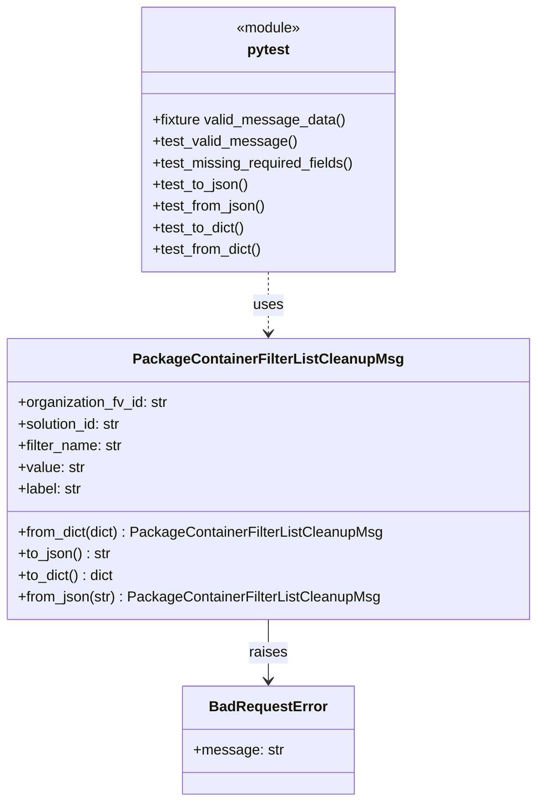

# Diagram: partview_core/partview_service/partview_service/tests/unit/core/model/package_container_filter_list_cleanup_msg_test.py

> Auto-generated by Obscura crawlers

## Mermaid

### SVG

<svg id="container" width="587.609375" xmlns="http://www.w3.org/2000/svg" class="classDiagram" height="890" viewBox="0 0 587.609375 890" role="graphics-document document" aria-roledescription="class"><g><defs><marker id="container_class-aggregationStart" class="marker aggregation class" refX="18" refY="7" markerWidth="190" markerHeight="240" orient="auto"><path d="M 18,7 L9,13 L1,7 L9,1 Z"></path></marker></defs><defs><marker id="container_class-aggregationEnd" class="marker aggregation class" refX="1" refY="7" markerWidth="20" markerHeight="28" orient="auto"><path d="M 18,7 L9,13 L1,7 L9,1 Z"></path></marker></defs><defs><marker id="container_class-extensionStart" class="marker extension class" refX="18" refY="7" markerWidth="190" markerHeight="240" orient="auto"><path d="M 1,7 L18,13 V 1 Z"></path></marker></defs><defs><marker id="container_class-extensionEnd" class="marker extension class" refX="1" refY="7" markerWidth="20" markerHeight="28" orient="auto"><path d="M 1,1 V 13 L18,7 Z"></path></marker></defs><defs><marker id="container_class-compositionStart" class="marker composition class" refX="18" refY="7" markerWidth="190" markerHeight="240" orient="auto"><path d="M 18,7 L9,13 L1,7 L9,1 Z"></path></marker></defs><defs><marker id="container_class-compositionEnd" class="marker composition class" refX="1" refY="7" markerWidth="20" markerHeight="28" orient="auto"><path d="M 18,7 L9,13 L1,7 L9,1 Z"></path></marker></defs><defs><marker id="container_class-dependencyStart" class="marker dependency class" refX="6" refY="7" markerWidth="190" markerHeight="240" orient="auto"><path d="M 5,7 L9,13 L1,7 L9,1 Z"></path></marker></defs><defs><marker id="container_class-dependencyEnd" class="marker dependency class" refX="13" refY="7" markerWidth="20" markerHeight="28" orient="auto"><path d="M 18,7 L9,13 L14,7 L9,1 Z"></path></marker></defs><defs><marker id="container_class-lollipopStart" class="marker lollipop class" refX="13" refY="7" markerWidth="190" markerHeight="240" orient="auto"><circle stroke="black" fill="transparent" cx="7" cy="7" r="6"></circle></marker></defs><defs><marker id="container_class-lollipopEnd" class="marker lollipop class" refX="1" refY="7" markerWidth="190" markerHeight="240" orient="auto"><circle stroke="black" fill="transparent" cx="7" cy="7" r="6"></circle></marker></defs><g class="root"><g class="clusters"></g><g class="edgePaths"><path d="M293.805,688L293.805,694.167C293.805,700.333,293.805,712.667,293.805,724C293.805,735.333,293.805,745.667,293.805,750.833L293.805,756" id="id_PackageContainerFilterListCleanupMsg_BadRequestError_1" class="edge-thickness-normal edge-pattern-solid relation" style=";;;" data-edge="true" data-et="edge" data-id="id_PackageContainerFilterListCleanupMsg_BadRequestError_1" data-points="W3sieCI6MjkzLjgwNDY4NzUsInkiOjY4OH0seyJ4IjoyOTMuODA0Njg3NSwieSI6NzI1fSx7IngiOjI5My44MDQ2ODc1LCJ5Ijo3NjJ9XQ==" marker-end="url(#container_class-dependencyEnd)"></path><path d="M293.805,302L293.805,308.167C293.805,314.333,293.805,326.667,293.805,338C293.805,349.333,293.805,359.667,293.805,364.833L293.805,370" id="id_pytest_PackageContainerFilterListCleanupMsg_2" class="edge-thickness-normal edge-pattern-dashed relation" style=";;;" data-edge="true" data-et="edge" data-id="id_pytest_PackageContainerFilterListCleanupMsg_2" data-points="W3sieCI6MjkzLjgwNDY4NzUsInkiOjMwMn0seyJ4IjoyOTMuODA0Njg3NSwieSI6MzM5fSx7IngiOjI5My44MDQ2ODc1LCJ5IjozNzZ9XQ==" marker-end="url(#container_class-dependencyEnd)"></path></g><g class="edgeLabels"><g class="edgeLabel" transform="translate(293.8046875, 725)"><g class="label" data-id="id_PackageContainerFilterListCleanupMsg_BadRequestError_1" transform="translate(-21.25, -12)"><foreignObject width="42.5" height="24">

raises

</foreignObject></g></g><g class="edgeLabel" transform="translate(293.8046875, 339)"><g class="label" data-id="id_pytest_PackageContainerFilterListCleanupMsg_2" transform="translate(-16.4921875, -12)"><foreignObject width="32.984375" height="24">

uses

</foreignObject></g></g></g><g class="nodes"><g class="node default" id="classId-PackageContainerFilterListCleanupMsg-0" transform="translate(293.8046875, 532)"><g class="basic label-container"><path d="M-285.8046875 -156 L285.8046875 -156 L285.8046875 156 L-285.8046875 156" stroke="none" stroke-width="0" fill="#ECECFF" style=""></path><path d="M-285.8046875 -156 C-137.32103306918077 -156, 11.162621361638458 -156, 285.8046875 -156 M-285.8046875 -156 C-156.14809578105582 -156, -26.49150406211163 -156, 285.8046875 -156 M285.8046875 -156 C285.8046875 -41.96359300229527, 285.8046875 72.07281399540946, 285.8046875 156 M285.8046875 -156 C285.8046875 -52.72040003176515, 285.8046875 50.559199936469696, 285.8046875 156 M285.8046875 156 C161.90845504968775 156, 38.01222259937549 156, -285.8046875 156 M285.8046875 156 C160.77864564040044 156, 35.752603780800854 156, -285.8046875 156 M-285.8046875 156 C-285.8046875 38.773191350026764, -285.8046875 -78.45361729994647, -285.8046875 -156 M-285.8046875 156 C-285.8046875 66.81584334056542, -285.8046875 -22.368313318869156, -285.8046875 -156" stroke="#9370DB" stroke-width="1.3" fill="none" stroke-dasharray="0 0" style=""></path></g><g class="annotation-group text" transform="translate(0, -132)"></g><g class="label-group text" transform="translate(-141.734375, -132)"><g class="label" style="font-weight: bolder" transform="translate(0,-12)"><foreignObject width="283.46875" height="24">

PackageContainerFilterListCleanupMsg

</foreignObject></g></g><g class="members-group text" transform="translate(-273.8046875, -84)"><g class="label" style="" transform="translate(0,-12)"><foreignObject width="169" height="24">

+organization_fv_id: str

</foreignObject></g><g class="label" style="" transform="translate(0,12)"><foreignObject width="117.71875" height="24">

+solution_id: str

</foreignObject></g><g class="label" style="" transform="translate(0,36)"><foreignObject width="117.125" height="24">

+filter_name: str

</foreignObject></g><g class="label" style="" transform="translate(0,60)"><foreignObject width="74.21875" height="24">

+value: str

</foreignObject></g><g class="label" style="" transform="translate(0,84)"><foreignObject width="71.875" height="24">

+label: str

</foreignObject></g></g><g class="methods-group text" transform="translate(-273.8046875, 60)"><g class="label" style="" transform="translate(0,-12)"><foreignObject width="405.875" height="24">

+from_dict(dict) : PackageContainerFilterListCleanupMsg

</foreignObject></g><g class="label" style="" transform="translate(0,12)"><foreignObject width="104.15625" height="24">

+to_json() : str

</foreignObject></g><g class="label" style="" transform="translate(0,36)"><foreignObject width="108.171875" height="24">

+to_dict() : dict

</foreignObject></g><g class="label" style="" transform="translate(0,60)"><foreignObject width="401.859375" height="24">

+from_json(str) : PackageContainerFilterListCleanupMsg

</foreignObject></g></g><g class="divider" style=""><path d="M-285.8046875 -108 C-130.59812750808473 -108, 24.60843248383054 -108, 285.8046875 -108 M-285.8046875 -108 C-139.70831930059032 -108, 6.388048898819363 -108, 285.8046875 -108" stroke="#9370DB" stroke-width="1.3" fill="none" stroke-dasharray="0 0" style=""></path></g><g class="divider" style=""><path d="M-285.8046875 36 C-108.49593146350941 36, 68.81282457298119 36, 285.8046875 36 M-285.8046875 36 C-165.14651996894827 36, -44.48835243789654 36, 285.8046875 36" stroke="#9370DB" stroke-width="1.3" fill="none" stroke-dasharray="0 0" style=""></path></g></g><g class="node default" id="classId-BadRequestError-1" transform="translate(293.8046875, 822)"><g class="basic label-container"><path d="M-92.078125 -60 L92.078125 -60 L92.078125 60 L-92.078125 60" stroke="none" stroke-width="0" fill="#ECECFF" style=""></path><path d="M-92.078125 -60 C-45.075198162884746 -60, 1.927728674230508 -60, 92.078125 -60 M-92.078125 -60 C-34.937636929307914 -60, 22.202851141384173 -60, 92.078125 -60 M92.078125 -60 C92.078125 -31.333461760950936, 92.078125 -2.6669235219018717, 92.078125 60 M92.078125 -60 C92.078125 -35.71694096650786, 92.078125 -11.433881933015726, 92.078125 60 M92.078125 60 C27.362906707511726 60, -37.35231158497655 60, -92.078125 60 M92.078125 60 C32.24855457125663 60, -27.581015857486733 60, -92.078125 60 M-92.078125 60 C-92.078125 26.222771824686873, -92.078125 -7.554456350626253, -92.078125 -60 M-92.078125 60 C-92.078125 14.465586508706323, -92.078125 -31.068826982587353, -92.078125 -60" stroke="#9370DB" stroke-width="1.3" fill="none" stroke-dasharray="0 0" style=""></path></g><g class="annotation-group text" transform="translate(0, -36)"></g><g class="label-group text" transform="translate(-62.28125, -36)"><g class="label" style="font-weight: bolder" transform="translate(0,-12)"><foreignObject width="124.5625" height="24">

BadRequestError

</foreignObject></g></g><g class="members-group text" transform="translate(-80.078125, 12)"><g class="label" style="" transform="translate(0,-12)"><foreignObject width="97.875" height="24">

+message: str

</foreignObject></g></g><g class="methods-group text" transform="translate(-80.078125, 60)"></g><g class="divider" style=""><path d="M-92.078125 -12 C-33.48504312198506 -12, 25.108038756029885 -12, 92.078125 -12 M-92.078125 -12 C-29.089835968434087 -12, 33.898453063131825 -12, 92.078125 -12" stroke="#9370DB" stroke-width="1.3" fill="none" stroke-dasharray="0 0" style=""></path></g><g class="divider" style=""><path d="M-92.078125 36 C-49.85409641828371 36, -7.63006783656742 36, 92.078125 36 M-92.078125 36 C-41.859380992138966 36, 8.359363015722067 36, 92.078125 36" stroke="#9370DB" stroke-width="1.3" fill="none" stroke-dasharray="0 0" style=""></path></g></g><g class="node default" id="classId-pytest-2" transform="translate(293.8046875, 155)"><g class="basic label-container"><path d="M-143.83203125 -147 L143.83203125 -147 L143.83203125 147 L-143.83203125 147" stroke="none" stroke-width="0" fill="#ECECFF" style=""></path><path d="M-143.83203125 -147 C-44.80366036785642 -147, 54.22471051428715 -147, 143.83203125 -147 M-143.83203125 -147 C-49.95436998973152 -147, 43.923291270536964 -147, 143.83203125 -147 M143.83203125 -147 C143.83203125 -50.25061739790161, 143.83203125 46.498765204196786, 143.83203125 147 M143.83203125 -147 C143.83203125 -54.889934148790275, 143.83203125 37.22013170241945, 143.83203125 147 M143.83203125 147 C68.42128977923065 147, -6.989451691538704 147, -143.83203125 147 M143.83203125 147 C66.88970276029742 147, -10.05262572940515 147, -143.83203125 147 M-143.83203125 147 C-143.83203125 66.62090448274726, -143.83203125 -13.758191034505472, -143.83203125 -147 M-143.83203125 147 C-143.83203125 61.24003810960204, -143.83203125 -24.51992378079592, -143.83203125 -147" stroke="#9370DB" stroke-width="1.3" fill="none" stroke-dasharray="0 0" style=""></path></g><g class="annotation-group text" transform="translate(-36.6015625, -123)"><g class="label" style="" transform="translate(0,-12)"><foreignObject width="73.203125" height="24">

«module»

</foreignObject></g></g><g class="label-group text" transform="translate(-23.171875, -99)"><g class="label" style="font-weight: bolder" transform="translate(0,-12)"><foreignObject width="46.34375" height="24">

pytest

</foreignObject></g></g><g class="members-group text" transform="translate(-131.83203125, -51)"></g><g class="methods-group text" transform="translate(-131.83203125, -21)"><g class="label" style="" transform="translate(0,-12)"><foreignObject width="214.78125" height="24">

+fixture valid_message_data()

</foreignObject></g><g class="label" style="" transform="translate(0,12)"><foreignObject width="159.25" height="24">

+test_valid_message()

</foreignObject></g><g class="label" style="" transform="translate(0,36)"><foreignObject width="227.0625" height="24">

+test_missing_required_fields()

</foreignObject></g><g class="label" style="" transform="translate(0,60)"><foreignObject width="107.90625" height="24">

+test_to_json()

</foreignObject></g><g class="label" style="" transform="translate(0,84)"><foreignObject width="127.46875" height="24">

+test_from_json()

</foreignObject></g><g class="label" style="" transform="translate(0,108)"><foreignObject width="103.84375" height="24">

+test_to_dict()

</foreignObject></g><g class="label" style="" transform="translate(0,132)"><foreignObject width="123.40625" height="24">

+test_from_dict()

</foreignObject></g></g><g class="divider" style=""><path d="M-143.83203125 -75 C-44.02471614493193 -75, 55.78259896013614 -75, 143.83203125 -75 M-143.83203125 -75 C-72.48652306772982 -75, -1.14101488545964 -75, 143.83203125 -75" stroke="#9370DB" stroke-width="1.3" fill="none" stroke-dasharray="0 0" style=""></path></g><g class="divider" style=""><path d="M-143.83203125 -51 C-42.66554555234124 -51, 58.500940145317514 -51, 143.83203125 -51 M-143.83203125 -51 C-32.16991936016787 -51, 79.49219252966427 -51, 143.83203125 -51" stroke="#9370DB" stroke-width="1.3" fill="none" stroke-dasharray="0 0" style=""></path></g></g></g></g></g></svg>
