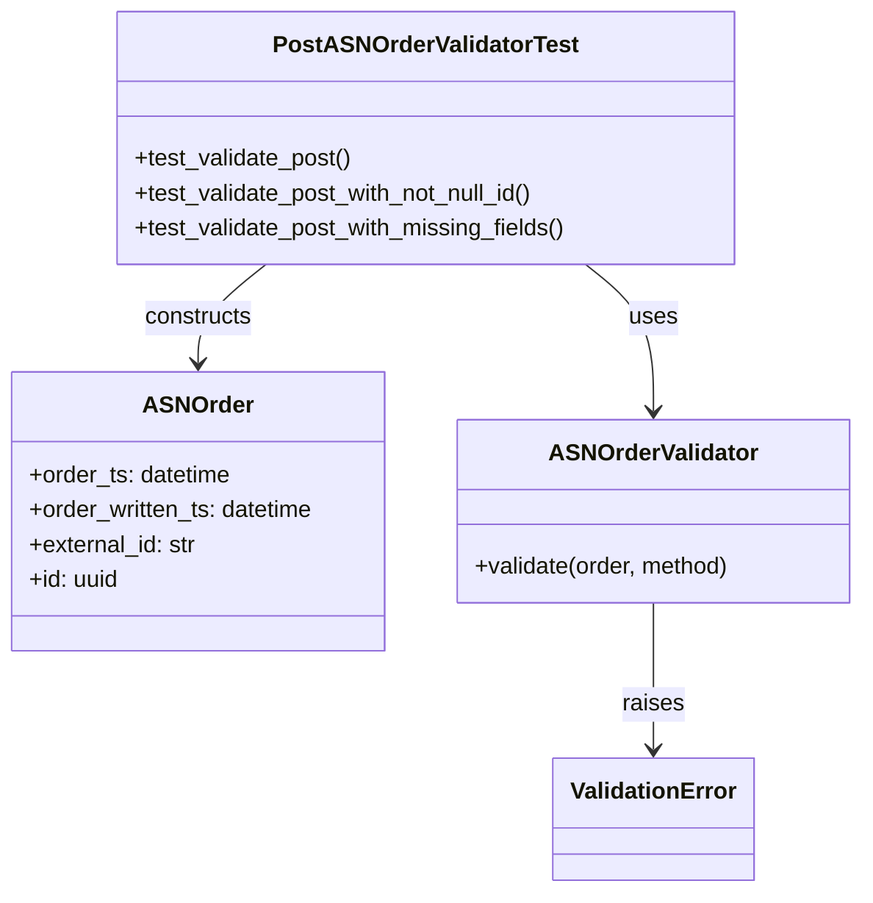

# Diagram: partview_core/partview_service/partview_service/tests/unit/core/validators/asn_order/asn_order_post_validator_test.py


> Auto-generated by Obscura crawlers

## Diagram 1



### SVG

<svg id="container" width="597.484375" xmlns="http://www.w3.org/2000/svg" class="classDiagram" height="614" viewBox="0 0 597.484375 614" role="graphics-document document" aria-roledescription="class"><style>#container{font-family:"trebuchet ms",verdana,arial,sans-serif;font-size:16px;fill:#333;}@keyframes edge-animation-frame{from{stroke-dashoffset:0;}}@keyframes dash{to{stroke-dashoffset:0;}}#container .edge-animation-slow{stroke-dasharray:9,5!important;stroke-dashoffset:900;animation:dash 50s linear infinite;stroke-linecap:round;}#container .edge-animation-fast{stroke-dasharray:9,5!important;stroke-dashoffset:900;animation:dash 20s linear infinite;stroke-linecap:round;}#container .error-icon{fill:#552222;}#container .error-text{fill:#552222;stroke:#552222;}#container .edge-thickness-normal{stroke-width:1px;}#container .edge-thickness-thick{stroke-width:3.5px;}#container .edge-pattern-solid{stroke-dasharray:0;}#container .edge-thickness-invisible{stroke-width:0;fill:none;}#container .edge-pattern-dashed{stroke-dasharray:3;}#container .edge-pattern-dotted{stroke-dasharray:2;}#container .marker{fill:#333333;stroke:#333333;}#container .marker.cross{stroke:#333333;}#container svg{font-family:"trebuchet ms",verdana,arial,sans-serif;font-size:16px;}#container p{margin:0;}#container g.classGroup text{fill:#9370DB;stroke:none;font-family:"trebuchet ms",verdana,arial,sans-serif;font-size:10px;}#container g.classGroup text .title{font-weight:bolder;}#container .nodeLabel,#container .edgeLabel{color:#131300;}#container .edgeLabel .label rect{fill:#ECECFF;}#container .label text{fill:#131300;}#container .labelBkg{background:#ECECFF;}#container .edgeLabel .label span{background:#ECECFF;}#container .classTitle{font-weight:bolder;}#container .node rect,#container .node circle,#container .node ellipse,#container .node polygon,#container .node path{fill:#ECECFF;stroke:#9370DB;stroke-width:1px;}#container .divider{stroke:#9370DB;stroke-width:1;}#container g.clickable{cursor:pointer;}#container g.classGroup rect{fill:#ECECFF;stroke:#9370DB;}#container g.classGroup line{stroke:#9370DB;stroke-width:1;}#container .classLabel .box{stroke:none;stroke-width:0;fill:#ECECFF;opacity:0.5;}#container .classLabel .label{fill:#9370DB;font-size:10px;}#container .relation{stroke:#333333;stroke-width:1;fill:none;}#container .dashed-line{stroke-dasharray:3;}#container .dotted-line{stroke-dasharray:1 2;}#container #compositionStart,#container .composition{fill:#333333!important;stroke:#333333!important;stroke-width:1;}#container #compositionEnd,#container .composition{fill:#333333!important;stroke:#333333!important;stroke-width:1;}#container #dependencyStart,#container .dependency{fill:#333333!important;stroke:#333333!important;stroke-width:1;}#container #dependencyStart,#container .dependency{fill:#333333!important;stroke:#333333!important;stroke-width:1;}#container #extensionStart,#container .extension{fill:transparent!important;stroke:#333333!important;stroke-width:1;}#container #extensionEnd,#container .extension{fill:transparent!important;stroke:#333333!important;stroke-width:1;}#container #aggregationStart,#container .aggregation{fill:transparent!important;stroke:#333333!important;stroke-width:1;}#container #aggregationEnd,#container .aggregation{fill:transparent!important;stroke:#333333!important;stroke-width:1;}#container #lollipopStart,#container .lollipop{fill:#ECECFF!important;stroke:#333333!important;stroke-width:1;}#container #lollipopEnd,#container .lollipop{fill:#ECECFF!important;stroke:#333333!important;stroke-width:1;}#container .edgeTerminals{font-size:11px;line-height:initial;}#container .classTitleText{text-anchor:middle;font-size:18px;fill:#333;}#container .label-icon{display:inline-block;height:1em;overflow:visible;vertical-align:-0.125em;}#container .node .label-icon path{fill:currentColor;stroke:revert;stroke-width:revert;}#container :root{--mermaid-font-family:"trebuchet ms",verdana,arial,sans-serif;}</style><g><defs><marker id="container_class-aggregationStart" class="marker aggregation class" refX="18" refY="7" markerWidth="190" markerHeight="240" orient="auto"><path d="M 18,7 L9,13 L1,7 L9,1 Z"></path></marker></defs><defs><marker id="container_class-aggregationEnd" class="marker aggregation class" refX="1" refY="7" markerWidth="20" markerHeight="28" orient="auto"><path d="M 18,7 L9,13 L1,7 L9,1 Z"></path></marker></defs><defs><marker id="container_class-extensionStart" class="marker extension class" refX="18" refY="7" markerWidth="190" markerHeight="240" orient="auto"><path d="M 1,7 L18,13 V 1 Z"></path></marker></defs><defs><marker id="container_class-extensionEnd" class="marker extension class" refX="1" refY="7" markerWidth="20" markerHeight="28" orient="auto"><path d="M 1,1 V 13 L18,7 Z"></path></marker></defs><defs><marker id="container_class-compositionStart" class="marker composition class" refX="18" refY="7" markerWidth="190" markerHeight="240" orient="auto"><path d="M 18,7 L9,13 L1,7 L9,1 Z"></path></marker></defs><defs><marker id="container_class-compositionEnd" class="marker composition class" refX="1" refY="7" markerWidth="20" markerHeight="28" orient="auto"><path d="M 18,7 L9,13 L1,7 L9,1 Z"></path></marker></defs><defs><marker id="container_class-dependencyStart" class="marker dependency class" refX="6" refY="7" markerWidth="190" markerHeight="240" orient="auto"><path d="M 5,7 L9,13 L1,7 L9,1 Z"></path></marker></defs><defs><marker id="container_class-dependencyEnd" class="marker dependency class" refX="13" refY="7" markerWidth="20" markerHeight="28" orient="auto"><path d="M 18,7 L9,13 L14,7 L9,1 Z"></path></marker></defs><defs><marker id="container_class-lollipopStart" class="marker lollipop class" refX="13" refY="7" markerWidth="190" markerHeight="240" orient="auto"><circle stroke="black" fill="transparent" cx="7" cy="7" r="6"></circle></marker></defs><defs><marker id="container_class-lollipopEnd" class="marker lollipop class" refX="1" refY="7" markerWidth="190" markerHeight="240" orient="auto"><circle stroke="black" fill="transparent" cx="7" cy="7" r="6"></circle></marker></defs><g class="root"><g class="clusters"></g><g class="edgePaths"><path d="M453.684,415L453.684,426.667C453.684,438.333,453.684,461.667,453.684,478.5C453.684,495.333,453.684,505.667,453.684,510.833L453.684,516" id="id_ASNOrderValidator_ValidationError_1" class="edge-thickness-normal edge-pattern-solid relation" style=";;;" data-edge="true" data-et="edge" data-id="id_ASNOrderValidator_ValidationError_1" data-points="W3sieCI6NDUzLjY4MzU5Mzc1LCJ5Ijo0MTV9LHsieCI6NDUzLjY4MzU5Mzc1LCJ5Ijo0ODV9LHsieCI6NDUzLjY4MzU5Mzc1LCJ5Ijo1MjJ9XQ==" marker-end="url(#container_class-dependencyEnd)"></path><path d="M406.577,182L414.428,188.167C422.279,194.333,437.981,206.667,445.832,223.5C453.684,240.333,453.684,261.667,453.684,272.333L453.684,283" id="id_PostASNOrderValidatorTest_ASNOrderValidator_2" class="edge-thickness-normal edge-pattern-solid relation" style=";;;" data-edge="true" data-et="edge" data-id="id_PostASNOrderValidatorTest_ASNOrderValidator_2" data-points="W3sieCI6NDA2LjU3Njg5NjQyMTM3MSwieSI6MTgyfSx7IngiOjQ1My42ODM1OTM3NSwieSI6MjE5fSx7IngiOjQ1My42ODM1OTM3NSwieSI6Mjg5fV0=" marker-end="url(#container_class-dependencyEnd)"></path><path d="M185.048,182L177.197,188.167C169.346,194.333,153.644,206.667,145.793,218C137.941,229.333,137.941,239.667,137.941,244.833L137.941,250" id="id_PostASNOrderValidatorTest_ASNOrder_3" class="edge-thickness-normal edge-pattern-solid relation" style=";;;" data-edge="true" data-et="edge" data-id="id_PostASNOrderValidatorTest_ASNOrder_3" data-points="W3sieCI6MTg1LjA0ODEwMzU3ODYyOTAyLCJ5IjoxODJ9LHsieCI6MTM3Ljk0MTQwNjI1LCJ5IjoyMTl9LHsieCI6MTM3Ljk0MTQwNjI1LCJ5IjoyNTZ9XQ==" marker-end="url(#container_class-dependencyEnd)"></path></g><g class="edgeLabels"><g class="edgeLabel" transform="translate(453.68359375, 485)"><g class="label" data-id="id_ASNOrderValidator_ValidationError_1" transform="translate(-21.25, -12)"><foreignObject width="42.5" height="24"><div xmlns="http://www.w3.org/1999/xhtml" class="labelBkg" style="display: table-cell; white-space: nowrap; line-height: 1.5; max-width: 200px; text-align: center;"><span class="edgeLabel"><p>raises</p></span></div></foreignObject></g></g><g class="edgeLabel" transform="translate(453.68359375, 219)"><g class="label" data-id="id_PostASNOrderValidatorTest_ASNOrderValidator_2" transform="translate(-16.4921875, -12)"><foreignObject width="32.984375" height="24"><div xmlns="http://www.w3.org/1999/xhtml" class="labelBkg" style="display: table-cell; white-space: nowrap; line-height: 1.5; max-width: 200px; text-align: center;"><span class="edgeLabel"><p>uses</p></span></div></foreignObject></g></g><g class="edgeLabel" transform="translate(137.94140625, 219)"><g class="label" data-id="id_PostASNOrderValidatorTest_ASNOrder_3" transform="translate(-37.84375, -12)"><foreignObject width="75.6875" height="24"><div xmlns="http://www.w3.org/1999/xhtml" class="labelBkg" style="display: table-cell; white-space: nowrap; line-height: 1.5; max-width: 200px; text-align: center;"><span class="edgeLabel"><p>constructs</p></span></div></foreignObject></g></g></g><g class="nodes"><g class="node default" id="classId-ASNOrder-0" transform="translate(137.94140625, 352)"><g class="basic label-container"><path d="M-129.94140625 -96 L129.94140625 -96 L129.94140625 96 L-129.94140625 96" stroke="none" stroke-width="0" fill="#ECECFF" style=""></path><path d="M-129.94140625 -96 C-39.97974699577124 -96, 49.98191225845753 -96, 129.94140625 -96 M-129.94140625 -96 C-73.20062247846312 -96, -16.45983870692625 -96, 129.94140625 -96 M129.94140625 -96 C129.94140625 -46.53478283843958, 129.94140625 2.930434323120835, 129.94140625 96 M129.94140625 -96 C129.94140625 -47.26135261764576, 129.94140625 1.4772947647084749, 129.94140625 96 M129.94140625 96 C53.984128696177876 96, -21.973148857644247 96, -129.94140625 96 M129.94140625 96 C72.49499879408182 96, 15.04859133816366 96, -129.94140625 96 M-129.94140625 96 C-129.94140625 21.624136418957647, -129.94140625 -52.751727162084705, -129.94140625 -96 M-129.94140625 96 C-129.94140625 48.0441355078937, -129.94140625 0.08827101578739871, -129.94140625 -96" stroke="#9370DB" stroke-width="1.3" fill="none" stroke-dasharray="0 0" style=""></path></g><g class="annotation-group text" transform="translate(0, -72)"></g><g class="label-group text" transform="translate(-35.5234375, -72)"><g class="label" style="font-weight: bolder" transform="translate(0,-12)"><foreignObject width="71.046875" height="24"><div xmlns="http://www.w3.org/1999/xhtml" style="display: table-cell; white-space: nowrap; line-height: 1.5; max-width: 121px; text-align: center;"><span class="nodeLabel markdown-node-label" style=""><p>ASNOrder</p></span></div></foreignObject></g></g><g class="members-group text" transform="translate(-117.94140625, -24)"><g class="label" style="" transform="translate(0,-12)"><foreignObject width="140.796875" height="24"><div xmlns="http://www.w3.org/1999/xhtml" style="display: table-cell; white-space: nowrap; line-height: 1.5; max-width: 198px; text-align: center;"><span class="nodeLabel markdown-node-label" style=""><p>+order_ts: datetime</p></span></div></foreignObject></g><g class="label" style="" transform="translate(0,12)"><foreignObject width="200.359375" height="24"><div xmlns="http://www.w3.org/1999/xhtml" style="display: table-cell; white-space: nowrap; line-height: 1.5; max-width: 258px; text-align: center;"><span class="nodeLabel markdown-node-label" style=""><p>+order_written_ts: datetime</p></span></div></foreignObject></g><g class="label" style="" transform="translate(0,36)"><foreignObject width="117.265625" height="24"><div xmlns="http://www.w3.org/1999/xhtml" style="display: table-cell; white-space: nowrap; line-height: 1.5; max-width: 175px; text-align: center;"><span class="nodeLabel markdown-node-label" style=""><p>+external_id: str</p></span></div></foreignObject></g><g class="label" style="" transform="translate(0,60)"><foreignObject width="62.859375" height="24"><div xmlns="http://www.w3.org/1999/xhtml" style="display: table-cell; white-space: nowrap; line-height: 1.5; max-width: 120px; text-align: center;"><span class="nodeLabel markdown-node-label" style=""><p>+id: uuid</p></span></div></foreignObject></g></g><g class="methods-group text" transform="translate(-117.94140625, 96)"></g><g class="divider" style=""><path d="M-129.94140625 -48 C-77.08479089647517 -48, -24.228175542950353 -48, 129.94140625 -48 M-129.94140625 -48 C-33.5692416176053 -48, 62.8029230147894 -48, 129.94140625 -48" stroke="#9370DB" stroke-width="1.3" fill="none" stroke-dasharray="0 0" style=""></path></g><g class="divider" style=""><path d="M-129.94140625 72 C-70.99597596400383 72, -12.050545678007666 72, 129.94140625 72 M-129.94140625 72 C-35.151544012445115 72, 59.63831822510977 72, 129.94140625 72" stroke="#9370DB" stroke-width="1.3" fill="none" stroke-dasharray="0 0" style=""></path></g></g><g class="node default" id="classId-ASNOrderValidator-1" transform="translate(453.68359375, 352)"><g class="basic label-container"><path d="M-135.80078125 -63 L135.80078125 -63 L135.80078125 63 L-135.80078125 63" stroke="none" stroke-width="0" fill="#ECECFF" style=""></path><path d="M-135.80078125 -63 C-70.390090248804 -63, -4.979399247608001 -63, 135.80078125 -63 M-135.80078125 -63 C-54.389662098273334 -63, 27.021457053453332 -63, 135.80078125 -63 M135.80078125 -63 C135.80078125 -36.227125924216516, 135.80078125 -9.454251848433032, 135.80078125 63 M135.80078125 -63 C135.80078125 -37.06052548951028, 135.80078125 -11.121050979020566, 135.80078125 63 M135.80078125 63 C73.67958338664747 63, 11.55838552329493 63, -135.80078125 63 M135.80078125 63 C73.34603306171492 63, 10.89128487342984 63, -135.80078125 63 M-135.80078125 63 C-135.80078125 15.777002918299686, -135.80078125 -31.445994163400627, -135.80078125 -63 M-135.80078125 63 C-135.80078125 32.0782250819931, -135.80078125 1.156450163986193, -135.80078125 -63" stroke="#9370DB" stroke-width="1.3" fill="none" stroke-dasharray="0 0" style=""></path></g><g class="annotation-group text" transform="translate(0, -39)"></g><g class="label-group text" transform="translate(-68.7109375, -39)"><g class="label" style="font-weight: bolder" transform="translate(0,-12)"><foreignObject width="137.421875" height="24"><div xmlns="http://www.w3.org/1999/xhtml" style="display: table-cell; white-space: nowrap; line-height: 1.5; max-width: 186px; text-align: center;"><span class="nodeLabel markdown-node-label" style=""><p>ASNOrderValidator</p></span></div></foreignObject></g></g><g class="members-group text" transform="translate(-123.80078125, 9)"></g><g class="methods-group text" transform="translate(-123.80078125, 39)"><g class="label" style="" transform="translate(0,-12)"><foreignObject width="178.890625" height="24"><div xmlns="http://www.w3.org/1999/xhtml" style="display: table-cell; white-space: nowrap; line-height: 1.5; max-width: 236px; text-align: center;"><span class="nodeLabel markdown-node-label" style=""><p>+validate(order, method)</p></span></div></foreignObject></g></g><g class="divider" style=""><path d="M-135.80078125 -15 C-72.66100772660607 -15, -9.52123420321216 -15, 135.80078125 -15 M-135.80078125 -15 C-37.24125220296371 -15, 61.318276844072585 -15, 135.80078125 -15" stroke="#9370DB" stroke-width="1.3" fill="none" stroke-dasharray="0 0" style=""></path></g><g class="divider" style=""><path d="M-135.80078125 9 C-70.51901884603235 9, -5.237256442064705 9, 135.80078125 9 M-135.80078125 9 C-63.07165572769243 9, 9.657469794615139 9, 135.80078125 9" stroke="#9370DB" stroke-width="1.3" fill="none" stroke-dasharray="0 0" style=""></path></g></g><g class="node default" id="classId-ValidationError-2" transform="translate(453.68359375, 564)"><g class="basic label-container"><path d="M-67.1796875 -42 L67.1796875 -42 L67.1796875 42 L-67.1796875 42" stroke="none" stroke-width="0" fill="#ECECFF" style=""></path><path d="M-67.1796875 -42 C-18.601126521663353 -42, 29.977434456673294 -42, 67.1796875 -42 M-67.1796875 -42 C-22.50853015047654 -42, 22.162627199046923 -42, 67.1796875 -42 M67.1796875 -42 C67.1796875 -14.529434926069452, 67.1796875 12.941130147861095, 67.1796875 42 M67.1796875 -42 C67.1796875 -9.860602528299147, 67.1796875 22.278794943401707, 67.1796875 42 M67.1796875 42 C25.003404105015413 42, -17.172879289969174 42, -67.1796875 42 M67.1796875 42 C30.7443875828584 42, -5.6909123342831975 42, -67.1796875 42 M-67.1796875 42 C-67.1796875 9.625015510515645, -67.1796875 -22.74996897896871, -67.1796875 -42 M-67.1796875 42 C-67.1796875 11.040145923241045, -67.1796875 -19.91970815351791, -67.1796875 -42" stroke="#9370DB" stroke-width="1.3" fill="none" stroke-dasharray="0 0" style=""></path></g><g class="annotation-group text" transform="translate(0, -18)"></g><g class="label-group text" transform="translate(-55.1796875, -18)"><g class="label" style="font-weight: bolder" transform="translate(0,-12)"><foreignObject width="110.359375" height="24"><div xmlns="http://www.w3.org/1999/xhtml" style="display: table-cell; white-space: nowrap; line-height: 1.5; max-width: 160px; text-align: center;"><span class="nodeLabel markdown-node-label" style=""><p>ValidationError</p></span></div></foreignObject></g></g><g class="members-group text" transform="translate(-55.1796875, 30)"></g><g class="methods-group text" transform="translate(-55.1796875, 60)"></g><g class="divider" style=""><path d="M-67.1796875 6 C-34.736410562423686 6, -2.2931336248473713 6, 67.1796875 6 M-67.1796875 6 C-23.28488494194673 6, 20.609917616106543 6, 67.1796875 6" stroke="#9370DB" stroke-width="1.3" fill="none" stroke-dasharray="0 0" style=""></path></g><g class="divider" style=""><path d="M-67.1796875 24 C-31.2114932147728 24, 4.7567010704543975 24, 67.1796875 24 M-67.1796875 24 C-29.110700803182148 24, 8.958285893635704 24, 67.1796875 24" stroke="#9370DB" stroke-width="1.3" fill="none" stroke-dasharray="0 0" style=""></path></g></g><g class="node default" id="classId-PostASNOrderValidatorTest-3" transform="translate(295.8125, 95)"><g class="basic label-container"><path d="M-213.0234375 -87 L213.0234375 -87 L213.0234375 87 L-213.0234375 87" stroke="none" stroke-width="0" fill="#ECECFF" style=""></path><path d="M-213.0234375 -87 C-68.05864130291624 -87, 76.90615489416751 -87, 213.0234375 -87 M-213.0234375 -87 C-69.43804167767249 -87, 74.14735414465503 -87, 213.0234375 -87 M213.0234375 -87 C213.0234375 -46.86481404126609, 213.0234375 -6.729628082532173, 213.0234375 87 M213.0234375 -87 C213.0234375 -35.245957098396836, 213.0234375 16.508085803206328, 213.0234375 87 M213.0234375 87 C124.86174643726916 87, 36.70005537453832 87, -213.0234375 87 M213.0234375 87 C52.91229556491203 87, -107.19884637017594 87, -213.0234375 87 M-213.0234375 87 C-213.0234375 25.205316524481916, -213.0234375 -36.58936695103617, -213.0234375 -87 M-213.0234375 87 C-213.0234375 43.22480705481487, -213.0234375 -0.550385890370265, -213.0234375 -87" stroke="#9370DB" stroke-width="1.3" fill="none" stroke-dasharray="0 0" style=""></path></g><g class="annotation-group text" transform="translate(0, -63)"></g><g class="label-group text" transform="translate(-100.140625, -63)"><g class="label" style="font-weight: bolder" transform="translate(0,-12)"><foreignObject width="200.28125" height="24"><div xmlns="http://www.w3.org/1999/xhtml" style="display: table-cell; white-space: nowrap; line-height: 1.5; max-width: 246px; text-align: center;"><span class="nodeLabel markdown-node-label" style=""><p>PostASNOrderValidatorTest</p></span></div></foreignObject></g></g><g class="members-group text" transform="translate(-201.0234375, -15)"></g><g class="methods-group text" transform="translate(-201.0234375, 15)"><g class="label" style="" transform="translate(0,-12)"><foreignObject width="151.609375" height="24"><div xmlns="http://www.w3.org/1999/xhtml" style="display: table-cell; white-space: nowrap; line-height: 1.5; max-width: 209px; text-align: center;"><span class="nodeLabel markdown-node-label" style=""><p>+test_validate_post()</p></span></div></foreignObject></g><g class="label" style="" transform="translate(0,12)"><foreignObject width="282.34375" height="24"><div xmlns="http://www.w3.org/1999/xhtml" style="display: table-cell; white-space: nowrap; line-height: 1.5; max-width: 340px; text-align: center;"><span class="nodeLabel markdown-node-label" style=""><p>+test_validate_post_with_not_null_id()</p></span></div></foreignObject></g><g class="label" style="" transform="translate(0,36)"><foreignObject width="301.90625" height="24"><div xmlns="http://www.w3.org/1999/xhtml" style="display: table-cell; white-space: nowrap; line-height: 1.5; max-width: 359px; text-align: center;"><span class="nodeLabel markdown-node-label" style=""><p>+test_validate_post_with_missing_fields()</p></span></div></foreignObject></g></g><g class="divider" style=""><path d="M-213.0234375 -39 C-98.0365174052299 -39, 16.950402689540198 -39, 213.0234375 -39 M-213.0234375 -39 C-108.71430219700511 -39, -4.405166894010222 -39, 213.0234375 -39" stroke="#9370DB" stroke-width="1.3" fill="none" stroke-dasharray="0 0" style=""></path></g><g class="divider" style=""><path d="M-213.0234375 -15 C-86.05366242079958 -15, 40.916112658400834 -15, 213.0234375 -15 M-213.0234375 -15 C-49.47765374826125 -15, 114.0681300034775 -15, 213.0234375 -15" stroke="#9370DB" stroke-width="1.3" fill="none" stroke-dasharray="0 0" style=""></path></g></g></g></g></g></svg>

## Diagram 2

```mermaid
flowchart TD
    Start([Start Tests]) --> T1[Test: test_validate_post]
    T1 --> Create1[Create ASNOrder with timestamps + external_id]
    Create1 --> Validate1{ASNOrderValidator.validate(..., "POST")}
    Validate1 -->|no exception| Pass1([Pass])
    Start --> T2[Test: test_validate_post_with_not_null_id]
    T2 --> Create2[Create ASNOrder with id set]
    Create2 --> Validate2{ASNOrderValidator.validate(..., "POST")}
    Validate2 -->|raises ValidationError| CheckMsg1[Assert message: "Cannot set uuid when creating an object"]
    CheckMsg1 --> Pass2([Pass])
    Start --> T3[Test: test_validate_post_with_missing_fields]
    T3 --> Create3[Create ASNOrder missing fields]
    Create3 --> Validate3a{validate(...)}
    Validate3a -->|raises ValidationError| MsgA[Assert missing: datetime, writtenDatetime, orderNumber]
    MsgA --> AddOrderTs[Set order_ts]
    AddOrderTs --> Validate3b{validate(...)}
    Validate3b -->|raises ValidationError| MsgB[Assert missing: writtenDatetime, orderNumber]
    MsgB --> AddWrittenTs[Set order_written_ts]
    AddWrittenTs --> Validate3c{validate(...)}
    Validate3c -->|raises ValidationError| MsgC[Assert missing: orderNumber]
    MsgC --> AddExternalId[Set external_id]
    AddExternalId --> Validate3d{validate(...)}
    Validate3d -->|no exception| Pass3([Pass])
    Pass1 & Pass2 & Pass3 --> End([All Tests Passed])
```

> SVG rendering failed for this diagram.
