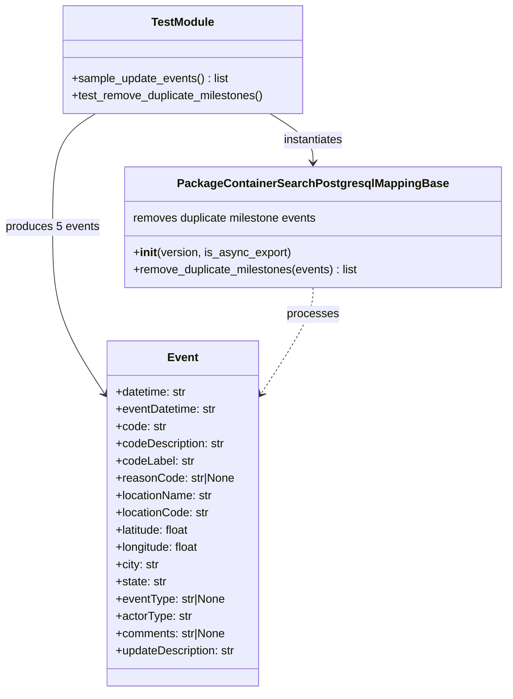

# Diagram: partview_core/partview_service/partview_service/tests/unit/core/validators/package_container/PackageContainerSearchPostgresqlMappingBase_test.py


> Auto-generated by Obscura crawlers

## Diagram 1



### SVG

<svg id="container" width="702.3984375" xmlns="http://www.w3.org/2000/svg" class="classDiagram" height="962" viewBox="0 0 702.3984375 962" role="graphics-document document" aria-roledescription="class"><style>#container{font-family:"trebuchet ms",verdana,arial,sans-serif;font-size:16px;fill:#333;}@keyframes edge-animation-frame{from{stroke-dashoffset:0;}}@keyframes dash{to{stroke-dashoffset:0;}}#container .edge-animation-slow{stroke-dasharray:9,5!important;stroke-dashoffset:900;animation:dash 50s linear infinite;stroke-linecap:round;}#container .edge-animation-fast{stroke-dasharray:9,5!important;stroke-dashoffset:900;animation:dash 20s linear infinite;stroke-linecap:round;}#container .error-icon{fill:#552222;}#container .error-text{fill:#552222;stroke:#552222;}#container .edge-thickness-normal{stroke-width:1px;}#container .edge-thickness-thick{stroke-width:3.5px;}#container .edge-pattern-solid{stroke-dasharray:0;}#container .edge-thickness-invisible{stroke-width:0;fill:none;}#container .edge-pattern-dashed{stroke-dasharray:3;}#container .edge-pattern-dotted{stroke-dasharray:2;}#container .marker{fill:#333333;stroke:#333333;}#container .marker.cross{stroke:#333333;}#container svg{font-family:"trebuchet ms",verdana,arial,sans-serif;font-size:16px;}#container p{margin:0;}#container g.classGroup text{fill:#9370DB;stroke:none;font-family:"trebuchet ms",verdana,arial,sans-serif;font-size:10px;}#container g.classGroup text .title{font-weight:bolder;}#container .nodeLabel,#container .edgeLabel{color:#131300;}#container .edgeLabel .label rect{fill:#ECECFF;}#container .label text{fill:#131300;}#container .labelBkg{background:#ECECFF;}#container .edgeLabel .label span{background:#ECECFF;}#container .classTitle{font-weight:bolder;}#container .node rect,#container .node circle,#container .node ellipse,#container .node polygon,#container .node path{fill:#ECECFF;stroke:#9370DB;stroke-width:1px;}#container .divider{stroke:#9370DB;stroke-width:1;}#container g.clickable{cursor:pointer;}#container g.classGroup rect{fill:#ECECFF;stroke:#9370DB;}#container g.classGroup line{stroke:#9370DB;stroke-width:1;}#container .classLabel .box{stroke:none;stroke-width:0;fill:#ECECFF;opacity:0.5;}#container .classLabel .label{fill:#9370DB;font-size:10px;}#container .relation{stroke:#333333;stroke-width:1;fill:none;}#container .dashed-line{stroke-dasharray:3;}#container .dotted-line{stroke-dasharray:1 2;}#container #compositionStart,#container .composition{fill:#333333!important;stroke:#333333!important;stroke-width:1;}#container #compositionEnd,#container .composition{fill:#333333!important;stroke:#333333!important;stroke-width:1;}#container #dependencyStart,#container .dependency{fill:#333333!important;stroke:#333333!important;stroke-width:1;}#container #dependencyStart,#container .dependency{fill:#333333!important;stroke:#333333!important;stroke-width:1;}#container #extensionStart,#container .extension{fill:transparent!important;stroke:#333333!important;stroke-width:1;}#container #extensionEnd,#container .extension{fill:transparent!important;stroke:#333333!important;stroke-width:1;}#container #aggregationStart,#container .aggregation{fill:transparent!important;stroke:#333333!important;stroke-width:1;}#container #aggregationEnd,#container .aggregation{fill:transparent!important;stroke:#333333!important;stroke-width:1;}#container #lollipopStart,#container .lollipop{fill:#ECECFF!important;stroke:#333333!important;stroke-width:1;}#container #lollipopEnd,#container .lollipop{fill:#ECECFF!important;stroke:#333333!important;stroke-width:1;}#container .edgeTerminals{font-size:11px;line-height:initial;}#container .classTitleText{text-anchor:middle;font-size:18px;fill:#333;}#container .label-icon{display:inline-block;height:1em;overflow:visible;vertical-align:-0.125em;}#container .node .label-icon path{fill:currentColor;stroke:revert;stroke-width:revert;}#container :root{--mermaid-font-family:"trebuchet ms",verdana,arial,sans-serif;}</style><g><defs><marker id="container_class-aggregationStart" class="marker aggregation class" refX="18" refY="7" markerWidth="190" markerHeight="240" orient="auto"><path d="M 18,7 L9,13 L1,7 L9,1 Z"></path></marker></defs><defs><marker id="container_class-aggregationEnd" class="marker aggregation class" refX="1" refY="7" markerWidth="20" markerHeight="28" orient="auto"><path d="M 18,7 L9,13 L1,7 L9,1 Z"></path></marker></defs><defs><marker id="container_class-extensionStart" class="marker extension class" refX="18" refY="7" markerWidth="190" markerHeight="240" orient="auto"><path d="M 1,7 L18,13 V 1 Z"></path></marker></defs><defs><marker id="container_class-extensionEnd" class="marker extension class" refX="1" refY="7" markerWidth="20" markerHeight="28" orient="auto"><path d="M 1,1 V 13 L18,7 Z"></path></marker></defs><defs><marker id="container_class-compositionStart" class="marker composition class" refX="18" refY="7" markerWidth="190" markerHeight="240" orient="auto"><path d="M 18,7 L9,13 L1,7 L9,1 Z"></path></marker></defs><defs><marker id="container_class-compositionEnd" class="marker composition class" refX="1" refY="7" markerWidth="20" markerHeight="28" orient="auto"><path d="M 18,7 L9,13 L1,7 L9,1 Z"></path></marker></defs><defs><marker id="container_class-dependencyStart" class="marker dependency class" refX="6" refY="7" markerWidth="190" markerHeight="240" orient="auto"><path d="M 5,7 L9,13 L1,7 L9,1 Z"></path></marker></defs><defs><marker id="container_class-dependencyEnd" class="marker dependency class" refX="13" refY="7" markerWidth="20" markerHeight="28" orient="auto"><path d="M 18,7 L9,13 L14,7 L9,1 Z"></path></marker></defs><defs><marker id="container_class-lollipopStart" class="marker lollipop class" refX="13" refY="7" markerWidth="190" markerHeight="240" orient="auto"><circle stroke="black" fill="transparent" cx="7" cy="7" r="6"></circle></marker></defs><defs><marker id="container_class-lollipopEnd" class="marker lollipop class" refX="1" refY="7" markerWidth="190" markerHeight="240" orient="auto"><circle stroke="black" fill="transparent" cx="7" cy="7" r="6"></circle></marker></defs><g class="root"><g class="clusters"></g><g class="edgePaths"><path d="M133.205,158L123.275,164.167C113.345,170.333,93.485,182.667,83.555,209C73.625,235.333,73.625,275.667,73.625,316C73.625,356.333,73.625,396.667,85.271,434.721C96.917,472.775,120.209,508.549,131.856,526.437L143.502,544.324" id="id_TestModule_Event_1" class="edge-thickness-normal edge-pattern-solid relation" style=";;;" data-edge="true" data-et="edge" data-id="id_TestModule_Event_1" data-points="W3sieCI6MTMzLjIwNDc4MTY2ODUyNjc4LCJ5IjoxNTh9LHsieCI6NzMuNjI1LCJ5IjoxOTV9LHsieCI6NzMuNjI1LCJ5IjozMTZ9LHsieCI6NzMuNjI1LCJ5Ijo0Mzd9LHsieCI6MTQ2Ljc3NTM5MDYyNSwieSI6NTQ5LjM1MjEwNDc0NDQ3NDJ9XQ==" marker-end="url(#container_class-dependencyEnd)"></path><path d="M374.744,158L384.674,164.167C394.604,170.333,414.464,182.667,424.394,194C434.324,205.333,434.324,215.667,434.324,220.833L434.324,226" id="id_TestModule_PackageContainerSearchPostgresqlMappingBase_2" class="edge-thickness-normal edge-pattern-solid relation" style=";;;" data-edge="true" data-et="edge" data-id="id_TestModule_PackageContainerSearchPostgresqlMappingBase_2" data-points="W3sieCI6Mzc0Ljc0NDQzNzA4MTQ3MzIsInkiOjE1OH0seyJ4Ijo0MzQuMzI0MjE4NzUsInkiOjE5NX0seyJ4Ijo0MzQuMzI0MjE4NzUsInkiOjIzMn1d" marker-end="url(#container_class-dependencyEnd)"></path><path d="M434.324,400L434.324,406.167C434.324,412.333,434.324,424.667,422.678,448.721C411.032,472.775,387.74,508.549,376.094,526.437L364.448,544.324" id="id_PackageContainerSearchPostgresqlMappingBase_Event_3" class="edge-thickness-normal edge-pattern-dashed relation" style=";;;" data-edge="true" data-et="edge" data-id="id_PackageContainerSearchPostgresqlMappingBase_Event_3" data-points="W3sieCI6NDM0LjMyNDIxODc1LCJ5Ijo0MDB9LHsieCI6NDM0LjMyNDIxODc1LCJ5Ijo0Mzd9LHsieCI6MzYxLjE3MzgyODEyNSwieSI6NTQ5LjM1MjEwNDc0NDQ3NDJ9XQ==" marker-end="url(#container_class-dependencyEnd)"></path></g><g class="edgeLabels"><g class="edgeLabel" transform="translate(73.625, 316)"><g class="label" data-id="id_TestModule_Event_1" transform="translate(-65.625, -12)"><foreignObject width="131.25" height="24"><div xmlns="http://www.w3.org/1999/xhtml" class="labelBkg" style="display: table-cell; white-space: nowrap; line-height: 1.5; max-width: 200px; text-align: center;"><span class="edgeLabel"><p>produces 5 events</p></span></div></foreignObject></g></g><g class="edgeLabel" transform="translate(434.32421875, 195)"><g class="label" data-id="id_TestModule_PackageContainerSearchPostgresqlMappingBase_2" transform="translate(-42.9140625, -12)"><foreignObject width="85.828125" height="24"><div xmlns="http://www.w3.org/1999/xhtml" class="labelBkg" style="display: table-cell; white-space: nowrap; line-height: 1.5; max-width: 200px; text-align: center;"><span class="edgeLabel"><p>instantiates</p></span></div></foreignObject></g></g><g class="edgeLabel" transform="translate(434.32421875, 437)"><g class="label" data-id="id_PackageContainerSearchPostgresqlMappingBase_Event_3" transform="translate(-35.7890625, -12)"><foreignObject width="71.578125" height="24"><div xmlns="http://www.w3.org/1999/xhtml" class="labelBkg" style="display: table-cell; white-space: nowrap; line-height: 1.5; max-width: 200px; text-align: center;"><span class="edgeLabel"><p>processes</p></span></div></foreignObject></g></g></g><g class="nodes"><g class="node default" id="classId-PackageContainerSearchPostgresqlMappingBase-0" transform="translate(434.32421875, 316)"><g class="basic label-container"><path d="M-260.07421875 -84 L260.07421875 -84 L260.07421875 84 L-260.07421875 84" stroke="none" stroke-width="0" fill="#ECECFF" style=""></path><path d="M-260.07421875 -84 C-138.0262831262583 -84, -15.978347502516641 -84, 260.07421875 -84 M-260.07421875 -84 C-54.28726238525766 -84, 151.49969397948468 -84, 260.07421875 -84 M260.07421875 -84 C260.07421875 -43.98459987719677, 260.07421875 -3.969199754393543, 260.07421875 84 M260.07421875 -84 C260.07421875 -18.969275476677723, 260.07421875 46.061449046644555, 260.07421875 84 M260.07421875 84 C57.91975446755686 84, -144.2347098148863 84, -260.07421875 84 M260.07421875 84 C105.07694178788137 84, -49.920335174237266 84, -260.07421875 84 M-260.07421875 84 C-260.07421875 24.626801122487983, -260.07421875 -34.746397755024034, -260.07421875 -84 M-260.07421875 84 C-260.07421875 21.467365710363772, -260.07421875 -41.065268579272455, -260.07421875 -84" stroke="#9370DB" stroke-width="1.3" fill="none" stroke-dasharray="0 0" style=""></path></g><g class="annotation-group text" transform="translate(0, -60)"></g><g class="label-group text" transform="translate(-178.0859375, -60)"><g class="label" style="font-weight: bolder" transform="translate(0,-12)"><foreignObject width="356.171875" height="24"><div xmlns="http://www.w3.org/1999/xhtml" style="display: table-cell; white-space: nowrap; line-height: 1.5; max-width: 400px; text-align: center;"><span class="nodeLabel markdown-node-label" style=""><p>PackageContainerSearchPostgresqlMappingBase</p></span></div></foreignObject></g></g><g class="members-group text" transform="translate(-248.07421875, -12)"><g class="label" style="" transform="translate(0,-12)"><foreignObject width="261.96875" height="24"><div xmlns="http://www.w3.org/1999/xhtml" style="display: table-cell; white-space: nowrap; line-height: 1.5; max-width: 312px; text-align: center;"><span class="nodeLabel markdown-node-label" style=""><p>removes duplicate milestone events</p></span></div></foreignObject></g></g><g class="methods-group text" transform="translate(-248.07421875, 36)"><g class="label" style="" transform="translate(0,-12)"><foreignObject width="219.484375" height="24"><div xmlns="http://www.w3.org/1999/xhtml" style="display: table-cell; white-space: nowrap; line-height: 1.5; max-width: 308px; text-align: center;"><span class="nodeLabel markdown-node-label" style=""><p>+<strong>init</strong>(version, is_async_export)</p></span></div></foreignObject></g><g class="label" style="" transform="translate(0,12)"><foreignObject width="318.0625" height="24"><div xmlns="http://www.w3.org/1999/xhtml" style="display: table-cell; white-space: nowrap; line-height: 1.5; max-width: 376px; text-align: center;"><span class="nodeLabel markdown-node-label" style=""><p>+remove_duplicate_milestones(events) : list</p></span></div></foreignObject></g></g><g class="divider" style=""><path d="M-260.07421875 -36 C-132.1096732863652 -36, -4.145127822730416 -36, 260.07421875 -36 M-260.07421875 -36 C-150.74712382862845 -36, -41.420028907256864 -36, 260.07421875 -36" stroke="#9370DB" stroke-width="1.3" fill="none" stroke-dasharray="0 0" style=""></path></g><g class="divider" style=""><path d="M-260.07421875 12 C-57.89499058332623 12, 144.28423758334753 12, 260.07421875 12 M-260.07421875 12 C-104.03168020218473 12, 52.01085834563054 12, 260.07421875 12" stroke="#9370DB" stroke-width="1.3" fill="none" stroke-dasharray="0 0" style=""></path></g></g><g class="node default" id="classId-TestModule-1" transform="translate(253.974609375, 83)"><g class="basic label-container"><path d="M-168.78125 -75 L168.78125 -75 L168.78125 75 L-168.78125 75" stroke="none" stroke-width="0" fill="#ECECFF" style=""></path><path d="M-168.78125 -75 C-46.74517381967718 -75, 75.29090236064565 -75, 168.78125 -75 M-168.78125 -75 C-101.26467374739593 -75, -33.748097494791864 -75, 168.78125 -75 M168.78125 -75 C168.78125 -30.190021671299455, 168.78125 14.61995665740109, 168.78125 75 M168.78125 -75 C168.78125 -18.04809928217513, 168.78125 38.90380143564974, 168.78125 75 M168.78125 75 C58.82576501793294 75, -51.129719964134125 75, -168.78125 75 M168.78125 75 C68.67216838895499 75, -31.436913222090027 75, -168.78125 75 M-168.78125 75 C-168.78125 37.93220803320736, -168.78125 0.8644160664147194, -168.78125 -75 M-168.78125 75 C-168.78125 41.812884169441574, -168.78125 8.625768338883148, -168.78125 -75" stroke="#9370DB" stroke-width="1.3" fill="none" stroke-dasharray="0 0" style=""></path></g><g class="annotation-group text" transform="translate(0, -51)"></g><g class="label-group text" transform="translate(-42.34375, -51)"><g class="label" style="font-weight: bolder" transform="translate(0,-12)"><foreignObject width="84.6875" height="24"><div xmlns="http://www.w3.org/1999/xhtml" style="display: table-cell; white-space: nowrap; line-height: 1.5; max-width: 133px; text-align: center;"><span class="nodeLabel markdown-node-label" style=""><p>TestModule</p></span></div></foreignObject></g></g><g class="members-group text" transform="translate(-156.78125, -3)"></g><g class="methods-group text" transform="translate(-156.78125, 27)"><g class="label" style="" transform="translate(0,-12)"><foreignObject width="220.203125" height="24"><div xmlns="http://www.w3.org/1999/xhtml" style="display: table-cell; white-space: nowrap; line-height: 1.5; max-width: 278px; text-align: center;"><span class="nodeLabel markdown-node-label" style=""><p>+sample_update_events() : list</p></span></div></foreignObject></g><g class="label" style="" transform="translate(0,12)"><foreignObject width="271.21875" height="24"><div xmlns="http://www.w3.org/1999/xhtml" style="display: table-cell; white-space: nowrap; line-height: 1.5; max-width: 329px; text-align: center;"><span class="nodeLabel markdown-node-label" style=""><p>+test_remove_duplicate_milestones()</p></span></div></foreignObject></g></g><g class="divider" style=""><path d="M-168.78125 -27 C-43.28816006030607 -27, 82.20492987938786 -27, 168.78125 -27 M-168.78125 -27 C-42.18467123346822 -27, 84.41190753306356 -27, 168.78125 -27" stroke="#9370DB" stroke-width="1.3" fill="none" stroke-dasharray="0 0" style=""></path></g><g class="divider" style=""><path d="M-168.78125 -3 C-76.6328436215151 -3, 15.515562756969814 -3, 168.78125 -3 M-168.78125 -3 C-91.60990634979902 -3, -14.438562699598037 -3, 168.78125 -3" stroke="#9370DB" stroke-width="1.3" fill="none" stroke-dasharray="0 0" style=""></path></g></g><g class="node default" id="classId-Event-2" transform="translate(253.974609375, 714)"><g class="basic label-container"><path d="M-107.19921875 -240 L107.19921875 -240 L107.19921875 240 L-107.19921875 240" stroke="none" stroke-width="0" fill="#ECECFF" style=""></path><path d="M-107.19921875 -240 C-54.32688050380622 -240, -1.4545422576124452 -240, 107.19921875 -240 M-107.19921875 -240 C-23.077857809976948 -240, 61.043503130046105 -240, 107.19921875 -240 M107.19921875 -240 C107.19921875 -75.66962777897311, 107.19921875 88.66074444205378, 107.19921875 240 M107.19921875 -240 C107.19921875 -142.67572475329246, 107.19921875 -45.35144950658494, 107.19921875 240 M107.19921875 240 C30.89190348396572 240, -45.41541178206856 240, -107.19921875 240 M107.19921875 240 C46.42672688873571 240, -14.345764972528585 240, -107.19921875 240 M-107.19921875 240 C-107.19921875 79.14398474170486, -107.19921875 -81.71203051659029, -107.19921875 -240 M-107.19921875 240 C-107.19921875 133.59010804586086, -107.19921875 27.18021609172169, -107.19921875 -240" stroke="#9370DB" stroke-width="1.3" fill="none" stroke-dasharray="0 0" style=""></path></g><g class="annotation-group text" transform="translate(0, -216)"></g><g class="label-group text" transform="translate(-20.2109375, -216)"><g class="label" style="font-weight: bolder" transform="translate(0,-12)"><foreignObject width="40.421875" height="24"><div xmlns="http://www.w3.org/1999/xhtml" style="display: table-cell; white-space: nowrap; line-height: 1.5; max-width: 90px; text-align: center;"><span class="nodeLabel markdown-node-label" style=""><p>Event</p></span></div></foreignObject></g></g><g class="members-group text" transform="translate(-95.19921875, -168)"><g class="label" style="" transform="translate(0,-12)"><foreignObject width="100.75" height="24"><div xmlns="http://www.w3.org/1999/xhtml" style="display: table-cell; white-space: nowrap; line-height: 1.5; max-width: 159px; text-align: center;"><span class="nodeLabel markdown-node-label" style=""><p>+datetime: str</p></span></div></foreignObject></g><g class="label" style="" transform="translate(0,12)"><foreignObject width="141.65625" height="24"><div xmlns="http://www.w3.org/1999/xhtml" style="display: table-cell; white-space: nowrap; line-height: 1.5; max-width: 200px; text-align: center;"><span class="nodeLabel markdown-node-label" style=""><p>+eventDatetime: str</p></span></div></foreignObject></g><g class="label" style="" transform="translate(0,36)"><foreignObject width="70.453125" height="24"><div xmlns="http://www.w3.org/1999/xhtml" style="display: table-cell; white-space: nowrap; line-height: 1.5; max-width: 129px; text-align: center;"><span class="nodeLabel markdown-node-label" style=""><p>+code: str</p></span></div></foreignObject></g><g class="label" style="" transform="translate(0,60)"><foreignObject width="153.796875" height="24"><div xmlns="http://www.w3.org/1999/xhtml" style="display: table-cell; white-space: nowrap; line-height: 1.5; max-width: 212px; text-align: center;"><span class="nodeLabel markdown-node-label" style=""><p>+codeDescription: str</p></span></div></foreignObject></g><g class="label" style="" transform="translate(0,84)"><foreignObject width="110.046875" height="24"><div xmlns="http://www.w3.org/1999/xhtml" style="display: table-cell; white-space: nowrap; line-height: 1.5; max-width: 168px; text-align: center;"><span class="nodeLabel markdown-node-label" style=""><p>+codeLabel: str</p></span></div></foreignObject></g><g class="label" style="" transform="translate(0,108)"><foreignObject width="165.578125" height="24"><div xmlns="http://www.w3.org/1999/xhtml" style="display: table-cell; white-space: nowrap; line-height: 1.5; max-width: 223px; text-align: center;"><span class="nodeLabel markdown-node-label" style=""><p>+reasonCode: str|None</p></span></div></foreignObject></g><g class="label" style="" transform="translate(0,132)"><foreignObject width="136.71875" height="24"><div xmlns="http://www.w3.org/1999/xhtml" style="display: table-cell; white-space: nowrap; line-height: 1.5; max-width: 195px; text-align: center;"><span class="nodeLabel markdown-node-label" style=""><p>+locationName: str</p></span></div></foreignObject></g><g class="label" style="" transform="translate(0,156)"><foreignObject width="130.921875" height="24"><div xmlns="http://www.w3.org/1999/xhtml" style="display: table-cell; white-space: nowrap; line-height: 1.5; max-width: 189px; text-align: center;"><span class="nodeLabel markdown-node-label" style=""><p>+locationCode: str</p></span></div></foreignObject></g><g class="label" style="" transform="translate(0,180)"><foreignObject width="106.109375" height="24"><div xmlns="http://www.w3.org/1999/xhtml" style="display: table-cell; white-space: nowrap; line-height: 1.5; max-width: 164px; text-align: center;"><span class="nodeLabel markdown-node-label" style=""><p>+latitude: float</p></span></div></foreignObject></g><g class="label" style="" transform="translate(0,204)"><foreignObject width="118.65625" height="24"><div xmlns="http://www.w3.org/1999/xhtml" style="display: table-cell; white-space: nowrap; line-height: 1.5; max-width: 176px; text-align: center;"><span class="nodeLabel markdown-node-label" style=""><p>+longitude: float</p></span></div></foreignObject></g><g class="label" style="" transform="translate(0,228)"><foreignObject width="61.28125" height="24"><div xmlns="http://www.w3.org/1999/xhtml" style="display: table-cell; white-space: nowrap; line-height: 1.5; max-width: 119px; text-align: center;"><span class="nodeLabel markdown-node-label" style=""><p>+city: str</p></span></div></foreignObject></g><g class="label" style="" transform="translate(0,252)"><foreignObject width="71.59375" height="24"><div xmlns="http://www.w3.org/1999/xhtml" style="display: table-cell; white-space: nowrap; line-height: 1.5; max-width: 130px; text-align: center;"><span class="nodeLabel markdown-node-label" style=""><p>+state: str</p></span></div></foreignObject></g><g class="label" style="" transform="translate(0,276)"><foreignObject width="154.375" height="24"><div xmlns="http://www.w3.org/1999/xhtml" style="display: table-cell; white-space: nowrap; line-height: 1.5; max-width: 212px; text-align: center;"><span class="nodeLabel markdown-node-label" style=""><p>+eventType: str|None</p></span></div></foreignObject></g><g class="label" style="" transform="translate(0,300)"><foreignObject width="106.390625" height="24"><div xmlns="http://www.w3.org/1999/xhtml" style="display: table-cell; white-space: nowrap; line-height: 1.5; max-width: 165px; text-align: center;"><span class="nodeLabel markdown-node-label" style=""><p>+actorType: str</p></span></div></foreignObject></g><g class="label" style="" transform="translate(0,324)"><foreignObject width="155.75" height="24"><div xmlns="http://www.w3.org/1999/xhtml" style="display: table-cell; white-space: nowrap; line-height: 1.5; max-width: 213px; text-align: center;"><span class="nodeLabel markdown-node-label" style=""><p>+comments: str|None</p></span></div></foreignObject></g><g class="label" style="" transform="translate(0,348)"><foreignObject width="170.1875" height="24"><div xmlns="http://www.w3.org/1999/xhtml" style="display: table-cell; white-space: nowrap; line-height: 1.5; max-width: 228px; text-align: center;"><span class="nodeLabel markdown-node-label" style=""><p>+updateDescription: str</p></span></div></foreignObject></g></g><g class="methods-group text" transform="translate(-95.19921875, 240)"></g><g class="divider" style=""><path d="M-107.19921875 -192 C-37.29117938310367 -192, 32.616859983792665 -192, 107.19921875 -192 M-107.19921875 -192 C-27.774559754114392 -192, 51.650099241771215 -192, 107.19921875 -192" stroke="#9370DB" stroke-width="1.3" fill="none" stroke-dasharray="0 0" style=""></path></g><g class="divider" style=""><path d="M-107.19921875 216 C-30.805913548856793 216, 45.58739165228641 216, 107.19921875 216 M-107.19921875 216 C-22.21230142530723 216, 62.77461589938554 216, 107.19921875 216" stroke="#9370DB" stroke-width="1.3" fill="none" stroke-dasharray="0 0" style=""></path></g></g></g></g></g></svg>

## Diagram 2

```mermaid
flowchart LR
    A[Start: test execution] --> B[sample_update_events fixture]
    B --> C{Events list (5 items)}
    C --> D[Instantiate mapping\nPackageContainerSearchPostgresqlMappingBase(version="test", is_async_export=False)]
    D --> E[Call remove_duplicate_milestones(events)]
    E --> F{Filter duplicates by\neventType == "milestone" and identical keys}
    F --> G[Resulting list (4 items)]
    G --> H[Assertions]
    H --> I[assert isinstance(result, list)]
    H --> J[assert len(result) == 4]
    I --> K[Test passes]
    J --> K
```

> SVG rendering failed for this diagram.
