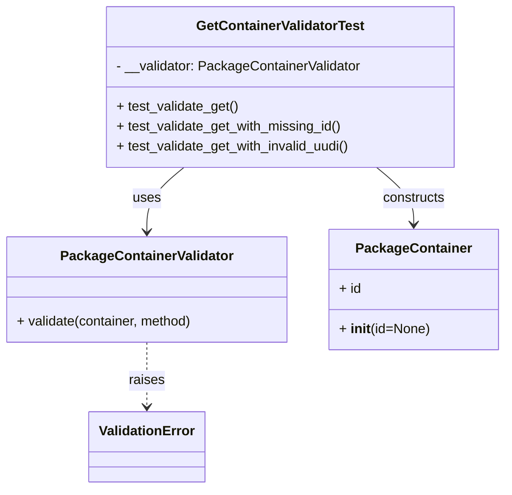

# Diagram: partview_core/partview_service/partview_service/tests/unit/core/validators/package_container/container_get_validator_test.py


> Auto-generated by Obscura crawlers

## Diagram 1



### SVG

<svg id="container" width="598.5703125" xmlns="http://www.w3.org/2000/svg" class="classDiagram" height="584" viewBox="0 0 598.5703125 584" role="graphics-document document" aria-roledescription="class"><style>#container{font-family:"trebuchet ms",verdana,arial,sans-serif;font-size:16px;fill:#333;}@keyframes edge-animation-frame{from{stroke-dashoffset:0;}}@keyframes dash{to{stroke-dashoffset:0;}}#container .edge-animation-slow{stroke-dasharray:9,5!important;stroke-dashoffset:900;animation:dash 50s linear infinite;stroke-linecap:round;}#container .edge-animation-fast{stroke-dasharray:9,5!important;stroke-dashoffset:900;animation:dash 20s linear infinite;stroke-linecap:round;}#container .error-icon{fill:#552222;}#container .error-text{fill:#552222;stroke:#552222;}#container .edge-thickness-normal{stroke-width:1px;}#container .edge-thickness-thick{stroke-width:3.5px;}#container .edge-pattern-solid{stroke-dasharray:0;}#container .edge-thickness-invisible{stroke-width:0;fill:none;}#container .edge-pattern-dashed{stroke-dasharray:3;}#container .edge-pattern-dotted{stroke-dasharray:2;}#container .marker{fill:#333333;stroke:#333333;}#container .marker.cross{stroke:#333333;}#container svg{font-family:"trebuchet ms",verdana,arial,sans-serif;font-size:16px;}#container p{margin:0;}#container g.classGroup text{fill:#9370DB;stroke:none;font-family:"trebuchet ms",verdana,arial,sans-serif;font-size:10px;}#container g.classGroup text .title{font-weight:bolder;}#container .nodeLabel,#container .edgeLabel{color:#131300;}#container .edgeLabel .label rect{fill:#ECECFF;}#container .label text{fill:#131300;}#container .labelBkg{background:#ECECFF;}#container .edgeLabel .label span{background:#ECECFF;}#container .classTitle{font-weight:bolder;}#container .node rect,#container .node circle,#container .node ellipse,#container .node polygon,#container .node path{fill:#ECECFF;stroke:#9370DB;stroke-width:1px;}#container .divider{stroke:#9370DB;stroke-width:1;}#container g.clickable{cursor:pointer;}#container g.classGroup rect{fill:#ECECFF;stroke:#9370DB;}#container g.classGroup line{stroke:#9370DB;stroke-width:1;}#container .classLabel .box{stroke:none;stroke-width:0;fill:#ECECFF;opacity:0.5;}#container .classLabel .label{fill:#9370DB;font-size:10px;}#container .relation{stroke:#333333;stroke-width:1;fill:none;}#container .dashed-line{stroke-dasharray:3;}#container .dotted-line{stroke-dasharray:1 2;}#container #compositionStart,#container .composition{fill:#333333!important;stroke:#333333!important;stroke-width:1;}#container #compositionEnd,#container .composition{fill:#333333!important;stroke:#333333!important;stroke-width:1;}#container #dependencyStart,#container .dependency{fill:#333333!important;stroke:#333333!important;stroke-width:1;}#container #dependencyStart,#container .dependency{fill:#333333!important;stroke:#333333!important;stroke-width:1;}#container #extensionStart,#container .extension{fill:transparent!important;stroke:#333333!important;stroke-width:1;}#container #extensionEnd,#container .extension{fill:transparent!important;stroke:#333333!important;stroke-width:1;}#container #aggregationStart,#container .aggregation{fill:transparent!important;stroke:#333333!important;stroke-width:1;}#container #aggregationEnd,#container .aggregation{fill:transparent!important;stroke:#333333!important;stroke-width:1;}#container #lollipopStart,#container .lollipop{fill:#ECECFF!important;stroke:#333333!important;stroke-width:1;}#container #lollipopEnd,#container .lollipop{fill:#ECECFF!important;stroke:#333333!important;stroke-width:1;}#container .edgeTerminals{font-size:11px;line-height:initial;}#container .classTitleText{text-anchor:middle;font-size:18px;fill:#333;}#container .label-icon{display:inline-block;height:1em;overflow:visible;vertical-align:-0.125em;}#container .node .label-icon path{fill:currentColor;stroke:revert;stroke-width:revert;}#container :root{--mermaid-font-family:"trebuchet ms",verdana,arial,sans-serif;}</style><g><defs><marker id="container_class-aggregationStart" class="marker aggregation class" refX="18" refY="7" markerWidth="190" markerHeight="240" orient="auto"><path d="M 18,7 L9,13 L1,7 L9,1 Z"></path></marker></defs><defs><marker id="container_class-aggregationEnd" class="marker aggregation class" refX="1" refY="7" markerWidth="20" markerHeight="28" orient="auto"><path d="M 18,7 L9,13 L1,7 L9,1 Z"></path></marker></defs><defs><marker id="container_class-extensionStart" class="marker extension class" refX="18" refY="7" markerWidth="190" markerHeight="240" orient="auto"><path d="M 1,7 L18,13 V 1 Z"></path></marker></defs><defs><marker id="container_class-extensionEnd" class="marker extension class" refX="1" refY="7" markerWidth="20" markerHeight="28" orient="auto"><path d="M 1,1 V 13 L18,7 Z"></path></marker></defs><defs><marker id="container_class-compositionStart" class="marker composition class" refX="18" refY="7" markerWidth="190" markerHeight="240" orient="auto"><path d="M 18,7 L9,13 L1,7 L9,1 Z"></path></marker></defs><defs><marker id="container_class-compositionEnd" class="marker composition class" refX="1" refY="7" markerWidth="20" markerHeight="28" orient="auto"><path d="M 18,7 L9,13 L1,7 L9,1 Z"></path></marker></defs><defs><marker id="container_class-dependencyStart" class="marker dependency class" refX="6" refY="7" markerWidth="190" markerHeight="240" orient="auto"><path d="M 5,7 L9,13 L1,7 L9,1 Z"></path></marker></defs><defs><marker id="container_class-dependencyEnd" class="marker dependency class" refX="13" refY="7" markerWidth="20" markerHeight="28" orient="auto"><path d="M 18,7 L9,13 L14,7 L9,1 Z"></path></marker></defs><defs><marker id="container_class-lollipopStart" class="marker lollipop class" refX="13" refY="7" markerWidth="190" markerHeight="240" orient="auto"><circle stroke="black" fill="transparent" cx="7" cy="7" r="6"></circle></marker></defs><defs><marker id="container_class-lollipopEnd" class="marker lollipop class" refX="1" refY="7" markerWidth="190" markerHeight="240" orient="auto"><circle stroke="black" fill="transparent" cx="7" cy="7" r="6"></circle></marker></defs><g class="root"><g class="clusters"></g><g class="edgePaths"><path d="M219.803,200L212.471,206.167C205.138,212.333,190.473,224.667,183.141,237.5C175.809,250.333,175.809,263.667,175.809,270.333L175.809,277" id="id_GetContainerValidatorTest_PackageContainerValidator_1" class="edge-thickness-normal edge-pattern-solid relation" style=";;;" data-edge="true" data-et="edge" data-id="id_GetContainerValidatorTest_PackageContainerValidator_1" data-points="W3sieCI6MjE5LjgwMzE0NTU1OTIxMDUyLCJ5IjoyMDB9LHsieCI6MTc1LjgwODU5Mzc1LCJ5IjoyMzd9LHsieCI6MTc1LjgwODU5Mzc1LCJ5IjoyODN9XQ==" marker-end="url(#container_class-dependencyEnd)"></path><path d="M448.099,200L455.432,206.167C462.764,212.333,477.429,224.667,484.761,236C492.094,247.333,492.094,257.667,492.094,262.833L492.094,268" id="id_GetContainerValidatorTest_PackageContainer_2" class="edge-thickness-normal edge-pattern-solid relation" style=";;;" data-edge="true" data-et="edge" data-id="id_GetContainerValidatorTest_PackageContainer_2" data-points="W3sieCI6NDQ4LjA5OTE5ODE5MDc4OTUsInkiOjIwMH0seyJ4Ijo0OTIuMDkzNzUsInkiOjIzN30seyJ4Ijo0OTIuMDkzNzUsInkiOjI3NH1d" marker-end="url(#container_class-dependencyEnd)"></path><path d="M175.809,409L175.809,416.667C175.809,424.333,175.809,439.667,175.809,452.5C175.809,465.333,175.809,475.667,175.809,480.833L175.809,486" id="id_PackageContainerValidator_ValidationError_3" class="edge-thickness-normal edge-pattern-dashed relation" style=";;;" data-edge="true" data-et="edge" data-id="id_PackageContainerValidator_ValidationError_3" data-points="W3sieCI6MTc1LjgwODU5Mzc1LCJ5Ijo0MDl9LHsieCI6MTc1LjgwODU5Mzc1LCJ5Ijo0NTV9LHsieCI6MTc1LjgwODU5Mzc1LCJ5Ijo0OTJ9XQ==" marker-end="url(#container_class-dependencyEnd)"></path></g><g class="edgeLabels"><g class="edgeLabel" transform="translate(175.80859375, 237)"><g class="label" data-id="id_GetContainerValidatorTest_PackageContainerValidator_1" transform="translate(-16.4921875, -12)"><foreignObject width="32.984375" height="24"><div xmlns="http://www.w3.org/1999/xhtml" class="labelBkg" style="display: table-cell; white-space: nowrap; line-height: 1.5; max-width: 200px; text-align: center;"><span class="edgeLabel"><p>uses</p></span></div></foreignObject></g></g><g class="edgeLabel" transform="translate(492.09375, 237)"><g class="label" data-id="id_GetContainerValidatorTest_PackageContainer_2" transform="translate(-37.84375, -12)"><foreignObject width="75.6875" height="24"><div xmlns="http://www.w3.org/1999/xhtml" class="labelBkg" style="display: table-cell; white-space: nowrap; line-height: 1.5; max-width: 200px; text-align: center;"><span class="edgeLabel"><p>constructs</p></span></div></foreignObject></g></g><g class="edgeLabel" transform="translate(175.80859375, 455)"><g class="label" data-id="id_PackageContainerValidator_ValidationError_3" transform="translate(-21.25, -12)"><foreignObject width="42.5" height="24"><div xmlns="http://www.w3.org/1999/xhtml" class="labelBkg" style="display: table-cell; white-space: nowrap; line-height: 1.5; max-width: 200px; text-align: center;"><span class="edgeLabel"><p>raises</p></span></div></foreignObject></g></g></g><g class="nodes"><g class="node default" id="classId-GetContainerValidatorTest-0" transform="translate(333.951171875, 104)"><g class="basic label-container"><path d="M-207.109375 -96 L207.109375 -96 L207.109375 96 L-207.109375 96" stroke="none" stroke-width="0" fill="#ECECFF" style=""></path><path d="M-207.109375 -96 C-47.076803629321574 -96, 112.95576774135685 -96, 207.109375 -96 M-207.109375 -96 C-53.51307124442235 -96, 100.0832325111553 -96, 207.109375 -96 M207.109375 -96 C207.109375 -27.874202992160434, 207.109375 40.25159401567913, 207.109375 96 M207.109375 -96 C207.109375 -34.66551880277457, 207.109375 26.66896239445086, 207.109375 96 M207.109375 96 C114.14895535216016 96, 21.188535704320316 96, -207.109375 96 M207.109375 96 C100.72117777626345 96, -5.667019447473109 96, -207.109375 96 M-207.109375 96 C-207.109375 47.461002947885255, -207.109375 -1.0779941042294894, -207.109375 -96 M-207.109375 96 C-207.109375 25.63389771400803, -207.109375 -44.73220457198394, -207.109375 -96" stroke="#9370DB" stroke-width="1.3" fill="none" stroke-dasharray="0 0" style=""></path></g><g class="annotation-group text" transform="translate(0, -72)"></g><g class="label-group text" transform="translate(-96.703125, -72)"><g class="label" style="font-weight: bolder" transform="translate(0,-12)"><foreignObject width="193.40625" height="24"><div xmlns="http://www.w3.org/1999/xhtml" style="display: table-cell; white-space: nowrap; line-height: 1.5; max-width: 240px; text-align: center;"><span class="nodeLabel markdown-node-label" style=""><p>GetContainerValidatorTest</p></span></div></foreignObject></g></g><g class="members-group text" transform="translate(-195.109375, -24)"><g class="label" style="" transform="translate(0,-12)"><foreignObject width="293.515625" height="24"><div xmlns="http://www.w3.org/1999/xhtml" style="display: table-cell; white-space: nowrap; line-height: 1.5; max-width: 352px; text-align: center;"><span class="nodeLabel markdown-node-label" style=""><p>- __validator: PackageContainerValidator</p></span></div></foreignObject></g></g><g class="methods-group text" transform="translate(-195.109375, 24)"><g class="label" style="" transform="translate(0,-12)"><foreignObject width="146.53125" height="24"><div xmlns="http://www.w3.org/1999/xhtml" style="display: table-cell; white-space: nowrap; line-height: 1.5; max-width: 204px; text-align: center;"><span class="nodeLabel markdown-node-label" style=""><p>+ test_validate_get()</p></span></div></foreignObject></g><g class="label" style="" transform="translate(0,12)"><foreignObject width="271.671875" height="24"><div xmlns="http://www.w3.org/1999/xhtml" style="display: table-cell; white-space: nowrap; line-height: 1.5; max-width: 329px; text-align: center;"><span class="nodeLabel markdown-node-label" style=""><p>+ test_validate_get_with_missing_id()</p></span></div></foreignObject></g><g class="label" style="" transform="translate(0,36)"><foreignObject width="283.40625" height="24"><div xmlns="http://www.w3.org/1999/xhtml" style="display: table-cell; white-space: nowrap; line-height: 1.5; max-width: 341px; text-align: center;"><span class="nodeLabel markdown-node-label" style=""><p>+ test_validate_get_with_invalid_uudi()</p></span></div></foreignObject></g></g><g class="divider" style=""><path d="M-207.109375 -48 C-69.11115537908637 -48, 68.88706424182726 -48, 207.109375 -48 M-207.109375 -48 C-90.38248569337458 -48, 26.344403613250847 -48, 207.109375 -48" stroke="#9370DB" stroke-width="1.3" fill="none" stroke-dasharray="0 0" style=""></path></g><g class="divider" style=""><path d="M-207.109375 0 C-102.75425180909984 0, 1.6008713818003173 0, 207.109375 0 M-207.109375 0 C-68.30725758218162 0, 70.49485983563676 0, 207.109375 0" stroke="#9370DB" stroke-width="1.3" fill="none" stroke-dasharray="0 0" style=""></path></g></g><g class="node default" id="classId-PackageContainerValidator-1" transform="translate(175.80859375, 346)"><g class="basic label-container"><path d="M-167.80859375 -63 L167.80859375 -63 L167.80859375 63 L-167.80859375 63" stroke="none" stroke-width="0" fill="#ECECFF" style=""></path><path d="M-167.80859375 -63 C-74.94077902986677 -63, 17.92703569026645 -63, 167.80859375 -63 M-167.80859375 -63 C-62.97219941395727 -63, 41.86419492208546 -63, 167.80859375 -63 M167.80859375 -63 C167.80859375 -35.351400464306124, 167.80859375 -7.702800928612248, 167.80859375 63 M167.80859375 -63 C167.80859375 -30.845471922251967, 167.80859375 1.3090561554960658, 167.80859375 63 M167.80859375 63 C70.2653605028853 63, -27.2778727442294 63, -167.80859375 63 M167.80859375 63 C40.0718342392331 63, -87.6649252715338 63, -167.80859375 63 M-167.80859375 63 C-167.80859375 18.838676031574067, -167.80859375 -25.322647936851865, -167.80859375 -63 M-167.80859375 63 C-167.80859375 33.25495230131055, -167.80859375 3.5099046026210985, -167.80859375 -63" stroke="#9370DB" stroke-width="1.3" fill="none" stroke-dasharray="0 0" style=""></path></g><g class="annotation-group text" transform="translate(0, -39)"></g><g class="label-group text" transform="translate(-98.6328125, -39)"><g class="label" style="font-weight: bolder" transform="translate(0,-12)"><foreignObject width="197.265625" height="24"><div xmlns="http://www.w3.org/1999/xhtml" style="display: table-cell; white-space: nowrap; line-height: 1.5; max-width: 245px; text-align: center;"><span class="nodeLabel markdown-node-label" style=""><p>PackageContainerValidator</p></span></div></foreignObject></g></g><g class="members-group text" transform="translate(-155.80859375, 9)"></g><g class="methods-group text" transform="translate(-155.80859375, 39)"><g class="label" style="" transform="translate(0,-12)"><foreignObject width="212.984375" height="24"><div xmlns="http://www.w3.org/1999/xhtml" style="display: table-cell; white-space: nowrap; line-height: 1.5; max-width: 270px; text-align: center;"><span class="nodeLabel markdown-node-label" style=""><p>+ validate(container, method)</p></span></div></foreignObject></g></g><g class="divider" style=""><path d="M-167.80859375 -15 C-81.50412355490799 -15, 4.800346640184017 -15, 167.80859375 -15 M-167.80859375 -15 C-70.57021815369207 -15, 26.668157442615865 -15, 167.80859375 -15" stroke="#9370DB" stroke-width="1.3" fill="none" stroke-dasharray="0 0" style=""></path></g><g class="divider" style=""><path d="M-167.80859375 9 C-35.11986436973825 9, 97.5688650105235 9, 167.80859375 9 M-167.80859375 9 C-94.48030642709216 9, -21.15201910418432 9, 167.80859375 9" stroke="#9370DB" stroke-width="1.3" fill="none" stroke-dasharray="0 0" style=""></path></g></g><g class="node default" id="classId-PackageContainer-2" transform="translate(492.09375, 346)"><g class="basic label-container"><path d="M-98.4765625 -72 L98.4765625 -72 L98.4765625 72 L-98.4765625 72" stroke="none" stroke-width="0" fill="#ECECFF" style=""></path><path d="M-98.4765625 -72 C-30.897235288936074 -72, 36.68209192212785 -72, 98.4765625 -72 M-98.4765625 -72 C-39.92759378029775 -72, 18.621374939404504 -72, 98.4765625 -72 M98.4765625 -72 C98.4765625 -17.893588598703545, 98.4765625 36.21282280259291, 98.4765625 72 M98.4765625 -72 C98.4765625 -26.066672422919403, 98.4765625 19.866655154161194, 98.4765625 72 M98.4765625 72 C51.61252863427846 72, 4.748494768556924 72, -98.4765625 72 M98.4765625 72 C58.289259672335675 72, 18.10195684467135 72, -98.4765625 72 M-98.4765625 72 C-98.4765625 39.12034337276563, -98.4765625 6.240686745531264, -98.4765625 -72 M-98.4765625 72 C-98.4765625 25.530447899467084, -98.4765625 -20.93910420106583, -98.4765625 -72" stroke="#9370DB" stroke-width="1.3" fill="none" stroke-dasharray="0 0" style=""></path></g><g class="annotation-group text" transform="translate(0, -48)"></g><g class="label-group text" transform="translate(-65.453125, -48)"><g class="label" style="font-weight: bolder" transform="translate(0,-12)"><foreignObject width="130.90625" height="24"><div xmlns="http://www.w3.org/1999/xhtml" style="display: table-cell; white-space: nowrap; line-height: 1.5; max-width: 179px; text-align: center;"><span class="nodeLabel markdown-node-label" style=""><p>PackageContainer</p></span></div></foreignObject></g></g><g class="members-group text" transform="translate(-86.4765625, 0)"><g class="label" style="" transform="translate(0,-12)"><foreignObject width="26.3125" height="24"><div xmlns="http://www.w3.org/1999/xhtml" style="display: table-cell; white-space: nowrap; line-height: 1.5; max-width: 84px; text-align: center;"><span class="nodeLabel markdown-node-label" style=""><p>+ id</p></span></div></foreignObject></g></g><g class="methods-group text" transform="translate(-86.4765625, 48)"><g class="label" style="" transform="translate(0,-12)"><foreignObject width="107.5" height="24"><div xmlns="http://www.w3.org/1999/xhtml" style="display: table-cell; white-space: nowrap; line-height: 1.5; max-width: 198px; text-align: center;"><span class="nodeLabel markdown-node-label" style=""><p>+ <strong>init</strong>(id=None)</p></span></div></foreignObject></g></g><g class="divider" style=""><path d="M-98.4765625 -24 C-48.59835879164497 -24, 1.2798449167100614 -24, 98.4765625 -24 M-98.4765625 -24 C-28.41989068586537 -24, 41.63678112826926 -24, 98.4765625 -24" stroke="#9370DB" stroke-width="1.3" fill="none" stroke-dasharray="0 0" style=""></path></g><g class="divider" style=""><path d="M-98.4765625 24 C-47.51926815287081 24, 3.4380261942583843 24, 98.4765625 24 M-98.4765625 24 C-35.24451851254997 24, 27.987525474900053 24, 98.4765625 24" stroke="#9370DB" stroke-width="1.3" fill="none" stroke-dasharray="0 0" style=""></path></g></g><g class="node default" id="classId-ValidationError-3" transform="translate(175.80859375, 534)"><g class="basic label-container"><path d="M-67.1796875 -42 L67.1796875 -42 L67.1796875 42 L-67.1796875 42" stroke="none" stroke-width="0" fill="#ECECFF" style=""></path><path d="M-67.1796875 -42 C-33.77999939985096 -42, -0.3803112997019156 -42, 67.1796875 -42 M-67.1796875 -42 C-38.97274408157066 -42, -10.76580066314132 -42, 67.1796875 -42 M67.1796875 -42 C67.1796875 -17.59127537364672, 67.1796875 6.8174492527065595, 67.1796875 42 M67.1796875 -42 C67.1796875 -19.218278026757254, 67.1796875 3.563443946485492, 67.1796875 42 M67.1796875 42 C14.371868230101974 42, -38.43595103979605 42, -67.1796875 42 M67.1796875 42 C29.901621686328774 42, -7.376444127342452 42, -67.1796875 42 M-67.1796875 42 C-67.1796875 13.155655322146501, -67.1796875 -15.688689355706998, -67.1796875 -42 M-67.1796875 42 C-67.1796875 20.81502093426689, -67.1796875 -0.3699581314662197, -67.1796875 -42" stroke="#9370DB" stroke-width="1.3" fill="none" stroke-dasharray="0 0" style=""></path></g><g class="annotation-group text" transform="translate(0, -18)"></g><g class="label-group text" transform="translate(-55.1796875, -18)"><g class="label" style="font-weight: bolder" transform="translate(0,-12)"><foreignObject width="110.359375" height="24"><div xmlns="http://www.w3.org/1999/xhtml" style="display: table-cell; white-space: nowrap; line-height: 1.5; max-width: 160px; text-align: center;"><span class="nodeLabel markdown-node-label" style=""><p>ValidationError</p></span></div></foreignObject></g></g><g class="members-group text" transform="translate(-55.1796875, 30)"></g><g class="methods-group text" transform="translate(-55.1796875, 60)"></g><g class="divider" style=""><path d="M-67.1796875 6 C-15.05676662226012 6, 37.06615425547976 6, 67.1796875 6 M-67.1796875 6 C-16.824419718841334 6, 33.53084806231733 6, 67.1796875 6" stroke="#9370DB" stroke-width="1.3" fill="none" stroke-dasharray="0 0" style=""></path></g><g class="divider" style=""><path d="M-67.1796875 24 C-22.017670926826135 24, 23.14434564634773 24, 67.1796875 24 M-67.1796875 24 C-34.543243495296636 24, -1.9067994905932721 24, 67.1796875 24" stroke="#9370DB" stroke-width="1.3" fill="none" stroke-dasharray="0 0" style=""></path></g></g></g></g></g></svg>

## Diagram 2

```mermaid
flowchart TD
    A[Test: test_validate_get] -->|PackageContainer(id=valid UUID)| B[PackageContainerValidator.validate]
    B -->|no exception| C[Pass]

    D[Test: test_validate_get_with_missing_id] -->|PackageContainer() with id=None| B2[PackageContainerValidator.validate]
    B2 -->|raises ValidationError| E[Raise ValidationError]

    F[Test: test_validate_get_with_invalid_uudi] -->|PackageContainer(id="aaaa")| B3[PackageContainerValidator.validate]
    B3 -->|raises ValidationError| E

    C --- G[Test runner]
    E --- G
```

> SVG rendering failed for this diagram.
