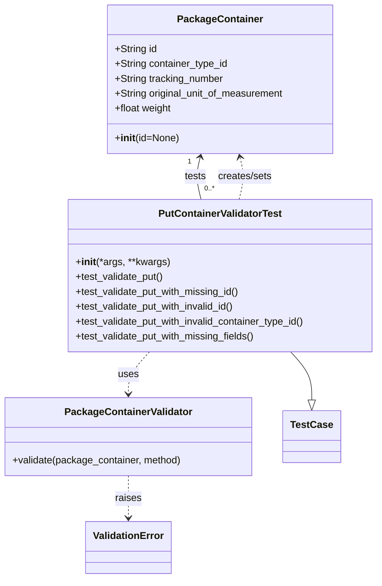

# Diagram: partview_core/partview_service/partview_service/tests/unit/core/validators/package_container/container_put_validator_test.py

> Auto-generated by Obscura crawlers

## Mermaid

### SVG

<svg id="container" width="610.755859375" xmlns="http://www.w3.org/2000/svg" class="classDiagram" height="934" viewBox="0 0 610.755859375 934" role="graphics-document document" aria-roledescription="class"><g><defs><marker id="container_class-aggregationStart" class="marker aggregation class" refX="18" refY="7" markerWidth="190" markerHeight="240" orient="auto"><path d="M 18,7 L9,13 L1,7 L9,1 Z"></path></marker></defs><defs><marker id="container_class-aggregationEnd" class="marker aggregation class" refX="1" refY="7" markerWidth="20" markerHeight="28" orient="auto"><path d="M 18,7 L9,13 L1,7 L9,1 Z"></path></marker></defs><defs><marker id="container_class-extensionStart" class="marker extension class" refX="18" refY="7" markerWidth="190" markerHeight="240" orient="auto"><path d="M 1,7 L18,13 V 1 Z"></path></marker></defs><defs><marker id="container_class-extensionEnd" class="marker extension class" refX="1" refY="7" markerWidth="20" markerHeight="28" orient="auto"><path d="M 1,1 V 13 L18,7 Z"></path></marker></defs><defs><marker id="container_class-compositionStart" class="marker composition class" refX="18" refY="7" markerWidth="190" markerHeight="240" orient="auto"><path d="M 18,7 L9,13 L1,7 L9,1 Z"></path></marker></defs><defs><marker id="container_class-compositionEnd" class="marker composition class" refX="1" refY="7" markerWidth="20" markerHeight="28" orient="auto"><path d="M 18,7 L9,13 L1,7 L9,1 Z"></path></marker></defs><defs><marker id="container_class-dependencyStart" class="marker dependency class" refX="6" refY="7" markerWidth="190" markerHeight="240" orient="auto"><path d="M 5,7 L9,13 L1,7 L9,1 Z"></path></marker></defs><defs><marker id="container_class-dependencyEnd" class="marker dependency class" refX="13" refY="7" markerWidth="20" markerHeight="28" orient="auto"><path d="M 18,7 L9,13 L14,7 L9,1 Z"></path></marker></defs><defs><marker id="container_class-lollipopStart" class="marker lollipop class" refX="13" refY="7" markerWidth="190" markerHeight="240" orient="auto"><circle stroke="black" fill="transparent" cx="7" cy="7" r="6"></circle></marker></defs><defs><marker id="container_class-lollipopEnd" class="marker lollipop class" refX="1" refY="7" markerWidth="190" markerHeight="240" orient="auto"><circle stroke="black" fill="transparent" cx="7" cy="7" r="6"></circle></marker></defs><g class="root"><g class="clusters"></g><g class="edgePaths"><path d="M466.315,568L471.967,574.167C477.619,580.333,488.923,592.667,494.575,605.625C500.227,618.583,500.227,632.167,500.227,638.958L500.227,645.75" id="id_PutContainerValidatorTest_TestCase_1" class="edge-thickness-normal edge-pattern-solid relation" style=";;;" data-edge="true" data-et="edge" data-id="id_PutContainerValidatorTest_TestCase_1" data-points="W3sieCI6NDY2LjMxNDU2Mjk4ODI4MTI0LCJ5Ijo1Njh9LHsieCI6NTAwLjIyNjU2MjUsInkiOjYwNX0seyJ4Ijo1MDAuMjI2NTYyNSwieSI6NjYzfV0=" marker-end="url(#container_class-extensionEnd)"></path><path d="M385.216,322L386.802,315.833C388.388,309.667,391.56,297.333,391.784,285.967C392.007,274.601,389.281,264.203,387.918,259.003L386.555,253.804" id="id_PutContainerValidatorTest_PackageContainer_2" class="edge-thickness-normal edge-pattern-dashed relation" style=";;;" data-edge="true" data-et="edge" data-id="id_PutContainerValidatorTest_PackageContainer_2" data-points="W3sieCI6Mzg1LjIxNTk0MjM4MjgxMjUsInkiOjMyMn0seyJ4IjozOTQuNzMyNDIxODc1LCJ5IjoyODV9LHsieCI6Mzg1LjAzNDA5ODgyNTYzNjkzLCJ5IjoyNDh9XQ==" marker-end="url(#container_class-dependencyEnd)"></path><path d="M240.846,568L235.194,574.167C229.542,580.333,218.238,592.667,212.586,604C206.934,615.333,206.934,625.667,206.934,630.833L206.934,636" id="id_PutContainerValidatorTest_PackageContainerValidator_3" class="edge-thickness-normal edge-pattern-dashed relation" style=";;;" data-edge="true" data-et="edge" data-id="id_PutContainerValidatorTest_PackageContainerValidator_3" data-points="W3sieCI6MjQwLjg0NTU5MzI2MTcxODc2LCJ5Ijo1Njh9LHsieCI6MjA2LjkzMzU5Mzc1LCJ5Ijo2MDV9LHsieCI6MjA2LjkzMzU5Mzc1LCJ5Ijo2NDJ9XQ==" marker-end="url(#container_class-dependencyEnd)"></path><path d="M206.934,768L206.934,774.167C206.934,780.333,206.934,792.667,206.934,804C206.934,815.333,206.934,825.667,206.934,830.833L206.934,836" id="id_PackageContainerValidator_ValidationError_4" class="edge-thickness-normal edge-pattern-dashed relation" style=";;;" data-edge="true" data-et="edge" data-id="id_PackageContainerValidator_ValidationError_4" data-points="W3sieCI6MjA2LjkzMzU5Mzc1LCJ5Ijo3Njh9LHsieCI6MjA2LjkzMzU5Mzc1LCJ5Ijo4MDV9LHsieCI6MjA2LjkzMzU5Mzc1LCJ5Ijo4NDJ9XQ==" marker-end="url(#container_class-dependencyEnd)"></path><path d="M320.605,253.804L319.242,259.003C317.879,264.203,315.153,274.601,315.377,285.967C315.6,297.333,318.772,309.667,320.358,315.833L321.944,322" id="id_PackageContainer_PutContainerValidatorTest_5" class="edge-thickness-normal edge-pattern-solid relation" style=";;;" data-edge="true" data-et="edge" data-id="id_PackageContainer_PutContainerValidatorTest_5" data-points="W3sieCI6MzIyLjEyNjA1NzQyNDM2MzA3LCJ5IjoyNDh9LHsieCI6MzEyLjQyNzczNDM3NSwieSI6Mjg1fSx7IngiOjMyMS45NDQyMTM4NjcxODc1LCJ5IjozMjJ9XQ==" marker-start="url(#container_class-dependencyStart)"></path></g><g class="edgeLabels"><g class="edgeLabel"><g class="label" data-id="id_PutContainerValidatorTest_TestCase_1" transform="translate(0, 0)"><foreignObject width="0" height="0">

</foreignObject></g></g><g class="edgeLabel" transform="translate(394.72663, 284.9779)"><g class="label" data-id="id_PutContainerValidatorTest_PackageContainer_2" transform="translate(-44.8125, -12)"><foreignObject width="89.625" height="24">

creates/sets

</foreignObject></g></g><g class="edgeLabel" transform="translate(206.93359375, 605)"><g class="label" data-id="id_PutContainerValidatorTest_PackageContainerValidator_3" transform="translate(-16.4921875, -12)"><foreignObject width="32.984375" height="24">

uses

</foreignObject></g></g><g class="edgeLabel" transform="translate(206.93359375, 805)"><g class="label" data-id="id_PackageContainerValidator_ValidationError_4" transform="translate(-21.25, -12)"><foreignObject width="42.5" height="24">

raises

</foreignObject></g></g><g class="edgeLabel" transform="translate(312.43353, 284.9779)"><g class="label" data-id="id_PackageContainer_PutContainerValidatorTest_5" transform="translate(-17.4921875, -12)"><foreignObject width="34.984375" height="24">

tests

</foreignObject></g></g><g class="edgeTerminals" transform="translate(303.1790797372799, 261.1248649439685)"><g class="inner" transform="translate(0, 0)"><foreignObject style="width: 9px; height: 12px;">
1
</foreignObject></g></g><g class="edgeTerminals" transform="translate(327.11223796475906, 296.31519077142065)"><g class="inner" transform="translate(0, 0)"></g><foreignObject style="width: 36px; height: 12px;">
0..*
</foreignObject></g></g><g class="nodes"><g class="node default" id="classId-PackageContainer-0" transform="translate(353.580078125, 128)"><g class="basic label-container"><path d="M-183.2578125 -120 L183.2578125 -120 L183.2578125 120 L-183.2578125 120" stroke="none" stroke-width="0" fill="#ECECFF" style=""></path><path d="M-183.2578125 -120 C-75.21011107159423 -120, 32.837590356811546 -120, 183.2578125 -120 M-183.2578125 -120 C-75.51730017928958 -120, 32.223212141420845 -120, 183.2578125 -120 M183.2578125 -120 C183.2578125 -31.194123811055874, 183.2578125 57.61175237788825, 183.2578125 120 M183.2578125 -120 C183.2578125 -54.24348723501724, 183.2578125 11.513025529965518, 183.2578125 120 M183.2578125 120 C107.50762182486368 120, 31.757431149727353 120, -183.2578125 120 M183.2578125 120 C84.30763625286524 120, -14.642539994269526 120, -183.2578125 120 M-183.2578125 120 C-183.2578125 36.65015405181653, -183.2578125 -46.69969189636694, -183.2578125 -120 M-183.2578125 120 C-183.2578125 36.29345421750426, -183.2578125 -47.413091564991475, -183.2578125 -120" stroke="#9370DB" stroke-width="1.3" fill="none" stroke-dasharray="0 0" style=""></path></g><g class="annotation-group text" transform="translate(0, -96)"></g><g class="label-group text" transform="translate(-65.453125, -96)"><g class="label" style="font-weight: bolder" transform="translate(0,-12)"><foreignObject width="130.90625" height="24">

PackageContainer

</foreignObject></g></g><g class="members-group text" transform="translate(-171.2578125, -48)"><g class="label" style="" transform="translate(0,-12)"><foreignObject width="68.546875" height="24">

+String id

</foreignObject></g><g class="label" style="" transform="translate(0,12)"><foreignObject width="184.265625" height="24">

+String container_type_id

</foreignObject></g><g class="label" style="" transform="translate(0,36)"><foreignObject width="177.796875" height="24">

+String tracking_number

</foreignObject></g><g class="label" style="" transform="translate(0,60)"><foreignObject width="277.0625" height="24">

+String original_unit_of_measurement

</foreignObject></g><g class="label" style="" transform="translate(0,84)"><foreignObject width="93.21875" height="24">

+float weight

</foreignObject></g></g><g class="methods-group text" transform="translate(-171.2578125, 96)"><g class="label" style="" transform="translate(0,-12)"><foreignObject width="103.25" height="24">

+<strong>init</strong>(id=None)

</foreignObject></g></g><g class="divider" style=""><path d="M-183.2578125 -72 C-58.39210052360349 -72, 66.47361145279302 -72, 183.2578125 -72 M-183.2578125 -72 C-40.77947990118875 -72, 101.6988526976225 -72, 183.2578125 -72" stroke="#9370DB" stroke-width="1.3" fill="none" stroke-dasharray="0 0" style=""></path></g><g class="divider" style=""><path d="M-183.2578125 72 C-42.6229164164896 72, 98.0119796670208 72, 183.2578125 72 M-183.2578125 72 C-74.43886325052604 72, 34.38008599894792 72, 183.2578125 72" stroke="#9370DB" stroke-width="1.3" fill="none" stroke-dasharray="0 0" style=""></path></g></g><g class="node default" id="classId-PackageContainerValidator-1" transform="translate(206.93359375, 705)"><g class="basic label-container"><path d="M-198.93359375 -63 L198.93359375 -63 L198.93359375 63 L-198.93359375 63" stroke="none" stroke-width="0" fill="#ECECFF" style=""></path><path d="M-198.93359375 -63 C-80.88144211639275 -63, 37.170709517214505 -63, 198.93359375 -63 M-198.93359375 -63 C-51.44659664786417 -63, 96.04040045427166 -63, 198.93359375 -63 M198.93359375 -63 C198.93359375 -17.19979940013429, 198.93359375 28.600401199731422, 198.93359375 63 M198.93359375 -63 C198.93359375 -29.567784189857107, 198.93359375 3.864431620285785, 198.93359375 63 M198.93359375 63 C107.22608870929307 63, 15.518583668586132 63, -198.93359375 63 M198.93359375 63 C93.05823925106482 63, -12.817115247870362 63, -198.93359375 63 M-198.93359375 63 C-198.93359375 25.44110761317041, -198.93359375 -12.117784773659181, -198.93359375 -63 M-198.93359375 63 C-198.93359375 16.99543763964914, -198.93359375 -29.00912472070172, -198.93359375 -63" stroke="#9370DB" stroke-width="1.3" fill="none" stroke-dasharray="0 0" style=""></path></g><g class="annotation-group text" transform="translate(0, -39)"></g><g class="label-group text" transform="translate(-98.6328125, -39)"><g class="label" style="font-weight: bolder" transform="translate(0,-12)"><foreignObject width="197.265625" height="24">

PackageContainerValidator

</foreignObject></g></g><g class="members-group text" transform="translate(-186.93359375, 9)"></g><g class="methods-group text" transform="translate(-186.93359375, 39)"><g class="label" style="" transform="translate(0,-12)"><foreignObject width="275.234375" height="24">

+validate(package_container, method)

</foreignObject></g></g><g class="divider" style=""><path d="M-198.93359375 -15 C-115.0503259071602 -15, -31.1670580643204 -15, 198.93359375 -15 M-198.93359375 -15 C-117.60822430199772 -15, -36.282854853995445 -15, 198.93359375 -15" stroke="#9370DB" stroke-width="1.3" fill="none" stroke-dasharray="0 0" style=""></path></g><g class="divider" style=""><path d="M-198.93359375 9 C-69.94914609997136 9, 59.035301550057284 9, 198.93359375 9 M-198.93359375 9 C-69.23046350424184 9, 60.47266674151632 9, 198.93359375 9" stroke="#9370DB" stroke-width="1.3" fill="none" stroke-dasharray="0 0" style=""></path></g></g><g class="node default" id="classId-ValidationError-2" transform="translate(206.93359375, 884)"><g class="basic label-container"><path d="M-67.1796875 -42 L67.1796875 -42 L67.1796875 42 L-67.1796875 42" stroke="none" stroke-width="0" fill="#ECECFF" style=""></path><path d="M-67.1796875 -42 C-38.69193725729703 -42, -10.204187014594062 -42, 67.1796875 -42 M-67.1796875 -42 C-18.642009371706465 -42, 29.89566875658707 -42, 67.1796875 -42 M67.1796875 -42 C67.1796875 -12.044688056647324, 67.1796875 17.910623886705352, 67.1796875 42 M67.1796875 -42 C67.1796875 -8.972000939352085, 67.1796875 24.05599812129583, 67.1796875 42 M67.1796875 42 C25.189018199032013 42, -16.801651101935974 42, -67.1796875 42 M67.1796875 42 C37.29010121296849 42, 7.4005149259369745 42, -67.1796875 42 M-67.1796875 42 C-67.1796875 19.787937148710263, -67.1796875 -2.424125702579474, -67.1796875 -42 M-67.1796875 42 C-67.1796875 18.74691984170644, -67.1796875 -4.5061603165871205, -67.1796875 -42" stroke="#9370DB" stroke-width="1.3" fill="none" stroke-dasharray="0 0" style=""></path></g><g class="annotation-group text" transform="translate(0, -18)"></g><g class="label-group text" transform="translate(-55.1796875, -18)"><g class="label" style="font-weight: bolder" transform="translate(0,-12)"><foreignObject width="110.359375" height="24">

ValidationError

</foreignObject></g></g><g class="members-group text" transform="translate(-55.1796875, 30)"></g><g class="methods-group text" transform="translate(-55.1796875, 60)"></g><g class="divider" style=""><path d="M-67.1796875 6 C-28.801506254563122 6, 9.576674990873755 6, 67.1796875 6 M-67.1796875 6 C-31.358206887427805 6, 4.46327372514439 6, 67.1796875 6" stroke="#9370DB" stroke-width="1.3" fill="none" stroke-dasharray="0 0" style=""></path></g><g class="divider" style=""><path d="M-67.1796875 24 C-15.95311017264057 24, 35.27346715471886 24, 67.1796875 24 M-67.1796875 24 C-37.513252260672246 24, -7.846817021344492 24, 67.1796875 24" stroke="#9370DB" stroke-width="1.3" fill="none" stroke-dasharray="0 0" style=""></path></g></g><g class="node default" id="classId-TestCase-3" transform="translate(500.2265625, 705)"><g class="basic label-container"><path d="M-44.359375 -42 L44.359375 -42 L44.359375 42 L-44.359375 42" stroke="none" stroke-width="0" fill="#ECECFF" style=""></path><path d="M-44.359375 -42 C-14.8104559656773 -42, 14.738463068645402 -42, 44.359375 -42 M-44.359375 -42 C-9.303453822854394 -42, 25.752467354291213 -42, 44.359375 -42 M44.359375 -42 C44.359375 -8.6447276052778, 44.359375 24.7105447894444, 44.359375 42 M44.359375 -42 C44.359375 -15.712643573633382, 44.359375 10.574712852733235, 44.359375 42 M44.359375 42 C9.27430713404528 42, -25.81076073190944 42, -44.359375 42 M44.359375 42 C23.386388421688547 42, 2.4134018433770947 42, -44.359375 42 M-44.359375 42 C-44.359375 11.294564561683838, -44.359375 -19.410870876632323, -44.359375 -42 M-44.359375 42 C-44.359375 17.345844072646912, -44.359375 -7.308311854706176, -44.359375 -42" stroke="#9370DB" stroke-width="1.3" fill="none" stroke-dasharray="0 0" style=""></path></g><g class="annotation-group text" transform="translate(0, -18)"></g><g class="label-group text" transform="translate(-32.359375, -18)"><g class="label" style="font-weight: bolder" transform="translate(0,-12)"><foreignObject width="64.71875" height="24">

TestCase

</foreignObject></g></g><g class="members-group text" transform="translate(-32.359375, 30)"></g><g class="methods-group text" transform="translate(-32.359375, 60)"></g><g class="divider" style=""><path d="M-44.359375 6 C-20.460015784399555 6, 3.4393434312008893 6, 44.359375 6 M-44.359375 6 C-17.89883945844212 6, 8.561696083115763 6, 44.359375 6" stroke="#9370DB" stroke-width="1.3" fill="none" stroke-dasharray="0 0" style=""></path></g><g class="divider" style=""><path d="M-44.359375 24 C-15.326391412402021 24, 13.706592175195958 24, 44.359375 24 M-44.359375 24 C-18.389238735977262 24, 7.580897528045476 24, 44.359375 24" stroke="#9370DB" stroke-width="1.3" fill="none" stroke-dasharray="0 0" style=""></path></g></g><g class="node default" id="classId-PutContainerValidatorTest-4" transform="translate(353.580078125, 445)"><g class="basic label-container"><path d="M-249.17578125 -123 L249.17578125 -123 L249.17578125 123 L-249.17578125 123" stroke="none" stroke-width="0" fill="#ECECFF" style=""></path><path d="M-249.17578125 -123 C-59.62892044712379 -123, 129.91794035575242 -123, 249.17578125 -123 M-249.17578125 -123 C-64.29198933774788 -123, 120.59180257450424 -123, 249.17578125 -123 M249.17578125 -123 C249.17578125 -30.004677010266988, 249.17578125 62.990645979466024, 249.17578125 123 M249.17578125 -123 C249.17578125 -39.07372621444503, 249.17578125 44.85254757110994, 249.17578125 123 M249.17578125 123 C108.12291314752028 123, -32.92995495495944 123, -249.17578125 123 M249.17578125 123 C137.0177904638659 123, 24.859799677731814 123, -249.17578125 123 M-249.17578125 123 C-249.17578125 48.09005378992576, -249.17578125 -26.819892420148477, -249.17578125 -123 M-249.17578125 123 C-249.17578125 37.257930370358864, -249.17578125 -48.48413925928227, -249.17578125 -123" stroke="#9370DB" stroke-width="1.3" fill="none" stroke-dasharray="0 0" style=""></path></g><g class="annotation-group text" transform="translate(0, -99)"></g><g class="label-group text" transform="translate(-96.2890625, -99)"><g class="label" style="font-weight: bolder" transform="translate(0,-12)"><foreignObject width="192.578125" height="24">

PutContainerValidatorTest

</foreignObject></g></g><g class="members-group text" transform="translate(-237.17578125, -51)"></g><g class="methods-group text" transform="translate(-237.17578125, -21)"><g class="label" style="" transform="translate(0,-12)"><foreignObject width="151.8125" height="24">

+<strong>init</strong>(*args, **kwargs)

</foreignObject></g><g class="label" style="" transform="translate(0,12)"><foreignObject width="144.109375" height="24">

+test_validate_put()

</foreignObject></g><g class="label" style="" transform="translate(0,36)"><foreignObject width="269.234375" height="24">

+test_validate_put_with_missing_id()

</foreignObject></g><g class="label" style="" transform="translate(0,60)"><foreignObject width="262.671875" height="24">

+test_validate_put_with_invalid_id()

</foreignObject></g><g class="label" style="" transform="translate(0,84)"><foreignObject width="378.0625" height="24">

+test_validate_put_with_invalid_container_type_id()

</foreignObject></g><g class="label" style="" transform="translate(0,108)"><foreignObject width="294.40625" height="24">

+test_validate_put_with_missing_fields()

</foreignObject></g></g><g class="divider" style=""><path d="M-249.17578125 -75 C-108.44366635778954 -75, 32.28844853442092 -75, 249.17578125 -75 M-249.17578125 -75 C-107.73535025417243 -75, 33.70508074165514 -75, 249.17578125 -75" stroke="#9370DB" stroke-width="1.3" fill="none" stroke-dasharray="0 0" style=""></path></g><g class="divider" style=""><path d="M-249.17578125 -51 C-111.89005770184059 -51, 25.39566584631882 -51, 249.17578125 -51 M-249.17578125 -51 C-76.91239406680182 -51, 95.35099311639635 -51, 249.17578125 -51" stroke="#9370DB" stroke-width="1.3" fill="none" stroke-dasharray="0 0" style=""></path></g></g></g></g></g></svg>
