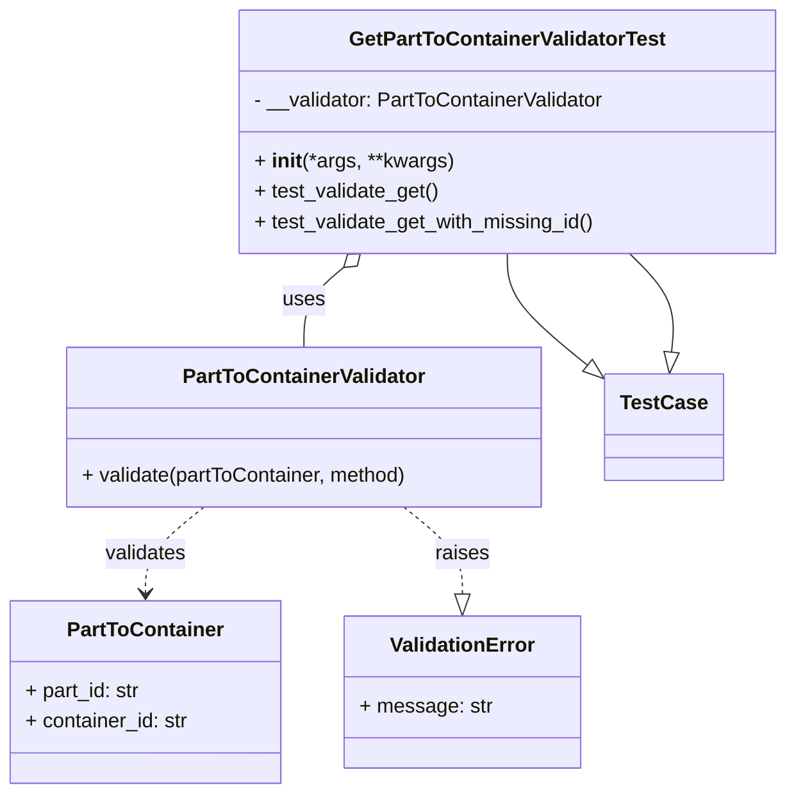

# Diagram: partview_core/partview_service/partview_service/tests/unit/core/validators/part_to_container/part_to_container_get_validator_test.py

> Auto-generated by Obscura crawlers

## Mermaid

### SVG

<svg id="container" width="618.861328125" xmlns="http://www.w3.org/2000/svg" class="classDiagram" height="626" viewBox="0 0 618.861328125 626" role="graphics-document document" aria-roledescription="class"><g><defs><marker id="container_class-aggregationStart" class="marker aggregation class" refX="18" refY="7" markerWidth="190" markerHeight="240" orient="auto"><path d="M 18,7 L9,13 L1,7 L9,1 Z"></path></marker></defs><defs><marker id="container_class-aggregationEnd" class="marker aggregation class" refX="1" refY="7" markerWidth="20" markerHeight="28" orient="auto"><path d="M 18,7 L9,13 L1,7 L9,1 Z"></path></marker></defs><defs><marker id="container_class-extensionStart" class="marker extension class" refX="18" refY="7" markerWidth="190" markerHeight="240" orient="auto"><path d="M 1,7 L18,13 V 1 Z"></path></marker></defs><defs><marker id="container_class-extensionEnd" class="marker extension class" refX="1" refY="7" markerWidth="20" markerHeight="28" orient="auto"><path d="M 1,1 V 13 L18,7 Z"></path></marker></defs><defs><marker id="container_class-compositionStart" class="marker composition class" refX="18" refY="7" markerWidth="190" markerHeight="240" orient="auto"><path d="M 18,7 L9,13 L1,7 L9,1 Z"></path></marker></defs><defs><marker id="container_class-compositionEnd" class="marker composition class" refX="1" refY="7" markerWidth="20" markerHeight="28" orient="auto"><path d="M 18,7 L9,13 L1,7 L9,1 Z"></path></marker></defs><defs><marker id="container_class-dependencyStart" class="marker dependency class" refX="6" refY="7" markerWidth="190" markerHeight="240" orient="auto"><path d="M 5,7 L9,13 L1,7 L9,1 Z"></path></marker></defs><defs><marker id="container_class-dependencyEnd" class="marker dependency class" refX="13" refY="7" markerWidth="20" markerHeight="28" orient="auto"><path d="M 18,7 L9,13 L14,7 L9,1 Z"></path></marker></defs><defs><marker id="container_class-lollipopStart" class="marker lollipop class" refX="13" refY="7" markerWidth="190" markerHeight="240" orient="auto"><circle stroke="black" fill="transparent" cx="7" cy="7" r="6"></circle></marker></defs><defs><marker id="container_class-lollipopEnd" class="marker lollipop class" refX="1" refY="7" markerWidth="190" markerHeight="240" orient="auto"><circle stroke="black" fill="transparent" cx="7" cy="7" r="6"></circle></marker></defs><g class="root"><g class="clusters"></g><g class="edgePaths"><path d="M398.072,200L398.072,206.167C398.072,212.333,398.072,224.667,408.995,239.692C419.918,254.718,441.763,272.437,452.686,281.296L463.609,290.155" id="id_GetPartToContainerValidatorTest_TestCase_1" class="edge-thickness-normal edge-pattern-solid relation" style=";;;" data-edge="true" data-et="edge" data-id="id_GetPartToContainerValidatorTest_TestCase_1" data-points="W3sieCI6Mzk4LjA3MjI2NTYyNSwieSI6MjAwfSx7IngiOjM5OC4wNzIyNjU2MjUsInkiOjIzN30seyJ4Ijo0NzcuMDA1ODU5Mzc1LCJ5IjozMDEuMDIxMTY0MDIxMTY0fV0=" marker-end="url(#container_class-extensionEnd)"></path><path d="M269.481,211.036L264.282,215.363C259.083,219.69,248.685,228.345,243.486,238.839C238.287,249.333,238.287,261.667,238.287,267.833L238.287,274" id="id_GetPartToContainerValidatorTest_PartToContainerValidator_2" class="edge-thickness-normal edge-pattern-solid relation" style=";;;" data-edge="true" data-et="edge" data-id="id_GetPartToContainerValidatorTest_PartToContainerValidator_2" data-points="W3sieCI6MjgyLjczODYxOTAwODQ1ODYsInkiOjIwMH0seyJ4IjoyMzguMjg3MTA5Mzc1LCJ5IjoyMzd9LHsieCI6MjM4LjI4NzEwOTM3NSwieSI6Mjc0fV0=" marker-start="url(#container_class-aggregationStart)"></path><path d="M160.39,400L152.765,406.167C145.14,412.333,129.89,424.667,122.265,436C114.641,447.333,114.641,457.667,114.641,462.833L114.641,468" id="id_PartToContainerValidator_PartToContainer_3" class="edge-thickness-normal edge-pattern-dashed relation" style=";;;" data-edge="true" data-et="edge" data-id="id_PartToContainerValidator_PartToContainer_3" data-points="W3sieCI6MTYwLjM4OTgyNDIxODc1LCJ5Ijo0MDB9LHsieCI6MTE0LjY0MDYyNSwieSI6NDM3fSx7IngiOjExNC42NDA2MjUsInkiOjQ3NH1d" marker-end="url(#container_class-dependencyEnd)"></path><path d="M316.184,400L323.809,406.167C331.434,412.333,346.684,424.667,354.309,436.125C361.934,447.583,361.934,458.167,361.934,463.458L361.934,468.75" id="id_PartToContainerValidator_ValidationError_4" class="edge-thickness-normal edge-pattern-dashed relation" style=";;;" data-edge="true" data-et="edge" data-id="id_PartToContainerValidator_ValidationError_4" data-points="W3sieCI6MzE2LjE4NDM5NDUzMTI1LCJ5Ijo0MDB9LHsieCI6MzYxLjkzMzU5Mzc1LCJ5Ijo0Mzd9LHsieCI6MzYxLjkzMzU5Mzc1LCJ5Ijo0ODZ9XQ==" marker-end="url(#container_class-extensionEnd)"></path><path d="M527.282,277.836L527.962,271.03C528.643,264.224,530.004,250.612,524.504,237.639C519.005,224.667,506.644,212.333,500.464,206.167L494.284,200" id="id_TestCase_GetPartToContainerValidatorTest_5" class="edge-thickness-normal edge-pattern-solid relation" style=";;;" data-edge="true" data-et="edge" data-id="id_TestCase_GetPartToContainerValidatorTest_5" data-points="W3sieCI6NTI1LjU2NTIzNDM3NSwieSI6Mjk1fSx7IngiOjUzMS4zNjUyMzQzNzUsInkiOjIzN30seyJ4Ijo0OTQuMjgzNzMxNzkwNDEzNSwieSI6MjAwfV0=" marker-start="url(#container_class-extensionStart)"></path></g><g class="edgeLabels"><g class="edgeLabel"><g class="label" data-id="id_GetPartToContainerValidatorTest_TestCase_1" transform="translate(0, 0)"><foreignObject width="0" height="0">

</foreignObject></g></g><g class="edgeLabel" transform="translate(238.287109375, 237)"><g class="label" data-id="id_GetPartToContainerValidatorTest_PartToContainerValidator_2" transform="translate(-16.4921875, -12)"><foreignObject width="32.984375" height="24">

uses

</foreignObject></g></g><g class="edgeLabel" transform="translate(114.640625, 437)"><g class="label" data-id="id_PartToContainerValidator_PartToContainer_3" transform="translate(-32.6875, -12)"><foreignObject width="65.375" height="24">

validates

</foreignObject></g></g><g class="edgeLabel" transform="translate(361.93359375, 437)"><g class="label" data-id="id_PartToContainerValidator_ValidationError_4" transform="translate(-21.25, -12)"><foreignObject width="42.5" height="24">

raises

</foreignObject></g></g><g class="edgeLabel"><g class="label" data-id="id_TestCase_GetPartToContainerValidatorTest_5" transform="translate(0, 0)"><foreignObject width="0" height="0">

</foreignObject></g></g></g><g class="nodes"><g class="node default" id="classId-GetPartToContainerValidatorTest-0" transform="translate(398.072265625, 104)"><g class="basic label-container"><path d="M-212.7890625 -96 L212.7890625 -96 L212.7890625 96 L-212.7890625 96" stroke="none" stroke-width="0" fill="#ECECFF" style=""></path><path d="M-212.7890625 -96 C-46.523090738544965 -96, 119.74288102291007 -96, 212.7890625 -96 M-212.7890625 -96 C-68.72564511376163 -96, 75.33777227247674 -96, 212.7890625 -96 M212.7890625 -96 C212.7890625 -54.71445769241898, 212.7890625 -13.428915384837964, 212.7890625 96 M212.7890625 -96 C212.7890625 -30.925766512395313, 212.7890625 34.148466975209374, 212.7890625 96 M212.7890625 96 C64.89277051283489 96, -83.00352147433023 96, -212.7890625 96 M212.7890625 96 C49.70132660612566 96, -113.38640928774868 96, -212.7890625 96 M-212.7890625 96 C-212.7890625 37.36774363704751, -212.7890625 -21.26451272590498, -212.7890625 -96 M-212.7890625 96 C-212.7890625 33.92614406075665, -212.7890625 -28.147711878486703, -212.7890625 -96" stroke="#9370DB" stroke-width="1.3" fill="none" stroke-dasharray="0 0" style=""></path></g><g class="annotation-group text" transform="translate(0, -72)"></g><g class="label-group text" transform="translate(-120.3125, -72)"><g class="label" style="font-weight: bolder" transform="translate(0,-12)"><foreignObject width="240.625" height="24">

GetPartToContainerValidatorTest

</foreignObject></g></g><g class="members-group text" transform="translate(-200.7890625, -24)"><g class="label" style="" transform="translate(0,-12)"><foreignObject width="281.265625" height="24">

- __validator: PartToContainerValidator

</foreignObject></g></g><g class="methods-group text" transform="translate(-200.7890625, 24)"><g class="label" style="" transform="translate(0,-12)"><foreignObject width="156.0625" height="24">

+ <strong>init</strong>(*args, **kwargs)

</foreignObject></g><g class="label" style="" transform="translate(0,12)"><foreignObject width="146.53125" height="24">

+ test_validate_get()

</foreignObject></g><g class="label" style="" transform="translate(0,36)"><foreignObject width="271.671875" height="24">

+ test_validate_get_with_missing_id()

</foreignObject></g></g><g class="divider" style=""><path d="M-212.7890625 -48 C-58.19078753612442 -48, 96.40748742775116 -48, 212.7890625 -48 M-212.7890625 -48 C-53.09057275373752 -48, 106.60791699252496 -48, 212.7890625 -48" stroke="#9370DB" stroke-width="1.3" fill="none" stroke-dasharray="0 0" style=""></path></g><g class="divider" style=""><path d="M-212.7890625 0 C-46.817913346970556 0, 119.15323580605889 0, 212.7890625 0 M-212.7890625 0 C-82.13367013203103 0, 48.52172223593794 0, 212.7890625 0" stroke="#9370DB" stroke-width="1.3" fill="none" stroke-dasharray="0 0" style=""></path></g></g><g class="node default" id="classId-PartToContainer-1" transform="translate(114.640625, 546)"><g class="basic label-container"><path d="M-106.640625 -72 L106.640625 -72 L106.640625 72 L-106.640625 72" stroke="none" stroke-width="0" fill="#ECECFF" style=""></path><path d="M-106.640625 -72 C-58.57456413526661 -72, -10.508503270533225 -72, 106.640625 -72 M-106.640625 -72 C-54.95549805324651 -72, -3.270371106493016 -72, 106.640625 -72 M106.640625 -72 C106.640625 -26.128386108464277, 106.640625 19.743227783071447, 106.640625 72 M106.640625 -72 C106.640625 -37.317496082189194, 106.640625 -2.6349921643783887, 106.640625 72 M106.640625 72 C26.333351659232193 72, -53.973921681535614 72, -106.640625 72 M106.640625 72 C25.493657022978212 72, -55.653310954043576 72, -106.640625 72 M-106.640625 72 C-106.640625 38.558510669461356, -106.640625 5.1170213389227115, -106.640625 -72 M-106.640625 72 C-106.640625 19.69519416155274, -106.640625 -32.60961167689452, -106.640625 -72" stroke="#9370DB" stroke-width="1.3" fill="none" stroke-dasharray="0 0" style=""></path></g><g class="annotation-group text" transform="translate(0, -48)"></g><g class="label-group text" transform="translate(-59.21875, -48)"><g class="label" style="font-weight: bolder" transform="translate(0,-12)"><foreignObject width="118.4375" height="24">

PartToContainer

</foreignObject></g></g><g class="members-group text" transform="translate(-94.640625, 0)"><g class="label" style="" transform="translate(0,-12)"><foreignObject width="92.140625" height="24">

+ part_id: str

</foreignObject></g><g class="label" style="" transform="translate(0,12)"><foreignObject width="130.0625" height="24">

+ container_id: str

</foreignObject></g></g><g class="methods-group text" transform="translate(-94.640625, 72)"></g><g class="divider" style=""><path d="M-106.640625 -24 C-43.1630690551432 -24, 20.314486889713606 -24, 106.640625 -24 M-106.640625 -24 C-61.92792802077171 -24, -17.21523104154342 -24, 106.640625 -24" stroke="#9370DB" stroke-width="1.3" fill="none" stroke-dasharray="0 0" style=""></path></g><g class="divider" style=""><path d="M-106.640625 48 C-27.272895118672153 48, 52.094834762655694 48, 106.640625 48 M-106.640625 48 C-45.24299220282371 48, 16.154640594352585 48, 106.640625 48" stroke="#9370DB" stroke-width="1.3" fill="none" stroke-dasharray="0 0" style=""></path></g></g><g class="node default" id="classId-PartToContainerValidator-2" transform="translate(238.287109375, 337)"><g class="basic label-container"><path d="M-188.71875 -63 L188.71875 -63 L188.71875 63 L-188.71875 63" stroke="none" stroke-width="0" fill="#ECECFF" style=""></path><path d="M-188.71875 -63 C-49.39523017082098 -63, 89.92828965835804 -63, 188.71875 -63 M-188.71875 -63 C-62.682755407759984 -63, 63.35323918448003 -63, 188.71875 -63 M188.71875 -63 C188.71875 -29.051815598919248, 188.71875 4.896368802161504, 188.71875 63 M188.71875 -63 C188.71875 -17.19237857842907, 188.71875 28.615242843141857, 188.71875 63 M188.71875 63 C83.24449485203331 63, -22.229760295933374 63, -188.71875 63 M188.71875 63 C97.44448201123753 63, 6.170214022475051 63, -188.71875 63 M-188.71875 63 C-188.71875 18.477093291375233, -188.71875 -26.045813417249533, -188.71875 -63 M-188.71875 63 C-188.71875 32.0238940137074, -188.71875 1.0477880274147964, -188.71875 -63" stroke="#9370DB" stroke-width="1.3" fill="none" stroke-dasharray="0 0" style=""></path></g><g class="annotation-group text" transform="translate(0, -39)"></g><g class="label-group text" transform="translate(-92.40625, -39)"><g class="label" style="font-weight: bolder" transform="translate(0,-12)"><foreignObject width="184.8125" height="24">

PartToContainerValidator

</foreignObject></g></g><g class="members-group text" transform="translate(-176.71875, 9)"></g><g class="methods-group text" transform="translate(-176.71875, 39)"><g class="label" style="" transform="translate(0,-12)"><foreignObject width="261.03125" height="24">

+ validate(partToContainer, method)

</foreignObject></g></g><g class="divider" style=""><path d="M-188.71875 -15 C-64.00729089967355 -15, 60.7041682006529 -15, 188.71875 -15 M-188.71875 -15 C-63.55767106191688 -15, 61.603407876166244 -15, 188.71875 -15" stroke="#9370DB" stroke-width="1.3" fill="none" stroke-dasharray="0 0" style=""></path></g><g class="divider" style=""><path d="M-188.71875 9 C-45.9619050895636 9, 96.7949398208728 9, 188.71875 9 M-188.71875 9 C-47.254936818695484 9, 94.20887636260903 9, 188.71875 9" stroke="#9370DB" stroke-width="1.3" fill="none" stroke-dasharray="0 0" style=""></path></g></g><g class="node default" id="classId-ValidationError-3" transform="translate(361.93359375, 546)"><g class="basic label-container"><path d="M-90.65234375 -60 L90.65234375 -60 L90.65234375 60 L-90.65234375 60" stroke="none" stroke-width="0" fill="#ECECFF" style=""></path><path d="M-90.65234375 -60 C-18.27505780495322 -60, 54.10222814009356 -60, 90.65234375 -60 M-90.65234375 -60 C-28.84452809070512 -60, 32.96328756858976 -60, 90.65234375 -60 M90.65234375 -60 C90.65234375 -34.67854680421209, 90.65234375 -9.35709360842418, 90.65234375 60 M90.65234375 -60 C90.65234375 -16.745421146159487, 90.65234375 26.509157707681027, 90.65234375 60 M90.65234375 60 C20.01623729506106 60, -50.61986915987788 60, -90.65234375 60 M90.65234375 60 C52.33857596188526 60, 14.024808173770523 60, -90.65234375 60 M-90.65234375 60 C-90.65234375 28.892685167160117, -90.65234375 -2.214629665679766, -90.65234375 -60 M-90.65234375 60 C-90.65234375 24.715201669156286, -90.65234375 -10.569596661687427, -90.65234375 -60" stroke="#9370DB" stroke-width="1.3" fill="none" stroke-dasharray="0 0" style=""></path></g><g class="annotation-group text" transform="translate(0, -36)"></g><g class="label-group text" transform="translate(-55.1796875, -36)"><g class="label" style="font-weight: bolder" transform="translate(0,-12)"><foreignObject width="110.359375" height="24">

ValidationError

</foreignObject></g></g><g class="members-group text" transform="translate(-78.65234375, 12)"><g class="label" style="" transform="translate(0,-12)"><foreignObject width="102.125" height="24">

+ message: str

</foreignObject></g></g><g class="methods-group text" transform="translate(-78.65234375, 60)"></g><g class="divider" style=""><path d="M-90.65234375 -12 C-45.53192741064407 -12, -0.411511071288146 -12, 90.65234375 -12 M-90.65234375 -12 C-34.74511625958293 -12, 21.162111230834142 -12, 90.65234375 -12" stroke="#9370DB" stroke-width="1.3" fill="none" stroke-dasharray="0 0" style=""></path></g><g class="divider" style=""><path d="M-90.65234375 36 C-26.365266054176672 36, 37.921811641646656 36, 90.65234375 36 M-90.65234375 36 C-51.730773114251164 36, -12.809202478502328 36, 90.65234375 36" stroke="#9370DB" stroke-width="1.3" fill="none" stroke-dasharray="0 0" style=""></path></g></g><g class="node default" id="classId-TestCase-4" transform="translate(521.365234375, 337)"><g class="basic label-container"><path d="M-44.359375 -42 L44.359375 -42 L44.359375 42 L-44.359375 42" stroke="none" stroke-width="0" fill="#ECECFF" style=""></path><path d="M-44.359375 -42 C-14.303886653306154 -42, 15.751601693387691 -42, 44.359375 -42 M-44.359375 -42 C-14.08828499825648 -42, 16.18280500348704 -42, 44.359375 -42 M44.359375 -42 C44.359375 -24.747746783754085, 44.359375 -7.49549356750817, 44.359375 42 M44.359375 -42 C44.359375 -12.693236193286502, 44.359375 16.613527613426996, 44.359375 42 M44.359375 42 C25.851869210741 42, 7.344363421482001 42, -44.359375 42 M44.359375 42 C22.606028872236898 42, 0.8526827444737961 42, -44.359375 42 M-44.359375 42 C-44.359375 24.71302663395454, -44.359375 7.426053267909083, -44.359375 -42 M-44.359375 42 C-44.359375 15.954684166203101, -44.359375 -10.090631667593797, -44.359375 -42" stroke="#9370DB" stroke-width="1.3" fill="none" stroke-dasharray="0 0" style=""></path></g><g class="annotation-group text" transform="translate(0, -18)"></g><g class="label-group text" transform="translate(-32.359375, -18)"><g class="label" style="font-weight: bolder" transform="translate(0,-12)"><foreignObject width="64.71875" height="24">

TestCase

</foreignObject></g></g><g class="members-group text" transform="translate(-32.359375, 30)"></g><g class="methods-group text" transform="translate(-32.359375, 60)"></g><g class="divider" style=""><path d="M-44.359375 6 C-11.421094931254956 6, 21.517185137490088 6, 44.359375 6 M-44.359375 6 C-21.19983164614884 6, 1.9597117077023185 6, 44.359375 6" stroke="#9370DB" stroke-width="1.3" fill="none" stroke-dasharray="0 0" style=""></path></g><g class="divider" style=""><path d="M-44.359375 24 C-22.08543228246156 24, 0.18851043507687848 24, 44.359375 24 M-44.359375 24 C-17.526982480283927 24, 9.305410039432147 24, 44.359375 24" stroke="#9370DB" stroke-width="1.3" fill="none" stroke-dasharray="0 0" style=""></path></g></g></g></g></g></svg>
