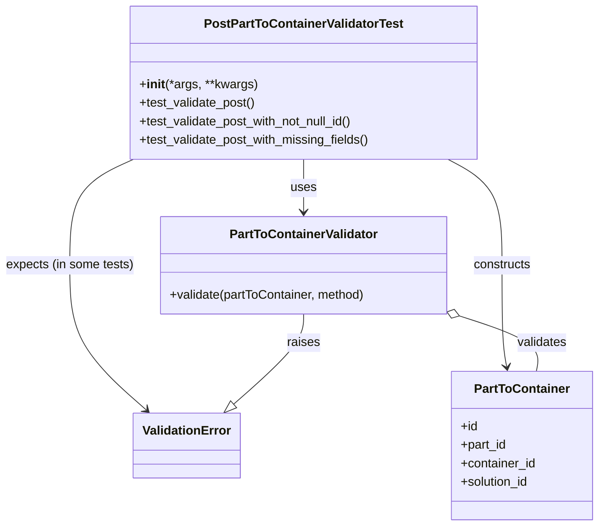

# Diagram: partview_core/partview_service/partview_service/tests/unit/core/validators/part_to_container/part_to_container_post_validator_test.py

> Auto-generated by Obscura crawlers

## Mermaid

### SVG

<svg id="container" width="780.65625" xmlns="http://www.w3.org/2000/svg" class="classDiagram" height="680" viewBox="0 0 780.65625 680" role="graphics-document document" aria-roledescription="class"><g><defs><marker id="container_class-aggregationStart" class="marker aggregation class" refX="18" refY="7" markerWidth="190" markerHeight="240" orient="auto"><path d="M 18,7 L9,13 L1,7 L9,1 Z"></path></marker></defs><defs><marker id="container_class-aggregationEnd" class="marker aggregation class" refX="1" refY="7" markerWidth="20" markerHeight="28" orient="auto"><path d="M 18,7 L9,13 L1,7 L9,1 Z"></path></marker></defs><defs><marker id="container_class-extensionStart" class="marker extension class" refX="18" refY="7" markerWidth="190" markerHeight="240" orient="auto"><path d="M 1,7 L18,13 V 1 Z"></path></marker></defs><defs><marker id="container_class-extensionEnd" class="marker extension class" refX="1" refY="7" markerWidth="20" markerHeight="28" orient="auto"><path d="M 1,1 V 13 L18,7 Z"></path></marker></defs><defs><marker id="container_class-compositionStart" class="marker composition class" refX="18" refY="7" markerWidth="190" markerHeight="240" orient="auto"><path d="M 18,7 L9,13 L1,7 L9,1 Z"></path></marker></defs><defs><marker id="container_class-compositionEnd" class="marker composition class" refX="1" refY="7" markerWidth="20" markerHeight="28" orient="auto"><path d="M 18,7 L9,13 L1,7 L9,1 Z"></path></marker></defs><defs><marker id="container_class-dependencyStart" class="marker dependency class" refX="6" refY="7" markerWidth="190" markerHeight="240" orient="auto"><path d="M 5,7 L9,13 L1,7 L9,1 Z"></path></marker></defs><defs><marker id="container_class-dependencyEnd" class="marker dependency class" refX="13" refY="7" markerWidth="20" markerHeight="28" orient="auto"><path d="M 18,7 L9,13 L14,7 L9,1 Z"></path></marker></defs><defs><marker id="container_class-lollipopStart" class="marker lollipop class" refX="13" refY="7" markerWidth="190" markerHeight="240" orient="auto"><circle stroke="black" fill="transparent" cx="7" cy="7" r="6"></circle></marker></defs><defs><marker id="container_class-lollipopEnd" class="marker lollipop class" refX="1" refY="7" markerWidth="190" markerHeight="240" orient="auto"><circle stroke="black" fill="transparent" cx="7" cy="7" r="6"></circle></marker></defs><g class="root"><g class="clusters"></g><g class="edgePaths"><path d="M396.188,206L396.188,212.167C396.188,218.333,396.188,230.667,396.188,242C396.188,253.333,396.188,263.667,396.188,268.833L396.188,274" id="id_PostPartToContainerValidatorTest_PartToContainerValidator_1" class="edge-thickness-normal edge-pattern-solid relation" style=";;;" data-edge="true" data-et="edge" data-id="id_PostPartToContainerValidatorTest_PartToContainerValidator_1" data-points="W3sieCI6Mzk2LjE4NzUsInkiOjIwNn0seyJ4IjozOTYuMTg3NSwieSI6MjQzfSx7IngiOjM5Ni4xODc1LCJ5IjoyODB9XQ==" marker-end="url(#container_class-dependencyEnd)"></path><path d="M584.986,206L596.746,212.167C608.506,218.333,632.027,230.667,643.787,253.5C655.547,276.333,655.547,309.667,655.547,343C655.547,376.333,655.547,409.667,656.574,431.519C657.601,453.371,659.655,463.743,660.683,468.929L661.71,474.114" id="id_PostPartToContainerValidatorTest_PartToContainer_2" class="edge-thickness-normal edge-pattern-solid relation" style=";;;" data-edge="true" data-et="edge" data-id="id_PostPartToContainerValidatorTest_PartToContainer_2" data-points="W3sieCI6NTg0Ljk4NTg2ODU2NjE3NjUsInkiOjIwNn0seyJ4Ijo2NTUuNTQ2ODc1LCJ5IjoyNDN9LHsieCI6NjU1LjU0Njg3NSwieSI6MzQzfSx7IngiOjY1NS41NDY4NzUsInkiOjQ0M30seyJ4Ijo2NjIuODc1NTg3NDA2MDE1LCJ5Ijo0ODB9XQ==" marker-end="url(#container_class-dependencyEnd)"></path><path d="M174.273,206L160.451,212.167C146.628,218.333,118.982,230.667,105.159,253.5C91.336,276.333,91.336,309.667,91.336,343C91.336,376.333,91.336,409.667,107.964,440.843C124.593,472.018,157.85,501.037,174.478,515.546L191.106,530.055" id="id_PostPartToContainerValidatorTest_ValidationError_3" class="edge-thickness-normal edge-pattern-solid relation" style=";;;" data-edge="true" data-et="edge" data-id="id_PostPartToContainerValidatorTest_ValidationError_3" data-points="W3sieCI6MTc0LjI3MzQ5NDk0NDg1MjkzLCJ5IjoyMDZ9LHsieCI6OTEuMzM1OTM3NSwieSI6MjQzfSx7IngiOjkxLjMzNTkzNzUsInkiOjM0M30seyJ4Ijo5MS4zMzU5Mzc1LCJ5Ijo0NDN9LHsieCI6MTk1LjYyNzI2MTUxMzE1NzksInkiOjUzNH1d" marker-end="url(#container_class-dependencyEnd)"></path><path d="M396.188,406L396.188,412.167C396.188,418.333,396.188,430.667,380.972,450.11C365.756,469.553,335.325,496.106,320.109,509.382L304.894,522.659" id="id_PartToContainerValidator_ValidationError_4" class="edge-thickness-normal edge-pattern-solid relation" style=";;;" data-edge="true" data-et="edge" data-id="id_PartToContainerValidator_ValidationError_4" data-points="W3sieCI6Mzk2LjE4NzUsInkiOjQwNn0seyJ4IjozOTYuMTg3NSwieSI6NDQzfSx7IngiOjI5MS44OTYxNzU5ODY4NDIxLCJ5Ijo1MzR9XQ==" marker-end="url(#container_class-extensionEnd)"></path><path d="M599.13,408.036L617.314,413.863C635.498,419.691,671.866,431.345,688.829,443.339C705.791,455.333,703.349,467.667,702.127,473.833L700.906,480" id="id_PartToContainerValidator_PartToContainer_5" class="edge-thickness-normal edge-pattern-solid relation" style=";;;" data-edge="true" data-et="edge" data-id="id_PartToContainerValidator_PartToContainer_5" data-points="W3sieCI6NTgyLjcwMzEyNSwieSI6NDAyLjc3MTY2ODkxOTkzMzl9LHsieCI6NzA4LjIzNDM3NSwieSI6NDQzfSx7IngiOjcwMC45MDU2NjI1OTM5ODUsInkiOjQ4MH1d" marker-start="url(#container_class-aggregationStart)"></path></g><g class="edgeLabels"><g class="edgeLabel" transform="translate(396.1875, 243)"><g class="label" data-id="id_PostPartToContainerValidatorTest_PartToContainerValidator_1" transform="translate(-16.4921875, -12)"><foreignObject width="32.984375" height="24">

uses

</foreignObject></g></g><g class="edgeLabel" transform="translate(655.546875, 343)"><g class="label" data-id="id_PostPartToContainerValidatorTest_PartToContainer_2" transform="translate(-37.84375, -12)"><foreignObject width="75.6875" height="24">

constructs

</foreignObject></g></g><g class="edgeLabel" transform="translate(91.3359375, 343)"><g class="label" data-id="id_PostPartToContainerValidatorTest_ValidationError_3" transform="translate(-83.3359375, -12)"><foreignObject width="166.671875" height="24">

expects (in some tests)

</foreignObject></g></g><g class="edgeLabel" transform="translate(396.1875, 443)"><g class="label" data-id="id_PartToContainerValidator_ValidationError_4" transform="translate(-21.25, -12)"><foreignObject width="42.5" height="24">

raises

</foreignObject></g></g><g class="edgeLabel" transform="translate(708.234375, 443)"><g class="label" data-id="id_PartToContainerValidator_PartToContainer_5" transform="translate(-32.6875, -12)"><foreignObject width="65.375" height="24">

validates

</foreignObject></g></g></g><g class="nodes"><g class="node default" id="classId-PartToContainer-0" transform="translate(681.890625, 576)"><g class="basic label-container"><path d="M-90.765625 -96 L90.765625 -96 L90.765625 96 L-90.765625 96" stroke="none" stroke-width="0" fill="#ECECFF" style=""></path><path d="M-90.765625 -96 C-41.91404086155265 -96, 6.937543276894701 -96, 90.765625 -96 M-90.765625 -96 C-27.188135183155225 -96, 36.38935463368955 -96, 90.765625 -96 M90.765625 -96 C90.765625 -50.62999835072856, 90.765625 -5.259996701457126, 90.765625 96 M90.765625 -96 C90.765625 -30.91718791745143, 90.765625 34.16562416509714, 90.765625 96 M90.765625 96 C20.026855532716013 96, -50.711913934567974 96, -90.765625 96 M90.765625 96 C32.26616856680217 96, -26.233287866395656 96, -90.765625 96 M-90.765625 96 C-90.765625 45.3399566072282, -90.765625 -5.3200867855435945, -90.765625 -96 M-90.765625 96 C-90.765625 55.30566100915617, -90.765625 14.611322018312336, -90.765625 -96" stroke="#9370DB" stroke-width="1.3" fill="none" stroke-dasharray="0 0" style=""></path></g><g class="annotation-group text" transform="translate(0, -72)"></g><g class="label-group text" transform="translate(-59.21875, -72)"><g class="label" style="font-weight: bolder" transform="translate(0,-12)"><foreignObject width="118.4375" height="24">

PartToContainer

</foreignObject></g></g><g class="members-group text" transform="translate(-78.765625, -24)"><g class="label" style="" transform="translate(0,-12)"><foreignObject width="22.078125" height="24">

+id

</foreignObject></g><g class="label" style="" transform="translate(0,12)"><foreignObject width="60.390625" height="24">

+part_id

</foreignObject></g><g class="label" style="" transform="translate(0,36)"><foreignObject width="98.3125" height="24">

+container_id

</foreignObject></g><g class="label" style="" transform="translate(0,60)"><foreignObject width="90.21875" height="24">

+solution_id

</foreignObject></g></g><g class="methods-group text" transform="translate(-78.765625, 96)"></g><g class="divider" style=""><path d="M-90.765625 -48 C-30.450728569784673 -48, 29.864167860430655 -48, 90.765625 -48 M-90.765625 -48 C-32.80764479573769 -48, 25.150335408524626 -48, 90.765625 -48" stroke="#9370DB" stroke-width="1.3" fill="none" stroke-dasharray="0 0" style=""></path></g><g class="divider" style=""><path d="M-90.765625 72 C-32.06462039466254 72, 26.63638421067492 72, 90.765625 72 M-90.765625 72 C-20.136668107470584 72, 50.49228878505883 72, 90.765625 72" stroke="#9370DB" stroke-width="1.3" fill="none" stroke-dasharray="0 0" style=""></path></g></g><g class="node default" id="classId-PartToContainerValidator-1" transform="translate(396.1875, 343)"><g class="basic label-container"><path d="M-186.515625 -63 L186.515625 -63 L186.515625 63 L-186.515625 63" stroke="none" stroke-width="0" fill="#ECECFF" style=""></path><path d="M-186.515625 -63 C-68.9286053426746 -63, 48.6584143146508 -63, 186.515625 -63 M-186.515625 -63 C-39.373029690046735 -63, 107.76956561990653 -63, 186.515625 -63 M186.515625 -63 C186.515625 -33.421182390684436, 186.515625 -3.842364781368879, 186.515625 63 M186.515625 -63 C186.515625 -30.2170380075978, 186.515625 2.5659239848043995, 186.515625 63 M186.515625 63 C63.222967575498615 63, -60.06968984900277 63, -186.515625 63 M186.515625 63 C53.237634566424504 63, -80.04035586715099 63, -186.515625 63 M-186.515625 63 C-186.515625 14.979762761000593, -186.515625 -33.04047447799881, -186.515625 -63 M-186.515625 63 C-186.515625 33.14141727668643, -186.515625 3.282834553372865, -186.515625 -63" stroke="#9370DB" stroke-width="1.3" fill="none" stroke-dasharray="0 0" style=""></path></g><g class="annotation-group text" transform="translate(0, -39)"></g><g class="label-group text" transform="translate(-92.40625, -39)"><g class="label" style="font-weight: bolder" transform="translate(0,-12)"><foreignObject width="184.8125" height="24">

PartToContainerValidator

</foreignObject></g></g><g class="members-group text" transform="translate(-174.515625, 9)"></g><g class="methods-group text" transform="translate(-174.515625, 39)"><g class="label" style="" transform="translate(0,-12)"><foreignObject width="256.625" height="24">

+validate(partToContainer, method)

</foreignObject></g></g><g class="divider" style=""><path d="M-186.515625 -15 C-76.61955650472348 -15, 33.27651199055305 -15, 186.515625 -15 M-186.515625 -15 C-110.16045208577904 -15, -33.805279171558084 -15, 186.515625 -15" stroke="#9370DB" stroke-width="1.3" fill="none" stroke-dasharray="0 0" style=""></path></g><g class="divider" style=""><path d="M-186.515625 9 C-41.79080088766662 9, 102.93402322466676 9, 186.515625 9 M-186.515625 9 C-80.50541662402344 9, 25.50479175195312 9, 186.515625 9" stroke="#9370DB" stroke-width="1.3" fill="none" stroke-dasharray="0 0" style=""></path></g></g><g class="node default" id="classId-ValidationError-2" transform="translate(243.76171875, 576)"><g class="basic label-container"><path d="M-67.1796875 -42 L67.1796875 -42 L67.1796875 42 L-67.1796875 42" stroke="none" stroke-width="0" fill="#ECECFF" style=""></path><path d="M-67.1796875 -42 C-22.233159223309187 -42, 22.713369053381626 -42, 67.1796875 -42 M-67.1796875 -42 C-31.425946698098997 -42, 4.327794103802006 -42, 67.1796875 -42 M67.1796875 -42 C67.1796875 -20.17920862227755, 67.1796875 1.641582755444901, 67.1796875 42 M67.1796875 -42 C67.1796875 -11.114275773156578, 67.1796875 19.771448453686844, 67.1796875 42 M67.1796875 42 C35.35628876870524 42, 3.532890037410482 42, -67.1796875 42 M67.1796875 42 C26.7099906088147 42, -13.759706282370601 42, -67.1796875 42 M-67.1796875 42 C-67.1796875 17.987193463237762, -67.1796875 -6.025613073524475, -67.1796875 -42 M-67.1796875 42 C-67.1796875 18.702123059575765, -67.1796875 -4.59575388084847, -67.1796875 -42" stroke="#9370DB" stroke-width="1.3" fill="none" stroke-dasharray="0 0" style=""></path></g><g class="annotation-group text" transform="translate(0, -18)"></g><g class="label-group text" transform="translate(-55.1796875, -18)"><g class="label" style="font-weight: bolder" transform="translate(0,-12)"><foreignObject width="110.359375" height="24">

ValidationError

</foreignObject></g></g><g class="members-group text" transform="translate(-55.1796875, 30)"></g><g class="methods-group text" transform="translate(-55.1796875, 60)"></g><g class="divider" style=""><path d="M-67.1796875 6 C-18.517860770915384 6, 30.143965958169233 6, 67.1796875 6 M-67.1796875 6 C-25.327550836180656 6, 16.52458582763869 6, 67.1796875 6" stroke="#9370DB" stroke-width="1.3" fill="none" stroke-dasharray="0 0" style=""></path></g><g class="divider" style=""><path d="M-67.1796875 24 C-15.399075643143014 24, 36.38153621371397 24, 67.1796875 24 M-67.1796875 24 C-13.76692034969259 24, 39.64584680061482 24, 67.1796875 24" stroke="#9370DB" stroke-width="1.3" fill="none" stroke-dasharray="0 0" style=""></path></g></g><g class="node default" id="classId-PostPartToContainerValidatorTest-3" transform="translate(396.1875, 107)"><g class="basic label-container"><path d="M-224.87109375 -99 L224.87109375 -99 L224.87109375 99 L-224.87109375 99" stroke="none" stroke-width="0" fill="#ECECFF" style=""></path><path d="M-224.87109375 -99 C-106.639982221999 -99, 11.591129306001989 -99, 224.87109375 -99 M-224.87109375 -99 C-86.98128290577537 -99, 50.908527938449254 -99, 224.87109375 -99 M224.87109375 -99 C224.87109375 -36.98522675073274, 224.87109375 25.029546498534515, 224.87109375 99 M224.87109375 -99 C224.87109375 -50.17374942630091, 224.87109375 -1.3474988526018166, 224.87109375 99 M224.87109375 99 C45.056719936203876 99, -134.75765387759225 99, -224.87109375 99 M224.87109375 99 C45.48985340157503 99, -133.89138694684993 99, -224.87109375 99 M-224.87109375 99 C-224.87109375 50.39961995158553, -224.87109375 1.7992399031710562, -224.87109375 -99 M-224.87109375 99 C-224.87109375 47.878276777440355, -224.87109375 -3.2434464451192895, -224.87109375 -99" stroke="#9370DB" stroke-width="1.3" fill="none" stroke-dasharray="0 0" style=""></path></g><g class="annotation-group text" transform="translate(0, -75)"></g><g class="label-group text" transform="translate(-123.8359375, -75)"><g class="label" style="font-weight: bolder" transform="translate(0,-12)"><foreignObject width="247.671875" height="24">

PostPartToContainerValidatorTest

</foreignObject></g></g><g class="members-group text" transform="translate(-212.87109375, -27)"></g><g class="methods-group text" transform="translate(-212.87109375, 3)"><g class="label" style="" transform="translate(0,-12)"><foreignObject width="151.8125" height="24">

+<strong>init</strong>(*args, **kwargs)

</foreignObject></g><g class="label" style="" transform="translate(0,12)"><foreignObject width="151.609375" height="24">

+test_validate_post()

</foreignObject></g><g class="label" style="" transform="translate(0,36)"><foreignObject width="282.34375" height="24">

+test_validate_post_with_not_null_id()

</foreignObject></g><g class="label" style="" transform="translate(0,60)"><foreignObject width="301.90625" height="24">

+test_validate_post_with_missing_fields()

</foreignObject></g></g><g class="divider" style=""><path d="M-224.87109375 -51 C-125.0717207149748 -51, -25.272347679949604 -51, 224.87109375 -51 M-224.87109375 -51 C-91.28980936274667 -51, 42.29147502450667 -51, 224.87109375 -51" stroke="#9370DB" stroke-width="1.3" fill="none" stroke-dasharray="0 0" style=""></path></g><g class="divider" style=""><path d="M-224.87109375 -27 C-84.95459851701517 -27, 54.96189671596966 -27, 224.87109375 -27 M-224.87109375 -27 C-53.683494618562094 -27, 117.50410451287581 -27, 224.87109375 -27" stroke="#9370DB" stroke-width="1.3" fill="none" stroke-dasharray="0 0" style=""></path></g></g></g></g></g></svg>
