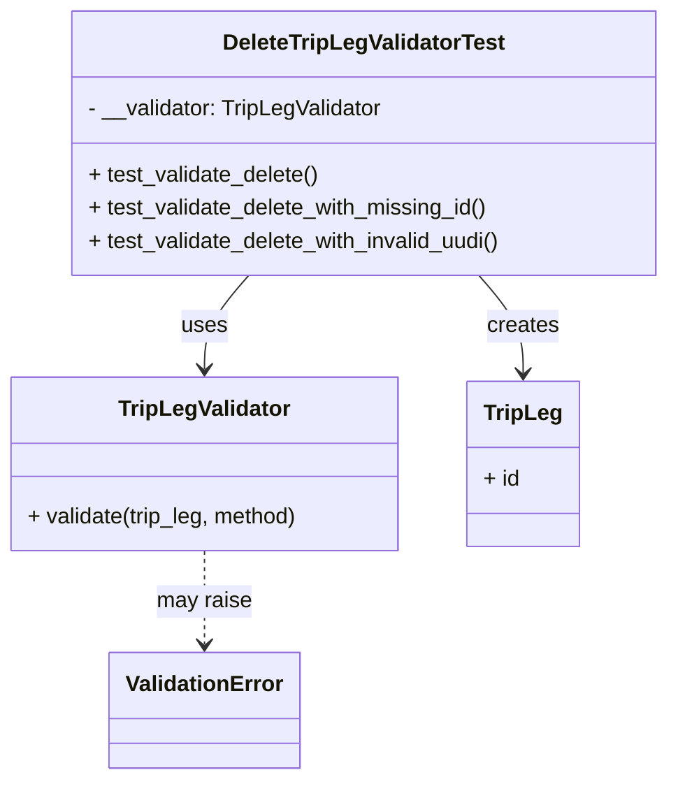

# Diagram: partview_core/partview_service/partview_service/tests/unit/core/validators/trip_leg/trip_leg_delete_validator_test.py

> Auto-generated by Obscura crawlers

## Mermaid

### SVG

<svg id="container" width="488.66015625" xmlns="http://www.w3.org/2000/svg" class="classDiagram" height="566" viewBox="0 0 488.66015625 566" role="graphics-document document" aria-roledescription="class"><g><defs><marker id="container_class-aggregationStart" class="marker aggregation class" refX="18" refY="7" markerWidth="190" markerHeight="240" orient="auto"><path d="M 18,7 L9,13 L1,7 L9,1 Z"></path></marker></defs><defs><marker id="container_class-aggregationEnd" class="marker aggregation class" refX="1" refY="7" markerWidth="20" markerHeight="28" orient="auto"><path d="M 18,7 L9,13 L1,7 L9,1 Z"></path></marker></defs><defs><marker id="container_class-extensionStart" class="marker extension class" refX="18" refY="7" markerWidth="190" markerHeight="240" orient="auto"><path d="M 1,7 L18,13 V 1 Z"></path></marker></defs><defs><marker id="container_class-extensionEnd" class="marker extension class" refX="1" refY="7" markerWidth="20" markerHeight="28" orient="auto"><path d="M 1,1 V 13 L18,7 Z"></path></marker></defs><defs><marker id="container_class-compositionStart" class="marker composition class" refX="18" refY="7" markerWidth="190" markerHeight="240" orient="auto"><path d="M 18,7 L9,13 L1,7 L9,1 Z"></path></marker></defs><defs><marker id="container_class-compositionEnd" class="marker composition class" refX="1" refY="7" markerWidth="20" markerHeight="28" orient="auto"><path d="M 18,7 L9,13 L1,7 L9,1 Z"></path></marker></defs><defs><marker id="container_class-dependencyStart" class="marker dependency class" refX="6" refY="7" markerWidth="190" markerHeight="240" orient="auto"><path d="M 5,7 L9,13 L1,7 L9,1 Z"></path></marker></defs><defs><marker id="container_class-dependencyEnd" class="marker dependency class" refX="13" refY="7" markerWidth="20" markerHeight="28" orient="auto"><path d="M 18,7 L9,13 L14,7 L9,1 Z"></path></marker></defs><defs><marker id="container_class-lollipopStart" class="marker lollipop class" refX="13" refY="7" markerWidth="190" markerHeight="240" orient="auto"><circle stroke="black" fill="transparent" cx="7" cy="7" r="6"></circle></marker></defs><defs><marker id="container_class-lollipopEnd" class="marker lollipop class" refX="1" refY="7" markerWidth="190" markerHeight="240" orient="auto"><circle stroke="black" fill="transparent" cx="7" cy="7" r="6"></circle></marker></defs><g class="root"><g class="clusters"></g><g class="edgePaths"><path d="M182.566,200L177.201,206.167C171.836,212.333,161.105,224.667,155.74,236C150.375,247.333,150.375,257.667,150.375,262.833L150.375,268" id="id_DeleteTripLegValidatorTest_TripLegValidator_1" class="edge-thickness-normal edge-pattern-solid relation" style=";;;" data-edge="true" data-et="edge" data-id="id_DeleteTripLegValidatorTest_TripLegValidator_1" data-points="W3sieCI6MTgyLjU2NjM0NzUwOTM5ODUsInkiOjIwMH0seyJ4IjoxNTAuMzc1LCJ5IjoyMzd9LHsieCI6MTUwLjM3NSwieSI6Mjc0fV0=" marker-end="url(#container_class-dependencyEnd)"></path><path d="M349.613,200L354.979,206.167C360.344,212.333,371.074,224.667,376.439,236.5C381.805,248.333,381.805,259.667,381.805,265.333L381.805,271" id="id_DeleteTripLegValidatorTest_TripLeg_2" class="edge-thickness-normal edge-pattern-solid relation" style=";;;" data-edge="true" data-et="edge" data-id="id_DeleteTripLegValidatorTest_TripLeg_2" data-points="W3sieCI6MzQ5LjYxMzMzOTk5MDYwMTUsInkiOjIwMH0seyJ4IjozODEuODA0Njg3NSwieSI6MjM3fSx7IngiOjM4MS44MDQ2ODc1LCJ5IjoyNzd9XQ==" marker-end="url(#container_class-dependencyEnd)"></path><path d="M150.375,400L150.375,406.167C150.375,412.333,150.375,424.667,150.375,436C150.375,447.333,150.375,457.667,150.375,462.833L150.375,468" id="id_TripLegValidator_ValidationError_3" class="edge-thickness-normal edge-pattern-dashed relation" style=";;;" data-edge="true" data-et="edge" data-id="id_TripLegValidator_ValidationError_3" data-points="W3sieCI6MTUwLjM3NSwieSI6NDAwfSx7IngiOjE1MC4zNzUsInkiOjQzN30seyJ4IjoxNTAuMzc1LCJ5Ijo0NzR9XQ==" marker-end="url(#container_class-dependencyEnd)"></path></g><g class="edgeLabels"><g class="edgeLabel" transform="translate(150.375, 237)"><g class="label" data-id="id_DeleteTripLegValidatorTest_TripLegValidator_1" transform="translate(-16.4921875, -12)"><foreignObject width="32.984375" height="24">

uses

</foreignObject></g></g><g class="edgeLabel" transform="translate(381.8046875, 237)"><g class="label" data-id="id_DeleteTripLegValidatorTest_TripLeg_2" transform="translate(-26.171875, -12)"><foreignObject width="52.34375" height="24">

creates

</foreignObject></g></g><g class="edgeLabel" transform="translate(150.375, 437)"><g class="label" data-id="id_TripLegValidator_ValidationError_3" transform="translate(-34.65625, -12)"><foreignObject width="69.3125" height="24">

may raise

</foreignObject></g></g></g><g class="nodes"><g class="node default" id="classId-DeleteTripLegValidatorTest-0" transform="translate(266.08984375, 104)"><g class="basic label-container"><path d="M-214.5703125 -96 L214.5703125 -96 L214.5703125 96 L-214.5703125 96" stroke="none" stroke-width="0" fill="#ECECFF" style=""></path><path d="M-214.5703125 -96 C-86.95844878855561 -96, 40.65341492288877 -96, 214.5703125 -96 M-214.5703125 -96 C-78.20213907031004 -96, 58.16603435937992 -96, 214.5703125 -96 M214.5703125 -96 C214.5703125 -45.78130261912577, 214.5703125 4.437394761748465, 214.5703125 96 M214.5703125 -96 C214.5703125 -47.74108426834613, 214.5703125 0.5178314633077434, 214.5703125 96 M214.5703125 96 C60.60079511567366 96, -93.36872226865268 96, -214.5703125 96 M214.5703125 96 C45.89382374972004 96, -122.78266500055992 96, -214.5703125 96 M-214.5703125 96 C-214.5703125 45.97350646418111, -214.5703125 -4.052987071637773, -214.5703125 -96 M-214.5703125 96 C-214.5703125 28.19464255143491, -214.5703125 -39.61071489713018, -214.5703125 -96" stroke="#9370DB" stroke-width="1.3" fill="none" stroke-dasharray="0 0" style=""></path></g><g class="annotation-group text" transform="translate(0, -72)"></g><g class="label-group text" transform="translate(-99.21875, -72)"><g class="label" style="font-weight: bolder" transform="translate(0,-12)"><foreignObject width="198.4375" height="24">

DeleteTripLegValidatorTest

</foreignObject></g></g><g class="members-group text" transform="translate(-202.5703125, -24)"><g class="label" style="" transform="translate(0,-12)"><foreignObject width="217.546875" height="24">

- __validator: TripLegValidator

</foreignObject></g></g><g class="methods-group text" transform="translate(-202.5703125, 24)"><g class="label" style="" transform="translate(0,-12)"><foreignObject width="169.390625" height="24">

+ test_validate_delete()

</foreignObject></g><g class="label" style="" transform="translate(0,12)"><foreignObject width="294.203125" height="24">

+ test_validate_delete_with_missing_id()

</foreignObject></g><g class="label" style="" transform="translate(0,36)"><foreignObject width="305.921875" height="24">

+ test_validate_delete_with_invalid_uudi()

</foreignObject></g></g><g class="divider" style=""><path d="M-214.5703125 -48 C-109.34641273359007 -48, -4.122512967180143 -48, 214.5703125 -48 M-214.5703125 -48 C-47.05167014930183 -48, 120.46697220139635 -48, 214.5703125 -48" stroke="#9370DB" stroke-width="1.3" fill="none" stroke-dasharray="0 0" style=""></path></g><g class="divider" style=""><path d="M-214.5703125 0 C-81.26852451707242 0, 52.03326346585516 0, 214.5703125 0 M-214.5703125 0 C-118.60256936525167 0, -22.634826230503336 0, 214.5703125 0" stroke="#9370DB" stroke-width="1.3" fill="none" stroke-dasharray="0 0" style=""></path></g></g><g class="node default" id="classId-TripLegValidator-1" transform="translate(150.375, 337)"><g class="basic label-container"><path d="M-142.375 -63 L142.375 -63 L142.375 63 L-142.375 63" stroke="none" stroke-width="0" fill="#ECECFF" style=""></path><path d="M-142.375 -63 C-42.29397666424438 -63, 57.787046671511234 -63, 142.375 -63 M-142.375 -63 C-58.98317067847762 -63, 24.40865864304476 -63, 142.375 -63 M142.375 -63 C142.375 -34.62875433518272, 142.375 -6.257508670365432, 142.375 63 M142.375 -63 C142.375 -30.99257255602, 142.375 1.0148548879599986, 142.375 63 M142.375 63 C64.92306993484107 63, -12.528860130317867 63, -142.375 63 M142.375 63 C39.91576839956694 63, -62.543463200866114 63, -142.375 63 M-142.375 63 C-142.375 34.32539036803056, -142.375 5.650780736061122, -142.375 -63 M-142.375 63 C-142.375 17.834522569826937, -142.375 -27.330954860346125, -142.375 -63" stroke="#9370DB" stroke-width="1.3" fill="none" stroke-dasharray="0 0" style=""></path></g><g class="annotation-group text" transform="translate(0, -39)"></g><g class="label-group text" transform="translate(-60.234375, -39)"><g class="label" style="font-weight: bolder" transform="translate(0,-12)"><foreignObject width="120.46875" height="24">

TripLegValidator

</foreignObject></g></g><g class="members-group text" transform="translate(-130.375, 9)"></g><g class="methods-group text" transform="translate(-130.375, 39)"><g class="label" style="" transform="translate(0,-12)"><foreignObject width="200.515625" height="24">

+ validate(trip_leg, method)

</foreignObject></g></g><g class="divider" style=""><path d="M-142.375 -15 C-49.5536341447804 -15, 43.26773171043919 -15, 142.375 -15 M-142.375 -15 C-30.496082682858685 -15, 81.38283463428263 -15, 142.375 -15" stroke="#9370DB" stroke-width="1.3" fill="none" stroke-dasharray="0 0" style=""></path></g><g class="divider" style=""><path d="M-142.375 9 C-73.91645554467748 9, -5.457911089354951 9, 142.375 9 M-142.375 9 C-72.33206834170488 9, -2.2891366834097653 9, 142.375 9" stroke="#9370DB" stroke-width="1.3" fill="none" stroke-dasharray="0 0" style=""></path></g></g><g class="node default" id="classId-TripLeg-2" transform="translate(381.8046875, 337)"><g class="basic label-container"><path d="M-39.0546875 -60 L39.0546875 -60 L39.0546875 60 L-39.0546875 60" stroke="none" stroke-width="0" fill="#ECECFF" style=""></path><path d="M-39.0546875 -60 C-19.43062853004504 -60, 0.1934304399099176 -60, 39.0546875 -60 M-39.0546875 -60 C-9.44545518799811 -60, 20.16377712400378 -60, 39.0546875 -60 M39.0546875 -60 C39.0546875 -27.876627420815325, 39.0546875 4.24674515836935, 39.0546875 60 M39.0546875 -60 C39.0546875 -14.587845274136008, 39.0546875 30.824309451727984, 39.0546875 60 M39.0546875 60 C13.405707943615312 60, -12.243271612769377 60, -39.0546875 60 M39.0546875 60 C20.793463144735117 60, 2.5322387894702345 60, -39.0546875 60 M-39.0546875 60 C-39.0546875 15.07575374521248, -39.0546875 -29.84849250957504, -39.0546875 -60 M-39.0546875 60 C-39.0546875 28.57722176356176, -39.0546875 -2.8455564728764813, -39.0546875 -60" stroke="#9370DB" stroke-width="1.3" fill="none" stroke-dasharray="0 0" style=""></path></g><g class="annotation-group text" transform="translate(0, -36)"></g><g class="label-group text" transform="translate(-27.0546875, -36)"><g class="label" style="font-weight: bolder" transform="translate(0,-12)"><foreignObject width="54.109375" height="24">

TripLeg

</foreignObject></g></g><g class="members-group text" transform="translate(-27.0546875, 12)"><g class="label" style="" transform="translate(0,-12)"><foreignObject width="26.3125" height="24">

+ id

</foreignObject></g></g><g class="methods-group text" transform="translate(-27.0546875, 60)"></g><g class="divider" style=""><path d="M-39.0546875 -12 C-8.042079691868878 -12, 22.970528116262244 -12, 39.0546875 -12 M-39.0546875 -12 C-22.25961964782776 -12, -5.464551795655517 -12, 39.0546875 -12" stroke="#9370DB" stroke-width="1.3" fill="none" stroke-dasharray="0 0" style=""></path></g><g class="divider" style=""><path d="M-39.0546875 36 C-22.161276323219866 36, -5.267865146439732 36, 39.0546875 36 M-39.0546875 36 C-21.65397238865906 36, -4.25325727731812 36, 39.0546875 36" stroke="#9370DB" stroke-width="1.3" fill="none" stroke-dasharray="0 0" style=""></path></g></g><g class="node default" id="classId-ValidationError-3" transform="translate(150.375, 516)"><g class="basic label-container"><path d="M-67.1796875 -42 L67.1796875 -42 L67.1796875 42 L-67.1796875 42" stroke="none" stroke-width="0" fill="#ECECFF" style=""></path><path d="M-67.1796875 -42 C-21.284041746106254 -42, 24.61160400778749 -42, 67.1796875 -42 M-67.1796875 -42 C-34.21237756661587 -42, -1.2450676332317414 -42, 67.1796875 -42 M67.1796875 -42 C67.1796875 -12.52461012497081, 67.1796875 16.95077975005838, 67.1796875 42 M67.1796875 -42 C67.1796875 -22.412374334593952, 67.1796875 -2.8247486691879047, 67.1796875 42 M67.1796875 42 C24.109228313137358 42, -18.961230873725285 42, -67.1796875 42 M67.1796875 42 C13.748424213084185 42, -39.68283907383163 42, -67.1796875 42 M-67.1796875 42 C-67.1796875 22.268531014301686, -67.1796875 2.5370620286033727, -67.1796875 -42 M-67.1796875 42 C-67.1796875 10.512843653666575, -67.1796875 -20.97431269266685, -67.1796875 -42" stroke="#9370DB" stroke-width="1.3" fill="none" stroke-dasharray="0 0" style=""></path></g><g class="annotation-group text" transform="translate(0, -18)"></g><g class="label-group text" transform="translate(-55.1796875, -18)"><g class="label" style="font-weight: bolder" transform="translate(0,-12)"><foreignObject width="110.359375" height="24">

ValidationError

</foreignObject></g></g><g class="members-group text" transform="translate(-55.1796875, 30)"></g><g class="methods-group text" transform="translate(-55.1796875, 60)"></g><g class="divider" style=""><path d="M-67.1796875 6 C-38.919993250012126 6, -10.66029900002426 6, 67.1796875 6 M-67.1796875 6 C-20.304114740623262 6, 26.571458018753475 6, 67.1796875 6" stroke="#9370DB" stroke-width="1.3" fill="none" stroke-dasharray="0 0" style=""></path></g><g class="divider" style=""><path d="M-67.1796875 24 C-36.09508924078021 24, -5.01049098156043 24, 67.1796875 24 M-67.1796875 24 C-33.67734365020789 24, -0.174999800415776 24, 67.1796875 24" stroke="#9370DB" stroke-width="1.3" fill="none" stroke-dasharray="0 0" style=""></path></g></g></g></g></g></svg>
