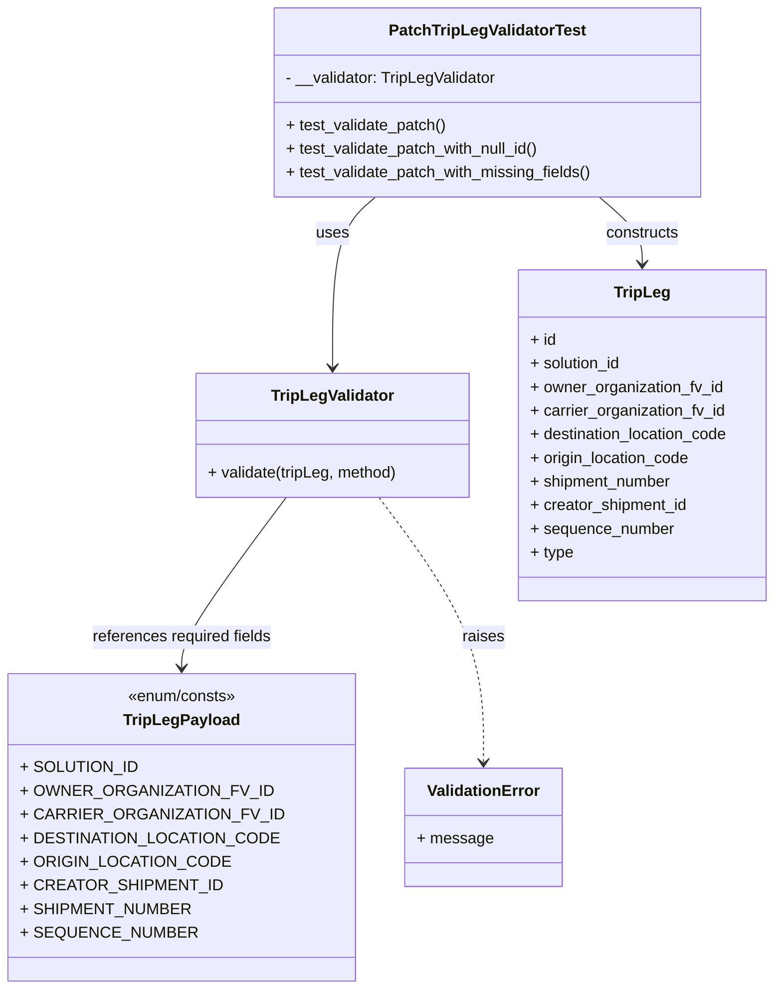

# Diagram: partview_core/partview_service/partview_service/tests/unit/core/validators/trip_leg/trip_leg_patch_validator_test.py


> Auto-generated by Obscura crawlers

## Diagram 1



### SVG

<svg id="container" width="762.9921875" xmlns="http://www.w3.org/2000/svg" class="classDiagram" height="1004" viewBox="0 0 762.9921875 1004" role="graphics-document document" aria-roledescription="class"><style>#container{font-family:"trebuchet ms",verdana,arial,sans-serif;font-size:16px;fill:#333;}@keyframes edge-animation-frame{from{stroke-dashoffset:0;}}@keyframes dash{to{stroke-dashoffset:0;}}#container .edge-animation-slow{stroke-dasharray:9,5!important;stroke-dashoffset:900;animation:dash 50s linear infinite;stroke-linecap:round;}#container .edge-animation-fast{stroke-dasharray:9,5!important;stroke-dashoffset:900;animation:dash 20s linear infinite;stroke-linecap:round;}#container .error-icon{fill:#552222;}#container .error-text{fill:#552222;stroke:#552222;}#container .edge-thickness-normal{stroke-width:1px;}#container .edge-thickness-thick{stroke-width:3.5px;}#container .edge-pattern-solid{stroke-dasharray:0;}#container .edge-thickness-invisible{stroke-width:0;fill:none;}#container .edge-pattern-dashed{stroke-dasharray:3;}#container .edge-pattern-dotted{stroke-dasharray:2;}#container .marker{fill:#333333;stroke:#333333;}#container .marker.cross{stroke:#333333;}#container svg{font-family:"trebuchet ms",verdana,arial,sans-serif;font-size:16px;}#container p{margin:0;}#container g.classGroup text{fill:#9370DB;stroke:none;font-family:"trebuchet ms",verdana,arial,sans-serif;font-size:10px;}#container g.classGroup text .title{font-weight:bolder;}#container .nodeLabel,#container .edgeLabel{color:#131300;}#container .edgeLabel .label rect{fill:#ECECFF;}#container .label text{fill:#131300;}#container .labelBkg{background:#ECECFF;}#container .edgeLabel .label span{background:#ECECFF;}#container .classTitle{font-weight:bolder;}#container .node rect,#container .node circle,#container .node ellipse,#container .node polygon,#container .node path{fill:#ECECFF;stroke:#9370DB;stroke-width:1px;}#container .divider{stroke:#9370DB;stroke-width:1;}#container g.clickable{cursor:pointer;}#container g.classGroup rect{fill:#ECECFF;stroke:#9370DB;}#container g.classGroup line{stroke:#9370DB;stroke-width:1;}#container .classLabel .box{stroke:none;stroke-width:0;fill:#ECECFF;opacity:0.5;}#container .classLabel .label{fill:#9370DB;font-size:10px;}#container .relation{stroke:#333333;stroke-width:1;fill:none;}#container .dashed-line{stroke-dasharray:3;}#container .dotted-line{stroke-dasharray:1 2;}#container #compositionStart,#container .composition{fill:#333333!important;stroke:#333333!important;stroke-width:1;}#container #compositionEnd,#container .composition{fill:#333333!important;stroke:#333333!important;stroke-width:1;}#container #dependencyStart,#container .dependency{fill:#333333!important;stroke:#333333!important;stroke-width:1;}#container #dependencyStart,#container .dependency{fill:#333333!important;stroke:#333333!important;stroke-width:1;}#container #extensionStart,#container .extension{fill:transparent!important;stroke:#333333!important;stroke-width:1;}#container #extensionEnd,#container .extension{fill:transparent!important;stroke:#333333!important;stroke-width:1;}#container #aggregationStart,#container .aggregation{fill:transparent!important;stroke:#333333!important;stroke-width:1;}#container #aggregationEnd,#container .aggregation{fill:transparent!important;stroke:#333333!important;stroke-width:1;}#container #lollipopStart,#container .lollipop{fill:#ECECFF!important;stroke:#333333!important;stroke-width:1;}#container #lollipopEnd,#container .lollipop{fill:#ECECFF!important;stroke:#333333!important;stroke-width:1;}#container .edgeTerminals{font-size:11px;line-height:initial;}#container .classTitleText{text-anchor:middle;font-size:18px;fill:#333;}#container .label-icon{display:inline-block;height:1em;overflow:visible;vertical-align:-0.125em;}#container .node .label-icon path{fill:currentColor;stroke:revert;stroke-width:revert;}#container :root{--mermaid-font-family:"trebuchet ms",verdana,arial,sans-serif;}</style><g><defs><marker id="container_class-aggregationStart" class="marker aggregation class" refX="18" refY="7" markerWidth="190" markerHeight="240" orient="auto"><path d="M 18,7 L9,13 L1,7 L9,1 Z"></path></marker></defs><defs><marker id="container_class-aggregationEnd" class="marker aggregation class" refX="1" refY="7" markerWidth="20" markerHeight="28" orient="auto"><path d="M 18,7 L9,13 L1,7 L9,1 Z"></path></marker></defs><defs><marker id="container_class-extensionStart" class="marker extension class" refX="18" refY="7" markerWidth="190" markerHeight="240" orient="auto"><path d="M 1,7 L18,13 V 1 Z"></path></marker></defs><defs><marker id="container_class-extensionEnd" class="marker extension class" refX="1" refY="7" markerWidth="20" markerHeight="28" orient="auto"><path d="M 1,1 V 13 L18,7 Z"></path></marker></defs><defs><marker id="container_class-compositionStart" class="marker composition class" refX="18" refY="7" markerWidth="190" markerHeight="240" orient="auto"><path d="M 18,7 L9,13 L1,7 L9,1 Z"></path></marker></defs><defs><marker id="container_class-compositionEnd" class="marker composition class" refX="1" refY="7" markerWidth="20" markerHeight="28" orient="auto"><path d="M 18,7 L9,13 L1,7 L9,1 Z"></path></marker></defs><defs><marker id="container_class-dependencyStart" class="marker dependency class" refX="6" refY="7" markerWidth="190" markerHeight="240" orient="auto"><path d="M 5,7 L9,13 L1,7 L9,1 Z"></path></marker></defs><defs><marker id="container_class-dependencyEnd" class="marker dependency class" refX="13" refY="7" markerWidth="20" markerHeight="28" orient="auto"><path d="M 18,7 L9,13 L14,7 L9,1 Z"></path></marker></defs><defs><marker id="container_class-lollipopStart" class="marker lollipop class" refX="13" refY="7" markerWidth="190" markerHeight="240" orient="auto"><circle stroke="black" fill="transparent" cx="7" cy="7" r="6"></circle></marker></defs><defs><marker id="container_class-lollipopEnd" class="marker lollipop class" refX="1" refY="7" markerWidth="190" markerHeight="240" orient="auto"><circle stroke="black" fill="transparent" cx="7" cy="7" r="6"></circle></marker></defs><g class="root"><g class="clusters"></g><g class="edgePaths"><path d="M352.632,200L345.253,206.167C337.875,212.333,323.117,224.667,315.738,253.5C308.359,282.333,308.359,327.667,308.359,350.333L308.359,373" id="id_PatchTripLegValidatorTest_TripLegValidator_1" class="edge-thickness-normal edge-pattern-solid relation" style=";;;" data-edge="true" data-et="edge" data-id="id_PatchTripLegValidatorTest_TripLegValidator_1" data-points="W3sieCI6MzUyLjYzMjEyMjI5NzkzMjMsInkiOjIwMH0seyJ4IjozMDguMzU5Mzc1LCJ5IjoyMzd9LHsieCI6MzA4LjM1OTM3NSwieSI6Mzc5fV0=" marker-end="url(#container_class-dependencyEnd)"></path><path d="M582.372,200L589.751,206.167C597.129,212.333,611.887,224.667,619.266,236C626.645,247.333,626.645,257.667,626.645,262.833L626.645,268" id="id_PatchTripLegValidatorTest_TripLeg_2" class="edge-thickness-normal edge-pattern-solid relation" style=";;;" data-edge="true" data-et="edge" data-id="id_PatchTripLegValidatorTest_TripLeg_2" data-points="W3sieCI6NTgyLjM3MTc4Mzk1MjA2NzYsInkiOjIwMH0seyJ4Ijo2MjYuNjQ0NTMxMjUsInkiOjIzN30seyJ4Ijo2MjYuNjQ0NTMxMjUsInkiOjI3NH1d" marker-end="url(#container_class-dependencyEnd)"></path><path d="M264.592,505L248.15,528.667C231.708,552.333,198.825,599.667,182.383,628.5C165.941,657.333,165.941,667.667,165.941,672.833L165.941,678" id="id_TripLegValidator_TripLegPayload_3" class="edge-thickness-normal edge-pattern-solid relation" style=";;;" data-edge="true" data-et="edge" data-id="id_TripLegValidator_TripLegPayload_3" data-points="W3sieCI6MjY0LjU5MTkwMTY3NjgyOTI1LCJ5Ijo1MDV9LHsieCI6MTY1Ljk0MTQwNjI1LCJ5Ijo2NDd9LHsieCI6MTY1Ljk0MTQwNjI1LCJ5Ijo2ODR9XQ==" marker-end="url(#container_class-dependencyEnd)"></path><path d="M352.127,505L368.569,528.667C385.01,552.333,417.894,599.667,434.336,644.5C450.777,689.333,450.777,731.667,450.777,752.833L450.777,774" id="id_TripLegValidator_ValidationError_4" class="edge-thickness-normal edge-pattern-dashed relation" style=";;;" data-edge="true" data-et="edge" data-id="id_TripLegValidator_ValidationError_4" data-points="W3sieCI6MzUyLjEyNjg0ODMyMzE3MDc1LCJ5Ijo1MDV9LHsieCI6NDUwLjc3NzM0Mzc1LCJ5Ijo2NDd9LHsieCI6NDUwLjc3NzM0Mzc1LCJ5Ijo3ODB9XQ==" marker-end="url(#container_class-dependencyEnd)"></path></g><g class="edgeLabels"><g class="edgeLabel" transform="translate(308.359375, 237)"><g class="label" data-id="id_PatchTripLegValidatorTest_TripLegValidator_1" transform="translate(-16.4921875, -12)"><foreignObject width="32.984375" height="24"><div xmlns="http://www.w3.org/1999/xhtml" class="labelBkg" style="display: table-cell; white-space: nowrap; line-height: 1.5; max-width: 200px; text-align: center;"><span class="edgeLabel"><p>uses</p></span></div></foreignObject></g></g><g class="edgeLabel" transform="translate(626.64453125, 237)"><g class="label" data-id="id_PatchTripLegValidatorTest_TripLeg_2" transform="translate(-37.84375, -12)"><foreignObject width="75.6875" height="24"><div xmlns="http://www.w3.org/1999/xhtml" class="labelBkg" style="display: table-cell; white-space: nowrap; line-height: 1.5; max-width: 200px; text-align: center;"><span class="edgeLabel"><p>constructs</p></span></div></foreignObject></g></g><g class="edgeLabel" transform="translate(165.94140625, 647)"><g class="label" data-id="id_TripLegValidator_TripLegPayload_3" transform="translate(-92.75, -12)"><foreignObject width="185.5" height="24"><div xmlns="http://www.w3.org/1999/xhtml" class="labelBkg" style="display: table-cell; white-space: nowrap; line-height: 1.5; max-width: 200px; text-align: center;"><span class="edgeLabel"><p>references required fields</p></span></div></foreignObject></g></g><g class="edgeLabel" transform="translate(450.77734375, 647)"><g class="label" data-id="id_TripLegValidator_ValidationError_4" transform="translate(-21.25, -12)"><foreignObject width="42.5" height="24"><div xmlns="http://www.w3.org/1999/xhtml" class="labelBkg" style="display: table-cell; white-space: nowrap; line-height: 1.5; max-width: 200px; text-align: center;"><span class="edgeLabel"><p>raises</p></span></div></foreignObject></g></g></g><g class="nodes"><g class="node default" id="classId-PatchTripLegValidatorTest-0" transform="translate(467.501953125, 104)"><g class="basic label-container"><path d="M-217.1953125 -96 L217.1953125 -96 L217.1953125 96 L-217.1953125 96" stroke="none" stroke-width="0" fill="#ECECFF" style=""></path><path d="M-217.1953125 -96 C-107.66790356902854 -96, 1.8595053619429223 -96, 217.1953125 -96 M-217.1953125 -96 C-110.75327187050664 -96, -4.3112312410132745 -96, 217.1953125 -96 M217.1953125 -96 C217.1953125 -26.922208536996607, 217.1953125 42.15558292600679, 217.1953125 96 M217.1953125 -96 C217.1953125 -47.46801705633635, 217.1953125 1.0639658873272992, 217.1953125 96 M217.1953125 96 C102.93563093592401 96, -11.32405062815198 96, -217.1953125 96 M217.1953125 96 C48.06965546381181 96, -121.05600157237637 96, -217.1953125 96 M-217.1953125 96 C-217.1953125 24.420107040082485, -217.1953125 -47.15978591983503, -217.1953125 -96 M-217.1953125 96 C-217.1953125 38.948499354866044, -217.1953125 -18.103001290267912, -217.1953125 -96" stroke="#9370DB" stroke-width="1.3" fill="none" stroke-dasharray="0 0" style=""></path></g><g class="annotation-group text" transform="translate(0, -72)"></g><g class="label-group text" transform="translate(-95.640625, -72)"><g class="label" style="font-weight: bolder" transform="translate(0,-12)"><foreignObject width="191.28125" height="24"><div xmlns="http://www.w3.org/1999/xhtml" style="display: table-cell; white-space: nowrap; line-height: 1.5; max-width: 237px; text-align: center;"><span class="nodeLabel markdown-node-label" style=""><p>PatchTripLegValidatorTest</p></span></div></foreignObject></g></g><g class="members-group text" transform="translate(-205.1953125, -24)"><g class="label" style="" transform="translate(0,-12)"><foreignObject width="217.546875" height="24"><div xmlns="http://www.w3.org/1999/xhtml" style="display: table-cell; white-space: nowrap; line-height: 1.5; max-width: 276px; text-align: center;"><span class="nodeLabel markdown-node-label" style=""><p>- __validator: TripLegValidator</p></span></div></foreignObject></g></g><g class="methods-group text" transform="translate(-205.1953125, 24)"><g class="label" style="" transform="translate(0,-12)"><foreignObject width="164.4375" height="24"><div xmlns="http://www.w3.org/1999/xhtml" style="display: table-cell; white-space: nowrap; line-height: 1.5; max-width: 222px; text-align: center;"><span class="nodeLabel markdown-node-label" style=""><p>+ test_validate_patch()</p></span></div></foreignObject></g><g class="label" style="" transform="translate(0,12)"><foreignObject width="262.359375" height="24"><div xmlns="http://www.w3.org/1999/xhtml" style="display: table-cell; white-space: nowrap; line-height: 1.5; max-width: 320px; text-align: center;"><span class="nodeLabel markdown-node-label" style=""><p>+ test_validate_patch_with_null_id()</p></span></div></foreignObject></g><g class="label" style="" transform="translate(0,36)"><foreignObject width="314.75" height="24"><div xmlns="http://www.w3.org/1999/xhtml" style="display: table-cell; white-space: nowrap; line-height: 1.5; max-width: 372px; text-align: center;"><span class="nodeLabel markdown-node-label" style=""><p>+ test_validate_patch_with_missing_fields()</p></span></div></foreignObject></g></g><g class="divider" style=""><path d="M-217.1953125 -48 C-79.27265370528954 -48, 58.650005089420915 -48, 217.1953125 -48 M-217.1953125 -48 C-48.178331342810395 -48, 120.83864981437921 -48, 217.1953125 -48" stroke="#9370DB" stroke-width="1.3" fill="none" stroke-dasharray="0 0" style=""></path></g><g class="divider" style=""><path d="M-217.1953125 0 C-72.44287971553052 0, 72.30955306893895 0, 217.1953125 0 M-217.1953125 0 C-106.16501471446915 0, 4.865283071061697 0, 217.1953125 0" stroke="#9370DB" stroke-width="1.3" fill="none" stroke-dasharray="0 0" style=""></path></g></g><g class="node default" id="classId-TripLegValidator-1" transform="translate(308.359375, 442)"><g class="basic label-container"><path d="M-139.9375 -63 L139.9375 -63 L139.9375 63 L-139.9375 63" stroke="none" stroke-width="0" fill="#ECECFF" style=""></path><path d="M-139.9375 -63 C-72.00241770514737 -63, -4.0673354102947314 -63, 139.9375 -63 M-139.9375 -63 C-78.18911629425867 -63, -16.44073258851735 -63, 139.9375 -63 M139.9375 -63 C139.9375 -19.755894520621283, 139.9375 23.488210958757435, 139.9375 63 M139.9375 -63 C139.9375 -27.99124257542769, 139.9375 7.017514849144618, 139.9375 63 M139.9375 63 C49.88978751873199 63, -40.157924962536015 63, -139.9375 63 M139.9375 63 C53.947618531298446 63, -32.04226293740311 63, -139.9375 63 M-139.9375 63 C-139.9375 14.968016562257532, -139.9375 -33.06396687548494, -139.9375 -63 M-139.9375 63 C-139.9375 30.477584917447082, -139.9375 -2.044830165105836, -139.9375 -63" stroke="#9370DB" stroke-width="1.3" fill="none" stroke-dasharray="0 0" style=""></path></g><g class="annotation-group text" transform="translate(0, -39)"></g><g class="label-group text" transform="translate(-60.234375, -39)"><g class="label" style="font-weight: bolder" transform="translate(0,-12)"><foreignObject width="120.46875" height="24"><div xmlns="http://www.w3.org/1999/xhtml" style="display: table-cell; white-space: nowrap; line-height: 1.5; max-width: 169px; text-align: center;"><span class="nodeLabel markdown-node-label" style=""><p>TripLegValidator</p></span></div></foreignObject></g></g><g class="members-group text" transform="translate(-127.9375, 9)"></g><g class="methods-group text" transform="translate(-127.9375, 39)"><g class="label" style="" transform="translate(0,-12)"><foreignObject width="195.640625" height="24"><div xmlns="http://www.w3.org/1999/xhtml" style="display: table-cell; white-space: nowrap; line-height: 1.5; max-width: 253px; text-align: center;"><span class="nodeLabel markdown-node-label" style=""><p>+ validate(tripLeg, method)</p></span></div></foreignObject></g></g><g class="divider" style=""><path d="M-139.9375 -15 C-45.47411885462017 -15, 48.989262290759655 -15, 139.9375 -15 M-139.9375 -15 C-37.82714246342282 -15, 64.28321507315437 -15, 139.9375 -15" stroke="#9370DB" stroke-width="1.3" fill="none" stroke-dasharray="0 0" style=""></path></g><g class="divider" style=""><path d="M-139.9375 9 C-55.78114859269863 9, 28.375202814602744 9, 139.9375 9 M-139.9375 9 C-46.56751444708331 9, 46.802471105833376 9, 139.9375 9" stroke="#9370DB" stroke-width="1.3" fill="none" stroke-dasharray="0 0" style=""></path></g></g><g class="node default" id="classId-TripLeg-2" transform="translate(626.64453125, 442)"><g class="basic label-container"><path d="M-128.34765625 -168 L128.34765625 -168 L128.34765625 168 L-128.34765625 168" stroke="none" stroke-width="0" fill="#ECECFF" style=""></path><path d="M-128.34765625 -168 C-65.4057184207501 -168, -2.4637805915002104 -168, 128.34765625 -168 M-128.34765625 -168 C-30.442842529400565 -168, 67.46197119119887 -168, 128.34765625 -168 M128.34765625 -168 C128.34765625 -54.92567807630458, 128.34765625 58.148643847390844, 128.34765625 168 M128.34765625 -168 C128.34765625 -58.27840929940999, 128.34765625 51.44318140118003, 128.34765625 168 M128.34765625 168 C54.066633088085084 168, -20.214390073829833 168, -128.34765625 168 M128.34765625 168 C33.17223102110795 168, -62.003194207784105 168, -128.34765625 168 M-128.34765625 168 C-128.34765625 39.28195213734185, -128.34765625 -89.4360957253163, -128.34765625 -168 M-128.34765625 168 C-128.34765625 88.90424185921628, -128.34765625 9.80848371843257, -128.34765625 -168" stroke="#9370DB" stroke-width="1.3" fill="none" stroke-dasharray="0 0" style=""></path></g><g class="annotation-group text" transform="translate(0, -144)"></g><g class="label-group text" transform="translate(-27.0546875, -144)"><g class="label" style="font-weight: bolder" transform="translate(0,-12)"><foreignObject width="54.109375" height="24"><div xmlns="http://www.w3.org/1999/xhtml" style="display: table-cell; white-space: nowrap; line-height: 1.5; max-width: 103px; text-align: center;"><span class="nodeLabel markdown-node-label" style=""><p>TripLeg</p></span></div></foreignObject></g></g><g class="members-group text" transform="translate(-116.34765625, -96)"><g class="label" style="" transform="translate(0,-12)"><foreignObject width="26.3125" height="24"><div xmlns="http://www.w3.org/1999/xhtml" style="display: table-cell; white-space: nowrap; line-height: 1.5; max-width: 84px; text-align: center;"><span class="nodeLabel markdown-node-label" style=""><p>+ id</p></span></div></foreignObject></g><g class="label" style="" transform="translate(0,12)"><foreignObject width="94.453125" height="24"><div xmlns="http://www.w3.org/1999/xhtml" style="display: table-cell; white-space: nowrap; line-height: 1.5; max-width: 152px; text-align: center;"><span class="nodeLabel markdown-node-label" style=""><p>+ solution_id</p></span></div></foreignObject></g><g class="label" style="" transform="translate(0,36)"><foreignObject width="197.546875" height="24"><div xmlns="http://www.w3.org/1999/xhtml" style="display: table-cell; white-space: nowrap; line-height: 1.5; max-width: 255px; text-align: center;"><span class="nodeLabel markdown-node-label" style=""><p>+ owner_organization_fv_id</p></span></div></foreignObject></g><g class="label" style="" transform="translate(0,60)"><foreignObject width="200.40625" height="24"><div xmlns="http://www.w3.org/1999/xhtml" style="display: table-cell; white-space: nowrap; line-height: 1.5; max-width: 258px; text-align: center;"><span class="nodeLabel markdown-node-label" style=""><p>+ carrier_organization_fv_id</p></span></div></foreignObject></g><g class="label" style="" transform="translate(0,84)"><foreignObject width="205.640625" height="24"><div xmlns="http://www.w3.org/1999/xhtml" style="display: table-cell; white-space: nowrap; line-height: 1.5; max-width: 263px; text-align: center;"><span class="nodeLabel markdown-node-label" style=""><p>+ destination_location_code</p></span></div></foreignObject></g><g class="label" style="" transform="translate(0,108)"><foreignObject width="164.75" height="24"><div xmlns="http://www.w3.org/1999/xhtml" style="display: table-cell; white-space: nowrap; line-height: 1.5; max-width: 222px; text-align: center;"><span class="nodeLabel markdown-node-label" style=""><p>+ origin_location_code</p></span></div></foreignObject></g><g class="label" style="" transform="translate(0,132)"><foreignObject width="145.796875" height="24"><div xmlns="http://www.w3.org/1999/xhtml" style="display: table-cell; white-space: nowrap; line-height: 1.5; max-width: 204px; text-align: center;"><span class="nodeLabel markdown-node-label" style=""><p>+ shipment_number</p></span></div></foreignObject></g><g class="label" style="" transform="translate(0,156)"><foreignObject width="161.78125" height="24"><div xmlns="http://www.w3.org/1999/xhtml" style="display: table-cell; white-space: nowrap; line-height: 1.5; max-width: 219px; text-align: center;"><span class="nodeLabel markdown-node-label" style=""><p>+ creator_shipment_id</p></span></div></foreignObject></g><g class="label" style="" transform="translate(0,180)"><foreignObject width="146.25" height="24"><div xmlns="http://www.w3.org/1999/xhtml" style="display: table-cell; white-space: nowrap; line-height: 1.5; max-width: 204px; text-align: center;"><span class="nodeLabel markdown-node-label" style=""><p>+ sequence_number</p></span></div></foreignObject></g><g class="label" style="" transform="translate(0,204)"><foreignObject width="44.03125" height="24"><div xmlns="http://www.w3.org/1999/xhtml" style="display: table-cell; white-space: nowrap; line-height: 1.5; max-width: 101px; text-align: center;"><span class="nodeLabel markdown-node-label" style=""><p>+ type</p></span></div></foreignObject></g></g><g class="methods-group text" transform="translate(-116.34765625, 168)"></g><g class="divider" style=""><path d="M-128.34765625 -120 C-58.23619221330222 -120, 11.875271823395565 -120, 128.34765625 -120 M-128.34765625 -120 C-71.52299904780455 -120, -14.698341845609079 -120, 128.34765625 -120" stroke="#9370DB" stroke-width="1.3" fill="none" stroke-dasharray="0 0" style=""></path></g><g class="divider" style=""><path d="M-128.34765625 144 C-74.0544098491844 144, -19.76116344836879 144, 128.34765625 144 M-128.34765625 144 C-60.76736191380802 144, 6.812932422383966 144, 128.34765625 144" stroke="#9370DB" stroke-width="1.3" fill="none" stroke-dasharray="0 0" style=""></path></g></g><g class="node default" id="classId-TripLegPayload-3" transform="translate(165.94140625, 840)"><g class="basic label-container"><path d="M-157.94140625 -156 L157.94140625 -156 L157.94140625 156 L-157.94140625 156" stroke="none" stroke-width="0" fill="#ECECFF" style=""></path><path d="M-157.94140625 -156 C-82.3637498173505 -156, -6.78609338470099 -156, 157.94140625 -156 M-157.94140625 -156 C-68.7975862797506 -156, 20.346233690498792 -156, 157.94140625 -156 M157.94140625 -156 C157.94140625 -80.85976254589451, 157.94140625 -5.7195250917890235, 157.94140625 156 M157.94140625 -156 C157.94140625 -42.29553362434227, 157.94140625 71.40893275131546, 157.94140625 156 M157.94140625 156 C42.56194798412487 156, -72.81751028175026 156, -157.94140625 156 M157.94140625 156 C44.67425456641254 156, -68.59289711717491 156, -157.94140625 156 M-157.94140625 156 C-157.94140625 35.965732769427404, -157.94140625 -84.06853446114519, -157.94140625 -156 M-157.94140625 156 C-157.94140625 83.69954230466311, -157.94140625 11.399084609326223, -157.94140625 -156" stroke="#9370DB" stroke-width="1.3" fill="none" stroke-dasharray="0 0" style=""></path></g><g class="annotation-group text" transform="translate(-56.6796875, -132)"><g class="label" style="" transform="translate(0,-12)"><foreignObject width="113.359375" height="24"><div xmlns="http://www.w3.org/1999/xhtml" style="display: table-cell; white-space: nowrap; line-height: 1.5; max-width: 163px; text-align: center;"><span class="nodeLabel markdown-node-label" style=""><p>«enum/consts»</p></span></div></foreignObject></g></g><g class="label-group text" transform="translate(-55.953125, -108)"><g class="label" style="font-weight: bolder" transform="translate(0,-12)"><foreignObject width="111.90625" height="24"><div xmlns="http://www.w3.org/1999/xhtml" style="display: table-cell; white-space: nowrap; line-height: 1.5; max-width: 159px; text-align: center;"><span class="nodeLabel markdown-node-label" style=""><p>TripLegPayload</p></span></div></foreignObject></g></g><g class="members-group text" transform="translate(-145.94140625, -60)"><g class="label" style="" transform="translate(0,-12)"><foreignObject width="108.515625" height="24"><div xmlns="http://www.w3.org/1999/xhtml" style="display: table-cell; white-space: nowrap; line-height: 1.5; max-width: 166px; text-align: center;"><span class="nodeLabel markdown-node-label" style=""><p>+ SOLUTION_ID</p></span></div></foreignObject></g><g class="label" style="" transform="translate(0,12)"><foreignObject width="228.21875" height="24"><div xmlns="http://www.w3.org/1999/xhtml" style="display: table-cell; white-space: nowrap; line-height: 1.5; max-width: 286px; text-align: center;"><span class="nodeLabel markdown-node-label" style=""><p>+ OWNER_ORGANIZATION_FV_ID</p></span></div></foreignObject></g><g class="label" style="" transform="translate(0,36)"><foreignObject width="235.203125" height="24"><div xmlns="http://www.w3.org/1999/xhtml" style="display: table-cell; white-space: nowrap; line-height: 1.5; max-width: 293px; text-align: center;"><span class="nodeLabel markdown-node-label" style=""><p>+ CARRIER_ORGANIZATION_FV_ID</p></span></div></foreignObject></g><g class="label" style="" transform="translate(0,60)"><foreignObject width="231.796875" height="24"><div xmlns="http://www.w3.org/1999/xhtml" style="display: table-cell; white-space: nowrap; line-height: 1.5; max-width: 289px; text-align: center;"><span class="nodeLabel markdown-node-label" style=""><p>+ DESTINATION_LOCATION_CODE</p></span></div></foreignObject></g><g class="label" style="" transform="translate(0,84)"><foreignObject width="188.671875" height="24"><div xmlns="http://www.w3.org/1999/xhtml" style="display: table-cell; white-space: nowrap; line-height: 1.5; max-width: 246px; text-align: center;"><span class="nodeLabel markdown-node-label" style=""><p>+ ORIGIN_LOCATION_CODE</p></span></div></foreignObject></g><g class="label" style="" transform="translate(0,108)"><foreignObject width="180.15625" height="24"><div xmlns="http://www.w3.org/1999/xhtml" style="display: table-cell; white-space: nowrap; line-height: 1.5; max-width: 238px; text-align: center;"><span class="nodeLabel markdown-node-label" style=""><p>+ CREATOR_SHIPMENT_ID</p></span></div></foreignObject></g><g class="label" style="" transform="translate(0,132)"><foreignObject width="155.03125" height="24"><div xmlns="http://www.w3.org/1999/xhtml" style="display: table-cell; white-space: nowrap; line-height: 1.5; max-width: 213px; text-align: center;"><span class="nodeLabel markdown-node-label" style=""><p>+ SHIPMENT_NUMBER</p></span></div></foreignObject></g><g class="label" style="" transform="translate(0,156)"><foreignObject width="158.234375" height="24"><div xmlns="http://www.w3.org/1999/xhtml" style="display: table-cell; white-space: nowrap; line-height: 1.5; max-width: 216px; text-align: center;"><span class="nodeLabel markdown-node-label" style=""><p>+ SEQUENCE_NUMBER</p></span></div></foreignObject></g></g><g class="methods-group text" transform="translate(-145.94140625, 156)"></g><g class="divider" style=""><path d="M-157.94140625 -84 C-72.90869267851116 -84, 12.124020892977683 -84, 157.94140625 -84 M-157.94140625 -84 C-42.74619263266149 -84, 72.44902098467702 -84, 157.94140625 -84" stroke="#9370DB" stroke-width="1.3" fill="none" stroke-dasharray="0 0" style=""></path></g><g class="divider" style=""><path d="M-157.94140625 132 C-39.68062551930335 132, 78.5801552113933 132, 157.94140625 132 M-157.94140625 132 C-78.64913664051156 132, 0.6431329689768859 132, 157.94140625 132" stroke="#9370DB" stroke-width="1.3" fill="none" stroke-dasharray="0 0" style=""></path></g></g><g class="node default" id="classId-ValidationError-4" transform="translate(450.77734375, 840)"><g class="basic label-container"><path d="M-76.89453125 -60 L76.89453125 -60 L76.89453125 60 L-76.89453125 60" stroke="none" stroke-width="0" fill="#ECECFF" style=""></path><path d="M-76.89453125 -60 C-15.695510367264433 -60, 45.503510515471135 -60, 76.89453125 -60 M-76.89453125 -60 C-18.011101467223178 -60, 40.872328315553645 -60, 76.89453125 -60 M76.89453125 -60 C76.89453125 -32.096779881171855, 76.89453125 -4.1935597623437175, 76.89453125 60 M76.89453125 -60 C76.89453125 -31.155709302589297, 76.89453125 -2.311418605178595, 76.89453125 60 M76.89453125 60 C32.59134679437595 60, -11.711837661248097 60, -76.89453125 60 M76.89453125 60 C25.458102385329 60, -25.978326479342 60, -76.89453125 60 M-76.89453125 60 C-76.89453125 33.74490944600022, -76.89453125 7.489818892000436, -76.89453125 -60 M-76.89453125 60 C-76.89453125 23.815523400357193, -76.89453125 -12.368953199285613, -76.89453125 -60" stroke="#9370DB" stroke-width="1.3" fill="none" stroke-dasharray="0 0" style=""></path></g><g class="annotation-group text" transform="translate(0, -36)"></g><g class="label-group text" transform="translate(-55.1796875, -36)"><g class="label" style="font-weight: bolder" transform="translate(0,-12)"><foreignObject width="110.359375" height="24"><div xmlns="http://www.w3.org/1999/xhtml" style="display: table-cell; white-space: nowrap; line-height: 1.5; max-width: 160px; text-align: center;"><span class="nodeLabel markdown-node-label" style=""><p>ValidationError</p></span></div></foreignObject></g></g><g class="members-group text" transform="translate(-64.89453125, 12)"><g class="label" style="" transform="translate(0,-12)"><foreignObject width="74.609375" height="24"><div xmlns="http://www.w3.org/1999/xhtml" style="display: table-cell; white-space: nowrap; line-height: 1.5; max-width: 132px; text-align: center;"><span class="nodeLabel markdown-node-label" style=""><p>+ message</p></span></div></foreignObject></g></g><g class="methods-group text" transform="translate(-64.89453125, 60)"></g><g class="divider" style=""><path d="M-76.89453125 -12 C-32.96386203452785 -12, 10.9668071809443 -12, 76.89453125 -12 M-76.89453125 -12 C-45.46120390732858 -12, -14.02787656465717 -12, 76.89453125 -12" stroke="#9370DB" stroke-width="1.3" fill="none" stroke-dasharray="0 0" style=""></path></g><g class="divider" style=""><path d="M-76.89453125 36 C-41.521294268993124 36, -6.148057287986248 36, 76.89453125 36 M-76.89453125 36 C-45.838137143171465 36, -14.781743036342924 36, 76.89453125 36" stroke="#9370DB" stroke-width="1.3" fill="none" stroke-dasharray="0 0" style=""></path></g></g></g></g></g></svg>

## Diagram 2

```mermaid
flowchart TD
    A[Start tests] --> B[test_validate_patch]
    B --> B1[Create TripLeg with id and all required fields]
    B1 --> B2[Call TripLegValidator.validate(..., "PATCH")]
    B2 --> B_OK[No exception]

    A --> C[test_validate_patch_with_null_id]
    C --> C1[Create TripLeg without id but with required fields]
    C1 --> C2[Call validate -> raises ValidationError]
    C2 --> C_MSG["\"Cannot update an object with no id\""]

    A --> D[test_validate_patch_with_missing_fields]
    D --> D1[Create TripLeg with id only]
    D1 --> D2[Sequentially add fields and call validate]
    D2 --> D_MISSING["raises ValidationError listing missing fields"]
    D_MISSING --> D_TYPE["When sequence present but type missing -> raises invalid type"]
    D_TYPE --> D_FINAL[Set type and shipment -> validate succeeds]

    B_OK --> End[Tests complete]
    C2 --> End
    D_FINAL --> End
```

> SVG rendering failed for this diagram.
