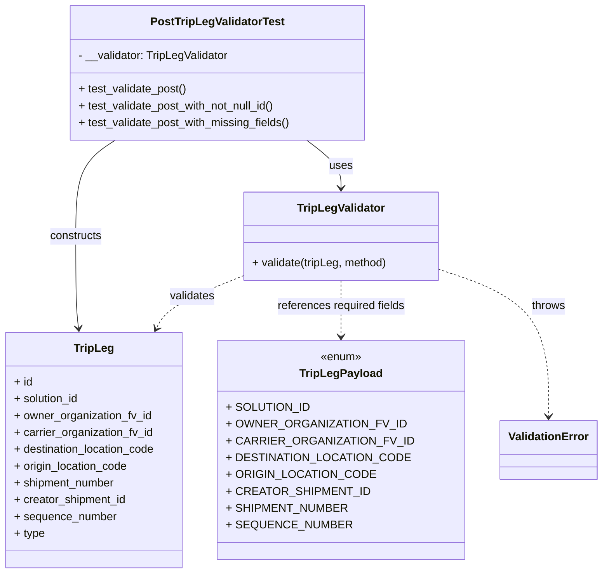
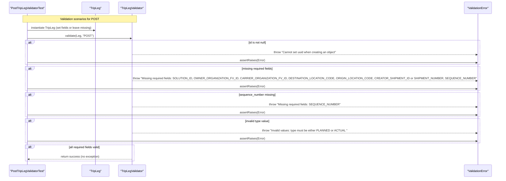

# Diagram: partview_core/partview_service/partview_service/tests/unit/core/validators/trip_leg/trip_leg_post_validator_test.py

> Auto-generated by Obscura crawlers

## Diagram 1

### SVG

<svg id="container" width="833.357421875" xmlns="http://www.w3.org/2000/svg" class="classDiagram" height="818" viewBox="0 0 833.357421875 818" role="graphics-document document" aria-roledescription="class"><g><defs><marker id="container_class-aggregationStart" class="marker aggregation class" refX="18" refY="7" markerWidth="190" markerHeight="240" orient="auto"><path d="M 18,7 L9,13 L1,7 L9,1 Z"></path></marker></defs><defs><marker id="container_class-aggregationEnd" class="marker aggregation class" refX="1" refY="7" markerWidth="20" markerHeight="28" orient="auto"><path d="M 18,7 L9,13 L1,7 L9,1 Z"></path></marker></defs><defs><marker id="container_class-extensionStart" class="marker extension class" refX="18" refY="7" markerWidth="190" markerHeight="240" orient="auto"><path d="M 1,7 L18,13 V 1 Z"></path></marker></defs><defs><marker id="container_class-extensionEnd" class="marker extension class" refX="1" refY="7" markerWidth="20" markerHeight="28" orient="auto"><path d="M 1,1 V 13 L18,7 Z"></path></marker></defs><defs><marker id="container_class-compositionStart" class="marker composition class" refX="18" refY="7" markerWidth="190" markerHeight="240" orient="auto"><path d="M 18,7 L9,13 L1,7 L9,1 Z"></path></marker></defs><defs><marker id="container_class-compositionEnd" class="marker composition class" refX="1" refY="7" markerWidth="20" markerHeight="28" orient="auto"><path d="M 18,7 L9,13 L1,7 L9,1 Z"></path></marker></defs><defs><marker id="container_class-dependencyStart" class="marker dependency class" refX="6" refY="7" markerWidth="190" markerHeight="240" orient="auto"><path d="M 5,7 L9,13 L1,7 L9,1 Z"></path></marker></defs><defs><marker id="container_class-dependencyEnd" class="marker dependency class" refX="13" refY="7" markerWidth="20" markerHeight="28" orient="auto"><path d="M 18,7 L9,13 L14,7 L9,1 Z"></path></marker></defs><defs><marker id="container_class-lollipopStart" class="marker lollipop class" refX="13" refY="7" markerWidth="190" markerHeight="240" orient="auto"><circle stroke="black" fill="transparent" cx="7" cy="7" r="6"></circle></marker></defs><defs><marker id="container_class-lollipopEnd" class="marker lollipop class" refX="1" refY="7" markerWidth="190" markerHeight="240" orient="auto"><circle stroke="black" fill="transparent" cx="7" cy="7" r="6"></circle></marker></defs><g class="root"><g class="clusters"></g><g class="edgePaths"><path d="M425.547,200L433.335,206.167C441.122,212.333,456.698,224.667,464.486,236C472.273,247.333,472.273,257.667,472.273,262.833L472.273,268" id="id_PostTripLegValidatorTest_TripLegValidator_1" class="edge-thickness-normal edge-pattern-solid relation" style=";;;" data-edge="true" data-et="edge" data-id="id_PostTripLegValidatorTest_TripLegValidator_1" data-points="W3sieCI6NDI1LjU0NjkxOTA1NTQ1MTEsInkiOjIwMH0seyJ4Ijo0NzIuMjczNDM3NSwieSI6MjM3fSx7IngiOjQ3Mi4yNzM0Mzc1LCJ5IjoyNzR9XQ==" marker-end="url(#container_class-dependencyEnd)"></path><path d="M164.059,200L155.05,206.167C146.041,212.333,128.022,224.667,119.013,247.5C110.004,270.333,110.004,303.667,110.004,337C110.004,370.333,110.004,403.667,110.669,425.508C111.334,447.35,112.664,457.699,113.329,462.874L113.994,468.049" id="id_PostTripLegValidatorTest_TripLeg_2" class="edge-thickness-normal edge-pattern-solid relation" style=";;;" data-edge="true" data-et="edge" data-id="id_PostTripLegValidatorTest_TripLeg_2" data-points="W3sieCI6MTY0LjA1OTEzNzEwMDU2MzksInkiOjIwMH0seyJ4IjoxMTAuMDAzOTA2MjUsInkiOjIzN30seyJ4IjoxMTAuMDAzOTA2MjUsInkiOjMzN30seyJ4IjoxMTAuMDAzOTA2MjUsInkiOjQzN30seyJ4IjoxMTQuNzU4NjMxODU5NzU2MSwieSI6NDc0fV0=" marker-end="url(#container_class-dependencyEnd)"></path><path d="M332.336,395.142L315.545,402.118C298.755,409.095,265.173,423.047,245.939,435.283C226.704,447.52,221.817,458.039,219.373,463.299L216.929,468.559" id="id_TripLegValidator_TripLeg_3" class="edge-thickness-normal edge-pattern-dashed relation" style=";;;" data-edge="true" data-et="edge" data-id="id_TripLegValidator_TripLeg_3" data-points="W3sieCI6MzMyLjMzNTkzNzUsInkiOjM5NS4xNDIxNTgwOTU5MDI3NH0seyJ4IjoyMzEuNTkxNzk2ODc1LCJ5Ijo0Mzd9LHsieCI6MjE0LjQwMTM5MTAwNjA5NzU1LCJ5Ijo0NzR9XQ==" marker-end="url(#container_class-dependencyEnd)"></path><path d="M479.296,400L479.983,406.167C480.67,412.333,482.045,424.667,482.733,438C483.42,451.333,483.42,465.667,483.42,472.833L483.42,480" id="id_TripLegValidator_TripLegPayload_4" class="edge-thickness-normal edge-pattern-dashed relation" style=";;;" data-edge="true" data-et="edge" data-id="id_TripLegValidator_TripLegPayload_4" data-points="W3sieCI6NDc5LjI5NTcyMjY1NjI1LCJ5Ijo0MDB9LHsieCI6NDgzLjQxOTkyMTg3NSwieSI6NDM3fSx7IngiOjQ4My40MTk5MjE4NzUsInkiOjQ4Nn1d" marker-end="url(#container_class-dependencyEnd)"></path><path d="M612.211,385.946L636.539,394.455C660.867,402.964,709.522,419.982,733.85,454.658C758.178,489.333,758.178,541.667,758.178,567.833L758.178,594" id="id_TripLegValidator_ValidationError_5" class="edge-thickness-normal edge-pattern-dashed relation" style=";;;" data-edge="true" data-et="edge" data-id="id_TripLegValidator_ValidationError_5" data-points="W3sieCI6NjEyLjIxMDkzNzUsInkiOjM4NS45NDU1NzQyODExNjY1fSx7IngiOjc1OC4xNzc3MzQzNzUsInkiOjQzN30seyJ4Ijo3NTguMTc3NzM0Mzc1LCJ5Ijo2MDB9XQ==" marker-end="url(#container_class-dependencyEnd)"></path></g><g class="edgeLabels"><g class="edgeLabel" transform="translate(472.2734375, 237)"><g class="label" data-id="id_PostTripLegValidatorTest_TripLegValidator_1" transform="translate(-16.4921875, -12)"><foreignObject width="32.984375" height="24">

uses

</foreignObject></g></g><g class="edgeLabel" transform="translate(110.00390625, 337)"><g class="label" data-id="id_PostTripLegValidatorTest_TripLeg_2" transform="translate(-37.84375, -12)"><foreignObject width="75.6875" height="24">

constructs

</foreignObject></g></g><g class="edgeLabel" transform="translate(263.12595, 423.89798)"><g class="label" data-id="id_TripLegValidator_TripLeg_3" transform="translate(-32.6875, -12)"><foreignObject width="65.375" height="24">

validates

</foreignObject></g></g><g class="edgeLabel" transform="translate(483.419921875, 437)"><g class="label" data-id="id_TripLegValidator_TripLegPayload_4" transform="translate(-92.75, -12)"><foreignObject width="185.5" height="24">

references required fields

</foreignObject></g></g><g class="edgeLabel" transform="translate(758.177734375, 437)"><g class="label" data-id="id_TripLegValidator_ValidationError_5" transform="translate(-24.5703125, -12)"><foreignObject width="49.140625" height="24">

throws

</foreignObject></g></g></g><g class="nodes"><g class="node default" id="classId-PostTripLegValidatorTest-0" transform="translate(304.310546875, 104)"><g class="basic label-container"><path d="M-210.953125 -96 L210.953125 -96 L210.953125 96 L-210.953125 96" stroke="none" stroke-width="0" fill="#ECECFF" style=""></path><path d="M-210.953125 -96 C-47.041068070584174 -96, 116.87098885883165 -96, 210.953125 -96 M-210.953125 -96 C-57.223431522949284 -96, 96.50626195410143 -96, 210.953125 -96 M210.953125 -96 C210.953125 -34.75050324045658, 210.953125 26.498993519086838, 210.953125 96 M210.953125 -96 C210.953125 -24.41951331285499, 210.953125 47.16097337429002, 210.953125 96 M210.953125 96 C49.05793431828013 96, -112.83725636343974 96, -210.953125 96 M210.953125 96 C73.97071088522085 96, -63.01170322955829 96, -210.953125 96 M-210.953125 96 C-210.953125 33.914418477440336, -210.953125 -28.17116304511933, -210.953125 -96 M-210.953125 96 C-210.953125 53.09679922600795, -210.953125 10.193598452015905, -210.953125 -96" stroke="#9370DB" stroke-width="1.3" fill="none" stroke-dasharray="0 0" style=""></path></g><g class="annotation-group text" transform="translate(0, -72)"></g><g class="label-group text" transform="translate(-91.671875, -72)"><g class="label" style="font-weight: bolder" transform="translate(0,-12)"><foreignObject width="183.34375" height="24">

PostTripLegValidatorTest

</foreignObject></g></g><g class="members-group text" transform="translate(-198.953125, -24)"><g class="label" style="" transform="translate(0,-12)"><foreignObject width="217.546875" height="24">

- __validator: TripLegValidator

</foreignObject></g></g><g class="methods-group text" transform="translate(-198.953125, 24)"><g class="label" style="" transform="translate(0,-12)"><foreignObject width="155.921875" height="24">

+ test_validate_post()

</foreignObject></g><g class="label" style="" transform="translate(0,12)"><foreignObject width="286.671875" height="24">

+ test_validate_post_with_not_null_id()

</foreignObject></g><g class="label" style="" transform="translate(0,36)"><foreignObject width="306.234375" height="24">

+ test_validate_post_with_missing_fields()

</foreignObject></g></g><g class="divider" style=""><path d="M-210.953125 -48 C-98.45915702278289 -48, 14.03481095443422 -48, 210.953125 -48 M-210.953125 -48 C-112.43414170790578 -48, -13.915158415811561 -48, 210.953125 -48" stroke="#9370DB" stroke-width="1.3" fill="none" stroke-dasharray="0 0" style=""></path></g><g class="divider" style=""><path d="M-210.953125 0 C-97.33874607427062 0, 16.275632851458766 0, 210.953125 0 M-210.953125 0 C-47.7993430215017 0, 115.3544389569966 0, 210.953125 0" stroke="#9370DB" stroke-width="1.3" fill="none" stroke-dasharray="0 0" style=""></path></g></g><g class="node default" id="classId-TripLeg-1" transform="translate(136.34765625, 642)"><g class="basic label-container"><path d="M-128.34765625 -168 L128.34765625 -168 L128.34765625 168 L-128.34765625 168" stroke="none" stroke-width="0" fill="#ECECFF" style=""></path><path d="M-128.34765625 -168 C-66.35431763641225 -168, -4.360979022824495 -168, 128.34765625 -168 M-128.34765625 -168 C-47.06018913193317 -168, 34.22727798613366 -168, 128.34765625 -168 M128.34765625 -168 C128.34765625 -95.37060639853476, 128.34765625 -22.741212797069522, 128.34765625 168 M128.34765625 -168 C128.34765625 -95.75070845214287, 128.34765625 -23.501416904285747, 128.34765625 168 M128.34765625 168 C31.594544209513288 168, -65.15856783097342 168, -128.34765625 168 M128.34765625 168 C50.63175163774578 168, -27.08415297450844 168, -128.34765625 168 M-128.34765625 168 C-128.34765625 57.560672952781076, -128.34765625 -52.87865409443785, -128.34765625 -168 M-128.34765625 168 C-128.34765625 43.74324417653692, -128.34765625 -80.51351164692616, -128.34765625 -168" stroke="#9370DB" stroke-width="1.3" fill="none" stroke-dasharray="0 0" style=""></path></g><g class="annotation-group text" transform="translate(0, -144)"></g><g class="label-group text" transform="translate(-27.0546875, -144)"><g class="label" style="font-weight: bolder" transform="translate(0,-12)"><foreignObject width="54.109375" height="24">

TripLeg

</foreignObject></g></g><g class="members-group text" transform="translate(-116.34765625, -96)"><g class="label" style="" transform="translate(0,-12)"><foreignObject width="26.3125" height="24">

+ id

</foreignObject></g><g class="label" style="" transform="translate(0,12)"><foreignObject width="94.453125" height="24">

+ solution_id

</foreignObject></g><g class="label" style="" transform="translate(0,36)"><foreignObject width="197.546875" height="24">

+ owner_organization_fv_id

</foreignObject></g><g class="label" style="" transform="translate(0,60)"><foreignObject width="200.40625" height="24">

+ carrier_organization_fv_id

</foreignObject></g><g class="label" style="" transform="translate(0,84)"><foreignObject width="205.640625" height="24">

+ destination_location_code

</foreignObject></g><g class="label" style="" transform="translate(0,108)"><foreignObject width="164.75" height="24">

+ origin_location_code

</foreignObject></g><g class="label" style="" transform="translate(0,132)"><foreignObject width="145.796875" height="24">

+ shipment_number

</foreignObject></g><g class="label" style="" transform="translate(0,156)"><foreignObject width="161.78125" height="24">

+ creator_shipment_id

</foreignObject></g><g class="label" style="" transform="translate(0,180)"><foreignObject width="146.25" height="24">

+ sequence_number

</foreignObject></g><g class="label" style="" transform="translate(0,204)"><foreignObject width="44.03125" height="24">

+ type

</foreignObject></g></g><g class="methods-group text" transform="translate(-116.34765625, 168)"></g><g class="divider" style=""><path d="M-128.34765625 -120 C-39.03292972603121 -120, 50.281796797937574 -120, 128.34765625 -120 M-128.34765625 -120 C-38.049084254401194 -120, 52.24948774119761 -120, 128.34765625 -120" stroke="#9370DB" stroke-width="1.3" fill="none" stroke-dasharray="0 0" style=""></path></g><g class="divider" style=""><path d="M-128.34765625 144 C-36.65863396248798 144, 55.030388325024035 144, 128.34765625 144 M-128.34765625 144 C-42.58192652913223 144, 43.183803191735535 144, 128.34765625 144" stroke="#9370DB" stroke-width="1.3" fill="none" stroke-dasharray="0 0" style=""></path></g></g><g class="node default" id="classId-TripLegValidator-2" transform="translate(472.2734375, 337)"><g class="basic label-container"><path d="M-139.9375 -63 L139.9375 -63 L139.9375 63 L-139.9375 63" stroke="none" stroke-width="0" fill="#ECECFF" style=""></path><path d="M-139.9375 -63 C-42.353167547247054 -63, 55.23116490550589 -63, 139.9375 -63 M-139.9375 -63 C-81.82026962359916 -63, -23.703039247198305 -63, 139.9375 -63 M139.9375 -63 C139.9375 -15.60721961624047, 139.9375 31.78556076751906, 139.9375 63 M139.9375 -63 C139.9375 -21.315902853537793, 139.9375 20.368194292924414, 139.9375 63 M139.9375 63 C70.70986669478017 63, 1.4822333895603492 63, -139.9375 63 M139.9375 63 C46.33976352026416 63, -47.25797295947169 63, -139.9375 63 M-139.9375 63 C-139.9375 17.770984527169126, -139.9375 -27.458030945661747, -139.9375 -63 M-139.9375 63 C-139.9375 21.14469521274446, -139.9375 -20.710609574511082, -139.9375 -63" stroke="#9370DB" stroke-width="1.3" fill="none" stroke-dasharray="0 0" style=""></path></g><g class="annotation-group text" transform="translate(0, -39)"></g><g class="label-group text" transform="translate(-60.234375, -39)"><g class="label" style="font-weight: bolder" transform="translate(0,-12)"><foreignObject width="120.46875" height="24">

TripLegValidator

</foreignObject></g></g><g class="members-group text" transform="translate(-127.9375, 9)"></g><g class="methods-group text" transform="translate(-127.9375, 39)"><g class="label" style="" transform="translate(0,-12)"><foreignObject width="195.640625" height="24">

+ validate(tripLeg, method)

</foreignObject></g></g><g class="divider" style=""><path d="M-139.9375 -15 C-78.4130611239842 -15, -16.888622247968414 -15, 139.9375 -15 M-139.9375 -15 C-51.213919191183635 -15, 37.50966161763273 -15, 139.9375 -15" stroke="#9370DB" stroke-width="1.3" fill="none" stroke-dasharray="0 0" style=""></path></g><g class="divider" style=""><path d="M-139.9375 9 C-34.88689477538392 9, 70.16371044923216 9, 139.9375 9 M-139.9375 9 C-59.8315520472769 9, 20.274395905446198 9, 139.9375 9" stroke="#9370DB" stroke-width="1.3" fill="none" stroke-dasharray="0 0" style=""></path></g></g><g class="node default" id="classId-TripLegPayload-3" transform="translate(483.419921875, 642)"><g class="basic label-container"><path d="M-157.578125 -156 L157.578125 -156 L157.578125 156 L-157.578125 156" stroke="none" stroke-width="0" fill="#ECECFF" style=""></path><path d="M-157.578125 -156 C-94.31686237681747 -156, -31.055599753634937 -156, 157.578125 -156 M-157.578125 -156 C-85.26017114134122 -156, -12.942217282682435 -156, 157.578125 -156 M157.578125 -156 C157.578125 -53.13525303805706, 157.578125 49.72949392388588, 157.578125 156 M157.578125 -156 C157.578125 -50.2685424964893, 157.578125 55.462915007021394, 157.578125 156 M157.578125 156 C69.92823322695685 156, -17.721658546086303 156, -157.578125 156 M157.578125 156 C86.55933483066931 156, 15.540544661338629 156, -157.578125 156 M-157.578125 156 C-157.578125 80.38582717860436, -157.578125 4.771654357208718, -157.578125 -156 M-157.578125 156 C-157.578125 60.56960217072452, -157.578125 -34.860795658550956, -157.578125 -156" stroke="#9370DB" stroke-width="1.3" fill="none" stroke-dasharray="0 0" style=""></path></g><g class="annotation-group text" transform="translate(-29.53125, -132)"><g class="label" style="" transform="translate(0,-12)"><foreignObject width="59.0625" height="24">

«enum»

</foreignObject></g></g><g class="label-group text" transform="translate(-55.953125, -108)"><g class="label" style="font-weight: bolder" transform="translate(0,-12)"><foreignObject width="111.90625" height="24">

TripLegPayload

</foreignObject></g></g><g class="members-group text" transform="translate(-145.578125, -60)"><g class="label" style="" transform="translate(0,-12)"><foreignObject width="108.515625" height="24">

+ SOLUTION_ID

</foreignObject></g><g class="label" style="" transform="translate(0,12)"><foreignObject width="228.21875" height="24">

+ OWNER_ORGANIZATION_FV_ID

</foreignObject></g><g class="label" style="" transform="translate(0,36)"><foreignObject width="235.203125" height="24">

+ CARRIER_ORGANIZATION_FV_ID

</foreignObject></g><g class="label" style="" transform="translate(0,60)"><foreignObject width="231.796875" height="24">

+ DESTINATION_LOCATION_CODE

</foreignObject></g><g class="label" style="" transform="translate(0,84)"><foreignObject width="188.671875" height="24">

+ ORIGIN_LOCATION_CODE

</foreignObject></g><g class="label" style="" transform="translate(0,108)"><foreignObject width="180.15625" height="24">

+ CREATOR_SHIPMENT_ID

</foreignObject></g><g class="label" style="" transform="translate(0,132)"><foreignObject width="155.03125" height="24">

+ SHIPMENT_NUMBER

</foreignObject></g><g class="label" style="" transform="translate(0,156)"><foreignObject width="158.234375" height="24">

+ SEQUENCE_NUMBER

</foreignObject></g></g><g class="methods-group text" transform="translate(-145.578125, 156)"></g><g class="divider" style=""><path d="M-157.578125 -84 C-90.01526656856433 -84, -22.452408137128657 -84, 157.578125 -84 M-157.578125 -84 C-79.46366243556122 -84, -1.349199871122437 -84, 157.578125 -84" stroke="#9370DB" stroke-width="1.3" fill="none" stroke-dasharray="0 0" style=""></path></g><g class="divider" style=""><path d="M-157.578125 132 C-64.32315164587074 132, 28.931821708258525 132, 157.578125 132 M-157.578125 132 C-33.902335872243924 132, 89.77345325551215 132, 157.578125 132" stroke="#9370DB" stroke-width="1.3" fill="none" stroke-dasharray="0 0" style=""></path></g></g><g class="node default" id="classId-ValidationError-4" transform="translate(758.177734375, 642)"><g class="basic label-container"><path d="M-67.1796875 -42 L67.1796875 -42 L67.1796875 42 L-67.1796875 42" stroke="none" stroke-width="0" fill="#ECECFF" style=""></path><path d="M-67.1796875 -42 C-30.720716735604455 -42, 5.73825402879109 -42, 67.1796875 -42 M-67.1796875 -42 C-21.22840313890842 -42, 24.72288122218316 -42, 67.1796875 -42 M67.1796875 -42 C67.1796875 -9.734375861726136, 67.1796875 22.53124827654773, 67.1796875 42 M67.1796875 -42 C67.1796875 -15.13822251881082, 67.1796875 11.723554962378358, 67.1796875 42 M67.1796875 42 C31.870816791438216 42, -3.4380539171235682 42, -67.1796875 42 M67.1796875 42 C22.878449544515476 42, -21.422788410969048 42, -67.1796875 42 M-67.1796875 42 C-67.1796875 18.16754731635304, -67.1796875 -5.664905367293919, -67.1796875 -42 M-67.1796875 42 C-67.1796875 22.39418786662131, -67.1796875 2.788375733242617, -67.1796875 -42" stroke="#9370DB" stroke-width="1.3" fill="none" stroke-dasharray="0 0" style=""></path></g><g class="annotation-group text" transform="translate(0, -18)"></g><g class="label-group text" transform="translate(-55.1796875, -18)"><g class="label" style="font-weight: bolder" transform="translate(0,-12)"><foreignObject width="110.359375" height="24">

ValidationError

</foreignObject></g></g><g class="members-group text" transform="translate(-55.1796875, 30)"></g><g class="methods-group text" transform="translate(-55.1796875, 60)"></g><g class="divider" style=""><path d="M-67.1796875 6 C-18.108437582844303 6, 30.962812334311394 6, 67.1796875 6 M-67.1796875 6 C-28.446973725939706 6, 10.285740048120587 6, 67.1796875 6" stroke="#9370DB" stroke-width="1.3" fill="none" stroke-dasharray="0 0" style=""></path></g><g class="divider" style=""><path d="M-67.1796875 24 C-35.70344600662233 24, -4.227204513244665 24, 67.1796875 24 M-67.1796875 24 C-33.08298168997487 24, 1.0137241200502558 24, 67.1796875 24" stroke="#9370DB" stroke-width="1.3" fill="none" stroke-dasharray="0 0" style=""></path></g></g></g></g></g></svg>

## Diagram 2

### SVG

<svg id="container" width="2648" xmlns="http://www.w3.org/2000/svg" height="1023" viewBox="-50 -10 2648 1023" role="graphics-document document" aria-roledescription="sequence"><g><rect x="2398" y="937" fill="#eaeaea" stroke="#666" width="150" height="65" name="Error" rx="3" ry="3" class="actor actor-bottom"></rect><text x="2473" y="969.5" dominant-baseline="central" alignment-baseline="central" class="actor actor-box" style="text-anchor: middle; font-size: 16px; font-weight: 400;"><tspan x="2473" dy="0">"ValidationError"</tspan></text></g><g><rect x="637.5" y="937" fill="#eaeaea" stroke="#666" width="151" height="65" name="Validator" rx="3" ry="3" class="actor actor-bottom"></rect><text x="713" y="969.5" dominant-baseline="central" alignment-baseline="central" class="actor actor-box" style="text-anchor: middle; font-size: 16px; font-weight: 400;"><tspan x="713" dy="0">"TripLegValidator"</tspan></text></g><g><rect x="437.5" y="937" fill="#eaeaea" stroke="#666" width="150" height="65" name="Leg" rx="3" ry="3" class="actor actor-bottom"></rect><text x="512.5" y="969.5" dominant-baseline="central" alignment-baseline="central" class="actor actor-box" style="text-anchor: middle; font-size: 16px; font-weight: 400;"><tspan x="512.5" dy="0">"TripLeg"</tspan></text></g><g><rect x="0" y="937" fill="#eaeaea" stroke="#666" width="211" height="65" name="Test" rx="3" ry="3" class="actor actor-bottom"></rect><text x="105.5" y="969.5" dominant-baseline="central" alignment-baseline="central" class="actor actor-box" style="text-anchor: middle; font-size: 16px; font-weight: 400;"><tspan x="105.5" dy="0">"PostTripLegValidatorTest"</tspan></text></g><g><line id="actor3" x1="2473" y1="65" x2="2473" y2="937" class="actor-line 200" stroke-width="0.5px" stroke="#999" name="Error"></line><g id="root-3"><rect x="2398" y="0" fill="#eaeaea" stroke="#666" width="150" height="65" name="Error" rx="3" ry="3" class="actor actor-top"></rect><text x="2473" y="32.5" dominant-baseline="central" alignment-baseline="central" class="actor actor-box" style="text-anchor: middle; font-size: 16px; font-weight: 400;"><tspan x="2473" dy="0">"ValidationError"</tspan></text></g></g><g><line id="actor2" x1="713" y1="65" x2="713" y2="937" class="actor-line 200" stroke-width="0.5px" stroke="#999" name="Validator"></line><g id="root-2"><rect x="637.5" y="0" fill="#eaeaea" stroke="#666" width="151" height="65" name="Validator" rx="3" ry="3" class="actor actor-top"></rect><text x="713" y="32.5" dominant-baseline="central" alignment-baseline="central" class="actor actor-box" style="text-anchor: middle; font-size: 16px; font-weight: 400;"><tspan x="713" dy="0">"TripLegValidator"</tspan></text></g></g><g><line id="actor1" x1="512.5" y1="65" x2="512.5" y2="937" class="actor-line 200" stroke-width="0.5px" stroke="#999" name="Leg"></line><g id="root-1"><rect x="437.5" y="0" fill="#eaeaea" stroke="#666" width="150" height="65" name="Leg" rx="3" ry="3" class="actor actor-top"></rect><text x="512.5" y="32.5" dominant-baseline="central" alignment-baseline="central" class="actor actor-box" style="text-anchor: middle; font-size: 16px; font-weight: 400;"><tspan x="512.5" dy="0">"TripLeg"</tspan></text></g></g><g><line id="actor0" x1="105.5" y1="65" x2="105.5" y2="937" class="actor-line 200" stroke-width="0.5px" stroke="#999" name="Test"></line><g id="root-0"><rect x="0" y="0" fill="#eaeaea" stroke="#666" width="211" height="65" name="Test" rx="3" ry="3" class="actor actor-top"></rect><text x="105.5" y="32.5" dominant-baseline="central" alignment-baseline="central" class="actor actor-box" style="text-anchor: middle; font-size: 16px; font-weight: 400;"><tspan x="105.5" dy="0">"PostTripLegValidatorTest"</tspan></text></g></g><g></g><defs><symbol id="computer" width="24" height="24"><path transform="scale(.5)" d="M2 2v13h20v-13h-20zm18 11h-16v-9h16v9zm-10.228 6l.466-1h3.524l.467 1h-4.457zm14.228 3h-24l2-6h2.104l-1.33 4h18.45l-1.297-4h2.073l2 6zm-5-10h-14v-7h14v7z"></path></symbol></defs><defs><symbol id="database" fill-rule="evenodd" clip-rule="evenodd"><path transform="scale(.5)" d="M12.258.001l.256.004.255.005.253.008.251.01.249.012.247.015.246.016.242.019.241.02.239.023.236.024.233.027.231.028.229.031.225.032.223.034.22.036.217.038.214.04.211.041.208.043.205.045.201.046.198.048.194.05.191.051.187.053.183.054.18.056.175.057.172.059.168.06.163.061.16.063.155.064.15.066.074.033.073.033.071.034.07.034.069.035.068.035.067.035.066.035.064.036.064.036.062.036.06.036.06.037.058.037.058.037.055.038.055.038.053.038.052.038.051.039.05.039.048.039.047.039.045.04.044.04.043.04.041.04.04.041.039.041.037.041.036.041.034.041.033.042.032.042.03.042.029.042.027.042.026.043.024.043.023.043.021.043.02.043.018.044.017.043.015.044.013.044.012.044.011.045.009.044.007.045.006.045.004.045.002.045.001.045v17l-.001.045-.002.045-.004.045-.006.045-.007.045-.009.044-.011.045-.012.044-.013.044-.015.044-.017.043-.018.044-.02.043-.021.043-.023.043-.024.043-.026.043-.027.042-.029.042-.03.042-.032.042-.033.042-.034.041-.036.041-.037.041-.039.041-.04.041-.041.04-.043.04-.044.04-.045.04-.047.039-.048.039-.05.039-.051.039-.052.038-.053.038-.055.038-.055.038-.058.037-.058.037-.06.037-.06.036-.062.036-.064.036-.064.036-.066.035-.067.035-.068.035-.069.035-.07.034-.071.034-.073.033-.074.033-.15.066-.155.064-.16.063-.163.061-.168.06-.172.059-.175.057-.18.056-.183.054-.187.053-.191.051-.194.05-.198.048-.201.046-.205.045-.208.043-.211.041-.214.04-.217.038-.22.036-.223.034-.225.032-.229.031-.231.028-.233.027-.236.024-.239.023-.241.02-.242.019-.246.016-.247.015-.249.012-.251.01-.253.008-.255.005-.256.004-.258.001-.258-.001-.256-.004-.255-.005-.253-.008-.251-.01-.249-.012-.247-.015-.245-.016-.243-.019-.241-.02-.238-.023-.236-.024-.234-.027-.231-.028-.228-.031-.226-.032-.223-.034-.22-.036-.217-.038-.214-.04-.211-.041-.208-.043-.204-.045-.201-.046-.198-.048-.195-.05-.19-.051-.187-.053-.184-.054-.179-.056-.176-.057-.172-.059-.167-.06-.164-.061-.159-.063-.155-.064-.151-.066-.074-.033-.072-.033-.072-.034-.07-.034-.069-.035-.068-.035-.067-.035-.066-.035-.064-.036-.063-.036-.062-.036-.061-.036-.06-.037-.058-.037-.057-.037-.056-.038-.055-.038-.053-.038-.052-.038-.051-.039-.049-.039-.049-.039-.046-.039-.046-.04-.044-.04-.043-.04-.041-.04-.04-.041-.039-.041-.037-.041-.036-.041-.034-.041-.033-.042-.032-.042-.03-.042-.029-.042-.027-.042-.026-.043-.024-.043-.023-.043-.021-.043-.02-.043-.018-.044-.017-.043-.015-.044-.013-.044-.012-.044-.011-.045-.009-.044-.007-.045-.006-.045-.004-.045-.002-.045-.001-.045v-17l.001-.045.002-.045.004-.045.006-.045.007-.045.009-.044.011-.045.012-.044.013-.044.015-.044.017-.043.018-.044.02-.043.021-.043.023-.043.024-.043.026-.043.027-.042.029-.042.03-.042.032-.042.033-.042.034-.041.036-.041.037-.041.039-.041.04-.041.041-.04.043-.04.044-.04.046-.04.046-.039.049-.039.049-.039.051-.039.052-.038.053-.038.055-.038.056-.038.057-.037.058-.037.06-.037.061-.036.062-.036.063-.036.064-.036.066-.035.067-.035.068-.035.069-.035.07-.034.072-.034.072-.033.074-.033.151-.066.155-.064.159-.063.164-.061.167-.06.172-.059.176-.057.179-.056.184-.054.187-.053.19-.051.195-.05.198-.048.201-.046.204-.045.208-.043.211-.041.214-.04.217-.038.22-.036.223-.034.226-.032.228-.031.231-.028.234-.027.236-.024.238-.023.241-.02.243-.019.245-.016.247-.015.249-.012.251-.01.253-.008.255-.005.256-.004.258-.001.258.001zm-9.258 20.499v.01l.001.021.003.021.004.022.005.021.006.022.007.022.009.023.01.022.011.023.012.023.013.023.015.023.016.024.017.023.018.024.019.024.021.024.022.025.023.024.024.025.052.049.056.05.061.051.066.051.07.051.075.051.079.052.084.052.088.052.092.052.097.052.102.051.105.052.11.052.114.051.119.051.123.051.127.05.131.05.135.05.139.048.144.049.147.047.152.047.155.047.16.045.163.045.167.043.171.043.176.041.178.041.183.039.187.039.19.037.194.035.197.035.202.033.204.031.209.03.212.029.216.027.219.025.222.024.226.021.23.02.233.018.236.016.24.015.243.012.246.01.249.008.253.005.256.004.259.001.26-.001.257-.004.254-.005.25-.008.247-.011.244-.012.241-.014.237-.016.233-.018.231-.021.226-.021.224-.024.22-.026.216-.027.212-.028.21-.031.205-.031.202-.034.198-.034.194-.036.191-.037.187-.039.183-.04.179-.04.175-.042.172-.043.168-.044.163-.045.16-.046.155-.046.152-.047.148-.048.143-.049.139-.049.136-.05.131-.05.126-.05.123-.051.118-.052.114-.051.11-.052.106-.052.101-.052.096-.052.092-.052.088-.053.083-.051.079-.052.074-.052.07-.051.065-.051.06-.051.056-.05.051-.05.023-.024.023-.025.021-.024.02-.024.019-.024.018-.024.017-.024.015-.023.014-.024.013-.023.012-.023.01-.023.01-.022.008-.022.006-.022.006-.022.004-.022.004-.021.001-.021.001-.021v-4.127l-.077.055-.08.053-.083.054-.085.053-.087.052-.09.052-.093.051-.095.05-.097.05-.1.049-.102.049-.105.048-.106.047-.109.047-.111.046-.114.045-.115.045-.118.044-.12.043-.122.042-.124.042-.126.041-.128.04-.13.04-.132.038-.134.038-.135.037-.138.037-.139.035-.142.035-.143.034-.144.033-.147.032-.148.031-.15.03-.151.03-.153.029-.154.027-.156.027-.158.026-.159.025-.161.024-.162.023-.163.022-.165.021-.166.02-.167.019-.169.018-.169.017-.171.016-.173.015-.173.014-.175.013-.175.012-.177.011-.178.01-.179.008-.179.008-.181.006-.182.005-.182.004-.184.003-.184.002h-.37l-.184-.002-.184-.003-.182-.004-.182-.005-.181-.006-.179-.008-.179-.008-.178-.01-.176-.011-.176-.012-.175-.013-.173-.014-.172-.015-.171-.016-.17-.017-.169-.018-.167-.019-.166-.02-.165-.021-.163-.022-.162-.023-.161-.024-.159-.025-.157-.026-.156-.027-.155-.027-.153-.029-.151-.03-.15-.03-.148-.031-.146-.032-.145-.033-.143-.034-.141-.035-.14-.035-.137-.037-.136-.037-.134-.038-.132-.038-.13-.04-.128-.04-.126-.041-.124-.042-.122-.042-.12-.044-.117-.043-.116-.045-.113-.045-.112-.046-.109-.047-.106-.047-.105-.048-.102-.049-.1-.049-.097-.05-.095-.05-.093-.052-.09-.051-.087-.052-.085-.053-.083-.054-.08-.054-.077-.054v4.127zm0-5.654v.011l.001.021.003.021.004.021.005.022.006.022.007.022.009.022.01.022.011.023.012.023.013.023.015.024.016.023.017.024.018.024.019.024.021.024.022.024.023.025.024.024.052.05.056.05.061.05.066.051.07.051.075.052.079.051.084.052.088.052.092.052.097.052.102.052.105.052.11.051.114.051.119.052.123.05.127.051.131.05.135.049.139.049.144.048.147.048.152.047.155.046.16.045.163.045.167.044.171.042.176.042.178.04.183.04.187.038.19.037.194.036.197.034.202.033.204.032.209.03.212.028.216.027.219.025.222.024.226.022.23.02.233.018.236.016.24.014.243.012.246.01.249.008.253.006.256.003.259.001.26-.001.257-.003.254-.006.25-.008.247-.01.244-.012.241-.015.237-.016.233-.018.231-.02.226-.022.224-.024.22-.025.216-.027.212-.029.21-.03.205-.032.202-.033.198-.035.194-.036.191-.037.187-.039.183-.039.179-.041.175-.042.172-.043.168-.044.163-.045.16-.045.155-.047.152-.047.148-.048.143-.048.139-.05.136-.049.131-.05.126-.051.123-.051.118-.051.114-.052.11-.052.106-.052.101-.052.096-.052.092-.052.088-.052.083-.052.079-.052.074-.051.07-.052.065-.051.06-.05.056-.051.051-.049.023-.025.023-.024.021-.025.02-.024.019-.024.018-.024.017-.024.015-.023.014-.023.013-.024.012-.022.01-.023.01-.023.008-.022.006-.022.006-.022.004-.021.004-.022.001-.021.001-.021v-4.139l-.077.054-.08.054-.083.054-.085.052-.087.053-.09.051-.093.051-.095.051-.097.05-.1.049-.102.049-.105.048-.106.047-.109.047-.111.046-.114.045-.115.044-.118.044-.12.044-.122.042-.124.042-.126.041-.128.04-.13.039-.132.039-.134.038-.135.037-.138.036-.139.036-.142.035-.143.033-.144.033-.147.033-.148.031-.15.03-.151.03-.153.028-.154.028-.156.027-.158.026-.159.025-.161.024-.162.023-.163.022-.165.021-.166.02-.167.019-.169.018-.169.017-.171.016-.173.015-.173.014-.175.013-.175.012-.177.011-.178.009-.179.009-.179.007-.181.007-.182.005-.182.004-.184.003-.184.002h-.37l-.184-.002-.184-.003-.182-.004-.182-.005-.181-.007-.179-.007-.179-.009-.178-.009-.176-.011-.176-.012-.175-.013-.173-.014-.172-.015-.171-.016-.17-.017-.169-.018-.167-.019-.166-.02-.165-.021-.163-.022-.162-.023-.161-.024-.159-.025-.157-.026-.156-.027-.155-.028-.153-.028-.151-.03-.15-.03-.148-.031-.146-.033-.145-.033-.143-.033-.141-.035-.14-.036-.137-.036-.136-.037-.134-.038-.132-.039-.13-.039-.128-.04-.126-.041-.124-.042-.122-.043-.12-.043-.117-.044-.116-.044-.113-.046-.112-.046-.109-.046-.106-.047-.105-.048-.102-.049-.1-.049-.097-.05-.095-.051-.093-.051-.09-.051-.087-.053-.085-.052-.083-.054-.08-.054-.077-.054v4.139zm0-5.666v.011l.001.02.003.022.004.021.005.022.006.021.007.022.009.023.01.022.011.023.012.023.013.023.015.023.016.024.017.024.018.023.019.024.021.025.022.024.023.024.024.025.052.05.056.05.061.05.066.051.07.051.075.052.079.051.084.052.088.052.092.052.097.052.102.052.105.051.11.052.114.051.119.051.123.051.127.05.131.05.135.05.139.049.144.048.147.048.152.047.155.046.16.045.163.045.167.043.171.043.176.042.178.04.183.04.187.038.19.037.194.036.197.034.202.033.204.032.209.03.212.028.216.027.219.025.222.024.226.021.23.02.233.018.236.017.24.014.243.012.246.01.249.008.253.006.256.003.259.001.26-.001.257-.003.254-.006.25-.008.247-.01.244-.013.241-.014.237-.016.233-.018.231-.02.226-.022.224-.024.22-.025.216-.027.212-.029.21-.03.205-.032.202-.033.198-.035.194-.036.191-.037.187-.039.183-.039.179-.041.175-.042.172-.043.168-.044.163-.045.16-.045.155-.047.152-.047.148-.048.143-.049.139-.049.136-.049.131-.051.126-.05.123-.051.118-.052.114-.051.11-.052.106-.052.101-.052.096-.052.092-.052.088-.052.083-.052.079-.052.074-.052.07-.051.065-.051.06-.051.056-.05.051-.049.023-.025.023-.025.021-.024.02-.024.019-.024.018-.024.017-.024.015-.023.014-.024.013-.023.012-.023.01-.022.01-.023.008-.022.006-.022.006-.022.004-.022.004-.021.001-.021.001-.021v-4.153l-.077.054-.08.054-.083.053-.085.053-.087.053-.09.051-.093.051-.095.051-.097.05-.1.049-.102.048-.105.048-.106.048-.109.046-.111.046-.114.046-.115.044-.118.044-.12.043-.122.043-.124.042-.126.041-.128.04-.13.039-.132.039-.134.038-.135.037-.138.036-.139.036-.142.034-.143.034-.144.033-.147.032-.148.032-.15.03-.151.03-.153.028-.154.028-.156.027-.158.026-.159.024-.161.024-.162.023-.163.023-.165.021-.166.02-.167.019-.169.018-.169.017-.171.016-.173.015-.173.014-.175.013-.175.012-.177.01-.178.01-.179.009-.179.007-.181.006-.182.006-.182.004-.184.003-.184.001-.185.001-.185-.001-.184-.001-.184-.003-.182-.004-.182-.006-.181-.006-.179-.007-.179-.009-.178-.01-.176-.01-.176-.012-.175-.013-.173-.014-.172-.015-.171-.016-.17-.017-.169-.018-.167-.019-.166-.02-.165-.021-.163-.023-.162-.023-.161-.024-.159-.024-.157-.026-.156-.027-.155-.028-.153-.028-.151-.03-.15-.03-.148-.032-.146-.032-.145-.033-.143-.034-.141-.034-.14-.036-.137-.036-.136-.037-.134-.038-.132-.039-.13-.039-.128-.041-.126-.041-.124-.041-.122-.043-.12-.043-.117-.044-.116-.044-.113-.046-.112-.046-.109-.046-.106-.048-.105-.048-.102-.048-.1-.05-.097-.049-.095-.051-.093-.051-.09-.052-.087-.052-.085-.053-.083-.053-.08-.054-.077-.054v4.153zm8.74-8.179l-.257.004-.254.005-.25.008-.247.011-.244.012-.241.014-.237.016-.233.018-.231.021-.226.022-.224.023-.22.026-.216.027-.212.028-.21.031-.205.032-.202.033-.198.034-.194.036-.191.038-.187.038-.183.04-.179.041-.175.042-.172.043-.168.043-.163.045-.16.046-.155.046-.152.048-.148.048-.143.048-.139.049-.136.05-.131.05-.126.051-.123.051-.118.051-.114.052-.11.052-.106.052-.101.052-.096.052-.092.052-.088.052-.083.052-.079.052-.074.051-.07.052-.065.051-.06.05-.056.05-.051.05-.023.025-.023.024-.021.024-.02.025-.019.024-.018.024-.017.023-.015.024-.014.023-.013.023-.012.023-.01.023-.01.022-.008.022-.006.023-.006.021-.004.022-.004.021-.001.021-.001.021.001.021.001.021.004.021.004.022.006.021.006.023.008.022.01.022.01.023.012.023.013.023.014.023.015.024.017.023.018.024.019.024.02.025.021.024.023.024.023.025.051.05.056.05.06.05.065.051.07.052.074.051.079.052.083.052.088.052.092.052.096.052.101.052.106.052.11.052.114.052.118.051.123.051.126.051.131.05.136.05.139.049.143.048.148.048.152.048.155.046.16.046.163.045.168.043.172.043.175.042.179.041.183.04.187.038.191.038.194.036.198.034.202.033.205.032.21.031.212.028.216.027.22.026.224.023.226.022.231.021.233.018.237.016.241.014.244.012.247.011.25.008.254.005.257.004.26.001.26-.001.257-.004.254-.005.25-.008.247-.011.244-.012.241-.014.237-.016.233-.018.231-.021.226-.022.224-.023.22-.026.216-.027.212-.028.21-.031.205-.032.202-.033.198-.034.194-.036.191-.038.187-.038.183-.04.179-.041.175-.042.172-.043.168-.043.163-.045.16-.046.155-.046.152-.048.148-.048.143-.048.139-.049.136-.05.131-.05.126-.051.123-.051.118-.051.114-.052.11-.052.106-.052.101-.052.096-.052.092-.052.088-.052.083-.052.079-.052.074-.051.07-.052.065-.051.06-.05.056-.05.051-.05.023-.025.023-.024.021-.024.02-.025.019-.024.018-.024.017-.023.015-.024.014-.023.013-.023.012-.023.01-.023.01-.022.008-.022.006-.023.006-.021.004-.022.004-.021.001-.021.001-.021-.001-.021-.001-.021-.004-.021-.004-.022-.006-.021-.006-.023-.008-.022-.01-.022-.01-.023-.012-.023-.013-.023-.014-.023-.015-.024-.017-.023-.018-.024-.019-.024-.02-.025-.021-.024-.023-.024-.023-.025-.051-.05-.056-.05-.06-.05-.065-.051-.07-.052-.074-.051-.079-.052-.083-.052-.088-.052-.092-.052-.096-.052-.101-.052-.106-.052-.11-.052-.114-.052-.118-.051-.123-.051-.126-.051-.131-.05-.136-.05-.139-.049-.143-.048-.148-.048-.152-.048-.155-.046-.16-.046-.163-.045-.168-.043-.172-.043-.175-.042-.179-.041-.183-.04-.187-.038-.191-.038-.194-.036-.198-.034-.202-.033-.205-.032-.21-.031-.212-.028-.216-.027-.22-.026-.224-.023-.226-.022-.231-.021-.233-.018-.237-.016-.241-.014-.244-.012-.247-.011-.25-.008-.254-.005-.257-.004-.26-.001-.26.001z"></path></symbol></defs><defs><symbol id="clock" width="24" height="24"><path transform="scale(.5)" d="M12 2c5.514 0 10 4.486 10 10s-4.486 10-10 10-10-4.486-10-10 4.486-10 10-10zm0-2c-6.627 0-12 5.373-12 12s5.373 12 12 12 12-5.373 12-12-5.373-12-12-12zm5.848 12.459c.202.038.202.333.001.372-1.907.361-6.045 1.111-6.547 1.111-.719 0-1.301-.582-1.301-1.301 0-.512.77-5.447 1.125-7.445.034-.192.312-.181.343.014l.985 6.238 5.394 1.011z"></path></symbol></defs><defs><marker id="arrowhead" refX="7.9" refY="5" markerUnits="userSpaceOnUse" markerWidth="12" markerHeight="12" orient="auto-start-reverse"><path d="M -1 0 L 10 5 L 0 10 z"></path></marker></defs><defs><marker id="crosshead" markerWidth="15" markerHeight="8" orient="auto" refX="4" refY="4.5"><path fill="none" stroke="#000000" stroke-width="1pt" d="M 1,2 L 6,7 M 6,2 L 1,7" style="stroke-dasharray: 0, 0;"></path></marker></defs><defs><marker id="filled-head" refX="15.5" refY="7" markerWidth="20" markerHeight="28" orient="auto"><path d="M 18,7 L9,13 L14,7 L9,1 Z"></path></marker></defs><defs><marker id="sequencenumber" refX="15" refY="15" markerWidth="60" markerHeight="40" orient="auto"><circle cx="15" cy="15" r="6"></circle></marker></defs><g><rect x="80.5" y="75" fill="#EDF2AE" stroke="#666" width="657.5" height="39" class="note"></rect><text x="409" y="80" text-anchor="middle" dominant-baseline="middle" alignment-baseline="middle" class="noteText" dy="1em" style="font-size: 16px; font-weight: 400;"><tspan x="409">Validation scenarios for POST</tspan></text></g><g><line x1="94.5" y1="220" x2="2484" y2="220" class="loopLine"></line><line x1="2484" y1="220" x2="2484" y2="361" class="loopLine"></line><line x1="94.5" y1="361" x2="2484" y2="361" class="loopLine"></line><line x1="94.5" y1="220" x2="94.5" y2="361" class="loopLine"></line><polygon points="94.5,220 144.5,220 144.5,233 136.1,240 94.5,240" class="labelBox"></polygon><text x="120" y="233" text-anchor="middle" dominant-baseline="middle" alignment-baseline="middle" class="labelText" style="font-size: 16px; font-weight: 400;">alt</text><text x="1314.25" y="238" text-anchor="middle" class="loopText" style="font-size: 16px; font-weight: 400;"><tspan x="1314.25">[id is not null]</tspan></text></g><g><line x1="94.5" y1="371" x2="2484" y2="371" class="loopLine"></line><line x1="2484" y1="371" x2="2484" y2="512" class="loopLine"></line><line x1="94.5" y1="512" x2="2484" y2="512" class="loopLine"></line><line x1="94.5" y1="371" x2="94.5" y2="512" class="loopLine"></line><polygon points="94.5,371 144.5,371 144.5,384 136.1,391 94.5,391" class="labelBox"></polygon><text x="120" y="384" text-anchor="middle" dominant-baseline="middle" alignment-baseline="middle" class="labelText" style="font-size: 16px; font-weight: 400;">alt</text><text x="1314.25" y="389" text-anchor="middle" class="loopText" style="font-size: 16px; font-weight: 400;"><tspan x="1314.25">[missing required fields]</tspan></text></g><g><line x1="94.5" y1="522" x2="2484" y2="522" class="loopLine"></line><line x1="2484" y1="522" x2="2484" y2="663" class="loopLine"></line><line x1="94.5" y1="663" x2="2484" y2="663" class="loopLine"></line><line x1="94.5" y1="522" x2="94.5" y2="663" class="loopLine"></line><polygon points="94.5,522 144.5,522 144.5,535 136.1,542 94.5,542" class="labelBox"></polygon><text x="120" y="535" text-anchor="middle" dominant-baseline="middle" alignment-baseline="middle" class="labelText" style="font-size: 16px; font-weight: 400;">alt</text><text x="1314.25" y="540" text-anchor="middle" class="loopText" style="font-size: 16px; font-weight: 400;"><tspan x="1314.25">[sequence_number missing]</tspan></text></g><g><line x1="94.5" y1="673" x2="2484" y2="673" class="loopLine"></line><line x1="2484" y1="673" x2="2484" y2="814" class="loopLine"></line><line x1="94.5" y1="814" x2="2484" y2="814" class="loopLine"></line><line x1="94.5" y1="673" x2="94.5" y2="814" class="loopLine"></line><polygon points="94.5,673 144.5,673 144.5,686 136.1,693 94.5,693" class="labelBox"></polygon><text x="120" y="686" text-anchor="middle" dominant-baseline="middle" alignment-baseline="middle" class="labelText" style="font-size: 16px; font-weight: 400;">alt</text><text x="1314.25" y="691" text-anchor="middle" class="loopText" style="font-size: 16px; font-weight: 400;"><tspan x="1314.25">[invalid type value]</tspan></text></g><g><line x1="94.5" y1="824" x2="724" y2="824" class="loopLine"></line><line x1="724" y1="824" x2="724" y2="917" class="loopLine"></line><line x1="94.5" y1="917" x2="724" y2="917" class="loopLine"></line><line x1="94.5" y1="824" x2="94.5" y2="917" class="loopLine"></line><polygon points="94.5,824 144.5,824 144.5,837 136.1,844 94.5,844" class="labelBox"></polygon><text x="120" y="837" text-anchor="middle" dominant-baseline="middle" alignment-baseline="middle" class="labelText" style="font-size: 16px; font-weight: 400;">alt</text><text x="434.25" y="842" text-anchor="middle" class="loopText" style="font-size: 16px; font-weight: 400;"><tspan x="434.25">[all required fields valid]</tspan></text></g><text x="308" y="129" text-anchor="middle" dominant-baseline="middle" alignment-baseline="middle" class="messageText" dy="1em" style="font-size: 16px; font-weight: 400;">instantiate TripLeg (set fields or leave missing)</text><line x1="106.5" y1="162" x2="508.5" y2="162" class="messageLine0" stroke-width="2" stroke="none" marker-end="url(#arrowhead)" style="fill: none;"></line><text x="408" y="177" text-anchor="middle" dominant-baseline="middle" alignment-baseline="middle" class="messageText" dy="1em" style="font-size: 16px; font-weight: 400;">validate(Leg, "POST")</text><line x1="106.5" y1="210" x2="709" y2="210" class="messageLine0" stroke-width="2" stroke="none" marker-end="url(#arrowhead)" style="fill: none;"></line><text x="1592" y="270" text-anchor="middle" dominant-baseline="middle" alignment-baseline="middle" class="messageText" dy="1em" style="font-size: 16px; font-weight: 400;">throw "Cannot set uuid when creating an object"</text><line x1="714" y1="303" x2="2469" y2="303" class="messageLine1" stroke-width="2" stroke="none" marker-end="url(#arrowhead)" style="stroke-dasharray: 3, 3; fill: none;"></line><text x="1288" y="318" text-anchor="middle" dominant-baseline="middle" alignment-baseline="middle" class="messageText" dy="1em" style="font-size: 16px; font-weight: 400;">assertRaises(Error)</text><line x1="106.5" y1="351" x2="2469" y2="351" class="messageLine0" stroke-width="2" stroke="none" marker-end="url(#arrowhead)" style="fill: none;"></line><text x="1592" y="421" text-anchor="middle" dominant-baseline="middle" alignment-baseline="middle" class="messageText" dy="1em" style="font-size: 16px; font-weight: 400;">throw "Missing required fields: SOLUTION_ID, OWNER_ORGANIZATION_FV_ID, CARRIER_ORGANIZATION_FV_ID, DESTINATION_LOCATION_CODE, ORIGIN_LOCATION_CODE, CREATOR_SHIPMENT_ID or SHIPMENT_NUMBER, SEQUENCE_NUMBER"</text><line x1="714" y1="454" x2="2469" y2="454" class="messageLine1" stroke-width="2" stroke="none" marker-end="url(#arrowhead)" style="stroke-dasharray: 3, 3; fill: none;"></line><text x="1288" y="469" text-anchor="middle" dominant-baseline="middle" alignment-baseline="middle" class="messageText" dy="1em" style="font-size: 16px; font-weight: 400;">assertRaises(Error)</text><line x1="106.5" y1="502" x2="2469" y2="502" class="messageLine0" stroke-width="2" stroke="none" marker-end="url(#arrowhead)" style="fill: none;"></line><text x="1592" y="572" text-anchor="middle" dominant-baseline="middle" alignment-baseline="middle" class="messageText" dy="1em" style="font-size: 16px; font-weight: 400;">throw "Missing required fields: SEQUENCE_NUMBER"</text><line x1="714" y1="605" x2="2469" y2="605" class="messageLine1" stroke-width="2" stroke="none" marker-end="url(#arrowhead)" style="stroke-dasharray: 3, 3; fill: none;"></line><text x="1288" y="620" text-anchor="middle" dominant-baseline="middle" alignment-baseline="middle" class="messageText" dy="1em" style="font-size: 16px; font-weight: 400;">assertRaises(Error)</text><line x1="106.5" y1="653" x2="2469" y2="653" class="messageLine0" stroke-width="2" stroke="none" marker-end="url(#arrowhead)" style="fill: none;"></line><text x="1592" y="723" text-anchor="middle" dominant-baseline="middle" alignment-baseline="middle" class="messageText" dy="1em" style="font-size: 16px; font-weight: 400;">throw "Invalid values: type must be either PLANNED or ACTUAL "</text><line x1="714" y1="756" x2="2469" y2="756" class="messageLine1" stroke-width="2" stroke="none" marker-end="url(#arrowhead)" style="stroke-dasharray: 3, 3; fill: none;"></line><text x="1288" y="771" text-anchor="middle" dominant-baseline="middle" alignment-baseline="middle" class="messageText" dy="1em" style="font-size: 16px; font-weight: 400;">assertRaises(Error)</text><line x1="106.5" y1="804" x2="2469" y2="804" class="messageLine0" stroke-width="2" stroke="none" marker-end="url(#arrowhead)" style="fill: none;"></line><text x="411" y="874" text-anchor="middle" dominant-baseline="middle" alignment-baseline="middle" class="messageText" dy="1em" style="font-size: 16px; font-weight: 400;">return success (no exception)</text><line x1="712" y1="907" x2="109.5" y2="907" class="messageLine1" stroke-width="2" stroke="none" marker-end="url(#arrowhead)" style="stroke-dasharray: 3, 3; fill: none;"></line></svg>
