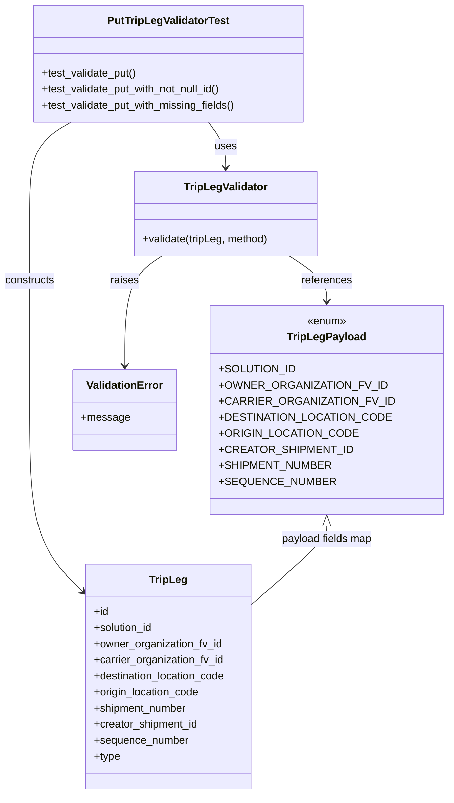
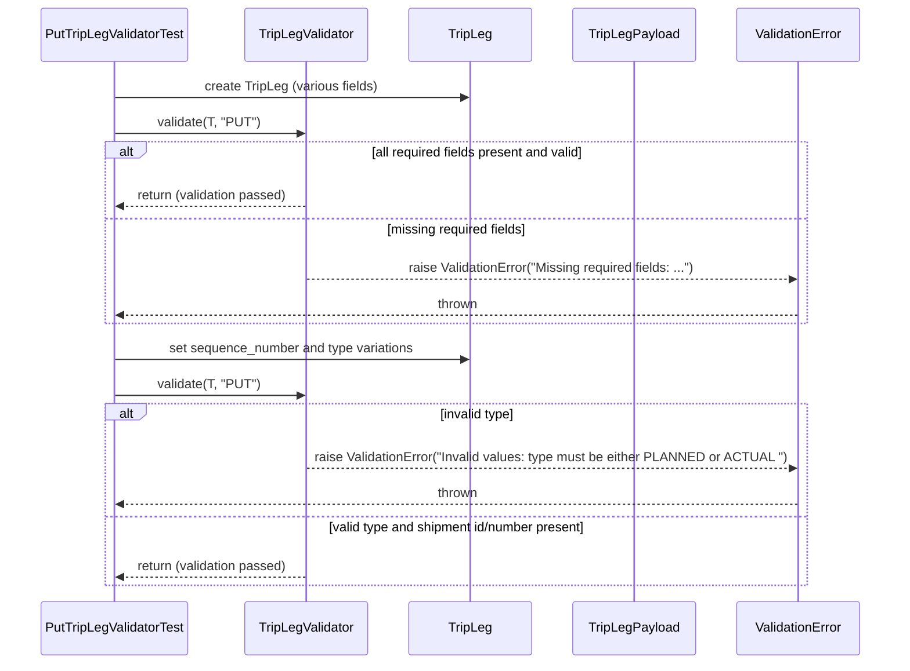

# Diagram: partview_core/partview_service/partview_service/tests/unit/core/validators/trip_leg/trip_leg_put_validator_test.py

> Auto-generated by Obscura crawlers

## Diagram 1

### SVG

<svg id="container" width="630.798828125" xmlns="http://www.w3.org/2000/svg" class="classDiagram" height="1186" viewBox="0 0 630.798828125 1186" role="graphics-document document" aria-roledescription="class"><g><defs><marker id="container_class-aggregationStart" class="marker aggregation class" refX="18" refY="7" markerWidth="190" markerHeight="240" orient="auto"><path d="M 18,7 L9,13 L1,7 L9,1 Z"></path></marker></defs><defs><marker id="container_class-aggregationEnd" class="marker aggregation class" refX="1" refY="7" markerWidth="20" markerHeight="28" orient="auto"><path d="M 18,7 L9,13 L1,7 L9,1 Z"></path></marker></defs><defs><marker id="container_class-extensionStart" class="marker extension class" refX="18" refY="7" markerWidth="190" markerHeight="240" orient="auto"><path d="M 1,7 L18,13 V 1 Z"></path></marker></defs><defs><marker id="container_class-extensionEnd" class="marker extension class" refX="1" refY="7" markerWidth="20" markerHeight="28" orient="auto"><path d="M 1,1 V 13 L18,7 Z"></path></marker></defs><defs><marker id="container_class-compositionStart" class="marker composition class" refX="18" refY="7" markerWidth="190" markerHeight="240" orient="auto"><path d="M 18,7 L9,13 L1,7 L9,1 Z"></path></marker></defs><defs><marker id="container_class-compositionEnd" class="marker composition class" refX="1" refY="7" markerWidth="20" markerHeight="28" orient="auto"><path d="M 18,7 L9,13 L1,7 L9,1 Z"></path></marker></defs><defs><marker id="container_class-dependencyStart" class="marker dependency class" refX="6" refY="7" markerWidth="190" markerHeight="240" orient="auto"><path d="M 5,7 L9,13 L1,7 L9,1 Z"></path></marker></defs><defs><marker id="container_class-dependencyEnd" class="marker dependency class" refX="13" refY="7" markerWidth="20" markerHeight="28" orient="auto"><path d="M 18,7 L9,13 L14,7 L9,1 Z"></path></marker></defs><defs><marker id="container_class-lollipopStart" class="marker lollipop class" refX="13" refY="7" markerWidth="190" markerHeight="240" orient="auto"><circle stroke="black" fill="transparent" cx="7" cy="7" r="6"></circle></marker></defs><defs><marker id="container_class-lollipopEnd" class="marker lollipop class" refX="1" refY="7" markerWidth="190" markerHeight="240" orient="auto"><circle stroke="black" fill="transparent" cx="7" cy="7" r="6"></circle></marker></defs><g class="root"><g class="clusters"></g><g class="edgePaths"><path d="M301.448,182L305.743,188.167C310.038,194.333,318.628,206.667,322.924,218C327.219,229.333,327.219,239.667,327.219,244.833L327.219,250" id="id_PutTripLegValidatorTest_TripLegValidator_1" class="edge-thickness-normal edge-pattern-solid relation" style=";;;" data-edge="true" data-et="edge" data-id="id_PutTripLegValidatorTest_TripLegValidator_1" data-points="W3sieCI6MzAxLjQ0Nzg5NTY2NTMyMjU2LCJ5IjoxODJ9LHsieCI6MzI3LjIxODc1LCJ5IjoyMTl9LHsieCI6MzI3LjIxODc1LCJ5IjoyNTZ9XQ==" marker-end="url(#container_class-dependencyEnd)"></path><path d="M415.494,382L424.134,388.167C432.775,394.333,450.057,406.667,458.697,418C467.338,429.333,467.338,439.667,467.338,444.833L467.338,450" id="id_TripLegValidator_TripLegPayload_2" class="edge-thickness-normal edge-pattern-solid relation" style=";;;" data-edge="true" data-et="edge" data-id="id_TripLegValidator_TripLegPayload_2" data-points="W3sieCI6NDE1LjQ5MzgwODU5Mzc1MDAzLCJ5IjozODJ9LHsieCI6NDY3LjMzNzg5MDYyNSwieSI6NDE5fSx7IngiOjQ2Ny4zMzc4OTA2MjUsInkiOjQ1Nn1d" marker-end="url(#container_class-dependencyEnd)"></path><path d="M238.944,382L230.303,388.167C221.662,394.333,204.381,406.667,195.74,434C187.1,461.333,187.1,503.667,187.1,524.833L187.1,546" id="id_TripLegValidator_ValidationError_3" class="edge-thickness-normal edge-pattern-solid relation" style=";;;" data-edge="true" data-et="edge" data-id="id_TripLegValidator_ValidationError_3" data-points="W3sieCI6MjM4Ljk0MzY5MTQwNjI1LCJ5IjozODJ9LHsieCI6MTg3LjA5OTYwOTM3NSwieSI6NDE5fSx7IngiOjE4Ny4wOTk2MDkzNzUsInkiOjU1Mn1d" marker-end="url(#container_class-dependencyEnd)"></path><path d="M104.032,182L94.334,188.167C84.636,194.333,65.24,206.667,55.542,229.5C45.844,252.333,45.844,285.667,45.844,319C45.844,352.333,45.844,385.667,45.844,434.5C45.844,483.333,45.844,547.667,45.844,612C45.844,676.333,45.844,740.667,56.617,784.159C67.391,827.651,88.938,850.303,99.712,861.629L110.486,872.954" id="id_PutTripLegValidatorTest_TripLeg_4" class="edge-thickness-normal edge-pattern-solid relation" style=";;;" data-edge="true" data-et="edge" data-id="id_PutTripLegValidatorTest_TripLeg_4" data-points="W3sieCI6MTA0LjAzMTU2NTAyMDE2MTI4LCJ5IjoxODJ9LHsieCI6NDUuODQzNzUsInkiOjIxOX0seyJ4Ijo0NS44NDM3NSwieSI6MzE5fSx7IngiOjQ1Ljg0Mzc1LCJ5Ijo0MTl9LHsieCI6NDUuODQzNzUsInkiOjYxMn0seyJ4Ijo0NS44NDM3NSwieSI6ODA1fSx7IngiOjExNC42MjEwOTM3NSwieSI6ODc3LjMwMTQ5MDMyNDkwNjh9XQ==" marker-end="url(#container_class-dependencyEnd)"></path><path d="M467.338,785.25L467.338,788.542C467.338,791.833,467.338,798.417,450.629,816.832C433.919,835.248,400.501,865.497,383.791,880.621L367.082,895.745" id="id_TripLegPayload_TripLeg_5" class="edge-thickness-normal edge-pattern-solid relation" style=";;;" data-edge="true" data-et="edge" data-id="id_TripLegPayload_TripLeg_5" data-points="W3sieCI6NDY3LjMzNzg5MDYyNSwieSI6NzY4fSx7IngiOjQ2Ny4zMzc4OTA2MjUsInkiOjgwNX0seyJ4IjozNjcuMDgyMDMxMjUsInkiOjg5NS43NDQ3NzYyNjA5ODQzfV0=" marker-start="url(#container_class-extensionStart)"></path></g><g class="edgeLabels"><g class="edgeLabel" transform="translate(327.21875, 219)"><g class="label" data-id="id_PutTripLegValidatorTest_TripLegValidator_1" transform="translate(-16.4921875, -12)"><foreignObject width="32.984375" height="24">

uses

</foreignObject></g></g><g class="edgeLabel" transform="translate(467.337890625, 419)"><g class="label" data-id="id_TripLegValidator_TripLegPayload_2" transform="translate(-37.828125, -12)"><foreignObject width="75.65625" height="24">

references

</foreignObject></g></g><g class="edgeLabel" transform="translate(187.099609375, 419)"><g class="label" data-id="id_TripLegValidator_ValidationError_3" transform="translate(-21.25, -12)"><foreignObject width="42.5" height="24">

raises

</foreignObject></g></g><g class="edgeLabel" transform="translate(45.84375, 419)"><g class="label" data-id="id_PutTripLegValidatorTest_TripLeg_4" transform="translate(-37.84375, -12)"><foreignObject width="75.6875" height="24">

constructs

</foreignObject></g></g><g class="edgeLabel" transform="translate(467.337890625, 805)"><g class="label" data-id="id_TripLegPayload_TripLeg_5" transform="translate(-68.859375, -12)"><foreignObject width="137.71875" height="24">

payload fields map

</foreignObject></g></g></g><g class="nodes"><g class="node default" id="classId-TripLeg-0" transform="translate(240.8515625, 1010)"><g class="basic label-container"><path d="M-126.23046875 -168 L126.23046875 -168 L126.23046875 168 L-126.23046875 168" stroke="none" stroke-width="0" fill="#ECECFF" style=""></path><path d="M-126.23046875 -168 C-61.30324065365606 -168, 3.623987442687877 -168, 126.23046875 -168 M-126.23046875 -168 C-32.48645078529334 -168, 61.257567179413314 -168, 126.23046875 -168 M126.23046875 -168 C126.23046875 -70.86248311346395, 126.23046875 26.275033773072096, 126.23046875 168 M126.23046875 -168 C126.23046875 -45.29272638254865, 126.23046875 77.4145472349027, 126.23046875 168 M126.23046875 168 C66.98163026931249 168, 7.732791788624979 168, -126.23046875 168 M126.23046875 168 C52.20616402235548 168, -21.81814070528904 168, -126.23046875 168 M-126.23046875 168 C-126.23046875 85.83417957535674, -126.23046875 3.668359150713485, -126.23046875 -168 M-126.23046875 168 C-126.23046875 67.69635606870602, -126.23046875 -32.60728786258795, -126.23046875 -168" stroke="#9370DB" stroke-width="1.3" fill="none" stroke-dasharray="0 0" style=""></path></g><g class="annotation-group text" transform="translate(0, -144)"></g><g class="label-group text" transform="translate(-27.0546875, -144)"><g class="label" style="font-weight: bolder" transform="translate(0,-12)"><foreignObject width="54.109375" height="24">

TripLeg

</foreignObject></g></g><g class="members-group text" transform="translate(-114.23046875, -96)"><g class="label" style="" transform="translate(0,-12)"><foreignObject width="22.078125" height="24">

+id

</foreignObject></g><g class="label" style="" transform="translate(0,12)"><foreignObject width="90.21875" height="24">

+solution_id

</foreignObject></g><g class="label" style="" transform="translate(0,36)"><foreignObject width="193.296875" height="24">

+owner_organization_fv_id

</foreignObject></g><g class="label" style="" transform="translate(0,60)"><foreignObject width="196.171875" height="24">

+carrier_organization_fv_id

</foreignObject></g><g class="label" style="" transform="translate(0,84)"><foreignObject width="201.40625" height="24">

+destination_location_code

</foreignObject></g><g class="label" style="" transform="translate(0,108)"><foreignObject width="160.5" height="24">

+origin_location_code

</foreignObject></g><g class="label" style="" transform="translate(0,132)"><foreignObject width="141.5625" height="24">

+shipment_number

</foreignObject></g><g class="label" style="" transform="translate(0,156)"><foreignObject width="157.546875" height="24">

+creator_shipment_id

</foreignObject></g><g class="label" style="" transform="translate(0,180)"><foreignObject width="142.015625" height="24">

+sequence_number

</foreignObject></g><g class="label" style="" transform="translate(0,204)"><foreignObject width="39.703125" height="24">

+type

</foreignObject></g></g><g class="methods-group text" transform="translate(-114.23046875, 168)"></g><g class="divider" style=""><path d="M-126.23046875 -120 C-39.51514074942925 -120, 47.2001872511415 -120, 126.23046875 -120 M-126.23046875 -120 C-51.139264207501824 -120, 23.95194033499635 -120, 126.23046875 -120" stroke="#9370DB" stroke-width="1.3" fill="none" stroke-dasharray="0 0" style=""></path></g><g class="divider" style=""><path d="M-126.23046875 144 C-34.95214708129295 144, 56.3261745874141 144, 126.23046875 144 M-126.23046875 144 C-34.70122819820263 144, 56.828012353594744 144, 126.23046875 144" stroke="#9370DB" stroke-width="1.3" fill="none" stroke-dasharray="0 0" style=""></path></g></g><g class="node default" id="classId-TripLegValidator-1" transform="translate(327.21875, 319)"><g class="basic label-container"><path d="M-137.734375 -63 L137.734375 -63 L137.734375 63 L-137.734375 63" stroke="none" stroke-width="0" fill="#ECECFF" style=""></path><path d="M-137.734375 -63 C-28.526546060214613 -63, 80.68128287957077 -63, 137.734375 -63 M-137.734375 -63 C-71.27057108147575 -63, -4.806767162951502 -63, 137.734375 -63 M137.734375 -63 C137.734375 -20.377410573729037, 137.734375 22.245178852541926, 137.734375 63 M137.734375 -63 C137.734375 -29.899001192707438, 137.734375 3.2019976145851246, 137.734375 63 M137.734375 63 C44.68994549745818 63, -48.354484005083634 63, -137.734375 63 M137.734375 63 C43.999300552223815 63, -49.73577389555237 63, -137.734375 63 M-137.734375 63 C-137.734375 32.93388688659616, -137.734375 2.867773773192326, -137.734375 -63 M-137.734375 63 C-137.734375 29.844308137439327, -137.734375 -3.3113837251213454, -137.734375 -63" stroke="#9370DB" stroke-width="1.3" fill="none" stroke-dasharray="0 0" style=""></path></g><g class="annotation-group text" transform="translate(0, -39)"></g><g class="label-group text" transform="translate(-60.234375, -39)"><g class="label" style="font-weight: bolder" transform="translate(0,-12)"><foreignObject width="120.46875" height="24">

TripLegValidator

</foreignObject></g></g><g class="members-group text" transform="translate(-125.734375, 9)"></g><g class="methods-group text" transform="translate(-125.734375, 39)"><g class="label" style="" transform="translate(0,-12)"><foreignObject width="191.234375" height="24">

+validate(tripLeg, method)

</foreignObject></g></g><g class="divider" style=""><path d="M-137.734375 -15 C-76.0987868006837 -15, -14.463198601367395 -15, 137.734375 -15 M-137.734375 -15 C-60.7790307257861 -15, 16.1763135484278 -15, 137.734375 -15" stroke="#9370DB" stroke-width="1.3" fill="none" stroke-dasharray="0 0" style=""></path></g><g class="divider" style=""><path d="M-137.734375 9 C-75.84482306528437 9, -13.955271130568761 9, 137.734375 9 M-137.734375 9 C-34.5565866896131 9, 68.6212016207738 9, 137.734375 9" stroke="#9370DB" stroke-width="1.3" fill="none" stroke-dasharray="0 0" style=""></path></g></g><g class="node default" id="classId-TripLegPayload-2" transform="translate(467.337890625, 612)"><g class="basic label-container"><path d="M-155.4609375 -156 L155.4609375 -156 L155.4609375 156 L-155.4609375 156" stroke="none" stroke-width="0" fill="#ECECFF" style=""></path><path d="M-155.4609375 -156 C-90.069899549918 -156, -24.67886159983601 -156, 155.4609375 -156 M-155.4609375 -156 C-46.09473929164528 -156, 63.271458916709435 -156, 155.4609375 -156 M155.4609375 -156 C155.4609375 -68.25684249821369, 155.4609375 19.486315003572628, 155.4609375 156 M155.4609375 -156 C155.4609375 -37.06295313157527, 155.4609375 81.87409373684946, 155.4609375 156 M155.4609375 156 C37.792399272120576 156, -79.87613895575885 156, -155.4609375 156 M155.4609375 156 C62.58207028695524 156, -30.296796926089513 156, -155.4609375 156 M-155.4609375 156 C-155.4609375 93.09105665014732, -155.4609375 30.18211330029463, -155.4609375 -156 M-155.4609375 156 C-155.4609375 83.53622545754862, -155.4609375 11.07245091509725, -155.4609375 -156" stroke="#9370DB" stroke-width="1.3" fill="none" stroke-dasharray="0 0" style=""></path></g><g class="annotation-group text" transform="translate(-29.53125, -132)"><g class="label" style="" transform="translate(0,-12)"><foreignObject width="59.0625" height="24">

«enum»

</foreignObject></g></g><g class="label-group text" transform="translate(-55.953125, -108)"><g class="label" style="font-weight: bolder" transform="translate(0,-12)"><foreignObject width="111.90625" height="24">

TripLegPayload

</foreignObject></g></g><g class="members-group text" transform="translate(-143.4609375, -60)"><g class="label" style="" transform="translate(0,-12)"><foreignObject width="103.640625" height="24">

+SOLUTION_ID

</foreignObject></g><g class="label" style="" transform="translate(0,12)"><foreignObject width="223.96875" height="24">

+OWNER_ORGANIZATION_FV_ID

</foreignObject></g><g class="label" style="" transform="translate(0,36)"><foreignObject width="230.96875" height="24">

+CARRIER_ORGANIZATION_FV_ID

</foreignObject></g><g class="label" style="" transform="translate(0,60)"><foreignObject width="227.5625" height="24">

+DESTINATION_LOCATION_CODE

</foreignObject></g><g class="label" style="" transform="translate(0,84)"><foreignObject width="184.421875" height="24">

+ORIGIN_LOCATION_CODE

</foreignObject></g><g class="label" style="" transform="translate(0,108)"><foreignObject width="175.90625" height="24">

+CREATOR_SHIPMENT_ID

</foreignObject></g><g class="label" style="" transform="translate(0,132)"><foreignObject width="150.15625" height="24">

+SHIPMENT_NUMBER

</foreignObject></g><g class="label" style="" transform="translate(0,156)"><foreignObject width="153.359375" height="24">

+SEQUENCE_NUMBER

</foreignObject></g></g><g class="methods-group text" transform="translate(-143.4609375, 156)"></g><g class="divider" style=""><path d="M-155.4609375 -84 C-76.61337378369217 -84, 2.2341899326156636 -84, 155.4609375 -84 M-155.4609375 -84 C-41.87765295228155 -84, 71.7056315954369 -84, 155.4609375 -84" stroke="#9370DB" stroke-width="1.3" fill="none" stroke-dasharray="0 0" style=""></path></g><g class="divider" style=""><path d="M-155.4609375 132 C-75.85493462520512 132, 3.751068249589764 132, 155.4609375 132 M-155.4609375 132 C-40.75823127385358 132, 73.94447495229284 132, 155.4609375 132" stroke="#9370DB" stroke-width="1.3" fill="none" stroke-dasharray="0 0" style=""></path></g></g><g class="node default" id="classId-ValidationError-3" transform="translate(187.099609375, 612)"><g class="basic label-container"><path d="M-74.77734375 -60 L74.77734375 -60 L74.77734375 60 L-74.77734375 60" stroke="none" stroke-width="0" fill="#ECECFF" style=""></path><path d="M-74.77734375 -60 C-15.603737864538125 -60, 43.56986802092375 -60, 74.77734375 -60 M-74.77734375 -60 C-20.167752605573803 -60, 34.441838538852394 -60, 74.77734375 -60 M74.77734375 -60 C74.77734375 -32.25407266963752, 74.77734375 -4.508145339275053, 74.77734375 60 M74.77734375 -60 C74.77734375 -33.98922731370864, 74.77734375 -7.978454627417271, 74.77734375 60 M74.77734375 60 C39.78651003521468 60, 4.795676320429365 60, -74.77734375 60 M74.77734375 60 C24.59095106168828 60, -25.59544162662344 60, -74.77734375 60 M-74.77734375 60 C-74.77734375 17.472536394775197, -74.77734375 -25.054927210449605, -74.77734375 -60 M-74.77734375 60 C-74.77734375 16.191701879084647, -74.77734375 -27.616596241830706, -74.77734375 -60" stroke="#9370DB" stroke-width="1.3" fill="none" stroke-dasharray="0 0" style=""></path></g><g class="annotation-group text" transform="translate(0, -36)"></g><g class="label-group text" transform="translate(-55.1796875, -36)"><g class="label" style="font-weight: bolder" transform="translate(0,-12)"><foreignObject width="110.359375" height="24">

ValidationError

</foreignObject></g></g><g class="members-group text" transform="translate(-62.77734375, 12)"><g class="label" style="" transform="translate(0,-12)"><foreignObject width="70.375" height="24">

+message

</foreignObject></g></g><g class="methods-group text" transform="translate(-62.77734375, 60)"></g><g class="divider" style=""><path d="M-74.77734375 -12 C-34.31772448562066 -12, 6.141894778758683 -12, 74.77734375 -12 M-74.77734375 -12 C-31.79493826233248 -12, 11.187467225335041 -12, 74.77734375 -12" stroke="#9370DB" stroke-width="1.3" fill="none" stroke-dasharray="0 0" style=""></path></g><g class="divider" style=""><path d="M-74.77734375 36 C-27.786190646511763 36, 19.204962456976475 36, 74.77734375 36 M-74.77734375 36 C-39.29551182730413 36, -3.8136799046082643 36, 74.77734375 36" stroke="#9370DB" stroke-width="1.3" fill="none" stroke-dasharray="0 0" style=""></path></g></g><g class="node default" id="classId-PutTripLegValidatorTest-4" transform="translate(240.8515625, 95)"><g class="basic label-container"><path d="M-203.07421875 -87 L203.07421875 -87 L203.07421875 87 L-203.07421875 87" stroke="none" stroke-width="0" fill="#ECECFF" style=""></path><path d="M-203.07421875 -87 C-60.44822244476697 -87, 82.17777386046606 -87, 203.07421875 -87 M-203.07421875 -87 C-76.86588432591995 -87, 49.3424500981601 -87, 203.07421875 -87 M203.07421875 -87 C203.07421875 -30.61799333963343, 203.07421875 25.76401332073314, 203.07421875 87 M203.07421875 -87 C203.07421875 -39.08946403305727, 203.07421875 8.821071933885463, 203.07421875 87 M203.07421875 87 C57.765480837508306 87, -87.54325707498339 87, -203.07421875 87 M203.07421875 87 C79.6059986565192 87, -43.86222143696159 87, -203.07421875 87 M-203.07421875 87 C-203.07421875 26.746820728971926, -203.07421875 -33.50635854205615, -203.07421875 -87 M-203.07421875 87 C-203.07421875 22.97982504327959, -203.07421875 -41.04034991344082, -203.07421875 -87" stroke="#9370DB" stroke-width="1.3" fill="none" stroke-dasharray="0 0" style=""></path></g><g class="annotation-group text" transform="translate(0, -63)"></g><g class="label-group text" transform="translate(-87.7421875, -63)"><g class="label" style="font-weight: bolder" transform="translate(0,-12)"><foreignObject width="175.484375" height="24">

PutTripLegValidatorTest

</foreignObject></g></g><g class="members-group text" transform="translate(-191.07421875, -15)"></g><g class="methods-group text" transform="translate(-191.07421875, 15)"><g class="label" style="" transform="translate(0,-12)"><foreignObject width="144.109375" height="24">

+test_validate_put()

</foreignObject></g><g class="label" style="" transform="translate(0,12)"><foreignObject width="274.84375" height="24">

+test_validate_put_with_not_null_id()

</foreignObject></g><g class="label" style="" transform="translate(0,36)"><foreignObject width="294.40625" height="24">

+test_validate_put_with_missing_fields()

</foreignObject></g></g><g class="divider" style=""><path d="M-203.07421875 -39 C-67.72805813164615 -39, 67.6181024867077 -39, 203.07421875 -39 M-203.07421875 -39 C-96.85457757775725 -39, 9.365063594485491 -39, 203.07421875 -39" stroke="#9370DB" stroke-width="1.3" fill="none" stroke-dasharray="0 0" style=""></path></g><g class="divider" style=""><path d="M-203.07421875 -15 C-85.81834783784798 -15, 31.43752307430404 -15, 203.07421875 -15 M-203.07421875 -15 C-111.4025271880091 -15, -19.730835626018205 -15, 203.07421875 -15" stroke="#9370DB" stroke-width="1.3" fill="none" stroke-dasharray="0 0" style=""></path></g></g></g></g></g></svg>

## Diagram 2

### SVG

<svg id="container" width="1128.5" xmlns="http://www.w3.org/2000/svg" height="851" viewBox="-50 -10 1128.5 851" role="graphics-document document" aria-roledescription="sequence"><g><rect x="878.5" y="765" fill="#eaeaea" stroke="#666" width="150" height="65" name="E" rx="3" ry="3" class="actor actor-bottom"></rect><text x="953.5" y="797.5" dominant-baseline="central" alignment-baseline="central" class="actor actor-box" style="text-anchor: middle; font-size: 16px; font-weight: 400;"><tspan x="953.5" dy="0">ValidationError</tspan></text></g><g><rect x="678.5" y="765" fill="#eaeaea" stroke="#666" width="150" height="65" name="P" rx="3" ry="3" class="actor actor-bottom"></rect><text x="753.5" y="797.5" dominant-baseline="central" alignment-baseline="central" class="actor actor-box" style="text-anchor: middle; font-size: 16px; font-weight: 400;"><tspan x="753.5" dy="0">TripLegPayload</tspan></text></g><g><rect x="478.5" y="765" fill="#eaeaea" stroke="#666" width="150" height="65" name="T" rx="3" ry="3" class="actor actor-bottom"></rect><text x="553.5" y="797.5" dominant-baseline="central" alignment-baseline="central" class="actor actor-box" style="text-anchor: middle; font-size: 16px; font-weight: 400;"><tspan x="553.5" dy="0">TripLeg</tspan></text></g><g><rect x="278.5" y="765" fill="#eaeaea" stroke="#666" width="150" height="65" name="V" rx="3" ry="3" class="actor actor-bottom"></rect><text x="353.5" y="797.5" dominant-baseline="central" alignment-baseline="central" class="actor actor-box" style="text-anchor: middle; font-size: 16px; font-weight: 400;"><tspan x="353.5" dy="0">TripLegValidator</tspan></text></g><g><rect x="0" y="765" fill="#eaeaea" stroke="#666" width="191" height="65" name="Test" rx="3" ry="3" class="actor actor-bottom"></rect><text x="95.5" y="797.5" dominant-baseline="central" alignment-baseline="central" class="actor actor-box" style="text-anchor: middle; font-size: 16px; font-weight: 400;"><tspan x="95.5" dy="0">PutTripLegValidatorTest</tspan></text></g><g><line id="actor4" x1="953.5" y1="65" x2="953.5" y2="765" class="actor-line 200" stroke-width="0.5px" stroke="#999" name="E"></line><g id="root-4"><rect x="878.5" y="0" fill="#eaeaea" stroke="#666" width="150" height="65" name="E" rx="3" ry="3" class="actor actor-top"></rect><text x="953.5" y="32.5" dominant-baseline="central" alignment-baseline="central" class="actor actor-box" style="text-anchor: middle; font-size: 16px; font-weight: 400;"><tspan x="953.5" dy="0">ValidationError</tspan></text></g></g><g><line id="actor3" x1="753.5" y1="65" x2="753.5" y2="765" class="actor-line 200" stroke-width="0.5px" stroke="#999" name="P"></line><g id="root-3"><rect x="678.5" y="0" fill="#eaeaea" stroke="#666" width="150" height="65" name="P" rx="3" ry="3" class="actor actor-top"></rect><text x="753.5" y="32.5" dominant-baseline="central" alignment-baseline="central" class="actor actor-box" style="text-anchor: middle; font-size: 16px; font-weight: 400;"><tspan x="753.5" dy="0">TripLegPayload</tspan></text></g></g><g><line id="actor2" x1="553.5" y1="65" x2="553.5" y2="765" class="actor-line 200" stroke-width="0.5px" stroke="#999" name="T"></line><g id="root-2"><rect x="478.5" y="0" fill="#eaeaea" stroke="#666" width="150" height="65" name="T" rx="3" ry="3" class="actor actor-top"></rect><text x="553.5" y="32.5" dominant-baseline="central" alignment-baseline="central" class="actor actor-box" style="text-anchor: middle; font-size: 16px; font-weight: 400;"><tspan x="553.5" dy="0">TripLeg</tspan></text></g></g><g><line id="actor1" x1="353.5" y1="65" x2="353.5" y2="765" class="actor-line 200" stroke-width="0.5px" stroke="#999" name="V"></line><g id="root-1"><rect x="278.5" y="0" fill="#eaeaea" stroke="#666" width="150" height="65" name="V" rx="3" ry="3" class="actor actor-top"></rect><text x="353.5" y="32.5" dominant-baseline="central" alignment-baseline="central" class="actor actor-box" style="text-anchor: middle; font-size: 16px; font-weight: 400;"><tspan x="353.5" dy="0">TripLegValidator</tspan></text></g></g><g><line id="actor0" x1="95.5" y1="65" x2="95.5" y2="765" class="actor-line 200" stroke-width="0.5px" stroke="#999" name="Test"></line><g id="root-0"><rect x="0" y="0" fill="#eaeaea" stroke="#666" width="191" height="65" name="Test" rx="3" ry="3" class="actor actor-top"></rect><text x="95.5" y="32.5" dominant-baseline="central" alignment-baseline="central" class="actor actor-box" style="text-anchor: middle; font-size: 16px; font-weight: 400;"><tspan x="95.5" dy="0">PutTripLegValidatorTest</tspan></text></g></g><g></g><defs><symbol id="computer" width="24" height="24"><path transform="scale(.5)" d="M2 2v13h20v-13h-20zm18 11h-16v-9h16v9zm-10.228 6l.466-1h3.524l.467 1h-4.457zm14.228 3h-24l2-6h2.104l-1.33 4h18.45l-1.297-4h2.073l2 6zm-5-10h-14v-7h14v7z"></path></symbol></defs><defs><symbol id="database" fill-rule="evenodd" clip-rule="evenodd"><path transform="scale(.5)" d="M12.258.001l.256.004.255.005.253.008.251.01.249.012.247.015.246.016.242.019.241.02.239.023.236.024.233.027.231.028.229.031.225.032.223.034.22.036.217.038.214.04.211.041.208.043.205.045.201.046.198.048.194.05.191.051.187.053.183.054.18.056.175.057.172.059.168.06.163.061.16.063.155.064.15.066.074.033.073.033.071.034.07.034.069.035.068.035.067.035.066.035.064.036.064.036.062.036.06.036.06.037.058.037.058.037.055.038.055.038.053.038.052.038.051.039.05.039.048.039.047.039.045.04.044.04.043.04.041.04.04.041.039.041.037.041.036.041.034.041.033.042.032.042.03.042.029.042.027.042.026.043.024.043.023.043.021.043.02.043.018.044.017.043.015.044.013.044.012.044.011.045.009.044.007.045.006.045.004.045.002.045.001.045v17l-.001.045-.002.045-.004.045-.006.045-.007.045-.009.044-.011.045-.012.044-.013.044-.015.044-.017.043-.018.044-.02.043-.021.043-.023.043-.024.043-.026.043-.027.042-.029.042-.03.042-.032.042-.033.042-.034.041-.036.041-.037.041-.039.041-.04.041-.041.04-.043.04-.044.04-.045.04-.047.039-.048.039-.05.039-.051.039-.052.038-.053.038-.055.038-.055.038-.058.037-.058.037-.06.037-.06.036-.062.036-.064.036-.064.036-.066.035-.067.035-.068.035-.069.035-.07.034-.071.034-.073.033-.074.033-.15.066-.155.064-.16.063-.163.061-.168.06-.172.059-.175.057-.18.056-.183.054-.187.053-.191.051-.194.05-.198.048-.201.046-.205.045-.208.043-.211.041-.214.04-.217.038-.22.036-.223.034-.225.032-.229.031-.231.028-.233.027-.236.024-.239.023-.241.02-.242.019-.246.016-.247.015-.249.012-.251.01-.253.008-.255.005-.256.004-.258.001-.258-.001-.256-.004-.255-.005-.253-.008-.251-.01-.249-.012-.247-.015-.245-.016-.243-.019-.241-.02-.238-.023-.236-.024-.234-.027-.231-.028-.228-.031-.226-.032-.223-.034-.22-.036-.217-.038-.214-.04-.211-.041-.208-.043-.204-.045-.201-.046-.198-.048-.195-.05-.19-.051-.187-.053-.184-.054-.179-.056-.176-.057-.172-.059-.167-.06-.164-.061-.159-.063-.155-.064-.151-.066-.074-.033-.072-.033-.072-.034-.07-.034-.069-.035-.068-.035-.067-.035-.066-.035-.064-.036-.063-.036-.062-.036-.061-.036-.06-.037-.058-.037-.057-.037-.056-.038-.055-.038-.053-.038-.052-.038-.051-.039-.049-.039-.049-.039-.046-.039-.046-.04-.044-.04-.043-.04-.041-.04-.04-.041-.039-.041-.037-.041-.036-.041-.034-.041-.033-.042-.032-.042-.03-.042-.029-.042-.027-.042-.026-.043-.024-.043-.023-.043-.021-.043-.02-.043-.018-.044-.017-.043-.015-.044-.013-.044-.012-.044-.011-.045-.009-.044-.007-.045-.006-.045-.004-.045-.002-.045-.001-.045v-17l.001-.045.002-.045.004-.045.006-.045.007-.045.009-.044.011-.045.012-.044.013-.044.015-.044.017-.043.018-.044.02-.043.021-.043.023-.043.024-.043.026-.043.027-.042.029-.042.03-.042.032-.042.033-.042.034-.041.036-.041.037-.041.039-.041.04-.041.041-.04.043-.04.044-.04.046-.04.046-.039.049-.039.049-.039.051-.039.052-.038.053-.038.055-.038.056-.038.057-.037.058-.037.06-.037.061-.036.062-.036.063-.036.064-.036.066-.035.067-.035.068-.035.069-.035.07-.034.072-.034.072-.033.074-.033.151-.066.155-.064.159-.063.164-.061.167-.06.172-.059.176-.057.179-.056.184-.054.187-.053.19-.051.195-.05.198-.048.201-.046.204-.045.208-.043.211-.041.214-.04.217-.038.22-.036.223-.034.226-.032.228-.031.231-.028.234-.027.236-.024.238-.023.241-.02.243-.019.245-.016.247-.015.249-.012.251-.01.253-.008.255-.005.256-.004.258-.001.258.001zm-9.258 20.499v.01l.001.021.003.021.004.022.005.021.006.022.007.022.009.023.01.022.011.023.012.023.013.023.015.023.016.024.017.023.018.024.019.024.021.024.022.025.023.024.024.025.052.049.056.05.061.051.066.051.07.051.075.051.079.052.084.052.088.052.092.052.097.052.102.051.105.052.11.052.114.051.119.051.123.051.127.05.131.05.135.05.139.048.144.049.147.047.152.047.155.047.16.045.163.045.167.043.171.043.176.041.178.041.183.039.187.039.19.037.194.035.197.035.202.033.204.031.209.03.212.029.216.027.219.025.222.024.226.021.23.02.233.018.236.016.24.015.243.012.246.01.249.008.253.005.256.004.259.001.26-.001.257-.004.254-.005.25-.008.247-.011.244-.012.241-.014.237-.016.233-.018.231-.021.226-.021.224-.024.22-.026.216-.027.212-.028.21-.031.205-.031.202-.034.198-.034.194-.036.191-.037.187-.039.183-.04.179-.04.175-.042.172-.043.168-.044.163-.045.16-.046.155-.046.152-.047.148-.048.143-.049.139-.049.136-.05.131-.05.126-.05.123-.051.118-.052.114-.051.11-.052.106-.052.101-.052.096-.052.092-.052.088-.053.083-.051.079-.052.074-.052.07-.051.065-.051.06-.051.056-.05.051-.05.023-.024.023-.025.021-.024.02-.024.019-.024.018-.024.017-.024.015-.023.014-.024.013-.023.012-.023.01-.023.01-.022.008-.022.006-.022.006-.022.004-.022.004-.021.001-.021.001-.021v-4.127l-.077.055-.08.053-.083.054-.085.053-.087.052-.09.052-.093.051-.095.05-.097.05-.1.049-.102.049-.105.048-.106.047-.109.047-.111.046-.114.045-.115.045-.118.044-.12.043-.122.042-.124.042-.126.041-.128.04-.13.04-.132.038-.134.038-.135.037-.138.037-.139.035-.142.035-.143.034-.144.033-.147.032-.148.031-.15.03-.151.03-.153.029-.154.027-.156.027-.158.026-.159.025-.161.024-.162.023-.163.022-.165.021-.166.02-.167.019-.169.018-.169.017-.171.016-.173.015-.173.014-.175.013-.175.012-.177.011-.178.01-.179.008-.179.008-.181.006-.182.005-.182.004-.184.003-.184.002h-.37l-.184-.002-.184-.003-.182-.004-.182-.005-.181-.006-.179-.008-.179-.008-.178-.01-.176-.011-.176-.012-.175-.013-.173-.014-.172-.015-.171-.016-.17-.017-.169-.018-.167-.019-.166-.02-.165-.021-.163-.022-.162-.023-.161-.024-.159-.025-.157-.026-.156-.027-.155-.027-.153-.029-.151-.03-.15-.03-.148-.031-.146-.032-.145-.033-.143-.034-.141-.035-.14-.035-.137-.037-.136-.037-.134-.038-.132-.038-.13-.04-.128-.04-.126-.041-.124-.042-.122-.042-.12-.044-.117-.043-.116-.045-.113-.045-.112-.046-.109-.047-.106-.047-.105-.048-.102-.049-.1-.049-.097-.05-.095-.05-.093-.052-.09-.051-.087-.052-.085-.053-.083-.054-.08-.054-.077-.054v4.127zm0-5.654v.011l.001.021.003.021.004.021.005.022.006.022.007.022.009.022.01.022.011.023.012.023.013.023.015.024.016.023.017.024.018.024.019.024.021.024.022.024.023.025.024.024.052.05.056.05.061.05.066.051.07.051.075.052.079.051.084.052.088.052.092.052.097.052.102.052.105.052.11.051.114.051.119.052.123.05.127.051.131.05.135.049.139.049.144.048.147.048.152.047.155.046.16.045.163.045.167.044.171.042.176.042.178.04.183.04.187.038.19.037.194.036.197.034.202.033.204.032.209.03.212.028.216.027.219.025.222.024.226.022.23.02.233.018.236.016.24.014.243.012.246.01.249.008.253.006.256.003.259.001.26-.001.257-.003.254-.006.25-.008.247-.01.244-.012.241-.015.237-.016.233-.018.231-.02.226-.022.224-.024.22-.025.216-.027.212-.029.21-.03.205-.032.202-.033.198-.035.194-.036.191-.037.187-.039.183-.039.179-.041.175-.042.172-.043.168-.044.163-.045.16-.045.155-.047.152-.047.148-.048.143-.048.139-.05.136-.049.131-.05.126-.051.123-.051.118-.051.114-.052.11-.052.106-.052.101-.052.096-.052.092-.052.088-.052.083-.052.079-.052.074-.051.07-.052.065-.051.06-.05.056-.051.051-.049.023-.025.023-.024.021-.025.02-.024.019-.024.018-.024.017-.024.015-.023.014-.023.013-.024.012-.022.01-.023.01-.023.008-.022.006-.022.006-.022.004-.021.004-.022.001-.021.001-.021v-4.139l-.077.054-.08.054-.083.054-.085.052-.087.053-.09.051-.093.051-.095.051-.097.05-.1.049-.102.049-.105.048-.106.047-.109.047-.111.046-.114.045-.115.044-.118.044-.12.044-.122.042-.124.042-.126.041-.128.04-.13.039-.132.039-.134.038-.135.037-.138.036-.139.036-.142.035-.143.033-.144.033-.147.033-.148.031-.15.03-.151.03-.153.028-.154.028-.156.027-.158.026-.159.025-.161.024-.162.023-.163.022-.165.021-.166.02-.167.019-.169.018-.169.017-.171.016-.173.015-.173.014-.175.013-.175.012-.177.011-.178.009-.179.009-.179.007-.181.007-.182.005-.182.004-.184.003-.184.002h-.37l-.184-.002-.184-.003-.182-.004-.182-.005-.181-.007-.179-.007-.179-.009-.178-.009-.176-.011-.176-.012-.175-.013-.173-.014-.172-.015-.171-.016-.17-.017-.169-.018-.167-.019-.166-.02-.165-.021-.163-.022-.162-.023-.161-.024-.159-.025-.157-.026-.156-.027-.155-.028-.153-.028-.151-.03-.15-.03-.148-.031-.146-.033-.145-.033-.143-.033-.141-.035-.14-.036-.137-.036-.136-.037-.134-.038-.132-.039-.13-.039-.128-.04-.126-.041-.124-.042-.122-.043-.12-.043-.117-.044-.116-.044-.113-.046-.112-.046-.109-.046-.106-.047-.105-.048-.102-.049-.1-.049-.097-.05-.095-.051-.093-.051-.09-.051-.087-.053-.085-.052-.083-.054-.08-.054-.077-.054v4.139zm0-5.666v.011l.001.02.003.022.004.021.005.022.006.021.007.022.009.023.01.022.011.023.012.023.013.023.015.023.016.024.017.024.018.023.019.024.021.025.022.024.023.024.024.025.052.05.056.05.061.05.066.051.07.051.075.052.079.051.084.052.088.052.092.052.097.052.102.052.105.051.11.052.114.051.119.051.123.051.127.05.131.05.135.05.139.049.144.048.147.048.152.047.155.046.16.045.163.045.167.043.171.043.176.042.178.04.183.04.187.038.19.037.194.036.197.034.202.033.204.032.209.03.212.028.216.027.219.025.222.024.226.021.23.02.233.018.236.017.24.014.243.012.246.01.249.008.253.006.256.003.259.001.26-.001.257-.003.254-.006.25-.008.247-.01.244-.013.241-.014.237-.016.233-.018.231-.02.226-.022.224-.024.22-.025.216-.027.212-.029.21-.03.205-.032.202-.033.198-.035.194-.036.191-.037.187-.039.183-.039.179-.041.175-.042.172-.043.168-.044.163-.045.16-.045.155-.047.152-.047.148-.048.143-.049.139-.049.136-.049.131-.051.126-.05.123-.051.118-.052.114-.051.11-.052.106-.052.101-.052.096-.052.092-.052.088-.052.083-.052.079-.052.074-.052.07-.051.065-.051.06-.051.056-.05.051-.049.023-.025.023-.025.021-.024.02-.024.019-.024.018-.024.017-.024.015-.023.014-.024.013-.023.012-.023.01-.022.01-.023.008-.022.006-.022.006-.022.004-.022.004-.021.001-.021.001-.021v-4.153l-.077.054-.08.054-.083.053-.085.053-.087.053-.09.051-.093.051-.095.051-.097.05-.1.049-.102.048-.105.048-.106.048-.109.046-.111.046-.114.046-.115.044-.118.044-.12.043-.122.043-.124.042-.126.041-.128.04-.13.039-.132.039-.134.038-.135.037-.138.036-.139.036-.142.034-.143.034-.144.033-.147.032-.148.032-.15.03-.151.03-.153.028-.154.028-.156.027-.158.026-.159.024-.161.024-.162.023-.163.023-.165.021-.166.02-.167.019-.169.018-.169.017-.171.016-.173.015-.173.014-.175.013-.175.012-.177.01-.178.01-.179.009-.179.007-.181.006-.182.006-.182.004-.184.003-.184.001-.185.001-.185-.001-.184-.001-.184-.003-.182-.004-.182-.006-.181-.006-.179-.007-.179-.009-.178-.01-.176-.01-.176-.012-.175-.013-.173-.014-.172-.015-.171-.016-.17-.017-.169-.018-.167-.019-.166-.02-.165-.021-.163-.023-.162-.023-.161-.024-.159-.024-.157-.026-.156-.027-.155-.028-.153-.028-.151-.03-.15-.03-.148-.032-.146-.032-.145-.033-.143-.034-.141-.034-.14-.036-.137-.036-.136-.037-.134-.038-.132-.039-.13-.039-.128-.041-.126-.041-.124-.041-.122-.043-.12-.043-.117-.044-.116-.044-.113-.046-.112-.046-.109-.046-.106-.048-.105-.048-.102-.048-.1-.05-.097-.049-.095-.051-.093-.051-.09-.052-.087-.052-.085-.053-.083-.053-.08-.054-.077-.054v4.153zm8.74-8.179l-.257.004-.254.005-.25.008-.247.011-.244.012-.241.014-.237.016-.233.018-.231.021-.226.022-.224.023-.22.026-.216.027-.212.028-.21.031-.205.032-.202.033-.198.034-.194.036-.191.038-.187.038-.183.04-.179.041-.175.042-.172.043-.168.043-.163.045-.16.046-.155.046-.152.048-.148.048-.143.048-.139.049-.136.05-.131.05-.126.051-.123.051-.118.051-.114.052-.11.052-.106.052-.101.052-.096.052-.092.052-.088.052-.083.052-.079.052-.074.051-.07.052-.065.051-.06.05-.056.05-.051.05-.023.025-.023.024-.021.024-.02.025-.019.024-.018.024-.017.023-.015.024-.014.023-.013.023-.012.023-.01.023-.01.022-.008.022-.006.023-.006.021-.004.022-.004.021-.001.021-.001.021.001.021.001.021.004.021.004.022.006.021.006.023.008.022.01.022.01.023.012.023.013.023.014.023.015.024.017.023.018.024.019.024.02.025.021.024.023.024.023.025.051.05.056.05.06.05.065.051.07.052.074.051.079.052.083.052.088.052.092.052.096.052.101.052.106.052.11.052.114.052.118.051.123.051.126.051.131.05.136.05.139.049.143.048.148.048.152.048.155.046.16.046.163.045.168.043.172.043.175.042.179.041.183.04.187.038.191.038.194.036.198.034.202.033.205.032.21.031.212.028.216.027.22.026.224.023.226.022.231.021.233.018.237.016.241.014.244.012.247.011.25.008.254.005.257.004.26.001.26-.001.257-.004.254-.005.25-.008.247-.011.244-.012.241-.014.237-.016.233-.018.231-.021.226-.022.224-.023.22-.026.216-.027.212-.028.21-.031.205-.032.202-.033.198-.034.194-.036.191-.038.187-.038.183-.04.179-.041.175-.042.172-.043.168-.043.163-.045.16-.046.155-.046.152-.048.148-.048.143-.048.139-.049.136-.05.131-.05.126-.051.123-.051.118-.051.114-.052.11-.052.106-.052.101-.052.096-.052.092-.052.088-.052.083-.052.079-.052.074-.051.07-.052.065-.051.06-.05.056-.05.051-.05.023-.025.023-.024.021-.024.02-.025.019-.024.018-.024.017-.023.015-.024.014-.023.013-.023.012-.023.01-.023.01-.022.008-.022.006-.023.006-.021.004-.022.004-.021.001-.021.001-.021-.001-.021-.001-.021-.004-.021-.004-.022-.006-.021-.006-.023-.008-.022-.01-.022-.01-.023-.012-.023-.013-.023-.014-.023-.015-.024-.017-.023-.018-.024-.019-.024-.02-.025-.021-.024-.023-.024-.023-.025-.051-.05-.056-.05-.06-.05-.065-.051-.07-.052-.074-.051-.079-.052-.083-.052-.088-.052-.092-.052-.096-.052-.101-.052-.106-.052-.11-.052-.114-.052-.118-.051-.123-.051-.126-.051-.131-.05-.136-.05-.139-.049-.143-.048-.148-.048-.152-.048-.155-.046-.16-.046-.163-.045-.168-.043-.172-.043-.175-.042-.179-.041-.183-.04-.187-.038-.191-.038-.194-.036-.198-.034-.202-.033-.205-.032-.21-.031-.212-.028-.216-.027-.22-.026-.224-.023-.226-.022-.231-.021-.233-.018-.237-.016-.241-.014-.244-.012-.247-.011-.25-.008-.254-.005-.257-.004-.26-.001-.26.001z"></path></symbol></defs><defs><symbol id="clock" width="24" height="24"><path transform="scale(.5)" d="M12 2c5.514 0 10 4.486 10 10s-4.486 10-10 10-10-4.486-10-10 4.486-10 10-10zm0-2c-6.627 0-12 5.373-12 12s5.373 12 12 12 12-5.373 12-12-5.373-12-12-12zm5.848 12.459c.202.038.202.333.001.372-1.907.361-6.045 1.111-6.547 1.111-.719 0-1.301-.582-1.301-1.301 0-.512.77-5.447 1.125-7.445.034-.192.312-.181.343.014l.985 6.238 5.394 1.011z"></path></symbol></defs><defs><marker id="arrowhead" refX="7.9" refY="5" markerUnits="userSpaceOnUse" markerWidth="12" markerHeight="12" orient="auto-start-reverse"><path d="M -1 0 L 10 5 L 0 10 z"></path></marker></defs><defs><marker id="crosshead" markerWidth="15" markerHeight="8" orient="auto" refX="4" refY="4.5"><path fill="none" stroke="#000000" stroke-width="1pt" d="M 1,2 L 6,7 M 6,2 L 1,7" style="stroke-dasharray: 0, 0;"></path></marker></defs><defs><marker id="filled-head" refX="15.5" refY="7" markerWidth="20" markerHeight="28" orient="auto"><path d="M 18,7 L9,13 L14,7 L9,1 Z"></path></marker></defs><defs><marker id="sequencenumber" refX="15" refY="15" markerWidth="60" markerHeight="40" orient="auto"><circle cx="15" cy="15" r="6"></circle></marker></defs><g><line x1="84.5" y1="171" x2="964.5" y2="171" class="loopLine"></line><line x1="964.5" y1="171" x2="964.5" y2="405" class="loopLine"></line><line x1="84.5" y1="405" x2="964.5" y2="405" class="loopLine"></line><line x1="84.5" y1="171" x2="84.5" y2="405" class="loopLine"></line><line x1="84.5" y1="269" x2="964.5" y2="269" class="loopLine" style="stroke-dasharray: 3, 3;"></line><polygon points="84.5,171 134.5,171 134.5,184 126.1,191 84.5,191" class="labelBox"></polygon><text x="110" y="184" text-anchor="middle" dominant-baseline="middle" alignment-baseline="middle" class="labelText" style="font-size: 16px; font-weight: 400;">alt</text><text x="549.5" y="189" text-anchor="middle" class="loopText" style="font-size: 16px; font-weight: 400;"><tspan x="549.5">[all required fields present and valid]</tspan></text><text x="524.5" y="287" text-anchor="middle" class="loopText" style="font-size: 16px; font-weight: 400;">[missing required fields]</text></g><g><line x1="84.5" y1="511" x2="964.5" y2="511" class="loopLine"></line><line x1="964.5" y1="511" x2="964.5" y2="745" class="loopLine"></line><line x1="84.5" y1="745" x2="964.5" y2="745" class="loopLine"></line><line x1="84.5" y1="511" x2="84.5" y2="745" class="loopLine"></line><line x1="84.5" y1="657" x2="964.5" y2="657" class="loopLine" style="stroke-dasharray: 3, 3;"></line><polygon points="84.5,511 134.5,511 134.5,524 126.1,531 84.5,531" class="labelBox"></polygon><text x="110" y="524" text-anchor="middle" dominant-baseline="middle" alignment-baseline="middle" class="labelText" style="font-size: 16px; font-weight: 400;">alt</text><text x="549.5" y="529" text-anchor="middle" class="loopText" style="font-size: 16px; font-weight: 400;"><tspan x="549.5">[invalid type]</tspan></text><text x="524.5" y="675" text-anchor="middle" class="loopText" style="font-size: 16px; font-weight: 400;">[valid type and shipment id/number present]</text></g><text x="323" y="80" text-anchor="middle" dominant-baseline="middle" alignment-baseline="middle" class="messageText" dy="1em" style="font-size: 16px; font-weight: 400;">create TripLeg (various fields)</text><line x1="96.5" y1="113" x2="549.5" y2="113" class="messageLine0" stroke-width="2" stroke="none" marker-end="url(#arrowhead)" style="fill: none;"></line><text x="223" y="128" text-anchor="middle" dominant-baseline="middle" alignment-baseline="middle" class="messageText" dy="1em" style="font-size: 16px; font-weight: 400;">validate(T, "PUT")</text><line x1="96.5" y1="161" x2="349.5" y2="161" class="messageLine0" stroke-width="2" stroke="none" marker-end="url(#arrowhead)" style="fill: none;"></line><text x="226" y="221" text-anchor="middle" dominant-baseline="middle" alignment-baseline="middle" class="messageText" dy="1em" style="font-size: 16px; font-weight: 400;">return (validation passed)</text><line x1="352.5" y1="254" x2="99.5" y2="254" class="messageLine1" stroke-width="2" stroke="none" marker-end="url(#arrowhead)" style="stroke-dasharray: 3, 3; fill: none;"></line><text x="652" y="314" text-anchor="middle" dominant-baseline="middle" alignment-baseline="middle" class="messageText" dy="1em" style="font-size: 16px; font-weight: 400;">raise ValidationError("Missing required fields: ...")</text><line x1="354.5" y1="347" x2="949.5" y2="347" class="messageLine1" stroke-width="2" stroke="none" marker-end="url(#arrowhead)" style="stroke-dasharray: 3, 3; fill: none;"></line><text x="526" y="362" text-anchor="middle" dominant-baseline="middle" alignment-baseline="middle" class="messageText" dy="1em" style="font-size: 16px; font-weight: 400;">thrown</text><line x1="952.5" y1="395" x2="99.5" y2="395" class="messageLine1" stroke-width="2" stroke="none" marker-end="url(#arrowhead)" style="stroke-dasharray: 3, 3; fill: none;"></line><text x="323" y="420" text-anchor="middle" dominant-baseline="middle" alignment-baseline="middle" class="messageText" dy="1em" style="font-size: 16px; font-weight: 400;">set sequence_number and type variations</text><line x1="96.5" y1="453" x2="549.5" y2="453" class="messageLine0" stroke-width="2" stroke="none" marker-end="url(#arrowhead)" style="fill: none;"></line><text x="223" y="468" text-anchor="middle" dominant-baseline="middle" alignment-baseline="middle" class="messageText" dy="1em" style="font-size: 16px; font-weight: 400;">validate(T, "PUT")</text><line x1="96.5" y1="501" x2="349.5" y2="501" class="messageLine0" stroke-width="2" stroke="none" marker-end="url(#arrowhead)" style="fill: none;"></line><text x="652" y="561" text-anchor="middle" dominant-baseline="middle" alignment-baseline="middle" class="messageText" dy="1em" style="font-size: 16px; font-weight: 400;">raise ValidationError("Invalid values: type must be either PLANNED or ACTUAL ")</text><line x1="354.5" y1="594" x2="949.5" y2="594" class="messageLine1" stroke-width="2" stroke="none" marker-end="url(#arrowhead)" style="stroke-dasharray: 3, 3; fill: none;"></line><text x="526" y="609" text-anchor="middle" dominant-baseline="middle" alignment-baseline="middle" class="messageText" dy="1em" style="font-size: 16px; font-weight: 400;">thrown</text><line x1="952.5" y1="642" x2="99.5" y2="642" class="messageLine1" stroke-width="2" stroke="none" marker-end="url(#arrowhead)" style="stroke-dasharray: 3, 3; fill: none;"></line><text x="226" y="702" text-anchor="middle" dominant-baseline="middle" alignment-baseline="middle" class="messageText" dy="1em" style="font-size: 16px; font-weight: 400;">return (validation passed)</text><line x1="352.5" y1="735" x2="99.5" y2="735" class="messageLine1" stroke-width="2" stroke="none" marker-end="url(#arrowhead)" style="stroke-dasharray: 3, 3; fill: none;"></line></svg>
