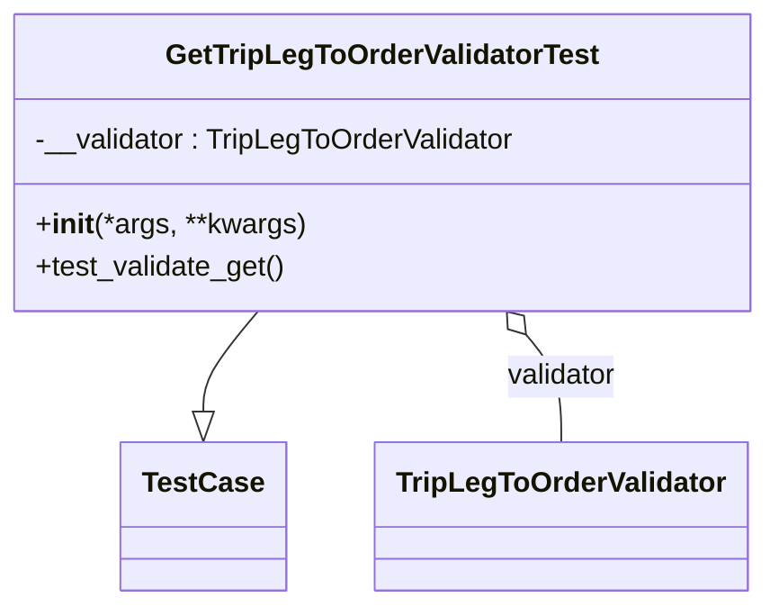

# Diagram: partview_core/partview_service/partview_service/tests/unit/core/validators/trip_leg_to_order/trip_leg_to_order_get_validator_test.py

> Auto-generated by Obscura crawlers

## Mermaid

### SVG

<svg id="container" width="431.6953125" xmlns="http://www.w3.org/2000/svg" class="classDiagram" height="342" viewBox="0 0 431.6953125 342" role="graphics-document document" aria-roledescription="class"><g><defs><marker id="container_class-aggregationStart" class="marker aggregation class" refX="18" refY="7" markerWidth="190" markerHeight="240" orient="auto"><path d="M 18,7 L9,13 L1,7 L9,1 Z"></path></marker></defs><defs><marker id="container_class-aggregationEnd" class="marker aggregation class" refX="1" refY="7" markerWidth="20" markerHeight="28" orient="auto"><path d="M 18,7 L9,13 L1,7 L9,1 Z"></path></marker></defs><defs><marker id="container_class-extensionStart" class="marker extension class" refX="18" refY="7" markerWidth="190" markerHeight="240" orient="auto"><path d="M 1,7 L18,13 V 1 Z"></path></marker></defs><defs><marker id="container_class-extensionEnd" class="marker extension class" refX="1" refY="7" markerWidth="20" markerHeight="28" orient="auto"><path d="M 1,1 V 13 L18,7 Z"></path></marker></defs><defs><marker id="container_class-compositionStart" class="marker composition class" refX="18" refY="7" markerWidth="190" markerHeight="240" orient="auto"><path d="M 18,7 L9,13 L1,7 L9,1 Z"></path></marker></defs><defs><marker id="container_class-compositionEnd" class="marker composition class" refX="1" refY="7" markerWidth="20" markerHeight="28" orient="auto"><path d="M 18,7 L9,13 L1,7 L9,1 Z"></path></marker></defs><defs><marker id="container_class-dependencyStart" class="marker dependency class" refX="6" refY="7" markerWidth="190" markerHeight="240" orient="auto"><path d="M 5,7 L9,13 L1,7 L9,1 Z"></path></marker></defs><defs><marker id="container_class-dependencyEnd" class="marker dependency class" refX="13" refY="7" markerWidth="20" markerHeight="28" orient="auto"><path d="M 18,7 L9,13 L14,7 L9,1 Z"></path></marker></defs><defs><marker id="container_class-lollipopStart" class="marker lollipop class" refX="13" refY="7" markerWidth="190" markerHeight="240" orient="auto"><circle stroke="black" fill="transparent" cx="7" cy="7" r="6"></circle></marker></defs><defs><marker id="container_class-lollipopEnd" class="marker lollipop class" refX="1" refY="7" markerWidth="190" markerHeight="240" orient="auto"><circle stroke="black" fill="transparent" cx="7" cy="7" r="6"></circle></marker></defs><g class="root"><g class="clusters"></g><g class="edgePaths"><path d="M147.79,176L142.794,182.167C137.798,188.333,127.805,200.667,122.809,210.125C117.813,219.583,117.813,226.167,117.813,229.458L117.813,232.75" id="id_GetTripLegToOrderValidatorTest_TestCase_1" class="edge-thickness-normal edge-pattern-solid relation" style=";;;" data-edge="true" data-et="edge" data-id="id_GetTripLegToOrderValidatorTest_TestCase_1" data-points="W3sieCI6MTQ3Ljc5MDE5MjQwNzAyNDgsInkiOjE3Nn0seyJ4IjoxMTcuODEyNSwieSI6MjEzfSx7IngiOjExNy44MTI1LCJ5IjoyNTB9XQ==" marker-end="url(#container_class-extensionEnd)"></path><path d="M294.764,189.403L297.951,193.336C301.137,197.269,307.51,205.134,310.696,215.234C313.883,225.333,313.883,237.667,313.883,243.833L313.883,250" id="id_GetTripLegToOrderValidatorTest_TripLegToOrderValidator_2" class="edge-thickness-normal edge-pattern-solid relation" style=";;;" data-edge="true" data-et="edge" data-id="id_GetTripLegToOrderValidatorTest_TripLegToOrderValidator_2" data-points="W3sieCI6MjgzLjkwNTEyMDA5Mjk3NTIsInkiOjE3Nn0seyJ4IjozMTMuODgyODEyNSwieSI6MjEzfSx7IngiOjMxMy44ODI4MTI1LCJ5IjoyNTB9XQ==" marker-start="url(#container_class-aggregationStart)"></path></g><g class="edgeLabels"><g class="edgeLabel"><g class="label" data-id="id_GetTripLegToOrderValidatorTest_TestCase_1" transform="translate(0, 0)"><foreignObject width="0" height="0">

</foreignObject></g></g><g class="edgeLabel" transform="translate(313.8828125, 213)"><g class="label" data-id="id_GetTripLegToOrderValidatorTest_TripLegToOrderValidator_2" transform="translate(-32.3515625, -12)"><foreignObject width="64.703125" height="24">

validator

</foreignObject></g></g></g><g class="nodes"><g class="node default" id="classId-GetTripLegToOrderValidatorTest-0" transform="translate(215.84765625, 92)"><g class="basic label-container"><path d="M-207.84765625 -84 L207.84765625 -84 L207.84765625 84 L-207.84765625 84" stroke="none" stroke-width="0" fill="#ECECFF" style=""></path><path d="M-207.84765625 -84 C-57.333144539271984 -84, 93.18136717145603 -84, 207.84765625 -84 M-207.84765625 -84 C-51.4307284255232 -84, 104.9861993989536 -84, 207.84765625 -84 M207.84765625 -84 C207.84765625 -38.38376503056796, 207.84765625 7.232469938864085, 207.84765625 84 M207.84765625 -84 C207.84765625 -25.180255118921963, 207.84765625 33.639489762156074, 207.84765625 84 M207.84765625 84 C93.9039743932424 84, -20.039707463515214 84, -207.84765625 84 M207.84765625 84 C118.91129421517218 84, 29.974932180344354 84, -207.84765625 84 M-207.84765625 84 C-207.84765625 43.413286781132605, -207.84765625 2.82657356226521, -207.84765625 -84 M-207.84765625 84 C-207.84765625 38.63469922621529, -207.84765625 -6.730601547569421, -207.84765625 -84" stroke="#9370DB" stroke-width="1.3" fill="none" stroke-dasharray="0 0" style=""></path></g><g class="annotation-group text" transform="translate(0, -60)"></g><g class="label-group text" transform="translate(-117.6171875, -60)"><g class="label" style="font-weight: bolder" transform="translate(0,-12)"><foreignObject width="235.234375" height="24">

GetTripLegToOrderValidatorTest

</foreignObject></g></g><g class="members-group text" transform="translate(-195.84765625, -12)"><g class="label" style="" transform="translate(0,-12)"><foreignObject width="274.078125" height="24">

-__validator : TripLegToOrderValidator

</foreignObject></g></g><g class="methods-group text" transform="translate(-195.84765625, 36)"><g class="label" style="" transform="translate(0,-12)"><foreignObject width="151.8125" height="24">

+<strong>init</strong>(*args, **kwargs)

</foreignObject></g><g class="label" style="" transform="translate(0,12)"><foreignObject width="142.21875" height="24">

+test_validate_get()

</foreignObject></g></g><g class="divider" style=""><path d="M-207.84765625 -36 C-91.03685632021342 -36, 25.773943609573166 -36, 207.84765625 -36 M-207.84765625 -36 C-120.63236133644811 -36, -33.41706642289623 -36, 207.84765625 -36" stroke="#9370DB" stroke-width="1.3" fill="none" stroke-dasharray="0 0" style=""></path></g><g class="divider" style=""><path d="M-207.84765625 12 C-119.9390484037137 12, -32.0304405574274 12, 207.84765625 12 M-207.84765625 12 C-94.85762600851854 12, 18.132404232962926 12, 207.84765625 12" stroke="#9370DB" stroke-width="1.3" fill="none" stroke-dasharray="0 0" style=""></path></g></g><g class="node default" id="classId-TripLegToOrderValidator-1" transform="translate(313.8828125, 292)"><g class="basic label-container"><path d="M-101.7109375 -42 L101.7109375 -42 L101.7109375 42 L-101.7109375 42" stroke="none" stroke-width="0" fill="#ECECFF" style=""></path><path d="M-101.7109375 -42 C-53.35911789669854 -42, -5.007298293397085 -42, 101.7109375 -42 M-101.7109375 -42 C-47.43533225296724 -42, 6.840272994065515 -42, 101.7109375 -42 M101.7109375 -42 C101.7109375 -17.09170196198315, 101.7109375 7.816596076033697, 101.7109375 42 M101.7109375 -42 C101.7109375 -14.10181381860782, 101.7109375 13.79637236278436, 101.7109375 42 M101.7109375 42 C39.44192737973291 42, -22.82708274053418 42, -101.7109375 42 M101.7109375 42 C60.79487197310877 42, 19.87880644621754 42, -101.7109375 42 M-101.7109375 42 C-101.7109375 21.088588922047098, -101.7109375 0.1771778440941958, -101.7109375 -42 M-101.7109375 42 C-101.7109375 10.973868727366924, -101.7109375 -20.052262545266153, -101.7109375 -42" stroke="#9370DB" stroke-width="1.3" fill="none" stroke-dasharray="0 0" style=""></path></g><g class="annotation-group text" transform="translate(0, -18)"></g><g class="label-group text" transform="translate(-89.7109375, -18)"><g class="label" style="font-weight: bolder" transform="translate(0,-12)"><foreignObject width="179.421875" height="24">

TripLegToOrderValidator

</foreignObject></g></g><g class="members-group text" transform="translate(-89.7109375, 30)"></g><g class="methods-group text" transform="translate(-89.7109375, 60)"></g><g class="divider" style=""><path d="M-101.7109375 6 C-48.96425343203185 6, 3.7824306359362936 6, 101.7109375 6 M-101.7109375 6 C-41.371911675449894 6, 18.96711414910021 6, 101.7109375 6" stroke="#9370DB" stroke-width="1.3" fill="none" stroke-dasharray="0 0" style=""></path></g><g class="divider" style=""><path d="M-101.7109375 24 C-55.86918858264728 24, -10.027439665294565 24, 101.7109375 24 M-101.7109375 24 C-53.363272145487876 24, -5.0156067909757525 24, 101.7109375 24" stroke="#9370DB" stroke-width="1.3" fill="none" stroke-dasharray="0 0" style=""></path></g></g><g class="node default" id="classId-TestCase-2" transform="translate(117.8125, 292)"><g class="basic label-container"><path d="M-44.359375 -42 L44.359375 -42 L44.359375 42 L-44.359375 42" stroke="none" stroke-width="0" fill="#ECECFF" style=""></path><path d="M-44.359375 -42 C-24.491538900333307 -42, -4.623702800666614 -42, 44.359375 -42 M-44.359375 -42 C-19.34200363329022 -42, 5.675367733419563 -42, 44.359375 -42 M44.359375 -42 C44.359375 -14.62927992406787, 44.359375 12.74144015186426, 44.359375 42 M44.359375 -42 C44.359375 -19.385166700715555, 44.359375 3.2296665985688904, 44.359375 42 M44.359375 42 C20.704336439954428 42, -2.950702120091144 42, -44.359375 42 M44.359375 42 C24.391280139014718 42, 4.423185278029436 42, -44.359375 42 M-44.359375 42 C-44.359375 11.745631997320373, -44.359375 -18.508736005359253, -44.359375 -42 M-44.359375 42 C-44.359375 13.925793084276933, -44.359375 -14.148413831446135, -44.359375 -42" stroke="#9370DB" stroke-width="1.3" fill="none" stroke-dasharray="0 0" style=""></path></g><g class="annotation-group text" transform="translate(0, -18)"></g><g class="label-group text" transform="translate(-32.359375, -18)"><g class="label" style="font-weight: bolder" transform="translate(0,-12)"><foreignObject width="64.71875" height="24">

TestCase

</foreignObject></g></g><g class="members-group text" transform="translate(-32.359375, 30)"></g><g class="methods-group text" transform="translate(-32.359375, 60)"></g><g class="divider" style=""><path d="M-44.359375 6 C-12.416889104736647 6, 19.525596790526706 6, 44.359375 6 M-44.359375 6 C-16.849198219112523 6, 10.660978561774954 6, 44.359375 6" stroke="#9370DB" stroke-width="1.3" fill="none" stroke-dasharray="0 0" style=""></path></g><g class="divider" style=""><path d="M-44.359375 24 C-9.441619862742506 24, 25.476135274514988 24, 44.359375 24 M-44.359375 24 C-22.639303346403782 24, -0.9192316928075641 24, 44.359375 24" stroke="#9370DB" stroke-width="1.3" fill="none" stroke-dasharray="0 0" style=""></path></g></g></g></g></g></svg>
