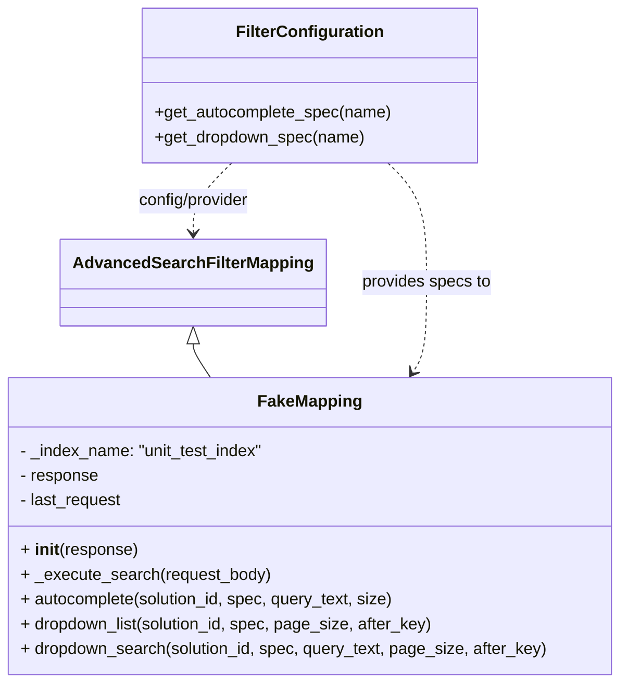

# Diagram: partview_core/partview_service/partview_service/tests/unit/persistence/open_search/test_AdvancedSearchFilterMapping.py

> Auto-generated by Obscura crawlers

## Mermaid

### SVG

<svg id="container" width="601.4296875" xmlns="http://www.w3.org/2000/svg" class="classDiagram" height="662" viewBox="0 0 601.4296875 662" role="graphics-document document" aria-roledescription="class"><g><defs><marker id="container_class-aggregationStart" class="marker aggregation class" refX="18" refY="7" markerWidth="190" markerHeight="240" orient="auto"><path d="M 18,7 L9,13 L1,7 L9,1 Z"></path></marker></defs><defs><marker id="container_class-aggregationEnd" class="marker aggregation class" refX="1" refY="7" markerWidth="20" markerHeight="28" orient="auto"><path d="M 18,7 L9,13 L1,7 L9,1 Z"></path></marker></defs><defs><marker id="container_class-extensionStart" class="marker extension class" refX="18" refY="7" markerWidth="190" markerHeight="240" orient="auto"><path d="M 1,7 L18,13 V 1 Z"></path></marker></defs><defs><marker id="container_class-extensionEnd" class="marker extension class" refX="1" refY="7" markerWidth="20" markerHeight="28" orient="auto"><path d="M 1,1 V 13 L18,7 Z"></path></marker></defs><defs><marker id="container_class-compositionStart" class="marker composition class" refX="18" refY="7" markerWidth="190" markerHeight="240" orient="auto"><path d="M 18,7 L9,13 L1,7 L9,1 Z"></path></marker></defs><defs><marker id="container_class-compositionEnd" class="marker composition class" refX="1" refY="7" markerWidth="20" markerHeight="28" orient="auto"><path d="M 18,7 L9,13 L1,7 L9,1 Z"></path></marker></defs><defs><marker id="container_class-dependencyStart" class="marker dependency class" refX="6" refY="7" markerWidth="190" markerHeight="240" orient="auto"><path d="M 5,7 L9,13 L1,7 L9,1 Z"></path></marker></defs><defs><marker id="container_class-dependencyEnd" class="marker dependency class" refX="13" refY="7" markerWidth="20" markerHeight="28" orient="auto"><path d="M 18,7 L9,13 L14,7 L9,1 Z"></path></marker></defs><defs><marker id="container_class-lollipopStart" class="marker lollipop class" refX="13" refY="7" markerWidth="190" markerHeight="240" orient="auto"><circle stroke="black" fill="transparent" cx="7" cy="7" r="6"></circle></marker></defs><defs><marker id="container_class-lollipopEnd" class="marker lollipop class" refX="1" refY="7" markerWidth="190" markerHeight="240" orient="auto"><circle stroke="black" fill="transparent" cx="7" cy="7" r="6"></circle></marker></defs><g class="root"><g class="clusters"></g><g class="edgePaths"><path d="M190.301,333.25L190.301,334.542C190.301,335.833,190.301,338.417,193.023,343.875C195.745,349.333,201.19,357.667,203.912,361.833L206.634,366" id="id_AdvancedSearchFilterMapping_FakeMapping_1" class="edge-thickness-normal edge-pattern-solid relation" style=";;;" data-edge="true" data-et="edge" data-id="id_AdvancedSearchFilterMapping_FakeMapping_1" data-points="W3sieCI6MTkwLjMwMDc4MTI1LCJ5IjozMTZ9LHsieCI6MTkwLjMwMDc4MTI1LCJ5IjozNDF9LHsieCI6MjA2LjYzNDIyMjQ0ODIyNDg1LCJ5IjozNjZ9XQ==" marker-start="url(#container_class-extensionStart)"></path><path d="M374.653,158L380.732,164.167C386.812,170.333,398.97,182.667,405.05,202C411.129,221.333,411.129,247.667,411.129,272C411.129,296.333,411.129,318.667,408.954,333.163C406.778,347.659,402.428,354.318,400.252,357.648L398.077,360.977" id="id_FilterConfiguration_FakeMapping_2" class="edge-thickness-normal edge-pattern-dashed relation" style=";;;" data-edge="true" data-et="edge" data-id="id_FilterConfiguration_FakeMapping_2" data-points="W3sieCI6Mzc0LjY1MjgzMjAzMTI1LCJ5IjoxNTh9LHsieCI6NDExLjEyODkwNjI1LCJ5IjoxOTV9LHsieCI6NDExLjEyODkwNjI1LCJ5IjoyNzR9LHsieCI6NDExLjEyODkwNjI1LCJ5IjozNDF9LHsieCI6Mzk0Ljc5NTQ2NTA1MTc3NTIsInkiOjM2Nn1d" marker-end="url(#container_class-dependencyEnd)"></path><path d="M226.777,158L220.698,164.167C214.618,170.333,202.459,182.667,196.38,194C190.301,205.333,190.301,215.667,190.301,220.833L190.301,226" id="id_FilterConfiguration_AdvancedSearchFilterMapping_3" class="edge-thickness-normal edge-pattern-dashed relation" style=";;;" data-edge="true" data-et="edge" data-id="id_FilterConfiguration_AdvancedSearchFilterMapping_3" data-points="W3sieCI6MjI2Ljc3Njg1NTQ2ODc1LCJ5IjoxNTh9LHsieCI6MTkwLjMwMDc4MTI1LCJ5IjoxOTV9LHsieCI6MTkwLjMwMDc4MTI1LCJ5IjoyMzJ9XQ==" marker-end="url(#container_class-dependencyEnd)"></path></g><g class="edgeLabels"><g class="edgeLabel"><g class="label" data-id="id_AdvancedSearchFilterMapping_FakeMapping_1" transform="translate(0, 0)"><foreignObject width="0" height="0">

</foreignObject></g></g><g class="edgeLabel" transform="translate(411.12890625, 274)"><g class="label" data-id="id_FilterConfiguration_FakeMapping_2" transform="translate(-63.40625, -12)"><foreignObject width="126.8125" height="24">

provides specs to

</foreignObject></g></g><g class="edgeLabel" transform="translate(190.30078125, 195)"><g class="label" data-id="id_FilterConfiguration_AdvancedSearchFilterMapping_3" transform="translate(-56.375, -12)"><foreignObject width="112.75" height="24">

config/provider

</foreignObject></g></g></g><g class="nodes"><g class="node default" id="classId-AdvancedSearchFilterMapping-0" transform="translate(190.30078125, 274)"><g class="basic label-container"><path d="M-122.421875 -42 L122.421875 -42 L122.421875 42 L-122.421875 42" stroke="none" stroke-width="0" fill="#ECECFF" style=""></path><path d="M-122.421875 -42 C-56.052568562688904 -42, 10.316737874622191 -42, 122.421875 -42 M-122.421875 -42 C-49.517192440488884 -42, 23.38749011902223 -42, 122.421875 -42 M122.421875 -42 C122.421875 -20.740629361445798, 122.421875 0.5187412771084041, 122.421875 42 M122.421875 -42 C122.421875 -17.205305370775648, 122.421875 7.589389258448705, 122.421875 42 M122.421875 42 C37.34702057271329 42, -47.72783385457342 42, -122.421875 42 M122.421875 42 C26.540008130664575 42, -69.34185873867085 42, -122.421875 42 M-122.421875 42 C-122.421875 12.585037091253525, -122.421875 -16.82992581749295, -122.421875 -42 M-122.421875 42 C-122.421875 9.472722476076122, -122.421875 -23.054555047847757, -122.421875 -42" stroke="#9370DB" stroke-width="1.3" fill="none" stroke-dasharray="0 0" style=""></path></g><g class="annotation-group text" transform="translate(0, -18)"></g><g class="label-group text" transform="translate(-110.421875, -18)"><g class="label" style="font-weight: bolder" transform="translate(0,-12)"><foreignObject width="220.84375" height="24">

AdvancedSearchFilterMapping

</foreignObject></g></g><g class="members-group text" transform="translate(-110.421875, 30)"></g><g class="methods-group text" transform="translate(-110.421875, 60)"></g><g class="divider" style=""><path d="M-122.421875 6 C-71.1330245191536 6, -19.844174038307173 6, 122.421875 6 M-122.421875 6 C-58.896455932194456 6, 4.628963135611087 6, 122.421875 6" stroke="#9370DB" stroke-width="1.3" fill="none" stroke-dasharray="0 0" style=""></path></g><g class="divider" style=""><path d="M-122.421875 24 C-29.73699976591915 24, 62.9478754681617 24, 122.421875 24 M-122.421875 24 C-64.31865906014843 24, -6.215443120296882 24, 122.421875 24" stroke="#9370DB" stroke-width="1.3" fill="none" stroke-dasharray="0 0" style=""></path></g></g><g class="node default" id="classId-FilterConfiguration-1" transform="translate(300.71484375, 83)"><g class="basic label-container"><path d="M-161.6875 -75 L161.6875 -75 L161.6875 75 L-161.6875 75" stroke="none" stroke-width="0" fill="#ECECFF" style=""></path><path d="M-161.6875 -75 C-52.93105377150685 -75, 55.82539245698629 -75, 161.6875 -75 M-161.6875 -75 C-33.97535251347597 -75, 93.73679497304806 -75, 161.6875 -75 M161.6875 -75 C161.6875 -31.27319904902005, 161.6875 12.4536019019599, 161.6875 75 M161.6875 -75 C161.6875 -43.67301066079527, 161.6875 -12.346021321590541, 161.6875 75 M161.6875 75 C81.66557167905333 75, 1.643643358106658 75, -161.6875 75 M161.6875 75 C36.61669434757826 75, -88.45411130484348 75, -161.6875 75 M-161.6875 75 C-161.6875 44.37286351918553, -161.6875 13.74572703837105, -161.6875 -75 M-161.6875 75 C-161.6875 39.691125300791455, -161.6875 4.382250601582911, -161.6875 -75" stroke="#9370DB" stroke-width="1.3" fill="none" stroke-dasharray="0 0" style=""></path></g><g class="annotation-group text" transform="translate(0, -51)"></g><g class="label-group text" transform="translate(-68.234375, -51)"><g class="label" style="font-weight: bolder" transform="translate(0,-12)"><foreignObject width="136.46875" height="24">

FilterConfiguration

</foreignObject></g></g><g class="members-group text" transform="translate(-149.6875, -3)"></g><g class="methods-group text" transform="translate(-149.6875, 27)"><g class="label" style="" transform="translate(0,-12)"><foreignObject width="231.140625" height="24">

+get_autocomplete_spec(name)

</foreignObject></g><g class="label" style="" transform="translate(0,12)"><foreignObject width="204.96875" height="24">

+get_dropdown_spec(name)

</foreignObject></g></g><g class="divider" style=""><path d="M-161.6875 -27 C-35.278828647197926 -27, 91.12984270560415 -27, 161.6875 -27 M-161.6875 -27 C-65.90285441289595 -27, 29.881791174208104 -27, 161.6875 -27" stroke="#9370DB" stroke-width="1.3" fill="none" stroke-dasharray="0 0" style=""></path></g><g class="divider" style=""><path d="M-161.6875 -3 C-38.32973413546216 -3, 85.02803172907568 -3, 161.6875 -3 M-161.6875 -3 C-52.239503432044316 -3, 57.20849313591137 -3, 161.6875 -3" stroke="#9370DB" stroke-width="1.3" fill="none" stroke-dasharray="0 0" style=""></path></g></g><g class="node default" id="classId-FakeMapping-2" transform="translate(300.71484375, 510)"><g class="basic label-container"><path d="M-292.71484375 -144 L292.71484375 -144 L292.71484375 144 L-292.71484375 144" stroke="none" stroke-width="0" fill="#ECECFF" style=""></path><path d="M-292.71484375 -144 C-93.05226652358934 -144, 106.61031070282132 -144, 292.71484375 -144 M-292.71484375 -144 C-121.3762096920637 -144, 49.96242436587261 -144, 292.71484375 -144 M292.71484375 -144 C292.71484375 -56.591083583176825, 292.71484375 30.81783283364635, 292.71484375 144 M292.71484375 -144 C292.71484375 -67.23524445168866, 292.71484375 9.529511096622684, 292.71484375 144 M292.71484375 144 C71.01678344547665 144, -150.6812768590467 144, -292.71484375 144 M292.71484375 144 C131.85135297371593 144, -29.012137802568134 144, -292.71484375 144 M-292.71484375 144 C-292.71484375 77.36847029386685, -292.71484375 10.736940587733699, -292.71484375 -144 M-292.71484375 144 C-292.71484375 69.60430900465371, -292.71484375 -4.791381990692571, -292.71484375 -144" stroke="#9370DB" stroke-width="1.3" fill="none" stroke-dasharray="0 0" style=""></path></g><g class="annotation-group text" transform="translate(0, -120)"></g><g class="label-group text" transform="translate(-48.0390625, -120)"><g class="label" style="font-weight: bolder" transform="translate(0,-12)"><foreignObject width="96.078125" height="24">

FakeMapping

</foreignObject></g></g><g class="members-group text" transform="translate(-280.71484375, -72)"><g class="label" style="" transform="translate(0,-12)"><foreignObject width="241.078125" height="24">

- _index_name: "unit_test_index"

</foreignObject></g><g class="label" style="" transform="translate(0,12)"><foreignObject width="77" height="24">

- response

</foreignObject></g><g class="label" style="" transform="translate(0,36)"><foreignObject width="100.6875" height="24">

- last_request

</foreignObject></g></g><g class="methods-group text" transform="translate(-280.71484375, 24)"><g class="label" style="" transform="translate(0,-12)"><foreignObject width="113.359375" height="24">

+ <strong>init</strong>(response)

</foreignObject></g><g class="label" style="" transform="translate(0,12)"><foreignObject width="241.890625" height="24">

+ _execute_search(request_body)

</foreignObject></g><g class="label" style="" transform="translate(0,36)"><foreignObject width="367.40625" height="24">

+ autocomplete(solution_id, spec, query_text, size)

</foreignObject></g><g class="label" style="" transform="translate(0,60)"><foreignObject width="403.25" height="24">

+ dropdown_list(solution_id, spec, page_size, after_key)

</foreignObject></g><g class="label" style="" transform="translate(0,84)"><foreignObject width="513.390625" height="24">

+ dropdown_search(solution_id, spec, query_text, page_size, after_key)

</foreignObject></g></g><g class="divider" style=""><path d="M-292.71484375 -96 C-104.3848229764063 -96, 83.9451977971874 -96, 292.71484375 -96 M-292.71484375 -96 C-114.8448711200185 -96, 63.02510150996301 -96, 292.71484375 -96" stroke="#9370DB" stroke-width="1.3" fill="none" stroke-dasharray="0 0" style=""></path></g><g class="divider" style=""><path d="M-292.71484375 0 C-66.41605249865754 0, 159.88273875268493 0, 292.71484375 0 M-292.71484375 0 C-105.69362422682309 0, 81.32759529635382 0, 292.71484375 0" stroke="#9370DB" stroke-width="1.3" fill="none" stroke-dasharray="0 0" style=""></path></g></g></g></g></g></svg>
