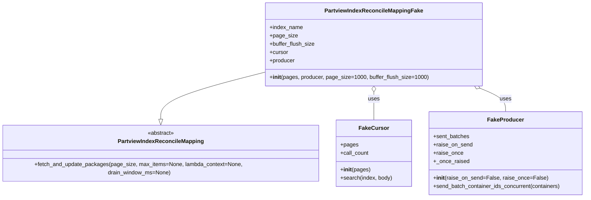
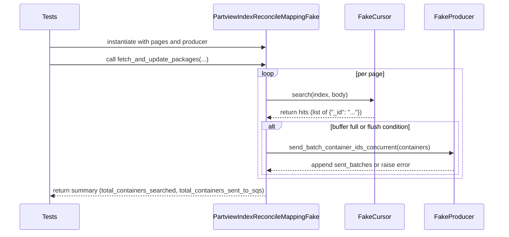

# Diagram: partview_core/partview_service/partview_service/tests/unit/persistence/open_search/test_PartviewIndexReconcileMapping.py

> Auto-generated by Obscura crawlers

## Diagram 1

### SVG

<svg id="container" width="1700.203125" xmlns="http://www.w3.org/2000/svg" class="classDiagram" height="570" viewBox="0 0 1700.203125 570" role="graphics-document document" aria-roledescription="class"><g><defs><marker id="container_class-aggregationStart" class="marker aggregation class" refX="18" refY="7" markerWidth="190" markerHeight="240" orient="auto"><path d="M 18,7 L9,13 L1,7 L9,1 Z"></path></marker></defs><defs><marker id="container_class-aggregationEnd" class="marker aggregation class" refX="1" refY="7" markerWidth="20" markerHeight="28" orient="auto"><path d="M 18,7 L9,13 L1,7 L9,1 Z"></path></marker></defs><defs><marker id="container_class-extensionStart" class="marker extension class" refX="18" refY="7" markerWidth="190" markerHeight="240" orient="auto"><path d="M 1,7 L18,13 V 1 Z"></path></marker></defs><defs><marker id="container_class-extensionEnd" class="marker extension class" refX="1" refY="7" markerWidth="20" markerHeight="28" orient="auto"><path d="M 1,1 V 13 L18,7 Z"></path></marker></defs><defs><marker id="container_class-compositionStart" class="marker composition class" refX="18" refY="7" markerWidth="190" markerHeight="240" orient="auto"><path d="M 18,7 L9,13 L1,7 L9,1 Z"></path></marker></defs><defs><marker id="container_class-compositionEnd" class="marker composition class" refX="1" refY="7" markerWidth="20" markerHeight="28" orient="auto"><path d="M 18,7 L9,13 L1,7 L9,1 Z"></path></marker></defs><defs><marker id="container_class-dependencyStart" class="marker dependency class" refX="6" refY="7" markerWidth="190" markerHeight="240" orient="auto"><path d="M 5,7 L9,13 L1,7 L9,1 Z"></path></marker></defs><defs><marker id="container_class-dependencyEnd" class="marker dependency class" refX="13" refY="7" markerWidth="20" markerHeight="28" orient="auto"><path d="M 18,7 L9,13 L14,7 L9,1 Z"></path></marker></defs><defs><marker id="container_class-lollipopStart" class="marker lollipop class" refX="13" refY="7" markerWidth="190" markerHeight="240" orient="auto"><circle stroke="black" fill="transparent" cx="7" cy="7" r="6"></circle></marker></defs><defs><marker id="container_class-lollipopEnd" class="marker lollipop class" refX="1" refY="7" markerWidth="190" markerHeight="240" orient="auto"><circle stroke="black" fill="transparent" cx="7" cy="7" r="6"></circle></marker></defs><g class="root"><g class="clusters"></g><g class="edgePaths"><path d="M786.578,204.987L733.924,218.323C681.271,231.658,575.964,258.329,523.31,282.456C470.656,306.583,470.656,328.167,470.656,338.958L470.656,349.75" id="id_PartviewIndexReconcileMappingFake_PartviewIndexReconcileMapping_1" class="edge-thickness-normal edge-pattern-solid relation" style=";;;" data-edge="true" data-et="edge" data-id="id_PartviewIndexReconcileMappingFake_PartviewIndexReconcileMapping_1" data-points="W3sieCI6Nzg2LjU3ODEyNSwieSI6MjA0Ljk4NzMyMTUxMTg0MDM4fSx7IngiOjQ3MC42NTYyNSwieSI6Mjg1fSx7IngiOjQ3MC42NTYyNSwieSI6MzY3fV0=" marker-end="url(#container_class-extensionEnd)"></path><path d="M1090.555,265.25L1090.555,268.542C1090.555,271.833,1090.555,278.417,1090.555,291.875C1090.555,305.333,1090.555,325.667,1090.555,335.833L1090.555,346" id="id_PartviewIndexReconcileMappingFake_FakeCursor_2" class="edge-thickness-normal edge-pattern-solid relation" style=";;;" data-edge="true" data-et="edge" data-id="id_PartviewIndexReconcileMappingFake_FakeCursor_2" data-points="W3sieCI6MTA5MC41NTQ2ODc1LCJ5IjoyNDh9LHsieCI6MTA5MC41NTQ2ODc1LCJ5IjoyODV9LHsieCI6MTA5MC41NTQ2ODc1LCJ5IjozNDZ9XQ==" marker-start="url(#container_class-aggregationStart)"></path><path d="M1396.516,254.595L1408.763,259.663C1421.011,264.73,1445.505,274.865,1457.753,286.099C1470,297.333,1470,309.667,1470,315.833L1470,322" id="id_PartviewIndexReconcileMappingFake_FakeProducer_3" class="edge-thickness-normal edge-pattern-solid relation" style=";;;" data-edge="true" data-et="edge" data-id="id_PartviewIndexReconcileMappingFake_FakeProducer_3" data-points="W3sieCI6MTM4MC41NzY1ODI0MDQ0NTg2LCJ5IjoyNDh9LHsieCI6MTQ3MCwieSI6Mjg1fSx7IngiOjE0NzAsInkiOjMyMn1d" marker-start="url(#container_class-aggregationStart)"></path></g><g class="edgeLabels"><g class="edgeLabel"><g class="label" data-id="id_PartviewIndexReconcileMappingFake_PartviewIndexReconcileMapping_1" transform="translate(0, 0)"><foreignObject width="0" height="0">

</foreignObject></g></g><g class="edgeLabel" transform="translate(1090.5546875, 285)"><g class="label" data-id="id_PartviewIndexReconcileMappingFake_FakeCursor_2" transform="translate(-16.4921875, -12)"><foreignObject width="32.984375" height="24">

uses

</foreignObject></g></g><g class="edgeLabel" transform="translate(1470, 285)"><g class="label" data-id="id_PartviewIndexReconcileMappingFake_FakeProducer_3" transform="translate(-16.4921875, -12)"><foreignObject width="32.984375" height="24">

uses

</foreignObject></g></g></g><g class="nodes"><g class="node default" id="classId-FakeCursor-0" transform="translate(1090.5546875, 442)"><g class="basic label-container"><path d="M-107.2421875 -96 L107.2421875 -96 L107.2421875 96 L-107.2421875 96" stroke="none" stroke-width="0" fill="#ECECFF" style=""></path><path d="M-107.2421875 -96 C-21.889256597265074 -96, 63.46367430546985 -96, 107.2421875 -96 M-107.2421875 -96 C-33.6400209715415 -96, 39.962145556916994 -96, 107.2421875 -96 M107.2421875 -96 C107.2421875 -38.01641965870154, 107.2421875 19.967160682596926, 107.2421875 96 M107.2421875 -96 C107.2421875 -21.548802067554206, 107.2421875 52.90239586489159, 107.2421875 96 M107.2421875 96 C29.318911750623826 96, -48.60436399875235 96, -107.2421875 96 M107.2421875 96 C40.371119098467744 96, -26.49994930306451 96, -107.2421875 96 M-107.2421875 96 C-107.2421875 42.24398333202272, -107.2421875 -11.512033335954555, -107.2421875 -96 M-107.2421875 96 C-107.2421875 22.872197378937088, -107.2421875 -50.255605242125824, -107.2421875 -96" stroke="#9370DB" stroke-width="1.3" fill="none" stroke-dasharray="0 0" style=""></path></g><g class="annotation-group text" transform="translate(0, -72)"></g><g class="label-group text" transform="translate(-40.4375, -72)"><g class="label" style="font-weight: bolder" transform="translate(0,-12)"><foreignObject width="80.875" height="24">

FakeCursor

</foreignObject></g></g><g class="members-group text" transform="translate(-95.2421875, -24)"><g class="label" style="" transform="translate(0,-12)"><foreignObject width="50.140625" height="24">

+pages

</foreignObject></g><g class="label" style="" transform="translate(0,12)"><foreignObject width="82.53125" height="24">

+call_count

</foreignObject></g></g><g class="methods-group text" transform="translate(-95.2421875, 48)"><g class="label" style="" transform="translate(0,-12)"><foreignObject width="84.9375" height="24">

+<strong>init</strong>(pages)

</foreignObject></g><g class="label" style="" transform="translate(0,12)"><foreignObject width="150.046875" height="24">

+search(index, body)

</foreignObject></g></g><g class="divider" style=""><path d="M-107.2421875 -48 C-59.540598491863975 -48, -11.83900948372795 -48, 107.2421875 -48 M-107.2421875 -48 C-38.12778716272483 -48, 30.986613174550342 -48, 107.2421875 -48" stroke="#9370DB" stroke-width="1.3" fill="none" stroke-dasharray="0 0" style=""></path></g><g class="divider" style=""><path d="M-107.2421875 24 C-45.66807594554296 24, 15.906035608914081 24, 107.2421875 24 M-107.2421875 24 C-63.544227189671666 24, -19.846266879343332 24, 107.2421875 24" stroke="#9370DB" stroke-width="1.3" fill="none" stroke-dasharray="0 0" style=""></path></g></g><g class="node default" id="classId-FakeProducer-1" transform="translate(1470, 442)"><g class="basic label-container"><path d="M-222.203125 -120 L222.203125 -120 L222.203125 120 L-222.203125 120" stroke="none" stroke-width="0" fill="#ECECFF" style=""></path><path d="M-222.203125 -120 C-54.33153533003417 -120, 113.54005433993166 -120, 222.203125 -120 M-222.203125 -120 C-57.00074925181218 -120, 108.20162649637564 -120, 222.203125 -120 M222.203125 -120 C222.203125 -68.2586142102163, 222.203125 -16.517228420432588, 222.203125 120 M222.203125 -120 C222.203125 -41.88453906110857, 222.203125 36.23092187778286, 222.203125 120 M222.203125 120 C48.12520533303834 120, -125.95271433392332 120, -222.203125 120 M222.203125 120 C58.182893298987466 120, -105.83733840202507 120, -222.203125 120 M-222.203125 120 C-222.203125 31.648540371888075, -222.203125 -56.70291925622385, -222.203125 -120 M-222.203125 120 C-222.203125 59.9468204160915, -222.203125 -0.10635916781700416, -222.203125 -120" stroke="#9370DB" stroke-width="1.3" fill="none" stroke-dasharray="0 0" style=""></path></g><g class="annotation-group text" transform="translate(0, -96)"></g><g class="label-group text" transform="translate(-49.484375, -96)"><g class="label" style="font-weight: bolder" transform="translate(0,-12)"><foreignObject width="98.96875" height="24">

FakeProducer

</foreignObject></g></g><g class="members-group text" transform="translate(-210.203125, -48)"><g class="label" style="" transform="translate(0,-12)"><foreignObject width="104.453125" height="24">

+sent_batches

</foreignObject></g><g class="label" style="" transform="translate(0,12)"><foreignObject width="112.875" height="24">

+raise_on_send

</foreignObject></g><g class="label" style="" transform="translate(0,36)"><foreignObject width="85.46875" height="24">

+raise_once

</foreignObject></g><g class="label" style="" transform="translate(0,60)"><foreignObject width="102.078125" height="24">

+_once_raised

</foreignObject></g></g><g class="methods-group text" transform="translate(-210.203125, 72)"><g class="label" style="" transform="translate(0,-12)"><foreignObject width="321.703125" height="24">

+<strong>init</strong>(raise_on_send=False, raise_once=False)

</foreignObject></g><g class="label" style="" transform="translate(0,12)"><foreignObject width="370.921875" height="24">

+send_batch_container_ids_concurrent(containers)

</foreignObject></g></g><g class="divider" style=""><path d="M-222.203125 -72 C-103.20366820161253 -72, 15.79578859677494 -72, 222.203125 -72 M-222.203125 -72 C-47.95194940133433 -72, 126.29922619733134 -72, 222.203125 -72" stroke="#9370DB" stroke-width="1.3" fill="none" stroke-dasharray="0 0" style=""></path></g><g class="divider" style=""><path d="M-222.203125 48 C-82.68477833640134 48, 56.83356832719733 48, 222.203125 48 M-222.203125 48 C-121.26835441970283 48, -20.333583839405662 48, 222.203125 48" stroke="#9370DB" stroke-width="1.3" fill="none" stroke-dasharray="0 0" style=""></path></g></g><g class="node default" id="classId-PartviewIndexReconcileMapping-2" transform="translate(470.65625, 442)"><g class="basic label-container"><path d="M-462.65625 -75 L462.65625 -75 L462.65625 75 L-462.65625 75" stroke="none" stroke-width="0" fill="#ECECFF" style=""></path><path d="M-462.65625 -75 C-211.80885757158984 -75, 39.03853485682032 -75, 462.65625 -75 M-462.65625 -75 C-136.74057505350356 -75, 189.17509989299288 -75, 462.65625 -75 M462.65625 -75 C462.65625 -21.719904914073773, 462.65625 31.560190171852454, 462.65625 75 M462.65625 -75 C462.65625 -33.09395829553217, 462.65625 8.812083408935663, 462.65625 75 M462.65625 75 C174.71983950737052 75, -113.21657098525895 75, -462.65625 75 M462.65625 75 C93.0287049987906 75, -276.5988400024188 75, -462.65625 75 M-462.65625 75 C-462.65625 18.563178091269464, -462.65625 -37.87364381746107, -462.65625 -75 M-462.65625 75 C-462.65625 16.51580522952011, -462.65625 -41.96838954095978, -462.65625 -75" stroke="#9370DB" stroke-width="1.3" fill="none" stroke-dasharray="0 0" style=""></path></g><g class="annotation-group text" transform="translate(-38.609375, -51)"><g class="label" style="" transform="translate(0,-12)"><foreignObject width="77.21875" height="24">

«abstract»

</foreignObject></g></g><g class="label-group text" transform="translate(-118.5, -27)"><g class="label" style="font-weight: bolder" transform="translate(0,-12)"><foreignObject width="237" height="24">

PartviewIndexReconcileMapping

</foreignObject></g></g><g class="members-group text" transform="translate(-450.65625, 21)"></g><g class="methods-group text" transform="translate(-450.65625, 51)"><g class="label" style="" transform="translate(0,-12)"><foreignObject width="782.8125" height="24">

+fetch_and_update_packages(page_size, max_items=None, lambda_context=None, drain_window_ms=None)

</foreignObject></g></g><g class="divider" style=""><path d="M-462.65625 -3 C-132.95344028964564 -3, 196.74936942070872 -3, 462.65625 -3 M-462.65625 -3 C-121.9289254398156 -3, 218.7983991203688 -3, 462.65625 -3" stroke="#9370DB" stroke-width="1.3" fill="none" stroke-dasharray="0 0" style=""></path></g><g class="divider" style=""><path d="M-462.65625 21 C-136.79736817041913 21, 189.06151365916173 21, 462.65625 21 M-462.65625 21 C-179.1509802430391 21, 104.3542895139218 21, 462.65625 21" stroke="#9370DB" stroke-width="1.3" fill="none" stroke-dasharray="0 0" style=""></path></g></g><g class="node default" id="classId-PartviewIndexReconcileMappingFake-3" transform="translate(1090.5546875, 128)"><g class="basic label-container"><path d="M-303.9765625 -120 L303.9765625 -120 L303.9765625 120 L-303.9765625 120" stroke="none" stroke-width="0" fill="#ECECFF" style=""></path><path d="M-303.9765625 -120 C-64.5324780287093 -120, 174.9116064425814 -120, 303.9765625 -120 M-303.9765625 -120 C-89.97782736596636 -120, 124.02090776806727 -120, 303.9765625 -120 M303.9765625 -120 C303.9765625 -38.27491658642711, 303.9765625 43.45016682714578, 303.9765625 120 M303.9765625 -120 C303.9765625 -33.5613707429731, 303.9765625 52.87725851405381, 303.9765625 120 M303.9765625 120 C110.2820753058217 120, -83.41241188835659 120, -303.9765625 120 M303.9765625 120 C161.42873295843435 120, 18.880903416868705 120, -303.9765625 120 M-303.9765625 120 C-303.9765625 43.67783977614056, -303.9765625 -32.64432044771888, -303.9765625 -120 M-303.9765625 120 C-303.9765625 70.29451226756353, -303.9765625 20.589024535127052, -303.9765625 -120" stroke="#9370DB" stroke-width="1.3" fill="none" stroke-dasharray="0 0" style=""></path></g><g class="annotation-group text" transform="translate(0, -96)"></g><g class="label-group text" transform="translate(-135.03125, -96)"><g class="label" style="font-weight: bolder" transform="translate(0,-12)"><foreignObject width="270.0625" height="24">

PartviewIndexReconcileMappingFake

</foreignObject></g></g><g class="members-group text" transform="translate(-291.9765625, -48)"><g class="label" style="" transform="translate(0,-12)"><foreignObject width="96.609375" height="24">

+index_name

</foreignObject></g><g class="label" style="" transform="translate(0,12)"><foreignObject width="78.25" height="24">

+page_size

</foreignObject></g><g class="label" style="" transform="translate(0,36)"><foreignObject width="130.515625" height="24">

+buffer_flush_size

</foreignObject></g><g class="label" style="" transform="translate(0,60)"><foreignObject width="53.71875" height="24">

+cursor

</foreignObject></g><g class="label" style="" transform="translate(0,84)"><foreignObject width="73.640625" height="24">

+producer

</foreignObject></g></g><g class="methods-group text" transform="translate(-291.9765625, 96)"><g class="label" style="" transform="translate(0,-12)"><foreignObject width="448.921875" height="24">

+<strong>init</strong>(pages, producer, page_size=1000, buffer_flush_size=1000)

</foreignObject></g></g><g class="divider" style=""><path d="M-303.9765625 -72 C-77.39671777406107 -72, 149.18312695187785 -72, 303.9765625 -72 M-303.9765625 -72 C-83.70717415297952 -72, 136.56221419404096 -72, 303.9765625 -72" stroke="#9370DB" stroke-width="1.3" fill="none" stroke-dasharray="0 0" style=""></path></g><g class="divider" style=""><path d="M-303.9765625 72 C-147.4190240278754 72, 9.13851444424921 72, 303.9765625 72 M-303.9765625 72 C-74.77670177274737 72, 154.42315895450525 72, 303.9765625 72" stroke="#9370DB" stroke-width="1.3" fill="none" stroke-dasharray="0 0" style=""></path></g></g></g></g></g></svg>

## Diagram 2

### SVG

<svg id="container" width="1344" xmlns="http://www.w3.org/2000/svg" height="617" viewBox="-50 -10 1344 617" role="graphics-document document" aria-roledescription="sequence"><g><rect x="1094" y="531" fill="#eaeaea" stroke="#666" width="150" height="65" name="Producer" rx="3" ry="3" class="actor actor-bottom"></rect><text x="1169" y="563.5" dominant-baseline="central" alignment-baseline="central" class="actor actor-box" style="text-anchor: middle; font-size: 16px; font-weight: 400;"><tspan x="1169" dy="0">FakeProducer</tspan></text></g><g><rect x="894" y="531" fill="#eaeaea" stroke="#666" width="150" height="65" name="Cursor" rx="3" ry="3" class="actor actor-bottom"></rect><text x="969" y="563.5" dominant-baseline="central" alignment-baseline="central" class="actor actor-box" style="text-anchor: middle; font-size: 16px; font-weight: 400;"><tspan x="969" dy="0">FakeCursor</tspan></text></g><g><rect x="546" y="531" fill="#eaeaea" stroke="#666" width="286" height="65" name="Mapping" rx="3" ry="3" class="actor actor-bottom"></rect><text x="689" y="563.5" dominant-baseline="central" alignment-baseline="central" class="actor actor-box" style="text-anchor: middle; font-size: 16px; font-weight: 400;"><tspan x="689" dy="0">PartviewIndexReconcileMappingFake</tspan></text></g><g><rect x="0" y="531" fill="#eaeaea" stroke="#666" width="150" height="65" name="Tests" rx="3" ry="3" class="actor actor-bottom"></rect><text x="75" y="563.5" dominant-baseline="central" alignment-baseline="central" class="actor actor-box" style="text-anchor: middle; font-size: 16px; font-weight: 400;"><tspan x="75" dy="0">Tests</tspan></text></g><g><line id="actor3" x1="1169" y1="65" x2="1169" y2="531" class="actor-line 200" stroke-width="0.5px" stroke="#999" name="Producer"></line><g id="root-3"><rect x="1094" y="0" fill="#eaeaea" stroke="#666" width="150" height="65" name="Producer" rx="3" ry="3" class="actor actor-top"></rect><text x="1169" y="32.5" dominant-baseline="central" alignment-baseline="central" class="actor actor-box" style="text-anchor: middle; font-size: 16px; font-weight: 400;"><tspan x="1169" dy="0">FakeProducer</tspan></text></g></g><g><line id="actor2" x1="969" y1="65" x2="969" y2="531" class="actor-line 200" stroke-width="0.5px" stroke="#999" name="Cursor"></line><g id="root-2"><rect x="894" y="0" fill="#eaeaea" stroke="#666" width="150" height="65" name="Cursor" rx="3" ry="3" class="actor actor-top"></rect><text x="969" y="32.5" dominant-baseline="central" alignment-baseline="central" class="actor actor-box" style="text-anchor: middle; font-size: 16px; font-weight: 400;"><tspan x="969" dy="0">FakeCursor</tspan></text></g></g><g><line id="actor1" x1="689" y1="65" x2="689" y2="531" class="actor-line 200" stroke-width="0.5px" stroke="#999" name="Mapping"></line><g id="root-1"><rect x="546" y="0" fill="#eaeaea" stroke="#666" width="286" height="65" name="Mapping" rx="3" ry="3" class="actor actor-top"></rect><text x="689" y="32.5" dominant-baseline="central" alignment-baseline="central" class="actor actor-box" style="text-anchor: middle; font-size: 16px; font-weight: 400;"><tspan x="689" dy="0">PartviewIndexReconcileMappingFake</tspan></text></g></g><g><line id="actor0" x1="75" y1="65" x2="75" y2="531" class="actor-line 200" stroke-width="0.5px" stroke="#999" name="Tests"></line><g id="root-0"><rect x="0" y="0" fill="#eaeaea" stroke="#666" width="150" height="65" name="Tests" rx="3" ry="3" class="actor actor-top"></rect><text x="75" y="32.5" dominant-baseline="central" alignment-baseline="central" class="actor actor-box" style="text-anchor: middle; font-size: 16px; font-weight: 400;"><tspan x="75" dy="0">Tests</tspan></text></g></g><g></g><defs><symbol id="computer" width="24" height="24"><path transform="scale(.5)" d="M2 2v13h20v-13h-20zm18 11h-16v-9h16v9zm-10.228 6l.466-1h3.524l.467 1h-4.457zm14.228 3h-24l2-6h2.104l-1.33 4h18.45l-1.297-4h2.073l2 6zm-5-10h-14v-7h14v7z"></path></symbol></defs><defs><symbol id="database" fill-rule="evenodd" clip-rule="evenodd"><path transform="scale(.5)" d="M12.258.001l.256.004.255.005.253.008.251.01.249.012.247.015.246.016.242.019.241.02.239.023.236.024.233.027.231.028.229.031.225.032.223.034.22.036.217.038.214.04.211.041.208.043.205.045.201.046.198.048.194.05.191.051.187.053.183.054.18.056.175.057.172.059.168.06.163.061.16.063.155.064.15.066.074.033.073.033.071.034.07.034.069.035.068.035.067.035.066.035.064.036.064.036.062.036.06.036.06.037.058.037.058.037.055.038.055.038.053.038.052.038.051.039.05.039.048.039.047.039.045.04.044.04.043.04.041.04.04.041.039.041.037.041.036.041.034.041.033.042.032.042.03.042.029.042.027.042.026.043.024.043.023.043.021.043.02.043.018.044.017.043.015.044.013.044.012.044.011.045.009.044.007.045.006.045.004.045.002.045.001.045v17l-.001.045-.002.045-.004.045-.006.045-.007.045-.009.044-.011.045-.012.044-.013.044-.015.044-.017.043-.018.044-.02.043-.021.043-.023.043-.024.043-.026.043-.027.042-.029.042-.03.042-.032.042-.033.042-.034.041-.036.041-.037.041-.039.041-.04.041-.041.04-.043.04-.044.04-.045.04-.047.039-.048.039-.05.039-.051.039-.052.038-.053.038-.055.038-.055.038-.058.037-.058.037-.06.037-.06.036-.062.036-.064.036-.064.036-.066.035-.067.035-.068.035-.069.035-.07.034-.071.034-.073.033-.074.033-.15.066-.155.064-.16.063-.163.061-.168.06-.172.059-.175.057-.18.056-.183.054-.187.053-.191.051-.194.05-.198.048-.201.046-.205.045-.208.043-.211.041-.214.04-.217.038-.22.036-.223.034-.225.032-.229.031-.231.028-.233.027-.236.024-.239.023-.241.02-.242.019-.246.016-.247.015-.249.012-.251.01-.253.008-.255.005-.256.004-.258.001-.258-.001-.256-.004-.255-.005-.253-.008-.251-.01-.249-.012-.247-.015-.245-.016-.243-.019-.241-.02-.238-.023-.236-.024-.234-.027-.231-.028-.228-.031-.226-.032-.223-.034-.22-.036-.217-.038-.214-.04-.211-.041-.208-.043-.204-.045-.201-.046-.198-.048-.195-.05-.19-.051-.187-.053-.184-.054-.179-.056-.176-.057-.172-.059-.167-.06-.164-.061-.159-.063-.155-.064-.151-.066-.074-.033-.072-.033-.072-.034-.07-.034-.069-.035-.068-.035-.067-.035-.066-.035-.064-.036-.063-.036-.062-.036-.061-.036-.06-.037-.058-.037-.057-.037-.056-.038-.055-.038-.053-.038-.052-.038-.051-.039-.049-.039-.049-.039-.046-.039-.046-.04-.044-.04-.043-.04-.041-.04-.04-.041-.039-.041-.037-.041-.036-.041-.034-.041-.033-.042-.032-.042-.03-.042-.029-.042-.027-.042-.026-.043-.024-.043-.023-.043-.021-.043-.02-.043-.018-.044-.017-.043-.015-.044-.013-.044-.012-.044-.011-.045-.009-.044-.007-.045-.006-.045-.004-.045-.002-.045-.001-.045v-17l.001-.045.002-.045.004-.045.006-.045.007-.045.009-.044.011-.045.012-.044.013-.044.015-.044.017-.043.018-.044.02-.043.021-.043.023-.043.024-.043.026-.043.027-.042.029-.042.03-.042.032-.042.033-.042.034-.041.036-.041.037-.041.039-.041.04-.041.041-.04.043-.04.044-.04.046-.04.046-.039.049-.039.049-.039.051-.039.052-.038.053-.038.055-.038.056-.038.057-.037.058-.037.06-.037.061-.036.062-.036.063-.036.064-.036.066-.035.067-.035.068-.035.069-.035.07-.034.072-.034.072-.033.074-.033.151-.066.155-.064.159-.063.164-.061.167-.06.172-.059.176-.057.179-.056.184-.054.187-.053.19-.051.195-.05.198-.048.201-.046.204-.045.208-.043.211-.041.214-.04.217-.038.22-.036.223-.034.226-.032.228-.031.231-.028.234-.027.236-.024.238-.023.241-.02.243-.019.245-.016.247-.015.249-.012.251-.01.253-.008.255-.005.256-.004.258-.001.258.001zm-9.258 20.499v.01l.001.021.003.021.004.022.005.021.006.022.007.022.009.023.01.022.011.023.012.023.013.023.015.023.016.024.017.023.018.024.019.024.021.024.022.025.023.024.024.025.052.049.056.05.061.051.066.051.07.051.075.051.079.052.084.052.088.052.092.052.097.052.102.051.105.052.11.052.114.051.119.051.123.051.127.05.131.05.135.05.139.048.144.049.147.047.152.047.155.047.16.045.163.045.167.043.171.043.176.041.178.041.183.039.187.039.19.037.194.035.197.035.202.033.204.031.209.03.212.029.216.027.219.025.222.024.226.021.23.02.233.018.236.016.24.015.243.012.246.01.249.008.253.005.256.004.259.001.26-.001.257-.004.254-.005.25-.008.247-.011.244-.012.241-.014.237-.016.233-.018.231-.021.226-.021.224-.024.22-.026.216-.027.212-.028.21-.031.205-.031.202-.034.198-.034.194-.036.191-.037.187-.039.183-.04.179-.04.175-.042.172-.043.168-.044.163-.045.16-.046.155-.046.152-.047.148-.048.143-.049.139-.049.136-.05.131-.05.126-.05.123-.051.118-.052.114-.051.11-.052.106-.052.101-.052.096-.052.092-.052.088-.053.083-.051.079-.052.074-.052.07-.051.065-.051.06-.051.056-.05.051-.05.023-.024.023-.025.021-.024.02-.024.019-.024.018-.024.017-.024.015-.023.014-.024.013-.023.012-.023.01-.023.01-.022.008-.022.006-.022.006-.022.004-.022.004-.021.001-.021.001-.021v-4.127l-.077.055-.08.053-.083.054-.085.053-.087.052-.09.052-.093.051-.095.05-.097.05-.1.049-.102.049-.105.048-.106.047-.109.047-.111.046-.114.045-.115.045-.118.044-.12.043-.122.042-.124.042-.126.041-.128.04-.13.04-.132.038-.134.038-.135.037-.138.037-.139.035-.142.035-.143.034-.144.033-.147.032-.148.031-.15.03-.151.03-.153.029-.154.027-.156.027-.158.026-.159.025-.161.024-.162.023-.163.022-.165.021-.166.02-.167.019-.169.018-.169.017-.171.016-.173.015-.173.014-.175.013-.175.012-.177.011-.178.01-.179.008-.179.008-.181.006-.182.005-.182.004-.184.003-.184.002h-.37l-.184-.002-.184-.003-.182-.004-.182-.005-.181-.006-.179-.008-.179-.008-.178-.01-.176-.011-.176-.012-.175-.013-.173-.014-.172-.015-.171-.016-.17-.017-.169-.018-.167-.019-.166-.02-.165-.021-.163-.022-.162-.023-.161-.024-.159-.025-.157-.026-.156-.027-.155-.027-.153-.029-.151-.03-.15-.03-.148-.031-.146-.032-.145-.033-.143-.034-.141-.035-.14-.035-.137-.037-.136-.037-.134-.038-.132-.038-.13-.04-.128-.04-.126-.041-.124-.042-.122-.042-.12-.044-.117-.043-.116-.045-.113-.045-.112-.046-.109-.047-.106-.047-.105-.048-.102-.049-.1-.049-.097-.05-.095-.05-.093-.052-.09-.051-.087-.052-.085-.053-.083-.054-.08-.054-.077-.054v4.127zm0-5.654v.011l.001.021.003.021.004.021.005.022.006.022.007.022.009.022.01.022.011.023.012.023.013.023.015.024.016.023.017.024.018.024.019.024.021.024.022.024.023.025.024.024.052.05.056.05.061.05.066.051.07.051.075.052.079.051.084.052.088.052.092.052.097.052.102.052.105.052.11.051.114.051.119.052.123.05.127.051.131.05.135.049.139.049.144.048.147.048.152.047.155.046.16.045.163.045.167.044.171.042.176.042.178.04.183.04.187.038.19.037.194.036.197.034.202.033.204.032.209.03.212.028.216.027.219.025.222.024.226.022.23.02.233.018.236.016.24.014.243.012.246.01.249.008.253.006.256.003.259.001.26-.001.257-.003.254-.006.25-.008.247-.01.244-.012.241-.015.237-.016.233-.018.231-.02.226-.022.224-.024.22-.025.216-.027.212-.029.21-.03.205-.032.202-.033.198-.035.194-.036.191-.037.187-.039.183-.039.179-.041.175-.042.172-.043.168-.044.163-.045.16-.045.155-.047.152-.047.148-.048.143-.048.139-.05.136-.049.131-.05.126-.051.123-.051.118-.051.114-.052.11-.052.106-.052.101-.052.096-.052.092-.052.088-.052.083-.052.079-.052.074-.051.07-.052.065-.051.06-.05.056-.051.051-.049.023-.025.023-.024.021-.025.02-.024.019-.024.018-.024.017-.024.015-.023.014-.023.013-.024.012-.022.01-.023.01-.023.008-.022.006-.022.006-.022.004-.021.004-.022.001-.021.001-.021v-4.139l-.077.054-.08.054-.083.054-.085.052-.087.053-.09.051-.093.051-.095.051-.097.05-.1.049-.102.049-.105.048-.106.047-.109.047-.111.046-.114.045-.115.044-.118.044-.12.044-.122.042-.124.042-.126.041-.128.04-.13.039-.132.039-.134.038-.135.037-.138.036-.139.036-.142.035-.143.033-.144.033-.147.033-.148.031-.15.03-.151.03-.153.028-.154.028-.156.027-.158.026-.159.025-.161.024-.162.023-.163.022-.165.021-.166.02-.167.019-.169.018-.169.017-.171.016-.173.015-.173.014-.175.013-.175.012-.177.011-.178.009-.179.009-.179.007-.181.007-.182.005-.182.004-.184.003-.184.002h-.37l-.184-.002-.184-.003-.182-.004-.182-.005-.181-.007-.179-.007-.179-.009-.178-.009-.176-.011-.176-.012-.175-.013-.173-.014-.172-.015-.171-.016-.17-.017-.169-.018-.167-.019-.166-.02-.165-.021-.163-.022-.162-.023-.161-.024-.159-.025-.157-.026-.156-.027-.155-.028-.153-.028-.151-.03-.15-.03-.148-.031-.146-.033-.145-.033-.143-.033-.141-.035-.14-.036-.137-.036-.136-.037-.134-.038-.132-.039-.13-.039-.128-.04-.126-.041-.124-.042-.122-.043-.12-.043-.117-.044-.116-.044-.113-.046-.112-.046-.109-.046-.106-.047-.105-.048-.102-.049-.1-.049-.097-.05-.095-.051-.093-.051-.09-.051-.087-.053-.085-.052-.083-.054-.08-.054-.077-.054v4.139zm0-5.666v.011l.001.02.003.022.004.021.005.022.006.021.007.022.009.023.01.022.011.023.012.023.013.023.015.023.016.024.017.024.018.023.019.024.021.025.022.024.023.024.024.025.052.05.056.05.061.05.066.051.07.051.075.052.079.051.084.052.088.052.092.052.097.052.102.052.105.051.11.052.114.051.119.051.123.051.127.05.131.05.135.05.139.049.144.048.147.048.152.047.155.046.16.045.163.045.167.043.171.043.176.042.178.04.183.04.187.038.19.037.194.036.197.034.202.033.204.032.209.03.212.028.216.027.219.025.222.024.226.021.23.02.233.018.236.017.24.014.243.012.246.01.249.008.253.006.256.003.259.001.26-.001.257-.003.254-.006.25-.008.247-.01.244-.013.241-.014.237-.016.233-.018.231-.02.226-.022.224-.024.22-.025.216-.027.212-.029.21-.03.205-.032.202-.033.198-.035.194-.036.191-.037.187-.039.183-.039.179-.041.175-.042.172-.043.168-.044.163-.045.16-.045.155-.047.152-.047.148-.048.143-.049.139-.049.136-.049.131-.051.126-.05.123-.051.118-.052.114-.051.11-.052.106-.052.101-.052.096-.052.092-.052.088-.052.083-.052.079-.052.074-.052.07-.051.065-.051.06-.051.056-.05.051-.049.023-.025.023-.025.021-.024.02-.024.019-.024.018-.024.017-.024.015-.023.014-.024.013-.023.012-.023.01-.022.01-.023.008-.022.006-.022.006-.022.004-.022.004-.021.001-.021.001-.021v-4.153l-.077.054-.08.054-.083.053-.085.053-.087.053-.09.051-.093.051-.095.051-.097.05-.1.049-.102.048-.105.048-.106.048-.109.046-.111.046-.114.046-.115.044-.118.044-.12.043-.122.043-.124.042-.126.041-.128.04-.13.039-.132.039-.134.038-.135.037-.138.036-.139.036-.142.034-.143.034-.144.033-.147.032-.148.032-.15.03-.151.03-.153.028-.154.028-.156.027-.158.026-.159.024-.161.024-.162.023-.163.023-.165.021-.166.02-.167.019-.169.018-.169.017-.171.016-.173.015-.173.014-.175.013-.175.012-.177.01-.178.01-.179.009-.179.007-.181.006-.182.006-.182.004-.184.003-.184.001-.185.001-.185-.001-.184-.001-.184-.003-.182-.004-.182-.006-.181-.006-.179-.007-.179-.009-.178-.01-.176-.01-.176-.012-.175-.013-.173-.014-.172-.015-.171-.016-.17-.017-.169-.018-.167-.019-.166-.02-.165-.021-.163-.023-.162-.023-.161-.024-.159-.024-.157-.026-.156-.027-.155-.028-.153-.028-.151-.03-.15-.03-.148-.032-.146-.032-.145-.033-.143-.034-.141-.034-.14-.036-.137-.036-.136-.037-.134-.038-.132-.039-.13-.039-.128-.041-.126-.041-.124-.041-.122-.043-.12-.043-.117-.044-.116-.044-.113-.046-.112-.046-.109-.046-.106-.048-.105-.048-.102-.048-.1-.05-.097-.049-.095-.051-.093-.051-.09-.052-.087-.052-.085-.053-.083-.053-.08-.054-.077-.054v4.153zm8.74-8.179l-.257.004-.254.005-.25.008-.247.011-.244.012-.241.014-.237.016-.233.018-.231.021-.226.022-.224.023-.22.026-.216.027-.212.028-.21.031-.205.032-.202.033-.198.034-.194.036-.191.038-.187.038-.183.04-.179.041-.175.042-.172.043-.168.043-.163.045-.16.046-.155.046-.152.048-.148.048-.143.048-.139.049-.136.05-.131.05-.126.051-.123.051-.118.051-.114.052-.11.052-.106.052-.101.052-.096.052-.092.052-.088.052-.083.052-.079.052-.074.051-.07.052-.065.051-.06.05-.056.05-.051.05-.023.025-.023.024-.021.024-.02.025-.019.024-.018.024-.017.023-.015.024-.014.023-.013.023-.012.023-.01.023-.01.022-.008.022-.006.023-.006.021-.004.022-.004.021-.001.021-.001.021.001.021.001.021.004.021.004.022.006.021.006.023.008.022.01.022.01.023.012.023.013.023.014.023.015.024.017.023.018.024.019.024.02.025.021.024.023.024.023.025.051.05.056.05.06.05.065.051.07.052.074.051.079.052.083.052.088.052.092.052.096.052.101.052.106.052.11.052.114.052.118.051.123.051.126.051.131.05.136.05.139.049.143.048.148.048.152.048.155.046.16.046.163.045.168.043.172.043.175.042.179.041.183.04.187.038.191.038.194.036.198.034.202.033.205.032.21.031.212.028.216.027.22.026.224.023.226.022.231.021.233.018.237.016.241.014.244.012.247.011.25.008.254.005.257.004.26.001.26-.001.257-.004.254-.005.25-.008.247-.011.244-.012.241-.014.237-.016.233-.018.231-.021.226-.022.224-.023.22-.026.216-.027.212-.028.21-.031.205-.032.202-.033.198-.034.194-.036.191-.038.187-.038.183-.04.179-.041.175-.042.172-.043.168-.043.163-.045.16-.046.155-.046.152-.048.148-.048.143-.048.139-.049.136-.05.131-.05.126-.051.123-.051.118-.051.114-.052.11-.052.106-.052.101-.052.096-.052.092-.052.088-.052.083-.052.079-.052.074-.051.07-.052.065-.051.06-.05.056-.05.051-.05.023-.025.023-.024.021-.024.02-.025.019-.024.018-.024.017-.023.015-.024.014-.023.013-.023.012-.023.01-.023.01-.022.008-.022.006-.023.006-.021.004-.022.004-.021.001-.021.001-.021-.001-.021-.001-.021-.004-.021-.004-.022-.006-.021-.006-.023-.008-.022-.01-.022-.01-.023-.012-.023-.013-.023-.014-.023-.015-.024-.017-.023-.018-.024-.019-.024-.02-.025-.021-.024-.023-.024-.023-.025-.051-.05-.056-.05-.06-.05-.065-.051-.07-.052-.074-.051-.079-.052-.083-.052-.088-.052-.092-.052-.096-.052-.101-.052-.106-.052-.11-.052-.114-.052-.118-.051-.123-.051-.126-.051-.131-.05-.136-.05-.139-.049-.143-.048-.148-.048-.152-.048-.155-.046-.16-.046-.163-.045-.168-.043-.172-.043-.175-.042-.179-.041-.183-.04-.187-.038-.191-.038-.194-.036-.198-.034-.202-.033-.205-.032-.21-.031-.212-.028-.216-.027-.22-.026-.224-.023-.226-.022-.231-.021-.233-.018-.237-.016-.241-.014-.244-.012-.247-.011-.25-.008-.254-.005-.257-.004-.26-.001-.26.001z"></path></symbol></defs><defs><symbol id="clock" width="24" height="24"><path transform="scale(.5)" d="M12 2c5.514 0 10 4.486 10 10s-4.486 10-10 10-10-4.486-10-10 4.486-10 10-10zm0-2c-6.627 0-12 5.373-12 12s5.373 12 12 12 12-5.373 12-12-5.373-12-12-12zm5.848 12.459c.202.038.202.333.001.372-1.907.361-6.045 1.111-6.547 1.111-.719 0-1.301-.582-1.301-1.301 0-.512.77-5.447 1.125-7.445.034-.192.312-.181.343.014l.985 6.238 5.394 1.011z"></path></symbol></defs><defs><marker id="arrowhead" refX="7.9" refY="5" markerUnits="userSpaceOnUse" markerWidth="12" markerHeight="12" orient="auto-start-reverse"><path d="M -1 0 L 10 5 L 0 10 z"></path></marker></defs><defs><marker id="crosshead" markerWidth="15" markerHeight="8" orient="auto" refX="4" refY="4.5"><path fill="none" stroke="#000000" stroke-width="1pt" d="M 1,2 L 6,7 M 6,2 L 1,7" style="stroke-dasharray: 0, 0;"></path></marker></defs><defs><marker id="filled-head" refX="15.5" refY="7" markerWidth="20" markerHeight="28" orient="auto"><path d="M 18,7 L9,13 L14,7 L9,1 Z"></path></marker></defs><defs><marker id="sequencenumber" refX="15" refY="15" markerWidth="60" markerHeight="40" orient="auto"><circle cx="15" cy="15" r="6"></circle></marker></defs><g><line x1="678" y1="312" x2="1180" y2="312" class="loopLine"></line><line x1="1180" y1="312" x2="1180" y2="453" class="loopLine"></line><line x1="678" y1="453" x2="1180" y2="453" class="loopLine"></line><line x1="678" y1="312" x2="678" y2="453" class="loopLine"></line><polygon points="678,312 728,312 728,325 719.6,332 678,332" class="labelBox"></polygon><text x="703" y="325" text-anchor="middle" dominant-baseline="middle" alignment-baseline="middle" class="labelText" style="font-size: 16px; font-weight: 400;">alt</text><text x="954" y="330" text-anchor="middle" class="loopText" style="font-size: 16px; font-weight: 400;"><tspan x="954">[buffer full or flush condition]</tspan></text></g><g><line x1="668" y1="171" x2="1190" y2="171" class="loopLine"></line><line x1="1190" y1="171" x2="1190" y2="463" class="loopLine"></line><line x1="668" y1="463" x2="1190" y2="463" class="loopLine"></line><line x1="668" y1="171" x2="668" y2="463" class="loopLine"></line><polygon points="668,171 718,171 718,184 709.6,191 668,191" class="labelBox"></polygon><text x="693" y="184" text-anchor="middle" dominant-baseline="middle" alignment-baseline="middle" class="labelText" style="font-size: 16px; font-weight: 400;">loop</text><text x="954" y="189" text-anchor="middle" class="loopText" style="font-size: 16px; font-weight: 400;"><tspan x="954">[per page]</tspan></text></g><text x="381" y="80" text-anchor="middle" dominant-baseline="middle" alignment-baseline="middle" class="messageText" dy="1em" style="font-size: 16px; font-weight: 400;">instantiate with pages and producer</text><line x1="76" y1="113" x2="685" y2="113" class="messageLine0" stroke-width="2" stroke="none" marker-end="url(#arrowhead)" style="fill: none;"></line><text x="381" y="128" text-anchor="middle" dominant-baseline="middle" alignment-baseline="middle" class="messageText" dy="1em" style="font-size: 16px; font-weight: 400;">call fetch_and_update_packages(...)</text><line x1="76" y1="161" x2="685" y2="161" class="messageLine0" stroke-width="2" stroke="none" marker-end="url(#arrowhead)" style="fill: none;"></line><text x="828" y="221" text-anchor="middle" dominant-baseline="middle" alignment-baseline="middle" class="messageText" dy="1em" style="font-size: 16px; font-weight: 400;">search(index, body)</text><line x1="690" y1="254" x2="965" y2="254" class="messageLine0" stroke-width="2" stroke="none" marker-end="url(#arrowhead)" style="fill: none;"></line><text x="831" y="269" text-anchor="middle" dominant-baseline="middle" alignment-baseline="middle" class="messageText" dy="1em" style="font-size: 16px; font-weight: 400;">return hits (list of {"_id": "..."})</text><line x1="968" y1="302" x2="693" y2="302" class="messageLine1" stroke-width="2" stroke="none" marker-end="url(#arrowhead)" style="stroke-dasharray: 3, 3; fill: none;"></line><text x="928" y="362" text-anchor="middle" dominant-baseline="middle" alignment-baseline="middle" class="messageText" dy="1em" style="font-size: 16px; font-weight: 400;">send_batch_container_ids_concurrent(containers)</text><line x1="690" y1="395" x2="1165" y2="395" class="messageLine0" stroke-width="2" stroke="none" marker-end="url(#arrowhead)" style="fill: none;"></line><text x="931" y="410" text-anchor="middle" dominant-baseline="middle" alignment-baseline="middle" class="messageText" dy="1em" style="font-size: 16px; font-weight: 400;">append sent_batches or raise error</text><line x1="1168" y1="443" x2="693" y2="443" class="messageLine1" stroke-width="2" stroke="none" marker-end="url(#arrowhead)" style="stroke-dasharray: 3, 3; fill: none;"></line><text x="384" y="478" text-anchor="middle" dominant-baseline="middle" alignment-baseline="middle" class="messageText" dy="1em" style="font-size: 16px; font-weight: 400;">return summary (total_containers_searched, total_containers_sent_to_sqs)</text><line x1="688" y1="511" x2="79" y2="511" class="messageLine1" stroke-width="2" stroke="none" marker-end="url(#arrowhead)" style="stroke-dasharray: 3, 3; fill: none;"></line></svg>
