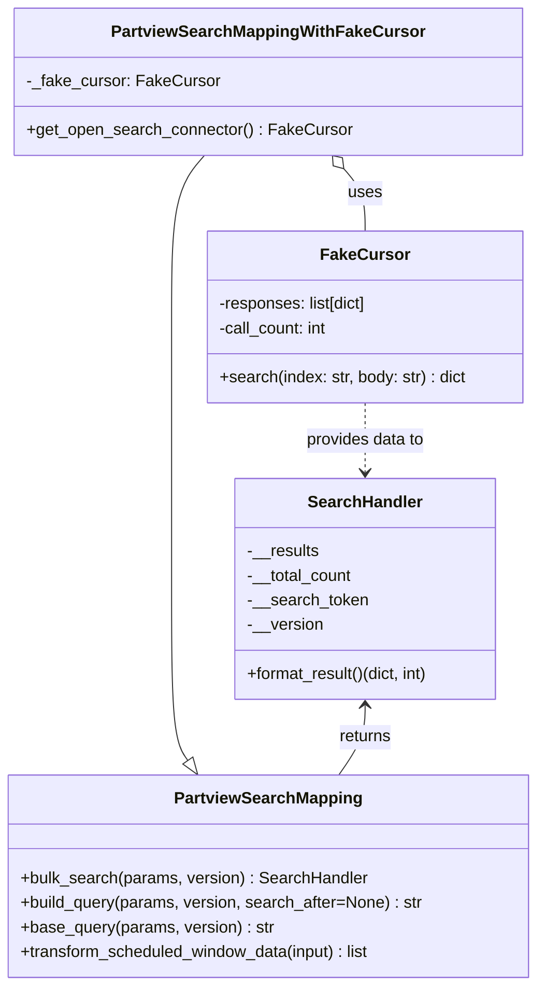
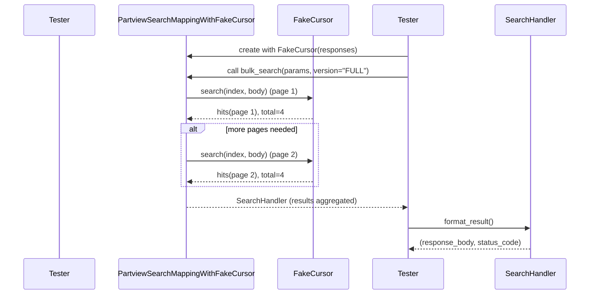

# Diagram: partview_core/partview_service/partview_service/tests/unit/persistence/open_search/test_PartviewSearchMapping.py

> Auto-generated by Obscura crawlers

## Diagram 1

### SVG

<svg id="container" width="524.46875" xmlns="http://www.w3.org/2000/svg" class="classDiagram" height="964" viewBox="0 0 524.46875 964" role="graphics-document document" aria-roledescription="class"><g><defs><marker id="container_class-aggregationStart" class="marker aggregation class" refX="18" refY="7" markerWidth="190" markerHeight="240" orient="auto"><path d="M 18,7 L9,13 L1,7 L9,1 Z"></path></marker></defs><defs><marker id="container_class-aggregationEnd" class="marker aggregation class" refX="1" refY="7" markerWidth="20" markerHeight="28" orient="auto"><path d="M 18,7 L9,13 L1,7 L9,1 Z"></path></marker></defs><defs><marker id="container_class-extensionStart" class="marker extension class" refX="18" refY="7" markerWidth="190" markerHeight="240" orient="auto"><path d="M 1,7 L18,13 V 1 Z"></path></marker></defs><defs><marker id="container_class-extensionEnd" class="marker extension class" refX="1" refY="7" markerWidth="20" markerHeight="28" orient="auto"><path d="M 1,1 V 13 L18,7 Z"></path></marker></defs><defs><marker id="container_class-compositionStart" class="marker composition class" refX="18" refY="7" markerWidth="190" markerHeight="240" orient="auto"><path d="M 18,7 L9,13 L1,7 L9,1 Z"></path></marker></defs><defs><marker id="container_class-compositionEnd" class="marker composition class" refX="1" refY="7" markerWidth="20" markerHeight="28" orient="auto"><path d="M 18,7 L9,13 L1,7 L9,1 Z"></path></marker></defs><defs><marker id="container_class-dependencyStart" class="marker dependency class" refX="6" refY="7" markerWidth="190" markerHeight="240" orient="auto"><path d="M 5,7 L9,13 L1,7 L9,1 Z"></path></marker></defs><defs><marker id="container_class-dependencyEnd" class="marker dependency class" refX="13" refY="7" markerWidth="20" markerHeight="28" orient="auto"><path d="M 18,7 L9,13 L14,7 L9,1 Z"></path></marker></defs><defs><marker id="container_class-lollipopStart" class="marker lollipop class" refX="13" refY="7" markerWidth="190" markerHeight="240" orient="auto"><circle stroke="black" fill="transparent" cx="7" cy="7" r="6"></circle></marker></defs><defs><marker id="container_class-lollipopEnd" class="marker lollipop class" refX="1" refY="7" markerWidth="190" markerHeight="240" orient="auto"><circle stroke="black" fill="transparent" cx="7" cy="7" r="6"></circle></marker></defs><g class="root"><g class="clusters"></g><g class="edgePaths"><path d="M199.797,152L194.449,158.167C189.102,164.333,178.406,176.667,173.059,203C167.711,229.333,167.711,269.667,167.711,310C167.711,350.333,167.711,390.667,167.711,435C167.711,479.333,167.711,527.667,167.711,576C167.711,624.333,167.711,672.667,170.356,700.639C173.001,728.612,178.292,736.223,180.937,740.029L183.582,743.835" id="id_PartviewSearchMappingWithFakeCursor_PartviewSearchMapping_1" class="edge-thickness-normal edge-pattern-solid relation" style=";;;" data-edge="true" data-et="edge" data-id="id_PartviewSearchMappingWithFakeCursor_PartviewSearchMapping_1" data-points="W3sieCI6MTk5Ljc5Njg3NSwieSI6MTUyfSx7IngiOjE2Ny43MTA5Mzc1LCJ5IjoxODl9LHsieCI6MTY3LjcxMDkzNzUsInkiOjMxMH0seyJ4IjoxNjcuNzEwOTM3NSwieSI6NDMxfSx7IngiOjE2Ny43MTA5Mzc1LCJ5Ijo1NzZ9LHsieCI6MTY3LjcxMDkzNzUsInkiOjcyMX0seyJ4IjoxOTMuNDI2ODcyNzAyMjA1ODgsInkiOjc1OH1d" marker-end="url(#container_class-extensionEnd)"></path><path d="M335.973,165.032L339.437,169.027C342.901,173.022,349.83,181.011,353.294,191.172C356.758,201.333,356.758,213.667,356.758,219.833L356.758,226" id="id_PartviewSearchMappingWithFakeCursor_FakeCursor_2" class="edge-thickness-normal edge-pattern-solid relation" style=";;;" data-edge="true" data-et="edge" data-id="id_PartviewSearchMappingWithFakeCursor_FakeCursor_2" data-points="W3sieCI6MzI0LjY3MTg3NSwieSI6MTUyfSx7IngiOjM1Ni43NTc4MTI1LCJ5IjoxODl9LHsieCI6MzU2Ljc1NzgxMjUsInkiOjIyNn1d" marker-start="url(#container_class-aggregationStart)"></path><path d="M356.758,690L356.758,695.167C356.758,700.333,356.758,710.667,352.472,722C348.186,733.333,339.614,745.667,335.328,751.833L331.042,758" id="id_SearchHandler_PartviewSearchMapping_3" class="edge-thickness-normal edge-pattern-solid relation" style=";;;" data-edge="true" data-et="edge" data-id="id_SearchHandler_PartviewSearchMapping_3" data-points="W3sieCI6MzU2Ljc1NzgxMjUsInkiOjY4NH0seyJ4IjozNTYuNzU3ODEyNSwieSI6NzIxfSx7IngiOjMzMS4wNDE4NzcyOTc3OTQxNCwieSI6NzU4fV0=" marker-start="url(#container_class-dependencyStart)"></path><path d="M356.758,394L356.758,400.167C356.758,406.333,356.758,418.667,356.758,430C356.758,441.333,356.758,451.667,356.758,456.833L356.758,462" id="id_FakeCursor_SearchHandler_4" class="edge-thickness-normal edge-pattern-dashed relation" style=";;;" data-edge="true" data-et="edge" data-id="id_FakeCursor_SearchHandler_4" data-points="W3sieCI6MzU2Ljc1NzgxMjUsInkiOjM5NH0seyJ4IjozNTYuNzU3ODEyNSwieSI6NDMxfSx7IngiOjM1Ni43NTc4MTI1LCJ5Ijo0Njh9XQ==" marker-end="url(#container_class-dependencyEnd)"></path></g><g class="edgeLabels"><g class="edgeLabel"><g class="label" data-id="id_PartviewSearchMappingWithFakeCursor_PartviewSearchMapping_1" transform="translate(0, 0)"><foreignObject width="0" height="0">

</foreignObject></g></g><g class="edgeLabel" transform="translate(356.7578125, 189)"><g class="label" data-id="id_PartviewSearchMappingWithFakeCursor_FakeCursor_2" transform="translate(-16.4921875, -12)"><foreignObject width="32.984375" height="24">

uses

</foreignObject></g></g><g class="edgeLabel" transform="translate(356.7578125, 721)"><g class="label" data-id="id_SearchHandler_PartviewSearchMapping_3" transform="translate(-26.265625, -12)"><foreignObject width="52.53125" height="24">

returns

</foreignObject></g></g><g class="edgeLabel" transform="translate(356.7578125, 431)"><g class="label" data-id="id_FakeCursor_SearchHandler_4" transform="translate(-59.3125, -12)"><foreignObject width="118.625" height="24">

provides data to

</foreignObject></g></g></g><g class="nodes"><g class="node default" id="classId-FakeCursor-0" transform="translate(356.7578125, 310)"><g class="basic label-container"><path d="M-154.046875 -84 L154.046875 -84 L154.046875 84 L-154.046875 84" stroke="none" stroke-width="0" fill="#ECECFF" style=""></path><path d="M-154.046875 -84 C-40.241396782365584 -84, 73.56408143526883 -84, 154.046875 -84 M-154.046875 -84 C-41.5179221116111 -84, 71.0110307767778 -84, 154.046875 -84 M154.046875 -84 C154.046875 -38.9854235729289, 154.046875 6.029152854142197, 154.046875 84 M154.046875 -84 C154.046875 -37.28083210715674, 154.046875 9.438335785686519, 154.046875 84 M154.046875 84 C54.989381757863825 84, -44.06811148427235 84, -154.046875 84 M154.046875 84 C42.63005593978589 84, -68.78676312042822 84, -154.046875 84 M-154.046875 84 C-154.046875 42.59184624988036, -154.046875 1.183692499760724, -154.046875 -84 M-154.046875 84 C-154.046875 42.4894738431194, -154.046875 0.9789476862387971, -154.046875 -84" stroke="#9370DB" stroke-width="1.3" fill="none" stroke-dasharray="0 0" style=""></path></g><g class="annotation-group text" transform="translate(0, -60)"></g><g class="label-group text" transform="translate(-40.4375, -60)"><g class="label" style="font-weight: bolder" transform="translate(0,-12)"><foreignObject width="80.875" height="24">

FakeCursor

</foreignObject></g></g><g class="members-group text" transform="translate(-142.046875, -12)"><g class="label" style="" transform="translate(0,-12)"><foreignObject width="148.734375" height="24">

-responses: list[dict]

</foreignObject></g><g class="label" style="" transform="translate(0,12)"><foreignObject width="108.8125" height="24">

-call_count: int

</foreignObject></g></g><g class="methods-group text" transform="translate(-142.046875, 60)"><g class="label" style="" transform="translate(0,-12)"><foreignObject width="243.65625" height="24">

+search(index: str, body: str) : dict

</foreignObject></g></g><g class="divider" style=""><path d="M-154.046875 -36 C-46.3128433901081 -36, 61.4211882197838 -36, 154.046875 -36 M-154.046875 -36 C-49.26106694785331 -36, 55.52474110429338 -36, 154.046875 -36" stroke="#9370DB" stroke-width="1.3" fill="none" stroke-dasharray="0 0" style=""></path></g><g class="divider" style=""><path d="M-154.046875 36 C-51.46179640622901 36, 51.123282187541975 36, 154.046875 36 M-154.046875 36 C-87.65496704539638 36, -21.26305909079275 36, 154.046875 36" stroke="#9370DB" stroke-width="1.3" fill="none" stroke-dasharray="0 0" style=""></path></g></g><g class="node default" id="classId-PartviewSearchMapping-1" transform="translate(262.234375, 857)"><g class="basic label-container"><path d="M-254.234375 -99 L254.234375 -99 L254.234375 99 L-254.234375 99" stroke="none" stroke-width="0" fill="#ECECFF" style=""></path><path d="M-254.234375 -99 C-144.23703528635815 -99, -34.23969557271627 -99, 254.234375 -99 M-254.234375 -99 C-130.74046998201797 -99, -7.24656496403594 -99, 254.234375 -99 M254.234375 -99 C254.234375 -29.883743459955213, 254.234375 39.232513080089575, 254.234375 99 M254.234375 -99 C254.234375 -19.872626741866767, 254.234375 59.254746516266465, 254.234375 99 M254.234375 99 C96.43244301645188 99, -61.36948896709623 99, -254.234375 99 M254.234375 99 C80.05381648290003 99, -94.12674203419994 99, -254.234375 99 M-254.234375 99 C-254.234375 29.075462012804877, -254.234375 -40.849075974390246, -254.234375 -99 M-254.234375 99 C-254.234375 57.85732680601141, -254.234375 16.714653612022815, -254.234375 -99" stroke="#9370DB" stroke-width="1.3" fill="none" stroke-dasharray="0 0" style=""></path></g><g class="annotation-group text" transform="translate(0, -75)"></g><g class="label-group text" transform="translate(-88.015625, -75)"><g class="label" style="font-weight: bolder" transform="translate(0,-12)"><foreignObject width="176.03125" height="24">

PartviewSearchMapping

</foreignObject></g></g><g class="members-group text" transform="translate(-242.234375, -27)"></g><g class="methods-group text" transform="translate(-242.234375, 3)"><g class="label" style="" transform="translate(0,-12)"><foreignObject width="339.6875" height="24">

+bulk_search(params, version) : SearchHandler

</foreignObject></g><g class="label" style="" transform="translate(0,12)"><foreignObject width="396.453125" height="24">

+build_query(params, version, search_after=None) : str

</foreignObject></g><g class="label" style="" transform="translate(0,36)"><foreignObject width="248.3125" height="24">

+base_query(params, version) : str

</foreignObject></g><g class="label" style="" transform="translate(0,60)"><foreignObject width="350.28125" height="24">

+transform_scheduled_window_data(input) : list

</foreignObject></g></g><g class="divider" style=""><path d="M-254.234375 -51 C-112.40319153512752 -51, 29.427991929744962 -51, 254.234375 -51 M-254.234375 -51 C-67.82408338221526 -51, 118.58620823556947 -51, 254.234375 -51" stroke="#9370DB" stroke-width="1.3" fill="none" stroke-dasharray="0 0" style=""></path></g><g class="divider" style=""><path d="M-254.234375 -27 C-138.10710729634877 -27, -21.979839592697573 -27, 254.234375 -27 M-254.234375 -27 C-104.05491264839335 -27, 46.12454970321329 -27, 254.234375 -27" stroke="#9370DB" stroke-width="1.3" fill="none" stroke-dasharray="0 0" style=""></path></g></g><g class="node default" id="classId-PartviewSearchMappingWithFakeCursor-2" transform="translate(262.234375, 80)"><g class="basic label-container"><path d="M-241.64453125 -72 L241.64453125 -72 L241.64453125 72 L-241.64453125 72" stroke="none" stroke-width="0" fill="#ECECFF" style=""></path><path d="M-241.64453125 -72 C-129.59627619472744 -72, -17.548021139454875 -72, 241.64453125 -72 M-241.64453125 -72 C-52.20761355811291 -72, 137.22930413377418 -72, 241.64453125 -72 M241.64453125 -72 C241.64453125 -25.20907898611631, 241.64453125 21.58184202776738, 241.64453125 72 M241.64453125 -72 C241.64453125 -22.199255422651184, 241.64453125 27.60148915469763, 241.64453125 72 M241.64453125 72 C99.22077317476933 72, -43.20298490046133 72, -241.64453125 72 M241.64453125 72 C62.62025666552415 72, -116.4040179189517 72, -241.64453125 72 M-241.64453125 72 C-241.64453125 26.939645984134067, -241.64453125 -18.120708031731866, -241.64453125 -72 M-241.64453125 72 C-241.64453125 26.964260894725093, -241.64453125 -18.071478210549813, -241.64453125 -72" stroke="#9370DB" stroke-width="1.3" fill="none" stroke-dasharray="0 0" style=""></path></g><g class="annotation-group text" transform="translate(0, -48)"></g><g class="label-group text" transform="translate(-145.1796875, -48)"><g class="label" style="font-weight: bolder" transform="translate(0,-12)"><foreignObject width="290.359375" height="24">

PartviewSearchMappingWithFakeCursor

</foreignObject></g></g><g class="members-group text" transform="translate(-229.64453125, 0)"><g class="label" style="" transform="translate(0,-12)"><foreignObject width="184.59375" height="24">

-_fake_cursor: FakeCursor

</foreignObject></g></g><g class="methods-group text" transform="translate(-229.64453125, 48)"><g class="label" style="" transform="translate(0,-12)"><foreignObject width="314.109375" height="24">

+get_open_search_connector() : FakeCursor

</foreignObject></g></g><g class="divider" style=""><path d="M-241.64453125 -24 C-93.36833797912061 -24, 54.90785529175878 -24, 241.64453125 -24 M-241.64453125 -24 C-125.50511485088448 -24, -9.365698451768964 -24, 241.64453125 -24" stroke="#9370DB" stroke-width="1.3" fill="none" stroke-dasharray="0 0" style=""></path></g><g class="divider" style=""><path d="M-241.64453125 24 C-76.6830812955155 24, 88.27836865896899 24, 241.64453125 24 M-241.64453125 24 C-131.3219535764016 24, -20.999375902803223 24, 241.64453125 24" stroke="#9370DB" stroke-width="1.3" fill="none" stroke-dasharray="0 0" style=""></path></g></g><g class="node default" id="classId-SearchHandler-3" transform="translate(356.7578125, 576)"><g class="basic label-container"><path d="M-130.25390625 -108 L130.25390625 -108 L130.25390625 108 L-130.25390625 108" stroke="none" stroke-width="0" fill="#ECECFF" style=""></path><path d="M-130.25390625 -108 C-64.9744473429622 -108, 0.30501156407561325 -108, 130.25390625 -108 M-130.25390625 -108 C-51.37470261726598 -108, 27.504501015468037 -108, 130.25390625 -108 M130.25390625 -108 C130.25390625 -45.07331287684779, 130.25390625 17.853374246304426, 130.25390625 108 M130.25390625 -108 C130.25390625 -38.494432271580266, 130.25390625 31.01113545683947, 130.25390625 108 M130.25390625 108 C31.966784208255135 108, -66.32033783348973 108, -130.25390625 108 M130.25390625 108 C26.833096992086197 108, -76.5877122658276 108, -130.25390625 108 M-130.25390625 108 C-130.25390625 61.661103956491765, -130.25390625 15.32220791298353, -130.25390625 -108 M-130.25390625 108 C-130.25390625 21.98201725279678, -130.25390625 -64.03596549440644, -130.25390625 -108" stroke="#9370DB" stroke-width="1.3" fill="none" stroke-dasharray="0 0" style=""></path></g><g class="annotation-group text" transform="translate(0, -84)"></g><g class="label-group text" transform="translate(-53.8046875, -84)"><g class="label" style="font-weight: bolder" transform="translate(0,-12)"><foreignObject width="107.609375" height="24">

SearchHandler

</foreignObject></g></g><g class="members-group text" transform="translate(-118.25390625, -36)"><g class="label" style="" transform="translate(0,-12)"><foreignObject width="70.796875" height="24">

-__results

</foreignObject></g><g class="label" style="" transform="translate(0,12)"><foreignObject width="104.25" height="24">

-__total_count

</foreignObject></g><g class="label" style="" transform="translate(0,36)"><foreignObject width="118.140625" height="24">

-__search_token

</foreignObject></g><g class="label" style="" transform="translate(0,60)"><foreignObject width="74.34375" height="24">

-__version

</foreignObject></g></g><g class="methods-group text" transform="translate(-118.25390625, 84)"><g class="label" style="" transform="translate(0,-12)"><foreignObject width="182.703125" height="24">

+format_result()(dict, int)

</foreignObject></g></g><g class="divider" style=""><path d="M-130.25390625 -60 C-54.83070847700442 -60, 20.592489295991157 -60, 130.25390625 -60 M-130.25390625 -60 C-38.109345354678126 -60, 54.03521554064375 -60, 130.25390625 -60" stroke="#9370DB" stroke-width="1.3" fill="none" stroke-dasharray="0 0" style=""></path></g><g class="divider" style=""><path d="M-130.25390625 60 C-54.885484106956596 60, 20.482938036086807 60, 130.25390625 60 M-130.25390625 60 C-59.71404657375109 60, 10.825813102497818 60, 130.25390625 60" stroke="#9370DB" stroke-width="1.3" fill="none" stroke-dasharray="0 0" style=""></path></g></g></g></g></g></svg>

## Diagram 2

### SVG

<svg id="container" width="1291" xmlns="http://www.w3.org/2000/svg" height="658" viewBox="-50 -10 1291 658" role="graphics-document document" aria-roledescription="sequence"><g><rect x="1041" y="572" fill="#eaeaea" stroke="#666" width="150" height="65" name="SearchHandler" rx="3" ry="3" class="actor actor-bottom"></rect><text x="1116" y="604.5" dominant-baseline="central" alignment-baseline="central" class="actor actor-box" style="text-anchor: middle; font-size: 16px; font-weight: 400;"><tspan x="1116" dy="0">SearchHandler</tspan></text></g><g><rect x="756" y="572" fill="#eaeaea" stroke="#666" width="150" height="65" name="Tester" rx="3" ry="3" class="actor actor-bottom"></rect><text x="831" y="604.5" dominant-baseline="central" alignment-baseline="central" class="actor actor-box" style="text-anchor: middle; font-size: 16px; font-weight: 400;"><tspan x="831" dy="0">Tester</tspan></text></g><g><rect x="556" y="572" fill="#eaeaea" stroke="#666" width="150" height="65" name="Cursor" rx="3" ry="3" class="actor actor-bottom"></rect><text x="631" y="604.5" dominant-baseline="central" alignment-baseline="central" class="actor actor-box" style="text-anchor: middle; font-size: 16px; font-weight: 400;"><tspan x="631" dy="0">FakeCursor</tspan></text></g><g><rect x="200" y="572" fill="#eaeaea" stroke="#666" width="306" height="65" name="Mapping" rx="3" ry="3" class="actor actor-bottom"></rect><text x="353" y="604.5" dominant-baseline="central" alignment-baseline="central" class="actor actor-box" style="text-anchor: middle; font-size: 16px; font-weight: 400;"><tspan x="353" dy="0">PartviewSearchMappingWithFakeCursor</tspan></text></g><g><rect x="0" y="572" fill="#eaeaea" stroke="#666" width="150" height="65" name="Test" rx="3" ry="3" class="actor actor-bottom"></rect><text x="75" y="604.5" dominant-baseline="central" alignment-baseline="central" class="actor actor-box" style="text-anchor: middle; font-size: 16px; font-weight: 400;"><tspan x="75" dy="0">Tester</tspan></text></g><g><line id="actor4" x1="1116" y1="65" x2="1116" y2="572" class="actor-line 200" stroke-width="0.5px" stroke="#999" name="SearchHandler"></line><g id="root-4"><rect x="1041" y="0" fill="#eaeaea" stroke="#666" width="150" height="65" name="SearchHandler" rx="3" ry="3" class="actor actor-top"></rect><text x="1116" y="32.5" dominant-baseline="central" alignment-baseline="central" class="actor actor-box" style="text-anchor: middle; font-size: 16px; font-weight: 400;"><tspan x="1116" dy="0">SearchHandler</tspan></text></g></g><g><line id="actor3" x1="831" y1="65" x2="831" y2="572" class="actor-line 200" stroke-width="0.5px" stroke="#999" name="Tester"></line><g id="root-3"><rect x="756" y="0" fill="#eaeaea" stroke="#666" width="150" height="65" name="Tester" rx="3" ry="3" class="actor actor-top"></rect><text x="831" y="32.5" dominant-baseline="central" alignment-baseline="central" class="actor actor-box" style="text-anchor: middle; font-size: 16px; font-weight: 400;"><tspan x="831" dy="0">Tester</tspan></text></g></g><g><line id="actor2" x1="631" y1="65" x2="631" y2="572" class="actor-line 200" stroke-width="0.5px" stroke="#999" name="Cursor"></line><g id="root-2"><rect x="556" y="0" fill="#eaeaea" stroke="#666" width="150" height="65" name="Cursor" rx="3" ry="3" class="actor actor-top"></rect><text x="631" y="32.5" dominant-baseline="central" alignment-baseline="central" class="actor actor-box" style="text-anchor: middle; font-size: 16px; font-weight: 400;"><tspan x="631" dy="0">FakeCursor</tspan></text></g></g><g><line id="actor1" x1="353" y1="65" x2="353" y2="572" class="actor-line 200" stroke-width="0.5px" stroke="#999" name="Mapping"></line><g id="root-1"><rect x="200" y="0" fill="#eaeaea" stroke="#666" width="306" height="65" name="Mapping" rx="3" ry="3" class="actor actor-top"></rect><text x="353" y="32.5" dominant-baseline="central" alignment-baseline="central" class="actor actor-box" style="text-anchor: middle; font-size: 16px; font-weight: 400;"><tspan x="353" dy="0">PartviewSearchMappingWithFakeCursor</tspan></text></g></g><g><line id="actor0" x1="75" y1="65" x2="75" y2="572" class="actor-line 200" stroke-width="0.5px" stroke="#999" name="Test"></line><g id="root-0"><rect x="0" y="0" fill="#eaeaea" stroke="#666" width="150" height="65" name="Test" rx="3" ry="3" class="actor actor-top"></rect><text x="75" y="32.5" dominant-baseline="central" alignment-baseline="central" class="actor actor-box" style="text-anchor: middle; font-size: 16px; font-weight: 400;"><tspan x="75" dy="0">Tester</tspan></text></g></g><g></g><defs><symbol id="computer" width="24" height="24"><path transform="scale(.5)" d="M2 2v13h20v-13h-20zm18 11h-16v-9h16v9zm-10.228 6l.466-1h3.524l.467 1h-4.457zm14.228 3h-24l2-6h2.104l-1.33 4h18.45l-1.297-4h2.073l2 6zm-5-10h-14v-7h14v7z"></path></symbol></defs><defs><symbol id="database" fill-rule="evenodd" clip-rule="evenodd"><path transform="scale(.5)" d="M12.258.001l.256.004.255.005.253.008.251.01.249.012.247.015.246.016.242.019.241.02.239.023.236.024.233.027.231.028.229.031.225.032.223.034.22.036.217.038.214.04.211.041.208.043.205.045.201.046.198.048.194.05.191.051.187.053.183.054.18.056.175.057.172.059.168.06.163.061.16.063.155.064.15.066.074.033.073.033.071.034.07.034.069.035.068.035.067.035.066.035.064.036.064.036.062.036.06.036.06.037.058.037.058.037.055.038.055.038.053.038.052.038.051.039.05.039.048.039.047.039.045.04.044.04.043.04.041.04.04.041.039.041.037.041.036.041.034.041.033.042.032.042.03.042.029.042.027.042.026.043.024.043.023.043.021.043.02.043.018.044.017.043.015.044.013.044.012.044.011.045.009.044.007.045.006.045.004.045.002.045.001.045v17l-.001.045-.002.045-.004.045-.006.045-.007.045-.009.044-.011.045-.012.044-.013.044-.015.044-.017.043-.018.044-.02.043-.021.043-.023.043-.024.043-.026.043-.027.042-.029.042-.03.042-.032.042-.033.042-.034.041-.036.041-.037.041-.039.041-.04.041-.041.04-.043.04-.044.04-.045.04-.047.039-.048.039-.05.039-.051.039-.052.038-.053.038-.055.038-.055.038-.058.037-.058.037-.06.037-.06.036-.062.036-.064.036-.064.036-.066.035-.067.035-.068.035-.069.035-.07.034-.071.034-.073.033-.074.033-.15.066-.155.064-.16.063-.163.061-.168.06-.172.059-.175.057-.18.056-.183.054-.187.053-.191.051-.194.05-.198.048-.201.046-.205.045-.208.043-.211.041-.214.04-.217.038-.22.036-.223.034-.225.032-.229.031-.231.028-.233.027-.236.024-.239.023-.241.02-.242.019-.246.016-.247.015-.249.012-.251.01-.253.008-.255.005-.256.004-.258.001-.258-.001-.256-.004-.255-.005-.253-.008-.251-.01-.249-.012-.247-.015-.245-.016-.243-.019-.241-.02-.238-.023-.236-.024-.234-.027-.231-.028-.228-.031-.226-.032-.223-.034-.22-.036-.217-.038-.214-.04-.211-.041-.208-.043-.204-.045-.201-.046-.198-.048-.195-.05-.19-.051-.187-.053-.184-.054-.179-.056-.176-.057-.172-.059-.167-.06-.164-.061-.159-.063-.155-.064-.151-.066-.074-.033-.072-.033-.072-.034-.07-.034-.069-.035-.068-.035-.067-.035-.066-.035-.064-.036-.063-.036-.062-.036-.061-.036-.06-.037-.058-.037-.057-.037-.056-.038-.055-.038-.053-.038-.052-.038-.051-.039-.049-.039-.049-.039-.046-.039-.046-.04-.044-.04-.043-.04-.041-.04-.04-.041-.039-.041-.037-.041-.036-.041-.034-.041-.033-.042-.032-.042-.03-.042-.029-.042-.027-.042-.026-.043-.024-.043-.023-.043-.021-.043-.02-.043-.018-.044-.017-.043-.015-.044-.013-.044-.012-.044-.011-.045-.009-.044-.007-.045-.006-.045-.004-.045-.002-.045-.001-.045v-17l.001-.045.002-.045.004-.045.006-.045.007-.045.009-.044.011-.045.012-.044.013-.044.015-.044.017-.043.018-.044.02-.043.021-.043.023-.043.024-.043.026-.043.027-.042.029-.042.03-.042.032-.042.033-.042.034-.041.036-.041.037-.041.039-.041.04-.041.041-.04.043-.04.044-.04.046-.04.046-.039.049-.039.049-.039.051-.039.052-.038.053-.038.055-.038.056-.038.057-.037.058-.037.06-.037.061-.036.062-.036.063-.036.064-.036.066-.035.067-.035.068-.035.069-.035.07-.034.072-.034.072-.033.074-.033.151-.066.155-.064.159-.063.164-.061.167-.06.172-.059.176-.057.179-.056.184-.054.187-.053.19-.051.195-.05.198-.048.201-.046.204-.045.208-.043.211-.041.214-.04.217-.038.22-.036.223-.034.226-.032.228-.031.231-.028.234-.027.236-.024.238-.023.241-.02.243-.019.245-.016.247-.015.249-.012.251-.01.253-.008.255-.005.256-.004.258-.001.258.001zm-9.258 20.499v.01l.001.021.003.021.004.022.005.021.006.022.007.022.009.023.01.022.011.023.012.023.013.023.015.023.016.024.017.023.018.024.019.024.021.024.022.025.023.024.024.025.052.049.056.05.061.051.066.051.07.051.075.051.079.052.084.052.088.052.092.052.097.052.102.051.105.052.11.052.114.051.119.051.123.051.127.05.131.05.135.05.139.048.144.049.147.047.152.047.155.047.16.045.163.045.167.043.171.043.176.041.178.041.183.039.187.039.19.037.194.035.197.035.202.033.204.031.209.03.212.029.216.027.219.025.222.024.226.021.23.02.233.018.236.016.24.015.243.012.246.01.249.008.253.005.256.004.259.001.26-.001.257-.004.254-.005.25-.008.247-.011.244-.012.241-.014.237-.016.233-.018.231-.021.226-.021.224-.024.22-.026.216-.027.212-.028.21-.031.205-.031.202-.034.198-.034.194-.036.191-.037.187-.039.183-.04.179-.04.175-.042.172-.043.168-.044.163-.045.16-.046.155-.046.152-.047.148-.048.143-.049.139-.049.136-.05.131-.05.126-.05.123-.051.118-.052.114-.051.11-.052.106-.052.101-.052.096-.052.092-.052.088-.053.083-.051.079-.052.074-.052.07-.051.065-.051.06-.051.056-.05.051-.05.023-.024.023-.025.021-.024.02-.024.019-.024.018-.024.017-.024.015-.023.014-.024.013-.023.012-.023.01-.023.01-.022.008-.022.006-.022.006-.022.004-.022.004-.021.001-.021.001-.021v-4.127l-.077.055-.08.053-.083.054-.085.053-.087.052-.09.052-.093.051-.095.05-.097.05-.1.049-.102.049-.105.048-.106.047-.109.047-.111.046-.114.045-.115.045-.118.044-.12.043-.122.042-.124.042-.126.041-.128.04-.13.04-.132.038-.134.038-.135.037-.138.037-.139.035-.142.035-.143.034-.144.033-.147.032-.148.031-.15.03-.151.03-.153.029-.154.027-.156.027-.158.026-.159.025-.161.024-.162.023-.163.022-.165.021-.166.02-.167.019-.169.018-.169.017-.171.016-.173.015-.173.014-.175.013-.175.012-.177.011-.178.01-.179.008-.179.008-.181.006-.182.005-.182.004-.184.003-.184.002h-.37l-.184-.002-.184-.003-.182-.004-.182-.005-.181-.006-.179-.008-.179-.008-.178-.01-.176-.011-.176-.012-.175-.013-.173-.014-.172-.015-.171-.016-.17-.017-.169-.018-.167-.019-.166-.02-.165-.021-.163-.022-.162-.023-.161-.024-.159-.025-.157-.026-.156-.027-.155-.027-.153-.029-.151-.03-.15-.03-.148-.031-.146-.032-.145-.033-.143-.034-.141-.035-.14-.035-.137-.037-.136-.037-.134-.038-.132-.038-.13-.04-.128-.04-.126-.041-.124-.042-.122-.042-.12-.044-.117-.043-.116-.045-.113-.045-.112-.046-.109-.047-.106-.047-.105-.048-.102-.049-.1-.049-.097-.05-.095-.05-.093-.052-.09-.051-.087-.052-.085-.053-.083-.054-.08-.054-.077-.054v4.127zm0-5.654v.011l.001.021.003.021.004.021.005.022.006.022.007.022.009.022.01.022.011.023.012.023.013.023.015.024.016.023.017.024.018.024.019.024.021.024.022.024.023.025.024.024.052.05.056.05.061.05.066.051.07.051.075.052.079.051.084.052.088.052.092.052.097.052.102.052.105.052.11.051.114.051.119.052.123.05.127.051.131.05.135.049.139.049.144.048.147.048.152.047.155.046.16.045.163.045.167.044.171.042.176.042.178.04.183.04.187.038.19.037.194.036.197.034.202.033.204.032.209.03.212.028.216.027.219.025.222.024.226.022.23.02.233.018.236.016.24.014.243.012.246.01.249.008.253.006.256.003.259.001.26-.001.257-.003.254-.006.25-.008.247-.01.244-.012.241-.015.237-.016.233-.018.231-.02.226-.022.224-.024.22-.025.216-.027.212-.029.21-.03.205-.032.202-.033.198-.035.194-.036.191-.037.187-.039.183-.039.179-.041.175-.042.172-.043.168-.044.163-.045.16-.045.155-.047.152-.047.148-.048.143-.048.139-.05.136-.049.131-.05.126-.051.123-.051.118-.051.114-.052.11-.052.106-.052.101-.052.096-.052.092-.052.088-.052.083-.052.079-.052.074-.051.07-.052.065-.051.06-.05.056-.051.051-.049.023-.025.023-.024.021-.025.02-.024.019-.024.018-.024.017-.024.015-.023.014-.023.013-.024.012-.022.01-.023.01-.023.008-.022.006-.022.006-.022.004-.021.004-.022.001-.021.001-.021v-4.139l-.077.054-.08.054-.083.054-.085.052-.087.053-.09.051-.093.051-.095.051-.097.05-.1.049-.102.049-.105.048-.106.047-.109.047-.111.046-.114.045-.115.044-.118.044-.12.044-.122.042-.124.042-.126.041-.128.04-.13.039-.132.039-.134.038-.135.037-.138.036-.139.036-.142.035-.143.033-.144.033-.147.033-.148.031-.15.03-.151.03-.153.028-.154.028-.156.027-.158.026-.159.025-.161.024-.162.023-.163.022-.165.021-.166.02-.167.019-.169.018-.169.017-.171.016-.173.015-.173.014-.175.013-.175.012-.177.011-.178.009-.179.009-.179.007-.181.007-.182.005-.182.004-.184.003-.184.002h-.37l-.184-.002-.184-.003-.182-.004-.182-.005-.181-.007-.179-.007-.179-.009-.178-.009-.176-.011-.176-.012-.175-.013-.173-.014-.172-.015-.171-.016-.17-.017-.169-.018-.167-.019-.166-.02-.165-.021-.163-.022-.162-.023-.161-.024-.159-.025-.157-.026-.156-.027-.155-.028-.153-.028-.151-.03-.15-.03-.148-.031-.146-.033-.145-.033-.143-.033-.141-.035-.14-.036-.137-.036-.136-.037-.134-.038-.132-.039-.13-.039-.128-.04-.126-.041-.124-.042-.122-.043-.12-.043-.117-.044-.116-.044-.113-.046-.112-.046-.109-.046-.106-.047-.105-.048-.102-.049-.1-.049-.097-.05-.095-.051-.093-.051-.09-.051-.087-.053-.085-.052-.083-.054-.08-.054-.077-.054v4.139zm0-5.666v.011l.001.02.003.022.004.021.005.022.006.021.007.022.009.023.01.022.011.023.012.023.013.023.015.023.016.024.017.024.018.023.019.024.021.025.022.024.023.024.024.025.052.05.056.05.061.05.066.051.07.051.075.052.079.051.084.052.088.052.092.052.097.052.102.052.105.051.11.052.114.051.119.051.123.051.127.05.131.05.135.05.139.049.144.048.147.048.152.047.155.046.16.045.163.045.167.043.171.043.176.042.178.04.183.04.187.038.19.037.194.036.197.034.202.033.204.032.209.03.212.028.216.027.219.025.222.024.226.021.23.02.233.018.236.017.24.014.243.012.246.01.249.008.253.006.256.003.259.001.26-.001.257-.003.254-.006.25-.008.247-.01.244-.013.241-.014.237-.016.233-.018.231-.02.226-.022.224-.024.22-.025.216-.027.212-.029.21-.03.205-.032.202-.033.198-.035.194-.036.191-.037.187-.039.183-.039.179-.041.175-.042.172-.043.168-.044.163-.045.16-.045.155-.047.152-.047.148-.048.143-.049.139-.049.136-.049.131-.051.126-.05.123-.051.118-.052.114-.051.11-.052.106-.052.101-.052.096-.052.092-.052.088-.052.083-.052.079-.052.074-.052.07-.051.065-.051.06-.051.056-.05.051-.049.023-.025.023-.025.021-.024.02-.024.019-.024.018-.024.017-.024.015-.023.014-.024.013-.023.012-.023.01-.022.01-.023.008-.022.006-.022.006-.022.004-.022.004-.021.001-.021.001-.021v-4.153l-.077.054-.08.054-.083.053-.085.053-.087.053-.09.051-.093.051-.095.051-.097.05-.1.049-.102.048-.105.048-.106.048-.109.046-.111.046-.114.046-.115.044-.118.044-.12.043-.122.043-.124.042-.126.041-.128.04-.13.039-.132.039-.134.038-.135.037-.138.036-.139.036-.142.034-.143.034-.144.033-.147.032-.148.032-.15.03-.151.03-.153.028-.154.028-.156.027-.158.026-.159.024-.161.024-.162.023-.163.023-.165.021-.166.02-.167.019-.169.018-.169.017-.171.016-.173.015-.173.014-.175.013-.175.012-.177.01-.178.01-.179.009-.179.007-.181.006-.182.006-.182.004-.184.003-.184.001-.185.001-.185-.001-.184-.001-.184-.003-.182-.004-.182-.006-.181-.006-.179-.007-.179-.009-.178-.01-.176-.01-.176-.012-.175-.013-.173-.014-.172-.015-.171-.016-.17-.017-.169-.018-.167-.019-.166-.02-.165-.021-.163-.023-.162-.023-.161-.024-.159-.024-.157-.026-.156-.027-.155-.028-.153-.028-.151-.03-.15-.03-.148-.032-.146-.032-.145-.033-.143-.034-.141-.034-.14-.036-.137-.036-.136-.037-.134-.038-.132-.039-.13-.039-.128-.041-.126-.041-.124-.041-.122-.043-.12-.043-.117-.044-.116-.044-.113-.046-.112-.046-.109-.046-.106-.048-.105-.048-.102-.048-.1-.05-.097-.049-.095-.051-.093-.051-.09-.052-.087-.052-.085-.053-.083-.053-.08-.054-.077-.054v4.153zm8.74-8.179l-.257.004-.254.005-.25.008-.247.011-.244.012-.241.014-.237.016-.233.018-.231.021-.226.022-.224.023-.22.026-.216.027-.212.028-.21.031-.205.032-.202.033-.198.034-.194.036-.191.038-.187.038-.183.04-.179.041-.175.042-.172.043-.168.043-.163.045-.16.046-.155.046-.152.048-.148.048-.143.048-.139.049-.136.05-.131.05-.126.051-.123.051-.118.051-.114.052-.11.052-.106.052-.101.052-.096.052-.092.052-.088.052-.083.052-.079.052-.074.051-.07.052-.065.051-.06.05-.056.05-.051.05-.023.025-.023.024-.021.024-.02.025-.019.024-.018.024-.017.023-.015.024-.014.023-.013.023-.012.023-.01.023-.01.022-.008.022-.006.023-.006.021-.004.022-.004.021-.001.021-.001.021.001.021.001.021.004.021.004.022.006.021.006.023.008.022.01.022.01.023.012.023.013.023.014.023.015.024.017.023.018.024.019.024.02.025.021.024.023.024.023.025.051.05.056.05.06.05.065.051.07.052.074.051.079.052.083.052.088.052.092.052.096.052.101.052.106.052.11.052.114.052.118.051.123.051.126.051.131.05.136.05.139.049.143.048.148.048.152.048.155.046.16.046.163.045.168.043.172.043.175.042.179.041.183.04.187.038.191.038.194.036.198.034.202.033.205.032.21.031.212.028.216.027.22.026.224.023.226.022.231.021.233.018.237.016.241.014.244.012.247.011.25.008.254.005.257.004.26.001.26-.001.257-.004.254-.005.25-.008.247-.011.244-.012.241-.014.237-.016.233-.018.231-.021.226-.022.224-.023.22-.026.216-.027.212-.028.21-.031.205-.032.202-.033.198-.034.194-.036.191-.038.187-.038.183-.04.179-.041.175-.042.172-.043.168-.043.163-.045.16-.046.155-.046.152-.048.148-.048.143-.048.139-.049.136-.05.131-.05.126-.051.123-.051.118-.051.114-.052.11-.052.106-.052.101-.052.096-.052.092-.052.088-.052.083-.052.079-.052.074-.051.07-.052.065-.051.06-.05.056-.05.051-.05.023-.025.023-.024.021-.024.02-.025.019-.024.018-.024.017-.023.015-.024.014-.023.013-.023.012-.023.01-.023.01-.022.008-.022.006-.023.006-.021.004-.022.004-.021.001-.021.001-.021-.001-.021-.001-.021-.004-.021-.004-.022-.006-.021-.006-.023-.008-.022-.01-.022-.01-.023-.012-.023-.013-.023-.014-.023-.015-.024-.017-.023-.018-.024-.019-.024-.02-.025-.021-.024-.023-.024-.023-.025-.051-.05-.056-.05-.06-.05-.065-.051-.07-.052-.074-.051-.079-.052-.083-.052-.088-.052-.092-.052-.096-.052-.101-.052-.106-.052-.11-.052-.114-.052-.118-.051-.123-.051-.126-.051-.131-.05-.136-.05-.139-.049-.143-.048-.148-.048-.152-.048-.155-.046-.16-.046-.163-.045-.168-.043-.172-.043-.175-.042-.179-.041-.183-.04-.187-.038-.191-.038-.194-.036-.198-.034-.202-.033-.205-.032-.21-.031-.212-.028-.216-.027-.22-.026-.224-.023-.226-.022-.231-.021-.233-.018-.237-.016-.241-.014-.244-.012-.247-.011-.25-.008-.254-.005-.257-.004-.26-.001-.26.001z"></path></symbol></defs><defs><symbol id="clock" width="24" height="24"><path transform="scale(.5)" d="M12 2c5.514 0 10 4.486 10 10s-4.486 10-10 10-10-4.486-10-10 4.486-10 10-10zm0-2c-6.627 0-12 5.373-12 12s5.373 12 12 12 12-5.373 12-12-5.373-12-12-12zm5.848 12.459c.202.038.202.333.001.372-1.907.361-6.045 1.111-6.547 1.111-.719 0-1.301-.582-1.301-1.301 0-.512.77-5.447 1.125-7.445.034-.192.312-.181.343.014l.985 6.238 5.394 1.011z"></path></symbol></defs><defs><marker id="arrowhead" refX="7.9" refY="5" markerUnits="userSpaceOnUse" markerWidth="12" markerHeight="12" orient="auto-start-reverse"><path d="M -1 0 L 10 5 L 0 10 z"></path></marker></defs><defs><marker id="crosshead" markerWidth="15" markerHeight="8" orient="auto" refX="4" refY="4.5"><path fill="none" stroke="#000000" stroke-width="1pt" d="M 1,2 L 6,7 M 6,2 L 1,7" style="stroke-dasharray: 0, 0;"></path></marker></defs><defs><marker id="filled-head" refX="15.5" refY="7" markerWidth="20" markerHeight="28" orient="auto"><path d="M 18,7 L9,13 L14,7 L9,1 Z"></path></marker></defs><defs><marker id="sequencenumber" refX="15" refY="15" markerWidth="60" markerHeight="40" orient="auto"><circle cx="15" cy="15" r="6"></circle></marker></defs><g><line x1="342" y1="267" x2="642" y2="267" class="loopLine"></line><line x1="642" y1="267" x2="642" y2="408" class="loopLine"></line><line x1="342" y1="408" x2="642" y2="408" class="loopLine"></line><line x1="342" y1="267" x2="342" y2="408" class="loopLine"></line><polygon points="342,267 392,267 392,280 383.6,287 342,287" class="labelBox"></polygon><text x="367" y="280" text-anchor="middle" dominant-baseline="middle" alignment-baseline="middle" class="labelText" style="font-size: 16px; font-weight: 400;">alt</text><text x="517" y="285" text-anchor="middle" class="loopText" style="font-size: 16px; font-weight: 400;"><tspan x="517">[more pages needed]</tspan></text></g><text x="594" y="80" text-anchor="middle" dominant-baseline="middle" alignment-baseline="middle" class="messageText" dy="1em" style="font-size: 16px; font-weight: 400;">create with FakeCursor(responses)</text><line x1="830" y1="113" x2="357" y2="113" class="messageLine0" stroke-width="2" stroke="none" marker-end="url(#arrowhead)" style="fill: none;"></line><text x="594" y="128" text-anchor="middle" dominant-baseline="middle" alignment-baseline="middle" class="messageText" dy="1em" style="font-size: 16px; font-weight: 400;">call bulk_search(params, version="FULL")</text><line x1="830" y1="161" x2="357" y2="161" class="messageLine0" stroke-width="2" stroke="none" marker-end="url(#arrowhead)" style="fill: none;"></line><text x="491" y="176" text-anchor="middle" dominant-baseline="middle" alignment-baseline="middle" class="messageText" dy="1em" style="font-size: 16px; font-weight: 400;">search(index, body) (page 1)</text><line x1="354" y1="209" x2="627" y2="209" class="messageLine0" stroke-width="2" stroke="none" marker-end="url(#arrowhead)" style="fill: none;"></line><text x="494" y="224" text-anchor="middle" dominant-baseline="middle" alignment-baseline="middle" class="messageText" dy="1em" style="font-size: 16px; font-weight: 400;">hits(page 1), total=4</text><line x1="630" y1="257" x2="357" y2="257" class="messageLine1" stroke-width="2" stroke="none" marker-end="url(#arrowhead)" style="stroke-dasharray: 3, 3; fill: none;"></line><text x="491" y="317" text-anchor="middle" dominant-baseline="middle" alignment-baseline="middle" class="messageText" dy="1em" style="font-size: 16px; font-weight: 400;">search(index, body) (page 2)</text><line x1="354" y1="350" x2="627" y2="350" class="messageLine0" stroke-width="2" stroke="none" marker-end="url(#arrowhead)" style="fill: none;"></line><text x="494" y="365" text-anchor="middle" dominant-baseline="middle" alignment-baseline="middle" class="messageText" dy="1em" style="font-size: 16px; font-weight: 400;">hits(page 2), total=4</text><line x1="630" y1="398" x2="357" y2="398" class="messageLine1" stroke-width="2" stroke="none" marker-end="url(#arrowhead)" style="stroke-dasharray: 3, 3; fill: none;"></line><text x="591" y="423" text-anchor="middle" dominant-baseline="middle" alignment-baseline="middle" class="messageText" dy="1em" style="font-size: 16px; font-weight: 400;">SearchHandler (results aggregated)</text><line x1="354" y1="456" x2="827" y2="456" class="messageLine1" stroke-width="2" stroke="none" marker-end="url(#arrowhead)" style="stroke-dasharray: 3, 3; fill: none;"></line><text x="972" y="471" text-anchor="middle" dominant-baseline="middle" alignment-baseline="middle" class="messageText" dy="1em" style="font-size: 16px; font-weight: 400;">format_result()</text><line x1="832" y1="504" x2="1112" y2="504" class="messageLine0" stroke-width="2" stroke="none" marker-end="url(#arrowhead)" style="fill: none;"></line><text x="975" y="519" text-anchor="middle" dominant-baseline="middle" alignment-baseline="middle" class="messageText" dy="1em" style="font-size: 16px; font-weight: 400;">(response_body, status_code)</text><line x1="1115" y1="552" x2="835" y2="552" class="messageLine1" stroke-width="2" stroke="none" marker-end="url(#arrowhead)" style="stroke-dasharray: 3, 3; fill: none;"></line></svg>
