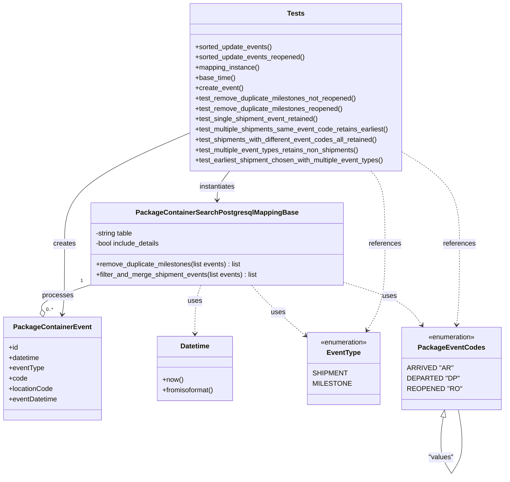

# Diagram: partview_core/partview_service/partview_service/tests/unit/persistence_adapter/postgresql/package_container/package_container_search_postgresql_mapping_base_test.py

> Auto-generated by Obscura crawlers

## Mermaid

### SVG

<svg id="container" width="1141.712890625" xmlns="http://www.w3.org/2000/svg" class="classDiagram" height="1110.25" viewBox="0 0 1141.712890625 1110.25" role="graphics-document document" aria-roledescription="class"><g><defs><marker id="container_class-aggregationStart" class="marker aggregation class" refX="18" refY="7" markerWidth="190" markerHeight="240" orient="auto"><path d="M 18,7 L9,13 L1,7 L9,1 Z"></path></marker></defs><defs><marker id="container_class-aggregationEnd" class="marker aggregation class" refX="1" refY="7" markerWidth="20" markerHeight="28" orient="auto"><path d="M 18,7 L9,13 L1,7 L9,1 Z"></path></marker></defs><defs><marker id="container_class-extensionStart" class="marker extension class" refX="18" refY="7" markerWidth="190" markerHeight="240" orient="auto"><path d="M 1,7 L18,13 V 1 Z"></path></marker></defs><defs><marker id="container_class-extensionEnd" class="marker extension class" refX="1" refY="7" markerWidth="20" markerHeight="28" orient="auto"><path d="M 1,1 V 13 L18,7 Z"></path></marker></defs><defs><marker id="container_class-compositionStart" class="marker composition class" refX="18" refY="7" markerWidth="190" markerHeight="240" orient="auto"><path d="M 18,7 L9,13 L1,7 L9,1 Z"></path></marker></defs><defs><marker id="container_class-compositionEnd" class="marker composition class" refX="1" refY="7" markerWidth="20" markerHeight="28" orient="auto"><path d="M 18,7 L9,13 L1,7 L9,1 Z"></path></marker></defs><defs><marker id="container_class-dependencyStart" class="marker dependency class" refX="6" refY="7" markerWidth="190" markerHeight="240" orient="auto"><path d="M 5,7 L9,13 L1,7 L9,1 Z"></path></marker></defs><defs><marker id="container_class-dependencyEnd" class="marker dependency class" refX="13" refY="7" markerWidth="20" markerHeight="28" orient="auto"><path d="M 18,7 L9,13 L14,7 L9,1 Z"></path></marker></defs><defs><marker id="container_class-lollipopStart" class="marker lollipop class" refX="13" refY="7" markerWidth="190" markerHeight="240" orient="auto"><circle stroke="black" fill="transparent" cx="7" cy="7" r="6"></circle></marker></defs><defs><marker id="container_class-lollipopEnd" class="marker lollipop class" refX="1" refY="7" markerWidth="190" markerHeight="240" orient="auto"><circle stroke="black" fill="transparent" cx="7" cy="7" r="6"></circle></marker></defs><g class="root"><g class="clusters"></g><g class="edgePaths"><path d="M208.973,662.957L189.479,669.298C169.986,675.638,130.999,688.319,112.098,697.996C93.197,707.672,94.383,714.344,94.975,717.68L95.568,721.016" id="id_PackageContainerSearchPostgresqlMappingBase_PackageContainerEvent_1" class="edge-thickness-normal edge-pattern-solid relation" style=";;;" data-edge="true" data-et="edge" data-id="id_PackageContainerSearchPostgresqlMappingBase_PackageContainerEvent_1" data-points="W3sieCI6MjA4Ljk3MjY1NjI1LCJ5Ijo2NjIuOTU3MTY0MjgzMTg5NX0seyJ4Ijo5Mi4wMTE3MTg3NSwieSI6NzAxfSx7IngiOjk4LjU4NTU4OTE3MTk3NDUyLCJ5Ijo3Mzh9XQ==" marker-end="url(#container_class-aggregationEnd)"></path><path d="M580.242,664L585.338,670.167C590.434,676.333,600.625,688.667,622.048,708.889C643.472,729.11,676.127,757.221,692.455,771.276L708.783,785.331" id="id_PackageContainerSearchPostgresqlMappingBase_EventType_2" class="edge-thickness-normal edge-pattern-dashed relation" style=";;;" data-edge="true" data-et="edge" data-id="id_PackageContainerSearchPostgresqlMappingBase_EventType_2" data-points="W3sieCI6NTgwLjI0MjA3MDAxODc5NywieSI6NjY0fSx7IngiOjYxMC44MTY0MDYyNSwieSI6NzAxfSx7IngiOjcxMy4zMzAwNzgxMjUsInkiOjc4OS4yNDU1NjM4NzI3MzY0fV0=" marker-end="url(#container_class-dependencyEnd)"></path><path d="M792.855,658.693L815.553,665.744C838.251,672.795,883.647,686.898,912.244,703.27C940.84,719.643,952.638,738.287,958.537,747.608L964.435,756.93" id="id_PackageContainerSearchPostgresqlMappingBase_PackageEventCodes_3" class="edge-thickness-normal edge-pattern-dashed relation" style=";;;" data-edge="true" data-et="edge" data-id="id_PackageContainerSearchPostgresqlMappingBase_PackageEventCodes_3" data-points="W3sieCI6NzkyLjg1NTQ2ODc1LCJ5Ijo2NTguNjkyNzk0NzczNzcwM30seyJ4Ijo5MjkuMDQyOTY4NzUsInkiOjcwMX0seyJ4Ijo5NjcuNjQzNzcyMzkyNTE1OSwieSI6NzYyfV0=" marker-end="url(#container_class-dependencyEnd)"></path><path d="M464.364,664L462.016,670.167C459.669,676.333,454.973,688.667,452.625,707.5C450.277,726.333,450.277,751.667,450.277,764.333L450.277,777" id="id_PackageContainerSearchPostgresqlMappingBase_Datetime_4" class="edge-thickness-normal edge-pattern-dashed relation" style=";;;" data-edge="true" data-et="edge" data-id="id_PackageContainerSearchPostgresqlMappingBase_Datetime_4" data-points="W3sieCI6NDY0LjM2NDI1MDQ2OTkyNDgsInkiOjY2NH0seyJ4Ijo0NTAuMjc3MzQzNzUsInkiOjcwMX0seyJ4Ijo0NTAuMjc3MzQzNzUsInkiOjc4M31d" marker-end="url(#container_class-dependencyEnd)"></path><path d="M530.001,398L525.153,404.167C520.306,410.333,510.61,422.667,505.762,434C500.914,445.333,500.914,455.667,500.914,460.833L500.914,466" id="id_Tests_PackageContainerSearchPostgresqlMappingBase_5" class="edge-thickness-normal edge-pattern-solid relation" style=";;;" data-edge="true" data-et="edge" data-id="id_Tests_PackageContainerSearchPostgresqlMappingBase_5" data-points="W3sieCI6NTMwLjAwMTI4ODA1MjI2MjksInkiOjM5OH0seyJ4Ijo1MDAuOTE0MDYyNSwieSI6NDM1fSx7IngiOjUwMC45MTQwNjI1LCJ5Ijo0NzJ9XQ==" marker-end="url(#container_class-dependencyEnd)"></path><path d="M433.381,311.275L385.784,331.896C338.188,352.517,242.994,393.758,195.397,436.546C147.801,479.333,147.801,523.667,147.801,568C147.801,612.333,147.801,656.667,146.88,684.015C145.959,711.364,144.118,721.728,143.197,726.91L142.277,732.093" id="id_Tests_PackageContainerEvent_6" class="edge-thickness-normal edge-pattern-solid relation" style=";;;" data-edge="true" data-et="edge" data-id="id_Tests_PackageContainerEvent_6" data-points="W3sieCI6NDMzLjM4MDg1OTM3NSwieSI6MzExLjI3NDg0NjM1NzI1MzZ9LHsieCI6MTQ3LjgwMDc4MTI1LCJ5Ijo0MzV9LHsieCI6MTQ3LjgwMDc4MTI1LCJ5Ijo1Njh9LHsieCI6MTQ3LjgwMDc4MTI1LCJ5Ijo3MDF9LHsieCI6MTQxLjIyNjkxMDgyODAyNTQ3LCJ5Ijo3Mzh9XQ==" marker-end="url(#container_class-dependencyEnd)"></path><path d="M849.651,398L854.911,404.167C860.172,410.333,870.693,422.667,875.954,451C881.215,479.333,881.215,523.667,881.215,568C881.215,612.333,881.215,656.667,874.883,690.128C868.552,723.589,855.888,746.178,849.557,757.472L843.225,768.766" id="id_Tests_EventType_7" class="edge-thickness-normal edge-pattern-dashed relation" style=";;;" data-edge="true" data-et="edge" data-id="id_Tests_EventType_7" data-points="W3sieCI6ODQ5LjY1MDY1MTYwMjkwOTQsInkiOjM5OH0seyJ4Ijo4ODEuMjE0ODQzNzUsInkiOjQzNX0seyJ4Ijo4ODEuMjE0ODQzNzUsInkiOjU2OH0seyJ4Ijo4ODEuMjE0ODQzNzUsInkiOjcwMX0seyJ4Ijo4NDAuMjkxMjg5MzExMzA1NywieSI6Nzc0fV0=" marker-end="url(#container_class-dependencyEnd)"></path><path d="M933.217,362.578L952.12,374.648C971.024,386.719,1008.831,410.859,1027.735,445.096C1046.639,479.333,1046.639,523.667,1046.639,568C1046.639,612.333,1046.639,656.667,1045.573,688.007C1044.506,719.347,1042.374,737.693,1041.308,746.867L1040.242,756.04" id="id_Tests_PackageEventCodes_8" class="edge-thickness-normal edge-pattern-dashed relation" style=";;;" data-edge="true" data-et="edge" data-id="id_Tests_PackageEventCodes_8" data-points="W3sieCI6OTMzLjIxNjc5Njg3NSwieSI6MzYyLjU3Nzc4ODUyODczMTk2fSx7IngiOjEwNDYuNjM4NjcxODc1LCJ5Ijo0MzV9LHsieCI6MTA0Ni42Mzg2NzE4NzUsInkiOjU2OH0seyJ4IjoxMDQ2LjYzODY3MTg3NSwieSI6NzAxfSx7IngiOjEwMzkuNTQ5NDI1MjU4NzU4LCJ5Ijo3NjJ9XQ==" marker-end="url(#container_class-dependencyEnd)"></path><path d="M1009.125,971.005L1008.216,976.337C1007.307,981.67,1005.488,992.335,1004.579,1001.834C1003.67,1011.333,1003.67,1019.667,1003.67,1023.833L1003.67,1028" id="PackageEventCodes-cyclic-special-1" class="edge-thickness-normal edge-pattern-solid relation" style=";;;" data-edge="true" data-et="edge" data-id="PackageEventCodes-cyclic-special-1" data-points="W3sieCI6MTAxMi4wMjQ0NzQ2NzY3MjQxLCJ5Ijo5NTR9LHsieCI6MTAwMy42Njk5MjE4NzUsInkiOjEwMDN9LHsieCI6MTAwMy42Njk5MjE4NzUsInkiOjEwMjh9XQ==" marker-start="url(#container_class-extensionStart)"></path><path d="M1003.67,1028.1L1003.67,1034.267C1003.67,1040.433,1003.67,1052.767,1007.785,1065.1C1011.9,1077.433,1020.129,1089.767,1024.244,1095.933L1028.359,1102.1" id="PackageEventCodes-cyclic-special-mid" class="edge-thickness-normal edge-pattern-solid relation" style=";;;" data-edge="true" data-et="edge" data-id="PackageEventCodes-cyclic-special-mid" data-points="W3sieCI6MTAwMy42Njk5MjE4NzUsInkiOjEwMjguMTAwMDAwMDAxNDkwMX0seyJ4IjoxMDAzLjY2OTkyMTg3NSwieSI6MTA2NS4xMDAwMDAwMDE0OTAxfSx7IngiOjEwMjguMzU5MjE0MjE1OTM0MSwieSI6MTEwMi4xMDAwMDAwMDE0OTAxfV0="></path><path d="M1028.426,1102.1L1032.541,1095.933C1036.656,1089.767,1044.885,1077.433,1049,1065.092C1053.115,1052.75,1053.115,1040.4,1053.115,1030.05C1053.115,1019.7,1053.115,1011.35,1051.723,999.008C1050.33,986.667,1047.546,970.333,1046.153,962.167L1044.761,954" id="PackageEventCodes-cyclic-special-2" class="edge-thickness-normal edge-pattern-solid relation" style=";;;" data-edge="true" data-et="edge" data-id="PackageEventCodes-cyclic-special-2" data-points="W3sieCI6MTAyOC40MjU5NDIwMzQwNjU5LCJ5IjoxMTAyLjEwMDAwMDAwMTQ5MDF9LHsieCI6MTA1My4xMTUyMzQzNzUsInkiOjEwNjUuMTAwMDAwMDAxNDkwMX0seyJ4IjoxMDUzLjExNTIzNDM3NSwieSI6MTAyOC4wNTAwMDAwMDA3NDV9LHsieCI6MTA1My4xMTUyMzQzNzUsInkiOjEwMDN9LHsieCI6MTA0NC43NjA2ODE1NzMyNzU5LCJ5Ijo5NTR9XQ=="></path></g><g class="edgeLabels"><g class="edgeLabel" transform="translate(132.62389, 687.79044)"><g class="label" data-id="id_PackageContainerSearchPostgresqlMappingBase_PackageContainerEvent_1" transform="translate(-35.7890625, -12)"><foreignObject width="71.578125" height="24">

processes

</foreignObject></g></g><g class="edgeLabel" transform="translate(643.88498, 729.46601)"><g class="label" data-id="id_PackageContainerSearchPostgresqlMappingBase_EventType_2" transform="translate(-16.4921875, -12)"><foreignObject width="32.984375" height="24">

uses

</foreignObject></g></g><g class="edgeLabel" transform="translate(895.418, 690.55427)"><g class="label" data-id="id_PackageContainerSearchPostgresqlMappingBase_PackageEventCodes_3" transform="translate(-16.4921875, -12)"><foreignObject width="32.984375" height="24">

uses

</foreignObject></g></g><g class="edgeLabel" transform="translate(450.27734375, 701)"><g class="label" data-id="id_PackageContainerSearchPostgresqlMappingBase_Datetime_4" transform="translate(-16.4921875, -12)"><foreignObject width="32.984375" height="24">

uses

</foreignObject></g></g><g class="edgeLabel" transform="translate(500.9140625, 435)"><g class="label" data-id="id_Tests_PackageContainerSearchPostgresqlMappingBase_5" transform="translate(-42.9140625, -12)"><foreignObject width="85.828125" height="24">

instantiates

</foreignObject></g></g><g class="edgeLabel" transform="translate(147.80078125, 568)"><g class="label" data-id="id_Tests_PackageContainerEvent_6" transform="translate(-26.171875, -12)"><foreignObject width="52.34375" height="24">

creates

</foreignObject></g></g><g class="edgeLabel" transform="translate(881.21484375, 568)"><g class="label" data-id="id_Tests_EventType_7" transform="translate(-37.828125, -12)"><foreignObject width="75.65625" height="24">

references

</foreignObject></g></g><g class="edgeLabel" transform="translate(1046.638671875, 568)"><g class="label" data-id="id_Tests_PackageEventCodes_8" transform="translate(-37.828125, -12)"><foreignObject width="75.65625" height="24">

references

</foreignObject></g></g><g class="edgeLabel"><g class="label" data-id="PackageEventCodes-cyclic-special-1" transform="translate(0, 0)"><foreignObject width="0" height="0">

</foreignObject></g></g><g class="edgeLabel" transform="translate(1003.669921875, 1065.1000000014901)"><g class="label" data-id="PackageEventCodes-cyclic-special-mid" transform="translate(-29.4453125, -12)"><foreignObject width="58.890625" height="24">

"values"

</foreignObject></g></g><g class="edgeLabel"><g class="label" data-id="PackageEventCodes-cyclic-special-2" transform="translate(0, 0)"><foreignObject width="0" height="0">

</foreignObject></g></g><g class="edgeTerminals" transform="translate(187.69118103043792, 654.1056805028086)"><g class="inner" transform="translate(0, 0)"><foreignObject style="width: 9px; height: 12px;">
1
</foreignObject></g></g><g class="edgeTerminals" transform="translate(105.29297582643763, 713.1458564361373)"><g class="inner" transform="translate(0, 0)"></g><foreignObject style="width: 36px; height: 12px;">
0..*
</foreignObject></g></g><g class="nodes"><g class="node default" id="classId-PackageContainerSearchPostgresqlMappingBase-0" transform="translate(500.9140625, 568)"><g class="basic label-container"><path d="M-291.94140625 -96 L291.94140625 -96 L291.94140625 96 L-291.94140625 96" stroke="none" stroke-width="0" fill="#ECECFF" style=""></path><path d="M-291.94140625 -96 C-91.80684407265915 -96, 108.32771810468171 -96, 291.94140625 -96 M-291.94140625 -96 C-155.12688878618067 -96, -18.312371322361344 -96, 291.94140625 -96 M291.94140625 -96 C291.94140625 -50.01602842054859, 291.94140625 -4.032056841097173, 291.94140625 96 M291.94140625 -96 C291.94140625 -35.38115138276972, 291.94140625 25.237697234460555, 291.94140625 96 M291.94140625 96 C61.13303815723563 96, -169.67532993552874 96, -291.94140625 96 M291.94140625 96 C146.89190142338254 96, 1.8423965967650702 96, -291.94140625 96 M-291.94140625 96 C-291.94140625 50.749712924905786, -291.94140625 5.499425849811573, -291.94140625 -96 M-291.94140625 96 C-291.94140625 31.427406637203944, -291.94140625 -33.14518672559211, -291.94140625 -96" stroke="#9370DB" stroke-width="1.3" fill="none" stroke-dasharray="0 0" style=""></path></g><g class="annotation-group text" transform="translate(0, -72)"></g><g class="label-group text" transform="translate(-178.0859375, -72)"><g class="label" style="font-weight: bolder" transform="translate(0,-12)"><foreignObject width="356.171875" height="24">

PackageContainerSearchPostgresqlMappingBase

</foreignObject></g></g><g class="members-group text" transform="translate(-279.94140625, -24)"><g class="label" style="" transform="translate(0,-12)"><foreignObject width="89.53125" height="24">

-string table

</foreignObject></g><g class="label" style="" transform="translate(0,12)"><foreignObject width="154.40625" height="24">

-bool include_details

</foreignObject></g></g><g class="methods-group text" transform="translate(-279.94140625, 48)"><g class="label" style="" transform="translate(0,-12)"><foreignObject width="344.75" height="24">

+remove_duplicate_milestones(list events) : list

</foreignObject></g><g class="label" style="" transform="translate(0,12)"><foreignObject width="381.796875" height="24">

+filter_and_merge_shipment_events(list events) : list

</foreignObject></g></g><g class="divider" style=""><path d="M-291.94140625 -48 C-149.90012853626683 -48, -7.858850822533668 -48, 291.94140625 -48 M-291.94140625 -48 C-128.32963641876896 -48, 35.28213341246209 -48, 291.94140625 -48" stroke="#9370DB" stroke-width="1.3" fill="none" stroke-dasharray="0 0" style=""></path></g><g class="divider" style=""><path d="M-291.94140625 24 C-168.09774578117026 24, -44.25408531234049 24, 291.94140625 24 M-291.94140625 24 C-125.79732681690362 24, 40.34675261619276 24, 291.94140625 24" stroke="#9370DB" stroke-width="1.3" fill="none" stroke-dasharray="0 0" style=""></path></g></g><g class="node default" id="classId-PackageContainerEvent-1" transform="translate(119.90625, 858)"><g class="basic label-container"><path d="M-111.90625 -120 L111.90625 -120 L111.90625 120 L-111.90625 120" stroke="none" stroke-width="0" fill="#ECECFF" style=""></path><path d="M-111.90625 -120 C-55.24838502838937 -120, 1.4094799432212568 -120, 111.90625 -120 M-111.90625 -120 C-33.64950037972797 -120, 44.607249240544064 -120, 111.90625 -120 M111.90625 -120 C111.90625 -49.62675042281944, 111.90625 20.746499154361118, 111.90625 120 M111.90625 -120 C111.90625 -63.52717433958807, 111.90625 -7.054348679176144, 111.90625 120 M111.90625 120 C24.001624571183328 120, -63.903000857633344 120, -111.90625 120 M111.90625 120 C32.786512479902854 120, -46.33322504019429 120, -111.90625 120 M-111.90625 120 C-111.90625 38.46212086191217, -111.90625 -43.07575827617566, -111.90625 -120 M-111.90625 120 C-111.90625 55.923741759521235, -111.90625 -8.15251648095753, -111.90625 -120" stroke="#9370DB" stroke-width="1.3" fill="none" stroke-dasharray="0 0" style=""></path></g><g class="annotation-group text" transform="translate(0, -96)"></g><g class="label-group text" transform="translate(-85.65625, -96)"><g class="label" style="font-weight: bolder" transform="translate(0,-12)"><foreignObject width="171.3125" height="24">

PackageContainerEvent

</foreignObject></g></g><g class="members-group text" transform="translate(-99.90625, -48)"><g class="label" style="" transform="translate(0,-12)"><foreignObject width="22.078125" height="24">

+id

</foreignObject></g><g class="label" style="" transform="translate(0,12)"><foreignObject width="73.234375" height="24">

+datetime

</foreignObject></g><g class="label" style="" transform="translate(0,36)"><foreignObject width="82.0625" height="24">

+eventType

</foreignObject></g><g class="label" style="" transform="translate(0,60)"><foreignObject width="42.953125" height="24">

+code

</foreignObject></g><g class="label" style="" transform="translate(0,84)"><foreignObject width="103.421875" height="24">

+locationCode

</foreignObject></g><g class="label" style="" transform="translate(0,108)"><foreignObject width="114.15625" height="24">

+eventDatetime

</foreignObject></g></g><g class="methods-group text" transform="translate(-99.90625, 120)"></g><g class="divider" style=""><path d="M-111.90625 -72 C-59.22333721109879 -72, -6.5404244221975745 -72, 111.90625 -72 M-111.90625 -72 C-59.55352747727978 -72, -7.200804954559558 -72, 111.90625 -72" stroke="#9370DB" stroke-width="1.3" fill="none" stroke-dasharray="0 0" style=""></path></g><g class="divider" style=""><path d="M-111.90625 96 C-35.167896934150164 96, 41.57045613169967 96, 111.90625 96 M-111.90625 96 C-56.966512062954806 96, -2.0267741259096113 96, 111.90625 96" stroke="#9370DB" stroke-width="1.3" fill="none" stroke-dasharray="0 0" style=""></path></g></g><g class="node default" id="classId-Datetime-2" transform="translate(450.27734375, 858)"><g class="basic label-container"><path d="M-89.93359375 -75 L89.93359375 -75 L89.93359375 75 L-89.93359375 75" stroke="none" stroke-width="0" fill="#ECECFF" style=""></path><path d="M-89.93359375 -75 C-20.360535488329063 -75, 49.212522773341874 -75, 89.93359375 -75 M-89.93359375 -75 C-30.597757546808836 -75, 28.738078656382328 -75, 89.93359375 -75 M89.93359375 -75 C89.93359375 -44.41356696671539, 89.93359375 -13.827133933430794, 89.93359375 75 M89.93359375 -75 C89.93359375 -44.649631580821186, 89.93359375 -14.299263161642372, 89.93359375 75 M89.93359375 75 C41.23486464346167 75, -7.463864463076661 75, -89.93359375 75 M89.93359375 75 C48.054240459904584 75, 6.174887169809168 75, -89.93359375 75 M-89.93359375 75 C-89.93359375 26.84673793280914, -89.93359375 -21.306524134381718, -89.93359375 -75 M-89.93359375 75 C-89.93359375 42.43967219222389, -89.93359375 9.879344384447776, -89.93359375 -75" stroke="#9370DB" stroke-width="1.3" fill="none" stroke-dasharray="0 0" style=""></path></g><g class="annotation-group text" transform="translate(0, -51)"></g><g class="label-group text" transform="translate(-33.3984375, -51)"><g class="label" style="font-weight: bolder" transform="translate(0,-12)"><foreignObject width="66.796875" height="24">

Datetime

</foreignObject></g></g><g class="members-group text" transform="translate(-77.93359375, -3)"></g><g class="methods-group text" transform="translate(-77.93359375, 27)"><g class="label" style="" transform="translate(0,-12)"><foreignObject width="48.546875" height="24">

+now()

</foreignObject></g><g class="label" style="" transform="translate(0,12)"><foreignObject width="122.46875" height="24">

+fromisoformat()

</foreignObject></g></g><g class="divider" style=""><path d="M-89.93359375 -27 C-39.191314909619834 -27, 11.550963930760332 -27, 89.93359375 -27 M-89.93359375 -27 C-32.09808583741338 -27, 25.737422075173242 -27, 89.93359375 -27" stroke="#9370DB" stroke-width="1.3" fill="none" stroke-dasharray="0 0" style=""></path></g><g class="divider" style=""><path d="M-89.93359375 -3 C-25.148826710348104 -3, 39.63594032930379 -3, 89.93359375 -3 M-89.93359375 -3 C-25.149419236310592 -3, 39.634755277378815 -3, 89.93359375 -3" stroke="#9370DB" stroke-width="1.3" fill="none" stroke-dasharray="0 0" style=""></path></g></g><g class="node default" id="classId-EventType-3" transform="translate(793.201171875, 858)"><g class="basic label-container"><path d="M-79.87109375 -84 L79.87109375 -84 L79.87109375 84 L-79.87109375 84" stroke="none" stroke-width="0" fill="#ECECFF" style=""></path><path d="M-79.87109375 -84 C-23.52529755015938 -84, 32.82049864968124 -84, 79.87109375 -84 M-79.87109375 -84 C-21.228604843211706 -84, 37.41388406357659 -84, 79.87109375 -84 M79.87109375 -84 C79.87109375 -38.72250437872557, 79.87109375 6.554991242548866, 79.87109375 84 M79.87109375 -84 C79.87109375 -22.264234651231227, 79.87109375 39.471530697537546, 79.87109375 84 M79.87109375 84 C23.002942236761427 84, -33.865209276477145 84, -79.87109375 84 M79.87109375 84 C40.031686001953524 84, 0.19227825390704822 84, -79.87109375 84 M-79.87109375 84 C-79.87109375 23.781760503284538, -79.87109375 -36.436478993430924, -79.87109375 -84 M-79.87109375 84 C-79.87109375 44.66530817429542, -79.87109375 5.330616348590837, -79.87109375 -84" stroke="#9370DB" stroke-width="1.3" fill="none" stroke-dasharray="0 0" style=""></path></g><g class="annotation-group text" transform="translate(-55.5546875, -60)"><g class="label" style="" transform="translate(0,-12)"><foreignObject width="111.109375" height="24">

«enumeration»

</foreignObject></g></g><g class="label-group text" transform="translate(-37.546875, -36)"><g class="label" style="font-weight: bolder" transform="translate(0,-12)"><foreignObject width="75.09375" height="24">

EventType

</foreignObject></g></g><g class="members-group text" transform="translate(-67.87109375, 12)"><g class="label" style="" transform="translate(0,-12)"><foreignObject width="73.359375" height="24">

SHIPMENT

</foreignObject></g><g class="label" style="" transform="translate(0,12)"><foreignObject width="80.1875" height="24">

MILESTONE

</foreignObject></g></g><g class="methods-group text" transform="translate(-67.87109375, 84)"></g><g class="divider" style=""><path d="M-79.87109375 -12 C-31.449009592839772 -12, 16.973074564320456 -12, 79.87109375 -12 M-79.87109375 -12 C-20.77334103368493 -12, 38.32441168263014 -12, 79.87109375 -12" stroke="#9370DB" stroke-width="1.3" fill="none" stroke-dasharray="0 0" style=""></path></g><g class="divider" style=""><path d="M-79.87109375 60 C-37.52684931971037 60, 4.817395110579255 60, 79.87109375 60 M-79.87109375 60 C-29.537467530566147 60, 20.796158688867706 60, 79.87109375 60" stroke="#9370DB" stroke-width="1.3" fill="none" stroke-dasharray="0 0" style=""></path></g></g><g class="node default" id="classId-PackageEventCodes-4" transform="translate(1028.392578125, 858)"><g class="basic label-container"><path d="M-105.3203125 -96 L105.3203125 -96 L105.3203125 96 L-105.3203125 96" stroke="none" stroke-width="0" fill="#ECECFF" style=""></path><path d="M-105.3203125 -96 C-59.39738138024769 -96, -13.474450260495374 -96, 105.3203125 -96 M-105.3203125 -96 C-57.99947716516986 -96, -10.678641830339714 -96, 105.3203125 -96 M105.3203125 -96 C105.3203125 -45.33427105392809, 105.3203125 5.331457892143817, 105.3203125 96 M105.3203125 -96 C105.3203125 -41.4492927496112, 105.3203125 13.101414500777594, 105.3203125 96 M105.3203125 96 C23.836568829997873 96, -57.647174840004254 96, -105.3203125 96 M105.3203125 96 C38.53348961385083 96, -28.253333272298335 96, -105.3203125 96 M-105.3203125 96 C-105.3203125 53.809711380533095, -105.3203125 11.61942276106619, -105.3203125 -96 M-105.3203125 96 C-105.3203125 44.022228063200856, -105.3203125 -7.9555438735982875, -105.3203125 -96" stroke="#9370DB" stroke-width="1.3" fill="none" stroke-dasharray="0 0" style=""></path></g><g class="annotation-group text" transform="translate(-55.5546875, -72)"><g class="label" style="" transform="translate(0,-12)"><foreignObject width="111.109375" height="24">

«enumeration»

</foreignObject></g></g><g class="label-group text" transform="translate(-72.25, -48)"><g class="label" style="font-weight: bolder" transform="translate(0,-12)"><foreignObject width="144.5" height="24">

PackageEventCodes

</foreignObject></g></g><g class="members-group text" transform="translate(-93.3203125, 0)"><g class="label" style="" transform="translate(0,-12)"><foreignObject width="96.390625" height="24">

ARRIVED "AR"

</foreignObject></g><g class="label" style="" transform="translate(0,12)"><foreignObject width="109.484375" height="24">

DEPARTED "DP"

</foreignObject></g><g class="label" style="" transform="translate(0,36)"><foreignObject width="114.390625" height="24">

REOPENED "RO"

</foreignObject></g></g><g class="methods-group text" transform="translate(-93.3203125, 96)"></g><g class="divider" style=""><path d="M-105.3203125 -24 C-41.3150053205955 -24, 22.690301858808994 -24, 105.3203125 -24 M-105.3203125 -24 C-46.15737918638883 -24, 13.00555412722234 -24, 105.3203125 -24" stroke="#9370DB" stroke-width="1.3" fill="none" stroke-dasharray="0 0" style=""></path></g><g class="divider" style=""><path d="M-105.3203125 72 C-41.454074004352364 72, 22.41216449129527 72, 105.3203125 72 M-105.3203125 72 C-59.24279005664698 72, -13.165267613293963 72, 105.3203125 72" stroke="#9370DB" stroke-width="1.3" fill="none" stroke-dasharray="0 0" style=""></path></g></g><g class="node default" id="classId-Tests-5" transform="translate(683.298828125, 203)"><g class="basic label-container"><path d="M-249.91796875 -195 L249.91796875 -195 L249.91796875 195 L-249.91796875 195" stroke="none" stroke-width="0" fill="#ECECFF" style=""></path><path d="M-249.91796875 -195 C-140.84860766894792 -195, -31.77924658789587 -195, 249.91796875 -195 M-249.91796875 -195 C-101.59020867577814 -195, 46.73755139844371 -195, 249.91796875 -195 M249.91796875 -195 C249.91796875 -45.03620604369806, 249.91796875 104.92758791260388, 249.91796875 195 M249.91796875 -195 C249.91796875 -63.16984806983908, 249.91796875 68.66030386032185, 249.91796875 195 M249.91796875 195 C91.69731144316833 195, -66.52334586366334 195, -249.91796875 195 M249.91796875 195 C148.37209505802798 195, 46.82622136605593 195, -249.91796875 195 M-249.91796875 195 C-249.91796875 77.21702596989596, -249.91796875 -40.565948060208086, -249.91796875 -195 M-249.91796875 195 C-249.91796875 61.42671499569093, -249.91796875 -72.14657000861814, -249.91796875 -195" stroke="#9370DB" stroke-width="1.3" fill="none" stroke-dasharray="0 0" style=""></path></g><g class="annotation-group text" transform="translate(0, -171)"></g><g class="label-group text" transform="translate(-19.1171875, -171)"><g class="label" style="font-weight: bolder" transform="translate(0,-12)"><foreignObject width="38.234375" height="24">

Tests

</foreignObject></g></g><g class="members-group text" transform="translate(-237.91796875, -123)"></g><g class="methods-group text" transform="translate(-237.91796875, -93)"><g class="label" style="" transform="translate(0,-12)"><foreignObject width="180.015625" height="24">

+sorted_update_events()

</foreignObject></g><g class="label" style="" transform="translate(0,12)"><foreignObject width="257.65625" height="24">

+sorted_update_events_reopened()

</foreignObject></g><g class="label" style="" transform="translate(0,36)"><foreignObject width="151.53125" height="24">

+mapping_instance()

</foreignObject></g><g class="label" style="" transform="translate(0,60)"><foreignObject width="92.84375" height="24">

+base_time()

</foreignObject></g><g class="label" style="" transform="translate(0,84)"><foreignObject width="111.234375" height="24">

+create_event()

</foreignObject></g><g class="label" style="" transform="translate(0,108)"><foreignObject width="381.6875" height="24">

+test_remove_duplicate_milestones_not_reopened()

</foreignObject></g><g class="label" style="" transform="translate(0,132)"><foreignObject width="348.875" height="24">

+test_remove_duplicate_milestones_reopened()

</foreignObject></g><g class="label" style="" transform="translate(0,156)"><foreignObject width="291.171875" height="24">

+test_single_shipment_event_retained()

</foreignObject></g><g class="label" style="" transform="translate(0,180)"><foreignObject width="456.71875" height="24">

+test_multiple_shipments_same_event_code_retains_earliest()

</foreignObject></g><g class="label" style="" transform="translate(0,204)"><foreignObject width="433.421875" height="24">

+test_shipments_with_different_event_codes_all_retained()

</foreignObject></g><g class="label" style="" transform="translate(0,228)"><foreignObject width="388.703125" height="24">

+test_multiple_event_types_retains_non_shipments()

</foreignObject></g><g class="label" style="" transform="translate(0,252)"><foreignObject width="448.671875" height="24">

+test_earliest_shipment_chosen_with_multiple_event_types()

</foreignObject></g></g><g class="divider" style=""><path d="M-249.91796875 -147 C-83.9175936323353 -147, 82.0827814853294 -147, 249.91796875 -147 M-249.91796875 -147 C-116.93077403988008 -147, 16.056420670239845 -147, 249.91796875 -147" stroke="#9370DB" stroke-width="1.3" fill="none" stroke-dasharray="0 0" style=""></path></g><g class="divider" style=""><path d="M-249.91796875 -123 C-120.99883115729637 -123, 7.920306435407269 -123, 249.91796875 -123 M-249.91796875 -123 C-88.43501406984683 -123, 73.04794061030634 -123, 249.91796875 -123" stroke="#9370DB" stroke-width="1.3" fill="none" stroke-dasharray="0 0" style=""></path></g></g><g class="label edgeLabel" id="PackageEventCodes---PackageEventCodes---1" transform="translate(1003.669921875, 1028.050000000745)"><rect width="0.1" height="0.1"></rect><g class="label" style="" transform="translate(0, 0)"><rect></rect><foreignObject width="0" height="0">

</foreignObject></g></g><g class="label edgeLabel" id="PackageEventCodes---PackageEventCodes---2" transform="translate(1028.392578125, 1102.1500000022352)"><rect width="0.1" height="0.1"></rect><g class="label" style="" transform="translate(0, 0)"><rect></rect><foreignObject width="0" height="0">

</foreignObject></g></g></g></g></g></svg>
