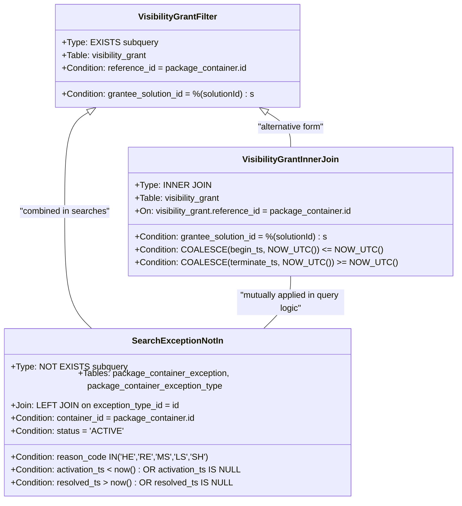

# Diagram: partview_core/partview_service/partview_service/utility/DefaultQueries.py

> Auto-generated by Obscura crawlers

## Mermaid

### SVG

<svg id="container" width="817.52734375" xmlns="http://www.w3.org/2000/svg" class="classDiagram" height="908" viewBox="0 0 817.52734375 908" role="graphics-document document" aria-roledescription="class"><g><defs><marker id="container_class-aggregationStart" class="marker aggregation class" refX="18" refY="7" markerWidth="190" markerHeight="240" orient="auto"><path d="M 18,7 L9,13 L1,7 L9,1 Z"></path></marker></defs><defs><marker id="container_class-aggregationEnd" class="marker aggregation class" refX="1" refY="7" markerWidth="20" markerHeight="28" orient="auto"><path d="M 18,7 L9,13 L1,7 L9,1 Z"></path></marker></defs><defs><marker id="container_class-extensionStart" class="marker extension class" refX="18" refY="7" markerWidth="190" markerHeight="240" orient="auto"><path d="M 1,7 L18,13 V 1 Z"></path></marker></defs><defs><marker id="container_class-extensionEnd" class="marker extension class" refX="1" refY="7" markerWidth="20" markerHeight="28" orient="auto"><path d="M 1,1 V 13 L18,7 Z"></path></marker></defs><defs><marker id="container_class-compositionStart" class="marker composition class" refX="18" refY="7" markerWidth="190" markerHeight="240" orient="auto"><path d="M 18,7 L9,13 L1,7 L9,1 Z"></path></marker></defs><defs><marker id="container_class-compositionEnd" class="marker composition class" refX="1" refY="7" markerWidth="20" markerHeight="28" orient="auto"><path d="M 18,7 L9,13 L1,7 L9,1 Z"></path></marker></defs><defs><marker id="container_class-dependencyStart" class="marker dependency class" refX="6" refY="7" markerWidth="190" markerHeight="240" orient="auto"><path d="M 5,7 L9,13 L1,7 L9,1 Z"></path></marker></defs><defs><marker id="container_class-dependencyEnd" class="marker dependency class" refX="13" refY="7" markerWidth="20" markerHeight="28" orient="auto"><path d="M 18,7 L9,13 L14,7 L9,1 Z"></path></marker></defs><defs><marker id="container_class-lollipopStart" class="marker lollipop class" refX="13" refY="7" markerWidth="190" markerHeight="240" orient="auto"><circle stroke="black" fill="transparent" cx="7" cy="7" r="6"></circle></marker></defs><defs><marker id="container_class-lollipopEnd" class="marker lollipop class" refX="1" refY="7" markerWidth="190" markerHeight="240" orient="auto"><circle stroke="black" fill="transparent" cx="7" cy="7" r="6"></circle></marker></defs><g class="root"><g class="clusters"></g><g class="edgePaths"><path d="M487.43,209.537L494.329,214.114C501.228,218.691,515.026,227.846,521.925,238.589C528.824,249.333,528.824,261.667,528.824,267.833L528.824,274" id="id_VisibilityGrantFilter_VisibilityGrantInnerJoin_1" class="edge-thickness-normal edge-pattern-solid relation" style=";;;" data-edge="true" data-et="edge" data-id="id_VisibilityGrantFilter_VisibilityGrantInnerJoin_1" data-points="W3sieCI6NDczLjA1NTgwMzU3MTQyODU2LCJ5IjoyMDB9LHsieCI6NTI4LjgyNDIxODc1LCJ5IjoyMzd9LHsieCI6NTI4LjgyNDIxODc1LCJ5IjoyNzR9XQ==" marker-start="url(#container_class-extensionStart)"></path><path d="M169.289,209.537L162.39,214.114C155.491,218.691,141.693,227.846,134.794,258.589C127.895,289.333,127.895,341.667,127.895,396C127.895,450.333,127.895,506.667,136.377,543C144.86,579.333,161.825,595.667,170.307,603.833L178.79,612" id="id_VisibilityGrantFilter_SearchExceptionNotIn_2" class="edge-thickness-normal edge-pattern-solid relation" style=";;;" data-edge="true" data-et="edge" data-id="id_VisibilityGrantFilter_SearchExceptionNotIn_2" data-points="W3sieCI6MTgzLjY2Mjk0NjQyODU3MTQyLCJ5IjoyMDB9LHsieCI6MTI3Ljg5NDUzMTI1LCJ5IjoyMzd9LHsieCI6MTI3Ljg5NDUzMTI1LCJ5IjozOTR9LHsieCI6MTI3Ljg5NDUzMTI1LCJ5Ijo1NjN9LHsieCI6MTc4Ljc4OTc1MDY0NzY2ODQsInkiOjYxMn1d" marker-start="url(#container_class-extensionStart)"></path><path d="M528.824,514L528.824,522.167C528.824,530.333,528.824,546.667,520.342,563C511.859,579.333,494.894,595.667,486.412,603.833L477.929,612" id="id_VisibilityGrantInnerJoin_SearchExceptionNotIn_3" class="edge-thickness-normal edge-pattern-solid relation" style=";;;" data-edge="true" data-et="edge" data-id="id_VisibilityGrantInnerJoin_SearchExceptionNotIn_3" data-points="W3sieCI6NTI4LjgyNDIxODc1LCJ5Ijo1MTR9LHsieCI6NTI4LjgyNDIxODc1LCJ5Ijo1NjN9LHsieCI6NDc3LjkyODk5OTM1MjMzMTYzLCJ5Ijo2MTJ9XQ=="></path></g><g class="edgeLabels"><g class="edgeLabel" transform="translate(528.82421875, 237)"><g class="label" data-id="id_VisibilityGrantFilter_VisibilityGrantInnerJoin_1" transform="translate(-64.8046875, -12)"><foreignObject width="129.609375" height="24">

"alternative form"

</foreignObject></g></g><g class="edgeLabel" transform="translate(127.89453125, 394)"><g class="label" data-id="id_VisibilityGrantFilter_SearchExceptionNotIn_2" transform="translate(-85.2265625, -12)"><foreignObject width="170.453125" height="24">

"combined in searches"

</foreignObject></g></g><g class="edgeLabel" transform="translate(528.82421875, 563)"><g class="label" data-id="id_VisibilityGrantInnerJoin_SearchExceptionNotIn_3" transform="translate(-100, -24)"><foreignObject width="200" height="48">

"mutually applied in query logic"

</foreignObject></g></g></g><g class="nodes"><g class="node default" id="classId-VisibilityGrantFilter-0" transform="translate(328.359375, 104)"><g class="basic label-container"><path d="M-230.26953125 -96 L230.26953125 -96 L230.26953125 96 L-230.26953125 96" stroke="none" stroke-width="0" fill="#ECECFF" style=""></path><path d="M-230.26953125 -96 C-67.76196955732291 -96, 94.74559213535417 -96, 230.26953125 -96 M-230.26953125 -96 C-78.79950727575775 -96, 72.6705166984845 -96, 230.26953125 -96 M230.26953125 -96 C230.26953125 -56.251206956878164, 230.26953125 -16.502413913756328, 230.26953125 96 M230.26953125 -96 C230.26953125 -30.125435529606136, 230.26953125 35.74912894078773, 230.26953125 96 M230.26953125 96 C100.94339194021416 96, -28.38274736957169 96, -230.26953125 96 M230.26953125 96 C134.25394684573368 96, 38.23836244146736 96, -230.26953125 96 M-230.26953125 96 C-230.26953125 55.18143250376136, -230.26953125 14.362865007522714, -230.26953125 -96 M-230.26953125 96 C-230.26953125 26.44432691544479, -230.26953125 -43.11134616911042, -230.26953125 -96" stroke="#9370DB" stroke-width="1.3" fill="none" stroke-dasharray="0 0" style=""></path></g><g class="annotation-group text" transform="translate(0, -72)"></g><g class="label-group text" transform="translate(-70.8359375, -72)"><g class="label" style="font-weight: bolder" transform="translate(0,-12)"><foreignObject width="141.671875" height="24">

VisibilityGrantFilter

</foreignObject></g></g><g class="members-group text" transform="translate(-218.26953125, -24)"><g class="label" style="" transform="translate(0,-12)"><foreignObject width="168.140625" height="24">

+Type: EXISTS subquery

</foreignObject></g><g class="label" style="" transform="translate(0,12)"><foreignObject width="161.203125" height="24">

+Table: visibility_grant

</foreignObject></g><g class="label" style="" transform="translate(0,36)"><foreignObject width="345.75" height="24">

+Condition: reference_id = package_container.id

</foreignObject></g></g><g class="methods-group text" transform="translate(-218.26953125, 72)"><g class="label" style="" transform="translate(0,-12)"><foreignObject width="365.703125" height="24">

+Condition: grantee_solution_id = %(solutionId) : s

</foreignObject></g></g><g class="divider" style=""><path d="M-230.26953125 -48 C-122.15465940733692 -48, -14.039787564673844 -48, 230.26953125 -48 M-230.26953125 -48 C-106.38931908889056 -48, 17.49089307221888 -48, 230.26953125 -48" stroke="#9370DB" stroke-width="1.3" fill="none" stroke-dasharray="0 0" style=""></path></g><g class="divider" style=""><path d="M-230.26953125 48 C-79.73390751478831 48, 70.80171622042337 48, 230.26953125 48 M-230.26953125 48 C-124.30284514604661 48, -18.336159042093215 48, 230.26953125 48" stroke="#9370DB" stroke-width="1.3" fill="none" stroke-dasharray="0 0" style=""></path></g></g><g class="node default" id="classId-VisibilityGrantInnerJoin-1" transform="translate(528.82421875, 394)"><g class="basic label-container"><path d="M-280.703125 -120 L280.703125 -120 L280.703125 120 L-280.703125 120" stroke="none" stroke-width="0" fill="#ECECFF" style=""></path><path d="M-280.703125 -120 C-124.34747180026065 -120, 32.0081813994787 -120, 280.703125 -120 M-280.703125 -120 C-91.32388259367198 -120, 98.05535981265604 -120, 280.703125 -120 M280.703125 -120 C280.703125 -61.560594145137095, 280.703125 -3.1211882902741905, 280.703125 120 M280.703125 -120 C280.703125 -48.30394215262615, 280.703125 23.3921156947477, 280.703125 120 M280.703125 120 C60.790332706361795 120, -159.1224595872764 120, -280.703125 120 M280.703125 120 C163.31500011046978 120, 45.926875220939564 120, -280.703125 120 M-280.703125 120 C-280.703125 32.516617948103104, -280.703125 -54.96676410379379, -280.703125 -120 M-280.703125 120 C-280.703125 51.22535902710223, -280.703125 -17.549281945795542, -280.703125 -120" stroke="#9370DB" stroke-width="1.3" fill="none" stroke-dasharray="0 0" style=""></path></g><g class="annotation-group text" transform="translate(0, -96)"></g><g class="label-group text" transform="translate(-85.25, -96)"><g class="label" style="font-weight: bolder" transform="translate(0,-12)"><foreignObject width="170.5" height="24">

VisibilityGrantInnerJoin

</foreignObject></g></g><g class="members-group text" transform="translate(-268.703125, -48)"><g class="label" style="" transform="translate(0,-12)"><foreignObject width="129.65625" height="24">

+Type: INNER JOIN

</foreignObject></g><g class="label" style="" transform="translate(0,12)"><foreignObject width="161.203125" height="24">

+Table: visibility_grant

</foreignObject></g><g class="label" style="" transform="translate(0,36)"><foreignObject width="406.578125" height="24">

+On: visibility_grant.reference_id = package_container.id

</foreignObject></g></g><g class="methods-group text" transform="translate(-268.703125, 48)"><g class="label" style="" transform="translate(0,-12)"><foreignObject width="365.703125" height="24">

+Condition: grantee_solution_id = %(solutionId) : s

</foreignObject></g><g class="label" style="" transform="translate(0,12)"><foreignObject width="421.90625" height="24">

+Condition: COALESCE(begin_ts, NOW_UTC()) &lt;= NOW_UTC()

</foreignObject></g><g class="label" style="" transform="translate(0,36)"><foreignObject width="452.15625" height="24">

+Condition: COALESCE(terminate_ts, NOW_UTC()) &gt;= NOW_UTC()

</foreignObject></g></g><g class="divider" style=""><path d="M-280.703125 -72 C-151.93549367507273 -72, -23.16786235014547 -72, 280.703125 -72 M-280.703125 -72 C-120.69305059895285 -72, 39.3170238020943 -72, 280.703125 -72" stroke="#9370DB" stroke-width="1.3" fill="none" stroke-dasharray="0 0" style=""></path></g><g class="divider" style=""><path d="M-280.703125 24 C-70.66881545065306 24, 139.3654940986939 24, 280.703125 24 M-280.703125 24 C-119.16144497175549 24, 42.38023505648903 24, 280.703125 24" stroke="#9370DB" stroke-width="1.3" fill="none" stroke-dasharray="0 0" style=""></path></g></g><g class="node default" id="classId-SearchExceptionNotIn-2" transform="translate(328.359375, 756)"><g class="basic label-container"><path d="M-320.359375 -144 L320.359375 -144 L320.359375 144 L-320.359375 144" stroke="none" stroke-width="0" fill="#ECECFF" style=""></path><path d="M-320.359375 -144 C-64.64711282210189 -144, 191.06514935579622 -144, 320.359375 -144 M-320.359375 -144 C-179.41253215457746 -144, -38.465689309154925 -144, 320.359375 -144 M320.359375 -144 C320.359375 -36.7643312705726, 320.359375 70.4713374588548, 320.359375 144 M320.359375 -144 C320.359375 -49.74390359090428, 320.359375 44.51219281819144, 320.359375 144 M320.359375 144 C159.6771576603011 144, -1.0050596793977888 144, -320.359375 144 M320.359375 144 C178.59821886386115 144, 36.8370627277223 144, -320.359375 144 M-320.359375 144 C-320.359375 51.51159775269359, -320.359375 -40.97680449461282, -320.359375 -144 M-320.359375 144 C-320.359375 79.92313323972316, -320.359375 15.846266479446314, -320.359375 -144" stroke="#9370DB" stroke-width="1.3" fill="none" stroke-dasharray="0 0" style=""></path></g><g class="annotation-group text" transform="translate(0, -120)"></g><g class="label-group text" transform="translate(-80.4375, -120)"><g class="label" style="font-weight: bolder" transform="translate(0,-12)"><foreignObject width="160.875" height="24">

SearchExceptionNotIn

</foreignObject></g></g><g class="members-group text" transform="translate(-308.359375, -72)"><g class="label" style="" transform="translate(0,-12)"><foreignObject width="202.09375" height="24">

+Type: NOT EXISTS subquery

</foreignObject></g><g class="label" style="" transform="translate(0,12)"><foreignObject width="536.28125" height="24">

+Tables: package_container_exception, package_container_exception_type

</foreignObject></g><g class="label" style="" transform="translate(0,36)"><foreignObject width="302.921875" height="24">

+Join: LEFT JOIN on exception_type_id = id

</foreignObject></g><g class="label" style="" transform="translate(0,60)"><foreignObject width="345.8125" height="24">

+Condition: container_id = package_container.id

</foreignObject></g><g class="label" style="" transform="translate(0,84)"><foreignObject width="202.1875" height="24">

+Condition: status = 'ACTIVE'

</foreignObject></g></g><g class="methods-group text" transform="translate(-308.359375, 72)"><g class="label" style="" transform="translate(0,-12)"><foreignObject width="340.671875" height="24">

+Condition: reason_code IN('HE','RE','MS','LS','SH')

</foreignObject></g><g class="label" style="" transform="translate(0,12)"><foreignObject width="426.6875" height="24">

+Condition: activation_ts &lt; now() : OR activation_ts IS NULL

</foreignObject></g><g class="label" style="" transform="translate(0,36)"><foreignObject width="406.453125" height="24">

+Condition: resolved_ts &gt; now() : OR resolved_ts IS NULL

</foreignObject></g></g><g class="divider" style=""><path d="M-320.359375 -96 C-150.2751660181755 -96, 19.809042963649006 -96, 320.359375 -96 M-320.359375 -96 C-174.0398809741653 -96, -27.7203869483306 -96, 320.359375 -96" stroke="#9370DB" stroke-width="1.3" fill="none" stroke-dasharray="0 0" style=""></path></g><g class="divider" style=""><path d="M-320.359375 48 C-109.88909819689931 48, 100.58117860620138 48, 320.359375 48 M-320.359375 48 C-167.92857330584428 48, -15.497771611688563 48, 320.359375 48" stroke="#9370DB" stroke-width="1.3" fill="none" stroke-dasharray="0 0" style=""></path></g></g></g></g></g></svg>
