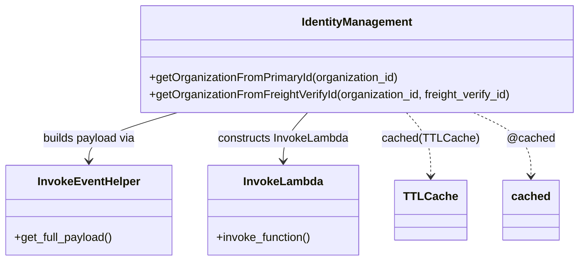

# Diagram: partview_core/partview_service/partview_service/utility/IdentityManagement.py


> Auto-generated by Obscura crawlers

## Diagram 1



### SVG

<svg id="container" width="811.55078125" xmlns="http://www.w3.org/2000/svg" class="classDiagram" height="366" viewBox="0 0 811.55078125 366" role="graphics-document document" aria-roledescription="class"><style>#container{font-family:"trebuchet ms",verdana,arial,sans-serif;font-size:16px;fill:#333;}@keyframes edge-animation-frame{from{stroke-dashoffset:0;}}@keyframes dash{to{stroke-dashoffset:0;}}#container .edge-animation-slow{stroke-dasharray:9,5!important;stroke-dashoffset:900;animation:dash 50s linear infinite;stroke-linecap:round;}#container .edge-animation-fast{stroke-dasharray:9,5!important;stroke-dashoffset:900;animation:dash 20s linear infinite;stroke-linecap:round;}#container .error-icon{fill:#552222;}#container .error-text{fill:#552222;stroke:#552222;}#container .edge-thickness-normal{stroke-width:1px;}#container .edge-thickness-thick{stroke-width:3.5px;}#container .edge-pattern-solid{stroke-dasharray:0;}#container .edge-thickness-invisible{stroke-width:0;fill:none;}#container .edge-pattern-dashed{stroke-dasharray:3;}#container .edge-pattern-dotted{stroke-dasharray:2;}#container .marker{fill:#333333;stroke:#333333;}#container .marker.cross{stroke:#333333;}#container svg{font-family:"trebuchet ms",verdana,arial,sans-serif;font-size:16px;}#container p{margin:0;}#container g.classGroup text{fill:#9370DB;stroke:none;font-family:"trebuchet ms",verdana,arial,sans-serif;font-size:10px;}#container g.classGroup text .title{font-weight:bolder;}#container .nodeLabel,#container .edgeLabel{color:#131300;}#container .edgeLabel .label rect{fill:#ECECFF;}#container .label text{fill:#131300;}#container .labelBkg{background:#ECECFF;}#container .edgeLabel .label span{background:#ECECFF;}#container .classTitle{font-weight:bolder;}#container .node rect,#container .node circle,#container .node ellipse,#container .node polygon,#container .node path{fill:#ECECFF;stroke:#9370DB;stroke-width:1px;}#container .divider{stroke:#9370DB;stroke-width:1;}#container g.clickable{cursor:pointer;}#container g.classGroup rect{fill:#ECECFF;stroke:#9370DB;}#container g.classGroup line{stroke:#9370DB;stroke-width:1;}#container .classLabel .box{stroke:none;stroke-width:0;fill:#ECECFF;opacity:0.5;}#container .classLabel .label{fill:#9370DB;font-size:10px;}#container .relation{stroke:#333333;stroke-width:1;fill:none;}#container .dashed-line{stroke-dasharray:3;}#container .dotted-line{stroke-dasharray:1 2;}#container #compositionStart,#container .composition{fill:#333333!important;stroke:#333333!important;stroke-width:1;}#container #compositionEnd,#container .composition{fill:#333333!important;stroke:#333333!important;stroke-width:1;}#container #dependencyStart,#container .dependency{fill:#333333!important;stroke:#333333!important;stroke-width:1;}#container #dependencyStart,#container .dependency{fill:#333333!important;stroke:#333333!important;stroke-width:1;}#container #extensionStart,#container .extension{fill:transparent!important;stroke:#333333!important;stroke-width:1;}#container #extensionEnd,#container .extension{fill:transparent!important;stroke:#333333!important;stroke-width:1;}#container #aggregationStart,#container .aggregation{fill:transparent!important;stroke:#333333!important;stroke-width:1;}#container #aggregationEnd,#container .aggregation{fill:transparent!important;stroke:#333333!important;stroke-width:1;}#container #lollipopStart,#container .lollipop{fill:#ECECFF!important;stroke:#333333!important;stroke-width:1;}#container #lollipopEnd,#container .lollipop{fill:#ECECFF!important;stroke:#333333!important;stroke-width:1;}#container .edgeTerminals{font-size:11px;line-height:initial;}#container .classTitleText{text-anchor:middle;font-size:18px;fill:#333;}#container .label-icon{display:inline-block;height:1em;overflow:visible;vertical-align:-0.125em;}#container .node .label-icon path{fill:currentColor;stroke:revert;stroke-width:revert;}#container :root{--mermaid-font-family:"trebuchet ms",verdana,arial,sans-serif;}</style><g><defs><marker id="container_class-aggregationStart" class="marker aggregation class" refX="18" refY="7" markerWidth="190" markerHeight="240" orient="auto"><path d="M 18,7 L9,13 L1,7 L9,1 Z"></path></marker></defs><defs><marker id="container_class-aggregationEnd" class="marker aggregation class" refX="1" refY="7" markerWidth="20" markerHeight="28" orient="auto"><path d="M 18,7 L9,13 L1,7 L9,1 Z"></path></marker></defs><defs><marker id="container_class-extensionStart" class="marker extension class" refX="18" refY="7" markerWidth="190" markerHeight="240" orient="auto"><path d="M 1,7 L18,13 V 1 Z"></path></marker></defs><defs><marker id="container_class-extensionEnd" class="marker extension class" refX="1" refY="7" markerWidth="20" markerHeight="28" orient="auto"><path d="M 1,1 V 13 L18,7 Z"></path></marker></defs><defs><marker id="container_class-compositionStart" class="marker composition class" refX="18" refY="7" markerWidth="190" markerHeight="240" orient="auto"><path d="M 18,7 L9,13 L1,7 L9,1 Z"></path></marker></defs><defs><marker id="container_class-compositionEnd" class="marker composition class" refX="1" refY="7" markerWidth="20" markerHeight="28" orient="auto"><path d="M 18,7 L9,13 L1,7 L9,1 Z"></path></marker></defs><defs><marker id="container_class-dependencyStart" class="marker dependency class" refX="6" refY="7" markerWidth="190" markerHeight="240" orient="auto"><path d="M 5,7 L9,13 L1,7 L9,1 Z"></path></marker></defs><defs><marker id="container_class-dependencyEnd" class="marker dependency class" refX="13" refY="7" markerWidth="20" markerHeight="28" orient="auto"><path d="M 18,7 L9,13 L14,7 L9,1 Z"></path></marker></defs><defs><marker id="container_class-lollipopStart" class="marker lollipop class" refX="13" refY="7" markerWidth="190" markerHeight="240" orient="auto"><circle stroke="black" fill="transparent" cx="7" cy="7" r="6"></circle></marker></defs><defs><marker id="container_class-lollipopEnd" class="marker lollipop class" refX="1" refY="7" markerWidth="190" markerHeight="240" orient="auto"><circle stroke="black" fill="transparent" cx="7" cy="7" r="6"></circle></marker></defs><g class="root"><g class="clusters"></g><g class="edgePaths"><path d="M247.311,158L226.769,164.167C206.227,170.333,165.143,182.667,144.601,194C124.059,205.333,124.059,215.667,124.059,220.833L124.059,226" id="id_IdentityManagement_InvokeEventHelper_1" class="edge-thickness-normal edge-pattern-solid relation" style=";;;" data-edge="true" data-et="edge" data-id="id_IdentityManagement_InvokeEventHelper_1" data-points="W3sieCI6MjQ3LjMxMTQ4ODU2MDI2Nzg2LCJ5IjoxNTh9LHsieCI6MTI0LjA1ODU5Mzc1LCJ5IjoxOTV9LHsieCI6MTI0LjA1ODU5Mzc1LCJ5IjoyMzJ9XQ==" marker-end="url(#container_class-dependencyEnd)"></path><path d="M429.467,158L423.903,164.167C418.338,170.333,407.208,182.667,401.643,194C396.078,205.333,396.078,215.667,396.078,220.833L396.078,226" id="id_IdentityManagement_InvokeLambda_2" class="edge-thickness-normal edge-pattern-solid relation" style=";;;" data-edge="true" data-et="edge" data-id="id_IdentityManagement_InvokeLambda_2" data-points="W3sieCI6NDI5LjQ2NzQyNDY2NTE3ODU2LCJ5IjoxNTh9LHsieCI6Mzk2LjA3ODEyNSwieSI6MTk1fSx7IngiOjM5Ni4wNzgxMjUsInkiOjIzMn1d" marker-end="url(#container_class-dependencyEnd)"></path><path d="M564.829,158L570.394,164.167C575.959,170.333,587.089,182.667,592.654,197.5C598.219,212.333,598.219,229.667,598.219,238.333L598.219,247" id="id_IdentityManagement_TTLCache_3" class="edge-thickness-normal edge-pattern-dashed relation" style=";;;" data-edge="true" data-et="edge" data-id="id_IdentityManagement_TTLCache_3" data-points="W3sieCI6NTY0LjgyOTQ1MDMzNDgyMTQsInkiOjE1OH0seyJ4Ijo1OTguMjE4NzUsInkiOjE5NX0seyJ4Ijo1OTguMjE4NzUsInkiOjI1M31d" marker-end="url(#container_class-dependencyEnd)"></path><path d="M654.551,158L667.493,164.167C680.435,170.333,706.319,182.667,719.261,197.5C732.203,212.333,732.203,229.667,732.203,238.333L732.203,247" id="id_IdentityManagement_cached_4" class="edge-thickness-normal edge-pattern-dashed relation" style=";;;" data-edge="true" data-et="edge" data-id="id_IdentityManagement_cached_4" data-points="W3sieCI6NjU0LjU1MTEzMDAyMjMyMTQsInkiOjE1OH0seyJ4Ijo3MzIuMjAzMTI1LCJ5IjoxOTV9LHsieCI6NzMyLjIwMzEyNSwieSI6MjUzfV0=" marker-end="url(#container_class-dependencyEnd)"></path></g><g class="edgeLabels"><g class="edgeLabel" transform="translate(124.05859375, 195)"><g class="label" data-id="id_IdentityManagement_InvokeEventHelper_1" transform="translate(-66.1484375, -12)"><foreignObject width="132.296875" height="24"><div xmlns="http://www.w3.org/1999/xhtml" class="labelBkg" style="display: table-cell; white-space: nowrap; line-height: 1.5; max-width: 200px; text-align: center;"><span class="edgeLabel"><p>builds payload via</p></span></div></foreignObject></g></g><g class="edgeLabel" transform="translate(396.078125, 195)"><g class="label" data-id="id_IdentityManagement_InvokeLambda_2" transform="translate(-92.9140625, -12)"><foreignObject width="185.828125" height="24"><div xmlns="http://www.w3.org/1999/xhtml" class="labelBkg" style="display: table-cell; white-space: nowrap; line-height: 1.5; max-width: 200px; text-align: center;"><span class="edgeLabel"><p>constructs InvokeLambda</p></span></div></foreignObject></g></g><g class="edgeLabel" transform="translate(598.21875, 195)"><g class="label" data-id="id_IdentityManagement_TTLCache_3" transform="translate(-64.4609375, -12)"><foreignObject width="128.921875" height="24"><div xmlns="http://www.w3.org/1999/xhtml" class="labelBkg" style="display: table-cell; white-space: nowrap; line-height: 1.5; max-width: 200px; text-align: center;"><span class="edgeLabel"><p>cached(TTLCache)</p></span></div></foreignObject></g></g><g class="edgeLabel" transform="translate(732.203125, 195)"><g class="label" data-id="id_IdentityManagement_cached_4" transform="translate(-33.9140625, -12)"><foreignObject width="67.828125" height="24"><div xmlns="http://www.w3.org/1999/xhtml" class="labelBkg" style="display: table-cell; white-space: nowrap; line-height: 1.5; max-width: 200px; text-align: center;"><span class="edgeLabel"><p>@cached</p></span></div></foreignObject></g></g></g><g class="nodes"><g class="node default" id="classId-IdentityManagement-0" transform="translate(497.1484375, 83)"><g class="basic label-container"><path d="M-306.40234375 -75 L306.40234375 -75 L306.40234375 75 L-306.40234375 75" stroke="none" stroke-width="0" fill="#ECECFF" style=""></path><path d="M-306.40234375 -75 C-87.97463431693544 -75, 130.45307511612913 -75, 306.40234375 -75 M-306.40234375 -75 C-67.66286481609484 -75, 171.07661411781032 -75, 306.40234375 -75 M306.40234375 -75 C306.40234375 -26.563988082742654, 306.40234375 21.872023834514692, 306.40234375 75 M306.40234375 -75 C306.40234375 -22.512671039225637, 306.40234375 29.974657921548726, 306.40234375 75 M306.40234375 75 C112.22274234294119 75, -81.95685906411762 75, -306.40234375 75 M306.40234375 75 C170.0624510671702 75, 33.7225583843404 75, -306.40234375 75 M-306.40234375 75 C-306.40234375 29.285829821555907, -306.40234375 -16.428340356888185, -306.40234375 -75 M-306.40234375 75 C-306.40234375 34.97556672720344, -306.40234375 -5.048866545593114, -306.40234375 -75" stroke="#9370DB" stroke-width="1.3" fill="none" stroke-dasharray="0 0" style=""></path></g><g class="annotation-group text" transform="translate(0, -51)"></g><g class="label-group text" transform="translate(-75.8359375, -51)"><g class="label" style="font-weight: bolder" transform="translate(0,-12)"><foreignObject width="151.671875" height="24"><div xmlns="http://www.w3.org/1999/xhtml" style="display: table-cell; white-space: nowrap; line-height: 1.5; max-width: 200px; text-align: center;"><span class="nodeLabel markdown-node-label" style=""><p>IdentityManagement</p></span></div></foreignObject></g></g><g class="members-group text" transform="translate(-294.40234375, -3)"></g><g class="methods-group text" transform="translate(-294.40234375, 27)"><g class="label" style="" transform="translate(0,-12)"><foreignObject width="352.21875" height="24"><div xmlns="http://www.w3.org/1999/xhtml" style="display: table-cell; white-space: nowrap; line-height: 1.5; max-width: 410px; text-align: center;"><span class="nodeLabel markdown-node-label" style=""><p>+getOrganizationFromPrimaryId(organization_id)</p></span></div></foreignObject></g><g class="label" style="" transform="translate(0,12)"><foreignObject width="512.96875" height="24"><div xmlns="http://www.w3.org/1999/xhtml" style="display: table-cell; white-space: nowrap; line-height: 1.5; max-width: 570px; text-align: center;"><span class="nodeLabel markdown-node-label" style=""><p>+getOrganizationFromFreightVerifyId(organization_id, freight_verify_id)</p></span></div></foreignObject></g></g><g class="divider" style=""><path d="M-306.40234375 -27 C-106.62827375953253 -27, 93.14579623093493 -27, 306.40234375 -27 M-306.40234375 -27 C-137.79193466915157 -27, 30.818474411696855 -27, 306.40234375 -27" stroke="#9370DB" stroke-width="1.3" fill="none" stroke-dasharray="0 0" style=""></path></g><g class="divider" style=""><path d="M-306.40234375 -3 C-76.75929559291689 -3, 152.88375256416623 -3, 306.40234375 -3 M-306.40234375 -3 C-75.37209378606161 -3, 155.65815617787678 -3, 306.40234375 -3" stroke="#9370DB" stroke-width="1.3" fill="none" stroke-dasharray="0 0" style=""></path></g></g><g class="node default" id="classId-InvokeEventHelper-1" transform="translate(124.05859375, 295)"><g class="basic label-container"><path d="M-116.05859375 -63 L116.05859375 -63 L116.05859375 63 L-116.05859375 63" stroke="none" stroke-width="0" fill="#ECECFF" style=""></path><path d="M-116.05859375 -63 C-37.540632560797164 -63, 40.97732862840567 -63, 116.05859375 -63 M-116.05859375 -63 C-49.55283545350831 -63, 16.952922842983384 -63, 116.05859375 -63 M116.05859375 -63 C116.05859375 -20.689854294556028, 116.05859375 21.620291410887944, 116.05859375 63 M116.05859375 -63 C116.05859375 -26.694132745951308, 116.05859375 9.611734508097385, 116.05859375 63 M116.05859375 63 C30.73084733413708 63, -54.59689908172584 63, -116.05859375 63 M116.05859375 63 C58.611482833539554 63, 1.1643719170791087 63, -116.05859375 63 M-116.05859375 63 C-116.05859375 14.542305311971731, -116.05859375 -33.91538937605654, -116.05859375 -63 M-116.05859375 63 C-116.05859375 20.735159534917955, -116.05859375 -21.52968093016409, -116.05859375 -63" stroke="#9370DB" stroke-width="1.3" fill="none" stroke-dasharray="0 0" style=""></path></g><g class="annotation-group text" transform="translate(0, -39)"></g><g class="label-group text" transform="translate(-69.0859375, -39)"><g class="label" style="font-weight: bolder" transform="translate(0,-12)"><foreignObject width="138.171875" height="24"><div xmlns="http://www.w3.org/1999/xhtml" style="display: table-cell; white-space: nowrap; line-height: 1.5; max-width: 187px; text-align: center;"><span class="nodeLabel markdown-node-label" style=""><p>InvokeEventHelper</p></span></div></foreignObject></g></g><g class="members-group text" transform="translate(-104.05859375, 9)"></g><g class="methods-group text" transform="translate(-104.05859375, 39)"><g class="label" style="" transform="translate(0,-12)"><foreignObject width="139.03125" height="24"><div xmlns="http://www.w3.org/1999/xhtml" style="display: table-cell; white-space: nowrap; line-height: 1.5; max-width: 196px; text-align: center;"><span class="nodeLabel markdown-node-label" style=""><p>+get_full_payload()</p></span></div></foreignObject></g></g><g class="divider" style=""><path d="M-116.05859375 -15 C-38.44190771504026 -15, 39.17477831991948 -15, 116.05859375 -15 M-116.05859375 -15 C-45.48598529856078 -15, 25.086623152878445 -15, 116.05859375 -15" stroke="#9370DB" stroke-width="1.3" fill="none" stroke-dasharray="0 0" style=""></path></g><g class="divider" style=""><path d="M-116.05859375 9 C-26.301217098863262 9, 63.456159552273476 9, 116.05859375 9 M-116.05859375 9 C-49.22442454566077 9, 17.609744658678466 9, 116.05859375 9" stroke="#9370DB" stroke-width="1.3" fill="none" stroke-dasharray="0 0" style=""></path></g></g><g class="node default" id="classId-InvokeLambda-2" transform="translate(396.078125, 295)"><g class="basic label-container"><path d="M-105.9609375 -63 L105.9609375 -63 L105.9609375 63 L-105.9609375 63" stroke="none" stroke-width="0" fill="#ECECFF" style=""></path><path d="M-105.9609375 -63 C-48.89377078666087 -63, 8.173395926678253 -63, 105.9609375 -63 M-105.9609375 -63 C-57.444764922771284 -63, -8.928592345542569 -63, 105.9609375 -63 M105.9609375 -63 C105.9609375 -31.813297452382876, 105.9609375 -0.6265949047657529, 105.9609375 63 M105.9609375 -63 C105.9609375 -20.85153631594158, 105.9609375 21.29692736811684, 105.9609375 63 M105.9609375 63 C60.37059231493501 63, 14.78024712987002 63, -105.9609375 63 M105.9609375 63 C28.674104100850982 63, -48.612729298298035 63, -105.9609375 63 M-105.9609375 63 C-105.9609375 27.75768768258805, -105.9609375 -7.484624634823902, -105.9609375 -63 M-105.9609375 63 C-105.9609375 21.224323459479464, -105.9609375 -20.55135308104107, -105.9609375 -63" stroke="#9370DB" stroke-width="1.3" fill="none" stroke-dasharray="0 0" style=""></path></g><g class="annotation-group text" transform="translate(0, -39)"></g><g class="label-group text" transform="translate(-53.484375, -39)"><g class="label" style="font-weight: bolder" transform="translate(0,-12)"><foreignObject width="106.96875" height="24"><div xmlns="http://www.w3.org/1999/xhtml" style="display: table-cell; white-space: nowrap; line-height: 1.5; max-width: 156px; text-align: center;"><span class="nodeLabel markdown-node-label" style=""><p>InvokeLambda</p></span></div></foreignObject></g></g><g class="members-group text" transform="translate(-93.9609375, 9)"></g><g class="methods-group text" transform="translate(-93.9609375, 39)"><g class="label" style="" transform="translate(0,-12)"><foreignObject width="134.4375" height="24"><div xmlns="http://www.w3.org/1999/xhtml" style="display: table-cell; white-space: nowrap; line-height: 1.5; max-width: 192px; text-align: center;"><span class="nodeLabel markdown-node-label" style=""><p>+invoke_function()</p></span></div></foreignObject></g></g><g class="divider" style=""><path d="M-105.9609375 -15 C-41.93517387966763 -15, 22.09058974066474 -15, 105.9609375 -15 M-105.9609375 -15 C-47.010043265110525 -15, 11.94085096977895 -15, 105.9609375 -15" stroke="#9370DB" stroke-width="1.3" fill="none" stroke-dasharray="0 0" style=""></path></g><g class="divider" style=""><path d="M-105.9609375 9 C-47.96532184636447 9, 10.030293807271065 9, 105.9609375 9 M-105.9609375 9 C-47.87408061251509 9, 10.212776274969826 9, 105.9609375 9" stroke="#9370DB" stroke-width="1.3" fill="none" stroke-dasharray="0 0" style=""></path></g></g><g class="node default" id="classId-TTLCache-3" transform="translate(598.21875, 295)"><g class="basic label-container"><path d="M-46.1796875 -42 L46.1796875 -42 L46.1796875 42 L-46.1796875 42" stroke="none" stroke-width="0" fill="#ECECFF" style=""></path><path d="M-46.1796875 -42 C-26.336626485101004 -42, -6.493565470202007 -42, 46.1796875 -42 M-46.1796875 -42 C-25.433957829188845 -42, -4.68822815837769 -42, 46.1796875 -42 M46.1796875 -42 C46.1796875 -16.422917550985744, 46.1796875 9.154164898028512, 46.1796875 42 M46.1796875 -42 C46.1796875 -16.328582088310963, 46.1796875 9.342835823378074, 46.1796875 42 M46.1796875 42 C19.906451514356455 42, -6.36678447128709 42, -46.1796875 42 M46.1796875 42 C18.50848543167147 42, -9.16271663665706 42, -46.1796875 42 M-46.1796875 42 C-46.1796875 15.233946365114438, -46.1796875 -11.532107269771124, -46.1796875 -42 M-46.1796875 42 C-46.1796875 24.50187625843393, -46.1796875 7.003752516867863, -46.1796875 -42" stroke="#9370DB" stroke-width="1.3" fill="none" stroke-dasharray="0 0" style=""></path></g><g class="annotation-group text" transform="translate(0, -18)"></g><g class="label-group text" transform="translate(-34.1796875, -18)"><g class="label" style="font-weight: bolder" transform="translate(0,-12)"><foreignObject width="68.359375" height="24"><div xmlns="http://www.w3.org/1999/xhtml" style="display: table-cell; white-space: nowrap; line-height: 1.5; max-width: 117px; text-align: center;"><span class="nodeLabel markdown-node-label" style=""><p>TTLCache</p></span></div></foreignObject></g></g><g class="members-group text" transform="translate(-34.1796875, 30)"></g><g class="methods-group text" transform="translate(-34.1796875, 60)"></g><g class="divider" style=""><path d="M-46.1796875 6 C-23.966120817388113 6, -1.7525541347762257 6, 46.1796875 6 M-46.1796875 6 C-21.292212488189907 6, 3.5952625236201854 6, 46.1796875 6" stroke="#9370DB" stroke-width="1.3" fill="none" stroke-dasharray="0 0" style=""></path></g><g class="divider" style=""><path d="M-46.1796875 24 C-26.630679813570307 24, -7.081672127140614 24, 46.1796875 24 M-46.1796875 24 C-22.602464743504203 24, 0.9747580129915931 24, 46.1796875 24" stroke="#9370DB" stroke-width="1.3" fill="none" stroke-dasharray="0 0" style=""></path></g></g><g class="node default" id="classId-cached-4" transform="translate(732.203125, 295)"><g class="basic label-container"><path d="M-37.8046875 -42 L37.8046875 -42 L37.8046875 42 L-37.8046875 42" stroke="none" stroke-width="0" fill="#ECECFF" style=""></path><path d="M-37.8046875 -42 C-19.37340761754885 -42, -0.9421277350976993 -42, 37.8046875 -42 M-37.8046875 -42 C-10.542449068474522 -42, 16.719789363050957 -42, 37.8046875 -42 M37.8046875 -42 C37.8046875 -23.884039467776788, 37.8046875 -5.768078935553575, 37.8046875 42 M37.8046875 -42 C37.8046875 -24.82488024851245, 37.8046875 -7.6497604970249, 37.8046875 42 M37.8046875 42 C13.233388893205529 42, -11.337909713588942 42, -37.8046875 42 M37.8046875 42 C9.204479375747937 42, -19.395728748504126 42, -37.8046875 42 M-37.8046875 42 C-37.8046875 9.635596945097781, -37.8046875 -22.728806109804438, -37.8046875 -42 M-37.8046875 42 C-37.8046875 17.976028153169214, -37.8046875 -6.047943693661573, -37.8046875 -42" stroke="#9370DB" stroke-width="1.3" fill="none" stroke-dasharray="0 0" style=""></path></g><g class="annotation-group text" transform="translate(0, -18)"></g><g class="label-group text" transform="translate(-25.8046875, -18)"><g class="label" style="font-weight: bolder" transform="translate(0,-12)"><foreignObject width="51.609375" height="24"><div xmlns="http://www.w3.org/1999/xhtml" style="display: table-cell; white-space: nowrap; line-height: 1.5; max-width: 102px; text-align: center;"><span class="nodeLabel markdown-node-label" style=""><p>cached</p></span></div></foreignObject></g></g><g class="members-group text" transform="translate(-25.8046875, 30)"></g><g class="methods-group text" transform="translate(-25.8046875, 60)"></g><g class="divider" style=""><path d="M-37.8046875 6 C-19.521510311133518 6, -1.2383331222670364 6, 37.8046875 6 M-37.8046875 6 C-20.16613842691657 6, -2.527589353833143 6, 37.8046875 6" stroke="#9370DB" stroke-width="1.3" fill="none" stroke-dasharray="0 0" style=""></path></g><g class="divider" style=""><path d="M-37.8046875 24 C-21.658777179034736 24, -5.512866858069472 24, 37.8046875 24 M-37.8046875 24 C-10.663019308168728 24, 16.478648883662544 24, 37.8046875 24" stroke="#9370DB" stroke-width="1.3" fill="none" stroke-dasharray="0 0" style=""></path></g></g></g></g></g></svg>

## Diagram 2

```mermaid
flowchart TD
    subgraph GetByPrimaryId
        A[Start: getOrganizationFromPrimaryId(org_id)] --> B[InvokeEventHelper: build payload with pathParameters]
        B --> C[Create InvokeLambda(organization_id, "get_organizations", payload)]
        C --> D[invoke_function() -> (status_code, response)]
        D --> E{status_code == 200?}
        E -- yes --> F{response contains "response"?}
        F -- yes --> G[return response["response"]]
        F -- no --> H[return None]
        E -- no --> H
    end
```

> SVG rendering failed for this diagram.

## Diagram 3

```mermaid
flowchart TD
    subgraph GetByFreightVerifyId
        A2[Start: getOrganizationFromFreightVerifyId(org_id, fv_id)] --> B2[InvokeEventHelper: build payload with queryStringParameters]
        B2 --> C2[Create InvokeLambda(organization_id, "get_organizations", payload)]
        C2 --> D2[invoke_function() -> (status_code, response)]
        D2 --> E2{status_code == 200?}
        E2 -- yes --> F2{response contains "response"?}
        F2 -- yes --> G2[return response["response"]]
        F2 -- no --> H2[return None]
        E2 -- no --> H2
    end
```

> SVG rendering failed for this diagram.
