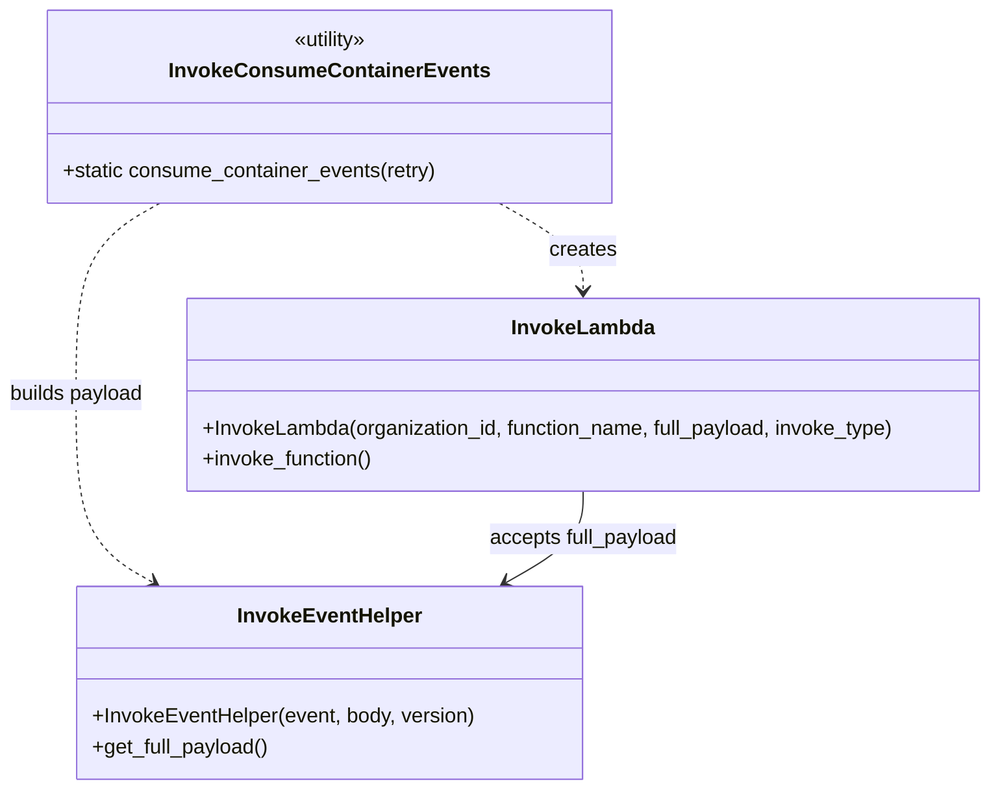

# Diagram: partview_core/partview_service/partview_service/utility/InvokeConsumeContainerEvents.py

> Auto-generated by Obscura crawlers

## Mermaid

### SVG

<svg id="container" width="783.359375" xmlns="http://www.w3.org/2000/svg" class="classDiagram" height="614" viewBox="0 0 783.359375 614" role="graphics-document document" aria-roledescription="class"><g><defs><marker id="container_class-aggregationStart" class="marker aggregation class" refX="18" refY="7" markerWidth="190" markerHeight="240" orient="auto"><path d="M 18,7 L9,13 L1,7 L9,1 Z"></path></marker></defs><defs><marker id="container_class-aggregationEnd" class="marker aggregation class" refX="1" refY="7" markerWidth="20" markerHeight="28" orient="auto"><path d="M 18,7 L9,13 L1,7 L9,1 Z"></path></marker></defs><defs><marker id="container_class-extensionStart" class="marker extension class" refX="18" refY="7" markerWidth="190" markerHeight="240" orient="auto"><path d="M 1,7 L18,13 V 1 Z"></path></marker></defs><defs><marker id="container_class-extensionEnd" class="marker extension class" refX="1" refY="7" markerWidth="20" markerHeight="28" orient="auto"><path d="M 1,1 V 13 L18,7 Z"></path></marker></defs><defs><marker id="container_class-compositionStart" class="marker composition class" refX="18" refY="7" markerWidth="190" markerHeight="240" orient="auto"><path d="M 18,7 L9,13 L1,7 L9,1 Z"></path></marker></defs><defs><marker id="container_class-compositionEnd" class="marker composition class" refX="1" refY="7" markerWidth="20" markerHeight="28" orient="auto"><path d="M 18,7 L9,13 L1,7 L9,1 Z"></path></marker></defs><defs><marker id="container_class-dependencyStart" class="marker dependency class" refX="6" refY="7" markerWidth="190" markerHeight="240" orient="auto"><path d="M 5,7 L9,13 L1,7 L9,1 Z"></path></marker></defs><defs><marker id="container_class-dependencyEnd" class="marker dependency class" refX="13" refY="7" markerWidth="20" markerHeight="28" orient="auto"><path d="M 18,7 L9,13 L14,7 L9,1 Z"></path></marker></defs><defs><marker id="container_class-lollipopStart" class="marker lollipop class" refX="13" refY="7" markerWidth="190" markerHeight="240" orient="auto"><circle stroke="black" fill="transparent" cx="7" cy="7" r="6"></circle></marker></defs><defs><marker id="container_class-lollipopEnd" class="marker lollipop class" refX="1" refY="7" markerWidth="190" markerHeight="240" orient="auto"><circle stroke="black" fill="transparent" cx="7" cy="7" r="6"></circle></marker></defs><g class="root"><g class="clusters"></g><g class="edgePaths"><path d="M396.398,158L407.442,164.167C418.487,170.333,440.575,182.667,451.62,194C462.664,205.333,462.664,215.667,462.664,220.833L462.664,226" id="id_InvokeConsumeContainerEvents_InvokeLambda_1" class="edge-thickness-normal edge-pattern-dashed relation" style=";;;" data-edge="true" data-et="edge" data-id="id_InvokeConsumeContainerEvents_InvokeLambda_1" data-points="W3sieCI6Mzk2LjM5Nzc3NDgzMjU4OTMsInkiOjE1OH0seyJ4Ijo0NjIuNjY0MDYyNSwieSI6MTk1fSx7IngiOjQ2Mi42NjQwNjI1LCJ5IjoyMzJ9XQ==" marker-end="url(#container_class-dependencyEnd)"></path><path d="M127.751,158L116.706,164.167C105.662,170.333,83.573,182.667,72.529,207.5C61.484,232.333,61.484,269.667,61.484,307C61.484,344.333,61.484,381.667,71.656,406.012C81.827,430.358,102.169,441.717,112.341,447.396L122.512,453.075" id="id_InvokeConsumeContainerEvents_InvokeEventHelper_2" class="edge-thickness-normal edge-pattern-dashed relation" style=";;;" data-edge="true" data-et="edge" data-id="id_InvokeConsumeContainerEvents_InvokeEventHelper_2" data-points="W3sieCI6MTI3Ljc1MDY2MjY2NzQxMDcyLCJ5IjoxNTh9LHsieCI6NjEuNDg0Mzc1LCJ5IjoxOTV9LHsieCI6NjEuNDg0Mzc1LCJ5IjozMDd9LHsieCI6NjEuNDg0Mzc1LCJ5Ijo0MTl9LHsieCI6MTI3Ljc1MDY2MjY2NzQxMDcyLCJ5Ijo0NTZ9XQ==" marker-end="url(#container_class-dependencyEnd)"></path><path d="M462.664,382L462.664,388.167C462.664,394.333,462.664,406.667,452.493,418.512C442.322,430.358,421.979,441.717,411.808,447.396L401.636,453.075" id="id_InvokeLambda_InvokeEventHelper_3" class="edge-thickness-normal edge-pattern-solid relation" style=";;;" data-edge="true" data-et="edge" data-id="id_InvokeLambda_InvokeEventHelper_3" data-points="W3sieCI6NDYyLjY2NDA2MjUsInkiOjM4Mn0seyJ4Ijo0NjIuNjY0MDYyNSwieSI6NDE5fSx7IngiOjM5Ni4zOTc3NzQ4MzI1ODkzLCJ5Ijo0NTZ9XQ==" marker-end="url(#container_class-dependencyEnd)"></path></g><g class="edgeLabels"><g class="edgeLabel" transform="translate(462.6640625, 195)"><g class="label" data-id="id_InvokeConsumeContainerEvents_InvokeLambda_1" transform="translate(-26.171875, -12)"><foreignObject width="52.34375" height="24">

creates

</foreignObject></g></g><g class="edgeLabel" transform="translate(61.484375, 307)"><g class="label" data-id="id_InvokeConsumeContainerEvents_InvokeEventHelper_2" transform="translate(-53.484375, -12)"><foreignObject width="106.96875" height="24">

builds payload

</foreignObject></g></g><g class="edgeLabel" transform="translate(462.6640625, 419)"><g class="label" data-id="id_InvokeLambda_InvokeEventHelper_3" transform="translate(-74.59375, -12)"><foreignObject width="149.1875" height="24">

accepts full_payload

</foreignObject></g></g></g><g class="nodes"><g class="node default" id="classId-InvokeConsumeContainerEvents-0" transform="translate(262.07421875, 83)"><g class="basic label-container"><path d="M-217.328125 -75 L217.328125 -75 L217.328125 75 L-217.328125 75" stroke="none" stroke-width="0" fill="#ECECFF" style=""></path><path d="M-217.328125 -75 C-106.98813140702468 -75, 3.351862185950637 -75, 217.328125 -75 M-217.328125 -75 C-95.80637500350959 -75, 25.715374992980827 -75, 217.328125 -75 M217.328125 -75 C217.328125 -15.852971672935347, 217.328125 43.29405665412931, 217.328125 75 M217.328125 -75 C217.328125 -36.20638992596518, 217.328125 2.5872201480696333, 217.328125 75 M217.328125 75 C100.36359985054864 75, -16.600925298902723 75, -217.328125 75 M217.328125 75 C129.06821149899042 75, 40.808297997980816 75, -217.328125 75 M-217.328125 75 C-217.328125 30.412998873155765, -217.328125 -14.17400225368847, -217.328125 -75 M-217.328125 75 C-217.328125 31.68693257474581, -217.328125 -11.626134850508379, -217.328125 -75" stroke="#9370DB" stroke-width="1.3" fill="none" stroke-dasharray="0 0" style=""></path></g><g class="annotation-group text" transform="translate(-30.3125, -51)"><g class="label" style="" transform="translate(0,-12)"><foreignObject width="60.625" height="24">

«utility»

</foreignObject></g></g><g class="label-group text" transform="translate(-117.375, -27)"><g class="label" style="font-weight: bolder" transform="translate(0,-12)"><foreignObject width="234.75" height="24">

InvokeConsumeContainerEvents

</foreignObject></g></g><g class="members-group text" transform="translate(-205.328125, 21)"></g><g class="methods-group text" transform="translate(-205.328125, 51)"><g class="label" style="" transform="translate(0,-12)"><foreignObject width="293.28125" height="24">

+static consume_container_events(retry)

</foreignObject></g></g><g class="divider" style=""><path d="M-217.328125 -3 C-61.24349343847075 -3, 94.8411381230585 -3, 217.328125 -3 M-217.328125 -3 C-56.70635613648966 -3, 103.91541272702068 -3, 217.328125 -3" stroke="#9370DB" stroke-width="1.3" fill="none" stroke-dasharray="0 0" style=""></path></g><g class="divider" style=""><path d="M-217.328125 21 C-128.7195865027535 21, -40.11104800550697 21, 217.328125 21 M-217.328125 21 C-111.79522856079957 21, -6.262332121599144 21, 217.328125 21" stroke="#9370DB" stroke-width="1.3" fill="none" stroke-dasharray="0 0" style=""></path></g></g><g class="node default" id="classId-InvokeLambda-1" transform="translate(462.6640625, 307)"><g class="basic label-container"><path d="M-312.6953125 -75 L312.6953125 -75 L312.6953125 75 L-312.6953125 75" stroke="none" stroke-width="0" fill="#ECECFF" style=""></path><path d="M-312.6953125 -75 C-186.49454842664545 -75, -60.2937843532909 -75, 312.6953125 -75 M-312.6953125 -75 C-84.3328933187623 -75, 144.0295258624754 -75, 312.6953125 -75 M312.6953125 -75 C312.6953125 -32.38533721748447, 312.6953125 10.229325565031061, 312.6953125 75 M312.6953125 -75 C312.6953125 -33.497139989856244, 312.6953125 8.005720020287512, 312.6953125 75 M312.6953125 75 C129.78056431744758 75, -53.13418386510483 75, -312.6953125 75 M312.6953125 75 C169.2395567836916 75, 25.783801067383195 75, -312.6953125 75 M-312.6953125 75 C-312.6953125 40.096316543876014, -312.6953125 5.192633087752029, -312.6953125 -75 M-312.6953125 75 C-312.6953125 21.48113837533611, -312.6953125 -32.03772324932778, -312.6953125 -75" stroke="#9370DB" stroke-width="1.3" fill="none" stroke-dasharray="0 0" style=""></path></g><g class="annotation-group text" transform="translate(0, -51)"></g><g class="label-group text" transform="translate(-53.484375, -51)"><g class="label" style="font-weight: bolder" transform="translate(0,-12)"><foreignObject width="106.96875" height="24">

InvokeLambda

</foreignObject></g></g><g class="members-group text" transform="translate(-300.6953125, -3)"></g><g class="methods-group text" transform="translate(-300.6953125, 27)"><g class="label" style="" transform="translate(0,-12)"><foreignObject width="547.90625" height="24">

+InvokeLambda(organization_id, function_name, full_payload, invoke_type)

</foreignObject></g><g class="label" style="" transform="translate(0,12)"><foreignObject width="134.4375" height="24">

+invoke_function()

</foreignObject></g></g><g class="divider" style=""><path d="M-312.6953125 -27 C-69.65802741983475 -27, 173.3792576603305 -27, 312.6953125 -27 M-312.6953125 -27 C-161.8924608899875 -27, -11.08960927997498 -27, 312.6953125 -27" stroke="#9370DB" stroke-width="1.3" fill="none" stroke-dasharray="0 0" style=""></path></g><g class="divider" style=""><path d="M-312.6953125 -3 C-75.47261187813433 -3, 161.75008874373134 -3, 312.6953125 -3 M-312.6953125 -3 C-118.04512873339598 -3, 76.60505503320803 -3, 312.6953125 -3" stroke="#9370DB" stroke-width="1.3" fill="none" stroke-dasharray="0 0" style=""></path></g></g><g class="node default" id="classId-InvokeEventHelper-2" transform="translate(262.07421875, 531)"><g class="basic label-container"><path d="M-196.66796875 -75 L196.66796875 -75 L196.66796875 75 L-196.66796875 75" stroke="none" stroke-width="0" fill="#ECECFF" style=""></path><path d="M-196.66796875 -75 C-113.51497099033449 -75, -30.36197323066898 -75, 196.66796875 -75 M-196.66796875 -75 C-114.01709107396162 -75, -31.366213397923246 -75, 196.66796875 -75 M196.66796875 -75 C196.66796875 -28.345434692766922, 196.66796875 18.309130614466156, 196.66796875 75 M196.66796875 -75 C196.66796875 -21.53819629327124, 196.66796875 31.923607413457518, 196.66796875 75 M196.66796875 75 C99.44245635123538 75, 2.216943952470757 75, -196.66796875 75 M196.66796875 75 C99.88456864620942 75, 3.101168542418833 75, -196.66796875 75 M-196.66796875 75 C-196.66796875 33.19139895221754, -196.66796875 -8.61720209556492, -196.66796875 -75 M-196.66796875 75 C-196.66796875 35.544755383277774, -196.66796875 -3.9104892334444514, -196.66796875 -75" stroke="#9370DB" stroke-width="1.3" fill="none" stroke-dasharray="0 0" style=""></path></g><g class="annotation-group text" transform="translate(0, -51)"></g><g class="label-group text" transform="translate(-69.0859375, -51)"><g class="label" style="font-weight: bolder" transform="translate(0,-12)"><foreignObject width="138.171875" height="24">

InvokeEventHelper

</foreignObject></g></g><g class="members-group text" transform="translate(-184.66796875, -3)"></g><g class="methods-group text" transform="translate(-184.66796875, 27)"><g class="label" style="" transform="translate(0,-12)"><foreignObject width="300.25" height="24">

+InvokeEventHelper(event, body, version)

</foreignObject></g><g class="label" style="" transform="translate(0,12)"><foreignObject width="139.03125" height="24">

+get_full_payload()

</foreignObject></g></g><g class="divider" style=""><path d="M-196.66796875 -27 C-45.67172769053485 -27, 105.3245133689303 -27, 196.66796875 -27 M-196.66796875 -27 C-84.42788054160201 -27, 27.812207666795985 -27, 196.66796875 -27" stroke="#9370DB" stroke-width="1.3" fill="none" stroke-dasharray="0 0" style=""></path></g><g class="divider" style=""><path d="M-196.66796875 -3 C-94.59172191164237 -3, 7.484524926715267 -3, 196.66796875 -3 M-196.66796875 -3 C-55.11711661212101 -3, 86.43373552575798 -3, 196.66796875 -3" stroke="#9370DB" stroke-width="1.3" fill="none" stroke-dasharray="0 0" style=""></path></g></g></g></g></g></svg>
