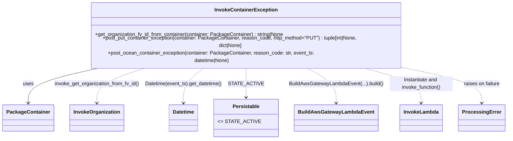

# Diagram: partview_core/partview_service/partview_service/utility/InvokeContainerException.py

> Auto-generated by Obscura crawlers

## Mermaid

### SVG

<svg id="container" width="1567.55859375" xmlns="http://www.w3.org/2000/svg" class="classDiagram" height="408" viewBox="0 0 1567.55859375 408" role="graphics-document document" aria-roledescription="class"><g><defs><marker id="container_class-aggregationStart" class="marker aggregation class" refX="18" refY="7" markerWidth="190" markerHeight="240" orient="auto"><path d="M 18,7 L9,13 L1,7 L9,1 Z"></path></marker></defs><defs><marker id="container_class-aggregationEnd" class="marker aggregation class" refX="1" refY="7" markerWidth="20" markerHeight="28" orient="auto"><path d="M 18,7 L9,13 L1,7 L9,1 Z"></path></marker></defs><defs><marker id="container_class-extensionStart" class="marker extension class" refX="18" refY="7" markerWidth="190" markerHeight="240" orient="auto"><path d="M 1,7 L18,13 V 1 Z"></path></marker></defs><defs><marker id="container_class-extensionEnd" class="marker extension class" refX="1" refY="7" markerWidth="20" markerHeight="28" orient="auto"><path d="M 1,1 V 13 L18,7 Z"></path></marker></defs><defs><marker id="container_class-compositionStart" class="marker composition class" refX="18" refY="7" markerWidth="190" markerHeight="240" orient="auto"><path d="M 18,7 L9,13 L1,7 L9,1 Z"></path></marker></defs><defs><marker id="container_class-compositionEnd" class="marker composition class" refX="1" refY="7" markerWidth="20" markerHeight="28" orient="auto"><path d="M 18,7 L9,13 L1,7 L9,1 Z"></path></marker></defs><defs><marker id="container_class-dependencyStart" class="marker dependency class" refX="6" refY="7" markerWidth="190" markerHeight="240" orient="auto"><path d="M 5,7 L9,13 L1,7 L9,1 Z"></path></marker></defs><defs><marker id="container_class-dependencyEnd" class="marker dependency class" refX="13" refY="7" markerWidth="20" markerHeight="28" orient="auto"><path d="M 18,7 L9,13 L14,7 L9,1 Z"></path></marker></defs><defs><marker id="container_class-lollipopStart" class="marker lollipop class" refX="13" refY="7" markerWidth="190" markerHeight="240" orient="auto"><circle stroke="black" fill="transparent" cx="7" cy="7" r="6"></circle></marker></defs><defs><marker id="container_class-lollipopEnd" class="marker lollipop class" refX="1" refY="7" markerWidth="190" markerHeight="240" orient="auto"><circle stroke="black" fill="transparent" cx="7" cy="7" r="6"></circle></marker></defs><g class="root"><g class="clusters"></g><g class="edgePaths"><path d="M331.587,182L290.565,190.167C249.543,198.333,167.498,214.667,126.476,233C85.453,251.333,85.453,271.667,85.453,281.833L85.453,292" id="id_InvokeContainerException_PackageContainer_1" class="edge-thickness-normal edge-pattern-solid relation" style=";;;" data-edge="true" data-et="edge" data-id="id_InvokeContainerException_PackageContainer_1" data-points="W3sieCI6MzMxLjU4NzQ4ODUxMTAyOTQsInkiOjE4Mn0seyJ4Ijo4NS40NTMxMjUsInkiOjIzMX0seyJ4Ijo4NS40NTMxMjUsInkiOjI5OH1d" marker-end="url(#container_class-dependencyEnd)"></path><path d="M466.246,182L437.864,190.167C409.481,198.333,352.717,214.667,324.335,233C295.953,251.333,295.953,271.667,295.953,281.833L295.953,292" id="id_InvokeContainerException_InvokeOrganization_2" class="edge-thickness-normal edge-pattern-dashed relation" style=";;;" data-edge="true" data-et="edge" data-id="id_InvokeContainerException_InvokeOrganization_2" data-points="W3sieCI6NDY2LjI0NTU3Njc0NjMyMzU0LCJ5IjoxODJ9LHsieCI6Mjk1Ljk1MzEyNSwieSI6MjMxfSx7IngiOjI5NS45NTMxMjUsInkiOjI5OH1d" marker-end="url(#container_class-dependencyEnd)"></path><path d="M645.373,182L633.806,190.167C622.238,198.333,599.104,214.667,587.536,233C575.969,251.333,575.969,271.667,575.969,281.833L575.969,292" id="id_InvokeContainerException_Datetime_3" class="edge-thickness-normal edge-pattern-dashed relation" style=";;;" data-edge="true" data-et="edge" data-id="id_InvokeContainerException_Datetime_3" data-points="W3sieCI6NjQ1LjM3MzIxOTIwOTU1ODgsInkiOjE4Mn0seyJ4Ijo1NzUuOTY4NzUsInkiOjIzMX0seyJ4Ijo1NzUuOTY4NzUsInkiOjI5OH1d" marker-end="url(#container_class-dependencyEnd)"></path><path d="M768.602,182L768.602,190.167C768.602,198.333,768.602,214.667,768.602,230C768.602,245.333,768.602,259.667,768.602,266.833L768.602,274" id="id_InvokeContainerException_Persistable_4" class="edge-thickness-normal edge-pattern-dashed relation" style=";;;" data-edge="true" data-et="edge" data-id="id_InvokeContainerException_Persistable_4" data-points="W3sieCI6NzY4LjYwMTU2MjUsInkiOjE4Mn0seyJ4Ijo3NjguNjAxNTYyNSwieSI6MjMxfSx7IngiOjc2OC42MDE1NjI1LCJ5IjoyODB9XQ==" marker-end="url(#container_class-dependencyEnd)"></path><path d="M939.68,182L955.74,190.167C971.799,198.333,1003.917,214.667,1019.976,233C1036.035,251.333,1036.035,271.667,1036.035,281.833L1036.035,292" id="id_InvokeContainerException_BuildAwsGatewayLambdaEvent_5" class="edge-thickness-normal edge-pattern-dashed relation" style=";;;" data-edge="true" data-et="edge" data-id="id_InvokeContainerException_BuildAwsGatewayLambdaEvent_5" data-points="W3sieCI6OTM5LjY4MDQwNTU2MDY2MTcsInkiOjE4Mn0seyJ4IjoxMDM2LjAzNTE1NjI1LCJ5IjoyMzF9LHsieCI6MTAzNi4wMzUxNTYyNSwieSI6Mjk4fV0=" marker-end="url(#container_class-dependencyEnd)"></path><path d="M1111.776,182L1143.99,190.167C1176.204,198.333,1240.631,214.667,1272.845,233C1305.059,251.333,1305.059,271.667,1305.059,281.833L1305.059,292" id="id_InvokeContainerException_InvokeLambda_6" class="edge-thickness-normal edge-pattern-dashed relation" style=";;;" data-edge="true" data-et="edge" data-id="id_InvokeContainerException_InvokeLambda_6" data-points="W3sieCI6MTExMS43NzYyODEwMjAyMjA3LCJ5IjoxODJ9LHsieCI6MTMwNS4wNTg1OTM3NSwieSI6MjMxfSx7IngiOjEzMDUuMDU4NTkzNzUsInkiOjI5OH1d" marker-end="url(#container_class-dependencyEnd)"></path><path d="M1230.117,182L1273.439,190.167C1316.762,198.333,1403.406,214.667,1446.728,233C1490.051,251.333,1490.051,271.667,1490.051,281.833L1490.051,292" id="id_InvokeContainerException_ProcessingError_7" class="edge-thickness-normal edge-pattern-dashed relation" style=";;;" data-edge="true" data-et="edge" data-id="id_InvokeContainerException_ProcessingError_7" data-points="W3sieCI6MTIzMC4xMTY4NzE1NTMzMDg4LCJ5IjoxODJ9LHsieCI6MTQ5MC4wNTA3ODEyNSwieSI6MjMxfSx7IngiOjE0OTAuMDUwNzgxMjUsInkiOjI5OH1d" marker-end="url(#container_class-dependencyEnd)"></path></g><g class="edgeLabels"><g class="edgeLabel" transform="translate(85.453125, 231)"><g class="label" data-id="id_InvokeContainerException_PackageContainer_1" transform="translate(-16.4921875, -12)"><foreignObject width="32.984375" height="24">

uses

</foreignObject></g></g><g class="edgeLabel" transform="translate(295.953125, 231)"><g class="label" data-id="id_InvokeContainerException_InvokeOrganization_2" transform="translate(-136.1953125, -12)"><foreignObject width="272.390625" height="24">

invoke_get_organization_from_fv_id()

</foreignObject></g></g><g class="edgeLabel" transform="translate(575.96875, 231)"><g class="label" data-id="id_InvokeContainerException_Datetime_3" transform="translate(-123.8203125, -12)"><foreignObject width="247.640625" height="24">

Datetime(event_ts).get_datetime()

</foreignObject></g></g><g class="edgeLabel" transform="translate(768.6015625, 231)"><g class="label" data-id="id_InvokeContainerException_Persistable_4" transform="translate(-48.8125, -12)"><foreignObject width="97.625" height="24">

STATE_ACTIVE

</foreignObject></g></g><g class="edgeLabel" transform="translate(1036.03515625, 231)"><g class="label" data-id="id_InvokeContainerException_BuildAwsGatewayLambdaEvent_5" transform="translate(-149.0234375, -12)"><foreignObject width="298.046875" height="24">

BuildAwsGatewayLambdaEvent(...).build()

</foreignObject></g></g><g class="edgeLabel" transform="translate(1305.05859375, 231)"><g class="label" data-id="id_InvokeContainerException_InvokeLambda_6" transform="translate(-100, -24)"><foreignObject width="200" height="48">

Instantiate and invoke_function()

</foreignObject></g></g><g class="edgeLabel" transform="translate(1490.05078125, 231)"><g class="label" data-id="id_InvokeContainerException_ProcessingError_7" transform="translate(-58.171875, -12)"><foreignObject width="116.34375" height="24">

raises on failure

</foreignObject></g></g></g><g class="nodes"><g class="node default" id="classId-InvokeContainerException-0" transform="translate(768.6015625, 95)"><g class="basic label-container"><path d="M-509.82421875 -87 L509.82421875 -87 L509.82421875 87 L-509.82421875 87" stroke="none" stroke-width="0" fill="#ECECFF" style=""></path><path d="M-509.82421875 -87 C-119.84932056290609 -87, 270.1255776241878 -87, 509.82421875 -87 M-509.82421875 -87 C-196.22110872531266 -87, 117.38200129937468 -87, 509.82421875 -87 M509.82421875 -87 C509.82421875 -28.700950751167575, 509.82421875 29.59809849766485, 509.82421875 87 M509.82421875 -87 C509.82421875 -43.66330745972013, 509.82421875 -0.3266149194402601, 509.82421875 87 M509.82421875 87 C138.07489772169504 87, -233.67442330660992 87, -509.82421875 87 M509.82421875 87 C265.28876770053085 87, 20.75331665106171 87, -509.82421875 87 M-509.82421875 87 C-509.82421875 20.19453924571647, -509.82421875 -46.61092150856706, -509.82421875 -87 M-509.82421875 87 C-509.82421875 41.342054074092104, -509.82421875 -4.315891851815792, -509.82421875 -87" stroke="#9370DB" stroke-width="1.3" fill="none" stroke-dasharray="0 0" style=""></path></g><g class="annotation-group text" transform="translate(0, -63)"></g><g class="label-group text" transform="translate(-95.6484375, -63)"><g class="label" style="font-weight: bolder" transform="translate(0,-12)"><foreignObject width="191.296875" height="24">

InvokeContainerException

</foreignObject></g></g><g class="members-group text" transform="translate(-497.82421875, -15)"></g><g class="methods-group text" transform="translate(-497.82421875, 15)"><g class="label" style="" transform="translate(0,-12)"><foreignObject width="606.5" height="24">

+get_organization_fv_id_from_container(container: PackageContainer) : string|None

</foreignObject></g><g class="label" style="" transform="translate(0,12)"><foreignObject width="900" height="24">

+post_put_container_exception(container: PackageContainer, reason_code, http_method="PUT") : tuple[int|None, dict|None]

</foreignObject></g><g class="label" style="" transform="translate(0,36)"><foreignObject width="775.21875" height="24">

+post_ocean_container_exception(container: PackageContainer, reason_code: str, event_ts: datetime|None)

</foreignObject></g></g><g class="divider" style=""><path d="M-509.82421875 -39 C-188.53583298864316 -39, 132.75255277271367 -39, 509.82421875 -39 M-509.82421875 -39 C-210.0206553804524 -39, 89.78290798909518 -39, 509.82421875 -39" stroke="#9370DB" stroke-width="1.3" fill="none" stroke-dasharray="0 0" style=""></path></g><g class="divider" style=""><path d="M-509.82421875 -15 C-269.6647822337252 -15, -29.50534571745044 -15, 509.82421875 -15 M-509.82421875 -15 C-110.0632777982076 -15, 289.6976631535848 -15, 509.82421875 -15" stroke="#9370DB" stroke-width="1.3" fill="none" stroke-dasharray="0 0" style=""></path></g></g><g class="node default" id="classId-PackageContainer-1" transform="translate(85.453125, 340)"><g class="basic label-container"><path d="M-77.453125 -42 L77.453125 -42 L77.453125 42 L-77.453125 42" stroke="none" stroke-width="0" fill="#ECECFF" style=""></path><path d="M-77.453125 -42 C-38.84384561042357 -42, -0.2345662208471424 -42, 77.453125 -42 M-77.453125 -42 C-22.383773556965394 -42, 32.68557788606921 -42, 77.453125 -42 M77.453125 -42 C77.453125 -24.595311965622418, 77.453125 -7.190623931244836, 77.453125 42 M77.453125 -42 C77.453125 -9.565608761893309, 77.453125 22.868782476213383, 77.453125 42 M77.453125 42 C34.99134993816815 42, -7.470425123663702 42, -77.453125 42 M77.453125 42 C37.81710553058854 42, -1.8189139388229165 42, -77.453125 42 M-77.453125 42 C-77.453125 17.22962199088471, -77.453125 -7.5407560182305815, -77.453125 -42 M-77.453125 42 C-77.453125 16.52142232091936, -77.453125 -8.95715535816128, -77.453125 -42" stroke="#9370DB" stroke-width="1.3" fill="none" stroke-dasharray="0 0" style=""></path></g><g class="annotation-group text" transform="translate(0, -18)"></g><g class="label-group text" transform="translate(-65.453125, -18)"><g class="label" style="font-weight: bolder" transform="translate(0,-12)"><foreignObject width="130.90625" height="24">

PackageContainer

</foreignObject></g></g><g class="members-group text" transform="translate(-65.453125, 30)"></g><g class="methods-group text" transform="translate(-65.453125, 60)"></g><g class="divider" style=""><path d="M-77.453125 6 C-41.73850196049756 6, -6.0238789209951165 6, 77.453125 6 M-77.453125 6 C-30.487994105939542 6, 16.477136788120916 6, 77.453125 6" stroke="#9370DB" stroke-width="1.3" fill="none" stroke-dasharray="0 0" style=""></path></g><g class="divider" style=""><path d="M-77.453125 24 C-43.58085627706251 24, -9.708587554125018 24, 77.453125 24 M-77.453125 24 C-45.329304376578904 24, -13.205483753157807 24, 77.453125 24" stroke="#9370DB" stroke-width="1.3" fill="none" stroke-dasharray="0 0" style=""></path></g></g><g class="node default" id="classId-InvokeOrganization-2" transform="translate(295.953125, 340)"><g class="basic label-container"><path d="M-83.046875 -42 L83.046875 -42 L83.046875 42 L-83.046875 42" stroke="none" stroke-width="0" fill="#ECECFF" style=""></path><path d="M-83.046875 -42 C-23.267958326690625 -42, 36.51095834661875 -42, 83.046875 -42 M-83.046875 -42 C-24.078047170307798 -42, 34.890780659384404 -42, 83.046875 -42 M83.046875 -42 C83.046875 -13.54554465281074, 83.046875 14.90891069437852, 83.046875 42 M83.046875 -42 C83.046875 -13.267968757399942, 83.046875 15.464062485200117, 83.046875 42 M83.046875 42 C45.88149875230081 42, 8.716122504601614 42, -83.046875 42 M83.046875 42 C37.805944595737294 42, -7.434985808525411 42, -83.046875 42 M-83.046875 42 C-83.046875 13.823901085443776, -83.046875 -14.352197829112448, -83.046875 -42 M-83.046875 42 C-83.046875 21.836366530638188, -83.046875 1.672733061276375, -83.046875 -42" stroke="#9370DB" stroke-width="1.3" fill="none" stroke-dasharray="0 0" style=""></path></g><g class="annotation-group text" transform="translate(0, -18)"></g><g class="label-group text" transform="translate(-71.046875, -18)"><g class="label" style="font-weight: bolder" transform="translate(0,-12)"><foreignObject width="142.09375" height="24">

InvokeOrganization

</foreignObject></g></g><g class="members-group text" transform="translate(-71.046875, 30)"></g><g class="methods-group text" transform="translate(-71.046875, 60)"></g><g class="divider" style=""><path d="M-83.046875 6 C-20.360009724281653 6, 42.326855551436694 6, 83.046875 6 M-83.046875 6 C-35.53440552836968 6, 11.978063943260636 6, 83.046875 6" stroke="#9370DB" stroke-width="1.3" fill="none" stroke-dasharray="0 0" style=""></path></g><g class="divider" style=""><path d="M-83.046875 24 C-42.754821728373244 24, -2.4627684567464883 24, 83.046875 24 M-83.046875 24 C-31.13843971102873 24, 20.769995577942538 24, 83.046875 24" stroke="#9370DB" stroke-width="1.3" fill="none" stroke-dasharray="0 0" style=""></path></g></g><g class="node default" id="classId-InvokeLambda-3" transform="translate(1305.05859375, 340)"><g class="basic label-container"><path d="M-65.484375 -42 L65.484375 -42 L65.484375 42 L-65.484375 42" stroke="none" stroke-width="0" fill="#ECECFF" style=""></path><path d="M-65.484375 -42 C-29.808585303760772 -42, 5.867204392478456 -42, 65.484375 -42 M-65.484375 -42 C-36.01024960251251 -42, -6.536124205025018 -42, 65.484375 -42 M65.484375 -42 C65.484375 -13.313605627925611, 65.484375 15.372788744148778, 65.484375 42 M65.484375 -42 C65.484375 -21.603150113962982, 65.484375 -1.206300227925965, 65.484375 42 M65.484375 42 C24.81530491481439 42, -15.853765170371219 42, -65.484375 42 M65.484375 42 C23.047367517623094 42, -19.389639964753812 42, -65.484375 42 M-65.484375 42 C-65.484375 13.386045959846253, -65.484375 -15.227908080307493, -65.484375 -42 M-65.484375 42 C-65.484375 20.261769658522674, -65.484375 -1.4764606829546523, -65.484375 -42" stroke="#9370DB" stroke-width="1.3" fill="none" stroke-dasharray="0 0" style=""></path></g><g class="annotation-group text" transform="translate(0, -18)"></g><g class="label-group text" transform="translate(-53.484375, -18)"><g class="label" style="font-weight: bolder" transform="translate(0,-12)"><foreignObject width="106.96875" height="24">

InvokeLambda

</foreignObject></g></g><g class="members-group text" transform="translate(-53.484375, 30)"></g><g class="methods-group text" transform="translate(-53.484375, 60)"></g><g class="divider" style=""><path d="M-65.484375 6 C-20.672936078106872 6, 24.138502843786256 6, 65.484375 6 M-65.484375 6 C-21.359041441850216 6, 22.766292116299567 6, 65.484375 6" stroke="#9370DB" stroke-width="1.3" fill="none" stroke-dasharray="0 0" style=""></path></g><g class="divider" style=""><path d="M-65.484375 24 C-23.6739891747144 24, 18.1363966505712 24, 65.484375 24 M-65.484375 24 C-22.760027891282306 24, 19.96431921743539 24, 65.484375 24" stroke="#9370DB" stroke-width="1.3" fill="none" stroke-dasharray="0 0" style=""></path></g></g><g class="node default" id="classId-BuildAwsGatewayLambdaEvent-4" transform="translate(1036.03515625, 340)"><g class="basic label-container"><path d="M-126.015625 -42 L126.015625 -42 L126.015625 42 L-126.015625 42" stroke="none" stroke-width="0" fill="#ECECFF" style=""></path><path d="M-126.015625 -42 C-71.6677575920085 -42, -17.319890184016998 -42, 126.015625 -42 M-126.015625 -42 C-51.48043638006385 -42, 23.0547522398723 -42, 126.015625 -42 M126.015625 -42 C126.015625 -13.004243701494296, 126.015625 15.991512597011408, 126.015625 42 M126.015625 -42 C126.015625 -15.308629763412782, 126.015625 11.382740473174437, 126.015625 42 M126.015625 42 C50.99551399123183 42, -24.024597017536337 42, -126.015625 42 M126.015625 42 C37.807984122467744 42, -50.39965675506451 42, -126.015625 42 M-126.015625 42 C-126.015625 13.66343304309142, -126.015625 -14.67313391381716, -126.015625 -42 M-126.015625 42 C-126.015625 22.69062106792557, -126.015625 3.3812421358511386, -126.015625 -42" stroke="#9370DB" stroke-width="1.3" fill="none" stroke-dasharray="0 0" style=""></path></g><g class="annotation-group text" transform="translate(0, -18)"></g><g class="label-group text" transform="translate(-114.015625, -18)"><g class="label" style="font-weight: bolder" transform="translate(0,-12)"><foreignObject width="228.03125" height="24">

BuildAwsGatewayLambdaEvent

</foreignObject></g></g><g class="members-group text" transform="translate(-114.015625, 30)"></g><g class="methods-group text" transform="translate(-114.015625, 60)"></g><g class="divider" style=""><path d="M-126.015625 6 C-45.18042866121661 6, 35.65476767756678 6, 126.015625 6 M-126.015625 6 C-63.00035949231631 6, 0.014906015367373016 6, 126.015625 6" stroke="#9370DB" stroke-width="1.3" fill="none" stroke-dasharray="0 0" style=""></path></g><g class="divider" style=""><path d="M-126.015625 24 C-29.134218206782577 24, 67.74718858643485 24, 126.015625 24 M-126.015625 24 C-34.94767172118581 24, 56.120281557628374 24, 126.015625 24" stroke="#9370DB" stroke-width="1.3" fill="none" stroke-dasharray="0 0" style=""></path></g></g><g class="node default" id="classId-Datetime-5" transform="translate(575.96875, 340)"><g class="basic label-container"><path d="M-45.3984375 -42 L45.3984375 -42 L45.3984375 42 L-45.3984375 42" stroke="none" stroke-width="0" fill="#ECECFF" style=""></path><path d="M-45.3984375 -42 C-10.076286270962889 -42, 25.245864958074222 -42, 45.3984375 -42 M-45.3984375 -42 C-9.371814584105692 -42, 26.654808331788615 -42, 45.3984375 -42 M45.3984375 -42 C45.3984375 -15.818600852204419, 45.3984375 10.362798295591162, 45.3984375 42 M45.3984375 -42 C45.3984375 -11.13548539036643, 45.3984375 19.72902921926714, 45.3984375 42 M45.3984375 42 C13.82209633697493 42, -17.75424482605014 42, -45.3984375 42 M45.3984375 42 C17.424149909979587 42, -10.550137680040827 42, -45.3984375 42 M-45.3984375 42 C-45.3984375 20.521321102406517, -45.3984375 -0.9573577951869652, -45.3984375 -42 M-45.3984375 42 C-45.3984375 20.63752877376795, -45.3984375 -0.7249424524640986, -45.3984375 -42" stroke="#9370DB" stroke-width="1.3" fill="none" stroke-dasharray="0 0" style=""></path></g><g class="annotation-group text" transform="translate(0, -18)"></g><g class="label-group text" transform="translate(-33.3984375, -18)"><g class="label" style="font-weight: bolder" transform="translate(0,-12)"><foreignObject width="66.796875" height="24">

Datetime

</foreignObject></g></g><g class="members-group text" transform="translate(-33.3984375, 30)"></g><g class="methods-group text" transform="translate(-33.3984375, 60)"></g><g class="divider" style=""><path d="M-45.3984375 6 C-16.168965696598033 6, 13.060506106803935 6, 45.3984375 6 M-45.3984375 6 C-15.96657648927522 6, 13.465284521449561 6, 45.3984375 6" stroke="#9370DB" stroke-width="1.3" fill="none" stroke-dasharray="0 0" style=""></path></g><g class="divider" style=""><path d="M-45.3984375 24 C-9.492323159414532 24, 26.413791181170936 24, 45.3984375 24 M-45.3984375 24 C-22.366598903363627 24, 0.6652396932727456 24, 45.3984375 24" stroke="#9370DB" stroke-width="1.3" fill="none" stroke-dasharray="0 0" style=""></path></g></g><g class="node default" id="classId-Persistable-6" transform="translate(768.6015625, 340)"><g class="basic label-container"><path d="M-91.41796875 -60 L91.41796875 -60 L91.41796875 60 L-91.41796875 60" stroke="none" stroke-width="0" fill="#ECECFF" style=""></path><path d="M-91.41796875 -60 C-54.38274078774709 -60, -17.347512825494178 -60, 91.41796875 -60 M-91.41796875 -60 C-42.40071116096259 -60, 6.616546428074827 -60, 91.41796875 -60 M91.41796875 -60 C91.41796875 -30.435647259012693, 91.41796875 -0.8712945180253868, 91.41796875 60 M91.41796875 -60 C91.41796875 -23.550640039004882, 91.41796875 12.898719921990235, 91.41796875 60 M91.41796875 60 C40.7860120411381 60, -9.8459446677238 60, -91.41796875 60 M91.41796875 60 C29.48867243073809 60, -32.44062388852382 60, -91.41796875 60 M-91.41796875 60 C-91.41796875 30.511182007333527, -91.41796875 1.0223640146670547, -91.41796875 -60 M-91.41796875 60 C-91.41796875 16.260094361852047, -91.41796875 -27.479811276295905, -91.41796875 -60" stroke="#9370DB" stroke-width="1.3" fill="none" stroke-dasharray="0 0" style=""></path></g><g class="annotation-group text" transform="translate(0, -36)"></g><g class="label-group text" transform="translate(-40.9765625, -36)"><g class="label" style="font-weight: bolder" transform="translate(0,-12)"><foreignObject width="81.953125" height="24">

Persistable

</foreignObject></g></g><g class="members-group text" transform="translate(-79.41796875, 12)"><g class="label" style="" transform="translate(0,-12)"><foreignObject width="117.859375" height="24">

&lt;&gt; STATE_ACTIVE

</foreignObject></g></g><g class="methods-group text" transform="translate(-79.41796875, 60)"></g><g class="divider" style=""><path d="M-91.41796875 -12 C-39.379135062871214 -12, 12.659698624257572 -12, 91.41796875 -12 M-91.41796875 -12 C-45.74175679030795 -12, -0.06554483061590588 -12, 91.41796875 -12" stroke="#9370DB" stroke-width="1.3" fill="none" stroke-dasharray="0 0" style=""></path></g><g class="divider" style=""><path d="M-91.41796875 36 C-23.262209110826234 36, 44.89355052834753 36, 91.41796875 36 M-91.41796875 36 C-44.90978993076058 36, 1.598388888478837 36, 91.41796875 36" stroke="#9370DB" stroke-width="1.3" fill="none" stroke-dasharray="0 0" style=""></path></g></g><g class="node default" id="classId-ProcessingError-7" transform="translate(1490.05078125, 340)"><g class="basic label-container"><path d="M-69.5078125 -42 L69.5078125 -42 L69.5078125 42 L-69.5078125 42" stroke="none" stroke-width="0" fill="#ECECFF" style=""></path><path d="M-69.5078125 -42 C-30.713539489265436 -42, 8.080733521469128 -42, 69.5078125 -42 M-69.5078125 -42 C-26.947923029511188 -42, 15.611966440977625 -42, 69.5078125 -42 M69.5078125 -42 C69.5078125 -15.539105508112193, 69.5078125 10.921788983775613, 69.5078125 42 M69.5078125 -42 C69.5078125 -24.494367711817866, 69.5078125 -6.988735423635731, 69.5078125 42 M69.5078125 42 C29.226087376838095 42, -11.05563774632381 42, -69.5078125 42 M69.5078125 42 C17.735935659691805 42, -34.03594118061639 42, -69.5078125 42 M-69.5078125 42 C-69.5078125 12.688262044976657, -69.5078125 -16.623475910046686, -69.5078125 -42 M-69.5078125 42 C-69.5078125 15.63441166321185, -69.5078125 -10.7311766735763, -69.5078125 -42" stroke="#9370DB" stroke-width="1.3" fill="none" stroke-dasharray="0 0" style=""></path></g><g class="annotation-group text" transform="translate(0, -18)"></g><g class="label-group text" transform="translate(-57.5078125, -18)"><g class="label" style="font-weight: bolder" transform="translate(0,-12)"><foreignObject width="115.015625" height="24">

ProcessingError

</foreignObject></g></g><g class="members-group text" transform="translate(-57.5078125, 30)"></g><g class="methods-group text" transform="translate(-57.5078125, 60)"></g><g class="divider" style=""><path d="M-69.5078125 6 C-26.69787898614871 6, 16.112054527702583 6, 69.5078125 6 M-69.5078125 6 C-41.36749463716405 6, -13.2271767743281 6, 69.5078125 6" stroke="#9370DB" stroke-width="1.3" fill="none" stroke-dasharray="0 0" style=""></path></g><g class="divider" style=""><path d="M-69.5078125 24 C-19.0235891450449 24, 31.460634209910197 24, 69.5078125 24 M-69.5078125 24 C-15.827357512178004 24, 37.85309747564399 24, 69.5078125 24" stroke="#9370DB" stroke-width="1.3" fill="none" stroke-dasharray="0 0" style=""></path></g></g></g></g></g></svg>
