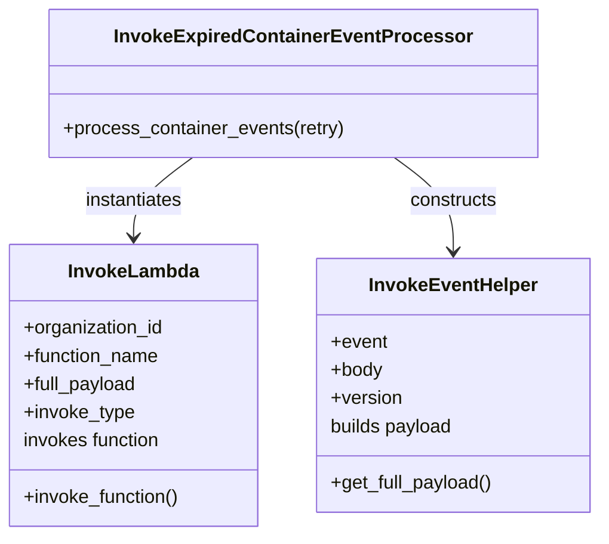

# Diagram: partview_core/partview_service/partview_service/utility/InvokeExpiredContainerEventProcessor.py

> Auto-generated by Obscura crawlers

## Mermaid

### SVG

<svg id="container" width="510.0390625" xmlns="http://www.w3.org/2000/svg" class="classDiagram" height="456" viewBox="0 0 510.0390625 456" role="graphics-document document" aria-roledescription="class"><g><defs><marker id="container_class-aggregationStart" class="marker aggregation class" refX="18" refY="7" markerWidth="190" markerHeight="240" orient="auto"><path d="M 18,7 L9,13 L1,7 L9,1 Z"></path></marker></defs><defs><marker id="container_class-aggregationEnd" class="marker aggregation class" refX="1" refY="7" markerWidth="20" markerHeight="28" orient="auto"><path d="M 18,7 L9,13 L1,7 L9,1 Z"></path></marker></defs><defs><marker id="container_class-extensionStart" class="marker extension class" refX="18" refY="7" markerWidth="190" markerHeight="240" orient="auto"><path d="M 1,7 L18,13 V 1 Z"></path></marker></defs><defs><marker id="container_class-extensionEnd" class="marker extension class" refX="1" refY="7" markerWidth="20" markerHeight="28" orient="auto"><path d="M 1,1 V 13 L18,7 Z"></path></marker></defs><defs><marker id="container_class-compositionStart" class="marker composition class" refX="18" refY="7" markerWidth="190" markerHeight="240" orient="auto"><path d="M 18,7 L9,13 L1,7 L9,1 Z"></path></marker></defs><defs><marker id="container_class-compositionEnd" class="marker composition class" refX="1" refY="7" markerWidth="20" markerHeight="28" orient="auto"><path d="M 18,7 L9,13 L1,7 L9,1 Z"></path></marker></defs><defs><marker id="container_class-dependencyStart" class="marker dependency class" refX="6" refY="7" markerWidth="190" markerHeight="240" orient="auto"><path d="M 5,7 L9,13 L1,7 L9,1 Z"></path></marker></defs><defs><marker id="container_class-dependencyEnd" class="marker dependency class" refX="13" refY="7" markerWidth="20" markerHeight="28" orient="auto"><path d="M 18,7 L9,13 L14,7 L9,1 Z"></path></marker></defs><defs><marker id="container_class-lollipopStart" class="marker lollipop class" refX="13" refY="7" markerWidth="190" markerHeight="240" orient="auto"><circle stroke="black" fill="transparent" cx="7" cy="7" r="6"></circle></marker></defs><defs><marker id="container_class-lollipopEnd" class="marker lollipop class" refX="1" refY="7" markerWidth="190" markerHeight="240" orient="auto"><circle stroke="black" fill="transparent" cx="7" cy="7" r="6"></circle></marker></defs><g class="root"><g class="clusters"></g><g class="edgePaths"><path d="M164.285,134L155.897,140.167C147.51,146.333,130.735,158.667,122.348,170C113.961,181.333,113.961,191.667,113.961,196.833L113.961,202" id="id_InvokeExpiredContainerEventProcessor_InvokeLambda_1" class="edge-thickness-normal edge-pattern-solid relation" style=";;;" data-edge="true" data-et="edge" data-id="id_InvokeExpiredContainerEventProcessor_InvokeLambda_1" data-points="W3sieCI6MTY0LjI4NDU1MDc4MTI1LCJ5IjoxMzR9LHsieCI6MTEzLjk2MDkzNzUsInkiOjE3MX0seyJ4IjoxMTMuOTYwOTM3NSwieSI6MjA4fV0=" marker-end="url(#container_class-dependencyEnd)"></path><path d="M335.657,134L344.044,140.167C352.431,146.333,369.206,158.667,377.593,172C385.98,185.333,385.98,199.667,385.98,206.833L385.98,214" id="id_InvokeExpiredContainerEventProcessor_InvokeEventHelper_2" class="edge-thickness-normal edge-pattern-solid relation" style=";;;" data-edge="true" data-et="edge" data-id="id_InvokeExpiredContainerEventProcessor_InvokeEventHelper_2" data-points="W3sieCI6MzM1LjY1Njg1NTQ2ODc1LCJ5IjoxMzR9LHsieCI6Mzg1Ljk4MDQ2ODc1LCJ5IjoxNzF9LHsieCI6Mzg1Ljk4MDQ2ODc1LCJ5IjoyMjB9XQ==" marker-end="url(#container_class-dependencyEnd)"></path></g><g class="edgeLabels"><g class="edgeLabel" transform="translate(113.9609375, 171)"><g class="label" data-id="id_InvokeExpiredContainerEventProcessor_InvokeLambda_1" transform="translate(-42.9140625, -12)"><foreignObject width="85.828125" height="24">

instantiates

</foreignObject></g></g><g class="edgeLabel" transform="translate(385.98046875, 171)"><g class="label" data-id="id_InvokeExpiredContainerEventProcessor_InvokeEventHelper_2" transform="translate(-37.84375, -12)"><foreignObject width="75.6875" height="24">

constructs

</foreignObject></g></g></g><g class="nodes"><g class="node default" id="classId-InvokeExpiredContainerEventProcessor-0" transform="translate(249.970703125, 71)"><g class="basic label-container"><path d="M-203.49609375 -63 L203.49609375 -63 L203.49609375 63 L-203.49609375 63" stroke="none" stroke-width="0" fill="#ECECFF" style=""></path><path d="M-203.49609375 -63 C-76.92223716104677 -63, 49.65161942790647 -63, 203.49609375 -63 M-203.49609375 -63 C-101.99176094652262 -63, -0.48742814304523563 -63, 203.49609375 -63 M203.49609375 -63 C203.49609375 -27.160675851860724, 203.49609375 8.678648296278553, 203.49609375 63 M203.49609375 -63 C203.49609375 -33.45545179225951, 203.49609375 -3.910903584519012, 203.49609375 63 M203.49609375 63 C47.50940185184922 63, -108.47729004630156 63, -203.49609375 63 M203.49609375 63 C92.62125497104785 63, -18.253583807904306 63, -203.49609375 63 M-203.49609375 63 C-203.49609375 37.78602667192051, -203.49609375 12.572053343841013, -203.49609375 -63 M-203.49609375 63 C-203.49609375 25.06637896580446, -203.49609375 -12.867242068391079, -203.49609375 -63" stroke="#9370DB" stroke-width="1.3" fill="none" stroke-dasharray="0 0" style=""></path></g><g class="annotation-group text" transform="translate(0, -39)"></g><g class="label-group text" transform="translate(-143.6015625, -39)"><g class="label" style="font-weight: bolder" transform="translate(0,-12)"><foreignObject width="287.203125" height="24">

InvokeExpiredContainerEventProcessor

</foreignObject></g></g><g class="members-group text" transform="translate(-191.49609375, 9)"></g><g class="methods-group text" transform="translate(-191.49609375, 39)"><g class="label" style="" transform="translate(0,-12)"><foreignObject width="239.390625" height="24">

+process_container_events(retry)

</foreignObject></g></g><g class="divider" style=""><path d="M-203.49609375 -15 C-57.13675464451228 -15, 89.22258446097544 -15, 203.49609375 -15 M-203.49609375 -15 C-117.73662981842273 -15, -31.977165886845455 -15, 203.49609375 -15" stroke="#9370DB" stroke-width="1.3" fill="none" stroke-dasharray="0 0" style=""></path></g><g class="divider" style=""><path d="M-203.49609375 9 C-72.37510231006488 9, 58.74588912987025 9, 203.49609375 9 M-203.49609375 9 C-43.87615697154703 9, 115.74377980690593 9, 203.49609375 9" stroke="#9370DB" stroke-width="1.3" fill="none" stroke-dasharray="0 0" style=""></path></g></g><g class="node default" id="classId-InvokeLambda-1" transform="translate(113.9609375, 328)"><g class="basic label-container"><path d="M-105.9609375 -120 L105.9609375 -120 L105.9609375 120 L-105.9609375 120" stroke="none" stroke-width="0" fill="#ECECFF" style=""></path><path d="M-105.9609375 -120 C-49.071088992918504 -120, 7.818759514162991 -120, 105.9609375 -120 M-105.9609375 -120 C-52.880059128922376 -120, 0.20081924215524793 -120, 105.9609375 -120 M105.9609375 -120 C105.9609375 -64.08114517685779, 105.9609375 -8.162290353715576, 105.9609375 120 M105.9609375 -120 C105.9609375 -52.042086362173364, 105.9609375 15.915827275653271, 105.9609375 120 M105.9609375 120 C61.991401407512605 120, 18.02186531502521 120, -105.9609375 120 M105.9609375 120 C57.48768139145719 120, 9.014425282914374 120, -105.9609375 120 M-105.9609375 120 C-105.9609375 55.78987877037379, -105.9609375 -8.420242459252421, -105.9609375 -120 M-105.9609375 120 C-105.9609375 36.86217561926007, -105.9609375 -46.27564876147986, -105.9609375 -120" stroke="#9370DB" stroke-width="1.3" fill="none" stroke-dasharray="0 0" style=""></path></g><g class="annotation-group text" transform="translate(0, -96)"></g><g class="label-group text" transform="translate(-53.484375, -96)"><g class="label" style="font-weight: bolder" transform="translate(0,-12)"><foreignObject width="106.96875" height="24">

InvokeLambda

</foreignObject></g></g><g class="members-group text" transform="translate(-93.9609375, -48)"><g class="label" style="" transform="translate(0,-12)"><foreignObject width="120.75" height="24">

+organization_id

</foreignObject></g><g class="label" style="" transform="translate(0,12)"><foreignObject width="117.28125" height="24">

+function_name

</foreignObject></g><g class="label" style="" transform="translate(0,36)"><foreignObject width="97.859375" height="24">

+full_payload

</foreignObject></g><g class="label" style="" transform="translate(0,60)"><foreignObject width="95.15625" height="24">

+invoke_type

</foreignObject></g><g class="label" style="" transform="translate(0,84)"><foreignObject width="120.125" height="24">

invokes function

</foreignObject></g></g><g class="methods-group text" transform="translate(-93.9609375, 96)"><g class="label" style="" transform="translate(0,-12)"><foreignObject width="134.4375" height="24">

+invoke_function()

</foreignObject></g></g><g class="divider" style=""><path d="M-105.9609375 -72 C-44.822720844847595 -72, 16.31549581030481 -72, 105.9609375 -72 M-105.9609375 -72 C-39.95684659621344 -72, 26.047244307573123 -72, 105.9609375 -72" stroke="#9370DB" stroke-width="1.3" fill="none" stroke-dasharray="0 0" style=""></path></g><g class="divider" style=""><path d="M-105.9609375 72 C-39.60488815333633 72, 26.751161193327334 72, 105.9609375 72 M-105.9609375 72 C-55.93875858805018 72, -5.916579676100355 72, 105.9609375 72" stroke="#9370DB" stroke-width="1.3" fill="none" stroke-dasharray="0 0" style=""></path></g></g><g class="node default" id="classId-InvokeEventHelper-2" transform="translate(385.98046875, 328)"><g class="basic label-container"><path d="M-116.05859375 -108 L116.05859375 -108 L116.05859375 108 L-116.05859375 108" stroke="none" stroke-width="0" fill="#ECECFF" style=""></path><path d="M-116.05859375 -108 C-28.766355953979513 -108, 58.525881842040974 -108, 116.05859375 -108 M-116.05859375 -108 C-40.481600378704655 -108, 35.09539299259069 -108, 116.05859375 -108 M116.05859375 -108 C116.05859375 -33.29279912325727, 116.05859375 41.414401753485464, 116.05859375 108 M116.05859375 -108 C116.05859375 -55.88171133068698, 116.05859375 -3.7634226613739656, 116.05859375 108 M116.05859375 108 C27.031978461430484 108, -61.99463682713903 108, -116.05859375 108 M116.05859375 108 C33.45689889871207 108, -49.14479595257586 108, -116.05859375 108 M-116.05859375 108 C-116.05859375 22.90213620860054, -116.05859375 -62.19572758279892, -116.05859375 -108 M-116.05859375 108 C-116.05859375 31.0821247685804, -116.05859375 -45.8357504628392, -116.05859375 -108" stroke="#9370DB" stroke-width="1.3" fill="none" stroke-dasharray="0 0" style=""></path></g><g class="annotation-group text" transform="translate(0, -84)"></g><g class="label-group text" transform="translate(-69.0859375, -84)"><g class="label" style="font-weight: bolder" transform="translate(0,-12)"><foreignObject width="138.171875" height="24">

InvokeEventHelper

</foreignObject></g></g><g class="members-group text" transform="translate(-104.05859375, -36)"><g class="label" style="" transform="translate(0,-12)"><foreignObject width="48.328125" height="24">

+event

</foreignObject></g><g class="label" style="" transform="translate(0,12)"><foreignObject width="44.28125" height="24">

+body

</foreignObject></g><g class="label" style="" transform="translate(0,36)"><foreignObject width="61" height="24">

+version

</foreignObject></g><g class="label" style="" transform="translate(0,60)"><foreignObject width="106.96875" height="24">

builds payload

</foreignObject></g></g><g class="methods-group text" transform="translate(-104.05859375, 84)"><g class="label" style="" transform="translate(0,-12)"><foreignObject width="139.03125" height="24">

+get_full_payload()

</foreignObject></g></g><g class="divider" style=""><path d="M-116.05859375 -60 C-41.79956407396787 -60, 32.459465602064256 -60, 116.05859375 -60 M-116.05859375 -60 C-37.05340349954932 -60, 41.95178675090136 -60, 116.05859375 -60" stroke="#9370DB" stroke-width="1.3" fill="none" stroke-dasharray="0 0" style=""></path></g><g class="divider" style=""><path d="M-116.05859375 60 C-69.62021013742705 60, -23.18182652485409 60, 116.05859375 60 M-116.05859375 60 C-49.35317215399051 60, 17.352249442018973 60, 116.05859375 60" stroke="#9370DB" stroke-width="1.3" fill="none" stroke-dasharray="0 0" style=""></path></g></g></g></g></g></svg>
