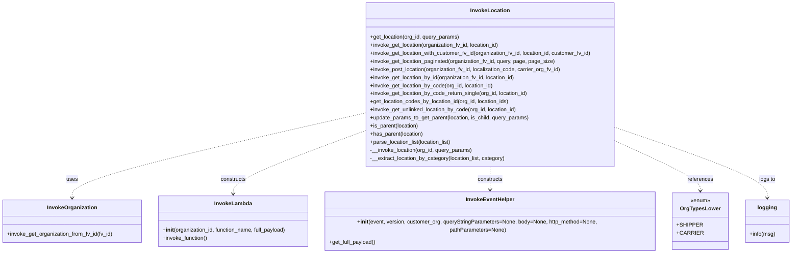

# Diagram: partview_core/partview_service/partview_service/utility/InvokeLocation.py


> Auto-generated by Obscura crawlers

## Diagram 1



### SVG

<svg id="container" width="2324.640625" xmlns="http://www.w3.org/2000/svg" class="classDiagram" height="744" viewBox="0 0 2324.640625 744" role="graphics-document document" aria-roledescription="class"><style>#container{font-family:"trebuchet ms",verdana,arial,sans-serif;font-size:16px;fill:#333;}@keyframes edge-animation-frame{from{stroke-dashoffset:0;}}@keyframes dash{to{stroke-dashoffset:0;}}#container .edge-animation-slow{stroke-dasharray:9,5!important;stroke-dashoffset:900;animation:dash 50s linear infinite;stroke-linecap:round;}#container .edge-animation-fast{stroke-dasharray:9,5!important;stroke-dashoffset:900;animation:dash 20s linear infinite;stroke-linecap:round;}#container .error-icon{fill:#552222;}#container .error-text{fill:#552222;stroke:#552222;}#container .edge-thickness-normal{stroke-width:1px;}#container .edge-thickness-thick{stroke-width:3.5px;}#container .edge-pattern-solid{stroke-dasharray:0;}#container .edge-thickness-invisible{stroke-width:0;fill:none;}#container .edge-pattern-dashed{stroke-dasharray:3;}#container .edge-pattern-dotted{stroke-dasharray:2;}#container .marker{fill:#333333;stroke:#333333;}#container .marker.cross{stroke:#333333;}#container svg{font-family:"trebuchet ms",verdana,arial,sans-serif;font-size:16px;}#container p{margin:0;}#container g.classGroup text{fill:#9370DB;stroke:none;font-family:"trebuchet ms",verdana,arial,sans-serif;font-size:10px;}#container g.classGroup text .title{font-weight:bolder;}#container .nodeLabel,#container .edgeLabel{color:#131300;}#container .edgeLabel .label rect{fill:#ECECFF;}#container .label text{fill:#131300;}#container .labelBkg{background:#ECECFF;}#container .edgeLabel .label span{background:#ECECFF;}#container .classTitle{font-weight:bolder;}#container .node rect,#container .node circle,#container .node ellipse,#container .node polygon,#container .node path{fill:#ECECFF;stroke:#9370DB;stroke-width:1px;}#container .divider{stroke:#9370DB;stroke-width:1;}#container g.clickable{cursor:pointer;}#container g.classGroup rect{fill:#ECECFF;stroke:#9370DB;}#container g.classGroup line{stroke:#9370DB;stroke-width:1;}#container .classLabel .box{stroke:none;stroke-width:0;fill:#ECECFF;opacity:0.5;}#container .classLabel .label{fill:#9370DB;font-size:10px;}#container .relation{stroke:#333333;stroke-width:1;fill:none;}#container .dashed-line{stroke-dasharray:3;}#container .dotted-line{stroke-dasharray:1 2;}#container #compositionStart,#container .composition{fill:#333333!important;stroke:#333333!important;stroke-width:1;}#container #compositionEnd,#container .composition{fill:#333333!important;stroke:#333333!important;stroke-width:1;}#container #dependencyStart,#container .dependency{fill:#333333!important;stroke:#333333!important;stroke-width:1;}#container #dependencyStart,#container .dependency{fill:#333333!important;stroke:#333333!important;stroke-width:1;}#container #extensionStart,#container .extension{fill:transparent!important;stroke:#333333!important;stroke-width:1;}#container #extensionEnd,#container .extension{fill:transparent!important;stroke:#333333!important;stroke-width:1;}#container #aggregationStart,#container .aggregation{fill:transparent!important;stroke:#333333!important;stroke-width:1;}#container #aggregationEnd,#container .aggregation{fill:transparent!important;stroke:#333333!important;stroke-width:1;}#container #lollipopStart,#container .lollipop{fill:#ECECFF!important;stroke:#333333!important;stroke-width:1;}#container #lollipopEnd,#container .lollipop{fill:#ECECFF!important;stroke:#333333!important;stroke-width:1;}#container .edgeTerminals{font-size:11px;line-height:initial;}#container .classTitleText{text-anchor:middle;font-size:18px;fill:#333;}#container .label-icon{display:inline-block;height:1em;overflow:visible;vertical-align:-0.125em;}#container .node .label-icon path{fill:currentColor;stroke:revert;stroke-width:revert;}#container :root{--mermaid-font-family:"trebuchet ms",verdana,arial,sans-serif;}</style><g><defs><marker id="container_class-aggregationStart" class="marker aggregation class" refX="18" refY="7" markerWidth="190" markerHeight="240" orient="auto"><path d="M 18,7 L9,13 L1,7 L9,1 Z"></path></marker></defs><defs><marker id="container_class-aggregationEnd" class="marker aggregation class" refX="1" refY="7" markerWidth="20" markerHeight="28" orient="auto"><path d="M 18,7 L9,13 L1,7 L9,1 Z"></path></marker></defs><defs><marker id="container_class-extensionStart" class="marker extension class" refX="18" refY="7" markerWidth="190" markerHeight="240" orient="auto"><path d="M 1,7 L18,13 V 1 Z"></path></marker></defs><defs><marker id="container_class-extensionEnd" class="marker extension class" refX="1" refY="7" markerWidth="20" markerHeight="28" orient="auto"><path d="M 1,1 V 13 L18,7 Z"></path></marker></defs><defs><marker id="container_class-compositionStart" class="marker composition class" refX="18" refY="7" markerWidth="190" markerHeight="240" orient="auto"><path d="M 18,7 L9,13 L1,7 L9,1 Z"></path></marker></defs><defs><marker id="container_class-compositionEnd" class="marker composition class" refX="1" refY="7" markerWidth="20" markerHeight="28" orient="auto"><path d="M 18,7 L9,13 L1,7 L9,1 Z"></path></marker></defs><defs><marker id="container_class-dependencyStart" class="marker dependency class" refX="6" refY="7" markerWidth="190" markerHeight="240" orient="auto"><path d="M 5,7 L9,13 L1,7 L9,1 Z"></path></marker></defs><defs><marker id="container_class-dependencyEnd" class="marker dependency class" refX="13" refY="7" markerWidth="20" markerHeight="28" orient="auto"><path d="M 18,7 L9,13 L14,7 L9,1 Z"></path></marker></defs><defs><marker id="container_class-lollipopStart" class="marker lollipop class" refX="13" refY="7" markerWidth="190" markerHeight="240" orient="auto"><circle stroke="black" fill="transparent" cx="7" cy="7" r="6"></circle></marker></defs><defs><marker id="container_class-lollipopEnd" class="marker lollipop class" refX="1" refY="7" markerWidth="190" markerHeight="240" orient="auto"><circle stroke="black" fill="transparent" cx="7" cy="7" r="6"></circle></marker></defs><g class="root"><g class="clusters"></g><g class="edgePaths"><path d="M1083.082,334.672L938.117,367.394C793.151,400.115,503.22,465.557,358.255,506.945C213.289,548.333,213.289,565.667,213.289,574.333L213.289,583" id="id_InvokeLocation_InvokeOrganization_1" class="edge-thickness-normal edge-pattern-dashed relation" style=";;;" data-edge="true" data-et="edge" data-id="id_InvokeLocation_InvokeOrganization_1" data-points="W3sieCI6MTA4My4wODIwMzEyNSwieSI6MzM0LjY3MjQ0NTAxMTI1NzU0fSx7IngiOjIxMy4yODkwNjI1LCJ5Ijo1MzF9LHsieCI6MjEzLjI4OTA2MjUsInkiOjU4OX1d" marker-end="url(#container_class-dependencyEnd)"></path><path d="M1083.082,387.418L1018.055,411.349C953.029,435.279,822.975,483.139,757.949,513.736C692.922,544.333,692.922,557.667,692.922,564.333L692.922,571" id="id_InvokeLocation_InvokeLambda_2" class="edge-thickness-normal edge-pattern-dashed relation" style=";;;" data-edge="true" data-et="edge" data-id="id_InvokeLocation_InvokeLambda_2" data-points="W3sieCI6MTA4My4wODIwMzEyNSwieSI6Mzg3LjQxODQwMjM5NDUwODd9LHsieCI6NjkyLjkyMTg3NSwieSI6NTMxfSx7IngiOjY5Mi45MjE4NzUsInkiOjU3N31d" marker-end="url(#container_class-dependencyEnd)"></path><path d="M1453.777,494L1453.777,500.167C1453.777,506.333,1453.777,518.667,1453.777,531.5C1453.777,544.333,1453.777,557.667,1453.777,564.333L1453.777,571" id="id_InvokeLocation_InvokeEventHelper_3" class="edge-thickness-normal edge-pattern-dashed relation" style=";;;" data-edge="true" data-et="edge" data-id="id_InvokeLocation_InvokeEventHelper_3" data-points="W3sieCI6MTQ1My43NzczNDM3NSwieSI6NDk0fSx7IngiOjE0NTMuNzc3MzQzNzUsInkiOjUzMX0seyJ4IjoxNDUzLjc3NzM0Mzc1LCJ5Ijo1Nzd9XQ==" marker-end="url(#container_class-dependencyEnd)"></path><path d="M1824.473,420.881L1864.521,439.234C1904.569,457.587,1984.665,494.294,2024.714,517.814C2064.762,541.333,2064.762,551.667,2064.762,556.833L2064.762,562" id="id_InvokeLocation_OrgTypesLower_4" class="edge-thickness-normal edge-pattern-dashed relation" style=";;;" data-edge="true" data-et="edge" data-id="id_InvokeLocation_OrgTypesLower_4" data-points="W3sieCI6MTgyNC40NzI2NTYyNSwieSI6NDIwLjg4MTA4MzI5Mjg0Mn0seyJ4IjoyMDY0Ljc2MTcxODc1LCJ5Ijo1MzF9LHsieCI6MjA2NC43NjE3MTg3NSwieSI6NTY4fV0=" marker-end="url(#container_class-dependencyEnd)"></path><path d="M1824.473,380.88L1895.883,405.9C1967.294,430.92,2110.116,480.96,2181.527,514.647C2252.938,548.333,2252.938,565.667,2252.938,574.333L2252.938,583" id="id_InvokeLocation_logging_5" class="edge-thickness-normal edge-pattern-dashed relation" style=";;;" data-edge="true" data-et="edge" data-id="id_InvokeLocation_logging_5" data-points="W3sieCI6MTgyNC40NzI2NTYyNSwieSI6MzgwLjg3OTcwNzcwMDk1NTZ9LHsieCI6MjI1Mi45Mzc1LCJ5Ijo1MzF9LHsieCI6MjI1Mi45Mzc1LCJ5Ijo1ODl9XQ==" marker-end="url(#container_class-dependencyEnd)"></path></g><g class="edgeLabels"><g class="edgeLabel" transform="translate(213.2890625, 531)"><g class="label" data-id="id_InvokeLocation_InvokeOrganization_1" transform="translate(-16.4921875, -12)"><foreignObject width="32.984375" height="24"><div xmlns="http://www.w3.org/1999/xhtml" class="labelBkg" style="display: table-cell; white-space: nowrap; line-height: 1.5; max-width: 200px; text-align: center;"><span class="edgeLabel"><p>uses</p></span></div></foreignObject></g></g><g class="edgeLabel" transform="translate(692.921875, 531)"><g class="label" data-id="id_InvokeLocation_InvokeLambda_2" transform="translate(-37.84375, -12)"><foreignObject width="75.6875" height="24"><div xmlns="http://www.w3.org/1999/xhtml" class="labelBkg" style="display: table-cell; white-space: nowrap; line-height: 1.5; max-width: 200px; text-align: center;"><span class="edgeLabel"><p>constructs</p></span></div></foreignObject></g></g><g class="edgeLabel" transform="translate(1453.77734375, 531)"><g class="label" data-id="id_InvokeLocation_InvokeEventHelper_3" transform="translate(-37.84375, -12)"><foreignObject width="75.6875" height="24"><div xmlns="http://www.w3.org/1999/xhtml" class="labelBkg" style="display: table-cell; white-space: nowrap; line-height: 1.5; max-width: 200px; text-align: center;"><span class="edgeLabel"><p>constructs</p></span></div></foreignObject></g></g><g class="edgeLabel" transform="translate(2064.76171875, 531)"><g class="label" data-id="id_InvokeLocation_OrgTypesLower_4" transform="translate(-37.828125, -12)"><foreignObject width="75.65625" height="24"><div xmlns="http://www.w3.org/1999/xhtml" class="labelBkg" style="display: table-cell; white-space: nowrap; line-height: 1.5; max-width: 200px; text-align: center;"><span class="edgeLabel"><p>references</p></span></div></foreignObject></g></g><g class="edgeLabel" transform="translate(2252.9375, 531)"><g class="label" data-id="id_InvokeLocation_logging_5" transform="translate(-24.3828125, -12)"><foreignObject width="48.765625" height="24"><div xmlns="http://www.w3.org/1999/xhtml" class="labelBkg" style="display: table-cell; white-space: nowrap; line-height: 1.5; max-width: 200px; text-align: center;"><span class="edgeLabel"><p>logs to</p></span></div></foreignObject></g></g></g><g class="nodes"><g class="node default" id="classId-InvokeLocation-0" transform="translate(1453.77734375, 251)"><g class="basic label-container"><path d="M-370.6953125 -243 L370.6953125 -243 L370.6953125 243 L-370.6953125 243" stroke="none" stroke-width="0" fill="#ECECFF" style=""></path><path d="M-370.6953125 -243 C-160.30334409649365 -243, 50.08862430701271 -243, 370.6953125 -243 M-370.6953125 -243 C-142.39273634528192 -243, 85.90983980943616 -243, 370.6953125 -243 M370.6953125 -243 C370.6953125 -136.04877840230063, 370.6953125 -29.097556804601282, 370.6953125 243 M370.6953125 -243 C370.6953125 -105.26339976608082, 370.6953125 32.47320046783835, 370.6953125 243 M370.6953125 243 C159.544243486614 243, -51.60682552677201 243, -370.6953125 243 M370.6953125 243 C136.56053257040008 243, -97.57424735919983 243, -370.6953125 243 M-370.6953125 243 C-370.6953125 62.967676209923184, -370.6953125 -117.06464758015363, -370.6953125 -243 M-370.6953125 243 C-370.6953125 102.96193745496254, -370.6953125 -37.076125090074925, -370.6953125 -243" stroke="#9370DB" stroke-width="1.3" fill="none" stroke-dasharray="0 0" style=""></path></g><g class="annotation-group text" transform="translate(0, -219)"></g><g class="label-group text" transform="translate(-55.703125, -219)"><g class="label" style="font-weight: bolder" transform="translate(0,-12)"><foreignObject width="111.40625" height="24"><div xmlns="http://www.w3.org/1999/xhtml" style="display: table-cell; white-space: nowrap; line-height: 1.5; max-width: 160px; text-align: center;"><span class="nodeLabel markdown-node-label" style=""><p>InvokeLocation</p></span></div></foreignObject></g></g><g class="members-group text" transform="translate(-358.6953125, -171)"></g><g class="methods-group text" transform="translate(-358.6953125, -141)"><g class="label" style="" transform="translate(0,-12)"><foreignObject width="265.421875" height="24"><div xmlns="http://www.w3.org/1999/xhtml" style="display: table-cell; white-space: nowrap; line-height: 1.5; max-width: 323px; text-align: center;"><span class="nodeLabel markdown-node-label" style=""><p>+get_location(org_id, query_params)</p></span></div></foreignObject></g><g class="label" style="" transform="translate(0,12)"><foreignObject width="387.203125" height="24"><div xmlns="http://www.w3.org/1999/xhtml" style="display: table-cell; white-space: nowrap; line-height: 1.5; max-width: 445px; text-align: center;"><span class="nodeLabel markdown-node-label" style=""><p>+invoke_get_location(organization_fv_id, location_id)</p></span></div></foreignObject></g><g class="label" style="" transform="translate(0,36)"><foreignObject width="661.6875" height="24"><div xmlns="http://www.w3.org/1999/xhtml" style="display: table-cell; white-space: nowrap; line-height: 1.5; max-width: 719px; text-align: center;"><span class="nodeLabel markdown-node-label" style=""><p>+invoke_get_location_with_customer_fv_id(organization_fv_id, location_id, customer_fv_id)</p></span></div></foreignObject></g><g class="label" style="" transform="translate(0,60)"><foreignObject width="548.53125" height="24"><div xmlns="http://www.w3.org/1999/xhtml" style="display: table-cell; white-space: nowrap; line-height: 1.5; max-width: 606px; text-align: center;"><span class="nodeLabel markdown-node-label" style=""><p>+invoke_get_location_paginated(organization_fv_id, query, page, page_size)</p></span></div></foreignObject></g><g class="label" style="" transform="translate(0,84)"><foreignObject width="571.0625" height="24"><div xmlns="http://www.w3.org/1999/xhtml" style="display: table-cell; white-space: nowrap; line-height: 1.5; max-width: 628px; text-align: center;"><span class="nodeLabel markdown-node-label" style=""><p>+invoke_post_location(organization_fv_id, localization_code, carrier_org_fv_id)</p></span></div></foreignObject></g><g class="label" style="" transform="translate(0,108)"><foreignObject width="434.765625" height="24"><div xmlns="http://www.w3.org/1999/xhtml" style="display: table-cell; white-space: nowrap; line-height: 1.5; max-width: 492px; text-align: center;"><span class="nodeLabel markdown-node-label" style=""><p>+invoke_get_location_by_id(organization_fv_id, location_id)</p></span></div></foreignObject></g><g class="label" style="" transform="translate(0,132)"><foreignObject width="367.875" height="24"><div xmlns="http://www.w3.org/1999/xhtml" style="display: table-cell; white-space: nowrap; line-height: 1.5; max-width: 425px; text-align: center;"><span class="nodeLabel markdown-node-label" style=""><p>+invoke_get_location_by_code(org_id, location_id)</p></span></div></foreignObject></g><g class="label" style="" transform="translate(0,156)"><foreignObject width="472.265625" height="24"><div xmlns="http://www.w3.org/1999/xhtml" style="display: table-cell; white-space: nowrap; line-height: 1.5; max-width: 530px; text-align: center;"><span class="nodeLabel markdown-node-label" style=""><p>+invoke_get_location_by_code_return_single(org_id, location_id)</p></span></div></foreignObject></g><g class="label" style="" transform="translate(0,180)"><foreignObject width="416.375" height="24"><div xmlns="http://www.w3.org/1999/xhtml" style="display: table-cell; white-space: nowrap; line-height: 1.5; max-width: 474px; text-align: center;"><span class="nodeLabel markdown-node-label" style=""><p>+get_location_codes_by_location_id(org_id, location_ids)</p></span></div></foreignObject></g><g class="label" style="" transform="translate(0,204)"><foreignObject width="439.484375" height="24"><div xmlns="http://www.w3.org/1999/xhtml" style="display: table-cell; white-space: nowrap; line-height: 1.5; max-width: 497px; text-align: center;"><span class="nodeLabel markdown-node-label" style=""><p>+invoke_get_unlinked_location_by_code(org_id, location_id)</p></span></div></foreignObject></g><g class="label" style="" transform="translate(0,228)"><foreignObject width="474.1875" height="24"><div xmlns="http://www.w3.org/1999/xhtml" style="display: table-cell; white-space: nowrap; line-height: 1.5; max-width: 532px; text-align: center;"><span class="nodeLabel markdown-node-label" style=""><p>+update_params_to_get_parent(location, is_child, query_params)</p></span></div></foreignObject></g><g class="label" style="" transform="translate(0,252)"><foreignObject width="145.109375" height="24"><div xmlns="http://www.w3.org/1999/xhtml" style="display: table-cell; white-space: nowrap; line-height: 1.5; max-width: 202px; text-align: center;"><span class="nodeLabel markdown-node-label" style=""><p>+is_parent(location)</p></span></div></foreignObject></g><g class="label" style="" transform="translate(0,276)"><foreignObject width="158.515625" height="24"><div xmlns="http://www.w3.org/1999/xhtml" style="display: table-cell; white-space: nowrap; line-height: 1.5; max-width: 216px; text-align: center;"><span class="nodeLabel markdown-node-label" style=""><p>+has_parent(location)</p></span></div></foreignObject></g><g class="label" style="" transform="translate(0,300)"><foreignObject width="245.890625" height="24"><div xmlns="http://www.w3.org/1999/xhtml" style="display: table-cell; white-space: nowrap; line-height: 1.5; max-width: 303px; text-align: center;"><span class="nodeLabel markdown-node-label" style=""><p>+parse_location_list(location_list)</p></span></div></foreignObject></g><g class="label" style="" transform="translate(0,324)"><foreignObject width="303.890625" height="24"><div xmlns="http://www.w3.org/1999/xhtml" style="display: table-cell; white-space: nowrap; line-height: 1.5; max-width: 361px; text-align: center;"><span class="nodeLabel markdown-node-label" style=""><p>-__invoke_location(org_id, query_params)</p></span></div></foreignObject></g><g class="label" style="" transform="translate(0,348)"><foreignObject width="403.734375" height="24"><div xmlns="http://www.w3.org/1999/xhtml" style="display: table-cell; white-space: nowrap; line-height: 1.5; max-width: 461px; text-align: center;"><span class="nodeLabel markdown-node-label" style=""><p>-__extract_location_by_category(location_list, category)</p></span></div></foreignObject></g></g><g class="divider" style=""><path d="M-370.6953125 -195 C-194.1106425083752 -195, -17.525972516750414 -195, 370.6953125 -195 M-370.6953125 -195 C-78.46163840857406 -195, 213.77203568285188 -195, 370.6953125 -195" stroke="#9370DB" stroke-width="1.3" fill="none" stroke-dasharray="0 0" style=""></path></g><g class="divider" style=""><path d="M-370.6953125 -171 C-218.5203590073964 -171, -66.34540551479279 -171, 370.6953125 -171 M-370.6953125 -171 C-172.72502713626392 -171, 25.245258227472164 -171, 370.6953125 -171" stroke="#9370DB" stroke-width="1.3" fill="none" stroke-dasharray="0 0" style=""></path></g></g><g class="node default" id="classId-InvokeOrganization-1" transform="translate(213.2890625, 652)"><g class="basic label-container"><path d="M-205.2890625 -63 L205.2890625 -63 L205.2890625 63 L-205.2890625 63" stroke="none" stroke-width="0" fill="#ECECFF" style=""></path><path d="M-205.2890625 -63 C-66.58076345467398 -63, 72.12753559065203 -63, 205.2890625 -63 M-205.2890625 -63 C-90.52199703391547 -63, 24.245068432169063 -63, 205.2890625 -63 M205.2890625 -63 C205.2890625 -28.246346357373632, 205.2890625 6.507307285252736, 205.2890625 63 M205.2890625 -63 C205.2890625 -34.52513467161151, 205.2890625 -6.050269343223022, 205.2890625 63 M205.2890625 63 C120.50913535920922 63, 35.72920821841845 63, -205.2890625 63 M205.2890625 63 C53.578127800730755 63, -98.13280689853849 63, -205.2890625 63 M-205.2890625 63 C-205.2890625 19.10771536247688, -205.2890625 -24.784569275046238, -205.2890625 -63 M-205.2890625 63 C-205.2890625 25.633824479844975, -205.2890625 -11.73235104031005, -205.2890625 -63" stroke="#9370DB" stroke-width="1.3" fill="none" stroke-dasharray="0 0" style=""></path></g><g class="annotation-group text" transform="translate(0, -39)"></g><g class="label-group text" transform="translate(-71.046875, -39)"><g class="label" style="font-weight: bolder" transform="translate(0,-12)"><foreignObject width="142.09375" height="24"><div xmlns="http://www.w3.org/1999/xhtml" style="display: table-cell; white-space: nowrap; line-height: 1.5; max-width: 190px; text-align: center;"><span class="nodeLabel markdown-node-label" style=""><p>InvokeOrganization</p></span></div></foreignObject></g></g><g class="members-group text" transform="translate(-193.2890625, 9)"></g><g class="methods-group text" transform="translate(-193.2890625, 39)"><g class="label" style="" transform="translate(0,-12)"><foreignObject width="315.53125" height="24"><div xmlns="http://www.w3.org/1999/xhtml" style="display: table-cell; white-space: nowrap; line-height: 1.5; max-width: 373px; text-align: center;"><span class="nodeLabel markdown-node-label" style=""><p>+invoke_get_organization_from_fv_id(fv_id)</p></span></div></foreignObject></g></g><g class="divider" style=""><path d="M-205.2890625 -15 C-68.95922612687554 -15, 67.37061024624893 -15, 205.2890625 -15 M-205.2890625 -15 C-64.65913162540124 -15, 75.97079924919751 -15, 205.2890625 -15" stroke="#9370DB" stroke-width="1.3" fill="none" stroke-dasharray="0 0" style=""></path></g><g class="divider" style=""><path d="M-205.2890625 9 C-81.01654432032318 9, 43.255973859353645 9, 205.2890625 9 M-205.2890625 9 C-106.37571934933918 9, -7.462376198678356 9, 205.2890625 9" stroke="#9370DB" stroke-width="1.3" fill="none" stroke-dasharray="0 0" style=""></path></g></g><g class="node default" id="classId-InvokeLambda-2" transform="translate(692.921875, 652)"><g class="basic label-container"><path d="M-224.34375 -75 L224.34375 -75 L224.34375 75 L-224.34375 75" stroke="none" stroke-width="0" fill="#ECECFF" style=""></path><path d="M-224.34375 -75 C-121.9892485807862 -75, -19.634747161572392 -75, 224.34375 -75 M-224.34375 -75 C-116.69946862142608 -75, -9.055187242852156 -75, 224.34375 -75 M224.34375 -75 C224.34375 -40.50016658535756, 224.34375 -6.000333170715123, 224.34375 75 M224.34375 -75 C224.34375 -38.5435012216971, 224.34375 -2.087002443394198, 224.34375 75 M224.34375 75 C134.181560948492 75, 44.019371896983984 75, -224.34375 75 M224.34375 75 C53.98443635219627 75, -116.37487729560746 75, -224.34375 75 M-224.34375 75 C-224.34375 28.960890392516006, -224.34375 -17.078219214967987, -224.34375 -75 M-224.34375 75 C-224.34375 44.64425879242707, -224.34375 14.28851758485414, -224.34375 -75" stroke="#9370DB" stroke-width="1.3" fill="none" stroke-dasharray="0 0" style=""></path></g><g class="annotation-group text" transform="translate(0, -51)"></g><g class="label-group text" transform="translate(-53.484375, -51)"><g class="label" style="font-weight: bolder" transform="translate(0,-12)"><foreignObject width="106.96875" height="24"><div xmlns="http://www.w3.org/1999/xhtml" style="display: table-cell; white-space: nowrap; line-height: 1.5; max-width: 156px; text-align: center;"><span class="nodeLabel markdown-node-label" style=""><p>InvokeLambda</p></span></div></foreignObject></g></g><g class="members-group text" transform="translate(-212.34375, -3)"></g><g class="methods-group text" transform="translate(-212.34375, 27)"><g class="label" style="" transform="translate(0,-12)"><foreignObject width="371.203125" height="24"><div xmlns="http://www.w3.org/1999/xhtml" style="display: table-cell; white-space: nowrap; line-height: 1.5; max-width: 460px; text-align: center;"><span class="nodeLabel markdown-node-label" style=""><p>+<strong>init</strong>(organization_id, function_name, full_payload)</p></span></div></foreignObject></g><g class="label" style="" transform="translate(0,12)"><foreignObject width="134.4375" height="24"><div xmlns="http://www.w3.org/1999/xhtml" style="display: table-cell; white-space: nowrap; line-height: 1.5; max-width: 192px; text-align: center;"><span class="nodeLabel markdown-node-label" style=""><p>+invoke_function()</p></span></div></foreignObject></g></g><g class="divider" style=""><path d="M-224.34375 -27 C-112.54830903659543 -27, -0.7528680731908537 -27, 224.34375 -27 M-224.34375 -27 C-80.47969591860775 -27, 63.38435816278451 -27, 224.34375 -27" stroke="#9370DB" stroke-width="1.3" fill="none" stroke-dasharray="0 0" style=""></path></g><g class="divider" style=""><path d="M-224.34375 -3 C-100.46238402575581 -3, 23.41898194848838 -3, 224.34375 -3 M-224.34375 -3 C-111.26707616814282 -3, 1.8095976637143565 -3, 224.34375 -3" stroke="#9370DB" stroke-width="1.3" fill="none" stroke-dasharray="0 0" style=""></path></g></g><g class="node default" id="classId-InvokeEventHelper-3" transform="translate(1453.77734375, 652)"><g class="basic label-container"><path d="M-486.51171875 -75 L486.51171875 -75 L486.51171875 75 L-486.51171875 75" stroke="none" stroke-width="0" fill="#ECECFF" style=""></path><path d="M-486.51171875 -75 C-207.7626237693321 -75, 70.98647121133581 -75, 486.51171875 -75 M-486.51171875 -75 C-251.87979250016323 -75, -17.247866250326467 -75, 486.51171875 -75 M486.51171875 -75 C486.51171875 -23.281834068403683, 486.51171875 28.436331863192635, 486.51171875 75 M486.51171875 -75 C486.51171875 -41.95571043535919, 486.51171875 -8.911420870718374, 486.51171875 75 M486.51171875 75 C136.39540206887727 75, -213.72091461224545 75, -486.51171875 75 M486.51171875 75 C255.05593219130282 75, 23.60014563260563 75, -486.51171875 75 M-486.51171875 75 C-486.51171875 19.621202565979765, -486.51171875 -35.75759486804047, -486.51171875 -75 M-486.51171875 75 C-486.51171875 27.66411994742174, -486.51171875 -19.671760105156523, -486.51171875 -75" stroke="#9370DB" stroke-width="1.3" fill="none" stroke-dasharray="0 0" style=""></path></g><g class="annotation-group text" transform="translate(0, -51)"></g><g class="label-group text" transform="translate(-69.0859375, -51)"><g class="label" style="font-weight: bolder" transform="translate(0,-12)"><foreignObject width="138.171875" height="24"><div xmlns="http://www.w3.org/1999/xhtml" style="display: table-cell; white-space: nowrap; line-height: 1.5; max-width: 187px; text-align: center;"><span class="nodeLabel markdown-node-label" style=""><p>InvokeEventHelper</p></span></div></foreignObject></g></g><g class="members-group text" transform="translate(-474.51171875, -3)"></g><g class="methods-group text" transform="translate(-474.51171875, 27)"><g class="label" style="" transform="translate(0,-12)"><foreignObject width="879.9375" height="24"><div xmlns="http://www.w3.org/1999/xhtml" style="display: table-cell; white-space: nowrap; line-height: 1.5; max-width: 969px; text-align: center;"><span class="nodeLabel markdown-node-label" style=""><p>+<strong>init</strong>(event, version, customer_org, queryStringParameters=None, body=None, http_method=None, pathParameters=None)</p></span></div></foreignObject></g><g class="label" style="" transform="translate(0,12)"><foreignObject width="139.03125" height="24"><div xmlns="http://www.w3.org/1999/xhtml" style="display: table-cell; white-space: nowrap; line-height: 1.5; max-width: 196px; text-align: center;"><span class="nodeLabel markdown-node-label" style=""><p>+get_full_payload()</p></span></div></foreignObject></g></g><g class="divider" style=""><path d="M-486.51171875 -27 C-285.1884464870959 -27, -83.86517422419189 -27, 486.51171875 -27 M-486.51171875 -27 C-247.41988390435844 -27, -8.328049058716886 -27, 486.51171875 -27" stroke="#9370DB" stroke-width="1.3" fill="none" stroke-dasharray="0 0" style=""></path></g><g class="divider" style=""><path d="M-486.51171875 -3 C-289.55070346695334 -3, -92.58968818390662 -3, 486.51171875 -3 M-486.51171875 -3 C-241.614003348994 -3, 3.2837120520119925 -3, 486.51171875 -3" stroke="#9370DB" stroke-width="1.3" fill="none" stroke-dasharray="0 0" style=""></path></g></g><g class="node default" id="classId-OrgTypesLower-4" transform="translate(2064.76171875, 652)"><g class="basic label-container"><path d="M-74.47265625 -84 L74.47265625 -84 L74.47265625 84 L-74.47265625 84" stroke="none" stroke-width="0" fill="#ECECFF" style=""></path><path d="M-74.47265625 -84 C-27.257006451367538 -84, 19.958643347264925 -84, 74.47265625 -84 M-74.47265625 -84 C-18.89785752273022 -84, 36.67694120453956 -84, 74.47265625 -84 M74.47265625 -84 C74.47265625 -46.19733651759992, 74.47265625 -8.394673035199844, 74.47265625 84 M74.47265625 -84 C74.47265625 -46.50958333523833, 74.47265625 -9.019166670476665, 74.47265625 84 M74.47265625 84 C43.269767192148166 84, 12.066878134296338 84, -74.47265625 84 M74.47265625 84 C41.371299816162015 84, 8.26994338232403 84, -74.47265625 84 M-74.47265625 84 C-74.47265625 40.04196133605755, -74.47265625 -3.9160773278849064, -74.47265625 -84 M-74.47265625 84 C-74.47265625 21.724170183705304, -74.47265625 -40.55165963258939, -74.47265625 -84" stroke="#9370DB" stroke-width="1.3" fill="none" stroke-dasharray="0 0" style=""></path></g><g class="annotation-group text" transform="translate(-29.53125, -60)"><g class="label" style="" transform="translate(0,-12)"><foreignObject width="59.0625" height="24"><div xmlns="http://www.w3.org/1999/xhtml" style="display: table-cell; white-space: nowrap; line-height: 1.5; max-width: 109px; text-align: center;"><span class="nodeLabel markdown-node-label" style=""><p>«enum»</p></span></div></foreignObject></g></g><g class="label-group text" transform="translate(-56.4453125, -36)"><g class="label" style="font-weight: bolder" transform="translate(0,-12)"><foreignObject width="112.890625" height="24"><div xmlns="http://www.w3.org/1999/xhtml" style="display: table-cell; white-space: nowrap; line-height: 1.5; max-width: 161px; text-align: center;"><span class="nodeLabel markdown-node-label" style=""><p>OrgTypesLower</p></span></div></foreignObject></g></g><g class="members-group text" transform="translate(-62.47265625, 12)"><g class="label" style="" transform="translate(0,-12)"><foreignObject width="68.5" height="24"><div xmlns="http://www.w3.org/1999/xhtml" style="display: table-cell; white-space: nowrap; line-height: 1.5; max-width: 126px; text-align: center;"><span class="nodeLabel markdown-node-label" style=""><p>+SHIPPER</p></span></div></foreignObject></g><g class="label" style="" transform="translate(0,12)"><foreignObject width="68.4375" height="24"><div xmlns="http://www.w3.org/1999/xhtml" style="display: table-cell; white-space: nowrap; line-height: 1.5; max-width: 126px; text-align: center;"><span class="nodeLabel markdown-node-label" style=""><p>+CARRIER</p></span></div></foreignObject></g></g><g class="methods-group text" transform="translate(-62.47265625, 84)"></g><g class="divider" style=""><path d="M-74.47265625 -12 C-32.14924987023812 -12, 10.174156509523755 -12, 74.47265625 -12 M-74.47265625 -12 C-18.499024097888523 -12, 37.474608054222955 -12, 74.47265625 -12" stroke="#9370DB" stroke-width="1.3" fill="none" stroke-dasharray="0 0" style=""></path></g><g class="divider" style=""><path d="M-74.47265625 60 C-38.83161992845676 60, -3.1905836069135205 60, 74.47265625 60 M-74.47265625 60 C-40.73288368834803 60, -6.993111126696064 60, 74.47265625 60" stroke="#9370DB" stroke-width="1.3" fill="none" stroke-dasharray="0 0" style=""></path></g></g><g class="node default" id="classId-logging-5" transform="translate(2252.9375, 652)"><g class="basic label-container"><path d="M-63.703125 -63 L63.703125 -63 L63.703125 63 L-63.703125 63" stroke="none" stroke-width="0" fill="#ECECFF" style=""></path><path d="M-63.703125 -63 C-34.925139047926834 -63, -6.1471530958536675 -63, 63.703125 -63 M-63.703125 -63 C-14.517636737268013 -63, 34.66785152546397 -63, 63.703125 -63 M63.703125 -63 C63.703125 -33.14252363094539, 63.703125 -3.2850472618907745, 63.703125 63 M63.703125 -63 C63.703125 -26.333241556084346, 63.703125 10.333516887831308, 63.703125 63 M63.703125 63 C24.8597741667772 63, -13.9835766664456 63, -63.703125 63 M63.703125 63 C16.612321076837446 63, -30.478482846325107 63, -63.703125 63 M-63.703125 63 C-63.703125 17.71668220695404, -63.703125 -27.56663558609192, -63.703125 -63 M-63.703125 63 C-63.703125 20.808209731073475, -63.703125 -21.38358053785305, -63.703125 -63" stroke="#9370DB" stroke-width="1.3" fill="none" stroke-dasharray="0 0" style=""></path></g><g class="annotation-group text" transform="translate(0, -39)"></g><g class="label-group text" transform="translate(-27.109375, -39)"><g class="label" style="font-weight: bolder" transform="translate(0,-12)"><foreignObject width="54.21875" height="24"><div xmlns="http://www.w3.org/1999/xhtml" style="display: table-cell; white-space: nowrap; line-height: 1.5; max-width: 103px; text-align: center;"><span class="nodeLabel markdown-node-label" style=""><p>logging</p></span></div></foreignObject></g></g><g class="members-group text" transform="translate(-51.703125, 9)"></g><g class="methods-group text" transform="translate(-51.703125, 39)"><g class="label" style="" transform="translate(0,-12)"><foreignObject width="76.296875" height="24"><div xmlns="http://www.w3.org/1999/xhtml" style="display: table-cell; white-space: nowrap; line-height: 1.5; max-width: 134px; text-align: center;"><span class="nodeLabel markdown-node-label" style=""><p>+info(msg)</p></span></div></foreignObject></g></g><g class="divider" style=""><path d="M-63.703125 -15 C-27.715899195825372 -15, 8.271326608349256 -15, 63.703125 -15 M-63.703125 -15 C-27.228792156420106 -15, 9.245540687159789 -15, 63.703125 -15" stroke="#9370DB" stroke-width="1.3" fill="none" stroke-dasharray="0 0" style=""></path></g><g class="divider" style=""><path d="M-63.703125 9 C-28.597549482908178 9, 6.508026034183644 9, 63.703125 9 M-63.703125 9 C-30.73265443760716 9, 2.237816124785681 9, 63.703125 9" stroke="#9370DB" stroke-width="1.3" fill="none" stroke-dasharray="0 0" style=""></path></g></g></g></g></g></svg>

## Diagram 2

```mermaid
flowchart TD
    subgraph LookupFlow
        A[invoke_get_location / invoke_get_location_with_customer_fv_id] --> B[Build query_params]
        B --> C[get_location(org_id, query_params)]
        C --> D[__invoke_location(org_id, query_params)]
        D --> E[InvokeLambda -> locations-get]
        E --> F[returns location_list]
        F --> G[parse_location_list(sorted(list, key=has_parent))]
        G --> H{location found?}
        H -- no --> I[retry with all=True -> __invoke_location]
        H -- yes and (is_child or is_carrier) --> J[update_params_to_get_parent(...) -> __invoke_location]
        J --> K[parse_parent_loc]
        K --> L[return final location]
        H -- yes and not child --> L
    end

    subgraph Helpers
        G --> M[__extract_location_by_category(list, "Shipper"/"Carrier")]
        M --> N[sort by is_parent]
    end
```

> SVG rendering failed for this diagram.
