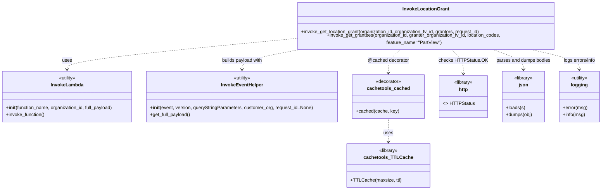

# Diagram: partview_core/partview_service/partview_service/utility/InvokeLocationGrant.py

> Auto-generated by Obscura crawlers

## Mermaid

```mermaid
classDiagram
    class InvokeLocationGrant {
        +invoke_get_location_grant(organization_id, organization_fv_id, grantors, request_id)
        +invoke_get_grantees(organization_id, granter_organization_fv_id, location_codes, feature_name="PartView")
    }
    class InvokeLambda <<utility>> {
        +__init__(function_name, organization_id, full_payload)
        +invoke_function()
    }
    class InvokeEventHelper <<utility>> {
        +__init__(event, version, queryStringParameters, customer_org, request_id=None)
        +get_full_payload()
    }
    class cachetools_TTLCache <<library>> {
        +TTLCache(maxsize, ttl)
    }
    class cachetools_cached <<decorator>> {
        +cached(cache, key)
    }
    class http <<library>> {
        <<enum>> HTTPStatus
    }
    class json <<library>> {
        +loads(s)
        +dumps(obj)
    }
    class logging <<utility>> {
        +error(msg)
        +info(msg)
    }

    InvokeLocationGrant ..> InvokeLambda : uses
    InvokeLocationGrant ..> InvokeEventHelper : builds payload with
    InvokeLocationGrant ..> cachetools_cached : @cached decorator
    cachetools_cached ..> cachetools_TTLCache : uses
    InvokeLocationGrant ..> http : checks HTTPStatus.OK
    InvokeLocationGrant ..> json : parses and dumps bodies
    InvokeLocationGrant ..> logging : logs errors/info
```

> SVG rendering failed for this diagram.
