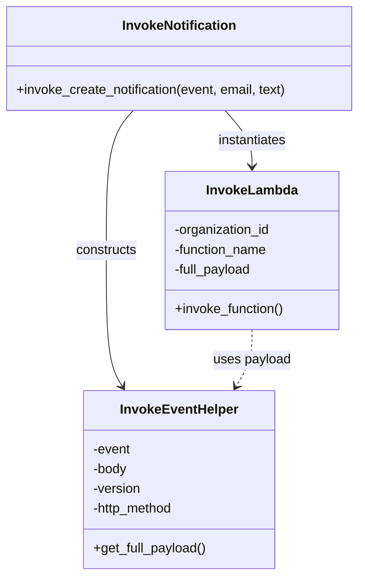

# Diagram: partview_core/partview_service/partview_service/utility/InvokeNotification.py


> Auto-generated by Obscura crawlers

## Diagram 1



### SVG

<svg id="container" width="441.84375" xmlns="http://www.w3.org/2000/svg" class="classDiagram" height="698" viewBox="0 0 441.84375 698" role="graphics-document document" aria-roledescription="class"><style>#container{font-family:"trebuchet ms",verdana,arial,sans-serif;font-size:16px;fill:#333;}@keyframes edge-animation-frame{from{stroke-dashoffset:0;}}@keyframes dash{to{stroke-dashoffset:0;}}#container .edge-animation-slow{stroke-dasharray:9,5!important;stroke-dashoffset:900;animation:dash 50s linear infinite;stroke-linecap:round;}#container .edge-animation-fast{stroke-dasharray:9,5!important;stroke-dashoffset:900;animation:dash 20s linear infinite;stroke-linecap:round;}#container .error-icon{fill:#552222;}#container .error-text{fill:#552222;stroke:#552222;}#container .edge-thickness-normal{stroke-width:1px;}#container .edge-thickness-thick{stroke-width:3.5px;}#container .edge-pattern-solid{stroke-dasharray:0;}#container .edge-thickness-invisible{stroke-width:0;fill:none;}#container .edge-pattern-dashed{stroke-dasharray:3;}#container .edge-pattern-dotted{stroke-dasharray:2;}#container .marker{fill:#333333;stroke:#333333;}#container .marker.cross{stroke:#333333;}#container svg{font-family:"trebuchet ms",verdana,arial,sans-serif;font-size:16px;}#container p{margin:0;}#container g.classGroup text{fill:#9370DB;stroke:none;font-family:"trebuchet ms",verdana,arial,sans-serif;font-size:10px;}#container g.classGroup text .title{font-weight:bolder;}#container .nodeLabel,#container .edgeLabel{color:#131300;}#container .edgeLabel .label rect{fill:#ECECFF;}#container .label text{fill:#131300;}#container .labelBkg{background:#ECECFF;}#container .edgeLabel .label span{background:#ECECFF;}#container .classTitle{font-weight:bolder;}#container .node rect,#container .node circle,#container .node ellipse,#container .node polygon,#container .node path{fill:#ECECFF;stroke:#9370DB;stroke-width:1px;}#container .divider{stroke:#9370DB;stroke-width:1;}#container g.clickable{cursor:pointer;}#container g.classGroup rect{fill:#ECECFF;stroke:#9370DB;}#container g.classGroup line{stroke:#9370DB;stroke-width:1;}#container .classLabel .box{stroke:none;stroke-width:0;fill:#ECECFF;opacity:0.5;}#container .classLabel .label{fill:#9370DB;font-size:10px;}#container .relation{stroke:#333333;stroke-width:1;fill:none;}#container .dashed-line{stroke-dasharray:3;}#container .dotted-line{stroke-dasharray:1 2;}#container #compositionStart,#container .composition{fill:#333333!important;stroke:#333333!important;stroke-width:1;}#container #compositionEnd,#container .composition{fill:#333333!important;stroke:#333333!important;stroke-width:1;}#container #dependencyStart,#container .dependency{fill:#333333!important;stroke:#333333!important;stroke-width:1;}#container #dependencyStart,#container .dependency{fill:#333333!important;stroke:#333333!important;stroke-width:1;}#container #extensionStart,#container .extension{fill:transparent!important;stroke:#333333!important;stroke-width:1;}#container #extensionEnd,#container .extension{fill:transparent!important;stroke:#333333!important;stroke-width:1;}#container #aggregationStart,#container .aggregation{fill:transparent!important;stroke:#333333!important;stroke-width:1;}#container #aggregationEnd,#container .aggregation{fill:transparent!important;stroke:#333333!important;stroke-width:1;}#container #lollipopStart,#container .lollipop{fill:#ECECFF!important;stroke:#333333!important;stroke-width:1;}#container #lollipopEnd,#container .lollipop{fill:#ECECFF!important;stroke:#333333!important;stroke-width:1;}#container .edgeTerminals{font-size:11px;line-height:initial;}#container .classTitleText{text-anchor:middle;font-size:18px;fill:#333;}#container .label-icon{display:inline-block;height:1em;overflow:visible;vertical-align:-0.125em;}#container .node .label-icon path{fill:currentColor;stroke:revert;stroke-width:revert;}#container :root{--mermaid-font-family:"trebuchet ms",verdana,arial,sans-serif;}</style><g><defs><marker id="container_class-aggregationStart" class="marker aggregation class" refX="18" refY="7" markerWidth="190" markerHeight="240" orient="auto"><path d="M 18,7 L9,13 L1,7 L9,1 Z"></path></marker></defs><defs><marker id="container_class-aggregationEnd" class="marker aggregation class" refX="1" refY="7" markerWidth="20" markerHeight="28" orient="auto"><path d="M 18,7 L9,13 L1,7 L9,1 Z"></path></marker></defs><defs><marker id="container_class-extensionStart" class="marker extension class" refX="18" refY="7" markerWidth="190" markerHeight="240" orient="auto"><path d="M 1,7 L18,13 V 1 Z"></path></marker></defs><defs><marker id="container_class-extensionEnd" class="marker extension class" refX="1" refY="7" markerWidth="20" markerHeight="28" orient="auto"><path d="M 1,1 V 13 L18,7 Z"></path></marker></defs><defs><marker id="container_class-compositionStart" class="marker composition class" refX="18" refY="7" markerWidth="190" markerHeight="240" orient="auto"><path d="M 18,7 L9,13 L1,7 L9,1 Z"></path></marker></defs><defs><marker id="container_class-compositionEnd" class="marker composition class" refX="1" refY="7" markerWidth="20" markerHeight="28" orient="auto"><path d="M 18,7 L9,13 L1,7 L9,1 Z"></path></marker></defs><defs><marker id="container_class-dependencyStart" class="marker dependency class" refX="6" refY="7" markerWidth="190" markerHeight="240" orient="auto"><path d="M 5,7 L9,13 L1,7 L9,1 Z"></path></marker></defs><defs><marker id="container_class-dependencyEnd" class="marker dependency class" refX="13" refY="7" markerWidth="20" markerHeight="28" orient="auto"><path d="M 18,7 L9,13 L14,7 L9,1 Z"></path></marker></defs><defs><marker id="container_class-lollipopStart" class="marker lollipop class" refX="13" refY="7" markerWidth="190" markerHeight="240" orient="auto"><circle stroke="black" fill="transparent" cx="7" cy="7" r="6"></circle></marker></defs><defs><marker id="container_class-lollipopEnd" class="marker lollipop class" refX="1" refY="7" markerWidth="190" markerHeight="240" orient="auto"><circle stroke="black" fill="transparent" cx="7" cy="7" r="6"></circle></marker></defs><g class="root"><g class="clusters"></g><g class="edgePaths"><path d="M164.598,134L159.085,140.167C153.572,146.333,142.546,158.667,137.033,187C131.52,215.333,131.52,259.667,131.52,304C131.52,348.333,131.52,392.667,134.797,420.149C138.074,447.631,144.629,458.262,147.906,463.577L151.184,468.893" id="id_InvokeNotification_InvokeEventHelper_1" class="edge-thickness-normal edge-pattern-solid relation" style=";;;" data-edge="true" data-et="edge" data-id="id_InvokeNotification_InvokeEventHelper_1" data-points="W3sieCI6MTY0LjU5ODM5ODQzNzUsInkiOjEzNH0seyJ4IjoxMzEuNTE5NTMxMjUsInkiOjE3MX0seyJ4IjoxMzEuNTE5NTMxMjUsInkiOjMwNH0seyJ4IjoxMzEuNTE5NTMxMjUsInkiOjQzN30seyJ4IjoxNTQuMzMyNTQzMTAzNDQ4MjcsInkiOjQ3NH1d" marker-end="url(#container_class-dependencyEnd)"></path><path d="M277.245,134L282.758,140.167C288.272,146.333,299.298,158.667,304.811,170C310.324,181.333,310.324,191.667,310.324,196.833L310.324,202" id="id_InvokeNotification_InvokeLambda_2" class="edge-thickness-normal edge-pattern-solid relation" style=";;;" data-edge="true" data-et="edge" data-id="id_InvokeNotification_InvokeLambda_2" data-points="W3sieCI6Mjc3LjI0NTM1MTU2MjUsInkiOjEzNH0seyJ4IjozMTAuMzI0MjE4NzUsInkiOjE3MX0seyJ4IjozMTAuMzI0MjE4NzUsInkiOjIwOH1d" marker-end="url(#container_class-dependencyEnd)"></path><path d="M310.324,400L310.324,406.167C310.324,412.333,310.324,424.667,307.047,436.149C303.77,447.631,297.215,458.262,293.938,463.577L290.66,468.893" id="id_InvokeLambda_InvokeEventHelper_3" class="edge-thickness-normal edge-pattern-dashed relation" style=";;;" data-edge="true" data-et="edge" data-id="id_InvokeLambda_InvokeEventHelper_3" data-points="W3sieCI6MzEwLjMyNDIxODc1LCJ5Ijo0MDB9LHsieCI6MzEwLjMyNDIxODc1LCJ5Ijo0Mzd9LHsieCI6Mjg3LjUxMTIwNjg5NjU1MTcsInkiOjQ3NH1d" marker-end="url(#container_class-dependencyEnd)"></path></g><g class="edgeLabels"><g class="edgeLabel" transform="translate(131.51953125, 304)"><g class="label" data-id="id_InvokeNotification_InvokeEventHelper_1" transform="translate(-37.84375, -12)"><foreignObject width="75.6875" height="24"><div xmlns="http://www.w3.org/1999/xhtml" class="labelBkg" style="display: table-cell; white-space: nowrap; line-height: 1.5; max-width: 200px; text-align: center;"><span class="edgeLabel"><p>constructs</p></span></div></foreignObject></g></g><g class="edgeLabel" transform="translate(310.32421875, 171)"><g class="label" data-id="id_InvokeNotification_InvokeLambda_2" transform="translate(-42.9140625, -12)"><foreignObject width="85.828125" height="24"><div xmlns="http://www.w3.org/1999/xhtml" class="labelBkg" style="display: table-cell; white-space: nowrap; line-height: 1.5; max-width: 200px; text-align: center;"><span class="edgeLabel"><p>instantiates</p></span></div></foreignObject></g></g><g class="edgeLabel" transform="translate(310.32421875, 437)"><g class="label" data-id="id_InvokeLambda_InvokeEventHelper_3" transform="translate(-47.484375, -12)"><foreignObject width="94.96875" height="24"><div xmlns="http://www.w3.org/1999/xhtml" class="labelBkg" style="display: table-cell; white-space: nowrap; line-height: 1.5; max-width: 200px; text-align: center;"><span class="edgeLabel"><p>uses payload</p></span></div></foreignObject></g></g></g><g class="nodes"><g class="node default" id="classId-InvokeNotification-0" transform="translate(220.921875, 71)"><g class="basic label-container"><path d="M-212.921875 -63 L212.921875 -63 L212.921875 63 L-212.921875 63" stroke="none" stroke-width="0" fill="#ECECFF" style=""></path><path d="M-212.921875 -63 C-126.03387402385887 -63, -39.14587304771774 -63, 212.921875 -63 M-212.921875 -63 C-71.66216896062886 -63, 69.59753707874228 -63, 212.921875 -63 M212.921875 -63 C212.921875 -37.226396486054284, 212.921875 -11.452792972108575, 212.921875 63 M212.921875 -63 C212.921875 -34.83388929352866, 212.921875 -6.667778587057313, 212.921875 63 M212.921875 63 C48.892741223234594 63, -115.13639255353081 63, -212.921875 63 M212.921875 63 C108.82675768628512 63, 4.73164037257024 63, -212.921875 63 M-212.921875 63 C-212.921875 33.60985879486287, -212.921875 4.219717589725747, -212.921875 -63 M-212.921875 63 C-212.921875 14.360054115533643, -212.921875 -34.279891768932714, -212.921875 -63" stroke="#9370DB" stroke-width="1.3" fill="none" stroke-dasharray="0 0" style=""></path></g><g class="annotation-group text" transform="translate(0, -39)"></g><g class="label-group text" transform="translate(-67.234375, -39)"><g class="label" style="font-weight: bolder" transform="translate(0,-12)"><foreignObject width="134.46875" height="24"><div xmlns="http://www.w3.org/1999/xhtml" style="display: table-cell; white-space: nowrap; line-height: 1.5; max-width: 183px; text-align: center;"><span class="nodeLabel markdown-node-label" style=""><p>InvokeNotification</p></span></div></foreignObject></g></g><g class="members-group text" transform="translate(-200.921875, 9)"></g><g class="methods-group text" transform="translate(-200.921875, 39)"><g class="label" style="" transform="translate(0,-12)"><foreignObject width="334.609375" height="24"><div xmlns="http://www.w3.org/1999/xhtml" style="display: table-cell; white-space: nowrap; line-height: 1.5; max-width: 392px; text-align: center;"><span class="nodeLabel markdown-node-label" style=""><p>+invoke_create_notification(event, email, text)</p></span></div></foreignObject></g></g><g class="divider" style=""><path d="M-212.921875 -15 C-96.2979323140022 -15, 20.326010371995608 -15, 212.921875 -15 M-212.921875 -15 C-123.15899158805561 -15, -33.39610817611123 -15, 212.921875 -15" stroke="#9370DB" stroke-width="1.3" fill="none" stroke-dasharray="0 0" style=""></path></g><g class="divider" style=""><path d="M-212.921875 9 C-107.4729322406278 9, -2.0239894812555974 9, 212.921875 9 M-212.921875 9 C-73.26390367518863 9, 66.39406764962274 9, 212.921875 9" stroke="#9370DB" stroke-width="1.3" fill="none" stroke-dasharray="0 0" style=""></path></g></g><g class="node default" id="classId-InvokeLambda-1" transform="translate(310.32421875, 304)"><g class="basic label-container"><path d="M-105.9609375 -96 L105.9609375 -96 L105.9609375 96 L-105.9609375 96" stroke="none" stroke-width="0" fill="#ECECFF" style=""></path><path d="M-105.9609375 -96 C-30.582506470345464 -96, 44.79592455930907 -96, 105.9609375 -96 M-105.9609375 -96 C-42.56222819312877 -96, 20.836481113742465 -96, 105.9609375 -96 M105.9609375 -96 C105.9609375 -52.2496058593279, 105.9609375 -8.4992117186558, 105.9609375 96 M105.9609375 -96 C105.9609375 -42.954681558924, 105.9609375 10.090636882151998, 105.9609375 96 M105.9609375 96 C46.34657320841302 96, -13.267791083173961 96, -105.9609375 96 M105.9609375 96 C54.055089465447146 96, 2.1492414308942926 96, -105.9609375 96 M-105.9609375 96 C-105.9609375 19.377854234080132, -105.9609375 -57.244291531839735, -105.9609375 -96 M-105.9609375 96 C-105.9609375 32.0862301272431, -105.9609375 -31.827539745513803, -105.9609375 -96" stroke="#9370DB" stroke-width="1.3" fill="none" stroke-dasharray="0 0" style=""></path></g><g class="annotation-group text" transform="translate(0, -72)"></g><g class="label-group text" transform="translate(-53.484375, -72)"><g class="label" style="font-weight: bolder" transform="translate(0,-12)"><foreignObject width="106.96875" height="24"><div xmlns="http://www.w3.org/1999/xhtml" style="display: table-cell; white-space: nowrap; line-height: 1.5; max-width: 156px; text-align: center;"><span class="nodeLabel markdown-node-label" style=""><p>InvokeLambda</p></span></div></foreignObject></g></g><g class="members-group text" transform="translate(-93.9609375, -24)"><g class="label" style="" transform="translate(0,-12)"><foreignObject width="119.203125" height="24"><div xmlns="http://www.w3.org/1999/xhtml" style="display: table-cell; white-space: nowrap; line-height: 1.5; max-width: 177px; text-align: center;"><span class="nodeLabel markdown-node-label" style=""><p>-organization_id</p></span></div></foreignObject></g><g class="label" style="" transform="translate(0,12)"><foreignObject width="115.75" height="24"><div xmlns="http://www.w3.org/1999/xhtml" style="display: table-cell; white-space: nowrap; line-height: 1.5; max-width: 173px; text-align: center;"><span class="nodeLabel markdown-node-label" style=""><p>-function_name</p></span></div></foreignObject></g><g class="label" style="" transform="translate(0,36)"><foreignObject width="96.328125" height="24"><div xmlns="http://www.w3.org/1999/xhtml" style="display: table-cell; white-space: nowrap; line-height: 1.5; max-width: 154px; text-align: center;"><span class="nodeLabel markdown-node-label" style=""><p>-full_payload</p></span></div></foreignObject></g></g><g class="methods-group text" transform="translate(-93.9609375, 72)"><g class="label" style="" transform="translate(0,-12)"><foreignObject width="134.4375" height="24"><div xmlns="http://www.w3.org/1999/xhtml" style="display: table-cell; white-space: nowrap; line-height: 1.5; max-width: 192px; text-align: center;"><span class="nodeLabel markdown-node-label" style=""><p>+invoke_function()</p></span></div></foreignObject></g></g><g class="divider" style=""><path d="M-105.9609375 -48 C-43.83155797579564 -48, 18.29782154840872 -48, 105.9609375 -48 M-105.9609375 -48 C-55.106019497738075 -48, -4.251101495476149 -48, 105.9609375 -48" stroke="#9370DB" stroke-width="1.3" fill="none" stroke-dasharray="0 0" style=""></path></g><g class="divider" style=""><path d="M-105.9609375 48 C-30.199400718481385 48, 45.56213606303723 48, 105.9609375 48 M-105.9609375 48 C-37.685648766415795 48, 30.58963996716841 48, 105.9609375 48" stroke="#9370DB" stroke-width="1.3" fill="none" stroke-dasharray="0 0" style=""></path></g></g><g class="node default" id="classId-InvokeEventHelper-2" transform="translate(220.921875, 582)"><g class="basic label-container"><path d="M-116.05859375 -108 L116.05859375 -108 L116.05859375 108 L-116.05859375 108" stroke="none" stroke-width="0" fill="#ECECFF" style=""></path><path d="M-116.05859375 -108 C-30.241385352800037 -108, 55.575823044399925 -108, 116.05859375 -108 M-116.05859375 -108 C-24.321640745235044 -108, 67.41531225952991 -108, 116.05859375 -108 M116.05859375 -108 C116.05859375 -30.20365497205718, 116.05859375 47.59269005588564, 116.05859375 108 M116.05859375 -108 C116.05859375 -60.961271091012854, 116.05859375 -13.922542182025708, 116.05859375 108 M116.05859375 108 C40.89411919296674 108, -34.27035536406652 108, -116.05859375 108 M116.05859375 108 C50.67973679985229 108, -14.699120150295414 108, -116.05859375 108 M-116.05859375 108 C-116.05859375 49.542868808820764, -116.05859375 -8.914262382358473, -116.05859375 -108 M-116.05859375 108 C-116.05859375 23.87189135780322, -116.05859375 -60.25621728439356, -116.05859375 -108" stroke="#9370DB" stroke-width="1.3" fill="none" stroke-dasharray="0 0" style=""></path></g><g class="annotation-group text" transform="translate(0, -84)"></g><g class="label-group text" transform="translate(-69.0859375, -84)"><g class="label" style="font-weight: bolder" transform="translate(0,-12)"><foreignObject width="138.171875" height="24"><div xmlns="http://www.w3.org/1999/xhtml" style="display: table-cell; white-space: nowrap; line-height: 1.5; max-width: 187px; text-align: center;"><span class="nodeLabel markdown-node-label" style=""><p>InvokeEventHelper</p></span></div></foreignObject></g></g><g class="members-group text" transform="translate(-104.05859375, -36)"><g class="label" style="" transform="translate(0,-12)"><foreignObject width="46.796875" height="24"><div xmlns="http://www.w3.org/1999/xhtml" style="display: table-cell; white-space: nowrap; line-height: 1.5; max-width: 104px; text-align: center;"><span class="nodeLabel markdown-node-label" style=""><p>-event</p></span></div></foreignObject></g><g class="label" style="" transform="translate(0,12)"><foreignObject width="42.75" height="24"><div xmlns="http://www.w3.org/1999/xhtml" style="display: table-cell; white-space: nowrap; line-height: 1.5; max-width: 100px; text-align: center;"><span class="nodeLabel markdown-node-label" style=""><p>-body</p></span></div></foreignObject></g><g class="label" style="" transform="translate(0,36)"><foreignObject width="59.46875" height="24"><div xmlns="http://www.w3.org/1999/xhtml" style="display: table-cell; white-space: nowrap; line-height: 1.5; max-width: 117px; text-align: center;"><span class="nodeLabel markdown-node-label" style=""><p>-version</p></span></div></foreignObject></g><g class="label" style="" transform="translate(0,60)"><foreignObject width="101.390625" height="24"><div xmlns="http://www.w3.org/1999/xhtml" style="display: table-cell; white-space: nowrap; line-height: 1.5; max-width: 159px; text-align: center;"><span class="nodeLabel markdown-node-label" style=""><p>-http_method</p></span></div></foreignObject></g></g><g class="methods-group text" transform="translate(-104.05859375, 84)"><g class="label" style="" transform="translate(0,-12)"><foreignObject width="139.03125" height="24"><div xmlns="http://www.w3.org/1999/xhtml" style="display: table-cell; white-space: nowrap; line-height: 1.5; max-width: 196px; text-align: center;"><span class="nodeLabel markdown-node-label" style=""><p>+get_full_payload()</p></span></div></foreignObject></g></g><g class="divider" style=""><path d="M-116.05859375 -60 C-42.903606977729424 -60, 30.25137979454115 -60, 116.05859375 -60 M-116.05859375 -60 C-57.906991645983595 -60, 0.24461045803280967 -60, 116.05859375 -60" stroke="#9370DB" stroke-width="1.3" fill="none" stroke-dasharray="0 0" style=""></path></g><g class="divider" style=""><path d="M-116.05859375 60 C-50.66672171157414 60, 14.725150326851718 60, 116.05859375 60 M-116.05859375 60 C-43.13313030246407 60, 29.792333145071865 60, 116.05859375 60" stroke="#9370DB" stroke-width="1.3" fill="none" stroke-dasharray="0 0" style=""></path></g></g></g></g></g></svg>

## Diagram 2

```mermaid
flowchart TD
    Start([Start]) --> ExtractOrgId[/"Extract organization_id from event"/]
    ExtractOrgId --> BuildBody{Build body dict}
    BuildBody --> UpdateEvent[/Update event with body/]
    UpdateEvent --> CreateInvokeHelper[Create InvokeEventHelper(full_payload)]
    CreateInvokeHelper --> InstantiateInvokeLambda[Instantiate InvokeLambda]
    InstantiateInvokeLambda --> InvokeFunction[Invoke invoke_function()]
    InvokeFunction --> CheckResult{status, result}
    CheckResult --> End([End])
```

> SVG rendering failed for this diagram.
