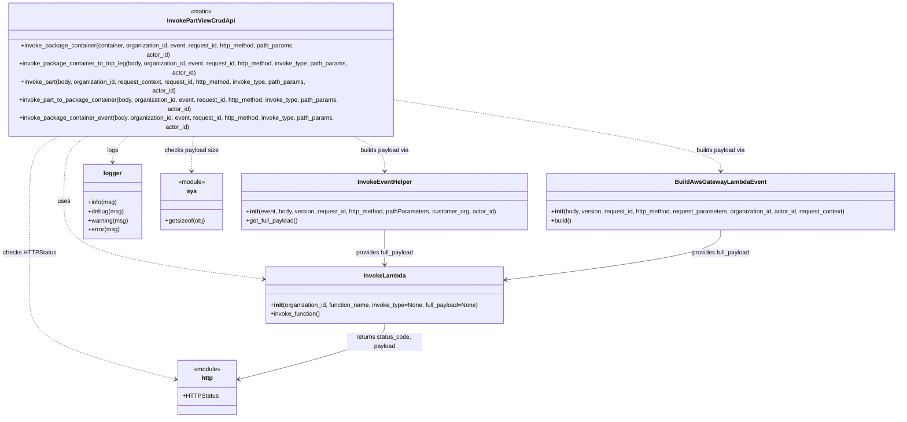

# Diagram: partview_core/partview_service/partview_service/utility/InvokePartViewCrudApi.py

> Auto-generated by Obscura crawlers

## Mermaid

### SVG

<svg id="container" width="2401.78515625" xmlns="http://www.w3.org/2000/svg" class="classDiagram" height="1000" viewBox="0 0 2401.78515625 1000" role="graphics-document document" aria-roledescription="class"><g><defs><marker id="container_class-aggregationStart" class="marker aggregation class" refX="18" refY="7" markerWidth="190" markerHeight="240" orient="auto"><path d="M 18,7 L9,13 L1,7 L9,1 Z"></path></marker></defs><defs><marker id="container_class-aggregationEnd" class="marker aggregation class" refX="1" refY="7" markerWidth="20" markerHeight="28" orient="auto"><path d="M 18,7 L9,13 L1,7 L9,1 Z"></path></marker></defs><defs><marker id="container_class-extensionStart" class="marker extension class" refX="18" refY="7" markerWidth="190" markerHeight="240" orient="auto"><path d="M 1,7 L18,13 V 1 Z"></path></marker></defs><defs><marker id="container_class-extensionEnd" class="marker extension class" refX="1" refY="7" markerWidth="20" markerHeight="28" orient="auto"><path d="M 1,1 V 13 L18,7 Z"></path></marker></defs><defs><marker id="container_class-compositionStart" class="marker composition class" refX="18" refY="7" markerWidth="190" markerHeight="240" orient="auto"><path d="M 18,7 L9,13 L1,7 L9,1 Z"></path></marker></defs><defs><marker id="container_class-compositionEnd" class="marker composition class" refX="1" refY="7" markerWidth="20" markerHeight="28" orient="auto"><path d="M 18,7 L9,13 L1,7 L9,1 Z"></path></marker></defs><defs><marker id="container_class-dependencyStart" class="marker dependency class" refX="6" refY="7" markerWidth="190" markerHeight="240" orient="auto"><path d="M 5,7 L9,13 L1,7 L9,1 Z"></path></marker></defs><defs><marker id="container_class-dependencyEnd" class="marker dependency class" refX="13" refY="7" markerWidth="20" markerHeight="28" orient="auto"><path d="M 18,7 L9,13 L14,7 L9,1 Z"></path></marker></defs><defs><marker id="container_class-lollipopStart" class="marker lollipop class" refX="13" refY="7" markerWidth="190" markerHeight="240" orient="auto"><circle stroke="black" fill="transparent" cx="7" cy="7" r="6"></circle></marker></defs><defs><marker id="container_class-lollipopEnd" class="marker lollipop class" refX="1" refY="7" markerWidth="190" markerHeight="240" orient="auto"><circle stroke="black" fill="transparent" cx="7" cy="7" r="6"></circle></marker></defs><g class="root"><g class="clusters"></g><g class="edgePaths"><path d="M258.176,254L244.08,260.167C229.984,266.333,201.791,278.667,187.694,307.5C173.598,336.333,173.598,381.667,173.598,427C173.598,472.333,173.598,517.667,261.949,551.916C350.301,586.166,527.004,609.332,615.356,620.915L703.707,632.497" id="id_InvokePartViewCrudApi_InvokeLambda_1" class="edge-thickness-normal edge-pattern-dashed relation" style=";;;" data-edge="true" data-et="edge" data-id="id_InvokePartViewCrudApi_InvokeLambda_1" data-points="W3sieCI6MjU4LjE3NjQ0MDQyOTY4NzUsInkiOjI1NH0seyJ4IjoxNzMuNTk3NjU2MjUsInkiOjI5MX0seyJ4IjoxNzMuNTk3NjU2MjUsInkiOjQyN30seyJ4IjoxNzMuNTk3NjU2MjUsInkiOjU2M30seyJ4Ijo3MDkuNjU2MjUsInkiOjYzMy4yNzczNzE1OTUyNjg1fV0=" marker-end="url(#container_class-dependencyEnd)"></path><path d="M914.926,254L933.756,260.167C952.586,266.333,990.246,278.667,1009.076,294C1027.906,309.333,1027.906,327.667,1027.906,336.833L1027.906,346" id="id_InvokePartViewCrudApi_InvokeEventHelper_2" class="edge-thickness-normal edge-pattern-dashed relation" style=";;;" data-edge="true" data-et="edge" data-id="id_InvokePartViewCrudApi_InvokeEventHelper_2" data-points="W3sieCI6OTE0LjkyNjE3MTg3NSwieSI6MjU0fSx7IngiOjEwMjcuOTA2MjUsInkiOjI5MX0seyJ4IjoxMDI3LjkwNjI1LCJ5IjozNTJ9XQ==" marker-end="url(#container_class-dependencyEnd)"></path><path d="M1070.688,192.254L1213.447,208.712C1356.207,225.17,1641.727,258.085,1784.486,283.709C1927.246,309.333,1927.246,327.667,1927.246,336.833L1927.246,346" id="id_InvokePartViewCrudApi_BuildAwsGatewayLambdaEvent_3" class="edge-thickness-normal edge-pattern-dashed relation" style=";;;" data-edge="true" data-et="edge" data-id="id_InvokePartViewCrudApi_BuildAwsGatewayLambdaEvent_3" data-points="W3sieCI6MTA3MC42ODc1LCJ5IjoxOTIuMjU0MzA5NzAxODYwMX0seyJ4IjoxOTI3LjI0NjA5Mzc1LCJ5IjoyOTF9LHsieCI6MTkyNy4yNDYwOTM3NSwieSI6MzUyfV0=" marker-end="url(#container_class-dependencyEnd)"></path><path d="M356.525,254L347.36,260.167C338.194,266.333,319.863,278.667,310.697,290C301.531,301.333,301.531,311.667,301.531,316.833L301.531,322" id="id_InvokePartViewCrudApi_logger_4" class="edge-thickness-normal edge-pattern-dashed relation" style=";;;" data-edge="true" data-et="edge" data-id="id_InvokePartViewCrudApi_logger_4" data-points="W3sieCI6MzU2LjUyNTM5MDYyNSwieSI6MjU0fSx7IngiOjMwMS41MzEyNSwieSI6MjkxfSx7IngiOjMwMS41MzEyNSwieSI6MzI4fV0=" marker-end="url(#container_class-dependencyEnd)"></path><path d="M190.809,254L173.335,260.167C155.861,266.333,120.913,278.667,103.439,307.5C85.965,336.333,85.965,381.667,85.965,427C85.965,472.333,85.965,517.667,85.965,559C85.965,600.333,85.965,637.667,85.965,677C85.965,716.333,85.965,757.667,150.937,795.026C215.91,832.385,345.855,865.77,410.828,882.462L475.8,899.155" id="id_InvokePartViewCrudApi_http_5" class="edge-thickness-normal edge-pattern-dashed relation" style=";;;" data-edge="true" data-et="edge" data-id="id_InvokePartViewCrudApi_http_5" data-points="W3sieCI6MTkwLjgwODcxNTgyMDMxMjUsInkiOjI1NH0seyJ4Ijo4NS45NjQ4NDM3NSwieSI6MjkxfSx7IngiOjg1Ljk2NDg0Mzc1LCJ5Ijo0Mjd9LHsieCI6ODUuOTY0ODQzNzUsInkiOjU2M30seyJ4Ijo4NS45NjQ4NDM3NSwieSI6Njc1fSx7IngiOjg1Ljk2NDg0Mzc1LCJ5Ijo3OTl9LHsieCI6NDgxLjYxMTMyODEyNSwieSI6OTAwLjY0Nzk4ODQ4Nzg3Mn1d" marker-end="url(#container_class-dependencyEnd)"></path><path d="M517.969,254L516.897,260.167C515.826,266.333,513.682,278.667,512.611,294C511.539,309.333,511.539,327.667,511.539,336.833L511.539,346" id="id_InvokePartViewCrudApi_sys_6" class="edge-thickness-normal edge-pattern-dashed relation" style=";;;" data-edge="true" data-et="edge" data-id="id_InvokePartViewCrudApi_sys_6" data-points="W3sieCI6NTE3Ljk2ODg5NjQ4NDM3NSwieSI6MjU0fSx7IngiOjUxMS41MzkwNjI1LCJ5IjoyOTF9LHsieCI6NTExLjUzOTA2MjUsInkiOjM1Mn1d" marker-end="url(#container_class-dependencyEnd)"></path><path d="M1027.906,750L1027.906,758.167C1027.906,766.333,1027.906,782.667,962.934,807.526C897.961,832.385,768.016,865.77,703.044,882.462L638.071,899.155" id="id_InvokeLambda_http_7" class="edge-thickness-normal edge-pattern-solid relation" style=";;;" data-edge="true" data-et="edge" data-id="id_InvokeLambda_http_7" data-points="W3sieCI6MTAyNy45MDYyNSwieSI6NzUwfSx7IngiOjEwMjcuOTA2MjUsInkiOjc5OX0seyJ4Ijo2MzIuMjU5NzY1NjI1LCJ5Ijo5MDAuNjQ3OTg4NDg3ODcyfV0=" marker-end="url(#container_class-dependencyEnd)"></path><path d="M1027.906,502L1027.906,512.167C1027.906,522.333,1027.906,542.667,1027.906,558C1027.906,573.333,1027.906,583.667,1027.906,588.833L1027.906,594" id="id_InvokeEventHelper_InvokeLambda_8" class="edge-thickness-normal edge-pattern-solid relation" style=";;;" data-edge="true" data-et="edge" data-id="id_InvokeEventHelper_InvokeLambda_8" data-points="W3sieCI6MTAyNy45MDYyNSwieSI6NTAyfSx7IngiOjEwMjcuOTA2MjUsInkiOjU2M30seyJ4IjoxMDI3LjkwNjI1LCJ5Ijo2MDB9XQ==" marker-end="url(#container_class-dependencyEnd)"></path><path d="M1927.246,502L1927.246,512.167C1927.246,522.333,1927.246,542.667,1831.39,564.771C1735.534,586.875,1543.822,610.75,1447.966,622.687L1352.11,634.625" id="id_BuildAwsGatewayLambdaEvent_InvokeLambda_9" class="edge-thickness-normal edge-pattern-solid relation" style=";;;" data-edge="true" data-et="edge" data-id="id_BuildAwsGatewayLambdaEvent_InvokeLambda_9" data-points="W3sieCI6MTkyNy4yNDYwOTM3NSwieSI6NTAyfSx7IngiOjE5MjcuMjQ2MDkzNzUsInkiOjU2M30seyJ4IjoxMzQ2LjE1NjI1LCJ5Ijo2MzUuMzY2NDg0MDk2NDA3NX1d" marker-end="url(#container_class-dependencyEnd)"></path></g><g class="edgeLabels"><g class="edgeLabel" transform="translate(173.59765625, 427)"><g class="label" data-id="id_InvokePartViewCrudApi_InvokeLambda_1" transform="translate(-16.4921875, -12)"><foreignObject width="32.984375" height="24">

uses

</foreignObject></g></g><g class="edgeLabel" transform="translate(1027.90625, 291)"><g class="label" data-id="id_InvokePartViewCrudApi_InvokeEventHelper_2" transform="translate(-66.1484375, -12)"><foreignObject width="132.296875" height="24">

builds payload via

</foreignObject></g></g><g class="edgeLabel" transform="translate(1927.24609375, 291)"><g class="label" data-id="id_InvokePartViewCrudApi_BuildAwsGatewayLambdaEvent_3" transform="translate(-66.1484375, -12)"><foreignObject width="132.296875" height="24">

builds payload via

</foreignObject></g></g><g class="edgeLabel" transform="translate(301.53125, 291)"><g class="label" data-id="id_InvokePartViewCrudApi_logger_4" transform="translate(-14.8203125, -12)"><foreignObject width="29.640625" height="24">

logs

</foreignObject></g></g><g class="edgeLabel" transform="translate(85.96484375, 563)"><g class="label" data-id="id_InvokePartViewCrudApi_http_5" transform="translate(-67.6328125, -12)"><foreignObject width="135.265625" height="24">

checks HTTPStatus

</foreignObject></g></g><g class="edgeLabel" transform="translate(511.5390625, 291)"><g class="label" data-id="id_InvokePartViewCrudApi_sys_6" transform="translate(-71.3984375, -12)"><foreignObject width="142.796875" height="24">

checks payload size

</foreignObject></g></g><g class="edgeLabel" transform="translate(1027.90625, 799)"><g class="label" data-id="id_InvokeLambda_http_7" transform="translate(-100, -24)"><foreignObject width="200" height="48">

returns status_code, payload

</foreignObject></g></g><g class="edgeLabel" transform="translate(1027.90625, 563)"><g class="label" data-id="id_InvokeEventHelper_InvokeLambda_8" transform="translate(-78.4921875, -12)"><foreignObject width="156.984375" height="24">

provides full_payload

</foreignObject></g></g><g class="edgeLabel" transform="translate(1927.24609375, 563)"><g class="label" data-id="id_BuildAwsGatewayLambdaEvent_InvokeLambda_9" transform="translate(-78.4921875, -12)"><foreignObject width="156.984375" height="24">

provides full_payload

</foreignObject></g></g></g><g class="nodes"><g class="node default" id="classId-InvokePartViewCrudApi-0" transform="translate(539.34375, 131)"><g class="basic label-container"><path d="M-531.34375 -123 L531.34375 -123 L531.34375 123 L-531.34375 123" stroke="none" stroke-width="0" fill="#ECECFF" style=""></path><path d="M-531.34375 -123 C-261.9255638858647 -123, 7.492622228270648 -123, 531.34375 -123 M-531.34375 -123 C-229.97995804033394 -123, 71.38383391933212 -123, 531.34375 -123 M531.34375 -123 C531.34375 -45.069601604264776, 531.34375 32.86079679147045, 531.34375 123 M531.34375 -123 C531.34375 -27.520089616757417, 531.34375 67.95982076648517, 531.34375 123 M531.34375 123 C259.4867094447575 123, -12.37033111048504 123, -531.34375 123 M531.34375 123 C223.7430143472468 123, -83.8577213055064 123, -531.34375 123 M-531.34375 123 C-531.34375 46.89275285020922, -531.34375 -29.21449429958156, -531.34375 -123 M-531.34375 123 C-531.34375 64.2929914355012, -531.34375 5.585982871002386, -531.34375 -123" stroke="#9370DB" stroke-width="1.3" fill="none" stroke-dasharray="0 0" style=""></path></g><g class="annotation-group text" transform="translate(-29.0234375, -99)"><g class="label" style="" transform="translate(0,-12)"><foreignObject width="58.046875" height="24">

«static»

</foreignObject></g></g><g class="label-group text" transform="translate(-85.484375, -75)"><g class="label" style="font-weight: bolder" transform="translate(0,-12)"><foreignObject width="170.96875" height="24">

InvokePartViewCrudApi

</foreignObject></g></g><g class="members-group text" transform="translate(-519.34375, -27)"></g><g class="methods-group text" transform="translate(-519.34375, 3)"><g class="label" style="" transform="translate(0,-12)"><foreignObject width="805.65625" height="24">

+invoke_package_container(container, organization_id, event, request_id, http_method, path_params, actor_id)

</foreignObject></g><g class="label" style="" transform="translate(0,12)"><foreignObject width="953.203125" height="24">

+invoke_package_container_to_trip_leg(body, organization_id, event, request_id, http_method, invoke_type, path_params, actor_id)

</foreignObject></g><g class="label" style="" transform="translate(0,36)"><foreignObject width="839.234375" height="24">

+invoke_part(body, organization_id, request_context, request_id, http_method, invoke_type, path_params, actor_id)

</foreignObject></g><g class="label" style="" transform="translate(0,60)"><foreignObject width="929.359375" height="24">

+invoke_part_to_package_container(body, organization_id, event, request_id, http_method, invoke_type, path_params, actor_id)

</foreignObject></g><g class="label" style="" transform="translate(0,84)"><foreignObject width="915.53125" height="24">

+invoke_package_container_event(body, organization_id, event, request_id, http_method, invoke_type, path_params, actor_id)

</foreignObject></g></g><g class="divider" style=""><path d="M-531.34375 -51 C-181.49267688656812 -51, 168.35839622686376 -51, 531.34375 -51 M-531.34375 -51 C-198.95329705281176 -51, 133.43715589437647 -51, 531.34375 -51" stroke="#9370DB" stroke-width="1.3" fill="none" stroke-dasharray="0 0" style=""></path></g><g class="divider" style=""><path d="M-531.34375 -27 C-189.01650869419274 -27, 153.31073261161453 -27, 531.34375 -27 M-531.34375 -27 C-269.78738898249185 -27, -8.231027964983696 -27, 531.34375 -27" stroke="#9370DB" stroke-width="1.3" fill="none" stroke-dasharray="0 0" style=""></path></g></g><g class="node default" id="classId-InvokeLambda-1" transform="translate(1027.90625, 675)"><g class="basic label-container"><path d="M-318.25 -75 L318.25 -75 L318.25 75 L-318.25 75" stroke="none" stroke-width="0" fill="#ECECFF" style=""></path><path d="M-318.25 -75 C-167.62742000625101 -75, -17.00484001250203 -75, 318.25 -75 M-318.25 -75 C-153.22075645390865 -75, 11.808487092182702 -75, 318.25 -75 M318.25 -75 C318.25 -22.630243584191838, 318.25 29.739512831616324, 318.25 75 M318.25 -75 C318.25 -23.622153638304354, 318.25 27.75569272339129, 318.25 75 M318.25 75 C136.0709030843765 75, -46.10819383124698 75, -318.25 75 M318.25 75 C139.5547340345967 75, -39.14053193080662 75, -318.25 75 M-318.25 75 C-318.25 43.04798151319605, -318.25 11.095963026392106, -318.25 -75 M-318.25 75 C-318.25 18.196576330980974, -318.25 -38.60684733803805, -318.25 -75" stroke="#9370DB" stroke-width="1.3" fill="none" stroke-dasharray="0 0" style=""></path></g><g class="annotation-group text" transform="translate(0, -51)"></g><g class="label-group text" transform="translate(-53.484375, -51)"><g class="label" style="font-weight: bolder" transform="translate(0,-12)"><foreignObject width="106.96875" height="24">

InvokeLambda

</foreignObject></g></g><g class="members-group text" transform="translate(-306.25, -3)"></g><g class="methods-group text" transform="translate(-306.25, 27)"><g class="label" style="" transform="translate(0,-12)"><foreignObject width="559.015625" height="24">

+<strong>init</strong>(organization_id, function_name, invoke_type=None, full_payload=None)

</foreignObject></g><g class="label" style="" transform="translate(0,12)"><foreignObject width="134.4375" height="24">

+invoke_function()

</foreignObject></g></g><g class="divider" style=""><path d="M-318.25 -27 C-173.9097719565442 -27, -29.56954391308841 -27, 318.25 -27 M-318.25 -27 C-122.30887141429946 -27, 73.63225717140108 -27, 318.25 -27" stroke="#9370DB" stroke-width="1.3" fill="none" stroke-dasharray="0 0" style=""></path></g><g class="divider" style=""><path d="M-318.25 -3 C-97.16358794984794 -3, 123.92282410030413 -3, 318.25 -3 M-318.25 -3 C-70.59401767287224 -3, 177.06196465425552 -3, 318.25 -3" stroke="#9370DB" stroke-width="1.3" fill="none" stroke-dasharray="0 0" style=""></path></g></g><g class="node default" id="classId-InvokeEventHelper-2" transform="translate(1027.90625, 427)"><g class="basic label-container"><path d="M-382.80078125 -75 L382.80078125 -75 L382.80078125 75 L-382.80078125 75" stroke="none" stroke-width="0" fill="#ECECFF" style=""></path><path d="M-382.80078125 -75 C-144.47255873189843 -75, 93.85566378620314 -75, 382.80078125 -75 M-382.80078125 -75 C-216.10712394324062 -75, -49.413466636481246 -75, 382.80078125 -75 M382.80078125 -75 C382.80078125 -29.485835866666257, 382.80078125 16.028328266667486, 382.80078125 75 M382.80078125 -75 C382.80078125 -40.87008885117791, 382.80078125 -6.7401777023558225, 382.80078125 75 M382.80078125 75 C119.92632734205432 75, -142.94812656589136 75, -382.80078125 75 M382.80078125 75 C111.84140085540514 75, -159.11797953918972 75, -382.80078125 75 M-382.80078125 75 C-382.80078125 22.52294285281465, -382.80078125 -29.954114294370697, -382.80078125 -75 M-382.80078125 75 C-382.80078125 37.36005573081039, -382.80078125 -0.27988853837922534, -382.80078125 -75" stroke="#9370DB" stroke-width="1.3" fill="none" stroke-dasharray="0 0" style=""></path></g><g class="annotation-group text" transform="translate(0, -51)"></g><g class="label-group text" transform="translate(-69.0859375, -51)"><g class="label" style="font-weight: bolder" transform="translate(0,-12)"><foreignObject width="138.171875" height="24">

InvokeEventHelper

</foreignObject></g></g><g class="members-group text" transform="translate(-370.80078125, -3)"></g><g class="methods-group text" transform="translate(-370.80078125, 27)"><g class="label" style="" transform="translate(0,-12)"><foreignObject width="672.515625" height="24">

+<strong>init</strong>(event, body, version, request_id, http_method, pathParameters, customer_org, actor_id)

</foreignObject></g><g class="label" style="" transform="translate(0,12)"><foreignObject width="139.03125" height="24">

+get_full_payload()

</foreignObject></g></g><g class="divider" style=""><path d="M-382.80078125 -27 C-79.27367875069586 -27, 224.25342374860827 -27, 382.80078125 -27 M-382.80078125 -27 C-175.42913277309015 -27, 31.94251570381971 -27, 382.80078125 -27" stroke="#9370DB" stroke-width="1.3" fill="none" stroke-dasharray="0 0" style=""></path></g><g class="divider" style=""><path d="M-382.80078125 -3 C-124.16918328495717 -3, 134.46241468008566 -3, 382.80078125 -3 M-382.80078125 -3 C-219.62607101134245 -3, -56.45136077268489 -3, 382.80078125 -3" stroke="#9370DB" stroke-width="1.3" fill="none" stroke-dasharray="0 0" style=""></path></g></g><g class="node default" id="classId-BuildAwsGatewayLambdaEvent-3" transform="translate(1927.24609375, 427)"><g class="basic label-container"><path d="M-466.5390625 -75 L466.5390625 -75 L466.5390625 75 L-466.5390625 75" stroke="none" stroke-width="0" fill="#ECECFF" style=""></path><path d="M-466.5390625 -75 C-268.75098397517456 -75, -70.96290545034918 -75, 466.5390625 -75 M-466.5390625 -75 C-250.43699826613613 -75, -34.33493403227226 -75, 466.5390625 -75 M466.5390625 -75 C466.5390625 -25.607723647382706, 466.5390625 23.78455270523459, 466.5390625 75 M466.5390625 -75 C466.5390625 -29.828642342085878, 466.5390625 15.342715315828244, 466.5390625 75 M466.5390625 75 C183.08166264226406 75, -100.37573721547187 75, -466.5390625 75 M466.5390625 75 C141.54010570604294 75, -183.45885108791413 75, -466.5390625 75 M-466.5390625 75 C-466.5390625 20.1725076243708, -466.5390625 -34.6549847512584, -466.5390625 -75 M-466.5390625 75 C-466.5390625 30.18261349045195, -466.5390625 -14.634773019096102, -466.5390625 -75" stroke="#9370DB" stroke-width="1.3" fill="none" stroke-dasharray="0 0" style=""></path></g><g class="annotation-group text" transform="translate(0, -51)"></g><g class="label-group text" transform="translate(-114.015625, -51)"><g class="label" style="font-weight: bolder" transform="translate(0,-12)"><foreignObject width="228.03125" height="24">

BuildAwsGatewayLambdaEvent

</foreignObject></g></g><g class="members-group text" transform="translate(-454.5390625, -3)"></g><g class="methods-group text" transform="translate(-454.5390625, 27)"><g class="label" style="" transform="translate(0,-12)"><foreignObject width="795.0625" height="24">

+<strong>init</strong>(body, version, request_id, http_method, request_parameters, organization_id, actor_id, request_context)

</foreignObject></g><g class="label" style="" transform="translate(0,12)"><foreignObject width="55.859375" height="24">

+build()

</foreignObject></g></g><g class="divider" style=""><path d="M-466.5390625 -27 C-277.0745764573763 -27, -87.61009041475256 -27, 466.5390625 -27 M-466.5390625 -27 C-151.79012714631313 -27, 162.95880820737375 -27, 466.5390625 -27" stroke="#9370DB" stroke-width="1.3" fill="none" stroke-dasharray="0 0" style=""></path></g><g class="divider" style=""><path d="M-466.5390625 -3 C-210.98881573260476 -3, 44.56143103479047 -3, 466.5390625 -3 M-466.5390625 -3 C-255.62921320918431 -3, -44.71936391836863 -3, 466.5390625 -3" stroke="#9370DB" stroke-width="1.3" fill="none" stroke-dasharray="0 0" style=""></path></g></g><g class="node default" id="classId-logger-4" transform="translate(301.53125, 427)"><g class="basic label-container"><path d="M-76.44140625 -99 L76.44140625 -99 L76.44140625 99 L-76.44140625 99" stroke="none" stroke-width="0" fill="#ECECFF" style=""></path><path d="M-76.44140625 -99 C-27.36754078957118 -99, 21.70632467085764 -99, 76.44140625 -99 M-76.44140625 -99 C-21.670854134627767 -99, 33.099697980744466 -99, 76.44140625 -99 M76.44140625 -99 C76.44140625 -21.867927076458386, 76.44140625 55.26414584708323, 76.44140625 99 M76.44140625 -99 C76.44140625 -28.76206077683429, 76.44140625 41.47587844633142, 76.44140625 99 M76.44140625 99 C26.04430611928379 99, -24.352794011432422 99, -76.44140625 99 M76.44140625 99 C31.18407537167846 99, -14.07325550664308 99, -76.44140625 99 M-76.44140625 99 C-76.44140625 35.56109058261023, -76.44140625 -27.877818834779546, -76.44140625 -99 M-76.44140625 99 C-76.44140625 53.00518477241637, -76.44140625 7.010369544832741, -76.44140625 -99" stroke="#9370DB" stroke-width="1.3" fill="none" stroke-dasharray="0 0" style=""></path></g><g class="annotation-group text" transform="translate(0, -75)"></g><g class="label-group text" transform="translate(-23.2734375, -75)"><g class="label" style="font-weight: bolder" transform="translate(0,-12)"><foreignObject width="46.546875" height="24">

logger

</foreignObject></g></g><g class="members-group text" transform="translate(-64.44140625, -27)"></g><g class="methods-group text" transform="translate(-64.44140625, 3)"><g class="label" style="" transform="translate(0,-12)"><foreignObject width="76.296875" height="24">

+info(msg)

</foreignObject></g><g class="label" style="" transform="translate(0,12)"><foreignObject width="93.28125" height="24">

+debug(msg)

</foreignObject></g><g class="label" style="" transform="translate(0,36)"><foreignObject width="105.609375" height="24">

+warning(msg)

</foreignObject></g><g class="label" style="" transform="translate(0,60)"><foreignObject width="83.96875" height="24">

+error(msg)

</foreignObject></g></g><g class="divider" style=""><path d="M-76.44140625 -51 C-32.294034857982616 -51, 11.853336534034767 -51, 76.44140625 -51 M-76.44140625 -51 C-40.42324288693497 -51, -4.405079523869944 -51, 76.44140625 -51" stroke="#9370DB" stroke-width="1.3" fill="none" stroke-dasharray="0 0" style=""></path></g><g class="divider" style=""><path d="M-76.44140625 -27 C-25.04153513488712 -27, 26.35833598022576 -27, 76.44140625 -27 M-76.44140625 -27 C-17.04023086220861 -27, 42.36094452558278 -27, 76.44140625 -27" stroke="#9370DB" stroke-width="1.3" fill="none" stroke-dasharray="0 0" style=""></path></g></g><g class="node default" id="classId-http-5" transform="translate(556.935546875, 920)"><g class="basic label-container"><path d="M-75.32421875 -72 L75.32421875 -72 L75.32421875 72 L-75.32421875 72" stroke="none" stroke-width="0" fill="#ECECFF" style=""></path><path d="M-75.32421875 -72 C-16.850690222001568 -72, 41.622838305996865 -72, 75.32421875 -72 M-75.32421875 -72 C-26.196019353514522 -72, 22.932180042970955 -72, 75.32421875 -72 M75.32421875 -72 C75.32421875 -27.504233621030764, 75.32421875 16.991532757938472, 75.32421875 72 M75.32421875 -72 C75.32421875 -27.67438513139617, 75.32421875 16.651229737207657, 75.32421875 72 M75.32421875 72 C35.679225818885804 72, -3.9657671122283915 72, -75.32421875 72 M75.32421875 72 C24.56154128138187 72, -26.20113618723626 72, -75.32421875 72 M-75.32421875 72 C-75.32421875 41.39435582706014, -75.32421875 10.788711654120284, -75.32421875 -72 M-75.32421875 72 C-75.32421875 38.077729314142516, -75.32421875 4.155458628285032, -75.32421875 -72" stroke="#9370DB" stroke-width="1.3" fill="none" stroke-dasharray="0 0" style=""></path></g><g class="annotation-group text" transform="translate(-36.6015625, -48)"><g class="label" style="" transform="translate(0,-12)"><foreignObject width="73.203125" height="24">

«module»

</foreignObject></g></g><g class="label-group text" transform="translate(-15.5703125, -24)"><g class="label" style="font-weight: bolder" transform="translate(0,-12)"><foreignObject width="31.140625" height="24">

http

</foreignObject></g></g><g class="members-group text" transform="translate(-63.32421875, 24)"><g class="label" style="" transform="translate(0,-12)"><foreignObject width="90.046875" height="24">

+HTTPStatus

</foreignObject></g></g><g class="methods-group text" transform="translate(-63.32421875, 72)"></g><g class="divider" style=""><path d="M-75.32421875 0 C-16.075339498924116 0, 43.17353975215177 0, 75.32421875 0 M-75.32421875 0 C-27.100293141709408 0, 21.123632466581185 0, 75.32421875 0" stroke="#9370DB" stroke-width="1.3" fill="none" stroke-dasharray="0 0" style=""></path></g><g class="divider" style=""><path d="M-75.32421875 48 C-30.700128887655097 48, 13.923960974689805 48, 75.32421875 48 M-75.32421875 48 C-37.575706042051 48, 0.1728066658979941 48, 75.32421875 48" stroke="#9370DB" stroke-width="1.3" fill="none" stroke-dasharray="0 0" style=""></path></g></g><g class="node default" id="classId-sys-6" transform="translate(511.5390625, 427)"><g class="basic label-container"><path d="M-83.56640625 -75 L83.56640625 -75 L83.56640625 75 L-83.56640625 75" stroke="none" stroke-width="0" fill="#ECECFF" style=""></path><path d="M-83.56640625 -75 C-22.037995971238992 -75, 39.490414307522016 -75, 83.56640625 -75 M-83.56640625 -75 C-28.98870336614214 -75, 25.58899951771572 -75, 83.56640625 -75 M83.56640625 -75 C83.56640625 -15.240305989537333, 83.56640625 44.519388020925334, 83.56640625 75 M83.56640625 -75 C83.56640625 -41.64996970406078, 83.56640625 -8.29993940812156, 83.56640625 75 M83.56640625 75 C37.89518520619219 75, -7.776035837615623 75, -83.56640625 75 M83.56640625 75 C31.244870191906898 75, -21.076665866186204 75, -83.56640625 75 M-83.56640625 75 C-83.56640625 22.199666933535987, -83.56640625 -30.600666132928026, -83.56640625 -75 M-83.56640625 75 C-83.56640625 27.244035517755627, -83.56640625 -20.511928964488746, -83.56640625 -75" stroke="#9370DB" stroke-width="1.3" fill="none" stroke-dasharray="0 0" style=""></path></g><g class="annotation-group text" transform="translate(-36.6015625, -51)"><g class="label" style="" transform="translate(0,-12)"><foreignObject width="73.203125" height="24">

«module»

</foreignObject></g></g><g class="label-group text" transform="translate(-11.6484375, -27)"><g class="label" style="font-weight: bolder" transform="translate(0,-12)"><foreignObject width="23.296875" height="24">

sys

</foreignObject></g></g><g class="members-group text" transform="translate(-71.56640625, 21)"></g><g class="methods-group text" transform="translate(-71.56640625, 51)"><g class="label" style="" transform="translate(0,-12)"><foreignObject width="106.53125" height="24">

+getsizeof(obj)

</foreignObject></g></g><g class="divider" style=""><path d="M-83.56640625 -3 C-39.022114274142844 -3, 5.5221777017143125 -3, 83.56640625 -3 M-83.56640625 -3 C-27.930692307252137 -3, 27.705021635495726 -3, 83.56640625 -3" stroke="#9370DB" stroke-width="1.3" fill="none" stroke-dasharray="0 0" style=""></path></g><g class="divider" style=""><path d="M-83.56640625 21 C-35.591410268642456 21, 12.383585712715089 21, 83.56640625 21 M-83.56640625 21 C-19.37986830116843 21, 44.80666964766314 21, 83.56640625 21" stroke="#9370DB" stroke-width="1.3" fill="none" stroke-dasharray="0 0" style=""></path></g></g></g></g></g></svg>
