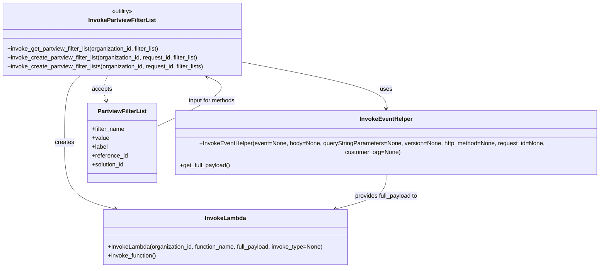

# Diagram: partview_core/partview_service/partview_service/utility/InvokePartviewFilterList.py

> Auto-generated by Obscura crawlers

## Mermaid

### SVG

<svg id="container" width="1674.65234375" xmlns="http://www.w3.org/2000/svg" class="classDiagram" height="728" viewBox="0 0 1674.65234375 728" role="graphics-document document" aria-roledescription="class"><g><defs><marker id="container_class-aggregationStart" class="marker aggregation class" refX="18" refY="7" markerWidth="190" markerHeight="240" orient="auto"><path d="M 18,7 L9,13 L1,7 L9,1 Z"></path></marker></defs><defs><marker id="container_class-aggregationEnd" class="marker aggregation class" refX="1" refY="7" markerWidth="20" markerHeight="28" orient="auto"><path d="M 18,7 L9,13 L1,7 L9,1 Z"></path></marker></defs><defs><marker id="container_class-extensionStart" class="marker extension class" refX="18" refY="7" markerWidth="190" markerHeight="240" orient="auto"><path d="M 1,7 L18,13 V 1 Z"></path></marker></defs><defs><marker id="container_class-extensionEnd" class="marker extension class" refX="1" refY="7" markerWidth="20" markerHeight="28" orient="auto"><path d="M 1,1 V 13 L18,7 Z"></path></marker></defs><defs><marker id="container_class-compositionStart" class="marker composition class" refX="18" refY="7" markerWidth="190" markerHeight="240" orient="auto"><path d="M 18,7 L9,13 L1,7 L9,1 Z"></path></marker></defs><defs><marker id="container_class-compositionEnd" class="marker composition class" refX="1" refY="7" markerWidth="20" markerHeight="28" orient="auto"><path d="M 18,7 L9,13 L1,7 L9,1 Z"></path></marker></defs><defs><marker id="container_class-dependencyStart" class="marker dependency class" refX="6" refY="7" markerWidth="190" markerHeight="240" orient="auto"><path d="M 5,7 L9,13 L1,7 L9,1 Z"></path></marker></defs><defs><marker id="container_class-dependencyEnd" class="marker dependency class" refX="13" refY="7" markerWidth="20" markerHeight="28" orient="auto"><path d="M 18,7 L9,13 L14,7 L9,1 Z"></path></marker></defs><defs><marker id="container_class-lollipopStart" class="marker lollipop class" refX="13" refY="7" markerWidth="190" markerHeight="240" orient="auto"><circle stroke="black" fill="transparent" cx="7" cy="7" r="6"></circle></marker></defs><defs><marker id="container_class-lollipopEnd" class="marker lollipop class" refX="1" refY="7" markerWidth="190" markerHeight="240" orient="auto"><circle stroke="black" fill="transparent" cx="7" cy="7" r="6"></circle></marker></defs><g class="root"><g class="clusters"></g><g class="edgePaths"><path d="M222.323,206L215.183,212.167C208.042,218.333,193.761,230.667,186.621,261C179.48,291.333,179.48,339.667,179.48,388C179.48,436.333,179.48,484.667,203.206,514.758C226.933,544.849,274.385,556.698,298.111,562.622L321.837,568.546" id="id_InvokePartviewFilterList_InvokeLambda_1" class="edge-thickness-normal edge-pattern-solid relation" style=";;;" data-edge="true" data-et="edge" data-id="id_InvokePartviewFilterList_InvokeLambda_1" data-points="W3sieCI6MjIyLjMyMzM1NzA3NzIwNTg4LCJ5IjoyMDZ9LHsieCI6MTc5LjQ4MDQ2ODc1LCJ5IjoyNDN9LHsieCI6MTc5LjQ4MDQ2ODc1LCJ5IjozODh9LHsieCI6MTc5LjQ4MDQ2ODc1LCJ5Ijo1MzN9LHsieCI6MzI3LjY1NzkwNjY2ODUyNjgsInkiOjU3MH1d" marker-end="url(#container_class-dependencyEnd)"></path><path d="M665.914,167.752L733.822,180.294C801.729,192.835,937.544,217.917,1005.452,241.125C1073.359,264.333,1073.359,285.667,1073.359,296.333L1073.359,307" id="id_InvokePartviewFilterList_InvokeEventHelper_2" class="edge-thickness-normal edge-pattern-solid relation" style=";;;" data-edge="true" data-et="edge" data-id="id_InvokePartviewFilterList_InvokeEventHelper_2" data-points="W3sieCI6NjY1LjkxNDA2MjUsInkiOjE2Ny43NTIzMjczNTE2MTk3M30seyJ4IjoxMDczLjM1OTM3NSwieSI6MjQzfSx7IngiOjEwNzMuMzU5Mzc1LCJ5IjozMTN9XQ==" marker-end="url(#container_class-dependencyEnd)"></path><path d="M295.737,206L293.17,212.167C290.602,218.333,285.467,230.667,284.944,242.069C284.421,253.47,288.51,263.941,290.554,269.176L292.599,274.411" id="id_InvokePartviewFilterList_PartviewFilterList_3" class="edge-thickness-normal edge-pattern-dashed relation" style=";;;" data-edge="true" data-et="edge" data-id="id_InvokePartviewFilterList_PartviewFilterList_3" data-points="W3sieCI6Mjk1LjczNzM2MjEzMjM1MjksInkiOjIwNn0seyJ4IjoyODAuMzMyMDMxMjUsInkiOjI0M30seyJ4IjoyOTQuNzgxMTY5MTgxMDM0NSwieSI6MjgwfV0=" marker-end="url(#container_class-dependencyEnd)"></path><path d="M1073.359,463L1073.359,474.667C1073.359,486.333,1073.359,509.667,1049.809,527.256C1026.258,544.846,979.157,556.691,955.607,562.614L932.056,568.537" id="id_InvokeEventHelper_InvokeLambda_4" class="edge-thickness-normal edge-pattern-solid relation" style=";;;" data-edge="true" data-et="edge" data-id="id_InvokeEventHelper_InvokeLambda_4" data-points="W3sieCI6MTA3My4zNTkzNzUsInkiOjQ2M30seyJ4IjoxMDczLjM1OTM3NSwieSI6NTMzfSx7IngiOjkyNi4yMzc1MzEzODk1MDksInkiOjU3MH1d" marker-end="url(#container_class-dependencyEnd)"></path><path d="M430.066,345.416L467.388,328.347C504.71,311.277,579.354,277.139,603.219,254.297C627.085,231.455,600.172,219.91,586.715,214.138L573.258,208.365" id="id_PartviewFilterList_InvokePartviewFilterList_5" class="edge-thickness-normal edge-pattern-solid relation" style=";;;" data-edge="true" data-et="edge" data-id="id_PartviewFilterList_InvokePartviewFilterList_5" data-points="W3sieCI6NDMwLjA2NjQwNjI1LCJ5IjozNDUuNDE2MDQ4MDUxNzQ4fSx7IngiOjY1My45OTgwNDY4NzUsInkiOjI0M30seyJ4Ijo1NjcuNzQ0MjQxMTUzNDkyNywieSI6MjA2fV0=" marker-end="url(#container_class-dependencyEnd)"></path></g><g class="edgeLabels"><g class="edgeLabel" transform="translate(179.48046875, 388)"><g class="label" data-id="id_InvokePartviewFilterList_InvokeLambda_1" transform="translate(-26.171875, -12)"><foreignObject width="52.34375" height="24">

creates

</foreignObject></g></g><g class="edgeLabel" transform="translate(1073.359375, 243)"><g class="label" data-id="id_InvokePartviewFilterList_InvokeEventHelper_2" transform="translate(-16.4921875, -12)"><foreignObject width="32.984375" height="24">

uses

</foreignObject></g></g><g class="edgeLabel" transform="translate(280.40078, 242.83488)"><g class="label" data-id="id_InvokePartviewFilterList_PartviewFilterList_3" transform="translate(-27.421875, -12)"><foreignObject width="54.84375" height="24">

accepts

</foreignObject></g></g><g class="edgeLabel" transform="translate(1073.359375, 533)"><g class="label" data-id="id_InvokeEventHelper_InvokeLambda_4" transform="translate(-88.0546875, -12)"><foreignObject width="176.109375" height="24">

provides full_payload to

</foreignObject></g></g><g class="edgeLabel" transform="translate(584.70808, 274.69005)"><g class="label" data-id="id_PartviewFilterList_InvokePartviewFilterList_5" transform="translate(-65.828125, -12)"><foreignObject width="131.65625" height="24">

input for methods

</foreignObject></g></g></g><g class="nodes"><g class="node default" id="classId-InvokePartviewFilterList-0" transform="translate(336.95703125, 107)"><g class="basic label-container"><path d="M-328.95703125 -99 L328.95703125 -99 L328.95703125 99 L-328.95703125 99" stroke="none" stroke-width="0" fill="#ECECFF" style=""></path><path d="M-328.95703125 -99 C-182.93970275335968 -99, -36.922374256719365 -99, 328.95703125 -99 M-328.95703125 -99 C-177.91659502724613 -99, -26.876158804492263 -99, 328.95703125 -99 M328.95703125 -99 C328.95703125 -38.28838426269124, 328.95703125 22.423231474617523, 328.95703125 99 M328.95703125 -99 C328.95703125 -33.08478299129838, 328.95703125 32.830434017403235, 328.95703125 99 M328.95703125 99 C108.42699949946501 99, -112.10303225106998 99, -328.95703125 99 M328.95703125 99 C161.6346145079407 99, -5.687802234118578 99, -328.95703125 99 M-328.95703125 99 C-328.95703125 20.61043988658794, -328.95703125 -57.77912022682412, -328.95703125 -99 M-328.95703125 99 C-328.95703125 35.66342509082295, -328.95703125 -27.673149818354105, -328.95703125 -99" stroke="#9370DB" stroke-width="1.3" fill="none" stroke-dasharray="0 0" style=""></path></g><g class="annotation-group text" transform="translate(-30.3125, -75)"><g class="label" style="" transform="translate(0,-12)"><foreignObject width="60.625" height="24">

«utility»

</foreignObject></g></g><g class="label-group text" transform="translate(-88.3203125, -51)"><g class="label" style="font-weight: bolder" transform="translate(0,-12)"><foreignObject width="176.640625" height="24">

InvokePartviewFilterList

</foreignObject></g></g><g class="members-group text" transform="translate(-316.95703125, -3)"></g><g class="methods-group text" transform="translate(-316.95703125, 27)"><g class="label" style="" transform="translate(0,-12)"><foreignObject width="423.390625" height="24">

+invoke_get_partview_filter_list(organization_id, filter_list)

</foreignObject></g><g class="label" style="" transform="translate(0,12)"><foreignObject width="530.65625" height="24">

+invoke_create_partview_filter_list(organization_id, request_id, filter_list)

</foreignObject></g><g class="label" style="" transform="translate(0,36)"><foreignObject width="545.59375" height="24">

+invoke_create_partview_filter_lists(organization_id, request_id, filter_lists)

</foreignObject></g></g><g class="divider" style=""><path d="M-328.95703125 -27 C-124.96448836476236 -27, 79.02805452047528 -27, 328.95703125 -27 M-328.95703125 -27 C-164.38963126501335 -27, 0.1777687199733009 -27, 328.95703125 -27" stroke="#9370DB" stroke-width="1.3" fill="none" stroke-dasharray="0 0" style=""></path></g><g class="divider" style=""><path d="M-328.95703125 -3 C-192.51902804343345 -3, -56.0810248368669 -3, 328.95703125 -3 M-328.95703125 -3 C-125.0306748113056 -3, 78.8956816273888 -3, 328.95703125 -3" stroke="#9370DB" stroke-width="1.3" fill="none" stroke-dasharray="0 0" style=""></path></g></g><g class="node default" id="classId-InvokeLambda-1" transform="translate(628.017578125, 645)"><g class="basic label-container"><path d="M-335.8828125 -75 L335.8828125 -75 L335.8828125 75 L-335.8828125 75" stroke="none" stroke-width="0" fill="#ECECFF" style=""></path><path d="M-335.8828125 -75 C-188.44533136395 -75, -41.00785022790001 -75, 335.8828125 -75 M-335.8828125 -75 C-189.27765838894058 -75, -42.67250427788116 -75, 335.8828125 -75 M335.8828125 -75 C335.8828125 -33.60292031708366, 335.8828125 7.794159365832684, 335.8828125 75 M335.8828125 -75 C335.8828125 -33.780044759726245, 335.8828125 7.4399104805475105, 335.8828125 75 M335.8828125 75 C114.06905039104984 75, -107.74471171790032 75, -335.8828125 75 M335.8828125 75 C94.04747979756769 75, -147.78785290486462 75, -335.8828125 75 M-335.8828125 75 C-335.8828125 26.412664624689356, -335.8828125 -22.17467075062129, -335.8828125 -75 M-335.8828125 75 C-335.8828125 23.007847772713575, -335.8828125 -28.98430445457285, -335.8828125 -75" stroke="#9370DB" stroke-width="1.3" fill="none" stroke-dasharray="0 0" style=""></path></g><g class="annotation-group text" transform="translate(0, -51)"></g><g class="label-group text" transform="translate(-53.484375, -51)"><g class="label" style="font-weight: bolder" transform="translate(0,-12)"><foreignObject width="106.96875" height="24">

InvokeLambda

</foreignObject></g></g><g class="members-group text" transform="translate(-323.8828125, -3)"></g><g class="methods-group text" transform="translate(-323.8828125, 27)"><g class="label" style="" transform="translate(0,-12)"><foreignObject width="594.28125" height="24">

+InvokeLambda(organization_id, function_name, full_payload, invoke_type=None)

</foreignObject></g><g class="label" style="" transform="translate(0,12)"><foreignObject width="134.4375" height="24">

+invoke_function()

</foreignObject></g></g><g class="divider" style=""><path d="M-335.8828125 -27 C-95.37277914478457 -27, 145.13725421043085 -27, 335.8828125 -27 M-335.8828125 -27 C-178.02251129605165 -27, -20.162210092103294 -27, 335.8828125 -27" stroke="#9370DB" stroke-width="1.3" fill="none" stroke-dasharray="0 0" style=""></path></g><g class="divider" style=""><path d="M-335.8828125 -3 C-77.9666276397923 -3, 179.9495572204154 -3, 335.8828125 -3 M-335.8828125 -3 C-79.08806868054279 -3, 177.70667513891442 -3, 335.8828125 -3" stroke="#9370DB" stroke-width="1.3" fill="none" stroke-dasharray="0 0" style=""></path></g></g><g class="node default" id="classId-InvokeEventHelper-2" transform="translate(1073.359375, 388)"><g class="basic label-container"><path d="M-593.29296875 -75 L593.29296875 -75 L593.29296875 75 L-593.29296875 75" stroke="none" stroke-width="0" fill="#ECECFF" style=""></path><path d="M-593.29296875 -75 C-186.96973510618227 -75, 219.35349853763546 -75, 593.29296875 -75 M-593.29296875 -75 C-281.16760704075324 -75, 30.95775466849352 -75, 593.29296875 -75 M593.29296875 -75 C593.29296875 -19.223969486182092, 593.29296875 36.552061027635816, 593.29296875 75 M593.29296875 -75 C593.29296875 -30.18879478010379, 593.29296875 14.622410439792418, 593.29296875 75 M593.29296875 75 C264.29606090929076 75, -64.70084693141848 75, -593.29296875 75 M593.29296875 75 C185.8619167997735 75, -221.569135150453 75, -593.29296875 75 M-593.29296875 75 C-593.29296875 22.07305483843846, -593.29296875 -30.853890323123082, -593.29296875 -75 M-593.29296875 75 C-593.29296875 42.872927696985634, -593.29296875 10.745855393971269, -593.29296875 -75" stroke="#9370DB" stroke-width="1.3" fill="none" stroke-dasharray="0 0" style=""></path></g><g class="annotation-group text" transform="translate(0, -51)"></g><g class="label-group text" transform="translate(-69.0859375, -51)"><g class="label" style="font-weight: bolder" transform="translate(0,-12)"><foreignObject width="138.171875" height="24">

InvokeEventHelper

</foreignObject></g></g><g class="members-group text" transform="translate(-581.29296875, -3)"></g><g class="methods-group text" transform="translate(-581.29296875, 27)"><g class="label" style="" transform="translate(0,-12)"><foreignObject width="1093.5" height="24">

+InvokeEventHelper(event=None, body=None, queryStringParameters=None, version=None, http_method=None, request_id=None, customer_org=None)

</foreignObject></g><g class="label" style="" transform="translate(0,12)"><foreignObject width="139.03125" height="24">

+get_full_payload()

</foreignObject></g></g><g class="divider" style=""><path d="M-593.29296875 -27 C-129.67298185149775 -27, 333.9470050470045 -27, 593.29296875 -27 M-593.29296875 -27 C-198.54623910894293 -27, 196.20049053211415 -27, 593.29296875 -27" stroke="#9370DB" stroke-width="1.3" fill="none" stroke-dasharray="0 0" style=""></path></g><g class="divider" style=""><path d="M-593.29296875 -3 C-290.2089669540815 -3, 12.875034841836964 -3, 593.29296875 -3 M-593.29296875 -3 C-157.1007348223821 -3, 279.0914991052358 -3, 593.29296875 -3" stroke="#9370DB" stroke-width="1.3" fill="none" stroke-dasharray="0 0" style=""></path></g></g><g class="node default" id="classId-PartviewFilterList-3" transform="translate(336.95703125, 388)"><g class="basic label-container"><path d="M-93.109375 -108 L93.109375 -108 L93.109375 108 L-93.109375 108" stroke="none" stroke-width="0" fill="#ECECFF" style=""></path><path d="M-93.109375 -108 C-21.956082022422493 -108, 49.197210955155015 -108, 93.109375 -108 M-93.109375 -108 C-40.96708597884013 -108, 11.175203042319737 -108, 93.109375 -108 M93.109375 -108 C93.109375 -38.06232080813683, 93.109375 31.875358383726336, 93.109375 108 M93.109375 -108 C93.109375 -54.92335468879699, 93.109375 -1.8467093775939816, 93.109375 108 M93.109375 108 C46.911170184952105 108, 0.7129653699042109 108, -93.109375 108 M93.109375 108 C36.28659005494766 108, -20.53619489010468 108, -93.109375 108 M-93.109375 108 C-93.109375 46.3367250254885, -93.109375 -15.326549949023004, -93.109375 -108 M-93.109375 108 C-93.109375 52.003483782430976, -93.109375 -3.9930324351380477, -93.109375 -108" stroke="#9370DB" stroke-width="1.3" fill="none" stroke-dasharray="0 0" style=""></path></g><g class="annotation-group text" transform="translate(0, -84)"></g><g class="label-group text" transform="translate(-63.96875, -84)"><g class="label" style="font-weight: bolder" transform="translate(0,-12)"><foreignObject width="127.9375" height="24">

PartviewFilterList

</foreignObject></g></g><g class="members-group text" transform="translate(-81.109375, -36)"><g class="label" style="" transform="translate(0,-12)"><foreignObject width="89.625" height="24">

+filter_name

</foreignObject></g><g class="label" style="" transform="translate(0,12)"><foreignObject width="46.71875" height="24">

+value

</foreignObject></g><g class="label" style="" transform="translate(0,36)"><foreignObject width="44.21875" height="24">

+label

</foreignObject></g><g class="label" style="" transform="translate(0,60)"><foreignObject width="98.25" height="24">

+reference_id

</foreignObject></g><g class="label" style="" transform="translate(0,84)"><foreignObject width="90.21875" height="24">

+solution_id

</foreignObject></g></g><g class="methods-group text" transform="translate(-81.109375, 108)"></g><g class="divider" style=""><path d="M-93.109375 -60 C-50.880695527372765 -60, -8.65201605474553 -60, 93.109375 -60 M-93.109375 -60 C-45.141569703508374 -60, 2.8262355929832523 -60, 93.109375 -60" stroke="#9370DB" stroke-width="1.3" fill="none" stroke-dasharray="0 0" style=""></path></g><g class="divider" style=""><path d="M-93.109375 84 C-29.091344469849474 84, 34.92668606030105 84, 93.109375 84 M-93.109375 84 C-52.42653760911493 84, -11.743700218229861 84, 93.109375 84" stroke="#9370DB" stroke-width="1.3" fill="none" stroke-dasharray="0 0" style=""></path></g></g></g></g></g></svg>
