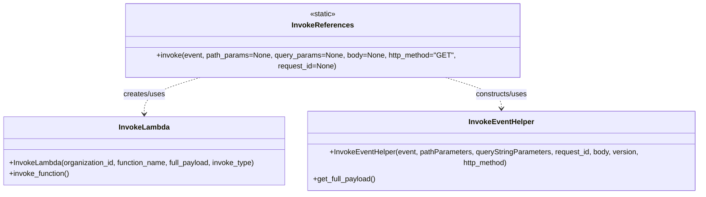

# Diagram: partview_core/partview_service/partview_service/utility/InvokeReferences.py

> Auto-generated by Obscura crawlers

## Mermaid

### SVG

<svg id="container" width="1570.4453125" xmlns="http://www.w3.org/2000/svg" class="classDiagram" height="390" viewBox="0 0 1570.4453125 390" role="graphics-document document" aria-roledescription="class"><g><defs><marker id="container_class-aggregationStart" class="marker aggregation class" refX="18" refY="7" markerWidth="190" markerHeight="240" orient="auto"><path d="M 18,7 L9,13 L1,7 L9,1 Z"></path></marker></defs><defs><marker id="container_class-aggregationEnd" class="marker aggregation class" refX="1" refY="7" markerWidth="20" markerHeight="28" orient="auto"><path d="M 18,7 L9,13 L1,7 L9,1 Z"></path></marker></defs><defs><marker id="container_class-extensionStart" class="marker extension class" refX="18" refY="7" markerWidth="190" markerHeight="240" orient="auto"><path d="M 1,7 L18,13 V 1 Z"></path></marker></defs><defs><marker id="container_class-extensionEnd" class="marker extension class" refX="1" refY="7" markerWidth="20" markerHeight="28" orient="auto"><path d="M 1,1 V 13 L18,7 Z"></path></marker></defs><defs><marker id="container_class-compositionStart" class="marker composition class" refX="18" refY="7" markerWidth="190" markerHeight="240" orient="auto"><path d="M 18,7 L9,13 L1,7 L9,1 Z"></path></marker></defs><defs><marker id="container_class-compositionEnd" class="marker composition class" refX="1" refY="7" markerWidth="20" markerHeight="28" orient="auto"><path d="M 18,7 L9,13 L1,7 L9,1 Z"></path></marker></defs><defs><marker id="container_class-dependencyStart" class="marker dependency class" refX="6" refY="7" markerWidth="190" markerHeight="240" orient="auto"><path d="M 5,7 L9,13 L1,7 L9,1 Z"></path></marker></defs><defs><marker id="container_class-dependencyEnd" class="marker dependency class" refX="13" refY="7" markerWidth="20" markerHeight="28" orient="auto"><path d="M 18,7 L9,13 L14,7 L9,1 Z"></path></marker></defs><defs><marker id="container_class-lollipopStart" class="marker lollipop class" refX="13" refY="7" markerWidth="190" markerHeight="240" orient="auto"><circle stroke="black" fill="transparent" cx="7" cy="7" r="6"></circle></marker></defs><defs><marker id="container_class-lollipopEnd" class="marker lollipop class" refX="1" refY="7" markerWidth="190" markerHeight="240" orient="auto"><circle stroke="black" fill="transparent" cx="7" cy="7" r="6"></circle></marker></defs><g class="root"><g class="clusters"></g><g class="edgePaths"><path d="M453.205,158L431.12,164.167C409.035,170.333,364.865,182.667,342.78,194C320.695,205.333,320.695,215.667,320.695,220.833L320.695,226" id="id_InvokeReferences_InvokeLambda_1" class="edge-thickness-normal edge-pattern-dashed relation" style=";;;" data-edge="true" data-et="edge" data-id="id_InvokeReferences_InvokeLambda_1" data-points="W3sieCI6NDUzLjIwNTMwNDgyNzAwODk0LCJ5IjoxNTh9LHsieCI6MzIwLjY5NTMxMjUsInkiOjE5NX0seyJ4IjozMjAuNjk1MzEyNSwieSI6MjMyfV0=" marker-end="url(#container_class-dependencyEnd)"></path><path d="M990.408,158L1012.493,164.167C1034.578,170.333,1078.748,182.667,1100.833,194C1122.918,205.333,1122.918,215.667,1122.918,220.833L1122.918,226" id="id_InvokeReferences_InvokeEventHelper_2" class="edge-thickness-normal edge-pattern-dashed relation" style=";;;" data-edge="true" data-et="edge" data-id="id_InvokeReferences_InvokeEventHelper_2" data-points="W3sieCI6OTkwLjQwNzk3NjQyMjk5MSwieSI6MTU4fSx7IngiOjExMjIuOTE3OTY4NzUsInkiOjE5NX0seyJ4IjoxMTIyLjkxNzk2ODc1LCJ5IjoyMzJ9XQ==" marker-end="url(#container_class-dependencyEnd)"></path></g><g class="edgeLabels"><g class="edgeLabel" transform="translate(320.6953125, 195)"><g class="label" data-id="id_InvokeReferences_InvokeLambda_1" transform="translate(-46.578125, -12)"><foreignObject width="93.15625" height="24">

creates/uses

</foreignObject></g></g><g class="edgeLabel" transform="translate(1122.91796875, 195)"><g class="label" data-id="id_InvokeReferences_InvokeEventHelper_2" transform="translate(-58.25, -12)"><foreignObject width="116.5" height="24">

constructs/uses

</foreignObject></g></g></g><g class="nodes"><g class="node default" id="classId-InvokeReferences-0" transform="translate(721.806640625, 83)"><g class="basic label-container"><path d="M-436.91015625 -75 L436.91015625 -75 L436.91015625 75 L-436.91015625 75" stroke="none" stroke-width="0" fill="#ECECFF" style=""></path><path d="M-436.91015625 -75 C-157.99124640161398 -75, 120.92766344677204 -75, 436.91015625 -75 M-436.91015625 -75 C-255.97930210189395 -75, -75.0484479537879 -75, 436.91015625 -75 M436.91015625 -75 C436.91015625 -30.221342236267844, 436.91015625 14.557315527464311, 436.91015625 75 M436.91015625 -75 C436.91015625 -25.177602437504618, 436.91015625 24.644795124990765, 436.91015625 75 M436.91015625 75 C240.705324026136 75, 44.500491802271995 75, -436.91015625 75 M436.91015625 75 C182.96375074700723 75, -70.98265475598555 75, -436.91015625 75 M-436.91015625 75 C-436.91015625 42.11684384542605, -436.91015625 9.233687690852094, -436.91015625 -75 M-436.91015625 75 C-436.91015625 23.80804954498042, -436.91015625 -27.38390091003916, -436.91015625 -75" stroke="#9370DB" stroke-width="1.3" fill="none" stroke-dasharray="0 0" style=""></path></g><g class="annotation-group text" transform="translate(-29.0234375, -51)"><g class="label" style="" transform="translate(0,-12)"><foreignObject width="58.046875" height="24">

«static»

</foreignObject></g></g><g class="label-group text" transform="translate(-64.7265625, -27)"><g class="label" style="font-weight: bolder" transform="translate(0,-12)"><foreignObject width="129.453125" height="24">

InvokeReferences

</foreignObject></g></g><g class="members-group text" transform="translate(-424.91015625, 21)"></g><g class="methods-group text" transform="translate(-424.91015625, 51)"><g class="label" style="" transform="translate(0,-12)"><foreignObject width="785.09375" height="24">

+invoke(event, path_params=None, query_params=None, body=None, http_method="GET", request_id=None)

</foreignObject></g></g><g class="divider" style=""><path d="M-436.91015625 -3 C-208.944364436393 -3, 19.021427377214025 -3, 436.91015625 -3 M-436.91015625 -3 C-224.57315831363758 -3, -12.236160377275155 -3, 436.91015625 -3" stroke="#9370DB" stroke-width="1.3" fill="none" stroke-dasharray="0 0" style=""></path></g><g class="divider" style=""><path d="M-436.91015625 21 C-235.32907298990136 21, -33.747989729802725 21, 436.91015625 21 M-436.91015625 21 C-147.45911091437875 21, 141.9919344212425 21, 436.91015625 21" stroke="#9370DB" stroke-width="1.3" fill="none" stroke-dasharray="0 0" style=""></path></g></g><g class="node default" id="classId-InvokeLambda-1" transform="translate(320.6953125, 307)"><g class="basic label-container"><path d="M-312.6953125 -75 L312.6953125 -75 L312.6953125 75 L-312.6953125 75" stroke="none" stroke-width="0" fill="#ECECFF" style=""></path><path d="M-312.6953125 -75 C-95.29173361160201 -75, 122.11184527679598 -75, 312.6953125 -75 M-312.6953125 -75 C-143.1731692940459 -75, 26.348973911908217 -75, 312.6953125 -75 M312.6953125 -75 C312.6953125 -36.96246175983209, 312.6953125 1.0750764803358237, 312.6953125 75 M312.6953125 -75 C312.6953125 -22.346272708674434, 312.6953125 30.307454582651133, 312.6953125 75 M312.6953125 75 C115.87918475178981 75, -80.93694299642038 75, -312.6953125 75 M312.6953125 75 C94.58893267477723 75, -123.51744715044555 75, -312.6953125 75 M-312.6953125 75 C-312.6953125 25.259429218660358, -312.6953125 -24.481141562679284, -312.6953125 -75 M-312.6953125 75 C-312.6953125 20.54452687476614, -312.6953125 -33.91094625046772, -312.6953125 -75" stroke="#9370DB" stroke-width="1.3" fill="none" stroke-dasharray="0 0" style=""></path></g><g class="annotation-group text" transform="translate(0, -51)"></g><g class="label-group text" transform="translate(-53.484375, -51)"><g class="label" style="font-weight: bolder" transform="translate(0,-12)"><foreignObject width="106.96875" height="24">

InvokeLambda

</foreignObject></g></g><g class="members-group text" transform="translate(-300.6953125, -3)"></g><g class="methods-group text" transform="translate(-300.6953125, 27)"><g class="label" style="" transform="translate(0,-12)"><foreignObject width="547.90625" height="24">

+InvokeLambda(organization_id, function_name, full_payload, invoke_type)

</foreignObject></g><g class="label" style="" transform="translate(0,12)"><foreignObject width="134.4375" height="24">

+invoke_function()

</foreignObject></g></g><g class="divider" style=""><path d="M-312.6953125 -27 C-177.88567508017462 -27, -43.07603766034924 -27, 312.6953125 -27 M-312.6953125 -27 C-176.23914500291005 -27, -39.7829775058201 -27, 312.6953125 -27" stroke="#9370DB" stroke-width="1.3" fill="none" stroke-dasharray="0 0" style=""></path></g><g class="divider" style=""><path d="M-312.6953125 -3 C-89.3978697708549 -3, 133.8995729582902 -3, 312.6953125 -3 M-312.6953125 -3 C-146.11564242582924 -3, 20.464027648341528 -3, 312.6953125 -3" stroke="#9370DB" stroke-width="1.3" fill="none" stroke-dasharray="0 0" style=""></path></g></g><g class="node default" id="classId-InvokeEventHelper-2" transform="translate(1122.91796875, 307)"><g class="basic label-container"><path d="M-439.52734375 -75 L439.52734375 -75 L439.52734375 75 L-439.52734375 75" stroke="none" stroke-width="0" fill="#ECECFF" style=""></path><path d="M-439.52734375 -75 C-131.89646610750958 -75, 175.73441153498084 -75, 439.52734375 -75 M-439.52734375 -75 C-93.68163619057833 -75, 252.16407136884334 -75, 439.52734375 -75 M439.52734375 -75 C439.52734375 -41.803230011386106, 439.52734375 -8.606460022772211, 439.52734375 75 M439.52734375 -75 C439.52734375 -19.8773799948386, 439.52734375 35.2452400103228, 439.52734375 75 M439.52734375 75 C193.70139205069023 75, -52.12455964861954 75, -439.52734375 75 M439.52734375 75 C90.50121787291846 75, -258.5249080041631 75, -439.52734375 75 M-439.52734375 75 C-439.52734375 20.17608343939527, -439.52734375 -34.64783312120946, -439.52734375 -75 M-439.52734375 75 C-439.52734375 23.29635374187115, -439.52734375 -28.407292516257698, -439.52734375 -75" stroke="#9370DB" stroke-width="1.3" fill="none" stroke-dasharray="0 0" style=""></path></g><g class="annotation-group text" transform="translate(0, -51)"></g><g class="label-group text" transform="translate(-69.0859375, -51)"><g class="label" style="font-weight: bolder" transform="translate(0,-12)"><foreignObject width="138.171875" height="24">

InvokeEventHelper

</foreignObject></g></g><g class="members-group text" transform="translate(-427.52734375, -3)"></g><g class="methods-group text" transform="translate(-427.52734375, 27)"><g class="label" style="" transform="translate(0,-12)"><foreignObject width="785.96875" height="24">

+InvokeEventHelper(event, pathParameters, queryStringParameters, request_id, body, version, http_method)

</foreignObject></g><g class="label" style="" transform="translate(0,12)"><foreignObject width="139.03125" height="24">

+get_full_payload()

</foreignObject></g></g><g class="divider" style=""><path d="M-439.52734375 -27 C-260.44836127379267 -27, -81.3693787975854 -27, 439.52734375 -27 M-439.52734375 -27 C-113.53814695328532 -27, 212.45104984342936 -27, 439.52734375 -27" stroke="#9370DB" stroke-width="1.3" fill="none" stroke-dasharray="0 0" style=""></path></g><g class="divider" style=""><path d="M-439.52734375 -3 C-201.57453445685334 -3, 36.378274836293315 -3, 439.52734375 -3 M-439.52734375 -3 C-118.75060280418347 -3, 202.02613814163306 -3, 439.52734375 -3" stroke="#9370DB" stroke-width="1.3" fill="none" stroke-dasharray="0 0" style=""></path></g></g></g></g></g></svg>
