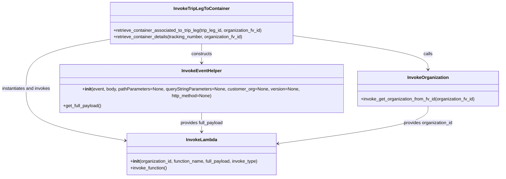

# Diagram: partview_core/partview_service/partview_service/utility/InvokeTripLegToContainer.py

> Auto-generated by Obscura crawlers

## Mermaid

### SVG

<svg id="container" width="1805.6328125" xmlns="http://www.w3.org/2000/svg" class="classDiagram" height="614" viewBox="0 0 1805.6328125 614" role="graphics-document document" aria-roledescription="class"><g><defs><marker id="container_class-aggregationStart" class="marker aggregation class" refX="18" refY="7" markerWidth="190" markerHeight="240" orient="auto"><path d="M 18,7 L9,13 L1,7 L9,1 Z"></path></marker></defs><defs><marker id="container_class-aggregationEnd" class="marker aggregation class" refX="1" refY="7" markerWidth="20" markerHeight="28" orient="auto"><path d="M 18,7 L9,13 L1,7 L9,1 Z"></path></marker></defs><defs><marker id="container_class-extensionStart" class="marker extension class" refX="18" refY="7" markerWidth="190" markerHeight="240" orient="auto"><path d="M 1,7 L18,13 V 1 Z"></path></marker></defs><defs><marker id="container_class-extensionEnd" class="marker extension class" refX="1" refY="7" markerWidth="20" markerHeight="28" orient="auto"><path d="M 1,1 V 13 L18,7 Z"></path></marker></defs><defs><marker id="container_class-compositionStart" class="marker composition class" refX="18" refY="7" markerWidth="190" markerHeight="240" orient="auto"><path d="M 18,7 L9,13 L1,7 L9,1 Z"></path></marker></defs><defs><marker id="container_class-compositionEnd" class="marker composition class" refX="1" refY="7" markerWidth="20" markerHeight="28" orient="auto"><path d="M 18,7 L9,13 L1,7 L9,1 Z"></path></marker></defs><defs><marker id="container_class-dependencyStart" class="marker dependency class" refX="6" refY="7" markerWidth="190" markerHeight="240" orient="auto"><path d="M 5,7 L9,13 L1,7 L9,1 Z"></path></marker></defs><defs><marker id="container_class-dependencyEnd" class="marker dependency class" refX="13" refY="7" markerWidth="20" markerHeight="28" orient="auto"><path d="M 18,7 L9,13 L14,7 L9,1 Z"></path></marker></defs><defs><marker id="container_class-lollipopStart" class="marker lollipop class" refX="13" refY="7" markerWidth="190" markerHeight="240" orient="auto"><circle stroke="black" fill="transparent" cx="7" cy="7" r="6"></circle></marker></defs><defs><marker id="container_class-lollipopEnd" class="marker lollipop class" refX="1" refY="7" markerWidth="190" markerHeight="240" orient="auto"><circle stroke="black" fill="transparent" cx="7" cy="7" r="6"></circle></marker></defs><g class="root"><g class="clusters"></g><g class="edgePaths"><path d="M1059.648,128.451L1140.236,139.542C1220.823,150.634,1381.997,172.817,1462.585,191.075C1543.172,209.333,1543.172,223.667,1543.172,230.833L1543.172,238" id="id_InvokeTripLegToContainer_InvokeOrganization_1" class="edge-thickness-normal edge-pattern-solid relation" style=";;;" data-edge="true" data-et="edge" data-id="id_InvokeTripLegToContainer_InvokeOrganization_1" data-points="W3sieCI6MTA1OS42NDg0Mzc1LCJ5IjoxMjguNDUwODU3MDkwNzM5NzZ9LHsieCI6MTU0My4xNzE4NzUsInkiOjE5NX0seyJ4IjoxNTQzLjE3MTg3NSwieSI6MjQ0fV0=" marker-end="url(#container_class-dependencyEnd)"></path><path d="M729.418,158L729.418,164.167C729.418,170.333,729.418,182.667,729.418,194C729.418,205.333,729.418,215.667,729.418,220.833L729.418,226" id="id_InvokeTripLegToContainer_InvokeEventHelper_2" class="edge-thickness-normal edge-pattern-solid relation" style=";;;" data-edge="true" data-et="edge" data-id="id_InvokeTripLegToContainer_InvokeEventHelper_2" data-points="W3sieCI6NzI5LjQxNzk2ODc1LCJ5IjoxNTh9LHsieCI6NzI5LjQxNzk2ODc1LCJ5IjoxOTV9LHsieCI6NzI5LjQxNzk2ODc1LCJ5IjoyMzJ9XQ==" marker-end="url(#container_class-dependencyEnd)"></path><path d="M399.188,141.443L348.75,150.369C298.313,159.295,197.438,177.148,147,204.74C96.563,232.333,96.563,269.667,96.563,307C96.563,344.333,96.563,381.667,155.726,410.804C214.889,439.941,333.215,460.882,392.378,471.352L451.541,481.823" id="id_InvokeTripLegToContainer_InvokeLambda_3" class="edge-thickness-normal edge-pattern-solid relation" style=";;;" data-edge="true" data-et="edge" data-id="id_InvokeTripLegToContainer_InvokeLambda_3" data-points="W3sieCI6Mzk5LjE4NzUsInkiOjE0MS40NDI3NDc3MTQ2NjEzNX0seyJ4Ijo5Ni41NjI1LCJ5IjoxOTV9LHsieCI6OTYuNTYyNSwieSI6MzA3fSx7IngiOjk2LjU2MjUsInkiOjQxOX0seyJ4Ijo0NTcuNDQ5MjE4NzUsInkiOjQ4Mi44NjgxNTcxMDA0NDM4fV0=" marker-end="url(#container_class-dependencyEnd)"></path><path d="M729.418,382L729.418,388.167C729.418,394.333,729.418,406.667,729.418,418C729.418,429.333,729.418,439.667,729.418,444.833L729.418,450" id="id_InvokeEventHelper_InvokeLambda_4" class="edge-thickness-normal edge-pattern-solid relation" style=";;;" data-edge="true" data-et="edge" data-id="id_InvokeEventHelper_InvokeLambda_4" data-points="W3sieCI6NzI5LjQxNzk2ODc1LCJ5IjozODJ9LHsieCI6NzI5LjQxNzk2ODc1LCJ5Ijo0MTl9LHsieCI6NzI5LjQxNzk2ODc1LCJ5Ijo0NTZ9XQ==" marker-end="url(#container_class-dependencyEnd)"></path><path d="M1543.172,370L1543.172,378.167C1543.172,386.333,1543.172,402.667,1453.865,423.125C1364.558,443.583,1185.944,468.167,1096.638,480.458L1007.331,492.75" id="id_InvokeOrganization_InvokeLambda_5" class="edge-thickness-normal edge-pattern-solid relation" style=";;;" data-edge="true" data-et="edge" data-id="id_InvokeOrganization_InvokeLambda_5" data-points="W3sieCI6MTU0My4xNzE4NzUsInkiOjM3MH0seyJ4IjoxNTQzLjE3MTg3NSwieSI6NDE5fSx7IngiOjEwMDEuMzg2NzE4NzUsInkiOjQ5My41Njc5MjE2MjA5NTk5Nn1d" marker-end="url(#container_class-dependencyEnd)"></path></g><g class="edgeLabels"><g class="edgeLabel" transform="translate(1543.171875, 195)"><g class="label" data-id="id_InvokeTripLegToContainer_InvokeOrganization_1" transform="translate(-16.4453125, -12)"><foreignObject width="32.890625" height="24">

calls

</foreignObject></g></g><g class="edgeLabel" transform="translate(729.41796875, 195)"><g class="label" data-id="id_InvokeTripLegToContainer_InvokeEventHelper_2" transform="translate(-37.84375, -12)"><foreignObject width="75.6875" height="24">

constructs

</foreignObject></g></g><g class="edgeLabel" transform="translate(96.5625, 307)"><g class="label" data-id="id_InvokeTripLegToContainer_InvokeLambda_3" transform="translate(-88.5625, -12)"><foreignObject width="177.125" height="24">

instantiates and invokes

</foreignObject></g></g><g class="edgeLabel" transform="translate(729.41796875, 419)"><g class="label" data-id="id_InvokeEventHelper_InvokeLambda_4" transform="translate(-78.4921875, -12)"><foreignObject width="156.984375" height="24">

provides full_payload

</foreignObject></g></g><g class="edgeLabel" transform="translate(1543.171875, 419)"><g class="label" data-id="id_InvokeOrganization_InvokeLambda_5" transform="translate(-89.8125, -12)"><foreignObject width="179.625" height="24">

provides organization_id

</foreignObject></g></g></g><g class="nodes"><g class="node default" id="classId-InvokeTripLegToContainer-0" transform="translate(729.41796875, 83)"><g class="basic label-container"><path d="M-330.23046875 -75 L330.23046875 -75 L330.23046875 75 L-330.23046875 75" stroke="none" stroke-width="0" fill="#ECECFF" style=""></path><path d="M-330.23046875 -75 C-154.29188519406867 -75, 21.64669836186266 -75, 330.23046875 -75 M-330.23046875 -75 C-109.458486919515 -75, 111.31349491097001 -75, 330.23046875 -75 M330.23046875 -75 C330.23046875 -22.165160282140285, 330.23046875 30.66967943571943, 330.23046875 75 M330.23046875 -75 C330.23046875 -39.35705124334477, 330.23046875 -3.7141024866895407, 330.23046875 75 M330.23046875 75 C152.78219136548864 75, -24.666086019022714 75, -330.23046875 75 M330.23046875 75 C125.31552651363813 75, -79.59941572272373 75, -330.23046875 75 M-330.23046875 75 C-330.23046875 18.506321613765742, -330.23046875 -37.987356772468516, -330.23046875 -75 M-330.23046875 75 C-330.23046875 29.07069662323739, -330.23046875 -16.858606753525223, -330.23046875 -75" stroke="#9370DB" stroke-width="1.3" fill="none" stroke-dasharray="0 0" style=""></path></g><g class="annotation-group text" transform="translate(0, -51)"></g><g class="label-group text" transform="translate(-95.5546875, -51)"><g class="label" style="font-weight: bolder" transform="translate(0,-12)"><foreignObject width="191.109375" height="24">

InvokeTripLegToContainer

</foreignObject></g></g><g class="members-group text" transform="translate(-318.23046875, -3)"></g><g class="methods-group text" transform="translate(-318.23046875, 27)"><g class="label" style="" transform="translate(0,-12)"><foreignObject width="540.90625" height="24">

+retrieve_container_associated_to_trip_leg(trip_leg_id, organization_fv_id)

</foreignObject></g><g class="label" style="" transform="translate(0,12)"><foreignObject width="470.984375" height="24">

+retrieve_container_details(tracking_number, organization_fv_id)

</foreignObject></g></g><g class="divider" style=""><path d="M-330.23046875 -27 C-162.636778562321 -27, 4.956911625357975 -27, 330.23046875 -27 M-330.23046875 -27 C-153.4145085522925 -27, 23.401451645415023 -27, 330.23046875 -27" stroke="#9370DB" stroke-width="1.3" fill="none" stroke-dasharray="0 0" style=""></path></g><g class="divider" style=""><path d="M-330.23046875 -3 C-80.95492131748415 -3, 168.3206261150317 -3, 330.23046875 -3 M-330.23046875 -3 C-167.19108073006552 -3, -4.151692710131044 -3, 330.23046875 -3" stroke="#9370DB" stroke-width="1.3" fill="none" stroke-dasharray="0 0" style=""></path></g></g><g class="node default" id="classId-InvokeOrganization-1" transform="translate(1543.171875, 307)"><g class="basic label-container"><path d="M-254.4609375 -63 L254.4609375 -63 L254.4609375 63 L-254.4609375 63" stroke="none" stroke-width="0" fill="#ECECFF" style=""></path><path d="M-254.4609375 -63 C-67.53282422984327 -63, 119.39528904031346 -63, 254.4609375 -63 M-254.4609375 -63 C-133.9716604303783 -63, -13.482383360756614 -63, 254.4609375 -63 M254.4609375 -63 C254.4609375 -30.85950578732762, 254.4609375 1.2809884253447592, 254.4609375 63 M254.4609375 -63 C254.4609375 -34.40552223456798, 254.4609375 -5.8110444691359575, 254.4609375 63 M254.4609375 63 C116.71099733867081 63, -21.038942822658385 63, -254.4609375 63 M254.4609375 63 C64.7230947371217 63, -125.0147480257566 63, -254.4609375 63 M-254.4609375 63 C-254.4609375 27.04575433497029, -254.4609375 -8.90849133005942, -254.4609375 -63 M-254.4609375 63 C-254.4609375 25.847893826484558, -254.4609375 -11.304212347030884, -254.4609375 -63" stroke="#9370DB" stroke-width="1.3" fill="none" stroke-dasharray="0 0" style=""></path></g><g class="annotation-group text" transform="translate(0, -39)"></g><g class="label-group text" transform="translate(-71.046875, -39)"><g class="label" style="font-weight: bolder" transform="translate(0,-12)"><foreignObject width="142.09375" height="24">

InvokeOrganization

</foreignObject></g></g><g class="members-group text" transform="translate(-242.4609375, 9)"></g><g class="methods-group text" transform="translate(-242.4609375, 39)"><g class="label" style="" transform="translate(0,-12)"><foreignObject width="413.875" height="24">

+invoke_get_organization_from_fv_id(organization_fv_id)

</foreignObject></g></g><g class="divider" style=""><path d="M-254.4609375 -15 C-55.35789001854724 -15, 143.74515746290552 -15, 254.4609375 -15 M-254.4609375 -15 C-130.66928049539976 -15, -6.877623490799522 -15, 254.4609375 -15" stroke="#9370DB" stroke-width="1.3" fill="none" stroke-dasharray="0 0" style=""></path></g><g class="divider" style=""><path d="M-254.4609375 9 C-106.89043699730126 9, 40.68006350539747 9, 254.4609375 9 M-254.4609375 9 C-108.63056427140538 9, 37.19980895718925 9, 254.4609375 9" stroke="#9370DB" stroke-width="1.3" fill="none" stroke-dasharray="0 0" style=""></path></g></g><g class="node default" id="classId-InvokeEventHelper-2" transform="translate(729.41796875, 307)"><g class="basic label-container"><path d="M-509.29296875 -75 L509.29296875 -75 L509.29296875 75 L-509.29296875 75" stroke="none" stroke-width="0" fill="#ECECFF" style=""></path><path d="M-509.29296875 -75 C-217.53300958849007 -75, 74.22694957301985 -75, 509.29296875 -75 M-509.29296875 -75 C-209.34076045840993 -75, 90.61144783318014 -75, 509.29296875 -75 M509.29296875 -75 C509.29296875 -29.12536457352273, 509.29296875 16.749270852954538, 509.29296875 75 M509.29296875 -75 C509.29296875 -36.213291677834846, 509.29296875 2.573416644330308, 509.29296875 75 M509.29296875 75 C123.10443977094508 75, -263.08408920810984 75, -509.29296875 75 M509.29296875 75 C246.96210033516303 75, -15.368768079673941 75, -509.29296875 75 M-509.29296875 75 C-509.29296875 24.631310193656446, -509.29296875 -25.737379612687107, -509.29296875 -75 M-509.29296875 75 C-509.29296875 44.29926332565396, -509.29296875 13.598526651307921, -509.29296875 -75" stroke="#9370DB" stroke-width="1.3" fill="none" stroke-dasharray="0 0" style=""></path></g><g class="annotation-group text" transform="translate(0, -51)"></g><g class="label-group text" transform="translate(-69.0859375, -51)"><g class="label" style="font-weight: bolder" transform="translate(0,-12)"><foreignObject width="138.171875" height="24">

InvokeEventHelper

</foreignObject></g></g><g class="members-group text" transform="translate(-497.29296875, -3)"></g><g class="methods-group text" transform="translate(-497.29296875, 27)"><g class="label" style="" transform="translate(0,-12)"><foreignObject width="925.5" height="24">

+<strong>init</strong>(event, body, pathParameters=None, queryStringParameters=None, customer_org=None, version=None, http_method=None)

</foreignObject></g><g class="label" style="" transform="translate(0,12)"><foreignObject width="139.03125" height="24">

+get_full_payload()

</foreignObject></g></g><g class="divider" style=""><path d="M-509.29296875 -27 C-104.73636902127498 -27, 299.82023070745004 -27, 509.29296875 -27 M-509.29296875 -27 C-249.57999033916025 -27, 10.132988071679506 -27, 509.29296875 -27" stroke="#9370DB" stroke-width="1.3" fill="none" stroke-dasharray="0 0" style=""></path></g><g class="divider" style=""><path d="M-509.29296875 -3 C-179.06715265160267 -3, 151.15866344679466 -3, 509.29296875 -3 M-509.29296875 -3 C-189.85172304849453 -3, 129.58952265301093 -3, 509.29296875 -3" stroke="#9370DB" stroke-width="1.3" fill="none" stroke-dasharray="0 0" style=""></path></g></g><g class="node default" id="classId-InvokeLambda-3" transform="translate(729.41796875, 531)"><g class="basic label-container"><path d="M-271.96875 -75 L271.96875 -75 L271.96875 75 L-271.96875 75" stroke="none" stroke-width="0" fill="#ECECFF" style=""></path><path d="M-271.96875 -75 C-110.9415284844608 -75, 50.08569303107839 -75, 271.96875 -75 M-271.96875 -75 C-84.01960290388328 -75, 103.92954419223344 -75, 271.96875 -75 M271.96875 -75 C271.96875 -28.26109471242266, 271.96875 18.477810575154678, 271.96875 75 M271.96875 -75 C271.96875 -37.10452643329378, 271.96875 0.7909471334124447, 271.96875 75 M271.96875 75 C75.15287565592999 75, -121.66299868814002 75, -271.96875 75 M271.96875 75 C80.51214050042458 75, -110.94446899915084 75, -271.96875 75 M-271.96875 75 C-271.96875 41.564253038692776, -271.96875 8.128506077385552, -271.96875 -75 M-271.96875 75 C-271.96875 44.613478242814466, -271.96875 14.226956485628925, -271.96875 -75" stroke="#9370DB" stroke-width="1.3" fill="none" stroke-dasharray="0 0" style=""></path></g><g class="annotation-group text" transform="translate(0, -51)"></g><g class="label-group text" transform="translate(-53.484375, -51)"><g class="label" style="font-weight: bolder" transform="translate(0,-12)"><foreignObject width="106.96875" height="24">

InvokeLambda

</foreignObject></g></g><g class="members-group text" transform="translate(-259.96875, -3)"></g><g class="methods-group text" transform="translate(-259.96875, 27)"><g class="label" style="" transform="translate(0,-12)"><foreignObject width="466.453125" height="24">

+<strong>init</strong>(organization_id, function_name, full_payload, invoke_type)

</foreignObject></g><g class="label" style="" transform="translate(0,12)"><foreignObject width="134.4375" height="24">

+invoke_function()

</foreignObject></g></g><g class="divider" style=""><path d="M-271.96875 -27 C-136.25166740060786 -27, -0.5345848012157148 -27, 271.96875 -27 M-271.96875 -27 C-95.39969478376534 -27, 81.16936043246932 -27, 271.96875 -27" stroke="#9370DB" stroke-width="1.3" fill="none" stroke-dasharray="0 0" style=""></path></g><g class="divider" style=""><path d="M-271.96875 -3 C-73.20315722570257 -3, 125.56243554859486 -3, 271.96875 -3 M-271.96875 -3 C-94.15303339347662 -3, 83.66268321304676 -3, 271.96875 -3" stroke="#9370DB" stroke-width="1.3" fill="none" stroke-dasharray="0 0" style=""></path></g></g></g></g></g></svg>
