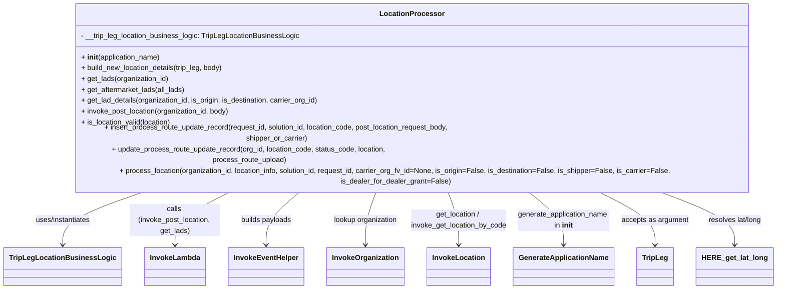

# Diagram: partview_core/partview_service/partview_service/utility/LocationProcessor.py


> Auto-generated by Obscura crawlers

## Diagram 1



### SVG

<svg id="container" width="1668.53125" xmlns="http://www.w3.org/2000/svg" class="classDiagram" height="582" viewBox="0 0 1668.53125 582" role="graphics-document document" aria-roledescription="class"><style>#container{font-family:"trebuchet ms",verdana,arial,sans-serif;font-size:16px;fill:#333;}@keyframes edge-animation-frame{from{stroke-dashoffset:0;}}@keyframes dash{to{stroke-dashoffset:0;}}#container .edge-animation-slow{stroke-dasharray:9,5!important;stroke-dashoffset:900;animation:dash 50s linear infinite;stroke-linecap:round;}#container .edge-animation-fast{stroke-dasharray:9,5!important;stroke-dashoffset:900;animation:dash 20s linear infinite;stroke-linecap:round;}#container .error-icon{fill:#552222;}#container .error-text{fill:#552222;stroke:#552222;}#container .edge-thickness-normal{stroke-width:1px;}#container .edge-thickness-thick{stroke-width:3.5px;}#container .edge-pattern-solid{stroke-dasharray:0;}#container .edge-thickness-invisible{stroke-width:0;fill:none;}#container .edge-pattern-dashed{stroke-dasharray:3;}#container .edge-pattern-dotted{stroke-dasharray:2;}#container .marker{fill:#333333;stroke:#333333;}#container .marker.cross{stroke:#333333;}#container svg{font-family:"trebuchet ms",verdana,arial,sans-serif;font-size:16px;}#container p{margin:0;}#container g.classGroup text{fill:#9370DB;stroke:none;font-family:"trebuchet ms",verdana,arial,sans-serif;font-size:10px;}#container g.classGroup text .title{font-weight:bolder;}#container .nodeLabel,#container .edgeLabel{color:#131300;}#container .edgeLabel .label rect{fill:#ECECFF;}#container .label text{fill:#131300;}#container .labelBkg{background:#ECECFF;}#container .edgeLabel .label span{background:#ECECFF;}#container .classTitle{font-weight:bolder;}#container .node rect,#container .node circle,#container .node ellipse,#container .node polygon,#container .node path{fill:#ECECFF;stroke:#9370DB;stroke-width:1px;}#container .divider{stroke:#9370DB;stroke-width:1;}#container g.clickable{cursor:pointer;}#container g.classGroup rect{fill:#ECECFF;stroke:#9370DB;}#container g.classGroup line{stroke:#9370DB;stroke-width:1;}#container .classLabel .box{stroke:none;stroke-width:0;fill:#ECECFF;opacity:0.5;}#container .classLabel .label{fill:#9370DB;font-size:10px;}#container .relation{stroke:#333333;stroke-width:1;fill:none;}#container .dashed-line{stroke-dasharray:3;}#container .dotted-line{stroke-dasharray:1 2;}#container #compositionStart,#container .composition{fill:#333333!important;stroke:#333333!important;stroke-width:1;}#container #compositionEnd,#container .composition{fill:#333333!important;stroke:#333333!important;stroke-width:1;}#container #dependencyStart,#container .dependency{fill:#333333!important;stroke:#333333!important;stroke-width:1;}#container #dependencyStart,#container .dependency{fill:#333333!important;stroke:#333333!important;stroke-width:1;}#container #extensionStart,#container .extension{fill:transparent!important;stroke:#333333!important;stroke-width:1;}#container #extensionEnd,#container .extension{fill:transparent!important;stroke:#333333!important;stroke-width:1;}#container #aggregationStart,#container .aggregation{fill:transparent!important;stroke:#333333!important;stroke-width:1;}#container #aggregationEnd,#container .aggregation{fill:transparent!important;stroke:#333333!important;stroke-width:1;}#container #lollipopStart,#container .lollipop{fill:#ECECFF!important;stroke:#333333!important;stroke-width:1;}#container #lollipopEnd,#container .lollipop{fill:#ECECFF!important;stroke:#333333!important;stroke-width:1;}#container .edgeTerminals{font-size:11px;line-height:initial;}#container .classTitleText{text-anchor:middle;font-size:18px;fill:#333;}#container .label-icon{display:inline-block;height:1em;overflow:visible;vertical-align:-0.125em;}#container .node .label-icon path{fill:currentColor;stroke:revert;stroke-width:revert;}#container :root{--mermaid-font-family:"trebuchet ms",verdana,arial,sans-serif;}</style><g><defs><marker id="container_class-aggregationStart" class="marker aggregation class" refX="18" refY="7" markerWidth="190" markerHeight="240" orient="auto"><path d="M 18,7 L9,13 L1,7 L9,1 Z"></path></marker></defs><defs><marker id="container_class-aggregationEnd" class="marker aggregation class" refX="1" refY="7" markerWidth="20" markerHeight="28" orient="auto"><path d="M 18,7 L9,13 L1,7 L9,1 Z"></path></marker></defs><defs><marker id="container_class-extensionStart" class="marker extension class" refX="18" refY="7" markerWidth="190" markerHeight="240" orient="auto"><path d="M 1,7 L18,13 V 1 Z"></path></marker></defs><defs><marker id="container_class-extensionEnd" class="marker extension class" refX="1" refY="7" markerWidth="20" markerHeight="28" orient="auto"><path d="M 1,1 V 13 L18,7 Z"></path></marker></defs><defs><marker id="container_class-compositionStart" class="marker composition class" refX="18" refY="7" markerWidth="190" markerHeight="240" orient="auto"><path d="M 18,7 L9,13 L1,7 L9,1 Z"></path></marker></defs><defs><marker id="container_class-compositionEnd" class="marker composition class" refX="1" refY="7" markerWidth="20" markerHeight="28" orient="auto"><path d="M 18,7 L9,13 L1,7 L9,1 Z"></path></marker></defs><defs><marker id="container_class-dependencyStart" class="marker dependency class" refX="6" refY="7" markerWidth="190" markerHeight="240" orient="auto"><path d="M 5,7 L9,13 L1,7 L9,1 Z"></path></marker></defs><defs><marker id="container_class-dependencyEnd" class="marker dependency class" refX="13" refY="7" markerWidth="20" markerHeight="28" orient="auto"><path d="M 18,7 L9,13 L14,7 L9,1 Z"></path></marker></defs><defs><marker id="container_class-lollipopStart" class="marker lollipop class" refX="13" refY="7" markerWidth="190" markerHeight="240" orient="auto"><circle stroke="black" fill="transparent" cx="7" cy="7" r="6"></circle></marker></defs><defs><marker id="container_class-lollipopEnd" class="marker lollipop class" refX="1" refY="7" markerWidth="190" markerHeight="240" orient="auto"><circle stroke="black" fill="transparent" cx="7" cy="7" r="6"></circle></marker></defs><g class="root"><g class="clusters"></g><g class="edgePaths"><path d="M319.225,368L287.655,378.167C256.085,388.333,192.945,408.667,161.375,428C129.805,447.333,129.805,465.667,129.805,474.833L129.805,484" id="id_LocationProcessor_TripLegLocationBusinessLogic_1" class="edge-thickness-normal edge-pattern-solid relation" style=";;;" data-edge="true" data-et="edge" data-id="id_LocationProcessor_TripLegLocationBusinessLogic_1" data-points="W3sieCI6MzE5LjIyNTQyNzkwNDU2NDMsInkiOjM2OH0seyJ4IjoxMjkuODA0Njg3NSwieSI6NDI5fSx7IngiOjEyOS44MDQ2ODc1LCJ5Ijo0OTB9XQ==" marker-end="url(#container_class-dependencyEnd)"></path><path d="M496.454,368L474.894,378.167C453.334,388.333,410.214,408.667,388.654,428C367.094,447.333,367.094,465.667,367.094,474.833L367.094,484" id="id_LocationProcessor_InvokeLambda_2" class="edge-thickness-normal edge-pattern-solid relation" style=";;;" data-edge="true" data-et="edge" data-id="id_LocationProcessor_InvokeLambda_2" data-points="W3sieCI6NDk2LjQ1Mzc3MzM0MDI0OSwieSI6MzY4fSx7IngiOjM2Ny4wOTM3NSwieSI6NDI5fSx7IngiOjM2Ny4wOTM3NSwieSI6NDkwfV0=" marker-end="url(#container_class-dependencyEnd)"></path><path d="M643.27,368L630.002,378.167C616.735,388.333,590.199,408.667,576.932,428C563.664,447.333,563.664,465.667,563.664,474.833L563.664,484" id="id_LocationProcessor_InvokeEventHelper_3" class="edge-thickness-normal edge-pattern-solid relation" style=";;;" data-edge="true" data-et="edge" data-id="id_LocationProcessor_InvokeEventHelper_3" data-points="W3sieCI6NjQzLjI2OTc3NDM3NzU5MzQsInkiOjM2OH0seyJ4Ijo1NjMuNjY0MDYyNSwieSI6NDI5fSx7IngiOjU2My42NjQwNjI1LCJ5Ijo0OTB9XQ==" marker-end="url(#container_class-dependencyEnd)"></path><path d="M803.203,368L798.969,378.167C794.734,388.333,786.266,408.667,782.031,428C777.797,447.333,777.797,465.667,777.797,474.833L777.797,484" id="id_LocationProcessor_InvokeOrganization_4" class="edge-thickness-normal edge-pattern-solid relation" style=";;;" data-edge="true" data-et="edge" data-id="id_LocationProcessor_InvokeOrganization_4" data-points="W3sieCI6ODAzLjIwMjk5NTMzMTk1MDIsInkiOjM2OH0seyJ4Ijo3NzcuNzk2ODc1LCJ5Ijo0Mjl9LHsieCI6Nzc3Ljc5Njg3NSwieSI6NDkwfV0=" marker-end="url(#container_class-dependencyEnd)"></path><path d="M953.141,368L957.375,378.167C961.609,388.333,970.078,408.667,974.313,428C978.547,447.333,978.547,465.667,978.547,474.833L978.547,484" id="id_LocationProcessor_InvokeLocation_5" class="edge-thickness-normal edge-pattern-solid relation" style=";;;" data-edge="true" data-et="edge" data-id="id_LocationProcessor_InvokeLocation_5" data-points="W3sieCI6OTUzLjE0MDc1NDY2ODA0OTgsInkiOjM2OH0seyJ4Ijo5NzguNTQ2ODc1LCJ5Ijo0Mjl9LHsieCI6OTc4LjU0Njg3NSwieSI6NDkwfV0=" marker-end="url(#container_class-dependencyEnd)"></path><path d="M1124.978,368L1138.917,378.167C1152.857,388.333,1180.737,408.667,1194.677,428C1208.617,447.333,1208.617,465.667,1208.617,474.833L1208.617,484" id="id_LocationProcessor_GenerateApplicationName_6" class="edge-thickness-normal edge-pattern-solid relation" style=";;;" data-edge="true" data-et="edge" data-id="id_LocationProcessor_GenerateApplicationName_6" data-points="W3sieCI6MTEyNC45Nzc1MDI1OTMzNjEsInkiOjM2OH0seyJ4IjoxMjA4LjYxNzE4NzUsInkiOjQyOX0seyJ4IjoxMjA4LjYxNzE4NzUsInkiOjQ5MH1d" marker-end="url(#container_class-dependencyEnd)"></path><path d="M1272.622,368L1294.901,378.167C1317.18,388.333,1361.739,408.667,1384.018,428C1406.297,447.333,1406.297,465.667,1406.297,474.833L1406.297,484" id="id_LocationProcessor_TripLeg_7" class="edge-thickness-normal edge-pattern-solid relation" style=";;;" data-edge="true" data-et="edge" data-id="id_LocationProcessor_TripLeg_7" data-points="W3sieCI6MTI3Mi42MjIwODI0Njg4Nzk2LCJ5IjozNjh9LHsieCI6MTQwNi4yOTY4NzUsInkiOjQyOX0seyJ4IjoxNDA2LjI5Njg3NSwieSI6NDkwfV0=" marker-end="url(#container_class-dependencyEnd)"></path><path d="M1399.418,368L1428.859,378.167C1458.299,388.333,1517.181,408.667,1546.622,428C1576.063,447.333,1576.063,465.667,1576.063,474.833L1576.063,484" id="id_LocationProcessor_HERE_get_lat_long_8" class="edge-thickness-normal edge-pattern-solid relation" style=";;;" data-edge="true" data-et="edge" data-id="id_LocationProcessor_HERE_get_lat_long_8" data-points="W3sieCI6MTM5OS40MTc5ODQ5NTg1MDYyLCJ5IjozNjh9LHsieCI6MTU3Ni4wNjI1LCJ5Ijo0Mjl9LHsieCI6MTU3Ni4wNjI1LCJ5Ijo0OTB9XQ==" marker-end="url(#container_class-dependencyEnd)"></path></g><g class="edgeLabels"><g class="edgeLabel" transform="translate(129.8046875, 429)"><g class="label" data-id="id_LocationProcessor_TripLegLocationBusinessLogic_1" transform="translate(-63.5625, -12)"><foreignObject width="127.125" height="24"><div xmlns="http://www.w3.org/1999/xhtml" class="labelBkg" style="display: table-cell; white-space: nowrap; line-height: 1.5; max-width: 200px; text-align: center;"><span class="edgeLabel"><p>uses/instantiates</p></span></div></foreignObject></g></g><g class="edgeLabel" transform="translate(367.09375, 429)"><g class="label" data-id="id_LocationProcessor_InvokeLambda_2" transform="translate(-100, -36)"><foreignObject width="200" height="72"><div xmlns="http://www.w3.org/1999/xhtml" class="labelBkg" style="display: table; white-space: break-spaces; line-height: 1.5; max-width: 200px; text-align: center; width: 200px;"><span class="edgeLabel"><p>calls (invoke_post_location, get_lads)</p></span></div></foreignObject></g></g><g class="edgeLabel" transform="translate(563.6640625, 429)"><g class="label" data-id="id_LocationProcessor_InvokeEventHelper_3" transform="translate(-57.21875, -12)"><foreignObject width="114.4375" height="24"><div xmlns="http://www.w3.org/1999/xhtml" class="labelBkg" style="display: table-cell; white-space: nowrap; line-height: 1.5; max-width: 200px; text-align: center;"><span class="edgeLabel"><p>builds payloads</p></span></div></foreignObject></g></g><g class="edgeLabel" transform="translate(777.796875, 429)"><g class="label" data-id="id_LocationProcessor_InvokeOrganization_4" transform="translate(-72.3984375, -12)"><foreignObject width="144.796875" height="24"><div xmlns="http://www.w3.org/1999/xhtml" class="labelBkg" style="display: table-cell; white-space: nowrap; line-height: 1.5; max-width: 200px; text-align: center;"><span class="edgeLabel"><p>lookup organization</p></span></div></foreignObject></g></g><g class="edgeLabel" transform="translate(978.546875, 429)"><g class="label" data-id="id_LocationProcessor_InvokeLocation_5" transform="translate(-106.90625, -24)"><foreignObject width="213.8125" height="48"><div xmlns="http://www.w3.org/1999/xhtml" class="labelBkg" style="display: table; white-space: break-spaces; line-height: 1.5; max-width: 200px; text-align: center; width: 200px;"><span class="edgeLabel"><p>get_location / invoke_get_location_by_code</p></span></div></foreignObject></g></g><g class="edgeLabel" transform="translate(1208.6171875, 429)"><g class="label" data-id="id_LocationProcessor_GenerateApplicationName_6" transform="translate(-103.1640625, -24)"><foreignObject width="206.328125" height="48"><div xmlns="http://www.w3.org/1999/xhtml" class="labelBkg" style="display: table; white-space: break-spaces; line-height: 1.5; max-width: 200px; text-align: center; width: 200px;"><span class="edgeLabel"><p>generate_application_name in <strong>init</strong></p></span></div></foreignObject></g></g><g class="edgeLabel" transform="translate(1406.296875, 429)"><g class="label" data-id="id_LocationProcessor_TripLeg_7" transform="translate(-74.515625, -12)"><foreignObject width="149.03125" height="24"><div xmlns="http://www.w3.org/1999/xhtml" class="labelBkg" style="display: table-cell; white-space: nowrap; line-height: 1.5; max-width: 200px; text-align: center;"><span class="edgeLabel"><p>accepts as argument</p></span></div></foreignObject></g></g><g class="edgeLabel" transform="translate(1576.0625, 429)"><g class="label" data-id="id_LocationProcessor_HERE_get_lat_long_8" transform="translate(-61.53125, -12)"><foreignObject width="123.0625" height="24"><div xmlns="http://www.w3.org/1999/xhtml" class="labelBkg" style="display: table-cell; white-space: nowrap; line-height: 1.5; max-width: 200px; text-align: center;"><span class="edgeLabel"><p>resolves lat/long</p></span></div></foreignObject></g></g></g><g class="nodes"><g class="node default" id="classId-LocationProcessor-0" transform="translate(878.171875, 188)"><g class="basic label-container"><path d="M-782.359375 -180 L782.359375 -180 L782.359375 180 L-782.359375 180" stroke="none" stroke-width="0" fill="#ECECFF" style=""></path><path d="M-782.359375 -180 C-334.44944686268155 -180, 113.46048127463689 -180, 782.359375 -180 M-782.359375 -180 C-252.78673393196743 -180, 276.78590713606513 -180, 782.359375 -180 M782.359375 -180 C782.359375 -106.69347829042091, 782.359375 -33.386956580841826, 782.359375 180 M782.359375 -180 C782.359375 -60.45262967521258, 782.359375 59.094740649574845, 782.359375 180 M782.359375 180 C160.3311918982322 180, -461.6969912035356 180, -782.359375 180 M782.359375 180 C278.0729040219637 180, -226.21356695607255 180, -782.359375 180 M-782.359375 180 C-782.359375 89.19635212441426, -782.359375 -1.6072957511714776, -782.359375 -180 M-782.359375 180 C-782.359375 70.13188256419276, -782.359375 -39.73623487161447, -782.359375 -180" stroke="#9370DB" stroke-width="1.3" fill="none" stroke-dasharray="0 0" style=""></path></g><g class="annotation-group text" transform="translate(0, -156)"></g><g class="label-group text" transform="translate(-67.265625, -156)"><g class="label" style="font-weight: bolder" transform="translate(0,-12)"><foreignObject width="134.53125" height="24"><div xmlns="http://www.w3.org/1999/xhtml" style="display: table-cell; white-space: nowrap; line-height: 1.5; max-width: 183px; text-align: center;"><span class="nodeLabel markdown-node-label" style=""><p>LocationProcessor</p></span></div></foreignObject></g></g><g class="members-group text" transform="translate(-770.359375, -108)"><g class="label" style="" transform="translate(0,-12)"><foreignObject width="488.109375" height="24"><div xmlns="http://www.w3.org/1999/xhtml" style="display: table-cell; white-space: nowrap; line-height: 1.5; max-width: 546px; text-align: center;"><span class="nodeLabel markdown-node-label" style=""><p>- __trip_leg_location_business_logic: TripLegLocationBusinessLogic</p></span></div></foreignObject></g></g><g class="methods-group text" transform="translate(-770.359375, -60)"><g class="label" style="" transform="translate(0,-12)"><foreignObject width="177.984375" height="24"><div xmlns="http://www.w3.org/1999/xhtml" style="display: table-cell; white-space: nowrap; line-height: 1.5; max-width: 268px; text-align: center;"><span class="nodeLabel markdown-node-label" style=""><p>+ <strong>init</strong>(application_name)</p></span></div></foreignObject></g><g class="label" style="" transform="translate(0,12)"><foreignObject width="322.140625" height="24"><div xmlns="http://www.w3.org/1999/xhtml" style="display: table-cell; white-space: nowrap; line-height: 1.5; max-width: 380px; text-align: center;"><span class="nodeLabel markdown-node-label" style=""><p>+ build_new_location_details(trip_leg, body)</p></span></div></foreignObject></g><g class="label" style="" transform="translate(0,36)"><foreignObject width="196.421875" height="24"><div xmlns="http://www.w3.org/1999/xhtml" style="display: table-cell; white-space: nowrap; line-height: 1.5; max-width: 254px; text-align: center;"><span class="nodeLabel markdown-node-label" style=""><p>+ get_lads(organization_id)</p></span></div></foreignObject></g><g class="label" style="" transform="translate(0,60)"><foreignObject width="233.734375" height="24"><div xmlns="http://www.w3.org/1999/xhtml" style="display: table-cell; white-space: nowrap; line-height: 1.5; max-width: 291px; text-align: center;"><span class="nodeLabel markdown-node-label" style=""><p>+ get_aftermarket_lads(all_lads)</p></span></div></foreignObject></g><g class="label" style="" transform="translate(0,84)"><foreignObject width="535.96875" height="24"><div xmlns="http://www.w3.org/1999/xhtml" style="display: table-cell; white-space: nowrap; line-height: 1.5; max-width: 593px; text-align: center;"><span class="nodeLabel markdown-node-label" style=""><p>+ get_lad_details(organization_id, is_origin, is_destination, carrier_org_id)</p></span></div></foreignObject></g><g class="label" style="" transform="translate(0,108)"><foreignObject width="334.828125" height="24"><div xmlns="http://www.w3.org/1999/xhtml" style="display: table-cell; white-space: nowrap; line-height: 1.5; max-width: 392px; text-align: center;"><span class="nodeLabel markdown-node-label" style=""><p>+ invoke_post_location(organization_id, body)</p></span></div></foreignObject></g><g class="label" style="" transform="translate(0,132)"><foreignObject width="203.5" height="24"><div xmlns="http://www.w3.org/1999/xhtml" style="display: table-cell; white-space: nowrap; line-height: 1.5; max-width: 261px; text-align: center;"><span class="nodeLabel markdown-node-label" style=""><p>+ is_location_valid(location)</p></span></div></foreignObject></g><g class="label" style="" transform="translate(0,156)"><foreignObject width="921.609375" height="24"><div xmlns="http://www.w3.org/1999/xhtml" style="display: table-cell; white-space: nowrap; line-height: 1.5; max-width: 979px; text-align: center;"><span class="nodeLabel markdown-node-label" style=""><p>+ insert_process_route_update_record(request_id, solution_id, location_code, post_location_request_body, shipper_or_carrier)</p></span></div></foreignObject></g><g class="label" style="" transform="translate(0,180)"><foreignObject width="784.21875" height="24"><div xmlns="http://www.w3.org/1999/xhtml" style="display: table-cell; white-space: nowrap; line-height: 1.5; max-width: 842px; text-align: center;"><span class="nodeLabel markdown-node-label" style=""><p>+ update_process_route_update_record(org_id, location_code, status_code, location, process_route_upload)</p></span></div></foreignObject></g><g class="label" style="" transform="translate(0,204)"><foreignObject width="1473.453125" height="24"><div xmlns="http://www.w3.org/1999/xhtml" style="display: table-cell; white-space: nowrap; line-height: 1.5; max-width: 1531px; text-align: center;"><span class="nodeLabel markdown-node-label" style=""><p>+ process_location(organization_id, location_info, solution_id, request_id, carrier_org_fv_id=None, is_origin=False, is_destination=False, is_shipper=False, is_carrier=False, is_dealer_for_dealer_grant=False)</p></span></div></foreignObject></g></g><g class="divider" style=""><path d="M-782.359375 -132 C-465.552519351346 -132, -148.745663702692 -132, 782.359375 -132 M-782.359375 -132 C-320.64140537245333 -132, 141.07656425509333 -132, 782.359375 -132" stroke="#9370DB" stroke-width="1.3" fill="none" stroke-dasharray="0 0" style=""></path></g><g class="divider" style=""><path d="M-782.359375 -84 C-190.44129327083442 -84, 401.47678845833116 -84, 782.359375 -84 M-782.359375 -84 C-328.40723414177944 -84, 125.54490671644112 -84, 782.359375 -84" stroke="#9370DB" stroke-width="1.3" fill="none" stroke-dasharray="0 0" style=""></path></g></g><g class="node default" id="classId-TripLegLocationBusinessLogic-1" transform="translate(129.8046875, 532)"><g class="basic label-container"><path d="M-121.8046875 -42 L121.8046875 -42 L121.8046875 42 L-121.8046875 42" stroke="none" stroke-width="0" fill="#ECECFF" style=""></path><path d="M-121.8046875 -42 C-30.06662582604423 -42, 61.67143584791154 -42, 121.8046875 -42 M-121.8046875 -42 C-62.81931600152704 -42, -3.8339445030540844 -42, 121.8046875 -42 M121.8046875 -42 C121.8046875 -16.03508442456893, 121.8046875 9.929831150862142, 121.8046875 42 M121.8046875 -42 C121.8046875 -16.140157827515402, 121.8046875 9.719684344969195, 121.8046875 42 M121.8046875 42 C36.164709792463285 42, -49.47526791507343 42, -121.8046875 42 M121.8046875 42 C27.64490720372298 42, -66.51487309255404 42, -121.8046875 42 M-121.8046875 42 C-121.8046875 13.303827688557494, -121.8046875 -15.392344622885012, -121.8046875 -42 M-121.8046875 42 C-121.8046875 12.296091279049797, -121.8046875 -17.407817441900406, -121.8046875 -42" stroke="#9370DB" stroke-width="1.3" fill="none" stroke-dasharray="0 0" style=""></path></g><g class="annotation-group text" transform="translate(0, -18)"></g><g class="label-group text" transform="translate(-109.8046875, -18)"><g class="label" style="font-weight: bolder" transform="translate(0,-12)"><foreignObject width="219.609375" height="24"><div xmlns="http://www.w3.org/1999/xhtml" style="display: table-cell; white-space: nowrap; line-height: 1.5; max-width: 266px; text-align: center;"><span class="nodeLabel markdown-node-label" style=""><p>TripLegLocationBusinessLogic</p></span></div></foreignObject></g></g><g class="members-group text" transform="translate(-109.8046875, 30)"></g><g class="methods-group text" transform="translate(-109.8046875, 60)"></g><g class="divider" style=""><path d="M-121.8046875 6 C-58.24478756193518 6, 5.315112376129633 6, 121.8046875 6 M-121.8046875 6 C-64.45957596270753 6, -7.114464425415051 6, 121.8046875 6" stroke="#9370DB" stroke-width="1.3" fill="none" stroke-dasharray="0 0" style=""></path></g><g class="divider" style=""><path d="M-121.8046875 24 C-33.31683080174601 24, 55.171025896507984 24, 121.8046875 24 M-121.8046875 24 C-42.61983598884035 24, 36.5650155223193 24, 121.8046875 24" stroke="#9370DB" stroke-width="1.3" fill="none" stroke-dasharray="0 0" style=""></path></g></g><g class="node default" id="classId-InvokeLambda-2" transform="translate(367.09375, 532)"><g class="basic label-container"><path d="M-65.484375 -42 L65.484375 -42 L65.484375 42 L-65.484375 42" stroke="none" stroke-width="0" fill="#ECECFF" style=""></path><path d="M-65.484375 -42 C-20.115356309356855 -42, 25.25366238128629 -42, 65.484375 -42 M-65.484375 -42 C-37.340749151466184 -42, -9.197123302932361 -42, 65.484375 -42 M65.484375 -42 C65.484375 -14.950648178966503, 65.484375 12.098703642066994, 65.484375 42 M65.484375 -42 C65.484375 -14.092558049467012, 65.484375 13.814883901065976, 65.484375 42 M65.484375 42 C14.946877663012032 42, -35.59061967397594 42, -65.484375 42 M65.484375 42 C19.43273471129349 42, -26.618905577413017 42, -65.484375 42 M-65.484375 42 C-65.484375 20.637064967097075, -65.484375 -0.7258700658058501, -65.484375 -42 M-65.484375 42 C-65.484375 17.245808297456637, -65.484375 -7.508383405086725, -65.484375 -42" stroke="#9370DB" stroke-width="1.3" fill="none" stroke-dasharray="0 0" style=""></path></g><g class="annotation-group text" transform="translate(0, -18)"></g><g class="label-group text" transform="translate(-53.484375, -18)"><g class="label" style="font-weight: bolder" transform="translate(0,-12)"><foreignObject width="106.96875" height="24"><div xmlns="http://www.w3.org/1999/xhtml" style="display: table-cell; white-space: nowrap; line-height: 1.5; max-width: 156px; text-align: center;"><span class="nodeLabel markdown-node-label" style=""><p>InvokeLambda</p></span></div></foreignObject></g></g><g class="members-group text" transform="translate(-53.484375, 30)"></g><g class="methods-group text" transform="translate(-53.484375, 60)"></g><g class="divider" style=""><path d="M-65.484375 6 C-16.1305451536158 6, 33.2232846927684 6, 65.484375 6 M-65.484375 6 C-22.436147117407565 6, 20.61208076518487 6, 65.484375 6" stroke="#9370DB" stroke-width="1.3" fill="none" stroke-dasharray="0 0" style=""></path></g><g class="divider" style=""><path d="M-65.484375 24 C-34.99183363759445 24, -4.499292275188907 24, 65.484375 24 M-65.484375 24 C-18.074820065425953 24, 29.334734869148093 24, 65.484375 24" stroke="#9370DB" stroke-width="1.3" fill="none" stroke-dasharray="0 0" style=""></path></g></g><g class="node default" id="classId-InvokeEventHelper-3" transform="translate(563.6640625, 532)"><g class="basic label-container"><path d="M-81.0859375 -42 L81.0859375 -42 L81.0859375 42 L-81.0859375 42" stroke="none" stroke-width="0" fill="#ECECFF" style=""></path><path d="M-81.0859375 -42 C-17.765225708852 -42, 45.555486082296 -42, 81.0859375 -42 M-81.0859375 -42 C-39.017982570980905 -42, 3.0499723580381897 -42, 81.0859375 -42 M81.0859375 -42 C81.0859375 -10.601948714659102, 81.0859375 20.796102570681796, 81.0859375 42 M81.0859375 -42 C81.0859375 -10.96751127610101, 81.0859375 20.06497744779798, 81.0859375 42 M81.0859375 42 C27.254062080885063 42, -26.577813338229873 42, -81.0859375 42 M81.0859375 42 C22.045980627249058 42, -36.993976245501884 42, -81.0859375 42 M-81.0859375 42 C-81.0859375 17.365872747050474, -81.0859375 -7.268254505899051, -81.0859375 -42 M-81.0859375 42 C-81.0859375 17.291642793885142, -81.0859375 -7.416714412229716, -81.0859375 -42" stroke="#9370DB" stroke-width="1.3" fill="none" stroke-dasharray="0 0" style=""></path></g><g class="annotation-group text" transform="translate(0, -18)"></g><g class="label-group text" transform="translate(-69.0859375, -18)"><g class="label" style="font-weight: bolder" transform="translate(0,-12)"><foreignObject width="138.171875" height="24"><div xmlns="http://www.w3.org/1999/xhtml" style="display: table-cell; white-space: nowrap; line-height: 1.5; max-width: 187px; text-align: center;"><span class="nodeLabel markdown-node-label" style=""><p>InvokeEventHelper</p></span></div></foreignObject></g></g><g class="members-group text" transform="translate(-69.0859375, 30)"></g><g class="methods-group text" transform="translate(-69.0859375, 60)"></g><g class="divider" style=""><path d="M-81.0859375 6 C-35.064559343654246 6, 10.956818812691509 6, 81.0859375 6 M-81.0859375 6 C-41.454119739934185 6, -1.8223019798683708 6, 81.0859375 6" stroke="#9370DB" stroke-width="1.3" fill="none" stroke-dasharray="0 0" style=""></path></g><g class="divider" style=""><path d="M-81.0859375 24 C-36.813748605953 24, 7.458440288093996 24, 81.0859375 24 M-81.0859375 24 C-16.850189158652427 24, 47.38555918269515 24, 81.0859375 24" stroke="#9370DB" stroke-width="1.3" fill="none" stroke-dasharray="0 0" style=""></path></g></g><g class="node default" id="classId-InvokeOrganization-4" transform="translate(777.796875, 532)"><g class="basic label-container"><path d="M-83.046875 -42 L83.046875 -42 L83.046875 42 L-83.046875 42" stroke="none" stroke-width="0" fill="#ECECFF" style=""></path><path d="M-83.046875 -42 C-39.1684116432551 -42, 4.710051713489804 -42, 83.046875 -42 M-83.046875 -42 C-20.26996052012467 -42, 42.50695395975066 -42, 83.046875 -42 M83.046875 -42 C83.046875 -20.627599437384585, 83.046875 0.7448011252308291, 83.046875 42 M83.046875 -42 C83.046875 -20.01862595935222, 83.046875 1.9627480812955582, 83.046875 42 M83.046875 42 C26.398431833692392 42, -30.250011332615216 42, -83.046875 42 M83.046875 42 C23.4217169637789 42, -36.2034410724422 42, -83.046875 42 M-83.046875 42 C-83.046875 25.10468916007671, -83.046875 8.20937832015342, -83.046875 -42 M-83.046875 42 C-83.046875 13.511234757509769, -83.046875 -14.977530484980463, -83.046875 -42" stroke="#9370DB" stroke-width="1.3" fill="none" stroke-dasharray="0 0" style=""></path></g><g class="annotation-group text" transform="translate(0, -18)"></g><g class="label-group text" transform="translate(-71.046875, -18)"><g class="label" style="font-weight: bolder" transform="translate(0,-12)"><foreignObject width="142.09375" height="24"><div xmlns="http://www.w3.org/1999/xhtml" style="display: table-cell; white-space: nowrap; line-height: 1.5; max-width: 190px; text-align: center;"><span class="nodeLabel markdown-node-label" style=""><p>InvokeOrganization</p></span></div></foreignObject></g></g><g class="members-group text" transform="translate(-71.046875, 30)"></g><g class="methods-group text" transform="translate(-71.046875, 60)"></g><g class="divider" style=""><path d="M-83.046875 6 C-26.78688326577877 6, 29.47310846844246 6, 83.046875 6 M-83.046875 6 C-20.375908571776733 6, 42.29505785644653 6, 83.046875 6" stroke="#9370DB" stroke-width="1.3" fill="none" stroke-dasharray="0 0" style=""></path></g><g class="divider" style=""><path d="M-83.046875 24 C-28.087468896528556 24, 26.87193720694289 24, 83.046875 24 M-83.046875 24 C-17.6542630019011 24, 47.7383489961978 24, 83.046875 24" stroke="#9370DB" stroke-width="1.3" fill="none" stroke-dasharray="0 0" style=""></path></g></g><g class="node default" id="classId-InvokeLocation-5" transform="translate(978.546875, 532)"><g class="basic label-container"><path d="M-67.703125 -42 L67.703125 -42 L67.703125 42 L-67.703125 42" stroke="none" stroke-width="0" fill="#ECECFF" style=""></path><path d="M-67.703125 -42 C-39.41725651581719 -42, -11.131388031634387 -42, 67.703125 -42 M-67.703125 -42 C-34.83815302609379 -42, -1.9731810521875843 -42, 67.703125 -42 M67.703125 -42 C67.703125 -20.38133512466047, 67.703125 1.2373297506790593, 67.703125 42 M67.703125 -42 C67.703125 -20.812930278701455, 67.703125 0.374139442597091, 67.703125 42 M67.703125 42 C17.573463071578836 42, -32.55619885684233 42, -67.703125 42 M67.703125 42 C15.264330105202582 42, -37.174464789594836 42, -67.703125 42 M-67.703125 42 C-67.703125 22.187081985421923, -67.703125 2.3741639708438456, -67.703125 -42 M-67.703125 42 C-67.703125 13.97468054126669, -67.703125 -14.050638917466621, -67.703125 -42" stroke="#9370DB" stroke-width="1.3" fill="none" stroke-dasharray="0 0" style=""></path></g><g class="annotation-group text" transform="translate(0, -18)"></g><g class="label-group text" transform="translate(-55.703125, -18)"><g class="label" style="font-weight: bolder" transform="translate(0,-12)"><foreignObject width="111.40625" height="24"><div xmlns="http://www.w3.org/1999/xhtml" style="display: table-cell; white-space: nowrap; line-height: 1.5; max-width: 160px; text-align: center;"><span class="nodeLabel markdown-node-label" style=""><p>InvokeLocation</p></span></div></foreignObject></g></g><g class="members-group text" transform="translate(-55.703125, 30)"></g><g class="methods-group text" transform="translate(-55.703125, 60)"></g><g class="divider" style=""><path d="M-67.703125 6 C-20.65071673983187 6, 26.401691520336257 6, 67.703125 6 M-67.703125 6 C-39.01328270438616 6, -10.323440408772306 6, 67.703125 6" stroke="#9370DB" stroke-width="1.3" fill="none" stroke-dasharray="0 0" style=""></path></g><g class="divider" style=""><path d="M-67.703125 24 C-14.674294170721183 24, 38.354536658557635 24, 67.703125 24 M-67.703125 24 C-24.715365690737684 24, 18.27239361852463 24, 67.703125 24" stroke="#9370DB" stroke-width="1.3" fill="none" stroke-dasharray="0 0" style=""></path></g></g><g class="node default" id="classId-GenerateApplicationName-6" transform="translate(1208.6171875, 532)"><g class="basic label-container"><path d="M-107.8203125 -42 L107.8203125 -42 L107.8203125 42 L-107.8203125 42" stroke="none" stroke-width="0" fill="#ECECFF" style=""></path><path d="M-107.8203125 -42 C-45.26665283328538 -42, 17.287006833429245 -42, 107.8203125 -42 M-107.8203125 -42 C-25.213890791794924 -42, 57.39253091641015 -42, 107.8203125 -42 M107.8203125 -42 C107.8203125 -20.95597945357961, 107.8203125 0.08804109284078265, 107.8203125 42 M107.8203125 -42 C107.8203125 -19.262013107414273, 107.8203125 3.4759737851714547, 107.8203125 42 M107.8203125 42 C32.04503431937225 42, -43.7302438612555 42, -107.8203125 42 M107.8203125 42 C41.91337793532523 42, -23.99355662934954 42, -107.8203125 42 M-107.8203125 42 C-107.8203125 10.912775420353682, -107.8203125 -20.174449159292635, -107.8203125 -42 M-107.8203125 42 C-107.8203125 21.48230822759766, -107.8203125 0.9646164551953191, -107.8203125 -42" stroke="#9370DB" stroke-width="1.3" fill="none" stroke-dasharray="0 0" style=""></path></g><g class="annotation-group text" transform="translate(0, -18)"></g><g class="label-group text" transform="translate(-95.8203125, -18)"><g class="label" style="font-weight: bolder" transform="translate(0,-12)"><foreignObject width="191.640625" height="24"><div xmlns="http://www.w3.org/1999/xhtml" style="display: table-cell; white-space: nowrap; line-height: 1.5; max-width: 240px; text-align: center;"><span class="nodeLabel markdown-node-label" style=""><p>GenerateApplicationName</p></span></div></foreignObject></g></g><g class="members-group text" transform="translate(-95.8203125, 30)"></g><g class="methods-group text" transform="translate(-95.8203125, 60)"></g><g class="divider" style=""><path d="M-107.8203125 6 C-45.184279661682126 6, 17.451753176635748 6, 107.8203125 6 M-107.8203125 6 C-56.37129419311057 6, -4.9222758862211435 6, 107.8203125 6" stroke="#9370DB" stroke-width="1.3" fill="none" stroke-dasharray="0 0" style=""></path></g><g class="divider" style=""><path d="M-107.8203125 24 C-48.86556157569229 24, 10.08918934861542 24, 107.8203125 24 M-107.8203125 24 C-32.338838953829764 24, 43.14263459234047 24, 107.8203125 24" stroke="#9370DB" stroke-width="1.3" fill="none" stroke-dasharray="0 0" style=""></path></g></g><g class="node default" id="classId-TripLeg-7" transform="translate(1406.296875, 532)"><g class="basic label-container"><path d="M-39.0546875 -42 L39.0546875 -42 L39.0546875 42 L-39.0546875 42" stroke="none" stroke-width="0" fill="#ECECFF" style=""></path><path d="M-39.0546875 -42 C-13.746894093066484 -42, 11.560899313867033 -42, 39.0546875 -42 M-39.0546875 -42 C-12.057860093490458 -42, 14.938967313019084 -42, 39.0546875 -42 M39.0546875 -42 C39.0546875 -21.55239253633135, 39.0546875 -1.1047850726627004, 39.0546875 42 M39.0546875 -42 C39.0546875 -13.39784781527879, 39.0546875 15.204304369442418, 39.0546875 42 M39.0546875 42 C12.20098061493222 42, -14.65272627013556 42, -39.0546875 42 M39.0546875 42 C7.962217204170315 42, -23.13025309165937 42, -39.0546875 42 M-39.0546875 42 C-39.0546875 18.12535518795197, -39.0546875 -5.749289624096058, -39.0546875 -42 M-39.0546875 42 C-39.0546875 11.279160688416717, -39.0546875 -19.441678623166567, -39.0546875 -42" stroke="#9370DB" stroke-width="1.3" fill="none" stroke-dasharray="0 0" style=""></path></g><g class="annotation-group text" transform="translate(0, -18)"></g><g class="label-group text" transform="translate(-27.0546875, -18)"><g class="label" style="font-weight: bolder" transform="translate(0,-12)"><foreignObject width="54.109375" height="24"><div xmlns="http://www.w3.org/1999/xhtml" style="display: table-cell; white-space: nowrap; line-height: 1.5; max-width: 103px; text-align: center;"><span class="nodeLabel markdown-node-label" style=""><p>TripLeg</p></span></div></foreignObject></g></g><g class="members-group text" transform="translate(-27.0546875, 30)"></g><g class="methods-group text" transform="translate(-27.0546875, 60)"></g><g class="divider" style=""><path d="M-39.0546875 6 C-23.109427121541426 6, -7.164166743082852 6, 39.0546875 6 M-39.0546875 6 C-22.883948411553547 6, -6.713209323107094 6, 39.0546875 6" stroke="#9370DB" stroke-width="1.3" fill="none" stroke-dasharray="0 0" style=""></path></g><g class="divider" style=""><path d="M-39.0546875 24 C-15.942860217248956 24, 7.168967065502088 24, 39.0546875 24 M-39.0546875 24 C-14.997181159036089 24, 9.060325181927823 24, 39.0546875 24" stroke="#9370DB" stroke-width="1.3" fill="none" stroke-dasharray="0 0" style=""></path></g></g><g class="node default" id="classId-HERE_get_lat_long-8" transform="translate(1576.0625, 532)"><g class="basic label-container"><path d="M-80.7109375 -42 L80.7109375 -42 L80.7109375 42 L-80.7109375 42" stroke="none" stroke-width="0" fill="#ECECFF" style=""></path><path d="M-80.7109375 -42 C-34.64346844093681 -42, 11.424000618126385 -42, 80.7109375 -42 M-80.7109375 -42 C-30.676575939816253 -42, 19.357785620367494 -42, 80.7109375 -42 M80.7109375 -42 C80.7109375 -22.863851557255163, 80.7109375 -3.7277031145103265, 80.7109375 42 M80.7109375 -42 C80.7109375 -14.646469307538414, 80.7109375 12.707061384923172, 80.7109375 42 M80.7109375 42 C48.39926763984612 42, 16.087597779692246 42, -80.7109375 42 M80.7109375 42 C17.450401771911537 42, -45.81013395617693 42, -80.7109375 42 M-80.7109375 42 C-80.7109375 23.069629073186693, -80.7109375 4.139258146373386, -80.7109375 -42 M-80.7109375 42 C-80.7109375 16.457071676232832, -80.7109375 -9.085856647534335, -80.7109375 -42" stroke="#9370DB" stroke-width="1.3" fill="none" stroke-dasharray="0 0" style=""></path></g><g class="annotation-group text" transform="translate(0, -18)"></g><g class="label-group text" transform="translate(-68.7109375, -18)"><g class="label" style="font-weight: bolder" transform="translate(0,-12)"><foreignObject width="137.421875" height="24"><div xmlns="http://www.w3.org/1999/xhtml" style="display: table-cell; white-space: nowrap; line-height: 1.5; max-width: 186px; text-align: center;"><span class="nodeLabel markdown-node-label" style=""><p>HERE_get_lat_long</p></span></div></foreignObject></g></g><g class="members-group text" transform="translate(-68.7109375, 30)"></g><g class="methods-group text" transform="translate(-68.7109375, 60)"></g><g class="divider" style=""><path d="M-80.7109375 6 C-43.51025797225955 6, -6.309578444519104 6, 80.7109375 6 M-80.7109375 6 C-21.09871690801363 6, 38.51350368397274 6, 80.7109375 6" stroke="#9370DB" stroke-width="1.3" fill="none" stroke-dasharray="0 0" style=""></path></g><g class="divider" style=""><path d="M-80.7109375 24 C-28.686480702399365 24, 23.33797609520127 24, 80.7109375 24 M-80.7109375 24 C-30.63053326298096 24, 19.449870974038078 24, 80.7109375 24" stroke="#9370DB" stroke-width="1.3" fill="none" stroke-dasharray="0 0" style=""></path></g></g></g></g></g></svg>

## Diagram 2

```mermaid
flowchart TD
    Start([Start: process_location]) --> GetLadDetails[Get LAD details\n(get_lad_details)]
    GetLadDetails --> NormalizeZip{zipCode present?}
    NormalizeZip -->|yes| MoveZip[map zipCode -> postal_code]
    NormalizeZip -->|no| SkipZip[no change]
    MoveZip --> ResolveLatLong
    SkipZip --> ResolveLatLong
    ResolveLatLong[Ensure latitude/longitude\n(call get_lat_long if missing)] --> BuildBody[Build shipper_location_body]
    BuildBody --> IsDealer{is_dealer_for_dealer_grant?}
    IsDealer -->|yes| PostShipperDealer[POST shipper location\n(invoke_post_location)]
    PostShipperDealer --> InsertProcessDealer[insert_process_route_update_record]
    InsertProcessDealer --> ReturnDealer[Return shipper_location]
    IsDealer -->|no| PostShipper[POST shipper location\n(invoke_post_location)]
    PostShipper --> IsShipper{is_shipper?}
    IsShipper -->|yes| InsertShipper[insert_process_route_update_record (SHIPPER)]
    InsertShipper --> MaybeRepostShipper[maybe POST again if inserted and create id]
    MaybeRepostShipper --> UpdateShipperRecord[update_process_route_update_record]
    IsShipper -->|no| SkipShipperUpdate
    SkipShipperUpdate --> GetShipperDetail[InvokeLocation.get_location by code]
    UpdateShipperRecord --> GetShipperDetail
    GetShipperDetail --> HasShipperDetail{found?}
    HasShipperDetail -->|yes| UseShipperDetail[use returned shipper_location detail and set carrier_referent_id]
    HasShipperDetail -->|no| KeepPostedShipper[keep shipper_location from POST]
    UseShipperDetail --> CarrierBranch
    KeepPostedShipper --> CarrierBranch
    CarrierBranch{is_carrier and carrier_org_id?} -->|yes| BuildCarrierBody[copy shipper body -> carrier_location_body\nset owner_id=carrier_org_id, lad=carrier_lad_details]
    CarrierBranch -->|no| ReturnShipper
    BuildCarrierBody --> InsertCarrier[insert_process_route_update_record (CARRIER)]
    InsertCarrier -->|inserted| PostCarrier[POST carrier location\n(invoke_post_location)]
    PostCarrier --> UpdateCarrierRecord[update_process_route_update_record]
    UpdateCarrierRecord --> ReturnShipper
    ReturnShipper([Return shipper_location]) --> End([End])
```

> SVG rendering failed for this diagram.
