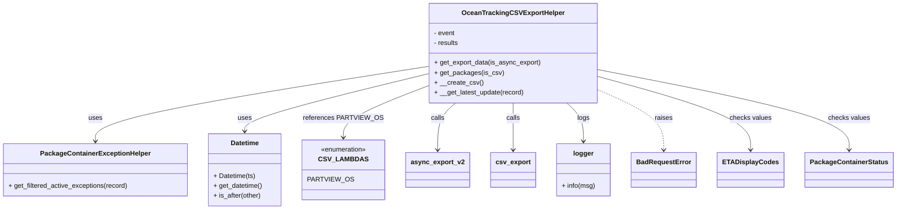

# Diagram: partview_core/partview_service/partview_service/utility/OceanTrackingCSVExportHelper.py

> Auto-generated by Obscura crawlers

## Mermaid

### SVG

<svg id="container" width="2081.6171875" xmlns="http://www.w3.org/2000/svg" class="classDiagram" height="504" viewBox="0 0 2081.6171875 504" role="graphics-document document" aria-roledescription="class"><g><defs><marker id="container_class-aggregationStart" class="marker aggregation class" refX="18" refY="7" markerWidth="190" markerHeight="240" orient="auto"><path d="M 18,7 L9,13 L1,7 L9,1 Z"></path></marker></defs><defs><marker id="container_class-aggregationEnd" class="marker aggregation class" refX="1" refY="7" markerWidth="20" markerHeight="28" orient="auto"><path d="M 18,7 L9,13 L1,7 L9,1 Z"></path></marker></defs><defs><marker id="container_class-extensionStart" class="marker extension class" refX="18" refY="7" markerWidth="190" markerHeight="240" orient="auto"><path d="M 1,7 L18,13 V 1 Z"></path></marker></defs><defs><marker id="container_class-extensionEnd" class="marker extension class" refX="1" refY="7" markerWidth="20" markerHeight="28" orient="auto"><path d="M 1,1 V 13 L18,7 Z"></path></marker></defs><defs><marker id="container_class-compositionStart" class="marker composition class" refX="18" refY="7" markerWidth="190" markerHeight="240" orient="auto"><path d="M 18,7 L9,13 L1,7 L9,1 Z"></path></marker></defs><defs><marker id="container_class-compositionEnd" class="marker composition class" refX="1" refY="7" markerWidth="20" markerHeight="28" orient="auto"><path d="M 18,7 L9,13 L1,7 L9,1 Z"></path></marker></defs><defs><marker id="container_class-dependencyStart" class="marker dependency class" refX="6" refY="7" markerWidth="190" markerHeight="240" orient="auto"><path d="M 5,7 L9,13 L1,7 L9,1 Z"></path></marker></defs><defs><marker id="container_class-dependencyEnd" class="marker dependency class" refX="13" refY="7" markerWidth="20" markerHeight="28" orient="auto"><path d="M 18,7 L9,13 L14,7 L9,1 Z"></path></marker></defs><defs><marker id="container_class-lollipopStart" class="marker lollipop class" refX="13" refY="7" markerWidth="190" markerHeight="240" orient="auto"><circle stroke="black" fill="transparent" cx="7" cy="7" r="6"></circle></marker></defs><defs><marker id="container_class-lollipopEnd" class="marker lollipop class" refX="1" refY="7" markerWidth="190" markerHeight="240" orient="auto"><circle stroke="black" fill="transparent" cx="7" cy="7" r="6"></circle></marker></defs><g class="root"><g class="clusters"></g><g class="edgePaths"><path d="M998.098,160.077L869.614,180.898C741.13,201.718,484.163,243.359,355.679,273.346C227.195,303.333,227.195,321.667,227.195,330.833L227.195,340" id="id_OceanTrackingCSVExportHelper_PackageContainerExceptionHelper_1" class="edge-thickness-normal edge-pattern-solid relation" style=";;;" data-edge="true" data-et="edge" data-id="id_OceanTrackingCSVExportHelper_PackageContainerExceptionHelper_1" data-points="W3sieCI6OTk4LjA5NzY1NjI1LCJ5IjoxNjAuMDc3MTgxNDI0NTI4MDh9LHsieCI6MjI3LjE5NTMxMjUsInkiOjI4NX0seyJ4IjoyMjcuMTk1MzEyNSwieSI6MzQ2fV0=" marker-end="url(#container_class-dependencyEnd)"></path><path d="M998.098,178.802L929.13,196.501C860.163,214.201,722.228,249.601,653.26,272.467C584.293,295.333,584.293,305.667,584.293,310.833L584.293,316" id="id_OceanTrackingCSVExportHelper_Datetime_2" class="edge-thickness-normal edge-pattern-solid relation" style=";;;" data-edge="true" data-et="edge" data-id="id_OceanTrackingCSVExportHelper_Datetime_2" data-points="W3sieCI6OTk4LjA5NzY1NjI1LCJ5IjoxNzguODAxNTE4NDMxMjUyMzZ9LHsieCI6NTg0LjI5Mjk2ODc1LCJ5IjoyODV9LHsieCI6NTg0LjI5Mjk2ODc1LCJ5IjozMjJ9XQ==" marker-end="url(#container_class-dependencyEnd)"></path><path d="M998.098,208.607L966.831,221.339C935.564,234.071,873.03,259.536,841.763,279.934C810.496,300.333,810.496,315.667,810.496,323.333L810.496,331" id="id_OceanTrackingCSVExportHelper_CSV_LAMBDAS_3" class="edge-thickness-normal edge-pattern-solid relation" style=";;;" data-edge="true" data-et="edge" data-id="id_OceanTrackingCSVExportHelper_CSV_LAMBDAS_3" data-points="W3sieCI6OTk4LjA5NzY1NjI1LCJ5IjoyMDguNjA2ODMyNzU3NTIwMTh9LHsieCI6ODEwLjQ5NjA5Mzc1LCJ5IjoyODV9LHsieCI6ODEwLjQ5NjA5Mzc1LCJ5IjozMzd9XQ==" marker-end="url(#container_class-dependencyEnd)"></path><path d="M1062.743,248L1055.892,254.167C1049.042,260.333,1035.341,272.667,1028.491,291.5C1021.641,310.333,1021.641,335.667,1021.641,348.333L1021.641,361" id="id_OceanTrackingCSVExportHelper_async_export_v2_4" class="edge-thickness-normal edge-pattern-solid relation" style=";;;" data-edge="true" data-et="edge" data-id="id_OceanTrackingCSVExportHelper_async_export_v2_4" data-points="W3sieCI6MTA2Mi43NDI3MzQ4NzI2MTE0LCJ5IjoyNDh9LHsieCI6MTAyMS42NDA2MjUsInkiOjI4NX0seyJ4IjoxMDIxLjY0MDYyNSwieSI6MzY3fV0=" marker-end="url(#container_class-dependencyEnd)"></path><path d="M1196.047,248L1196.047,254.167C1196.047,260.333,1196.047,272.667,1196.047,291.5C1196.047,310.333,1196.047,335.667,1196.047,348.333L1196.047,361" id="id_OceanTrackingCSVExportHelper_csv_export_5" class="edge-thickness-normal edge-pattern-solid relation" style=";;;" data-edge="true" data-et="edge" data-id="id_OceanTrackingCSVExportHelper_csv_export_5" data-points="W3sieCI6MTE5Ni4wNDY4NzUsInkiOjI0OH0seyJ4IjoxMTk2LjA0Njg3NSwieSI6Mjg1fSx7IngiOjExOTYuMDQ2ODc1LCJ5IjozNjd9XQ==" marker-end="url(#container_class-dependencyEnd)"></path><path d="M1322.517,248L1329.016,254.167C1335.515,260.333,1348.513,272.667,1355.013,288C1361.512,303.333,1361.512,321.667,1361.512,330.833L1361.512,340" id="id_OceanTrackingCSVExportHelper_logger_6" class="edge-thickness-normal edge-pattern-solid relation" style=";;;" data-edge="true" data-et="edge" data-id="id_OceanTrackingCSVExportHelper_logger_6" data-points="W3sieCI6MTMyMi41MTY4MTkyNjc1MTYsInkiOjI0OH0seyJ4IjoxMzYxLjUxMTcxODc1LCJ5IjoyODV9LHsieCI6MTM2MS41MTE3MTg3NSwieSI6MzQ2fV0=" marker-end="url(#container_class-dependencyEnd)"></path><path d="M1393.996,215.878L1419.946,227.399C1445.896,238.919,1497.796,261.959,1523.745,286.146C1549.695,310.333,1549.695,335.667,1549.695,348.333L1549.695,361" id="id_OceanTrackingCSVExportHelper_BadRequestError_7" class="edge-thickness-normal edge-pattern-dashed relation" style=";;;" data-edge="true" data-et="edge" data-id="id_OceanTrackingCSVExportHelper_BadRequestError_7" data-points="W3sieCI6MTM5My45OTYwOTM3NSwieSI6MjE1Ljg3ODMxMDkxMDgxODAyfSx7IngiOjE1NDkuNjk1MzEyNSwieSI6Mjg1fSx7IngiOjE1NDkuNjk1MzEyNSwieSI6MzY3fV0=" marker-end="url(#container_class-dependencyEnd)"></path><path d="M1393.996,184.319L1452.975,201.099C1511.953,217.879,1629.91,251.44,1688.889,280.887C1747.867,310.333,1747.867,335.667,1747.867,348.333L1747.867,361" id="id_OceanTrackingCSVExportHelper_ETADisplayCodes_8" class="edge-thickness-normal edge-pattern-solid relation" style=";;;" data-edge="true" data-et="edge" data-id="id_OceanTrackingCSVExportHelper_ETADisplayCodes_8" data-points="W3sieCI6MTM5My45OTYwOTM3NSwieSI6MTg0LjMxOTEwNzIxNjE3MzczfSx7IngiOjE3NDcuODY3MTg3NSwieSI6Mjg1fSx7IngiOjE3NDcuODY3MTg3NSwieSI6MzY3fV0=" marker-end="url(#container_class-dependencyEnd)"></path><path d="M1393.996,168.016L1490.445,187.513C1586.893,207.011,1779.79,246.005,1876.239,278.169C1972.688,310.333,1972.688,335.667,1972.688,348.333L1972.688,361" id="id_OceanTrackingCSVExportHelper_PackageContainerStatus_9" class="edge-thickness-normal edge-pattern-solid relation" style=";;;" data-edge="true" data-et="edge" data-id="id_OceanTrackingCSVExportHelper_PackageContainerStatus_9" data-points="W3sieCI6MTM5My45OTYwOTM3NSwieSI6MTY4LjAxNTk2OTIxODM4ODQ4fSx7IngiOjE5NzIuNjg3NSwieSI6Mjg1fSx7IngiOjE5NzIuNjg3NSwieSI6MzY3fV0=" marker-end="url(#container_class-dependencyEnd)"></path></g><g class="edgeLabels"><g class="edgeLabel" transform="translate(227.1953125, 285)"><g class="label" data-id="id_OceanTrackingCSVExportHelper_PackageContainerExceptionHelper_1" transform="translate(-16.4921875, -12)"><foreignObject width="32.984375" height="24">

uses

</foreignObject></g></g><g class="edgeLabel" transform="translate(584.29296875, 285)"><g class="label" data-id="id_OceanTrackingCSVExportHelper_Datetime_2" transform="translate(-16.4921875, -12)"><foreignObject width="32.984375" height="24">

uses

</foreignObject></g></g><g class="edgeLabel" transform="translate(810.49609375, 285)"><g class="label" data-id="id_OceanTrackingCSVExportHelper_CSV_LAMBDAS_3" transform="translate(-88.46875, -12)"><foreignObject width="176.9375" height="24">

references PARTVIEW_OS

</foreignObject></g></g><g class="edgeLabel" transform="translate(1021.640625, 285)"><g class="label" data-id="id_OceanTrackingCSVExportHelper_async_export_v2_4" transform="translate(-16.4453125, -12)"><foreignObject width="32.890625" height="24">

calls

</foreignObject></g></g><g class="edgeLabel" transform="translate(1196.046875, 285)"><g class="label" data-id="id_OceanTrackingCSVExportHelper_csv_export_5" transform="translate(-16.4453125, -12)"><foreignObject width="32.890625" height="24">

calls

</foreignObject></g></g><g class="edgeLabel" transform="translate(1361.51171875, 285)"><g class="label" data-id="id_OceanTrackingCSVExportHelper_logger_6" transform="translate(-14.8203125, -12)"><foreignObject width="29.640625" height="24">

logs

</foreignObject></g></g><g class="edgeLabel" transform="translate(1549.6953125, 285)"><g class="label" data-id="id_OceanTrackingCSVExportHelper_BadRequestError_7" transform="translate(-21.25, -12)"><foreignObject width="42.5" height="24">

raises

</foreignObject></g></g><g class="edgeLabel" transform="translate(1747.8671875, 285)"><g class="label" data-id="id_OceanTrackingCSVExportHelper_ETADisplayCodes_8" transform="translate(-49.7890625, -12)"><foreignObject width="99.578125" height="24">

checks values

</foreignObject></g></g><g class="edgeLabel" transform="translate(1972.6875, 285)"><g class="label" data-id="id_OceanTrackingCSVExportHelper_PackageContainerStatus_9" transform="translate(-49.7890625, -12)"><foreignObject width="99.578125" height="24">

checks values

</foreignObject></g></g></g><g class="nodes"><g class="node default" id="classId-OceanTrackingCSVExportHelper-0" transform="translate(1196.046875, 128)"><g class="basic label-container"><path d="M-197.94921875 -120 L197.94921875 -120 L197.94921875 120 L-197.94921875 120" stroke="none" stroke-width="0" fill="#ECECFF" style=""></path><path d="M-197.94921875 -120 C-75.09927564875247 -120, 47.750667452495065 -120, 197.94921875 -120 M-197.94921875 -120 C-82.32939785727605 -120, 33.2904230354479 -120, 197.94921875 -120 M197.94921875 -120 C197.94921875 -54.32342866899623, 197.94921875 11.353142662007542, 197.94921875 120 M197.94921875 -120 C197.94921875 -30.074861819400255, 197.94921875 59.85027636119949, 197.94921875 120 M197.94921875 120 C54.73935649322905 120, -88.4705057635419 120, -197.94921875 120 M197.94921875 120 C100.78213865624154 120, 3.6150585624830853 120, -197.94921875 120 M-197.94921875 120 C-197.94921875 68.3928352601271, -197.94921875 16.785670520254186, -197.94921875 -120 M-197.94921875 120 C-197.94921875 58.97503447847594, -197.94921875 -2.049931043048119, -197.94921875 -120" stroke="#9370DB" stroke-width="1.3" fill="none" stroke-dasharray="0 0" style=""></path></g><g class="annotation-group text" transform="translate(0, -96)"></g><g class="label-group text" transform="translate(-115.5234375, -96)"><g class="label" style="font-weight: bolder" transform="translate(0,-12)"><foreignObject width="231.046875" height="24">

OceanTrackingCSVExportHelper

</foreignObject></g></g><g class="members-group text" transform="translate(-185.94921875, -48)"><g class="label" style="" transform="translate(0,-12)"><foreignObject width="51.03125" height="24">

- event

</foreignObject></g><g class="label" style="" transform="translate(0,12)"><foreignObject width="59.828125" height="24">

- results

</foreignObject></g></g><g class="methods-group text" transform="translate(-185.94921875, 24)"><g class="label" style="" transform="translate(0,-12)"><foreignObject width="256.375" height="24">

+ get_export_data(is_async_export)

</foreignObject></g><g class="label" style="" transform="translate(0,12)"><foreignObject width="162.3125" height="24">

+ get_packages(is_csv)

</foreignObject></g><g class="label" style="" transform="translate(0,36)"><foreignObject width="114.03125" height="24">

+ __create_csv()

</foreignObject></g><g class="label" style="" transform="translate(0,60)"><foreignObject width="216.453125" height="24">

+ __get_latest_update(record)

</foreignObject></g></g><g class="divider" style=""><path d="M-197.94921875 -72 C-76.47751500560881 -72, 44.994188738782384 -72, 197.94921875 -72 M-197.94921875 -72 C-43.48222363421968 -72, 110.98477148156064 -72, 197.94921875 -72" stroke="#9370DB" stroke-width="1.3" fill="none" stroke-dasharray="0 0" style=""></path></g><g class="divider" style=""><path d="M-197.94921875 0 C-111.70416565596005 0, -25.459112561920108 0, 197.94921875 0 M-197.94921875 0 C-67.10779696617317 0, 63.73362481765366 0, 197.94921875 0" stroke="#9370DB" stroke-width="1.3" fill="none" stroke-dasharray="0 0" style=""></path></g></g><g class="node default" id="classId-PackageContainerExceptionHelper-1" transform="translate(227.1953125, 409)"><g class="basic label-container"><path d="M-219.1953125 -63 L219.1953125 -63 L219.1953125 63 L-219.1953125 63" stroke="none" stroke-width="0" fill="#ECECFF" style=""></path><path d="M-219.1953125 -63 C-66.17141679612968 -63, 86.85247890774065 -63, 219.1953125 -63 M-219.1953125 -63 C-111.57408939499781 -63, -3.952866289995626 -63, 219.1953125 -63 M219.1953125 -63 C219.1953125 -23.303019838133103, 219.1953125 16.393960323733793, 219.1953125 63 M219.1953125 -63 C219.1953125 -24.31795248939077, 219.1953125 14.36409502121846, 219.1953125 63 M219.1953125 63 C114.03967467781368 63, 8.884036855627357 63, -219.1953125 63 M219.1953125 63 C75.90671132938641 63, -67.38188984122718 63, -219.1953125 63 M-219.1953125 63 C-219.1953125 25.21521303730767, -219.1953125 -12.56957392538466, -219.1953125 -63 M-219.1953125 63 C-219.1953125 28.653333955595322, -219.1953125 -5.693332088809356, -219.1953125 -63" stroke="#9370DB" stroke-width="1.3" fill="none" stroke-dasharray="0 0" style=""></path></g><g class="annotation-group text" transform="translate(0, -39)"></g><g class="label-group text" transform="translate(-125.671875, -39)"><g class="label" style="font-weight: bolder" transform="translate(0,-12)"><foreignObject width="251.34375" height="24">

PackageContainerExceptionHelper

</foreignObject></g></g><g class="members-group text" transform="translate(-207.1953125, 9)"></g><g class="methods-group text" transform="translate(-207.1953125, 39)"><g class="label" style="" transform="translate(0,-12)"><foreignObject width="288.71875" height="24">

+ get_filtered_active_exceptions(record)

</foreignObject></g></g><g class="divider" style=""><path d="M-219.1953125 -15 C-96.68772166817222 -15, 25.819869163655568 -15, 219.1953125 -15 M-219.1953125 -15 C-55.659809472990304 -15, 107.87569355401939 -15, 219.1953125 -15" stroke="#9370DB" stroke-width="1.3" fill="none" stroke-dasharray="0 0" style=""></path></g><g class="divider" style=""><path d="M-219.1953125 9 C-110.40245390785095 9, -1.6095953157019096 9, 219.1953125 9 M-219.1953125 9 C-129.2208697283819 9, -39.24642695676377 9, 219.1953125 9" stroke="#9370DB" stroke-width="1.3" fill="none" stroke-dasharray="0 0" style=""></path></g></g><g class="node default" id="classId-Datetime-2" transform="translate(584.29296875, 409)"><g class="basic label-container"><path d="M-87.90234375 -87 L87.90234375 -87 L87.90234375 87 L-87.90234375 87" stroke="none" stroke-width="0" fill="#ECECFF" style=""></path><path d="M-87.90234375 -87 C-22.642343893940875 -87, 42.61765596211825 -87, 87.90234375 -87 M-87.90234375 -87 C-35.83450816900715 -87, 16.233327411985698 -87, 87.90234375 -87 M87.90234375 -87 C87.90234375 -46.62355407287785, 87.90234375 -6.247108145755703, 87.90234375 87 M87.90234375 -87 C87.90234375 -38.90372342377202, 87.90234375 9.192553152455957, 87.90234375 87 M87.90234375 87 C51.513524108180576 87, 15.124704466361152 87, -87.90234375 87 M87.90234375 87 C33.12413082163775 87, -21.654082106724502 87, -87.90234375 87 M-87.90234375 87 C-87.90234375 24.743256624505577, -87.90234375 -37.51348675098885, -87.90234375 -87 M-87.90234375 87 C-87.90234375 35.98674328093883, -87.90234375 -15.026513438122336, -87.90234375 -87" stroke="#9370DB" stroke-width="1.3" fill="none" stroke-dasharray="0 0" style=""></path></g><g class="annotation-group text" transform="translate(0, -63)"></g><g class="label-group text" transform="translate(-33.3984375, -63)"><g class="label" style="font-weight: bolder" transform="translate(0,-12)"><foreignObject width="66.796875" height="24">

Datetime

</foreignObject></g></g><g class="members-group text" transform="translate(-75.90234375, -15)"></g><g class="methods-group text" transform="translate(-75.90234375, 15)"><g class="label" style="" transform="translate(0,-12)"><foreignObject width="101.671875" height="24">

+ Datetime(ts)

</foreignObject></g><g class="label" style="" transform="translate(0,12)"><foreignObject width="118.40625" height="24">

+ get_datetime()

</foreignObject></g><g class="label" style="" transform="translate(0,36)"><foreignObject width="116.15625" height="24">

+ is_after(other)

</foreignObject></g></g><g class="divider" style=""><path d="M-87.90234375 -39 C-29.59100961792123 -39, 28.72032451415754 -39, 87.90234375 -39 M-87.90234375 -39 C-39.861777845435505 -39, 8.17878805912899 -39, 87.90234375 -39" stroke="#9370DB" stroke-width="1.3" fill="none" stroke-dasharray="0 0" style=""></path></g><g class="divider" style=""><path d="M-87.90234375 -15 C-32.79295612447377 -15, 22.316431501052463 -15, 87.90234375 -15 M-87.90234375 -15 C-48.85779068207134 -15, -9.813237614142679 -15, 87.90234375 -15" stroke="#9370DB" stroke-width="1.3" fill="none" stroke-dasharray="0 0" style=""></path></g></g><g class="node default" id="classId-CSV_LAMBDAS-3" transform="translate(810.49609375, 409)"><g class="basic label-container"><path d="M-88.30078125 -72 L88.30078125 -72 L88.30078125 72 L-88.30078125 72" stroke="none" stroke-width="0" fill="#ECECFF" style=""></path><path d="M-88.30078125 -72 C-38.44659882843989 -72, 11.407583593120222 -72, 88.30078125 -72 M-88.30078125 -72 C-44.64943621827048 -72, -0.998091186540961 -72, 88.30078125 -72 M88.30078125 -72 C88.30078125 -37.71108122301193, 88.30078125 -3.4221624460238615, 88.30078125 72 M88.30078125 -72 C88.30078125 -24.902665202072498, 88.30078125 22.194669595855004, 88.30078125 72 M88.30078125 72 C50.83869980469811 72, 13.376618359396218 72, -88.30078125 72 M88.30078125 72 C42.416643116974576 72, -3.4674950160508473 72, -88.30078125 72 M-88.30078125 72 C-88.30078125 14.527686580485188, -88.30078125 -42.944626839029624, -88.30078125 -72 M-88.30078125 72 C-88.30078125 17.295481779395395, -88.30078125 -37.40903644120921, -88.30078125 -72" stroke="#9370DB" stroke-width="1.3" fill="none" stroke-dasharray="0 0" style=""></path></g><g class="annotation-group text" transform="translate(-55.5546875, -48)"><g class="label" style="" transform="translate(0,-12)"><foreignObject width="111.109375" height="24">

«enumeration»

</foreignObject></g></g><g class="label-group text" transform="translate(-51.734375, -24)"><g class="label" style="font-weight: bolder" transform="translate(0,-12)"><foreignObject width="103.46875" height="24">

CSV_LAMBDAS

</foreignObject></g></g><g class="members-group text" transform="translate(-76.30078125, 24)"><g class="label" style="" transform="translate(0,-12)"><foreignObject width="97.046875" height="24">

PARTVIEW_OS

</foreignObject></g></g><g class="methods-group text" transform="translate(-76.30078125, 72)"></g><g class="divider" style=""><path d="M-88.30078125 0 C-47.32451424466588 0, -6.348247239331755 0, 88.30078125 0 M-88.30078125 0 C-25.552349572539043 0, 37.19608210492191 0, 88.30078125 0" stroke="#9370DB" stroke-width="1.3" fill="none" stroke-dasharray="0 0" style=""></path></g><g class="divider" style=""><path d="M-88.30078125 48 C-45.56414196639273 48, -2.8275026827854646 48, 88.30078125 48 M-88.30078125 48 C-36.755768193912736 48, 14.789244862174527 48, 88.30078125 48" stroke="#9370DB" stroke-width="1.3" fill="none" stroke-dasharray="0 0" style=""></path></g></g><g class="node default" id="classId-BadRequestError-4" transform="translate(1549.6953125, 409)"><g class="basic label-container"><path d="M-74.28125 -42 L74.28125 -42 L74.28125 42 L-74.28125 42" stroke="none" stroke-width="0" fill="#ECECFF" style=""></path><path d="M-74.28125 -42 C-15.242763466297006 -42, 43.79572306740599 -42, 74.28125 -42 M-74.28125 -42 C-20.8163983028817 -42, 32.6484533942366 -42, 74.28125 -42 M74.28125 -42 C74.28125 -14.572982890134291, 74.28125 12.854034219731417, 74.28125 42 M74.28125 -42 C74.28125 -11.020789596222127, 74.28125 19.958420807555747, 74.28125 42 M74.28125 42 C19.748503611041066 42, -34.78424277791787 42, -74.28125 42 M74.28125 42 C41.06917094251468 42, 7.857091885029362 42, -74.28125 42 M-74.28125 42 C-74.28125 8.62948630438239, -74.28125 -24.74102739123522, -74.28125 -42 M-74.28125 42 C-74.28125 24.618679803797956, -74.28125 7.237359607595913, -74.28125 -42" stroke="#9370DB" stroke-width="1.3" fill="none" stroke-dasharray="0 0" style=""></path></g><g class="annotation-group text" transform="translate(0, -18)"></g><g class="label-group text" transform="translate(-62.28125, -18)"><g class="label" style="font-weight: bolder" transform="translate(0,-12)"><foreignObject width="124.5625" height="24">

BadRequestError

</foreignObject></g></g><g class="members-group text" transform="translate(-62.28125, 30)"></g><g class="methods-group text" transform="translate(-62.28125, 60)"></g><g class="divider" style=""><path d="M-74.28125 6 C-23.555713351076413 6, 27.169823297847174 6, 74.28125 6 M-74.28125 6 C-23.135946154442813 6, 28.009357691114374 6, 74.28125 6" stroke="#9370DB" stroke-width="1.3" fill="none" stroke-dasharray="0 0" style=""></path></g><g class="divider" style=""><path d="M-74.28125 24 C-31.393203934939855 24, 11.49484213012029 24, 74.28125 24 M-74.28125 24 C-42.609722237121936 24, -10.938194474243872 24, 74.28125 24" stroke="#9370DB" stroke-width="1.3" fill="none" stroke-dasharray="0 0" style=""></path></g></g><g class="node default" id="classId-logger-5" transform="translate(1361.51171875, 409)"><g class="basic label-container"><path d="M-63.90234375 -63 L63.90234375 -63 L63.90234375 63 L-63.90234375 63" stroke="none" stroke-width="0" fill="#ECECFF" style=""></path><path d="M-63.90234375 -63 C-13.844593792685053 -63, 36.21315616462989 -63, 63.90234375 -63 M-63.90234375 -63 C-37.528170621810176 -63, -11.153997493620352 -63, 63.90234375 -63 M63.90234375 -63 C63.90234375 -30.65787609536053, 63.90234375 1.6842478092789435, 63.90234375 63 M63.90234375 -63 C63.90234375 -30.042072787505987, 63.90234375 2.9158544249880265, 63.90234375 63 M63.90234375 63 C24.660380773465995 63, -14.58158220306801 63, -63.90234375 63 M63.90234375 63 C25.864705025803183 63, -12.172933698393635 63, -63.90234375 63 M-63.90234375 63 C-63.90234375 33.03578337539338, -63.90234375 3.071566750786765, -63.90234375 -63 M-63.90234375 63 C-63.90234375 27.370350898132912, -63.90234375 -8.259298203734176, -63.90234375 -63" stroke="#9370DB" stroke-width="1.3" fill="none" stroke-dasharray="0 0" style=""></path></g><g class="annotation-group text" transform="translate(0, -39)"></g><g class="label-group text" transform="translate(-23.2734375, -39)"><g class="label" style="font-weight: bolder" transform="translate(0,-12)"><foreignObject width="46.546875" height="24">

logger

</foreignObject></g></g><g class="members-group text" transform="translate(-51.90234375, 9)"></g><g class="methods-group text" transform="translate(-51.90234375, 39)"><g class="label" style="" transform="translate(0,-12)"><foreignObject width="80.53125" height="24">

+ info(msg)

</foreignObject></g></g><g class="divider" style=""><path d="M-63.90234375 -15 C-29.613735863382075 -15, 4.674872023235849 -15, 63.90234375 -15 M-63.90234375 -15 C-30.017683025353286 -15, 3.866977699293429 -15, 63.90234375 -15" stroke="#9370DB" stroke-width="1.3" fill="none" stroke-dasharray="0 0" style=""></path></g><g class="divider" style=""><path d="M-63.90234375 9 C-27.185235458509744 9, 9.531872832980511 9, 63.90234375 9 M-63.90234375 9 C-30.886212507240735 9, 2.1299187355185296 9, 63.90234375 9" stroke="#9370DB" stroke-width="1.3" fill="none" stroke-dasharray="0 0" style=""></path></g></g><g class="node default" id="classId-async_export_v2-6" transform="translate(1021.640625, 409)"><g class="basic label-container"><path d="M-72.84375 -42 L72.84375 -42 L72.84375 42 L-72.84375 42" stroke="none" stroke-width="0" fill="#ECECFF" style=""></path><path d="M-72.84375 -42 C-30.038719509145878 -42, 12.766310981708244 -42, 72.84375 -42 M-72.84375 -42 C-18.815040040210732 -42, 35.213669919578535 -42, 72.84375 -42 M72.84375 -42 C72.84375 -13.325392047257285, 72.84375 15.34921590548543, 72.84375 42 M72.84375 -42 C72.84375 -20.364672927753727, 72.84375 1.2706541444925463, 72.84375 42 M72.84375 42 C36.88185718611259 42, 0.9199643722251807 42, -72.84375 42 M72.84375 42 C29.764929691303195 42, -13.31389061739361 42, -72.84375 42 M-72.84375 42 C-72.84375 24.691022338106034, -72.84375 7.382044676212068, -72.84375 -42 M-72.84375 42 C-72.84375 10.195087714199332, -72.84375 -21.609824571601337, -72.84375 -42" stroke="#9370DB" stroke-width="1.3" fill="none" stroke-dasharray="0 0" style=""></path></g><g class="annotation-group text" transform="translate(0, -18)"></g><g class="label-group text" transform="translate(-60.84375, -18)"><g class="label" style="font-weight: bolder" transform="translate(0,-12)"><foreignObject width="121.6875" height="24">

async_export_v2

</foreignObject></g></g><g class="members-group text" transform="translate(-60.84375, 30)"></g><g class="methods-group text" transform="translate(-60.84375, 60)"></g><g class="divider" style=""><path d="M-72.84375 6 C-29.11295761224784 6, 14.61783477550432 6, 72.84375 6 M-72.84375 6 C-15.36005336724756 6, 42.12364326550488 6, 72.84375 6" stroke="#9370DB" stroke-width="1.3" fill="none" stroke-dasharray="0 0" style=""></path></g><g class="divider" style=""><path d="M-72.84375 24 C-36.23706577560797 24, 0.3696184487840668 24, 72.84375 24 M-72.84375 24 C-43.39516408989126 24, -13.94657817978252 24, 72.84375 24" stroke="#9370DB" stroke-width="1.3" fill="none" stroke-dasharray="0 0" style=""></path></g></g><g class="node default" id="classId-csv_export-7" transform="translate(1196.046875, 409)"><g class="basic label-container"><path d="M-51.5625 -42 L51.5625 -42 L51.5625 42 L-51.5625 42" stroke="none" stroke-width="0" fill="#ECECFF" style=""></path><path d="M-51.5625 -42 C-24.027029115554512 -42, 3.5084417688909753 -42, 51.5625 -42 M-51.5625 -42 C-30.10917165981062 -42, -8.65584331962124 -42, 51.5625 -42 M51.5625 -42 C51.5625 -24.026821605345457, 51.5625 -6.053643210690915, 51.5625 42 M51.5625 -42 C51.5625 -12.85160740785632, 51.5625 16.29678518428736, 51.5625 42 M51.5625 42 C23.876525027711416 42, -3.8094499445771675 42, -51.5625 42 M51.5625 42 C17.029021455223216 42, -17.50445708955357 42, -51.5625 42 M-51.5625 42 C-51.5625 19.02977459677221, -51.5625 -3.94045080645558, -51.5625 -42 M-51.5625 42 C-51.5625 11.1601247968199, -51.5625 -19.6797504063602, -51.5625 -42" stroke="#9370DB" stroke-width="1.3" fill="none" stroke-dasharray="0 0" style=""></path></g><g class="annotation-group text" transform="translate(0, -18)"></g><g class="label-group text" transform="translate(-39.5625, -18)"><g class="label" style="font-weight: bolder" transform="translate(0,-12)"><foreignObject width="79.125" height="24">

csv_export

</foreignObject></g></g><g class="members-group text" transform="translate(-39.5625, 30)"></g><g class="methods-group text" transform="translate(-39.5625, 60)"></g><g class="divider" style=""><path d="M-51.5625 6 C-16.065854297867318 6, 19.430791404265364 6, 51.5625 6 M-51.5625 6 C-24.99434464899945 6, 1.5738107020010972 6, 51.5625 6" stroke="#9370DB" stroke-width="1.3" fill="none" stroke-dasharray="0 0" style=""></path></g><g class="divider" style=""><path d="M-51.5625 24 C-26.767674931529974 24, -1.972849863059949 24, 51.5625 24 M-51.5625 24 C-20.992407593235388 24, 9.577684813529224 24, 51.5625 24" stroke="#9370DB" stroke-width="1.3" fill="none" stroke-dasharray="0 0" style=""></path></g></g><g class="node default" id="classId-ETADisplayCodes-8" transform="translate(1747.8671875, 409)"><g class="basic label-container"><path d="M-73.890625 -42 L73.890625 -42 L73.890625 42 L-73.890625 42" stroke="none" stroke-width="0" fill="#ECECFF" style=""></path><path d="M-73.890625 -42 C-39.3370645997473 -42, -4.783504199494601 -42, 73.890625 -42 M-73.890625 -42 C-18.591671892560747 -42, 36.707281214878506 -42, 73.890625 -42 M73.890625 -42 C73.890625 -17.76061059228307, 73.890625 6.478778815433863, 73.890625 42 M73.890625 -42 C73.890625 -8.759872718983537, 73.890625 24.480254562032925, 73.890625 42 M73.890625 42 C26.830101841236704 42, -20.23042131752659 42, -73.890625 42 M73.890625 42 C27.870199087226858 42, -18.150226825546284 42, -73.890625 42 M-73.890625 42 C-73.890625 24.35909266588862, -73.890625 6.718185331777242, -73.890625 -42 M-73.890625 42 C-73.890625 23.686414953999275, -73.890625 5.37282990799855, -73.890625 -42" stroke="#9370DB" stroke-width="1.3" fill="none" stroke-dasharray="0 0" style=""></path></g><g class="annotation-group text" transform="translate(0, -18)"></g><g class="label-group text" transform="translate(-61.890625, -18)"><g class="label" style="font-weight: bolder" transform="translate(0,-12)"><foreignObject width="123.78125" height="24">

ETADisplayCodes

</foreignObject></g></g><g class="members-group text" transform="translate(-61.890625, 30)"></g><g class="methods-group text" transform="translate(-61.890625, 60)"></g><g class="divider" style=""><path d="M-73.890625 6 C-41.99933920867629 6, -10.108053417352586 6, 73.890625 6 M-73.890625 6 C-16.71533784453984 6, 40.45994931092032 6, 73.890625 6" stroke="#9370DB" stroke-width="1.3" fill="none" stroke-dasharray="0 0" style=""></path></g><g class="divider" style=""><path d="M-73.890625 24 C-32.13414747566779 24, 9.622330048664423 24, 73.890625 24 M-73.890625 24 C-38.01379816685457 24, -2.136971333709141 24, 73.890625 24" stroke="#9370DB" stroke-width="1.3" fill="none" stroke-dasharray="0 0" style=""></path></g></g><g class="node default" id="classId-PackageContainerStatus-9" transform="translate(1972.6875, 409)"><g class="basic label-container"><path d="M-100.9296875 -42 L100.9296875 -42 L100.9296875 42 L-100.9296875 42" stroke="none" stroke-width="0" fill="#ECECFF" style=""></path><path d="M-100.9296875 -42 C-49.47974372142374 -42, 1.9702000571525247 -42, 100.9296875 -42 M-100.9296875 -42 C-41.48086400434973 -42, 17.967959491300533 -42, 100.9296875 -42 M100.9296875 -42 C100.9296875 -25.04299471322035, 100.9296875 -8.085989426440698, 100.9296875 42 M100.9296875 -42 C100.9296875 -15.334512962953603, 100.9296875 11.330974074092794, 100.9296875 42 M100.9296875 42 C33.06064868162086 42, -34.80839013675828 42, -100.9296875 42 M100.9296875 42 C55.735541792390386 42, 10.541396084780772 42, -100.9296875 42 M-100.9296875 42 C-100.9296875 18.895139966887808, -100.9296875 -4.209720066224385, -100.9296875 -42 M-100.9296875 42 C-100.9296875 24.56414011859994, -100.9296875 7.128280237199881, -100.9296875 -42" stroke="#9370DB" stroke-width="1.3" fill="none" stroke-dasharray="0 0" style=""></path></g><g class="annotation-group text" transform="translate(0, -18)"></g><g class="label-group text" transform="translate(-88.9296875, -18)"><g class="label" style="font-weight: bolder" transform="translate(0,-12)"><foreignObject width="177.859375" height="24">

PackageContainerStatus

</foreignObject></g></g><g class="members-group text" transform="translate(-88.9296875, 30)"></g><g class="methods-group text" transform="translate(-88.9296875, 60)"></g><g class="divider" style=""><path d="M-100.9296875 6 C-22.40045965478106 6, 56.12876819043788 6, 100.9296875 6 M-100.9296875 6 C-50.26690151136999 6, 0.39588447726002585 6, 100.9296875 6" stroke="#9370DB" stroke-width="1.3" fill="none" stroke-dasharray="0 0" style=""></path></g><g class="divider" style=""><path d="M-100.9296875 24 C-28.70049814364681 24, 43.52869121270638 24, 100.9296875 24 M-100.9296875 24 C-51.70489716995312 24, -2.4801068399062416 24, 100.9296875 24" stroke="#9370DB" stroke-width="1.3" fill="none" stroke-dasharray="0 0" style=""></path></g></g></g></g></g></svg>
