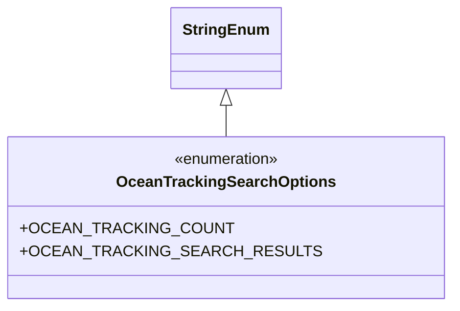

# Diagram: partview_core/partview_service/partview_service/utility/OceanTrackingSearchOptions.py

> Auto-generated by Obscura crawlers

## Mermaid

### SVG

<svg id="container" width="415.109375" xmlns="http://www.w3.org/2000/svg" class="classDiagram" height="318" viewBox="0 0 415.109375 318" role="graphics-document document" aria-roledescription="class"><g><defs><marker id="container_class-aggregationStart" class="marker aggregation class" refX="18" refY="7" markerWidth="190" markerHeight="240" orient="auto"><path d="M 18,7 L9,13 L1,7 L9,1 Z"></path></marker></defs><defs><marker id="container_class-aggregationEnd" class="marker aggregation class" refX="1" refY="7" markerWidth="20" markerHeight="28" orient="auto"><path d="M 18,7 L9,13 L1,7 L9,1 Z"></path></marker></defs><defs><marker id="container_class-extensionStart" class="marker extension class" refX="18" refY="7" markerWidth="190" markerHeight="240" orient="auto"><path d="M 1,7 L18,13 V 1 Z"></path></marker></defs><defs><marker id="container_class-extensionEnd" class="marker extension class" refX="1" refY="7" markerWidth="20" markerHeight="28" orient="auto"><path d="M 1,1 V 13 L18,7 Z"></path></marker></defs><defs><marker id="container_class-compositionStart" class="marker composition class" refX="18" refY="7" markerWidth="190" markerHeight="240" orient="auto"><path d="M 18,7 L9,13 L1,7 L9,1 Z"></path></marker></defs><defs><marker id="container_class-compositionEnd" class="marker composition class" refX="1" refY="7" markerWidth="20" markerHeight="28" orient="auto"><path d="M 18,7 L9,13 L1,7 L9,1 Z"></path></marker></defs><defs><marker id="container_class-dependencyStart" class="marker dependency class" refX="6" refY="7" markerWidth="190" markerHeight="240" orient="auto"><path d="M 5,7 L9,13 L1,7 L9,1 Z"></path></marker></defs><defs><marker id="container_class-dependencyEnd" class="marker dependency class" refX="13" refY="7" markerWidth="20" markerHeight="28" orient="auto"><path d="M 18,7 L9,13 L14,7 L9,1 Z"></path></marker></defs><defs><marker id="container_class-lollipopStart" class="marker lollipop class" refX="13" refY="7" markerWidth="190" markerHeight="240" orient="auto"><circle stroke="black" fill="transparent" cx="7" cy="7" r="6"></circle></marker></defs><defs><marker id="container_class-lollipopEnd" class="marker lollipop class" refX="1" refY="7" markerWidth="190" markerHeight="240" orient="auto"><circle stroke="black" fill="transparent" cx="7" cy="7" r="6"></circle></marker></defs><g class="root"><g class="clusters"></g><g class="edgePaths"><path d="M207.555,109.25L207.555,110.542C207.555,111.833,207.555,114.417,207.555,119.875C207.555,125.333,207.555,133.667,207.555,137.833L207.555,142" id="id_StringEnum_OceanTrackingSearchOptions_1" class="edge-thickness-normal edge-pattern-solid relation" style=";;;" data-edge="true" data-et="edge" data-id="id_StringEnum_OceanTrackingSearchOptions_1" data-points="W3sieCI6MjA3LjU1NDY4NzUsInkiOjkyfSx7IngiOjIwNy41NTQ2ODc1LCJ5IjoxMTd9LHsieCI6MjA3LjU1NDY4NzUsInkiOjE0Mn1d" marker-start="url(#container_class-extensionStart)"></path></g><g class="edgeLabels"><g class="edgeLabel"><g class="label" data-id="id_StringEnum_OceanTrackingSearchOptions_1" transform="translate(0, 0)"><foreignObject width="0" height="0">

</foreignObject></g></g></g><g class="nodes"><g class="node default" id="classId-StringEnum-0" transform="translate(207.5546875, 50)"><g class="basic label-container"><path d="M-54.234375 -42 L54.234375 -42 L54.234375 42 L-54.234375 42" stroke="none" stroke-width="0" fill="#ECECFF" style=""></path><path d="M-54.234375 -42 C-26.210084383911354 -42, 1.8142062321772912 -42, 54.234375 -42 M-54.234375 -42 C-28.801577764610087 -42, -3.3687805292201745 -42, 54.234375 -42 M54.234375 -42 C54.234375 -23.85675485741598, 54.234375 -5.713509714831957, 54.234375 42 M54.234375 -42 C54.234375 -15.714998168583211, 54.234375 10.570003662833578, 54.234375 42 M54.234375 42 C18.42776925765751 42, -17.37883648468498 42, -54.234375 42 M54.234375 42 C14.988718976665425 42, -24.25693704666915 42, -54.234375 42 M-54.234375 42 C-54.234375 18.656248345173758, -54.234375 -4.6875033096524845, -54.234375 -42 M-54.234375 42 C-54.234375 23.49370225191913, -54.234375 4.987404503838263, -54.234375 -42" stroke="#9370DB" stroke-width="1.3" fill="none" stroke-dasharray="0 0" style=""></path></g><g class="annotation-group text" transform="translate(0, -18)"></g><g class="label-group text" transform="translate(-42.234375, -18)"><g class="label" style="font-weight: bolder" transform="translate(0,-12)"><foreignObject width="84.46875" height="24">

StringEnum

</foreignObject></g></g><g class="members-group text" transform="translate(-42.234375, 30)"></g><g class="methods-group text" transform="translate(-42.234375, 60)"></g><g class="divider" style=""><path d="M-54.234375 6 C-23.244600889961404 6, 7.7451732200771914 6, 54.234375 6 M-54.234375 6 C-21.326106248048653 6, 11.582162503902694 6, 54.234375 6" stroke="#9370DB" stroke-width="1.3" fill="none" stroke-dasharray="0 0" style=""></path></g><g class="divider" style=""><path d="M-54.234375 24 C-15.861638199463997 24, 22.511098601072007 24, 54.234375 24 M-54.234375 24 C-31.597890919766407 24, -8.961406839532813 24, 54.234375 24" stroke="#9370DB" stroke-width="1.3" fill="none" stroke-dasharray="0 0" style=""></path></g></g><g class="node default" id="classId-OceanTrackingSearchOptions-1" transform="translate(207.5546875, 226)"><g class="basic label-container"><path d="M-199.5546875 -84 L199.5546875 -84 L199.5546875 84 L-199.5546875 84" stroke="none" stroke-width="0" fill="#ECECFF" style=""></path><path d="M-199.5546875 -84 C-86.10765751153968 -84, 27.33937247692063 -84, 199.5546875 -84 M-199.5546875 -84 C-43.332978054730575 -84, 112.88873139053885 -84, 199.5546875 -84 M199.5546875 -84 C199.5546875 -32.94177420834639, 199.5546875 18.116451583307224, 199.5546875 84 M199.5546875 -84 C199.5546875 -45.18432255670816, 199.5546875 -6.368645113416321, 199.5546875 84 M199.5546875 84 C91.89381923537577 84, -15.767049029248454 84, -199.5546875 84 M199.5546875 84 C114.82079153376706 84, 30.08689556753413 84, -199.5546875 84 M-199.5546875 84 C-199.5546875 41.18594063643523, -199.5546875 -1.6281187271295465, -199.5546875 -84 M-199.5546875 84 C-199.5546875 38.65060463830163, -199.5546875 -6.6987907233967405, -199.5546875 -84" stroke="#9370DB" stroke-width="1.3" fill="none" stroke-dasharray="0 0" style=""></path></g><g class="annotation-group text" transform="translate(-55.5546875, -60)"><g class="label" style="" transform="translate(0,-12)"><foreignObject width="111.109375" height="24">

«enumeration»

</foreignObject></g></g><g class="label-group text" transform="translate(-106.96875, -36)"><g class="label" style="font-weight: bolder" transform="translate(0,-12)"><foreignObject width="213.9375" height="24">

OceanTrackingSearchOptions

</foreignObject></g></g><g class="members-group text" transform="translate(-187.5546875, 12)"><g class="label" style="" transform="translate(0,-12)"><foreignObject width="192.46875" height="24">

+OCEAN_TRACKING_COUNT

</foreignObject></g><g class="label" style="" transform="translate(0,12)"><foreignObject width="268.140625" height="24">

+OCEAN_TRACKING_SEARCH_RESULTS

</foreignObject></g></g><g class="methods-group text" transform="translate(-187.5546875, 84)"></g><g class="divider" style=""><path d="M-199.5546875 -12 C-87.79219332399013 -12, 23.970300852019733 -12, 199.5546875 -12 M-199.5546875 -12 C-66.48404466896113 -12, 66.58659816207773 -12, 199.5546875 -12" stroke="#9370DB" stroke-width="1.3" fill="none" stroke-dasharray="0 0" style=""></path></g><g class="divider" style=""><path d="M-199.5546875 60 C-73.91066795762268 60, 51.733351584754644 60, 199.5546875 60 M-199.5546875 60 C-75.29168907636144 60, 48.97130934727713 60, 199.5546875 60" stroke="#9370DB" stroke-width="1.3" fill="none" stroke-dasharray="0 0" style=""></path></g></g></g></g></g></svg>
