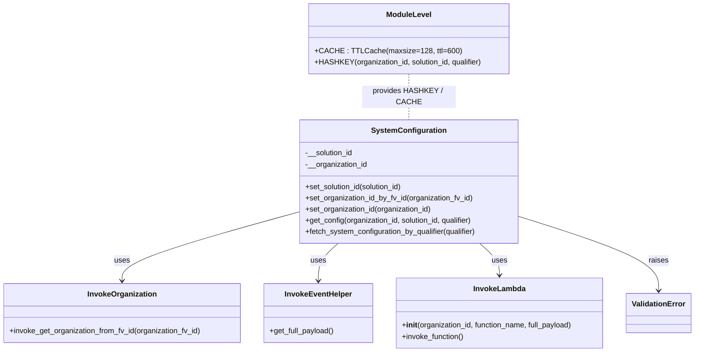
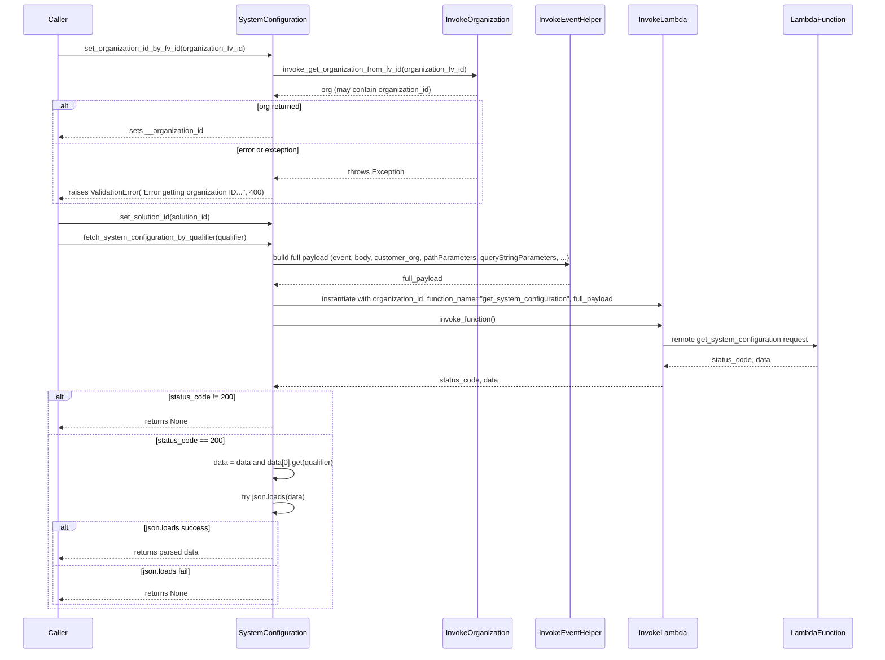

# Diagram: partview_core/partview_service/partview_service/utility/SystemConfiguration.py

> Auto-generated by Obscura crawlers

## Diagram 1

### SVG

<svg id="container" width="1490.0859375" xmlns="http://www.w3.org/2000/svg" class="classDiagram" height="728" viewBox="0 0 1490.0859375 728" role="graphics-document document" aria-roledescription="class"><g><defs><marker id="container_class-aggregationStart" class="marker aggregation class" refX="18" refY="7" markerWidth="190" markerHeight="240" orient="auto"><path d="M 18,7 L9,13 L1,7 L9,1 Z"></path></marker></defs><defs><marker id="container_class-aggregationEnd" class="marker aggregation class" refX="1" refY="7" markerWidth="20" markerHeight="28" orient="auto"><path d="M 18,7 L9,13 L1,7 L9,1 Z"></path></marker></defs><defs><marker id="container_class-extensionStart" class="marker extension class" refX="18" refY="7" markerWidth="190" markerHeight="240" orient="auto"><path d="M 1,7 L18,13 V 1 Z"></path></marker></defs><defs><marker id="container_class-extensionEnd" class="marker extension class" refX="1" refY="7" markerWidth="20" markerHeight="28" orient="auto"><path d="M 1,1 V 13 L18,7 Z"></path></marker></defs><defs><marker id="container_class-compositionStart" class="marker composition class" refX="18" refY="7" markerWidth="190" markerHeight="240" orient="auto"><path d="M 18,7 L9,13 L1,7 L9,1 Z"></path></marker></defs><defs><marker id="container_class-compositionEnd" class="marker composition class" refX="1" refY="7" markerWidth="20" markerHeight="28" orient="auto"><path d="M 18,7 L9,13 L1,7 L9,1 Z"></path></marker></defs><defs><marker id="container_class-dependencyStart" class="marker dependency class" refX="6" refY="7" markerWidth="190" markerHeight="240" orient="auto"><path d="M 5,7 L9,13 L1,7 L9,1 Z"></path></marker></defs><defs><marker id="container_class-dependencyEnd" class="marker dependency class" refX="13" refY="7" markerWidth="20" markerHeight="28" orient="auto"><path d="M 18,7 L9,13 L14,7 L9,1 Z"></path></marker></defs><defs><marker id="container_class-lollipopStart" class="marker lollipop class" refX="13" refY="7" markerWidth="190" markerHeight="240" orient="auto"><circle stroke="black" fill="transparent" cx="7" cy="7" r="6"></circle></marker></defs><defs><marker id="container_class-lollipopEnd" class="marker lollipop class" refX="1" refY="7" markerWidth="190" markerHeight="240" orient="auto"><circle stroke="black" fill="transparent" cx="7" cy="7" r="6"></circle></marker></defs><g class="root"><g class="clusters"></g><g class="edgePaths"><path d="M642.244,428.759L578.947,446.132C515.65,463.506,389.055,498.253,325.758,522.793C262.461,547.333,262.461,561.667,262.461,568.833L262.461,576" id="id_SystemConfiguration_InvokeOrganization_1" class="edge-thickness-normal edge-pattern-solid relation" style=";;;" data-edge="true" data-et="edge" data-id="id_SystemConfiguration_InvokeOrganization_1" data-points="W3sieCI6NjQyLjI0NDE0MDYyNSwieSI6NDI4Ljc1ODk2ODMwNzU5MTh9LHsieCI6MjYyLjQ2MDkzNzUsInkiOjUzM30seyJ4IjoyNjIuNDYwOTM3NSwieSI6NTgyfV0=" marker-end="url(#container_class-dependencyEnd)"></path><path d="M725.717,496L718.594,502.167C711.471,508.333,697.226,520.667,690.103,534C682.98,547.333,682.98,561.667,682.98,568.833L682.98,576" id="id_SystemConfiguration_InvokeEventHelper_2" class="edge-thickness-normal edge-pattern-solid relation" style=";;;" data-edge="true" data-et="edge" data-id="id_SystemConfiguration_InvokeEventHelper_2" data-points="W3sieCI6NzI1LjcxNjgxOTk4ODkwNTMsInkiOjQ5Nn0seyJ4Ijo2ODIuOTgwNDY4NzUsInkiOjUzM30seyJ4Ijo2ODIuOTgwNDY4NzUsInkiOjU4Mn1d" marker-end="url(#container_class-dependencyEnd)"></path><path d="M1030.646,496L1037.769,502.167C1044.892,508.333,1059.137,520.667,1066.26,532C1073.383,543.333,1073.383,553.667,1073.383,558.833L1073.383,564" id="id_SystemConfiguration_InvokeLambda_3" class="edge-thickness-normal edge-pattern-solid relation" style=";;;" data-edge="true" data-et="edge" data-id="id_SystemConfiguration_InvokeLambda_3" data-points="W3sieCI6MTAzMC42NDY0NjEyNjEwOTQ2LCJ5Ijo0OTZ9LHsieCI6MTA3My4zODI4MTI1LCJ5Ijo1MzN9LHsieCI6MTA3My4zODI4MTI1LCJ5Ijo1NzB9XQ==" marker-end="url(#container_class-dependencyEnd)"></path><path d="M1114.119,438.29L1164.25,454.075C1214.382,469.86,1314.644,501.43,1364.775,527.882C1414.906,554.333,1414.906,575.667,1414.906,586.333L1414.906,597" id="id_SystemConfiguration_ValidationError_4" class="edge-thickness-normal edge-pattern-solid relation" style=";;;" data-edge="true" data-et="edge" data-id="id_SystemConfiguration_ValidationError_4" data-points="W3sieCI6MTExNC4xMTkxNDA2MjUsInkiOjQzOC4yOTAzMDk3ODU1NTU0NX0seyJ4IjoxNDE0LjkwNjI1LCJ5Ijo1MzN9LHsieCI6MTQxNC45MDYyNSwieSI6NjAzfV0=" marker-end="url(#container_class-dependencyEnd)"></path><path d="M878.182,158L878.182,164.167C878.182,170.333,878.182,182.667,878.182,195C878.182,207.333,878.182,219.667,878.182,225.833L878.182,232" id="id_ModuleLevel_SystemConfiguration_5" class="edge-thickness-normal edge-pattern-dashed relation" style=";;;" data-edge="true" data-et="edge" data-id="id_ModuleLevel_SystemConfiguration_5" data-points="W3sieCI6ODc4LjE4MTY0MDYyNSwieSI6MTU4fSx7IngiOjg3OC4xODE2NDA2MjUsInkiOjE5NX0seyJ4Ijo4NzguMTgxNjQwNjI1LCJ5IjoyMzJ9XQ=="></path></g><g class="edgeLabels"><g class="edgeLabel" transform="translate(262.4609375, 533)"><g class="label" data-id="id_SystemConfiguration_InvokeOrganization_1" transform="translate(-16.4921875, -12)"><foreignObject width="32.984375" height="24">

uses

</foreignObject></g></g><g class="edgeLabel" transform="translate(682.98046875, 533)"><g class="label" data-id="id_SystemConfiguration_InvokeEventHelper_2" transform="translate(-16.4921875, -12)"><foreignObject width="32.984375" height="24">

uses

</foreignObject></g></g><g class="edgeLabel" transform="translate(1073.3828125, 533)"><g class="label" data-id="id_SystemConfiguration_InvokeLambda_3" transform="translate(-16.4921875, -12)"><foreignObject width="32.984375" height="24">

uses

</foreignObject></g></g><g class="edgeLabel" transform="translate(1414.90625, 533)"><g class="label" data-id="id_SystemConfiguration_ValidationError_4" transform="translate(-21.25, -12)"><foreignObject width="42.5" height="24">

raises

</foreignObject></g></g><g class="edgeLabel" transform="translate(878.181640625, 195)"><g class="label" data-id="id_ModuleLevel_SystemConfiguration_5" transform="translate(-98.1953125, -12)"><foreignObject width="196.390625" height="24">

provides HASHKEY / CACHE

</foreignObject></g></g></g><g class="nodes"><g class="node default" id="classId-SystemConfiguration-0" transform="translate(878.181640625, 364)"><g class="basic label-container"><path d="M-235.9375 -132 L235.9375 -132 L235.9375 132 L-235.9375 132" stroke="none" stroke-width="0" fill="#ECECFF" style=""></path><path d="M-235.9375 -132 C-103.86079015066 -132, 28.21591969868001 -132, 235.9375 -132 M-235.9375 -132 C-48.98748927155461 -132, 137.96252145689078 -132, 235.9375 -132 M235.9375 -132 C235.9375 -32.86826455672082, 235.9375 66.26347088655837, 235.9375 132 M235.9375 -132 C235.9375 -60.301335923380464, 235.9375 11.397328153239073, 235.9375 132 M235.9375 132 C79.06055262545138 132, -77.81639474909724 132, -235.9375 132 M235.9375 132 C64.12025658107865 132, -107.6969868378427 132, -235.9375 132 M-235.9375 132 C-235.9375 41.99658599974097, -235.9375 -48.006828000518055, -235.9375 -132 M-235.9375 132 C-235.9375 73.65123160453935, -235.9375 15.302463209078695, -235.9375 -132" stroke="#9370DB" stroke-width="1.3" fill="none" stroke-dasharray="0 0" style=""></path></g><g class="annotation-group text" transform="translate(0, -108)"></g><g class="label-group text" transform="translate(-75.921875, -108)"><g class="label" style="font-weight: bolder" transform="translate(0,-12)"><foreignObject width="151.84375" height="24">

SystemConfiguration

</foreignObject></g></g><g class="members-group text" transform="translate(-223.9375, -60)"><g class="label" style="" transform="translate(0,-12)"><foreignObject width="103.875" height="24">

-__solution_id

</foreignObject></g><g class="label" style="" transform="translate(0,12)"><foreignObject width="134.09375" height="24">

-__organization_id

</foreignObject></g></g><g class="methods-group text" transform="translate(-223.9375, 12)"><g class="label" style="" transform="translate(0,-12)"><foreignObject width="213.09375" height="24">

+set_solution_id(solution_id)

</foreignObject></g><g class="label" style="" transform="translate(0,12)"><foreignObject width="362.890625" height="24">

+set_organization_id_by_fv_id(organization_fv_id)

</foreignObject></g><g class="label" style="" transform="translate(0,36)"><foreignObject width="273.828125" height="24">

+set_organization_id(organization_id)

</foreignObject></g><g class="label" style="" transform="translate(0,60)"><foreignObject width="364.34375" height="24">

+get_config(organization_id, solution_id, qualifier)

</foreignObject></g><g class="label" style="" transform="translate(0,84)"><foreignObject width="371.953125" height="24">

+fetch_system_configuration_by_qualifier(qualifier)

</foreignObject></g></g><g class="divider" style=""><path d="M-235.9375 -84 C-130.43280878206673 -84, -24.928117564133487 -84, 235.9375 -84 M-235.9375 -84 C-140.1403670481344 -84, -44.34323409626879 -84, 235.9375 -84" stroke="#9370DB" stroke-width="1.3" fill="none" stroke-dasharray="0 0" style=""></path></g><g class="divider" style=""><path d="M-235.9375 -12 C-71.69083484284076 -12, 92.55583031431848 -12, 235.9375 -12 M-235.9375 -12 C-78.36216125449226 -12, 79.21317749101547 -12, 235.9375 -12" stroke="#9370DB" stroke-width="1.3" fill="none" stroke-dasharray="0 0" style=""></path></g></g><g class="node default" id="classId-ModuleLevel-1" transform="translate(878.181640625, 83)"><g class="basic label-container"><path d="M-213.37109375 -75 L213.37109375 -75 L213.37109375 75 L-213.37109375 75" stroke="none" stroke-width="0" fill="#ECECFF" style=""></path><path d="M-213.37109375 -75 C-105.00601266636723 -75, 3.359068417265547 -75, 213.37109375 -75 M-213.37109375 -75 C-73.76149570454524 -75, 65.84810234090952 -75, 213.37109375 -75 M213.37109375 -75 C213.37109375 -21.13280899804817, 213.37109375 32.73438200390366, 213.37109375 75 M213.37109375 -75 C213.37109375 -41.77863167707116, 213.37109375 -8.557263354142322, 213.37109375 75 M213.37109375 75 C89.00614796971493 75, -35.35879781057014 75, -213.37109375 75 M213.37109375 75 C96.28517022310731 75, -20.80075330378537 75, -213.37109375 75 M-213.37109375 75 C-213.37109375 40.5433285645404, -213.37109375 6.086657129080805, -213.37109375 -75 M-213.37109375 75 C-213.37109375 41.922581649134685, -213.37109375 8.84516329826937, -213.37109375 -75" stroke="#9370DB" stroke-width="1.3" fill="none" stroke-dasharray="0 0" style=""></path></g><g class="annotation-group text" transform="translate(0, -51)"></g><g class="label-group text" transform="translate(-46.1796875, -51)"><g class="label" style="font-weight: bolder" transform="translate(0,-12)"><foreignObject width="92.359375" height="24">

ModuleLevel

</foreignObject></g></g><g class="members-group text" transform="translate(-201.37109375, -3)"></g><g class="methods-group text" transform="translate(-201.37109375, 27)"><g class="label" style="" transform="translate(0,-12)"><foreignObject width="291.65625" height="24">

+CACHE : TTLCache(maxsize=128, ttl=600)

</foreignObject></g><g class="label" style="" transform="translate(0,12)"><foreignObject width="356.5625" height="24">

+HASHKEY(organization_id, solution_id, qualifier)

</foreignObject></g></g><g class="divider" style=""><path d="M-213.37109375 -27 C-91.51699060071283 -27, 30.33711254857434 -27, 213.37109375 -27 M-213.37109375 -27 C-84.55427124164063 -27, 44.26255126671873 -27, 213.37109375 -27" stroke="#9370DB" stroke-width="1.3" fill="none" stroke-dasharray="0 0" style=""></path></g><g class="divider" style=""><path d="M-213.37109375 -3 C-90.69629319673969 -3, 31.978507356520623 -3, 213.37109375 -3 M-213.37109375 -3 C-95.75479690450776 -3, 21.861499940984487 -3, 213.37109375 -3" stroke="#9370DB" stroke-width="1.3" fill="none" stroke-dasharray="0 0" style=""></path></g></g><g class="node default" id="classId-InvokeOrganization-2" transform="translate(262.4609375, 645)"><g class="basic label-container"><path d="M-254.4609375 -63 L254.4609375 -63 L254.4609375 63 L-254.4609375 63" stroke="none" stroke-width="0" fill="#ECECFF" style=""></path><path d="M-254.4609375 -63 C-59.28729457290163 -63, 135.88634835419674 -63, 254.4609375 -63 M-254.4609375 -63 C-62.51770832647847 -63, 129.42552084704306 -63, 254.4609375 -63 M254.4609375 -63 C254.4609375 -34.62527182285086, 254.4609375 -6.250543645701718, 254.4609375 63 M254.4609375 -63 C254.4609375 -16.448540068735817, 254.4609375 30.102919862528367, 254.4609375 63 M254.4609375 63 C80.98318384313069 63, -92.49456981373862 63, -254.4609375 63 M254.4609375 63 C120.84748179620254 63, -12.765973907594912 63, -254.4609375 63 M-254.4609375 63 C-254.4609375 29.785318972910687, -254.4609375 -3.4293620541786254, -254.4609375 -63 M-254.4609375 63 C-254.4609375 35.833758913524775, -254.4609375 8.66751782704955, -254.4609375 -63" stroke="#9370DB" stroke-width="1.3" fill="none" stroke-dasharray="0 0" style=""></path></g><g class="annotation-group text" transform="translate(0, -39)"></g><g class="label-group text" transform="translate(-71.046875, -39)"><g class="label" style="font-weight: bolder" transform="translate(0,-12)"><foreignObject width="142.09375" height="24">

InvokeOrganization

</foreignObject></g></g><g class="members-group text" transform="translate(-242.4609375, 9)"></g><g class="methods-group text" transform="translate(-242.4609375, 39)"><g class="label" style="" transform="translate(0,-12)"><foreignObject width="413.875" height="24">

+invoke_get_organization_from_fv_id(organization_fv_id)

</foreignObject></g></g><g class="divider" style=""><path d="M-254.4609375 -15 C-145.86948213941957 -15, -37.27802677883915 -15, 254.4609375 -15 M-254.4609375 -15 C-114.2553794752749 -15, 25.950178549450186 -15, 254.4609375 -15" stroke="#9370DB" stroke-width="1.3" fill="none" stroke-dasharray="0 0" style=""></path></g><g class="divider" style=""><path d="M-254.4609375 9 C-117.27722281692755 9, 19.906491866144904 9, 254.4609375 9 M-254.4609375 9 C-106.81822731923191 9, 40.82448286153618 9, 254.4609375 9" stroke="#9370DB" stroke-width="1.3" fill="none" stroke-dasharray="0 0" style=""></path></g></g><g class="node default" id="classId-InvokeEventHelper-3" transform="translate(682.98046875, 645)"><g class="basic label-container"><path d="M-116.05859375 -63 L116.05859375 -63 L116.05859375 63 L-116.05859375 63" stroke="none" stroke-width="0" fill="#ECECFF" style=""></path><path d="M-116.05859375 -63 C-31.67170642793792 -63, 52.71518089412416 -63, 116.05859375 -63 M-116.05859375 -63 C-25.2795382561563 -63, 65.4995172376874 -63, 116.05859375 -63 M116.05859375 -63 C116.05859375 -27.601589831842837, 116.05859375 7.796820336314326, 116.05859375 63 M116.05859375 -63 C116.05859375 -30.58563215494955, 116.05859375 1.828735690100899, 116.05859375 63 M116.05859375 63 C32.84216070809076 63, -50.37427233381848 63, -116.05859375 63 M116.05859375 63 C64.16041189655971 63, 12.26223004311943 63, -116.05859375 63 M-116.05859375 63 C-116.05859375 12.72966257888907, -116.05859375 -37.54067484222186, -116.05859375 -63 M-116.05859375 63 C-116.05859375 13.418572753586936, -116.05859375 -36.16285449282613, -116.05859375 -63" stroke="#9370DB" stroke-width="1.3" fill="none" stroke-dasharray="0 0" style=""></path></g><g class="annotation-group text" transform="translate(0, -39)"></g><g class="label-group text" transform="translate(-69.0859375, -39)"><g class="label" style="font-weight: bolder" transform="translate(0,-12)"><foreignObject width="138.171875" height="24">

InvokeEventHelper

</foreignObject></g></g><g class="members-group text" transform="translate(-104.05859375, 9)"></g><g class="methods-group text" transform="translate(-104.05859375, 39)"><g class="label" style="" transform="translate(0,-12)"><foreignObject width="139.03125" height="24">

+get_full_payload()

</foreignObject></g></g><g class="divider" style=""><path d="M-116.05859375 -15 C-67.11621203263783 -15, -18.17383031527568 -15, 116.05859375 -15 M-116.05859375 -15 C-60.80249115216815 -15, -5.546388554336303 -15, 116.05859375 -15" stroke="#9370DB" stroke-width="1.3" fill="none" stroke-dasharray="0 0" style=""></path></g><g class="divider" style=""><path d="M-116.05859375 9 C-62.01620880552664 9, -7.973823861053276 9, 116.05859375 9 M-116.05859375 9 C-47.160398110215894 9, 21.737797529568212 9, 116.05859375 9" stroke="#9370DB" stroke-width="1.3" fill="none" stroke-dasharray="0 0" style=""></path></g></g><g class="node default" id="classId-InvokeLambda-4" transform="translate(1073.3828125, 645)"><g class="basic label-container"><path d="M-224.34375 -75 L224.34375 -75 L224.34375 75 L-224.34375 75" stroke="none" stroke-width="0" fill="#ECECFF" style=""></path><path d="M-224.34375 -75 C-55.98086896230902 -75, 112.38201207538197 -75, 224.34375 -75 M-224.34375 -75 C-97.45786609513665 -75, 29.428017809726697 -75, 224.34375 -75 M224.34375 -75 C224.34375 -15.607940904317303, 224.34375 43.784118191365394, 224.34375 75 M224.34375 -75 C224.34375 -25.282559914658883, 224.34375 24.434880170682234, 224.34375 75 M224.34375 75 C53.49884718316491 75, -117.34605563367018 75, -224.34375 75 M224.34375 75 C45.81834645309405 75, -132.7070570938119 75, -224.34375 75 M-224.34375 75 C-224.34375 36.09269664543166, -224.34375 -2.814606709136683, -224.34375 -75 M-224.34375 75 C-224.34375 37.85927468651859, -224.34375 0.7185493730371775, -224.34375 -75" stroke="#9370DB" stroke-width="1.3" fill="none" stroke-dasharray="0 0" style=""></path></g><g class="annotation-group text" transform="translate(0, -51)"></g><g class="label-group text" transform="translate(-53.484375, -51)"><g class="label" style="font-weight: bolder" transform="translate(0,-12)"><foreignObject width="106.96875" height="24">

InvokeLambda

</foreignObject></g></g><g class="members-group text" transform="translate(-212.34375, -3)"></g><g class="methods-group text" transform="translate(-212.34375, 27)"><g class="label" style="" transform="translate(0,-12)"><foreignObject width="371.203125" height="24">

+<strong>init</strong>(organization_id, function_name, full_payload)

</foreignObject></g><g class="label" style="" transform="translate(0,12)"><foreignObject width="134.4375" height="24">

+invoke_function()

</foreignObject></g></g><g class="divider" style=""><path d="M-224.34375 -27 C-109.74378932645587 -27, 4.856171347088264 -27, 224.34375 -27 M-224.34375 -27 C-109.14044871938691 -27, 6.06285256122618 -27, 224.34375 -27" stroke="#9370DB" stroke-width="1.3" fill="none" stroke-dasharray="0 0" style=""></path></g><g class="divider" style=""><path d="M-224.34375 -3 C-47.114615998062334 -3, 130.11451800387533 -3, 224.34375 -3 M-224.34375 -3 C-131.52401592146543 -3, -38.7042818429309 -3, 224.34375 -3" stroke="#9370DB" stroke-width="1.3" fill="none" stroke-dasharray="0 0" style=""></path></g></g><g class="node default" id="classId-ValidationError-5" transform="translate(1414.90625, 645)"><g class="basic label-container"><path d="M-67.1796875 -42 L67.1796875 -42 L67.1796875 42 L-67.1796875 42" stroke="none" stroke-width="0" fill="#ECECFF" style=""></path><path d="M-67.1796875 -42 C-13.936333330356263 -42, 39.307020839287475 -42, 67.1796875 -42 M-67.1796875 -42 C-30.753680128090572 -42, 5.672327243818856 -42, 67.1796875 -42 M67.1796875 -42 C67.1796875 -21.353347006598902, 67.1796875 -0.7066940131978043, 67.1796875 42 M67.1796875 -42 C67.1796875 -18.24401210570767, 67.1796875 5.511975788584657, 67.1796875 42 M67.1796875 42 C31.561060538383096 42, -4.0575664232338085 42, -67.1796875 42 M67.1796875 42 C35.23406609688961 42, 3.288444693779226 42, -67.1796875 42 M-67.1796875 42 C-67.1796875 23.930121543854934, -67.1796875 5.860243087709868, -67.1796875 -42 M-67.1796875 42 C-67.1796875 19.927627757016467, -67.1796875 -2.144744485967067, -67.1796875 -42" stroke="#9370DB" stroke-width="1.3" fill="none" stroke-dasharray="0 0" style=""></path></g><g class="annotation-group text" transform="translate(0, -18)"></g><g class="label-group text" transform="translate(-55.1796875, -18)"><g class="label" style="font-weight: bolder" transform="translate(0,-12)"><foreignObject width="110.359375" height="24">

ValidationError

</foreignObject></g></g><g class="members-group text" transform="translate(-55.1796875, 30)"></g><g class="methods-group text" transform="translate(-55.1796875, 60)"></g><g class="divider" style=""><path d="M-67.1796875 6 C-29.50650965076555 6, 8.166668198468898 6, 67.1796875 6 M-67.1796875 6 C-30.05069307752992 6, 7.078301344940158 6, 67.1796875 6" stroke="#9370DB" stroke-width="1.3" fill="none" stroke-dasharray="0 0" style=""></path></g><g class="divider" style=""><path d="M-67.1796875 24 C-15.915344067014502 24, 35.348999365971 24, 67.1796875 24 M-67.1796875 24 C-24.31185548120321 24, 18.55597653759358 24, 67.1796875 24" stroke="#9370DB" stroke-width="1.3" fill="none" stroke-dasharray="0 0" style=""></path></g></g></g></g></g></svg>

## Diagram 2

### SVG

<svg id="container" width="2005" xmlns="http://www.w3.org/2000/svg" height="1491" viewBox="-50 -10 2005 1491" role="graphics-document document" aria-roledescription="sequence"><g><rect x="1755" y="1405" fill="#eaeaea" stroke="#666" width="150" height="65" name="LambdaFunction" rx="3" ry="3" class="actor actor-bottom"></rect><text x="1830" y="1437.5" dominant-baseline="central" alignment-baseline="central" class="actor actor-box" style="text-anchor: middle; font-size: 16px; font-weight: 400;"><tspan x="1830" dy="0">LambdaFunction</tspan></text></g><g><rect x="1384" y="1405" fill="#eaeaea" stroke="#666" width="150" height="65" name="InvokeLambda" rx="3" ry="3" class="actor actor-bottom"></rect><text x="1459" y="1437.5" dominant-baseline="central" alignment-baseline="central" class="actor actor-box" style="text-anchor: middle; font-size: 16px; font-weight: 400;"><tspan x="1459" dy="0">InvokeLambda</tspan></text></g><g><rect x="1177" y="1405" fill="#eaeaea" stroke="#666" width="157" height="65" name="InvokeEventHelper" rx="3" ry="3" class="actor actor-bottom"></rect><text x="1255.5" y="1437.5" dominant-baseline="central" alignment-baseline="central" class="actor actor-box" style="text-anchor: middle; font-size: 16px; font-weight: 400;"><tspan x="1255.5" dy="0">InvokeEventHelper</tspan></text></g><g><rect x="967" y="1405" fill="#eaeaea" stroke="#666" width="160" height="65" name="InvokeOrganization" rx="3" ry="3" class="actor actor-bottom"></rect><text x="1047" y="1437.5" dominant-baseline="central" alignment-baseline="central" class="actor actor-box" style="text-anchor: middle; font-size: 16px; font-weight: 400;"><tspan x="1047" dy="0">InvokeOrganization</tspan></text></g><g><rect x="486.5" y="1405" fill="#eaeaea" stroke="#666" width="169" height="65" name="SystemConfiguration" rx="3" ry="3" class="actor actor-bottom"></rect><text x="571" y="1437.5" dominant-baseline="central" alignment-baseline="central" class="actor actor-box" style="text-anchor: middle; font-size: 16px; font-weight: 400;"><tspan x="571" dy="0">SystemConfiguration</tspan></text></g><g><rect x="0" y="1405" fill="#eaeaea" stroke="#666" width="150" height="65" name="Caller" rx="3" ry="3" class="actor actor-bottom"></rect><text x="75" y="1437.5" dominant-baseline="central" alignment-baseline="central" class="actor actor-box" style="text-anchor: middle; font-size: 16px; font-weight: 400;"><tspan x="75" dy="0">Caller</tspan></text></g><g><line id="actor5" x1="1830" y1="65" x2="1830" y2="1405" class="actor-line 200" stroke-width="0.5px" stroke="#999" name="LambdaFunction"></line><g id="root-5"><rect x="1755" y="0" fill="#eaeaea" stroke="#666" width="150" height="65" name="LambdaFunction" rx="3" ry="3" class="actor actor-top"></rect><text x="1830" y="32.5" dominant-baseline="central" alignment-baseline="central" class="actor actor-box" style="text-anchor: middle; font-size: 16px; font-weight: 400;"><tspan x="1830" dy="0">LambdaFunction</tspan></text></g></g><g><line id="actor4" x1="1459" y1="65" x2="1459" y2="1405" class="actor-line 200" stroke-width="0.5px" stroke="#999" name="InvokeLambda"></line><g id="root-4"><rect x="1384" y="0" fill="#eaeaea" stroke="#666" width="150" height="65" name="InvokeLambda" rx="3" ry="3" class="actor actor-top"></rect><text x="1459" y="32.5" dominant-baseline="central" alignment-baseline="central" class="actor actor-box" style="text-anchor: middle; font-size: 16px; font-weight: 400;"><tspan x="1459" dy="0">InvokeLambda</tspan></text></g></g><g><line id="actor3" x1="1255.5" y1="65" x2="1255.5" y2="1405" class="actor-line 200" stroke-width="0.5px" stroke="#999" name="InvokeEventHelper"></line><g id="root-3"><rect x="1177" y="0" fill="#eaeaea" stroke="#666" width="157" height="65" name="InvokeEventHelper" rx="3" ry="3" class="actor actor-top"></rect><text x="1255.5" y="32.5" dominant-baseline="central" alignment-baseline="central" class="actor actor-box" style="text-anchor: middle; font-size: 16px; font-weight: 400;"><tspan x="1255.5" dy="0">InvokeEventHelper</tspan></text></g></g><g><line id="actor2" x1="1047" y1="65" x2="1047" y2="1405" class="actor-line 200" stroke-width="0.5px" stroke="#999" name="InvokeOrganization"></line><g id="root-2"><rect x="967" y="0" fill="#eaeaea" stroke="#666" width="160" height="65" name="InvokeOrganization" rx="3" ry="3" class="actor actor-top"></rect><text x="1047" y="32.5" dominant-baseline="central" alignment-baseline="central" class="actor actor-box" style="text-anchor: middle; font-size: 16px; font-weight: 400;"><tspan x="1047" dy="0">InvokeOrganization</tspan></text></g></g><g><line id="actor1" x1="571" y1="65" x2="571" y2="1405" class="actor-line 200" stroke-width="0.5px" stroke="#999" name="SystemConfiguration"></line><g id="root-1"><rect x="486.5" y="0" fill="#eaeaea" stroke="#666" width="169" height="65" name="SystemConfiguration" rx="3" ry="3" class="actor actor-top"></rect><text x="571" y="32.5" dominant-baseline="central" alignment-baseline="central" class="actor actor-box" style="text-anchor: middle; font-size: 16px; font-weight: 400;"><tspan x="571" dy="0">SystemConfiguration</tspan></text></g></g><g><line id="actor0" x1="75" y1="65" x2="75" y2="1405" class="actor-line 200" stroke-width="0.5px" stroke="#999" name="Caller"></line><g id="root-0"><rect x="0" y="0" fill="#eaeaea" stroke="#666" width="150" height="65" name="Caller" rx="3" ry="3" class="actor actor-top"></rect><text x="75" y="32.5" dominant-baseline="central" alignment-baseline="central" class="actor actor-box" style="text-anchor: middle; font-size: 16px; font-weight: 400;"><tspan x="75" dy="0">Caller</tspan></text></g></g><g></g><defs><symbol id="computer" width="24" height="24"><path transform="scale(.5)" d="M2 2v13h20v-13h-20zm18 11h-16v-9h16v9zm-10.228 6l.466-1h3.524l.467 1h-4.457zm14.228 3h-24l2-6h2.104l-1.33 4h18.45l-1.297-4h2.073l2 6zm-5-10h-14v-7h14v7z"></path></symbol></defs><defs><symbol id="database" fill-rule="evenodd" clip-rule="evenodd"><path transform="scale(.5)" d="M12.258.001l.256.004.255.005.253.008.251.01.249.012.247.015.246.016.242.019.241.02.239.023.236.024.233.027.231.028.229.031.225.032.223.034.22.036.217.038.214.04.211.041.208.043.205.045.201.046.198.048.194.05.191.051.187.053.183.054.18.056.175.057.172.059.168.06.163.061.16.063.155.064.15.066.074.033.073.033.071.034.07.034.069.035.068.035.067.035.066.035.064.036.064.036.062.036.06.036.06.037.058.037.058.037.055.038.055.038.053.038.052.038.051.039.05.039.048.039.047.039.045.04.044.04.043.04.041.04.04.041.039.041.037.041.036.041.034.041.033.042.032.042.03.042.029.042.027.042.026.043.024.043.023.043.021.043.02.043.018.044.017.043.015.044.013.044.012.044.011.045.009.044.007.045.006.045.004.045.002.045.001.045v17l-.001.045-.002.045-.004.045-.006.045-.007.045-.009.044-.011.045-.012.044-.013.044-.015.044-.017.043-.018.044-.02.043-.021.043-.023.043-.024.043-.026.043-.027.042-.029.042-.03.042-.032.042-.033.042-.034.041-.036.041-.037.041-.039.041-.04.041-.041.04-.043.04-.044.04-.045.04-.047.039-.048.039-.05.039-.051.039-.052.038-.053.038-.055.038-.055.038-.058.037-.058.037-.06.037-.06.036-.062.036-.064.036-.064.036-.066.035-.067.035-.068.035-.069.035-.07.034-.071.034-.073.033-.074.033-.15.066-.155.064-.16.063-.163.061-.168.06-.172.059-.175.057-.18.056-.183.054-.187.053-.191.051-.194.05-.198.048-.201.046-.205.045-.208.043-.211.041-.214.04-.217.038-.22.036-.223.034-.225.032-.229.031-.231.028-.233.027-.236.024-.239.023-.241.02-.242.019-.246.016-.247.015-.249.012-.251.01-.253.008-.255.005-.256.004-.258.001-.258-.001-.256-.004-.255-.005-.253-.008-.251-.01-.249-.012-.247-.015-.245-.016-.243-.019-.241-.02-.238-.023-.236-.024-.234-.027-.231-.028-.228-.031-.226-.032-.223-.034-.22-.036-.217-.038-.214-.04-.211-.041-.208-.043-.204-.045-.201-.046-.198-.048-.195-.05-.19-.051-.187-.053-.184-.054-.179-.056-.176-.057-.172-.059-.167-.06-.164-.061-.159-.063-.155-.064-.151-.066-.074-.033-.072-.033-.072-.034-.07-.034-.069-.035-.068-.035-.067-.035-.066-.035-.064-.036-.063-.036-.062-.036-.061-.036-.06-.037-.058-.037-.057-.037-.056-.038-.055-.038-.053-.038-.052-.038-.051-.039-.049-.039-.049-.039-.046-.039-.046-.04-.044-.04-.043-.04-.041-.04-.04-.041-.039-.041-.037-.041-.036-.041-.034-.041-.033-.042-.032-.042-.03-.042-.029-.042-.027-.042-.026-.043-.024-.043-.023-.043-.021-.043-.02-.043-.018-.044-.017-.043-.015-.044-.013-.044-.012-.044-.011-.045-.009-.044-.007-.045-.006-.045-.004-.045-.002-.045-.001-.045v-17l.001-.045.002-.045.004-.045.006-.045.007-.045.009-.044.011-.045.012-.044.013-.044.015-.044.017-.043.018-.044.02-.043.021-.043.023-.043.024-.043.026-.043.027-.042.029-.042.03-.042.032-.042.033-.042.034-.041.036-.041.037-.041.039-.041.04-.041.041-.04.043-.04.044-.04.046-.04.046-.039.049-.039.049-.039.051-.039.052-.038.053-.038.055-.038.056-.038.057-.037.058-.037.06-.037.061-.036.062-.036.063-.036.064-.036.066-.035.067-.035.068-.035.069-.035.07-.034.072-.034.072-.033.074-.033.151-.066.155-.064.159-.063.164-.061.167-.06.172-.059.176-.057.179-.056.184-.054.187-.053.19-.051.195-.05.198-.048.201-.046.204-.045.208-.043.211-.041.214-.04.217-.038.22-.036.223-.034.226-.032.228-.031.231-.028.234-.027.236-.024.238-.023.241-.02.243-.019.245-.016.247-.015.249-.012.251-.01.253-.008.255-.005.256-.004.258-.001.258.001zm-9.258 20.499v.01l.001.021.003.021.004.022.005.021.006.022.007.022.009.023.01.022.011.023.012.023.013.023.015.023.016.024.017.023.018.024.019.024.021.024.022.025.023.024.024.025.052.049.056.05.061.051.066.051.07.051.075.051.079.052.084.052.088.052.092.052.097.052.102.051.105.052.11.052.114.051.119.051.123.051.127.05.131.05.135.05.139.048.144.049.147.047.152.047.155.047.16.045.163.045.167.043.171.043.176.041.178.041.183.039.187.039.19.037.194.035.197.035.202.033.204.031.209.03.212.029.216.027.219.025.222.024.226.021.23.02.233.018.236.016.24.015.243.012.246.01.249.008.253.005.256.004.259.001.26-.001.257-.004.254-.005.25-.008.247-.011.244-.012.241-.014.237-.016.233-.018.231-.021.226-.021.224-.024.22-.026.216-.027.212-.028.21-.031.205-.031.202-.034.198-.034.194-.036.191-.037.187-.039.183-.04.179-.04.175-.042.172-.043.168-.044.163-.045.16-.046.155-.046.152-.047.148-.048.143-.049.139-.049.136-.05.131-.05.126-.05.123-.051.118-.052.114-.051.11-.052.106-.052.101-.052.096-.052.092-.052.088-.053.083-.051.079-.052.074-.052.07-.051.065-.051.06-.051.056-.05.051-.05.023-.024.023-.025.021-.024.02-.024.019-.024.018-.024.017-.024.015-.023.014-.024.013-.023.012-.023.01-.023.01-.022.008-.022.006-.022.006-.022.004-.022.004-.021.001-.021.001-.021v-4.127l-.077.055-.08.053-.083.054-.085.053-.087.052-.09.052-.093.051-.095.05-.097.05-.1.049-.102.049-.105.048-.106.047-.109.047-.111.046-.114.045-.115.045-.118.044-.12.043-.122.042-.124.042-.126.041-.128.04-.13.04-.132.038-.134.038-.135.037-.138.037-.139.035-.142.035-.143.034-.144.033-.147.032-.148.031-.15.03-.151.03-.153.029-.154.027-.156.027-.158.026-.159.025-.161.024-.162.023-.163.022-.165.021-.166.02-.167.019-.169.018-.169.017-.171.016-.173.015-.173.014-.175.013-.175.012-.177.011-.178.01-.179.008-.179.008-.181.006-.182.005-.182.004-.184.003-.184.002h-.37l-.184-.002-.184-.003-.182-.004-.182-.005-.181-.006-.179-.008-.179-.008-.178-.01-.176-.011-.176-.012-.175-.013-.173-.014-.172-.015-.171-.016-.17-.017-.169-.018-.167-.019-.166-.02-.165-.021-.163-.022-.162-.023-.161-.024-.159-.025-.157-.026-.156-.027-.155-.027-.153-.029-.151-.03-.15-.03-.148-.031-.146-.032-.145-.033-.143-.034-.141-.035-.14-.035-.137-.037-.136-.037-.134-.038-.132-.038-.13-.04-.128-.04-.126-.041-.124-.042-.122-.042-.12-.044-.117-.043-.116-.045-.113-.045-.112-.046-.109-.047-.106-.047-.105-.048-.102-.049-.1-.049-.097-.05-.095-.05-.093-.052-.09-.051-.087-.052-.085-.053-.083-.054-.08-.054-.077-.054v4.127zm0-5.654v.011l.001.021.003.021.004.021.005.022.006.022.007.022.009.022.01.022.011.023.012.023.013.023.015.024.016.023.017.024.018.024.019.024.021.024.022.024.023.025.024.024.052.05.056.05.061.05.066.051.07.051.075.052.079.051.084.052.088.052.092.052.097.052.102.052.105.052.11.051.114.051.119.052.123.05.127.051.131.05.135.049.139.049.144.048.147.048.152.047.155.046.16.045.163.045.167.044.171.042.176.042.178.04.183.04.187.038.19.037.194.036.197.034.202.033.204.032.209.03.212.028.216.027.219.025.222.024.226.022.23.02.233.018.236.016.24.014.243.012.246.01.249.008.253.006.256.003.259.001.26-.001.257-.003.254-.006.25-.008.247-.01.244-.012.241-.015.237-.016.233-.018.231-.02.226-.022.224-.024.22-.025.216-.027.212-.029.21-.03.205-.032.202-.033.198-.035.194-.036.191-.037.187-.039.183-.039.179-.041.175-.042.172-.043.168-.044.163-.045.16-.045.155-.047.152-.047.148-.048.143-.048.139-.05.136-.049.131-.05.126-.051.123-.051.118-.051.114-.052.11-.052.106-.052.101-.052.096-.052.092-.052.088-.052.083-.052.079-.052.074-.051.07-.052.065-.051.06-.05.056-.051.051-.049.023-.025.023-.024.021-.025.02-.024.019-.024.018-.024.017-.024.015-.023.014-.023.013-.024.012-.022.01-.023.01-.023.008-.022.006-.022.006-.022.004-.021.004-.022.001-.021.001-.021v-4.139l-.077.054-.08.054-.083.054-.085.052-.087.053-.09.051-.093.051-.095.051-.097.05-.1.049-.102.049-.105.048-.106.047-.109.047-.111.046-.114.045-.115.044-.118.044-.12.044-.122.042-.124.042-.126.041-.128.04-.13.039-.132.039-.134.038-.135.037-.138.036-.139.036-.142.035-.143.033-.144.033-.147.033-.148.031-.15.03-.151.03-.153.028-.154.028-.156.027-.158.026-.159.025-.161.024-.162.023-.163.022-.165.021-.166.02-.167.019-.169.018-.169.017-.171.016-.173.015-.173.014-.175.013-.175.012-.177.011-.178.009-.179.009-.179.007-.181.007-.182.005-.182.004-.184.003-.184.002h-.37l-.184-.002-.184-.003-.182-.004-.182-.005-.181-.007-.179-.007-.179-.009-.178-.009-.176-.011-.176-.012-.175-.013-.173-.014-.172-.015-.171-.016-.17-.017-.169-.018-.167-.019-.166-.02-.165-.021-.163-.022-.162-.023-.161-.024-.159-.025-.157-.026-.156-.027-.155-.028-.153-.028-.151-.03-.15-.03-.148-.031-.146-.033-.145-.033-.143-.033-.141-.035-.14-.036-.137-.036-.136-.037-.134-.038-.132-.039-.13-.039-.128-.04-.126-.041-.124-.042-.122-.043-.12-.043-.117-.044-.116-.044-.113-.046-.112-.046-.109-.046-.106-.047-.105-.048-.102-.049-.1-.049-.097-.05-.095-.051-.093-.051-.09-.051-.087-.053-.085-.052-.083-.054-.08-.054-.077-.054v4.139zm0-5.666v.011l.001.02.003.022.004.021.005.022.006.021.007.022.009.023.01.022.011.023.012.023.013.023.015.023.016.024.017.024.018.023.019.024.021.025.022.024.023.024.024.025.052.05.056.05.061.05.066.051.07.051.075.052.079.051.084.052.088.052.092.052.097.052.102.052.105.051.11.052.114.051.119.051.123.051.127.05.131.05.135.05.139.049.144.048.147.048.152.047.155.046.16.045.163.045.167.043.171.043.176.042.178.04.183.04.187.038.19.037.194.036.197.034.202.033.204.032.209.03.212.028.216.027.219.025.222.024.226.021.23.02.233.018.236.017.24.014.243.012.246.01.249.008.253.006.256.003.259.001.26-.001.257-.003.254-.006.25-.008.247-.01.244-.013.241-.014.237-.016.233-.018.231-.02.226-.022.224-.024.22-.025.216-.027.212-.029.21-.03.205-.032.202-.033.198-.035.194-.036.191-.037.187-.039.183-.039.179-.041.175-.042.172-.043.168-.044.163-.045.16-.045.155-.047.152-.047.148-.048.143-.049.139-.049.136-.049.131-.051.126-.05.123-.051.118-.052.114-.051.11-.052.106-.052.101-.052.096-.052.092-.052.088-.052.083-.052.079-.052.074-.052.07-.051.065-.051.06-.051.056-.05.051-.049.023-.025.023-.025.021-.024.02-.024.019-.024.018-.024.017-.024.015-.023.014-.024.013-.023.012-.023.01-.022.01-.023.008-.022.006-.022.006-.022.004-.022.004-.021.001-.021.001-.021v-4.153l-.077.054-.08.054-.083.053-.085.053-.087.053-.09.051-.093.051-.095.051-.097.05-.1.049-.102.048-.105.048-.106.048-.109.046-.111.046-.114.046-.115.044-.118.044-.12.043-.122.043-.124.042-.126.041-.128.04-.13.039-.132.039-.134.038-.135.037-.138.036-.139.036-.142.034-.143.034-.144.033-.147.032-.148.032-.15.03-.151.03-.153.028-.154.028-.156.027-.158.026-.159.024-.161.024-.162.023-.163.023-.165.021-.166.02-.167.019-.169.018-.169.017-.171.016-.173.015-.173.014-.175.013-.175.012-.177.01-.178.01-.179.009-.179.007-.181.006-.182.006-.182.004-.184.003-.184.001-.185.001-.185-.001-.184-.001-.184-.003-.182-.004-.182-.006-.181-.006-.179-.007-.179-.009-.178-.01-.176-.01-.176-.012-.175-.013-.173-.014-.172-.015-.171-.016-.17-.017-.169-.018-.167-.019-.166-.02-.165-.021-.163-.023-.162-.023-.161-.024-.159-.024-.157-.026-.156-.027-.155-.028-.153-.028-.151-.03-.15-.03-.148-.032-.146-.032-.145-.033-.143-.034-.141-.034-.14-.036-.137-.036-.136-.037-.134-.038-.132-.039-.13-.039-.128-.041-.126-.041-.124-.041-.122-.043-.12-.043-.117-.044-.116-.044-.113-.046-.112-.046-.109-.046-.106-.048-.105-.048-.102-.048-.1-.05-.097-.049-.095-.051-.093-.051-.09-.052-.087-.052-.085-.053-.083-.053-.08-.054-.077-.054v4.153zm8.74-8.179l-.257.004-.254.005-.25.008-.247.011-.244.012-.241.014-.237.016-.233.018-.231.021-.226.022-.224.023-.22.026-.216.027-.212.028-.21.031-.205.032-.202.033-.198.034-.194.036-.191.038-.187.038-.183.04-.179.041-.175.042-.172.043-.168.043-.163.045-.16.046-.155.046-.152.048-.148.048-.143.048-.139.049-.136.05-.131.05-.126.051-.123.051-.118.051-.114.052-.11.052-.106.052-.101.052-.096.052-.092.052-.088.052-.083.052-.079.052-.074.051-.07.052-.065.051-.06.05-.056.05-.051.05-.023.025-.023.024-.021.024-.02.025-.019.024-.018.024-.017.023-.015.024-.014.023-.013.023-.012.023-.01.023-.01.022-.008.022-.006.023-.006.021-.004.022-.004.021-.001.021-.001.021.001.021.001.021.004.021.004.022.006.021.006.023.008.022.01.022.01.023.012.023.013.023.014.023.015.024.017.023.018.024.019.024.02.025.021.024.023.024.023.025.051.05.056.05.06.05.065.051.07.052.074.051.079.052.083.052.088.052.092.052.096.052.101.052.106.052.11.052.114.052.118.051.123.051.126.051.131.05.136.05.139.049.143.048.148.048.152.048.155.046.16.046.163.045.168.043.172.043.175.042.179.041.183.04.187.038.191.038.194.036.198.034.202.033.205.032.21.031.212.028.216.027.22.026.224.023.226.022.231.021.233.018.237.016.241.014.244.012.247.011.25.008.254.005.257.004.26.001.26-.001.257-.004.254-.005.25-.008.247-.011.244-.012.241-.014.237-.016.233-.018.231-.021.226-.022.224-.023.22-.026.216-.027.212-.028.21-.031.205-.032.202-.033.198-.034.194-.036.191-.038.187-.038.183-.04.179-.041.175-.042.172-.043.168-.043.163-.045.16-.046.155-.046.152-.048.148-.048.143-.048.139-.049.136-.05.131-.05.126-.051.123-.051.118-.051.114-.052.11-.052.106-.052.101-.052.096-.052.092-.052.088-.052.083-.052.079-.052.074-.051.07-.052.065-.051.06-.05.056-.05.051-.05.023-.025.023-.024.021-.024.02-.025.019-.024.018-.024.017-.023.015-.024.014-.023.013-.023.012-.023.01-.023.01-.022.008-.022.006-.023.006-.021.004-.022.004-.021.001-.021.001-.021-.001-.021-.001-.021-.004-.021-.004-.022-.006-.021-.006-.023-.008-.022-.01-.022-.01-.023-.012-.023-.013-.023-.014-.023-.015-.024-.017-.023-.018-.024-.019-.024-.02-.025-.021-.024-.023-.024-.023-.025-.051-.05-.056-.05-.06-.05-.065-.051-.07-.052-.074-.051-.079-.052-.083-.052-.088-.052-.092-.052-.096-.052-.101-.052-.106-.052-.11-.052-.114-.052-.118-.051-.123-.051-.126-.051-.131-.05-.136-.05-.139-.049-.143-.048-.148-.048-.152-.048-.155-.046-.16-.046-.163-.045-.168-.043-.172-.043-.175-.042-.179-.041-.183-.04-.187-.038-.191-.038-.194-.036-.198-.034-.202-.033-.205-.032-.21-.031-.212-.028-.216-.027-.22-.026-.224-.023-.226-.022-.231-.021-.233-.018-.237-.016-.241-.014-.244-.012-.247-.011-.25-.008-.254-.005-.257-.004-.26-.001-.26.001z"></path></symbol></defs><defs><symbol id="clock" width="24" height="24"><path transform="scale(.5)" d="M12 2c5.514 0 10 4.486 10 10s-4.486 10-10 10-10-4.486-10-10 4.486-10 10-10zm0-2c-6.627 0-12 5.373-12 12s5.373 12 12 12 12-5.373 12-12-5.373-12-12-12zm5.848 12.459c.202.038.202.333.001.372-1.907.361-6.045 1.111-6.547 1.111-.719 0-1.301-.582-1.301-1.301 0-.512.77-5.447 1.125-7.445.034-.192.312-.181.343.014l.985 6.238 5.394 1.011z"></path></symbol></defs><defs><marker id="arrowhead" refX="7.9" refY="5" markerUnits="userSpaceOnUse" markerWidth="12" markerHeight="12" orient="auto-start-reverse"><path d="M -1 0 L 10 5 L 0 10 z"></path></marker></defs><defs><marker id="crosshead" markerWidth="15" markerHeight="8" orient="auto" refX="4" refY="4.5"><path fill="none" stroke="#000000" stroke-width="1pt" d="M 1,2 L 6,7 M 6,2 L 1,7" style="stroke-dasharray: 0, 0;"></path></marker></defs><defs><marker id="filled-head" refX="15.5" refY="7" markerWidth="20" markerHeight="28" orient="auto"><path d="M 18,7 L9,13 L14,7 L9,1 Z"></path></marker></defs><defs><marker id="sequencenumber" refX="15" refY="15" markerWidth="60" markerHeight="40" orient="auto"><circle cx="15" cy="15" r="6"></circle></marker></defs><g><line x1="64" y1="219" x2="1058" y2="219" class="loopLine"></line><line x1="1058" y1="219" x2="1058" y2="453" class="loopLine"></line><line x1="64" y1="453" x2="1058" y2="453" class="loopLine"></line><line x1="64" y1="219" x2="64" y2="453" class="loopLine"></line><line x1="64" y1="317" x2="1058" y2="317" class="loopLine" style="stroke-dasharray: 3, 3;"></line><polygon points="64,219 114,219 114,232 105.6,239 64,239" class="labelBox"></polygon><text x="89" y="232" text-anchor="middle" dominant-baseline="middle" alignment-baseline="middle" class="labelText" style="font-size: 16px; font-weight: 400;">alt</text><text x="586" y="237" text-anchor="middle" class="loopText" style="font-size: 16px; font-weight: 400;"><tspan x="586">[org returned]</tspan></text><text x="561" y="335" text-anchor="middle" class="loopText" style="font-size: 16px; font-weight: 400;">[error or exception]</text></g><g><line x1="64" y1="1189" x2="582" y2="1189" class="loopLine"></line><line x1="582" y1="1189" x2="582" y2="1375" class="loopLine"></line><line x1="64" y1="1375" x2="582" y2="1375" class="loopLine"></line><line x1="64" y1="1189" x2="64" y2="1375" class="loopLine"></line><line x1="64" y1="1287" x2="582" y2="1287" class="loopLine" style="stroke-dasharray: 3, 3;"></line><polygon points="64,1189 114,1189 114,1202 105.6,1209 64,1209" class="labelBox"></polygon><text x="89" y="1202" text-anchor="middle" dominant-baseline="middle" alignment-baseline="middle" class="labelText" style="font-size: 16px; font-weight: 400;">alt</text><text x="348" y="1207" text-anchor="middle" class="loopText" style="font-size: 16px; font-weight: 400;"><tspan x="348">[json.loads success]</tspan></text><text x="323" y="1305" text-anchor="middle" class="loopText" style="font-size: 16px; font-weight: 400;">[json.loads fail]</text></g><g><line x1="54" y1="895" x2="715.5" y2="895" class="loopLine"></line><line x1="715.5" y1="895" x2="715.5" y2="1385" class="loopLine"></line><line x1="54" y1="1385" x2="715.5" y2="1385" class="loopLine"></line><line x1="54" y1="895" x2="54" y2="1385" class="loopLine"></line><line x1="54" y1="993" x2="715.5" y2="993" class="loopLine" style="stroke-dasharray: 3, 3;"></line><polygon points="54,895 104,895 104,908 95.6,915 54,915" class="labelBox"></polygon><text x="79" y="908" text-anchor="middle" dominant-baseline="middle" alignment-baseline="middle" class="labelText" style="font-size: 16px; font-weight: 400;">alt</text><text x="409.75" y="913" text-anchor="middle" class="loopText" style="font-size: 16px; font-weight: 400;"><tspan x="409.75">[status_code != 200]</tspan></text><text x="384.75" y="1011" text-anchor="middle" class="loopText" style="font-size: 16px; font-weight: 400;">[status_code == 200]</text></g><text x="322" y="80" text-anchor="middle" dominant-baseline="middle" alignment-baseline="middle" class="messageText" dy="1em" style="font-size: 16px; font-weight: 400;">set_organization_id_by_fv_id(organization_fv_id)</text><line x1="76" y1="113" x2="567" y2="113" class="messageLine0" stroke-width="2" stroke="none" marker-end="url(#arrowhead)" style="fill: none;"></line><text x="808" y="128" text-anchor="middle" dominant-baseline="middle" alignment-baseline="middle" class="messageText" dy="1em" style="font-size: 16px; font-weight: 400;">invoke_get_organization_from_fv_id(organization_fv_id)</text><line x1="572" y1="161" x2="1043" y2="161" class="messageLine0" stroke-width="2" stroke="none" marker-end="url(#arrowhead)" style="fill: none;"></line><text x="811" y="176" text-anchor="middle" dominant-baseline="middle" alignment-baseline="middle" class="messageText" dy="1em" style="font-size: 16px; font-weight: 400;">org (may contain organization_id)</text><line x1="1046" y1="209" x2="575" y2="209" class="messageLine1" stroke-width="2" stroke="none" marker-end="url(#arrowhead)" style="stroke-dasharray: 3, 3; fill: none;"></line><text x="325" y="269" text-anchor="middle" dominant-baseline="middle" alignment-baseline="middle" class="messageText" dy="1em" style="font-size: 16px; font-weight: 400;">sets __organization_id</text><line x1="570" y1="302" x2="79" y2="302" class="messageLine1" stroke-width="2" stroke="none" marker-end="url(#arrowhead)" style="stroke-dasharray: 3, 3; fill: none;"></line><text x="811" y="362" text-anchor="middle" dominant-baseline="middle" alignment-baseline="middle" class="messageText" dy="1em" style="font-size: 16px; font-weight: 400;">throws Exception</text><line x1="1046" y1="395" x2="575" y2="395" class="messageLine1" stroke-width="2" stroke="none" marker-end="url(#arrowhead)" style="stroke-dasharray: 3, 3; fill: none;"></line><text x="325" y="410" text-anchor="middle" dominant-baseline="middle" alignment-baseline="middle" class="messageText" dy="1em" style="font-size: 16px; font-weight: 400;">raises ValidationError("Error getting organization ID...", 400)</text><line x1="570" y1="443" x2="79" y2="443" class="messageLine1" stroke-width="2" stroke="none" marker-end="url(#arrowhead)" style="stroke-dasharray: 3, 3; fill: none;"></line><text x="322" y="468" text-anchor="middle" dominant-baseline="middle" alignment-baseline="middle" class="messageText" dy="1em" style="font-size: 16px; font-weight: 400;">set_solution_id(solution_id)</text><line x1="76" y1="501" x2="567" y2="501" class="messageLine0" stroke-width="2" stroke="none" marker-end="url(#arrowhead)" style="fill: none;"></line><text x="322" y="516" text-anchor="middle" dominant-baseline="middle" alignment-baseline="middle" class="messageText" dy="1em" style="font-size: 16px; font-weight: 400;">fetch_system_configuration_by_qualifier(qualifier)</text><line x1="76" y1="549" x2="567" y2="549" class="messageLine0" stroke-width="2" stroke="none" marker-end="url(#arrowhead)" style="fill: none;"></line><text x="912" y="564" text-anchor="middle" dominant-baseline="middle" alignment-baseline="middle" class="messageText" dy="1em" style="font-size: 16px; font-weight: 400;">build full payload (event, body, customer_org, pathParameters, queryStringParameters, ...)</text><line x1="572" y1="597" x2="1251.5" y2="597" class="messageLine0" stroke-width="2" stroke="none" marker-end="url(#arrowhead)" style="fill: none;"></line><text x="915" y="612" text-anchor="middle" dominant-baseline="middle" alignment-baseline="middle" class="messageText" dy="1em" style="font-size: 16px; font-weight: 400;">full_payload</text><line x1="1254.5" y1="645" x2="575" y2="645" class="messageLine1" stroke-width="2" stroke="none" marker-end="url(#arrowhead)" style="stroke-dasharray: 3, 3; fill: none;"></line><text x="1014" y="660" text-anchor="middle" dominant-baseline="middle" alignment-baseline="middle" class="messageText" dy="1em" style="font-size: 16px; font-weight: 400;">instantiate with organization_id, function_name="get_system_configuration", full_payload</text><line x1="572" y1="693" x2="1455" y2="693" class="messageLine0" stroke-width="2" stroke="none" marker-end="url(#arrowhead)" style="fill: none;"></line><text x="1014" y="708" text-anchor="middle" dominant-baseline="middle" alignment-baseline="middle" class="messageText" dy="1em" style="font-size: 16px; font-weight: 400;">invoke_function()</text><line x1="572" y1="741" x2="1455" y2="741" class="messageLine0" stroke-width="2" stroke="none" marker-end="url(#arrowhead)" style="fill: none;"></line><text x="1643" y="756" text-anchor="middle" dominant-baseline="middle" alignment-baseline="middle" class="messageText" dy="1em" style="font-size: 16px; font-weight: 400;">remote get_system_configuration request</text><line x1="1460" y1="789" x2="1826" y2="789" class="messageLine0" stroke-width="2" stroke="none" marker-end="url(#arrowhead)" style="fill: none;"></line><text x="1646" y="804" text-anchor="middle" dominant-baseline="middle" alignment-baseline="middle" class="messageText" dy="1em" style="font-size: 16px; font-weight: 400;">status_code, data</text><line x1="1829" y1="837" x2="1463" y2="837" class="messageLine1" stroke-width="2" stroke="none" marker-end="url(#arrowhead)" style="stroke-dasharray: 3, 3; fill: none;"></line><text x="1017" y="852" text-anchor="middle" dominant-baseline="middle" alignment-baseline="middle" class="messageText" dy="1em" style="font-size: 16px; font-weight: 400;">status_code, data</text><line x1="1458" y1="885" x2="575" y2="885" class="messageLine1" stroke-width="2" stroke="none" marker-end="url(#arrowhead)" style="stroke-dasharray: 3, 3; fill: none;"></line><text x="325" y="945" text-anchor="middle" dominant-baseline="middle" alignment-baseline="middle" class="messageText" dy="1em" style="font-size: 16px; font-weight: 400;">returns None</text><line x1="570" y1="978" x2="79" y2="978" class="messageLine1" stroke-width="2" stroke="none" marker-end="url(#arrowhead)" style="stroke-dasharray: 3, 3; fill: none;"></line><text x="572" y="1038" text-anchor="middle" dominant-baseline="middle" alignment-baseline="middle" class="messageText" dy="1em" style="font-size: 16px; font-weight: 400;">data = data and data[0].get(qualifier)</text><path d="M 572,1071 C 632,1061 632,1101 572,1091" class="messageLine0" stroke-width="2" stroke="none" marker-end="url(#arrowhead)" style="fill: none;"></path><text x="572" y="1116" text-anchor="middle" dominant-baseline="middle" alignment-baseline="middle" class="messageText" dy="1em" style="font-size: 16px; font-weight: 400;">try json.loads(data)</text><path d="M 572,1149 C 632,1139 632,1179 572,1169" class="messageLine0" stroke-width="2" stroke="none" marker-end="url(#arrowhead)" style="fill: none;"></path><text x="325" y="1239" text-anchor="middle" dominant-baseline="middle" alignment-baseline="middle" class="messageText" dy="1em" style="font-size: 16px; font-weight: 400;">returns parsed data</text><line x1="570" y1="1272" x2="79" y2="1272" class="messageLine1" stroke-width="2" stroke="none" marker-end="url(#arrowhead)" style="stroke-dasharray: 3, 3; fill: none;"></line><text x="325" y="1332" text-anchor="middle" dominant-baseline="middle" alignment-baseline="middle" class="messageText" dy="1em" style="font-size: 16px; font-weight: 400;">returns None</text><line x1="570" y1="1365" x2="79" y2="1365" class="messageLine1" stroke-width="2" stroke="none" marker-end="url(#arrowhead)" style="stroke-dasharray: 3, 3; fill: none;"></line></svg>
