# Diagram: partview_core/partview_service/partview_service/utility/constants.py

> Auto-generated by Obscura crawlers

## Mermaid

```mermaid
classDiagram
    class StringEnum
    class IntEnum
    class QueryableEnum
    StringEnum <|-- EntityApiSystemConfigQualifier
    StringEnum <|-- PackageContainerStatus
    StringEnum <|-- EtaStrategy
    StringEnum <|-- PartStatus
    StringEnum <|-- PackageEventCodes
    StringEnum <|-- FVInternalPackageEventCodes
    StringEnum <|-- EtaEventCodes
    StringEnum <|-- InRouteEventCodes
    StringEnum <|-- EtaEventReasonCodes
    StringEnum <|-- FinalDeliveryEventCodes
    StringEnum <|-- EventType
    StringEnum <|-- EventReasonCode
    StringEnum <|-- OrganizationalUnit
    StringEnum <|-- SourceType
    StringEnum <|-- ShipmentReasonEventCodes
    StringEnum <|-- ETAReasons
    StringEnum <|-- GenerateETAReasons
    StringEnum <|-- LifecycleStateChangeReasons
    StringEnum <|-- CanonicalExceptionCodeEnum
    StringEnum <|-- GrantTypes
    StringEnum <|-- StateType
    StringEnum <|-- OrgTypesLower
    StringEnum <|-- Lob
    StringEnum <|-- Lads
    IntEnum    <|-- ArchiveDays
    StringEnum <|-- ArchiveReasons
    StringEnum <|-- InvocationTypes
    QueryableEnum <|-- ArchiveExceptions
    StringEnum <|-- TripTypes
    StringEnum <|-- EtaMapping
    StringEnum <|-- DefaultSolution
    StringEnum <|-- DealerOnboardFields
    StringEnum <|-- LocationGrantAPIQsp
    StringEnum <|-- EventAlertDescriptions
    StringEnum <|-- HandlerIdentifier
    StringEnum <|-- SQSMessageIdentifier
    StringEnum <|-- SQStopic
    StringEnum <|-- AcceptVersion
    StringEnum <|-- DeliveryDateSearchTypes
    StringEnum <|-- S3BucketName
    StringEnum <|-- S3FileName
    StringEnum <|-- OpenSearchLambdas
    StringEnum <|-- SortKey
    StringEnum <|-- SubscriptionHelper
    StringEnum <|-- SubscribingProduct
    StringEnum <|-- ETADisplayCodes
    StringEnum <|-- FilterListStaticFilterName
    StringEnum <|-- FilterListAutocompleteName
    StringEnum <|-- FilterType
    StringEnum <|-- AutocompleteKind
    StringEnum <|-- AutocompleteValueSource

    PackageEventCodes : REOPENED = "RO"
    PackageEventCodes : DELIVERED = "FD"
    PackageEventCodes : ARRIVED = "AR"
    PackageEventCodes : DEPARTED = "DP"
    PackageEventCodes : AVAILABLE_FOR_PICKUP_EVENT_CODE = "APU"
    PackageEventCodes : DEPARTED_PICKUP_LOCATION = "AF"
    PackageEventCodes : VESSEL_ARRIVED_AT_DESTINATION_PORT = "VA"

    EtaEventCodes : ARRIVED = PackageEventCodes.ARRIVED.value
    EtaEventCodes : DEPARTED = PackageEventCodes.DEPARTED.value
    EtaEventCodes : VESSEL_ARRIVED_FROM_PORT = PackageEventCodes.VESSEL_ARRIVED_AT_DESTINATION_PORT.value

    InRouteEventCodes : LOADED_ON_VESSEL_AT_ORIGIN_PORT = PackageEventCodes.LOADED_ON_VESSEL_AT_ORIGIN_PORT
    InRouteEventCodes : DEPARTED_PICKUP_LOCATION = PackageEventCodes.DEPARTED_PICKUP_LOCATION
    InRouteEventCodes : LAST_MILE_ETA = PackageEventCodes.LAST_MILE_ETA

    FVInternalPackageEventCodes : DEPARTED = "FV_DEPARTED"
    FVInternalPackageEventCodes : ARRIVED = "FV_ARRIVED"
    FVInternalPackageEventCodes : DELIVERED = "FV_DELIVERED"

    FinalDeliveryEventCodes : DELIVERED = PackageEventCodes.DELIVERED.value

    HandlerIdentifier : PACKAGE_CONTAINER = "PACKAGE_CONTAINER"
    HandlerIdentifier : ASN = "ASN_DATA_FEED"
    HandlerIdentifier : PACKAGE_CONTAINER_EVENT = "PACKAGE_CONTAINER_EVENT"

    SQSMessageIdentifier : PACKAGE_CONTAINER = HandlerIdentifier.PACKAGE_CONTAINER.value
    SQSMessageIdentifier : ASN = HandlerIdentifier.ASN.value
    SQSMessageIdentifier : PACKAGE_CONTAINER_EVENT = HandlerIdentifier.PACKAGE_CONTAINER_EVENT.value

    DealerOnboardFields : DEALER_NAME = "Dealer Name"
    DealerOnboardFields : LOCATION_NAME = "Location Name"
    DEALER_ON_BOARD_REQUIRED_FIELDS : fields = "[DEALER_NAME, LOCATION_NAME, DEALER_OR_LOCATION_CODE, ADDRESS, CITY, STATE, COUNTRY, ZIP]"

    DealerOnboardFields -- DEALER_ON_BOARD_REQUIRED_FIELDS : required_by

    PackageEventCodes <.. EtaEventCodes : referenced_by
    PackageEventCodes <.. InRouteEventCodes : referenced_by
    PackageEventCodes <.. FinalDeliveryEventCodes : referenced_by
    HandlerIdentifier <.. SQSMessageIdentifier : mapped_to

    class DEALER_ON_BOARD_REQUIRED_FIELDS {
        <<constant list>>
    }
```

### SVG

<svg id="container" width="11163.005859375" xmlns="http://www.w3.org/2000/svg" class="classDiagram" height="656" viewBox="0 0 11163.005859375 656" role="graphics-document document" aria-roledescription="class"><g><defs><marker id="container_class-aggregationStart" class="marker aggregation class" refX="18" refY="7" markerWidth="190" markerHeight="240" orient="auto"><path d="M 18,7 L9,13 L1,7 L9,1 Z"></path></marker></defs><defs><marker id="container_class-aggregationEnd" class="marker aggregation class" refX="1" refY="7" markerWidth="20" markerHeight="28" orient="auto"><path d="M 18,7 L9,13 L1,7 L9,1 Z"></path></marker></defs><defs><marker id="container_class-extensionStart" class="marker extension class" refX="18" refY="7" markerWidth="190" markerHeight="240" orient="auto"><path d="M 1,7 L18,13 V 1 Z"></path></marker></defs><defs><marker id="container_class-extensionEnd" class="marker extension class" refX="1" refY="7" markerWidth="20" markerHeight="28" orient="auto"><path d="M 1,1 V 13 L18,7 Z"></path></marker></defs><defs><marker id="container_class-compositionStart" class="marker composition class" refX="18" refY="7" markerWidth="190" markerHeight="240" orient="auto"><path d="M 18,7 L9,13 L1,7 L9,1 Z"></path></marker></defs><defs><marker id="container_class-compositionEnd" class="marker composition class" refX="1" refY="7" markerWidth="20" markerHeight="28" orient="auto"><path d="M 18,7 L9,13 L1,7 L9,1 Z"></path></marker></defs><defs><marker id="container_class-dependencyStart" class="marker dependency class" refX="6" refY="7" markerWidth="190" markerHeight="240" orient="auto"><path d="M 5,7 L9,13 L1,7 L9,1 Z"></path></marker></defs><defs><marker id="container_class-dependencyEnd" class="marker dependency class" refX="13" refY="7" markerWidth="20" markerHeight="28" orient="auto"><path d="M 18,7 L9,13 L14,7 L9,1 Z"></path></marker></defs><defs><marker id="container_class-lollipopStart" class="marker lollipop class" refX="13" refY="7" markerWidth="190" markerHeight="240" orient="auto"><circle stroke="black" fill="transparent" cx="7" cy="7" r="6"></circle></marker></defs><defs><marker id="container_class-lollipopEnd" class="marker lollipop class" refX="1" refY="7" markerWidth="190" markerHeight="240" orient="auto"><circle stroke="black" fill="transparent" cx="7" cy="7" r="6"></circle></marker></defs><g class="root"><g class="clusters"></g><g class="edgePaths"><path d="M5775.874,50.896L4897.087,61.913C4018.299,72.931,2260.724,94.965,1381.936,125.149C503.148,155.333,503.148,193.667,503.148,212.833L503.148,232" id="id_StringEnum_EntityApiSystemConfigQualifier_1" class="edge-thickness-normal edge-pattern-solid relation" style=";;;" data-edge="true" data-et="edge" data-id="id_StringEnum_EntityApiSystemConfigQualifier_1" data-points="W3sieCI6NTc5My4xMjMwNDY4NzUsInkiOjUwLjY3OTkzMjgyNzQwN30seyJ4Ijo1MDMuMTQ4NDM3NSwieSI6MTE3fSx7IngiOjUwMy4xNDg0Mzc1LCJ5IjoyMzJ9XQ==" marker-start="url(#container_class-extensionStart)"></path><path d="M5775.875,50.945L4943.235,61.954C4110.596,72.963,2445.318,94.982,1612.678,125.158C780.039,155.333,780.039,193.667,780.039,212.833L780.039,232" id="id_StringEnum_PackageContainerStatus_2" class="edge-thickness-normal edge-pattern-solid relation" style=";;;" data-edge="true" data-et="edge" data-id="id_StringEnum_PackageContainerStatus_2" data-points="W3sieCI6NTc5My4xMjMwNDY4NzUsInkiOjUwLjcxNzA4NjAxNDE5ODY4fSx7IngiOjc4MC4wMzkwNjI1LCJ5IjoxMTd9LHsieCI6NzgwLjAzOTA2MjUsInkiOjIzMn1d" marker-start="url(#container_class-extensionStart)"></path><path d="M5775.875,50.985L4977.445,61.988C4179.015,72.99,2582.156,94.995,1783.727,125.164C985.297,155.333,985.297,193.667,985.297,212.833L985.297,232" id="id_StringEnum_EtaStrategy_3" class="edge-thickness-normal edge-pattern-solid relation" style=";;;" data-edge="true" data-et="edge" data-id="id_StringEnum_EtaStrategy_3" data-points="W3sieCI6NTc5My4xMjMwNDY4NzUsInkiOjUwLjc0NzM1ODY3NDM2NjA1NX0seyJ4Ijo5ODUuMjk2ODc1LCJ5IjoxMTd9LHsieCI6OTg1LjI5Njg3NSwieSI6MjMyfV0=" marker-start="url(#container_class-extensionStart)"></path><path d="M5775.875,51.017L5003.258,62.015C4230.64,73.012,2685.406,95.006,1912.789,125.17C1140.172,155.333,1140.172,193.667,1140.172,212.833L1140.172,232" id="id_StringEnum_PartStatus_4" class="edge-thickness-normal edge-pattern-solid relation" style=";;;" data-edge="true" data-et="edge" data-id="id_StringEnum_PartStatus_4" data-points="W3sieCI6NTc5My4xMjMwNDY4NzUsInkiOjUwLjc3MTk0ODEzOTQ1OTMyNn0seyJ4IjoxMTQwLjE3MTg3NSwieSI6MTE3fSx7IngiOjExNDAuMTcxODc1LCJ5IjoyMzJ9XQ==" marker-start="url(#container_class-extensionStart)"></path><path d="M5775.875,51.091L5056.344,62.076C4336.813,73.061,2897.75,95.03,2178.219,110.182C1458.688,125.333,1458.688,133.667,1458.688,137.833L1458.688,142" id="id_StringEnum_PackageEventCodes_5" class="edge-thickness-normal edge-pattern-solid relation" style=";;;" data-edge="true" data-et="edge" data-id="id_StringEnum_PackageEventCodes_5" data-points="W3sieCI6NTc5My4xMjMwNDY4NzUsInkiOjUwLjgyNzk3MzY2NjIwOTkxfSx7IngiOjE0NTguNjg3NSwieSI6MTE3fSx7IngiOjE0NTguNjg3NSwieSI6MTQyfV0=" marker-start="url(#container_class-extensionStart)"></path><path d="M5775.876,51.23L5139.084,62.192C4502.293,73.154,3228.71,95.077,2591.918,118.205C1955.127,141.333,1955.127,165.667,1955.127,177.833L1955.127,190" id="id_StringEnum_FVInternalPackageEventCodes_6" class="edge-thickness-normal edge-pattern-solid relation" style=";;;" data-edge="true" data-et="edge" data-id="id_StringEnum_FVInternalPackageEventCodes_6" data-points="W3sieCI6NTc5My4xMjMwNDY4NzUsInkiOjUwLjkzMzU3ODYxMzY0NDM3fSx7IngiOjE5NTUuMTI2OTUzMTI1LCJ5IjoxMTd9LHsieCI6MTk1NS4xMjY5NTMxMjUsInkiOjE5MH1d" marker-start="url(#container_class-extensionStart)"></path><path d="M5775.876,51.299L5173.431,62.249C4570.986,73.2,3366.095,95.1,2763.65,132.217C2161.205,169.333,2161.205,221.667,2161.205,276C2161.205,330.333,2161.205,386.667,2121.949,422.377C2082.693,458.087,2004.182,473.173,1964.926,480.717L1925.67,488.26" id="id_StringEnum_EtaEventCodes_7" class="edge-thickness-normal edge-pattern-solid relation" style=";;;" data-edge="true" data-et="edge" data-id="id_StringEnum_EtaEventCodes_7" data-points="W3sieCI6NTc5My4xMjMwNDY4NzUsInkiOjUwLjk4NTc3MTI4MjkzNzA5NH0seyJ4IjoyMTYxLjIwNTA3ODEyNSwieSI6MTE3fSx7IngiOjIxNjEuMjA1MDc4MTI1LCJ5IjoyNzR9LHsieCI6MjE2MS4yMDUwNzgxMjUsInkiOjQ0M30seyJ4IjoxOTI1LjY2OTkyMTg3NSwieSI6NDg4LjI1OTg3NDMxODM5NzV9XQ==" marker-start="url(#container_class-extensionStart)"></path><path d="M5775.877,51.472L5245.604,62.393C4715.332,73.315,3654.787,95.157,3124.515,132.245C2594.242,169.333,2594.242,221.667,2594.242,276C2594.242,330.333,2594.242,386.667,2583.201,421C2572.159,455.333,2550.076,467.667,2539.034,473.833L2527.993,480" id="id_StringEnum_InRouteEventCodes_8" class="edge-thickness-normal edge-pattern-solid relation" style=";;;" data-edge="true" data-et="edge" data-id="id_StringEnum_InRouteEventCodes_8" data-points="W3sieCI6NTc5My4xMjMwNDY4NzUsInkiOjUxLjExNjk5MTgyNTc0Mzk1fSx7IngiOjI1OTQuMjQyMTg3NSwieSI6MTE3fSx7IngiOjI1OTQuMjQyMTg3NSwieSI6Mjc0fSx7IngiOjI1OTQuMjQyMTg3NSwieSI6NDQzfSx7IngiOjI1MjcuOTkyNTI2NDcyMTA3MywieSI6NDgwfV0=" marker-start="url(#container_class-extensionStart)"></path><path d="M5775.877,51.532L5266.847,62.444C4757.816,73.355,3739.756,95.177,3230.726,125.255C2721.695,155.333,2721.695,193.667,2721.695,212.833L2721.695,232" id="id_StringEnum_EtaEventReasonCodes_9" class="edge-thickness-normal edge-pattern-solid relation" style=";;;" data-edge="true" data-et="edge" data-id="id_StringEnum_EtaEventReasonCodes_9" data-points="W3sieCI6NTc5My4xMjMwNDY4NzUsInkiOjUxLjE2MjUzODY4NzExNTY3fSx7IngiOjI3MjEuNjk1MzEyNSwieSI6MTE3fSx7IngiOjI3MjEuNjk1MzEyNSwieSI6MjMyfV0=" marker-start="url(#container_class-extensionStart)"></path><path d="M5775.878,51.722L5324.199,62.601C4872.52,73.481,3969.161,95.241,3517.482,132.287C3065.803,169.333,3065.803,221.667,3065.803,276C3065.803,330.333,3065.803,386.667,3065.803,425C3065.803,463.333,3065.803,483.667,3065.803,493.833L3065.803,504" id="id_StringEnum_FinalDeliveryEventCodes_10" class="edge-thickness-normal edge-pattern-solid relation" style=";;;" data-edge="true" data-et="edge" data-id="id_StringEnum_FinalDeliveryEventCodes_10" data-points="W3sieCI6NTc5My4xMjMwNDY4NzUsInkiOjUxLjMwNjM1Njg4Nzg2OTAzfSx7IngiOjMwNjUuODAyNzM0Mzc1LCJ5IjoxMTd9LHsieCI6MzA2NS44MDI3MzQzNzUsInkiOjI3NH0seyJ4IjozMDY1LjgwMjczNDM3NSwieSI6NDQzfSx7IngiOjMwNjUuODAyNzM0Mzc1LCJ5Ijo1MDR9XQ==" marker-start="url(#container_class-extensionStart)"></path><path d="M5775.878,51.776L5338.29,62.646C4900.702,73.517,4025.526,95.259,3587.938,125.296C3150.35,155.333,3150.35,193.667,3150.35,212.833L3150.35,232" id="id_StringEnum_EventType_11" class="edge-thickness-normal edge-pattern-solid relation" style=";;;" data-edge="true" data-et="edge" data-id="id_StringEnum_EventType_11" data-points="W3sieCI6NTc5My4xMjMwNDY4NzUsInkiOjUxLjM0NzMwOTA4Mzg1MTYwNn0seyJ4IjozMTUwLjM0OTYwOTM3NSwieSI6MTE3fSx7IngiOjMxNTAuMzQ5NjA5Mzc1LCJ5IjoyMzJ9XQ==" marker-start="url(#container_class-extensionStart)"></path><path d="M5775.879,51.9L5367.74,62.75C4959.601,73.6,4143.323,95.3,3735.184,125.317C3327.045,155.333,3327.045,193.667,3327.045,212.833L3327.045,232" id="id_StringEnum_EventReasonCode_12" class="edge-thickness-normal edge-pattern-solid relation" style=";;;" data-edge="true" data-et="edge" data-id="id_StringEnum_EventReasonCode_12" data-points="W3sieCI6NTc5My4xMjMwNDY4NzUsInkiOjUxLjQ0MTc2Njg5Mzk4NjM2fSx7IngiOjMzMjcuMDQ0OTIxODc1LCJ5IjoxMTd9LHsieCI6MzMyNy4wNDQ5MjE4NzUsInkiOjIzMn1d" marker-start="url(#container_class-extensionStart)"></path><path d="M5775.88,52.071L5402.356,62.892C5028.831,73.714,4281.782,95.357,3908.257,125.345C3534.732,155.333,3534.732,193.667,3534.732,212.833L3534.732,232" id="id_StringEnum_OrganizationalUnit_13" class="edge-thickness-normal edge-pattern-solid relation" style=";;;" data-edge="true" data-et="edge" data-id="id_StringEnum_OrganizationalUnit_13" data-points="W3sieCI6NTc5My4xMjMwNDY4NzUsInkiOjUxLjU3MTI0NjE0ODg1NjgxNX0seyJ4IjozNTM0LjczMjQyMTg3NSwieSI6MTE3fSx7IngiOjM1MzQuNzMyNDIxODc1LCJ5IjoyMzJ9XQ==" marker-start="url(#container_class-extensionStart)"></path><path d="M5775.882,52.251L5433.15,63.042C5090.418,73.834,4404.954,95.417,4062.222,125.375C3719.49,155.333,3719.49,193.667,3719.49,212.833L3719.49,232" id="id_StringEnum_SourceType_14" class="edge-thickness-normal edge-pattern-solid relation" style=";;;" data-edge="true" data-et="edge" data-id="id_StringEnum_SourceType_14" data-points="W3sieCI6NTc5My4xMjMwNDY4NzUsInkiOjUxLjcwNzY3MzgzNzEzODg2fSx7IngiOjM3MTkuNDkwMjM0Mzc1LCJ5IjoxMTd9LHsieCI6MzcxOS40OTAyMzQzNzUsInkiOjIzMn1d" marker-start="url(#container_class-extensionStart)"></path><path d="M5775.884,52.51L5469.874,63.259C5163.865,74.007,4551.845,95.503,4245.836,125.418C3939.826,155.333,3939.826,193.667,3939.826,212.833L3939.826,232" id="id_StringEnum_ShipmentReasonEventCodes_15" class="edge-thickness-normal edge-pattern-solid relation" style=";;;" data-edge="true" data-et="edge" data-id="id_StringEnum_ShipmentReasonEventCodes_15" data-points="W3sieCI6NTc5My4xMjMwNDY4NzUsInkiOjUxLjkwNDkyNDU1ODkwMzAzfSx7IngiOjM5MzkuODI2MTcxODc1LCJ5IjoxMTd9LHsieCI6MzkzOS44MjYxNzE4NzUsInkiOjIzMn1d" marker-start="url(#container_class-extensionStart)"></path><path d="M5775.887,52.84L5506.783,63.533C5237.679,74.227,4699.471,95.613,4430.368,125.473C4161.264,155.333,4161.264,193.667,4161.264,212.833L4161.264,232" id="id_StringEnum_ETAReasons_16" class="edge-thickness-normal edge-pattern-solid relation" style=";;;" data-edge="true" data-et="edge" data-id="id_StringEnum_ETAReasons_16" data-points="W3sieCI6NTc5My4xMjMwNDY4NzUsInkiOjUyLjE1NTEwMTQ3MzQ1MDA5NX0seyJ4Ijo0MTYxLjI2MzY3MTg3NSwieSI6MTE3fSx7IngiOjQxNjEuMjYzNjcxODc1LCJ5IjoyMzJ9XQ==" marker-start="url(#container_class-extensionStart)"></path><path d="M5775.89,53.209L5539.106,63.841C5302.322,74.473,4828.754,95.736,4591.97,125.535C4355.186,155.333,4355.186,193.667,4355.186,212.833L4355.186,232" id="id_StringEnum_GenerateETAReasons_17" class="edge-thickness-normal edge-pattern-solid relation" style=";;;" data-edge="true" data-et="edge" data-id="id_StringEnum_GenerateETAReasons_17" data-points="W3sieCI6NTc5My4xMjMwNDY4NzUsInkiOjUyLjQzNTE3NzMzMTY5OTgwNX0seyJ4Ijo0MzU1LjE4NTU0Njg3NSwieSI6MTE3fSx7IngiOjQzNTUuMTg1NTQ2ODc1LCJ5IjoyMzJ9XQ==" marker-start="url(#container_class-extensionStart)"></path><path d="M5775.898,53.883L5582.315,64.403C5388.731,74.922,5001.564,95.961,4807.98,125.647C4614.396,155.333,4614.396,193.667,4614.396,212.833L4614.396,232" id="id_StringEnum_LifecycleStateChangeReasons_18" class="edge-thickness-normal edge-pattern-solid relation" style=";;;" data-edge="true" data-et="edge" data-id="id_StringEnum_LifecycleStateChangeReasons_18" data-points="W3sieCI6NTc5My4xMjMwNDY4NzUsInkiOjUyLjk0NzEzNTY0MjcyOTk2fSx7IngiOjQ2MTQuMzk2NDg0Mzc1LCJ5IjoxMTd9LHsieCI6NDYxNC4zOTY0ODQzNzUsInkiOjIzMn1d" marker-start="url(#container_class-extensionStart)"></path><path d="M5775.917,55.088L5631.032,65.407C5486.147,75.725,5196.377,96.363,5051.492,125.848C4906.607,155.333,4906.607,193.667,4906.607,212.833L4906.607,232" id="id_StringEnum_CanonicalExceptionCodeEnum_19" class="edge-thickness-normal edge-pattern-solid relation" style=";;;" data-edge="true" data-et="edge" data-id="id_StringEnum_CanonicalExceptionCodeEnum_19" data-points="W3sieCI6NTc5My4xMjMwNDY4NzUsInkiOjUzLjg2MjU1OTc5MjcxODU4fSx7IngiOjQ5MDYuNjA3NDIxODc1LCJ5IjoxMTd9LHsieCI6NDkwNi42MDc0MjE4NzUsInkiOjIzMn1d" marker-start="url(#container_class-extensionStart)"></path><path d="M5775.948,56.684L5668.555,66.737C5561.163,76.79,5346.377,96.895,5238.985,126.114C5131.592,155.333,5131.592,193.667,5131.592,212.833L5131.592,232" id="id_StringEnum_GrantTypes_20" class="edge-thickness-normal edge-pattern-solid relation" style=";;;" data-edge="true" data-et="edge" data-id="id_StringEnum_GrantTypes_20" data-points="W3sieCI6NTc5My4xMjMwNDY4NzUsInkiOjU1LjA3NjY2NjE1NzMwNTMzfSx7IngiOjUxMzEuNTkxNzk2ODc1LCJ5IjoxMTd9LHsieCI6NTEzMS41OTE3OTY4NzUsInkiOjIzMn1d" marker-start="url(#container_class-extensionStart)"></path><path d="M5775.994,58.482L5693.932,68.235C5611.87,77.988,5447.747,97.494,5365.685,126.414C5283.623,155.333,5283.623,193.667,5283.623,212.833L5283.623,232" id="id_StringEnum_StateType_21" class="edge-thickness-normal edge-pattern-solid relation" style=";;;" data-edge="true" data-et="edge" data-id="id_StringEnum_StateType_21" data-points="W3sieCI6NTc5My4xMjMwNDY4NzUsInkiOjU2LjQ0NTc3MTc3ODU5Njk3fSx7IngiOjUyODMuNjIzMDQ2ODc1LCJ5IjoxMTd9LHsieCI6NTI4My42MjMwNDY4NzUsInkiOjIzMn1d" marker-start="url(#container_class-extensionStart)"></path><path d="M5776.114,62.034L5721.881,71.195C5667.648,80.356,5559.183,98.678,5504.95,127.006C5450.717,155.333,5450.717,193.667,5450.717,212.833L5450.717,232" id="id_StringEnum_OrgTypesLower_22" class="edge-thickness-normal edge-pattern-solid relation" style=";;;" data-edge="true" data-et="edge" data-id="id_StringEnum_OrgTypesLower_22" data-points="W3sieCI6NTc5My4xMjMwNDY4NzUsInkiOjU5LjE2MTE5NzU1NzYxMjc2Nn0seyJ4Ijo1NDUwLjcxNjc5Njg3NSwieSI6MTE3fSx7IngiOjU0NTAuNzE2Nzk2ODc1LCJ5IjoyMzJ9XQ==" marker-start="url(#container_class-extensionStart)"></path><path d="M5776.449,68.79L5746.127,76.825C5715.806,84.86,5655.164,100.93,5624.843,128.132C5594.521,155.333,5594.521,193.667,5594.521,212.833L5594.521,232" id="id_StringEnum_Lob_23" class="edge-thickness-normal edge-pattern-solid relation" style=";;;" data-edge="true" data-et="edge" data-id="id_StringEnum_Lob_23" data-points="W3sieCI6NTc5My4xMjMwNDY4NzUsInkiOjY0LjM3MTc4MjU5MTIzMDczfSx7IngiOjU1OTQuNTIxNDg0Mzc1LCJ5IjoxMTd9LHsieCI6NTU5NC41MjE0ODQzNzUsInkiOjIzMn1d" marker-start="url(#container_class-extensionStart)"></path><path d="M5777.401,81.584L5764.327,87.487C5751.254,93.39,5725.106,105.195,5712.033,130.264C5698.959,155.333,5698.959,193.667,5698.959,212.833L5698.959,232" id="id_StringEnum_Lads_24" class="edge-thickness-normal edge-pattern-solid relation" style=";;;" data-edge="true" data-et="edge" data-id="id_StringEnum_Lads_24" data-points="W3sieCI6NTc5My4xMjMwNDY4NzUsInkiOjc0LjQ4NjEyNzkyODQwMjIxfSx7IngiOjU2OTguOTU4OTg0Mzc1LCJ5IjoxMTd9LHsieCI6NTY5OC45NTg5ODQzNzUsInkiOjIzMn1d" marker-start="url(#container_class-extensionStart)"></path><path d="M64.18,109.25L64.18,110.542C64.18,111.833,64.18,114.417,64.18,134.875C64.18,155.333,64.18,193.667,64.18,212.833L64.18,232" id="id_IntEnum_ArchiveDays_25" class="edge-thickness-normal edge-pattern-solid relation" style=";;;" data-edge="true" data-et="edge" data-id="id_IntEnum_ArchiveDays_25" data-points="W3sieCI6NjQuMTc5Njg3NSwieSI6OTJ9LHsieCI6NjQuMTc5Njg3NSwieSI6MTE3fSx7IngiOjY0LjE3OTY4NzUsInkiOjIzMn1d" marker-start="url(#container_class-extensionStart)"></path><path d="M5847.357,109.25L5847.357,110.542C5847.357,111.833,5847.357,114.417,5847.357,134.875C5847.357,155.333,5847.357,193.667,5847.357,212.833L5847.357,232" id="id_StringEnum_ArchiveReasons_26" class="edge-thickness-normal edge-pattern-solid relation" style=";;;" data-edge="true" data-et="edge" data-id="id_StringEnum_ArchiveReasons_26" data-points="W3sieCI6NTg0Ny4zNTc0MjE4NzUsInkiOjkyfSx7IngiOjU4NDcuMzU3NDIxODc1LCJ5IjoxMTd9LHsieCI6NTg0Ny4zNTc0MjE4NzUsInkiOjIzMn1d" marker-start="url(#container_class-extensionStart)"></path><path d="M5917.869,74.745L5937.936,81.788C5958.003,88.83,5998.137,102.915,6018.204,129.124C6038.271,155.333,6038.271,193.667,6038.271,212.833L6038.271,232" id="id_StringEnum_InvocationTypes_27" class="edge-thickness-normal edge-pattern-solid relation" style=";;;" data-edge="true" data-et="edge" data-id="id_StringEnum_InvocationTypes_27" data-points="W3sieCI6NTkwMS41OTE3OTY4NzUsInkiOjY5LjAzMzE4NzM3OTc5MjkzfSx7IngiOjYwMzguMjcxNDg0Mzc1LCJ5IjoxMTd9LHsieCI6NjAzOC4yNzE0ODQzNzUsInkiOjIzMn1d" marker-start="url(#container_class-extensionStart)"></path><path d="M248.773,109.25L248.773,110.542C248.773,111.833,248.773,114.417,248.773,134.875C248.773,155.333,248.773,193.667,248.773,212.833L248.773,232" id="id_QueryableEnum_ArchiveExceptions_28" class="edge-thickness-normal edge-pattern-solid relation" style=";;;" data-edge="true" data-et="edge" data-id="id_QueryableEnum_ArchiveExceptions_28" data-points="W3sieCI6MjQ4Ljc3MzQzNzUsInkiOjkyfSx7IngiOjI0OC43NzM0Mzc1LCJ5IjoxMTd9LHsieCI6MjQ4Ljc3MzQzNzUsInkiOjIzMn1d" marker-start="url(#container_class-extensionStart)"></path><path d="M5918.551,63.249L5966.69,72.207C6014.83,81.166,6111.109,99.083,6159.249,127.208C6207.389,155.333,6207.389,193.667,6207.389,212.833L6207.389,232" id="id_StringEnum_TripTypes_29" class="edge-thickness-normal edge-pattern-solid relation" style=";;;" data-edge="true" data-et="edge" data-id="id_StringEnum_TripTypes_29" data-points="W3sieCI6NTkwMS41OTE3OTY4NzUsInkiOjYwLjA5Mjc0MzY4NTQ0Mzk3fSx7IngiOjYyMDcuMzg4NjcxODc1LCJ5IjoxMTd9LHsieCI6NjIwNy4zODg2NzE4NzUsInkiOjIzMn1d" marker-start="url(#container_class-extensionStart)"></path><path d="M5918.696,59.326L5992.223,68.939C6065.75,78.551,6212.804,97.775,6286.331,126.554C6359.857,155.333,6359.857,193.667,6359.857,212.833L6359.857,232" id="id_StringEnum_EtaMapping_30" class="edge-thickness-normal edge-pattern-solid relation" style=";;;" data-edge="true" data-et="edge" data-id="id_StringEnum_EtaMapping_30" data-points="W3sieCI6NTkwMS41OTE3OTY4NzUsInkiOjU3LjA5MDE1MjQzOTAyNDM5fSx7IngiOjYzNTkuODU3NDIxODc1LCJ5IjoxMTd9LHsieCI6NjM1OS44NTc0MjE4NzUsInkiOjIzMn1d" marker-start="url(#container_class-extensionStart)"></path><path d="M5918.76,56.964L6021.357,66.97C6123.954,76.976,6329.148,96.988,6431.745,126.161C6534.342,155.333,6534.342,193.667,6534.342,212.833L6534.342,232" id="id_StringEnum_DefaultSolution_31" class="edge-thickness-normal edge-pattern-solid relation" style=";;;" data-edge="true" data-et="edge" data-id="id_StringEnum_DefaultSolution_31" data-points="W3sieCI6NTkwMS41OTE3OTY4NzUsInkiOjU1LjI4OTM1MzM3ODY3MDM3fSx7IngiOjY1MzQuMzQxNzk2ODc1LCJ5IjoxMTd9LHsieCI6NjUzNC4zNDE3OTY4NzUsInkiOjIzMn1d" marker-start="url(#container_class-extensionStart)"></path><path d="M5918.802,54.856L6071.181,65.213C6223.56,75.571,6528.318,96.285,6680.697,120.809C6833.076,145.333,6833.076,173.667,6833.076,187.833L6833.076,202" id="id_StringEnum_DealerOnboardFields_32" class="edge-thickness-normal edge-pattern-solid relation" style=";;;" data-edge="true" data-et="edge" data-id="id_StringEnum_DealerOnboardFields_32" data-points="W3sieCI6NTkwMS41OTE3OTY4NzUsInkiOjUzLjY4NjM0ODc5MzcxMDE3NH0seyJ4Ijo2ODMzLjA3NjE3MTg3NSwieSI6MTE3fSx7IngiOjY4MzMuMDc2MTcxODc1LCJ5IjoyMDJ9XQ==" marker-start="url(#container_class-extensionStart)"></path><path d="M5918.819,53.67L6124.319,64.225C6329.819,74.78,6740.819,95.89,6946.318,125.612C7151.818,155.333,7151.818,193.667,7151.818,212.833L7151.818,232" id="id_StringEnum_LocationGrantAPIQsp_33" class="edge-thickness-normal edge-pattern-solid relation" style=";;;" data-edge="true" data-et="edge" data-id="id_StringEnum_LocationGrantAPIQsp_33" data-points="W3sieCI6NTkwMS41OTE3OTY4NzUsInkiOjUyLjc4NTU5NzQ5ODk2Njg5fSx7IngiOjcxNTEuODE4MzU5Mzc1LCJ5IjoxMTd9LHsieCI6NzE1MS44MTgzNTkzNzUsInkiOjIzMn1d" marker-start="url(#container_class-extensionStart)"></path><path d="M5918.825,53.109L6163.589,63.758C6408.352,74.406,6897.878,95.703,7142.641,125.518C7387.404,155.333,7387.404,193.667,7387.404,212.833L7387.404,232" id="id_StringEnum_EventAlertDescriptions_34" class="edge-thickness-normal edge-pattern-solid relation" style=";;;" data-edge="true" data-et="edge" data-id="id_StringEnum_EventAlertDescriptions_34" data-points="W3sieCI6NTkwMS41OTE3OTY4NzUsInkiOjUyLjM1OTQ3NTY2NTMxMDUxfSx7IngiOjczODcuNDA0Mjk2ODc1LCJ5IjoxMTd9LHsieCI6NzM4Ny40MDQyOTY4NzUsInkiOjIzMn1d" marker-start="url(#container_class-extensionStart)"></path><path d="M5918.832,52.456L6231.934,63.213C6545.036,73.97,7171.239,95.485,7484.341,118.409C7797.443,141.333,7797.443,165.667,7797.443,177.833L7797.443,190" id="id_StringEnum_HandlerIdentifier_35" class="edge-thickness-normal edge-pattern-solid relation" style=";;;" data-edge="true" data-et="edge" data-id="id_StringEnum_HandlerIdentifier_35" data-points="W3sieCI6NTkwMS41OTE3OTY4NzUsInkiOjUxLjg2MzM1NTM4MDk3Mjc5fSx7IngiOjc3OTcuNDQzMzU5Mzc1LCJ5IjoxMTd9LHsieCI6Nzc5Ny40NDMzNTkzNzUsInkiOjE5MH1d" marker-start="url(#container_class-extensionStart)"></path><path d="M5918.834,52.129L6281.769,62.941C6644.704,73.753,7370.574,95.376,7733.508,132.355C8096.443,169.333,8096.443,221.667,8096.443,276C8096.443,330.333,8096.443,386.667,8096.443,421C8096.443,455.333,8096.443,467.667,8096.443,473.833L8096.443,480" id="id_StringEnum_SQSMessageIdentifier_36" class="edge-thickness-normal edge-pattern-solid relation" style=";;;" data-edge="true" data-et="edge" data-id="id_StringEnum_SQSMessageIdentifier_36" data-points="W3sieCI6NTkwMS41OTE3OTY4NzUsInkiOjUxLjYxNTYzNTUxODU5NjA5fSx7IngiOjgwOTYuNDQzMzU5Mzc1LCJ5IjoxMTd9LHsieCI6ODA5Ni40NDMzNTkzNzUsInkiOjI3NH0seyJ4Ijo4MDk2LjQ0MzM1OTM3NSwieSI6NDQzfSx7IngiOjgwOTYuNDQzMzU5Mzc1LCJ5Ijo0ODB9XQ==" marker-start="url(#container_class-extensionStart)"></path><path d="M5918.835,52.056L6295.129,62.88C6671.423,73.704,7424.011,95.352,7800.305,125.343C8176.6,155.333,8176.6,193.667,8176.6,212.833L8176.6,232" id="id_StringEnum_SQStopic_37" class="edge-thickness-normal edge-pattern-solid relation" style=";;;" data-edge="true" data-et="edge" data-id="id_StringEnum_SQStopic_37" data-points="W3sieCI6NTkwMS41OTE3OTY4NzUsInkiOjUxLjU2MDAzNjYyNjcxOTM5NX0seyJ4Ijo4MTc2LjU5OTYwOTM3NSwieSI6MTE3fSx7IngiOjgxNzYuNTk5NjA5Mzc1LCJ5IjoyMzJ9XQ==" marker-start="url(#container_class-extensionStart)"></path><path d="M5918.836,51.925L6321.596,62.771C6724.356,73.617,7529.876,95.308,7932.636,125.321C8335.396,155.333,8335.396,193.667,8335.396,212.833L8335.396,232" id="id_StringEnum_AcceptVersion_38" class="edge-thickness-normal edge-pattern-solid relation" style=";;;" data-edge="true" data-et="edge" data-id="id_StringEnum_AcceptVersion_38" data-points="W3sieCI6NTkwMS41OTE3OTY4NzUsInkiOjUxLjQ2MDQ2ODY3OTg0MDExfSx7IngiOjgzMzUuMzk2NDg0Mzc1LCJ5IjoxMTd9LHsieCI6ODMzNS4zOTY0ODQzNzUsInkiOjIzMn1d" marker-start="url(#container_class-extensionStart)"></path><path d="M5918.837,51.769L6358.012,62.641C6797.187,73.513,7675.538,95.256,8114.713,125.295C8553.889,155.333,8553.889,193.667,8553.889,212.833L8553.889,232" id="id_StringEnum_DeliveryDateSearchTypes_39" class="edge-thickness-normal edge-pattern-solid relation" style=";;;" data-edge="true" data-et="edge" data-id="id_StringEnum_DeliveryDateSearchTypes_39" data-points="W3sieCI6NTkwMS41OTE3OTY4NzUsInkiOjUxLjM0MjU2ODMyNDMwODF9LHsieCI6ODU1My44ODg2NzE4NzUsInkiOjExN30seyJ4Ijo4NTUzLjg4ODY3MTg3NSwieSI6MjMyfV0=" marker-start="url(#container_class-extensionStart)"></path><path d="M5918.837,51.636L6394.949,62.53C6871.06,73.424,7823.283,95.212,8299.394,125.273C8775.506,155.333,8775.506,193.667,8775.506,212.833L8775.506,232" id="id_StringEnum_S3BucketName_40" class="edge-thickness-normal edge-pattern-solid relation" style=";;;" data-edge="true" data-et="edge" data-id="id_StringEnum_S3BucketName_40" data-points="W3sieCI6NTkwMS41OTE3OTY4NzUsInkiOjUxLjI0MDk1NTkxNTUwNzYxfSx7IngiOjg3NzUuNTA1ODU5Mzc1LCJ5IjoxMTd9LHsieCI6ODc3NS41MDU4NTkzNzUsInkiOjIzMn1d" marker-start="url(#container_class-extensionStart)"></path><path d="M5918.838,51.545L6423.456,62.454C6928.073,73.364,7937.309,95.182,8441.927,125.258C8946.545,155.333,8946.545,193.667,8946.545,212.833L8946.545,232" id="id_StringEnum_S3FileName_41" class="edge-thickness-normal edge-pattern-solid relation" style=";;;" data-edge="true" data-et="edge" data-id="id_StringEnum_S3FileName_41" data-points="W3sieCI6NTkwMS41OTE3OTY4NzUsInkiOjUxLjE3MjQ2OTU5ODg4NjgwNn0seyJ4Ijo4OTQ2LjU0NDkyMTg3NSwieSI6MTE3fSx7IngiOjg5NDYuNTQ0OTIxODc1LCJ5IjoyMzJ9XQ==" marker-start="url(#container_class-extensionStart)"></path><path d="M5918.838,51.455L6455.662,62.379C6992.485,73.303,8066.132,95.152,8602.956,125.242C9139.779,155.333,9139.779,193.667,9139.779,212.833L9139.779,232" id="id_StringEnum_OpenSearchLambdas_42" class="edge-thickness-normal edge-pattern-solid relation" style=";;;" data-edge="true" data-et="edge" data-id="id_StringEnum_OpenSearchLambdas_42" data-points="W3sieCI6NTkwMS41OTE3OTY4NzUsInkiOjUxLjEwMzY1NjU5Nzc3NDI1fSx7IngiOjkxMzkuNzc5Mjk2ODc1LCJ5IjoxMTd9LHsieCI6OTEzOS43NzkyOTY4NzUsInkiOjIzMn1d" marker-start="url(#container_class-extensionStart)"></path><path d="M5918.839,51.379L6485.649,62.316C7052.459,73.253,8186.08,95.126,8752.891,125.23C9319.701,155.333,9319.701,193.667,9319.701,212.833L9319.701,232" id="id_StringEnum_SortKey_43" class="edge-thickness-normal edge-pattern-solid relation" style=";;;" data-edge="true" data-et="edge" data-id="id_StringEnum_SortKey_43" data-points="W3sieCI6NTkwMS41OTE3OTY4NzUsInkiOjUxLjA0NjQ2OTg3MzU1NDQzfSx7IngiOjkzMTkuNzAxMTcxODc1LCJ5IjoxMTd9LHsieCI6OTMxOS43MDExNzE4NzUsInkiOjIzMn1d" marker-start="url(#container_class-extensionStart)"></path><path d="M5918.839,51.313L6514.647,62.261C7110.454,73.209,8302.07,95.104,8897.878,125.219C9493.686,155.333,9493.686,193.667,9493.686,212.833L9493.686,232" id="id_StringEnum_SubscriptionHelper_44" class="edge-thickness-normal edge-pattern-solid relation" style=";;;" data-edge="true" data-et="edge" data-id="id_StringEnum_SubscriptionHelper_44" data-points="W3sieCI6NTkwMS41OTE3OTY4NzUsInkiOjUwLjk5NjUzNzYxMjc1MjU1NH0seyJ4Ijo5NDkzLjY4NTU0Njg3NSwieSI6MTE3fSx7IngiOjk0OTMuNjg1NTQ2ODc1LCJ5IjoyMzJ9XQ==" marker-start="url(#container_class-extensionStart)"></path><path d="M5918.839,51.24L6550.772,62.2C7182.705,73.16,8446.57,95.08,9078.503,125.207C9710.436,155.333,9710.436,193.667,9710.436,212.833L9710.436,232" id="id_StringEnum_SubscribingProduct_45" class="edge-thickness-normal edge-pattern-solid relation" style=";;;" data-edge="true" data-et="edge" data-id="id_StringEnum_SubscribingProduct_45" data-points="W3sieCI6NTkwMS41OTE3OTY4NzUsInkiOjUwLjk0MDYyMzc3Mzk0OTY5fSx7IngiOjk3MTAuNDM1NTQ2ODc1LCJ5IjoxMTd9LHsieCI6OTcxMC40MzU1NDY4NzUsInkiOjIzMn1d" marker-start="url(#container_class-extensionStart)"></path><path d="M5918.839,51.177L6585.375,62.147C7251.911,73.118,8584.982,95.059,9251.517,125.196C9918.053,155.333,9918.053,193.667,9918.053,212.833L9918.053,232" id="id_StringEnum_ETADisplayCodes_46" class="edge-thickness-normal edge-pattern-solid relation" style=";;;" data-edge="true" data-et="edge" data-id="id_StringEnum_ETADisplayCodes_46" data-points="W3sieCI6NTkwMS41OTE3OTY4NzUsInkiOjUwLjg5MjY0OTI1MTc5NzgxfSx7IngiOjk5MTguMDUyNzM0Mzc1LCJ5IjoxMTd9LHsieCI6OTkxOC4wNTI3MzQzNzUsInkiOjIzMn1d" marker-start="url(#container_class-extensionStart)"></path><path d="M5918.84,51.114L6623.53,62.095C7328.221,73.076,8737.602,95.038,9442.292,125.186C10146.982,155.333,10146.982,193.667,10146.982,212.833L10146.982,232" id="id_StringEnum_FilterListStaticFilterName_47" class="edge-thickness-normal edge-pattern-solid relation" style=";;;" data-edge="true" data-et="edge" data-id="id_StringEnum_FilterListStaticFilterName_47" data-points="W3sieCI6NTkwMS41OTE3OTY4NzUsInkiOjUwLjg0NTEyMDk0MDc3OTcyfSx7IngiOjEwMTQ2Ljk4MjQyMTg3NSwieSI6MTE3fSx7IngiOjEwMTQ2Ljk4MjQyMTg3NSwieSI6MjMyfV0=" marker-start="url(#container_class-extensionStart)"></path><path d="M5918.84,51.048L6668.694,62.04C7418.549,73.032,8918.258,95.016,9668.112,125.175C10417.967,155.333,10417.967,193.667,10417.967,212.833L10417.967,232" id="id_StringEnum_FilterListAutocompleteName_48" class="edge-thickness-normal edge-pattern-solid relation" style=";;;" data-edge="true" data-et="edge" data-id="id_StringEnum_FilterListAutocompleteName_48" data-points="W3sieCI6NTkwMS41OTE3OTY4NzUsInkiOjUwLjc5NTAxNTAyNDY2NTA2fSx7IngiOjEwNDE3Ljk2Njc5Njg3NSwieSI6MTE3fSx7IngiOjEwNDE3Ljk2Njc5Njg3NSwieSI6MjMyfV0=" marker-start="url(#container_class-extensionStart)"></path><path d="M5918.84,51.001L6704.386,62.001C7489.932,73.001,9061.024,95,9846.569,125.167C10632.115,155.333,10632.115,193.667,10632.115,212.833L10632.115,232" id="id_StringEnum_FilterType_49" class="edge-thickness-normal edge-pattern-solid relation" style=";;;" data-edge="true" data-et="edge" data-id="id_StringEnum_FilterType_49" data-points="W3sieCI6NTkwMS41OTE3OTY4NzUsInkiOjUwLjc1OTQzMzAzMDM0MjExNn0seyJ4IjoxMDYzMi4xMTUyMzQzNzUsInkiOjExN30seyJ4IjoxMDYzMi4xMTUyMzQzNzUsInkiOjIzMn1d" marker-start="url(#container_class-extensionStart)"></path><path d="M5918.84,50.965L6734.027,61.971C7549.213,72.977,9179.586,94.988,9994.773,125.161C10809.959,155.333,10809.959,193.667,10809.959,212.833L10809.959,232" id="id_StringEnum_AutocompleteKind_50" class="edge-thickness-normal edge-pattern-solid relation" style=";;;" data-edge="true" data-et="edge" data-id="id_StringEnum_AutocompleteKind_50" data-points="W3sieCI6NTkwMS41OTE3OTY4NzUsInkiOjUwLjczMjIxNzM4MjIwMDkzfSx7IngiOjEwODA5Ljk1ODk4NDM3NSwieSI6MTE3fSx7IngiOjEwODA5Ljk1ODk4NDM3NSwieSI6MjMyfV0=" marker-start="url(#container_class-extensionStart)"></path><path d="M5918.84,50.921L6773.584,61.934C7628.328,72.947,9337.815,94.974,10192.559,125.154C11047.303,155.333,11047.303,193.667,11047.303,212.833L11047.303,232" id="id_StringEnum_AutocompleteValueSource_51" class="edge-thickness-normal edge-pattern-solid relation" style=";;;" data-edge="true" data-et="edge" data-id="id_StringEnum_AutocompleteValueSource_51" data-points="W3sieCI6NTkwMS41OTE3OTY4NzUsInkiOjUwLjY5ODc5NjQxMTYyMDkyfSx7IngiOjExMDQ3LjMwMjczNDM3NSwieSI6MTE3fSx7IngiOjExMDQ3LjMwMjczNDM3NSwieSI6MjMyfV0=" marker-start="url(#container_class-extensionStart)"></path><path d="M6833.076,346L6833.076,362.167C6833.076,378.333,6833.076,410.667,6833.076,435C6833.076,459.333,6833.076,475.667,6833.076,483.833L6833.076,492" id="id_DealerOnboardFields_DEALER_ON_BOARD_REQUIRED_FIELDS_52" class="edge-thickness-normal edge-pattern-solid relation" style=";;;" data-edge="true" data-et="edge" data-id="id_DealerOnboardFields_DEALER_ON_BOARD_REQUIRED_FIELDS_52" data-points="W3sieCI6NjgzMy4wNzYxNzE4NzUsInkiOjM0Nn0seyJ4Ijo2ODMzLjA3NjE3MTg3NSwieSI6NDQzfSx7IngiOjY4MzMuMDc2MTcxODc1LCJ5Ijo0OTJ9XQ=="></path><path d="M1235.053,351.969L1191.537,367.141C1148.021,382.313,1060.988,412.656,1045.887,433.995C1030.786,455.333,1087.617,467.667,1116.033,473.833L1144.448,480" id="id_PackageEventCodes_EtaEventCodes_53" class="edge-thickness-normal edge-pattern-dashed relation" style=";;;" data-edge="true" data-et="edge" data-id="id_PackageEventCodes_EtaEventCodes_53" data-points="W3sieCI6MTI0MC43MTg3NSwieSI6MzQ5Ljk5MzkyMzgzODQ1NzkzfSx7IngiOjk3My45NTUwNzgxMjUsInkiOjQ0M30seyJ4IjoxMTQ0LjQ0ODIwMTgzMzY3NzYsInkiOjQ4MH1d" marker-start="url(#container_class-dependencyStart)"></path><path d="M1458.688,412L1458.688,417.167C1458.688,422.333,1458.688,432.667,1544.851,449.179C1631.015,465.692,1803.342,488.384,1889.506,499.73L1975.67,511.076" id="id_PackageEventCodes_InRouteEventCodes_54" class="edge-thickness-normal edge-pattern-dashed relation" style=";;;" data-edge="true" data-et="edge" data-id="id_PackageEventCodes_InRouteEventCodes_54" data-points="W3sieCI6MTQ1OC42ODc1LCJ5Ijo0MDZ9LHsieCI6MTQ1OC42ODc1LCJ5Ijo0NDN9LHsieCI6MTk3NS42Njk5MjE4NzUsInkiOjUxMS4wNzU3OTMyOTA2MzkwN31d" marker-start="url(#container_class-dependencyStart)"></path><path d="M1682.195,367.082L1712.578,379.735C1742.96,392.388,1803.725,417.694,1994.944,446.547C2186.162,475.4,2507.834,507.8,2668.67,524L2829.506,540.199" id="id_PackageEventCodes_FinalDeliveryEventCodes_55" class="edge-thickness-normal edge-pattern-dashed relation" style=";;;" data-edge="true" data-et="edge" data-id="id_PackageEventCodes_FinalDeliveryEventCodes_55" data-points="W3sieCI6MTY3Ni42NTYyNSwieSI6MzY0Ljc3NDkzOTcxNzI4NDl9LHsieCI6MTg2NC40OTAyMzQzNzUsInkiOjQ0M30seyJ4IjoyODI5LjUwNTg1OTM3NSwieSI6NTQwLjE5OTQzMDMxMDU5Nzh9XQ==" marker-start="url(#container_class-dependencyStart)"></path><path d="M7797.443,364L7797.443,377.167C7797.443,390.333,7797.443,416.667,7812.682,436C7827.92,455.333,7858.397,467.667,7873.635,473.833L7888.873,480" id="id_HandlerIdentifier_SQSMessageIdentifier_56" class="edge-thickness-normal edge-pattern-dashed relation" style=";;;" data-edge="true" data-et="edge" data-id="id_HandlerIdentifier_SQSMessageIdentifier_56" data-points="W3sieCI6Nzc5Ny40NDMzNTkzNzUsInkiOjM1OH0seyJ4Ijo3Nzk3LjQ0MzM1OTM3NSwieSI6NDQzfSx7IngiOjc4ODguODczMTExNDQxMTE2LCJ5Ijo0ODB9XQ==" marker-start="url(#container_class-dependencyStart)"></path></g><g class="edgeLabels"><g class="edgeLabel"><g class="label" data-id="id_StringEnum_EntityApiSystemConfigQualifier_1" transform="translate(0, 0)"><foreignObject width="0" height="0">

</foreignObject></g></g><g class="edgeLabel"><g class="label" data-id="id_StringEnum_PackageContainerStatus_2" transform="translate(0, 0)"><foreignObject width="0" height="0">

</foreignObject></g></g><g class="edgeLabel"><g class="label" data-id="id_StringEnum_EtaStrategy_3" transform="translate(0, 0)"><foreignObject width="0" height="0">

</foreignObject></g></g><g class="edgeLabel"><g class="label" data-id="id_StringEnum_PartStatus_4" transform="translate(0, 0)"><foreignObject width="0" height="0">

</foreignObject></g></g><g class="edgeLabel"><g class="label" data-id="id_StringEnum_PackageEventCodes_5" transform="translate(0, 0)"><foreignObject width="0" height="0">

</foreignObject></g></g><g class="edgeLabel"><g class="label" data-id="id_StringEnum_FVInternalPackageEventCodes_6" transform="translate(0, 0)"><foreignObject width="0" height="0">

</foreignObject></g></g><g class="edgeLabel"><g class="label" data-id="id_StringEnum_EtaEventCodes_7" transform="translate(0, 0)"><foreignObject width="0" height="0">

</foreignObject></g></g><g class="edgeLabel"><g class="label" data-id="id_StringEnum_InRouteEventCodes_8" transform="translate(0, 0)"><foreignObject width="0" height="0">

</foreignObject></g></g><g class="edgeLabel"><g class="label" data-id="id_StringEnum_EtaEventReasonCodes_9" transform="translate(0, 0)"><foreignObject width="0" height="0">

</foreignObject></g></g><g class="edgeLabel"><g class="label" data-id="id_StringEnum_FinalDeliveryEventCodes_10" transform="translate(0, 0)"><foreignObject width="0" height="0">

</foreignObject></g></g><g class="edgeLabel"><g class="label" data-id="id_StringEnum_EventType_11" transform="translate(0, 0)"><foreignObject width="0" height="0">

</foreignObject></g></g><g class="edgeLabel"><g class="label" data-id="id_StringEnum_EventReasonCode_12" transform="translate(0, 0)"><foreignObject width="0" height="0">

</foreignObject></g></g><g class="edgeLabel"><g class="label" data-id="id_StringEnum_OrganizationalUnit_13" transform="translate(0, 0)"><foreignObject width="0" height="0">

</foreignObject></g></g><g class="edgeLabel"><g class="label" data-id="id_StringEnum_SourceType_14" transform="translate(0, 0)"><foreignObject width="0" height="0">

</foreignObject></g></g><g class="edgeLabel"><g class="label" data-id="id_StringEnum_ShipmentReasonEventCodes_15" transform="translate(0, 0)"><foreignObject width="0" height="0">

</foreignObject></g></g><g class="edgeLabel"><g class="label" data-id="id_StringEnum_ETAReasons_16" transform="translate(0, 0)"><foreignObject width="0" height="0">

</foreignObject></g></g><g class="edgeLabel"><g class="label" data-id="id_StringEnum_GenerateETAReasons_17" transform="translate(0, 0)"><foreignObject width="0" height="0">

</foreignObject></g></g><g class="edgeLabel"><g class="label" data-id="id_StringEnum_LifecycleStateChangeReasons_18" transform="translate(0, 0)"><foreignObject width="0" height="0">

</foreignObject></g></g><g class="edgeLabel"><g class="label" data-id="id_StringEnum_CanonicalExceptionCodeEnum_19" transform="translate(0, 0)"><foreignObject width="0" height="0">

</foreignObject></g></g><g class="edgeLabel"><g class="label" data-id="id_StringEnum_GrantTypes_20" transform="translate(0, 0)"><foreignObject width="0" height="0">

</foreignObject></g></g><g class="edgeLabel"><g class="label" data-id="id_StringEnum_StateType_21" transform="translate(0, 0)"><foreignObject width="0" height="0">

</foreignObject></g></g><g class="edgeLabel"><g class="label" data-id="id_StringEnum_OrgTypesLower_22" transform="translate(0, 0)"><foreignObject width="0" height="0">

</foreignObject></g></g><g class="edgeLabel"><g class="label" data-id="id_StringEnum_Lob_23" transform="translate(0, 0)"><foreignObject width="0" height="0">

</foreignObject></g></g><g class="edgeLabel"><g class="label" data-id="id_StringEnum_Lads_24" transform="translate(0, 0)"><foreignObject width="0" height="0">

</foreignObject></g></g><g class="edgeLabel"><g class="label" data-id="id_IntEnum_ArchiveDays_25" transform="translate(0, 0)"><foreignObject width="0" height="0">

</foreignObject></g></g><g class="edgeLabel"><g class="label" data-id="id_StringEnum_ArchiveReasons_26" transform="translate(0, 0)"><foreignObject width="0" height="0">

</foreignObject></g></g><g class="edgeLabel"><g class="label" data-id="id_StringEnum_InvocationTypes_27" transform="translate(0, 0)"><foreignObject width="0" height="0">

</foreignObject></g></g><g class="edgeLabel"><g class="label" data-id="id_QueryableEnum_ArchiveExceptions_28" transform="translate(0, 0)"><foreignObject width="0" height="0">

</foreignObject></g></g><g class="edgeLabel"><g class="label" data-id="id_StringEnum_TripTypes_29" transform="translate(0, 0)"><foreignObject width="0" height="0">

</foreignObject></g></g><g class="edgeLabel"><g class="label" data-id="id_StringEnum_EtaMapping_30" transform="translate(0, 0)"><foreignObject width="0" height="0">

</foreignObject></g></g><g class="edgeLabel"><g class="label" data-id="id_StringEnum_DefaultSolution_31" transform="translate(0, 0)"><foreignObject width="0" height="0">

</foreignObject></g></g><g class="edgeLabel"><g class="label" data-id="id_StringEnum_DealerOnboardFields_32" transform="translate(0, 0)"><foreignObject width="0" height="0">

</foreignObject></g></g><g class="edgeLabel"><g class="label" data-id="id_StringEnum_LocationGrantAPIQsp_33" transform="translate(0, 0)"><foreignObject width="0" height="0">

</foreignObject></g></g><g class="edgeLabel"><g class="label" data-id="id_StringEnum_EventAlertDescriptions_34" transform="translate(0, 0)"><foreignObject width="0" height="0">

</foreignObject></g></g><g class="edgeLabel"><g class="label" data-id="id_StringEnum_HandlerIdentifier_35" transform="translate(0, 0)"><foreignObject width="0" height="0">

</foreignObject></g></g><g class="edgeLabel"><g class="label" data-id="id_StringEnum_SQSMessageIdentifier_36" transform="translate(0, 0)"><foreignObject width="0" height="0">

</foreignObject></g></g><g class="edgeLabel"><g class="label" data-id="id_StringEnum_SQStopic_37" transform="translate(0, 0)"><foreignObject width="0" height="0">

</foreignObject></g></g><g class="edgeLabel"><g class="label" data-id="id_StringEnum_AcceptVersion_38" transform="translate(0, 0)"><foreignObject width="0" height="0">

</foreignObject></g></g><g class="edgeLabel"><g class="label" data-id="id_StringEnum_DeliveryDateSearchTypes_39" transform="translate(0, 0)"><foreignObject width="0" height="0">

</foreignObject></g></g><g class="edgeLabel"><g class="label" data-id="id_StringEnum_S3BucketName_40" transform="translate(0, 0)"><foreignObject width="0" height="0">

</foreignObject></g></g><g class="edgeLabel"><g class="label" data-id="id_StringEnum_S3FileName_41" transform="translate(0, 0)"><foreignObject width="0" height="0">

</foreignObject></g></g><g class="edgeLabel"><g class="label" data-id="id_StringEnum_OpenSearchLambdas_42" transform="translate(0, 0)"><foreignObject width="0" height="0">

</foreignObject></g></g><g class="edgeLabel"><g class="label" data-id="id_StringEnum_SortKey_43" transform="translate(0, 0)"><foreignObject width="0" height="0">

</foreignObject></g></g><g class="edgeLabel"><g class="label" data-id="id_StringEnum_SubscriptionHelper_44" transform="translate(0, 0)"><foreignObject width="0" height="0">

</foreignObject></g></g><g class="edgeLabel"><g class="label" data-id="id_StringEnum_SubscribingProduct_45" transform="translate(0, 0)"><foreignObject width="0" height="0">

</foreignObject></g></g><g class="edgeLabel"><g class="label" data-id="id_StringEnum_ETADisplayCodes_46" transform="translate(0, 0)"><foreignObject width="0" height="0">

</foreignObject></g></g><g class="edgeLabel"><g class="label" data-id="id_StringEnum_FilterListStaticFilterName_47" transform="translate(0, 0)"><foreignObject width="0" height="0">

</foreignObject></g></g><g class="edgeLabel"><g class="label" data-id="id_StringEnum_FilterListAutocompleteName_48" transform="translate(0, 0)"><foreignObject width="0" height="0">

</foreignObject></g></g><g class="edgeLabel"><g class="label" data-id="id_StringEnum_FilterType_49" transform="translate(0, 0)"><foreignObject width="0" height="0">

</foreignObject></g></g><g class="edgeLabel"><g class="label" data-id="id_StringEnum_AutocompleteKind_50" transform="translate(0, 0)"><foreignObject width="0" height="0">

</foreignObject></g></g><g class="edgeLabel"><g class="label" data-id="id_StringEnum_AutocompleteValueSource_51" transform="translate(0, 0)"><foreignObject width="0" height="0">

</foreignObject></g></g><g class="edgeLabel" transform="translate(6833.076171875, 443)"><g class="label" data-id="id_DealerOnboardFields_DEALER_ON_BOARD_REQUIRED_FIELDS_52" transform="translate(-43.71875, -12)"><foreignObject width="87.4375" height="24">

required_by

</foreignObject></g></g><g class="edgeLabel" transform="translate(1024.9686, 425.21434)"><g class="label" data-id="id_PackageEventCodes_EtaEventCodes_53" transform="translate(-51.6953125, -12)"><foreignObject width="103.390625" height="24">

referenced_by

</foreignObject></g></g><g class="edgeLabel" transform="translate(1458.6875, 443)"><g class="label" data-id="id_PackageEventCodes_InRouteEventCodes_54" transform="translate(-51.6953125, -12)"><foreignObject width="103.390625" height="24">

referenced_by

</foreignObject></g></g><g class="edgeLabel" transform="translate(2245.77433, 481.40414)"><g class="label" data-id="id_PackageEventCodes_FinalDeliveryEventCodes_55" transform="translate(-51.6953125, -12)"><foreignObject width="103.390625" height="24">

referenced_by

</foreignObject></g></g><g class="edgeLabel" transform="translate(7797.443359375, 443)"><g class="label" data-id="id_HandlerIdentifier_SQSMessageIdentifier_56" transform="translate(-41.296875, -12)"><foreignObject width="82.59375" height="24">

mapped_to

</foreignObject></g></g></g><g class="nodes"><g class="node default" id="classId-StringEnum-0" transform="translate(5847.357421875, 50)"><g class="basic label-container"><path d="M-54.234375 -42 L54.234375 -42 L54.234375 42 L-54.234375 42" stroke="none" stroke-width="0" fill="#ECECFF" style=""></path><path d="M-54.234375 -42 C-24.503396604675906 -42, 5.227581790648188 -42, 54.234375 -42 M-54.234375 -42 C-17.813002092976355 -42, 18.60837081404729 -42, 54.234375 -42 M54.234375 -42 C54.234375 -22.012501588385543, 54.234375 -2.0250031767710865, 54.234375 42 M54.234375 -42 C54.234375 -9.307865124878255, 54.234375 23.38426975024349, 54.234375 42 M54.234375 42 C18.429363608606117 42, -17.375647782787766 42, -54.234375 42 M54.234375 42 C30.645080049246634 42, 7.055785098493267 42, -54.234375 42 M-54.234375 42 C-54.234375 9.96212888545383, -54.234375 -22.07574222909234, -54.234375 -42 M-54.234375 42 C-54.234375 12.976999545847061, -54.234375 -16.046000908305878, -54.234375 -42" stroke="#9370DB" stroke-width="1.3" fill="none" stroke-dasharray="0 0" style=""></path></g><g class="annotation-group text" transform="translate(0, -18)"></g><g class="label-group text" transform="translate(-42.234375, -18)"><g class="label" style="font-weight: bolder" transform="translate(0,-12)"><foreignObject width="84.46875" height="24">

StringEnum

</foreignObject></g></g><g class="members-group text" transform="translate(-42.234375, 30)"></g><g class="methods-group text" transform="translate(-42.234375, 60)"></g><g class="divider" style=""><path d="M-54.234375 6 C-14.968339507140456 6, 24.297695985719088 6, 54.234375 6 M-54.234375 6 C-22.131535499297144 6, 9.971304001405713 6, 54.234375 6" stroke="#9370DB" stroke-width="1.3" fill="none" stroke-dasharray="0 0" style=""></path></g><g class="divider" style=""><path d="M-54.234375 24 C-15.199370953960589 24, 23.835633092078822 24, 54.234375 24 M-54.234375 24 C-13.283218973381558 24, 27.667937053236884 24, 54.234375 24" stroke="#9370DB" stroke-width="1.3" fill="none" stroke-dasharray="0 0" style=""></path></g></g><g class="node default" id="classId-IntEnum-1" transform="translate(64.1796875, 50)"><g class="basic label-container"><path d="M-42.1328125 -42 L42.1328125 -42 L42.1328125 42 L-42.1328125 42" stroke="none" stroke-width="0" fill="#ECECFF" style=""></path><path d="M-42.1328125 -42 C-8.738887141653244 -42, 24.655038216693512 -42, 42.1328125 -42 M-42.1328125 -42 C-21.06478937762257 -42, 0.003233744754858492 -42, 42.1328125 -42 M42.1328125 -42 C42.1328125 -13.927073871771423, 42.1328125 14.145852256457154, 42.1328125 42 M42.1328125 -42 C42.1328125 -22.946867323747355, 42.1328125 -3.8937346474947105, 42.1328125 42 M42.1328125 42 C12.806758653235821 42, -16.519295193528357 42, -42.1328125 42 M42.1328125 42 C13.081568098174515 42, -15.96967630365097 42, -42.1328125 42 M-42.1328125 42 C-42.1328125 20.458101392950233, -42.1328125 -1.0837972140995333, -42.1328125 -42 M-42.1328125 42 C-42.1328125 16.077542573450092, -42.1328125 -9.844914853099816, -42.1328125 -42" stroke="#9370DB" stroke-width="1.3" fill="none" stroke-dasharray="0 0" style=""></path></g><g class="annotation-group text" transform="translate(0, -18)"></g><g class="label-group text" transform="translate(-30.1328125, -18)"><g class="label" style="font-weight: bolder" transform="translate(0,-12)"><foreignObject width="60.265625" height="24">

IntEnum

</foreignObject></g></g><g class="members-group text" transform="translate(-30.1328125, 30)"></g><g class="methods-group text" transform="translate(-30.1328125, 60)"></g><g class="divider" style=""><path d="M-42.1328125 6 C-19.595188574162247 6, 2.942435351675506 6, 42.1328125 6 M-42.1328125 6 C-11.814401934516638 6, 18.504008630966723 6, 42.1328125 6" stroke="#9370DB" stroke-width="1.3" fill="none" stroke-dasharray="0 0" style=""></path></g><g class="divider" style=""><path d="M-42.1328125 24 C-20.11127083510044 24, 1.910270829799117 24, 42.1328125 24 M-42.1328125 24 C-11.108435366023162 24, 19.915941767953676 24, 42.1328125 24" stroke="#9370DB" stroke-width="1.3" fill="none" stroke-dasharray="0 0" style=""></path></g></g><g class="node default" id="classId-QueryableEnum-2" transform="translate(248.7734375, 50)"><g class="basic label-container"><path d="M-69.6875 -42 L69.6875 -42 L69.6875 42 L-69.6875 42" stroke="none" stroke-width="0" fill="#ECECFF" style=""></path><path d="M-69.6875 -42 C-32.79644131758511 -42, 4.094617364829773 -42, 69.6875 -42 M-69.6875 -42 C-27.550208588688776 -42, 14.587082822622449 -42, 69.6875 -42 M69.6875 -42 C69.6875 -17.945751763575124, 69.6875 6.108496472849751, 69.6875 42 M69.6875 -42 C69.6875 -13.660234157318907, 69.6875 14.679531685362186, 69.6875 42 M69.6875 42 C31.322013153705264 42, -7.0434736925894725 42, -69.6875 42 M69.6875 42 C16.81081777710755 42, -36.0658644457849 42, -69.6875 42 M-69.6875 42 C-69.6875 17.45651592692941, -69.6875 -7.0869681461411815, -69.6875 -42 M-69.6875 42 C-69.6875 8.919027981951807, -69.6875 -24.161944036096386, -69.6875 -42" stroke="#9370DB" stroke-width="1.3" fill="none" stroke-dasharray="0 0" style=""></path></g><g class="annotation-group text" transform="translate(0, -18)"></g><g class="label-group text" transform="translate(-57.6875, -18)"><g class="label" style="font-weight: bolder" transform="translate(0,-12)"><foreignObject width="115.375" height="24">

QueryableEnum

</foreignObject></g></g><g class="members-group text" transform="translate(-57.6875, 30)"></g><g class="methods-group text" transform="translate(-57.6875, 60)"></g><g class="divider" style=""><path d="M-69.6875 6 C-18.073676413636342 6, 33.540147172727316 6, 69.6875 6 M-69.6875 6 C-19.752572440431713 6, 30.182355119136574 6, 69.6875 6" stroke="#9370DB" stroke-width="1.3" fill="none" stroke-dasharray="0 0" style=""></path></g><g class="divider" style=""><path d="M-69.6875 24 C-22.5730575910665 24, 24.541384817866998 24, 69.6875 24 M-69.6875 24 C-32.96238909117433 24, 3.7627218176513395 24, 69.6875 24" stroke="#9370DB" stroke-width="1.3" fill="none" stroke-dasharray="0 0" style=""></path></g></g><g class="node default" id="classId-EntityApiSystemConfigQualifier-3" transform="translate(503.1484375, 274)"><g class="basic label-container"><path d="M-125.9609375 -42 L125.9609375 -42 L125.9609375 42 L-125.9609375 42" stroke="none" stroke-width="0" fill="#ECECFF" style=""></path><path d="M-125.9609375 -42 C-32.51562960857966 -42, 60.92967828284068 -42, 125.9609375 -42 M-125.9609375 -42 C-46.506354973748685 -42, 32.94822755250263 -42, 125.9609375 -42 M125.9609375 -42 C125.9609375 -11.060807779318768, 125.9609375 19.878384441362464, 125.9609375 42 M125.9609375 -42 C125.9609375 -15.184883255151306, 125.9609375 11.630233489697389, 125.9609375 42 M125.9609375 42 C35.80495743693574 42, -54.351022626128525 42, -125.9609375 42 M125.9609375 42 C73.48427817597965 42, 21.00761885195932 42, -125.9609375 42 M-125.9609375 42 C-125.9609375 23.0155662299746, -125.9609375 4.031132459949198, -125.9609375 -42 M-125.9609375 42 C-125.9609375 24.78768316201562, -125.9609375 7.575366324031243, -125.9609375 -42" stroke="#9370DB" stroke-width="1.3" fill="none" stroke-dasharray="0 0" style=""></path></g><g class="annotation-group text" transform="translate(0, -18)"></g><g class="label-group text" transform="translate(-113.9609375, -18)"><g class="label" style="font-weight: bolder" transform="translate(0,-12)"><foreignObject width="227.921875" height="24">

EntityApiSystemConfigQualifier

</foreignObject></g></g><g class="members-group text" transform="translate(-113.9609375, 30)"></g><g class="methods-group text" transform="translate(-113.9609375, 60)"></g><g class="divider" style=""><path d="M-125.9609375 6 C-31.585801706801703 6, 62.78933408639659 6, 125.9609375 6 M-125.9609375 6 C-74.65860556092443 6, -23.35627362184887 6, 125.9609375 6" stroke="#9370DB" stroke-width="1.3" fill="none" stroke-dasharray="0 0" style=""></path></g><g class="divider" style=""><path d="M-125.9609375 24 C-65.10058070937214 24, -4.240223918744277 24, 125.9609375 24 M-125.9609375 24 C-70.913628149036 24, -15.866318798072001 24, 125.9609375 24" stroke="#9370DB" stroke-width="1.3" fill="none" stroke-dasharray="0 0" style=""></path></g></g><g class="node default" id="classId-PackageContainerStatus-4" transform="translate(780.0390625, 274)"><g class="basic label-container"><path d="M-100.9296875 -42 L100.9296875 -42 L100.9296875 42 L-100.9296875 42" stroke="none" stroke-width="0" fill="#ECECFF" style=""></path><path d="M-100.9296875 -42 C-41.46011442019124 -42, 18.009458659617522 -42, 100.9296875 -42 M-100.9296875 -42 C-35.08936364862781 -42, 30.75096020274438 -42, 100.9296875 -42 M100.9296875 -42 C100.9296875 -20.334021359249427, 100.9296875 1.331957281501147, 100.9296875 42 M100.9296875 -42 C100.9296875 -16.69206030230435, 100.9296875 8.615879395391303, 100.9296875 42 M100.9296875 42 C48.34369188012148 42, -4.242303739757034 42, -100.9296875 42 M100.9296875 42 C42.604283514502505 42, -15.72112047099499 42, -100.9296875 42 M-100.9296875 42 C-100.9296875 19.321031629641183, -100.9296875 -3.3579367407176335, -100.9296875 -42 M-100.9296875 42 C-100.9296875 23.648801762588345, -100.9296875 5.29760352517669, -100.9296875 -42" stroke="#9370DB" stroke-width="1.3" fill="none" stroke-dasharray="0 0" style=""></path></g><g class="annotation-group text" transform="translate(0, -18)"></g><g class="label-group text" transform="translate(-88.9296875, -18)"><g class="label" style="font-weight: bolder" transform="translate(0,-12)"><foreignObject width="177.859375" height="24">

PackageContainerStatus

</foreignObject></g></g><g class="members-group text" transform="translate(-88.9296875, 30)"></g><g class="methods-group text" transform="translate(-88.9296875, 60)"></g><g class="divider" style=""><path d="M-100.9296875 6 C-54.029900680118914 6, -7.130113860237827 6, 100.9296875 6 M-100.9296875 6 C-20.679586059607132 6, 59.570515380785736 6, 100.9296875 6" stroke="#9370DB" stroke-width="1.3" fill="none" stroke-dasharray="0 0" style=""></path></g><g class="divider" style=""><path d="M-100.9296875 24 C-36.386294486779065 24, 28.15709852644187 24, 100.9296875 24 M-100.9296875 24 C-36.48989146828737 24, 27.949904563425264 24, 100.9296875 24" stroke="#9370DB" stroke-width="1.3" fill="none" stroke-dasharray="0 0" style=""></path></g></g><g class="node default" id="classId-EtaStrategy-5" transform="translate(985.296875, 274)"><g class="basic label-container"><path d="M-54.328125 -42 L54.328125 -42 L54.328125 42 L-54.328125 42" stroke="none" stroke-width="0" fill="#ECECFF" style=""></path><path d="M-54.328125 -42 C-20.681236456853327 -42, 12.965652086293346 -42, 54.328125 -42 M-54.328125 -42 C-19.44895014142316 -42, 15.430224717153678 -42, 54.328125 -42 M54.328125 -42 C54.328125 -24.99189397595361, 54.328125 -7.9837879519072175, 54.328125 42 M54.328125 -42 C54.328125 -14.006998285752456, 54.328125 13.986003428495088, 54.328125 42 M54.328125 42 C31.33395876824921 42, 8.339792536498422 42, -54.328125 42 M54.328125 42 C16.235271437840446 42, -21.85758212431911 42, -54.328125 42 M-54.328125 42 C-54.328125 14.815045857066227, -54.328125 -12.369908285867545, -54.328125 -42 M-54.328125 42 C-54.328125 13.415313792291137, -54.328125 -15.169372415417726, -54.328125 -42" stroke="#9370DB" stroke-width="1.3" fill="none" stroke-dasharray="0 0" style=""></path></g><g class="annotation-group text" transform="translate(0, -18)"></g><g class="label-group text" transform="translate(-42.328125, -18)"><g class="label" style="font-weight: bolder" transform="translate(0,-12)"><foreignObject width="84.65625" height="24">

EtaStrategy

</foreignObject></g></g><g class="members-group text" transform="translate(-42.328125, 30)"></g><g class="methods-group text" transform="translate(-42.328125, 60)"></g><g class="divider" style=""><path d="M-54.328125 6 C-15.785685927675523 6, 22.756753144648954 6, 54.328125 6 M-54.328125 6 C-13.717297835505498 6, 26.893529328989004 6, 54.328125 6" stroke="#9370DB" stroke-width="1.3" fill="none" stroke-dasharray="0 0" style=""></path></g><g class="divider" style=""><path d="M-54.328125 24 C-13.444729166088472 24, 27.438666667823057 24, 54.328125 24 M-54.328125 24 C-25.085178580051952 24, 4.1577678398960956 24, 54.328125 24" stroke="#9370DB" stroke-width="1.3" fill="none" stroke-dasharray="0 0" style=""></path></g></g><g class="node default" id="classId-PartStatus-6" transform="translate(1140.171875, 274)"><g class="basic label-container"><path d="M-50.546875 -42 L50.546875 -42 L50.546875 42 L-50.546875 42" stroke="none" stroke-width="0" fill="#ECECFF" style=""></path><path d="M-50.546875 -42 C-17.64812761710415 -42, 15.250619765791697 -42, 50.546875 -42 M-50.546875 -42 C-21.285319574008124 -42, 7.976235851983752 -42, 50.546875 -42 M50.546875 -42 C50.546875 -16.16943513614479, 50.546875 9.661129727710417, 50.546875 42 M50.546875 -42 C50.546875 -13.030494467796064, 50.546875 15.939011064407872, 50.546875 42 M50.546875 42 C26.634926670699272 42, 2.7229783413985444 42, -50.546875 42 M50.546875 42 C24.430329343308493 42, -1.6862163133830137 42, -50.546875 42 M-50.546875 42 C-50.546875 13.177672586500936, -50.546875 -15.644654826998128, -50.546875 -42 M-50.546875 42 C-50.546875 15.501836836218661, -50.546875 -10.996326327562677, -50.546875 -42" stroke="#9370DB" stroke-width="1.3" fill="none" stroke-dasharray="0 0" style=""></path></g><g class="annotation-group text" transform="translate(0, -18)"></g><g class="label-group text" transform="translate(-38.546875, -18)"><g class="label" style="font-weight: bolder" transform="translate(0,-12)"><foreignObject width="77.09375" height="24">

PartStatus

</foreignObject></g></g><g class="members-group text" transform="translate(-38.546875, 30)"></g><g class="methods-group text" transform="translate(-38.546875, 60)"></g><g class="divider" style=""><path d="M-50.546875 6 C-25.105139256133693 6, 0.3365964877326135 6, 50.546875 6 M-50.546875 6 C-16.617406729376945 6, 17.31206154124611 6, 50.546875 6" stroke="#9370DB" stroke-width="1.3" fill="none" stroke-dasharray="0 0" style=""></path></g><g class="divider" style=""><path d="M-50.546875 24 C-19.857605484423647 24, 10.831664031152705 24, 50.546875 24 M-50.546875 24 C-13.792369887622861 24, 22.962135224754277 24, 50.546875 24" stroke="#9370DB" stroke-width="1.3" fill="none" stroke-dasharray="0 0" style=""></path></g></g><g class="node default" id="classId-PackageEventCodes-7" transform="translate(1458.6875, 274)"><g class="basic label-container"><path d="M-217.96875 -132 L217.96875 -132 L217.96875 132 L-217.96875 132" stroke="none" stroke-width="0" fill="#ECECFF" style=""></path><path d="M-217.96875 -132 C-87.5364881535723 -132, 42.895773692855414 -132, 217.96875 -132 M-217.96875 -132 C-129.06191160193563 -132, -40.15507320387127 -132, 217.96875 -132 M217.96875 -132 C217.96875 -63.169397028572945, 217.96875 5.66120594285411, 217.96875 132 M217.96875 -132 C217.96875 -70.02634643036707, 217.96875 -8.05269286073414, 217.96875 132 M217.96875 132 C48.93467097609749 132, -120.09940804780501 132, -217.96875 132 M217.96875 132 C66.23684692291761 132, -85.49505615416479 132, -217.96875 132 M-217.96875 132 C-217.96875 71.02072494103794, -217.96875 10.041449882075895, -217.96875 -132 M-217.96875 132 C-217.96875 44.27145157288274, -217.96875 -43.45709685423452, -217.96875 -132" stroke="#9370DB" stroke-width="1.3" fill="none" stroke-dasharray="0 0" style=""></path></g><g class="annotation-group text" transform="translate(0, -108)"></g><g class="label-group text" transform="translate(-72.25, -108)"><g class="label" style="font-weight: bolder" transform="translate(0,-12)"><foreignObject width="144.5" height="24">

PackageEventCodes

</foreignObject></g></g><g class="members-group text" transform="translate(-205.96875, -60)"><g class="label" style="" transform="translate(0,-12)"><foreignObject width="126.625" height="24">

REOPENED = "RO"

</foreignObject></g><g class="label" style="" transform="translate(0,12)"><foreignObject width="124.96875" height="24">

DELIVERED = "FD"

</foreignObject></g><g class="label" style="" transform="translate(0,36)"><foreignObject width="108.625" height="24">

ARRIVED = "AR"

</foreignObject></g><g class="label" style="" transform="translate(0,60)"><foreignObject width="121.71875" height="24">

DEPARTED = "DP"

</foreignObject></g><g class="label" style="" transform="translate(0,84)"><foreignObject width="327.265625" height="24">

AVAILABLE_FOR_PICKUP_EVENT_CODE = "APU"

</foreignObject></g><g class="label" style="" transform="translate(0,108)"><foreignObject width="255.875" height="24">

DEPARTED_PICKUP_LOCATION = "AF"

</foreignObject></g><g class="label" style="" transform="translate(0,132)"><foreignObject width="339.6875" height="24">

VESSEL_ARRIVED_AT_DESTINATION_PORT = "VA"

</foreignObject></g></g><g class="methods-group text" transform="translate(-205.96875, 132)"></g><g class="divider" style=""><path d="M-217.96875 -84 C-86.79497029750561 -84, 44.37880940498877 -84, 217.96875 -84 M-217.96875 -84 C-106.80230631296558 -84, 4.364137374068832 -84, 217.96875 -84" stroke="#9370DB" stroke-width="1.3" fill="none" stroke-dasharray="0 0" style=""></path></g><g class="divider" style=""><path d="M-217.96875 108 C-100.25776127272479 108, 17.453227454550415 108, 217.96875 108 M-217.96875 108 C-63.16683733215754 108, 91.63507533568492 108, 217.96875 108" stroke="#9370DB" stroke-width="1.3" fill="none" stroke-dasharray="0 0" style=""></path></g></g><g class="node default" id="classId-FVInternalPackageEventCodes-8" transform="translate(1955.126953125, 274)"><g class="basic label-container"><path d="M-171.078125 -84 L171.078125 -84 L171.078125 84 L-171.078125 84" stroke="none" stroke-width="0" fill="#ECECFF" style=""></path><path d="M-171.078125 -84 C-50.75618068832755 -84, 69.5657636233449 -84, 171.078125 -84 M-171.078125 -84 C-65.433228617258 -84, 40.21166776548401 -84, 171.078125 -84 M171.078125 -84 C171.078125 -24.384048629597388, 171.078125 35.231902740805225, 171.078125 84 M171.078125 -84 C171.078125 -32.121513736910494, 171.078125 19.756972526179013, 171.078125 84 M171.078125 84 C74.06145845365793 84, -22.95520809268413 84, -171.078125 84 M171.078125 84 C84.75275455348532 84, -1.572615893029365 84, -171.078125 84 M-171.078125 84 C-171.078125 37.58983340924896, -171.078125 -8.820333181502079, -171.078125 -84 M-171.078125 84 C-171.078125 20.064845015638355, -171.078125 -43.87030996872329, -171.078125 -84" stroke="#9370DB" stroke-width="1.3" fill="none" stroke-dasharray="0 0" style=""></path></g><g class="annotation-group text" transform="translate(0, -60)"></g><g class="label-group text" transform="translate(-109.53125, -60)"><g class="label" style="font-weight: bolder" transform="translate(0,-12)"><foreignObject width="219.0625" height="24">

FVInternalPackageEventCodes

</foreignObject></g></g><g class="members-group text" transform="translate(-159.078125, -12)"><g class="label" style="" transform="translate(0,-12)"><foreignObject width="199.25" height="24">

DEPARTED = "FV_DEPARTED"

</foreignObject></g><g class="label" style="" transform="translate(0,12)"><foreignObject width="175.546875" height="24">

ARRIVED = "FV_ARRIVED"

</foreignObject></g><g class="label" style="" transform="translate(0,36)"><foreignObject width="208.625" height="24">

DELIVERED = "FV_DELIVERED"

</foreignObject></g></g><g class="methods-group text" transform="translate(-159.078125, 84)"></g><g class="divider" style=""><path d="M-171.078125 -36 C-56.953062247566834 -36, 57.17200050486633 -36, 171.078125 -36 M-171.078125 -36 C-44.51273648961555 -36, 82.0526520207689 -36, 171.078125 -36" stroke="#9370DB" stroke-width="1.3" fill="none" stroke-dasharray="0 0" style=""></path></g><g class="divider" style=""><path d="M-171.078125 60 C-89.12629093624773 60, -7.174456872495455 60, 171.078125 60 M-171.078125 60 C-42.445340600741986 60, 86.18744379851603 60, 171.078125 60" stroke="#9370DB" stroke-width="1.3" fill="none" stroke-dasharray="0 0" style=""></path></g></g><g class="node default" id="classId-EtaEventCodes-9" transform="translate(1531.513671875, 564)"><g class="basic label-container"><path d="M-394.15625 -84 L394.15625 -84 L394.15625 84 L-394.15625 84" stroke="none" stroke-width="0" fill="#ECECFF" style=""></path><path d="M-394.15625 -84 C-229.623458914804 -84, -65.09066782960798 -84, 394.15625 -84 M-394.15625 -84 C-92.81283216740582 -84, 208.53058566518837 -84, 394.15625 -84 M394.15625 -84 C394.15625 -36.96876742404889, 394.15625 10.062465151902217, 394.15625 84 M394.15625 -84 C394.15625 -36.85374794306419, 394.15625 10.292504113871615, 394.15625 84 M394.15625 84 C215.18996417642242 84, 36.22367835284484 84, -394.15625 84 M394.15625 84 C184.63926310770316 84, -24.877723784593684 84, -394.15625 84 M-394.15625 84 C-394.15625 32.621415802539055, -394.15625 -18.75716839492189, -394.15625 -84 M-394.15625 84 C-394.15625 30.22484646579683, -394.15625 -23.55030706840634, -394.15625 -84" stroke="#9370DB" stroke-width="1.3" fill="none" stroke-dasharray="0 0" style=""></path></g><g class="annotation-group text" transform="translate(0, -60)"></g><g class="label-group text" transform="translate(-53.84375, -60)"><g class="label" style="font-weight: bolder" transform="translate(0,-12)"><foreignObject width="107.6875" height="24">

EtaEventCodes

</foreignObject></g></g><g class="members-group text" transform="translate(-382.15625, -12)"><g class="label" style="" transform="translate(0,-12)"><foreignObject width="325.875" height="24">

ARRIVED = PackageEventCodes.ARRIVED.value

</foreignObject></g><g class="label" style="" transform="translate(0,12)"><foreignObject width="349.53125" height="24">

DEPARTED = PackageEventCodes.DEPARTED.value

</foreignObject></g><g class="label" style="" transform="translate(0,36)"><foreignObject width="710.46875" height="24">

VESSEL_ARRIVED_FROM_PORT = PackageEventCodes.VESSEL_ARRIVED_AT_DESTINATION_PORT.value

</foreignObject></g></g><g class="methods-group text" transform="translate(-382.15625, 84)"></g><g class="divider" style=""><path d="M-394.15625 -36 C-142.28465733569217 -36, 109.58693532861565 -36, 394.15625 -36 M-394.15625 -36 C-169.86160072930025 -36, 54.4330485413995 -36, 394.15625 -36" stroke="#9370DB" stroke-width="1.3" fill="none" stroke-dasharray="0 0" style=""></path></g><g class="divider" style=""><path d="M-394.15625 60 C-139.64450963888657 60, 114.86723072222685 60, 394.15625 60 M-394.15625 60 C-161.33534334948115 60, 71.4855633010377 60, 394.15625 60" stroke="#9370DB" stroke-width="1.3" fill="none" stroke-dasharray="0 0" style=""></path></g></g><g class="node default" id="classId-InRouteEventCodes-10" transform="translate(2377.587890625, 564)"><g class="basic label-container"><path d="M-401.91796875 -84 L401.91796875 -84 L401.91796875 84 L-401.91796875 84" stroke="none" stroke-width="0" fill="#ECECFF" style=""></path><path d="M-401.91796875 -84 C-172.144956289157 -84, 57.62805617168601 -84, 401.91796875 -84 M-401.91796875 -84 C-180.44876992612612 -84, 41.02042889774776 -84, 401.91796875 -84 M401.91796875 -84 C401.91796875 -40.48583946177521, 401.91796875 3.0283210764495863, 401.91796875 84 M401.91796875 -84 C401.91796875 -43.377148740821994, 401.91796875 -2.754297481643988, 401.91796875 84 M401.91796875 84 C101.46904325223142 84, -198.97988224553717 84, -401.91796875 84 M401.91796875 84 C128.46858648837303 84, -144.98079577325393 84, -401.91796875 84 M-401.91796875 84 C-401.91796875 45.98026406430337, -401.91796875 7.9605281286067395, -401.91796875 -84 M-401.91796875 84 C-401.91796875 28.10673338213057, -401.91796875 -27.786533235738858, -401.91796875 -84" stroke="#9370DB" stroke-width="1.3" fill="none" stroke-dasharray="0 0" style=""></path></g><g class="annotation-group text" transform="translate(0, -60)"></g><g class="label-group text" transform="translate(-70.7890625, -60)"><g class="label" style="font-weight: bolder" transform="translate(0,-12)"><foreignObject width="141.578125" height="24">

InRouteEventCodes

</foreignObject></g></g><g class="members-group text" transform="translate(-389.91796875, -12)"><g class="label" style="" transform="translate(0,-12)"><foreignObject width="709.046875" height="24">

LOADED_ON_VESSEL_AT_ORIGIN_PORT = PackageEventCodes.LOADED_ON_VESSEL_AT_ORIGIN_PORT

</foreignObject></g><g class="label" style="" transform="translate(0,12)"><foreignObject width="582.203125" height="24">

DEPARTED_PICKUP_LOCATION = PackageEventCodes.DEPARTED_PICKUP_LOCATION

</foreignObject></g><g class="label" style="" transform="translate(0,36)"><foreignObject width="379.0625" height="24">

LAST_MILE_ETA = PackageEventCodes.LAST_MILE_ETA

</foreignObject></g></g><g class="methods-group text" transform="translate(-389.91796875, 84)"></g><g class="divider" style=""><path d="M-401.91796875 -36 C-185.0082640629582 -36, 31.90144062408359 -36, 401.91796875 -36 M-401.91796875 -36 C-94.41859247531187 -36, 213.08078379937626 -36, 401.91796875 -36" stroke="#9370DB" stroke-width="1.3" fill="none" stroke-dasharray="0 0" style=""></path></g><g class="divider" style=""><path d="M-401.91796875 60 C-103.90096249126185 60, 194.1160437674763 60, 401.91796875 60 M-401.91796875 60 C-143.73971648241547 60, 114.43853578516905 60, 401.91796875 60" stroke="#9370DB" stroke-width="1.3" fill="none" stroke-dasharray="0 0" style=""></path></g></g><g class="node default" id="classId-EtaEventReasonCodes-11" transform="translate(2721.6953125, 274)"><g class="basic label-container"><path d="M-92.453125 -42 L92.453125 -42 L92.453125 42 L-92.453125 42" stroke="none" stroke-width="0" fill="#ECECFF" style=""></path><path d="M-92.453125 -42 C-19.70762916528696 -42, 53.03786666942608 -42, 92.453125 -42 M-92.453125 -42 C-40.83434513052846 -42, 10.784434738943077 -42, 92.453125 -42 M92.453125 -42 C92.453125 -23.931739753337936, 92.453125 -5.863479506675873, 92.453125 42 M92.453125 -42 C92.453125 -14.89812742058718, 92.453125 12.20374515882564, 92.453125 42 M92.453125 42 C38.82059128194353 42, -14.811942436112943 42, -92.453125 42 M92.453125 42 C23.65395547296727 42, -45.14521405406546 42, -92.453125 42 M-92.453125 42 C-92.453125 13.855881562657334, -92.453125 -14.288236874685332, -92.453125 -42 M-92.453125 42 C-92.453125 18.073411865870185, -92.453125 -5.853176268259631, -92.453125 -42" stroke="#9370DB" stroke-width="1.3" fill="none" stroke-dasharray="0 0" style=""></path></g><g class="annotation-group text" transform="translate(0, -18)"></g><g class="label-group text" transform="translate(-80.453125, -18)"><g class="label" style="font-weight: bolder" transform="translate(0,-12)"><foreignObject width="160.90625" height="24">

EtaEventReasonCodes

</foreignObject></g></g><g class="members-group text" transform="translate(-80.453125, 30)"></g><g class="methods-group text" transform="translate(-80.453125, 60)"></g><g class="divider" style=""><path d="M-92.453125 6 C-50.03194260368777 6, -7.6107602073755345 6, 92.453125 6 M-92.453125 6 C-23.362027608664988 6, 45.729069782670024 6, 92.453125 6" stroke="#9370DB" stroke-width="1.3" fill="none" stroke-dasharray="0 0" style=""></path></g><g class="divider" style=""><path d="M-92.453125 24 C-27.191494335287175 24, 38.07013632942565 24, 92.453125 24 M-92.453125 24 C-48.45844111958856 24, -4.463757239177113 24, 92.453125 24" stroke="#9370DB" stroke-width="1.3" fill="none" stroke-dasharray="0 0" style=""></path></g></g><g class="node default" id="classId-FinalDeliveryEventCodes-12" transform="translate(3065.802734375, 564)"><g class="basic label-container"><path d="M-236.296875 -60 L236.296875 -60 L236.296875 60 L-236.296875 60" stroke="none" stroke-width="0" fill="#ECECFF" style=""></path><path d="M-236.296875 -60 C-99.86015513630082 -60, 36.57656472739836 -60, 236.296875 -60 M-236.296875 -60 C-117.1327988728702 -60, 2.0312772542596065 -60, 236.296875 -60 M236.296875 -60 C236.296875 -21.59901675765554, 236.296875 16.80196648468892, 236.296875 60 M236.296875 -60 C236.296875 -15.785468695747888, 236.296875 28.429062608504225, 236.296875 60 M236.296875 60 C77.89084877629239 60, -80.51517744741523 60, -236.296875 60 M236.296875 60 C98.52768405731973 60, -39.241506885360536 60, -236.296875 60 M-236.296875 60 C-236.296875 18.67330281979347, -236.296875 -22.65339436041306, -236.296875 -60 M-236.296875 60 C-236.296875 34.27642719765247, -236.296875 8.552854395304927, -236.296875 -60" stroke="#9370DB" stroke-width="1.3" fill="none" stroke-dasharray="0 0" style=""></path></g><g class="annotation-group text" transform="translate(0, -36)"></g><g class="label-group text" transform="translate(-89.6875, -36)"><g class="label" style="font-weight: bolder" transform="translate(0,-12)"><foreignObject width="179.375" height="24">

FinalDeliveryEventCodes

</foreignObject></g></g><g class="members-group text" transform="translate(-224.296875, 12)"><g class="label" style="" transform="translate(0,-12)"><foreignObject width="358.90625" height="24">

DELIVERED = PackageEventCodes.DELIVERED.value

</foreignObject></g></g><g class="methods-group text" transform="translate(-224.296875, 60)"></g><g class="divider" style=""><path d="M-236.296875 -12 C-49.6758711988449 -12, 136.9451326023102 -12, 236.296875 -12 M-236.296875 -12 C-115.21751824943344 -12, 5.861838501133121 -12, 236.296875 -12" stroke="#9370DB" stroke-width="1.3" fill="none" stroke-dasharray="0 0" style=""></path></g><g class="divider" style=""><path d="M-236.296875 36 C-91.97539648498571 36, 52.34608203002858 36, 236.296875 36 M-236.296875 36 C-117.30567290469116 36, 1.6855291906176717 36, 236.296875 36" stroke="#9370DB" stroke-width="1.3" fill="none" stroke-dasharray="0 0" style=""></path></g></g><g class="node default" id="classId-EventType-13" transform="translate(3150.349609375, 274)"><g class="basic label-container"><path d="M-49.546875 -42 L49.546875 -42 L49.546875 42 L-49.546875 42" stroke="none" stroke-width="0" fill="#ECECFF" style=""></path><path d="M-49.546875 -42 C-11.50886898537847 -42, 26.52913702924306 -42, 49.546875 -42 M-49.546875 -42 C-18.543673437257283 -42, 12.459528125485434 -42, 49.546875 -42 M49.546875 -42 C49.546875 -11.890603458161177, 49.546875 18.218793083677646, 49.546875 42 M49.546875 -42 C49.546875 -16.257272737881525, 49.546875 9.48545452423695, 49.546875 42 M49.546875 42 C23.868463982656856 42, -1.8099470346862887 42, -49.546875 42 M49.546875 42 C11.44707543522722 42, -26.65272412954556 42, -49.546875 42 M-49.546875 42 C-49.546875 22.99580012357395, -49.546875 3.9916002471479004, -49.546875 -42 M-49.546875 42 C-49.546875 24.667557051711242, -49.546875 7.335114103422484, -49.546875 -42" stroke="#9370DB" stroke-width="1.3" fill="none" stroke-dasharray="0 0" style=""></path></g><g class="annotation-group text" transform="translate(0, -18)"></g><g class="label-group text" transform="translate(-37.546875, -18)"><g class="label" style="font-weight: bolder" transform="translate(0,-12)"><foreignObject width="75.09375" height="24">

EventType

</foreignObject></g></g><g class="members-group text" transform="translate(-37.546875, 30)"></g><g class="methods-group text" transform="translate(-37.546875, 60)"></g><g class="divider" style=""><path d="M-49.546875 6 C-19.421439274493455 6, 10.70399645101309 6, 49.546875 6 M-49.546875 6 C-22.62884445853324 6, 4.289186082933519 6, 49.546875 6" stroke="#9370DB" stroke-width="1.3" fill="none" stroke-dasharray="0 0" style=""></path></g><g class="divider" style=""><path d="M-49.546875 24 C-15.008746082328855 24, 19.52938283534229 24, 49.546875 24 M-49.546875 24 C-20.617365023893814 24, 8.312144952212371 24, 49.546875 24" stroke="#9370DB" stroke-width="1.3" fill="none" stroke-dasharray="0 0" style=""></path></g></g><g class="node default" id="classId-EventReasonCode-14" transform="translate(3327.044921875, 274)"><g class="basic label-container"><path d="M-77.1484375 -42 L77.1484375 -42 L77.1484375 42 L-77.1484375 42" stroke="none" stroke-width="0" fill="#ECECFF" style=""></path><path d="M-77.1484375 -42 C-15.942775618814473 -42, 45.262886262371055 -42, 77.1484375 -42 M-77.1484375 -42 C-41.38233344225255 -42, -5.616229384505104 -42, 77.1484375 -42 M77.1484375 -42 C77.1484375 -9.518094301303336, 77.1484375 22.96381139739333, 77.1484375 42 M77.1484375 -42 C77.1484375 -17.284602652162896, 77.1484375 7.430794695674209, 77.1484375 42 M77.1484375 42 C29.927257536192705 42, -17.29392242761459 42, -77.1484375 42 M77.1484375 42 C28.163195507676193 42, -20.822046484647615 42, -77.1484375 42 M-77.1484375 42 C-77.1484375 13.345700076600586, -77.1484375 -15.308599846798828, -77.1484375 -42 M-77.1484375 42 C-77.1484375 16.896117128059288, -77.1484375 -8.207765743881424, -77.1484375 -42" stroke="#9370DB" stroke-width="1.3" fill="none" stroke-dasharray="0 0" style=""></path></g><g class="annotation-group text" transform="translate(0, -18)"></g><g class="label-group text" transform="translate(-65.1484375, -18)"><g class="label" style="font-weight: bolder" transform="translate(0,-12)"><foreignObject width="130.296875" height="24">

EventReasonCode

</foreignObject></g></g><g class="members-group text" transform="translate(-65.1484375, 30)"></g><g class="methods-group text" transform="translate(-65.1484375, 60)"></g><g class="divider" style=""><path d="M-77.1484375 6 C-30.03234607621286 6, 17.08374534757428 6, 77.1484375 6 M-77.1484375 6 C-37.931959757574674 6, 1.2845179848506518 6, 77.1484375 6" stroke="#9370DB" stroke-width="1.3" fill="none" stroke-dasharray="0 0" style=""></path></g><g class="divider" style=""><path d="M-77.1484375 24 C-21.097937177882507 24, 34.952563144234986 24, 77.1484375 24 M-77.1484375 24 C-20.527435518341974 24, 36.09356646331605 24, 77.1484375 24" stroke="#9370DB" stroke-width="1.3" fill="none" stroke-dasharray="0 0" style=""></path></g></g><g class="node default" id="classId-OrganizationalUnit-15" transform="translate(3534.732421875, 274)"><g class="basic label-container"><path d="M-80.5390625 -42 L80.5390625 -42 L80.5390625 42 L-80.5390625 42" stroke="none" stroke-width="0" fill="#ECECFF" style=""></path><path d="M-80.5390625 -42 C-33.16722451829628 -42, 14.20461346340744 -42, 80.5390625 -42 M-80.5390625 -42 C-43.62857333561196 -42, -6.718084171223921 -42, 80.5390625 -42 M80.5390625 -42 C80.5390625 -15.357761643078774, 80.5390625 11.284476713842452, 80.5390625 42 M80.5390625 -42 C80.5390625 -17.03741209319944, 80.5390625 7.925175813601122, 80.5390625 42 M80.5390625 42 C46.43501171188185 42, 12.330960923763698 42, -80.5390625 42 M80.5390625 42 C42.03740452120378 42, 3.5357465424075656 42, -80.5390625 42 M-80.5390625 42 C-80.5390625 22.85204909207793, -80.5390625 3.7040981841558605, -80.5390625 -42 M-80.5390625 42 C-80.5390625 20.05578360151632, -80.5390625 -1.8884327969673578, -80.5390625 -42" stroke="#9370DB" stroke-width="1.3" fill="none" stroke-dasharray="0 0" style=""></path></g><g class="annotation-group text" transform="translate(0, -18)"></g><g class="label-group text" transform="translate(-68.5390625, -18)"><g class="label" style="font-weight: bolder" transform="translate(0,-12)"><foreignObject width="137.078125" height="24">

OrganizationalUnit

</foreignObject></g></g><g class="members-group text" transform="translate(-68.5390625, 30)"></g><g class="methods-group text" transform="translate(-68.5390625, 60)"></g><g class="divider" style=""><path d="M-80.5390625 6 C-33.08448576188473 6, 14.370090976230543 6, 80.5390625 6 M-80.5390625 6 C-21.057866295105327 6, 38.423329909789345 6, 80.5390625 6" stroke="#9370DB" stroke-width="1.3" fill="none" stroke-dasharray="0 0" style=""></path></g><g class="divider" style=""><path d="M-80.5390625 24 C-18.451269869265438 24, 43.636522761469124 24, 80.5390625 24 M-80.5390625 24 C-36.63680070091304 24, 7.265461098173915 24, 80.5390625 24" stroke="#9370DB" stroke-width="1.3" fill="none" stroke-dasharray="0 0" style=""></path></g></g><g class="node default" id="classId-SourceType-16" transform="translate(3719.490234375, 274)"><g class="basic label-container"><path d="M-54.21875 -42 L54.21875 -42 L54.21875 42 L-54.21875 42" stroke="none" stroke-width="0" fill="#ECECFF" style=""></path><path d="M-54.21875 -42 C-17.59388510139798 -42, 19.03097979720404 -42, 54.21875 -42 M-54.21875 -42 C-30.882914786117784 -42, -7.5470795722355675 -42, 54.21875 -42 M54.21875 -42 C54.21875 -16.251206805088366, 54.21875 9.497586389823269, 54.21875 42 M54.21875 -42 C54.21875 -25.072469202472057, 54.21875 -8.144938404944114, 54.21875 42 M54.21875 42 C24.39243598076669 42, -5.4338780384666165 42, -54.21875 42 M54.21875 42 C22.75500795770538 42, -8.708734084589238 42, -54.21875 42 M-54.21875 42 C-54.21875 12.251913201930705, -54.21875 -17.49617359613859, -54.21875 -42 M-54.21875 42 C-54.21875 24.754755734425395, -54.21875 7.509511468850789, -54.21875 -42" stroke="#9370DB" stroke-width="1.3" fill="none" stroke-dasharray="0 0" style=""></path></g><g class="annotation-group text" transform="translate(0, -18)"></g><g class="label-group text" transform="translate(-42.21875, -18)"><g class="label" style="font-weight: bolder" transform="translate(0,-12)"><foreignObject width="84.4375" height="24">

SourceType

</foreignObject></g></g><g class="members-group text" transform="translate(-42.21875, 30)"></g><g class="methods-group text" transform="translate(-42.21875, 60)"></g><g class="divider" style=""><path d="M-54.21875 6 C-28.57057738793435 6, -2.9224047758686993 6, 54.21875 6 M-54.21875 6 C-25.84479516675345 6, 2.5291596664931006 6, 54.21875 6" stroke="#9370DB" stroke-width="1.3" fill="none" stroke-dasharray="0 0" style=""></path></g><g class="divider" style=""><path d="M-54.21875 24 C-17.988905224483 24, 18.240939551034003 24, 54.21875 24 M-54.21875 24 C-16.94069658853035 24, 20.3373568229393 24, 54.21875 24" stroke="#9370DB" stroke-width="1.3" fill="none" stroke-dasharray="0 0" style=""></path></g></g><g class="node default" id="classId-ShipmentReasonEventCodes-17" transform="translate(3939.826171875, 274)"><g class="basic label-container"><path d="M-116.1171875 -42 L116.1171875 -42 L116.1171875 42 L-116.1171875 42" stroke="none" stroke-width="0" fill="#ECECFF" style=""></path><path d="M-116.1171875 -42 C-26.981668453640964 -42, 62.15385059271807 -42, 116.1171875 -42 M-116.1171875 -42 C-37.93496703878766 -42, 40.24725342242468 -42, 116.1171875 -42 M116.1171875 -42 C116.1171875 -20.386392877817467, 116.1171875 1.227214244365065, 116.1171875 42 M116.1171875 -42 C116.1171875 -15.566760769116748, 116.1171875 10.866478461766505, 116.1171875 42 M116.1171875 42 C51.493095956834736 42, -13.130995586330528 42, -116.1171875 42 M116.1171875 42 C42.91722173927448 42, -30.282744021451037 42, -116.1171875 42 M-116.1171875 42 C-116.1171875 14.489964676015106, -116.1171875 -13.020070647969789, -116.1171875 -42 M-116.1171875 42 C-116.1171875 9.60344721958613, -116.1171875 -22.79310556082774, -116.1171875 -42" stroke="#9370DB" stroke-width="1.3" fill="none" stroke-dasharray="0 0" style=""></path></g><g class="annotation-group text" transform="translate(0, -18)"></g><g class="label-group text" transform="translate(-104.1171875, -18)"><g class="label" style="font-weight: bolder" transform="translate(0,-12)"><foreignObject width="208.234375" height="24">

ShipmentReasonEventCodes

</foreignObject></g></g><g class="members-group text" transform="translate(-104.1171875, 30)"></g><g class="methods-group text" transform="translate(-104.1171875, 60)"></g><g class="divider" style=""><path d="M-116.1171875 6 C-63.62037827940879 6, -11.12356905881758 6, 116.1171875 6 M-116.1171875 6 C-30.969212333607985 6, 54.17876283278403 6, 116.1171875 6" stroke="#9370DB" stroke-width="1.3" fill="none" stroke-dasharray="0 0" style=""></path></g><g class="divider" style=""><path d="M-116.1171875 24 C-56.481784994790424 24, 3.153617510419153 24, 116.1171875 24 M-116.1171875 24 C-66.54798170166538 24, -16.978775903330757 24, 116.1171875 24" stroke="#9370DB" stroke-width="1.3" fill="none" stroke-dasharray="0 0" style=""></path></g></g><g class="node default" id="classId-ETAReasons-18" transform="translate(4161.263671875, 274)"><g class="basic label-container"><path d="M-55.3203125 -42 L55.3203125 -42 L55.3203125 42 L-55.3203125 42" stroke="none" stroke-width="0" fill="#ECECFF" style=""></path><path d="M-55.3203125 -42 C-13.707216735621301 -42, 27.905879028757397 -42, 55.3203125 -42 M-55.3203125 -42 C-17.0577314978554 -42, 21.2048495042892 -42, 55.3203125 -42 M55.3203125 -42 C55.3203125 -23.518190502315644, 55.3203125 -5.036381004631288, 55.3203125 42 M55.3203125 -42 C55.3203125 -9.02961713205756, 55.3203125 23.94076573588488, 55.3203125 42 M55.3203125 42 C32.70338014913885 42, 10.086447798277703 42, -55.3203125 42 M55.3203125 42 C18.01942501379645 42, -19.2814624724071 42, -55.3203125 42 M-55.3203125 42 C-55.3203125 21.403794819243647, -55.3203125 0.8075896384872934, -55.3203125 -42 M-55.3203125 42 C-55.3203125 18.25802670614838, -55.3203125 -5.483946587703237, -55.3203125 -42" stroke="#9370DB" stroke-width="1.3" fill="none" stroke-dasharray="0 0" style=""></path></g><g class="annotation-group text" transform="translate(0, -18)"></g><g class="label-group text" transform="translate(-43.3203125, -18)"><g class="label" style="font-weight: bolder" transform="translate(0,-12)"><foreignObject width="86.640625" height="24">

ETAReasons

</foreignObject></g></g><g class="members-group text" transform="translate(-43.3203125, 30)"></g><g class="methods-group text" transform="translate(-43.3203125, 60)"></g><g class="divider" style=""><path d="M-55.3203125 6 C-11.296775200729599 6, 32.7267620985408 6, 55.3203125 6 M-55.3203125 6 C-25.900703796237515 6, 3.51890490752497 6, 55.3203125 6" stroke="#9370DB" stroke-width="1.3" fill="none" stroke-dasharray="0 0" style=""></path></g><g class="divider" style=""><path d="M-55.3203125 24 C-29.93229484970574 24, -4.544277199411482 24, 55.3203125 24 M-55.3203125 24 C-26.203521903038187 24, 2.9132686939236265 24, 55.3203125 24" stroke="#9370DB" stroke-width="1.3" fill="none" stroke-dasharray="0 0" style=""></path></g></g><g class="node default" id="classId-GenerateETAReasons-19" transform="translate(4355.185546875, 274)"><g class="basic label-container"><path d="M-88.6015625 -42 L88.6015625 -42 L88.6015625 42 L-88.6015625 42" stroke="none" stroke-width="0" fill="#ECECFF" style=""></path><path d="M-88.6015625 -42 C-47.23795840261633 -42, -5.874354305232657 -42, 88.6015625 -42 M-88.6015625 -42 C-41.61260781104531 -42, 5.376346877909384 -42, 88.6015625 -42 M88.6015625 -42 C88.6015625 -22.634745789937107, 88.6015625 -3.269491579874213, 88.6015625 42 M88.6015625 -42 C88.6015625 -21.68439686795009, 88.6015625 -1.3687937359001765, 88.6015625 42 M88.6015625 42 C27.952470022201013 42, -32.696622455597975 42, -88.6015625 42 M88.6015625 42 C23.589805215422572 42, -41.421952069154855 42, -88.6015625 42 M-88.6015625 42 C-88.6015625 19.21540297698955, -88.6015625 -3.569194046020897, -88.6015625 -42 M-88.6015625 42 C-88.6015625 10.199295298025941, -88.6015625 -21.601409403948118, -88.6015625 -42" stroke="#9370DB" stroke-width="1.3" fill="none" stroke-dasharray="0 0" style=""></path></g><g class="annotation-group text" transform="translate(0, -18)"></g><g class="label-group text" transform="translate(-76.6015625, -18)"><g class="label" style="font-weight: bolder" transform="translate(0,-12)"><foreignObject width="153.203125" height="24">

GenerateETAReasons

</foreignObject></g></g><g class="members-group text" transform="translate(-76.6015625, 30)"></g><g class="methods-group text" transform="translate(-76.6015625, 60)"></g><g class="divider" style=""><path d="M-88.6015625 6 C-24.792991440131345 6, 39.01557961973731 6, 88.6015625 6 M-88.6015625 6 C-41.617273416307015 6, 5.367015667385971 6, 88.6015625 6" stroke="#9370DB" stroke-width="1.3" fill="none" stroke-dasharray="0 0" style=""></path></g><g class="divider" style=""><path d="M-88.6015625 24 C-35.70344900025853 24, 17.19466449948294 24, 88.6015625 24 M-88.6015625 24 C-25.86696057919024 24, 36.86764134161952 24, 88.6015625 24" stroke="#9370DB" stroke-width="1.3" fill="none" stroke-dasharray="0 0" style=""></path></g></g><g class="node default" id="classId-LifecycleStateChangeReasons-20" transform="translate(4614.396484375, 274)"><g class="basic label-container"><path d="M-120.609375 -42 L120.609375 -42 L120.609375 42 L-120.609375 42" stroke="none" stroke-width="0" fill="#ECECFF" style=""></path><path d="M-120.609375 -42 C-33.6102588135216 -42, 53.38885737295681 -42, 120.609375 -42 M-120.609375 -42 C-55.5550786374678 -42, 9.499217725064398 -42, 120.609375 -42 M120.609375 -42 C120.609375 -20.0587138317852, 120.609375 1.8825723364295968, 120.609375 42 M120.609375 -42 C120.609375 -10.376488406523805, 120.609375 21.24702318695239, 120.609375 42 M120.609375 42 C40.06667127365506 42, -40.47603245268988 42, -120.609375 42 M120.609375 42 C42.206492864481376 42, -36.19638927103725 42, -120.609375 42 M-120.609375 42 C-120.609375 16.60388527120706, -120.609375 -8.792229457585883, -120.609375 -42 M-120.609375 42 C-120.609375 11.690859163701457, -120.609375 -18.618281672597085, -120.609375 -42" stroke="#9370DB" stroke-width="1.3" fill="none" stroke-dasharray="0 0" style=""></path></g><g class="annotation-group text" transform="translate(0, -18)"></g><g class="label-group text" transform="translate(-108.609375, -18)"><g class="label" style="font-weight: bolder" transform="translate(0,-12)"><foreignObject width="217.21875" height="24">

LifecycleStateChangeReasons

</foreignObject></g></g><g class="members-group text" transform="translate(-108.609375, 30)"></g><g class="methods-group text" transform="translate(-108.609375, 60)"></g><g class="divider" style=""><path d="M-120.609375 6 C-34.8958191735278 6, 50.817736652944404 6, 120.609375 6 M-120.609375 6 C-36.257915927740484 6, 48.09354314451903 6, 120.609375 6" stroke="#9370DB" stroke-width="1.3" fill="none" stroke-dasharray="0 0" style=""></path></g><g class="divider" style=""><path d="M-120.609375 24 C-49.94153536528928 24, 20.726304269421433 24, 120.609375 24 M-120.609375 24 C-24.298599403435034 24, 72.01217619312993 24, 120.609375 24" stroke="#9370DB" stroke-width="1.3" fill="none" stroke-dasharray="0 0" style=""></path></g></g><g class="node default" id="classId-CanonicalExceptionCodeEnum-21" transform="translate(4906.607421875, 274)"><g class="basic label-container"><path d="M-121.6015625 -42 L121.6015625 -42 L121.6015625 42 L-121.6015625 42" stroke="none" stroke-width="0" fill="#ECECFF" style=""></path><path d="M-121.6015625 -42 C-68.25474641520879 -42, -14.907930330417557 -42, 121.6015625 -42 M-121.6015625 -42 C-45.981921195940885 -42, 29.63772010811823 -42, 121.6015625 -42 M121.6015625 -42 C121.6015625 -20.414365640221394, 121.6015625 1.1712687195572116, 121.6015625 42 M121.6015625 -42 C121.6015625 -13.375998888375335, 121.6015625 15.24800222324933, 121.6015625 42 M121.6015625 42 C72.55688365321691 42, 23.512204806433843 42, -121.6015625 42 M121.6015625 42 C60.390689661120355 42, -0.8201831777592901 42, -121.6015625 42 M-121.6015625 42 C-121.6015625 23.193355089090254, -121.6015625 4.386710178180508, -121.6015625 -42 M-121.6015625 42 C-121.6015625 20.168701520679225, -121.6015625 -1.6625969586415508, -121.6015625 -42" stroke="#9370DB" stroke-width="1.3" fill="none" stroke-dasharray="0 0" style=""></path></g><g class="annotation-group text" transform="translate(0, -18)"></g><g class="label-group text" transform="translate(-109.6015625, -18)"><g class="label" style="font-weight: bolder" transform="translate(0,-12)"><foreignObject width="219.203125" height="24">

CanonicalExceptionCodeEnum

</foreignObject></g></g><g class="members-group text" transform="translate(-109.6015625, 30)"></g><g class="methods-group text" transform="translate(-109.6015625, 60)"></g><g class="divider" style=""><path d="M-121.6015625 6 C-67.83684300496336 6, -14.072123509926726 6, 121.6015625 6 M-121.6015625 6 C-50.13544513086211 6, 21.33067223827578 6, 121.6015625 6" stroke="#9370DB" stroke-width="1.3" fill="none" stroke-dasharray="0 0" style=""></path></g><g class="divider" style=""><path d="M-121.6015625 24 C-54.04981649137706 24, 13.501929517245884 24, 121.6015625 24 M-121.6015625 24 C-45.40325814401844 24, 30.795046211963125 24, 121.6015625 24" stroke="#9370DB" stroke-width="1.3" fill="none" stroke-dasharray="0 0" style=""></path></g></g><g class="node default" id="classId-GrantTypes-22" transform="translate(5131.591796875, 274)"><g class="basic label-container"><path d="M-53.3828125 -42 L53.3828125 -42 L53.3828125 42 L-53.3828125 42" stroke="none" stroke-width="0" fill="#ECECFF" style=""></path><path d="M-53.3828125 -42 C-12.38721574281417 -42, 28.60838101437166 -42, 53.3828125 -42 M-53.3828125 -42 C-28.583078658517792 -42, -3.7833448170355837 -42, 53.3828125 -42 M53.3828125 -42 C53.3828125 -20.184438995723475, 53.3828125 1.6311220085530493, 53.3828125 42 M53.3828125 -42 C53.3828125 -14.512345375483989, 53.3828125 12.975309249032023, 53.3828125 42 M53.3828125 42 C30.31522538489377 42, 7.247638269787537 42, -53.3828125 42 M53.3828125 42 C26.76007309793549 42, 0.13733369587097854 42, -53.3828125 42 M-53.3828125 42 C-53.3828125 15.307031028991975, -53.3828125 -11.38593794201605, -53.3828125 -42 M-53.3828125 42 C-53.3828125 13.590613883792955, -53.3828125 -14.81877223241409, -53.3828125 -42" stroke="#9370DB" stroke-width="1.3" fill="none" stroke-dasharray="0 0" style=""></path></g><g class="annotation-group text" transform="translate(0, -18)"></g><g class="label-group text" transform="translate(-41.3828125, -18)"><g class="label" style="font-weight: bolder" transform="translate(0,-12)"><foreignObject width="82.765625" height="24">

GrantTypes

</foreignObject></g></g><g class="members-group text" transform="translate(-41.3828125, 30)"></g><g class="methods-group text" transform="translate(-41.3828125, 60)"></g><g class="divider" style=""><path d="M-53.3828125 6 C-18.341479264431484 6, 16.69985397113703 6, 53.3828125 6 M-53.3828125 6 C-25.562707138182624 6, 2.257398223634752 6, 53.3828125 6" stroke="#9370DB" stroke-width="1.3" fill="none" stroke-dasharray="0 0" style=""></path></g><g class="divider" style=""><path d="M-53.3828125 24 C-29.572330835996752 24, -5.761849171993504 24, 53.3828125 24 M-53.3828125 24 C-14.181699034803536 24, 25.019414430392928 24, 53.3828125 24" stroke="#9370DB" stroke-width="1.3" fill="none" stroke-dasharray="0 0" style=""></path></g></g><g class="node default" id="classId-StateType-23" transform="translate(5283.623046875, 274)"><g class="basic label-container"><path d="M-48.6484375 -42 L48.6484375 -42 L48.6484375 42 L-48.6484375 42" stroke="none" stroke-width="0" fill="#ECECFF" style=""></path><path d="M-48.6484375 -42 C-25.13065634503954 -42, -1.6128751900790803 -42, 48.6484375 -42 M-48.6484375 -42 C-27.802042516325745 -42, -6.95564753265149 -42, 48.6484375 -42 M48.6484375 -42 C48.6484375 -13.160189067449846, 48.6484375 15.679621865100309, 48.6484375 42 M48.6484375 -42 C48.6484375 -14.585576769758092, 48.6484375 12.828846460483817, 48.6484375 42 M48.6484375 42 C16.177426626320745 42, -16.29358424735851 42, -48.6484375 42 M48.6484375 42 C26.528455931831957 42, 4.408474363663913 42, -48.6484375 42 M-48.6484375 42 C-48.6484375 16.55945166823196, -48.6484375 -8.881096663536077, -48.6484375 -42 M-48.6484375 42 C-48.6484375 12.350042096995065, -48.6484375 -17.29991580600987, -48.6484375 -42" stroke="#9370DB" stroke-width="1.3" fill="none" stroke-dasharray="0 0" style=""></path></g><g class="annotation-group text" transform="translate(0, -18)"></g><g class="label-group text" transform="translate(-36.6484375, -18)"><g class="label" style="font-weight: bolder" transform="translate(0,-12)"><foreignObject width="73.296875" height="24">

StateType

</foreignObject></g></g><g class="members-group text" transform="translate(-36.6484375, 30)"></g><g class="methods-group text" transform="translate(-36.6484375, 60)"></g><g class="divider" style=""><path d="M-48.6484375 6 C-18.942404561723738 6, 10.763628376552525 6, 48.6484375 6 M-48.6484375 6 C-18.354744929291847 6, 11.938947641416306 6, 48.6484375 6" stroke="#9370DB" stroke-width="1.3" fill="none" stroke-dasharray="0 0" style=""></path></g><g class="divider" style=""><path d="M-48.6484375 24 C-26.537190093925265 24, -4.4259426878505295 24, 48.6484375 24 M-48.6484375 24 C-16.992556433112963 24, 14.663324633774074 24, 48.6484375 24" stroke="#9370DB" stroke-width="1.3" fill="none" stroke-dasharray="0 0" style=""></path></g></g><g class="node default" id="classId-OrgTypesLower-24" transform="translate(5450.716796875, 274)"><g class="basic label-container"><path d="M-68.4453125 -42 L68.4453125 -42 L68.4453125 42 L-68.4453125 42" stroke="none" stroke-width="0" fill="#ECECFF" style=""></path><path d="M-68.4453125 -42 C-36.316343091289255 -42, -4.18737368257851 -42, 68.4453125 -42 M-68.4453125 -42 C-18.05435004163114 -42, 32.33661241673772 -42, 68.4453125 -42 M68.4453125 -42 C68.4453125 -23.23555602237516, 68.4453125 -4.4711120447503205, 68.4453125 42 M68.4453125 -42 C68.4453125 -9.94285464526616, 68.4453125 22.11429070946768, 68.4453125 42 M68.4453125 42 C21.987935657449114 42, -24.469441185101772 42, -68.4453125 42 M68.4453125 42 C35.404854007334094 42, 2.364395514668189 42, -68.4453125 42 M-68.4453125 42 C-68.4453125 18.175817299282308, -68.4453125 -5.648365401435385, -68.4453125 -42 M-68.4453125 42 C-68.4453125 19.813773821215594, -68.4453125 -2.372452357568811, -68.4453125 -42" stroke="#9370DB" stroke-width="1.3" fill="none" stroke-dasharray="0 0" style=""></path></g><g class="annotation-group text" transform="translate(0, -18)"></g><g class="label-group text" transform="translate(-56.4453125, -18)"><g class="label" style="font-weight: bolder" transform="translate(0,-12)"><foreignObject width="112.890625" height="24">

OrgTypesLower

</foreignObject></g></g><g class="members-group text" transform="translate(-56.4453125, 30)"></g><g class="methods-group text" transform="translate(-56.4453125, 60)"></g><g class="divider" style=""><path d="M-68.4453125 6 C-19.46333090653286 6, 29.51865068693428 6, 68.4453125 6 M-68.4453125 6 C-26.181682680331036 6, 16.081947139337927 6, 68.4453125 6" stroke="#9370DB" stroke-width="1.3" fill="none" stroke-dasharray="0 0" style=""></path></g><g class="divider" style=""><path d="M-68.4453125 24 C-39.227157266952595 24, -10.00900203390519 24, 68.4453125 24 M-68.4453125 24 C-24.2941374713455 24, 19.857037557309 24, 68.4453125 24" stroke="#9370DB" stroke-width="1.3" fill="none" stroke-dasharray="0 0" style=""></path></g></g><g class="node default" id="classId-Lob-25" transform="translate(5594.521484375, 274)"><g class="basic label-container"><path d="M-25.359375 -42 L25.359375 -42 L25.359375 42 L-25.359375 42" stroke="none" stroke-width="0" fill="#ECECFF" style=""></path><path d="M-25.359375 -42 C-7.854979298145192 -42, 9.649416403709616 -42, 25.359375 -42 M-25.359375 -42 C-15.007602094984803 -42, -4.655829189969605 -42, 25.359375 -42 M25.359375 -42 C25.359375 -16.272687313114094, 25.359375 9.454625373771812, 25.359375 42 M25.359375 -42 C25.359375 -21.528495754466622, 25.359375 -1.056991508933244, 25.359375 42 M25.359375 42 C14.814311960887885 42, 4.26924892177577 42, -25.359375 42 M25.359375 42 C13.277653442088283 42, 1.1959318841765665 42, -25.359375 42 M-25.359375 42 C-25.359375 17.605004849790397, -25.359375 -6.7899903004192055, -25.359375 -42 M-25.359375 42 C-25.359375 23.938609698801564, -25.359375 5.8772193976031275, -25.359375 -42" stroke="#9370DB" stroke-width="1.3" fill="none" stroke-dasharray="0 0" style=""></path></g><g class="annotation-group text" transform="translate(0, -18)"></g><g class="label-group text" transform="translate(-13.359375, -18)"><g class="label" style="font-weight: bolder" transform="translate(0,-12)"><foreignObject width="26.71875" height="24">

Lob

</foreignObject></g></g><g class="members-group text" transform="translate(-13.359375, 30)"></g><g class="methods-group text" transform="translate(-13.359375, 60)"></g><g class="divider" style=""><path d="M-25.359375 6 C-10.613128397244683 6, 4.133118205510634 6, 25.359375 6 M-25.359375 6 C-10.084679202706972 6, 5.190016594586055 6, 25.359375 6" stroke="#9370DB" stroke-width="1.3" fill="none" stroke-dasharray="0 0" style=""></path></g><g class="divider" style=""><path d="M-25.359375 24 C-9.338336936755702 24, 6.682701126488595 24, 25.359375 24 M-25.359375 24 C-12.126386749023345 24, 1.1066015019533104 24, 25.359375 24" stroke="#9370DB" stroke-width="1.3" fill="none" stroke-dasharray="0 0" style=""></path></g></g><g class="node default" id="classId-Lads-26" transform="translate(5698.958984375, 274)"><g class="basic label-container"><path d="M-29.078125 -42 L29.078125 -42 L29.078125 42 L-29.078125 42" stroke="none" stroke-width="0" fill="#ECECFF" style=""></path><path d="M-29.078125 -42 C-7.0263873194527235 -42, 15.025350361094553 -42, 29.078125 -42 M-29.078125 -42 C-12.01323077484961 -42, 5.051663450300779 -42, 29.078125 -42 M29.078125 -42 C29.078125 -20.925936527092194, 29.078125 0.14812694581561203, 29.078125 42 M29.078125 -42 C29.078125 -21.966353733770028, 29.078125 -1.9327074675400553, 29.078125 42 M29.078125 42 C12.213849284371815 42, -4.650426431256371 42, -29.078125 42 M29.078125 42 C12.435857477700718 42, -4.206410044598563 42, -29.078125 42 M-29.078125 42 C-29.078125 20.832579709539722, -29.078125 -0.3348405809205559, -29.078125 -42 M-29.078125 42 C-29.078125 11.93444780399387, -29.078125 -18.13110439201226, -29.078125 -42" stroke="#9370DB" stroke-width="1.3" fill="none" stroke-dasharray="0 0" style=""></path></g><g class="annotation-group text" transform="translate(0, -18)"></g><g class="label-group text" transform="translate(-17.078125, -18)"><g class="label" style="font-weight: bolder" transform="translate(0,-12)"><foreignObject width="34.15625" height="24">

Lads

</foreignObject></g></g><g class="members-group text" transform="translate(-17.078125, 30)"></g><g class="methods-group text" transform="translate(-17.078125, 60)"></g><g class="divider" style=""><path d="M-29.078125 6 C-11.638833565194481 6, 5.800457869611037 6, 29.078125 6 M-29.078125 6 C-10.76261249011078 6, 7.552900019778441 6, 29.078125 6" stroke="#9370DB" stroke-width="1.3" fill="none" stroke-dasharray="0 0" style=""></path></g><g class="divider" style=""><path d="M-29.078125 24 C-10.380960123337022 24, 8.316204753325955 24, 29.078125 24 M-29.078125 24 C-8.530767781499677 24, 12.016589437000647 24, 29.078125 24" stroke="#9370DB" stroke-width="1.3" fill="none" stroke-dasharray="0 0" style=""></path></g></g><g class="node default" id="classId-ArchiveDays-27" transform="translate(64.1796875, 274)"><g class="basic label-container"><path d="M-56.1796875 -42 L56.1796875 -42 L56.1796875 42 L-56.1796875 42" stroke="none" stroke-width="0" fill="#ECECFF" style=""></path><path d="M-56.1796875 -42 C-20.291386295217706 -42, 15.596914909564589 -42, 56.1796875 -42 M-56.1796875 -42 C-32.517445872235854 -42, -8.855204244471707 -42, 56.1796875 -42 M56.1796875 -42 C56.1796875 -17.507903502111162, 56.1796875 6.984192995777676, 56.1796875 42 M56.1796875 -42 C56.1796875 -20.08793143118191, 56.1796875 1.8241371376361784, 56.1796875 42 M56.1796875 42 C22.305006559449076 42, -11.569674381101848 42, -56.1796875 42 M56.1796875 42 C30.122003712565945 42, 4.06431992513189 42, -56.1796875 42 M-56.1796875 42 C-56.1796875 15.606957712233676, -56.1796875 -10.786084575532648, -56.1796875 -42 M-56.1796875 42 C-56.1796875 9.200089738282493, -56.1796875 -23.599820523435014, -56.1796875 -42" stroke="#9370DB" stroke-width="1.3" fill="none" stroke-dasharray="0 0" style=""></path></g><g class="annotation-group text" transform="translate(0, -18)"></g><g class="label-group text" transform="translate(-44.1796875, -18)"><g class="label" style="font-weight: bolder" transform="translate(0,-12)"><foreignObject width="88.359375" height="24">

ArchiveDays

</foreignObject></g></g><g class="members-group text" transform="translate(-44.1796875, 30)"></g><g class="methods-group text" transform="translate(-44.1796875, 60)"></g><g class="divider" style=""><path d="M-56.1796875 6 C-22.63683914588519 6, 10.90600920822962 6, 56.1796875 6 M-56.1796875 6 C-26.554505549182146 6, 3.0706764016357084 6, 56.1796875 6" stroke="#9370DB" stroke-width="1.3" fill="none" stroke-dasharray="0 0" style=""></path></g><g class="divider" style=""><path d="M-56.1796875 24 C-12.23156815534115 24, 31.7165511893177 24, 56.1796875 24 M-56.1796875 24 C-13.432145067188635 24, 29.31539736562273 24, 56.1796875 24" stroke="#9370DB" stroke-width="1.3" fill="none" stroke-dasharray="0 0" style=""></path></g></g><g class="node default" id="classId-ArchiveReasons-28" transform="translate(5847.357421875, 274)"><g class="basic label-container"><path d="M-69.3203125 -42 L69.3203125 -42 L69.3203125 42 L-69.3203125 42" stroke="none" stroke-width="0" fill="#ECECFF" style=""></path><path d="M-69.3203125 -42 C-33.40786314925881 -42, 2.5045862014823825 -42, 69.3203125 -42 M-69.3203125 -42 C-34.147723441138226 -42, 1.024865617723549 -42, 69.3203125 -42 M69.3203125 -42 C69.3203125 -24.879587231512417, 69.3203125 -7.759174463024834, 69.3203125 42 M69.3203125 -42 C69.3203125 -23.175910580493866, 69.3203125 -4.351821160987733, 69.3203125 42 M69.3203125 42 C25.462509891000018 42, -18.395292717999965 42, -69.3203125 42 M69.3203125 42 C23.593859647364972 42, -22.132593205270055 42, -69.3203125 42 M-69.3203125 42 C-69.3203125 13.758486278277871, -69.3203125 -14.483027443444257, -69.3203125 -42 M-69.3203125 42 C-69.3203125 15.532137530809425, -69.3203125 -10.93572493838115, -69.3203125 -42" stroke="#9370DB" stroke-width="1.3" fill="none" stroke-dasharray="0 0" style=""></path></g><g class="annotation-group text" transform="translate(0, -18)"></g><g class="label-group text" transform="translate(-57.3203125, -18)"><g class="label" style="font-weight: bolder" transform="translate(0,-12)"><foreignObject width="114.640625" height="24">

ArchiveReasons

</foreignObject></g></g><g class="members-group text" transform="translate(-57.3203125, 30)"></g><g class="methods-group text" transform="translate(-57.3203125, 60)"></g><g class="divider" style=""><path d="M-69.3203125 6 C-23.37595966722374 6, 22.56839316555252 6, 69.3203125 6 M-69.3203125 6 C-25.513906974260273 6, 18.292498551479454 6, 69.3203125 6" stroke="#9370DB" stroke-width="1.3" fill="none" stroke-dasharray="0 0" style=""></path></g><g class="divider" style=""><path d="M-69.3203125 24 C-31.063614415595964 24, 7.193083668808072 24, 69.3203125 24 M-69.3203125 24 C-19.328805196308124 24, 30.66270210738375 24, 69.3203125 24" stroke="#9370DB" stroke-width="1.3" fill="none" stroke-dasharray="0 0" style=""></path></g></g><g class="node default" id="classId-InvocationTypes-29" transform="translate(6038.271484375, 274)"><g class="basic label-container"><path d="M-71.59375 -42 L71.59375 -42 L71.59375 42 L-71.59375 42" stroke="none" stroke-width="0" fill="#ECECFF" style=""></path><path d="M-71.59375 -42 C-25.232832348401637 -42, 21.128085303196727 -42, 71.59375 -42 M-71.59375 -42 C-21.275291895208767 -42, 29.043166209582466 -42, 71.59375 -42 M71.59375 -42 C71.59375 -23.04837959959719, 71.59375 -4.096759199194381, 71.59375 42 M71.59375 -42 C71.59375 -23.285474257409987, 71.59375 -4.570948514819975, 71.59375 42 M71.59375 42 C37.126297192071384 42, 2.6588443841427676 42, -71.59375 42 M71.59375 42 C28.311373088306055 42, -14.971003823387889 42, -71.59375 42 M-71.59375 42 C-71.59375 16.21223370987434, -71.59375 -9.57553258025132, -71.59375 -42 M-71.59375 42 C-71.59375 16.125356435341104, -71.59375 -9.749287129317793, -71.59375 -42" stroke="#9370DB" stroke-width="1.3" fill="none" stroke-dasharray="0 0" style=""></path></g><g class="annotation-group text" transform="translate(0, -18)"></g><g class="label-group text" transform="translate(-59.59375, -18)"><g class="label" style="font-weight: bolder" transform="translate(0,-12)"><foreignObject width="119.1875" height="24">

InvocationTypes

</foreignObject></g></g><g class="members-group text" transform="translate(-59.59375, 30)"></g><g class="methods-group text" transform="translate(-59.59375, 60)"></g><g class="divider" style=""><path d="M-71.59375 6 C-32.32757980679092 6, 6.938590386418156 6, 71.59375 6 M-71.59375 6 C-18.545187196907243 6, 34.503375606185514 6, 71.59375 6" stroke="#9370DB" stroke-width="1.3" fill="none" stroke-dasharray="0 0" style=""></path></g><g class="divider" style=""><path d="M-71.59375 24 C-27.942672084930734 24, 15.708405830138531 24, 71.59375 24 M-71.59375 24 C-24.995125006507237 24, 21.603499986985526 24, 71.59375 24" stroke="#9370DB" stroke-width="1.3" fill="none" stroke-dasharray="0 0" style=""></path></g></g><g class="node default" id="classId-ArchiveExceptions-30" transform="translate(248.7734375, 274)"><g class="basic label-container"><path d="M-78.4140625 -42 L78.4140625 -42 L78.4140625 42 L-78.4140625 42" stroke="none" stroke-width="0" fill="#ECECFF" style=""></path><path d="M-78.4140625 -42 C-32.657178645195394 -42, 13.099705209609212 -42, 78.4140625 -42 M-78.4140625 -42 C-24.719941508901393 -42, 28.974179482197215 -42, 78.4140625 -42 M78.4140625 -42 C78.4140625 -22.784041050569787, 78.4140625 -3.5680821011395736, 78.4140625 42 M78.4140625 -42 C78.4140625 -24.893894056013032, 78.4140625 -7.787788112026064, 78.4140625 42 M78.4140625 42 C17.75664352553393 42, -42.90077544893214 42, -78.4140625 42 M78.4140625 42 C20.594223988872876 42, -37.22561452225425 42, -78.4140625 42 M-78.4140625 42 C-78.4140625 11.56966961387091, -78.4140625 -18.86066077225818, -78.4140625 -42 M-78.4140625 42 C-78.4140625 15.611182861959605, -78.4140625 -10.77763427608079, -78.4140625 -42" stroke="#9370DB" stroke-width="1.3" fill="none" stroke-dasharray="0 0" style=""></path></g><g class="annotation-group text" transform="translate(0, -18)"></g><g class="label-group text" transform="translate(-66.4140625, -18)"><g class="label" style="font-weight: bolder" transform="translate(0,-12)"><foreignObject width="132.828125" height="24">

ArchiveExceptions

</foreignObject></g></g><g class="members-group text" transform="translate(-66.4140625, 30)"></g><g class="methods-group text" transform="translate(-66.4140625, 60)"></g><g class="divider" style=""><path d="M-78.4140625 6 C-38.77238456945069 6, 0.8692933610986131 6, 78.4140625 6 M-78.4140625 6 C-33.90636086835821 6, 10.601340763283574 6, 78.4140625 6" stroke="#9370DB" stroke-width="1.3" fill="none" stroke-dasharray="0 0" style=""></path></g><g class="divider" style=""><path d="M-78.4140625 24 C-38.540271316740196 24, 1.3335198665196089 24, 78.4140625 24 M-78.4140625 24 C-15.770345708875887 24, 46.87337108224823 24, 78.4140625 24" stroke="#9370DB" stroke-width="1.3" fill="none" stroke-dasharray="0 0" style=""></path></g></g><g class="node default" id="classId-TripTypes-31" transform="translate(6207.388671875, 274)"><g class="basic label-container"><path d="M-47.5234375 -42 L47.5234375 -42 L47.5234375 42 L-47.5234375 42" stroke="none" stroke-width="0" fill="#ECECFF" style=""></path><path d="M-47.5234375 -42 C-24.00788934806145 -42, -0.4923411961229007 -42, 47.5234375 -42 M-47.5234375 -42 C-10.818031475321149 -42, 25.887374549357702 -42, 47.5234375 -42 M47.5234375 -42 C47.5234375 -21.489837076511712, 47.5234375 -0.9796741530234243, 47.5234375 42 M47.5234375 -42 C47.5234375 -16.4425185736349, 47.5234375 9.114962852730201, 47.5234375 42 M47.5234375 42 C21.482331832115943 42, -4.558773835768115 42, -47.5234375 42 M47.5234375 42 C17.657733576484425 42, -12.20797034703115 42, -47.5234375 42 M-47.5234375 42 C-47.5234375 15.066211892080847, -47.5234375 -11.867576215838305, -47.5234375 -42 M-47.5234375 42 C-47.5234375 9.573153431456142, -47.5234375 -22.853693137087717, -47.5234375 -42" stroke="#9370DB" stroke-width="1.3" fill="none" stroke-dasharray="0 0" style=""></path></g><g class="annotation-group text" transform="translate(0, -18)"></g><g class="label-group text" transform="translate(-35.5234375, -18)"><g class="label" style="font-weight: bolder" transform="translate(0,-12)"><foreignObject width="71.046875" height="24">

TripTypes

</foreignObject></g></g><g class="members-group text" transform="translate(-35.5234375, 30)"></g><g class="methods-group text" transform="translate(-35.5234375, 60)"></g><g class="divider" style=""><path d="M-47.5234375 6 C-11.131212131219321 6, 25.261013237561357 6, 47.5234375 6 M-47.5234375 6 C-22.703876395873586 6, 2.1156847082528287 6, 47.5234375 6" stroke="#9370DB" stroke-width="1.3" fill="none" stroke-dasharray="0 0" style=""></path></g><g class="divider" style=""><path d="M-47.5234375 24 C-13.048156099228166 24, 21.42712530154367 24, 47.5234375 24 M-47.5234375 24 C-12.547384378081418 24, 22.428668743837164 24, 47.5234375 24" stroke="#9370DB" stroke-width="1.3" fill="none" stroke-dasharray="0 0" style=""></path></g></g><g class="node default" id="classId-EtaMapping-32" transform="translate(6359.857421875, 274)"><g class="basic label-container"><path d="M-54.9453125 -42 L54.9453125 -42 L54.9453125 42 L-54.9453125 42" stroke="none" stroke-width="0" fill="#ECECFF" style=""></path><path d="M-54.9453125 -42 C-24.866669352380118 -42, 5.211973795239764 -42, 54.9453125 -42 M-54.9453125 -42 C-27.390004320706637 -42, 0.16530385858672503 -42, 54.9453125 -42 M54.9453125 -42 C54.9453125 -21.748628086645596, 54.9453125 -1.4972561732911913, 54.9453125 42 M54.9453125 -42 C54.9453125 -12.12605294252139, 54.9453125 17.74789411495722, 54.9453125 42 M54.9453125 42 C30.54683041571059 42, 6.148348331421182 42, -54.9453125 42 M54.9453125 42 C29.63207345996076 42, 4.318834419921522 42, -54.9453125 42 M-54.9453125 42 C-54.9453125 20.588524458975357, -54.9453125 -0.8229510820492862, -54.9453125 -42 M-54.9453125 42 C-54.9453125 18.36642384134637, -54.9453125 -5.267152317307257, -54.9453125 -42" stroke="#9370DB" stroke-width="1.3" fill="none" stroke-dasharray="0 0" style=""></path></g><g class="annotation-group text" transform="translate(0, -18)"></g><g class="label-group text" transform="translate(-42.9453125, -18)"><g class="label" style="font-weight: bolder" transform="translate(0,-12)"><foreignObject width="85.890625" height="24">

EtaMapping

</foreignObject></g></g><g class="members-group text" transform="translate(-42.9453125, 30)"></g><g class="methods-group text" transform="translate(-42.9453125, 60)"></g><g class="divider" style=""><path d="M-54.9453125 6 C-27.411950764677712 6, 0.1214109706445754 6, 54.9453125 6 M-54.9453125 6 C-30.149712414255955 6, -5.35411232851191 6, 54.9453125 6" stroke="#9370DB" stroke-width="1.3" fill="none" stroke-dasharray="0 0" style=""></path></g><g class="divider" style=""><path d="M-54.9453125 24 C-19.583202810835047 24, 15.778906878329906 24, 54.9453125 24 M-54.9453125 24 C-20.19002732399879 24, 14.565257852002418 24, 54.9453125 24" stroke="#9370DB" stroke-width="1.3" fill="none" stroke-dasharray="0 0" style=""></path></g></g><g class="node default" id="classId-DefaultSolution-33" transform="translate(6534.341796875, 274)"><g class="basic label-container"><path d="M-69.5390625 -42 L69.5390625 -42 L69.5390625 42 L-69.5390625 42" stroke="none" stroke-width="0" fill="#ECECFF" style=""></path><path d="M-69.5390625 -42 C-34.40391066064977 -42, 0.7312411787004578 -42, 69.5390625 -42 M-69.5390625 -42 C-24.3454045708653 -42, 20.848253358269403 -42, 69.5390625 -42 M69.5390625 -42 C69.5390625 -19.66277039631123, 69.5390625 2.674459207377538, 69.5390625 42 M69.5390625 -42 C69.5390625 -22.013366820443846, 69.5390625 -2.0267336408876915, 69.5390625 42 M69.5390625 42 C22.552528009427263 42, -24.434006481145474 42, -69.5390625 42 M69.5390625 42 C14.407010277198204 42, -40.72504194560359 42, -69.5390625 42 M-69.5390625 42 C-69.5390625 21.245288249290724, -69.5390625 0.49057649858144714, -69.5390625 -42 M-69.5390625 42 C-69.5390625 11.044485168355763, -69.5390625 -19.911029663288474, -69.5390625 -42" stroke="#9370DB" stroke-width="1.3" fill="none" stroke-dasharray="0 0" style=""></path></g><g class="annotation-group text" transform="translate(0, -18)"></g><g class="label-group text" transform="translate(-57.5390625, -18)"><g class="label" style="font-weight: bolder" transform="translate(0,-12)"><foreignObject width="115.078125" height="24">

DefaultSolution

</foreignObject></g></g><g class="members-group text" transform="translate(-57.5390625, 30)"></g><g class="methods-group text" transform="translate(-57.5390625, 60)"></g><g class="divider" style=""><path d="M-69.5390625 6 C-23.417152273764586 6, 22.70475795247083 6, 69.5390625 6 M-69.5390625 6 C-19.575512554020072 6, 30.388037391959855 6, 69.5390625 6" stroke="#9370DB" stroke-width="1.3" fill="none" stroke-dasharray="0 0" style=""></path></g><g class="divider" style=""><path d="M-69.5390625 24 C-26.785286349615212 24, 15.968489800769575 24, 69.5390625 24 M-69.5390625 24 C-16.438225789640462 24, 36.662610920719075 24, 69.5390625 24" stroke="#9370DB" stroke-width="1.3" fill="none" stroke-dasharray="0 0" style=""></path></g></g><g class="node default" id="classId-DealerOnboardFields-34" transform="translate(6833.076171875, 274)"><g class="basic label-container"><path d="M-179.1953125 -72 L179.1953125 -72 L179.1953125 72 L-179.1953125 72" stroke="none" stroke-width="0" fill="#ECECFF" style=""></path><path d="M-179.1953125 -72 C-76.04862659855715 -72, 27.0980593028857 -72, 179.1953125 -72 M-179.1953125 -72 C-102.22091432257065 -72, -25.2465161451413 -72, 179.1953125 -72 M179.1953125 -72 C179.1953125 -27.16925288529201, 179.1953125 17.66149422941598, 179.1953125 72 M179.1953125 -72 C179.1953125 -26.734518420374656, 179.1953125 18.53096315925069, 179.1953125 72 M179.1953125 72 C53.6664828096188 72, -71.8623468807624 72, -179.1953125 72 M179.1953125 72 C47.53821161331419 72, -84.11888927337162 72, -179.1953125 72 M-179.1953125 72 C-179.1953125 23.297657429659026, -179.1953125 -25.40468514068195, -179.1953125 -72 M-179.1953125 72 C-179.1953125 33.75208828859715, -179.1953125 -4.4958234228056995, -179.1953125 -72" stroke="#9370DB" stroke-width="1.3" fill="none" stroke-dasharray="0 0" style=""></path></g><g class="annotation-group text" transform="translate(0, -48)"></g><g class="label-group text" transform="translate(-76.8125, -48)"><g class="label" style="font-weight: bolder" transform="translate(0,-12)"><foreignObject width="153.625" height="24">

DealerOnboardFields

</foreignObject></g></g><g class="members-group text" transform="translate(-167.1953125, 0)"><g class="label" style="" transform="translate(0,-12)"><foreignObject width="225.96875" height="24">

DEALER_NAME = "Dealer Name"

</foreignObject></g><g class="label" style="" transform="translate(0,12)"><foreignObject width="257.578125" height="24">

LOCATION_NAME = "Location Name"

</foreignObject></g></g><g class="methods-group text" transform="translate(-167.1953125, 72)"></g><g class="divider" style=""><path d="M-179.1953125 -24 C-93.126333966839 -24, -7.057355433677998 -24, 179.1953125 -24 M-179.1953125 -24 C-79.49745486090974 -24, 20.200402778180518 -24, 179.1953125 -24" stroke="#9370DB" stroke-width="1.3" fill="none" stroke-dasharray="0 0" style=""></path></g><g class="divider" style=""><path d="M-179.1953125 48 C-71.93672231226184 48, 35.32186787547633 48, 179.1953125 48 M-179.1953125 48 C-80.6831092757446 48, 17.829093948510803 48, 179.1953125 48" stroke="#9370DB" stroke-width="1.3" fill="none" stroke-dasharray="0 0" style=""></path></g></g><g class="node default" id="classId-LocationGrantAPIQsp-35" transform="translate(7151.818359375, 274)"><g class="basic label-container"><path d="M-89.546875 -42 L89.546875 -42 L89.546875 42 L-89.546875 42" stroke="none" stroke-width="0" fill="#ECECFF" style=""></path><path d="M-89.546875 -42 C-39.057014504891406 -42, 11.432845990217189 -42, 89.546875 -42 M-89.546875 -42 C-36.52466067381079 -42, 16.497553652378414 -42, 89.546875 -42 M89.546875 -42 C89.546875 -17.104420609773342, 89.546875 7.791158780453316, 89.546875 42 M89.546875 -42 C89.546875 -16.261609242753078, 89.546875 9.476781514493844, 89.546875 42 M89.546875 42 C41.861660305675144 42, -5.823554388649711 42, -89.546875 42 M89.546875 42 C34.20198791128675 42, -21.1428991774265 42, -89.546875 42 M-89.546875 42 C-89.546875 15.645409293450456, -89.546875 -10.709181413099088, -89.546875 -42 M-89.546875 42 C-89.546875 23.686472851702252, -89.546875 5.372945703404504, -89.546875 -42" stroke="#9370DB" stroke-width="1.3" fill="none" stroke-dasharray="0 0" style=""></path></g><g class="annotation-group text" transform="translate(0, -18)"></g><g class="label-group text" transform="translate(-77.546875, -18)"><g class="label" style="font-weight: bolder" transform="translate(0,-12)"><foreignObject width="155.09375" height="24">

LocationGrantAPIQsp

</foreignObject></g></g><g class="members-group text" transform="translate(-77.546875, 30)"></g><g class="methods-group text" transform="translate(-77.546875, 60)"></g><g class="divider" style=""><path d="M-89.546875 6 C-48.797152264824625 6, -8.04742952964925 6, 89.546875 6 M-89.546875 6 C-35.9450814418187 6, 17.6567121163626 6, 89.546875 6" stroke="#9370DB" stroke-width="1.3" fill="none" stroke-dasharray="0 0" style=""></path></g><g class="divider" style=""><path d="M-89.546875 24 C-38.262709498654466 24, 13.021456002691068 24, 89.546875 24 M-89.546875 24 C-44.383440649369206 24, 0.7799937012615885 24, 89.546875 24" stroke="#9370DB" stroke-width="1.3" fill="none" stroke-dasharray="0 0" style=""></path></g></g><g class="node default" id="classId-EventAlertDescriptions-36" transform="translate(7387.404296875, 274)"><g class="basic label-container"><path d="M-96.0390625 -42 L96.0390625 -42 L96.0390625 42 L-96.0390625 42" stroke="none" stroke-width="0" fill="#ECECFF" style=""></path><path d="M-96.0390625 -42 C-24.360994616192926 -42, 47.31707326761415 -42, 96.0390625 -42 M-96.0390625 -42 C-42.442302262034126 -42, 11.154457975931749 -42, 96.0390625 -42 M96.0390625 -42 C96.0390625 -24.041823838065106, 96.0390625 -6.083647676130212, 96.0390625 42 M96.0390625 -42 C96.0390625 -24.38043396339281, 96.0390625 -6.760867926785622, 96.0390625 42 M96.0390625 42 C46.65142682781723 42, -2.7362088443655352 42, -96.0390625 42 M96.0390625 42 C57.13473662831666 42, 18.23041075663332 42, -96.0390625 42 M-96.0390625 42 C-96.0390625 11.231596791519689, -96.0390625 -19.536806416960623, -96.0390625 -42 M-96.0390625 42 C-96.0390625 17.66482024316108, -96.0390625 -6.6703595136778375, -96.0390625 -42" stroke="#9370DB" stroke-width="1.3" fill="none" stroke-dasharray="0 0" style=""></path></g><g class="annotation-group text" transform="translate(0, -18)"></g><g class="label-group text" transform="translate(-84.0390625, -18)"><g class="label" style="font-weight: bolder" transform="translate(0,-12)"><foreignObject width="168.078125" height="24">

EventAlertDescriptions

</foreignObject></g></g><g class="members-group text" transform="translate(-84.0390625, 30)"></g><g class="methods-group text" transform="translate(-84.0390625, 60)"></g><g class="divider" style=""><path d="M-96.0390625 6 C-22.17792200266021 6, 51.68321849467958 6, 96.0390625 6 M-96.0390625 6 C-35.63470091137198 6, 24.76966067725604 6, 96.0390625 6" stroke="#9370DB" stroke-width="1.3" fill="none" stroke-dasharray="0 0" style=""></path></g><g class="divider" style=""><path d="M-96.0390625 24 C-36.12173361959962 24, 23.795595260800766 24, 96.0390625 24 M-96.0390625 24 C-40.77087110311921 24, 14.497320293761575 24, 96.0390625 24" stroke="#9370DB" stroke-width="1.3" fill="none" stroke-dasharray="0 0" style=""></path></g></g><g class="node default" id="classId-HandlerIdentifier-37" transform="translate(7797.443359375, 274)"><g class="basic label-container"><path d="M-264 -84 L264 -84 L264 84 L-264 84" stroke="none" stroke-width="0" fill="#ECECFF" style=""></path><path d="M-264 -84 C-136.47207480623157 -84, -8.94414961246315 -84, 264 -84 M-264 -84 C-144.025846372258 -84, -24.051692744516004 -84, 264 -84 M264 -84 C264 -25.987255713902414, 264 32.02548857219517, 264 84 M264 -84 C264 -21.110433386207347, 264 41.779133227585305, 264 84 M264 84 C124.5739865726679 84, -14.852026854664189 84, -264 84 M264 84 C82.41459892724316 84, -99.17080214551368 84, -264 84 M-264 84 C-264 20.643562265959943, -264 -42.712875468080114, -264 -84 M-264 84 C-264 25.696427529979893, -264 -32.607144940040214, -264 -84" stroke="#9370DB" stroke-width="1.3" fill="none" stroke-dasharray="0 0" style=""></path></g><g class="annotation-group text" transform="translate(0, -60)"></g><g class="label-group text" transform="translate(-63.03125, -60)"><g class="label" style="font-weight: bolder" transform="translate(0,-12)"><foreignObject width="126.0625" height="24">

HandlerIdentifier

</foreignObject></g></g><g class="members-group text" transform="translate(-252, -12)"><g class="label" style="" transform="translate(0,-12)"><foreignObject width="333.734375" height="24">

PACKAGE_CONTAINER = "PACKAGE_CONTAINER"

</foreignObject></g><g class="label" style="" transform="translate(0,12)"><foreignObject width="173.484375" height="24">

ASN = "ASN_DATA_FEED"

</foreignObject></g><g class="label" style="" transform="translate(0,36)"><foreignObject width="440.96875" height="24">

PACKAGE_CONTAINER_EVENT = "PACKAGE_CONTAINER_EVENT"

</foreignObject></g></g><g class="methods-group text" transform="translate(-252, 84)"></g><g class="divider" style=""><path d="M-264 -36 C-141.64021584198667 -36, -19.28043168397332 -36, 264 -36 M-264 -36 C-128.1952678639356 -36, 7.6094642721287755 -36, 264 -36" stroke="#9370DB" stroke-width="1.3" fill="none" stroke-dasharray="0 0" style=""></path></g><g class="divider" style=""><path d="M-264 60 C-146.49880717788315 60, -28.997614355766302 60, 264 60 M-264 60 C-127.92169828546133 60, 8.156603429077336 60, 264 60" stroke="#9370DB" stroke-width="1.3" fill="none" stroke-dasharray="0 0" style=""></path></g></g><g class="node default" id="classId-SQSMessageIdentifier-38" transform="translate(8096.443359375, 564)"><g class="basic label-container"><path d="M-350.1484375 -84 L350.1484375 -84 L350.1484375 84 L-350.1484375 84" stroke="none" stroke-width="0" fill="#ECECFF" style=""></path><path d="M-350.1484375 -84 C-195.3025324202437 -84, -40.45662734048739 -84, 350.1484375 -84 M-350.1484375 -84 C-129.39742716738377 -84, 91.35358316523246 -84, 350.1484375 -84 M350.1484375 -84 C350.1484375 -44.36441973611066, 350.1484375 -4.728839472221324, 350.1484375 84 M350.1484375 -84 C350.1484375 -38.07425962738598, 350.1484375 7.851480745228045, 350.1484375 84 M350.1484375 84 C157.63268784907206 84, -34.88306180185589 84, -350.1484375 84 M350.1484375 84 C132.30755403186868 84, -85.53332943626265 84, -350.1484375 84 M-350.1484375 84 C-350.1484375 41.86999290590863, -350.1484375 -0.2600141881827369, -350.1484375 -84 M-350.1484375 84 C-350.1484375 36.665965951542965, -350.1484375 -10.66806809691407, -350.1484375 -84" stroke="#9370DB" stroke-width="1.3" fill="none" stroke-dasharray="0 0" style=""></path></g><g class="annotation-group text" transform="translate(0, -60)"></g><g class="label-group text" transform="translate(-79.78125, -60)"><g class="label" style="font-weight: bolder" transform="translate(0,-12)"><foreignObject width="159.5625" height="24">

SQSMessageIdentifier

</foreignObject></g></g><g class="members-group text" transform="translate(-338.1484375, -12)"><g class="label" style="" transform="translate(0,-12)"><foreignObject width="490.40625" height="24">

PACKAGE_CONTAINER = HandlerIdentifier.PACKAGE_CONTAINER.value

</foreignObject></g><g class="label" style="" transform="translate(0,12)"><foreignObject width="243.625" height="24">

ASN = HandlerIdentifier.ASN.value

</foreignObject></g><g class="label" style="" transform="translate(0,36)"><foreignObject width="596.515625" height="24">

PACKAGE_CONTAINER_EVENT = HandlerIdentifier.PACKAGE_CONTAINER_EVENT.value

</foreignObject></g></g><g class="methods-group text" transform="translate(-338.1484375, 84)"></g><g class="divider" style=""><path d="M-350.1484375 -36 C-153.83114343599763 -36, 42.48615062800474 -36, 350.1484375 -36 M-350.1484375 -36 C-114.11725294619919 -36, 121.91393160760163 -36, 350.1484375 -36" stroke="#9370DB" stroke-width="1.3" fill="none" stroke-dasharray="0 0" style=""></path></g><g class="divider" style=""><path d="M-350.1484375 60 C-192.4333125858521 60, -34.718187671704186 60, 350.1484375 60 M-350.1484375 60 C-208.22426016978332 60, -66.30008283956664 60, 350.1484375 60" stroke="#9370DB" stroke-width="1.3" fill="none" stroke-dasharray="0 0" style=""></path></g></g><g class="node default" id="classId-SQStopic-39" transform="translate(8176.599609375, 274)"><g class="basic label-container"><path d="M-45.15625 -42 L45.15625 -42 L45.15625 42 L-45.15625 42" stroke="none" stroke-width="0" fill="#ECECFF" style=""></path><path d="M-45.15625 -42 C-13.700080919972155 -42, 17.75608816005569 -42, 45.15625 -42 M-45.15625 -42 C-20.460541278120402 -42, 4.235167443759195 -42, 45.15625 -42 M45.15625 -42 C45.15625 -21.896222975365394, 45.15625 -1.7924459507307873, 45.15625 42 M45.15625 -42 C45.15625 -13.945367020823543, 45.15625 14.109265958352914, 45.15625 42 M45.15625 42 C14.592406331511704 42, -15.971437336976592 42, -45.15625 42 M45.15625 42 C25.07495187850424 42, 4.993653757008481 42, -45.15625 42 M-45.15625 42 C-45.15625 11.643427080683914, -45.15625 -18.713145838632173, -45.15625 -42 M-45.15625 42 C-45.15625 9.148236573146399, -45.15625 -23.703526853707203, -45.15625 -42" stroke="#9370DB" stroke-width="1.3" fill="none" stroke-dasharray="0 0" style=""></path></g><g class="annotation-group text" transform="translate(0, -18)"></g><g class="label-group text" transform="translate(-33.15625, -18)"><g class="label" style="font-weight: bolder" transform="translate(0,-12)"><foreignObject width="66.3125" height="24">

SQStopic

</foreignObject></g></g><g class="members-group text" transform="translate(-33.15625, 30)"></g><g class="methods-group text" transform="translate(-33.15625, 60)"></g><g class="divider" style=""><path d="M-45.15625 6 C-18.652319105833733 6, 7.851611788332534 6, 45.15625 6 M-45.15625 6 C-9.844410573430558 6, 25.467428853138884 6, 45.15625 6" stroke="#9370DB" stroke-width="1.3" fill="none" stroke-dasharray="0 0" style=""></path></g><g class="divider" style=""><path d="M-45.15625 24 C-21.263646022692033 24, 2.6289579546159345 24, 45.15625 24 M-45.15625 24 C-18.68841648354133 24, 7.779417032917337 24, 45.15625 24" stroke="#9370DB" stroke-width="1.3" fill="none" stroke-dasharray="0 0" style=""></path></g></g><g class="node default" id="classId-AcceptVersion-40" transform="translate(8335.396484375, 274)"><g class="basic label-container"><path d="M-63.640625 -42 L63.640625 -42 L63.640625 42 L-63.640625 42" stroke="none" stroke-width="0" fill="#ECECFF" style=""></path><path d="M-63.640625 -42 C-37.32295607262533 -42, -11.00528714525067 -42, 63.640625 -42 M-63.640625 -42 C-15.9242451719849 -42, 31.7921346560302 -42, 63.640625 -42 M63.640625 -42 C63.640625 -11.045075346877809, 63.640625 19.909849306244382, 63.640625 42 M63.640625 -42 C63.640625 -9.356552936401535, 63.640625 23.28689412719693, 63.640625 42 M63.640625 42 C19.084802828420038 42, -25.471019343159924 42, -63.640625 42 M63.640625 42 C37.15282708560097 42, 10.665029171201937 42, -63.640625 42 M-63.640625 42 C-63.640625 17.327245822103674, -63.640625 -7.345508355792653, -63.640625 -42 M-63.640625 42 C-63.640625 18.60487366527363, -63.640625 -4.790252669452741, -63.640625 -42" stroke="#9370DB" stroke-width="1.3" fill="none" stroke-dasharray="0 0" style=""></path></g><g class="annotation-group text" transform="translate(0, -18)"></g><g class="label-group text" transform="translate(-51.640625, -18)"><g class="label" style="font-weight: bolder" transform="translate(0,-12)"><foreignObject width="103.28125" height="24">

AcceptVersion

</foreignObject></g></g><g class="members-group text" transform="translate(-51.640625, 30)"></g><g class="methods-group text" transform="translate(-51.640625, 60)"></g><g class="divider" style=""><path d="M-63.640625 6 C-35.68319061990423 6, -7.725756239808462 6, 63.640625 6 M-63.640625 6 C-28.385928633601083 6, 6.868767732797835 6, 63.640625 6" stroke="#9370DB" stroke-width="1.3" fill="none" stroke-dasharray="0 0" style=""></path></g><g class="divider" style=""><path d="M-63.640625 24 C-21.579503850710346 24, 20.48161729857931 24, 63.640625 24 M-63.640625 24 C-29.09191802810747 24, 5.456788943785057 24, 63.640625 24" stroke="#9370DB" stroke-width="1.3" fill="none" stroke-dasharray="0 0" style=""></path></g></g><g class="node default" id="classId-DeliveryDateSearchTypes-41" transform="translate(8553.888671875, 274)"><g class="basic label-container"><path d="M-104.8515625 -42 L104.8515625 -42 L104.8515625 42 L-104.8515625 42" stroke="none" stroke-width="0" fill="#ECECFF" style=""></path><path d="M-104.8515625 -42 C-23.536166710932307 -42, 57.77922907813539 -42, 104.8515625 -42 M-104.8515625 -42 C-29.582742399023985 -42, 45.68607770195203 -42, 104.8515625 -42 M104.8515625 -42 C104.8515625 -24.940148514366403, 104.8515625 -7.880297028732805, 104.8515625 42 M104.8515625 -42 C104.8515625 -16.402519427834626, 104.8515625 9.194961144330748, 104.8515625 42 M104.8515625 42 C30.254155982421395 42, -44.34325053515721 42, -104.8515625 42 M104.8515625 42 C35.56714947457431 42, -33.717263550851385 42, -104.8515625 42 M-104.8515625 42 C-104.8515625 15.498950315182938, -104.8515625 -11.002099369634124, -104.8515625 -42 M-104.8515625 42 C-104.8515625 19.601823684955573, -104.8515625 -2.7963526300888546, -104.8515625 -42" stroke="#9370DB" stroke-width="1.3" fill="none" stroke-dasharray="0 0" style=""></path></g><g class="annotation-group text" transform="translate(0, -18)"></g><g class="label-group text" transform="translate(-92.8515625, -18)"><g class="label" style="font-weight: bolder" transform="translate(0,-12)"><foreignObject width="185.703125" height="24">

DeliveryDateSearchTypes

</foreignObject></g></g><g class="members-group text" transform="translate(-92.8515625, 30)"></g><g class="methods-group text" transform="translate(-92.8515625, 60)"></g><g class="divider" style=""><path d="M-104.8515625 6 C-24.90965308293063 6, 55.03225633413874 6, 104.8515625 6 M-104.8515625 6 C-26.353070515618214 6, 52.14542146876357 6, 104.8515625 6" stroke="#9370DB" stroke-width="1.3" fill="none" stroke-dasharray="0 0" style=""></path></g><g class="divider" style=""><path d="M-104.8515625 24 C-42.999702652683546 24, 18.85215719463291 24, 104.8515625 24 M-104.8515625 24 C-41.05527848266524 24, 22.741005534669526 24, 104.8515625 24" stroke="#9370DB" stroke-width="1.3" fill="none" stroke-dasharray="0 0" style=""></path></g></g><g class="node default" id="classId-S3BucketName-42" transform="translate(8775.505859375, 274)"><g class="basic label-container"><path d="M-66.765625 -42 L66.765625 -42 L66.765625 42 L-66.765625 42" stroke="none" stroke-width="0" fill="#ECECFF" style=""></path><path d="M-66.765625 -42 C-34.043737227802175 -42, -1.321849455604351 -42, 66.765625 -42 M-66.765625 -42 C-36.4462899912691 -42, -6.126954982538187 -42, 66.765625 -42 M66.765625 -42 C66.765625 -14.1098984249575, 66.765625 13.780203150085, 66.765625 42 M66.765625 -42 C66.765625 -17.86283998508971, 66.765625 6.274320029820579, 66.765625 42 M66.765625 42 C25.065734496587766 42, -16.63415600682447 42, -66.765625 42 M66.765625 42 C14.465728359379284 42, -37.83416828124143 42, -66.765625 42 M-66.765625 42 C-66.765625 21.523471476188757, -66.765625 1.0469429523775133, -66.765625 -42 M-66.765625 42 C-66.765625 13.509272123887452, -66.765625 -14.981455752225095, -66.765625 -42" stroke="#9370DB" stroke-width="1.3" fill="none" stroke-dasharray="0 0" style=""></path></g><g class="annotation-group text" transform="translate(0, -18)"></g><g class="label-group text" transform="translate(-54.765625, -18)"><g class="label" style="font-weight: bolder" transform="translate(0,-12)"><foreignObject width="109.53125" height="24">

S3BucketName

</foreignObject></g></g><g class="members-group text" transform="translate(-54.765625, 30)"></g><g class="methods-group text" transform="translate(-54.765625, 60)"></g><g class="divider" style=""><path d="M-66.765625 6 C-22.242635053210407 6, 22.280354893579187 6, 66.765625 6 M-66.765625 6 C-25.864693944264225 6, 15.03623711147155 6, 66.765625 6" stroke="#9370DB" stroke-width="1.3" fill="none" stroke-dasharray="0 0" style=""></path></g><g class="divider" style=""><path d="M-66.765625 24 C-30.51369641530942 24, 5.738232169381163 24, 66.765625 24 M-66.765625 24 C-14.33289870099695 24, 38.0998275980061 24, 66.765625 24" stroke="#9370DB" stroke-width="1.3" fill="none" stroke-dasharray="0 0" style=""></path></g></g><g class="node default" id="classId-S3FileName-43" transform="translate(8946.544921875, 274)"><g class="basic label-container"><path d="M-54.2734375 -42 L54.2734375 -42 L54.2734375 42 L-54.2734375 42" stroke="none" stroke-width="0" fill="#ECECFF" style=""></path><path d="M-54.2734375 -42 C-11.432597967419063 -42, 31.408241565161873 -42, 54.2734375 -42 M-54.2734375 -42 C-31.969829943829097 -42, -9.666222387658195 -42, 54.2734375 -42 M54.2734375 -42 C54.2734375 -12.518430857145614, 54.2734375 16.963138285708773, 54.2734375 42 M54.2734375 -42 C54.2734375 -13.226693988634125, 54.2734375 15.54661202273175, 54.2734375 42 M54.2734375 42 C17.417731516722732 42, -19.437974466554536 42, -54.2734375 42 M54.2734375 42 C27.056322675278466 42, -0.1607921494430684 42, -54.2734375 42 M-54.2734375 42 C-54.2734375 16.869668474817473, -54.2734375 -8.260663050365054, -54.2734375 -42 M-54.2734375 42 C-54.2734375 9.769398541524389, -54.2734375 -22.461202916951223, -54.2734375 -42" stroke="#9370DB" stroke-width="1.3" fill="none" stroke-dasharray="0 0" style=""></path></g><g class="annotation-group text" transform="translate(0, -18)"></g><g class="label-group text" transform="translate(-42.2734375, -18)"><g class="label" style="font-weight: bolder" transform="translate(0,-12)"><foreignObject width="84.546875" height="24">

S3FileName

</foreignObject></g></g><g class="members-group text" transform="translate(-42.2734375, 30)"></g><g class="methods-group text" transform="translate(-42.2734375, 60)"></g><g class="divider" style=""><path d="M-54.2734375 6 C-27.04924905260825 6, 0.1749393947835003 6, 54.2734375 6 M-54.2734375 6 C-17.081968090579615 6, 20.10950131884077 6, 54.2734375 6" stroke="#9370DB" stroke-width="1.3" fill="none" stroke-dasharray="0 0" style=""></path></g><g class="divider" style=""><path d="M-54.2734375 24 C-24.10081926890722 24, 6.071798962185561 24, 54.2734375 24 M-54.2734375 24 C-23.36528406970432 24, 7.542869360591361 24, 54.2734375 24" stroke="#9370DB" stroke-width="1.3" fill="none" stroke-dasharray="0 0" style=""></path></g></g><g class="node default" id="classId-OpenSearchLambdas-44" transform="translate(9139.779296875, 274)"><g class="basic label-container"><path d="M-88.9609375 -42 L88.9609375 -42 L88.9609375 42 L-88.9609375 42" stroke="none" stroke-width="0" fill="#ECECFF" style=""></path><path d="M-88.9609375 -42 C-41.73662763979967 -42, 5.487682220400657 -42, 88.9609375 -42 M-88.9609375 -42 C-31.426591911468996 -42, 26.107753677062007 -42, 88.9609375 -42 M88.9609375 -42 C88.9609375 -17.074733720907044, 88.9609375 7.850532558185911, 88.9609375 42 M88.9609375 -42 C88.9609375 -16.233378728973896, 88.9609375 9.533242542052207, 88.9609375 42 M88.9609375 42 C18.830583702948474 42, -51.29977009410305 42, -88.9609375 42 M88.9609375 42 C27.204564559099325 42, -34.55180838180135 42, -88.9609375 42 M-88.9609375 42 C-88.9609375 23.309413762477984, -88.9609375 4.618827524955968, -88.9609375 -42 M-88.9609375 42 C-88.9609375 12.135200518328183, -88.9609375 -17.729598963343633, -88.9609375 -42" stroke="#9370DB" stroke-width="1.3" fill="none" stroke-dasharray="0 0" style=""></path></g><g class="annotation-group text" transform="translate(0, -18)"></g><g class="label-group text" transform="translate(-76.9609375, -18)"><g class="label" style="font-weight: bolder" transform="translate(0,-12)"><foreignObject width="153.921875" height="24">

OpenSearchLambdas

</foreignObject></g></g><g class="members-group text" transform="translate(-76.9609375, 30)"></g><g class="methods-group text" transform="translate(-76.9609375, 60)"></g><g class="divider" style=""><path d="M-88.9609375 6 C-31.227030344090622 6, 26.506876811818756 6, 88.9609375 6 M-88.9609375 6 C-48.1064341923906 6, -7.251930884781203 6, 88.9609375 6" stroke="#9370DB" stroke-width="1.3" fill="none" stroke-dasharray="0 0" style=""></path></g><g class="divider" style=""><path d="M-88.9609375 24 C-30.731718205909353 24, 27.497501088181295 24, 88.9609375 24 M-88.9609375 24 C-50.16321119054252 24, -11.365484881085038 24, 88.9609375 24" stroke="#9370DB" stroke-width="1.3" fill="none" stroke-dasharray="0 0" style=""></path></g></g><g class="node default" id="classId-SortKey-45" transform="translate(9319.701171875, 274)"><g class="basic label-container"><path d="M-40.9609375 -42 L40.9609375 -42 L40.9609375 42 L-40.9609375 42" stroke="none" stroke-width="0" fill="#ECECFF" style=""></path><path d="M-40.9609375 -42 C-12.78726955696622 -42, 15.386398386067562 -42, 40.9609375 -42 M-40.9609375 -42 C-23.045382778134044 -42, -5.129828056268089 -42, 40.9609375 -42 M40.9609375 -42 C40.9609375 -9.79292623875262, 40.9609375 22.41414752249476, 40.9609375 42 M40.9609375 -42 C40.9609375 -16.94788901942387, 40.9609375 8.104221961152263, 40.9609375 42 M40.9609375 42 C20.49755732412378 42, 0.03417714824755791 42, -40.9609375 42 M40.9609375 42 C13.213901119909085 42, -14.53313526018183 42, -40.9609375 42 M-40.9609375 42 C-40.9609375 22.4103778537179, -40.9609375 2.8207557074358007, -40.9609375 -42 M-40.9609375 42 C-40.9609375 10.991031283219591, -40.9609375 -20.017937433560817, -40.9609375 -42" stroke="#9370DB" stroke-width="1.3" fill="none" stroke-dasharray="0 0" style=""></path></g><g class="annotation-group text" transform="translate(0, -18)"></g><g class="label-group text" transform="translate(-28.9609375, -18)"><g class="label" style="font-weight: bolder" transform="translate(0,-12)"><foreignObject width="57.921875" height="24">

SortKey

</foreignObject></g></g><g class="members-group text" transform="translate(-28.9609375, 30)"></g><g class="methods-group text" transform="translate(-28.9609375, 60)"></g><g class="divider" style=""><path d="M-40.9609375 6 C-15.583499521275751 6, 9.793938457448498 6, 40.9609375 6 M-40.9609375 6 C-9.765805298795716 6, 21.42932690240857 6, 40.9609375 6" stroke="#9370DB" stroke-width="1.3" fill="none" stroke-dasharray="0 0" style=""></path></g><g class="divider" style=""><path d="M-40.9609375 24 C-18.646486498847036 24, 3.667964502305928 24, 40.9609375 24 M-40.9609375 24 C-18.87903027964126 24, 3.2028769407174806 24, 40.9609375 24" stroke="#9370DB" stroke-width="1.3" fill="none" stroke-dasharray="0 0" style=""></path></g></g><g class="node default" id="classId-SubscriptionHelper-46" transform="translate(9493.685546875, 274)"><g class="basic label-container"><path d="M-83.0234375 -42 L83.0234375 -42 L83.0234375 42 L-83.0234375 42" stroke="none" stroke-width="0" fill="#ECECFF" style=""></path><path d="M-83.0234375 -42 C-37.105381226796254 -42, 8.812675046407492 -42, 83.0234375 -42 M-83.0234375 -42 C-35.27239670930077 -42, 12.478644081398457 -42, 83.0234375 -42 M83.0234375 -42 C83.0234375 -15.002089127170763, 83.0234375 11.995821745658475, 83.0234375 42 M83.0234375 -42 C83.0234375 -23.915315055772382, 83.0234375 -5.830630111544764, 83.0234375 42 M83.0234375 42 C17.169247176567723 42, -48.684943146864555 42, -83.0234375 42 M83.0234375 42 C43.364497973001534 42, 3.7055584460030673 42, -83.0234375 42 M-83.0234375 42 C-83.0234375 11.995394423485333, -83.0234375 -18.009211153029334, -83.0234375 -42 M-83.0234375 42 C-83.0234375 14.698122614038713, -83.0234375 -12.603754771922574, -83.0234375 -42" stroke="#9370DB" stroke-width="1.3" fill="none" stroke-dasharray="0 0" style=""></path></g><g class="annotation-group text" transform="translate(0, -18)"></g><g class="label-group text" transform="translate(-71.0234375, -18)"><g class="label" style="font-weight: bolder" transform="translate(0,-12)"><foreignObject width="142.046875" height="24">

SubscriptionHelper

</foreignObject></g></g><g class="members-group text" transform="translate(-71.0234375, 30)"></g><g class="methods-group text" transform="translate(-71.0234375, 60)"></g><g class="divider" style=""><path d="M-83.0234375 6 C-48.53856088439532 6, -14.053684268790633 6, 83.0234375 6 M-83.0234375 6 C-30.934421963504256 6, 21.154593572991487 6, 83.0234375 6" stroke="#9370DB" stroke-width="1.3" fill="none" stroke-dasharray="0 0" style=""></path></g><g class="divider" style=""><path d="M-83.0234375 24 C-44.67481544183405 24, -6.326193383668098 24, 83.0234375 24 M-83.0234375 24 C-24.90908469880211 24, 33.20526810239578 24, 83.0234375 24" stroke="#9370DB" stroke-width="1.3" fill="none" stroke-dasharray="0 0" style=""></path></g></g><g class="node default" id="classId-SubscribingProduct-47" transform="translate(9710.435546875, 274)"><g class="basic label-container"><path d="M-83.7265625 -42 L83.7265625 -42 L83.7265625 42 L-83.7265625 42" stroke="none" stroke-width="0" fill="#ECECFF" style=""></path><path d="M-83.7265625 -42 C-24.554167109499225 -42, 34.61822828100155 -42, 83.7265625 -42 M-83.7265625 -42 C-24.64463178599216 -42, 34.43729892801568 -42, 83.7265625 -42 M83.7265625 -42 C83.7265625 -14.802294394496986, 83.7265625 12.395411211006028, 83.7265625 42 M83.7265625 -42 C83.7265625 -20.366679015589288, 83.7265625 1.2666419688214248, 83.7265625 42 M83.7265625 42 C45.33650971446231 42, 6.9464569289246185 42, -83.7265625 42 M83.7265625 42 C33.377029681174974 42, -16.97250313765005 42, -83.7265625 42 M-83.7265625 42 C-83.7265625 19.794591584491222, -83.7265625 -2.4108168310175557, -83.7265625 -42 M-83.7265625 42 C-83.7265625 22.044649589621002, -83.7265625 2.089299179242005, -83.7265625 -42" stroke="#9370DB" stroke-width="1.3" fill="none" stroke-dasharray="0 0" style=""></path></g><g class="annotation-group text" transform="translate(0, -18)"></g><g class="label-group text" transform="translate(-71.7265625, -18)"><g class="label" style="font-weight: bolder" transform="translate(0,-12)"><foreignObject width="143.453125" height="24">

SubscribingProduct

</foreignObject></g></g><g class="members-group text" transform="translate(-71.7265625, 30)"></g><g class="methods-group text" transform="translate(-71.7265625, 60)"></g><g class="divider" style=""><path d="M-83.7265625 6 C-21.317926259398476 6, 41.09070998120305 6, 83.7265625 6 M-83.7265625 6 C-18.87836944267498 6, 45.96982361465004 6, 83.7265625 6" stroke="#9370DB" stroke-width="1.3" fill="none" stroke-dasharray="0 0" style=""></path></g><g class="divider" style=""><path d="M-83.7265625 24 C-31.616796983714607 24, 20.492968532570785 24, 83.7265625 24 M-83.7265625 24 C-43.80819032426021 24, -3.889818148520419 24, 83.7265625 24" stroke="#9370DB" stroke-width="1.3" fill="none" stroke-dasharray="0 0" style=""></path></g></g><g class="node default" id="classId-ETADisplayCodes-48" transform="translate(9918.052734375, 274)"><g class="basic label-container"><path d="M-73.890625 -42 L73.890625 -42 L73.890625 42 L-73.890625 42" stroke="none" stroke-width="0" fill="#ECECFF" style=""></path><path d="M-73.890625 -42 C-20.316952274826008 -42, 33.256720450347984 -42, 73.890625 -42 M-73.890625 -42 C-17.337628554539187 -42, 39.21536789092163 -42, 73.890625 -42 M73.890625 -42 C73.890625 -14.897597823830225, 73.890625 12.20480435233955, 73.890625 42 M73.890625 -42 C73.890625 -16.92430850059162, 73.890625 8.151382998816757, 73.890625 42 M73.890625 42 C42.99182384045436 42, 12.09302268090871 42, -73.890625 42 M73.890625 42 C42.39290654824143 42, 10.895188096482855 42, -73.890625 42 M-73.890625 42 C-73.890625 16.934449158870855, -73.890625 -8.13110168225829, -73.890625 -42 M-73.890625 42 C-73.890625 11.070440047487171, -73.890625 -19.859119905025658, -73.890625 -42" stroke="#9370DB" stroke-width="1.3" fill="none" stroke-dasharray="0 0" style=""></path></g><g class="annotation-group text" transform="translate(0, -18)"></g><g class="label-group text" transform="translate(-61.890625, -18)"><g class="label" style="font-weight: bolder" transform="translate(0,-12)"><foreignObject width="123.78125" height="24">

ETADisplayCodes

</foreignObject></g></g><g class="members-group text" transform="translate(-61.890625, 30)"></g><g class="methods-group text" transform="translate(-61.890625, 60)"></g><g class="divider" style=""><path d="M-73.890625 6 C-43.55736000512958 6, -13.224095010259155 6, 73.890625 6 M-73.890625 6 C-22.575517904526137 6, 28.739589190947726 6, 73.890625 6" stroke="#9370DB" stroke-width="1.3" fill="none" stroke-dasharray="0 0" style=""></path></g><g class="divider" style=""><path d="M-73.890625 24 C-29.195580754131143 24, 15.499463491737714 24, 73.890625 24 M-73.890625 24 C-43.57272603724083 24, -13.254827074481653 24, 73.890625 24" stroke="#9370DB" stroke-width="1.3" fill="none" stroke-dasharray="0 0" style=""></path></g></g><g class="node default" id="classId-FilterListStaticFilterName-49" transform="translate(10146.982421875, 274)"><g class="basic label-container"><path d="M-105.0390625 -42 L105.0390625 -42 L105.0390625 42 L-105.0390625 42" stroke="none" stroke-width="0" fill="#ECECFF" style=""></path><path d="M-105.0390625 -42 C-44.24266929744814 -42, 16.553723905103723 -42, 105.0390625 -42 M-105.0390625 -42 C-41.04941988224762 -42, 22.94022273550476 -42, 105.0390625 -42 M105.0390625 -42 C105.0390625 -24.5301715912006, 105.0390625 -7.060343182401198, 105.0390625 42 M105.0390625 -42 C105.0390625 -17.37856965763909, 105.0390625 7.242860684721819, 105.0390625 42 M105.0390625 42 C60.85631091083616 42, 16.673559321672315 42, -105.0390625 42 M105.0390625 42 C61.210397161404174 42, 17.381731822808348 42, -105.0390625 42 M-105.0390625 42 C-105.0390625 10.47412635687267, -105.0390625 -21.05174728625466, -105.0390625 -42 M-105.0390625 42 C-105.0390625 17.93065026262292, -105.0390625 -6.138699474754162, -105.0390625 -42" stroke="#9370DB" stroke-width="1.3" fill="none" stroke-dasharray="0 0" style=""></path></g><g class="annotation-group text" transform="translate(0, -18)"></g><g class="label-group text" transform="translate(-93.0390625, -18)"><g class="label" style="font-weight: bolder" transform="translate(0,-12)"><foreignObject width="186.078125" height="24">

FilterListStaticFilterName

</foreignObject></g></g><g class="members-group text" transform="translate(-93.0390625, 30)"></g><g class="methods-group text" transform="translate(-93.0390625, 60)"></g><g class="divider" style=""><path d="M-105.0390625 6 C-53.02674602704969 6, -1.0144295540993795 6, 105.0390625 6 M-105.0390625 6 C-24.615179063967915 6, 55.80870437206417 6, 105.0390625 6" stroke="#9370DB" stroke-width="1.3" fill="none" stroke-dasharray="0 0" style=""></path></g><g class="divider" style=""><path d="M-105.0390625 24 C-47.51115471780777 24, 10.01675306438446 24, 105.0390625 24 M-105.0390625 24 C-55.764406002808364 24, -6.489749505616729 24, 105.0390625 24" stroke="#9370DB" stroke-width="1.3" fill="none" stroke-dasharray="0 0" style=""></path></g></g><g class="node default" id="classId-FilterListAutocompleteName-50" transform="translate(10417.966796875, 274)"><g class="basic label-container"><path d="M-115.9453125 -42 L115.9453125 -42 L115.9453125 42 L-115.9453125 42" stroke="none" stroke-width="0" fill="#ECECFF" style=""></path><path d="M-115.9453125 -42 C-27.2100382884813 -42, 61.5252359230374 -42, 115.9453125 -42 M-115.9453125 -42 C-66.24172732195001 -42, -16.538142143900032 -42, 115.9453125 -42 M115.9453125 -42 C115.9453125 -14.946879675847786, 115.9453125 12.106240648304428, 115.9453125 42 M115.9453125 -42 C115.9453125 -21.42908644878513, 115.9453125 -0.8581728975702632, 115.9453125 42 M115.9453125 42 C51.96043425419782 42, -12.024443991604358 42, -115.9453125 42 M115.9453125 42 C36.47010841428063 42, -43.00509567143874 42, -115.9453125 42 M-115.9453125 42 C-115.9453125 12.885802956017734, -115.9453125 -16.22839408796453, -115.9453125 -42 M-115.9453125 42 C-115.9453125 18.520160150037828, -115.9453125 -4.959679699924344, -115.9453125 -42" stroke="#9370DB" stroke-width="1.3" fill="none" stroke-dasharray="0 0" style=""></path></g><g class="annotation-group text" transform="translate(0, -18)"></g><g class="label-group text" transform="translate(-103.9453125, -18)"><g class="label" style="font-weight: bolder" transform="translate(0,-12)"><foreignObject width="207.890625" height="24">

FilterListAutocompleteName

</foreignObject></g></g><g class="members-group text" transform="translate(-103.9453125, 30)"></g><g class="methods-group text" transform="translate(-103.9453125, 60)"></g><g class="divider" style=""><path d="M-115.9453125 6 C-68.48087243523833 6, -21.016432370476664 6, 115.9453125 6 M-115.9453125 6 C-67.86805484678749 6, -19.790797193574974 6, 115.9453125 6" stroke="#9370DB" stroke-width="1.3" fill="none" stroke-dasharray="0 0" style=""></path></g><g class="divider" style=""><path d="M-115.9453125 24 C-61.646956057895906 24, -7.348599615791812 24, 115.9453125 24 M-115.9453125 24 C-27.634882988126265 24, 60.67554652374747 24, 115.9453125 24" stroke="#9370DB" stroke-width="1.3" fill="none" stroke-dasharray="0 0" style=""></path></g></g><g class="node default" id="classId-FilterType-51" transform="translate(10632.115234375, 274)"><g class="basic label-container"><path d="M-48.203125 -42 L48.203125 -42 L48.203125 42 L-48.203125 42" stroke="none" stroke-width="0" fill="#ECECFF" style=""></path><path d="M-48.203125 -42 C-12.775657454332901 -42, 22.651810091334198 -42, 48.203125 -42 M-48.203125 -42 C-9.849431642897393 -42, 28.504261714205214 -42, 48.203125 -42 M48.203125 -42 C48.203125 -16.855749130775468, 48.203125 8.288501738449064, 48.203125 42 M48.203125 -42 C48.203125 -15.97921558654663, 48.203125 10.04156882690674, 48.203125 42 M48.203125 42 C24.06130408929609 42, -0.08051682140781935 42, -48.203125 42 M48.203125 42 C12.65434495649113 42, -22.89443508701774 42, -48.203125 42 M-48.203125 42 C-48.203125 19.760096690118313, -48.203125 -2.479806619763373, -48.203125 -42 M-48.203125 42 C-48.203125 19.121843940409025, -48.203125 -3.756312119181949, -48.203125 -42" stroke="#9370DB" stroke-width="1.3" fill="none" stroke-dasharray="0 0" style=""></path></g><g class="annotation-group text" transform="translate(0, -18)"></g><g class="label-group text" transform="translate(-36.203125, -18)"><g class="label" style="font-weight: bolder" transform="translate(0,-12)"><foreignObject width="72.40625" height="24">

FilterType

</foreignObject></g></g><g class="members-group text" transform="translate(-36.203125, 30)"></g><g class="methods-group text" transform="translate(-36.203125, 60)"></g><g class="divider" style=""><path d="M-48.203125 6 C-14.304161738296862 6, 19.594801523406275 6, 48.203125 6 M-48.203125 6 C-20.699190078080807 6, 6.804744843838385 6, 48.203125 6" stroke="#9370DB" stroke-width="1.3" fill="none" stroke-dasharray="0 0" style=""></path></g><g class="divider" style=""><path d="M-48.203125 24 C-15.74375952081003 24, 16.71560595837994 24, 48.203125 24 M-48.203125 24 C-18.316358435247178 24, 11.570408129505644 24, 48.203125 24" stroke="#9370DB" stroke-width="1.3" fill="none" stroke-dasharray="0 0" style=""></path></g></g><g class="node default" id="classId-AutocompleteKind-52" transform="translate(10809.958984375, 274)"><g class="basic label-container"><path d="M-79.640625 -42 L79.640625 -42 L79.640625 42 L-79.640625 42" stroke="none" stroke-width="0" fill="#ECECFF" style=""></path><path d="M-79.640625 -42 C-20.58295732742547 -42, 38.47471034514906 -42, 79.640625 -42 M-79.640625 -42 C-40.545123445210265 -42, -1.4496218904205307 -42, 79.640625 -42 M79.640625 -42 C79.640625 -15.662438055835281, 79.640625 10.675123888329438, 79.640625 42 M79.640625 -42 C79.640625 -8.481536640862188, 79.640625 25.036926718275623, 79.640625 42 M79.640625 42 C44.29350129206611 42, 8.946377584132222 42, -79.640625 42 M79.640625 42 C37.97390155799746 42, -3.6928218840050846 42, -79.640625 42 M-79.640625 42 C-79.640625 19.254185396484974, -79.640625 -3.4916292070300514, -79.640625 -42 M-79.640625 42 C-79.640625 24.26501537194567, -79.640625 6.530030743891338, -79.640625 -42" stroke="#9370DB" stroke-width="1.3" fill="none" stroke-dasharray="0 0" style=""></path></g><g class="annotation-group text" transform="translate(0, -18)"></g><g class="label-group text" transform="translate(-67.640625, -18)"><g class="label" style="font-weight: bolder" transform="translate(0,-12)"><foreignObject width="135.28125" height="24">

AutocompleteKind

</foreignObject></g></g><g class="members-group text" transform="translate(-67.640625, 30)"></g><g class="methods-group text" transform="translate(-67.640625, 60)"></g><g class="divider" style=""><path d="M-79.640625 6 C-33.97475763253869 6, 11.69110973492262 6, 79.640625 6 M-79.640625 6 C-30.65483127732886 6, 18.33096244534228 6, 79.640625 6" stroke="#9370DB" stroke-width="1.3" fill="none" stroke-dasharray="0 0" style=""></path></g><g class="divider" style=""><path d="M-79.640625 24 C-40.81741098527439 24, -1.994196970548785 24, 79.640625 24 M-79.640625 24 C-18.862986226958895 24, 41.91465254608221 24, 79.640625 24" stroke="#9370DB" stroke-width="1.3" fill="none" stroke-dasharray="0 0" style=""></path></g></g><g class="node default" id="classId-AutocompleteValueSource-53" transform="translate(11047.302734375, 274)"><g class="basic label-container"><path d="M-107.703125 -42 L107.703125 -42 L107.703125 42 L-107.703125 42" stroke="none" stroke-width="0" fill="#ECECFF" style=""></path><path d="M-107.703125 -42 C-22.636728569859784 -42, 62.42966786028043 -42, 107.703125 -42 M-107.703125 -42 C-33.753169746155194 -42, 40.19678550768961 -42, 107.703125 -42 M107.703125 -42 C107.703125 -20.13645706902201, 107.703125 1.7270858619559775, 107.703125 42 M107.703125 -42 C107.703125 -21.90789345438027, 107.703125 -1.8157869087605434, 107.703125 42 M107.703125 42 C62.818527479941025 42, 17.93392995988205 42, -107.703125 42 M107.703125 42 C26.900490951959128 42, -53.902143096081744 42, -107.703125 42 M-107.703125 42 C-107.703125 22.63434545224842, -107.703125 3.268690904496843, -107.703125 -42 M-107.703125 42 C-107.703125 15.429965879246705, -107.703125 -11.14006824150659, -107.703125 -42" stroke="#9370DB" stroke-width="1.3" fill="none" stroke-dasharray="0 0" style=""></path></g><g class="annotation-group text" transform="translate(0, -18)"></g><g class="label-group text" transform="translate(-95.703125, -18)"><g class="label" style="font-weight: bolder" transform="translate(0,-12)"><foreignObject width="191.40625" height="24">

AutocompleteValueSource

</foreignObject></g></g><g class="members-group text" transform="translate(-95.703125, 30)"></g><g class="methods-group text" transform="translate(-95.703125, 60)"></g><g class="divider" style=""><path d="M-107.703125 6 C-26.477188321207677 6, 54.748748357584645 6, 107.703125 6 M-107.703125 6 C-31.3436685775917 6, 45.0157878448166 6, 107.703125 6" stroke="#9370DB" stroke-width="1.3" fill="none" stroke-dasharray="0 0" style=""></path></g><g class="divider" style=""><path d="M-107.703125 24 C-54.944891186202106 24, -2.1866573724042127 24, 107.703125 24 M-107.703125 24 C-48.279256213748766 24, 11.144612572502467 24, 107.703125 24" stroke="#9370DB" stroke-width="1.3" fill="none" stroke-dasharray="0 0" style=""></path></g></g><g class="node default" id="classId-DEALER_ON_BOARD_REQUIRED_FIELDS-54" transform="translate(6833.076171875, 564)"><g class="basic label-container"><path d="M-477.6171875 -72 L477.6171875 -72 L477.6171875 72 L-477.6171875 72" stroke="none" stroke-width="0" fill="#ECECFF" style=""></path><path d="M-477.6171875 -72 C-276.6976239397383 -72, -75.77806037947664 -72, 477.6171875 -72 M-477.6171875 -72 C-258.8703749954587 -72, -40.12356249091738 -72, 477.6171875 -72 M477.6171875 -72 C477.6171875 -26.438680270119455, 477.6171875 19.12263945976109, 477.6171875 72 M477.6171875 -72 C477.6171875 -28.654027776999015, 477.6171875 14.691944446001969, 477.6171875 72 M477.6171875 72 C135.74280005157044 72, -206.13158739685912 72, -477.6171875 72 M477.6171875 72 C124.96722449043904 72, -227.68273851912193 72, -477.6171875 72 M-477.6171875 72 C-477.6171875 25.49695964467771, -477.6171875 -21.006080710644582, -477.6171875 -72 M-477.6171875 72 C-477.6171875 40.248552947156156, -477.6171875 8.497105894312313, -477.6171875 -72" stroke="#9370DB" stroke-width="1.3" fill="none" stroke-dasharray="0 0" style=""></path></g><g class="annotation-group text" transform="translate(-53.8359375, -48)"><g class="label" style="" transform="translate(0,-12)"><foreignObject width="107.671875" height="24">

«constant list»

</foreignObject></g></g><g class="label-group text" transform="translate(-139.9375, -24)"><g class="label" style="font-weight: bolder" transform="translate(0,-12)"><foreignObject width="279.875" height="24">

DEALER_ON_BOARD_REQUIRED_FIELDS

</foreignObject></g></g><g class="members-group text" transform="translate(-465.6171875, 24)"><g class="label" style="" transform="translate(0,-12)"><foreignObject width="791.296875" height="24">

fields = "[DEALER_NAME, LOCATION_NAME, DEALER_OR_LOCATION_CODE, ADDRESS, CITY, STATE, COUNTRY, ZIP]"

</foreignObject></g></g><g class="methods-group text" transform="translate(-465.6171875, 72)"></g><g class="divider" style=""><path d="M-477.6171875 0 C-160.66229649509847 0, 156.29259450980305 0, 477.6171875 0 M-477.6171875 0 C-155.9891940353109 0, 165.6387994293782 0, 477.6171875 0" stroke="#9370DB" stroke-width="1.3" fill="none" stroke-dasharray="0 0" style=""></path></g><g class="divider" style=""><path d="M-477.6171875 48 C-133.00317522873178 48, 211.61083704253645 48, 477.6171875 48 M-477.6171875 48 C-241.31530722318146 48, -5.013426946362927 48, 477.6171875 48" stroke="#9370DB" stroke-width="1.3" fill="none" stroke-dasharray="0 0" style=""></path></g></g></g></g></g></svg>
