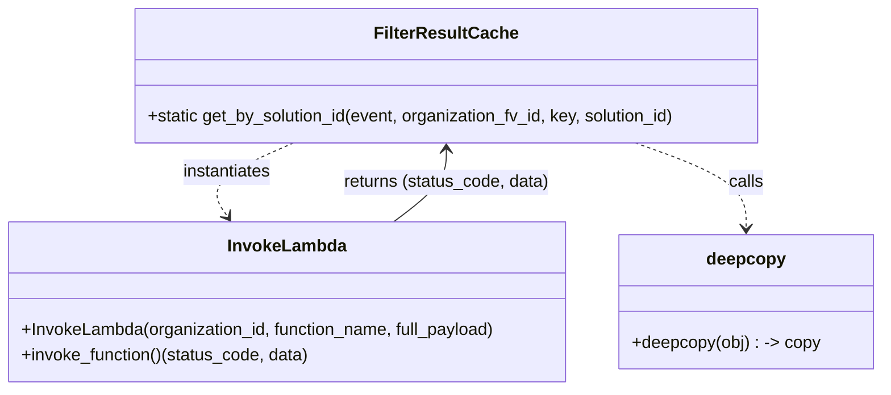

# Diagram: partview_core/partview_service/partview_service/utility/invoke/FilterResultCache.py

> Auto-generated by Obscura crawlers

## Mermaid

### SVG

<svg id="container" width="832.9375" xmlns="http://www.w3.org/2000/svg" class="classDiagram" height="366" viewBox="0 0 832.9375 366" role="graphics-document document" aria-roledescription="class"><g><defs><marker id="container_class-aggregationStart" class="marker aggregation class" refX="18" refY="7" markerWidth="190" markerHeight="240" orient="auto"><path d="M 18,7 L9,13 L1,7 L9,1 Z"></path></marker></defs><defs><marker id="container_class-aggregationEnd" class="marker aggregation class" refX="1" refY="7" markerWidth="20" markerHeight="28" orient="auto"><path d="M 18,7 L9,13 L1,7 L9,1 Z"></path></marker></defs><defs><marker id="container_class-extensionStart" class="marker extension class" refX="18" refY="7" markerWidth="190" markerHeight="240" orient="auto"><path d="M 1,7 L18,13 V 1 Z"></path></marker></defs><defs><marker id="container_class-extensionEnd" class="marker extension class" refX="1" refY="7" markerWidth="20" markerHeight="28" orient="auto"><path d="M 1,1 V 13 L18,7 Z"></path></marker></defs><defs><marker id="container_class-compositionStart" class="marker composition class" refX="18" refY="7" markerWidth="190" markerHeight="240" orient="auto"><path d="M 18,7 L9,13 L1,7 L9,1 Z"></path></marker></defs><defs><marker id="container_class-compositionEnd" class="marker composition class" refX="1" refY="7" markerWidth="20" markerHeight="28" orient="auto"><path d="M 18,7 L9,13 L1,7 L9,1 Z"></path></marker></defs><defs><marker id="container_class-dependencyStart" class="marker dependency class" refX="6" refY="7" markerWidth="190" markerHeight="240" orient="auto"><path d="M 5,7 L9,13 L1,7 L9,1 Z"></path></marker></defs><defs><marker id="container_class-dependencyEnd" class="marker dependency class" refX="13" refY="7" markerWidth="20" markerHeight="28" orient="auto"><path d="M 18,7 L9,13 L14,7 L9,1 Z"></path></marker></defs><defs><marker id="container_class-lollipopStart" class="marker lollipop class" refX="13" refY="7" markerWidth="190" markerHeight="240" orient="auto"><circle stroke="black" fill="transparent" cx="7" cy="7" r="6"></circle></marker></defs><defs><marker id="container_class-lollipopEnd" class="marker lollipop class" refX="1" refY="7" markerWidth="190" markerHeight="240" orient="auto"><circle stroke="black" fill="transparent" cx="7" cy="7" r="6"></circle></marker></defs><g class="root"><g class="clusters"></g><g class="edgePaths"><path d="M278.022,134L263.841,140.167C249.659,146.333,221.296,158.667,210.946,170.187C200.595,181.707,208.257,192.414,212.088,197.767L215.918,203.121" id="id_FilterResultCache_InvokeLambda_1" class="edge-thickness-normal edge-pattern-dashed relation" style=";;;" data-edge="true" data-et="edge" data-id="id_FilterResultCache_InvokeLambda_1" data-points="W3sieCI6Mjc4LjAyMjAzMTI1LCJ5IjoxMzR9LHsieCI6MTkyLjkzMzU5Mzc1LCJ5IjoxNzF9LHsieCI6MjE5LjQwOTkxMjEwOTM3NSwieSI6MjA4fV0=" marker-end="url(#container_class-dependencyEnd)"></path><path d="M601.598,134L619.09,140.167C636.581,146.333,671.564,158.667,689.055,172C706.547,185.333,706.547,199.667,706.547,206.833L706.547,214" id="id_FilterResultCache_deepcopy_2" class="edge-thickness-normal edge-pattern-dashed relation" style=";;;" data-edge="true" data-et="edge" data-id="id_FilterResultCache_deepcopy_2" data-points="W3sieCI6NjAxLjU5ODM5ODQzNzUsInkiOjEzNH0seyJ4Ijo3MDYuNTQ2ODc1LCJ5IjoxNzF9LHsieCI6NzA2LjU0Njg3NSwieSI6MjIwfV0=" marker-end="url(#container_class-dependencyEnd)"></path><path d="M373.407,208L381.656,201.833C389.905,195.667,406.404,183.333,414.653,172C422.902,160.667,422.902,150.333,422.902,145.167L422.902,140" id="id_InvokeLambda_FilterResultCache_3" class="edge-thickness-normal edge-pattern-solid relation" style=";;;" data-edge="true" data-et="edge" data-id="id_InvokeLambda_FilterResultCache_3" data-points="W3sieCI6MzczLjQwNjg0MjkxMjk0NjQ0LCJ5IjoyMDh9LHsieCI6NDIyLjkwMjM0Mzc1LCJ5IjoxNzF9LHsieCI6NDIyLjkwMjM0Mzc1LCJ5IjoxMzR9XQ==" marker-end="url(#container_class-dependencyEnd)"></path></g><g class="edgeLabels"><g class="edgeLabel" transform="translate(214.6162, 161.5715)"><g class="label" data-id="id_FilterResultCache_InvokeLambda_1" transform="translate(-42.9140625, -12)"><foreignObject width="85.828125" height="24">

instantiates

</foreignObject></g></g><g class="edgeLabel" transform="translate(706.546875, 171)"><g class="label" data-id="id_FilterResultCache_deepcopy_2" transform="translate(-16.4453125, -12)"><foreignObject width="32.890625" height="24">

calls

</foreignObject></g></g><g class="edgeLabel" transform="translate(422.90234375, 171)"><g class="label" data-id="id_InvokeLambda_FilterResultCache_3" transform="translate(-97.375, -12)"><foreignObject width="194.75" height="24">

returns (status_code, data)

</foreignObject></g></g></g><g class="nodes"><g class="node default" id="classId-FilterResultCache-0" transform="translate(422.90234375, 71)"><g class="basic label-container"><path d="M-296.35546875 -63 L296.35546875 -63 L296.35546875 63 L-296.35546875 63" stroke="none" stroke-width="0" fill="#ECECFF" style=""></path><path d="M-296.35546875 -63 C-170.96683440087438 -63, -45.57820005174875 -63, 296.35546875 -63 M-296.35546875 -63 C-147.7148865391921 -63, 0.9256956716158129 -63, 296.35546875 -63 M296.35546875 -63 C296.35546875 -18.834752906885008, 296.35546875 25.330494186229984, 296.35546875 63 M296.35546875 -63 C296.35546875 -25.233373696788753, 296.35546875 12.533252606422494, 296.35546875 63 M296.35546875 63 C169.11987818695073 63, 41.88428762390146 63, -296.35546875 63 M296.35546875 63 C79.8986039615337 63, -136.5582608269326 63, -296.35546875 63 M-296.35546875 63 C-296.35546875 14.149580603777657, -296.35546875 -34.700838792444685, -296.35546875 -63 M-296.35546875 63 C-296.35546875 37.58896690697133, -296.35546875 12.177933813942659, -296.35546875 -63" stroke="#9370DB" stroke-width="1.3" fill="none" stroke-dasharray="0 0" style=""></path></g><g class="annotation-group text" transform="translate(0, -39)"></g><g class="label-group text" transform="translate(-63.7734375, -39)"><g class="label" style="font-weight: bolder" transform="translate(0,-12)"><foreignObject width="127.546875" height="24">

FilterResultCache

</foreignObject></g></g><g class="members-group text" transform="translate(-284.35546875, 9)"></g><g class="methods-group text" transform="translate(-284.35546875, 39)"><g class="label" style="" transform="translate(0,-12)"><foreignObject width="504.9375" height="24">

+static get_by_solution_id(event, organization_fv_id, key, solution_id)

</foreignObject></g></g><g class="divider" style=""><path d="M-296.35546875 -15 C-150.9888225270692 -15, -5.6221763041384065 -15, 296.35546875 -15 M-296.35546875 -15 C-127.64749266269476 -15, 41.06048342461048 -15, 296.35546875 -15" stroke="#9370DB" stroke-width="1.3" fill="none" stroke-dasharray="0 0" style=""></path></g><g class="divider" style=""><path d="M-296.35546875 9 C-70.46501920921779 9, 155.42543033156443 9, 296.35546875 9 M-296.35546875 9 C-101.70137110210757 9, 92.95272654578486 9, 296.35546875 9" stroke="#9370DB" stroke-width="1.3" fill="none" stroke-dasharray="0 0" style=""></path></g></g><g class="node default" id="classId-InvokeLambda-1" transform="translate(273.078125, 283)"><g class="basic label-container"><path d="M-265.078125 -75 L265.078125 -75 L265.078125 75 L-265.078125 75" stroke="none" stroke-width="0" fill="#ECECFF" style=""></path><path d="M-265.078125 -75 C-90.91719299088311 -75, 83.24373901823378 -75, 265.078125 -75 M-265.078125 -75 C-139.609715757255 -75, -14.141306514510006 -75, 265.078125 -75 M265.078125 -75 C265.078125 -44.361396070680456, 265.078125 -13.722792141360912, 265.078125 75 M265.078125 -75 C265.078125 -33.14404485983879, 265.078125 8.711910280322414, 265.078125 75 M265.078125 75 C147.4860939084075 75, 29.894062816815023 75, -265.078125 75 M265.078125 75 C123.79345743122403 75, -17.491210137551946 75, -265.078125 75 M-265.078125 75 C-265.078125 31.355043067323244, -265.078125 -12.289913865353512, -265.078125 -75 M-265.078125 75 C-265.078125 15.221289254919078, -265.078125 -44.55742149016184, -265.078125 -75" stroke="#9370DB" stroke-width="1.3" fill="none" stroke-dasharray="0 0" style=""></path></g><g class="annotation-group text" transform="translate(0, -51)"></g><g class="label-group text" transform="translate(-53.484375, -51)"><g class="label" style="font-weight: bolder" transform="translate(0,-12)"><foreignObject width="106.96875" height="24">

InvokeLambda

</foreignObject></g></g><g class="members-group text" transform="translate(-253.078125, -3)"></g><g class="methods-group text" transform="translate(-253.078125, 27)"><g class="label" style="" transform="translate(0,-12)"><foreignObject width="452.671875" height="24">

+InvokeLambda(organization_id, function_name, full_payload)

</foreignObject></g><g class="label" style="" transform="translate(0,12)"><foreignObject width="272.40625" height="24">

+invoke_function()(status_code, data)

</foreignObject></g></g><g class="divider" style=""><path d="M-265.078125 -27 C-62.90886891007793 -27, 139.26038717984414 -27, 265.078125 -27 M-265.078125 -27 C-82.04057300434667 -27, 100.99697899130666 -27, 265.078125 -27" stroke="#9370DB" stroke-width="1.3" fill="none" stroke-dasharray="0 0" style=""></path></g><g class="divider" style=""><path d="M-265.078125 -3 C-153.2567673076502 -3, -41.43540961530036 -3, 265.078125 -3 M-265.078125 -3 C-155.87719353472318 -3, -46.67626206944638 -3, 265.078125 -3" stroke="#9370DB" stroke-width="1.3" fill="none" stroke-dasharray="0 0" style=""></path></g></g><g class="node default" id="classId-deepcopy-2" transform="translate(706.546875, 283)"><g class="basic label-container"><path d="M-118.390625 -63 L118.390625 -63 L118.390625 63 L-118.390625 63" stroke="none" stroke-width="0" fill="#ECECFF" style=""></path><path d="M-118.390625 -63 C-40.413889844016694 -63, 37.56284531196661 -63, 118.390625 -63 M-118.390625 -63 C-60.165729670162705 -63, -1.9408343403254094 -63, 118.390625 -63 M118.390625 -63 C118.390625 -37.176568356010925, 118.390625 -11.35313671202185, 118.390625 63 M118.390625 -63 C118.390625 -27.474135518627016, 118.390625 8.051728962745969, 118.390625 63 M118.390625 63 C57.98390748341579 63, -2.4228100331684175 63, -118.390625 63 M118.390625 63 C35.479763393353025 63, -47.43109821329395 63, -118.390625 63 M-118.390625 63 C-118.390625 36.85525157946199, -118.390625 10.710503158923977, -118.390625 -63 M-118.390625 63 C-118.390625 34.625820872387635, -118.390625 6.25164174477527, -118.390625 -63" stroke="#9370DB" stroke-width="1.3" fill="none" stroke-dasharray="0 0" style=""></path></g><g class="annotation-group text" transform="translate(0, -39)"></g><g class="label-group text" transform="translate(-35.609375, -39)"><g class="label" style="font-weight: bolder" transform="translate(0,-12)"><foreignObject width="71.21875" height="24">

deepcopy

</foreignObject></g></g><g class="members-group text" transform="translate(-106.390625, 9)"></g><g class="methods-group text" transform="translate(-106.390625, 39)"><g class="label" style="" transform="translate(0,-12)"><foreignObject width="177.171875" height="24">

+deepcopy(obj) : -&gt; copy

</foreignObject></g></g><g class="divider" style=""><path d="M-118.390625 -15 C-52.18612912309004 -15, 14.018366753819919 -15, 118.390625 -15 M-118.390625 -15 C-62.845602784758675 -15, -7.300580569517351 -15, 118.390625 -15" stroke="#9370DB" stroke-width="1.3" fill="none" stroke-dasharray="0 0" style=""></path></g><g class="divider" style=""><path d="M-118.390625 9 C-59.51893006137599 9, -0.6472351227519795 9, 118.390625 9 M-118.390625 9 C-26.732415108620117 9, 64.92579478275977 9, 118.390625 9" stroke="#9370DB" stroke-width="1.3" fill="none" stroke-dasharray="0 0" style=""></path></g></g></g></g></g></svg>
