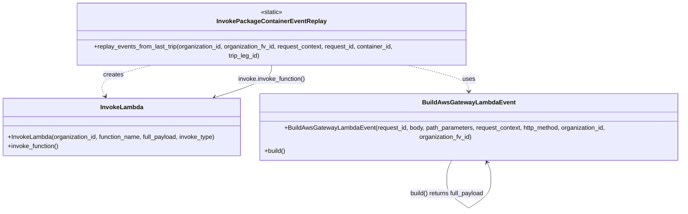

# Diagram: partview_core/partview_service/partview_service/utility/invoke/InvokePackageContainerEventReplay.py

> Auto-generated by Obscura crawlers

## Mermaid

### SVG

<svg id="container" width="1816.1875" xmlns="http://www.w3.org/2000/svg" class="classDiagram" height="514.25" viewBox="0 0 1816.1875 514.25" role="graphics-document document" aria-roledescription="class"><g><defs><marker id="container_class-aggregationStart" class="marker aggregation class" refX="18" refY="7" markerWidth="190" markerHeight="240" orient="auto"><path d="M 18,7 L9,13 L1,7 L9,1 Z"></path></marker></defs><defs><marker id="container_class-aggregationEnd" class="marker aggregation class" refX="1" refY="7" markerWidth="20" markerHeight="28" orient="auto"><path d="M 18,7 L9,13 L1,7 L9,1 Z"></path></marker></defs><defs><marker id="container_class-extensionStart" class="marker extension class" refX="18" refY="7" markerWidth="190" markerHeight="240" orient="auto"><path d="M 1,7 L18,13 V 1 Z"></path></marker></defs><defs><marker id="container_class-extensionEnd" class="marker extension class" refX="1" refY="7" markerWidth="20" markerHeight="28" orient="auto"><path d="M 1,1 V 13 L18,7 Z"></path></marker></defs><defs><marker id="container_class-compositionStart" class="marker composition class" refX="18" refY="7" markerWidth="190" markerHeight="240" orient="auto"><path d="M 18,7 L9,13 L1,7 L9,1 Z"></path></marker></defs><defs><marker id="container_class-compositionEnd" class="marker composition class" refX="1" refY="7" markerWidth="20" markerHeight="28" orient="auto"><path d="M 18,7 L9,13 L1,7 L9,1 Z"></path></marker></defs><defs><marker id="container_class-dependencyStart" class="marker dependency class" refX="6" refY="7" markerWidth="190" markerHeight="240" orient="auto"><path d="M 5,7 L9,13 L1,7 L9,1 Z"></path></marker></defs><defs><marker id="container_class-dependencyEnd" class="marker dependency class" refX="13" refY="7" markerWidth="20" markerHeight="28" orient="auto"><path d="M 18,7 L9,13 L14,7 L9,1 Z"></path></marker></defs><defs><marker id="container_class-lollipopStart" class="marker lollipop class" refX="13" refY="7" markerWidth="190" markerHeight="240" orient="auto"><circle stroke="black" fill="transparent" cx="7" cy="7" r="6"></circle></marker></defs><defs><marker id="container_class-lollipopEnd" class="marker lollipop class" refX="1" refY="7" markerWidth="190" markerHeight="240" orient="auto"><circle stroke="black" fill="transparent" cx="7" cy="7" r="6"></circle></marker></defs><g class="root"><g class="clusters"></g><g class="edgePaths"><path d="M1072.269,158L1101.189,164.167C1130.109,170.333,1187.949,182.667,1216.869,194C1245.789,205.333,1245.789,215.667,1245.789,220.833L1245.789,226" id="id_InvokePackageContainerEventReplay_BuildAwsGatewayLambdaEvent_1" class="edge-thickness-normal edge-pattern-dashed relation" style=";;;" data-edge="true" data-et="edge" data-id="id_InvokePackageContainerEventReplay_BuildAwsGatewayLambdaEvent_1" data-points="W3sieCI6MTA3Mi4yNjg5NzMyMTQyODU4LCJ5IjoxNTh9LHsieCI6MTI0NS43ODkwNjI1LCJ5IjoxOTV9LHsieCI6MTI0NS43ODkwNjI1LCJ5IjoyMzJ9XQ==" marker-end="url(#container_class-dependencyEnd)"></path><path d="M407.557,158L381.823,164.167C356.089,170.333,304.621,182.667,282.089,194.144C259.557,205.621,265.962,216.241,269.165,221.552L272.367,226.862" id="id_InvokePackageContainerEventReplay_InvokeLambda_2" class="edge-thickness-normal edge-pattern-dashed relation" style=";;;" data-edge="true" data-et="edge" data-id="id_InvokePackageContainerEventReplay_InvokeLambda_2" data-points="W3sieCI6NDA3LjU1Njg4NDc2NTYyNSwieSI6MTU4fSx7IngiOjI1My4xNTIzNDM3NSwieSI6MTk1fSx7IngiOjI3NS40NjU2NDU5MjYzMzkzLCJ5IjoyMzJ9XQ==" marker-end="url(#container_class-dependencyEnd)"></path><path d="M1200.977,382L1198.487,386.167C1195.997,390.333,1191.018,398.667,1188.529,407C1186.039,415.333,1186.039,423.667,1186.039,427.833L1186.039,432" id="BuildAwsGatewayLambdaEvent-cyclic-special-1" class="edge-thickness-normal edge-pattern-solid relation" style=";;;" data-edge="true" data-et="edge" data-id="BuildAwsGatewayLambdaEvent-cyclic-special-1" data-points="W3sieCI6MTIwMC45NzY1NjI1LCJ5IjozODJ9LHsieCI6MTE4Ni4wMzkwNjI1LCJ5Ijo0MDd9LHsieCI6MTE4Ni4wMzkwNjI1LCJ5Ijo0MzJ9XQ=="></path><path d="M1186.039,432.1L1186.039,438.267C1186.039,444.433,1186.039,456.767,1195.989,469.103C1205.939,481.44,1225.839,493.779,1235.789,499.949L1245.739,506.119" id="BuildAwsGatewayLambdaEvent-cyclic-special-mid" class="edge-thickness-normal edge-pattern-solid relation" style=";;;" data-edge="true" data-et="edge" data-id="BuildAwsGatewayLambdaEvent-cyclic-special-mid" data-points="W3sieCI6MTE4Ni4wMzkwNjI1LCJ5Ijo0MzIuMTAwMDAwMDAxNDkwMX0seyJ4IjoxMTg2LjAzOTA2MjUsInkiOjQ2OS4xMDAwMDAwMDE0OTAxfSx7IngiOjEyNDUuNzM5MDYyNDk5MjU1LCJ5Ijo1MDYuMTE4OTk1ODE3NjcyMTZ9XQ=="></path><path d="M1245.839,506.119L1255.789,499.949C1265.739,493.779,1285.639,481.44,1295.589,469.095C1305.539,456.75,1305.539,444.4,1305.539,434.05C1305.539,423.7,1305.539,415.35,1303.562,407.867C1301.586,400.384,1297.632,393.767,1295.656,390.459L1293.679,387.151" id="BuildAwsGatewayLambdaEvent-cyclic-special-2" class="edge-thickness-normal edge-pattern-solid relation" style=";;;" data-edge="true" data-et="edge" data-id="BuildAwsGatewayLambdaEvent-cyclic-special-2" data-points="W3sieCI6MTI0NS44MzkwNjI1MDA3NDUsInkiOjUwNi4xMTg5OTU4MTc2NzIxNn0seyJ4IjoxMzA1LjUzOTA2MjUsInkiOjQ2OS4xMDAwMDAwMDE0OTAxfSx7IngiOjEzMDUuNTM5MDYyNSwieSI6NDMyLjA1MDAwMDAwMDc0NTA2fSx7IngiOjEzMDUuNTM5MDYyNSwieSI6NDA3fSx7IngiOjEyOTAuNjAxNTYyNSwieSI6MzgyfV0=" marker-end="url(#container_class-dependencyEnd)"></path><path d="M720.539,158L720.539,164.167C720.539,170.333,720.539,182.667,699.487,194.73C678.435,206.794,636.33,218.588,615.278,224.485L594.225,230.382" id="id_InvokePackageContainerEventReplay_InvokeLambda_4" class="edge-thickness-normal edge-pattern-solid relation" style=";;;" data-edge="true" data-et="edge" data-id="id_InvokePackageContainerEventReplay_InvokeLambda_4" data-points="W3sieCI6NzIwLjUzOTA2MjUsInkiOjE1OH0seyJ4Ijo3MjAuNTM5MDYyNSwieSI6MTk1fSx7IngiOjU4OC40NDc4MjM2NjA3MTQyLCJ5IjoyMzJ9XQ==" marker-end="url(#container_class-dependencyEnd)"></path></g><g class="edgeLabels"><g class="edgeLabel" transform="translate(1245.7890625, 195)"><g class="label" data-id="id_InvokePackageContainerEventReplay_BuildAwsGatewayLambdaEvent_1" transform="translate(-16.4921875, -12)"><foreignObject width="32.984375" height="24">

uses

</foreignObject></g></g><g class="edgeLabel" transform="translate(309.34567, 181.53438)"><g class="label" data-id="id_InvokePackageContainerEventReplay_InvokeLambda_2" transform="translate(-26.171875, -12)"><foreignObject width="52.34375" height="24">

creates

</foreignObject></g></g><g class="edgeLabel"><g class="label" data-id="BuildAwsGatewayLambdaEvent-cyclic-special-1" transform="translate(0, 0)"><foreignObject width="0" height="0">

</foreignObject></g></g><g class="edgeLabel" transform="translate(1186.0390625, 469.1000000014901)"><g class="label" data-id="BuildAwsGatewayLambdaEvent-cyclic-special-mid" transform="translate(-99.5, -12)"><foreignObject width="199" height="24">

build() returns full_payload

</foreignObject></g></g><g class="edgeLabel"><g class="label" data-id="BuildAwsGatewayLambdaEvent-cyclic-special-2" transform="translate(0, 0)"><foreignObject width="0" height="0">

</foreignObject></g></g><g class="edgeLabel" transform="translate(720.5390625, 195)"><g class="label" data-id="id_InvokePackageContainerEventReplay_InvokeLambda_4" transform="translate(-88.9140625, -12)"><foreignObject width="177.828125" height="24">

invoke.invoke_function()

</foreignObject></g></g></g><g class="nodes"><g class="node default" id="classId-InvokePackageContainerEventReplay-0" transform="translate(720.5390625, 83)"><g class="basic label-container"><path d="M-518.609375 -75 L518.609375 -75 L518.609375 75 L-518.609375 75" stroke="none" stroke-width="0" fill="#ECECFF" style=""></path><path d="M-518.609375 -75 C-254.6114672132274 -75, 9.386440573545201 -75, 518.609375 -75 M-518.609375 -75 C-180.5883229676062 -75, 157.43272906478762 -75, 518.609375 -75 M518.609375 -75 C518.609375 -38.22765163191193, 518.609375 -1.4553032638238648, 518.609375 75 M518.609375 -75 C518.609375 -43.00538573256226, 518.609375 -11.010771465124527, 518.609375 75 M518.609375 75 C196.55990386064036 75, -125.48956727871928 75, -518.609375 75 M518.609375 75 C212.41646366634586 75, -93.77644766730828 75, -518.609375 75 M-518.609375 75 C-518.609375 18.152195890086766, -518.609375 -38.69560821982647, -518.609375 -75 M-518.609375 75 C-518.609375 38.56678294276727, -518.609375 2.133565885534537, -518.609375 -75" stroke="#9370DB" stroke-width="1.3" fill="none" stroke-dasharray="0 0" style=""></path></g><g class="annotation-group text" transform="translate(-29.0234375, -51)"><g class="label" style="" transform="translate(0,-12)"><foreignObject width="58.046875" height="24">

«static»

</foreignObject></g></g><g class="label-group text" transform="translate(-134.765625, -27)"><g class="label" style="font-weight: bolder" transform="translate(0,-12)"><foreignObject width="269.53125" height="24">

InvokePackageContainerEventReplay

</foreignObject></g></g><g class="members-group text" transform="translate(-506.609375, 21)"></g><g class="methods-group text" transform="translate(-506.609375, 51)"><g class="label" style="" transform="translate(0,-12)"><foreignObject width="878.453125" height="24">

+replay_events_from_last_trip(organization_id, organization_fv_id, request_context, request_id, container_id, trip_leg_id)

</foreignObject></g></g><g class="divider" style=""><path d="M-518.609375 -3 C-211.8230266117771 -3, 94.96332177644581 -3, 518.609375 -3 M-518.609375 -3 C-237.20816510609677 -3, 44.19304478780646 -3, 518.609375 -3" stroke="#9370DB" stroke-width="1.3" fill="none" stroke-dasharray="0 0" style=""></path></g><g class="divider" style=""><path d="M-518.609375 21 C-291.382135208458 21, -64.15489541691602 21, 518.609375 21 M-518.609375 21 C-267.1195658475625 21, -15.629756695125025 21, 518.609375 21" stroke="#9370DB" stroke-width="1.3" fill="none" stroke-dasharray="0 0" style=""></path></g></g><g class="node default" id="classId-InvokeLambda-1" transform="translate(320.6953125, 307)"><g class="basic label-container"><path d="M-312.6953125 -75 L312.6953125 -75 L312.6953125 75 L-312.6953125 75" stroke="none" stroke-width="0" fill="#ECECFF" style=""></path><path d="M-312.6953125 -75 C-151.34540332327995 -75, 10.004505853440094 -75, 312.6953125 -75 M-312.6953125 -75 C-134.91982692631004 -75, 42.855658647379926 -75, 312.6953125 -75 M312.6953125 -75 C312.6953125 -24.7550858204117, 312.6953125 25.4898283591766, 312.6953125 75 M312.6953125 -75 C312.6953125 -20.99280783696836, 312.6953125 33.01438432606328, 312.6953125 75 M312.6953125 75 C129.8567112943188 75, -52.98188991136237 75, -312.6953125 75 M312.6953125 75 C92.3652758897106 75, -127.9647607205788 75, -312.6953125 75 M-312.6953125 75 C-312.6953125 27.23068632160144, -312.6953125 -20.53862735679712, -312.6953125 -75 M-312.6953125 75 C-312.6953125 37.77912331250304, -312.6953125 0.5582466250060776, -312.6953125 -75" stroke="#9370DB" stroke-width="1.3" fill="none" stroke-dasharray="0 0" style=""></path></g><g class="annotation-group text" transform="translate(0, -51)"></g><g class="label-group text" transform="translate(-53.484375, -51)"><g class="label" style="font-weight: bolder" transform="translate(0,-12)"><foreignObject width="106.96875" height="24">

InvokeLambda

</foreignObject></g></g><g class="members-group text" transform="translate(-300.6953125, -3)"></g><g class="methods-group text" transform="translate(-300.6953125, 27)"><g class="label" style="" transform="translate(0,-12)"><foreignObject width="547.90625" height="24">

+InvokeLambda(organization_id, function_name, full_payload, invoke_type)

</foreignObject></g><g class="label" style="" transform="translate(0,12)"><foreignObject width="134.4375" height="24">

+invoke_function()

</foreignObject></g></g><g class="divider" style=""><path d="M-312.6953125 -27 C-172.53650961808765 -27, -32.3777067361753 -27, 312.6953125 -27 M-312.6953125 -27 C-99.63920250023261 -27, 113.41690749953477 -27, 312.6953125 -27" stroke="#9370DB" stroke-width="1.3" fill="none" stroke-dasharray="0 0" style=""></path></g><g class="divider" style=""><path d="M-312.6953125 -3 C-167.43010095760516 -3, -22.164889415210325 -3, 312.6953125 -3 M-312.6953125 -3 C-96.0708013220173 -3, 120.5537098559654 -3, 312.6953125 -3" stroke="#9370DB" stroke-width="1.3" fill="none" stroke-dasharray="0 0" style=""></path></g></g><g class="node default" id="classId-BuildAwsGatewayLambdaEvent-2" transform="translate(1245.7890625, 307)"><g class="basic label-container"><path d="M-562.3984375 -75 L562.3984375 -75 L562.3984375 75 L-562.3984375 75" stroke="none" stroke-width="0" fill="#ECECFF" style=""></path><path d="M-562.3984375 -75 C-126.486683881727 -75, 309.425069736546 -75, 562.3984375 -75 M-562.3984375 -75 C-116.51582438207191 -75, 329.3667887358562 -75, 562.3984375 -75 M562.3984375 -75 C562.3984375 -19.02809309162737, 562.3984375 36.94381381674526, 562.3984375 75 M562.3984375 -75 C562.3984375 -36.68723268096033, 562.3984375 1.625534638079344, 562.3984375 75 M562.3984375 75 C234.9557049381205 75, -92.48702762375899 75, -562.3984375 75 M562.3984375 75 C279.1656223081371 75, -4.067192883725852 75, -562.3984375 75 M-562.3984375 75 C-562.3984375 28.825301266601628, -562.3984375 -17.349397466796745, -562.3984375 -75 M-562.3984375 75 C-562.3984375 33.56732541187869, -562.3984375 -7.865349176242617, -562.3984375 -75" stroke="#9370DB" stroke-width="1.3" fill="none" stroke-dasharray="0 0" style=""></path></g><g class="annotation-group text" transform="translate(0, -51)"></g><g class="label-group text" transform="translate(-114.015625, -51)"><g class="label" style="font-weight: bolder" transform="translate(0,-12)"><foreignObject width="228.03125" height="24">

BuildAwsGatewayLambdaEvent

</foreignObject></g></g><g class="members-group text" transform="translate(-550.3984375, -3)"></g><g class="methods-group text" transform="translate(-550.3984375, 27)"><g class="label" style="" transform="translate(0,-12)"><foreignObject width="986.78125" height="24">

+BuildAwsGatewayLambdaEvent(request_id, body, path_parameters, request_context, http_method, organization_id, organization_fv_id)

</foreignObject></g><g class="label" style="" transform="translate(0,12)"><foreignObject width="55.859375" height="24">

+build()

</foreignObject></g></g><g class="divider" style=""><path d="M-562.3984375 -27 C-158.53893911240652 -27, 245.32055927518695 -27, 562.3984375 -27 M-562.3984375 -27 C-220.37031873649204 -27, 121.65780002701592 -27, 562.3984375 -27" stroke="#9370DB" stroke-width="1.3" fill="none" stroke-dasharray="0 0" style=""></path></g><g class="divider" style=""><path d="M-562.3984375 -3 C-162.92574089855708 -3, 236.54695570288584 -3, 562.3984375 -3 M-562.3984375 -3 C-319.6581643382734 -3, -76.91789117654685 -3, 562.3984375 -3" stroke="#9370DB" stroke-width="1.3" fill="none" stroke-dasharray="0 0" style=""></path></g></g><g class="label edgeLabel" id="BuildAwsGatewayLambdaEvent---BuildAwsGatewayLambdaEvent---1" transform="translate(1186.0390625, 432.05000000074506)"><rect width="0.1" height="0.1"></rect><g class="label" style="" transform="translate(0, 0)"><rect></rect><foreignObject width="0" height="0">

</foreignObject></g></g><g class="label edgeLabel" id="BuildAwsGatewayLambdaEvent---BuildAwsGatewayLambdaEvent---2" transform="translate(1245.7890625, 506.1500000022352)"><rect width="0.1" height="0.1"></rect><g class="label" style="" transform="translate(0, 0)"><rect></rect><foreignObject width="0" height="0">

</foreignObject></g></g></g></g></g></svg>
