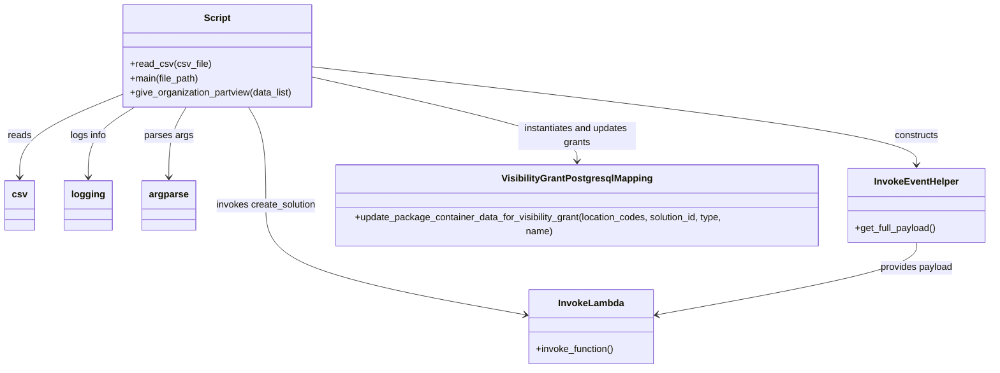

# Diagram: partview_core/partview_service/scripts/AddDealerSolutionAndBackfillVisibility.py

> Auto-generated by Obscura crawlers

## Mermaid

### SVG

<svg id="container" width="1684.2109375" xmlns="http://www.w3.org/2000/svg" class="classDiagram" height="614" viewBox="0 0 1684.2109375 614" role="graphics-document document" aria-roledescription="class"><g><defs><marker id="container_class-aggregationStart" class="marker aggregation class" refX="18" refY="7" markerWidth="190" markerHeight="240" orient="auto"><path d="M 18,7 L9,13 L1,7 L9,1 Z"></path></marker></defs><defs><marker id="container_class-aggregationEnd" class="marker aggregation class" refX="1" refY="7" markerWidth="20" markerHeight="28" orient="auto"><path d="M 18,7 L9,13 L1,7 L9,1 Z"></path></marker></defs><defs><marker id="container_class-extensionStart" class="marker extension class" refX="18" refY="7" markerWidth="190" markerHeight="240" orient="auto"><path d="M 1,7 L18,13 V 1 Z"></path></marker></defs><defs><marker id="container_class-extensionEnd" class="marker extension class" refX="1" refY="7" markerWidth="20" markerHeight="28" orient="auto"><path d="M 1,1 V 13 L18,7 Z"></path></marker></defs><defs><marker id="container_class-compositionStart" class="marker composition class" refX="18" refY="7" markerWidth="190" markerHeight="240" orient="auto"><path d="M 18,7 L9,13 L1,7 L9,1 Z"></path></marker></defs><defs><marker id="container_class-compositionEnd" class="marker composition class" refX="1" refY="7" markerWidth="20" markerHeight="28" orient="auto"><path d="M 18,7 L9,13 L1,7 L9,1 Z"></path></marker></defs><defs><marker id="container_class-dependencyStart" class="marker dependency class" refX="6" refY="7" markerWidth="190" markerHeight="240" orient="auto"><path d="M 5,7 L9,13 L1,7 L9,1 Z"></path></marker></defs><defs><marker id="container_class-dependencyEnd" class="marker dependency class" refX="13" refY="7" markerWidth="20" markerHeight="28" orient="auto"><path d="M 18,7 L9,13 L14,7 L9,1 Z"></path></marker></defs><defs><marker id="container_class-lollipopStart" class="marker lollipop class" refX="13" refY="7" markerWidth="190" markerHeight="240" orient="auto"><circle stroke="black" fill="transparent" cx="7" cy="7" r="6"></circle></marker></defs><defs><marker id="container_class-lollipopEnd" class="marker lollipop class" refX="1" refY="7" markerWidth="190" markerHeight="240" orient="auto"><circle stroke="black" fill="transparent" cx="7" cy="7" r="6"></circle></marker></defs><g class="root"><g class="clusters"></g><g class="edgePaths"><path d="M197.84,162.294L170.141,173.745C142.443,185.196,87.046,208.098,59.347,230.216C31.648,252.333,31.648,273.667,31.648,284.333L31.648,295" id="id_Script_csv_1" class="edge-thickness-normal edge-pattern-solid relation" style=";;;" data-edge="true" data-et="edge" data-id="id_Script_csv_1" data-points="W3sieCI6MTk3LjgzOTg0Mzc1LCJ5IjoxNjIuMjk0MjkwODcxMDkzMzh9LHsieCI6MzEuNjQ4NDM3NSwieSI6MjMxfSx7IngiOjMxLjY0ODQzNzUsInkiOjMwMX1d" marker-end="url(#container_class-dependencyEnd)"></path><path d="M307.702,182L302.734,190.167C297.767,198.333,287.833,214.667,282.866,233.5C277.898,252.333,277.898,273.667,277.898,284.333L277.898,295" id="id_Script_argparse_2" class="edge-thickness-normal edge-pattern-solid relation" style=";;;" data-edge="true" data-et="edge" data-id="id_Script_argparse_2" data-points="W3sieCI6MzA3LjcwMTUxNjU0NDExNzYsInkiOjE4Mn0seyJ4IjoyNzcuODk4NDM3NSwieSI6MjMxfSx7IngiOjI3Ny44OTg0Mzc1LCJ5IjozMDF9XQ==" marker-end="url(#container_class-dependencyEnd)"></path><path d="M222.306,182L209.323,190.167C196.339,198.333,170.373,214.667,157.39,233.5C144.406,252.333,144.406,273.667,144.406,284.333L144.406,295" id="id_Script_logging_3" class="edge-thickness-normal edge-pattern-solid relation" style=";;;" data-edge="true" data-et="edge" data-id="id_Script_logging_3" data-points="W3sieCI6MjIyLjMwNTc3ODk1MjIwNTg4LCJ5IjoxODJ9LHsieCI6MTQ0LjQwNjI1LCJ5IjoyMzF9LHsieCI6MTQ0LjQwNjI1LCJ5IjozMDF9XQ==" marker-end="url(#container_class-dependencyEnd)"></path><path d="M523.395,113.455L696.188,133.046C868.98,152.637,1214.566,191.818,1387.359,218.576C1560.152,245.333,1560.152,259.667,1560.152,266.833L1560.152,274" id="id_Script_InvokeEventHelper_4" class="edge-thickness-normal edge-pattern-solid relation" style=";;;" data-edge="true" data-et="edge" data-id="id_Script_InvokeEventHelper_4" data-points="W3sieCI6NTIzLjM5NDUzMTI1LCJ5IjoxMTMuNDU1MjQ3OTYzODkyMjZ9LHsieCI6MTU2MC4xNTIzNDM3NSwieSI6MjMxfSx7IngiOjE1NjAuMTUyMzQzNzUsInkiOjI4MH1d" marker-end="url(#container_class-dependencyEnd)"></path><path d="M413.533,182L418.5,190.167C423.467,198.333,433.402,214.667,438.369,241.5C443.336,268.333,443.336,305.667,443.336,341C443.336,376.333,443.336,409.667,517.759,439.661C592.183,469.656,741.03,496.311,815.454,509.639L889.877,522.967" id="id_Script_InvokeLambda_5" class="edge-thickness-normal edge-pattern-solid relation" style=";;;" data-edge="true" data-et="edge" data-id="id_Script_InvokeLambda_5" data-points="W3sieCI6NDEzLjUzMjg1ODQ1NTg4MjQsInkiOjE4Mn0seyJ4Ijo0NDMuMzM1OTM3NSwieSI6MjMxfSx7IngiOjQ0My4zMzU5Mzc1LCJ5IjozNDN9LHsieCI6NDQzLjMzNTkzNzUsInkiOjQ0M30seyJ4Ijo4OTUuNzgzMjAzMTI1LCJ5Ijo1MjQuMDI0NDY2MTY4ODMyM31d" marker-end="url(#container_class-dependencyEnd)"></path><path d="M523.395,130.785L599.369,147.488C675.344,164.19,827.293,197.595,903.268,221.464C979.242,245.333,979.242,259.667,979.242,266.833L979.242,274" id="id_Script_VisibilityGrantPostgresqlMapping_6" class="edge-thickness-normal edge-pattern-solid relation" style=";;;" data-edge="true" data-et="edge" data-id="id_Script_VisibilityGrantPostgresqlMapping_6" data-points="W3sieCI6NTIzLjM5NDUzMTI1LCJ5IjoxMzAuNzg1MzYwNjc4OTI1MDN9LHsieCI6OTc5LjI0MjE4NzUsInkiOjIzMX0seyJ4Ijo5NzkuMjQyMTg3NSwieSI6MjgwfV0=" marker-end="url(#container_class-dependencyEnd)"></path><path d="M1560.152,406L1560.152,412.167C1560.152,418.333,1560.152,430.667,1485.729,450.161C1411.305,469.656,1262.458,496.311,1188.035,509.639L1113.611,522.967" id="id_InvokeEventHelper_InvokeLambda_7" class="edge-thickness-normal edge-pattern-solid relation" style=";;;" data-edge="true" data-et="edge" data-id="id_InvokeEventHelper_InvokeLambda_7" data-points="W3sieCI6MTU2MC4xNTIzNDM3NSwieSI6NDA2fSx7IngiOjE1NjAuMTUyMzQzNzUsInkiOjQ0M30seyJ4IjoxMTA3LjcwNTA3ODEyNSwieSI6NTI0LjAyNDQ2NjE2ODgzMjN9XQ==" marker-end="url(#container_class-dependencyEnd)"></path></g><g class="edgeLabels"><g class="edgeLabel" transform="translate(31.6484375, 231)"><g class="label" data-id="id_Script_csv_1" transform="translate(-20.0078125, -12)"><foreignObject width="40.015625" height="24">

reads

</foreignObject></g></g><g class="edgeLabel" transform="translate(277.8984375, 231)"><g class="label" data-id="id_Script_argparse_2" transform="translate(-41.109375, -12)"><foreignObject width="82.21875" height="24">

parses args

</foreignObject></g></g><g class="edgeLabel" transform="translate(144.40625, 231)"><g class="label" data-id="id_Script_logging_3" transform="translate(-31.15625, -12)"><foreignObject width="62.3125" height="24">

logs info

</foreignObject></g></g><g class="edgeLabel" transform="translate(1560.15234375, 231)"><g class="label" data-id="id_Script_InvokeEventHelper_4" transform="translate(-37.84375, -12)"><foreignObject width="75.6875" height="24">

constructs

</foreignObject></g></g><g class="edgeLabel" transform="translate(443.3359375, 343)"><g class="label" data-id="id_Script_InvokeLambda_5" transform="translate(-86.0546875, -12)"><foreignObject width="172.109375" height="24">

invokes create_solution

</foreignObject></g></g><g class="edgeLabel" transform="translate(979.2421875, 231)"><g class="label" data-id="id_Script_VisibilityGrantPostgresqlMapping_6" transform="translate(-100, -24)"><foreignObject width="200" height="48">

instantiates and updates grants

</foreignObject></g></g><g class="edgeLabel" transform="translate(1560.15234375, 443)"><g class="label" data-id="id_InvokeEventHelper_InvokeLambda_7" transform="translate(-62.3046875, -12)"><foreignObject width="124.609375" height="24">

provides payload

</foreignObject></g></g></g><g class="nodes"><g class="node default" id="classId-Script-0" transform="translate(360.6171875, 95)"><g class="basic label-container"><path d="M-162.77734375 -87 L162.77734375 -87 L162.77734375 87 L-162.77734375 87" stroke="none" stroke-width="0" fill="#ECECFF" style=""></path><path d="M-162.77734375 -87 C-45.21898928035172 -87, 72.33936518929656 -87, 162.77734375 -87 M-162.77734375 -87 C-50.318510447067624 -87, 62.14032285586475 -87, 162.77734375 -87 M162.77734375 -87 C162.77734375 -47.8717560299442, 162.77734375 -8.743512059888403, 162.77734375 87 M162.77734375 -87 C162.77734375 -39.458338172373324, 162.77734375 8.083323655253352, 162.77734375 87 M162.77734375 87 C93.92650234610333 87, 25.075660942206667 87, -162.77734375 87 M162.77734375 87 C42.6184214386456 87, -77.5405008727088 87, -162.77734375 87 M-162.77734375 87 C-162.77734375 34.122521036160556, -162.77734375 -18.754957927678888, -162.77734375 -87 M-162.77734375 87 C-162.77734375 27.898048097739434, -162.77734375 -31.203903804521133, -162.77734375 -87" stroke="#9370DB" stroke-width="1.3" fill="none" stroke-dasharray="0 0" style=""></path></g><g class="annotation-group text" transform="translate(0, -63)"></g><g class="label-group text" transform="translate(-21.7421875, -63)"><g class="label" style="font-weight: bolder" transform="translate(0,-12)"><foreignObject width="43.484375" height="24">

Script

</foreignObject></g></g><g class="members-group text" transform="translate(-150.77734375, -15)"></g><g class="methods-group text" transform="translate(-150.77734375, 15)"><g class="label" style="" transform="translate(0,-12)"><foreignObject width="134.375" height="24">

+read_csv(csv_file)

</foreignObject></g><g class="label" style="" transform="translate(0,12)"><foreignObject width="118.390625" height="24">

+main(file_path)

</foreignObject></g><g class="label" style="" transform="translate(0,36)"><foreignObject width="279.8125" height="24">

+give_organization_partview(data_list)

</foreignObject></g></g><g class="divider" style=""><path d="M-162.77734375 -39 C-94.52386530786463 -39, -26.27038686572925 -39, 162.77734375 -39 M-162.77734375 -39 C-87.54751750237851 -39, -12.317691254757023 -39, 162.77734375 -39" stroke="#9370DB" stroke-width="1.3" fill="none" stroke-dasharray="0 0" style=""></path></g><g class="divider" style=""><path d="M-162.77734375 -15 C-56.265023356809905 -15, 50.24729703638019 -15, 162.77734375 -15 M-162.77734375 -15 C-45.30009551258753 -15, 72.17715272482494 -15, 162.77734375 -15" stroke="#9370DB" stroke-width="1.3" fill="none" stroke-dasharray="0 0" style=""></path></g></g><g class="node default" id="classId-csv-1" transform="translate(31.6484375, 343)"><g class="basic label-container"><path d="M-23.6484375 -42 L23.6484375 -42 L23.6484375 42 L-23.6484375 42" stroke="none" stroke-width="0" fill="#ECECFF" style=""></path><path d="M-23.6484375 -42 C-8.430696679084837 -42, 6.787044141830325 -42, 23.6484375 -42 M-23.6484375 -42 C-8.36480786729331 -42, 6.91882176541338 -42, 23.6484375 -42 M23.6484375 -42 C23.6484375 -20.912882970199377, 23.6484375 0.17423405960124683, 23.6484375 42 M23.6484375 -42 C23.6484375 -20.474733301075048, 23.6484375 1.0505333978499038, 23.6484375 42 M23.6484375 42 C13.472158057923115 42, 3.295878615846231 42, -23.6484375 42 M23.6484375 42 C4.855947243791608 42, -13.936543012416784 42, -23.6484375 42 M-23.6484375 42 C-23.6484375 9.73992281501252, -23.6484375 -22.52015436997496, -23.6484375 -42 M-23.6484375 42 C-23.6484375 20.85895926978455, -23.6484375 -0.2820814604309021, -23.6484375 -42" stroke="#9370DB" stroke-width="1.3" fill="none" stroke-dasharray="0 0" style=""></path></g><g class="annotation-group text" transform="translate(0, -18)"></g><g class="label-group text" transform="translate(-11.6484375, -18)"><g class="label" style="font-weight: bolder" transform="translate(0,-12)"><foreignObject width="23.296875" height="24">

csv

</foreignObject></g></g><g class="members-group text" transform="translate(-11.6484375, 30)"></g><g class="methods-group text" transform="translate(-11.6484375, 60)"></g><g class="divider" style=""><path d="M-23.6484375 6 C-5.346227939529982 6, 12.955981620940037 6, 23.6484375 6 M-23.6484375 6 C-9.594997634776332 6, 4.458442230447336 6, 23.6484375 6" stroke="#9370DB" stroke-width="1.3" fill="none" stroke-dasharray="0 0" style=""></path></g><g class="divider" style=""><path d="M-23.6484375 24 C-8.609984389294185 24, 6.42846872141163 24, 23.6484375 24 M-23.6484375 24 C-10.942602604027176 24, 1.7632322919456485 24, 23.6484375 24" stroke="#9370DB" stroke-width="1.3" fill="none" stroke-dasharray="0 0" style=""></path></g></g><g class="node default" id="classId-logging-2" transform="translate(144.40625, 343)"><g class="basic label-container"><path d="M-39.109375 -42 L39.109375 -42 L39.109375 42 L-39.109375 42" stroke="none" stroke-width="0" fill="#ECECFF" style=""></path><path d="M-39.109375 -42 C-15.962709421767045 -42, 7.183956156465911 -42, 39.109375 -42 M-39.109375 -42 C-11.369273251836468 -42, 16.370828496327064 -42, 39.109375 -42 M39.109375 -42 C39.109375 -16.813417073683706, 39.109375 8.373165852632589, 39.109375 42 M39.109375 -42 C39.109375 -12.214016493548861, 39.109375 17.571967012902277, 39.109375 42 M39.109375 42 C12.195775103975247 42, -14.717824792049505 42, -39.109375 42 M39.109375 42 C9.049822265517104 42, -21.00973046896579 42, -39.109375 42 M-39.109375 42 C-39.109375 19.55276752071709, -39.109375 -2.8944649585658198, -39.109375 -42 M-39.109375 42 C-39.109375 17.47955735186948, -39.109375 -7.040885296261038, -39.109375 -42" stroke="#9370DB" stroke-width="1.3" fill="none" stroke-dasharray="0 0" style=""></path></g><g class="annotation-group text" transform="translate(0, -18)"></g><g class="label-group text" transform="translate(-27.109375, -18)"><g class="label" style="font-weight: bolder" transform="translate(0,-12)"><foreignObject width="54.21875" height="24">

logging

</foreignObject></g></g><g class="members-group text" transform="translate(-27.109375, 30)"></g><g class="methods-group text" transform="translate(-27.109375, 60)"></g><g class="divider" style=""><path d="M-39.109375 6 C-19.513440689001843 6, 0.0824936219963135 6, 39.109375 6 M-39.109375 6 C-9.585205015211354 6, 19.93896496957729 6, 39.109375 6" stroke="#9370DB" stroke-width="1.3" fill="none" stroke-dasharray="0 0" style=""></path></g><g class="divider" style=""><path d="M-39.109375 24 C-16.31065336630007 24, 6.488068267399861 24, 39.109375 24 M-39.109375 24 C-20.361723943149286 24, -1.6140728862985725 24, 39.109375 24" stroke="#9370DB" stroke-width="1.3" fill="none" stroke-dasharray="0 0" style=""></path></g></g><g class="node default" id="classId-argparse-3" transform="translate(277.8984375, 343)"><g class="basic label-container"><path d="M-44.3828125 -42 L44.3828125 -42 L44.3828125 42 L-44.3828125 42" stroke="none" stroke-width="0" fill="#ECECFF" style=""></path><path d="M-44.3828125 -42 C-13.997627501814886 -42, 16.387557496370228 -42, 44.3828125 -42 M-44.3828125 -42 C-11.629245216554594 -42, 21.124322066890812 -42, 44.3828125 -42 M44.3828125 -42 C44.3828125 -19.51550411249958, 44.3828125 2.9689917750008377, 44.3828125 42 M44.3828125 -42 C44.3828125 -9.200943890001561, 44.3828125 23.598112219996878, 44.3828125 42 M44.3828125 42 C13.619720171039113 42, -17.143372157921775 42, -44.3828125 42 M44.3828125 42 C21.37296671255589 42, -1.6368790748882205 42, -44.3828125 42 M-44.3828125 42 C-44.3828125 20.32785753735682, -44.3828125 -1.3442849252863596, -44.3828125 -42 M-44.3828125 42 C-44.3828125 16.68015880673009, -44.3828125 -8.639682386539818, -44.3828125 -42" stroke="#9370DB" stroke-width="1.3" fill="none" stroke-dasharray="0 0" style=""></path></g><g class="annotation-group text" transform="translate(0, -18)"></g><g class="label-group text" transform="translate(-32.3828125, -18)"><g class="label" style="font-weight: bolder" transform="translate(0,-12)"><foreignObject width="64.765625" height="24">

argparse

</foreignObject></g></g><g class="members-group text" transform="translate(-32.3828125, 30)"></g><g class="methods-group text" transform="translate(-32.3828125, 60)"></g><g class="divider" style=""><path d="M-44.3828125 6 C-14.562063735811101 6, 15.258685028377798 6, 44.3828125 6 M-44.3828125 6 C-10.667600170398181 6, 23.047612159203638 6, 44.3828125 6" stroke="#9370DB" stroke-width="1.3" fill="none" stroke-dasharray="0 0" style=""></path></g><g class="divider" style=""><path d="M-44.3828125 24 C-20.854144915950275 24, 2.674522668099449 24, 44.3828125 24 M-44.3828125 24 C-22.58206397954078 24, -0.7813154590815614 24, 44.3828125 24" stroke="#9370DB" stroke-width="1.3" fill="none" stroke-dasharray="0 0" style=""></path></g></g><g class="node default" id="classId-InvokeLambda-4" transform="translate(1001.744140625, 543)"><g class="basic label-container"><path d="M-105.9609375 -63 L105.9609375 -63 L105.9609375 63 L-105.9609375 63" stroke="none" stroke-width="0" fill="#ECECFF" style=""></path><path d="M-105.9609375 -63 C-36.6337559427286 -63, 32.693425614542804 -63, 105.9609375 -63 M-105.9609375 -63 C-23.7548210751647 -63, 58.4512953496706 -63, 105.9609375 -63 M105.9609375 -63 C105.9609375 -30.082801107698053, 105.9609375 2.834397784603894, 105.9609375 63 M105.9609375 -63 C105.9609375 -21.3877015332507, 105.9609375 20.224596933498603, 105.9609375 63 M105.9609375 63 C36.3082534114655 63, -33.344430677069 63, -105.9609375 63 M105.9609375 63 C63.371868639164646 63, 20.78279977832929 63, -105.9609375 63 M-105.9609375 63 C-105.9609375 33.58311037503181, -105.9609375 4.166220750063616, -105.9609375 -63 M-105.9609375 63 C-105.9609375 33.058130006331965, -105.9609375 3.116260012663929, -105.9609375 -63" stroke="#9370DB" stroke-width="1.3" fill="none" stroke-dasharray="0 0" style=""></path></g><g class="annotation-group text" transform="translate(0, -39)"></g><g class="label-group text" transform="translate(-53.484375, -39)"><g class="label" style="font-weight: bolder" transform="translate(0,-12)"><foreignObject width="106.96875" height="24">

InvokeLambda

</foreignObject></g></g><g class="members-group text" transform="translate(-93.9609375, 9)"></g><g class="methods-group text" transform="translate(-93.9609375, 39)"><g class="label" style="" transform="translate(0,-12)"><foreignObject width="134.4375" height="24">

+invoke_function()

</foreignObject></g></g><g class="divider" style=""><path d="M-105.9609375 -15 C-40.603607796933275 -15, 24.75372190613345 -15, 105.9609375 -15 M-105.9609375 -15 C-23.874285585067668 -15, 58.212366329864665 -15, 105.9609375 -15" stroke="#9370DB" stroke-width="1.3" fill="none" stroke-dasharray="0 0" style=""></path></g><g class="divider" style=""><path d="M-105.9609375 9 C-36.455355630473676 9, 33.05022623905265 9, 105.9609375 9 M-105.9609375 9 C-25.692302382030846 9, 54.57633273593831 9, 105.9609375 9" stroke="#9370DB" stroke-width="1.3" fill="none" stroke-dasharray="0 0" style=""></path></g></g><g class="node default" id="classId-InvokeEventHelper-5" transform="translate(1560.15234375, 343)"><g class="basic label-container"><path d="M-116.05859375 -63 L116.05859375 -63 L116.05859375 63 L-116.05859375 63" stroke="none" stroke-width="0" fill="#ECECFF" style=""></path><path d="M-116.05859375 -63 C-51.17945853300452 -63, 13.699676683990958 -63, 116.05859375 -63 M-116.05859375 -63 C-64.82313115283517 -63, -13.587668555670334 -63, 116.05859375 -63 M116.05859375 -63 C116.05859375 -18.343711745319375, 116.05859375 26.31257650936125, 116.05859375 63 M116.05859375 -63 C116.05859375 -27.381064103330218, 116.05859375 8.237871793339565, 116.05859375 63 M116.05859375 63 C26.757091908182502 63, -62.544409933634995 63, -116.05859375 63 M116.05859375 63 C23.790644212925017 63, -68.47730532414997 63, -116.05859375 63 M-116.05859375 63 C-116.05859375 33.91583786763161, -116.05859375 4.831675735263211, -116.05859375 -63 M-116.05859375 63 C-116.05859375 24.299490864763435, -116.05859375 -14.40101827047313, -116.05859375 -63" stroke="#9370DB" stroke-width="1.3" fill="none" stroke-dasharray="0 0" style=""></path></g><g class="annotation-group text" transform="translate(0, -39)"></g><g class="label-group text" transform="translate(-69.0859375, -39)"><g class="label" style="font-weight: bolder" transform="translate(0,-12)"><foreignObject width="138.171875" height="24">

InvokeEventHelper

</foreignObject></g></g><g class="members-group text" transform="translate(-104.05859375, 9)"></g><g class="methods-group text" transform="translate(-104.05859375, 39)"><g class="label" style="" transform="translate(0,-12)"><foreignObject width="139.03125" height="24">

+get_full_payload()

</foreignObject></g></g><g class="divider" style=""><path d="M-116.05859375 -15 C-46.122310084081846 -15, 23.813973581836308 -15, 116.05859375 -15 M-116.05859375 -15 C-47.68386622136606 -15, 20.69086130726788 -15, 116.05859375 -15" stroke="#9370DB" stroke-width="1.3" fill="none" stroke-dasharray="0 0" style=""></path></g><g class="divider" style=""><path d="M-116.05859375 9 C-67.64874735105795 9, -19.238900952115884 9, 116.05859375 9 M-116.05859375 9 C-33.3713665071825 9, 49.315860735635 9, 116.05859375 9" stroke="#9370DB" stroke-width="1.3" fill="none" stroke-dasharray="0 0" style=""></path></g></g><g class="node default" id="classId-VisibilityGrantPostgresqlMapping-6" transform="translate(979.2421875, 343)"><g class="basic label-container"><path d="M-414.8515625 -63 L414.8515625 -63 L414.8515625 63 L-414.8515625 63" stroke="none" stroke-width="0" fill="#ECECFF" style=""></path><path d="M-414.8515625 -63 C-96.04809614923079 -63, 222.75537020153843 -63, 414.8515625 -63 M-414.8515625 -63 C-193.47821074708773 -63, 27.89514100582454 -63, 414.8515625 -63 M414.8515625 -63 C414.8515625 -31.03808091458946, 414.8515625 0.9238381708210781, 414.8515625 63 M414.8515625 -63 C414.8515625 -19.81641905210647, 414.8515625 23.367161895787063, 414.8515625 63 M414.8515625 63 C236.2652435587547 63, 57.67892461750938 63, -414.8515625 63 M414.8515625 63 C112.74717915617498 63, -189.35720418765004 63, -414.8515625 63 M-414.8515625 63 C-414.8515625 14.502195100713521, -414.8515625 -33.99560979857296, -414.8515625 -63 M-414.8515625 63 C-414.8515625 21.16174685320032, -414.8515625 -20.67650629359936, -414.8515625 -63" stroke="#9370DB" stroke-width="1.3" fill="none" stroke-dasharray="0 0" style=""></path></g><g class="annotation-group text" transform="translate(0, -39)"></g><g class="label-group text" transform="translate(-122.375, -39)"><g class="label" style="font-weight: bolder" transform="translate(0,-12)"><foreignObject width="244.75" height="24">

VisibilityGrantPostgresqlMapping

</foreignObject></g></g><g class="members-group text" transform="translate(-402.8515625, 9)"></g><g class="methods-group text" transform="translate(-402.8515625, 39)"><g class="label" style="" transform="translate(0,-12)"><foreignObject width="683.328125" height="24">

+update_package_container_data_for_visibility_grant(location_codes, solution_id, type, name)

</foreignObject></g></g><g class="divider" style=""><path d="M-414.8515625 -15 C-201.94196718076333 -15, 10.967628138473344 -15, 414.8515625 -15 M-414.8515625 -15 C-138.16088362155858 -15, 138.52979525688284 -15, 414.8515625 -15" stroke="#9370DB" stroke-width="1.3" fill="none" stroke-dasharray="0 0" style=""></path></g><g class="divider" style=""><path d="M-414.8515625 9 C-102.8930380538377 9, 209.0654863923246 9, 414.8515625 9 M-414.8515625 9 C-94.72181435435965 9, 225.4079337912807 9, 414.8515625 9" stroke="#9370DB" stroke-width="1.3" fill="none" stroke-dasharray="0 0" style=""></path></g></g></g></g></g></svg>
