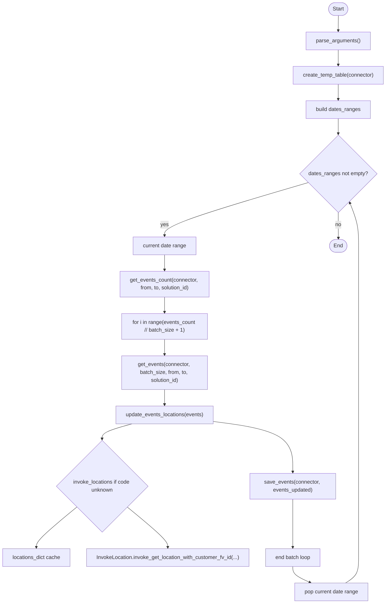
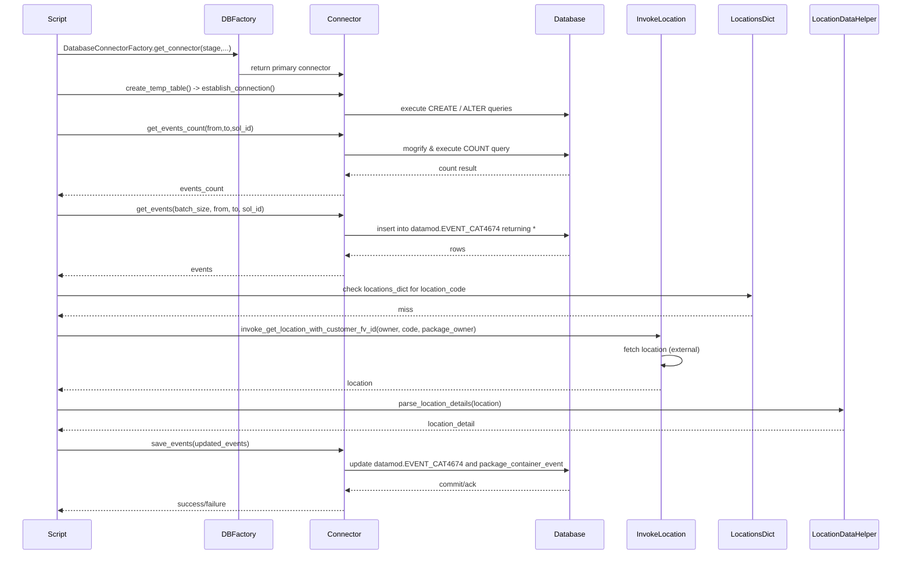

# Diagram: partview_core/partview_service/scripts/BackfillContainerEventCodes.py

> Auto-generated by Obscura crawlers

## Diagram 1

### SVG

<svg id="container" width="1184.57421875" xmlns="http://www.w3.org/2000/svg" class="flowchart" height="1828.296875" viewBox="0 0 1184.57421875 1828.296875" role="graphics-document document" aria-roledescription="flowchart-v2"><g><marker id="container_flowchart-v2-pointEnd" class="marker flowchart-v2" viewBox="0 0 10 10" refX="5" refY="5" markerUnits="userSpaceOnUse" markerWidth="8" markerHeight="8" orient="auto"><path d="M 0 0 L 10 5 L 0 10 z" class="arrowMarkerPath" style="stroke-width: 1; stroke-dasharray: 1, 0;"></path></marker><marker id="container_flowchart-v2-pointStart" class="marker flowchart-v2" viewBox="0 0 10 10" refX="4.5" refY="5" markerUnits="userSpaceOnUse" markerWidth="8" markerHeight="8" orient="auto"><path d="M 0 5 L 10 10 L 10 0 z" class="arrowMarkerPath" style="stroke-width: 1; stroke-dasharray: 1, 0;"></path></marker><marker id="container_flowchart-v2-circleEnd" class="marker flowchart-v2" viewBox="0 0 10 10" refX="11" refY="5" markerUnits="userSpaceOnUse" markerWidth="11" markerHeight="11" orient="auto"><circle cx="5" cy="5" r="5" class="arrowMarkerPath" style="stroke-width: 1; stroke-dasharray: 1, 0;"></circle></marker><marker id="container_flowchart-v2-circleStart" class="marker flowchart-v2" viewBox="0 0 10 10" refX="-1" refY="5" markerUnits="userSpaceOnUse" markerWidth="11" markerHeight="11" orient="auto"><circle cx="5" cy="5" r="5" class="arrowMarkerPath" style="stroke-width: 1; stroke-dasharray: 1, 0;"></circle></marker><marker id="container_flowchart-v2-crossEnd" class="marker cross flowchart-v2" viewBox="0 0 11 11" refX="12" refY="5.2" markerUnits="userSpaceOnUse" markerWidth="11" markerHeight="11" orient="auto"><path d="M 1,1 l 9,9 M 10,1 l -9,9" class="arrowMarkerPath" style="stroke-width: 2; stroke-dasharray: 1, 0;"></path></marker><marker id="container_flowchart-v2-crossStart" class="marker cross flowchart-v2" viewBox="0 0 11 11" refX="-1" refY="5.2" markerUnits="userSpaceOnUse" markerWidth="11" markerHeight="11" orient="auto"><path d="M 1,1 l 9,9 M 10,1 l -9,9" class="arrowMarkerPath" style="stroke-width: 2; stroke-dasharray: 1, 0;"></path></marker><g class="root"><g class="clusters"></g><g class="edgePaths"><path d="M1038.012,47.5L1037.928,51.583C1037.845,55.667,1037.678,63.833,1037.595,71.417C1037.512,79,1037.512,86,1037.512,89.5L1037.512,93" id="L_Start_ParseArgs_0" class="edge-thickness-normal edge-pattern-solid edge-thickness-normal edge-pattern-solid flowchart-link" style=";" data-edge="true" data-et="edge" data-id="L_Start_ParseArgs_0" data-points="W3sieCI6MTAzOC4wMTE3MTg3NSwieSI6NDcuNX0seyJ4IjoxMDM3LjUxMTcxODc1LCJ5Ijo3Mn0seyJ4IjoxMDM3LjUxMTcxODc1LCJ5Ijo5N31d" marker-end="url(#container_flowchart-v2-pointEnd)"></path><path d="M1037.512,151L1037.512,155.167C1037.512,159.333,1037.512,167.667,1037.512,175.333C1037.512,183,1037.512,190,1037.512,193.5L1037.512,197" id="L_ParseArgs_CreateTemp_0" class="edge-thickness-normal edge-pattern-solid edge-thickness-normal edge-pattern-solid flowchart-link" style=";" data-edge="true" data-et="edge" data-id="L_ParseArgs_CreateTemp_0" data-points="W3sieCI6MTAzNy41MTE3MTg3NSwieSI6MTUxfSx7IngiOjEwMzcuNTExNzE4NzUsInkiOjE3Nn0seyJ4IjoxMDM3LjUxMTcxODc1LCJ5IjoyMDF9XQ==" marker-end="url(#container_flowchart-v2-pointEnd)"></path><path d="M1037.512,255L1037.512,259.167C1037.512,263.333,1037.512,271.667,1037.512,279.333C1037.512,287,1037.512,294,1037.512,297.5L1037.512,301" id="L_CreateTemp_BuildDates_0" class="edge-thickness-normal edge-pattern-solid edge-thickness-normal edge-pattern-solid flowchart-link" style=";" data-edge="true" data-et="edge" data-id="L_CreateTemp_BuildDates_0" data-points="W3sieCI6MTAzNy41MTE3MTg3NSwieSI6MjU1fSx7IngiOjEwMzcuNTExNzE4NzUsInkiOjI4MH0seyJ4IjoxMDM3LjUxMTcxODc1LCJ5IjozMDV9XQ==" marker-end="url(#container_flowchart-v2-pointEnd)"></path><path d="M1037.512,359L1037.512,363.167C1037.512,367.333,1037.512,375.667,1037.512,383.333C1037.512,391,1037.512,398,1037.512,401.5L1037.512,405" id="L_BuildDates_LoopDates_0" class="edge-thickness-normal edge-pattern-solid edge-thickness-normal edge-pattern-solid flowchart-link" style=";" data-edge="true" data-et="edge" data-id="L_BuildDates_LoopDates_0" data-points="W3sieCI6MTAzNy41MTE3MTg3NSwieSI6MzU5fSx7IngiOjEwMzcuNTExNzE4NzUsInkiOjM4NH0seyJ4IjoxMDM3LjUxMTcxODc1LCJ5Ijo0MDl9XQ==" marker-end="url(#container_flowchart-v2-pointEnd)"></path><path d="M946.36,553.145L872.882,574.504C799.405,595.862,652.451,638.58,578.973,665.438C505.496,692.297,505.496,703.297,505.496,708.797L505.496,714.297" id="L_LoopDates_DateRange_0" class="edge-thickness-normal edge-pattern-solid edge-thickness-normal edge-pattern-solid flowchart-link" style=";" data-edge="true" data-et="edge" data-id="L_LoopDates_DateRange_0" data-points="W3sieCI6OTQ2LjM1OTcxMjM2ODY2MTMsInkiOjU1My4xNDQ4Njg2MTg2NjEzfSx7IngiOjUwNS40OTYwOTM3NSwieSI6NjgxLjI5Njg3NX0seyJ4Ijo1MDUuNDk2MDkzNzUsInkiOjcxOC4yOTY4NzV9XQ==" marker-end="url(#container_flowchart-v2-pointEnd)"></path><path d="M505.496,772.297L505.496,776.464C505.496,780.63,505.496,788.964,505.496,796.63C505.496,804.297,505.496,811.297,505.496,814.797L505.496,818.297" id="L_DateRange_Count_0" class="edge-thickness-normal edge-pattern-solid edge-thickness-normal edge-pattern-solid flowchart-link" style=";" data-edge="true" data-et="edge" data-id="L_DateRange_Count_0" data-points="W3sieCI6NTA1LjQ5NjA5Mzc1LCJ5Ijo3NzIuMjk2ODc1fSx7IngiOjUwNS40OTYwOTM3NSwieSI6Nzk3LjI5Njg3NX0seyJ4Ijo1MDUuNDk2MDkzNzUsInkiOjgyMi4yOTY4NzV9XQ==" marker-end="url(#container_flowchart-v2-pointEnd)"></path><path d="M505.496,900.297L505.496,904.464C505.496,908.63,505.496,916.964,505.496,924.63C505.496,932.297,505.496,939.297,505.496,942.797L505.496,946.297" id="L_Count_Batches_0" class="edge-thickness-normal edge-pattern-solid edge-thickness-normal edge-pattern-solid flowchart-link" style=";" data-edge="true" data-et="edge" data-id="L_Count_Batches_0" data-points="W3sieCI6NTA1LjQ5NjA5Mzc1LCJ5Ijo5MDAuMjk2ODc1fSx7IngiOjUwNS40OTYwOTM3NSwieSI6OTI1LjI5Njg3NX0seyJ4Ijo1MDUuNDk2MDkzNzUsInkiOjk1MC4yOTY4NzV9XQ==" marker-end="url(#container_flowchart-v2-pointEnd)"></path><path d="M505.496,1028.297L505.496,1032.464C505.496,1036.63,505.496,1044.964,505.496,1052.63C505.496,1060.297,505.496,1067.297,505.496,1070.797L505.496,1074.297" id="L_Batches_GetEvents_0" class="edge-thickness-normal edge-pattern-solid edge-thickness-normal edge-pattern-solid flowchart-link" style=";" data-edge="true" data-et="edge" data-id="L_Batches_GetEvents_0" data-points="W3sieCI6NTA1LjQ5NjA5Mzc1LCJ5IjoxMDI4LjI5Njg3NX0seyJ4Ijo1MDUuNDk2MDkzNzUsInkiOjEwNTMuMjk2ODc1fSx7IngiOjUwNS40OTYwOTM3NSwieSI6MTA3OC4yOTY4NzV9XQ==" marker-end="url(#container_flowchart-v2-pointEnd)"></path><path d="M505.496,1180.297L505.496,1184.464C505.496,1188.63,505.496,1196.964,505.496,1204.63C505.496,1212.297,505.496,1219.297,505.496,1222.797L505.496,1226.297" id="L_GetEvents_UpdateLocs_0" class="edge-thickness-normal edge-pattern-solid edge-thickness-normal edge-pattern-solid flowchart-link" style=";" data-edge="true" data-et="edge" data-id="L_GetEvents_UpdateLocs_0" data-points="W3sieCI6NTA1LjQ5NjA5Mzc1LCJ5IjoxMTgwLjI5Njg3NX0seyJ4Ijo1MDUuNDk2MDkzNzUsInkiOjEyMDUuMjk2ODc1fSx7IngiOjUwNS40OTYwOTM3NSwieSI6MTIzMC4yOTY4NzV9XQ==" marker-end="url(#container_flowchart-v2-pointEnd)"></path><path d="M405.83,1284.297L390.45,1288.464C375.069,1292.63,344.308,1300.964,328.927,1308.63C313.547,1316.297,313.547,1323.297,313.547,1326.797L313.547,1330.297" id="L_UpdateLocs_InvokeLoc_0" class="edge-thickness-normal edge-pattern-solid edge-thickness-normal edge-pattern-solid flowchart-link" style=";" data-edge="true" data-et="edge" data-id="L_UpdateLocs_InvokeLoc_0" data-points="W3sieCI6NDA1LjgzMDE1MzI0NTE5MjMsInkiOjEyODQuMjk2ODc1fSx7IngiOjMxMy41NDY4NzUsInkiOjEzMDkuMjk2ODc1fSx7IngiOjMxMy41NDY4NzUsInkiOjEzMzQuMjk2ODc1fV0=" marker-end="url(#container_flowchart-v2-pointEnd)"></path><path d="M236.907,1535.657L216.088,1552.597C195.269,1569.537,153.63,1603.417,132.811,1623.857C111.992,1644.297,111.992,1651.297,111.992,1654.797L111.992,1658.297" id="L_InvokeLoc_LocationCache_0" class="edge-thickness-normal edge-pattern-solid edge-thickness-normal edge-pattern-solid flowchart-link" style=";" data-edge="true" data-et="edge" data-id="L_InvokeLoc_LocationCache_0" data-points="W3sieCI6MjM2LjkwNjkwMTUwMDgyMjgsInkiOjE1MzUuNjU2OTAxNTAwODIyOX0seyJ4IjoxMTEuOTkyMTg3NSwieSI6MTYzNy4yOTY4NzV9LHsieCI6MTExLjk5MjE4NzUsInkiOjE2NjIuMjk2ODc1fV0=" marker-end="url(#container_flowchart-v2-pointEnd)"></path><path d="M390.187,1535.657L411.006,1552.597C431.825,1569.537,473.463,1603.417,494.282,1623.857C515.102,1644.297,515.102,1651.297,515.102,1654.797L515.102,1658.297" id="L_InvokeLoc_LocationService_0" class="edge-thickness-normal edge-pattern-solid edge-thickness-normal edge-pattern-solid flowchart-link" style=";" data-edge="true" data-et="edge" data-id="L_InvokeLoc_LocationService_0" data-points="W3sieCI6MzkwLjE4Njg0ODQ5OTE3NzIsInkiOjE1MzUuNjU2OTAxNTAwODIyOX0seyJ4Ijo1MTUuMTAxNTYyNSwieSI6MTYzNy4yOTY4NzV9LHsieCI6NTE1LjEwMTU2MjUsInkiOjE2NjIuMjk2ODc1fV0=" marker-end="url(#container_flowchart-v2-pointEnd)"></path><path d="M655.238,1277.085L695.865,1282.453C736.492,1287.822,817.746,1298.559,858.373,1324.095C899,1349.63,899,1389.964,899,1410.13L899,1430.297" id="L_UpdateLocs_Save_0" class="edge-thickness-normal edge-pattern-solid edge-thickness-normal edge-pattern-solid flowchart-link" style=";" data-edge="true" data-et="edge" data-id="L_UpdateLocs_Save_0" data-points="W3sieCI6NjU1LjIzODI4MTI1LCJ5IjoxMjc3LjA4NDcxODU5MjcyMTZ9LHsieCI6ODk5LCJ5IjoxMzA5LjI5Njg3NX0seyJ4Ijo4OTksInkiOjE0MzQuMjk2ODc1fV0=" marker-end="url(#container_flowchart-v2-pointEnd)"></path><path d="M899,1512.297L899,1533.13C899,1553.964,899,1595.63,899,1619.964C899,1644.297,899,1651.297,899,1654.797L899,1658.297" id="L_Save_LoopBatchesEnd_0" class="edge-thickness-normal edge-pattern-solid edge-thickness-normal edge-pattern-solid flowchart-link" style=";" data-edge="true" data-et="edge" data-id="L_Save_LoopBatchesEnd_0" data-points="W3sieCI6ODk5LCJ5IjoxNTEyLjI5Njg3NX0seyJ4Ijo4OTksInkiOjE2MzcuMjk2ODc1fSx7IngiOjg5OSwieSI6MTY2Mi4yOTY4NzV9XQ==" marker-end="url(#container_flowchart-v2-pointEnd)"></path><path d="M899,1716.297L899,1720.464C899,1724.63,899,1732.964,907.77,1741.026C916.541,1749.089,934.081,1756.881,942.851,1760.777L951.622,1764.673" id="L_LoopBatchesEnd_PopDate_0" class="edge-thickness-normal edge-pattern-solid edge-thickness-normal edge-pattern-solid flowchart-link" style=";" data-edge="true" data-et="edge" data-id="L_LoopBatchesEnd_PopDate_0" data-points="W3sieCI6ODk5LCJ5IjoxNzE2LjI5Njg3NX0seyJ4Ijo4OTksInkiOjE3NDEuMjk2ODc1fSx7IngiOjk1NS4yNzcxMDkxMDk0Mzg0LCJ5IjoxNzY2LjI5Njg3NX1d" marker-end="url(#container_flowchart-v2-pointEnd)"></path><path d="M1058.893,1766.297L1065.504,1762.13C1072.114,1757.964,1085.335,1749.63,1091.946,1736.797C1098.556,1723.964,1098.556,1706.63,1098.556,1689.297C1098.556,1671.964,1098.556,1654.63,1098.556,1618.63C1098.556,1582.63,1098.556,1527.964,1098.556,1473.297C1098.556,1418.63,1098.556,1363.964,1098.556,1327.964C1098.556,1291.964,1098.556,1274.63,1098.556,1257.297C1098.556,1239.964,1098.556,1222.63,1098.556,1201.297C1098.556,1179.964,1098.556,1154.63,1098.556,1129.297C1098.556,1103.964,1098.556,1078.63,1098.556,1055.297C1098.556,1031.964,1098.556,1010.63,1098.556,989.297C1098.556,967.964,1098.556,946.63,1098.556,925.297C1098.556,903.964,1098.556,882.63,1098.556,861.297C1098.556,839.964,1098.556,818.63,1098.556,799.297C1098.556,779.964,1098.556,762.63,1098.556,743.297C1098.556,723.964,1098.556,702.63,1094.176,680.868C1089.797,659.105,1081.037,636.913,1076.657,625.817L1072.277,614.721" id="L_PopDate_LoopDates_0" class="edge-thickness-normal edge-pattern-solid edge-thickness-normal edge-pattern-solid flowchart-link" style=";" data-edge="true" data-et="edge" data-id="L_PopDate_LoopDates_0" data-points="W3sieCI6MTA1OC44OTI5MjU0MDkxNzA0LCJ5IjoxNzY2LjI5Njg3NX0seyJ4IjoxMDk4LjU1NjM4Njk0NzYzMTgsInkiOjE3NDEuMjk2ODc1fSx7IngiOjEwOTguNTU2Mzg2OTQ3NjMxOCwieSI6MTY4OS4yOTY4NzV9LHsieCI6MTA5OC41NTYzODY5NDc2MzE4LCJ5IjoxNjM3LjI5Njg3NX0seyJ4IjoxMDk4LjU1NjM4Njk0NzYzMTgsInkiOjE0NzMuMjk2ODc1fSx7IngiOjEwOTguNTU2Mzg2OTQ3NjMxOCwieSI6MTMwOS4yOTY4NzV9LHsieCI6MTA5OC41NTYzODY5NDc2MzE4LCJ5IjoxMjU3LjI5Njg3NX0seyJ4IjoxMDk4LjU1NjM4Njk0NzYzMTgsInkiOjEyMDUuMjk2ODc1fSx7IngiOjEwOTguNTU2Mzg2OTQ3NjMxOCwieSI6MTEyOS4yOTY4NzV9LHsieCI6MTA5OC41NTYzODY5NDc2MzE4LCJ5IjoxMDUzLjI5Njg3NX0seyJ4IjoxMDk4LjU1NjM4Njk0NzYzMTgsInkiOjk4OS4yOTY4NzV9LHsieCI6MTA5OC41NTYzODY5NDc2MzE4LCJ5Ijo5MjUuMjk2ODc1fSx7IngiOjEwOTguNTU2Mzg2OTQ3NjMxOCwieSI6ODYxLjI5Njg3NX0seyJ4IjoxMDk4LjU1NjM4Njk0NzYzMTgsInkiOjc5Ny4yOTY4NzV9LHsieCI6MTA5OC41NTYzODY5NDc2MzE4LCJ5Ijo3NDUuMjk2ODc1fSx7IngiOjEwOTguNTU2Mzg2OTQ3NjMxOCwieSI6NjgxLjI5Njg3NX0seyJ4IjoxMDcwLjgwODE0NjEzNDMwOTMsInkiOjYxMS4wMDA0NDc2MTU2OTA3fV0=" marker-end="url(#container_flowchart-v2-pointEnd)"></path><path d="M1037.512,644.297L1037.512,650.464C1037.512,656.63,1037.512,668.964,1037.588,681.964C1037.664,694.964,1037.815,708.63,1037.891,715.464L1037.967,722.297" id="L_LoopDates_End_0" class="edge-thickness-normal edge-pattern-solid edge-thickness-normal edge-pattern-solid flowchart-link" style=";" data-edge="true" data-et="edge" data-id="L_LoopDates_End_0" data-points="W3sieCI6MTAzNy41MTE3MTg3NSwieSI6NjQ0LjI5Njg3NX0seyJ4IjoxMDM3LjUxMTcxODc1LCJ5Ijo2ODEuMjk2ODc1fSx7IngiOjEwMzguMDExNzE4NzUsInkiOjcyNi4yOTY4NzV9XQ==" marker-end="url(#container_flowchart-v2-pointEnd)"></path></g><g class="edgeLabels"><g class="edgeLabel"><g class="label" data-id="L_Start_ParseArgs_0" transform="translate(0, 0)"><foreignObject width="0" height="0">

</foreignObject></g></g><g class="edgeLabel"><g class="label" data-id="L_ParseArgs_CreateTemp_0" transform="translate(0, 0)"><foreignObject width="0" height="0">

</foreignObject></g></g><g class="edgeLabel"><g class="label" data-id="L_CreateTemp_BuildDates_0" transform="translate(0, 0)"><foreignObject width="0" height="0">

</foreignObject></g></g><g class="edgeLabel"><g class="label" data-id="L_BuildDates_LoopDates_0" transform="translate(0, 0)"><foreignObject width="0" height="0">

</foreignObject></g></g><g class="edgeLabel" transform="translate(505.49609375, 681.296875)"><g class="label" data-id="L_LoopDates_DateRange_0" transform="translate(-12.0078125, -12)"><foreignObject width="24.015625" height="24">

yes

</foreignObject></g></g><g class="edgeLabel"><g class="label" data-id="L_DateRange_Count_0" transform="translate(0, 0)"><foreignObject width="0" height="0">

</foreignObject></g></g><g class="edgeLabel"><g class="label" data-id="L_Count_Batches_0" transform="translate(0, 0)"><foreignObject width="0" height="0">

</foreignObject></g></g><g class="edgeLabel"><g class="label" data-id="L_Batches_GetEvents_0" transform="translate(0, 0)"><foreignObject width="0" height="0">

</foreignObject></g></g><g class="edgeLabel"><g class="label" data-id="L_GetEvents_UpdateLocs_0" transform="translate(0, 0)"><foreignObject width="0" height="0">

</foreignObject></g></g><g class="edgeLabel"><g class="label" data-id="L_UpdateLocs_InvokeLoc_0" transform="translate(0, 0)"><foreignObject width="0" height="0">

</foreignObject></g></g><g class="edgeLabel"><g class="label" data-id="L_InvokeLoc_LocationCache_0" transform="translate(0, 0)"><foreignObject width="0" height="0">

</foreignObject></g></g><g class="edgeLabel"><g class="label" data-id="L_InvokeLoc_LocationService_0" transform="translate(0, 0)"><foreignObject width="0" height="0">

</foreignObject></g></g><g class="edgeLabel"><g class="label" data-id="L_UpdateLocs_Save_0" transform="translate(0, 0)"><foreignObject width="0" height="0">

</foreignObject></g></g><g class="edgeLabel"><g class="label" data-id="L_Save_LoopBatchesEnd_0" transform="translate(0, 0)"><foreignObject width="0" height="0">

</foreignObject></g></g><g class="edgeLabel"><g class="label" data-id="L_LoopBatchesEnd_PopDate_0" transform="translate(0, 0)"><foreignObject width="0" height="0">

</foreignObject></g></g><g class="edgeLabel"><g class="label" data-id="L_PopDate_LoopDates_0" transform="translate(0, 0)"><foreignObject width="0" height="0">

</foreignObject></g></g><g class="edgeLabel" transform="translate(1037.51171875, 681.296875)"><g class="label" data-id="L_LoopDates_End_0" transform="translate(-9.3671875, -12)"><foreignObject width="18.734375" height="24">

no

</foreignObject></g></g></g><g class="nodes"><g class="node default" id="flowchart-Start-0" transform="translate(1037.51171875, 27.5)"><g class="basic label-container outer-path"><path d="M-10.3984375 -19.5 C-5.473159210714233 -19.5, -0.5478809214284652 -19.5, 10.3984375 -19.5 C10.3984375 -19.5, 10.398437499999998 -19.5, 10.398437499999998 -19.5 C10.772015134732861 -19.48802009237887, 11.145592769465724 -19.476040184757743, 11.6478067896239 -19.45993515863156 C11.953702459039917 -19.430425771296363, 12.259598128455936 -19.400916383961167, 12.892042152847864 -19.3399052695533 C13.347489976015128 -19.266271997554238, 13.802937799182393 -19.192638725555174, 14.126030759676757 -19.140403561325776 C14.611173968756788 -19.029672789708563, 15.096317177836818 -18.91894201809135, 15.34470188623539 -18.862249829261074 C15.807354048521288 -18.724937096005377, 16.27000621080719 -18.58762436274968, 16.543047751460602 -18.50658706670804 C16.814777802348473 -18.406587896136248, 17.086507853236345 -18.306588725564456, 17.716144095147794 -18.074876768247425 C18.12923799122345 -17.892012354449772, 18.542331887299113 -17.70914794065212, 18.85917041279238 -17.568892924097174 C19.201404964393912 -17.39034937773835, 19.543639515995444 -17.21180583137952, 19.967429764076783 -16.990714730406097 C20.259743533773417 -16.81351240538961, 20.55205730347005 -16.636310080373125, 21.036368073605697 -16.342718045390892 C21.41371044647467 -16.079500340965545, 21.791052819343644 -15.816282636540201, 22.061592844578712 -15.627565626425154 C22.356483320549426 -15.392398319203641, 22.651373796520144 -15.15723101198213, 23.03889120850187 -14.848196188198123 C23.385528806406715 -14.533389093309198, 23.732166404311563 -14.218581998420275, 23.964247236767985 -14.007812326905688 C24.217314883226074 -13.746499204697532, 24.470382529684162 -13.485186082489378, 24.833858442968648 -13.10986736009568 C25.059205445457103 -12.845161948365053, 25.284552447945558 -12.580456536634426, 25.644151408126582 -12.158051136245305 C25.845530902994188 -11.888220959172108, 26.046910397861797 -11.61839078209891, 26.391796464640635 -11.156274872382312 C26.561975504200255 -10.894834168148087, 26.732154543759872 -10.63339346391386, 27.073721378604247 -10.108655082055241 C27.212929742956714 -9.861476534771988, 27.35213810730918 -9.614297987488735, 27.6871239742735 -9.019496659696287 C27.882753759867665 -8.613267224103147, 28.07838354546183 -8.207037788510005, 28.22948364880834 -7.893275190886684 C28.379422484931045 -7.522923366793415, 28.529361321053752 -7.152571542700144, 28.698571729970325 -6.734618561215508 C28.784849439015673 -6.474763848057048, 28.87112714806102 -6.214909134898588, 29.09246063421488 -5.548287939305138 C29.191749001205228 -5.169658364120486, 29.291037368195575 -4.791028788935833, 29.40953178754556 -4.339158212148133 C29.475681327771536 -3.9994943037980297, 29.54183086799751 -3.659830395447926, 29.648482276581777 -3.1121979531509023 C29.71132594158802 -2.624794897247813, 29.774169606594256 -2.137391841344724, 29.808330202509367 -1.872449005199798 C29.83344011544028 -1.4813418429439298, 29.85855002837119 -1.0902346806880616, 29.888418715913414 -0.6250057626472757 C29.888418715913414 -0.26092769097308577, 29.888418715913414 0.10315038070110416, 29.888418715913414 0.625005762647271 C29.85797110035547 1.0992519518351718, 29.827523484797528 1.5734981410230726, 29.808330202509367 1.8724490051997846 C29.753988797893122 2.2939102084792844, 29.69964739327688 2.7153714117587837, 29.648482276581777 3.1121979531508885 C29.595277763976636 3.385391880600576, 29.54207325137149 3.658585808050263, 29.40953178754556 4.339158212148129 C29.296013272181934 4.772053510465417, 29.182494756818308 5.204948808782705, 29.092460634214884 5.548287939305125 C28.949658599340626 5.978384915931967, 28.806856564466372 6.408481892558808, 28.69857172997033 6.734618561215495 C28.550834009091723 7.099533588100177, 28.403096288213113 7.464448614984859, 28.229483648808344 7.893275190886679 C28.106372959236637 8.148917171929105, 27.98326226966493 8.40455915297153, 27.687123974273504 9.019496659696284 C27.524534592651253 9.308190570726767, 27.361945211029006 9.59688448175725, 27.07372137860425 10.108655082055236 C26.854143728426337 10.44598531758344, 26.634566078248426 10.783315553111645, 26.39179646464064 11.156274872382301 C26.22250571537644 11.3831090536918, 26.053214966112236 11.6099432350013, 25.644151408126582 12.158051136245302 C25.396726535483648 12.448690470525781, 25.149301662840717 12.739329804806262, 24.83385844296866 13.10986736009567 C24.60173373484744 13.349555179023792, 24.369609026726224 13.589242997951912, 23.96424723676799 14.007812326905684 C23.75021998123617 14.202186217528814, 23.536192725704357 14.396560108151943, 23.038891208501887 14.848196188198111 C22.838063587732652 15.008350871514143, 22.63723596696342 15.168505554830174, 22.061592844578715 15.627565626425152 C21.78671057403926 15.819311598891769, 21.51182830349981 16.011057571358386, 21.036368073605708 16.34271804539089 C20.680639591904974 16.558362741490473, 20.324911110204237 16.774007437590058, 19.967429764076787 16.990714730406093 C19.72184745533122 17.118834863575678, 19.476265146585654 17.246954996745266, 18.859170412792388 17.56889292409717 C18.62826393698908 17.671108371338057, 18.39735746118577 17.773323818578945, 17.716144095147804 18.07487676824742 C17.29780876571479 18.228828036528164, 16.87947343628178 18.382779304808906, 16.543047751460616 18.506587066708033 C16.157003843321764 18.62116287225782, 15.770959935182912 18.73573867780761, 15.344701886235413 18.86224982926107 C15.024009165652254 18.9354458500186, 14.703316445069095 19.008641870776128, 14.126030759676766 19.140403561325773 C13.724782727637924 19.20527423142085, 13.323534695599081 19.27014490151593, 12.892042152847878 19.3399052695533 C12.621821208197144 19.36597315909552, 12.35160026354641 19.392041048637743, 11.6478067896239 19.45993515863156 C11.30299713589564 19.470992533095348, 10.958187482167377 19.482049907559137, 10.398437500000004 19.5 C10.398437500000002 19.5, 10.398437500000002 19.5, 10.3984375 19.5 C4.225973210756947 19.5, -1.9464910784861065 19.5, -10.398437499999996 19.5 C-10.782054775259132 19.487698140648167, -11.16567205051827 19.475396281296337, -11.647806789623893 19.45993515863156 C-12.084529373600185 19.417805056191117, -12.521251957576478 19.37567495375068, -12.892042152847871 19.3399052695533 C-13.255631213257624 19.281123009941524, -13.619220273667377 19.22234075032975, -14.126030759676759 19.140403561325773 C-14.479133793029193 19.059810098175713, -14.832236826381626 18.97921663502565, -15.344701886235388 18.862249829261074 C-15.690538102291725 18.759607455666895, -16.036374318348063 18.656965082072716, -16.54304775146059 18.506587066708043 C-16.824892316436355 18.402865661454364, -17.10673688141212 18.299144256200684, -17.716144095147797 18.074876768247425 C-18.159715337746622 17.87852093722233, -18.603286580345443 17.682165106197235, -18.85917041279238 17.568892924097174 C-19.168951989027732 17.40728007419976, -19.478733565263084 17.24566722430235, -19.96742976407678 16.990714730406097 C-20.251770445539137 16.818345738332297, -20.536111127001497 16.645976746258494, -21.036368073605686 16.3427180453909 C-21.28853371749707 16.166818208287058, -21.54069936138846 15.990918371183216, -22.061592844578712 15.627565626425156 C-22.436467235823027 15.328613275234323, -22.811341627067343 15.02966092404349, -23.03889120850187 14.848196188198125 C-23.340334431284884 14.574433429017207, -23.6417776540679 14.30067066983629, -23.964247236767974 14.007812326905697 C-24.233449218512963 13.729839178860258, -24.502651200257947 13.451866030814822, -24.833858442968655 13.109867360095677 C-25.089680677914515 12.809364006230728, -25.345502912860372 12.50886065236578, -25.64415140812658 12.158051136245307 C-25.815783232204332 11.928080127961952, -25.98741505628209 11.698109119678596, -26.391796464640635 11.156274872382316 C-26.607422586706992 10.825015245167332, -26.823048708773346 10.493755617952349, -27.073721378604244 10.108655082055249 C-27.283249369076035 9.736616917962852, -27.49277735954783 9.364578753870456, -27.6871239742735 9.019496659696289 C-27.903052664371003 8.57111611457499, -28.118981354468506 8.122735569453688, -28.22948364880834 7.893275190886686 C-28.37065844425405 7.54457071670679, -28.511833239699765 7.195866242526893, -28.698571729970325 6.73461856121551 C-28.85208045170139 6.272274749654845, -29.005589173432455 5.80993093809418, -29.09246063421488 5.5482879393051325 C-29.165734403202883 5.268863301101513, -29.239008172190886 4.989438662897894, -29.409531787545557 4.339158212148136 C-29.48114936892037 3.971417068169667, -29.55276695029518 3.6036759241911978, -29.648482276581777 3.112197953150904 C-29.691898180049666 2.775472779293828, -29.73531408351755 2.4387476054367516, -29.808330202509364 1.872449005199809 C-29.8296911304796 1.5397353098326703, -29.851052058449834 1.2070216144655315, -29.888418715913414 0.6250057626472781 C-29.888418715913414 0.3190691382387482, -29.888418715913414 0.013132513830218295, -29.888418715913414 -0.6250057626472687 C-29.863785422790908 -1.0086891866666088, -29.839152129668406 -1.3923726106859489, -29.808330202509367 -1.8724490051997822 C-29.758546292161437 -2.2585631829132815, -29.708762381813507 -2.6446773606267806, -29.648482276581777 -3.112197953150895 C-29.56018778455098 -3.565571508681535, -29.471893292520186 -4.018945064212175, -29.40953178754556 -4.339158212148126 C-29.314837778668284 -4.700267508640238, -29.220143769791008 -5.0613768051323484, -29.092460634214884 -5.548287939305123 C-28.953980111084174 -5.965369211099793, -28.815499587953465 -6.382450482894463, -28.698571729970332 -6.734618561215485 C-28.52983616779049 -7.151398662079868, -28.36110060561064 -7.56817876294425, -28.229483648808344 -7.893275190886676 C-28.090769773440204 -8.181317521090087, -27.952055898072064 -8.469359851293499, -27.687123974273504 -9.019496659696282 C-27.469098298790094 -9.406623324010718, -27.251072623306687 -9.793749988325157, -27.073721378604247 -10.108655082055243 C-26.908453821162173 -10.362550430839306, -26.743186263720098 -10.616445779623369, -26.39179646464064 -11.156274872382308 C-26.121012731118228 -11.519100406396731, -25.850228997595813 -11.881925940411154, -25.644151408126586 -12.158051136245302 C-25.387143501958235 -12.459947246994794, -25.13013559578988 -12.761843357744286, -24.833858442968662 -13.10986736009567 C-24.503854189523434 -13.450623845630952, -24.173849936078206 -13.791380331166234, -23.964247236767996 -14.007812326905677 C-23.721348241218326 -14.228406767908641, -23.478449245668653 -14.449001208911607, -23.038891208501887 -14.848196188198107 C-22.73384945508533 -15.091458869045839, -22.428807701668777 -15.33472154989357, -22.06159284457872 -15.627565626425149 C-21.786786968440875 -15.819258309464264, -21.51198109230303 -16.01095099250338, -21.03636807360571 -16.342718045390885 C-20.8005995514378 -16.485642309058704, -20.564831029269882 -16.62856657272652, -19.96742976407679 -16.99071473040609 C-19.722060212406927 -17.11872386834556, -19.476690660737066 -17.246733006285027, -18.859170412792388 -17.56889292409717 C-18.483752498293516 -17.735079298469064, -18.108334583794647 -17.901265672840957, -17.716144095147804 -18.07487676824742 C-17.334598114451637 -18.215289216115995, -16.953052133755467 -18.355701663984565, -16.54304775146062 -18.506587066708033 C-16.140826136919024 -18.62596433059964, -15.738604522377427 -18.745341594491247, -15.344701886235413 -18.862249829261067 C-14.86205545316755 -18.97241072804649, -14.379409020099686 -19.082571626831914, -14.126030759676768 -19.140403561325773 C-13.74128775799867 -19.20260582611055, -13.356544756320572 -19.264808090895322, -12.89204215284788 -19.3399052695533 C-12.52388494351456 -19.37542095276386, -12.15572773418124 -19.410936635974423, -11.647806789623903 -19.45993515863156 C-11.273148175491528 -19.47194973115803, -10.898489561359153 -19.483964303684505, -10.398437500000005 -19.5 C-10.398437500000004 -19.5, -10.398437500000002 -19.5, -10.3984375 -19.5" stroke="none" stroke-width="0" fill="#ECECFF" style=""></path><path d="M-10.3984375 -19.5 C-4.173297776043676 -19.5, 2.0518419479126475 -19.5, 10.3984375 -19.5 M-10.3984375 -19.5 C-5.5086912011536935 -19.5, -0.618944902307387 -19.5, 10.3984375 -19.5 M10.3984375 -19.5 C10.3984375 -19.5, 10.3984375 -19.5, 10.398437499999998 -19.5 M10.3984375 -19.5 C10.3984375 -19.5, 10.398437499999998 -19.5, 10.398437499999998 -19.5 M10.398437499999998 -19.5 C10.68394002174667 -19.490844489824532, 10.969442543493342 -19.48168897964906, 11.6478067896239 -19.45993515863156 M10.398437499999998 -19.5 C10.840164219739997 -19.48583468386684, 11.281890939479995 -19.47166936773368, 11.6478067896239 -19.45993515863156 M11.6478067896239 -19.45993515863156 C12.102208739488535 -19.416099549026416, 12.556610689353171 -19.372263939421277, 12.892042152847864 -19.3399052695533 M11.6478067896239 -19.45993515863156 C12.104280995941128 -19.41589964093869, 12.560755202258358 -19.371864123245818, 12.892042152847864 -19.3399052695533 M12.892042152847864 -19.3399052695533 C13.171153654788888 -19.2947806864615, 13.45026515672991 -19.249656103369702, 14.126030759676757 -19.140403561325776 M12.892042152847864 -19.3399052695533 C13.147306316735934 -19.29863613913903, 13.402570480624004 -19.257367008724767, 14.126030759676757 -19.140403561325776 M14.126030759676757 -19.140403561325776 C14.508200052579257 -19.053175914108483, 14.890369345481759 -18.96594826689119, 15.34470188623539 -18.862249829261074 M14.126030759676757 -19.140403561325776 C14.573101341056399 -19.038362618534062, 15.02017192243604 -18.93632167574235, 15.34470188623539 -18.862249829261074 M15.34470188623539 -18.862249829261074 C15.604320407774507 -18.785196414833692, 15.863938929313624 -18.708143000406313, 16.543047751460602 -18.50658706670804 M15.34470188623539 -18.862249829261074 C15.729572433026751 -18.748022271200124, 16.114442979818115 -18.633794713139174, 16.543047751460602 -18.50658706670804 M16.543047751460602 -18.50658706670804 C16.984391038744356 -18.344168657254993, 17.42573432602811 -18.181750247801947, 17.716144095147794 -18.074876768247425 M16.543047751460602 -18.50658706670804 C16.784062575715293 -18.4178913834657, 17.02507739996998 -18.329195700223362, 17.716144095147794 -18.074876768247425 M17.716144095147794 -18.074876768247425 C18.036889948159878 -17.932892093706652, 18.35763580117196 -17.79090741916588, 18.85917041279238 -17.568892924097174 M17.716144095147794 -18.074876768247425 C18.00163358781206 -17.94849903858986, 18.28712308047632 -17.822121308932296, 18.85917041279238 -17.568892924097174 M18.85917041279238 -17.568892924097174 C19.18718445378266 -17.397768209015567, 19.515198494772935 -17.22664349393396, 19.967429764076783 -16.990714730406097 M18.85917041279238 -17.568892924097174 C19.19782437237426 -17.39221737030152, 19.536478331956143 -17.21554181650587, 19.967429764076783 -16.990714730406097 M19.967429764076783 -16.990714730406097 C20.2578975437406 -16.814631455395745, 20.548365323404415 -16.638548180385396, 21.036368073605697 -16.342718045390892 M19.967429764076783 -16.990714730406097 C20.217999435228936 -16.838817923242825, 20.468569106381093 -16.686921116079557, 21.036368073605697 -16.342718045390892 M21.036368073605697 -16.342718045390892 C21.379729404357406 -16.103204044930944, 21.723090735109114 -15.863690044471, 22.061592844578712 -15.627565626425154 M21.036368073605697 -16.342718045390892 C21.25309713568539 -16.191537233733982, 21.469826197765087 -16.040356422077075, 22.061592844578712 -15.627565626425154 M22.061592844578712 -15.627565626425154 C22.378644725134187 -15.374725188787039, 22.695696605689662 -15.121884751148926, 23.03889120850187 -14.848196188198123 M22.061592844578712 -15.627565626425154 C22.451939933997267 -15.316274210186156, 22.84228702341582 -15.004982793947157, 23.03889120850187 -14.848196188198123 M23.03889120850187 -14.848196188198123 C23.23373213044091 -14.671246818101384, 23.428573052379953 -14.494297448004646, 23.964247236767985 -14.007812326905688 M23.03889120850187 -14.848196188198123 C23.26721873708163 -14.640835167957343, 23.495546265661392 -14.433474147716561, 23.964247236767985 -14.007812326905688 M23.964247236767985 -14.007812326905688 C24.30181778571678 -13.659243020058558, 24.639388334665576 -13.310673713211427, 24.833858442968648 -13.10986736009568 M23.964247236767985 -14.007812326905688 C24.162896157818352 -13.802691006541451, 24.36154507886872 -13.597569686177216, 24.833858442968648 -13.10986736009568 M24.833858442968648 -13.10986736009568 C25.05031443697616 -12.855605832839483, 25.26677043098367 -12.601344305583286, 25.644151408126582 -12.158051136245305 M24.833858442968648 -13.10986736009568 C25.026842180004856 -12.883177681487235, 25.219825917041064 -12.656488002878787, 25.644151408126582 -12.158051136245305 M25.644151408126582 -12.158051136245305 C25.82393461186359 -11.917158021824516, 26.00371781560059 -11.676264907403729, 26.391796464640635 -11.156274872382312 M25.644151408126582 -12.158051136245305 C25.893103620837927 -11.824477851225252, 26.14205583354927 -11.490904566205199, 26.391796464640635 -11.156274872382312 M26.391796464640635 -11.156274872382312 C26.591311748778498 -10.849765818591228, 26.790827032916358 -10.543256764800145, 27.073721378604247 -10.108655082055241 M26.391796464640635 -11.156274872382312 C26.65523355349297 -10.751564761141852, 26.9186706423453 -10.34685464990139, 27.073721378604247 -10.108655082055241 M27.073721378604247 -10.108655082055241 C27.21212456910563 -9.862906202477284, 27.350527759607008 -9.617157322899326, 27.6871239742735 -9.019496659696287 M27.073721378604247 -10.108655082055241 C27.25577941475323 -9.785392603497494, 27.43783745090222 -9.462130124939748, 27.6871239742735 -9.019496659696287 M27.6871239742735 -9.019496659696287 C27.831818348555412 -8.719035695536252, 27.976512722837324 -8.41857473137622, 28.22948364880834 -7.893275190886684 M27.6871239742735 -9.019496659696287 C27.855955060278397 -8.668915297200577, 28.024786146283294 -8.318333934704867, 28.22948364880834 -7.893275190886684 M28.22948364880834 -7.893275190886684 C28.323855487952994 -7.660174923644008, 28.418227327097643 -7.427074656401332, 28.698571729970325 -6.734618561215508 M28.22948364880834 -7.893275190886684 C28.339681494576798 -7.621084381308184, 28.44987934034526 -7.348893571729683, 28.698571729970325 -6.734618561215508 M28.698571729970325 -6.734618561215508 C28.788435635063824 -6.463962796942764, 28.87829954015732 -6.193307032670019, 29.09246063421488 -5.548287939305138 M28.698571729970325 -6.734618561215508 C28.829449498442184 -6.340435575118843, 28.960327266914042 -5.946252589022178, 29.09246063421488 -5.548287939305138 M29.09246063421488 -5.548287939305138 C29.20294780032834 -5.126952489473826, 29.313434966441793 -4.705617039642513, 29.40953178754556 -4.339158212148133 M29.09246063421488 -5.548287939305138 C29.21854427751812 -5.067476362393207, 29.344627920821363 -4.586664785481276, 29.40953178754556 -4.339158212148133 M29.40953178754556 -4.339158212148133 C29.478668907434688 -3.984153713652924, 29.547806027323816 -3.6291492151577147, 29.648482276581777 -3.1121979531509023 M29.40953178754556 -4.339158212148133 C29.482779073752308 -3.963048878295909, 29.556026359959056 -3.586939544443685, 29.648482276581777 -3.1121979531509023 M29.648482276581777 -3.1121979531509023 C29.711932061386346 -2.6200939517838746, 29.775381846190914 -2.127989950416847, 29.808330202509367 -1.872449005199798 M29.648482276581777 -3.1121979531509023 C29.683191019909547 -2.843003793917349, 29.717899763237313 -2.573809634683796, 29.808330202509367 -1.872449005199798 M29.808330202509367 -1.872449005199798 C29.83680367309924 -1.4289517173907482, 29.86527714368911 -0.9854544295816983, 29.888418715913414 -0.6250057626472757 M29.808330202509367 -1.872449005199798 C29.83713506319042 -1.4237900492273177, 29.865939923871476 -0.9751310932548372, 29.888418715913414 -0.6250057626472757 M29.888418715913414 -0.6250057626472757 C29.888418715913414 -0.2892565241872017, 29.888418715913414 0.04649271427287227, 29.888418715913414 0.625005762647271 M29.888418715913414 -0.6250057626472757 C29.888418715913414 -0.18446598219940075, 29.888418715913414 0.2560737982484742, 29.888418715913414 0.625005762647271 M29.888418715913414 0.625005762647271 C29.856700987870234 1.1190349790090979, 29.82498325982705 1.6130641953709246, 29.808330202509367 1.8724490051997846 M29.888418715913414 0.625005762647271 C29.870429776879448 0.9051980085115172, 29.852440837845485 1.1853902543757635, 29.808330202509367 1.8724490051997846 M29.808330202509367 1.8724490051997846 C29.748980626730372 2.3327525950423103, 29.68963105095138 2.7930561848848354, 29.648482276581777 3.1121979531508885 M29.808330202509367 1.8724490051997846 C29.77533139759167 2.128381219790353, 29.742332592673975 2.3843134343809216, 29.648482276581777 3.1121979531508885 M29.648482276581777 3.1121979531508885 C29.568121273702594 3.5248347186315185, 29.487760270823415 3.9374714841121485, 29.40953178754556 4.339158212148129 M29.648482276581777 3.1121979531508885 C29.568676059227467 3.521986012215271, 29.488869841873154 3.931774071279653, 29.40953178754556 4.339158212148129 M29.40953178754556 4.339158212148129 C29.345769146811207 4.582312796171515, 29.282006506076858 4.825467380194903, 29.092460634214884 5.548287939305125 M29.40953178754556 4.339158212148129 C29.302721091262423 4.746473689124325, 29.19591039497929 5.15378916610052, 29.092460634214884 5.548287939305125 M29.092460634214884 5.548287939305125 C28.982588233454884 5.879206104604522, 28.87271583269488 6.210124269903919, 28.69857172997033 6.734618561215495 M29.092460634214884 5.548287939305125 C28.960553982598828 5.945569757501843, 28.828647330982772 6.342851575698562, 28.69857172997033 6.734618561215495 M28.69857172997033 6.734618561215495 C28.520858296697284 7.173574177255406, 28.343144863424243 7.612529793295318, 28.229483648808344 7.893275190886679 M28.69857172997033 6.734618561215495 C28.60173641745582 6.973803655309736, 28.50490110494131 7.212988749403976, 28.229483648808344 7.893275190886679 M28.229483648808344 7.893275190886679 C28.043194454684073 8.280108688435947, 27.856905260559802 8.666942185985214, 27.687123974273504 9.019496659696284 M28.229483648808344 7.893275190886679 C28.02092305204456 8.326355732548574, 27.812362455280773 8.759436274210472, 27.687123974273504 9.019496659696284 M27.687123974273504 9.019496659696284 C27.469751889391425 9.405462807714834, 27.252379804509346 9.791428955733382, 27.07372137860425 10.108655082055236 M27.687123974273504 9.019496659696284 C27.503495554671556 9.345547513093331, 27.31986713506961 9.671598366490379, 27.07372137860425 10.108655082055236 M27.07372137860425 10.108655082055236 C26.876277099280763 10.411982516308779, 26.67883281995728 10.71530995056232, 26.39179646464064 11.156274872382301 M27.07372137860425 10.108655082055236 C26.84802450541286 10.455386087373597, 26.62232763222147 10.802117092691958, 26.39179646464064 11.156274872382301 M26.39179646464064 11.156274872382301 C26.22417741184117 11.380869132723745, 26.056558359041695 11.60546339306519, 25.644151408126582 12.158051136245302 M26.39179646464064 11.156274872382301 C26.15931212921757 11.46778270209055, 25.926827793794498 11.779290531798802, 25.644151408126582 12.158051136245302 M25.644151408126582 12.158051136245302 C25.458789546044184 12.375787726836034, 25.273427683961785 12.593524317426766, 24.83385844296866 13.10986736009567 M25.644151408126582 12.158051136245302 C25.36553719627678 12.485327243081846, 25.08692298442698 12.812603349918389, 24.83385844296866 13.10986736009567 M24.83385844296866 13.10986736009567 C24.619597446517123 13.331109430086842, 24.405336450065583 13.552351500078014, 23.96424723676799 14.007812326905684 M24.83385844296866 13.10986736009567 C24.655003986954807 13.294549270153903, 24.47614953094095 13.479231180212134, 23.96424723676799 14.007812326905684 M23.96424723676799 14.007812326905684 C23.71743010289332 14.231965117467153, 23.470612969018653 14.45611790802862, 23.038891208501887 14.848196188198111 M23.96424723676799 14.007812326905684 C23.700090896158798 14.247712126253177, 23.435934555549604 14.487611925600667, 23.038891208501887 14.848196188198111 M23.038891208501887 14.848196188198111 C22.719198442493123 15.10314266170831, 22.399505676484356 15.35808913521851, 22.061592844578715 15.627565626425152 M23.038891208501887 14.848196188198111 C22.803589439348425 15.035843087454948, 22.568287670194962 15.223489986711785, 22.061592844578715 15.627565626425152 M22.061592844578715 15.627565626425152 C21.69167644281517 15.885603294872462, 21.32176004105162 16.143640963319772, 21.036368073605708 16.34271804539089 M22.061592844578715 15.627565626425152 C21.69348528270042 15.884341526471928, 21.32537772082212 16.141117426518704, 21.036368073605708 16.34271804539089 M21.036368073605708 16.34271804539089 C20.651194719435793 16.57621239621857, 20.26602136526588 16.80970674704625, 19.967429764076787 16.990714730406093 M21.036368073605708 16.34271804539089 C20.70161607773904 16.54564667250635, 20.36686408187237 16.74857529962181, 19.967429764076787 16.990714730406093 M19.967429764076787 16.990714730406093 C19.697525775093357 17.13152346857699, 19.42762178610993 17.27233220674789, 18.859170412792388 17.56889292409717 M19.967429764076787 16.990714730406093 C19.716317807654562 17.121719677226682, 19.46520585123234 17.25272462404727, 18.859170412792388 17.56889292409717 M18.859170412792388 17.56889292409717 C18.599218672643836 17.683965848266542, 18.33926693249528 17.799038772435914, 17.716144095147804 18.07487676824742 M18.859170412792388 17.56889292409717 C18.46785336673822 17.742117372377614, 18.076536320684053 17.915341820658053, 17.716144095147804 18.07487676824742 M17.716144095147804 18.07487676824742 C17.388920095701867 18.195298224869017, 17.06169609625593 18.315719681490613, 16.543047751460616 18.506587066708033 M17.716144095147804 18.07487676824742 C17.382472695869676 18.197670927606374, 17.048801296591545 18.320465086965328, 16.543047751460616 18.506587066708033 M16.543047751460616 18.506587066708033 C16.24661945363667 18.594565429518294, 15.950191155812718 18.682543792328556, 15.344701886235413 18.86224982926107 M16.543047751460616 18.506587066708033 C16.178520075440325 18.61477696750604, 15.813992399420034 18.722966868304045, 15.344701886235413 18.86224982926107 M15.344701886235413 18.86224982926107 C14.917329834086232 18.959794711300848, 14.489957781937052 19.057339593340625, 14.126030759676766 19.140403561325773 M15.344701886235413 18.86224982926107 C14.971901292274861 18.94733913208134, 14.599100698314308 19.032428434901604, 14.126030759676766 19.140403561325773 M14.126030759676766 19.140403561325773 C13.649937185260562 19.217374678276574, 13.173843610844358 19.294345795227372, 12.892042152847878 19.3399052695533 M14.126030759676766 19.140403561325773 C13.662206786777855 19.21539102425544, 13.198382813878942 19.290378487185105, 12.892042152847878 19.3399052695533 M12.892042152847878 19.3399052695533 C12.540398380022774 19.373827921404224, 12.188754607197671 19.407750573255154, 11.6478067896239 19.45993515863156 M12.892042152847878 19.3399052695533 C12.41508806081143 19.385916457190834, 11.938133968774979 19.431927644828374, 11.6478067896239 19.45993515863156 M11.6478067896239 19.45993515863156 C11.15956317279139 19.47559218111483, 10.671319555958881 19.491249203598098, 10.398437500000004 19.5 M11.6478067896239 19.45993515863156 C11.333953522179236 19.469999822040183, 11.02010025473457 19.48006448544881, 10.398437500000004 19.5 M10.398437500000004 19.5 C10.398437500000002 19.5, 10.398437500000002 19.5, 10.3984375 19.5 M10.398437500000004 19.5 C10.398437500000004 19.5, 10.398437500000002 19.5, 10.3984375 19.5 M10.3984375 19.5 C6.00194172683409 19.5, 1.6054459536681804 19.5, -10.398437499999996 19.5 M10.3984375 19.5 C4.858165736643416 19.5, -0.6821060267131678 19.5, -10.398437499999996 19.5 M-10.398437499999996 19.5 C-10.883028043612988 19.484460124464604, -11.36761858722598 19.46892024892921, -11.647806789623893 19.45993515863156 M-10.398437499999996 19.5 C-10.732718173383041 19.489280269442464, -11.066998846766088 19.47856053888493, -11.647806789623893 19.45993515863156 M-11.647806789623893 19.45993515863156 C-12.025627970649492 19.42348720369447, -12.403449151675089 19.387039248757382, -12.892042152847871 19.3399052695533 M-11.647806789623893 19.45993515863156 C-12.070541715907263 19.419154428706136, -12.493276642190633 19.37837369878071, -12.892042152847871 19.3399052695533 M-12.892042152847871 19.3399052695533 C-13.303188012937524 19.27343439537777, -13.714333873027176 19.206963521202237, -14.126030759676759 19.140403561325773 M-12.892042152847871 19.3399052695533 C-13.34633740970507 19.26645833553696, -13.800632666562269 19.19301140152062, -14.126030759676759 19.140403561325773 M-14.126030759676759 19.140403561325773 C-14.52097441739374 19.050260248700095, -14.91591807511072 18.960116936074417, -15.344701886235388 18.862249829261074 M-14.126030759676759 19.140403561325773 C-14.590843545676194 19.034313076108297, -15.055656331675628 18.928222590890822, -15.344701886235388 18.862249829261074 M-15.344701886235388 18.862249829261074 C-15.716990675518971 18.75175647078544, -16.089279464802555 18.641263112309804, -16.54304775146059 18.506587066708043 M-15.344701886235388 18.862249829261074 C-15.730507085948007 18.74774487111919, -16.116312285660626 18.633239912977302, -16.54304775146059 18.506587066708043 M-16.54304775146059 18.506587066708043 C-16.888602322011778 18.379419790473772, -17.234156892562968 18.2522525142395, -17.716144095147797 18.074876768247425 M-16.54304775146059 18.506587066708043 C-16.950549681230967 18.356622589646, -17.358051611001343 18.206658112583955, -17.716144095147797 18.074876768247425 M-17.716144095147797 18.074876768247425 C-17.969578940238076 17.962688680203527, -18.223013785328355 17.85050059215963, -18.85917041279238 17.568892924097174 M-17.716144095147797 18.074876768247425 C-18.027403375431412 17.93709151804436, -18.33866265571503 17.7993062678413, -18.85917041279238 17.568892924097174 M-18.85917041279238 17.568892924097174 C-19.145912194762065 17.419299920110465, -19.43265397673175 17.26970691612376, -19.96742976407678 16.990714730406097 M-18.85917041279238 17.568892924097174 C-19.149763303074995 17.417290799370363, -19.44035619335761 17.265688674643556, -19.96742976407678 16.990714730406097 M-19.96742976407678 16.990714730406097 C-20.299313129050272 16.789525084196026, -20.631196494023765 16.588335437985954, -21.036368073605686 16.3427180453909 M-19.96742976407678 16.990714730406097 C-20.191113389584043 16.855116402112703, -20.414797015091303 16.71951807381931, -21.036368073605686 16.3427180453909 M-21.036368073605686 16.3427180453909 C-21.32431723533499 16.141857175286844, -21.6122663970643 15.940996305182791, -22.061592844578712 15.627565626425156 M-21.036368073605686 16.3427180453909 C-21.33102059505214 16.137181201731927, -21.625673116498596 15.931644358072957, -22.061592844578712 15.627565626425156 M-22.061592844578712 15.627565626425156 C-22.365709739575806 15.385040495555428, -22.669826634572903 15.1425153646857, -23.03889120850187 14.848196188198125 M-22.061592844578712 15.627565626425156 C-22.39420540807514 15.362315958228795, -22.72681797157157 15.097066290032433, -23.03889120850187 14.848196188198125 M-23.03889120850187 14.848196188198125 C-23.407518542406297 14.513418596890913, -23.776145876310725 14.1786410055837, -23.964247236767974 14.007812326905697 M-23.03889120850187 14.848196188198125 C-23.33231155735076 14.581719590850568, -23.62573190619965 14.315242993503011, -23.964247236767974 14.007812326905697 M-23.964247236767974 14.007812326905697 C-24.244740314680516 13.718180195051023, -24.525233392593055 13.42854806319635, -24.833858442968655 13.109867360095677 M-23.964247236767974 14.007812326905697 C-24.147032040311302 13.819072010335749, -24.329816843854633 13.6303316937658, -24.833858442968655 13.109867360095677 M-24.833858442968655 13.109867360095677 C-25.07876474723254 12.822186479543827, -25.323671051496426 12.534505598991979, -25.64415140812658 12.158051136245307 M-24.833858442968655 13.109867360095677 C-25.010877686451774 12.901930484020106, -25.18789692993489 12.693993607944533, -25.64415140812658 12.158051136245307 M-25.64415140812658 12.158051136245307 C-25.939637927262215 11.76212611997923, -26.235124446397855 11.366201103713156, -26.391796464640635 11.156274872382316 M-25.64415140812658 12.158051136245307 C-25.923586883682486 11.783633056095915, -26.203022359238396 11.409214975946524, -26.391796464640635 11.156274872382316 M-26.391796464640635 11.156274872382316 C-26.56943036856265 10.883381494576073, -26.747064272484668 10.61048811676983, -27.073721378604244 10.108655082055249 M-26.391796464640635 11.156274872382316 C-26.646023984955214 10.765713131531266, -26.900251505269793 10.375151390680216, -27.073721378604244 10.108655082055249 M-27.073721378604244 10.108655082055249 C-27.31834918654236 9.674293637809466, -27.562976994480476 9.239932193563686, -27.6871239742735 9.019496659696289 M-27.073721378604244 10.108655082055249 C-27.287195769662056 9.729609684105982, -27.50067016071987 9.350564286156715, -27.6871239742735 9.019496659696289 M-27.6871239742735 9.019496659696289 C-27.876907829851994 8.625406422863552, -28.066691685430488 8.231316186030813, -28.22948364880834 7.893275190886686 M-27.6871239742735 9.019496659696289 C-27.81908136598029 8.745484312381263, -27.95103875768708 8.47147196506624, -28.22948364880834 7.893275190886686 M-28.22948364880834 7.893275190886686 C-28.358077093946775 7.575646895209629, -28.486670539085207 7.258018599532572, -28.698571729970325 6.73461856121551 M-28.22948364880834 7.893275190886686 C-28.325411013472454 7.656332745536903, -28.421338378136564 7.419390300187121, -28.698571729970325 6.73461856121551 M-28.698571729970325 6.73461856121551 C-28.836006342047977 6.32068740686935, -28.973440954125632 5.90675625252319, -29.09246063421488 5.5482879393051325 M-28.698571729970325 6.73461856121551 C-28.841084846750952 6.3053917598538325, -28.98359796353158 5.876164958492155, -29.09246063421488 5.5482879393051325 M-29.09246063421488 5.5482879393051325 C-29.163324861677903 5.278051927238164, -29.234189089140926 5.007815915171196, -29.409531787545557 4.339158212148136 M-29.09246063421488 5.5482879393051325 C-29.19705821480856 5.14941203162324, -29.30165579540224 4.750536123941347, -29.409531787545557 4.339158212148136 M-29.409531787545557 4.339158212148136 C-29.50326459810192 3.8578600403777332, -29.59699740865829 3.3765618686073307, -29.648482276581777 3.112197953150904 M-29.409531787545557 4.339158212148136 C-29.471124076515647 4.0228948258216075, -29.53271636548574 3.7066314394950792, -29.648482276581777 3.112197953150904 M-29.648482276581777 3.112197953150904 C-29.686194090138365 2.819712574245913, -29.723905903694952 2.5272271953409224, -29.808330202509364 1.872449005199809 M-29.648482276581777 3.112197953150904 C-29.698867123604593 2.7214230292553716, -29.749251970627405 2.330648105359839, -29.808330202509364 1.872449005199809 M-29.808330202509364 1.872449005199809 C-29.828469838616126 1.5587579164153358, -29.848609474722885 1.2450668276308625, -29.888418715913414 0.6250057626472781 M-29.808330202509364 1.872449005199809 C-29.831178563822103 1.5165673348886082, -29.85402692513484 1.1606856645774073, -29.888418715913414 0.6250057626472781 M-29.888418715913414 0.6250057626472781 C-29.888418715913414 0.1787093699517202, -29.888418715913414 -0.2675870227438377, -29.888418715913414 -0.6250057626472687 M-29.888418715913414 0.6250057626472781 C-29.888418715913414 0.27252564207118235, -29.888418715913414 -0.07995447850491344, -29.888418715913414 -0.6250057626472687 M-29.888418715913414 -0.6250057626472687 C-29.872156173530943 -0.878307987142205, -29.855893631148472 -1.1316102116371414, -29.808330202509367 -1.8724490051997822 M-29.888418715913414 -0.6250057626472687 C-29.86038407732466 -1.0616678878200778, -29.832349438735907 -1.498330012992887, -29.808330202509367 -1.8724490051997822 M-29.808330202509367 -1.8724490051997822 C-29.76195960596906 -2.23209019505639, -29.715589009428758 -2.591731384912998, -29.648482276581777 -3.112197953150895 M-29.808330202509367 -1.8724490051997822 C-29.762903651855176 -2.224768361586627, -29.717477101200988 -2.577087717973472, -29.648482276581777 -3.112197953150895 M-29.648482276581777 -3.112197953150895 C-29.57542751069141 -3.4873187358677074, -29.502372744801036 -3.8624395185845195, -29.40953178754556 -4.339158212148126 M-29.648482276581777 -3.112197953150895 C-29.600192067047637 -3.360157972969303, -29.5519018575135 -3.6081179927877103, -29.40953178754556 -4.339158212148126 M-29.40953178754556 -4.339158212148126 C-29.29124940837023 -4.790220187851073, -29.1729670291949 -5.241282163554019, -29.092460634214884 -5.548287939305123 M-29.40953178754556 -4.339158212148126 C-29.29279298649239 -4.784333855480285, -29.17605418543922 -5.229509498812445, -29.092460634214884 -5.548287939305123 M-29.092460634214884 -5.548287939305123 C-28.935421218150097 -6.021265639659209, -28.77838180208531 -6.494243340013294, -28.698571729970332 -6.734618561215485 M-29.092460634214884 -5.548287939305123 C-28.97971535499844 -5.887858756784306, -28.866970075781996 -6.227429574263489, -28.698571729970332 -6.734618561215485 M-28.698571729970332 -6.734618561215485 C-28.574259441511128 -7.04167231712432, -28.44994715305192 -7.348726073033155, -28.229483648808344 -7.893275190886676 M-28.698571729970332 -6.734618561215485 C-28.601061195045297 -6.975471467718265, -28.50355066012026 -7.216324374221045, -28.229483648808344 -7.893275190886676 M-28.229483648808344 -7.893275190886676 C-28.095877981741594 -8.170710217254104, -27.96227231467484 -8.448145243621532, -27.687123974273504 -9.019496659696282 M-28.229483648808344 -7.893275190886676 C-28.057942436965373 -8.249484187672552, -27.886401225122405 -8.605693184458428, -27.687123974273504 -9.019496659696282 M-27.687123974273504 -9.019496659696282 C-27.511103377245973 -9.332039053736883, -27.335082780218443 -9.644581447777487, -27.073721378604247 -10.108655082055243 M-27.687123974273504 -9.019496659696282 C-27.516416987929265 -9.322604199907271, -27.345710001585026 -9.62571174011826, -27.073721378604247 -10.108655082055243 M-27.073721378604247 -10.108655082055243 C-26.848536427224165 -10.454599638001183, -26.623351475844082 -10.800544193947122, -26.39179646464064 -11.156274872382308 M-27.073721378604247 -10.108655082055243 C-26.806089667561658 -10.51980925939371, -26.538457956519068 -10.93096343673218, -26.39179646464064 -11.156274872382308 M-26.39179646464064 -11.156274872382308 C-26.179295531056518 -11.44100676415173, -25.96679459747239 -11.725738655921152, -25.644151408126586 -12.158051136245302 M-26.39179646464064 -11.156274872382308 C-26.239055809029782 -11.360933435940877, -26.08631515341892 -11.565591999499446, -25.644151408126586 -12.158051136245302 M-25.644151408126586 -12.158051136245302 C-25.448462026232317 -12.387919019259584, -25.252772644338044 -12.617786902273865, -24.833858442968662 -13.10986736009567 M-25.644151408126586 -12.158051136245302 C-25.372457998927686 -12.47719767448327, -25.100764589728787 -12.796344212721236, -24.833858442968662 -13.10986736009567 M-24.833858442968662 -13.10986736009567 C-24.524459043569465 -13.429347642138447, -24.215059644170267 -13.748827924181224, -23.964247236767996 -14.007812326905677 M-24.833858442968662 -13.10986736009567 C-24.61927116717839 -13.331446340292118, -24.404683891388117 -13.553025320488565, -23.964247236767996 -14.007812326905677 M-23.964247236767996 -14.007812326905677 C-23.665244088636836 -14.279359074848617, -23.366240940505676 -14.550905822791558, -23.038891208501887 -14.848196188198107 M-23.964247236767996 -14.007812326905677 C-23.605417460295236 -14.333692035782615, -23.246587683822472 -14.659571744659551, -23.038891208501887 -14.848196188198107 M-23.038891208501887 -14.848196188198107 C-22.78612562663193 -15.049770013364776, -22.533360044761974 -15.251343838531444, -22.06159284457872 -15.627565626425149 M-23.038891208501887 -14.848196188198107 C-22.81267300712235 -15.02859918387913, -22.58645480574281 -15.209002179560153, -22.06159284457872 -15.627565626425149 M-22.06159284457872 -15.627565626425149 C-21.76229357094963 -15.836343843252067, -21.462994297320545 -16.045122060078985, -21.03636807360571 -16.342718045390885 M-22.06159284457872 -15.627565626425149 C-21.717791201859292 -15.86738676945298, -21.373989559139865 -16.10720791248081, -21.03636807360571 -16.342718045390885 M-21.03636807360571 -16.342718045390885 C-20.8129794189613 -16.478137560613778, -20.58959076431689 -16.61355707583667, -19.96742976407679 -16.99071473040609 M-21.03636807360571 -16.342718045390885 C-20.81432549562299 -16.477321561031037, -20.59228291764027 -16.611925076671188, -19.96742976407679 -16.99071473040609 M-19.96742976407679 -16.99071473040609 C-19.652825757438702 -17.154843439155698, -19.338221750800614 -17.318972147905306, -18.859170412792388 -17.56889292409717 M-19.96742976407679 -16.99071473040609 C-19.604792766835647 -17.17990221958671, -19.242155769594504 -17.369089708767333, -18.859170412792388 -17.56889292409717 M-18.859170412792388 -17.56889292409717 C-18.49323850142581 -17.73088012627468, -18.127306590059238 -17.89286732845219, -17.716144095147804 -18.07487676824742 M-18.859170412792388 -17.56889292409717 C-18.564719947479297 -17.69923741052856, -18.270269482166206 -17.829581896959954, -17.716144095147804 -18.07487676824742 M-17.716144095147804 -18.07487676824742 C-17.381660403080556 -18.197969858861523, -17.047176711013307 -18.321062949475625, -16.54304775146062 -18.506587066708033 M-17.716144095147804 -18.07487676824742 C-17.25942769374989 -18.242952625801987, -16.80271129235197 -18.411028483356557, -16.54304775146062 -18.506587066708033 M-16.54304775146062 -18.506587066708033 C-16.239584279380278 -18.596653432309207, -15.93612080729994 -18.68671979791038, -15.344701886235413 -18.862249829261067 M-16.54304775146062 -18.506587066708033 C-16.145643485914384 -18.624534566704597, -15.748239220368145 -18.742482066701164, -15.344701886235413 -18.862249829261067 M-15.344701886235413 -18.862249829261067 C-14.87331625794122 -18.969840522840517, -14.401930629647026 -19.07743121641997, -14.126030759676768 -19.140403561325773 M-15.344701886235413 -18.862249829261067 C-15.061140020996106 -18.92697097458784, -14.777578155756801 -18.99169211991461, -14.126030759676768 -19.140403561325773 M-14.126030759676768 -19.140403561325773 C-13.819808006704928 -19.189911281233343, -13.51358525373309 -19.239419001140913, -12.89204215284788 -19.3399052695533 M-14.126030759676768 -19.140403561325773 C-13.71931024488814 -19.2061589799921, -13.31258973009951 -19.271914398658424, -12.89204215284788 -19.3399052695533 M-12.89204215284788 -19.3399052695533 C-12.62513346219583 -19.36565362993584, -12.358224771543782 -19.391401990318375, -11.647806789623903 -19.45993515863156 M-12.89204215284788 -19.3399052695533 C-12.42703249437625 -19.38476419205012, -11.962022835904623 -19.429623114546942, -11.647806789623903 -19.45993515863156 M-11.647806789623903 -19.45993515863156 C-11.163083655243941 -19.475479286094778, -10.67836052086398 -19.491023413558, -10.398437500000005 -19.5 M-11.647806789623903 -19.45993515863156 C-11.245901236232715 -19.47282348746711, -10.843995682841525 -19.485711816302665, -10.398437500000005 -19.5 M-10.398437500000005 -19.5 C-10.398437500000004 -19.5, -10.398437500000002 -19.5, -10.3984375 -19.5 M-10.398437500000005 -19.5 C-10.398437500000004 -19.5, -10.398437500000002 -19.5, -10.3984375 -19.5" stroke="#9370DB" stroke-width="1.3" fill="none" stroke-dasharray="0 0" style=""></path></g><g class="label" style="" transform="translate(-17.5234375, -12)"><rect></rect><foreignObject width="35.046875" height="24">

Start

</foreignObject></g></g><g class="node default" id="flowchart-ParseArgs-1" transform="translate(1037.51171875, 124)"><rect class="basic label-container" style="" x="-97.703125" y="-27" width="195.40625" height="54"></rect><g class="label" style="" transform="translate(-67.703125, -12)"><rect></rect><foreignObject width="135.40625" height="24">

parse_arguments()

</foreignObject></g></g><g class="node default" id="flowchart-CreateTemp-3" transform="translate(1037.51171875, 228)"><rect class="basic label-container" style="" x="-139.0625" y="-27" width="278.125" height="54"></rect><g class="label" style="" transform="translate(-109.0625, -12)"><rect></rect><foreignObject width="218.125" height="24">

create_temp_table(connector)

</foreignObject></g></g><g class="node default" id="flowchart-BuildDates-5" transform="translate(1037.51171875, 332)"><rect class="basic label-container" style="" x="-98.8515625" y="-27" width="197.703125" height="54"></rect><g class="label" style="" transform="translate(-68.8515625, -12)"><rect></rect><foreignObject width="137.703125" height="24">

build dates_ranges

</foreignObject></g></g><g class="node default" id="flowchart-LoopDates-7" transform="translate(1037.51171875, 526.6484375)"><polygon points="117.6484375,0 235.296875,-117.6484375 117.6484375,-235.296875 0,-117.6484375" class="label-container" transform="translate(-117.1484375, 117.6484375)"></polygon><g class="label" style="" transform="translate(-90.6484375, -12)"><rect></rect><foreignObject width="181.296875" height="24">

dates_ranges not empty?

</foreignObject></g></g><g class="node default" id="flowchart-DateRange-9" transform="translate(505.49609375, 745.296875)"><rect class="basic label-container" style="" x="-97.0234375" y="-27" width="194.046875" height="54"></rect><g class="label" style="" transform="translate(-67.0234375, -12)"><rect></rect><foreignObject width="134.046875" height="24">

current date range

</foreignObject></g></g><g class="node default" id="flowchart-Count-11" transform="translate(505.49609375, 861.296875)"><rect class="basic label-container" style="" x="-136.015625" y="-39" width="272.03125" height="78"></rect><g class="label" style="" transform="translate(-106.015625, -24)"><rect></rect><foreignObject width="212.03125" height="48">

get_events_count(connector, from, to, solution_id)

</foreignObject></g></g><g class="node default" id="flowchart-Batches-13" transform="translate(505.49609375, 989.296875)"><rect class="basic label-container" style="" x="-130" y="-39" width="260" height="78"></rect><g class="label" style="" transform="translate(-100, -24)"><rect></rect><foreignObject width="200" height="48">

for i in range(events_count // batch_size + 1)

</foreignObject></g></g><g class="node default" id="flowchart-GetEvents-15" transform="translate(505.49609375, 1129.296875)"><rect class="basic label-container" style="" x="-130" y="-51" width="260" height="102"></rect><g class="label" style="" transform="translate(-100, -36)"><rect></rect><foreignObject width="200" height="72">

get_events(connector, batch_size, from, to, solution_id)

</foreignObject></g></g><g class="node default" id="flowchart-UpdateLocs-17" transform="translate(505.49609375, 1257.296875)"><rect class="basic label-container" style="" x="-149.7421875" y="-27" width="299.484375" height="54"></rect><g class="label" style="" transform="translate(-119.7421875, -12)"><rect></rect><foreignObject width="239.484375" height="24">

update_events_locations(events)

</foreignObject></g></g><g class="node default" id="flowchart-InvokeLoc-19" transform="translate(313.546875, 1473.296875)"><polygon points="139,0 278,-139 139,-278 0,-139" class="label-container" transform="translate(-138.5, 139)"></polygon><g class="label" style="" transform="translate(-100, -24)"><rect></rect><foreignObject width="200" height="48">

invoke_locations if code unknown

</foreignObject></g></g><g class="node default" id="flowchart-LocationCache-21" transform="translate(111.9921875, 1689.296875)"><rect class="basic label-container" style="" x="-103.9921875" y="-27" width="207.984375" height="54"></rect><g class="label" style="" transform="translate(-73.9921875, -12)"><rect></rect><foreignObject width="147.984375" height="24">

locations_dict cache

</foreignObject></g></g><g class="node default" id="flowchart-LocationService-23" transform="translate(515.1015625, 1689.296875)"><rect class="basic label-container" style="" x="-249.1171875" y="-27" width="498.234375" height="54"></rect><g class="label" style="" transform="translate(-219.1171875, -12)"><rect></rect><foreignObject width="438.234375" height="24">

InvokeLocation.invoke_get_location_with_customer_fv_id(...)

</foreignObject></g></g><g class="node default" id="flowchart-Save-25" transform="translate(899, 1473.296875)"><rect class="basic label-container" style="" x="-130" y="-39" width="260" height="78"></rect><g class="label" style="" transform="translate(-100, -24)"><rect></rect><foreignObject width="200" height="48">

save_events(connector, events_updated)

</foreignObject></g></g><g class="node default" id="flowchart-LoopBatchesEnd-27" transform="translate(899, 1689.296875)"><rect class="basic label-container" style="" x="-84.78125" y="-27" width="169.5625" height="54"></rect><g class="label" style="" transform="translate(-54.78125, -12)"><rect></rect><foreignObject width="109.5625" height="24">

end batch loop

</foreignObject></g></g><g class="node default" id="flowchart-PopDate-29" transform="translate(1016.0563869476318, 1793.296875)"><rect class="basic label-container" style="" x="-113.3125" y="-27" width="226.625" height="54"></rect><g class="label" style="" transform="translate(-83.3125, -12)"><rect></rect><foreignObject width="166.625" height="24">

pop current date range

</foreignObject></g></g><g class="node default" id="flowchart-End-33" transform="translate(1037.51171875, 745.296875)"><g class="basic label-container outer-path"><path d="M-6.5546875 -19.5 C-1.4598749017312276 -19.5, 3.634937696537545 -19.5, 6.5546875 -19.5 C6.5546875 -19.5, 6.554687499999999 -19.5, 6.554687499999999 -19.5 C6.857893172733283 -19.490276784229483, 7.161098845466565 -19.480553568458966, 7.8040567896239 -19.45993515863156 C8.075738852715517 -19.433726316750597, 8.347420915807135 -19.407517474869632, 9.048292152847864 -19.3399052695533 C9.382740267005284 -19.28583429214019, 9.717188381162705 -19.231763314727083, 10.282280759676757 -19.140403561325776 C10.614737197780187 -19.064522548809673, 10.947193635883618 -18.988641536293574, 11.50095188623539 -18.862249829261074 C11.925426542086859 -18.736267979517294, 12.349901197938328 -18.610286129773517, 12.699297751460602 -18.50658706670804 C13.068428133001918 -18.370743674096992, 13.437558514543234 -18.234900281485945, 13.872394095147794 -18.074876768247425 C14.207642993302109 -17.926472025839733, 14.542891891456422 -17.778067283432044, 15.015420412792382 -17.568892924097174 C15.42100285864121 -17.357300821885797, 15.826585304490038 -17.145708719674417, 16.123679764076783 -16.990714730406097 C16.42377339130392 -16.8087962100351, 16.72386701853106 -16.626877689664106, 17.192618073605697 -16.342718045390892 C17.54700133229059 -16.095515625136326, 17.901384590975486 -15.848313204881759, 18.217842844578712 -15.627565626425154 C18.570736934643037 -15.346141980504985, 18.923631024707362 -15.064718334584816, 19.19514120850187 -14.848196188198123 C19.453596626970675 -14.613473815500397, 19.71205204543948 -14.37875144280267, 20.120497236767985 -14.007812326905688 C20.40762274904284 -13.711331662038937, 20.69474826131769 -13.414850997172186, 20.990108442968648 -13.10986736009568 C21.240352700613894 -12.815916215763934, 21.49059695825914 -12.521965071432188, 21.800401408126582 -12.158051136245305 C22.009890573989942 -11.877354738844025, 22.219379739853302 -11.596658341442744, 22.548046464640635 -11.156274872382312 C22.692082496125536 -10.934996848931466, 22.836118527610438 -10.713718825480619, 23.229971378604247 -10.108655082055241 C23.36286533832962 -9.872688399590194, 23.495759298054995 -9.636721717125146, 23.8433739742735 -9.019496659696287 C24.05399581601584 -8.58213589873285, 24.264617657758176 -8.144775137769415, 24.38573364880834 -7.893275190886684 C24.567997622949445 -7.443079650923938, 24.750261597090553 -6.9928841109611914, 24.854821729970325 -6.734618561215508 C24.991113226919268 -6.324130287506365, 25.12740472386821 -5.913642013797221, 25.24871063421488 -5.548287939305138 C25.360755596000637 -5.1210119394224325, 25.472800557786393 -4.693735939539726, 25.56578178754556 -4.339158212148133 C25.652705065702197 -3.892825550055159, 25.73962834385883 -3.4464928879621843, 25.804732276581777 -3.1121979531509023 C25.862934557440425 -2.660792556151561, 25.921136838299077 -2.2093871591522203, 25.964580202509367 -1.872449005199798 C25.983860502897233 -1.572142763880424, 26.0031408032851 -1.27183652256105, 26.044668715913414 -0.6250057626472757 C26.044668715913414 -0.32740061561541844, 26.044668715913414 -0.02979546858356119, 26.044668715913414 0.625005762647271 C26.026241563621877 0.91202353371755, 26.007814411330344 1.199041304787829, 25.964580202509367 1.8724490051997846 C25.907102020279467 2.3182384362240027, 25.849623838049567 2.7640278672482212, 25.804732276581777 3.1121979531508885 C25.727120413422355 3.510718467201433, 25.649508550262933 3.9092389812519768, 25.56578178754556 4.339158212148129 C25.496987168946916 4.601501908641064, 25.428192550348275 4.8638456051339976, 25.248710634214884 5.548287939305125 C25.11152143598996 5.961479946228252, 24.974332237765037 6.374671953151379, 24.85482172997033 6.734618561215495 C24.67265088542915 7.184584069265888, 24.49048004088797 7.634549577316282, 24.385733648808344 7.893275190886679 C24.232800566878502 8.210844007757746, 24.07986748494866 8.528412824628813, 23.843373974273504 9.019496659696284 C23.706522605047876 9.2624901234602, 23.569671235822245 9.505483587224115, 23.22997137860425 10.108655082055236 C23.010977830903812 10.445087979324564, 22.791984283203373 10.781520876593891, 22.54804646464064 11.156274872382301 C22.24913802785622 11.556784946554643, 21.950229591071793 11.957295020726985, 21.800401408126582 12.158051136245302 C21.629538943316643 12.358755909760726, 21.458676478506703 12.559460683276152, 20.99010844296866 13.10986736009567 C20.75925577162811 13.348241696611588, 20.528403100287562 13.586616033127505, 20.12049723676799 14.007812326905684 C19.86462616953457 14.24018766018962, 19.608755102301156 14.472562993473552, 19.195141208501887 14.848196188198111 C18.891098716363718 15.090661984767788, 18.58705622422555 15.333127781337465, 18.217842844578715 15.627565626425152 C17.82372380073441 15.902486010272511, 17.4296047568901 16.17740639411987, 17.192618073605708 16.34271804539089 C16.976870806930087 16.47350530632132, 16.761123540254466 16.60429256725175, 16.123679764076787 16.990714730406093 C15.900456488455479 17.107170170316397, 15.677233212834173 17.2236256102267, 15.015420412792386 17.56889292409717 C14.721938932955275 17.698808469402277, 14.428457453118167 17.828724014707387, 13.872394095147804 18.07487676824742 C13.526114816521869 18.202310743752328, 13.179835537895933 18.329744719257235, 12.699297751460616 18.506587066708033 C12.36342567259327 18.606272136687345, 12.027553593725925 18.705957206666653, 11.500951886235413 18.86224982926107 C11.056607756202004 18.963668477324763, 10.612263626168595 19.065087125388455, 10.282280759676766 19.140403561325773 C9.808480346284496 19.217003937785954, 9.334679932892225 19.29360431424613, 9.048292152847878 19.3399052695533 C8.577921173352012 19.385281392241396, 8.107550193856145 19.430657514929496, 7.804056789623901 19.45993515863156 C7.346594300856945 19.474605090249597, 6.88913181208999 19.489275021867638, 6.5546875000000036 19.5 C6.554687500000003 19.5, 6.554687500000002 19.5, 6.5546875 19.5 C1.7149962708222768 19.5, -3.1246949583554464 19.5, -6.5546874999999964 19.5 C-6.987493870339948 19.48612074210969, -7.420300240679899 19.472241484219385, -7.8040567896238935 19.45993515863156 C-8.155874942815048 19.425995684516444, -8.507693096006204 19.392056210401325, -9.048292152847871 19.3399052695533 C-9.302321899806904 19.298835710095073, -9.556351646765936 19.257766150636847, -10.282280759676759 19.140403561325773 C-10.57080632886407 19.074549482964066, -10.85933189805138 19.00869540460236, -11.500951886235388 18.862249829261074 C-11.965940714389022 18.724243585841243, -12.430929542542659 18.58623734242141, -12.699297751460593 18.506587066708043 C-13.100734337166026 18.358854692329324, -13.502170922871459 18.211122317950604, -13.872394095147797 18.074876768247425 C-14.178226733147806 17.93949373160769, -14.484059371147813 17.804110694967957, -15.01542041279238 17.568892924097174 C-15.392150076141316 17.3723533000349, -15.768879739490252 17.175813675972627, -16.12367976407678 16.990714730406097 C-16.500997312573094 16.76198261514359, -16.87831486106941 16.53325049988109, -17.192618073605686 16.3427180453909 C-17.532701019143623 16.10549090453707, -17.872783964681563 15.868263763683244, -18.217842844578712 15.627565626425156 C-18.453408274664742 15.43970846459091, -18.68897370475077 15.251851302756663, -19.19514120850187 14.848196188198125 C-19.511037850502948 14.56130721609988, -19.826934492504023 14.274418244001636, -20.120497236767974 14.007812326905697 C-20.458801524673927 13.658485374344213, -20.797105812579883 13.309158421782731, -20.990108442968655 13.109867360095677 C-21.23252200573982 12.825114595542182, -21.47493556851099 12.540361830988688, -21.80040140812658 12.158051136245307 C-22.049615094675513 11.824127500103643, -22.298828781224447 11.490203863961977, -22.548046464640635 11.156274872382316 C-22.78024042340345 10.799562598914491, -23.01243438216626 10.442850325446667, -23.229971378604244 10.108655082055249 C-23.3881538279083 9.827786125606004, -23.546336277212358 9.546917169156757, -23.8433739742735 9.019496659696289 C-23.968077847943174 8.760546397785754, -24.09278172161285 8.50159613587522, -24.38573364880834 7.893275190886686 C-24.49974804797278 7.611657420632068, -24.613762447137223 7.33003965037745, -24.854821729970325 6.73461856121551 C-24.993459651962645 6.317063229127769, -25.132097573954965 5.899507897040028, -25.24871063421488 5.5482879393051325 C-25.31594528887597 5.291893061398736, -25.383179943537062 5.035498183492338, -25.565781787545557 4.339158212148136 C-25.650885851237085 3.902166831842376, -25.735989914928613 3.4651754515366164, -25.804732276581777 3.112197953150904 C-25.8544195891989 2.726832968362148, -25.90410690181603 2.3414679835733923, -25.964580202509364 1.872449005199809 C-25.989489559011894 1.4844656712022255, -26.014398915514423 1.096482337204642, -26.044668715913414 0.6250057626472781 C-26.044668715913414 0.2358508888979211, -26.044668715913414 -0.15330398485143593, -26.044668715913414 -0.6250057626472687 C-26.027525331774058 -0.8920278085083782, -26.0103819476347 -1.1590498543694876, -25.964580202509367 -1.8724490051997822 C-25.910545501119667 -2.2915314788195995, -25.85651079972997 -2.710613952439417, -25.804732276581777 -3.112197953150895 C-25.713733982645422 -3.5794549600178422, -25.622735688709067 -4.046711966884789, -25.56578178754556 -4.339158212148126 C-25.48219824100833 -4.657898500432806, -25.3986146944711 -4.976638788717485, -25.248710634214884 -5.548287939305123 C-25.102447297705076 -5.988809804974725, -24.95618396119527 -6.429331670644328, -24.854821729970332 -6.734618561215485 C-24.687542343454233 -7.147801880037173, -24.520262956938133 -7.5609851988588614, -24.385733648808344 -7.893275190886676 C-24.25367691476056 -8.167493824698361, -24.121620180712778 -8.441712458510047, -23.843373974273504 -9.019496659696282 C-23.630154391728823 -9.398089619328324, -23.41693480918414 -9.776682578960365, -23.229971378604247 -10.108655082055243 C-23.06498689627255 -10.362115551453455, -22.900002413940857 -10.615576020851666, -22.54804646464064 -11.156274872382308 C-22.358329346974394 -11.410478526470103, -22.16861222930815 -11.664682180557897, -21.800401408126586 -12.158051136245302 C-21.501832874630605 -12.508766724720516, -21.20326434113462 -12.859482313195732, -20.990108442968662 -13.10986736009567 C-20.747994516763093 -13.35986986682594, -20.50588059055752 -13.609872373556213, -20.120497236767996 -14.007812326905677 C-19.808815355599766 -14.29087356473199, -19.497133474431536 -14.573934802558306, -19.195141208501887 -14.848196188198107 C-18.973937837755205 -15.024599989899677, -18.752734467008523 -15.201003791601245, -18.21784284457872 -15.627565626425149 C-17.996937730057123 -15.781659471487131, -17.77603261553553 -15.935753316549114, -17.19261807360571 -16.342718045390885 C-16.96832545109849 -16.478685551244517, -16.74403282859127 -16.614653057098153, -16.12367976407679 -16.99071473040609 C-15.7425605240759 -17.18954439379603, -15.36144128407501 -17.388374057185974, -15.01542041279239 -17.56889292409717 C-14.629584236007389 -17.739691154136363, -14.24374805922239 -17.910489384175555, -13.872394095147806 -18.07487676824742 C-13.454570707632765 -18.228639637170012, -13.036747320117723 -18.3824025060926, -12.699297751460618 -18.506587066708033 C-12.330565350321017 -18.616024907850395, -11.961832949181417 -18.725462748992758, -11.500951886235413 -18.862249829261067 C-11.207176883464822 -18.929302056582404, -10.91340188069423 -18.996354283903738, -10.282280759676768 -19.140403561325773 C-9.936862382214247 -19.196248125834387, -9.591444004751729 -19.252092690343005, -9.04829215284788 -19.3399052695533 C-8.609052993265482 -19.382278143015835, -8.169813833683085 -19.42465101647837, -7.804056789623903 -19.45993515863156 C-7.428780296698591 -19.471969545328292, -7.053503803773278 -19.484003932025026, -6.554687500000006 -19.5 C-6.554687500000004 -19.5, -6.554687500000002 -19.5, -6.5546875 -19.5" stroke="none" stroke-width="0" fill="#ECECFF" style=""></path><path d="M-6.5546875 -19.5 C-3.526522461574601 -19.5, -0.4983574231492023 -19.5, 6.5546875 -19.5 M-6.5546875 -19.5 C-3.2674039465913753 -19.5, 0.019879606817249318 -19.5, 6.5546875 -19.5 M6.5546875 -19.5 C6.5546875 -19.5, 6.5546875 -19.5, 6.554687499999999 -19.5 M6.5546875 -19.5 C6.5546875 -19.5, 6.554687499999999 -19.5, 6.554687499999999 -19.5 M6.554687499999999 -19.5 C7.034149873132357 -19.48462457491054, 7.513612246264714 -19.46924914982108, 7.8040567896239 -19.45993515863156 M6.554687499999999 -19.5 C7.03218632914728 -19.484687541944336, 7.509685158294562 -19.46937508388867, 7.8040567896239 -19.45993515863156 M7.8040567896239 -19.45993515863156 C8.169621344256162 -19.424669585701885, 8.535185898888423 -19.38940401277221, 9.048292152847864 -19.3399052695533 M7.8040567896239 -19.45993515863156 C8.186775282500175 -19.423014765910114, 8.569493775376449 -19.38609437318867, 9.048292152847864 -19.3399052695533 M9.048292152847864 -19.3399052695533 C9.439024282613156 -19.27673472898577, 9.829756412378448 -19.21356418841824, 10.282280759676757 -19.140403561325776 M9.048292152847864 -19.3399052695533 C9.49450830453707 -19.267764502606127, 9.94072445622628 -19.195623735658955, 10.282280759676757 -19.140403561325776 M10.282280759676757 -19.140403561325776 C10.737070272241283 -19.036600822861846, 11.191859784805809 -18.932798084397916, 11.50095188623539 -18.862249829261074 M10.282280759676757 -19.140403561325776 C10.665718026538736 -19.052886507326534, 11.049155293400716 -18.96536945332729, 11.50095188623539 -18.862249829261074 M11.50095188623539 -18.862249829261074 C11.851819802746444 -18.758114073383872, 12.202687719257499 -18.653978317506667, 12.699297751460602 -18.50658706670804 M11.50095188623539 -18.862249829261074 C11.885839764189212 -18.74801712740208, 12.270727642143035 -18.633784425543084, 12.699297751460602 -18.50658706670804 M12.699297751460602 -18.50658706670804 C12.942759861125523 -18.41699075981228, 13.186221970790445 -18.327394452916515, 13.872394095147794 -18.074876768247425 M12.699297751460602 -18.50658706670804 C13.055532515398282 -18.375489380580913, 13.411767279335963 -18.24439169445379, 13.872394095147794 -18.074876768247425 M13.872394095147794 -18.074876768247425 C14.2882416567445 -17.89079338840819, 14.704089218341208 -17.706710008568955, 15.015420412792382 -17.568892924097174 M13.872394095147794 -18.074876768247425 C14.196978867808195 -17.931192717855847, 14.521563640468598 -17.78750866746427, 15.015420412792382 -17.568892924097174 M15.015420412792382 -17.568892924097174 C15.435228808229345 -17.34987915309782, 15.855037203666308 -17.13086538209847, 16.123679764076783 -16.990714730406097 M15.015420412792382 -17.568892924097174 C15.267023821133364 -17.43763158712536, 15.518627229474346 -17.30637025015354, 16.123679764076783 -16.990714730406097 M16.123679764076783 -16.990714730406097 C16.435286533151697 -16.801816875788248, 16.746893302226614 -16.6129190211704, 17.192618073605697 -16.342718045390892 M16.123679764076783 -16.990714730406097 C16.493287077856227 -16.766656604739328, 16.862894391635667 -16.54259847907256, 17.192618073605697 -16.342718045390892 M17.192618073605697 -16.342718045390892 C17.568294335430878 -16.080662547904915, 17.943970597256055 -15.818607050418933, 18.217842844578712 -15.627565626425154 M17.192618073605697 -16.342718045390892 C17.556494916791504 -16.088893311559136, 17.92037175997731 -15.835068577727384, 18.217842844578712 -15.627565626425154 M18.217842844578712 -15.627565626425154 C18.516687922273153 -15.389244629565344, 18.81553299996759 -15.150923632705533, 19.19514120850187 -14.848196188198123 M18.217842844578712 -15.627565626425154 C18.440539813985012 -15.44997071953887, 18.663236783391316 -15.272375812652585, 19.19514120850187 -14.848196188198123 M19.19514120850187 -14.848196188198123 C19.522448402969115 -14.55094445425678, 19.84975559743636 -14.253692720315435, 20.120497236767985 -14.007812326905688 M19.19514120850187 -14.848196188198123 C19.38532949414378 -14.675472219284428, 19.57551777978569 -14.50274825037073, 20.120497236767985 -14.007812326905688 M20.120497236767985 -14.007812326905688 C20.338071913105814 -13.783148610373742, 20.555646589443644 -13.558484893841793, 20.990108442968648 -13.10986736009568 M20.120497236767985 -14.007812326905688 C20.331205270292926 -13.790238982839908, 20.541913303817868 -13.572665638774128, 20.990108442968648 -13.10986736009568 M20.990108442968648 -13.10986736009568 C21.31378319211204 -12.729660582136878, 21.637457941255434 -12.349453804178076, 21.800401408126582 -12.158051136245305 M20.990108442968648 -13.10986736009568 C21.21314382924502 -12.847877304302454, 21.436179215521392 -12.585887248509227, 21.800401408126582 -12.158051136245305 M21.800401408126582 -12.158051136245305 C22.050836445797035 -11.822491000868181, 22.301271483467485 -11.486930865491058, 22.548046464640635 -11.156274872382312 M21.800401408126582 -12.158051136245305 C21.995196405081977 -11.89704358651437, 22.189991402037375 -11.636036036783434, 22.548046464640635 -11.156274872382312 M22.548046464640635 -11.156274872382312 C22.789830481535926 -10.784829694331815, 23.03161449843122 -10.41338451628132, 23.229971378604247 -10.108655082055241 M22.548046464640635 -11.156274872382312 C22.74913831514753 -10.847343789281048, 22.95023016565442 -10.538412706179786, 23.229971378604247 -10.108655082055241 M23.229971378604247 -10.108655082055241 C23.38393770458517 -9.835272279495003, 23.53790403056609 -9.561889476934766, 23.8433739742735 -9.019496659696287 M23.229971378604247 -10.108655082055241 C23.426229060342386 -9.760179694883917, 23.62248674208053 -9.411704307712593, 23.8433739742735 -9.019496659696287 M23.8433739742735 -9.019496659696287 C24.00172979517787 -8.690667409316585, 24.16008561608224 -8.361838158936886, 24.38573364880834 -7.893275190886684 M23.8433739742735 -9.019496659696287 C24.059587130367913 -8.570525414845804, 24.275800286462328 -8.12155416999532, 24.38573364880834 -7.893275190886684 M24.38573364880834 -7.893275190886684 C24.5617102135524 -7.458609673693439, 24.737686778296457 -7.023944156500194, 24.854821729970325 -6.734618561215508 M24.38573364880834 -7.893275190886684 C24.48808035957418 -7.640476836556018, 24.590427070340024 -7.387678482225351, 24.854821729970325 -6.734618561215508 M24.854821729970325 -6.734618561215508 C24.970406787889814 -6.386494782740047, 25.085991845809303 -6.038371004264587, 25.24871063421488 -5.548287939305138 M24.854821729970325 -6.734618561215508 C25.009505269543293 -6.268736385496833, 25.164188809116265 -5.8028542097781575, 25.24871063421488 -5.548287939305138 M25.24871063421488 -5.548287939305138 C25.327857129593372 -5.246468050118873, 25.40700362497186 -4.944648160932607, 25.56578178754556 -4.339158212148133 M25.24871063421488 -5.548287939305138 C25.325206559838488 -5.2565758213584335, 25.4017024854621 -4.96486370341173, 25.56578178754556 -4.339158212148133 M25.56578178754556 -4.339158212148133 C25.655857507170047 -3.8766384293864857, 25.74593322679453 -3.4141186466248383, 25.804732276581777 -3.1121979531509023 M25.56578178754556 -4.339158212148133 C25.646264361171678 -3.9258972065759767, 25.726746934797795 -3.5126362010038203, 25.804732276581777 -3.1121979531509023 M25.804732276581777 -3.1121979531509023 C25.84485479053909 -2.801015657984527, 25.884977304496402 -2.489833362818152, 25.964580202509367 -1.872449005199798 M25.804732276581777 -3.1121979531509023 C25.84365839413063 -2.8102946722733435, 25.882584511679486 -2.5083913913957847, 25.964580202509367 -1.872449005199798 M25.964580202509367 -1.872449005199798 C25.98468784051191 -1.5592563127169363, 26.00479547851445 -1.246063620234075, 26.044668715913414 -0.6250057626472757 M25.964580202509367 -1.872449005199798 C25.99468191707612 -1.403590503155898, 26.02478363164288 -0.934732001111998, 26.044668715913414 -0.6250057626472757 M26.044668715913414 -0.6250057626472757 C26.044668715913414 -0.3606896108652314, 26.044668715913414 -0.09637345908318706, 26.044668715913414 0.625005762647271 M26.044668715913414 -0.6250057626472757 C26.044668715913414 -0.31398270106301973, 26.044668715913414 -0.0029596394787637648, 26.044668715913414 0.625005762647271 M26.044668715913414 0.625005762647271 C26.019364343092565 1.0191417946541081, 25.994059970271717 1.4132778266609451, 25.964580202509367 1.8724490051997846 M26.044668715913414 0.625005762647271 C26.02614435833605 0.9135375845070222, 26.007620000758685 1.2020694063667732, 25.964580202509367 1.8724490051997846 M25.964580202509367 1.8724490051997846 C25.924196711825836 2.1856553843190176, 25.883813221142308 2.49886176343825, 25.804732276581777 3.1121979531508885 M25.964580202509367 1.8724490051997846 C25.92420403196732 2.1855986107471823, 25.883827861425278 2.4987482162945804, 25.804732276581777 3.1121979531508885 M25.804732276581777 3.1121979531508885 C25.751134828705975 3.38740952016851, 25.697537380830173 3.6626210871861318, 25.56578178754556 4.339158212148129 M25.804732276581777 3.1121979531508885 C25.722417598656776 3.534866427082433, 25.640102920731774 3.9575349010139775, 25.56578178754556 4.339158212148129 M25.56578178754556 4.339158212148129 C25.44401136744669 4.803521599619031, 25.322240947347822 5.267884987089933, 25.248710634214884 5.548287939305125 M25.56578178754556 4.339158212148129 C25.44973382472384 4.7816993898925855, 25.333685861902122 5.224240567637041, 25.248710634214884 5.548287939305125 M25.248710634214884 5.548287939305125 C25.144120552786482 5.863296600401035, 25.03953047135808 6.178305261496943, 24.85482172997033 6.734618561215495 M25.248710634214884 5.548287939305125 C25.140552466301923 5.874043108395149, 25.03239429838896 6.199798277485174, 24.85482172997033 6.734618561215495 M24.85482172997033 6.734618561215495 C24.728758282488297 7.045997713767068, 24.602694835006265 7.357376866318642, 24.385733648808344 7.893275190886679 M24.85482172997033 6.734618561215495 C24.693737685299755 7.132499265899954, 24.532653640629178 7.530379970584413, 24.385733648808344 7.893275190886679 M24.385733648808344 7.893275190886679 C24.18217968739044 8.315959347128016, 23.978625725972538 8.738643503369353, 23.843373974273504 9.019496659696284 M24.385733648808344 7.893275190886679 C24.210494906331895 8.257162189147454, 24.035256163855447 8.621049187408229, 23.843373974273504 9.019496659696284 M23.843373974273504 9.019496659696284 C23.60964986540624 9.434497482122506, 23.37592575653898 9.84949830454873, 23.22997137860425 10.108655082055236 M23.843373974273504 9.019496659696284 C23.71987562976417 9.238780475936045, 23.596377285254835 9.458064292175806, 23.22997137860425 10.108655082055236 M23.22997137860425 10.108655082055236 C23.09181982498122 10.320892967306698, 22.953668271358183 10.533130852558159, 22.54804646464064 11.156274872382301 M23.22997137860425 10.108655082055236 C23.06864002022501 10.356503372061342, 22.907308661845768 10.604351662067446, 22.54804646464064 11.156274872382301 M22.54804646464064 11.156274872382301 C22.27884417035197 11.51698142189559, 22.009641876063295 11.87768797140888, 21.800401408126582 12.158051136245302 M22.54804646464064 11.156274872382301 C22.253647035698805 11.550743286824643, 21.959247606756964 11.945211701266983, 21.800401408126582 12.158051136245302 M21.800401408126582 12.158051136245302 C21.55006212958459 12.452113897529209, 21.2997228510426 12.746176658813116, 20.99010844296866 13.10986736009567 M21.800401408126582 12.158051136245302 C21.50225998253061 12.508265019478035, 21.20411855693464 12.858478902710768, 20.99010844296866 13.10986736009567 M20.99010844296866 13.10986736009567 C20.662537134661786 13.448111630027093, 20.33496582635491 13.786355899958513, 20.12049723676799 14.007812326905684 M20.99010844296866 13.10986736009567 C20.810941884930124 13.294871541118438, 20.631775326891592 13.479875722141205, 20.12049723676799 14.007812326905684 M20.12049723676799 14.007812326905684 C19.882807258087023 14.223676076611525, 19.64511727940606 14.439539826317366, 19.195141208501887 14.848196188198111 M20.12049723676799 14.007812326905684 C19.884736208058232 14.221924255284891, 19.648975179348476 14.436036183664099, 19.195141208501887 14.848196188198111 M19.195141208501887 14.848196188198111 C18.866802707001373 15.110037405690298, 18.538464205500855 15.371878623182486, 18.217842844578715 15.627565626425152 M19.195141208501887 14.848196188198111 C18.815398485458985 15.151030904446568, 18.435655762416083 15.453865620695023, 18.217842844578715 15.627565626425152 M18.217842844578715 15.627565626425152 C17.936825445412108 15.823591199036635, 17.6558080462455 16.019616771648117, 17.192618073605708 16.34271804539089 M18.217842844578715 15.627565626425152 C17.903728784281846 15.846677997109737, 17.589614723984976 16.06579036779432, 17.192618073605708 16.34271804539089 M17.192618073605708 16.34271804539089 C16.913046905143663 16.51219573065513, 16.633475736681614 16.681673415919374, 16.123679764076787 16.990714730406093 M17.192618073605708 16.34271804539089 C16.923214941014123 16.506031807556447, 16.65381180842254 16.669345569722, 16.123679764076787 16.990714730406093 M16.123679764076787 16.990714730406093 C15.79763372314152 17.160812741119564, 15.471587682206252 17.330910751833038, 15.015420412792386 17.56889292409717 M16.123679764076787 16.990714730406093 C15.738578618662562 17.19162175129964, 15.353477473248335 17.392528772193184, 15.015420412792386 17.56889292409717 M15.015420412792386 17.56889292409717 C14.774066853519532 17.675732985288306, 14.532713294246678 17.78257304647944, 13.872394095147804 18.07487676824742 M15.015420412792386 17.56889292409717 C14.625833337422648 17.741351565673373, 14.23624626205291 17.913810207249576, 13.872394095147804 18.07487676824742 M13.872394095147804 18.07487676824742 C13.511835288293291 18.207565742138957, 13.151276481438776 18.34025471603049, 12.699297751460616 18.506587066708033 M13.872394095147804 18.07487676824742 C13.475099057837824 18.22108501453256, 13.077804020527845 18.367293260817696, 12.699297751460616 18.506587066708033 M12.699297751460616 18.506587066708033 C12.26055427660843 18.63680382703267, 11.821810801756245 18.767020587357305, 11.500951886235413 18.86224982926107 M12.699297751460616 18.506587066708033 C12.292096893995206 18.62744214376285, 11.884896036529796 18.74829722081767, 11.500951886235413 18.86224982926107 M11.500951886235413 18.86224982926107 C11.256550411512508 18.9180328709979, 11.012148936789602 18.973815912734736, 10.282280759676766 19.140403561325773 M11.500951886235413 18.86224982926107 C11.146821935337965 18.94307767963952, 10.792691984440514 19.023905530017963, 10.282280759676766 19.140403561325773 M10.282280759676766 19.140403561325773 C9.832180824114028 19.213172228330425, 9.382080888551288 19.285940895335077, 9.048292152847878 19.3399052695533 M10.282280759676766 19.140403561325773 C9.827623297524877 19.21390905388521, 9.372965835372987 19.28741454644465, 9.048292152847878 19.3399052695533 M9.048292152847878 19.3399052695533 C8.69819709194947 19.373678519027255, 8.348102031051063 19.40745176850121, 7.804056789623901 19.45993515863156 M9.048292152847878 19.3399052695533 C8.742713669571122 19.369384058323114, 8.437135186294364 19.398862847092925, 7.804056789623901 19.45993515863156 M7.804056789623901 19.45993515863156 C7.428474329837321 19.471979357090007, 7.0528918700507415 19.48402355554845, 6.5546875000000036 19.5 M7.804056789623901 19.45993515863156 C7.423774774469497 19.472130062683522, 7.043492759315095 19.484324966735485, 6.5546875000000036 19.5 M6.5546875000000036 19.5 C6.554687500000002 19.5, 6.554687500000001 19.5, 6.5546875 19.5 M6.5546875000000036 19.5 C6.554687500000003 19.5, 6.554687500000002 19.5, 6.5546875 19.5 M6.5546875 19.5 C2.456278600607747 19.5, -1.6421302987845063 19.5, -6.5546874999999964 19.5 M6.5546875 19.5 C3.4572982340608194 19.5, 0.35990896812163875 19.5, -6.5546874999999964 19.5 M-6.5546874999999964 19.5 C-6.823404958677844 19.491382754127006, -7.092122417355692 19.48276550825401, -7.8040567896238935 19.45993515863156 M-6.5546874999999964 19.5 C-7.018855075471257 19.485115049302014, -7.483022650942517 19.470230098604027, -7.8040567896238935 19.45993515863156 M-7.8040567896238935 19.45993515863156 C-8.058235285635512 19.435414864815684, -8.312413781647129 19.410894570999808, -9.048292152847871 19.3399052695533 M-7.8040567896238935 19.45993515863156 C-8.083085069618821 19.433017636041054, -8.362113349613749 19.406100113450545, -9.048292152847871 19.3399052695533 M-9.048292152847871 19.3399052695533 C-9.376652148517238 19.286818571923273, -9.705012144186604 19.233731874293248, -10.282280759676759 19.140403561325773 M-9.048292152847871 19.3399052695533 C-9.480277943401546 19.27006515703642, -9.912263733955221 19.20022504451954, -10.282280759676759 19.140403561325773 M-10.282280759676759 19.140403561325773 C-10.553352675419085 19.07853316546715, -10.824424591161412 19.016662769608526, -11.500951886235388 18.862249829261074 M-10.282280759676759 19.140403561325773 C-10.637746931012162 19.059270727352015, -10.993213102347564 18.97813789337826, -11.500951886235388 18.862249829261074 M-11.500951886235388 18.862249829261074 C-11.8751781338045 18.751181443336222, -12.249404381373614 18.64011305741137, -12.699297751460593 18.506587066708043 M-11.500951886235388 18.862249829261074 C-11.888010632236147 18.747372825160866, -12.275069378236907 18.63249582106066, -12.699297751460593 18.506587066708043 M-12.699297751460593 18.506587066708043 C-13.14167985431521 18.343786363522213, -13.584061957169828 18.180985660336383, -13.872394095147797 18.074876768247425 M-12.699297751460593 18.506587066708043 C-13.064433258524263 18.372213824832986, -13.429568765587932 18.23784058295793, -13.872394095147797 18.074876768247425 M-13.872394095147797 18.074876768247425 C-14.282384540384752 17.89338616007547, -14.69237498562171 17.71189555190351, -15.01542041279238 17.568892924097174 M-13.872394095147797 18.074876768247425 C-14.250046969636688 17.907701043385682, -14.627699844125578 17.74052531852394, -15.01542041279238 17.568892924097174 M-15.01542041279238 17.568892924097174 C-15.414518175425977 17.360683876965545, -15.813615938059575 17.152474829833913, -16.12367976407678 16.990714730406097 M-15.01542041279238 17.568892924097174 C-15.381955564206317 17.377671770381493, -15.748490715620255 17.186450616665812, -16.12367976407678 16.990714730406097 M-16.12367976407678 16.990714730406097 C-16.54149583628133 16.737432172075916, -16.959311908485887 16.484149613745736, -17.192618073605686 16.3427180453909 M-16.12367976407678 16.990714730406097 C-16.376668188095245 16.8373516610411, -16.62965661211371 16.6839885916761, -17.192618073605686 16.3427180453909 M-17.192618073605686 16.3427180453909 C-17.539358079394397 16.100847227485627, -17.88609808518311 15.85897640958035, -18.217842844578712 15.627565626425156 M-17.192618073605686 16.3427180453909 C-17.54647764373175 16.095880927604863, -17.90033721385781 15.849043809818825, -18.217842844578712 15.627565626425156 M-18.217842844578712 15.627565626425156 C-18.59465387571717 15.327068856454895, -18.97146490685563 15.026572086484634, -19.19514120850187 14.848196188198125 M-18.217842844578712 15.627565626425156 C-18.481915169591876 15.416974974486854, -18.745987494605036 15.206384322548551, -19.19514120850187 14.848196188198125 M-19.19514120850187 14.848196188198125 C-19.53438451048423 14.540104397223653, -19.873627812466587 14.23201260624918, -20.120497236767974 14.007812326905697 M-19.19514120850187 14.848196188198125 C-19.40836058864765 14.654555988625384, -19.621579968793426 14.460915789052642, -20.120497236767974 14.007812326905697 M-20.120497236767974 14.007812326905697 C-20.33456716409396 13.786767551473723, -20.54863709141995 13.565722776041751, -20.990108442968655 13.109867360095677 M-20.120497236767974 14.007812326905697 C-20.295910318170893 13.826683918675366, -20.471323399573812 13.645555510445035, -20.990108442968655 13.109867360095677 M-20.990108442968655 13.109867360095677 C-21.213109036363825 12.84791817400048, -21.436109629758995 12.585968987905282, -21.80040140812658 12.158051136245307 M-20.990108442968655 13.109867360095677 C-21.20072790581788 12.862461754446032, -21.411347368667105 12.615056148796386, -21.80040140812658 12.158051136245307 M-21.80040140812658 12.158051136245307 C-21.96632215416536 11.93573245224426, -22.132242900204147 11.713413768243214, -22.548046464640635 11.156274872382316 M-21.80040140812658 12.158051136245307 C-22.094896793716565 11.763454148636278, -22.389392179306554 11.368857161027249, -22.548046464640635 11.156274872382316 M-22.548046464640635 11.156274872382316 C-22.794207103492532 10.77810602771892, -23.040367742344433 10.399937183055526, -23.229971378604244 10.108655082055249 M-22.548046464640635 11.156274872382316 C-22.816819407242956 10.743367456904517, -23.08559234984528 10.330460041426718, -23.229971378604244 10.108655082055249 M-23.229971378604244 10.108655082055249 C-23.46515221494234 9.691067692494908, -23.700333051280438 9.27348030293457, -23.8433739742735 9.019496659696289 M-23.229971378604244 10.108655082055249 C-23.437491509254514 9.740182076393818, -23.645011639904784 9.37170907073239, -23.8433739742735 9.019496659696289 M-23.8433739742735 9.019496659696289 C-23.984209105529217 8.72704949625472, -24.125044236784934 8.434602332813151, -24.38573364880834 7.893275190886686 M-23.8433739742735 9.019496659696289 C-24.040554947642836 8.610046149497906, -24.23773592101217 8.200595639299523, -24.38573364880834 7.893275190886686 M-24.38573364880834 7.893275190886686 C-24.508234000739503 7.590696953233528, -24.630734352670668 7.288118715580369, -24.854821729970325 6.73461856121551 M-24.38573364880834 7.893275190886686 C-24.531750328587233 7.532611168792369, -24.677767008366125 7.1719471466980504, -24.854821729970325 6.73461856121551 M-24.854821729970325 6.73461856121551 C-24.95414106371778 6.435484552355004, -25.05346039746524 6.136350543494499, -25.24871063421488 5.5482879393051325 M-24.854821729970325 6.73461856121551 C-24.977294932485215 6.365748788695496, -25.099768135000108 5.996879016175483, -25.24871063421488 5.5482879393051325 M-25.24871063421488 5.5482879393051325 C-25.347839333647165 5.1702672457197325, -25.446968033079447 4.792246552134332, -25.565781787545557 4.339158212148136 M-25.24871063421488 5.5482879393051325 C-25.350716973173824 5.159293559027721, -25.452723312132765 4.77029917875031, -25.565781787545557 4.339158212148136 M-25.565781787545557 4.339158212148136 C-25.64643855418969 3.92500276224418, -25.727095320833826 3.510847312340224, -25.804732276581777 3.112197953150904 M-25.565781787545557 4.339158212148136 C-25.632274706489977 3.9977311266519386, -25.698767625434396 3.656304041155741, -25.804732276581777 3.112197953150904 M-25.804732276581777 3.112197953150904 C-25.843262720622157 2.813363437870488, -25.88179316466254 2.5145289225900727, -25.964580202509364 1.872449005199809 M-25.804732276581777 3.112197953150904 C-25.852685928676507 2.7402788970238547, -25.900639580771237 2.3683598408968054, -25.964580202509364 1.872449005199809 M-25.964580202509364 1.872449005199809 C-25.990281995631726 1.4721228312050298, -26.015983788754088 1.0717966572102509, -26.044668715913414 0.6250057626472781 M-25.964580202509364 1.872449005199809 C-25.990066796724793 1.4754747278859273, -26.015553390940223 1.0785004505720455, -26.044668715913414 0.6250057626472781 M-26.044668715913414 0.6250057626472781 C-26.044668715913414 0.2747707611522379, -26.044668715913414 -0.0754642403428023, -26.044668715913414 -0.6250057626472687 M-26.044668715913414 0.6250057626472781 C-26.044668715913414 0.30327154803880896, -26.044668715913414 -0.018462666569660224, -26.044668715913414 -0.6250057626472687 M-26.044668715913414 -0.6250057626472687 C-26.01499884790997 -1.0871379058873232, -25.985328979906523 -1.5492700491273776, -25.964580202509367 -1.8724490051997822 M-26.044668715913414 -0.6250057626472687 C-26.022962102895423 -0.9631037816651244, -26.001255489877437 -1.3012018006829802, -25.964580202509367 -1.8724490051997822 M-25.964580202509367 -1.8724490051997822 C-25.91916599466687 -2.224672633176509, -25.87375178682437 -2.5768962611532356, -25.804732276581777 -3.112197953150895 M-25.964580202509367 -1.8724490051997822 C-25.901153677147764 -2.3643726109202734, -25.83772715178616 -2.856296216640765, -25.804732276581777 -3.112197953150895 M-25.804732276581777 -3.112197953150895 C-25.71294153688143 -3.5835240015324747, -25.62115079718108 -4.054850049914054, -25.56578178754556 -4.339158212148126 M-25.804732276581777 -3.112197953150895 C-25.73261352183107 -3.482512516491558, -25.660494767080365 -3.8528270798322204, -25.56578178754556 -4.339158212148126 M-25.56578178754556 -4.339158212148126 C-25.443533691722713 -4.80534318418052, -25.32128559589987 -5.271528156212915, -25.248710634214884 -5.548287939305123 M-25.56578178754556 -4.339158212148126 C-25.48596185564233 -4.6435462066724575, -25.406141923739103 -4.94793420119679, -25.248710634214884 -5.548287939305123 M-25.248710634214884 -5.548287939305123 C-25.108655006057205 -5.970113176482119, -24.968599377899526 -6.391938413659115, -24.854821729970332 -6.734618561215485 M-25.248710634214884 -5.548287939305123 C-25.105033728627706 -5.981019887127567, -24.96135682304053 -6.413751834950011, -24.854821729970332 -6.734618561215485 M-24.854821729970332 -6.734618561215485 C-24.71653652098798 -7.076185700964528, -24.57825131200563 -7.417752840713572, -24.385733648808344 -7.893275190886676 M-24.854821729970332 -6.734618561215485 C-24.675225896512956 -7.17822374210443, -24.49563006305558 -7.621828922993376, -24.385733648808344 -7.893275190886676 M-24.385733648808344 -7.893275190886676 C-24.180669629762193 -8.319095014103127, -23.97560561071604 -8.744914837319577, -23.843373974273504 -9.019496659696282 M-24.385733648808344 -7.893275190886676 C-24.23114310943371 -8.214285753605763, -24.076552570059075 -8.535296316324851, -23.843373974273504 -9.019496659696282 M-23.843373974273504 -9.019496659696282 C-23.691931744816447 -9.288397673285909, -23.540489515359393 -9.557298686875534, -23.229971378604247 -10.108655082055243 M-23.843373974273504 -9.019496659696282 C-23.6050456484945 -9.442672735476823, -23.366717322715495 -9.865848811257365, -23.229971378604247 -10.108655082055243 M-23.229971378604247 -10.108655082055243 C-23.058346961825066 -10.372316273836846, -22.886722545045885 -10.635977465618447, -22.54804646464064 -11.156274872382308 M-23.229971378604247 -10.108655082055243 C-23.088029034432974 -10.326716639558592, -22.9460866902617 -10.54477819706194, -22.54804646464064 -11.156274872382308 M-22.54804646464064 -11.156274872382308 C-22.300900394091336 -11.487428091448166, -22.05375432354203 -11.818581310514022, -21.800401408126586 -12.158051136245302 M-22.54804646464064 -11.156274872382308 C-22.36112536483272 -11.406732117262417, -22.174204265024795 -11.657189362142523, -21.800401408126586 -12.158051136245302 M-21.800401408126586 -12.158051136245302 C-21.554643101678955 -12.446732827042474, -21.30888479523133 -12.735414517839647, -20.990108442968662 -13.10986736009567 M-21.800401408126586 -12.158051136245302 C-21.59491158458602 -12.399431175678252, -21.38942176104545 -12.640811215111203, -20.990108442968662 -13.10986736009567 M-20.990108442968662 -13.10986736009567 C-20.67663046042639 -13.433559114091574, -20.36315247788412 -13.757250868087478, -20.120497236767996 -14.007812326905677 M-20.990108442968662 -13.10986736009567 C-20.759128160413972 -13.348373465667265, -20.528147877859283 -13.586879571238859, -20.120497236767996 -14.007812326905677 M-20.120497236767996 -14.007812326905677 C-19.871291373061847 -14.234134498697765, -19.622085509355703 -14.460456670489855, -19.195141208501887 -14.848196188198107 M-20.120497236767996 -14.007812326905677 C-19.842461821444108 -14.260316734688862, -19.564426406120216 -14.512821142472049, -19.195141208501887 -14.848196188198107 M-19.195141208501887 -14.848196188198107 C-18.90609224418845 -15.078705045322096, -18.61704327987501 -15.309213902446084, -18.21784284457872 -15.627565626425149 M-19.195141208501887 -14.848196188198107 C-18.924347747726543 -15.064146767049818, -18.653554286951195 -15.280097345901527, -18.21784284457872 -15.627565626425149 M-18.21784284457872 -15.627565626425149 C-18.012728463975268 -15.770644539075688, -17.80761408337182 -15.913723451726227, -17.19261807360571 -16.342718045390885 M-18.21784284457872 -15.627565626425149 C-17.937003742754868 -15.823466826528692, -17.656164640931014 -16.019368026632236, -17.19261807360571 -16.342718045390885 M-17.19261807360571 -16.342718045390885 C-16.875262635866765 -16.535100776735796, -16.55790719812782 -16.72748350808071, -16.12367976407679 -16.99071473040609 M-17.19261807360571 -16.342718045390885 C-16.855895219103314 -16.546841418593377, -16.519172364600912 -16.750964791795866, -16.12367976407679 -16.99071473040609 M-16.12367976407679 -16.99071473040609 C-15.7159433111833 -17.20343057671296, -15.308206858289811 -17.416146423019832, -15.01542041279239 -17.56889292409717 M-16.12367976407679 -16.99071473040609 C-15.845091122472345 -17.136054246286587, -15.5665024808679 -17.281393762167088, -15.01542041279239 -17.56889292409717 M-15.01542041279239 -17.56889292409717 C-14.634437650103717 -17.73754269168733, -14.253454887415042 -17.906192459277495, -13.872394095147806 -18.07487676824742 M-15.01542041279239 -17.56889292409717 C-14.729146617152884 -17.695617841416354, -14.442872821513378 -17.822342758735537, -13.872394095147806 -18.07487676824742 M-13.872394095147806 -18.07487676824742 C-13.467007778242172 -18.22406268021873, -13.061621461336536 -18.373248592190038, -12.699297751460618 -18.506587066708033 M-13.872394095147806 -18.07487676824742 C-13.587822744966596 -18.17960165566283, -13.303251394785386 -18.28432654307824, -12.699297751460618 -18.506587066708033 M-12.699297751460618 -18.506587066708033 C-12.434828842048434 -18.585080050795934, -12.170359932636252 -18.663573034883836, -11.500951886235413 -18.862249829261067 M-12.699297751460618 -18.506587066708033 C-12.412850631232935 -18.59160306839999, -12.126403511005254 -18.676619070091952, -11.500951886235413 -18.862249829261067 M-11.500951886235413 -18.862249829261067 C-11.193790562760329 -18.932357396929298, -10.886629239285243 -19.00246496459753, -10.282280759676768 -19.140403561325773 M-11.500951886235413 -18.862249829261067 C-11.164284666226123 -18.93909192526926, -10.827617446216834 -19.015934021277456, -10.282280759676768 -19.140403561325773 M-10.282280759676768 -19.140403561325773 C-9.854862594180581 -19.20950521564582, -9.427444428684394 -19.278606869965863, -9.04829215284788 -19.3399052695533 M-10.282280759676768 -19.140403561325773 C-9.927566561317386 -19.197751002066827, -9.572852362958002 -19.255098442807878, -9.04829215284788 -19.3399052695533 M-9.04829215284788 -19.3399052695533 C-8.560818098658606 -19.386931305287614, -8.073344044469334 -19.433957341021927, -7.804056789623903 -19.45993515863156 M-9.04829215284788 -19.3399052695533 C-8.61540233703438 -19.381665629458652, -8.18251252122088 -19.42342598936401, -7.804056789623903 -19.45993515863156 M-7.804056789623903 -19.45993515863156 C-7.476894677390521 -19.470426610788465, -7.14973256515714 -19.480918062945367, -6.554687500000006 -19.5 M-7.804056789623903 -19.45993515863156 C-7.525123051339833 -19.468880020706745, -7.246189313055762 -19.477824882781928, -6.554687500000006 -19.5 M-6.554687500000006 -19.5 C-6.554687500000004 -19.5, -6.554687500000002 -19.5, -6.5546875 -19.5 M-6.554687500000006 -19.5 C-6.554687500000005 -19.5, -6.5546875000000036 -19.5, -6.5546875 -19.5" stroke="#9370DB" stroke-width="1.3" fill="none" stroke-dasharray="0 0" style=""></path></g><g class="label" style="" transform="translate(-13.6796875, -12)"><rect></rect><foreignObject width="27.359375" height="24">

End

</foreignObject></g></g></g></g></g></svg>

## Diagram 2

### SVG

<svg id="container" width="2075" xmlns="http://www.w3.org/2000/svg" height="1305" viewBox="-50 -10 2075 1305" role="graphics-document document" aria-roledescription="sequence"><g><rect x="1810" y="1219" fill="#eaeaea" stroke="#666" width="165" height="65" name="Helper" rx="3" ry="3" class="actor actor-bottom"></rect><text x="1892.5" y="1251.5" dominant-baseline="central" alignment-baseline="central" class="actor actor-box" style="text-anchor: middle; font-size: 16px; font-weight: 400;"><tspan x="1892.5" dy="0">LocationDataHelper</tspan></text></g><g><rect x="1610" y="1219" fill="#eaeaea" stroke="#666" width="150" height="65" name="Cache" rx="3" ry="3" class="actor actor-bottom"></rect><text x="1685" y="1251.5" dominant-baseline="central" alignment-baseline="central" class="actor actor-box" style="text-anchor: middle; font-size: 16px; font-weight: 400;"><tspan x="1685" dy="0">LocationsDict</tspan></text></g><g><rect x="1410" y="1219" fill="#eaeaea" stroke="#666" width="150" height="65" name="InvokeLoc" rx="3" ry="3" class="actor actor-bottom"></rect><text x="1485" y="1251.5" dominant-baseline="central" alignment-baseline="central" class="actor actor-box" style="text-anchor: middle; font-size: 16px; font-weight: 400;"><tspan x="1485" dy="0">InvokeLocation</tspan></text></g><g><rect x="1210" y="1219" fill="#eaeaea" stroke="#666" width="150" height="65" name="DB" rx="3" ry="3" class="actor actor-bottom"></rect><text x="1285" y="1251.5" dominant-baseline="central" alignment-baseline="central" class="actor actor-box" style="text-anchor: middle; font-size: 16px; font-weight: 400;"><tspan x="1285" dy="0">Database</tspan></text></g><g><rect x="688" y="1219" fill="#eaeaea" stroke="#666" width="150" height="65" name="Connector" rx="3" ry="3" class="actor actor-bottom"></rect><text x="763" y="1251.5" dominant-baseline="central" alignment-baseline="central" class="actor actor-box" style="text-anchor: middle; font-size: 16px; font-weight: 400;"><tspan x="763" dy="0">Connector</tspan></text></g><g><rect x="434" y="1219" fill="#eaeaea" stroke="#666" width="150" height="65" name="Factory" rx="3" ry="3" class="actor actor-bottom"></rect><text x="509" y="1251.5" dominant-baseline="central" alignment-baseline="central" class="actor actor-box" style="text-anchor: middle; font-size: 16px; font-weight: 400;"><tspan x="509" dy="0">DBFactory</tspan></text></g><g><rect x="0" y="1219" fill="#eaeaea" stroke="#666" width="150" height="65" name="Script" rx="3" ry="3" class="actor actor-bottom"></rect><text x="75" y="1251.5" dominant-baseline="central" alignment-baseline="central" class="actor actor-box" style="text-anchor: middle; font-size: 16px; font-weight: 400;"><tspan x="75" dy="0">Script</tspan></text></g><g><line id="actor6" x1="1892.5" y1="65" x2="1892.5" y2="1219" class="actor-line 200" stroke-width="0.5px" stroke="#999" name="Helper"></line><g id="root-6"><rect x="1810" y="0" fill="#eaeaea" stroke="#666" width="165" height="65" name="Helper" rx="3" ry="3" class="actor actor-top"></rect><text x="1892.5" y="32.5" dominant-baseline="central" alignment-baseline="central" class="actor actor-box" style="text-anchor: middle; font-size: 16px; font-weight: 400;"><tspan x="1892.5" dy="0">LocationDataHelper</tspan></text></g></g><g><line id="actor5" x1="1685" y1="65" x2="1685" y2="1219" class="actor-line 200" stroke-width="0.5px" stroke="#999" name="Cache"></line><g id="root-5"><rect x="1610" y="0" fill="#eaeaea" stroke="#666" width="150" height="65" name="Cache" rx="3" ry="3" class="actor actor-top"></rect><text x="1685" y="32.5" dominant-baseline="central" alignment-baseline="central" class="actor actor-box" style="text-anchor: middle; font-size: 16px; font-weight: 400;"><tspan x="1685" dy="0">LocationsDict</tspan></text></g></g><g><line id="actor4" x1="1485" y1="65" x2="1485" y2="1219" class="actor-line 200" stroke-width="0.5px" stroke="#999" name="InvokeLoc"></line><g id="root-4"><rect x="1410" y="0" fill="#eaeaea" stroke="#666" width="150" height="65" name="InvokeLoc" rx="3" ry="3" class="actor actor-top"></rect><text x="1485" y="32.5" dominant-baseline="central" alignment-baseline="central" class="actor actor-box" style="text-anchor: middle; font-size: 16px; font-weight: 400;"><tspan x="1485" dy="0">InvokeLocation</tspan></text></g></g><g><line id="actor3" x1="1285" y1="65" x2="1285" y2="1219" class="actor-line 200" stroke-width="0.5px" stroke="#999" name="DB"></line><g id="root-3"><rect x="1210" y="0" fill="#eaeaea" stroke="#666" width="150" height="65" name="DB" rx="3" ry="3" class="actor actor-top"></rect><text x="1285" y="32.5" dominant-baseline="central" alignment-baseline="central" class="actor actor-box" style="text-anchor: middle; font-size: 16px; font-weight: 400;"><tspan x="1285" dy="0">Database</tspan></text></g></g><g><line id="actor2" x1="763" y1="65" x2="763" y2="1219" class="actor-line 200" stroke-width="0.5px" stroke="#999" name="Connector"></line><g id="root-2"><rect x="688" y="0" fill="#eaeaea" stroke="#666" width="150" height="65" name="Connector" rx="3" ry="3" class="actor actor-top"></rect><text x="763" y="32.5" dominant-baseline="central" alignment-baseline="central" class="actor actor-box" style="text-anchor: middle; font-size: 16px; font-weight: 400;"><tspan x="763" dy="0">Connector</tspan></text></g></g><g><line id="actor1" x1="509" y1="65" x2="509" y2="1219" class="actor-line 200" stroke-width="0.5px" stroke="#999" name="Factory"></line><g id="root-1"><rect x="434" y="0" fill="#eaeaea" stroke="#666" width="150" height="65" name="Factory" rx="3" ry="3" class="actor actor-top"></rect><text x="509" y="32.5" dominant-baseline="central" alignment-baseline="central" class="actor actor-box" style="text-anchor: middle; font-size: 16px; font-weight: 400;"><tspan x="509" dy="0">DBFactory</tspan></text></g></g><g><line id="actor0" x1="75" y1="65" x2="75" y2="1219" class="actor-line 200" stroke-width="0.5px" stroke="#999" name="Script"></line><g id="root-0"><rect x="0" y="0" fill="#eaeaea" stroke="#666" width="150" height="65" name="Script" rx="3" ry="3" class="actor actor-top"></rect><text x="75" y="32.5" dominant-baseline="central" alignment-baseline="central" class="actor actor-box" style="text-anchor: middle; font-size: 16px; font-weight: 400;"><tspan x="75" dy="0">Script</tspan></text></g></g><g></g><defs><symbol id="computer" width="24" height="24"><path transform="scale(.5)" d="M2 2v13h20v-13h-20zm18 11h-16v-9h16v9zm-10.228 6l.466-1h3.524l.467 1h-4.457zm14.228 3h-24l2-6h2.104l-1.33 4h18.45l-1.297-4h2.073l2 6zm-5-10h-14v-7h14v7z"></path></symbol></defs><defs><symbol id="database" fill-rule="evenodd" clip-rule="evenodd"><path transform="scale(.5)" d="M12.258.001l.256.004.255.005.253.008.251.01.249.012.247.015.246.016.242.019.241.02.239.023.236.024.233.027.231.028.229.031.225.032.223.034.22.036.217.038.214.04.211.041.208.043.205.045.201.046.198.048.194.05.191.051.187.053.183.054.18.056.175.057.172.059.168.06.163.061.16.063.155.064.15.066.074.033.073.033.071.034.07.034.069.035.068.035.067.035.066.035.064.036.064.036.062.036.06.036.06.037.058.037.058.037.055.038.055.038.053.038.052.038.051.039.05.039.048.039.047.039.045.04.044.04.043.04.041.04.04.041.039.041.037.041.036.041.034.041.033.042.032.042.03.042.029.042.027.042.026.043.024.043.023.043.021.043.02.043.018.044.017.043.015.044.013.044.012.044.011.045.009.044.007.045.006.045.004.045.002.045.001.045v17l-.001.045-.002.045-.004.045-.006.045-.007.045-.009.044-.011.045-.012.044-.013.044-.015.044-.017.043-.018.044-.02.043-.021.043-.023.043-.024.043-.026.043-.027.042-.029.042-.03.042-.032.042-.033.042-.034.041-.036.041-.037.041-.039.041-.04.041-.041.04-.043.04-.044.04-.045.04-.047.039-.048.039-.05.039-.051.039-.052.038-.053.038-.055.038-.055.038-.058.037-.058.037-.06.037-.06.036-.062.036-.064.036-.064.036-.066.035-.067.035-.068.035-.069.035-.07.034-.071.034-.073.033-.074.033-.15.066-.155.064-.16.063-.163.061-.168.06-.172.059-.175.057-.18.056-.183.054-.187.053-.191.051-.194.05-.198.048-.201.046-.205.045-.208.043-.211.041-.214.04-.217.038-.22.036-.223.034-.225.032-.229.031-.231.028-.233.027-.236.024-.239.023-.241.02-.242.019-.246.016-.247.015-.249.012-.251.01-.253.008-.255.005-.256.004-.258.001-.258-.001-.256-.004-.255-.005-.253-.008-.251-.01-.249-.012-.247-.015-.245-.016-.243-.019-.241-.02-.238-.023-.236-.024-.234-.027-.231-.028-.228-.031-.226-.032-.223-.034-.22-.036-.217-.038-.214-.04-.211-.041-.208-.043-.204-.045-.201-.046-.198-.048-.195-.05-.19-.051-.187-.053-.184-.054-.179-.056-.176-.057-.172-.059-.167-.06-.164-.061-.159-.063-.155-.064-.151-.066-.074-.033-.072-.033-.072-.034-.07-.034-.069-.035-.068-.035-.067-.035-.066-.035-.064-.036-.063-.036-.062-.036-.061-.036-.06-.037-.058-.037-.057-.037-.056-.038-.055-.038-.053-.038-.052-.038-.051-.039-.049-.039-.049-.039-.046-.039-.046-.04-.044-.04-.043-.04-.041-.04-.04-.041-.039-.041-.037-.041-.036-.041-.034-.041-.033-.042-.032-.042-.03-.042-.029-.042-.027-.042-.026-.043-.024-.043-.023-.043-.021-.043-.02-.043-.018-.044-.017-.043-.015-.044-.013-.044-.012-.044-.011-.045-.009-.044-.007-.045-.006-.045-.004-.045-.002-.045-.001-.045v-17l.001-.045.002-.045.004-.045.006-.045.007-.045.009-.044.011-.045.012-.044.013-.044.015-.044.017-.043.018-.044.02-.043.021-.043.023-.043.024-.043.026-.043.027-.042.029-.042.03-.042.032-.042.033-.042.034-.041.036-.041.037-.041.039-.041.04-.041.041-.04.043-.04.044-.04.046-.04.046-.039.049-.039.049-.039.051-.039.052-.038.053-.038.055-.038.056-.038.057-.037.058-.037.06-.037.061-.036.062-.036.063-.036.064-.036.066-.035.067-.035.068-.035.069-.035.07-.034.072-.034.072-.033.074-.033.151-.066.155-.064.159-.063.164-.061.167-.06.172-.059.176-.057.179-.056.184-.054.187-.053.19-.051.195-.05.198-.048.201-.046.204-.045.208-.043.211-.041.214-.04.217-.038.22-.036.223-.034.226-.032.228-.031.231-.028.234-.027.236-.024.238-.023.241-.02.243-.019.245-.016.247-.015.249-.012.251-.01.253-.008.255-.005.256-.004.258-.001.258.001zm-9.258 20.499v.01l.001.021.003.021.004.022.005.021.006.022.007.022.009.023.01.022.011.023.012.023.013.023.015.023.016.024.017.023.018.024.019.024.021.024.022.025.023.024.024.025.052.049.056.05.061.051.066.051.07.051.075.051.079.052.084.052.088.052.092.052.097.052.102.051.105.052.11.052.114.051.119.051.123.051.127.05.131.05.135.05.139.048.144.049.147.047.152.047.155.047.16.045.163.045.167.043.171.043.176.041.178.041.183.039.187.039.19.037.194.035.197.035.202.033.204.031.209.03.212.029.216.027.219.025.222.024.226.021.23.02.233.018.236.016.24.015.243.012.246.01.249.008.253.005.256.004.259.001.26-.001.257-.004.254-.005.25-.008.247-.011.244-.012.241-.014.237-.016.233-.018.231-.021.226-.021.224-.024.22-.026.216-.027.212-.028.21-.031.205-.031.202-.034.198-.034.194-.036.191-.037.187-.039.183-.04.179-.04.175-.042.172-.043.168-.044.163-.045.16-.046.155-.046.152-.047.148-.048.143-.049.139-.049.136-.05.131-.05.126-.05.123-.051.118-.052.114-.051.11-.052.106-.052.101-.052.096-.052.092-.052.088-.053.083-.051.079-.052.074-.052.07-.051.065-.051.06-.051.056-.05.051-.05.023-.024.023-.025.021-.024.02-.024.019-.024.018-.024.017-.024.015-.023.014-.024.013-.023.012-.023.01-.023.01-.022.008-.022.006-.022.006-.022.004-.022.004-.021.001-.021.001-.021v-4.127l-.077.055-.08.053-.083.054-.085.053-.087.052-.09.052-.093.051-.095.05-.097.05-.1.049-.102.049-.105.048-.106.047-.109.047-.111.046-.114.045-.115.045-.118.044-.12.043-.122.042-.124.042-.126.041-.128.04-.13.04-.132.038-.134.038-.135.037-.138.037-.139.035-.142.035-.143.034-.144.033-.147.032-.148.031-.15.03-.151.03-.153.029-.154.027-.156.027-.158.026-.159.025-.161.024-.162.023-.163.022-.165.021-.166.02-.167.019-.169.018-.169.017-.171.016-.173.015-.173.014-.175.013-.175.012-.177.011-.178.01-.179.008-.179.008-.181.006-.182.005-.182.004-.184.003-.184.002h-.37l-.184-.002-.184-.003-.182-.004-.182-.005-.181-.006-.179-.008-.179-.008-.178-.01-.176-.011-.176-.012-.175-.013-.173-.014-.172-.015-.171-.016-.17-.017-.169-.018-.167-.019-.166-.02-.165-.021-.163-.022-.162-.023-.161-.024-.159-.025-.157-.026-.156-.027-.155-.027-.153-.029-.151-.03-.15-.03-.148-.031-.146-.032-.145-.033-.143-.034-.141-.035-.14-.035-.137-.037-.136-.037-.134-.038-.132-.038-.13-.04-.128-.04-.126-.041-.124-.042-.122-.042-.12-.044-.117-.043-.116-.045-.113-.045-.112-.046-.109-.047-.106-.047-.105-.048-.102-.049-.1-.049-.097-.05-.095-.05-.093-.052-.09-.051-.087-.052-.085-.053-.083-.054-.08-.054-.077-.054v4.127zm0-5.654v.011l.001.021.003.021.004.021.005.022.006.022.007.022.009.022.01.022.011.023.012.023.013.023.015.024.016.023.017.024.018.024.019.024.021.024.022.024.023.025.024.024.052.05.056.05.061.05.066.051.07.051.075.052.079.051.084.052.088.052.092.052.097.052.102.052.105.052.11.051.114.051.119.052.123.05.127.051.131.05.135.049.139.049.144.048.147.048.152.047.155.046.16.045.163.045.167.044.171.042.176.042.178.04.183.04.187.038.19.037.194.036.197.034.202.033.204.032.209.03.212.028.216.027.219.025.222.024.226.022.23.02.233.018.236.016.24.014.243.012.246.01.249.008.253.006.256.003.259.001.26-.001.257-.003.254-.006.25-.008.247-.01.244-.012.241-.015.237-.016.233-.018.231-.02.226-.022.224-.024.22-.025.216-.027.212-.029.21-.03.205-.032.202-.033.198-.035.194-.036.191-.037.187-.039.183-.039.179-.041.175-.042.172-.043.168-.044.163-.045.16-.045.155-.047.152-.047.148-.048.143-.048.139-.05.136-.049.131-.05.126-.051.123-.051.118-.051.114-.052.11-.052.106-.052.101-.052.096-.052.092-.052.088-.052.083-.052.079-.052.074-.051.07-.052.065-.051.06-.05.056-.051.051-.049.023-.025.023-.024.021-.025.02-.024.019-.024.018-.024.017-.024.015-.023.014-.023.013-.024.012-.022.01-.023.01-.023.008-.022.006-.022.006-.022.004-.021.004-.022.001-.021.001-.021v-4.139l-.077.054-.08.054-.083.054-.085.052-.087.053-.09.051-.093.051-.095.051-.097.05-.1.049-.102.049-.105.048-.106.047-.109.047-.111.046-.114.045-.115.044-.118.044-.12.044-.122.042-.124.042-.126.041-.128.04-.13.039-.132.039-.134.038-.135.037-.138.036-.139.036-.142.035-.143.033-.144.033-.147.033-.148.031-.15.03-.151.03-.153.028-.154.028-.156.027-.158.026-.159.025-.161.024-.162.023-.163.022-.165.021-.166.02-.167.019-.169.018-.169.017-.171.016-.173.015-.173.014-.175.013-.175.012-.177.011-.178.009-.179.009-.179.007-.181.007-.182.005-.182.004-.184.003-.184.002h-.37l-.184-.002-.184-.003-.182-.004-.182-.005-.181-.007-.179-.007-.179-.009-.178-.009-.176-.011-.176-.012-.175-.013-.173-.014-.172-.015-.171-.016-.17-.017-.169-.018-.167-.019-.166-.02-.165-.021-.163-.022-.162-.023-.161-.024-.159-.025-.157-.026-.156-.027-.155-.028-.153-.028-.151-.03-.15-.03-.148-.031-.146-.033-.145-.033-.143-.033-.141-.035-.14-.036-.137-.036-.136-.037-.134-.038-.132-.039-.13-.039-.128-.04-.126-.041-.124-.042-.122-.043-.12-.043-.117-.044-.116-.044-.113-.046-.112-.046-.109-.046-.106-.047-.105-.048-.102-.049-.1-.049-.097-.05-.095-.051-.093-.051-.09-.051-.087-.053-.085-.052-.083-.054-.08-.054-.077-.054v4.139zm0-5.666v.011l.001.02.003.022.004.021.005.022.006.021.007.022.009.023.01.022.011.023.012.023.013.023.015.023.016.024.017.024.018.023.019.024.021.025.022.024.023.024.024.025.052.05.056.05.061.05.066.051.07.051.075.052.079.051.084.052.088.052.092.052.097.052.102.052.105.051.11.052.114.051.119.051.123.051.127.05.131.05.135.05.139.049.144.048.147.048.152.047.155.046.16.045.163.045.167.043.171.043.176.042.178.04.183.04.187.038.19.037.194.036.197.034.202.033.204.032.209.03.212.028.216.027.219.025.222.024.226.021.23.02.233.018.236.017.24.014.243.012.246.01.249.008.253.006.256.003.259.001.26-.001.257-.003.254-.006.25-.008.247-.01.244-.013.241-.014.237-.016.233-.018.231-.02.226-.022.224-.024.22-.025.216-.027.212-.029.21-.03.205-.032.202-.033.198-.035.194-.036.191-.037.187-.039.183-.039.179-.041.175-.042.172-.043.168-.044.163-.045.16-.045.155-.047.152-.047.148-.048.143-.049.139-.049.136-.049.131-.051.126-.05.123-.051.118-.052.114-.051.11-.052.106-.052.101-.052.096-.052.092-.052.088-.052.083-.052.079-.052.074-.052.07-.051.065-.051.06-.051.056-.05.051-.049.023-.025.023-.025.021-.024.02-.024.019-.024.018-.024.017-.024.015-.023.014-.024.013-.023.012-.023.01-.022.01-.023.008-.022.006-.022.006-.022.004-.022.004-.021.001-.021.001-.021v-4.153l-.077.054-.08.054-.083.053-.085.053-.087.053-.09.051-.093.051-.095.051-.097.05-.1.049-.102.048-.105.048-.106.048-.109.046-.111.046-.114.046-.115.044-.118.044-.12.043-.122.043-.124.042-.126.041-.128.04-.13.039-.132.039-.134.038-.135.037-.138.036-.139.036-.142.034-.143.034-.144.033-.147.032-.148.032-.15.03-.151.03-.153.028-.154.028-.156.027-.158.026-.159.024-.161.024-.162.023-.163.023-.165.021-.166.02-.167.019-.169.018-.169.017-.171.016-.173.015-.173.014-.175.013-.175.012-.177.01-.178.01-.179.009-.179.007-.181.006-.182.006-.182.004-.184.003-.184.001-.185.001-.185-.001-.184-.001-.184-.003-.182-.004-.182-.006-.181-.006-.179-.007-.179-.009-.178-.01-.176-.01-.176-.012-.175-.013-.173-.014-.172-.015-.171-.016-.17-.017-.169-.018-.167-.019-.166-.02-.165-.021-.163-.023-.162-.023-.161-.024-.159-.024-.157-.026-.156-.027-.155-.028-.153-.028-.151-.03-.15-.03-.148-.032-.146-.032-.145-.033-.143-.034-.141-.034-.14-.036-.137-.036-.136-.037-.134-.038-.132-.039-.13-.039-.128-.041-.126-.041-.124-.041-.122-.043-.12-.043-.117-.044-.116-.044-.113-.046-.112-.046-.109-.046-.106-.048-.105-.048-.102-.048-.1-.05-.097-.049-.095-.051-.093-.051-.09-.052-.087-.052-.085-.053-.083-.053-.08-.054-.077-.054v4.153zm8.74-8.179l-.257.004-.254.005-.25.008-.247.011-.244.012-.241.014-.237.016-.233.018-.231.021-.226.022-.224.023-.22.026-.216.027-.212.028-.21.031-.205.032-.202.033-.198.034-.194.036-.191.038-.187.038-.183.04-.179.041-.175.042-.172.043-.168.043-.163.045-.16.046-.155.046-.152.048-.148.048-.143.048-.139.049-.136.05-.131.05-.126.051-.123.051-.118.051-.114.052-.11.052-.106.052-.101.052-.096.052-.092.052-.088.052-.083.052-.079.052-.074.051-.07.052-.065.051-.06.05-.056.05-.051.05-.023.025-.023.024-.021.024-.02.025-.019.024-.018.024-.017.023-.015.024-.014.023-.013.023-.012.023-.01.023-.01.022-.008.022-.006.023-.006.021-.004.022-.004.021-.001.021-.001.021.001.021.001.021.004.021.004.022.006.021.006.023.008.022.01.022.01.023.012.023.013.023.014.023.015.024.017.023.018.024.019.024.02.025.021.024.023.024.023.025.051.05.056.05.06.05.065.051.07.052.074.051.079.052.083.052.088.052.092.052.096.052.101.052.106.052.11.052.114.052.118.051.123.051.126.051.131.05.136.05.139.049.143.048.148.048.152.048.155.046.16.046.163.045.168.043.172.043.175.042.179.041.183.04.187.038.191.038.194.036.198.034.202.033.205.032.21.031.212.028.216.027.22.026.224.023.226.022.231.021.233.018.237.016.241.014.244.012.247.011.25.008.254.005.257.004.26.001.26-.001.257-.004.254-.005.25-.008.247-.011.244-.012.241-.014.237-.016.233-.018.231-.021.226-.022.224-.023.22-.026.216-.027.212-.028.21-.031.205-.032.202-.033.198-.034.194-.036.191-.038.187-.038.183-.04.179-.041.175-.042.172-.043.168-.043.163-.045.16-.046.155-.046.152-.048.148-.048.143-.048.139-.049.136-.05.131-.05.126-.051.123-.051.118-.051.114-.052.11-.052.106-.052.101-.052.096-.052.092-.052.088-.052.083-.052.079-.052.074-.051.07-.052.065-.051.06-.05.056-.05.051-.05.023-.025.023-.024.021-.024.02-.025.019-.024.018-.024.017-.023.015-.024.014-.023.013-.023.012-.023.01-.023.01-.022.008-.022.006-.023.006-.021.004-.022.004-.021.001-.021.001-.021-.001-.021-.001-.021-.004-.021-.004-.022-.006-.021-.006-.023-.008-.022-.01-.022-.01-.023-.012-.023-.013-.023-.014-.023-.015-.024-.017-.023-.018-.024-.019-.024-.02-.025-.021-.024-.023-.024-.023-.025-.051-.05-.056-.05-.06-.05-.065-.051-.07-.052-.074-.051-.079-.052-.083-.052-.088-.052-.092-.052-.096-.052-.101-.052-.106-.052-.11-.052-.114-.052-.118-.051-.123-.051-.126-.051-.131-.05-.136-.05-.139-.049-.143-.048-.148-.048-.152-.048-.155-.046-.16-.046-.163-.045-.168-.043-.172-.043-.175-.042-.179-.041-.183-.04-.187-.038-.191-.038-.194-.036-.198-.034-.202-.033-.205-.032-.21-.031-.212-.028-.216-.027-.22-.026-.224-.023-.226-.022-.231-.021-.233-.018-.237-.016-.241-.014-.244-.012-.247-.011-.25-.008-.254-.005-.257-.004-.26-.001-.26.001z"></path></symbol></defs><defs><symbol id="clock" width="24" height="24"><path transform="scale(.5)" d="M12 2c5.514 0 10 4.486 10 10s-4.486 10-10 10-10-4.486-10-10 4.486-10 10-10zm0-2c-6.627 0-12 5.373-12 12s5.373 12 12 12 12-5.373 12-12-5.373-12-12-12zm5.848 12.459c.202.038.202.333.001.372-1.907.361-6.045 1.111-6.547 1.111-.719 0-1.301-.582-1.301-1.301 0-.512.77-5.447 1.125-7.445.034-.192.312-.181.343.014l.985 6.238 5.394 1.011z"></path></symbol></defs><defs><marker id="arrowhead" refX="7.9" refY="5" markerUnits="userSpaceOnUse" markerWidth="12" markerHeight="12" orient="auto-start-reverse"><path d="M -1 0 L 10 5 L 0 10 z"></path></marker></defs><defs><marker id="crosshead" markerWidth="15" markerHeight="8" orient="auto" refX="4" refY="4.5"><path fill="none" stroke="#000000" stroke-width="1pt" d="M 1,2 L 6,7 M 6,2 L 1,7" style="stroke-dasharray: 0, 0;"></path></marker></defs><defs><marker id="filled-head" refX="15.5" refY="7" markerWidth="20" markerHeight="28" orient="auto"><path d="M 18,7 L9,13 L14,7 L9,1 Z"></path></marker></defs><defs><marker id="sequencenumber" refX="15" refY="15" markerWidth="60" markerHeight="40" orient="auto"><circle cx="15" cy="15" r="6"></circle></marker></defs><text x="291" y="80" text-anchor="middle" dominant-baseline="middle" alignment-baseline="middle" class="messageText" dy="1em" style="font-size: 16px; font-weight: 400;">DatabaseConnectorFactory.get_connector(stage,...)</text><line x1="76" y1="113" x2="505" y2="113" class="messageLine0" stroke-width="2" stroke="none" marker-end="url(#arrowhead)" style="fill: none;"></line><text x="635" y="128" text-anchor="middle" dominant-baseline="middle" alignment-baseline="middle" class="messageText" dy="1em" style="font-size: 16px; font-weight: 400;">return primary connector</text><line x1="510" y1="161" x2="759" y2="161" class="messageLine0" stroke-width="2" stroke="none" marker-end="url(#arrowhead)" style="fill: none;"></line><text x="418" y="176" text-anchor="middle" dominant-baseline="middle" alignment-baseline="middle" class="messageText" dy="1em" style="font-size: 16px; font-weight: 400;">create_temp_table() -&gt; establish_connection()</text><line x1="76" y1="209" x2="759" y2="209" class="messageLine0" stroke-width="2" stroke="none" marker-end="url(#arrowhead)" style="fill: none;"></line><text x="1023" y="224" text-anchor="middle" dominant-baseline="middle" alignment-baseline="middle" class="messageText" dy="1em" style="font-size: 16px; font-weight: 400;">execute CREATE / ALTER queries</text><line x1="764" y1="257" x2="1281" y2="257" class="messageLine0" stroke-width="2" stroke="none" marker-end="url(#arrowhead)" style="fill: none;"></line><text x="418" y="272" text-anchor="middle" dominant-baseline="middle" alignment-baseline="middle" class="messageText" dy="1em" style="font-size: 16px; font-weight: 400;">get_events_count(from,to,sol_id)</text><line x1="76" y1="305" x2="759" y2="305" class="messageLine0" stroke-width="2" stroke="none" marker-end="url(#arrowhead)" style="fill: none;"></line><text x="1023" y="320" text-anchor="middle" dominant-baseline="middle" alignment-baseline="middle" class="messageText" dy="1em" style="font-size: 16px; font-weight: 400;">mogrify &amp; execute COUNT query</text><line x1="764" y1="353" x2="1281" y2="353" class="messageLine0" stroke-width="2" stroke="none" marker-end="url(#arrowhead)" style="fill: none;"></line><text x="1026" y="368" text-anchor="middle" dominant-baseline="middle" alignment-baseline="middle" class="messageText" dy="1em" style="font-size: 16px; font-weight: 400;">count result</text><line x1="1284" y1="401" x2="767" y2="401" class="messageLine1" stroke-width="2" stroke="none" marker-end="url(#arrowhead)" style="stroke-dasharray: 3, 3; fill: none;"></line><text x="421" y="416" text-anchor="middle" dominant-baseline="middle" alignment-baseline="middle" class="messageText" dy="1em" style="font-size: 16px; font-weight: 400;">events_count</text><line x1="762" y1="449" x2="79" y2="449" class="messageLine1" stroke-width="2" stroke="none" marker-end="url(#arrowhead)" style="stroke-dasharray: 3, 3; fill: none;"></line><text x="418" y="464" text-anchor="middle" dominant-baseline="middle" alignment-baseline="middle" class="messageText" dy="1em" style="font-size: 16px; font-weight: 400;">get_events(batch_size, from, to, sol_id)</text><line x1="76" y1="497" x2="759" y2="497" class="messageLine0" stroke-width="2" stroke="none" marker-end="url(#arrowhead)" style="fill: none;"></line><text x="1023" y="512" text-anchor="middle" dominant-baseline="middle" alignment-baseline="middle" class="messageText" dy="1em" style="font-size: 16px; font-weight: 400;">insert into datamod.EVENT_CAT4674 returning *</text><line x1="764" y1="545" x2="1281" y2="545" class="messageLine0" stroke-width="2" stroke="none" marker-end="url(#arrowhead)" style="fill: none;"></line><text x="1026" y="560" text-anchor="middle" dominant-baseline="middle" alignment-baseline="middle" class="messageText" dy="1em" style="font-size: 16px; font-weight: 400;">rows</text><line x1="1284" y1="593" x2="767" y2="593" class="messageLine1" stroke-width="2" stroke="none" marker-end="url(#arrowhead)" style="stroke-dasharray: 3, 3; fill: none;"></line><text x="421" y="608" text-anchor="middle" dominant-baseline="middle" alignment-baseline="middle" class="messageText" dy="1em" style="font-size: 16px; font-weight: 400;">events</text><line x1="762" y1="641" x2="79" y2="641" class="messageLine1" stroke-width="2" stroke="none" marker-end="url(#arrowhead)" style="stroke-dasharray: 3, 3; fill: none;"></line><text x="879" y="656" text-anchor="middle" dominant-baseline="middle" alignment-baseline="middle" class="messageText" dy="1em" style="font-size: 16px; font-weight: 400;">check locations_dict for location_code</text><line x1="76" y1="689" x2="1681" y2="689" class="messageLine0" stroke-width="2" stroke="none" marker-end="url(#arrowhead)" style="fill: none;"></line><text x="882" y="704" text-anchor="middle" dominant-baseline="middle" alignment-baseline="middle" class="messageText" dy="1em" style="font-size: 16px; font-weight: 400;">miss</text><line x1="1684" y1="737" x2="79" y2="737" class="messageLine1" stroke-width="2" stroke="none" marker-end="url(#arrowhead)" style="stroke-dasharray: 3, 3; fill: none;"></line><text x="779" y="752" text-anchor="middle" dominant-baseline="middle" alignment-baseline="middle" class="messageText" dy="1em" style="font-size: 16px; font-weight: 400;">invoke_get_location_with_customer_fv_id(owner, code, package_owner)</text><line x1="76" y1="785" x2="1481" y2="785" class="messageLine0" stroke-width="2" stroke="none" marker-end="url(#arrowhead)" style="fill: none;"></line><text x="1486" y="800" text-anchor="middle" dominant-baseline="middle" alignment-baseline="middle" class="messageText" dy="1em" style="font-size: 16px; font-weight: 400;">fetch location (external)</text><path d="M 1486,833 C 1546,823 1546,863 1486,853" class="messageLine0" stroke-width="2" stroke="none" marker-end="url(#arrowhead)" style="fill: none;"></path><text x="782" y="878" text-anchor="middle" dominant-baseline="middle" alignment-baseline="middle" class="messageText" dy="1em" style="font-size: 16px; font-weight: 400;">location</text><line x1="1484" y1="911" x2="79" y2="911" class="messageLine1" stroke-width="2" stroke="none" marker-end="url(#arrowhead)" style="stroke-dasharray: 3, 3; fill: none;"></line><text x="982" y="926" text-anchor="middle" dominant-baseline="middle" alignment-baseline="middle" class="messageText" dy="1em" style="font-size: 16px; font-weight: 400;">parse_location_details(location)</text><line x1="76" y1="959" x2="1888.5" y2="959" class="messageLine0" stroke-width="2" stroke="none" marker-end="url(#arrowhead)" style="fill: none;"></line><text x="985" y="974" text-anchor="middle" dominant-baseline="middle" alignment-baseline="middle" class="messageText" dy="1em" style="font-size: 16px; font-weight: 400;">location_detail</text><line x1="1891.5" y1="1007" x2="79" y2="1007" class="messageLine1" stroke-width="2" stroke="none" marker-end="url(#arrowhead)" style="stroke-dasharray: 3, 3; fill: none;"></line><text x="418" y="1022" text-anchor="middle" dominant-baseline="middle" alignment-baseline="middle" class="messageText" dy="1em" style="font-size: 16px; font-weight: 400;">save_events(updated_events)</text><line x1="76" y1="1055" x2="759" y2="1055" class="messageLine0" stroke-width="2" stroke="none" marker-end="url(#arrowhead)" style="fill: none;"></line><text x="1023" y="1070" text-anchor="middle" dominant-baseline="middle" alignment-baseline="middle" class="messageText" dy="1em" style="font-size: 16px; font-weight: 400;">update datamod.EVENT_CAT4674 and package_container_event</text><line x1="764" y1="1103" x2="1281" y2="1103" class="messageLine0" stroke-width="2" stroke="none" marker-end="url(#arrowhead)" style="fill: none;"></line><text x="1026" y="1118" text-anchor="middle" dominant-baseline="middle" alignment-baseline="middle" class="messageText" dy="1em" style="font-size: 16px; font-weight: 400;">commit/ack</text><line x1="1284" y1="1151" x2="767" y2="1151" class="messageLine1" stroke-width="2" stroke="none" marker-end="url(#arrowhead)" style="stroke-dasharray: 3, 3; fill: none;"></line><text x="421" y="1166" text-anchor="middle" dominant-baseline="middle" alignment-baseline="middle" class="messageText" dy="1em" style="font-size: 16px; font-weight: 400;">success/failure</text><line x1="762" y1="1199" x2="79" y2="1199" class="messageLine1" stroke-width="2" stroke="none" marker-end="url(#arrowhead)" style="stroke-dasharray: 3, 3; fill: none;"></line></svg>
