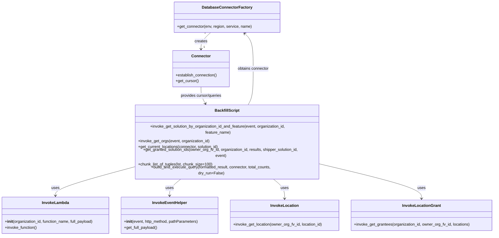

# Diagram: partview_core/partview_service/scripts/BackfillCurrentLocationFilter.py


> Auto-generated by Obscura crawlers

## Diagram 1



### SVG

<svg id="container" width="2050.5390625" xmlns="http://www.w3.org/2000/svg" class="classDiagram" height="910" viewBox="0 0 2050.5390625 910" role="graphics-document document" aria-roledescription="class"><style>#container{font-family:"trebuchet ms",verdana,arial,sans-serif;font-size:16px;fill:#333;}@keyframes edge-animation-frame{from{stroke-dashoffset:0;}}@keyframes dash{to{stroke-dashoffset:0;}}#container .edge-animation-slow{stroke-dasharray:9,5!important;stroke-dashoffset:900;animation:dash 50s linear infinite;stroke-linecap:round;}#container .edge-animation-fast{stroke-dasharray:9,5!important;stroke-dashoffset:900;animation:dash 20s linear infinite;stroke-linecap:round;}#container .error-icon{fill:#552222;}#container .error-text{fill:#552222;stroke:#552222;}#container .edge-thickness-normal{stroke-width:1px;}#container .edge-thickness-thick{stroke-width:3.5px;}#container .edge-pattern-solid{stroke-dasharray:0;}#container .edge-thickness-invisible{stroke-width:0;fill:none;}#container .edge-pattern-dashed{stroke-dasharray:3;}#container .edge-pattern-dotted{stroke-dasharray:2;}#container .marker{fill:#333333;stroke:#333333;}#container .marker.cross{stroke:#333333;}#container svg{font-family:"trebuchet ms",verdana,arial,sans-serif;font-size:16px;}#container p{margin:0;}#container g.classGroup text{fill:#9370DB;stroke:none;font-family:"trebuchet ms",verdana,arial,sans-serif;font-size:10px;}#container g.classGroup text .title{font-weight:bolder;}#container .nodeLabel,#container .edgeLabel{color:#131300;}#container .edgeLabel .label rect{fill:#ECECFF;}#container .label text{fill:#131300;}#container .labelBkg{background:#ECECFF;}#container .edgeLabel .label span{background:#ECECFF;}#container .classTitle{font-weight:bolder;}#container .node rect,#container .node circle,#container .node ellipse,#container .node polygon,#container .node path{fill:#ECECFF;stroke:#9370DB;stroke-width:1px;}#container .divider{stroke:#9370DB;stroke-width:1;}#container g.clickable{cursor:pointer;}#container g.classGroup rect{fill:#ECECFF;stroke:#9370DB;}#container g.classGroup line{stroke:#9370DB;stroke-width:1;}#container .classLabel .box{stroke:none;stroke-width:0;fill:#ECECFF;opacity:0.5;}#container .classLabel .label{fill:#9370DB;font-size:10px;}#container .relation{stroke:#333333;stroke-width:1;fill:none;}#container .dashed-line{stroke-dasharray:3;}#container .dotted-line{stroke-dasharray:1 2;}#container #compositionStart,#container .composition{fill:#333333!important;stroke:#333333!important;stroke-width:1;}#container #compositionEnd,#container .composition{fill:#333333!important;stroke:#333333!important;stroke-width:1;}#container #dependencyStart,#container .dependency{fill:#333333!important;stroke:#333333!important;stroke-width:1;}#container #dependencyStart,#container .dependency{fill:#333333!important;stroke:#333333!important;stroke-width:1;}#container #extensionStart,#container .extension{fill:transparent!important;stroke:#333333!important;stroke-width:1;}#container #extensionEnd,#container .extension{fill:transparent!important;stroke:#333333!important;stroke-width:1;}#container #aggregationStart,#container .aggregation{fill:transparent!important;stroke:#333333!important;stroke-width:1;}#container #aggregationEnd,#container .aggregation{fill:transparent!important;stroke:#333333!important;stroke-width:1;}#container #lollipopStart,#container .lollipop{fill:#ECECFF!important;stroke:#333333!important;stroke-width:1;}#container #lollipopEnd,#container .lollipop{fill:#ECECFF!important;stroke:#333333!important;stroke-width:1;}#container .edgeTerminals{font-size:11px;line-height:initial;}#container .classTitleText{text-anchor:middle;font-size:18px;fill:#333;}#container .label-icon{display:inline-block;height:1em;overflow:visible;vertical-align:-0.125em;}#container .node .label-icon path{fill:currentColor;stroke:revert;stroke-width:revert;}#container :root{--mermaid-font-family:"trebuchet ms",verdana,arial,sans-serif;}</style><g><defs><marker id="container_class-aggregationStart" class="marker aggregation class" refX="18" refY="7" markerWidth="190" markerHeight="240" orient="auto"><path d="M 18,7 L9,13 L1,7 L9,1 Z"></path></marker></defs><defs><marker id="container_class-aggregationEnd" class="marker aggregation class" refX="1" refY="7" markerWidth="20" markerHeight="28" orient="auto"><path d="M 18,7 L9,13 L1,7 L9,1 Z"></path></marker></defs><defs><marker id="container_class-extensionStart" class="marker extension class" refX="18" refY="7" markerWidth="190" markerHeight="240" orient="auto"><path d="M 1,7 L18,13 V 1 Z"></path></marker></defs><defs><marker id="container_class-extensionEnd" class="marker extension class" refX="1" refY="7" markerWidth="20" markerHeight="28" orient="auto"><path d="M 1,1 V 13 L18,7 Z"></path></marker></defs><defs><marker id="container_class-compositionStart" class="marker composition class" refX="18" refY="7" markerWidth="190" markerHeight="240" orient="auto"><path d="M 18,7 L9,13 L1,7 L9,1 Z"></path></marker></defs><defs><marker id="container_class-compositionEnd" class="marker composition class" refX="1" refY="7" markerWidth="20" markerHeight="28" orient="auto"><path d="M 18,7 L9,13 L1,7 L9,1 Z"></path></marker></defs><defs><marker id="container_class-dependencyStart" class="marker dependency class" refX="6" refY="7" markerWidth="190" markerHeight="240" orient="auto"><path d="M 5,7 L9,13 L1,7 L9,1 Z"></path></marker></defs><defs><marker id="container_class-dependencyEnd" class="marker dependency class" refX="13" refY="7" markerWidth="20" markerHeight="28" orient="auto"><path d="M 18,7 L9,13 L14,7 L9,1 Z"></path></marker></defs><defs><marker id="container_class-lollipopStart" class="marker lollipop class" refX="13" refY="7" markerWidth="190" markerHeight="240" orient="auto"><circle stroke="black" fill="transparent" cx="7" cy="7" r="6"></circle></marker></defs><defs><marker id="container_class-lollipopEnd" class="marker lollipop class" refX="1" refY="7" markerWidth="190" markerHeight="240" orient="auto"><circle stroke="black" fill="transparent" cx="7" cy="7" r="6"></circle></marker></defs><g class="root"><g class="clusters"></g><g class="edgePaths"><path d="M877.545,134L870.818,140.167C864.09,146.333,850.636,158.667,843.909,170C837.182,181.333,837.182,191.667,837.182,196.833L837.182,202" id="id_DatabaseConnectorFactory_Connector_1" class="edge-thickness-normal edge-pattern-solid relation" style=";;;" data-edge="true" data-et="edge" data-id="id_DatabaseConnectorFactory_Connector_1" data-points="W3sieCI6ODc3LjU0NDg4MjgxMjUsInkiOjEzNH0seyJ4Ijo4MzcuMTgxNjQwNjI1LCJ5IjoxNzF9LHsieCI6ODM3LjE4MTY0MDYyNSwieSI6MjA4fV0=" marker-end="url(#container_class-dependencyEnd)"></path><path d="M559.377,641.708L504.871,653.923C450.366,666.139,341.355,690.569,286.849,707.951C232.344,725.333,232.344,735.667,232.344,740.833L232.344,746" id="id_BackfillScript_InvokeLambda_2" class="edge-thickness-normal edge-pattern-solid relation" style=";;;" data-edge="true" data-et="edge" data-id="id_BackfillScript_InvokeLambda_2" data-points="W3sieCI6NTU5LjM3Njk1MzEyNSwieSI6NjQxLjcwNzgzMDUyNjAwMTl9LHsieCI6MjMyLjM0Mzc1LCJ5Ijo3MTV9LHsieCI6MjMyLjM0Mzc1LCJ5Ijo3NTJ9XQ==" marker-end="url(#container_class-dependencyEnd)"></path><path d="M762.899,678L753.706,684.167C744.512,690.333,726.125,702.667,716.932,714C707.738,725.333,707.738,735.667,707.738,740.833L707.738,746" id="id_BackfillScript_InvokeEventHelper_3" class="edge-thickness-normal edge-pattern-solid relation" style=";;;" data-edge="true" data-et="edge" data-id="id_BackfillScript_InvokeEventHelper_3" data-points="W3sieCI6NzYyLjg5OTA4NDQ3MjY1NjIsInkiOjY3OH0seyJ4Ijo3MDcuNzM4MjgxMjUsInkiOjcxNX0seyJ4Ijo3MDcuNzM4MjgxMjUsInkiOjc1Mn1d" marker-end="url(#container_class-dependencyEnd)"></path><path d="M1129.644,678L1138.837,684.167C1148.031,690.333,1166.418,702.667,1175.611,716C1184.805,729.333,1184.805,743.667,1184.805,750.833L1184.805,758" id="id_BackfillScript_InvokeLocation_4" class="edge-thickness-normal edge-pattern-solid relation" style=";;;" data-edge="true" data-et="edge" data-id="id_BackfillScript_InvokeLocation_4" data-points="W3sieCI6MTEyOS42NDM4ODQyNzczNDM3LCJ5Ijo2Nzh9LHsieCI6MTE4NC44MDQ2ODc1LCJ5Ijo3MTV9LHsieCI6MTE4NC44MDQ2ODc1LCJ5Ijo3NjR9XQ==" marker-end="url(#container_class-dependencyEnd)"></path><path d="M1333.166,631.859L1402.918,645.716C1472.671,659.573,1612.175,687.286,1681.927,708.31C1751.68,729.333,1751.68,743.667,1751.68,750.833L1751.68,758" id="id_BackfillScript_InvokeLocationGrant_5" class="edge-thickness-normal edge-pattern-solid relation" style=";;;" data-edge="true" data-et="edge" data-id="id_BackfillScript_InvokeLocationGrant_5" data-points="W3sieCI6MTMzMy4xNjYwMTU2MjUsInkiOjYzMS44NTkzMTc3NDY5NjkzfSx7IngiOjE3NTEuNjc5Njg3NSwieSI6NzE1fSx7IngiOjE3NTEuNjc5Njg3NSwieSI6NzY0fV0=" marker-end="url(#container_class-dependencyEnd)"></path><path d="M1030.134,432L1034.339,425.833C1038.543,419.667,1046.952,407.333,1051.157,382.5C1055.361,357.667,1055.361,320.333,1055.361,283C1055.361,245.667,1055.361,208.333,1049.371,184.176C1043.381,160.018,1031.401,149.036,1025.411,143.545L1019.421,138.054" id="id_BackfillScript_DatabaseConnectorFactory_6" class="edge-thickness-normal edge-pattern-solid relation" style=";;;" data-edge="true" data-et="edge" data-id="id_BackfillScript_DatabaseConnectorFactory_6" data-points="W3sieCI6MTAzMC4xMzQzMDE3NTc4MTI0LCJ5Ijo0MzJ9LHsieCI6MTA1NS4zNjEzMjgxMjUsInkiOjM5NX0seyJ4IjoxMDU1LjM2MTMyODEyNSwieSI6MjgzfSx7IngiOjEwNTUuMzYxMzI4MTI1LCJ5IjoxNzF9LHsieCI6MTAxNC45OTgwODU5Mzc1LCJ5IjoxMzR9XQ==" marker-end="url(#container_class-dependencyEnd)"></path><path d="M837.182,358L837.182,364.167C837.182,370.333,837.182,382.667,840.823,394.174C844.464,405.681,851.746,416.362,855.387,421.702L859.029,427.043" id="id_Connector_BackfillScript_7" class="edge-thickness-normal edge-pattern-solid relation" style=";;;" data-edge="true" data-et="edge" data-id="id_Connector_BackfillScript_7" data-points="W3sieCI6ODM3LjE4MTY0MDYyNSwieSI6MzU4fSx7IngiOjgzNy4xODE2NDA2MjUsInkiOjM5NX0seyJ4Ijo4NjIuNDA4NjY2OTkyMTg3NSwieSI6NDMyfV0=" marker-end="url(#container_class-dependencyEnd)"></path></g><g class="edgeLabels"><g class="edgeLabel" transform="translate(837.181640625, 171)"><g class="label" data-id="id_DatabaseConnectorFactory_Connector_1" transform="translate(-26.171875, -12)"><foreignObject width="52.34375" height="24"><div xmlns="http://www.w3.org/1999/xhtml" class="labelBkg" style="display: table-cell; white-space: nowrap; line-height: 1.5; max-width: 200px; text-align: center;"><span class="edgeLabel"><p>creates</p></span></div></foreignObject></g></g><g class="edgeLabel" transform="translate(232.34375, 715)"><g class="label" data-id="id_BackfillScript_InvokeLambda_2" transform="translate(-16.4921875, -12)"><foreignObject width="32.984375" height="24"><div xmlns="http://www.w3.org/1999/xhtml" class="labelBkg" style="display: table-cell; white-space: nowrap; line-height: 1.5; max-width: 200px; text-align: center;"><span class="edgeLabel"><p>uses</p></span></div></foreignObject></g></g><g class="edgeLabel" transform="translate(707.73828125, 715)"><g class="label" data-id="id_BackfillScript_InvokeEventHelper_3" transform="translate(-16.4921875, -12)"><foreignObject width="32.984375" height="24"><div xmlns="http://www.w3.org/1999/xhtml" class="labelBkg" style="display: table-cell; white-space: nowrap; line-height: 1.5; max-width: 200px; text-align: center;"><span class="edgeLabel"><p>uses</p></span></div></foreignObject></g></g><g class="edgeLabel" transform="translate(1184.8046875, 715)"><g class="label" data-id="id_BackfillScript_InvokeLocation_4" transform="translate(-16.4921875, -12)"><foreignObject width="32.984375" height="24"><div xmlns="http://www.w3.org/1999/xhtml" class="labelBkg" style="display: table-cell; white-space: nowrap; line-height: 1.5; max-width: 200px; text-align: center;"><span class="edgeLabel"><p>uses</p></span></div></foreignObject></g></g><g class="edgeLabel" transform="translate(1751.6796875, 715)"><g class="label" data-id="id_BackfillScript_InvokeLocationGrant_5" transform="translate(-16.4921875, -12)"><foreignObject width="32.984375" height="24"><div xmlns="http://www.w3.org/1999/xhtml" class="labelBkg" style="display: table-cell; white-space: nowrap; line-height: 1.5; max-width: 200px; text-align: center;"><span class="edgeLabel"><p>uses</p></span></div></foreignObject></g></g><g class="edgeLabel" transform="translate(1055.361328125, 283)"><g class="label" data-id="id_BackfillScript_DatabaseConnectorFactory_6" transform="translate(-65.8359375, -12)"><foreignObject width="131.671875" height="24"><div xmlns="http://www.w3.org/1999/xhtml" class="labelBkg" style="display: table-cell; white-space: nowrap; line-height: 1.5; max-width: 200px; text-align: center;"><span class="edgeLabel"><p>obtains connector</p></span></div></foreignObject></g></g><g class="edgeLabel" transform="translate(837.181640625, 395)"><g class="label" data-id="id_Connector_BackfillScript_7" transform="translate(-86.8203125, -12)"><foreignObject width="173.640625" height="24"><div xmlns="http://www.w3.org/1999/xhtml" class="labelBkg" style="display: table-cell; white-space: nowrap; line-height: 1.5; max-width: 200px; text-align: center;"><span class="edgeLabel"><p>provides cursor/queries</p></span></div></foreignObject></g></g><g class="edgeTerminals" transform="translate(854.5088182393971, 134.76798215806417)"><g class="inner" transform="translate(0, 0)"><foreignObject style="width: 9px; height: 12px;"><div xmlns="http://www.w3.org/1999/xhtml" style="display: inline-block; padding-right: 1px; white-space: nowrap;"><span class="edgeLabel">1</span></div></foreignObject></g></g><g class="edgeTerminals" transform="translate(847.1816403125, 185.49999973214287)"><g class="inner" transform="translate(0, 0)"></g><foreignObject style="width: 9px; height: 12px;"><div xmlns="http://www.w3.org/1999/xhtml" style="display: inline-block; padding-right: 1px; white-space: nowrap;"><span class="edgeLabel">1</span></div></foreignObject></g></g><g class="nodes"><g class="node default" id="classId-DatabaseConnectorFactory-0" transform="translate(946.271484375, 71)"><g class="basic label-container"><path d="M-215.265625 -63 L215.265625 -63 L215.265625 63 L-215.265625 63" stroke="none" stroke-width="0" fill="#ECECFF" style=""></path><path d="M-215.265625 -63 C-57.27406186843314 -63, 100.71750126313373 -63, 215.265625 -63 M-215.265625 -63 C-123.97063865977135 -63, -32.675652319542706 -63, 215.265625 -63 M215.265625 -63 C215.265625 -32.2845502932546, 215.265625 -1.5691005865091938, 215.265625 63 M215.265625 -63 C215.265625 -13.649774385640661, 215.265625 35.70045122871868, 215.265625 63 M215.265625 63 C109.70633814362117 63, 4.147051287242334 63, -215.265625 63 M215.265625 63 C53.77096727631121 63, -107.72369044737758 63, -215.265625 63 M-215.265625 63 C-215.265625 30.120686046859362, -215.265625 -2.7586279062812764, -215.265625 -63 M-215.265625 63 C-215.265625 30.885698254378042, -215.265625 -1.2286034912439163, -215.265625 -63" stroke="#9370DB" stroke-width="1.3" fill="none" stroke-dasharray="0 0" style=""></path></g><g class="annotation-group text" transform="translate(0, -39)"></g><g class="label-group text" transform="translate(-98.1875, -39)"><g class="label" style="font-weight: bolder" transform="translate(0,-12)"><foreignObject width="196.375" height="24"><div xmlns="http://www.w3.org/1999/xhtml" style="display: table-cell; white-space: nowrap; line-height: 1.5; max-width: 244px; text-align: center;"><span class="nodeLabel markdown-node-label" style=""><p>DatabaseConnectorFactory</p></span></div></foreignObject></g></g><g class="members-group text" transform="translate(-203.265625, 9)"></g><g class="methods-group text" transform="translate(-203.265625, 39)"><g class="label" style="" transform="translate(0,-12)"><foreignObject width="308.34375" height="24"><div xmlns="http://www.w3.org/1999/xhtml" style="display: table-cell; white-space: nowrap; line-height: 1.5; max-width: 366px; text-align: center;"><span class="nodeLabel markdown-node-label" style=""><p>+get_connector(env, region, service, name)</p></span></div></foreignObject></g></g><g class="divider" style=""><path d="M-215.265625 -15 C-113.20694315108165 -15, -11.148261302163291 -15, 215.265625 -15 M-215.265625 -15 C-79.47981295741661 -15, 56.305999085166775 -15, 215.265625 -15" stroke="#9370DB" stroke-width="1.3" fill="none" stroke-dasharray="0 0" style=""></path></g><g class="divider" style=""><path d="M-215.265625 9 C-114.82679046908896 9, -14.387955938177925 9, 215.265625 9 M-215.265625 9 C-49.72366202313435 9, 115.8183009537313 9, 215.265625 9" stroke="#9370DB" stroke-width="1.3" fill="none" stroke-dasharray="0 0" style=""></path></g></g><g class="node default" id="classId-Connector-1" transform="translate(837.181640625, 283)"><g class="basic label-container"><path d="M-117.34375 -75 L117.34375 -75 L117.34375 75 L-117.34375 75" stroke="none" stroke-width="0" fill="#ECECFF" style=""></path><path d="M-117.34375 -75 C-35.28311176532456 -75, 46.777526469350875 -75, 117.34375 -75 M-117.34375 -75 C-43.28473664243555 -75, 30.774276715128906 -75, 117.34375 -75 M117.34375 -75 C117.34375 -20.78375561603896, 117.34375 33.43248876792208, 117.34375 75 M117.34375 -75 C117.34375 -37.946093182595845, 117.34375 -0.8921863651916908, 117.34375 75 M117.34375 75 C31.14565404898636 75, -55.05244190202728 75, -117.34375 75 M117.34375 75 C66.362847173119 75, 15.381944346237987 75, -117.34375 75 M-117.34375 75 C-117.34375 16.31830320192497, -117.34375 -42.36339359615006, -117.34375 -75 M-117.34375 75 C-117.34375 32.6673432126436, -117.34375 -9.665313574712798, -117.34375 -75" stroke="#9370DB" stroke-width="1.3" fill="none" stroke-dasharray="0 0" style=""></path></g><g class="annotation-group text" transform="translate(0, -51)"></g><g class="label-group text" transform="translate(-37.421875, -51)"><g class="label" style="font-weight: bolder" transform="translate(0,-12)"><foreignObject width="74.84375" height="24"><div xmlns="http://www.w3.org/1999/xhtml" style="display: table-cell; white-space: nowrap; line-height: 1.5; max-width: 125px; text-align: center;"><span class="nodeLabel markdown-node-label" style=""><p>Connector</p></span></div></foreignObject></g></g><g class="members-group text" transform="translate(-105.34375, -3)"></g><g class="methods-group text" transform="translate(-105.34375, 27)"><g class="label" style="" transform="translate(0,-12)"><foreignObject width="173.265625" height="24"><div xmlns="http://www.w3.org/1999/xhtml" style="display: table-cell; white-space: nowrap; line-height: 1.5; max-width: 231px; text-align: center;"><span class="nodeLabel markdown-node-label" style=""><p>+establish_connection()</p></span></div></foreignObject></g><g class="label" style="" transform="translate(0,12)"><foreignObject width="94.640625" height="24"><div xmlns="http://www.w3.org/1999/xhtml" style="display: table-cell; white-space: nowrap; line-height: 1.5; max-width: 152px; text-align: center;"><span class="nodeLabel markdown-node-label" style=""><p>+get_cursor()</p></span></div></foreignObject></g></g><g class="divider" style=""><path d="M-117.34375 -27 C-56.00351755772283 -27, 5.33671488455434 -27, 117.34375 -27 M-117.34375 -27 C-25.004967182155255 -27, 67.33381563568949 -27, 117.34375 -27" stroke="#9370DB" stroke-width="1.3" fill="none" stroke-dasharray="0 0" style=""></path></g><g class="divider" style=""><path d="M-117.34375 -3 C-48.59313687157396 -3, 20.157476256852078 -3, 117.34375 -3 M-117.34375 -3 C-66.03408312389257 -3, -14.724416247785143 -3, 117.34375 -3" stroke="#9370DB" stroke-width="1.3" fill="none" stroke-dasharray="0 0" style=""></path></g></g><g class="node default" id="classId-InvokeLambda-2" transform="translate(232.34375, 827)"><g class="basic label-container"><path d="M-224.34375 -75 L224.34375 -75 L224.34375 75 L-224.34375 75" stroke="none" stroke-width="0" fill="#ECECFF" style=""></path><path d="M-224.34375 -75 C-115.47470796748208 -75, -6.605665934964151 -75, 224.34375 -75 M-224.34375 -75 C-99.104958933804 -75, 26.133832132392 -75, 224.34375 -75 M224.34375 -75 C224.34375 -44.226327576502555, 224.34375 -13.45265515300511, 224.34375 75 M224.34375 -75 C224.34375 -41.29531259767431, 224.34375 -7.590625195348622, 224.34375 75 M224.34375 75 C46.44595772961546 75, -131.45183454076908 75, -224.34375 75 M224.34375 75 C59.346149244786034 75, -105.65145151042793 75, -224.34375 75 M-224.34375 75 C-224.34375 36.90531169391425, -224.34375 -1.1893766121715004, -224.34375 -75 M-224.34375 75 C-224.34375 15.193886455361053, -224.34375 -44.612227089277894, -224.34375 -75" stroke="#9370DB" stroke-width="1.3" fill="none" stroke-dasharray="0 0" style=""></path></g><g class="annotation-group text" transform="translate(0, -51)"></g><g class="label-group text" transform="translate(-53.484375, -51)"><g class="label" style="font-weight: bolder" transform="translate(0,-12)"><foreignObject width="106.96875" height="24"><div xmlns="http://www.w3.org/1999/xhtml" style="display: table-cell; white-space: nowrap; line-height: 1.5; max-width: 156px; text-align: center;"><span class="nodeLabel markdown-node-label" style=""><p>InvokeLambda</p></span></div></foreignObject></g></g><g class="members-group text" transform="translate(-212.34375, -3)"></g><g class="methods-group text" transform="translate(-212.34375, 27)"><g class="label" style="" transform="translate(0,-12)"><foreignObject width="371.203125" height="24"><div xmlns="http://www.w3.org/1999/xhtml" style="display: table-cell; white-space: nowrap; line-height: 1.5; max-width: 460px; text-align: center;"><span class="nodeLabel markdown-node-label" style=""><p>+<strong>init</strong>(organization_id, function_name, full_payload)</p></span></div></foreignObject></g><g class="label" style="" transform="translate(0,12)"><foreignObject width="134.4375" height="24"><div xmlns="http://www.w3.org/1999/xhtml" style="display: table-cell; white-space: nowrap; line-height: 1.5; max-width: 192px; text-align: center;"><span class="nodeLabel markdown-node-label" style=""><p>+invoke_function()</p></span></div></foreignObject></g></g><g class="divider" style=""><path d="M-224.34375 -27 C-70.70204288732612 -27, 82.93966422534777 -27, 224.34375 -27 M-224.34375 -27 C-99.5539542749015 -27, 25.235841450197 -27, 224.34375 -27" stroke="#9370DB" stroke-width="1.3" fill="none" stroke-dasharray="0 0" style=""></path></g><g class="divider" style=""><path d="M-224.34375 -3 C-54.90202081110135 -3, 114.5397083777973 -3, 224.34375 -3 M-224.34375 -3 C-49.31199505159995 -3, 125.7197598968001 -3, 224.34375 -3" stroke="#9370DB" stroke-width="1.3" fill="none" stroke-dasharray="0 0" style=""></path></g></g><g class="node default" id="classId-InvokeEventHelper-3" transform="translate(707.73828125, 827)"><g class="basic label-container"><path d="M-201.05078125 -75 L201.05078125 -75 L201.05078125 75 L-201.05078125 75" stroke="none" stroke-width="0" fill="#ECECFF" style=""></path><path d="M-201.05078125 -75 C-116.8769700093207 -75, -32.7031587686414 -75, 201.05078125 -75 M-201.05078125 -75 C-83.15131041924735 -75, 34.748160411505296 -75, 201.05078125 -75 M201.05078125 -75 C201.05078125 -22.66611326987998, 201.05078125 29.667773460240042, 201.05078125 75 M201.05078125 -75 C201.05078125 -28.657567189086393, 201.05078125 17.684865621827214, 201.05078125 75 M201.05078125 75 C89.55121274089868 75, -21.948355768202646 75, -201.05078125 75 M201.05078125 75 C78.13159998912371 75, -44.78758127175257 75, -201.05078125 75 M-201.05078125 75 C-201.05078125 35.96554255642885, -201.05078125 -3.0689148871422987, -201.05078125 -75 M-201.05078125 75 C-201.05078125 17.820433871424633, -201.05078125 -39.35913225715073, -201.05078125 -75" stroke="#9370DB" stroke-width="1.3" fill="none" stroke-dasharray="0 0" style=""></path></g><g class="annotation-group text" transform="translate(0, -51)"></g><g class="label-group text" transform="translate(-69.0859375, -51)"><g class="label" style="font-weight: bolder" transform="translate(0,-12)"><foreignObject width="138.171875" height="24"><div xmlns="http://www.w3.org/1999/xhtml" style="display: table-cell; white-space: nowrap; line-height: 1.5; max-width: 187px; text-align: center;"><span class="nodeLabel markdown-node-label" style=""><p>InvokeEventHelper</p></span></div></foreignObject></g></g><g class="members-group text" transform="translate(-189.05078125, -3)"></g><g class="methods-group text" transform="translate(-189.05078125, 27)"><g class="label" style="" transform="translate(0,-12)"><foreignObject width="309.015625" height="24"><div xmlns="http://www.w3.org/1999/xhtml" style="display: table-cell; white-space: nowrap; line-height: 1.5; max-width: 398px; text-align: center;"><span class="nodeLabel markdown-node-label" style=""><p>+<strong>init</strong>(event, http_method, pathParameters)</p></span></div></foreignObject></g><g class="label" style="" transform="translate(0,12)"><foreignObject width="139.03125" height="24"><div xmlns="http://www.w3.org/1999/xhtml" style="display: table-cell; white-space: nowrap; line-height: 1.5; max-width: 196px; text-align: center;"><span class="nodeLabel markdown-node-label" style=""><p>+get_full_payload()</p></span></div></foreignObject></g></g><g class="divider" style=""><path d="M-201.05078125 -27 C-106.3475760354262 -27, -11.644370820852401 -27, 201.05078125 -27 M-201.05078125 -27 C-72.53933352444747 -27, 55.97211420110506 -27, 201.05078125 -27" stroke="#9370DB" stroke-width="1.3" fill="none" stroke-dasharray="0 0" style=""></path></g><g class="divider" style=""><path d="M-201.05078125 -3 C-60.47731765338605 -3, 80.0961459432279 -3, 201.05078125 -3 M-201.05078125 -3 C-106.60649936029675 -3, -12.162217470593504 -3, 201.05078125 -3" stroke="#9370DB" stroke-width="1.3" fill="none" stroke-dasharray="0 0" style=""></path></g></g><g class="node default" id="classId-InvokeLocation-4" transform="translate(1184.8046875, 827)"><g class="basic label-container"><path d="M-226.015625 -63 L226.015625 -63 L226.015625 63 L-226.015625 63" stroke="none" stroke-width="0" fill="#ECECFF" style=""></path><path d="M-226.015625 -63 C-74.05330930714129 -63, 77.90900638571742 -63, 226.015625 -63 M-226.015625 -63 C-119.27060816206678 -63, -12.525591324133558 -63, 226.015625 -63 M226.015625 -63 C226.015625 -27.493527095156594, 226.015625 8.012945809686812, 226.015625 63 M226.015625 -63 C226.015625 -15.374691659922298, 226.015625 32.2506166801554, 226.015625 63 M226.015625 63 C116.41602305886651 63, 6.816421117733029 63, -226.015625 63 M226.015625 63 C92.99577878351869 63, -40.024067432962624 63, -226.015625 63 M-226.015625 63 C-226.015625 29.42307293933934, -226.015625 -4.1538541213213165, -226.015625 -63 M-226.015625 63 C-226.015625 27.73718814767954, -226.015625 -7.525623704640921, -226.015625 -63" stroke="#9370DB" stroke-width="1.3" fill="none" stroke-dasharray="0 0" style=""></path></g><g class="annotation-group text" transform="translate(0, -39)"></g><g class="label-group text" transform="translate(-55.703125, -39)"><g class="label" style="font-weight: bolder" transform="translate(0,-12)"><foreignObject width="111.40625" height="24"><div xmlns="http://www.w3.org/1999/xhtml" style="display: table-cell; white-space: nowrap; line-height: 1.5; max-width: 160px; text-align: center;"><span class="nodeLabel markdown-node-label" style=""><p>InvokeLocation</p></span></div></foreignObject></g></g><g class="members-group text" transform="translate(-214.015625, 9)"></g><g class="methods-group text" transform="translate(-214.015625, 39)"><g class="label" style="" transform="translate(0,-12)"><foreignObject width="372.328125" height="24"><div xmlns="http://www.w3.org/1999/xhtml" style="display: table-cell; white-space: nowrap; line-height: 1.5; max-width: 430px; text-align: center;"><span class="nodeLabel markdown-node-label" style=""><p>+invoke_get_location(owner_org_fv_id, location_id)</p></span></div></foreignObject></g></g><g class="divider" style=""><path d="M-226.015625 -15 C-71.39342800298573 -15, 83.22876899402854 -15, 226.015625 -15 M-226.015625 -15 C-92.47954168053047 -15, 41.05654163893905 -15, 226.015625 -15" stroke="#9370DB" stroke-width="1.3" fill="none" stroke-dasharray="0 0" style=""></path></g><g class="divider" style=""><path d="M-226.015625 9 C-86.52816566276934 9, 52.95929367446132 9, 226.015625 9 M-226.015625 9 C-71.54505071495285 9, 82.9255235700943 9, 226.015625 9" stroke="#9370DB" stroke-width="1.3" fill="none" stroke-dasharray="0 0" style=""></path></g></g><g class="node default" id="classId-InvokeLocationGrant-5" transform="translate(1751.6796875, 827)"><g class="basic label-container"><path d="M-290.859375 -63 L290.859375 -63 L290.859375 63 L-290.859375 63" stroke="none" stroke-width="0" fill="#ECECFF" style=""></path><path d="M-290.859375 -63 C-114.79384670710562 -63, 61.27168158578877 -63, 290.859375 -63 M-290.859375 -63 C-138.70011171878443 -63, 13.459151562431146 -63, 290.859375 -63 M290.859375 -63 C290.859375 -17.701983166190956, 290.859375 27.596033667618087, 290.859375 63 M290.859375 -63 C290.859375 -33.41575916674195, 290.859375 -3.831518333483892, 290.859375 63 M290.859375 63 C148.13190279063267 63, 5.404430581265331 63, -290.859375 63 M290.859375 63 C94.89837065491076 63, -101.06263369017847 63, -290.859375 63 M-290.859375 63 C-290.859375 14.734212251734839, -290.859375 -33.53157549653032, -290.859375 -63 M-290.859375 63 C-290.859375 22.214409507872325, -290.859375 -18.57118098425535, -290.859375 -63" stroke="#9370DB" stroke-width="1.3" fill="none" stroke-dasharray="0 0" style=""></path></g><g class="annotation-group text" transform="translate(0, -39)"></g><g class="label-group text" transform="translate(-75.875, -39)"><g class="label" style="font-weight: bolder" transform="translate(0,-12)"><foreignObject width="151.75" height="24"><div xmlns="http://www.w3.org/1999/xhtml" style="display: table-cell; white-space: nowrap; line-height: 1.5; max-width: 200px; text-align: center;"><span class="nodeLabel markdown-node-label" style=""><p>InvokeLocationGrant</p></span></div></foreignObject></g></g><g class="members-group text" transform="translate(-278.859375, 9)"></g><g class="methods-group text" transform="translate(-278.859375, 39)"><g class="label" style="" transform="translate(0,-12)"><foreignObject width="481.84375" height="24"><div xmlns="http://www.w3.org/1999/xhtml" style="display: table-cell; white-space: nowrap; line-height: 1.5; max-width: 539px; text-align: center;"><span class="nodeLabel markdown-node-label" style=""><p>+invoke_get_grantees(organization_id, owner_org_fv_id, locations)</p></span></div></foreignObject></g></g><g class="divider" style=""><path d="M-290.859375 -15 C-95.56031104125168 -15, 99.73875291749664 -15, 290.859375 -15 M-290.859375 -15 C-155.33382004207465 -15, -19.808265084149298 -15, 290.859375 -15" stroke="#9370DB" stroke-width="1.3" fill="none" stroke-dasharray="0 0" style=""></path></g><g class="divider" style=""><path d="M-290.859375 9 C-165.96561712769216 9, -41.07185925538434 9, 290.859375 9 M-290.859375 9 C-152.52453788939243 9, -14.189700778784868 9, 290.859375 9" stroke="#9370DB" stroke-width="1.3" fill="none" stroke-dasharray="0 0" style=""></path></g></g><g class="node default" id="classId-BackfillScript-6" transform="translate(946.271484375, 555)"><g class="basic label-container"><path d="M-386.89453125 -123 L386.89453125 -123 L386.89453125 123 L-386.89453125 123" stroke="none" stroke-width="0" fill="#ECECFF" style=""></path><path d="M-386.89453125 -123 C-113.79668082214147 -123, 159.30116960571706 -123, 386.89453125 -123 M-386.89453125 -123 C-203.80138196372758 -123, -20.708232677455157 -123, 386.89453125 -123 M386.89453125 -123 C386.89453125 -26.209248568019376, 386.89453125 70.58150286396125, 386.89453125 123 M386.89453125 -123 C386.89453125 -25.418241372213743, 386.89453125 72.16351725557251, 386.89453125 123 M386.89453125 123 C96.31562550535205 123, -194.2632802392959 123, -386.89453125 123 M386.89453125 123 C167.61128694116056 123, -51.671957367678885 123, -386.89453125 123 M-386.89453125 123 C-386.89453125 48.99910159083551, -386.89453125 -25.001796818328984, -386.89453125 -123 M-386.89453125 123 C-386.89453125 54.82360377947518, -386.89453125 -13.352792441049644, -386.89453125 -123" stroke="#9370DB" stroke-width="1.3" fill="none" stroke-dasharray="0 0" style=""></path></g><g class="annotation-group text" transform="translate(0, -99)"></g><g class="label-group text" transform="translate(-48.8515625, -99)"><g class="label" style="font-weight: bolder" transform="translate(0,-12)"><foreignObject width="97.703125" height="24"><div xmlns="http://www.w3.org/1999/xhtml" style="display: table-cell; white-space: nowrap; line-height: 1.5; max-width: 145px; text-align: center;"><span class="nodeLabel markdown-node-label" style=""><p>BackfillScript</p></span></div></foreignObject></g></g><g class="members-group text" transform="translate(-374.89453125, -51)"></g><g class="methods-group text" transform="translate(-374.89453125, -21)"><g class="label" style="" transform="translate(0,-12)"><foreignObject width="676.21875" height="24"><div xmlns="http://www.w3.org/1999/xhtml" style="display: table-cell; white-space: nowrap; line-height: 1.5; max-width: 734px; text-align: center;"><span class="nodeLabel markdown-node-label" style=""><p>+invoke_get_solution_by_organization_id_and_feature(event, organization_id, feature_name)</p></span></div></foreignObject></g><g class="label" style="" transform="translate(0,12)"><foreignObject width="296.953125" height="24"><div xmlns="http://www.w3.org/1999/xhtml" style="display: table-cell; white-space: nowrap; line-height: 1.5; max-width: 354px; text-align: center;"><span class="nodeLabel markdown-node-label" style=""><p>+invoke_get_orgs(event, organization_id)</p></span></div></foreignObject></g><g class="label" style="" transform="translate(0,36)"><foreignObject width="338.125" height="24"><div xmlns="http://www.w3.org/1999/xhtml" style="display: table-cell; white-space: nowrap; line-height: 1.5; max-width: 395px; text-align: center;"><span class="nodeLabel markdown-node-label" style=""><p>+get_current_locations(connector, solution_id)</p></span></div></foreignObject></g><g class="label" style="" transform="translate(0,60)"><foreignObject width="700.9375" height="24"><div xmlns="http://www.w3.org/1999/xhtml" style="display: table-cell; white-space: nowrap; line-height: 1.5; max-width: 758px; text-align: center;"><span class="nodeLabel markdown-node-label" style=""><p>+get_granted_solution_ids(owner_org_fv_id, organization_id, results, shipper_solution_id, event)</p></span></div></foreignObject></g><g class="label" style="" transform="translate(0,84)"><foreignObject width="306.84375" height="24"><div xmlns="http://www.w3.org/1999/xhtml" style="display: table-cell; white-space: nowrap; line-height: 1.5; max-width: 364px; text-align: center;"><span class="nodeLabel markdown-node-label" style=""><p>+chunk_list_of_tuples(lst, chunk_size=100)</p></span></div></foreignObject></g><g class="label" style="" transform="translate(0,108)"><foreignObject width="614.421875" height="24"><div xmlns="http://www.w3.org/1999/xhtml" style="display: table-cell; white-space: nowrap; line-height: 1.5; max-width: 672px; text-align: center;"><span class="nodeLabel markdown-node-label" style=""><p>+build_and_execute_query(formatted_result, connector, total_counts, dry_run=False)</p></span></div></foreignObject></g></g><g class="divider" style=""><path d="M-386.89453125 -75 C-207.95557715624327 -75, -29.01662306248653 -75, 386.89453125 -75 M-386.89453125 -75 C-79.56892102143831 -75, 227.75668920712337 -75, 386.89453125 -75" stroke="#9370DB" stroke-width="1.3" fill="none" stroke-dasharray="0 0" style=""></path></g><g class="divider" style=""><path d="M-386.89453125 -51 C-182.35199794538337 -51, 22.19053535923325 -51, 386.89453125 -51 M-386.89453125 -51 C-137.00310891005884 -51, 112.88831342988232 -51, 386.89453125 -51" stroke="#9370DB" stroke-width="1.3" fill="none" stroke-dasharray="0 0" style=""></path></g></g></g></g></g></svg>

## Diagram 2

```mermaid
flowchart TD
    A[Start: script args org_id, env, dry_run?] --> B{env valid?}
    B -- No --> Z[Log: invalid environment]
    B -- Yes --> C[Get connector from DatabaseConnectorFactory]
    C --> D[Build event payload]
    D --> E[invoke_get_orgs -> fv_org_id]
    D --> F[invoke_get_solution_by_organization_id_and_feature -> shipper_solution_id]
    C --> G[get_current_locations(connector, shipper_solution_id) -> results]
    GclassDiagram
    class DatabaseConnectorFactory {
        +get_connector(env, region, service, purpose)
    }
    class Connector {
        +establish_connection()
        +get_cursor()
    }
    class InvokeLambda {
        +invoke_function()
    }
    class InvokeEventHelper {
        +get_full_payload()
    }
    class InvokeLocation {
        +invoke_get_location(owner_org_fv_id, location)
    }
    class InvokeLocationGrant {
        +invoke_get_grantees(org_id, owner_org_fv_id, locations)
    }
    class BackfillScript {
        +invoke_get_solution_by_organization_id_and_feature(event, org_id, feature_name)
        +invoke_get_orgs(event, org_id)
        +get_current_locations(connector, solution_id)
        +get_granted_solution_ids(owner_org_fv_id, organization_id, results, shipper_solution_id, event)
        +chunk_list_of_tuples(lst, chunk_size)
        +build_and_execute_query(formatted_result, connector, total_counts, dry_run=False)
        +main(args)
    }
    DatabaseConnectorFactory --|> Connector : creates
    BackfillScript --> InvokeLambda : uses
    BackfillScript --> InvokeEventHelper : uses
    BackfillScript --> InvokeLocation : uses
    BackfillScript --> InvokeLocationGrant : uses
    BackfillScript --> DatabaseConnectorFactory : obtains connector
    Connector --> BackfillScript : provides cursor/connection
```

> SVG rendering failed for this diagram.

## Diagram 3

```mermaid
flowchart TD
    A[Start: CLI args(org_id, env, dry_run?)] --> B{env valid?}
    B -- No --> Z[Log: invalid environment; exit]
    B -- Yes --> C[DatabaseConnectorFactory.get_connector(...).get_primary()]
    C --> D[Build event payload]
    D --> E[invoke_get_orgs(event, organization_id)]
    D --> F[invoke_get_solution_by_organization_id_and_feature(event, organization_id, "PartView")]
    E --> G[fv_org_id]
    F --> H[shipper_solution_id]
    C & H --> I[get_current_locations(connector, shipper_solution_id)]
    I --> J[get_granted_solution_ids(fv_org_id, organization_id, results, shipper_solution_id, event)]
    J --> K[formatted_result list of (solution_id, filter_name, value, label)]
    K --> L[chunk_list_of_tuples(formatted_result, 100)]
    L --> M{dry_run?}
    M -- Yes --> N[Log DRY RUN items; do not insert]
    M -- No --> O[build_and_execute_query(chunked, connector, total_counts)]
    O --> P[Execute INSERT INTO public.filter_value_list ... ON CONFLICT DO NOTHING]
    N & P --> Q[Log completion]
    Q --> R[End]
```

> SVG rendering failed for this diagram.
