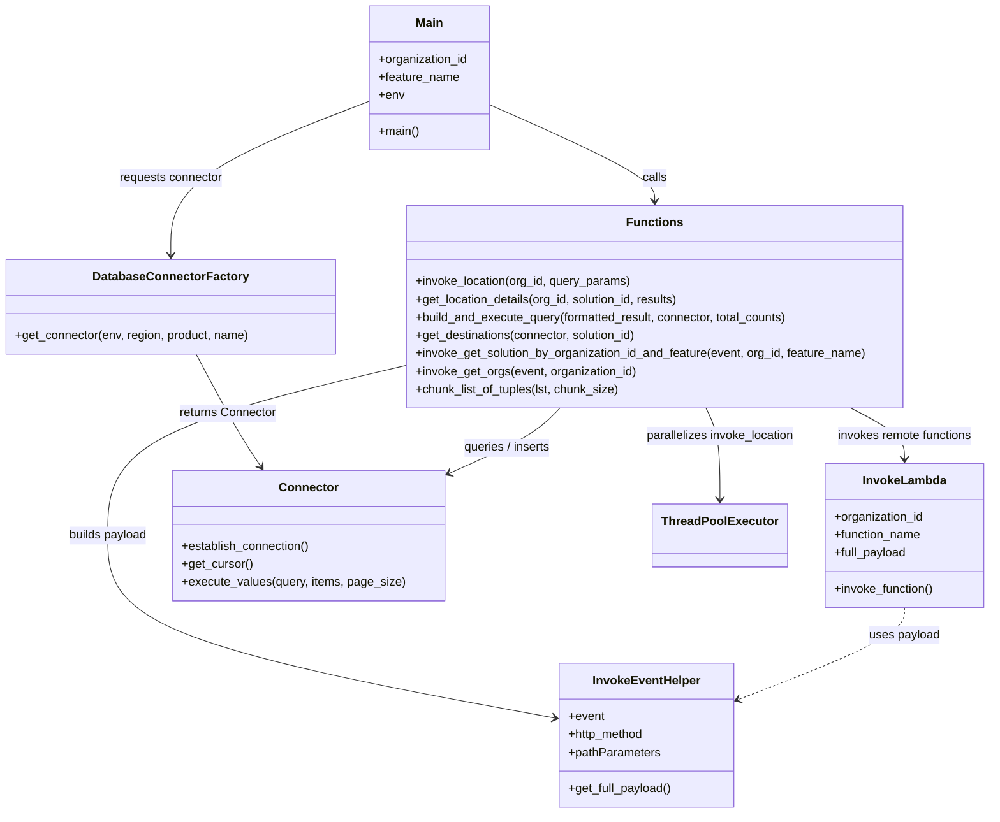

# Diagram: partview_core/partview_service/scripts/BackfillDestinationFilter.py


> Auto-generated by Obscura crawlers

## Diagram 1



### SVG

<svg id="container" width="1311.865234375" xmlns="http://www.w3.org/2000/svg" class="classDiagram" height="1108" viewBox="0 0 1311.865234375 1108" role="graphics-document document" aria-roledescription="class"><style>#container{font-family:"trebuchet ms",verdana,arial,sans-serif;font-size:16px;fill:#333;}@keyframes edge-animation-frame{from{stroke-dashoffset:0;}}@keyframes dash{to{stroke-dashoffset:0;}}#container .edge-animation-slow{stroke-dasharray:9,5!important;stroke-dashoffset:900;animation:dash 50s linear infinite;stroke-linecap:round;}#container .edge-animation-fast{stroke-dasharray:9,5!important;stroke-dashoffset:900;animation:dash 20s linear infinite;stroke-linecap:round;}#container .error-icon{fill:#552222;}#container .error-text{fill:#552222;stroke:#552222;}#container .edge-thickness-normal{stroke-width:1px;}#container .edge-thickness-thick{stroke-width:3.5px;}#container .edge-pattern-solid{stroke-dasharray:0;}#container .edge-thickness-invisible{stroke-width:0;fill:none;}#container .edge-pattern-dashed{stroke-dasharray:3;}#container .edge-pattern-dotted{stroke-dasharray:2;}#container .marker{fill:#333333;stroke:#333333;}#container .marker.cross{stroke:#333333;}#container svg{font-family:"trebuchet ms",verdana,arial,sans-serif;font-size:16px;}#container p{margin:0;}#container g.classGroup text{fill:#9370DB;stroke:none;font-family:"trebuchet ms",verdana,arial,sans-serif;font-size:10px;}#container g.classGroup text .title{font-weight:bolder;}#container .nodeLabel,#container .edgeLabel{color:#131300;}#container .edgeLabel .label rect{fill:#ECECFF;}#container .label text{fill:#131300;}#container .labelBkg{background:#ECECFF;}#container .edgeLabel .label span{background:#ECECFF;}#container .classTitle{font-weight:bolder;}#container .node rect,#container .node circle,#container .node ellipse,#container .node polygon,#container .node path{fill:#ECECFF;stroke:#9370DB;stroke-width:1px;}#container .divider{stroke:#9370DB;stroke-width:1;}#container g.clickable{cursor:pointer;}#container g.classGroup rect{fill:#ECECFF;stroke:#9370DB;}#container g.classGroup line{stroke:#9370DB;stroke-width:1;}#container .classLabel .box{stroke:none;stroke-width:0;fill:#ECECFF;opacity:0.5;}#container .classLabel .label{fill:#9370DB;font-size:10px;}#container .relation{stroke:#333333;stroke-width:1;fill:none;}#container .dashed-line{stroke-dasharray:3;}#container .dotted-line{stroke-dasharray:1 2;}#container #compositionStart,#container .composition{fill:#333333!important;stroke:#333333!important;stroke-width:1;}#container #compositionEnd,#container .composition{fill:#333333!important;stroke:#333333!important;stroke-width:1;}#container #dependencyStart,#container .dependency{fill:#333333!important;stroke:#333333!important;stroke-width:1;}#container #dependencyStart,#container .dependency{fill:#333333!important;stroke:#333333!important;stroke-width:1;}#container #extensionStart,#container .extension{fill:transparent!important;stroke:#333333!important;stroke-width:1;}#container #extensionEnd,#container .extension{fill:transparent!important;stroke:#333333!important;stroke-width:1;}#container #aggregationStart,#container .aggregation{fill:transparent!important;stroke:#333333!important;stroke-width:1;}#container #aggregationEnd,#container .aggregation{fill:transparent!important;stroke:#333333!important;stroke-width:1;}#container #lollipopStart,#container .lollipop{fill:#ECECFF!important;stroke:#333333!important;stroke-width:1;}#container #lollipopEnd,#container .lollipop{fill:#ECECFF!important;stroke:#333333!important;stroke-width:1;}#container .edgeTerminals{font-size:11px;line-height:initial;}#container .classTitleText{text-anchor:middle;font-size:18px;fill:#333;}#container .label-icon{display:inline-block;height:1em;overflow:visible;vertical-align:-0.125em;}#container .node .label-icon path{fill:currentColor;stroke:revert;stroke-width:revert;}#container :root{--mermaid-font-family:"trebuchet ms",verdana,arial,sans-serif;}</style><g><defs><marker id="container_class-aggregationStart" class="marker aggregation class" refX="18" refY="7" markerWidth="190" markerHeight="240" orient="auto"><path d="M 18,7 L9,13 L1,7 L9,1 Z"></path></marker></defs><defs><marker id="container_class-aggregationEnd" class="marker aggregation class" refX="1" refY="7" markerWidth="20" markerHeight="28" orient="auto"><path d="M 18,7 L9,13 L1,7 L9,1 Z"></path></marker></defs><defs><marker id="container_class-extensionStart" class="marker extension class" refX="18" refY="7" markerWidth="190" markerHeight="240" orient="auto"><path d="M 1,7 L18,13 V 1 Z"></path></marker></defs><defs><marker id="container_class-extensionEnd" class="marker extension class" refX="1" refY="7" markerWidth="20" markerHeight="28" orient="auto"><path d="M 1,1 V 13 L18,7 Z"></path></marker></defs><defs><marker id="container_class-compositionStart" class="marker composition class" refX="18" refY="7" markerWidth="190" markerHeight="240" orient="auto"><path d="M 18,7 L9,13 L1,7 L9,1 Z"></path></marker></defs><defs><marker id="container_class-compositionEnd" class="marker composition class" refX="1" refY="7" markerWidth="20" markerHeight="28" orient="auto"><path d="M 18,7 L9,13 L1,7 L9,1 Z"></path></marker></defs><defs><marker id="container_class-dependencyStart" class="marker dependency class" refX="6" refY="7" markerWidth="190" markerHeight="240" orient="auto"><path d="M 5,7 L9,13 L1,7 L9,1 Z"></path></marker></defs><defs><marker id="container_class-dependencyEnd" class="marker dependency class" refX="13" refY="7" markerWidth="20" markerHeight="28" orient="auto"><path d="M 18,7 L9,13 L14,7 L9,1 Z"></path></marker></defs><defs><marker id="container_class-lollipopStart" class="marker lollipop class" refX="13" refY="7" markerWidth="190" markerHeight="240" orient="auto"><circle stroke="black" fill="transparent" cx="7" cy="7" r="6"></circle></marker></defs><defs><marker id="container_class-lollipopEnd" class="marker lollipop class" refX="1" refY="7" markerWidth="190" markerHeight="240" orient="auto"><circle stroke="black" fill="transparent" cx="7" cy="7" r="6"></circle></marker></defs><g class="root"><g class="clusters"></g><g class="edgePaths"><path d="M483.754,135.884L440.861,152.736C397.969,169.589,312.184,203.295,269.291,237.314C226.398,271.333,226.398,305.667,226.398,322.833L226.398,340" id="id_Main_DatabaseConnectorFactory_1" class="edge-thickness-normal edge-pattern-solid relation" style=";;;" data-edge="true" data-et="edge" data-id="id_Main_DatabaseConnectorFactory_1" data-points="W3sieCI6NDgzLjc1MzkwNjI1LCJ5IjoxMzUuODgzNjU2MjUzOTY2OH0seyJ4IjoyMjYuMzk4NDM3NSwieSI6MjM3fSx7IngiOjIyNi4zOTg0Mzc1LCJ5IjozNDZ9XQ==" marker-end="url(#container_class-dependencyEnd)"></path><path d="M257.473,472L267.42,492.167C277.367,512.333,297.262,552.667,312.729,581.652C328.196,610.638,339.236,628.276,344.756,637.095L350.276,645.914" id="id_DatabaseConnectorFactory_Connector_2" class="edge-thickness-normal edge-pattern-solid relation" style=";;;" data-edge="true" data-et="edge" data-id="id_DatabaseConnectorFactory_Connector_2" data-points="W3sieCI6MjU3LjQ3MzEyMzMwMTYzMDQ0LCJ5Ijo0NzJ9LHsieCI6MzE3LjE1NjI1LCJ5Ijo1OTN9LHsieCI6MzUzLjQ1OTM3NSwieSI6NjUxfV0=" marker-end="url(#container_class-dependencyEnd)"></path><path d="M646.051,139.813L682.754,156.011C719.456,172.209,792.862,204.604,829.565,225.969C866.268,247.333,866.268,257.667,866.268,262.833L866.268,268" id="id_Main_Functions_3" class="edge-thickness-normal edge-pattern-solid relation" style=";;;" data-edge="true" data-et="edge" data-id="id_Main_Functions_3" data-points="W3sieCI6NjQ2LjA1MDc4MTI1LCJ5IjoxMzkuODEyODMwOTMyMTUxMn0seyJ4Ijo4NjYuMjY3NTc4MTI1LCJ5IjoyMzd9LHsieCI6ODY2LjI2NzU3ODEyNSwieSI6Mjc0fV0=" marker-end="url(#container_class-dependencyEnd)"></path><path d="M531.936,493.812L466.768,510.343C401.6,526.874,271.265,559.937,206.097,600.635C140.93,641.333,140.93,689.667,140.93,736C140.93,782.333,140.93,826.667,239.364,867.206C337.799,907.746,534.668,944.491,633.103,962.864L731.537,981.237" id="id_Functions_InvokeEventHelper_4" class="edge-thickness-normal edge-pattern-solid relation" style=";;;" data-edge="true" data-et="edge" data-id="id_Functions_InvokeEventHelper_4" data-points="W3sieCI6NTMxLjkzNTU0Njg3NSwieSI6NDkzLjgxMTYzNjgxNzk3MDA1fSx7IngiOjE0MC45Mjk2ODc1LCJ5Ijo1OTN9LHsieCI6MTQwLjkyOTY4NzUsInkiOjczOH0seyJ4IjoxNDAuOTI5Njg3NSwieSI6ODcxfSx7IngiOjczNy40MzU1NDY4NzUsInkiOjk4Mi4zMzc2ODg3NTA3NDM1fV0=" marker-end="url(#container_class-dependencyEnd)"></path><path d="M1109.588,544L1124.307,552.167C1139.027,560.333,1168.466,576.667,1183.185,592C1197.904,607.333,1197.904,621.667,1197.904,628.833L1197.904,636" id="id_Functions_InvokeLambda_5" class="edge-thickness-normal edge-pattern-solid relation" style=";;;" data-edge="true" data-et="edge" data-id="id_Functions_InvokeLambda_5" data-points="W3sieCI6MTEwOS41ODc5OTY3NzMwOTc4LCJ5Ijo1NDR9LHsieCI6MTE5Ny45MDQyOTY4NzUsInkiOjU5M30seyJ4IjoxMTk3LjkwNDI5Njg3NSwieSI6NjQyfV0=" marker-end="url(#container_class-dependencyEnd)"></path><path d="M932.446,544L936.45,552.167C940.453,560.333,948.46,576.667,952.463,601C956.467,625.333,956.467,657.667,956.467,673.833L956.467,690" id="id_Functions_ThreadPoolExecutor_6" class="edge-thickness-normal edge-pattern-solid relation" style=";;;" data-edge="true" data-et="edge" data-id="id_Functions_ThreadPoolExecutor_6" data-points="W3sieCI6OTMyLjQ0NjM1Mjc1MTM1ODcsInkiOjU0NH0seyJ4Ijo5NTYuNDY2Nzk2ODc1LCJ5Ijo1OTN9LHsieCI6OTU2LjQ2Njc5Njg3NSwieSI6Njk2fV0=" marker-end="url(#container_class-dependencyEnd)"></path><path d="M751.086,544L744.118,552.167C737.15,560.333,723.215,576.667,696.671,594.252C670.126,611.838,630.974,630.676,611.397,640.095L591.821,649.514" id="id_Functions_Connector_7" class="edge-thickness-normal edge-pattern-solid relation" style=";;;" data-edge="true" data-et="edge" data-id="id_Functions_Connector_7" data-points="W3sieCI6NzUxLjA4NTk1ODcyOTYxOTUsInkiOjU0NH0seyJ4Ijo3MDkuMjc5Mjk2ODc1LCJ5Ijo1OTN9LHsieCI6NTg2LjQxNDA2MjUsInkiOjY1Mi4xMTU4NDAwMjQ4ODY4fV0=" marker-end="url(#container_class-dependencyEnd)"></path><path d="M1197.904,834L1197.904,840.167C1197.904,846.333,1197.904,858.667,1160.779,879.17C1123.653,899.674,1049.401,928.347,1012.276,942.684L975.15,957.021" id="id_InvokeLambda_InvokeEventHelper_8" class="edge-thickness-normal edge-pattern-dashed relation" style=";;;" data-edge="true" data-et="edge" data-id="id_InvokeLambda_InvokeEventHelper_8" data-points="W3sieCI6MTE5Ny45MDQyOTY4NzUsInkiOjgzNH0seyJ4IjoxMTk3LjkwNDI5Njg3NSwieSI6ODcxfSx7IngiOjk2OS41NTI3MzQzNzUsInkiOjk1OS4xODE5NDYwMzU0NTQ2fV0=" marker-end="url(#container_class-dependencyEnd)"></path></g><g class="edgeLabels"><g class="edgeLabel" transform="translate(226.3984375, 237)"><g class="label" data-id="id_Main_DatabaseConnectorFactory_1" transform="translate(-69.9140625, -12)"><foreignObject width="139.828125" height="24"><div xmlns="http://www.w3.org/1999/xhtml" class="labelBkg" style="display: table-cell; white-space: nowrap; line-height: 1.5; max-width: 200px; text-align: center;"><span class="edgeLabel"><p>requests connector</p></span></div></foreignObject></g></g><g class="edgeLabel" transform="translate(302.44894, 563.18279)"><g class="label" data-id="id_DatabaseConnectorFactory_Connector_2" transform="translate(-65.46875, -12)"><foreignObject width="130.9375" height="24"><div xmlns="http://www.w3.org/1999/xhtml" class="labelBkg" style="display: table-cell; white-space: nowrap; line-height: 1.5; max-width: 200px; text-align: center;"><span class="edgeLabel"><p>returns Connector</p></span></div></foreignObject></g></g><g class="edgeLabel" transform="translate(866.267578125, 237)"><g class="label" data-id="id_Main_Functions_3" transform="translate(-16.4453125, -12)"><foreignObject width="32.890625" height="24"><div xmlns="http://www.w3.org/1999/xhtml" class="labelBkg" style="display: table-cell; white-space: nowrap; line-height: 1.5; max-width: 200px; text-align: center;"><span class="edgeLabel"><p>calls</p></span></div></foreignObject></g></g><g class="edgeLabel" transform="translate(140.9296875, 738)"><g class="label" data-id="id_Functions_InvokeEventHelper_4" transform="translate(-53.484375, -12)"><foreignObject width="106.96875" height="24"><div xmlns="http://www.w3.org/1999/xhtml" class="labelBkg" style="display: table-cell; white-space: nowrap; line-height: 1.5; max-width: 200px; text-align: center;"><span class="edgeLabel"><p>builds payload</p></span></div></foreignObject></g></g><g class="edgeLabel" transform="translate(1197.904296875, 593)"><g class="label" data-id="id_Functions_InvokeLambda_5" transform="translate(-91.78125, -12)"><foreignObject width="183.5625" height="24"><div xmlns="http://www.w3.org/1999/xhtml" class="labelBkg" style="display: table-cell; white-space: nowrap; line-height: 1.5; max-width: 200px; text-align: center;"><span class="edgeLabel"><p>invokes remote functions</p></span></div></foreignObject></g></g><g class="edgeLabel" transform="translate(956.466796875, 593)"><g class="label" data-id="id_Functions_ThreadPoolExecutor_6" transform="translate(-100, -24)"><foreignObject width="200" height="48"><div xmlns="http://www.w3.org/1999/xhtml" class="labelBkg" style="display: table; white-space: break-spaces; line-height: 1.5; max-width: 200px; text-align: center; width: 200px;"><span class="edgeLabel"><p>parallelizes invoke_location</p></span></div></foreignObject></g></g><g class="edgeLabel" transform="translate(676.86779, 608.59459)"><g class="label" data-id="id_Functions_Connector_7" transform="translate(-60.3984375, -12)"><foreignObject width="120.796875" height="24"><div xmlns="http://www.w3.org/1999/xhtml" class="labelBkg" style="display: table-cell; white-space: nowrap; line-height: 1.5; max-width: 200px; text-align: center;"><span class="edgeLabel"><p>queries / inserts</p></span></div></foreignObject></g></g><g class="edgeLabel" transform="translate(1197.904296875, 871)"><g class="label" data-id="id_InvokeLambda_InvokeEventHelper_8" transform="translate(-47.484375, -12)"><foreignObject width="94.96875" height="24"><div xmlns="http://www.w3.org/1999/xhtml" class="labelBkg" style="display: table-cell; white-space: nowrap; line-height: 1.5; max-width: 200px; text-align: center;"><span class="edgeLabel"><p>uses payload</p></span></div></foreignObject></g></g></g><g class="nodes"><g class="node default" id="classId-Main-0" transform="translate(564.90234375, 104)"><g class="basic label-container"><path d="M-81.1484375 -96 L81.1484375 -96 L81.1484375 96 L-81.1484375 96" stroke="none" stroke-width="0" fill="#ECECFF" style=""></path><path d="M-81.1484375 -96 C-21.110110616248974 -96, 38.92821626750205 -96, 81.1484375 -96 M-81.1484375 -96 C-22.01199978673506 -96, 37.12443792652988 -96, 81.1484375 -96 M81.1484375 -96 C81.1484375 -41.519381341395544, 81.1484375 12.961237317208912, 81.1484375 96 M81.1484375 -96 C81.1484375 -39.774719736903215, 81.1484375 16.45056052619357, 81.1484375 96 M81.1484375 96 C38.46954237996453 96, -4.2093527400709405 96, -81.1484375 96 M81.1484375 96 C22.683469898093726 96, -35.78149770381255 96, -81.1484375 96 M-81.1484375 96 C-81.1484375 41.701193688975565, -81.1484375 -12.597612622048871, -81.1484375 -96 M-81.1484375 96 C-81.1484375 45.81570764305931, -81.1484375 -4.368584713881376, -81.1484375 -96" stroke="#9370DB" stroke-width="1.3" fill="none" stroke-dasharray="0 0" style=""></path></g><g class="annotation-group text" transform="translate(0, -72)"></g><g class="label-group text" transform="translate(-17.546875, -72)"><g class="label" style="font-weight: bolder" transform="translate(0,-12)"><foreignObject width="35.09375" height="24"><div xmlns="http://www.w3.org/1999/xhtml" style="display: table-cell; white-space: nowrap; line-height: 1.5; max-width: 85px; text-align: center;"><span class="nodeLabel markdown-node-label" style=""><p>Main</p></span></div></foreignObject></g></g><g class="members-group text" transform="translate(-69.1484375, -24)"><g class="label" style="" transform="translate(0,-12)"><foreignObject width="120.75" height="24"><div xmlns="http://www.w3.org/1999/xhtml" style="display: table-cell; white-space: nowrap; line-height: 1.5; max-width: 178px; text-align: center;"><span class="nodeLabel markdown-node-label" style=""><p>+organization_id</p></span></div></foreignObject></g><g class="label" style="" transform="translate(0,12)"><foreignObject width="108.234375" height="24"><div xmlns="http://www.w3.org/1999/xhtml" style="display: table-cell; white-space: nowrap; line-height: 1.5; max-width: 166px; text-align: center;"><span class="nodeLabel markdown-node-label" style=""><p>+feature_name</p></span></div></foreignObject></g><g class="label" style="" transform="translate(0,36)"><foreignObject width="33.84375" height="24"><div xmlns="http://www.w3.org/1999/xhtml" style="display: table-cell; white-space: nowrap; line-height: 1.5; max-width: 91px; text-align: center;"><span class="nodeLabel markdown-node-label" style=""><p>+env</p></span></div></foreignObject></g></g><g class="methods-group text" transform="translate(-69.1484375, 72)"><g class="label" style="" transform="translate(0,-12)"><foreignObject width="54.65625" height="24"><div xmlns="http://www.w3.org/1999/xhtml" style="display: table-cell; white-space: nowrap; line-height: 1.5; max-width: 112px; text-align: center;"><span class="nodeLabel markdown-node-label" style=""><p>+main()</p></span></div></foreignObject></g></g><g class="divider" style=""><path d="M-81.1484375 -48 C-36.16830009153411 -48, 8.811837316931786 -48, 81.1484375 -48 M-81.1484375 -48 C-18.919453903916448 -48, 43.309529692167104 -48, 81.1484375 -48" stroke="#9370DB" stroke-width="1.3" fill="none" stroke-dasharray="0 0" style=""></path></g><g class="divider" style=""><path d="M-81.1484375 48 C-17.09609172026019 48, 46.95625405947962 48, 81.1484375 48 M-81.1484375 48 C-29.445890019774694 48, 22.25665746045061 48, 81.1484375 48" stroke="#9370DB" stroke-width="1.3" fill="none" stroke-dasharray="0 0" style=""></path></g></g><g class="node default" id="classId-InvokeLambda-1" transform="translate(1197.904296875, 738)"><g class="basic label-container"><path d="M-105.9609375 -96 L105.9609375 -96 L105.9609375 96 L-105.9609375 96" stroke="none" stroke-width="0" fill="#ECECFF" style=""></path><path d="M-105.9609375 -96 C-35.57255564543618 -96, 34.815826209127636 -96, 105.9609375 -96 M-105.9609375 -96 C-28.78463300721974 -96, 48.39167148556052 -96, 105.9609375 -96 M105.9609375 -96 C105.9609375 -35.26274576870543, 105.9609375 25.474508462589142, 105.9609375 96 M105.9609375 -96 C105.9609375 -53.91346783801113, 105.9609375 -11.82693567602226, 105.9609375 96 M105.9609375 96 C59.066125370753234 96, 12.171313241506468 96, -105.9609375 96 M105.9609375 96 C34.17977726558726 96, -37.601382968825476 96, -105.9609375 96 M-105.9609375 96 C-105.9609375 33.19477637957465, -105.9609375 -29.610447240850704, -105.9609375 -96 M-105.9609375 96 C-105.9609375 48.123691323475086, -105.9609375 0.24738264695017165, -105.9609375 -96" stroke="#9370DB" stroke-width="1.3" fill="none" stroke-dasharray="0 0" style=""></path></g><g class="annotation-group text" transform="translate(0, -72)"></g><g class="label-group text" transform="translate(-53.484375, -72)"><g class="label" style="font-weight: bolder" transform="translate(0,-12)"><foreignObject width="106.96875" height="24"><div xmlns="http://www.w3.org/1999/xhtml" style="display: table-cell; white-space: nowrap; line-height: 1.5; max-width: 156px; text-align: center;"><span class="nodeLabel markdown-node-label" style=""><p>InvokeLambda</p></span></div></foreignObject></g></g><g class="members-group text" transform="translate(-93.9609375, -24)"><g class="label" style="" transform="translate(0,-12)"><foreignObject width="120.75" height="24"><div xmlns="http://www.w3.org/1999/xhtml" style="display: table-cell; white-space: nowrap; line-height: 1.5; max-width: 178px; text-align: center;"><span class="nodeLabel markdown-node-label" style=""><p>+organization_id</p></span></div></foreignObject></g><g class="label" style="" transform="translate(0,12)"><foreignObject width="117.28125" height="24"><div xmlns="http://www.w3.org/1999/xhtml" style="display: table-cell; white-space: nowrap; line-height: 1.5; max-width: 175px; text-align: center;"><span class="nodeLabel markdown-node-label" style=""><p>+function_name</p></span></div></foreignObject></g><g class="label" style="" transform="translate(0,36)"><foreignObject width="97.859375" height="24"><div xmlns="http://www.w3.org/1999/xhtml" style="display: table-cell; white-space: nowrap; line-height: 1.5; max-width: 155px; text-align: center;"><span class="nodeLabel markdown-node-label" style=""><p>+full_payload</p></span></div></foreignObject></g></g><g class="methods-group text" transform="translate(-93.9609375, 72)"><g class="label" style="" transform="translate(0,-12)"><foreignObject width="134.4375" height="24"><div xmlns="http://www.w3.org/1999/xhtml" style="display: table-cell; white-space: nowrap; line-height: 1.5; max-width: 192px; text-align: center;"><span class="nodeLabel markdown-node-label" style=""><p>+invoke_function()</p></span></div></foreignObject></g></g><g class="divider" style=""><path d="M-105.9609375 -48 C-35.1042510487285 -48, 35.752435402543 -48, 105.9609375 -48 M-105.9609375 -48 C-47.63829199099665 -48, 10.684353518006702 -48, 105.9609375 -48" stroke="#9370DB" stroke-width="1.3" fill="none" stroke-dasharray="0 0" style=""></path></g><g class="divider" style=""><path d="M-105.9609375 48 C-61.3800390047555 48, -16.799140509511005 48, 105.9609375 48 M-105.9609375 48 C-33.969699697405545 48, 38.02153810518891 48, 105.9609375 48" stroke="#9370DB" stroke-width="1.3" fill="none" stroke-dasharray="0 0" style=""></path></g></g><g class="node default" id="classId-InvokeEventHelper-2" transform="translate(853.494140625, 1004)"><g class="basic label-container"><path d="M-116.05859375 -96 L116.05859375 -96 L116.05859375 96 L-116.05859375 96" stroke="none" stroke-width="0" fill="#ECECFF" style=""></path><path d="M-116.05859375 -96 C-37.03477995744099 -96, 41.98903383511802 -96, 116.05859375 -96 M-116.05859375 -96 C-30.52014948424815 -96, 55.0182947815037 -96, 116.05859375 -96 M116.05859375 -96 C116.05859375 -42.597712909625855, 116.05859375 10.80457418074829, 116.05859375 96 M116.05859375 -96 C116.05859375 -35.14474387587033, 116.05859375 25.710512248259334, 116.05859375 96 M116.05859375 96 C37.30692096723034 96, -41.44475181553932 96, -116.05859375 96 M116.05859375 96 C26.25556678677158 96, -63.54746017645684 96, -116.05859375 96 M-116.05859375 96 C-116.05859375 26.335868579342346, -116.05859375 -43.32826284131531, -116.05859375 -96 M-116.05859375 96 C-116.05859375 40.98397307359186, -116.05859375 -14.032053852816276, -116.05859375 -96" stroke="#9370DB" stroke-width="1.3" fill="none" stroke-dasharray="0 0" style=""></path></g><g class="annotation-group text" transform="translate(0, -72)"></g><g class="label-group text" transform="translate(-69.0859375, -72)"><g class="label" style="font-weight: bolder" transform="translate(0,-12)"><foreignObject width="138.171875" height="24"><div xmlns="http://www.w3.org/1999/xhtml" style="display: table-cell; white-space: nowrap; line-height: 1.5; max-width: 187px; text-align: center;"><span class="nodeLabel markdown-node-label" style=""><p>InvokeEventHelper</p></span></div></foreignObject></g></g><g class="members-group text" transform="translate(-104.05859375, -24)"><g class="label" style="" transform="translate(0,-12)"><foreignObject width="48.328125" height="24"><div xmlns="http://www.w3.org/1999/xhtml" style="display: table-cell; white-space: nowrap; line-height: 1.5; max-width: 106px; text-align: center;"><span class="nodeLabel markdown-node-label" style=""><p>+event</p></span></div></foreignObject></g><g class="label" style="" transform="translate(0,12)"><foreignObject width="102.921875" height="24"><div xmlns="http://www.w3.org/1999/xhtml" style="display: table-cell; white-space: nowrap; line-height: 1.5; max-width: 160px; text-align: center;"><span class="nodeLabel markdown-node-label" style=""><p>+http_method</p></span></div></foreignObject></g><g class="label" style="" transform="translate(0,36)"><foreignObject width="122.734375" height="24"><div xmlns="http://www.w3.org/1999/xhtml" style="display: table-cell; white-space: nowrap; line-height: 1.5; max-width: 180px; text-align: center;"><span class="nodeLabel markdown-node-label" style=""><p>+pathParameters</p></span></div></foreignObject></g></g><g class="methods-group text" transform="translate(-104.05859375, 72)"><g class="label" style="" transform="translate(0,-12)"><foreignObject width="139.03125" height="24"><div xmlns="http://www.w3.org/1999/xhtml" style="display: table-cell; white-space: nowrap; line-height: 1.5; max-width: 196px; text-align: center;"><span class="nodeLabel markdown-node-label" style=""><p>+get_full_payload()</p></span></div></foreignObject></g></g><g class="divider" style=""><path d="M-116.05859375 -48 C-31.764852913649065 -48, 52.52888792270187 -48, 116.05859375 -48 M-116.05859375 -48 C-50.15256897275849 -48, 15.753455804483025 -48, 116.05859375 -48" stroke="#9370DB" stroke-width="1.3" fill="none" stroke-dasharray="0 0" style=""></path></g><g class="divider" style=""><path d="M-116.05859375 48 C-51.25017409125475 48, 13.558245567490502 48, 116.05859375 48 M-116.05859375 48 C-49.45911013668217 48, 17.14037347663566 48, 116.05859375 48" stroke="#9370DB" stroke-width="1.3" fill="none" stroke-dasharray="0 0" style=""></path></g></g><g class="node default" id="classId-DatabaseConnectorFactory-3" transform="translate(226.3984375, 409)"><g class="basic label-container"><path d="M-218.3984375 -63 L218.3984375 -63 L218.3984375 63 L-218.3984375 63" stroke="none" stroke-width="0" fill="#ECECFF" style=""></path><path d="M-218.3984375 -63 C-86.580191761408 -63, 45.238053977183995 -63, 218.3984375 -63 M-218.3984375 -63 C-66.40687420810983 -63, 85.58468908378035 -63, 218.3984375 -63 M218.3984375 -63 C218.3984375 -30.561819355460067, 218.3984375 1.8763612890798669, 218.3984375 63 M218.3984375 -63 C218.3984375 -24.259910929218286, 218.3984375 14.480178141563428, 218.3984375 63 M218.3984375 63 C73.31601027335012 63, -71.76641695329977 63, -218.3984375 63 M218.3984375 63 C119.94044194711309 63, 21.482446394226173 63, -218.3984375 63 M-218.3984375 63 C-218.3984375 29.84962670829856, -218.3984375 -3.3007465834028835, -218.3984375 -63 M-218.3984375 63 C-218.3984375 35.97696334556527, -218.3984375 8.953926691130526, -218.3984375 -63" stroke="#9370DB" stroke-width="1.3" fill="none" stroke-dasharray="0 0" style=""></path></g><g class="annotation-group text" transform="translate(0, -39)"></g><g class="label-group text" transform="translate(-98.1875, -39)"><g class="label" style="font-weight: bolder" transform="translate(0,-12)"><foreignObject width="196.375" height="24"><div xmlns="http://www.w3.org/1999/xhtml" style="display: table-cell; white-space: nowrap; line-height: 1.5; max-width: 244px; text-align: center;"><span class="nodeLabel markdown-node-label" style=""><p>DatabaseConnectorFactory</p></span></div></foreignObject></g></g><g class="members-group text" transform="translate(-206.3984375, 9)"></g><g class="methods-group text" transform="translate(-206.3984375, 39)"><g class="label" style="" transform="translate(0,-12)"><foreignObject width="314.609375" height="24"><div xmlns="http://www.w3.org/1999/xhtml" style="display: table-cell; white-space: nowrap; line-height: 1.5; max-width: 372px; text-align: center;"><span class="nodeLabel markdown-node-label" style=""><p>+get_connector(env, region, product, name)</p></span></div></foreignObject></g></g><g class="divider" style=""><path d="M-218.3984375 -15 C-93.15052371519695 -15, 32.09739006960609 -15, 218.3984375 -15 M-218.3984375 -15 C-105.31397200852803 -15, 7.770493482943948 -15, 218.3984375 -15" stroke="#9370DB" stroke-width="1.3" fill="none" stroke-dasharray="0 0" style=""></path></g><g class="divider" style=""><path d="M-218.3984375 9 C-63.5192382664157 9, 91.3599609671686 9, 218.3984375 9 M-218.3984375 9 C-102.24355072892494 9, 13.911336042150111 9, 218.3984375 9" stroke="#9370DB" stroke-width="1.3" fill="none" stroke-dasharray="0 0" style=""></path></g></g><g class="node default" id="classId-Connector-4" transform="translate(407.9140625, 738)"><g class="basic label-container"><path d="M-178.5 -87 L178.5 -87 L178.5 87 L-178.5 87" stroke="none" stroke-width="0" fill="#ECECFF" style=""></path><path d="M-178.5 -87 C-49.17912400095835 -87, 80.1417519980833 -87, 178.5 -87 M-178.5 -87 C-38.81745864550655 -87, 100.8650827089869 -87, 178.5 -87 M178.5 -87 C178.5 -32.30352905380068, 178.5 22.39294189239864, 178.5 87 M178.5 -87 C178.5 -25.66772137396117, 178.5 35.66455725207766, 178.5 87 M178.5 87 C101.53520117922396 87, 24.57040235844792 87, -178.5 87 M178.5 87 C58.218480990475015 87, -62.06303801904997 87, -178.5 87 M-178.5 87 C-178.5 37.519941609145306, -178.5 -11.960116781709388, -178.5 -87 M-178.5 87 C-178.5 25.763472382763574, -178.5 -35.47305523447285, -178.5 -87" stroke="#9370DB" stroke-width="1.3" fill="none" stroke-dasharray="0 0" style=""></path></g><g class="annotation-group text" transform="translate(0, -63)"></g><g class="label-group text" transform="translate(-37.421875, -63)"><g class="label" style="font-weight: bolder" transform="translate(0,-12)"><foreignObject width="74.84375" height="24"><div xmlns="http://www.w3.org/1999/xhtml" style="display: table-cell; white-space: nowrap; line-height: 1.5; max-width: 125px; text-align: center;"><span class="nodeLabel markdown-node-label" style=""><p>Connector</p></span></div></foreignObject></g></g><g class="members-group text" transform="translate(-166.5, -15)"></g><g class="methods-group text" transform="translate(-166.5, 15)"><g class="label" style="" transform="translate(0,-12)"><foreignObject width="173.265625" height="24"><div xmlns="http://www.w3.org/1999/xhtml" style="display: table-cell; white-space: nowrap; line-height: 1.5; max-width: 231px; text-align: center;"><span class="nodeLabel markdown-node-label" style=""><p>+establish_connection()</p></span></div></foreignObject></g><g class="label" style="" transform="translate(0,12)"><foreignObject width="94.640625" height="24"><div xmlns="http://www.w3.org/1999/xhtml" style="display: table-cell; white-space: nowrap; line-height: 1.5; max-width: 152px; text-align: center;"><span class="nodeLabel markdown-node-label" style=""><p>+get_cursor()</p></span></div></foreignObject></g><g class="label" style="" transform="translate(0,36)"><foreignObject width="295.578125" height="24"><div xmlns="http://www.w3.org/1999/xhtml" style="display: table-cell; white-space: nowrap; line-height: 1.5; max-width: 353px; text-align: center;"><span class="nodeLabel markdown-node-label" style=""><p>+execute_values(query, items, page_size)</p></span></div></foreignObject></g></g><g class="divider" style=""><path d="M-178.5 -39 C-77.21540045705657 -39, 24.06919908588685 -39, 178.5 -39 M-178.5 -39 C-86.95781939608598 -39, 4.584361207828039 -39, 178.5 -39" stroke="#9370DB" stroke-width="1.3" fill="none" stroke-dasharray="0 0" style=""></path></g><g class="divider" style=""><path d="M-178.5 -15 C-58.96485228560333 -15, 60.570295428793344 -15, 178.5 -15 M-178.5 -15 C-66.8341917788896 -15, 44.83161644222079 -15, 178.5 -15" stroke="#9370DB" stroke-width="1.3" fill="none" stroke-dasharray="0 0" style=""></path></g></g><g class="node default" id="classId-ThreadPoolExecutor-5" transform="translate(956.466796875, 738)"><g class="basic label-container"><path d="M-85.4765625 -42 L85.4765625 -42 L85.4765625 42 L-85.4765625 42" stroke="none" stroke-width="0" fill="#ECECFF" style=""></path><path d="M-85.4765625 -42 C-40.28246944749888 -42, 4.911623605002234 -42, 85.4765625 -42 M-85.4765625 -42 C-22.849936598409627 -42, 39.776689303180746 -42, 85.4765625 -42 M85.4765625 -42 C85.4765625 -8.453096965417124, 85.4765625 25.09380606916575, 85.4765625 42 M85.4765625 -42 C85.4765625 -17.06932411901126, 85.4765625 7.861351761977481, 85.4765625 42 M85.4765625 42 C42.862669806417145 42, 0.24877711283428994 42, -85.4765625 42 M85.4765625 42 C40.55064420758161 42, -4.375274084836775 42, -85.4765625 42 M-85.4765625 42 C-85.4765625 19.345052498854425, -85.4765625 -3.3098950022911495, -85.4765625 -42 M-85.4765625 42 C-85.4765625 10.092102265475049, -85.4765625 -21.815795469049903, -85.4765625 -42" stroke="#9370DB" stroke-width="1.3" fill="none" stroke-dasharray="0 0" style=""></path></g><g class="annotation-group text" transform="translate(0, -18)"></g><g class="label-group text" transform="translate(-73.4765625, -18)"><g class="label" style="font-weight: bolder" transform="translate(0,-12)"><foreignObject width="146.953125" height="24"><div xmlns="http://www.w3.org/1999/xhtml" style="display: table-cell; white-space: nowrap; line-height: 1.5; max-width: 196px; text-align: center;"><span class="nodeLabel markdown-node-label" style=""><p>ThreadPoolExecutor</p></span></div></foreignObject></g></g><g class="members-group text" transform="translate(-73.4765625, 30)"></g><g class="methods-group text" transform="translate(-73.4765625, 60)"></g><g class="divider" style=""><path d="M-85.4765625 6 C-41.70013299541137 6, 2.0762965091772543 6, 85.4765625 6 M-85.4765625 6 C-36.26672119652231 6, 12.943120106955377 6, 85.4765625 6" stroke="#9370DB" stroke-width="1.3" fill="none" stroke-dasharray="0 0" style=""></path></g><g class="divider" style=""><path d="M-85.4765625 24 C-17.953266309075644 24, 49.57002988184871 24, 85.4765625 24 M-85.4765625 24 C-34.00467835263895 24, 17.467205794722105 24, 85.4765625 24" stroke="#9370DB" stroke-width="1.3" fill="none" stroke-dasharray="0 0" style=""></path></g></g><g class="node default" id="classId-Functions-6" transform="translate(866.267578125, 409)"><g class="basic label-container"><path d="M-334.33203125 -135 L334.33203125 -135 L334.33203125 135 L-334.33203125 135" stroke="none" stroke-width="0" fill="#ECECFF" style=""></path><path d="M-334.33203125 -135 C-93.36519111834266 -135, 147.60164901331467 -135, 334.33203125 -135 M-334.33203125 -135 C-148.7988706153318 -135, 36.73429001933641 -135, 334.33203125 -135 M334.33203125 -135 C334.33203125 -55.906629396235274, 334.33203125 23.18674120752945, 334.33203125 135 M334.33203125 -135 C334.33203125 -40.73511975881952, 334.33203125 53.529760482360956, 334.33203125 135 M334.33203125 135 C90.00433477726793 135, -154.32336169546414 135, -334.33203125 135 M334.33203125 135 C118.3842287934543 135, -97.5635736630914 135, -334.33203125 135 M-334.33203125 135 C-334.33203125 39.43573770512286, -334.33203125 -56.12852458975428, -334.33203125 -135 M-334.33203125 135 C-334.33203125 33.89745875626494, -334.33203125 -67.20508248747012, -334.33203125 -135" stroke="#9370DB" stroke-width="1.3" fill="none" stroke-dasharray="0 0" style=""></path></g><g class="annotation-group text" transform="translate(0, -111)"></g><g class="label-group text" transform="translate(-35.1328125, -111)"><g class="label" style="font-weight: bolder" transform="translate(0,-12)"><foreignObject width="70.265625" height="24"><div xmlns="http://www.w3.org/1999/xhtml" style="display: table-cell; white-space: nowrap; line-height: 1.5; max-width: 120px; text-align: center;"><span class="nodeLabel markdown-node-label" style=""><p>Functions</p></span></div></foreignObject></g></g><g class="members-group text" transform="translate(-322.33203125, -63)"></g><g class="methods-group text" transform="translate(-322.33203125, -33)"><g class="label" style="" transform="translate(0,-12)"><foreignObject width="290.234375" height="24"><div xmlns="http://www.w3.org/1999/xhtml" style="display: table-cell; white-space: nowrap; line-height: 1.5; max-width: 348px; text-align: center;"><span class="nodeLabel markdown-node-label" style=""><p>+invoke_location(org_id, query_params)</p></span></div></foreignObject></g><g class="label" style="" transform="translate(0,12)"><foreignObject width="359.140625" height="24"><div xmlns="http://www.w3.org/1999/xhtml" style="display: table-cell; white-space: nowrap; line-height: 1.5; max-width: 417px; text-align: center;"><span class="nodeLabel markdown-node-label" style=""><p>+get_location_details(org_id, solution_id, results)</p></span></div></foreignObject></g><g class="label" style="" transform="translate(0,36)"><foreignObject width="505.703125" height="24"><div xmlns="http://www.w3.org/1999/xhtml" style="display: table-cell; white-space: nowrap; line-height: 1.5; max-width: 563px; text-align: center;"><span class="nodeLabel markdown-node-label" style=""><p>+build_and_execute_query(formatted_result, connector, total_counts)</p></span></div></foreignObject></g><g class="label" style="" transform="translate(0,60)"><foreignObject width="301.40625" height="24"><div xmlns="http://www.w3.org/1999/xhtml" style="display: table-cell; white-space: nowrap; line-height: 1.5; max-width: 359px; text-align: center;"><span class="nodeLabel markdown-node-label" style=""><p>+get_destinations(connector, solution_id)</p></span></div></foreignObject></g><g class="label" style="" transform="translate(0,84)"><foreignObject width="609.53125" height="24"><div xmlns="http://www.w3.org/1999/xhtml" style="display: table-cell; white-space: nowrap; line-height: 1.5; max-width: 667px; text-align: center;"><span class="nodeLabel markdown-node-label" style=""><p>+invoke_get_solution_by_organization_id_and_feature(event, org_id, feature_name)</p></span></div></foreignObject></g><g class="label" style="" transform="translate(0,108)"><foreignObject width="296.953125" height="24"><div xmlns="http://www.w3.org/1999/xhtml" style="display: table-cell; white-space: nowrap; line-height: 1.5; max-width: 354px; text-align: center;"><span class="nodeLabel markdown-node-label" style=""><p>+invoke_get_orgs(event, organization_id)</p></span></div></foreignObject></g><g class="label" style="" transform="translate(0,132)"><foreignObject width="274.375" height="24"><div xmlns="http://www.w3.org/1999/xhtml" style="display: table-cell; white-space: nowrap; line-height: 1.5; max-width: 332px; text-align: center;"><span class="nodeLabel markdown-node-label" style=""><p>+chunk_list_of_tuples(lst, chunk_size)</p></span></div></foreignObject></g></g><g class="divider" style=""><path d="M-334.33203125 -87 C-71.4424266832687 -87, 191.4471778834626 -87, 334.33203125 -87 M-334.33203125 -87 C-186.86056823180817 -87, -39.38910521361635 -87, 334.33203125 -87" stroke="#9370DB" stroke-width="1.3" fill="none" stroke-dasharray="0 0" style=""></path></g><g class="divider" style=""><path d="M-334.33203125 -63 C-149.06078757284413 -63, 36.21045610431173 -63, 334.33203125 -63 M-334.33203125 -63 C-147.31749120235185 -63, 39.69704884529631 -63, 334.33203125 -63" stroke="#9370DB" stroke-width="1.3" fill="none" stroke-dasharray="0 0" style=""></path></g></g></g></g></g></svg>

## Diagram 2

```mermaid
sequenceDiagram
participant Main
participant Factory as DatabaseConnectorFactory
participant DB as Connector
participant EventHelper as InvokeEventHelper
participant Invoker as InvokeLambda
participant Worker as ThreadPoolExecutor
Main->>Factory: get_connector(env, region, product, name)
Factory-->>Main: Connector (primary)
Main->>Main: set authorizer.organization_id
Main->>Invoker: invoke_get_orgs(event, organization_id)
Invoker->>EventHelper: get_full_payload(event with pathParameters)
EventHelper-->>Invoker: full_payloadflowchart LR
    A[Start (__main__)] --> B{env valid?}
    B -- No --> Z[Log "environment not valid"]
    B -- Yes --> C[DatabaseConnectorFactory.get_connector(...).get_primary()]
    C --> D{authorizer.organization_id present?}
    D -- No --> Y[Log "Add organization_id to authorizer"]
    D -- Yes --> E[invoke_get_orgs(event, organization_id)]
    E --> F[invoke_get_solution_by_organization_id_and_feature(event, organization_id, feature)]
    F --> G[get_destinations(connector, solution_id)]
    G --> H[get_location_details(organization_id, solution_id, results)]
    H --> I[chunk_list_of_tuples(formatted_result, 100)]
    I --> J[build_and_execute_query(chunked_list, connector, total_counts)]
    J --> K[Connector.establish_connection()/get_cursor().mogrify & execute_values]
    K --> L[Log "Backfill is complete"]
    L --> M[End]
    subgraph Concurrency
        H --> T[ThreadPoolExecutor(max_workers=2)]
        T --> U[invoke_location(org_id, query_params)]
        U --> V[InvokeLambda.invoke_function() -> status, location_list]
        V --> H
    end
    subgraph Helpers
        U --> HE[InvokeEventHelper.get_full_payload()]
        C --> Connector[Connector object]
    end
```

> SVG rendering failed for this diagram.
