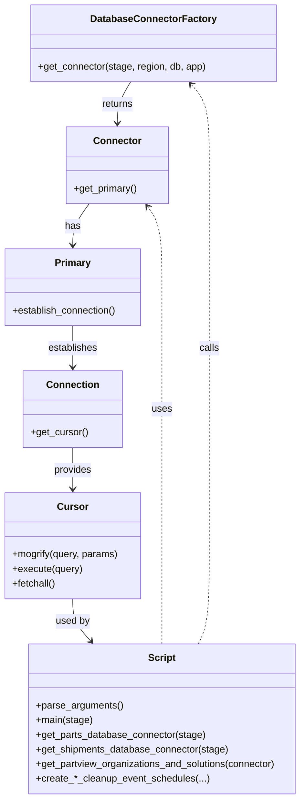

# Diagram: partview_core/partview_service/scripts/BackfillFilterValueListCleanupEventScheduler.py


> Auto-generated by Obscura crawlers

## Diagram 1



### SVG

<svg id="container" width="500.25390625" xmlns="http://www.w3.org/2000/svg" class="classDiagram" height="1310" viewBox="0 0 500.25390625 1310" role="graphics-document document" aria-roledescription="class"><style>#container{font-family:"trebuchet ms",verdana,arial,sans-serif;font-size:16px;fill:#333;}@keyframes edge-animation-frame{from{stroke-dashoffset:0;}}@keyframes dash{to{stroke-dashoffset:0;}}#container .edge-animation-slow{stroke-dasharray:9,5!important;stroke-dashoffset:900;animation:dash 50s linear infinite;stroke-linecap:round;}#container .edge-animation-fast{stroke-dasharray:9,5!important;stroke-dashoffset:900;animation:dash 20s linear infinite;stroke-linecap:round;}#container .error-icon{fill:#552222;}#container .error-text{fill:#552222;stroke:#552222;}#container .edge-thickness-normal{stroke-width:1px;}#container .edge-thickness-thick{stroke-width:3.5px;}#container .edge-pattern-solid{stroke-dasharray:0;}#container .edge-thickness-invisible{stroke-width:0;fill:none;}#container .edge-pattern-dashed{stroke-dasharray:3;}#container .edge-pattern-dotted{stroke-dasharray:2;}#container .marker{fill:#333333;stroke:#333333;}#container .marker.cross{stroke:#333333;}#container svg{font-family:"trebuchet ms",verdana,arial,sans-serif;font-size:16px;}#container p{margin:0;}#container g.classGroup text{fill:#9370DB;stroke:none;font-family:"trebuchet ms",verdana,arial,sans-serif;font-size:10px;}#container g.classGroup text .title{font-weight:bolder;}#container .nodeLabel,#container .edgeLabel{color:#131300;}#container .edgeLabel .label rect{fill:#ECECFF;}#container .label text{fill:#131300;}#container .labelBkg{background:#ECECFF;}#container .edgeLabel .label span{background:#ECECFF;}#container .classTitle{font-weight:bolder;}#container .node rect,#container .node circle,#container .node ellipse,#container .node polygon,#container .node path{fill:#ECECFF;stroke:#9370DB;stroke-width:1px;}#container .divider{stroke:#9370DB;stroke-width:1;}#container g.clickable{cursor:pointer;}#container g.classGroup rect{fill:#ECECFF;stroke:#9370DB;}#container g.classGroup line{stroke:#9370DB;stroke-width:1;}#container .classLabel .box{stroke:none;stroke-width:0;fill:#ECECFF;opacity:0.5;}#container .classLabel .label{fill:#9370DB;font-size:10px;}#container .relation{stroke:#333333;stroke-width:1;fill:none;}#container .dashed-line{stroke-dasharray:3;}#container .dotted-line{stroke-dasharray:1 2;}#container #compositionStart,#container .composition{fill:#333333!important;stroke:#333333!important;stroke-width:1;}#container #compositionEnd,#container .composition{fill:#333333!important;stroke:#333333!important;stroke-width:1;}#container #dependencyStart,#container .dependency{fill:#333333!important;stroke:#333333!important;stroke-width:1;}#container #dependencyStart,#container .dependency{fill:#333333!important;stroke:#333333!important;stroke-width:1;}#container #extensionStart,#container .extension{fill:transparent!important;stroke:#333333!important;stroke-width:1;}#container #extensionEnd,#container .extension{fill:transparent!important;stroke:#333333!important;stroke-width:1;}#container #aggregationStart,#container .aggregation{fill:transparent!important;stroke:#333333!important;stroke-width:1;}#container #aggregationEnd,#container .aggregation{fill:transparent!important;stroke:#333333!important;stroke-width:1;}#container #lollipopStart,#container .lollipop{fill:#ECECFF!important;stroke:#333333!important;stroke-width:1;}#container #lollipopEnd,#container .lollipop{fill:#ECECFF!important;stroke:#333333!important;stroke-width:1;}#container .edgeTerminals{font-size:11px;line-height:initial;}#container .classTitleText{text-anchor:middle;font-size:18px;fill:#333;}#container .label-icon{display:inline-block;height:1em;overflow:visible;vertical-align:-0.125em;}#container .node .label-icon path{fill:currentColor;stroke:revert;stroke-width:revert;}#container :root{--mermaid-font-family:"trebuchet ms",verdana,arial,sans-serif;}</style><g><defs><marker id="container_class-aggregationStart" class="marker aggregation class" refX="18" refY="7" markerWidth="190" markerHeight="240" orient="auto"><path d="M 18,7 L9,13 L1,7 L9,1 Z"></path></marker></defs><defs><marker id="container_class-aggregationEnd" class="marker aggregation class" refX="1" refY="7" markerWidth="20" markerHeight="28" orient="auto"><path d="M 18,7 L9,13 L1,7 L9,1 Z"></path></marker></defs><defs><marker id="container_class-extensionStart" class="marker extension class" refX="18" refY="7" markerWidth="190" markerHeight="240" orient="auto"><path d="M 1,7 L18,13 V 1 Z"></path></marker></defs><defs><marker id="container_class-extensionEnd" class="marker extension class" refX="1" refY="7" markerWidth="20" markerHeight="28" orient="auto"><path d="M 1,1 V 13 L18,7 Z"></path></marker></defs><defs><marker id="container_class-compositionStart" class="marker composition class" refX="18" refY="7" markerWidth="190" markerHeight="240" orient="auto"><path d="M 18,7 L9,13 L1,7 L9,1 Z"></path></marker></defs><defs><marker id="container_class-compositionEnd" class="marker composition class" refX="1" refY="7" markerWidth="20" markerHeight="28" orient="auto"><path d="M 18,7 L9,13 L1,7 L9,1 Z"></path></marker></defs><defs><marker id="container_class-dependencyStart" class="marker dependency class" refX="6" refY="7" markerWidth="190" markerHeight="240" orient="auto"><path d="M 5,7 L9,13 L1,7 L9,1 Z"></path></marker></defs><defs><marker id="container_class-dependencyEnd" class="marker dependency class" refX="13" refY="7" markerWidth="20" markerHeight="28" orient="auto"><path d="M 18,7 L9,13 L14,7 L9,1 Z"></path></marker></defs><defs><marker id="container_class-lollipopStart" class="marker lollipop class" refX="13" refY="7" markerWidth="190" markerHeight="240" orient="auto"><circle stroke="black" fill="transparent" cx="7" cy="7" r="6"></circle></marker></defs><defs><marker id="container_class-lollipopEnd" class="marker lollipop class" refX="1" refY="7" markerWidth="190" markerHeight="240" orient="auto"><circle stroke="black" fill="transparent" cx="7" cy="7" r="6"></circle></marker></defs><g class="root"><g class="clusters"></g><g class="edgePaths"><path d="M216.852,134L213.193,140.167C209.535,146.333,202.218,158.667,198.559,170C194.9,181.333,194.9,191.667,194.9,196.833L194.9,202" id="id_DatabaseConnectorFactory_Connector_1" class="edge-thickness-normal edge-pattern-solid relation" style=";;;" data-edge="true" data-et="edge" data-id="id_DatabaseConnectorFactory_Connector_1" data-points="W3sieCI6MjE2Ljg1MTc5Njg3NSwieSI6MTM0fSx7IngiOjE5NC45MDAzOTA2MjUsInkiOjE3MX0seyJ4IjoxOTQuOTAwMzkwNjI1LCJ5IjoyMDh9XQ==" marker-end="url(#container_class-dependencyEnd)"></path><path d="M148.301,334L143.74,340.167C139.179,346.333,130.056,358.667,125.495,370C120.934,381.333,120.934,391.667,120.934,396.833L120.934,402" id="id_Connector_Primary_2" class="edge-thickness-normal edge-pattern-solid relation" style=";;;" data-edge="true" data-et="edge" data-id="id_Connector_Primary_2" data-points="W3sieCI6MTQ4LjMwMTMwODU5Mzc1LCJ5IjozMzR9LHsieCI6MTIwLjkzMzU5Mzc1LCJ5IjozNzF9LHsieCI6MTIwLjkzMzU5Mzc1LCJ5Ijo0MDh9XQ==" marker-end="url(#container_class-dependencyEnd)"></path><path d="M120.934,534L120.934,540.167C120.934,546.333,120.934,558.667,120.934,570C120.934,581.333,120.934,591.667,120.934,596.833L120.934,602" id="id_Primary_Connection_3" class="edge-thickness-normal edge-pattern-solid relation" style=";;;" data-edge="true" data-et="edge" data-id="id_Primary_Connection_3" data-points="W3sieCI6MTIwLjkzMzU5Mzc1LCJ5Ijo1MzR9LHsieCI6MTIwLjkzMzU5Mzc1LCJ5Ijo1NzF9LHsieCI6MTIwLjkzMzU5Mzc1LCJ5Ijo2MDh9XQ==" marker-end="url(#container_class-dependencyEnd)"></path><path d="M120.934,734L120.934,740.167C120.934,746.333,120.934,758.667,120.934,770C120.934,781.333,120.934,791.667,120.934,796.833L120.934,802" id="id_Connection_Cursor_4" class="edge-thickness-normal edge-pattern-solid relation" style=";;;" data-edge="true" data-et="edge" data-id="id_Connection_Cursor_4" data-points="W3sieCI6MTIwLjkzMzU5Mzc1LCJ5Ijo3MzR9LHsieCI6MTIwLjkzMzU5Mzc1LCJ5Ijo3NzF9LHsieCI6MTIwLjkzMzU5Mzc1LCJ5Ijo4MDh9XQ==" marker-end="url(#container_class-dependencyEnd)"></path><path d="M120.934,982L120.934,988.167C120.934,994.333,120.934,1006.667,125.956,1018.266C130.979,1029.865,141.025,1040.73,146.047,1046.162L151.07,1051.594" id="id_Cursor_Script_5" class="edge-thickness-normal edge-pattern-solid relation" style=";;;" data-edge="true" data-et="edge" data-id="id_Cursor_Script_5" data-points="W3sieCI6MTIwLjkzMzU5Mzc1LCJ5Ijo5ODJ9LHsieCI6MTIwLjkzMzU5Mzc1LCJ5IjoxMDE5fSx7IngiOjE1NS4xNDMyMzczMDQ2ODc1LCJ5IjoxMDU2fV0=" marker-end="url(#container_class-dependencyEnd)"></path><path d="M328.502,1056L331.492,1049.833C334.482,1043.667,340.462,1031.333,343.452,1004.5C346.441,977.667,346.441,936.333,346.441,895C346.441,853.667,346.441,812.333,346.441,775C346.441,737.667,346.441,704.333,346.441,671C346.441,637.667,346.441,604.333,346.441,571C346.441,537.667,346.441,504.333,346.441,471C346.441,437.667,346.441,404.333,346.441,371C346.441,337.667,346.441,304.333,346.441,271C346.441,237.667,346.441,204.333,341.433,182.235C336.424,160.137,326.407,149.274,321.399,143.842L316.39,138.411" id="id_Script_DatabaseConnectorFactory_6" class="edge-thickness-normal edge-pattern-dashed relation" style=";;;" data-edge="true" data-et="edge" data-id="id_Script_DatabaseConnectorFactory_6" data-points="W3sieCI6MzI4LjUwMjM2ODE2NDA2MjUsInkiOjEwNTZ9LHsieCI6MzQ2LjQ0MTQwNjI1LCJ5IjoxMDE5fSx7IngiOjM0Ni40NDE0MDYyNSwieSI6ODk1fSx7IngiOjM0Ni40NDE0MDYyNSwieSI6NzcxfSx7IngiOjM0Ni40NDE0MDYyNSwieSI6NjcxfSx7IngiOjM0Ni40NDE0MDYyNSwieSI6NTcxfSx7IngiOjM0Ni40NDE0MDYyNSwieSI6NDcxfSx7IngiOjM0Ni40NDE0MDYyNSwieSI6MzcxfSx7IngiOjM0Ni40NDE0MDYyNSwieSI6MjcxfSx7IngiOjM0Ni40NDE0MDYyNSwieSI6MTcxfSx7IngiOjMxMi4zMjI2MzY3MTg3NSwieSI6MTM0fV0=" marker-end="url(#container_class-dependencyEnd)"></path><path d="M268.867,1056L268.867,1049.833C268.867,1043.667,268.867,1031.333,268.867,1004.5C268.867,977.667,268.867,936.333,268.867,895C268.867,853.667,268.867,812.333,268.867,775C268.867,737.667,268.867,704.333,268.867,671C268.867,637.667,268.867,604.333,268.867,571C268.867,537.667,268.867,504.333,268.867,471C268.867,437.667,268.867,404.333,264.901,382.304C260.934,360.275,253.001,349.549,249.034,344.187L245.067,338.824" id="id_Script_Connector_7" class="edge-thickness-normal edge-pattern-dashed relation" style=";;;" data-edge="true" data-et="edge" data-id="id_Script_Connector_7" data-points="W3sieCI6MjY4Ljg2NzE4NzUsInkiOjEwNTZ9LHsieCI6MjY4Ljg2NzE4NzUsInkiOjEwMTl9LHsieCI6MjY4Ljg2NzE4NzUsInkiOjg5NX0seyJ4IjoyNjguODY3MTg3NSwieSI6NzcxfSx7IngiOjI2OC44NjcxODc1LCJ5Ijo2NzF9LHsieCI6MjY4Ljg2NzE4NzUsInkiOjU3MX0seyJ4IjoyNjguODY3MTg3NSwieSI6NDcxfSx7IngiOjI2OC44NjcxODc1LCJ5IjozNzF9LHsieCI6MjQxLjQ5OTQ3MjY1NjI1LCJ5IjozMzR9XQ==" marker-end="url(#container_class-dependencyEnd)"></path></g><g class="edgeLabels"><g class="edgeLabel" transform="translate(194.900390625, 171)"><g class="label" data-id="id_DatabaseConnectorFactory_Connector_1" transform="translate(-26.265625, -12)"><foreignObject width="52.53125" height="24"><div xmlns="http://www.w3.org/1999/xhtml" class="labelBkg" style="display: table-cell; white-space: nowrap; line-height: 1.5; max-width: 200px; text-align: center;"><span class="edgeLabel"><p>returns</p></span></div></foreignObject></g></g><g class="edgeLabel" transform="translate(120.93359375, 371)"><g class="label" data-id="id_Connector_Primary_2" transform="translate(-12.703125, -12)"><foreignObject width="25.40625" height="24"><div xmlns="http://www.w3.org/1999/xhtml" class="labelBkg" style="display: table-cell; white-space: nowrap; line-height: 1.5; max-width: 200px; text-align: center;"><span class="edgeLabel"><p>has</p></span></div></foreignObject></g></g><g class="edgeLabel" transform="translate(120.93359375, 571)"><g class="label" data-id="id_Primary_Connection_3" transform="translate(-41.15625, -12)"><foreignObject width="82.3125" height="24"><div xmlns="http://www.w3.org/1999/xhtml" class="labelBkg" style="display: table-cell; white-space: nowrap; line-height: 1.5; max-width: 200px; text-align: center;"><span class="edgeLabel"><p>establishes</p></span></div></foreignObject></g></g><g class="edgeLabel" transform="translate(120.93359375, 771)"><g class="label" data-id="id_Connection_Cursor_4" transform="translate(-31.3125, -12)"><foreignObject width="62.625" height="24"><div xmlns="http://www.w3.org/1999/xhtml" class="labelBkg" style="display: table-cell; white-space: nowrap; line-height: 1.5; max-width: 200px; text-align: center;"><span class="edgeLabel"><p>provides</p></span></div></foreignObject></g></g><g class="edgeLabel" transform="translate(120.93359375, 1019)"><g class="label" data-id="id_Cursor_Script_5" transform="translate(-28.3125, -12)"><foreignObject width="56.625" height="24"><div xmlns="http://www.w3.org/1999/xhtml" class="labelBkg" style="display: table-cell; white-space: nowrap; line-height: 1.5; max-width: 200px; text-align: center;"><span class="edgeLabel"><p>used by</p></span></div></foreignObject></g></g><g class="edgeLabel" transform="translate(346.44140625, 571)"><g class="label" data-id="id_Script_DatabaseConnectorFactory_6" transform="translate(-16.4453125, -12)"><foreignObject width="32.890625" height="24"><div xmlns="http://www.w3.org/1999/xhtml" class="labelBkg" style="display: table-cell; white-space: nowrap; line-height: 1.5; max-width: 200px; text-align: center;"><span class="edgeLabel"><p>calls</p></span></div></foreignObject></g></g><g class="edgeLabel" transform="translate(268.8671875, 671)"><g class="label" data-id="id_Script_Connector_7" transform="translate(-16.4921875, -12)"><foreignObject width="32.984375" height="24"><div xmlns="http://www.w3.org/1999/xhtml" class="labelBkg" style="display: table-cell; white-space: nowrap; line-height: 1.5; max-width: 200px; text-align: center;"><span class="edgeLabel"><p>uses</p></span></div></foreignObject></g></g></g><g class="nodes"><g class="node default" id="classId-DatabaseConnectorFactory-0" transform="translate(254.228515625, 71)"><g class="basic label-container"><path d="M-199.546875 -63 L199.546875 -63 L199.546875 63 L-199.546875 63" stroke="none" stroke-width="0" fill="#ECECFF" style=""></path><path d="M-199.546875 -63 C-94.67319480534358 -63, 10.200485389312831 -63, 199.546875 -63 M-199.546875 -63 C-85.97221675597811 -63, 27.60244148804378 -63, 199.546875 -63 M199.546875 -63 C199.546875 -15.284178091271102, 199.546875 32.4316438174578, 199.546875 63 M199.546875 -63 C199.546875 -18.5316432869987, 199.546875 25.936713426002598, 199.546875 63 M199.546875 63 C83.11408054504636 63, -33.318713909907274 63, -199.546875 63 M199.546875 63 C107.50801461017562 63, 15.469154220351243 63, -199.546875 63 M-199.546875 63 C-199.546875 28.214476159093564, -199.546875 -6.571047681812871, -199.546875 -63 M-199.546875 63 C-199.546875 30.615374773486124, -199.546875 -1.7692504530277517, -199.546875 -63" stroke="#9370DB" stroke-width="1.3" fill="none" stroke-dasharray="0 0" style=""></path></g><g class="annotation-group text" transform="translate(0, -39)"></g><g class="label-group text" transform="translate(-98.1875, -39)"><g class="label" style="font-weight: bolder" transform="translate(0,-12)"><foreignObject width="196.375" height="24"><div xmlns="http://www.w3.org/1999/xhtml" style="display: table-cell; white-space: nowrap; line-height: 1.5; max-width: 244px; text-align: center;"><span class="nodeLabel markdown-node-label" style=""><p>DatabaseConnectorFactory</p></span></div></foreignObject></g></g><g class="members-group text" transform="translate(-187.546875, 9)"></g><g class="methods-group text" transform="translate(-187.546875, 39)"><g class="label" style="" transform="translate(0,-12)"><foreignObject width="276.90625" height="24"><div xmlns="http://www.w3.org/1999/xhtml" style="display: table-cell; white-space: nowrap; line-height: 1.5; max-width: 334px; text-align: center;"><span class="nodeLabel markdown-node-label" style=""><p>+get_connector(stage, region, db, app)</p></span></div></foreignObject></g></g><g class="divider" style=""><path d="M-199.546875 -15 C-61.682032601398106 -15, 76.18280979720379 -15, 199.546875 -15 M-199.546875 -15 C-55.20655869848679 -15, 89.13375760302642 -15, 199.546875 -15" stroke="#9370DB" stroke-width="1.3" fill="none" stroke-dasharray="0 0" style=""></path></g><g class="divider" style=""><path d="M-199.546875 9 C-49.825821510349925 9, 99.89523197930015 9, 199.546875 9 M-199.546875 9 C-51.56887430219618 9, 96.40912639560764 9, 199.546875 9" stroke="#9370DB" stroke-width="1.3" fill="none" stroke-dasharray="0 0" style=""></path></g></g><g class="node default" id="classId-Connector-1" transform="translate(194.900390625, 271)"><g class="basic label-container"><path d="M-83.65625 -63 L83.65625 -63 L83.65625 63 L-83.65625 63" stroke="none" stroke-width="0" fill="#ECECFF" style=""></path><path d="M-83.65625 -63 C-18.256840757450675 -63, 47.14256848509865 -63, 83.65625 -63 M-83.65625 -63 C-47.29205933195668 -63, -10.927868663913358 -63, 83.65625 -63 M83.65625 -63 C83.65625 -37.71416256278665, 83.65625 -12.428325125573295, 83.65625 63 M83.65625 -63 C83.65625 -22.385194054522138, 83.65625 18.229611890955724, 83.65625 63 M83.65625 63 C21.441589117724497 63, -40.773071764551005 63, -83.65625 63 M83.65625 63 C43.378558527522074 63, 3.100867055044148 63, -83.65625 63 M-83.65625 63 C-83.65625 12.936502386173501, -83.65625 -37.126995227653, -83.65625 -63 M-83.65625 63 C-83.65625 23.853745316290137, -83.65625 -15.292509367419726, -83.65625 -63" stroke="#9370DB" stroke-width="1.3" fill="none" stroke-dasharray="0 0" style=""></path></g><g class="annotation-group text" transform="translate(0, -39)"></g><g class="label-group text" transform="translate(-37.421875, -39)"><g class="label" style="font-weight: bolder" transform="translate(0,-12)"><foreignObject width="74.84375" height="24"><div xmlns="http://www.w3.org/1999/xhtml" style="display: table-cell; white-space: nowrap; line-height: 1.5; max-width: 125px; text-align: center;"><span class="nodeLabel markdown-node-label" style=""><p>Connector</p></span></div></foreignObject></g></g><g class="members-group text" transform="translate(-71.65625, 9)"></g><g class="methods-group text" transform="translate(-71.65625, 39)"><g class="label" style="" transform="translate(0,-12)"><foreignObject width="105.890625" height="24"><div xmlns="http://www.w3.org/1999/xhtml" style="display: table-cell; white-space: nowrap; line-height: 1.5; max-width: 163px; text-align: center;"><span class="nodeLabel markdown-node-label" style=""><p>+get_primary()</p></span></div></foreignObject></g></g><g class="divider" style=""><path d="M-83.65625 -15 C-47.89571994063679 -15, -12.135189881273575 -15, 83.65625 -15 M-83.65625 -15 C-31.57807709332966 -15, 20.50009581334068 -15, 83.65625 -15" stroke="#9370DB" stroke-width="1.3" fill="none" stroke-dasharray="0 0" style=""></path></g><g class="divider" style=""><path d="M-83.65625 9 C-18.014007418322933 9, 47.628235163354134 9, 83.65625 9 M-83.65625 9 C-22.513593772161265 9, 38.62906245567747 9, 83.65625 9" stroke="#9370DB" stroke-width="1.3" fill="none" stroke-dasharray="0 0" style=""></path></g></g><g class="node default" id="classId-Primary-2" transform="translate(120.93359375, 471)"><g class="basic label-container"><path d="M-112.93359375 -63 L112.93359375 -63 L112.93359375 63 L-112.93359375 63" stroke="none" stroke-width="0" fill="#ECECFF" style=""></path><path d="M-112.93359375 -63 C-59.44862684025222 -63, -5.963659930504434 -63, 112.93359375 -63 M-112.93359375 -63 C-25.411297871594428 -63, 62.110998006811144 -63, 112.93359375 -63 M112.93359375 -63 C112.93359375 -36.25582105030273, 112.93359375 -9.511642100605464, 112.93359375 63 M112.93359375 -63 C112.93359375 -20.955523770756024, 112.93359375 21.088952458487952, 112.93359375 63 M112.93359375 63 C23.928013477174446 63, -65.07756679565111 63, -112.93359375 63 M112.93359375 63 C46.306981164259554 63, -20.319631421480892 63, -112.93359375 63 M-112.93359375 63 C-112.93359375 27.655451690192848, -112.93359375 -7.689096619614304, -112.93359375 -63 M-112.93359375 63 C-112.93359375 28.242708063084535, -112.93359375 -6.514583873830929, -112.93359375 -63" stroke="#9370DB" stroke-width="1.3" fill="none" stroke-dasharray="0 0" style=""></path></g><g class="annotation-group text" transform="translate(0, -39)"></g><g class="label-group text" transform="translate(-28.6015625, -39)"><g class="label" style="font-weight: bolder" transform="translate(0,-12)"><foreignObject width="57.203125" height="24"><div xmlns="http://www.w3.org/1999/xhtml" style="display: table-cell; white-space: nowrap; line-height: 1.5; max-width: 106px; text-align: center;"><span class="nodeLabel markdown-node-label" style=""><p>Primary</p></span></div></foreignObject></g></g><g class="members-group text" transform="translate(-100.93359375, 9)"></g><g class="methods-group text" transform="translate(-100.93359375, 39)"><g class="label" style="" transform="translate(0,-12)"><foreignObject width="173.265625" height="24"><div xmlns="http://www.w3.org/1999/xhtml" style="display: table-cell; white-space: nowrap; line-height: 1.5; max-width: 231px; text-align: center;"><span class="nodeLabel markdown-node-label" style=""><p>+establish_connection()</p></span></div></foreignObject></g></g><g class="divider" style=""><path d="M-112.93359375 -15 C-32.65505829042246 -15, 47.62347716915508 -15, 112.93359375 -15 M-112.93359375 -15 C-49.45819541194157 -15, 14.017202926116866 -15, 112.93359375 -15" stroke="#9370DB" stroke-width="1.3" fill="none" stroke-dasharray="0 0" style=""></path></g><g class="divider" style=""><path d="M-112.93359375 9 C-25.78594436920065 9, 61.3617050115987 9, 112.93359375 9 M-112.93359375 9 C-59.43860237359431 9, -5.943610997188614 9, 112.93359375 9" stroke="#9370DB" stroke-width="1.3" fill="none" stroke-dasharray="0 0" style=""></path></g></g><g class="node default" id="classId-Connection-3" transform="translate(120.93359375, 671)"><g class="basic label-container"><path d="M-79.93359375 -63 L79.93359375 -63 L79.93359375 63 L-79.93359375 63" stroke="none" stroke-width="0" fill="#ECECFF" style=""></path><path d="M-79.93359375 -63 C-27.415419154808134 -63, 25.10275544038373 -63, 79.93359375 -63 M-79.93359375 -63 C-23.72590567618535 -63, 32.4817823976293 -63, 79.93359375 -63 M79.93359375 -63 C79.93359375 -33.65771724653379, 79.93359375 -4.315434493067578, 79.93359375 63 M79.93359375 -63 C79.93359375 -14.275841418979503, 79.93359375 34.44831716204099, 79.93359375 63 M79.93359375 63 C44.138282651752014 63, 8.342971553504029 63, -79.93359375 63 M79.93359375 63 C37.64478412216323 63, -4.6440255056735396 63, -79.93359375 63 M-79.93359375 63 C-79.93359375 13.40126494495619, -79.93359375 -36.19747011008762, -79.93359375 -63 M-79.93359375 63 C-79.93359375 27.63070930080181, -79.93359375 -7.738581398396377, -79.93359375 -63" stroke="#9370DB" stroke-width="1.3" fill="none" stroke-dasharray="0 0" style=""></path></g><g class="annotation-group text" transform="translate(0, -39)"></g><g class="label-group text" transform="translate(-41.2265625, -39)"><g class="label" style="font-weight: bolder" transform="translate(0,-12)"><foreignObject width="82.453125" height="24"><div xmlns="http://www.w3.org/1999/xhtml" style="display: table-cell; white-space: nowrap; line-height: 1.5; max-width: 132px; text-align: center;"><span class="nodeLabel markdown-node-label" style=""><p>Connection</p></span></div></foreignObject></g></g><g class="members-group text" transform="translate(-67.93359375, 9)"></g><g class="methods-group text" transform="translate(-67.93359375, 39)"><g class="label" style="" transform="translate(0,-12)"><foreignObject width="94.640625" height="24"><div xmlns="http://www.w3.org/1999/xhtml" style="display: table-cell; white-space: nowrap; line-height: 1.5; max-width: 152px; text-align: center;"><span class="nodeLabel markdown-node-label" style=""><p>+get_cursor()</p></span></div></foreignObject></g></g><g class="divider" style=""><path d="M-79.93359375 -15 C-27.02583358043394 -15, 25.88192658913212 -15, 79.93359375 -15 M-79.93359375 -15 C-44.11095587450977 -15, -8.28831799901954 -15, 79.93359375 -15" stroke="#9370DB" stroke-width="1.3" fill="none" stroke-dasharray="0 0" style=""></path></g><g class="divider" style=""><path d="M-79.93359375 9 C-40.562939766673516 9, -1.1922857833470317 9, 79.93359375 9 M-79.93359375 9 C-20.356196609555553 9, 39.22120053088889 9, 79.93359375 9" stroke="#9370DB" stroke-width="1.3" fill="none" stroke-dasharray="0 0" style=""></path></g></g><g class="node default" id="classId-Cursor-4" transform="translate(120.93359375, 895)"><g class="basic label-container"><path d="M-112.1015625 -87 L112.1015625 -87 L112.1015625 87 L-112.1015625 87" stroke="none" stroke-width="0" fill="#ECECFF" style=""></path><path d="M-112.1015625 -87 C-26.279431461054855 -87, 59.54269957789029 -87, 112.1015625 -87 M-112.1015625 -87 C-36.43474090895626 -87, 39.232080682087485 -87, 112.1015625 -87 M112.1015625 -87 C112.1015625 -37.475744295928244, 112.1015625 12.048511408143511, 112.1015625 87 M112.1015625 -87 C112.1015625 -48.20824824676375, 112.1015625 -9.416496493527504, 112.1015625 87 M112.1015625 87 C38.415765905498716 87, -35.27003068900257 87, -112.1015625 87 M112.1015625 87 C55.64516468207534 87, -0.8112331358493208 87, -112.1015625 87 M-112.1015625 87 C-112.1015625 33.77378563708213, -112.1015625 -19.452428725835745, -112.1015625 -87 M-112.1015625 87 C-112.1015625 24.290517411574527, -112.1015625 -38.418965176850946, -112.1015625 -87" stroke="#9370DB" stroke-width="1.3" fill="none" stroke-dasharray="0 0" style=""></path></g><g class="annotation-group text" transform="translate(0, -63)"></g><g class="label-group text" transform="translate(-23.90625, -63)"><g class="label" style="font-weight: bolder" transform="translate(0,-12)"><foreignObject width="47.8125" height="24"><div xmlns="http://www.w3.org/1999/xhtml" style="display: table-cell; white-space: nowrap; line-height: 1.5; max-width: 98px; text-align: center;"><span class="nodeLabel markdown-node-label" style=""><p>Cursor</p></span></div></foreignObject></g></g><g class="members-group text" transform="translate(-100.1015625, -15)"></g><g class="methods-group text" transform="translate(-100.1015625, 15)"><g class="label" style="" transform="translate(0,-12)"><foreignObject width="176.296875" height="24"><div xmlns="http://www.w3.org/1999/xhtml" style="display: table-cell; white-space: nowrap; line-height: 1.5; max-width: 234px; text-align: center;"><span class="nodeLabel markdown-node-label" style=""><p>+mogrify(query, params)</p></span></div></foreignObject></g><g class="label" style="" transform="translate(0,12)"><foreignObject width="115.96875" height="24"><div xmlns="http://www.w3.org/1999/xhtml" style="display: table-cell; white-space: nowrap; line-height: 1.5; max-width: 173px; text-align: center;"><span class="nodeLabel markdown-node-label" style=""><p>+execute(query)</p></span></div></foreignObject></g><g class="label" style="" transform="translate(0,36)"><foreignObject width="72.515625" height="24"><div xmlns="http://www.w3.org/1999/xhtml" style="display: table-cell; white-space: nowrap; line-height: 1.5; max-width: 130px; text-align: center;"><span class="nodeLabel markdown-node-label" style=""><p>+fetchall()</p></span></div></foreignObject></g></g><g class="divider" style=""><path d="M-112.1015625 -39 C-43.55693476843031 -39, 24.98769296313938 -39, 112.1015625 -39 M-112.1015625 -39 C-33.82990203008963 -39, 44.441758439820745 -39, 112.1015625 -39" stroke="#9370DB" stroke-width="1.3" fill="none" stroke-dasharray="0 0" style=""></path></g><g class="divider" style=""><path d="M-112.1015625 -15 C-54.941033993731445 -15, 2.2194945125371106 -15, 112.1015625 -15 M-112.1015625 -15 C-55.63718481298454 -15, 0.8271928740309136 -15, 112.1015625 -15" stroke="#9370DB" stroke-width="1.3" fill="none" stroke-dasharray="0 0" style=""></path></g></g><g class="node default" id="classId-Script-5" transform="translate(268.8671875, 1179)"><g class="basic label-container"><path d="M-223.38671875 -123 L223.38671875 -123 L223.38671875 123 L-223.38671875 123" stroke="none" stroke-width="0" fill="#ECECFF" style=""></path><path d="M-223.38671875 -123 C-118.2163527423961 -123, -13.045986734792194 -123, 223.38671875 -123 M-223.38671875 -123 C-47.38588789608684 -123, 128.61494295782632 -123, 223.38671875 -123 M223.38671875 -123 C223.38671875 -58.38522490323028, 223.38671875 6.229550193539438, 223.38671875 123 M223.38671875 -123 C223.38671875 -36.62219288253817, 223.38671875 49.755614234923655, 223.38671875 123 M223.38671875 123 C55.972266149104456 123, -111.44218645179109 123, -223.38671875 123 M223.38671875 123 C123.16427299154668 123, 22.941827233093363 123, -223.38671875 123 M-223.38671875 123 C-223.38671875 28.63271954035953, -223.38671875 -65.73456091928094, -223.38671875 -123 M-223.38671875 123 C-223.38671875 29.946753587674237, -223.38671875 -63.106492824651525, -223.38671875 -123" stroke="#9370DB" stroke-width="1.3" fill="none" stroke-dasharray="0 0" style=""></path></g><g class="annotation-group text" transform="translate(0, -99)"></g><g class="label-group text" transform="translate(-21.7421875, -99)"><g class="label" style="font-weight: bolder" transform="translate(0,-12)"><foreignObject width="43.484375" height="24"><div xmlns="http://www.w3.org/1999/xhtml" style="display: table-cell; white-space: nowrap; line-height: 1.5; max-width: 93px; text-align: center;"><span class="nodeLabel markdown-node-label" style=""><p>Script</p></span></div></foreignObject></g></g><g class="members-group text" transform="translate(-211.38671875, -51)"></g><g class="methods-group text" transform="translate(-211.38671875, -21)"><g class="label" style="" transform="translate(0,-12)"><foreignObject width="143.390625" height="24"><div xmlns="http://www.w3.org/1999/xhtml" style="display: table-cell; white-space: nowrap; line-height: 1.5; max-width: 201px; text-align: center;"><span class="nodeLabel markdown-node-label" style=""><p>+parse_arguments()</p></span></div></foreignObject></g><g class="label" style="" transform="translate(0,12)"><foreignObject width="93.125" height="24"><div xmlns="http://www.w3.org/1999/xhtml" style="display: table-cell; white-space: nowrap; line-height: 1.5; max-width: 150px; text-align: center;"><span class="nodeLabel markdown-node-label" style=""><p>+main(stage)</p></span></div></foreignObject></g><g class="label" style="" transform="translate(0,36)"><foreignObject width="280.109375" height="24"><div xmlns="http://www.w3.org/1999/xhtml" style="display: table-cell; white-space: nowrap; line-height: 1.5; max-width: 337px; text-align: center;"><span class="nodeLabel markdown-node-label" style=""><p>+get_parts_database_connector(stage)</p></span></div></foreignObject></g><g class="label" style="" transform="translate(0,60)"><foreignObject width="318.546875" height="24"><div xmlns="http://www.w3.org/1999/xhtml" style="display: table-cell; white-space: nowrap; line-height: 1.5; max-width: 376px; text-align: center;"><span class="nodeLabel markdown-node-label" style=""><p>+get_shipments_database_connector(stage)</p></span></div></foreignObject></g><g class="label" style="" transform="translate(0,84)"><foreignObject width="401.03125" height="24"><div xmlns="http://www.w3.org/1999/xhtml" style="display: table-cell; white-space: nowrap; line-height: 1.5; max-width: 458px; text-align: center;"><span class="nodeLabel markdown-node-label" style=""><p>+get_partview_organizations_and_solutions(connector)</p></span></div></foreignObject></g><g class="label" style="" transform="translate(0,108)"><foreignObject width="281.515625" height="24"><div xmlns="http://www.w3.org/1999/xhtml" style="display: table-cell; white-space: nowrap; line-height: 1.5; max-width: 339px; text-align: center;"><span class="nodeLabel markdown-node-label" style=""><p>+create_*_cleanup_event_schedules(...)</p></span></div></foreignObject></g></g><g class="divider" style=""><path d="M-223.38671875 -75 C-115.04257796509839 -75, -6.698437180196777 -75, 223.38671875 -75 M-223.38671875 -75 C-54.38161103937665 -75, 114.6234966712467 -75, 223.38671875 -75" stroke="#9370DB" stroke-width="1.3" fill="none" stroke-dasharray="0 0" style=""></path></g><g class="divider" style=""><path d="M-223.38671875 -51 C-128.5664166440568 -51, -33.7461145381136 -51, 223.38671875 -51 M-223.38671875 -51 C-129.5490620679757 -51, -35.71140538595142 -51, 223.38671875 -51" stroke="#9370DB" stroke-width="1.3" fill="none" stroke-dasharray="0 0" style=""></path></g></g></g></g></g></svg>

## Diagram 2

```mermaid
flowchart LR
    A[Start: script execution] --> B[parse_arguments()]
    B --> C[get_shipments_database_connector(stage)]
    C --> D[get_partview_organizations_and_solutions(connector)]
    D -->|results list| E[for each organization_solution]
    E --> F[get_parts_database_connector(stage)]
    F --> G{Invoke cleanup schedule creators}
    G --> H1[create_order_number_cleanup_event_schedules]
    G --> H2[create_tracking_number_cleanup_event_schedules]
    G --> HclassDiagram
class Script {
  +BATCH_SIZE: int
  +TIME_DELTA_SECONDS: int
  +parse_arguments()
  +get_parts_database_connector(stage)
  +get_shipments_database_connector(stage)
  +get_partview_organizations_and_solutions(connector)
  +create_order_number_cleanup_event_schedules(connector, organization_fv_id, solution_id, batch_size, time_delta_seconds)
  +create_tracking_number_cleanup_event_schedules(connector, organization_fv_id, solution_id, batch_size, time_delta_seconds)
  +create_order_priority_cleanup_event_schedules(connector, organization_fv_id, solution_id, batch_size, time_delta_seconds)
  +create_origin_cleanup_event_schedules(connector, organization_fv_id, solution_id, batch_size, time_delta_seconds)
  +create_destination_cleanup_event_schedules(connector, organization_fv_id, solution_id, batch_size, time_delta_seconds)
  +create_part_number_cleanup_event_schedules(connector, organization_fv_id, solution_id, batch_size, time_delta_seconds)
  +create_carrier_cleanup_event_schedules(connector, organization_fv_id, solution_id, batch_size, time_delta_seconds)
  +create_shipment_id_cleanup_event_schedules(connector, organization_fv_id, solution_id, batch_size, time_delta_seconds)
  +create_bill_of_lading_cleanup_event_schedules(connector, organization_fv_id, solution_id, batch_size, time_delta_seconds)
  +create_trailer_equipment_number_cleanup_event_schedules(connector, organization_fv_id, solution_id, batch_size, time_delta_seconds)
  +main(stage)
}
class DatabaseConnectorFactory {
  +get_connector(stage, region, database, application)
}
class Connector {
  +get_primary()
}
class PrimaryConnection {
  +establish_connection()
}
class Connection {
  +get_cursor()
}
class Cursor {
  +mogrify(query, params)
  +execute(query)
  +fetchall()
}
class EventSchedulerTable {
  +INSERT(...)
}
DatabaseConnectorFactory --> Connector : returns
Connector --> PrimaryConnection : provides
PrimaryConnection --> Connection : establishes
Connection --> Cursor : provides
Script ..> DatabaseConnectorFactoryflowchart TD
  A[parse_arguments()] -->|returns stage| Main[main(stage)]
  Main --> GSC[get_shipments_database_connector(stage)]
  Main --> PPC[get_parts_database_connector(stage)]
  GSC --> DBF[DatabaseConnectorFactory.get_connector]
  PPC --> DBF
  GSC --> Results[get_partview_organizations_and_solutions(connector)]
  Results -->|iterates results| Loop[for each organization/solution]
  Loop --> ON[create_order_number_cleanup_event_schedules(...)]
  Loop --> TN[create_tracking_number_cleanup_event_schedules(...)]
  Loop --> OP[create_order_priority_cleanup_event_schedules(...)]
  Loop --> OR[create_origin_cleanup_event_schedules(...)]
  Loop --> DS[create_destination_cleanup_event_schedules(...)]
  Loop --> PN[create_part_number_cleanup_event_schedules(...)]
  Loop --> CR[create_carrier_cleanup_event_schedules(...)]
  Loop --> SI[create_shipment_id_cleanup_event_schedules(...)]
  Loop --> BL[create_bill_of_lading_cleanup_event_schedules(...)]
  Loop --> TE[create_trailer_equipment_number_cleanup_event_schedules(...)]
  Params[BATCH_SIZE=500<br/>TIME_DELTA_SECONDS=300] -->|used by| ON
  Params --> TN
  Params --> OP
  Params --> OR
  Params --> DS
  Params --> PN
  Params --> CR
  Params --> SI
  Params --> BL
  Params --> TE
  subgraph DB_Query["create_* functions"]
    ON & TN & OP & OR & DS & PN & CR & SI & BL & TE
  end
  connector[Connector] -->|provides cursor| DB_Query
  Results -->|fetches via cursor| connector
  Main -->|calls| connector
  style DB_Query fill:#f9f,stroke:#333,stroke-width:1px
```

> SVG rendering failed for this diagram.
