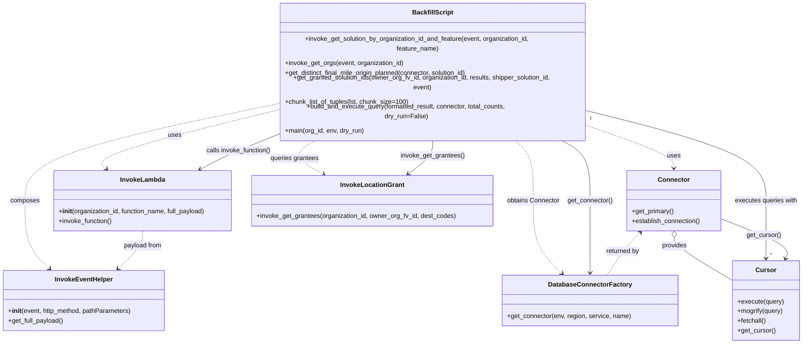

# Diagram: partview_core/partview_service/scripts/BackfillFilterValueListFinalMileOrigin.py


> Auto-generated by Obscura crawlers

## Diagram 1

```mermaid
flowchart LR
    Start([Start]) --> ValidateEnv{env in allowed list?}
    ValidateEnv -- Yes --> GetConnector[Get connector via DatabaseConnectorFactory.get_connector(...).get_primary()]
    ValidateEnv -- No --> LogInvalid[Log "The entered environment is not valid"]
    GetConnector --> BuildEvent[Build event dict with headers and requestContext]
    BuildEvent --> InvokeGetOrgs[invoke_get_orgs(event, organization_id)]
    InvokeGetOrgs --> FVOrgId[/fv_org_id/]
    BuildEvent --> InvokeGetSolution[invoke_get_solution_by_organization_id_and_feature(event, organization_id, feature_name)]
    InvokeGetSolution --> ShipperSolutionId[/shipper_solution_id/]
    GetConnector --> FetchResults[get_distinct_final_mile_origin_planned(connector, shipper_solution_id)]
    FetchResults --> Results[/results/]
    Results --> GrantIDs[get_granted_solution_ids(fv_org_id, organization_id, results, shipper_solution_id, event)]
    GrantIDs --> FormattedResult[/formatted_result/]
    FormattedResult --> Chunking[chunk_list_of_tuples(formatted_result, chunk_size=100)]
    Chunking --> Chunks[/chunked/]
    Chunks --> BuildExecute[build_and_execute_query(chunked, connector, len(formatted_result), dry_run)]
    BuildExecute --> LogComplete[Log "Backfill is complete"]
    LogComplete --> End([End])
    LogInvalid --> End
```

> SVG rendering failed for this diagram.

## Diagram 2

```mermaid
classDiagram
    class DatabaseConnectorFactory {
        +static get_connector(env, region, service, name)
    }
    class Connector {
        +get_primary()
        +establish_connection()
    }
    class Connection {
        +get_cursor()
    }
    class Cursor {
        +execute(query)
        +mogrify(query)
        +fetchall()
    }
    class InvokeLambda {
        +__init__(organization_id, function_name, full_payload)
        +invoke_function() --> (status, response)
    }
    class InvokeEventHelper {
        +__init__(event,Running the diagram generator skill to extract Mermaid diagrams from the provided source. I'll also report intent.

● skill(crawl-diagrams)
```

> SVG rendering failed for this diagram.

## Diagram 3



### SVG

<svg id="container" width="2003.51953125" xmlns="http://www.w3.org/2000/svg" class="classDiagram" height="782" viewBox="0 0 2003.51953125 782" role="graphics-document document" aria-roledescription="class"><style>#container{font-family:"trebuchet ms",verdana,arial,sans-serif;font-size:16px;fill:#333;}@keyframes edge-animation-frame{from{stroke-dashoffset:0;}}@keyframes dash{to{stroke-dashoffset:0;}}#container .edge-animation-slow{stroke-dasharray:9,5!important;stroke-dashoffset:900;animation:dash 50s linear infinite;stroke-linecap:round;}#container .edge-animation-fast{stroke-dasharray:9,5!important;stroke-dashoffset:900;animation:dash 20s linear infinite;stroke-linecap:round;}#container .error-icon{fill:#552222;}#container .error-text{fill:#552222;stroke:#552222;}#container .edge-thickness-normal{stroke-width:1px;}#container .edge-thickness-thick{stroke-width:3.5px;}#container .edge-pattern-solid{stroke-dasharray:0;}#container .edge-thickness-invisible{stroke-width:0;fill:none;}#container .edge-pattern-dashed{stroke-dasharray:3;}#container .edge-pattern-dotted{stroke-dasharray:2;}#container .marker{fill:#333333;stroke:#333333;}#container .marker.cross{stroke:#333333;}#container svg{font-family:"trebuchet ms",verdana,arial,sans-serif;font-size:16px;}#container p{margin:0;}#container g.classGroup text{fill:#9370DB;stroke:none;font-family:"trebuchet ms",verdana,arial,sans-serif;font-size:10px;}#container g.classGroup text .title{font-weight:bolder;}#container .nodeLabel,#container .edgeLabel{color:#131300;}#container .edgeLabel .label rect{fill:#ECECFF;}#container .label text{fill:#131300;}#container .labelBkg{background:#ECECFF;}#container .edgeLabel .label span{background:#ECECFF;}#container .classTitle{font-weight:bolder;}#container .node rect,#container .node circle,#container .node ellipse,#container .node polygon,#container .node path{fill:#ECECFF;stroke:#9370DB;stroke-width:1px;}#container .divider{stroke:#9370DB;stroke-width:1;}#container g.clickable{cursor:pointer;}#container g.classGroup rect{fill:#ECECFF;stroke:#9370DB;}#container g.classGroup line{stroke:#9370DB;stroke-width:1;}#container .classLabel .box{stroke:none;stroke-width:0;fill:#ECECFF;opacity:0.5;}#container .classLabel .label{fill:#9370DB;font-size:10px;}#container .relation{stroke:#333333;stroke-width:1;fill:none;}#container .dashed-line{stroke-dasharray:3;}#container .dotted-line{stroke-dasharray:1 2;}#container #compositionStart,#container .composition{fill:#333333!important;stroke:#333333!important;stroke-width:1;}#container #compositionEnd,#container .composition{fill:#333333!important;stroke:#333333!important;stroke-width:1;}#container #dependencyStart,#container .dependency{fill:#333333!important;stroke:#333333!important;stroke-width:1;}#container #dependencyStart,#container .dependency{fill:#333333!important;stroke:#333333!important;stroke-width:1;}#container #extensionStart,#container .extension{fill:transparent!important;stroke:#333333!important;stroke-width:1;}#container #extensionEnd,#container .extension{fill:transparent!important;stroke:#333333!important;stroke-width:1;}#container #aggregationStart,#container .aggregation{fill:transparent!important;stroke:#333333!important;stroke-width:1;}#container #aggregationEnd,#container .aggregation{fill:transparent!important;stroke:#333333!important;stroke-width:1;}#container #lollipopStart,#container .lollipop{fill:#ECECFF!important;stroke:#333333!important;stroke-width:1;}#container #lollipopEnd,#container .lollipop{fill:#ECECFF!important;stroke:#333333!important;stroke-width:1;}#container .edgeTerminals{font-size:11px;line-height:initial;}#container .classTitleText{text-anchor:middle;font-size:18px;fill:#333;}#container .label-icon{display:inline-block;height:1em;overflow:visible;vertical-align:-0.125em;}#container .node .label-icon path{fill:currentColor;stroke:revert;stroke-width:revert;}#container :root{--mermaid-font-family:"trebuchet ms",verdana,arial,sans-serif;}</style><g><defs><marker id="container_class-aggregationStart" class="marker aggregation class" refX="18" refY="7" markerWidth="190" markerHeight="240" orient="auto"><path d="M 18,7 L9,13 L1,7 L9,1 Z"></path></marker></defs><defs><marker id="container_class-aggregationEnd" class="marker aggregation class" refX="1" refY="7" markerWidth="20" markerHeight="28" orient="auto"><path d="M 18,7 L9,13 L1,7 L9,1 Z"></path></marker></defs><defs><marker id="container_class-extensionStart" class="marker extension class" refX="18" refY="7" markerWidth="190" markerHeight="240" orient="auto"><path d="M 1,7 L18,13 V 1 Z"></path></marker></defs><defs><marker id="container_class-extensionEnd" class="marker extension class" refX="1" refY="7" markerWidth="20" markerHeight="28" orient="auto"><path d="M 1,1 V 13 L18,7 Z"></path></marker></defs><defs><marker id="container_class-compositionStart" class="marker composition class" refX="18" refY="7" markerWidth="190" markerHeight="240" orient="auto"><path d="M 18,7 L9,13 L1,7 L9,1 Z"></path></marker></defs><defs><marker id="container_class-compositionEnd" class="marker composition class" refX="1" refY="7" markerWidth="20" markerHeight="28" orient="auto"><path d="M 18,7 L9,13 L1,7 L9,1 Z"></path></marker></defs><defs><marker id="container_class-dependencyStart" class="marker dependency class" refX="6" refY="7" markerWidth="190" markerHeight="240" orient="auto"><path d="M 5,7 L9,13 L1,7 L9,1 Z"></path></marker></defs><defs><marker id="container_class-dependencyEnd" class="marker dependency class" refX="13" refY="7" markerWidth="20" markerHeight="28" orient="auto"><path d="M 18,7 L9,13 L14,7 L9,1 Z"></path></marker></defs><defs><marker id="container_class-lollipopStart" class="marker lollipop class" refX="13" refY="7" markerWidth="190" markerHeight="240" orient="auto"><circle stroke="black" fill="transparent" cx="7" cy="7" r="6"></circle></marker></defs><defs><marker id="container_class-lollipopEnd" class="marker lollipop class" refX="1" refY="7" markerWidth="190" markerHeight="240" orient="auto"><circle stroke="black" fill="transparent" cx="7" cy="7" r="6"></circle></marker></defs><g class="root"><g class="clusters"></g><g class="edgePaths"><path d="M693.016,221.049L615.396,236.708C537.776,252.366,382.536,283.683,311.299,304.855C240.061,326.026,252.824,337.052,259.206,342.565L265.588,348.078" id="id_BackfillScript_InvokeLambda_1" class="edge-thickness-normal edge-pattern-dashed relation" style=";;;" data-edge="true" data-et="edge" data-id="id_BackfillScript_InvokeLambda_1" data-points="W3sieCI6NjkzLjAxNTYyNSwieSI6MjIxLjA0OTI4NzgwNTQxNDQyfSx7IngiOjIyNy4yOTY4NzUsInkiOjMxNX0seyJ4IjoyNzAuMTI4NDUyODQ1OTgyMSwieSI6MzUyfV0=" marker-end="url(#container_class-dependencyEnd)"></path><path d="M693.016,208.321L587.705,226.1C482.395,243.88,271.773,279.44,166.463,315.887C61.152,352.333,61.152,389.667,61.152,427C61.152,464.333,61.152,501.667,71.472,529.823C81.792,557.98,102.432,576.959,112.753,586.449L123.073,595.939" id="id_BackfillScript_InvokeEventHelper_2" class="edge-thickness-normal edge-pattern-dashed relation" style=";;;" data-edge="true" data-et="edge" data-id="id_BackfillScript_InvokeEventHelper_2" data-points="W3sieCI6NjkzLjAxNTYyNSwieSI6MjA4LjMyMDU4ODAzMjMwMDM1fSx7IngiOjYxLjE1MjM0Mzc1LCJ5IjozMTV9LHsieCI6NjEuMTUyMzQzNzUsInkiOjQyN30seyJ4Ijo2MS4xNTIzNDM3NSwieSI6NTM5fSx7IngiOjEyNy40ODkxNDI5MjI3OTQxMiwieSI6NjAwfV0=" marker-end="url(#container_class-dependencyEnd)"></path><path d="M1276.082,278L1285.043,284.167C1294.004,290.333,1311.926,302.667,1320.887,327.5C1329.848,352.333,1329.848,389.667,1329.848,427C1329.848,464.333,1329.848,501.667,1341.949,531.812C1354.051,561.957,1378.254,584.914,1390.356,596.392L1402.457,607.871" id="id_BackfillScript_DatabaseConnectorFactory_3" class="edge-thickness-normal edge-pattern-dashed relation" style=";;;" data-edge="true" data-et="edge" data-id="id_BackfillScript_DatabaseConnectorFactory_3" data-points="W3sieCI6MTI3Ni4wODIwMzEyNSwieSI6Mjc4fSx7IngiOjEzMjkuODQ3NjU2MjUsInkiOjMxNX0seyJ4IjoxMzI5Ljg0NzY1NjI1LCJ5Ijo0Mjd9LHsieCI6MTMyOS44NDc2NTYyNSwieSI6NTM5fSx7IngiOjE0MDYuODEwNDg5NDMwMTQ3LCJ5Ijo2MTJ9XQ==" marker-end="url(#container_class-dependencyEnd)"></path><path d="M1466.805,253.44L1502.748,263.7C1538.691,273.96,1610.578,294.48,1646.521,309.907C1682.465,325.333,1682.465,335.667,1682.465,340.833L1682.465,346" id="id_BackfillScript_Connector_4" class="edge-thickness-normal edge-pattern-dashed relation" style=";;;" data-edge="true" data-et="edge" data-id="id_BackfillScript_Connector_4" data-points="W3sieCI6MTQ2Ni44MDQ2ODc1LCJ5IjoyNTMuNDM5NTM0NzkzMjYzMDh9LHsieCI6MTY4Mi40NjQ4NDM3NSwieSI6MzE1fSx7IngiOjE2ODIuNDY0ODQzNzUsInkiOjM1Mn1d" marker-end="url(#container_class-dependencyEnd)"></path><path d="M1682.465,519.25L1682.465,522.542C1682.465,525.833,1682.465,532.417,1707.328,550.339C1732.191,568.261,1781.918,597.523,1806.781,612.154L1831.645,626.784" id="id_Connector_Cursor_5" class="edge-thickness-normal edge-pattern-solid relation" style=";;;" data-edge="true" data-et="edge" data-id="id_Connector_Cursor_5" data-points="W3sieCI6MTY4Mi40NjQ4NDM3NSwieSI6NTAyfSx7IngiOjE2ODIuNDY0ODQzNzUsInkiOjUzOX0seyJ4IjoxODMxLjY0NDUzMTI1LCJ5Ijo2MjYuNzg0MjAwMzg1MzU2NX1d" marker-start="url(#container_class-aggregationStart)"></path><path d="M801.016,278L788.276,284.167C775.537,290.333,750.057,302.667,751.406,316.521C752.754,330.375,780.93,345.751,795.018,353.438L809.106,361.126" id="id_BackfillScript_InvokeLocationGrant_6" class="edge-thickness-normal edge-pattern-dashed relation" style=";;;" data-edge="true" data-et="edge" data-id="id_BackfillScript_InvokeLocationGrant_6" data-points="W3sieCI6ODAxLjAxNTgyOTM5NjgwMjIsInkiOjI3OH0seyJ4Ijo3MjQuNTc4MTI1LCJ5IjozMTV9LHsieCI6ODE0LjM3MzI5MTAxNTYyNSwieSI6MzY0fV0=" marker-end="url(#container_class-dependencyEnd)"></path><path d="M356.949,502L356.949,508.167C356.949,514.333,356.949,526.667,346.629,542.323C336.309,557.98,315.669,576.959,305.349,586.449L295.029,595.939" id="id_InvokeLambda_InvokeEventHelper_7" class="edge-thickness-normal edge-pattern-dashed relation" style=";;;" data-edge="true" data-et="edge" data-id="id_InvokeLambda_InvokeEventHelper_7" data-points="W3sieCI6MzU2Ljk0OTIxODc1LCJ5Ijo1MDJ9LHsieCI6MzU2Ljk0OTIxODc1LCJ5Ijo1Mzl9LHsieCI6MjkwLjYxMjQxOTU3NzIwNTg2LCJ5Ijo2MDB9XQ==" marker-end="url(#container_class-dependencyEnd)"></path><path d="M1466.805,222.823L1541.268,238.186C1615.73,253.548,1764.656,284.274,1839.119,318.304C1913.582,352.333,1913.582,389.667,1913.582,427C1913.582,464.333,1913.582,501.667,1913.582,525.5C1913.582,549.333,1913.582,559.667,1913.582,564.833L1913.582,570" id="id_BackfillScript_Cursor_8" class="edge-thickness-normal edge-pattern-solid relation" style=";;;" data-edge="true" data-et="edge" data-id="id_BackfillScript_Cursor_8" data-points="W3sieCI6MTQ2Ni44MDQ2ODc1LCJ5IjoyMjIuODIyNjAzMzE3NDAyM30seyJ4IjoxOTEzLjU4MjAzMTI1LCJ5IjozMTV9LHsieCI6MTkxMy41ODIwMzEyNSwieSI6NDI3fSx7IngiOjE5MTMuNTgyMDMxMjUsInkiOjUzOX0seyJ4IjoxOTEzLjU4MjAzMTI1LCJ5Ijo1NzZ9XQ==" marker-end="url(#container_class-dependencyEnd)"></path><path d="M693.016,271.538L671.212,278.781C649.409,286.025,605.802,300.513,573.576,313.444C541.349,326.375,520.504,337.751,510.081,343.438L499.658,349.126" id="id_BackfillScript_InvokeLambda_9" class="edge-thickness-normal edge-pattern-solid relation" style=";;;" data-edge="true" data-et="edge" data-id="id_BackfillScript_InvokeLambda_9" data-points="W3sieCI6NjkzLjAxNTYyNSwieSI6MjcxLjUzNzY2OTI5NDkwMzI1fSx7IngiOjU2Mi4xOTUzMTI1LCJ5IjozMTV9LHsieCI6NDk0LjM5MDc5OTM4NjE2MDcsInkiOjM1Mn1d" marker-end="url(#container_class-dependencyEnd)"></path><path d="M1388.621,278L1402.722,284.167C1416.824,290.333,1445.027,302.667,1459.129,327.5C1473.23,352.333,1473.23,389.667,1473.23,427C1473.23,464.333,1473.23,501.667,1473.23,531.5C1473.23,561.333,1473.23,583.667,1473.23,594.833L1473.23,606" id="id_BackfillScript_DatabaseConnectorFactory_10" class="edge-thickness-normal edge-pattern-solid relation" style=";;;" data-edge="true" data-et="edge" data-id="id_BackfillScript_DatabaseConnectorFactory_10" data-points="W3sieCI6MTM4OC42MjA4NjY2NDI0NDE4LCJ5IjoyNzh9LHsieCI6MTQ3My4yMzA0Njg3NSwieSI6MzE1fSx7IngiOjE0NzMuMjMwNDY4NzUsInkiOjQyN30seyJ4IjoxNDczLjIzMDQ2ODc1LCJ5Ijo1Mzl9LHsieCI6MTQ3My4yMzA0Njg3NSwieSI6NjEyfV0=" marker-end="url(#container_class-dependencyEnd)"></path><path d="M1079.91,278L1079.91,284.167C1079.91,290.333,1079.91,302.667,1069.768,316.402C1059.626,330.137,1039.341,345.274,1029.199,352.843L1019.056,360.412" id="id_BackfillScript_InvokeLocationGrant_11" class="edge-thickness-normal edge-pattern-solid relation" style=";;;" data-edge="true" data-et="edge" data-id="id_BackfillScript_InvokeLocationGrant_11" data-points="W3sieCI6MTA3OS45MTAxNTYyNSwieSI6Mjc4fSx7IngiOjEwNzkuOTEwMTU2MjUsInkiOjMxNX0seyJ4IjoxMDE0LjI0NzU1ODU5Mzc1LCJ5IjozNjR9XQ==" marker-end="url(#container_class-dependencyEnd)"></path><path d="M1597.534,506.089L1591.643,511.574C1585.753,517.059,1573.972,528.03,1560.123,545.681C1546.274,563.333,1530.357,587.667,1522.399,599.833L1514.44,612" id="id_Connector_DatabaseConnectorFactory_12" class="edge-thickness-normal edge-pattern-dashed relation" style=";;;" data-edge="true" data-et="edge" data-id="id_Connector_DatabaseConnectorFactory_12" data-points="W3sieCI6MTYwMS45MjQ1OTU0MjQxMDcsInkiOjUwMn0seyJ4IjoxNTYyLjE5MTQwNjI1LCJ5Ijo1Mzl9LHsieCI6MTUxNC40NDAzMTQ3OTc3OTQxLCJ5Ijo2MTJ9XQ==" marker-start="url(#container_class-dependencyStart)"></path><path d="M1962.214,570.561L1964.663,565.301C1967.113,560.041,1972.011,549.52,1944.944,533.033C1917.876,516.545,1858.842,494.09,1829.326,482.862L1799.809,471.635" id="id_Cursor_Connector_13" class="edge-thickness-normal edge-pattern-solid relation" style=";;;" data-edge="true" data-et="edge" data-id="id_Cursor_Connector_13" data-points="W3sieCI6MTk1OS42ODExODEwNjYxNzY2LCJ5Ijo1NzZ9LHsieCI6MTk3Ni45MTAxNTYyNSwieSI6NTM5fSx7IngiOjE3OTkuODA4NTkzNzUsInkiOjQ3MS42MzQ3NzQwNzIwMTA0fV0=" marker-start="url(#container_class-dependencyStart)"></path></g><g class="edgeLabels"><g class="edgeLabel" transform="translate(432.41517, 273.62093)"><g class="label" data-id="id_BackfillScript_InvokeLambda_1" transform="translate(-16.4921875, -12)"><foreignObject width="32.984375" height="24"><div xmlns="http://www.w3.org/1999/xhtml" class="labelBkg" style="display: table-cell; white-space: nowrap; line-height: 1.5; max-width: 200px; text-align: center;"><span class="edgeLabel"><p>uses</p></span></div></foreignObject></g></g><g class="edgeLabel" transform="translate(61.15234375, 427)"><g class="label" data-id="id_BackfillScript_InvokeEventHelper_2" transform="translate(-36.453125, -12)"><foreignObject width="72.90625" height="24"><div xmlns="http://www.w3.org/1999/xhtml" class="labelBkg" style="display: table-cell; white-space: nowrap; line-height: 1.5; max-width: 200px; text-align: center;"><span class="edgeLabel"><p>composes</p></span></div></foreignObject></g></g><g class="edgeLabel" transform="translate(1329.84765625, 427)"><g class="label" data-id="id_BackfillScript_DatabaseConnectorFactory_3" transform="translate(-66.4921875, -12)"><foreignObject width="132.984375" height="24"><div xmlns="http://www.w3.org/1999/xhtml" class="labelBkg" style="display: table-cell; white-space: nowrap; line-height: 1.5; max-width: 200px; text-align: center;"><span class="edgeLabel"><p>obtains Connector</p></span></div></foreignObject></g></g><g class="edgeLabel" transform="translate(1682.46484375, 315)"><g class="label" data-id="id_BackfillScript_Connector_4" transform="translate(-16.4921875, -12)"><foreignObject width="32.984375" height="24"><div xmlns="http://www.w3.org/1999/xhtml" class="labelBkg" style="display: table-cell; white-space: nowrap; line-height: 1.5; max-width: 200px; text-align: center;"><span class="edgeLabel"><p>uses</p></span></div></foreignObject></g></g><g class="edgeLabel" transform="translate(1682.46484375, 539)"><g class="label" data-id="id_Connector_Cursor_5" transform="translate(-31.3125, -12)"><foreignObject width="62.625" height="24"><div xmlns="http://www.w3.org/1999/xhtml" class="labelBkg" style="display: table-cell; white-space: nowrap; line-height: 1.5; max-width: 200px; text-align: center;"><span class="edgeLabel"><p>provides</p></span></div></foreignObject></g></g><g class="edgeLabel" transform="translate(732.20308, 319.16083)"><g class="label" data-id="id_BackfillScript_InvokeLocationGrant_6" transform="translate(-60.59375, -12)"><foreignObject width="121.1875" height="24"><div xmlns="http://www.w3.org/1999/xhtml" class="labelBkg" style="display: table-cell; white-space: nowrap; line-height: 1.5; max-width: 200px; text-align: center;"><span class="edgeLabel"><p>queries grantees</p></span></div></foreignObject></g></g><g class="edgeLabel" transform="translate(356.94921875, 539)"><g class="label" data-id="id_InvokeLambda_InvokeEventHelper_7" transform="translate(-48.0546875, -12)"><foreignObject width="96.109375" height="24"><div xmlns="http://www.w3.org/1999/xhtml" class="labelBkg" style="display: table-cell; white-space: nowrap; line-height: 1.5; max-width: 200px; text-align: center;"><span class="edgeLabel"><p>payload from</p></span></div></foreignObject></g></g><g class="edgeLabel" transform="translate(1913.58203125, 427)"><g class="label" data-id="id_BackfillScript_Cursor_8" transform="translate(-78.7734375, -12)"><foreignObject width="157.546875" height="24"><div xmlns="http://www.w3.org/1999/xhtml" class="labelBkg" style="display: table-cell; white-space: nowrap; line-height: 1.5; max-width: 200px; text-align: center;"><span class="edgeLabel"><p>executes queries with</p></span></div></foreignObject></g></g><g class="edgeLabel" transform="translate(590.95386, 305.44557)"><g class="label" data-id="id_BackfillScript_InvokeLambda_9" transform="translate(-81.7890625, -12)"><foreignObject width="163.578125" height="24"><div xmlns="http://www.w3.org/1999/xhtml" class="labelBkg" style="display: table-cell; white-space: nowrap; line-height: 1.5; max-width: 200px; text-align: center;"><span class="edgeLabel"><p>calls invoke_function()</p></span></div></foreignObject></g></g><g class="edgeLabel" transform="translate(1473.23046875, 427)"><g class="label" data-id="id_BackfillScript_DatabaseConnectorFactory_10" transform="translate(-56.890625, -12)"><foreignObject width="113.78125" height="24"><div xmlns="http://www.w3.org/1999/xhtml" class="labelBkg" style="display: table-cell; white-space: nowrap; line-height: 1.5; max-width: 200px; text-align: center;"><span class="edgeLabel"><p>get_connector()</p></span></div></foreignObject></g></g><g class="edgeLabel" transform="translate(1079.91015625, 315)"><g class="label" data-id="id_BackfillScript_InvokeLocationGrant_11" transform="translate(-79.8515625, -12)"><foreignObject width="159.703125" height="24"><div xmlns="http://www.w3.org/1999/xhtml" class="labelBkg" style="display: table-cell; white-space: nowrap; line-height: 1.5; max-width: 200px; text-align: center;"><span class="edgeLabel"><p>invoke_get_grantees()</p></span></div></foreignObject></g></g><g class="edgeLabel" transform="translate(1553.17619, 552.78212)"><g class="label" data-id="id_Connector_DatabaseConnectorFactory_12" transform="translate(-42.453125, -12)"><foreignObject width="84.90625" height="24"><div xmlns="http://www.w3.org/1999/xhtml" class="labelBkg" style="display: table-cell; white-space: nowrap; line-height: 1.5; max-width: 200px; text-align: center;"><span class="edgeLabel"><p>returned by</p></span></div></foreignObject></g></g><g class="edgeLabel" transform="translate(1907.43343, 512.57271)"><g class="label" data-id="id_Cursor_Connector_13" transform="translate(-43.328125, -12)"><foreignObject width="86.65625" height="24"><div xmlns="http://www.w3.org/1999/xhtml" class="labelBkg" style="display: table-cell; white-space: nowrap; line-height: 1.5; max-width: 200px; text-align: center;"><span class="edgeLabel"><p>get_cursor()</p></span></div></foreignObject></g></g><g class="edgeTerminals" transform="translate(1480.9128062509135, 241.04925728079834)"><g class="inner" transform="translate(0, 0)"><foreignObject style="width: 9px; height: 12px;"><div xmlns="http://www.w3.org/1999/xhtml" style="display: inline-block; padding-right: 1px; white-space: nowrap;"><span class="edgeLabel">1</span></div></foreignObject></g></g><g class="edgeTerminals" transform="translate(1923.582030625, 553.4999994642857)"><g class="inner" transform="translate(0, 0)"></g><foreignObject style="width: 9px; height: 12px;"><div xmlns="http://www.w3.org/1999/xhtml" style="display: inline-block; padding-right: 1px; white-space: nowrap;"><span class="edgeLabel">*</span></div></foreignObject></g></g><g class="nodes"><g class="node default" id="classId-BackfillScript-0" transform="translate(1079.91015625, 143)"><g class="basic label-container"><path d="M-386.89453125 -135 L386.89453125 -135 L386.89453125 135 L-386.89453125 135" stroke="none" stroke-width="0" fill="#ECECFF" style=""></path><path d="M-386.89453125 -135 C-95.65759030057819 -135, 195.57935064884362 -135, 386.89453125 -135 M-386.89453125 -135 C-97.58733146969581 -135, 191.71986831060838 -135, 386.89453125 -135 M386.89453125 -135 C386.89453125 -36.09138978517379, 386.89453125 62.81722042965242, 386.89453125 135 M386.89453125 -135 C386.89453125 -67.04017256233917, 386.89453125 0.9196548753216689, 386.89453125 135 M386.89453125 135 C111.8035258305901 135, -163.2874795888198 135, -386.89453125 135 M386.89453125 135 C193.60628341875196 135, 0.31803558750391403 135, -386.89453125 135 M-386.89453125 135 C-386.89453125 71.11053812010576, -386.89453125 7.221076240211531, -386.89453125 -135 M-386.89453125 135 C-386.89453125 78.5358391355475, -386.89453125 22.07167827109501, -386.89453125 -135" stroke="#9370DB" stroke-width="1.3" fill="none" stroke-dasharray="0 0" style=""></path></g><g class="annotation-group text" transform="translate(0, -111)"></g><g class="label-group text" transform="translate(-48.8515625, -111)"><g class="label" style="font-weight: bolder" transform="translate(0,-12)"><foreignObject width="97.703125" height="24"><div xmlns="http://www.w3.org/1999/xhtml" style="display: table-cell; white-space: nowrap; line-height: 1.5; max-width: 145px; text-align: center;"><span class="nodeLabel markdown-node-label" style=""><p>BackfillScript</p></span></div></foreignObject></g></g><g class="members-group text" transform="translate(-374.89453125, -63)"></g><g class="methods-group text" transform="translate(-374.89453125, -33)"><g class="label" style="" transform="translate(0,-12)"><foreignObject width="676.21875" height="24"><div xmlns="http://www.w3.org/1999/xhtml" style="display: table-cell; white-space: nowrap; line-height: 1.5; max-width: 734px; text-align: center;"><span class="nodeLabel markdown-node-label" style=""><p>+invoke_get_solution_by_organization_id_and_feature(event, organization_id, feature_name)</p></span></div></foreignObject></g><g class="label" style="" transform="translate(0,12)"><foreignObject width="296.953125" height="24"><div xmlns="http://www.w3.org/1999/xhtml" style="display: table-cell; white-space: nowrap; line-height: 1.5; max-width: 354px; text-align: center;"><span class="nodeLabel markdown-node-label" style=""><p>+invoke_get_orgs(event, organization_id)</p></span></div></foreignObject></g><g class="label" style="" transform="translate(0,36)"><foreignObject width="463.203125" height="24"><div xmlns="http://www.w3.org/1999/xhtml" style="display: table-cell; white-space: nowrap; line-height: 1.5; max-width: 521px; text-align: center;"><span class="nodeLabel markdown-node-label" style=""><p>+get_distinct_final_mile_origin_planned(connector, solution_id)</p></span></div></foreignObject></g><g class="label" style="" transform="translate(0,60)"><foreignObject width="700.9375" height="24"><div xmlns="http://www.w3.org/1999/xhtml" style="display: table-cell; white-space: nowrap; line-height: 1.5; max-width: 758px; text-align: center;"><span class="nodeLabel markdown-node-label" style=""><p>+get_granted_solution_ids(owner_org_fv_id, organization_id, results, shipper_solution_id, event)</p></span></div></foreignObject></g><g class="label" style="" transform="translate(0,84)"><foreignObject width="306.84375" height="24"><div xmlns="http://www.w3.org/1999/xhtml" style="display: table-cell; white-space: nowrap; line-height: 1.5; max-width: 364px; text-align: center;"><span class="nodeLabel markdown-node-label" style=""><p>+chunk_list_of_tuples(lst, chunk_size=100)</p></span></div></foreignObject></g><g class="label" style="" transform="translate(0,108)"><foreignObject width="614.421875" height="24"><div xmlns="http://www.w3.org/1999/xhtml" style="display: table-cell; white-space: nowrap; line-height: 1.5; max-width: 672px; text-align: center;"><span class="nodeLabel markdown-node-label" style=""><p>+build_and_execute_query(formatted_result, connector, total_counts, dry_run=False)</p></span></div></foreignObject></g><g class="label" style="" transform="translate(0,132)"><foreignObject width="198.421875" height="24"><div xmlns="http://www.w3.org/1999/xhtml" style="display: table-cell; white-space: nowrap; line-height: 1.5; max-width: 256px; text-align: center;"><span class="nodeLabel markdown-node-label" style=""><p>+main(org_id, env, dry_run)</p></span></div></foreignObject></g></g><g class="divider" style=""><path d="M-386.89453125 -87 C-165.87276464241833 -87, 55.149001965163336 -87, 386.89453125 -87 M-386.89453125 -87 C-223.03008419470214 -87, -59.16563713940428 -87, 386.89453125 -87" stroke="#9370DB" stroke-width="1.3" fill="none" stroke-dasharray="0 0" style=""></path></g><g class="divider" style=""><path d="M-386.89453125 -63 C-127.09068369722246 -63, 132.71316385555508 -63, 386.89453125 -63 M-386.89453125 -63 C-111.09002473083683 -63, 164.71448178832634 -63, 386.89453125 -63" stroke="#9370DB" stroke-width="1.3" fill="none" stroke-dasharray="0 0" style=""></path></g></g><g class="node default" id="classId-InvokeLambda-1" transform="translate(356.94921875, 427)"><g class="basic label-container"><path d="M-224.34375 -75 L224.34375 -75 L224.34375 75 L-224.34375 75" stroke="none" stroke-width="0" fill="#ECECFF" style=""></path><path d="M-224.34375 -75 C-81.44293087301008 -75, 61.45788825397983 -75, 224.34375 -75 M-224.34375 -75 C-100.36973232151114 -75, 23.604285356977726 -75, 224.34375 -75 M224.34375 -75 C224.34375 -36.728913917504144, 224.34375 1.5421721649917117, 224.34375 75 M224.34375 -75 C224.34375 -41.13465364819065, 224.34375 -7.2693072963812995, 224.34375 75 M224.34375 75 C124.93481857185698 75, 25.52588714371396 75, -224.34375 75 M224.34375 75 C60.76054250222478 75, -102.82266499555044 75, -224.34375 75 M-224.34375 75 C-224.34375 40.99157480058296, -224.34375 6.98314960116592, -224.34375 -75 M-224.34375 75 C-224.34375 35.64336412036878, -224.34375 -3.7132717592624402, -224.34375 -75" stroke="#9370DB" stroke-width="1.3" fill="none" stroke-dasharray="0 0" style=""></path></g><g class="annotation-group text" transform="translate(0, -51)"></g><g class="label-group text" transform="translate(-53.484375, -51)"><g class="label" style="font-weight: bolder" transform="translate(0,-12)"><foreignObject width="106.96875" height="24"><div xmlns="http://www.w3.org/1999/xhtml" style="display: table-cell; white-space: nowrap; line-height: 1.5; max-width: 156px; text-align: center;"><span class="nodeLabel markdown-node-label" style=""><p>InvokeLambda</p></span></div></foreignObject></g></g><g class="members-group text" transform="translate(-212.34375, -3)"></g><g class="methods-group text" transform="translate(-212.34375, 27)"><g class="label" style="" transform="translate(0,-12)"><foreignObject width="371.203125" height="24"><div xmlns="http://www.w3.org/1999/xhtml" style="display: table-cell; white-space: nowrap; line-height: 1.5; max-width: 460px; text-align: center;"><span class="nodeLabel markdown-node-label" style=""><p>+<strong>init</strong>(organization_id, function_name, full_payload)</p></span></div></foreignObject></g><g class="label" style="" transform="translate(0,12)"><foreignObject width="134.4375" height="24"><div xmlns="http://www.w3.org/1999/xhtml" style="display: table-cell; white-space: nowrap; line-height: 1.5; max-width: 192px; text-align: center;"><span class="nodeLabel markdown-node-label" style=""><p>+invoke_function()</p></span></div></foreignObject></g></g><g class="divider" style=""><path d="M-224.34375 -27 C-86.30892309645574 -27, 51.725903807088514 -27, 224.34375 -27 M-224.34375 -27 C-87.08099540693757 -27, 50.18175918612485 -27, 224.34375 -27" stroke="#9370DB" stroke-width="1.3" fill="none" stroke-dasharray="0 0" style=""></path></g><g class="divider" style=""><path d="M-224.34375 -3 C-71.85477239136816 -3, 80.63420521726368 -3, 224.34375 -3 M-224.34375 -3 C-89.43158439995298 -3, 45.480581200094036 -3, 224.34375 -3" stroke="#9370DB" stroke-width="1.3" fill="none" stroke-dasharray="0 0" style=""></path></g></g><g class="node default" id="classId-InvokeEventHelper-2" transform="translate(209.05078125, 675)"><g class="basic label-container"><path d="M-201.05078125 -75 L201.05078125 -75 L201.05078125 75 L-201.05078125 75" stroke="none" stroke-width="0" fill="#ECECFF" style=""></path><path d="M-201.05078125 -75 C-112.08743685599937 -75, -23.124092461998742 -75, 201.05078125 -75 M-201.05078125 -75 C-44.01686071396222 -75, 113.01705982207557 -75, 201.05078125 -75 M201.05078125 -75 C201.05078125 -43.08568136758011, 201.05078125 -11.171362735160209, 201.05078125 75 M201.05078125 -75 C201.05078125 -35.01963621524876, 201.05078125 4.960727569502481, 201.05078125 75 M201.05078125 75 C48.44905611155386 75, -104.15266902689228 75, -201.05078125 75 M201.05078125 75 C58.58037680029901 75, -83.89002764940199 75, -201.05078125 75 M-201.05078125 75 C-201.05078125 17.700845842707906, -201.05078125 -39.59830831458419, -201.05078125 -75 M-201.05078125 75 C-201.05078125 30.95374024366688, -201.05078125 -13.092519512666243, -201.05078125 -75" stroke="#9370DB" stroke-width="1.3" fill="none" stroke-dasharray="0 0" style=""></path></g><g class="annotation-group text" transform="translate(0, -51)"></g><g class="label-group text" transform="translate(-69.0859375, -51)"><g class="label" style="font-weight: bolder" transform="translate(0,-12)"><foreignObject width="138.171875" height="24"><div xmlns="http://www.w3.org/1999/xhtml" style="display: table-cell; white-space: nowrap; line-height: 1.5; max-width: 187px; text-align: center;"><span class="nodeLabel markdown-node-label" style=""><p>InvokeEventHelper</p></span></div></foreignObject></g></g><g class="members-group text" transform="translate(-189.05078125, -3)"></g><g class="methods-group text" transform="translate(-189.05078125, 27)"><g class="label" style="" transform="translate(0,-12)"><foreignObject width="309.015625" height="24"><div xmlns="http://www.w3.org/1999/xhtml" style="display: table-cell; white-space: nowrap; line-height: 1.5; max-width: 398px; text-align: center;"><span class="nodeLabel markdown-node-label" style=""><p>+<strong>init</strong>(event, http_method, pathParameters)</p></span></div></foreignObject></g><g class="label" style="" transform="translate(0,12)"><foreignObject width="139.03125" height="24"><div xmlns="http://www.w3.org/1999/xhtml" style="display: table-cell; white-space: nowrap; line-height: 1.5; max-width: 196px; text-align: center;"><span class="nodeLabel markdown-node-label" style=""><p>+get_full_payload()</p></span></div></foreignObject></g></g><g class="divider" style=""><path d="M-201.05078125 -27 C-112.1146336367204 -27, -23.178486023440797 -27, 201.05078125 -27 M-201.05078125 -27 C-116.284397039853 -27, -31.51801282970601 -27, 201.05078125 -27" stroke="#9370DB" stroke-width="1.3" fill="none" stroke-dasharray="0 0" style=""></path></g><g class="divider" style=""><path d="M-201.05078125 -3 C-98.6749603688192 -3, 3.7008605123616007 -3, 201.05078125 -3 M-201.05078125 -3 C-103.65418259095179 -3, -6.257583931903582 -3, 201.05078125 -3" stroke="#9370DB" stroke-width="1.3" fill="none" stroke-dasharray="0 0" style=""></path></g></g><g class="node default" id="classId-DatabaseConnectorFactory-3" transform="translate(1473.23046875, 675)"><g class="basic label-container"><path d="M-215.265625 -63 L215.265625 -63 L215.265625 63 L-215.265625 63" stroke="none" stroke-width="0" fill="#ECECFF" style=""></path><path d="M-215.265625 -63 C-94.13484871887513 -63, 26.995927562249733 -63, 215.265625 -63 M-215.265625 -63 C-95.59189972542501 -63, 24.081825549149983 -63, 215.265625 -63 M215.265625 -63 C215.265625 -36.67280408016883, 215.265625 -10.345608160337669, 215.265625 63 M215.265625 -63 C215.265625 -23.388418296107353, 215.265625 16.223163407785293, 215.265625 63 M215.265625 63 C121.79325243636676 63, 28.320879872733514 63, -215.265625 63 M215.265625 63 C109.93454997981745 63, 4.6034749596348945 63, -215.265625 63 M-215.265625 63 C-215.265625 37.40828931178629, -215.265625 11.816578623572582, -215.265625 -63 M-215.265625 63 C-215.265625 35.64068498620942, -215.265625 8.281369972418837, -215.265625 -63" stroke="#9370DB" stroke-width="1.3" fill="none" stroke-dasharray="0 0" style=""></path></g><g class="annotation-group text" transform="translate(0, -39)"></g><g class="label-group text" transform="translate(-98.1875, -39)"><g class="label" style="font-weight: bolder" transform="translate(0,-12)"><foreignObject width="196.375" height="24"><div xmlns="http://www.w3.org/1999/xhtml" style="display: table-cell; white-space: nowrap; line-height: 1.5; max-width: 244px; text-align: center;"><span class="nodeLabel markdown-node-label" style=""><p>DatabaseConnectorFactory</p></span></div></foreignObject></g></g><g class="members-group text" transform="translate(-203.265625, 9)"></g><g class="methods-group text" transform="translate(-203.265625, 39)"><g class="label" style="" transform="translate(0,-12)"><foreignObject width="308.34375" height="24"><div xmlns="http://www.w3.org/1999/xhtml" style="display: table-cell; white-space: nowrap; line-height: 1.5; max-width: 366px; text-align: center;"><span class="nodeLabel markdown-node-label" style=""><p>+get_connector(env, region, service, name)</p></span></div></foreignObject></g></g><g class="divider" style=""><path d="M-215.265625 -15 C-116.92557874827804 -15, -18.585532496556084 -15, 215.265625 -15 M-215.265625 -15 C-126.6725783312183 -15, -38.07953166243661 -15, 215.265625 -15" stroke="#9370DB" stroke-width="1.3" fill="none" stroke-dasharray="0 0" style=""></path></g><g class="divider" style=""><path d="M-215.265625 9 C-64.00338219732402 9, 87.25886060535197 9, 215.265625 9 M-215.265625 9 C-67.75387437868727 9, 79.75787624262546 9, 215.265625 9" stroke="#9370DB" stroke-width="1.3" fill="none" stroke-dasharray="0 0" style=""></path></g></g><g class="node default" id="classId-Connector-4" transform="translate(1682.46484375, 427)"><g class="basic label-container"><path d="M-117.34375 -75 L117.34375 -75 L117.34375 75 L-117.34375 75" stroke="none" stroke-width="0" fill="#ECECFF" style=""></path><path d="M-117.34375 -75 C-50.774473113340676 -75, 15.794803773318648 -75, 117.34375 -75 M-117.34375 -75 C-53.80487013487218 -75, 9.734009730255636 -75, 117.34375 -75 M117.34375 -75 C117.34375 -30.613719214438234, 117.34375 13.772561571123532, 117.34375 75 M117.34375 -75 C117.34375 -15.246363369869485, 117.34375 44.50727326026103, 117.34375 75 M117.34375 75 C33.98325699632156 75, -49.377236007356885 75, -117.34375 75 M117.34375 75 C47.4479115402483 75, -22.447926919503402 75, -117.34375 75 M-117.34375 75 C-117.34375 23.317585407634347, -117.34375 -28.364829184731306, -117.34375 -75 M-117.34375 75 C-117.34375 41.33358655782452, -117.34375 7.667173115649035, -117.34375 -75" stroke="#9370DB" stroke-width="1.3" fill="none" stroke-dasharray="0 0" style=""></path></g><g class="annotation-group text" transform="translate(0, -51)"></g><g class="label-group text" transform="translate(-37.421875, -51)"><g class="label" style="font-weight: bolder" transform="translate(0,-12)"><foreignObject width="74.84375" height="24"><div xmlns="http://www.w3.org/1999/xhtml" style="display: table-cell; white-space: nowrap; line-height: 1.5; max-width: 125px; text-align: center;"><span class="nodeLabel markdown-node-label" style=""><p>Connector</p></span></div></foreignObject></g></g><g class="members-group text" transform="translate(-105.34375, -3)"></g><g class="methods-group text" transform="translate(-105.34375, 27)"><g class="label" style="" transform="translate(0,-12)"><foreignObject width="105.890625" height="24"><div xmlns="http://www.w3.org/1999/xhtml" style="display: table-cell; white-space: nowrap; line-height: 1.5; max-width: 163px; text-align: center;"><span class="nodeLabel markdown-node-label" style=""><p>+get_primary()</p></span></div></foreignObject></g><g class="label" style="" transform="translate(0,12)"><foreignObject width="173.265625" height="24"><div xmlns="http://www.w3.org/1999/xhtml" style="display: table-cell; white-space: nowrap; line-height: 1.5; max-width: 231px; text-align: center;"><span class="nodeLabel markdown-node-label" style=""><p>+establish_connection()</p></span></div></foreignObject></g></g><g class="divider" style=""><path d="M-117.34375 -27 C-58.502904754929084 -27, 0.3379404901418326 -27, 117.34375 -27 M-117.34375 -27 C-56.22728768452619 -27, 4.889174630947622 -27, 117.34375 -27" stroke="#9370DB" stroke-width="1.3" fill="none" stroke-dasharray="0 0" style=""></path></g><g class="divider" style=""><path d="M-117.34375 -3 C-48.49382725082876 -3, 20.356095498342484 -3, 117.34375 -3 M-117.34375 -3 C-69.37507511571371 -3, -21.40640023142744 -3, 117.34375 -3" stroke="#9370DB" stroke-width="1.3" fill="none" stroke-dasharray="0 0" style=""></path></g></g><g class="node default" id="classId-Cursor-5" transform="translate(1913.58203125, 675)"><g class="basic label-container"><path d="M-81.9375 -99 L81.9375 -99 L81.9375 99 L-81.9375 99" stroke="none" stroke-width="0" fill="#ECECFF" style=""></path><path d="M-81.9375 -99 C-47.24036905970005 -99, -12.543238119400101 -99, 81.9375 -99 M-81.9375 -99 C-26.20774597220187 -99, 29.52200805559626 -99, 81.9375 -99 M81.9375 -99 C81.9375 -21.904510458574507, 81.9375 55.19097908285099, 81.9375 99 M81.9375 -99 C81.9375 -45.14292964280486, 81.9375 8.714140714390282, 81.9375 99 M81.9375 99 C36.40933854826158 99, -9.11882290347684 99, -81.9375 99 M81.9375 99 C20.506519991412915 99, -40.92446001717417 99, -81.9375 99 M-81.9375 99 C-81.9375 39.59490875843866, -81.9375 -19.810182483122674, -81.9375 -99 M-81.9375 99 C-81.9375 48.64294766011831, -81.9375 -1.7141046797633805, -81.9375 -99" stroke="#9370DB" stroke-width="1.3" fill="none" stroke-dasharray="0 0" style=""></path></g><g class="annotation-group text" transform="translate(0, -75)"></g><g class="label-group text" transform="translate(-23.90625, -75)"><g class="label" style="font-weight: bolder" transform="translate(0,-12)"><foreignObject width="47.8125" height="24"><div xmlns="http://www.w3.org/1999/xhtml" style="display: table-cell; white-space: nowrap; line-height: 1.5; max-width: 98px; text-align: center;"><span class="nodeLabel markdown-node-label" style=""><p>Cursor</p></span></div></foreignObject></g></g><g class="members-group text" transform="translate(-69.9375, -27)"></g><g class="methods-group text" transform="translate(-69.9375, 3)"><g class="label" style="" transform="translate(0,-12)"><foreignObject width="115.96875" height="24"><div xmlns="http://www.w3.org/1999/xhtml" style="display: table-cell; white-space: nowrap; line-height: 1.5; max-width: 173px; text-align: center;"><span class="nodeLabel markdown-node-label" style=""><p>+execute(query)</p></span></div></foreignObject></g><g class="label" style="" transform="translate(0,12)"><foreignObject width="115.296875" height="24"><div xmlns="http://www.w3.org/1999/xhtml" style="display: table-cell; white-space: nowrap; line-height: 1.5; max-width: 173px; text-align: center;"><span class="nodeLabel markdown-node-label" style=""><p>+mogrify(query)</p></span></div></foreignObject></g><g class="label" style="" transform="translate(0,36)"><foreignObject width="72.515625" height="24"><div xmlns="http://www.w3.org/1999/xhtml" style="display: table-cell; white-space: nowrap; line-height: 1.5; max-width: 130px; text-align: center;"><span class="nodeLabel markdown-node-label" style=""><p>+fetchall()</p></span></div></foreignObject></g><g class="label" style="" transform="translate(0,60)"><foreignObject width="94.640625" height="24"><div xmlns="http://www.w3.org/1999/xhtml" style="display: table-cell; white-space: nowrap; line-height: 1.5; max-width: 152px; text-align: center;"><span class="nodeLabel markdown-node-label" style=""><p>+get_cursor()</p></span></div></foreignObject></g></g><g class="divider" style=""><path d="M-81.9375 -51 C-28.730646497829227 -51, 24.476207004341546 -51, 81.9375 -51 M-81.9375 -51 C-43.08047364047527 -51, -4.223447280950538 -51, 81.9375 -51" stroke="#9370DB" stroke-width="1.3" fill="none" stroke-dasharray="0 0" style=""></path></g><g class="divider" style=""><path d="M-81.9375 -27 C-48.26593175188898 -27, -14.594363503777956 -27, 81.9375 -27 M-81.9375 -27 C-34.06514586721244 -27, 13.807208265575113 -27, 81.9375 -27" stroke="#9370DB" stroke-width="1.3" fill="none" stroke-dasharray="0 0" style=""></path></g></g><g class="node default" id="classId-InvokeLocationGrant-6" transform="translate(929.82421875, 427)"><g class="basic label-container"><path d="M-298.53125 -63 L298.53125 -63 L298.53125 63 L-298.53125 63" stroke="none" stroke-width="0" fill="#ECECFF" style=""></path><path d="M-298.53125 -63 C-84.27327177631821 -63, 129.98470644736358 -63, 298.53125 -63 M-298.53125 -63 C-122.67291959064332 -63, 53.185410818713365 -63, 298.53125 -63 M298.53125 -63 C298.53125 -22.45234379529856, 298.53125 18.09531240940288, 298.53125 63 M298.53125 -63 C298.53125 -17.03871761042491, 298.53125 28.92256477915018, 298.53125 63 M298.53125 63 C167.1704027402685 63, 35.80955548053703 63, -298.53125 63 M298.53125 63 C68.98591633043313 63, -160.55941733913374 63, -298.53125 63 M-298.53125 63 C-298.53125 20.824299738558835, -298.53125 -21.35140052288233, -298.53125 -63 M-298.53125 63 C-298.53125 22.770557569642804, -298.53125 -17.45888486071439, -298.53125 -63" stroke="#9370DB" stroke-width="1.3" fill="none" stroke-dasharray="0 0" style=""></path></g><g class="annotation-group text" transform="translate(0, -39)"></g><g class="label-group text" transform="translate(-75.875, -39)"><g class="label" style="font-weight: bolder" transform="translate(0,-12)"><foreignObject width="151.75" height="24"><div xmlns="http://www.w3.org/1999/xhtml" style="display: table-cell; white-space: nowrap; line-height: 1.5; max-width: 200px; text-align: center;"><span class="nodeLabel markdown-node-label" style=""><p>InvokeLocationGrant</p></span></div></foreignObject></g></g><g class="members-group text" transform="translate(-286.53125, 9)"></g><g class="methods-group text" transform="translate(-286.53125, 39)"><g class="label" style="" transform="translate(0,-12)"><foreignObject width="497.1875" height="24"><div xmlns="http://www.w3.org/1999/xhtml" style="display: table-cell; white-space: nowrap; line-height: 1.5; max-width: 555px; text-align: center;"><span class="nodeLabel markdown-node-label" style=""><p>+invoke_get_grantees(organization_id, owner_org_fv_id, dest_codes)</p></span></div></foreignObject></g></g><g class="divider" style=""><path d="M-298.53125 -15 C-149.9830589937407 -15, -1.4348679874814252 -15, 298.53125 -15 M-298.53125 -15 C-69.78008841220213 -15, 158.97107317559573 -15, 298.53125 -15" stroke="#9370DB" stroke-width="1.3" fill="none" stroke-dasharray="0 0" style=""></path></g><g class="divider" style=""><path d="M-298.53125 9 C-105.05749549597257 9, 88.41625900805485 9, 298.53125 9 M-298.53125 9 C-93.9930649115453 9, 110.54512017690939 9, 298.53125 9" stroke="#9370DB" stroke-width="1.3" fill="none" stroke-dasharray="0 0" style=""></path></g></g></g></g></g></svg>
