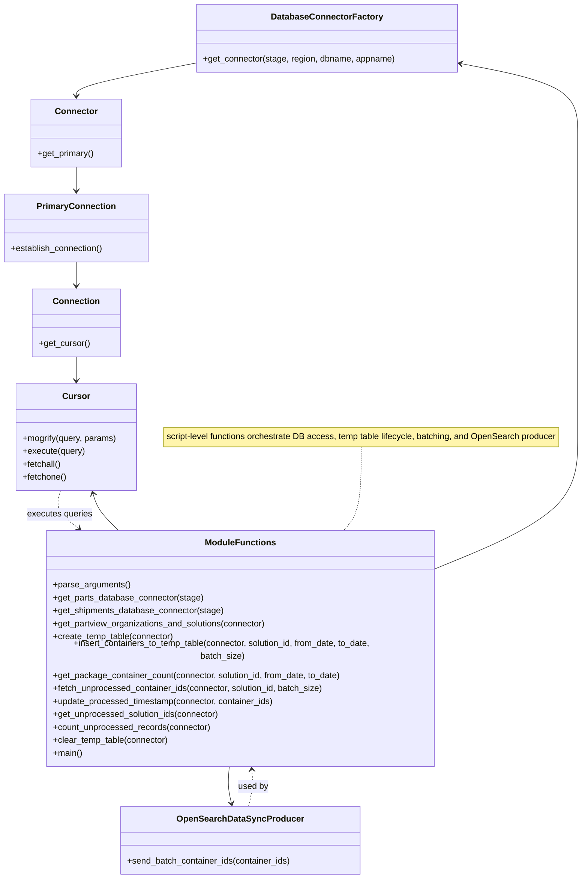

# Diagram: partview_core/partview_service/scripts/BackfillOpenSearchIndex.py


> Auto-generated by Obscura crawlers

## Diagram 1

```mermaid
flowchart LR
    A[parse_arguments()] --> B[set AWS_STAGE & vars]
    B --> C[get_shipments_database_connector(stage)]
    B --> D[get_parts_database_connector(stage)]
    C --> E[get_partview_organizations_and_solutions(connector)]
    D --> F[create_temp_table(connector)]
    F --> G{args.reset?}
    G -->|yes| H[clear_temp_table(connector)]
    G -->|no| I[skip clear]
    H --> I
    I --> J[count_unprocessed_records(connector)]
    J --> K{unprocessed_count > 0}
    K -->|yes| L[Resume processing existing records]
    K -->|no| M[Compute total_count across solutions]
    M --> N[input confirm yes/no]
    N -->|no| O[Abort process]
    N -->|yes| P[create_temp_table(connector)]
    P --> Q[for each solution in results]
    Q --> R[get_package_container_count(connector, solution)]
    R --> S{total_count > 0}
    S -->|yes| T[insert_containers_to_temp_table(connector, solution, dates, batch_size)]
    S -->|no| U[skip insertion]
    L --> V[get_unprocessed_solution_ids(connector)]
    T --> V
    U --> V
    V --> W[for solution_id in solution_ids]
    W --> X[loop: fetch_unprocessed_container_ids(connector, solution_id, batch_size)]
    X --> Y{container_batch empty?}
    Y -->|yes| Z[break -> next solution]
    Y -->|no| AA[OpenSearchDataSyncProducer.send_batch_container_ids(container_batch)]
    AA --> AB[update_processed_timestamp(connector, container_batch)]
    AB --> AC[log elapsed time]
    Z --> AD[continue]
    AC --> AD
    AD --> AE[Processing completed successfully]
```

> SVG rendering failed for this diagram.

## Diagram 2



### SVG

<svg id="container" width="1093.4300537109375" xmlns="http://www.w3.org/2000/svg" class="classDiagram" height="1606" viewBox="0 0 1093.4300537109375 1606" role="graphics-document document" aria-roledescription="class"><style>#container{font-family:"trebuchet ms",verdana,arial,sans-serif;font-size:16px;fill:#333;}@keyframes edge-animation-frame{from{stroke-dashoffset:0;}}@keyframes dash{to{stroke-dashoffset:0;}}#container .edge-animation-slow{stroke-dasharray:9,5!important;stroke-dashoffset:900;animation:dash 50s linear infinite;stroke-linecap:round;}#container .edge-animation-fast{stroke-dasharray:9,5!important;stroke-dashoffset:900;animation:dash 20s linear infinite;stroke-linecap:round;}#container .error-icon{fill:#552222;}#container .error-text{fill:#552222;stroke:#552222;}#container .edge-thickness-normal{stroke-width:1px;}#container .edge-thickness-thick{stroke-width:3.5px;}#container .edge-pattern-solid{stroke-dasharray:0;}#container .edge-thickness-invisible{stroke-width:0;fill:none;}#container .edge-pattern-dashed{stroke-dasharray:3;}#container .edge-pattern-dotted{stroke-dasharray:2;}#container .marker{fill:#333333;stroke:#333333;}#container .marker.cross{stroke:#333333;}#container svg{font-family:"trebuchet ms",verdana,arial,sans-serif;font-size:16px;}#container p{margin:0;}#container g.classGroup text{fill:#9370DB;stroke:none;font-family:"trebuchet ms",verdana,arial,sans-serif;font-size:10px;}#container g.classGroup text .title{font-weight:bolder;}#container .nodeLabel,#container .edgeLabel{color:#131300;}#container .edgeLabel .label rect{fill:#ECECFF;}#container .label text{fill:#131300;}#container .labelBkg{background:#ECECFF;}#container .edgeLabel .label span{background:#ECECFF;}#container .classTitle{font-weight:bolder;}#container .node rect,#container .node circle,#container .node ellipse,#container .node polygon,#container .node path{fill:#ECECFF;stroke:#9370DB;stroke-width:1px;}#container .divider{stroke:#9370DB;stroke-width:1;}#container g.clickable{cursor:pointer;}#container g.classGroup rect{fill:#ECECFF;stroke:#9370DB;}#container g.classGroup line{stroke:#9370DB;stroke-width:1;}#container .classLabel .box{stroke:none;stroke-width:0;fill:#ECECFF;opacity:0.5;}#container .classLabel .label{fill:#9370DB;font-size:10px;}#container .relation{stroke:#333333;stroke-width:1;fill:none;}#container .dashed-line{stroke-dasharray:3;}#container .dotted-line{stroke-dasharray:1 2;}#container #compositionStart,#container .composition{fill:#333333!important;stroke:#333333!important;stroke-width:1;}#container #compositionEnd,#container .composition{fill:#333333!important;stroke:#333333!important;stroke-width:1;}#container #dependencyStart,#container .dependency{fill:#333333!important;stroke:#333333!important;stroke-width:1;}#container #dependencyStart,#container .dependency{fill:#333333!important;stroke:#333333!important;stroke-width:1;}#container #extensionStart,#container .extension{fill:transparent!important;stroke:#333333!important;stroke-width:1;}#container #extensionEnd,#container .extension{fill:transparent!important;stroke:#333333!important;stroke-width:1;}#container #aggregationStart,#container .aggregation{fill:transparent!important;stroke:#333333!important;stroke-width:1;}#container #aggregationEnd,#container .aggregation{fill:transparent!important;stroke:#333333!important;stroke-width:1;}#container #lollipopStart,#container .lollipop{fill:#ECECFF!important;stroke:#333333!important;stroke-width:1;}#container #lollipopEnd,#container .lollipop{fill:#ECECFF!important;stroke:#333333!important;stroke-width:1;}#container .edgeTerminals{font-size:11px;line-height:initial;}#container .classTitleText{text-anchor:middle;font-size:18px;fill:#333;}#container .label-icon{display:inline-block;height:1em;overflow:visible;vertical-align:-0.125em;}#container .node .label-icon path{fill:currentColor;stroke:revert;stroke-width:revert;}#container :root{--mermaid-font-family:"trebuchet ms",verdana,arial,sans-serif;}</style><g><defs><marker id="container_class-aggregationStart" class="marker aggregation class" refX="18" refY="7" markerWidth="190" markerHeight="240" orient="auto"><path d="M 18,7 L9,13 L1,7 L9,1 Z"></path></marker></defs><defs><marker id="container_class-aggregationEnd" class="marker aggregation class" refX="1" refY="7" markerWidth="20" markerHeight="28" orient="auto"><path d="M 18,7 L9,13 L1,7 L9,1 Z"></path></marker></defs><defs><marker id="container_class-extensionStart" class="marker extension class" refX="18" refY="7" markerWidth="190" markerHeight="240" orient="auto"><path d="M 1,7 L18,13 V 1 Z"></path></marker></defs><defs><marker id="container_class-extensionEnd" class="marker extension class" refX="1" refY="7" markerWidth="20" markerHeight="28" orient="auto"><path d="M 1,1 V 13 L18,7 Z"></path></marker></defs><defs><marker id="container_class-compositionStart" class="marker composition class" refX="18" refY="7" markerWidth="190" markerHeight="240" orient="auto"><path d="M 18,7 L9,13 L1,7 L9,1 Z"></path></marker></defs><defs><marker id="container_class-compositionEnd" class="marker composition class" refX="1" refY="7" markerWidth="20" markerHeight="28" orient="auto"><path d="M 18,7 L9,13 L1,7 L9,1 Z"></path></marker></defs><defs><marker id="container_class-dependencyStart" class="marker dependency class" refX="6" refY="7" markerWidth="190" markerHeight="240" orient="auto"><path d="M 5,7 L9,13 L1,7 L9,1 Z"></path></marker></defs><defs><marker id="container_class-dependencyEnd" class="marker dependency class" refX="13" refY="7" markerWidth="20" markerHeight="28" orient="auto"><path d="M 18,7 L9,13 L14,7 L9,1 Z"></path></marker></defs><defs><marker id="container_class-lollipopStart" class="marker lollipop class" refX="13" refY="7" markerWidth="190" markerHeight="240" orient="auto"><circle stroke="black" fill="transparent" cx="7" cy="7" r="6"></circle></marker></defs><defs><marker id="container_class-lollipopEnd" class="marker lollipop class" refX="1" refY="7" markerWidth="190" markerHeight="240" orient="auto"><circle stroke="black" fill="transparent" cx="7" cy="7" r="6"></circle></marker></defs><g class="root"><g class="clusters"></g><g class="edgePaths"><path d="M677.039,829L677.039,848.667C677.039,868.333,677.039,907.667,671.297,933.5C665.555,959.333,654.07,971.667,648.328,977.833L642.586,984" id="edgeNote1" class="edge-thickness-normal edge-pattern-dotted relation" style="fill: none;;;fill: none" data-edge="true" data-et="edge" data-id="edgeNote1" data-points="W3sieCI6Njc3LjAzOTA2MjUsInkiOjgyOX0seyJ4Ijo2NzcuMDM5MDYyNSwieSI6OTQ3fSx7IngiOjY0Mi41ODYxMjk2MTA2NTU3LCJ5Ijo5ODR9XQ=="></path><path d="M373.434,115.762L334.786,122.968C296.138,130.174,218.842,144.587,180.195,154.96C141.547,165.333,141.547,171.667,141.547,174.833L141.547,178" id="id_DatabaseConnectorFactory_Connector_1" class="edge-thickness-normal edge-pattern-solid relation" style=";;;" data-edge="true" data-et="edge" data-id="id_DatabaseConnectorFactory_Connector_1" data-points="W3sieCI6MzczLjQzMzU5Mzc1LCJ5IjoxMTUuNzYxNTE1MzQ5NjYxMDd9LHsieCI6MTQxLjU0Njg3NSwieSI6MTU5fSx7IngiOjE0MS41NDY4NzUsInkiOjE4NH1d" marker-end="url(#container_class-dependencyEnd)"></path><path d="M141.547,310L141.547,314.167C141.547,318.333,141.547,326.667,141.547,334C141.547,341.333,141.547,347.667,141.547,350.833L141.547,354" id="id_Connector_PrimaryConnection_2" class="edge-thickness-normal edge-pattern-solid relation" style=";;;" data-edge="true" data-et="edge" data-id="id_Connector_PrimaryConnection_2" data-points="W3sieCI6MTQxLjU0Njg3NSwieSI6MzEwfSx7IngiOjE0MS41NDY4NzUsInkiOjMzNX0seyJ4IjoxNDEuNTQ2ODc1LCJ5IjozNjB9XQ==" marker-end="url(#container_class-dependencyEnd)"></path><path d="M141.547,486L141.547,490.167C141.547,494.333,141.547,502.667,141.547,510C141.547,517.333,141.547,523.667,141.547,526.833L141.547,530" id="id_PrimaryConnection_Connection_3" class="edge-thickness-normal edge-pattern-solid relation" style=";;;" data-edge="true" data-et="edge" data-id="id_PrimaryConnection_Connection_3" data-points="W3sieCI6MTQxLjU0Njg3NSwieSI6NDg2fSx7IngiOjE0MS41NDY4NzUsInkiOjUxMX0seyJ4IjoxNDEuNTQ2ODc1LCJ5Ijo1MzZ9XQ==" marker-end="url(#container_class-dependencyEnd)"></path><path d="M141.547,662L141.547,666.167C141.547,670.333,141.547,678.667,141.547,686C141.547,693.333,141.547,699.667,141.547,702.833L141.547,706" id="id_Connection_Cursor_4" class="edge-thickness-normal edge-pattern-solid relation" style=";;;" data-edge="true" data-et="edge" data-id="id_Connection_Cursor_4" data-points="W3sieCI6MTQxLjU0Njg3NSwieSI6NjYyfSx7IngiOjE0MS41NDY4NzUsInkiOjY4N30seyJ4IjoxNDEuNTQ2ODc1LCJ5Ijo3MTJ9XQ==" marker-end="url(#container_class-dependencyEnd)"></path><path d="M817.672,1049.79L862.298,1032.659C906.924,1015.527,996.177,981.263,1040.803,941.465C1085.43,901.667,1085.43,856.333,1085.43,813C1085.43,769.667,1085.43,728.333,1085.43,693C1085.43,657.667,1085.43,628.333,1085.43,599C1085.43,569.667,1085.43,540.333,1085.43,511C1085.43,481.667,1085.43,452.333,1085.43,423C1085.43,393.667,1085.43,364.333,1085.43,335C1085.43,305.667,1085.43,276.333,1085.43,247C1085.43,217.667,1085.43,188.333,1047.765,166.644C1010.1,144.954,934.771,130.908,897.106,123.884L859.441,116.861" id="id_ModuleFunctions_DatabaseConnectorFactory_5" class="edge-thickness-normal edge-pattern-solid relation" style=";;;" data-edge="true" data-et="edge" data-id="id_ModuleFunctions_DatabaseConnectorFactory_5" data-points="W3sieCI6ODE3LjY3MTg3NSwieSI6MTA0OS43OTAzNTM1MDgwMzg4fSx7IngiOjEwODUuNDI5Njg3NSwieSI6OTQ3fSx7IngiOjEwODUuNDI5Njg3NSwieSI6ODExfSx7IngiOjEwODUuNDI5Njg3NSwieSI6Njg3fSx7IngiOjEwODUuNDI5Njg3NSwieSI6NTk5fSx7IngiOjEwODUuNDI5Njg3NSwieSI6NTExfSx7IngiOjEwODUuNDI5Njg3NSwieSI6NDIzfSx7IngiOjEwODUuNDI5Njg3NSwieSI6MzM1fSx7IngiOjEwODUuNDI5Njg3NSwieSI6MjQ3fSx7IngiOjEwODUuNDI5Njg3NSwieSI6MTU5fSx7IngiOjg1My41NDI5Njg3NSwieSI6MTE1Ljc2MTUxNTM0OTY2MTA3fV0=" marker-end="url(#container_class-dependencyEnd)"></path><path d="M429.343,1398L428.732,1404.167C428.122,1410.333,426.901,1422.667,427.545,1434.028C428.189,1445.389,430.699,1455.779,431.954,1460.973L433.209,1466.168" id="id_ModuleFunctions_OpenSearchDataSyncProducer_6" class="edge-thickness-normal edge-pattern-solid relation" style=";;;" data-edge="true" data-et="edge" data-id="id_ModuleFunctions_OpenSearchDataSyncProducer_6" data-points="W3sieCI6NDI5LjM0MjcyNTQwOTgzNjEsInkiOjEzOTh9LHsieCI6NDI1LjY3OTY4NzUsInkiOjE0MzV9LHsieCI6NDM0LjYxNzUsInkiOjE0NzJ9XQ==" marker-end="url(#container_class-dependencyEnd)"></path><path d="M222.691,984L215.924,977.833C209.157,971.667,195.623,959.333,187.304,947.958C178.985,936.583,175.879,926.167,174.327,920.958L172.774,915.75" id="id_ModuleFunctions_Cursor_7" class="edge-thickness-normal edge-pattern-solid relation" style=";;;" data-edge="true" data-et="edge" data-id="id_ModuleFunctions_Cursor_7" data-points="W3sieCI6MjIyLjY5MDY4NTgzNTA0MSwieSI6OTg0fSx7IngiOjE4Mi4wODk4NDM3NSwieSI6OTQ3fSx7IngiOjE3MS4wNTk3NzEzNjk0ODUzLCJ5Ijo5MTB9XQ==" marker-end="url(#container_class-dependencyEnd)"></path><path d="M465.054,1472L466.544,1465.833C468.034,1459.667,471.013,1447.333,471.991,1435.995C472.968,1424.657,471.944,1414.314,471.432,1409.142L470.92,1403.971" id="id_OpenSearchDataSyncProducer_ModuleFunctions_8" class="edge-thickness-normal edge-pattern-dashed relation" style=";;;" data-edge="true" data-et="edge" data-id="id_OpenSearchDataSyncProducer_ModuleFunctions_8" data-points="W3sieCI6NDY1LjA1NDM3NSwieSI6MTQ3Mn0seyJ4Ijo0NzMuOTkyMTg3NSwieSI6MTQzNX0seyJ4Ijo0NzAuMzI5MTQ5NTkwMTYzOSwieSI6MTM5OH1d" marker-end="url(#container_class-dependencyEnd)"></path><path d="M112.034,910L110.196,916.167C108.357,922.333,104.681,934.667,110.839,946.427C116.997,958.187,132.991,969.374,140.987,974.967L148.984,980.561" id="id_Cursor_ModuleFunctions_9" class="edge-thickness-normal edge-pattern-dashed relation" style=";;;" data-edge="true" data-et="edge" data-id="id_Cursor_ModuleFunctions_9" data-points="W3sieCI6MTEyLjAzMzk3ODYzMDUxNDcxLCJ5Ijo5MTB9LHsieCI6MTAxLjAwMzkwNjI1LCJ5Ijo5NDd9LHsieCI6MTUzLjkwMDU2NjcyNjQzNDQyLCJ5Ijo5ODR9XQ==" marker-end="url(#container_class-dependencyEnd)"></path></g><g class="edgeLabels"><g class="edgeLabel"><g class="label" data-id="edgeNote1" transform="translate(0, 0)"><foreignObject width="0" height="0"><div xmlns="http://www.w3.org/1999/xhtml" class="labelBkg" style="display: table-cell; white-space: nowrap; line-height: 1.5; max-width: 200px; text-align: center;"><span class="edgeLabel"></span></div></foreignObject></g></g><g class="edgeLabel"><g class="label" data-id="id_DatabaseConnectorFactory_Connector_1" transform="translate(0, 0)"><foreignObject width="0" height="0"><div xmlns="http://www.w3.org/1999/xhtml" class="labelBkg" style="display: table-cell; white-space: nowrap; line-height: 1.5; max-width: 200px; text-align: center;"><span class="edgeLabel"></span></div></foreignObject></g></g><g class="edgeLabel"><g class="label" data-id="id_Connector_PrimaryConnection_2" transform="translate(0, 0)"><foreignObject width="0" height="0"><div xmlns="http://www.w3.org/1999/xhtml" class="labelBkg" style="display: table-cell; white-space: nowrap; line-height: 1.5; max-width: 200px; text-align: center;"><span class="edgeLabel"></span></div></foreignObject></g></g><g class="edgeLabel"><g class="label" data-id="id_PrimaryConnection_Connection_3" transform="translate(0, 0)"><foreignObject width="0" height="0"><div xmlns="http://www.w3.org/1999/xhtml" class="labelBkg" style="display: table-cell; white-space: nowrap; line-height: 1.5; max-width: 200px; text-align: center;"><span class="edgeLabel"></span></div></foreignObject></g></g><g class="edgeLabel"><g class="label" data-id="id_Connection_Cursor_4" transform="translate(0, 0)"><foreignObject width="0" height="0"><div xmlns="http://www.w3.org/1999/xhtml" class="labelBkg" style="display: table-cell; white-space: nowrap; line-height: 1.5; max-width: 200px; text-align: center;"><span class="edgeLabel"></span></div></foreignObject></g></g><g class="edgeLabel"><g class="label" data-id="id_ModuleFunctions_DatabaseConnectorFactory_5" transform="translate(0, 0)"><foreignObject width="0" height="0"><div xmlns="http://www.w3.org/1999/xhtml" class="labelBkg" style="display: table-cell; white-space: nowrap; line-height: 1.5; max-width: 200px; text-align: center;"><span class="edgeLabel"></span></div></foreignObject></g></g><g class="edgeLabel"><g class="label" data-id="id_ModuleFunctions_OpenSearchDataSyncProducer_6" transform="translate(0, 0)"><foreignObject width="0" height="0"><div xmlns="http://www.w3.org/1999/xhtml" class="labelBkg" style="display: table-cell; white-space: nowrap; line-height: 1.5; max-width: 200px; text-align: center;"><span class="edgeLabel"></span></div></foreignObject></g></g><g class="edgeLabel"><g class="label" data-id="id_ModuleFunctions_Cursor_7" transform="translate(0, 0)"><foreignObject width="0" height="0"><div xmlns="http://www.w3.org/1999/xhtml" class="labelBkg" style="display: table-cell; white-space: nowrap; line-height: 1.5; max-width: 200px; text-align: center;"><span class="edgeLabel"></span></div></foreignObject></g></g><g class="edgeLabel" transform="translate(473.88848, 1435.42932)"><g class="label" data-id="id_OpenSearchDataSyncProducer_ModuleFunctions_8" transform="translate(-28.3125, -12)"><foreignObject width="56.625" height="24"><div xmlns="http://www.w3.org/1999/xhtml" class="labelBkg" style="display: table-cell; white-space: nowrap; line-height: 1.5; max-width: 200px; text-align: center;"><span class="edgeLabel"><p>used by</p></span></div></foreignObject></g></g><g class="edgeLabel" transform="translate(111.63345, 954.43512)"><g class="label" data-id="id_Cursor_ModuleFunctions_9" transform="translate(-61.0859375, -12)"><foreignObject width="122.171875" height="24"><div xmlns="http://www.w3.org/1999/xhtml" class="labelBkg" style="display: table-cell; white-space: nowrap; line-height: 1.5; max-width: 200px; text-align: center;"><span class="edgeLabel"><p>executes queries</p></span></div></foreignObject></g></g></g><g class="nodes"><g class="node default" id="classId-DatabaseConnectorFactory-0" transform="translate(613.48828125, 71)"><g class="basic label-container"><path d="M-240.0546875 -63 L240.0546875 -63 L240.0546875 63 L-240.0546875 63" stroke="none" stroke-width="0" fill="#ECECFF" style=""></path><path d="M-240.0546875 -63 C-48.59226652232593 -63, 142.87015445534814 -63, 240.0546875 -63 M-240.0546875 -63 C-105.91555886593099 -63, 28.22356976813802 -63, 240.0546875 -63 M240.0546875 -63 C240.0546875 -20.04456259165253, 240.0546875 22.910874816694943, 240.0546875 63 M240.0546875 -63 C240.0546875 -23.120702607648177, 240.0546875 16.758594784703646, 240.0546875 63 M240.0546875 63 C107.4815358958842 63, -25.091615708231586 63, -240.0546875 63 M240.0546875 63 C55.99782870604267 63, -128.05903008791466 63, -240.0546875 63 M-240.0546875 63 C-240.0546875 14.450760248218778, -240.0546875 -34.098479503562444, -240.0546875 -63 M-240.0546875 63 C-240.0546875 37.157674964639334, -240.0546875 11.315349929278668, -240.0546875 -63" stroke="#9370DB" stroke-width="1.3" fill="none" stroke-dasharray="0 0" style=""></path></g><g class="annotation-group text" transform="translate(0, -39)"></g><g class="label-group text" transform="translate(-98.1875, -39)"><g class="label" style="font-weight: bolder" transform="translate(0,-12)"><foreignObject width="196.375" height="24"><div xmlns="http://www.w3.org/1999/xhtml" style="display: table-cell; white-space: nowrap; line-height: 1.5; max-width: 244px; text-align: center;"><span class="nodeLabel markdown-node-label" style=""><p>DatabaseConnectorFactory</p></span></div></foreignObject></g></g><g class="members-group text" transform="translate(-228.0546875, 9)"></g><g class="methods-group text" transform="translate(-228.0546875, 39)"><g class="label" style="" transform="translate(0,-12)"><foreignObject width="357.921875" height="24"><div xmlns="http://www.w3.org/1999/xhtml" style="display: table-cell; white-space: nowrap; line-height: 1.5; max-width: 415px; text-align: center;"><span class="nodeLabel markdown-node-label" style=""><p>+get_connector(stage, region, dbname, appname)</p></span></div></foreignObject></g></g><g class="divider" style=""><path d="M-240.0546875 -15 C-90.08552682618622 -15, 59.88363384762755 -15, 240.0546875 -15 M-240.0546875 -15 C-139.57615337856993 -15, -39.09761925713988 -15, 240.0546875 -15" stroke="#9370DB" stroke-width="1.3" fill="none" stroke-dasharray="0 0" style=""></path></g><g class="divider" style=""><path d="M-240.0546875 9 C-113.63640275851186 9, 12.781881982976273 9, 240.0546875 9 M-240.0546875 9 C-75.32736145836088 9, 89.39996458327823 9, 240.0546875 9" stroke="#9370DB" stroke-width="1.3" fill="none" stroke-dasharray="0 0" style=""></path></g></g><g class="node default" id="classId-Connector-1" transform="translate(141.546875, 247)"><g class="basic label-container"><path d="M-83.65625 -63 L83.65625 -63 L83.65625 63 L-83.65625 63" stroke="none" stroke-width="0" fill="#ECECFF" style=""></path><path d="M-83.65625 -63 C-18.824846547721293 -63, 46.006556904557414 -63, 83.65625 -63 M-83.65625 -63 C-19.480240429176618 -63, 44.695769141646764 -63, 83.65625 -63 M83.65625 -63 C83.65625 -26.649945220098346, 83.65625 9.700109559803309, 83.65625 63 M83.65625 -63 C83.65625 -20.301287235360284, 83.65625 22.39742552927943, 83.65625 63 M83.65625 63 C28.301018681203075 63, -27.05421263759385 63, -83.65625 63 M83.65625 63 C43.142401051338986 63, 2.628552102677972 63, -83.65625 63 M-83.65625 63 C-83.65625 34.51773033124066, -83.65625 6.03546066248132, -83.65625 -63 M-83.65625 63 C-83.65625 30.060722880073243, -83.65625 -2.878554239853514, -83.65625 -63" stroke="#9370DB" stroke-width="1.3" fill="none" stroke-dasharray="0 0" style=""></path></g><g class="annotation-group text" transform="translate(0, -39)"></g><g class="label-group text" transform="translate(-37.421875, -39)"><g class="label" style="font-weight: bolder" transform="translate(0,-12)"><foreignObject width="74.84375" height="24"><div xmlns="http://www.w3.org/1999/xhtml" style="display: table-cell; white-space: nowrap; line-height: 1.5; max-width: 125px; text-align: center;"><span class="nodeLabel markdown-node-label" style=""><p>Connector</p></span></div></foreignObject></g></g><g class="members-group text" transform="translate(-71.65625, 9)"></g><g class="methods-group text" transform="translate(-71.65625, 39)"><g class="label" style="" transform="translate(0,-12)"><foreignObject width="105.890625" height="24"><div xmlns="http://www.w3.org/1999/xhtml" style="display: table-cell; white-space: nowrap; line-height: 1.5; max-width: 163px; text-align: center;"><span class="nodeLabel markdown-node-label" style=""><p>+get_primary()</p></span></div></foreignObject></g></g><g class="divider" style=""><path d="M-83.65625 -15 C-37.13438012512041 -15, 9.387489749759183 -15, 83.65625 -15 M-83.65625 -15 C-39.395207716414546 -15, 4.865834567170907 -15, 83.65625 -15" stroke="#9370DB" stroke-width="1.3" fill="none" stroke-dasharray="0 0" style=""></path></g><g class="divider" style=""><path d="M-83.65625 9 C-30.063376055354716 9, 23.529497889290568 9, 83.65625 9 M-83.65625 9 C-35.94185645377399 9, 11.772537092452026 9, 83.65625 9" stroke="#9370DB" stroke-width="1.3" fill="none" stroke-dasharray="0 0" style=""></path></g></g><g class="node default" id="classId-PrimaryConnection-2" transform="translate(141.546875, 423)"><g class="basic label-container"><path d="M-133.546875 -63 L133.546875 -63 L133.546875 63 L-133.546875 63" stroke="none" stroke-width="0" fill="#ECECFF" style=""></path><path d="M-133.546875 -63 C-70.77794537402829 -63, -8.009015748056584 -63, 133.546875 -63 M-133.546875 -63 C-42.006196011607585 -63, 49.53448297678483 -63, 133.546875 -63 M133.546875 -63 C133.546875 -12.973400032255434, 133.546875 37.05319993548913, 133.546875 63 M133.546875 -63 C133.546875 -28.09651660596353, 133.546875 6.806966788072941, 133.546875 63 M133.546875 63 C59.27399111932846 63, -14.998892761343086 63, -133.546875 63 M133.546875 63 C63.44762607254147 63, -6.651622854917065 63, -133.546875 63 M-133.546875 63 C-133.546875 14.775902076263073, -133.546875 -33.448195847473855, -133.546875 -63 M-133.546875 63 C-133.546875 24.565213805567957, -133.546875 -13.869572388864086, -133.546875 -63" stroke="#9370DB" stroke-width="1.3" fill="none" stroke-dasharray="0 0" style=""></path></g><g class="annotation-group text" transform="translate(0, -39)"></g><g class="label-group text" transform="translate(-69.828125, -39)"><g class="label" style="font-weight: bolder" transform="translate(0,-12)"><foreignObject width="139.65625" height="24"><div xmlns="http://www.w3.org/1999/xhtml" style="display: table-cell; white-space: nowrap; line-height: 1.5; max-width: 188px; text-align: center;"><span class="nodeLabel markdown-node-label" style=""><p>PrimaryConnection</p></span></div></foreignObject></g></g><g class="members-group text" transform="translate(-121.546875, 9)"></g><g class="methods-group text" transform="translate(-121.546875, 39)"><g class="label" style="" transform="translate(0,-12)"><foreignObject width="173.265625" height="24"><div xmlns="http://www.w3.org/1999/xhtml" style="display: table-cell; white-space: nowrap; line-height: 1.5; max-width: 231px; text-align: center;"><span class="nodeLabel markdown-node-label" style=""><p>+establish_connection()</p></span></div></foreignObject></g></g><g class="divider" style=""><path d="M-133.546875 -15 C-64.5699778370255 -15, 4.406919325948991 -15, 133.546875 -15 M-133.546875 -15 C-49.81124889402791 -15, 33.924377211944176 -15, 133.546875 -15" stroke="#9370DB" stroke-width="1.3" fill="none" stroke-dasharray="0 0" style=""></path></g><g class="divider" style=""><path d="M-133.546875 9 C-70.93318724863259 9, -8.319499497265184 9, 133.546875 9 M-133.546875 9 C-47.37944266267651 9, 38.78798967464698 9, 133.546875 9" stroke="#9370DB" stroke-width="1.3" fill="none" stroke-dasharray="0 0" style=""></path></g></g><g class="node default" id="classId-Connection-3" transform="translate(141.546875, 599)"><g class="basic label-container"><path d="M-79.93359375 -63 L79.93359375 -63 L79.93359375 63 L-79.93359375 63" stroke="none" stroke-width="0" fill="#ECECFF" style=""></path><path d="M-79.93359375 -63 C-41.65049340145312 -63, -3.3673930529062375 -63, 79.93359375 -63 M-79.93359375 -63 C-36.21958966237872 -63, 7.494414425242553 -63, 79.93359375 -63 M79.93359375 -63 C79.93359375 -25.859307457303338, 79.93359375 11.281385085393325, 79.93359375 63 M79.93359375 -63 C79.93359375 -25.91331478249444, 79.93359375 11.173370435011122, 79.93359375 63 M79.93359375 63 C45.24709701869905 63, 10.560600287398103 63, -79.93359375 63 M79.93359375 63 C22.40958704353013 63, -35.11441966293974 63, -79.93359375 63 M-79.93359375 63 C-79.93359375 25.358939450423954, -79.93359375 -12.282121099152093, -79.93359375 -63 M-79.93359375 63 C-79.93359375 15.51356587958211, -79.93359375 -31.97286824083578, -79.93359375 -63" stroke="#9370DB" stroke-width="1.3" fill="none" stroke-dasharray="0 0" style=""></path></g><g class="annotation-group text" transform="translate(0, -39)"></g><g class="label-group text" transform="translate(-41.2265625, -39)"><g class="label" style="font-weight: bolder" transform="translate(0,-12)"><foreignObject width="82.453125" height="24"><div xmlns="http://www.w3.org/1999/xhtml" style="display: table-cell; white-space: nowrap; line-height: 1.5; max-width: 132px; text-align: center;"><span class="nodeLabel markdown-node-label" style=""><p>Connection</p></span></div></foreignObject></g></g><g class="members-group text" transform="translate(-67.93359375, 9)"></g><g class="methods-group text" transform="translate(-67.93359375, 39)"><g class="label" style="" transform="translate(0,-12)"><foreignObject width="94.640625" height="24"><div xmlns="http://www.w3.org/1999/xhtml" style="display: table-cell; white-space: nowrap; line-height: 1.5; max-width: 152px; text-align: center;"><span class="nodeLabel markdown-node-label" style=""><p>+get_cursor()</p></span></div></foreignObject></g></g><g class="divider" style=""><path d="M-79.93359375 -15 C-33.3880842478407 -15, 13.157425254318596 -15, 79.93359375 -15 M-79.93359375 -15 C-25.96882081394721 -15, 27.995952122105578 -15, 79.93359375 -15" stroke="#9370DB" stroke-width="1.3" fill="none" stroke-dasharray="0 0" style=""></path></g><g class="divider" style=""><path d="M-79.93359375 9 C-28.36475893304634 9, 23.204075883907322 9, 79.93359375 9 M-79.93359375 9 C-34.44769421426007 9, 11.038205321479865 9, 79.93359375 9" stroke="#9370DB" stroke-width="1.3" fill="none" stroke-dasharray="0 0" style=""></path></g></g><g class="node default" id="classId-Cursor-4" transform="translate(141.546875, 811)"><g class="basic label-container"><path d="M-112.1015625 -99 L112.1015625 -99 L112.1015625 99 L-112.1015625 99" stroke="none" stroke-width="0" fill="#ECECFF" style=""></path><path d="M-112.1015625 -99 C-22.783090033873563 -99, 66.53538243225287 -99, 112.1015625 -99 M-112.1015625 -99 C-55.945941511226174 -99, 0.20967947754765248 -99, 112.1015625 -99 M112.1015625 -99 C112.1015625 -33.06647526127212, 112.1015625 32.867049477455765, 112.1015625 99 M112.1015625 -99 C112.1015625 -23.59775576023759, 112.1015625 51.80448847952482, 112.1015625 99 M112.1015625 99 C41.134268056213685 99, -29.83302638757263 99, -112.1015625 99 M112.1015625 99 C27.560522733121417 99, -56.98051703375717 99, -112.1015625 99 M-112.1015625 99 C-112.1015625 52.146494699381016, -112.1015625 5.292989398762032, -112.1015625 -99 M-112.1015625 99 C-112.1015625 34.638621489233884, -112.1015625 -29.72275702153223, -112.1015625 -99" stroke="#9370DB" stroke-width="1.3" fill="none" stroke-dasharray="0 0" style=""></path></g><g class="annotation-group text" transform="translate(0, -75)"></g><g class="label-group text" transform="translate(-23.90625, -75)"><g class="label" style="font-weight: bolder" transform="translate(0,-12)"><foreignObject width="47.8125" height="24"><div xmlns="http://www.w3.org/1999/xhtml" style="display: table-cell; white-space: nowrap; line-height: 1.5; max-width: 98px; text-align: center;"><span class="nodeLabel markdown-node-label" style=""><p>Cursor</p></span></div></foreignObject></g></g><g class="members-group text" transform="translate(-100.1015625, -27)"></g><g class="methods-group text" transform="translate(-100.1015625, 3)"><g class="label" style="" transform="translate(0,-12)"><foreignObject width="176.296875" height="24"><div xmlns="http://www.w3.org/1999/xhtml" style="display: table-cell; white-space: nowrap; line-height: 1.5; max-width: 234px; text-align: center;"><span class="nodeLabel markdown-node-label" style=""><p>+mogrify(query, params)</p></span></div></foreignObject></g><g class="label" style="" transform="translate(0,12)"><foreignObject width="115.96875" height="24"><div xmlns="http://www.w3.org/1999/xhtml" style="display: table-cell; white-space: nowrap; line-height: 1.5; max-width: 173px; text-align: center;"><span class="nodeLabel markdown-node-label" style=""><p>+execute(query)</p></span></div></foreignObject></g><g class="label" style="" transform="translate(0,36)"><foreignObject width="72.515625" height="24"><div xmlns="http://www.w3.org/1999/xhtml" style="display: table-cell; white-space: nowrap; line-height: 1.5; max-width: 130px; text-align: center;"><span class="nodeLabel markdown-node-label" style=""><p>+fetchall()</p></span></div></foreignObject></g><g class="label" style="" transform="translate(0,60)"><foreignObject width="82.046875" height="24"><div xmlns="http://www.w3.org/1999/xhtml" style="display: table-cell; white-space: nowrap; line-height: 1.5; max-width: 139px; text-align: center;"><span class="nodeLabel markdown-node-label" style=""><p>+fetchone()</p></span></div></foreignObject></g></g><g class="divider" style=""><path d="M-112.1015625 -51 C-42.736998981073185 -51, 26.62756453785363 -51, 112.1015625 -51 M-112.1015625 -51 C-61.918309910665734 -51, -11.735057321331468 -51, 112.1015625 -51" stroke="#9370DB" stroke-width="1.3" fill="none" stroke-dasharray="0 0" style=""></path></g><g class="divider" style=""><path d="M-112.1015625 -27 C-56.69484149189534 -27, -1.288120483790678 -27, 112.1015625 -27 M-112.1015625 -27 C-61.79324715895479 -27, -11.484931817909583 -27, 112.1015625 -27" stroke="#9370DB" stroke-width="1.3" fill="none" stroke-dasharray="0 0" style=""></path></g></g><g class="node default" id="classId-OpenSearchDataSyncProducer-5" transform="translate(449.8359375, 1535)"><g class="basic label-container"><path d="M-220.49609375 -63 L220.49609375 -63 L220.49609375 63 L-220.49609375 63" stroke="none" stroke-width="0" fill="#ECECFF" style=""></path><path d="M-220.49609375 -63 C-114.88319065980407 -63, -9.270287569608143 -63, 220.49609375 -63 M-220.49609375 -63 C-89.6385383618861 -63, 41.21901702622779 -63, 220.49609375 -63 M220.49609375 -63 C220.49609375 -35.17118248298968, 220.49609375 -7.342364965979357, 220.49609375 63 M220.49609375 -63 C220.49609375 -32.0798248092041, 220.49609375 -1.1596496184081886, 220.49609375 63 M220.49609375 63 C66.59855626057873 63, -87.29898122884254 63, -220.49609375 63 M220.49609375 63 C49.70025020721383 63, -121.09559333557235 63, -220.49609375 63 M-220.49609375 63 C-220.49609375 32.63299210678284, -220.49609375 2.265984213565666, -220.49609375 -63 M-220.49609375 63 C-220.49609375 27.726868492913262, -220.49609375 -7.546263014173476, -220.49609375 -63" stroke="#9370DB" stroke-width="1.3" fill="none" stroke-dasharray="0 0" style=""></path></g><g class="annotation-group text" transform="translate(0, -39)"></g><g class="label-group text" transform="translate(-110.9765625, -39)"><g class="label" style="font-weight: bolder" transform="translate(0,-12)"><foreignObject width="221.953125" height="24"><div xmlns="http://www.w3.org/1999/xhtml" style="display: table-cell; white-space: nowrap; line-height: 1.5; max-width: 270px; text-align: center;"><span class="nodeLabel markdown-node-label" style=""><p>OpenSearchDataSyncProducer</p></span></div></foreignObject></g></g><g class="members-group text" transform="translate(-208.49609375, 9)"></g><g class="methods-group text" transform="translate(-208.49609375, 39)"><g class="label" style="" transform="translate(0,-12)"><foreignObject width="306.015625" height="24"><div xmlns="http://www.w3.org/1999/xhtml" style="display: table-cell; white-space: nowrap; line-height: 1.5; max-width: 363px; text-align: center;"><span class="nodeLabel markdown-node-label" style=""><p>+send_batch_container_ids(container_ids)</p></span></div></foreignObject></g></g><g class="divider" style=""><path d="M-220.49609375 -15 C-109.99249563928875 -15, 0.5111024714225039 -15, 220.49609375 -15 M-220.49609375 -15 C-114.2410026993884 -15, -7.985911648776806 -15, 220.49609375 -15" stroke="#9370DB" stroke-width="1.3" fill="none" stroke-dasharray="0 0" style=""></path></g><g class="divider" style=""><path d="M-220.49609375 9 C-69.92988206677717 9, 80.63632961644566 9, 220.49609375 9 M-220.49609375 9 C-124.76267571674985 9, -29.029257683499708 9, 220.49609375 9" stroke="#9370DB" stroke-width="1.3" fill="none" stroke-dasharray="0 0" style=""></path></g></g><g class="node default" id="classId-ModuleFunctions-6" transform="translate(449.8359375, 1191)"><g class="basic label-container"><path d="M-367.8359375 -207 L367.8359375 -207 L367.8359375 207 L-367.8359375 207" stroke="none" stroke-width="0" fill="#ECECFF" style=""></path><path d="M-367.8359375 -207 C-179.14395534994756 -207, 9.548026800104878 -207, 367.8359375 -207 M-367.8359375 -207 C-180.61953621148496 -207, 6.596865077030088 -207, 367.8359375 -207 M367.8359375 -207 C367.8359375 -67.3014216133518, 367.8359375 72.39715677329639, 367.8359375 207 M367.8359375 -207 C367.8359375 -120.55936749146466, 367.8359375 -34.11873498292931, 367.8359375 207 M367.8359375 207 C131.0949617010038 207, -105.6460140979924 207, -367.8359375 207 M367.8359375 207 C76.86932529890163 207, -214.09728690219674 207, -367.8359375 207 M-367.8359375 207 C-367.8359375 98.24834945135586, -367.8359375 -10.503301097288272, -367.8359375 -207 M-367.8359375 207 C-367.8359375 62.83112956431165, -367.8359375 -81.3377408713767, -367.8359375 -207" stroke="#9370DB" stroke-width="1.3" fill="none" stroke-dasharray="0 0" style=""></path></g><g class="annotation-group text" transform="translate(0, -183)"></g><g class="label-group text" transform="translate(-62.21875, -183)"><g class="label" style="font-weight: bolder" transform="translate(0,-12)"><foreignObject width="124.4375" height="24"><div xmlns="http://www.w3.org/1999/xhtml" style="display: table-cell; white-space: nowrap; line-height: 1.5; max-width: 174px; text-align: center;"><span class="nodeLabel markdown-node-label" style=""><p>ModuleFunctions</p></span></div></foreignObject></g></g><g class="members-group text" transform="translate(-355.8359375, -135)"></g><g class="methods-group text" transform="translate(-355.8359375, -105)"><g class="label" style="" transform="translate(0,-12)"><foreignObject width="143.390625" height="24"><div xmlns="http://www.w3.org/1999/xhtml" style="display: table-cell; white-space: nowrap; line-height: 1.5; max-width: 201px; text-align: center;"><span class="nodeLabel markdown-node-label" style=""><p>+parse_arguments()</p></span></div></foreignObject></g><g class="label" style="" transform="translate(0,12)"><foreignObject width="280.109375" height="24"><div xmlns="http://www.w3.org/1999/xhtml" style="display: table-cell; white-space: nowrap; line-height: 1.5; max-width: 337px; text-align: center;"><span class="nodeLabel markdown-node-label" style=""><p>+get_parts_database_connector(stage)</p></span></div></foreignObject></g><g class="label" style="" transform="translate(0,36)"><foreignObject width="318.546875" height="24"><div xmlns="http://www.w3.org/1999/xhtml" style="display: table-cell; white-space: nowrap; line-height: 1.5; max-width: 376px; text-align: center;"><span class="nodeLabel markdown-node-label" style=""><p>+get_shipments_database_connector(stage)</p></span></div></foreignObject></g><g class="label" style="" transform="translate(0,60)"><foreignObject width="401.03125" height="24"><div xmlns="http://www.w3.org/1999/xhtml" style="display: table-cell; white-space: nowrap; line-height: 1.5; max-width: 458px; text-align: center;"><span class="nodeLabel markdown-node-label" style=""><p>+get_partview_organizations_and_solutions(connector)</p></span></div></foreignObject></g><g class="label" style="" transform="translate(0,84)"><foreignObject width="226.109375" height="24"><div xmlns="http://www.w3.org/1999/xhtml" style="display: table-cell; white-space: nowrap; line-height: 1.5; max-width: 283px; text-align: center;"><span class="nodeLabel markdown-node-label" style=""><p>+create_temp_table(connector)</p></span></div></foreignObject></g><g class="label" style="" transform="translate(0,108)"><foreignObject width="649.453125" height="24"><div xmlns="http://www.w3.org/1999/xhtml" style="display: table-cell; white-space: nowrap; line-height: 1.5; max-width: 707px; text-align: center;"><span class="nodeLabel markdown-node-label" style=""><p>+insert_containers_to_temp_table(connector, solution_id, from_date, to_date, batch_size)</p></span></div></foreignObject></g><g class="label" style="" transform="translate(0,132)"><foreignObject width="540.546875" height="24"><div xmlns="http://www.w3.org/1999/xhtml" style="display: table-cell; white-space: nowrap; line-height: 1.5; max-width: 598px; text-align: center;"><span class="nodeLabel markdown-node-label" style=""><p>+get_package_container_count(connector, solution_id, from_date, to_date)</p></span></div></foreignObject></g><g class="label" style="" transform="translate(0,156)"><foreignObject width="507.203125" height="24"><div xmlns="http://www.w3.org/1999/xhtml" style="display: table-cell; white-space: nowrap; line-height: 1.5; max-width: 565px; text-align: center;"><span class="nodeLabel markdown-node-label" style=""><p>+fetch_unprocessed_container_ids(connector, solution_id, batch_size)</p></span></div></foreignObject></g><g class="label" style="" transform="translate(0,180)"><foreignObject width="414.578125" height="24"><div xmlns="http://www.w3.org/1999/xhtml" style="display: table-cell; white-space: nowrap; line-height: 1.5; max-width: 472px; text-align: center;"><span class="nodeLabel markdown-node-label" style=""><p>+update_processed_timestamp(connector, container_ids)</p></span></div></foreignObject></g><g class="label" style="" transform="translate(0,204)"><foreignObject width="312.140625" height="24"><div xmlns="http://www.w3.org/1999/xhtml" style="display: table-cell; white-space: nowrap; line-height: 1.5; max-width: 370px; text-align: center;"><span class="nodeLabel markdown-node-label" style=""><p>+get_unprocessed_solution_ids(connector)</p></span></div></foreignObject></g><g class="label" style="" transform="translate(0,228)"><foreignObject width="294.84375" height="24"><div xmlns="http://www.w3.org/1999/xhtml" style="display: table-cell; white-space: nowrap; line-height: 1.5; max-width: 352px; text-align: center;"><span class="nodeLabel markdown-node-label" style=""><p>+count_unprocessed_records(connector)</p></span></div></foreignObject></g><g class="label" style="" transform="translate(0,252)"><foreignObject width="215.96875" height="24"><div xmlns="http://www.w3.org/1999/xhtml" style="display: table-cell; white-space: nowrap; line-height: 1.5; max-width: 273px; text-align: center;"><span class="nodeLabel markdown-node-label" style=""><p>+clear_temp_table(connector)</p></span></div></foreignObject></g><g class="label" style="" transform="translate(0,276)"><foreignObject width="54.65625" height="24"><div xmlns="http://www.w3.org/1999/xhtml" style="display: table-cell; white-space: nowrap; line-height: 1.5; max-width: 112px; text-align: center;"><span class="nodeLabel markdown-node-label" style=""><p>+main()</p></span></div></foreignObject></g></g><g class="divider" style=""><path d="M-367.8359375 -159 C-195.7662490766344 -159, -23.69656065326882 -159, 367.8359375 -159 M-367.8359375 -159 C-83.00439861537978 -159, 201.82714026924043 -159, 367.8359375 -159" stroke="#9370DB" stroke-width="1.3" fill="none" stroke-dasharray="0 0" style=""></path></g><g class="divider" style=""><path d="M-367.8359375 -135 C-85.51020883083095 -135, 196.8155198383381 -135, 367.8359375 -135 M-367.8359375 -135 C-176.57977652095474 -135, 14.676384458090524 -135, 367.8359375 -135" stroke="#9370DB" stroke-width="1.3" fill="none" stroke-dasharray="0 0" style=""></path></g></g><g class="node undefined" id="note0" transform="translate(677.0390625, 811)"><g class="basic label-container"><path d="M-373.390625 -18 L373.390625 -18 L373.390625 18 L-373.390625 18" stroke="none" stroke-width="0" fill="#fff5ad" style="fill:#fff5ad !important;stroke:#aaaa33 !important"></path><path d="M-373.390625 -18 C-223.09618301136248 -18, -72.80174102272497 -18, 373.390625 -18 M-373.390625 -18 C-189.76585907366956 -18, -6.14109314733912 -18, 373.390625 -18 M373.390625 -18 C373.390625 -9.485094700635326, 373.390625 -0.9701894012706518, 373.390625 18 M373.390625 -18 C373.390625 -7.935828120443446, 373.390625 2.1283437591131076, 373.390625 18 M373.390625 18 C83.95593221929278 18, -205.47876056141445 18, -373.390625 18 M373.390625 18 C116.5104871046479 18, -140.3696507907042 18, -373.390625 18 M-373.390625 18 C-373.390625 3.6289166424813413, -373.390625 -10.742166715037317, -373.390625 -18 M-373.390625 18 C-373.390625 7.764800427940086, -373.390625 -2.4703991441198276, -373.390625 -18" stroke="#aaaa33" stroke-width="1.3" fill="none" stroke-dasharray="0 0" style="fill:#fff5ad !important;stroke:#aaaa33 !important"></path></g><g class="label" style="text-align:left !important;white-space:nowrap !important" transform="translate(-367.390625, -12)"><rect></rect><foreignObject width="734.78125" height="24"><div style="text-align: center; white-space: break-spaces; display: table; line-height: 1.5; max-width: 200px; width: 200px;" xmlns="http://www.w3.org/1999/xhtml"><span style="text-align:left !important;white-space:nowrap !important" class="nodeLabel"><p>script-level functions orchestrate DB access, temp table lifecycle, batching, and OpenSearch producer</p></span></div></foreignObject></g></g></g></g></g></svg>
