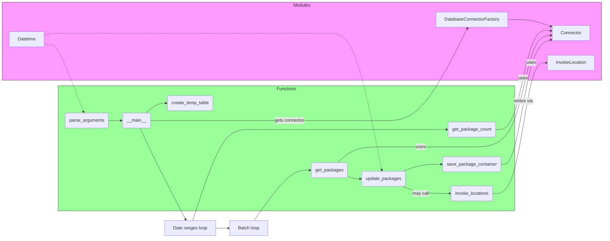

# Diagram: partview_core/partview_service/scripts/BackfillPackages.py

> Auto-generated by Obscura crawlers

## Mermaid

### SVG

<svg id="container" width="2126.15625" xmlns="http://www.w3.org/2000/svg" class="flowchart" height="849" viewBox="0 0 2126.15625 849" role="graphics-document document" aria-roledescription="flowchart-v2"><g><marker id="container_flowchart-v2-pointEnd" class="marker flowchart-v2" viewBox="0 0 10 10" refX="5" refY="5" markerUnits="userSpaceOnUse" markerWidth="8" markerHeight="8" orient="auto"><path d="M 0 0 L 10 5 L 0 10 z" class="arrowMarkerPath" style="stroke-width: 1; stroke-dasharray: 1, 0;"></path></marker><marker id="container_flowchart-v2-pointStart" class="marker flowchart-v2" viewBox="0 0 10 10" refX="4.5" refY="5" markerUnits="userSpaceOnUse" markerWidth="8" markerHeight="8" orient="auto"><path d="M 0 5 L 10 10 L 10 0 z" class="arrowMarkerPath" style="stroke-width: 1; stroke-dasharray: 1, 0;"></path></marker><marker id="container_flowchart-v2-circleEnd" class="marker flowchart-v2" viewBox="0 0 10 10" refX="11" refY="5" markerUnits="userSpaceOnUse" markerWidth="11" markerHeight="11" orient="auto"><circle cx="5" cy="5" r="5" class="arrowMarkerPath" style="stroke-width: 1; stroke-dasharray: 1, 0;"></circle></marker><marker id="container_flowchart-v2-circleStart" class="marker flowchart-v2" viewBox="0 0 10 10" refX="-1" refY="5" markerUnits="userSpaceOnUse" markerWidth="11" markerHeight="11" orient="auto"><circle cx="5" cy="5" r="5" class="arrowMarkerPath" style="stroke-width: 1; stroke-dasharray: 1, 0;"></circle></marker><marker id="container_flowchart-v2-crossEnd" class="marker cross flowchart-v2" viewBox="0 0 11 11" refX="12" refY="5.2" markerUnits="userSpaceOnUse" markerWidth="11" markerHeight="11" orient="auto"><path d="M 1,1 l 9,9 M 10,1 l -9,9" class="arrowMarkerPath" style="stroke-width: 2; stroke-dasharray: 1, 0;"></path></marker><marker id="container_flowchart-v2-crossStart" class="marker cross flowchart-v2" viewBox="0 0 11 11" refX="-1" refY="5.2" markerUnits="userSpaceOnUse" markerWidth="11" markerHeight="11" orient="auto"><path d="M 1,1 l 9,9 M 10,1 l -9,9" class="arrowMarkerPath" style="stroke-width: 2; stroke-dasharray: 1, 0;"></path></marker><g class="root"><g class="clusters"><g class="cluster" id="Functions" data-look="classic"><rect style="fill:#9f9 !important;stroke:#333 !important;stroke-width:1px !important" x="208.828125" y="306" width="1595.078125" height="446"></rect><g class="cluster-label" transform="translate(971.3203125, 306)"><foreignObject width="70.09375" height="24">

Functions

</foreignObject></g></g><g class="cluster" id="Modules" data-look="classic"><rect style="fill:#f9f !important;stroke:#333 !important;stroke-width:1px !important" x="8" y="8" width="2110.15625" height="278"></rect><g class="cluster-label" transform="translate(1032.3359375, 8)"><foreignObject width="61.484375" height="24">

Modules

</foreignObject></g></g></g><g class="edgePaths"><path d="M389.359,430.5L393.443,430.417C397.526,430.333,405.693,430.167,413.36,430.154C421.026,430.141,428.193,430.281,431.777,430.351L435.36,430.422" id="L_PARSE_MAIN_0" class="edge-thickness-normal edge-pattern-solid edge-thickness-normal edge-pattern-solid flowchart-link" style=";" data-edge="true" data-et="edge" data-id="L_PARSE_MAIN_0" data-points="W3sieCI6Mzg5LjM1OTM3NSwieSI6NDMwLjV9LHsieCI6NDEzLjg1OTM3NSwieSI6NDMwfSx7IngiOjQzOS4zNTkzNzUsInkiOjQzMC41fV0=" marker-end="url(#container_flowchart-v2-pointEnd)"></path><path d="M505.406,430.5L509.49,430.417C513.573,430.333,521.74,430.167,545.185,430.083C568.63,430,607.354,430,646.078,430C684.802,430,723.526,430,758.559,430C793.591,430,824.932,430,865.201,430C905.469,430,954.664,430,1002.967,430C1051.271,430,1098.682,430,1137.167,430C1175.651,430,1205.208,430,1237.137,430C1269.065,430,1303.365,430,1342.639,430C1381.914,430,1426.164,430,1475.996,375.095C1525.829,320.19,1581.244,210.381,1608.951,155.476L1636.658,100.571" id="L_MAIN_DBF_0" class="edge-thickness-normal edge-pattern-solid edge-thickness-normal edge-pattern-solid flowchart-link" style=";" data-edge="true" data-et="edge" data-id="L_MAIN_DBF_0" data-points="W3sieCI6NTA1LjQwNjI1LCJ5Ijo0MzAuNX0seyJ4Ijo1MjkuOTA2MjUsInkiOjQzMH0seyJ4Ijo2NDYuMDc4MTI1LCJ5Ijo0MzB9LHsieCI6NzYyLjI1LCJ5Ijo0MzB9LHsieCI6ODU2LjI3MzQzNzUsInkiOjQzMH0seyJ4IjoxMDAzLjg1OTM3NSwieSI6NDMwfSx7IngiOjExNDYuMDkzNzUsInkiOjQzMH0seyJ4IjoxMjM0Ljc2NTYyNSwieSI6NDMwfSx7IngiOjEzMzcuNjY0MDYyNSwieSI6NDMwfSx7IngiOjE0NzAuNDE0MDYyNSwieSI6NDMwfSx7IngiOjE2MzguNDYwNTQ2ODc1LCJ5Ijo5N31d" marker-end="url(#container_flowchart-v2-pointEnd)"></path><path d="M1778.906,70L1783.073,70C1787.24,70,1795.573,70,1809.674,70C1823.776,70,1843.646,70,1865.871,74.079C1888.097,78.158,1912.677,86.316,1924.968,90.396L1937.258,94.475" id="L_DBF_Conn_0" class="edge-thickness-normal edge-pattern-solid edge-thickness-normal edge-pattern-solid flowchart-link" style=";" data-edge="true" data-et="edge" data-id="L_DBF_Conn_0" data-points="W3sieCI6MTc3OC45MDYyNSwieSI6NzB9LHsieCI6MTgwMy45MDYyNSwieSI6NzB9LHsieCI6MTg2My41MTU2MjUsInkiOjcwfSx7IngiOjE5NDEuMDU0Njg3NSwieSI6OTUuNzM0NjU4NTk5ODI3MTR9XQ==" marker-end="url(#container_flowchart-v2-pointEnd)"></path><path d="M497.651,403.5L503.027,397.583C508.403,391.667,519.155,379.833,529.567,373.99C539.979,368.147,550.052,368.294,555.089,368.368L560.125,368.442" id="L_MAIN_CREATE_0" class="edge-thickness-normal edge-pattern-solid edge-thickness-normal edge-pattern-solid flowchart-link" style=";" data-edge="true" data-et="edge" data-id="L_MAIN_CREATE_0" data-points="W3sieCI6NDk3LjY1MTA4MzY2OTM1NDgsInkiOjQwMy41fSx7IngiOjUyOS45MDYyNSwieSI6MzY4fSx7IngiOjU2NC4xMjUsInkiOjM2OC41fV0=" marker-end="url(#container_flowchart-v2-pointEnd)"></path><path d="M482.113,457.5L490.079,479.75C498.044,502,513.975,546.5,538.65,600.825C563.326,655.151,596.745,719.302,613.455,751.377L630.164,783.453" id="L_MAIN_DatesLoop_0" class="edge-thickness-normal edge-pattern-solid edge-thickness-normal edge-pattern-solid flowchart-link" style=";" data-edge="true" data-et="edge" data-id="L_MAIN_DatesLoop_0" data-points="W3sieCI6NDgyLjExMzQ1MTA4Njk1NjUsInkiOjQ1Ny41fSx7IngiOjUyOS45MDYyNSwieSI6NTkxfSx7IngiOjYzMi4wMTI0NzE5NzMwOTQyLCJ5Ijo3ODd9XQ==" marker-end="url(#container_flowchart-v2-pointEnd)"></path><path d="M654.989,787L672.866,732.833C690.743,678.667,726.496,570.333,760.044,516.167C793.591,462,824.932,462,865.201,462C905.469,462,954.664,462,1002.967,462C1051.271,462,1098.682,462,1137.167,462C1175.651,462,1205.208,462,1237.137,462C1269.065,462,1303.365,462,1342.639,462C1381.914,462,1426.164,462,1463.927,462.08C1501.69,462.16,1532.966,462.32,1548.604,462.4L1564.242,462.48" id="L_DatesLoop_COUNT_0" class="edge-thickness-normal edge-pattern-solid edge-thickness-normal edge-pattern-solid flowchart-link" style=";" data-edge="true" data-et="edge" data-id="L_DatesLoop_COUNT_0" data-points="W3sieCI6NjU0Ljk4OTAzNTg2NjQ3NzMsInkiOjc4N30seyJ4Ijo3NjIuMjUsInkiOjQ2Mn0seyJ4Ijo4NTYuMjczNDM3NSwieSI6NDYyfSx7IngiOjEwMDMuODU5Mzc1LCJ5Ijo0NjJ9LHsieCI6MTE0Ni4wOTM3NSwieSI6NDYyfSx7IngiOjEyMzQuNzY1NjI1LCJ5Ijo0NjJ9LHsieCI6MTMzNy42NjQwNjI1LCJ5Ijo0NjJ9LHsieCI6MTQ3MC40MTQwNjI1LCJ5Ijo0NjJ9LHsieCI6MTU2OC4yNDIxODc1LCJ5Ijo0NjIuNX1d" marker-end="url(#container_flowchart-v2-pointEnd)"></path><path d="M1736.93,462.5L1748.092,462.417C1759.255,462.333,1781.581,462.167,1802.678,402.083C1823.776,342,1843.646,222,1865.841,163.356C1888.037,104.713,1912.558,107.426,1924.818,108.782L1937.079,110.138" id="L_COUNT_Conn_0" class="edge-thickness-normal edge-pattern-solid edge-thickness-normal edge-pattern-solid flowchart-link" style=";" data-edge="true" data-et="edge" data-id="L_COUNT_Conn_0" data-points="W3sieCI6MTczNi45Mjk2ODc1LCJ5Ijo0NjIuNX0seyJ4IjoxODAzLjkwNjI1LCJ5Ijo0NjJ9LHsieCI6MTg2My41MTU2MjUsInkiOjEwMn0seyJ4IjoxOTQxLjA1NDY4NzUsInkiOjExMC41NzgyMTk1MzMyNzU3MX1d" marker-end="url(#container_flowchart-v2-pointEnd)"></path><path d="M737.25,814L741.417,814C745.583,814,753.917,814,761.583,814C769.25,814,776.25,814,779.75,814L783.25,814" id="L_DatesLoop_BatchLoop_0" class="edge-thickness-normal edge-pattern-solid edge-thickness-normal edge-pattern-solid flowchart-link" style=";" data-edge="true" data-et="edge" data-id="L_DatesLoop_BatchLoop_0" data-points="W3sieCI6NzM3LjI1LCJ5Ijo4MTR9LHsieCI6NzYyLjI1LCJ5Ijo4MTR9LHsieCI6Nzg3LjI1LCJ5Ijo4MTR9XQ==" marker-end="url(#container_flowchart-v2-pointEnd)"></path><path d="M875.524,787L896.913,757C918.302,727,961.081,667,994.981,637.079C1028.88,607.158,1053.901,607.316,1066.412,607.396L1078.922,607.475" id="L_BatchLoop_GET_0" class="edge-thickness-normal edge-pattern-solid edge-thickness-normal edge-pattern-solid flowchart-link" style=";" data-edge="true" data-et="edge" data-id="L_BatchLoop_GET_0" data-points="W3sieCI6ODc1LjUyMzc3NzE3MzkxMywieSI6Nzg3fSx7IngiOjEwMDMuODU5Mzc1LCJ5Ijo2MDd9LHsieCI6MTA4Mi45MjE4NzUsInkiOjYwNy41fV0=" marker-end="url(#container_flowchart-v2-pointEnd)"></path><path d="M1175.439,580.5L1185.327,571.083C1195.214,561.667,1214.99,542.833,1242.028,533.417C1269.065,524,1303.365,524,1342.639,524C1381.914,524,1426.164,524,1478.568,524C1530.971,524,1591.529,524,1647.111,524C1702.693,524,1753.299,524,1788.538,459C1823.776,394,1843.646,264,1865.841,197.644C1888.037,131.287,1912.558,128.574,1924.818,127.218L1937.079,125.862" id="L_GET_Conn_0" class="edge-thickness-normal edge-pattern-solid edge-thickness-normal edge-pattern-solid flowchart-link" style=";" data-edge="true" data-et="edge" data-id="L_GET_Conn_0" data-points="W3sieCI6MTE3NS40Mzg4MTc3NzEwODQ0LCJ5Ijo1ODAuNX0seyJ4IjoxMjM0Ljc2NTYyNSwieSI6NTI0fSx7IngiOjEzMzcuNjY0MDYyNSwieSI6NTI0fSx7IngiOjE0NzAuNDE0MDYyNSwieSI6NTI0fSx7IngiOjE2NTIuMDg1OTM3NSwieSI6NTI0fSx7IngiOjE4MDMuOTA2MjUsInkiOjUyNH0seyJ4IjoxODYzLjUxNTYyNSwieSI6MTM0fSx7IngiOjE5NDEuMDU0Njg3NSwieSI6MTI1LjQyMTc4MDQ2NjcyNDI5fV0=" marker-end="url(#container_flowchart-v2-pointEnd)"></path><path d="M1210.255,629.756L1214.34,631.13C1218.425,632.504,1226.595,635.252,1234.264,636.696C1241.933,638.141,1249.099,638.281,1252.683,638.351L1256.266,638.422" id="L_GET_UPDATE_0" class="edge-thickness-normal edge-pattern-solid edge-thickness-normal edge-pattern-solid flowchart-link" style=";" data-edge="true" data-et="edge" data-id="L_GET_UPDATE_0" data-points="W3sieCI6MTIxMC4yNTUwMjgxOTE0OTIsInkiOjYyOS43NTYyMDcyMTI2NzMyfSx7IngiOjEyMzQuNzY1NjI1LCJ5Ijo2Mzh9LHsieCI6MTI2MC4yNjU2MjUsInkiOjYzOC41fV0=" marker-end="url(#container_flowchart-v2-pointEnd)"></path><path d="M1407.092,665.5L1417.646,669.583C1428.199,673.667,1449.307,681.833,1476.875,685.997C1504.443,690.16,1538.471,690.321,1555.486,690.401L1572.5,690.481" id="L_UPDATE_INVOKE_0" class="edge-thickness-normal edge-pattern-solid edge-thickness-normal edge-pattern-solid flowchart-link" style=";" data-edge="true" data-et="edge" data-id="L_UPDATE_INVOKE_0" data-points="W3sieCI6MTQwNy4wOTE5NDcxMTUzODQ1LCJ5Ijo2NjUuNX0seyJ4IjoxNDcwLjQxNDA2MjUsInkiOjY5MH0seyJ4IjoxNTc2LjUsInkiOjY5MC41fV0=" marker-end="url(#container_flowchart-v2-pointEnd)"></path><path d="M1728.672,690.5L1741.211,690.417C1753.75,690.333,1778.828,690.167,1801.302,612.417C1823.776,534.667,1843.646,379.333,1862.849,301.667C1882.052,224,1900.589,224,1909.857,224L1919.125,224" id="L_INVOKE_Invoke_0" class="edge-thickness-normal edge-pattern-solid edge-thickness-normal edge-pattern-solid flowchart-link" style=";" data-edge="true" data-et="edge" data-id="L_INVOKE_Invoke_0" data-points="W3sieCI6MTcyOC42NzE4NzUsInkiOjY5MC41fSx7IngiOjE4MDMuOTA2MjUsInkiOjY5MH0seyJ4IjoxODYzLjUxNTYyNSwieSI6MjI0fSx7IngiOjE5MjMuMTI1LCJ5IjoyMjR9XQ==" marker-end="url(#container_flowchart-v2-pointEnd)"></path><path d="M1407.092,611.5L1417.646,607.25C1428.199,603,1449.307,594.5,1472.375,590.329C1495.443,586.158,1520.471,586.316,1532.986,586.396L1545.5,586.475" id="L_UPDATE_SAVE_0" class="edge-thickness-normal edge-pattern-solid edge-thickness-normal edge-pattern-solid flowchart-link" style=";" data-edge="true" data-et="edge" data-id="L_UPDATE_SAVE_0" data-points="W3sieCI6MTQwNy4wOTE5NDcxMTUzODQ1LCJ5Ijo2MTEuNX0seyJ4IjoxNDcwLjQxNDA2MjUsInkiOjU4Nn0seyJ4IjoxNTQ5LjUsInkiOjU4Ni41fV0=" marker-end="url(#container_flowchart-v2-pointEnd)"></path><path d="M1755.672,586.5L1763.711,586.417C1771.75,586.333,1787.828,586.167,1805.802,516.083C1823.776,446,1843.646,306,1865.871,231.921C1888.097,157.842,1912.677,149.684,1924.968,145.604L1937.258,141.525" id="L_SAVE_Conn_0" class="edge-thickness-normal edge-pattern-solid edge-thickness-normal edge-pattern-solid flowchart-link" style=";" data-edge="true" data-et="edge" data-id="L_SAVE_Conn_0" data-points="W3sieCI6MTc1NS42NzE4NzUsInkiOjU4Ni41fSx7IngiOjE4MDMuOTA2MjUsInkiOjU4Nn0seyJ4IjoxODYzLjUxNTYyNSwieSI6MTY2fSx7IngiOjE5NDEuMDU0Njg3NSwieSI6MTQwLjI2NTM0MTQwMDE3Mjg3fV0=" marker-end="url(#container_flowchart-v2-pointEnd)"></path><path d="M158.828,155.028L162.995,156.024C167.161,157.019,175.495,159.009,183.828,160.005C192.161,161,200.495,161,219.878,200.794C239.261,240.588,269.693,320.176,284.909,359.97L300.125,399.764" id="L_DatetimeUtil_PARSE_0" class="edge-thickness-normal edge-pattern-dotted edge-thickness-normal edge-pattern-solid flowchart-link" style=";" data-edge="true" data-et="edge" data-id="L_DatetimeUtil_PARSE_0" data-points="W3sieCI6MTU4LjgyODEyNSwieSI6MTU1LjAyODI1OTEzMDg5ODQyfSx7IngiOjE4My44MjgxMjUsInkiOjE2MX0seyJ4IjoyMDguODI4MTI1LCJ5IjoxNjF9LHsieCI6MzAxLjU1NDA3NzYwMjIzMDUsInkiOjQwMy41fV0=" marker-end="url(#container_flowchart-v2-pointEnd)"></path><path d="M158.828,124.972L162.995,123.976C167.161,122.981,175.495,120.991,183.828,119.995C192.161,119,200.495,119,221.747,119C243,119,277.172,119,311.344,119C345.516,119,379.688,119,406.444,119C433.201,119,452.542,119,471.883,119C491.224,119,510.565,119,539.598,119C568.63,119,607.354,119,646.078,119C684.802,119,723.526,119,758.559,119C793.591,119,824.932,119,865.201,119C905.469,119,954.664,119,1002.967,119C1051.271,119,1098.682,119,1137.167,119C1175.651,119,1205.208,119,1236.198,200.429C1267.187,281.859,1299.609,444.718,1315.819,526.147L1332.03,607.577" id="L_DatetimeUtil_UPDATE_0" class="edge-thickness-normal edge-pattern-dotted edge-thickness-normal edge-pattern-solid flowchart-link" style=";" data-edge="true" data-et="edge" data-id="L_DatetimeUtil_UPDATE_0" data-points="W3sieCI6MTU4LjgyODEyNSwieSI6MTI0Ljk3MTc0MDg2OTEwMTU4fSx7IngiOjE4My44MjgxMjUsInkiOjExOX0seyJ4IjoyMDguODI4MTI1LCJ5IjoxMTl9LHsieCI6MzExLjM0Mzc1LCJ5IjoxMTl9LHsieCI6NDEzLjg1OTM3NSwieSI6MTE5fSx7IngiOjQ3MS44ODI4MTI1LCJ5IjoxMTl9LHsieCI6NTI5LjkwNjI1LCJ5IjoxMTl9LHsieCI6NjQ2LjA3ODEyNSwieSI6MTE5fSx7IngiOjc2Mi4yNSwieSI6MTE5fSx7IngiOjg1Ni4yNzM0Mzc1LCJ5IjoxMTl9LHsieCI6MTAwMy44NTkzNzUsInkiOjExOX0seyJ4IjoxMTQ2LjA5Mzc1LCJ5IjoxMTl9LHsieCI6MTIzNC43NjU2MjUsInkiOjExOX0seyJ4IjoxMzMyLjgxMDk2NDU5NTM3NTcsInkiOjYxMS41fV0=" marker-end="url(#container_flowchart-v2-pointEnd)"></path></g><g class="edgeLabels"><g class="edgeLabel"><g class="label" data-id="L_PARSE_MAIN_0" transform="translate(0, 0)"><foreignObject width="0" height="0">

</foreignObject></g></g><g class="edgeLabel" transform="translate(1003.859375, 430)"><g class="label" data-id="L_MAIN_DBF_0" transform="translate(-53.5625, -12)"><foreignObject width="107.125" height="24">

gets connector

</foreignObject></g></g><g class="edgeLabel"><g class="label" data-id="L_DBF_Conn_0" transform="translate(0, 0)"><foreignObject width="0" height="0">

</foreignObject></g></g><g class="edgeLabel"><g class="label" data-id="L_MAIN_CREATE_0" transform="translate(0, 0)"><foreignObject width="0" height="0">

</foreignObject></g></g><g class="edgeLabel"><g class="label" data-id="L_MAIN_DatesLoop_0" transform="translate(0, 0)"><foreignObject width="0" height="0">

</foreignObject></g></g><g class="edgeLabel"><g class="label" data-id="L_DatesLoop_COUNT_0" transform="translate(0, 0)"><foreignObject width="0" height="0">

</foreignObject></g></g><g class="edgeLabel" transform="translate(1834.61216, 276.55726)"><g class="label" data-id="L_COUNT_Conn_0" transform="translate(-16.4921875, -12)"><foreignObject width="32.984375" height="24">

uses

</foreignObject></g></g><g class="edgeLabel"><g class="label" data-id="L_DatesLoop_BatchLoop_0" transform="translate(0, 0)"><foreignObject width="0" height="0">

</foreignObject></g></g><g class="edgeLabel"><g class="label" data-id="L_BatchLoop_GET_0" transform="translate(0, 0)"><foreignObject width="0" height="0">

</foreignObject></g></g><g class="edgeLabel" transform="translate(1470.4140625, 524)"><g class="label" data-id="L_GET_Conn_0" transform="translate(-16.4921875, -12)"><foreignObject width="32.984375" height="24">

uses

</foreignObject></g></g><g class="edgeLabel"><g class="label" data-id="L_GET_UPDATE_0" transform="translate(0, 0)"><foreignObject width="0" height="0">

</foreignObject></g></g><g class="edgeLabel" transform="translate(1470.4140625, 690)"><g class="label" data-id="L_UPDATE_INVOKE_0" transform="translate(-29.8515625, -12)"><foreignObject width="59.703125" height="24">

may call

</foreignObject></g></g><g class="edgeLabel" transform="translate(1863.515625, 224)"><g class="label" data-id="L_INVOKE_Invoke_0" transform="translate(-16.4921875, -12)"><foreignObject width="32.984375" height="24">

uses

</foreignObject></g></g><g class="edgeLabel"><g class="label" data-id="L_UPDATE_SAVE_0" transform="translate(0, 0)"><foreignObject width="0" height="0">

</foreignObject></g></g><g class="edgeLabel" transform="translate(1836.0619, 359.43544)"><g class="label" data-id="L_SAVE_Conn_0" transform="translate(-34.609375, -12)"><foreignObject width="69.21875" height="24">

writes via

</foreignObject></g></g><g class="edgeLabel"><g class="label" data-id="L_DatetimeUtil_PARSE_0" transform="translate(0, 0)"><foreignObject width="0" height="0">

</foreignObject></g></g><g class="edgeLabel"><g class="label" data-id="L_DatetimeUtil_UPDATE_0" transform="translate(0, 0)"><foreignObject width="0" height="0">

</foreignObject></g></g></g><g class="nodes"><g class="node default" id="flowchart-DBF-0" transform="translate(1652.0859375, 70)"><rect class="basic label-container" style="" x="-126.8203125" y="-27" width="253.640625" height="54"></rect><g class="label" style="" transform="translate(-96.8203125, -12)"><rect></rect><foreignObject width="193.640625" height="24">

DatabaseConnectorFactory

</foreignObject></g></g><g class="node default" id="flowchart-Conn-1" transform="translate(2008.140625, 118)"><rect class="basic label-container" style="" x="-67.0859375" y="-27" width="134.171875" height="54"></rect><g class="label" style="" transform="translate(-37.0859375, -12)"><rect></rect><foreignObject width="74.171875" height="24">

Connector

</foreignObject></g></g><g class="node default" id="flowchart-Invoke-2" transform="translate(2008.140625, 224)"><rect class="basic label-container" style="" x="-85.015625" y="-27" width="170.03125" height="54"></rect><g class="label" style="" transform="translate(-55.015625, -12)"><rect></rect><foreignObject width="110.03125" height="24">

InvokeLocation

</foreignObject></g></g><g class="node default" id="flowchart-DatetimeUtil-3" transform="translate(95.9140625, 140)"><rect class="basic label-container" style="" x="-62.9140625" y="-27" width="125.828125" height="54"></rect><g class="label" style="" transform="translate(-32.9140625, -12)"><rect></rect><foreignObject width="65.828125" height="24">

Datetime

</foreignObject></g></g><g class="node default" id="flowchart-PARSE-4" transform="translate(311.34375, 430)"><g class="basic label-container outer-path"><path d="M-72.515625 -27 C-24.856492544497492 -27, 22.802639911005016 -27, 72.515625 -27 C72.515625 -27, 72.515625 -27, 72.515625 -27 C72.66154910247249 -26.99396453447724, 72.807473204945 -26.987929068954482, 72.92852172736166 -26.982922465033347 C73.07503069128445 -26.964660141725535, 73.22153965520725 -26.94639781841772, 73.33859795140367 -26.931806517013612 C73.44191192188617 -26.91014385543036, 73.54522589236868 -26.888481193847102, 73.743052435704 -26.847001329696653 C73.87366130194002 -26.80811738549917, 74.00427016817603 -26.769233441301683, 74.13912234602341 -26.729086208503173 C74.2359658188549 -26.69129776814254, 74.33280929168637 -26.653509327781908, 74.52410212326485 -26.578866633275286 C74.60933155138622 -26.537200504769093, 74.69456097950759 -26.4955343762629, 74.89536196518537 -26.397368756032446 C75.01110550757872 -26.328400574722714, 75.12684904997207 -26.259432393412986, 75.25036579061214 -26.185832391312644 C75.33140606645858 -26.12797074650217, 75.41244634230502 -26.0701091016917, 75.58668856344833 -25.94570254698197 C75.69066954580869 -25.857635147265363, 75.79465052816903 -25.76956774754876, 75.9020328581287 -25.678619553365657 C75.98343949054505 -25.59721292094931, 76.0648461229614 -25.515806288532964, 76.19424455336566 -25.386407858128706 C76.27387503930875 -25.292388321037347, 76.35350552525185 -25.19836878394599, 76.46132754698196 -25.07106356344834 C76.51779344781981 -24.99197814866614, 76.57425934865765 -24.912892733883936, 76.70145739131264 -24.734740790612136 C76.74923495271543 -24.65455969697362, 76.79701251411821 -24.574378603335106, 76.91299375603245 -24.37973696518537 C76.96330993780722 -24.27681357029214, 77.013626119582 -24.173890175398917, 77.09449163327528 -24.008477123264846 C77.12617349933248 -23.927283459131605, 77.15785536538968 -23.846089794998363, 77.24471120850318 -23.623497346023417 C77.27301663059285 -23.52842110919189, 77.30132205268252 -23.433344872360365, 77.36262632969665 -23.227427435703994 C77.39097731490422 -23.09221538719243, 77.41932830011179 -22.957003338680863, 77.44743151701361 -22.82297295140367 C77.46128738398687 -22.711814656794214, 77.47514325096012 -22.600656362184758, 77.49854746503335 -22.412896727361662 C77.50485458191828 -22.26040470049959, 77.51116169880319 -22.10791267363751, 77.515625 -22 C77.515625 -22, 77.515625 -22, 77.515625 -22 C77.515625 -9.137856782683265, 77.515625 3.72428643463347, 77.515625 22 C77.515625 22, 77.515625 22, 77.515625 22 C77.51115397348904 22.108099454512914, 77.50668294697809 22.21619890902583, 77.49854746503335 22.412896727361662 C77.48777685612109 22.499303627839545, 77.47700624720882 22.585710528317424, 77.44743151701361 22.82297295140367 C77.4157427763138 22.974103485789087, 77.384054035614 23.125234020174506, 77.36262632969665 23.227427435703994 C77.32511496624548 23.353425884483816, 77.28760360279432 23.479424333263637, 77.24471120850318 23.623497346023417 C77.19962385109199 23.739046340129075, 77.15453649368081 23.854595334234737, 77.09449163327528 24.008477123264846 C77.02769963185315 24.145102345918875, 76.96090763043102 24.281727568572904, 76.91299375603245 24.379736965185366 C76.83216551088066 24.515384262847046, 76.75133726572888 24.651031560508727, 76.70145739131264 24.734740790612133 C76.64638237075297 24.81187815635802, 76.5913073501933 24.889015522103904, 76.46132754698196 25.07106356344834 C76.4066101128862 25.135668315806466, 76.35189267879043 25.20027306816459, 76.19424455336566 25.386407858128706 C76.1010876224597 25.47956478903467, 76.00793069155374 25.57272171994063, 75.9020328581287 25.678619553365657 C75.82572092808242 25.74325246117222, 75.74940899803612 25.807885368978784, 75.58668856344833 25.94570254698197 C75.48399641940108 26.019023328551704, 75.38130427535383 26.092344110121438, 75.25036579061214 26.185832391312644 C75.17640526180666 26.22990330062596, 75.10244473300119 26.27397420993928, 74.89536196518537 26.397368756032446 C74.78075068744323 26.453398795561313, 74.66613940970109 26.509428835090183, 74.52410212326485 26.578866633275286 C74.40336165976504 26.6259797083301, 74.28262119626521 26.67309278338491, 74.13912234602341 26.729086208503173 C73.98149890604748 26.776012739763036, 73.82387546607154 26.822939271022904, 73.743052435704 26.847001329696653 C73.65774772099299 26.864887847440674, 73.57244300628199 26.882774365184698, 73.33859795140367 26.931806517013612 C73.22386340421085 26.946108163406493, 73.10912885701802 26.960409809799373, 72.92852172736166 26.982922465033347 C72.84253552825885 26.986478880535138, 72.75654932915606 26.99003529603693, 72.515625 27 C72.515625 27, 72.515625 27, 72.515625 27 C40.433499070760476 27, 8.351373141520952 27, -72.515625 27 C-72.515625 27, -72.515625 27, -72.515625 27 C-72.6788011714578 26.993250983625853, -72.84197734291561 26.98650196725171, -72.92852172736166 26.982922465033347 C-73.03687321053219 26.96941646674109, -73.14522469370274 26.955910468448835, -73.33859795140367 26.931806517013612 C-73.4281795458341 26.913023231895718, -73.51776114026453 26.894239946777823, -73.743052435704 26.847001329696653 C-73.88443459156093 26.80491003821475, -74.02581674741786 26.762818746732847, -74.13912234602341 26.729086208503173 C-74.22575158867875 26.695283373125054, -74.31238083133407 26.661480537746936, -74.52410212326485 26.578866633275286 C-74.63546448745761 26.524424890798713, -74.74682685165037 26.46998314832214, -74.89536196518537 26.397368756032446 C-74.9670475082457 26.354653443982738, -75.03873305130601 26.311938131933026, -75.25036579061214 26.185832391312644 C-75.34182932699605 26.12052868152045, -75.43329286337995 26.055224971728258, -75.58668856344833 25.94570254698197 C-75.69327220845163 25.855430804450933, -75.79985585345493 25.765159061919892, -75.9020328581287 25.67861955336566 C-76.01581822520644 25.564834186287918, -76.1296035922842 25.451048819210175, -76.19424455336566 25.386407858128706 C-76.29980178396484 25.26177667146644, -76.40535901456401 25.13714548480417, -76.46132754698196 25.07106356344834 C-76.51081551521077 25.00175135136936, -76.56030348343957 24.932439139290384, -76.70145739131264 24.734740790612133 C-76.78008575900091 24.60278536368886, -76.8587141266892 24.470829936765586, -76.91299375603245 24.37973696518537 C-76.95928794723858 24.28504068349811, -77.00558213844471 24.19034440181085, -77.09449163327528 24.00847712326485 C-77.14371252397125 23.882334791235138, -77.19293341466722 23.75619245920543, -77.24471120850318 23.623497346023417 C-77.27827272149807 23.51076621105509, -77.31183423449295 23.398035076086757, -77.36262632969665 23.227427435703994 C-77.38604144479451 23.115755631167506, -77.40945655989238 23.00408382663102, -77.44743151701361 22.82297295140367 C-77.4609711153077 22.714351913184018, -77.47451071360179 22.60573087496437, -77.49854746503335 22.412896727361662 C-77.50481004221778 22.261481571172634, -77.5110726194022 22.11006641498361, -77.515625 22 C-77.515625 22, -77.515625 22, -77.515625 22 C-77.515625 11.802084352059062, -77.515625 1.6041687041181234, -77.515625 -22 C-77.515625 -22, -77.515625 -22, -77.515625 -22 C-77.5088743888557 -22.16321472944521, -77.5021237777114 -22.326429458890424, -77.49854746503335 -22.41289672736166 C-77.48384477578917 -22.530848629304078, -77.46914208654499 -22.648800531246497, -77.44743151701361 -22.82297295140367 C-77.41869365413187 -22.960030104149343, -77.38995579125015 -23.09708725689502, -77.36262632969665 -23.227427435703994 C-77.31713655241285 -23.380224904144757, -77.27164677512903 -23.53302237258552, -77.24471120850318 -23.623497346023417 C-77.20219065363334 -23.732468188985393, -77.15967009876348 -23.841439031947374, -77.09449163327528 -24.008477123264846 C-77.02633676202387 -24.147890140713294, -76.95818189077247 -24.287303158161745, -76.91299375603245 -24.379736965185366 C-76.8379336404602 -24.505704092399746, -76.76287352488794 -24.631671219614127, -76.70145739131264 -24.734740790612133 C-76.6421125376198 -24.81785842975094, -76.58276768392696 -24.90097606888975, -76.46132754698196 -25.07106356344834 C-76.39089028145648 -25.1542286857034, -76.320453015931 -25.23739380795846, -76.19424455336566 -25.386407858128706 C-76.12171670007002 -25.458935711424342, -76.04918884677438 -25.531463564719978, -75.9020328581287 -25.678619553365657 C-75.80357750176749 -25.762006986587384, -75.70512214540629 -25.84539441980911, -75.58668856344833 -25.945702546981966 C-75.45582540528245 -26.039137046031776, -75.32496224711659 -26.132571545081582, -75.25036579061214 -26.185832391312644 C-75.12476669346587 -26.260673208564317, -74.99916759631961 -26.33551402581599, -74.89536196518537 -26.397368756032446 C-74.78139383493772 -26.453084379910003, -74.66742570469006 -26.50880000378756, -74.52410212326485 -26.578866633275286 C-74.44057643812614 -26.611458456752512, -74.35705075298743 -26.644050280229738, -74.13912234602341 -26.729086208503173 C-74.04552279471106 -26.756952002266075, -73.95192324339871 -26.784817796028975, -73.743052435704 -26.847001329696653 C-73.59221612884981 -26.87862837737075, -73.44137982199561 -26.910255425044845, -73.33859795140367 -26.931806517013612 C-73.24971464964385 -26.942885809023753, -73.16083134788403 -26.953965101033894, -72.92852172736167 -26.982922465033347 C-72.8091096231282 -26.987861386197775, -72.6896975188947 -26.9928003073622, -72.515625 -27 C-72.515625 -27, -72.515625 -27, -72.515625 -27" stroke="none" stroke-width="0" fill="#ECECFF" style=""></path><path d="M-72.515625 -27 C-35.79330510593029 -27, 0.9290147881394262 -27, 72.515625 -27 M-72.515625 -27 C-32.55640567063923 -27, 7.402813658721541 -27, 72.515625 -27 M72.515625 -27 C72.515625 -27, 72.515625 -27, 72.515625 -27 M72.515625 -27 C72.515625 -27, 72.515625 -27, 72.515625 -27 M72.515625 -27 C72.65266721354283 -26.994331892120726, 72.78970942708565 -26.988663784241453, 72.92852172736166 -26.982922465033347 M72.515625 -27 C72.63535862136976 -26.99504778078845, 72.75509224273954 -26.9900955615769, 72.92852172736166 -26.982922465033347 M72.92852172736166 -26.982922465033347 C73.02541081208659 -26.970845253217302, 73.12229989681153 -26.958768041401257, 73.33859795140367 -26.931806517013612 M72.92852172736166 -26.982922465033347 C73.0268899288401 -26.97066088150625, 73.12525813031854 -26.958399297979156, 73.33859795140367 -26.931806517013612 M73.33859795140367 -26.931806517013612 C73.42954545071328 -26.912736831760146, 73.52049295002287 -26.893667146506683, 73.743052435704 -26.847001329696653 M73.33859795140367 -26.931806517013612 C73.46498056297104 -26.9053068700481, 73.5913631745384 -26.87880722308259, 73.743052435704 -26.847001329696653 M73.743052435704 -26.847001329696653 C73.87588922147994 -26.80745410511428, 74.00872600725587 -26.76790688053191, 74.13912234602341 -26.729086208503173 M73.743052435704 -26.847001329696653 C73.85550032623843 -26.813524142223297, 73.96794821677285 -26.780046954749942, 74.13912234602341 -26.729086208503173 M74.13912234602341 -26.729086208503173 C74.26635735849041 -26.679438952577517, 74.39359237095742 -26.62979169665186, 74.52410212326485 -26.578866633275286 M74.13912234602341 -26.729086208503173 C74.23676555269942 -26.690985711028052, 74.33440875937545 -26.652885213552935, 74.52410212326485 -26.578866633275286 M74.52410212326485 -26.578866633275286 C74.64764961738715 -26.518467943759415, 74.77119711150945 -26.45806925424354, 74.89536196518537 -26.397368756032446 M74.52410212326485 -26.578866633275286 C74.62908057147949 -26.527545797149724, 74.73405901969413 -26.476224961024165, 74.89536196518537 -26.397368756032446 M74.89536196518537 -26.397368756032446 C75.02697041984733 -26.31894713893546, 75.1585788745093 -26.240525521838475, 75.25036579061214 -26.185832391312644 M74.89536196518537 -26.397368756032446 C74.98354658527627 -26.344822128018503, 75.07173120536719 -26.292275500004557, 75.25036579061214 -26.185832391312644 M75.25036579061214 -26.185832391312644 C75.36873340461442 -26.101319539314943, 75.48710101861671 -26.016806687317242, 75.58668856344833 -25.94570254698197 M75.25036579061214 -26.185832391312644 C75.32066144311723 -26.135642260115688, 75.39095709562234 -26.08545212891873, 75.58668856344833 -25.94570254698197 M75.58668856344833 -25.94570254698197 C75.66798922211683 -25.876844401562945, 75.74928988078533 -25.80798625614392, 75.9020328581287 -25.678619553365657 M75.58668856344833 -25.94570254698197 C75.65904228795394 -25.884422068260033, 75.73139601245953 -25.823141589538093, 75.9020328581287 -25.678619553365657 M75.9020328581287 -25.678619553365657 C75.97213224016838 -25.608520171325992, 76.04223162220804 -25.538420789286327, 76.19424455336566 -25.386407858128706 M75.9020328581287 -25.678619553365657 C75.97682275317955 -25.603829658314822, 76.05161264823037 -25.529039763263984, 76.19424455336566 -25.386407858128706 M76.19424455336566 -25.386407858128706 C76.29046301034884 -25.272802940639327, 76.38668146733204 -25.15919802314995, 76.46132754698196 -25.07106356344834 M76.19424455336566 -25.386407858128706 C76.29414397473138 -25.268456834205377, 76.3940433960971 -25.15050581028205, 76.46132754698196 -25.07106356344834 M76.46132754698196 -25.07106356344834 C76.55272561864258 -24.943052599303254, 76.64412369030319 -24.81504163515817, 76.70145739131264 -24.734740790612136 M76.46132754698196 -25.07106356344834 C76.51063793616504 -25.00200006629783, 76.55994832534812 -24.93293656914732, 76.70145739131264 -24.734740790612136 M76.70145739131264 -24.734740790612136 C76.77454931120201 -24.61207672194064, 76.84764123109136 -24.48941265326914, 76.91299375603245 -24.37973696518537 M76.70145739131264 -24.734740790612136 C76.76671021391832 -24.625232424636422, 76.83196303652399 -24.51572405866071, 76.91299375603245 -24.37973696518537 M76.91299375603245 -24.37973696518537 C76.98206346389487 -24.23845261953878, 77.05113317175729 -24.09716827389219, 77.09449163327528 -24.008477123264846 M76.91299375603245 -24.37973696518537 C76.96797236646697 -24.267276420031884, 77.02295097690148 -24.1548158748784, 77.09449163327528 -24.008477123264846 M77.09449163327528 -24.008477123264846 C77.12604012240112 -23.927625274911886, 77.15758861152698 -23.846773426558926, 77.24471120850318 -23.623497346023417 M77.09449163327528 -24.008477123264846 C77.13967707110706 -23.892676770583503, 77.18486250893882 -23.77687641790216, 77.24471120850318 -23.623497346023417 M77.24471120850318 -23.623497346023417 C77.27592176176263 -23.51866294560579, 77.30713231502207 -23.41382854518816, 77.36262632969665 -23.227427435703994 M77.24471120850318 -23.623497346023417 C77.28320380431887 -23.49420299583001, 77.32169640013458 -23.364908645636604, 77.36262632969665 -23.227427435703994 M77.36262632969665 -23.227427435703994 C77.3854167719194 -23.11873483271821, 77.40820721414215 -23.010042229732424, 77.44743151701361 -22.82297295140367 M77.36262632969665 -23.227427435703994 C77.38667696800034 -23.112724682016815, 77.41072760630404 -22.998021928329635, 77.44743151701361 -22.82297295140367 M77.44743151701361 -22.82297295140367 C77.46666547226471 -22.668669098138206, 77.4858994275158 -22.514365244872746, 77.49854746503335 -22.412896727361662 M77.44743151701361 -22.82297295140367 C77.46611052161636 -22.673121173766745, 77.48478952621909 -22.523269396129816, 77.49854746503335 -22.412896727361662 M77.49854746503335 -22.412896727361662 C77.50321681118318 -22.300002346061973, 77.50788615733302 -22.187107964762284, 77.515625 -22 M77.49854746503335 -22.412896727361662 C77.50230749567672 -22.321987568021083, 77.5060675263201 -22.231078408680506, 77.515625 -22 M77.515625 -22 C77.515625 -22, 77.515625 -22, 77.515625 -22 M77.515625 -22 C77.515625 -22, 77.515625 -22, 77.515625 -22 M77.515625 -22 C77.515625 -5.172426690514094, 77.515625 11.655146618971813, 77.515625 22 M77.515625 -22 C77.515625 -4.546943005068613, 77.515625 12.906113989862774, 77.515625 22 M77.515625 22 C77.515625 22, 77.515625 22, 77.515625 22 M77.515625 22 C77.515625 22, 77.515625 22, 77.515625 22 M77.515625 22 C77.51151381582875 22.099399268876113, 77.5074026316575 22.19879853775222, 77.49854746503335 22.412896727361662 M77.515625 22 C77.51215195955491 22.083970376085983, 77.50867891910983 22.16794075217197, 77.49854746503335 22.412896727361662 M77.49854746503335 22.412896727361662 C77.48222426860853 22.54384910159138, 77.46590107218371 22.6748014758211, 77.44743151701361 22.82297295140367 M77.49854746503335 22.412896727361662 C77.4845414871119 22.525259282739253, 77.47053550919044 22.637621838116846, 77.44743151701361 22.82297295140367 M77.44743151701361 22.82297295140367 C77.41393593390053 22.982720712395082, 77.38044035078744 23.14246847338649, 77.36262632969665 23.227427435703994 M77.44743151701361 22.82297295140367 C77.41977012852064 22.954896162375928, 77.39210874002767 23.08681937334818, 77.36262632969665 23.227427435703994 M77.36262632969665 23.227427435703994 C77.31890686821991 23.374278518169433, 77.27518740674317 23.521129600634875, 77.24471120850318 23.623497346023417 M77.36262632969665 23.227427435703994 C77.31779002339735 23.378029933799883, 77.27295371709806 23.52863243189577, 77.24471120850318 23.623497346023417 M77.24471120850318 23.623497346023417 C77.21378002007177 23.70276718827981, 77.18284883164036 23.782037030536205, 77.09449163327528 24.008477123264846 M77.24471120850318 23.623497346023417 C77.21291822814828 23.704975771696624, 77.1811252477934 23.786454197369828, 77.09449163327528 24.008477123264846 M77.09449163327528 24.008477123264846 C77.02815024831207 24.144180595219368, 76.96180886334888 24.279884067173885, 76.91299375603245 24.379736965185366 M77.09449163327528 24.008477123264846 C77.0489658585707 24.101601583875034, 77.00344008386611 24.194726044485222, 76.91299375603245 24.379736965185366 M76.91299375603245 24.379736965185366 C76.86681536574424 24.457234303414083, 76.82063697545604 24.5347316416428, 76.70145739131264 24.734740790612133 M76.91299375603245 24.379736965185366 C76.83934600525613 24.503333838443066, 76.76569825447983 24.626930711700766, 76.70145739131264 24.734740790612133 M76.70145739131264 24.734740790612133 C76.63959595921902 24.82138311710569, 76.5777345271254 24.908025443599247, 76.46132754698196 25.07106356344834 M76.70145739131264 24.734740790612133 C76.64021248902849 24.820519613380714, 76.57896758674434 24.906298436149296, 76.46132754698196 25.07106356344834 M76.46132754698196 25.07106356344834 C76.38385372400187 25.162536733390976, 76.30637990102176 25.254009903333607, 76.19424455336566 25.386407858128706 M76.46132754698196 25.07106356344834 C76.37473829130074 25.17329930444397, 76.28814903561951 25.275535045439597, 76.19424455336566 25.386407858128706 M76.19424455336566 25.386407858128706 C76.09407867194706 25.486573739547307, 75.99391279052846 25.586739620965908, 75.9020328581287 25.678619553365657 M76.19424455336566 25.386407858128706 C76.08679686258829 25.49385554890608, 75.97934917181091 25.601303239683457, 75.9020328581287 25.678619553365657 M75.9020328581287 25.678619553365657 C75.83854432121218 25.732391601206807, 75.77505578429565 25.786163649047957, 75.58668856344833 25.94570254698197 M75.9020328581287 25.678619553365657 C75.81104383440615 25.755683325414164, 75.72005481068359 25.832747097462672, 75.58668856344833 25.94570254698197 M75.58668856344833 25.94570254698197 C75.48944331985028 26.015134316380685, 75.39219807625223 26.0845660857794, 75.25036579061214 26.185832391312644 M75.58668856344833 25.94570254698197 C75.47036216590726 26.028757998438685, 75.35403576836619 26.111813449895404, 75.25036579061214 26.185832391312644 M75.25036579061214 26.185832391312644 C75.16484059633972 26.236794345501714, 75.0793154020673 26.28775629969078, 74.89536196518537 26.397368756032446 M75.25036579061214 26.185832391312644 C75.16169995222326 26.23866576319271, 75.07303411383437 26.291499135072776, 74.89536196518537 26.397368756032446 M74.89536196518537 26.397368756032446 C74.80672824529145 26.440699141375678, 74.71809452539752 26.48402952671891, 74.52410212326485 26.578866633275286 M74.89536196518537 26.397368756032446 C74.75553260549476 26.465727164603617, 74.61570324580416 26.53408557317479, 74.52410212326485 26.578866633275286 M74.52410212326485 26.578866633275286 C74.4226535987413 26.61845197038214, 74.32120507421776 26.65803730748899, 74.13912234602341 26.729086208503173 M74.52410212326485 26.578866633275286 C74.37632912637736 26.636527835589998, 74.22855612948986 26.694189037904707, 74.13912234602341 26.729086208503173 M74.13912234602341 26.729086208503173 C74.02300577684422 26.76365560893123, 73.90688920766502 26.79822500935929, 73.743052435704 26.847001329696653 M74.13912234602341 26.729086208503173 C74.00680170942063 26.76847976881891, 73.87448107281784 26.807873329134644, 73.743052435704 26.847001329696653 M73.743052435704 26.847001329696653 C73.6607178393046 26.864265079120514, 73.57838324290519 26.881528828544376, 73.33859795140367 26.931806517013612 M73.743052435704 26.847001329696653 C73.5939073216033 26.878273771540385, 73.44476220750259 26.90954621338412, 73.33859795140367 26.931806517013612 M73.33859795140367 26.931806517013612 C73.24937327351006 26.942928361514454, 73.16014859561645 26.954050206015296, 72.92852172736166 26.982922465033347 M73.33859795140367 26.931806517013612 C73.2047627120786 26.948489062197815, 73.07092747275354 26.965171607382022, 72.92852172736166 26.982922465033347 M72.92852172736166 26.982922465033347 C72.80876314980156 26.987875716440563, 72.68900457224147 26.992828967847778, 72.515625 27 M72.92852172736166 26.982922465033347 C72.77144642503106 26.98941914759387, 72.61437112270046 26.9959158301544, 72.515625 27 M72.515625 27 C72.515625 27, 72.515625 27, 72.515625 27 M72.515625 27 C72.515625 27, 72.515625 27, 72.515625 27 M72.515625 27 C20.320002675853992 27, -31.875619648292016 27, -72.515625 27 M72.515625 27 C16.44309261436095 27, -39.6294397712781 27, -72.515625 27 M-72.515625 27 C-72.515625 27, -72.515625 27, -72.515625 27 M-72.515625 27 C-72.515625 27, -72.515625 27, -72.515625 27 M-72.515625 27 C-72.67332119965066 26.99347763693636, -72.83101739930132 26.986955273872717, -72.92852172736166 26.982922465033347 M-72.515625 27 C-72.59856598971014 26.99656953529035, -72.68150697942028 26.993139070580703, -72.92852172736166 26.982922465033347 M-72.92852172736166 26.982922465033347 C-73.04159840903901 26.96882747136146, -73.15467509071635 26.95473247768957, -73.33859795140367 26.931806517013612 M-72.92852172736166 26.982922465033347 C-73.06330903239613 26.966121244982226, -73.19809633743061 26.949320024931104, -73.33859795140367 26.931806517013612 M-73.33859795140367 26.931806517013612 C-73.49847346792274 26.898284146383332, -73.65834898444179 26.864761775753053, -73.743052435704 26.847001329696653 M-73.33859795140367 26.931806517013612 C-73.48555321494116 26.900993238547755, -73.63250847847866 26.870179960081902, -73.743052435704 26.847001329696653 M-73.743052435704 26.847001329696653 C-73.82685158932017 26.822053240742882, -73.91065074293633 26.79710515178911, -74.13912234602341 26.729086208503173 M-73.743052435704 26.847001329696653 C-73.86098529276792 26.811891196937083, -73.97891814983184 26.776781064177513, -74.13912234602341 26.729086208503173 M-74.13912234602341 26.729086208503173 C-74.24435622904655 26.688023819926322, -74.34959011206969 26.646961431349474, -74.52410212326485 26.578866633275286 M-74.13912234602341 26.729086208503173 C-74.21774242674023 26.698408557811263, -74.29636250745705 26.667730907119353, -74.52410212326485 26.578866633275286 M-74.52410212326485 26.578866633275286 C-74.6649062725497 26.510031679109535, -74.80571042183453 26.441196724943783, -74.89536196518537 26.397368756032446 M-74.52410212326485 26.578866633275286 C-74.65193985629017 26.516370573761797, -74.7797775893155 26.45387451424831, -74.89536196518537 26.397368756032446 M-74.89536196518537 26.397368756032446 C-75.00705219392462 26.330815825415932, -75.11874242266387 26.26426289479942, -75.25036579061214 26.185832391312644 M-74.89536196518537 26.397368756032446 C-75.02844556147063 26.318068145318804, -75.16152915775588 26.238767534605167, -75.25036579061214 26.185832391312644 M-75.25036579061214 26.185832391312644 C-75.34175751036942 26.1205799576063, -75.43314923012669 26.055327523899955, -75.58668856344833 25.94570254698197 M-75.25036579061214 26.185832391312644 C-75.3533635444914 26.112293408516848, -75.45636129837065 26.038754425721052, -75.58668856344833 25.94570254698197 M-75.58668856344833 25.94570254698197 C-75.67264223082587 25.872903504212665, -75.75859589820341 25.800104461443357, -75.9020328581287 25.67861955336566 M-75.58668856344833 25.94570254698197 C-75.66887671743129 25.876092731374506, -75.75106487141426 25.806482915767038, -75.9020328581287 25.67861955336566 M-75.9020328581287 25.67861955336566 C-76.004449672895 25.576202738599356, -76.10686648766132 25.473785923833052, -76.19424455336566 25.386407858128706 M-75.9020328581287 25.67861955336566 C-75.99559952470092 25.585052886793445, -76.08916619127314 25.491486220221226, -76.19424455336566 25.386407858128706 M-76.19424455336566 25.386407858128706 C-76.26721496492173 25.300251856006973, -76.3401853764778 25.21409585388524, -76.46132754698196 25.07106356344834 M-76.19424455336566 25.386407858128706 C-76.2873960873867 25.276424049738207, -76.38054762140773 25.166440241347708, -76.46132754698196 25.07106356344834 M-76.46132754698196 25.07106356344834 C-76.51804003130499 24.991632787006882, -76.57475251562803 24.912202010565423, -76.70145739131264 24.734740790612133 M-76.46132754698196 25.07106356344834 C-76.52935580241287 24.975784063469888, -76.59738405784377 24.880504563491435, -76.70145739131264 24.734740790612133 M-76.70145739131264 24.734740790612133 C-76.75919436477955 24.637845646949902, -76.81693133824643 24.540950503287668, -76.91299375603245 24.37973696518537 M-76.70145739131264 24.734740790612133 C-76.78321909187443 24.59752695264494, -76.86498079243621 24.46031311467775, -76.91299375603245 24.37973696518537 M-76.91299375603245 24.37973696518537 C-76.98396223222707 24.234568626835582, -77.0549307084217 24.089400288485795, -77.09449163327528 24.00847712326485 M-76.91299375603245 24.37973696518537 C-76.98359540256574 24.235318988901234, -77.05419704909902 24.0909010126171, -77.09449163327528 24.00847712326485 M-77.09449163327528 24.00847712326485 C-77.1491380576681 23.86843034002859, -77.2037844820609 23.728383556792323, -77.24471120850318 23.623497346023417 M-77.09449163327528 24.00847712326485 C-77.14901559625494 23.86874418173319, -77.2035395592346 23.729011240201537, -77.24471120850318 23.623497346023417 M-77.24471120850318 23.623497346023417 C-77.28072653998319 23.50252398005444, -77.31674187146321 23.381550614085466, -77.36262632969665 23.227427435703994 M-77.24471120850318 23.623497346023417 C-77.28716053070366 23.480912586181827, -77.32960985290413 23.33832782634024, -77.36262632969665 23.227427435703994 M-77.36262632969665 23.227427435703994 C-77.37977769435817 23.14562882681355, -77.39692905901968 23.063830217923105, -77.44743151701361 22.82297295140367 M-77.36262632969665 23.227427435703994 C-77.39212319603168 23.08675042950365, -77.42162006236671 22.946073423303304, -77.44743151701361 22.82297295140367 M-77.44743151701361 22.82297295140367 C-77.46477818807655 22.68380978130185, -77.48212485913949 22.544646611200033, -77.49854746503335 22.412896727361662 M-77.44743151701361 22.82297295140367 C-77.45954997184201 22.725752995797333, -77.47166842667042 22.628533040190995, -77.49854746503335 22.412896727361662 M-77.49854746503335 22.412896727361662 C-77.50525232681011 22.2507881156421, -77.51195718858686 22.088679503922535, -77.515625 22 M-77.49854746503335 22.412896727361662 C-77.50212302251406 22.32644771787894, -77.50569857999474 22.239998708396215, -77.515625 22 M-77.515625 22 C-77.515625 22, -77.515625 22, -77.515625 22 M-77.515625 22 C-77.515625 22, -77.515625 22, -77.515625 22 M-77.515625 22 C-77.515625 4.876461331134312, -77.515625 -12.247077337731376, -77.515625 -22 M-77.515625 22 C-77.515625 10.643929961087615, -77.515625 -0.7121400778247704, -77.515625 -22 M-77.515625 -22 C-77.515625 -22, -77.515625 -22, -77.515625 -22 M-77.515625 -22 C-77.515625 -22, -77.515625 -22, -77.515625 -22 M-77.515625 -22 C-77.50906910490966 -22.158506929308782, -77.50251320981933 -22.317013858617564, -77.49854746503335 -22.41289672736166 M-77.515625 -22 C-77.51211653281304 -22.084826915733544, -77.50860806562608 -22.169653831467087, -77.49854746503335 -22.41289672736166 M-77.49854746503335 -22.41289672736166 C-77.47954690514922 -22.56532817300285, -77.46054634526509 -22.717759618644042, -77.44743151701361 -22.82297295140367 M-77.49854746503335 -22.41289672736166 C-77.47944373846765 -22.566155824741035, -77.46034001190193 -22.71941492212041, -77.44743151701361 -22.82297295140367 M-77.44743151701361 -22.82297295140367 C-77.42452217388069 -22.93223261883242, -77.40161283074778 -23.041492286261164, -77.36262632969665 -23.227427435703994 M-77.44743151701361 -22.82297295140367 C-77.42989036353033 -22.906630548427767, -77.41234921004704 -22.99028814545186, -77.36262632969665 -23.227427435703994 M-77.36262632969665 -23.227427435703994 C-77.33415055157008 -23.323075888376685, -77.3056747734435 -23.418724341049376, -77.24471120850318 -23.623497346023417 M-77.36262632969665 -23.227427435703994 C-77.32277846679852 -23.36127404778173, -77.2829306039004 -23.495120659859467, -77.24471120850318 -23.623497346023417 M-77.24471120850318 -23.623497346023417 C-77.198743625558 -23.74130216484092, -77.1527760426128 -23.859106983658428, -77.09449163327528 -24.008477123264846 M-77.24471120850318 -23.623497346023417 C-77.2023204853919 -23.7321354587043, -77.15992976228063 -23.840773571385185, -77.09449163327528 -24.008477123264846 M-77.09449163327528 -24.008477123264846 C-77.03234366352824 -24.135602827292225, -76.97019569378119 -24.262728531319603, -76.91299375603245 -24.379736965185366 M-77.09449163327528 -24.008477123264846 C-77.02748677195987 -24.145537757789967, -76.96048191064446 -24.282598392315087, -76.91299375603245 -24.379736965185366 M-76.91299375603245 -24.379736965185366 C-76.86499690365713 -24.460286076560386, -76.81700005128181 -24.540835187935407, -76.70145739131264 -24.734740790612133 M-76.91299375603245 -24.379736965185366 C-76.86468160510495 -24.460815215804704, -76.81636945417746 -24.541893466424046, -76.70145739131264 -24.734740790612133 M-76.70145739131264 -24.734740790612133 C-76.64722947999184 -24.8106917060486, -76.59300156867101 -24.88664262148507, -76.46132754698196 -25.07106356344834 M-76.70145739131264 -24.734740790612133 C-76.64284915985601 -24.816826726116997, -76.58424092839938 -24.89891266162186, -76.46132754698196 -25.07106356344834 M-76.46132754698196 -25.07106356344834 C-76.40735072663249 -25.13479387480859, -76.35337390628301 -25.19852418616884, -76.19424455336566 -25.386407858128706 M-76.46132754698196 -25.07106356344834 C-76.38177563036615 -25.16499033391028, -76.30222371375034 -25.258917104372216, -76.19424455336566 -25.386407858128706 M-76.19424455336566 -25.386407858128706 C-76.12992880750535 -25.450723603989022, -76.06561306164502 -25.51503934984934, -75.9020328581287 -25.678619553365657 M-76.19424455336566 -25.386407858128706 C-76.09594415965383 -25.484708251840544, -75.99764376594199 -25.583008645552386, -75.9020328581287 -25.678619553365657 M-75.9020328581287 -25.678619553365657 C-75.81542124872001 -25.751975844609955, -75.72880963931131 -25.825332135854257, -75.58668856344833 -25.945702546981966 M-75.9020328581287 -25.678619553365657 C-75.80242228957759 -25.76298540140302, -75.70281172102648 -25.847351249440386, -75.58668856344833 -25.945702546981966 M-75.58668856344833 -25.945702546981966 C-75.47095970593857 -26.028331363056584, -75.3552308484288 -26.110960179131197, -75.25036579061214 -26.185832391312644 M-75.58668856344833 -25.945702546981966 C-75.47383001542832 -26.026282001471152, -75.36097146740832 -26.106861455960335, -75.25036579061214 -26.185832391312644 M-75.25036579061214 -26.185832391312644 C-75.16125033228833 -26.238933678521295, -75.07213487396453 -26.29203496572995, -74.89536196518537 -26.397368756032446 M-75.25036579061214 -26.185832391312644 C-75.14725595767563 -26.247272515795913, -75.0441461247391 -26.30871264027918, -74.89536196518537 -26.397368756032446 M-74.89536196518537 -26.397368756032446 C-74.81926672470574 -26.434569452299222, -74.74317148422611 -26.471770148565998, -74.52410212326485 -26.578866633275286 M-74.89536196518537 -26.397368756032446 C-74.78867021787029 -26.44952717305069, -74.68197847055521 -26.50168559006893, -74.52410212326485 -26.578866633275286 M-74.52410212326485 -26.578866633275286 C-74.39108554406162 -26.63076986354196, -74.2580689648584 -26.682673093808635, -74.13912234602341 -26.729086208503173 M-74.52410212326485 -26.578866633275286 C-74.38095479256029 -26.634722895044483, -74.23780746185574 -26.69057915681368, -74.13912234602341 -26.729086208503173 M-74.13912234602341 -26.729086208503173 C-74.01403388248802 -26.766326657609206, -73.88894541895263 -26.803567106715242, -73.743052435704 -26.847001329696653 M-74.13912234602341 -26.729086208503173 C-74.05769775134473 -26.753327360631904, -73.97627315666605 -26.777568512760638, -73.743052435704 -26.847001329696653 M-73.743052435704 -26.847001329696653 C-73.6383699251117 -26.868950943965235, -73.53368741451939 -26.890900558233813, -73.33859795140367 -26.931806517013612 M-73.743052435704 -26.847001329696653 C-73.63319412286634 -26.870036195571956, -73.5233358100287 -26.893071061447255, -73.33859795140367 -26.931806517013612 M-73.33859795140367 -26.931806517013612 C-73.20765143862134 -26.94812898280978, -73.07670492583902 -26.964451448605946, -72.92852172736167 -26.982922465033347 M-73.33859795140367 -26.931806517013612 C-73.21957258921637 -26.946643012937777, -73.10054722702908 -26.96147950886194, -72.92852172736167 -26.982922465033347 M-72.92852172736167 -26.982922465033347 C-72.78507446643248 -26.9888554876321, -72.6416272055033 -26.99478851023086, -72.515625 -27 M-72.92852172736167 -26.982922465033347 C-72.81826977882886 -26.987482519355506, -72.70801783029606 -26.992042573677665, -72.515625 -27 M-72.515625 -27 C-72.515625 -27, -72.515625 -27, -72.515625 -27 M-72.515625 -27 C-72.515625 -27, -72.515625 -27, -72.515625 -27" stroke="#9370DB" stroke-width="1.3" fill="none" stroke-dasharray="0 0" style=""></path></g><g class="label" style="" transform="translate(-62.515625, -12)"><rect></rect><foreignObject width="125.03125" height="24">

parse_arguments

</foreignObject></g></g><g class="node default" id="flowchart-CREATE-5" transform="translate(646.078125, 368)"><g class="basic label-container outer-path"><path d="M-77.453125 -27 C-35.73723919827706 -27, 5.978646603445881 -27, 77.453125 -27 C77.453125 -27, 77.453125 -27, 77.453125 -27 C77.5858583601156 -26.99451010761674, 77.71859172023119 -26.98902021523348, 77.86602172736166 -26.982922465033347 C77.98855094444075 -26.9676492140524, 78.11108016151982 -26.95237596307145, 78.27609795140367 -26.931806517013612 C78.40509391704583 -26.904758907321906, 78.534089882688 -26.8777112976302, 78.680552435704 -26.847001329696653 C78.81574291815654 -26.806753379253408, 78.95093340060907 -26.766505428810163, 79.07662234602341 -26.729086208503173 C79.21828317934892 -26.673809979811193, 79.35994401267442 -26.618533751119216, 79.46160212326485 -26.578866633275286 C79.57765031327524 -26.522134130142696, 79.69369850328565 -26.46540162701011, 79.83286196518537 -26.397368756032446 C79.93463832514368 -26.3367232089764, 80.03641468510199 -26.276077661920354, 80.18786579061214 -26.185832391312644 C80.26380893808239 -26.13161002621311, 80.33975208555263 -26.077387661113573, 80.52418856344833 -25.94570254698197 C80.59329474866408 -25.887172593733467, 80.66240093387982 -25.828642640484965, 80.8395328581287 -25.678619553365657 C80.92940960350522 -25.58874280798914, 81.01928634888175 -25.498866062612617, 81.13174455336566 -25.386407858128706 C81.22871392132427 -25.271916341725984, 81.32568328928288 -25.15742482532326, 81.39882754698196 -25.07106356344834 C81.46598972041944 -24.976997086775445, 81.53315189385691 -24.882930610102548, 81.63895739131264 -24.734740790612136 C81.69187613163307 -24.64593168549492, 81.74479487195349 -24.5571225803777, 81.85049375603245 -24.37973696518537 C81.91682983428181 -24.244044348287524, 81.98316591253116 -24.108351731389675, 82.03199163327528 -24.008477123264846 C82.07356934589873 -23.901922577895505, 82.11514705852218 -23.795368032526167, 82.18221120850318 -23.623497346023417 C82.2220958862053 -23.489527075198907, 82.2619805639074 -23.355556804374395, 82.30012632969665 -23.227427435703994 C82.3184494084865 -23.1400406658942, 82.33677248727635 -23.052653896084408, 82.38493151701361 -22.82297295140367 C82.40112852042436 -22.693032957002817, 82.41732552383513 -22.563092962601964, 82.43604746503335 -22.412896727361662 C82.4397303870763 -22.323851882093862, 82.44341330911925 -22.234807036826062, 82.453125 -22 C82.453125 -22, 82.453125 -22, 82.453125 -22 C82.453125 -6.223774559862703, 82.453125 9.552450880274595, 82.453125 22 C82.453125 22, 82.453125 22, 82.453125 22 C82.44906961271668 22.098050224504462, 82.44501422543338 22.196100449008924, 82.43604746503335 22.412896727361662 C82.42353988364401 22.513238439620608, 82.41103230225467 22.613580151879557, 82.38493151701361 22.82297295140367 C82.35345673953114 22.973083048414125, 82.32198196204868 23.12319314542458, 82.30012632969665 23.227427435703994 C82.25316091423169 23.38518148542255, 82.20619549876672 23.54293553514111, 82.18221120850318 23.623497346023417 C82.13408093565837 23.746844664042722, 82.08595066281357 23.870191982062032, 82.03199163327528 24.008477123264846 C81.96018565990269 24.1553585894739, 81.8883796865301 24.30224005568295, 81.85049375603245 24.379736965185366 C81.78889254259566 24.483117140267584, 81.72729132915887 24.586497315349803, 81.63895739131264 24.734740790612133 C81.57353611530822 24.826368988721452, 81.50811483930379 24.91799718683077, 81.39882754698196 25.07106356344834 C81.3154306087556 25.16953014234732, 81.23203367052923 25.2679967212463, 81.13174455336566 25.386407858128706 C81.05908099874584 25.45907141274853, 80.98641744412602 25.53173496736835, 80.8395328581287 25.678619553365657 C80.767508592463 25.73962099468398, 80.6954843267973 25.800622436002303, 80.52418856344833 25.94570254698197 C80.41980244219256 26.020232805031547, 80.31541632093679 26.094763063081125, 80.18786579061214 26.185832391312644 C80.08659315164894 26.246177785805507, 79.98532051268576 26.306523180298374, 79.83286196518537 26.397368756032446 C79.75193243760597 26.436932791253554, 79.67100291002657 26.476496826474662, 79.46160212326485 26.578866633275286 C79.34884392947106 26.62286501702557, 79.23608573567725 26.666863400775856, 79.07662234602341 26.729086208503173 C78.98586478808372 26.756105904180263, 78.89510723014402 26.783125599857357, 78.680552435704 26.847001329696653 C78.53494299087195 26.877532419654678, 78.3893335460399 26.908063509612706, 78.27609795140367 26.931806517013612 C78.19319006976853 26.942140973681973, 78.11028218813341 26.952475430350336, 77.86602172736166 26.982922465033347 C77.73682962437289 26.98826588993842, 77.6076375213841 26.993609314843486, 77.453125 27 C77.453125 27, 77.453125 27, 77.453125 27 C16.714587864673383 27, -44.02394927065323 27, -77.453125 27 C-77.453125 27, -77.453125 27, -77.453125 27 C-77.53722445174539 26.99652162094615, -77.62132390349078 26.9930432418923, -77.86602172736166 26.982922465033347 C-78.02775417512312 26.96276253644399, -78.1894866228846 26.942602607854635, -78.27609795140367 26.931806517013612 C-78.39342940126775 26.907204699083202, -78.51076085113183 26.882602881152796, -78.680552435704 26.847001329696653 C-78.798209596438 26.8119732752907, -78.91586675717198 26.776945220884745, -79.07662234602341 26.729086208503173 C-79.1552471461075 26.69840671630844, -79.23387194619158 26.667727224113708, -79.46160212326485 26.578866633275286 C-79.55814019549133 26.531672045539686, -79.65467826771783 26.484477457804086, -79.83286196518537 26.397368756032446 C-79.96584471615797 26.318128236082085, -80.09882746713059 26.23888771613172, -80.18786579061214 26.185832391312644 C-80.30502266806621 26.102183988595, -80.4221795455203 26.01853558587736, -80.52418856344833 25.94570254698197 C-80.5872586551564 25.89228490415409, -80.65032874686447 25.838867261326204, -80.8395328581287 25.67861955336566 C-80.91077112987404 25.607381281620334, -80.98200940161937 25.53614300987501, -81.13174455336566 25.386407858128706 C-81.23710324373265 25.262011087475628, -81.34246193409963 25.137614316822553, -81.39882754698196 25.07106356344834 C-81.45924698226257 24.986440879152628, -81.51966641754319 24.901818194856915, -81.63895739131264 24.734740790612133 C-81.71025176663929 24.61509339095159, -81.78154614196592 24.49544599129105, -81.85049375603245 24.37973696518537 C-81.92180946190886 24.233858357168906, -81.99312516778528 24.087979749152446, -82.03199163327528 24.00847712326485 C-82.08980220209916 23.86032133282107, -82.14761277092305 23.712165542377285, -82.18221120850318 23.623497346023417 C-82.20816488783272 23.53632047387613, -82.23411856716228 23.449143601728846, -82.30012632969665 23.227427435703994 C-82.32770593932304 23.095894246030632, -82.35528554894944 22.96436105635727, -82.38493151701361 22.82297295140367 C-82.40130063513325 22.691652171696916, -82.41766975325291 22.56033139199016, -82.43604746503335 22.412896727361662 C-82.44192250637926 22.270851323878258, -82.44779754772517 22.128805920394854, -82.453125 22 C-82.453125 22, -82.453125 22, -82.453125 22 C-82.453125 8.619427882006757, -82.453125 -4.761144235986485, -82.453125 -22 C-82.453125 -22, -82.453125 -22, -82.453125 -22 C-82.44896551136175 -22.100567163210997, -82.4448060227235 -22.20113432642199, -82.43604746503335 -22.41289672736166 C-82.42017316230174 -22.540247864837696, -82.40429885957012 -22.667599002313732, -82.38493151701361 -22.82297295140367 C-82.35895999024319 -22.946836842266386, -82.33298846347279 -23.0707007331291, -82.30012632969665 -23.227427435703994 C-82.27342748566097 -23.31710727197786, -82.2467286416253 -23.406787108251724, -82.18221120850318 -23.623497346023417 C-82.12354844310464 -23.773837129112497, -82.0648856777061 -23.924176912201577, -82.03199163327528 -24.008477123264846 C-81.96827466039359 -24.138812274502236, -81.90455768751191 -24.26914742573962, -81.85049375603245 -24.379736965185366 C-81.80086292096989 -24.46302825332711, -81.75123208590732 -24.546319541468858, -81.63895739131264 -24.734740790612133 C-81.54771106346135 -24.862539224328724, -81.45646473561006 -24.990337658045313, -81.39882754698196 -25.07106356344834 C-81.31032212780559 -25.175561714407586, -81.22181670862922 -25.280059865366827, -81.13174455336566 -25.386407858128706 C-81.05824160820085 -25.459910803293525, -80.98473866303603 -25.533413748458347, -80.8395328581287 -25.678619553365657 C-80.7364563282181 -25.765920920932846, -80.63337979830749 -25.853222288500035, -80.52418856344833 -25.945702546981966 C-80.45483156685907 -25.995222490736513, -80.38547457026982 -26.044742434491063, -80.18786579061214 -26.185832391312644 C-80.06493306171808 -26.25908439794686, -79.94200033282402 -26.332336404581078, -79.83286196518537 -26.397368756032446 C-79.72277203432665 -26.45118844375657, -79.61268210346792 -26.505008131480693, -79.46160212326485 -26.578866633275286 C-79.37171326552784 -26.613941374405144, -79.28182440779082 -26.649016115535005, -79.07662234602341 -26.729086208503173 C-78.96585493847992 -26.76206309451364, -78.85508753093642 -26.795039980524106, -78.680552435704 -26.847001329696653 C-78.55681709582849 -26.87294590215954, -78.43308175595298 -26.89889047462243, -78.27609795140367 -26.931806517013612 C-78.16632541794422 -26.945489649039654, -78.05655288448477 -26.9591727810657, -77.86602172736167 -26.982922465033347 C-77.76171076295384 -26.98723679843449, -77.65739979854601 -26.99155113183564, -77.453125 -27 C-77.453125 -27, -77.453125 -27, -77.453125 -27" stroke="none" stroke-width="0" fill="#ECECFF" style=""></path><path d="M-77.453125 -27 C-32.34920805785766 -27, 12.754708884284682 -27, 77.453125 -27 M-77.453125 -27 C-22.475347388586798 -27, 32.502430222826405 -27, 77.453125 -27 M77.453125 -27 C77.453125 -27, 77.453125 -27, 77.453125 -27 M77.453125 -27 C77.453125 -27, 77.453125 -27, 77.453125 -27 M77.453125 -27 C77.60829424372626 -26.993582152606496, 77.76346348745254 -26.987164305212993, 77.86602172736166 -26.982922465033347 M77.453125 -27 C77.61596266837273 -26.993264984217014, 77.77880033674546 -26.98652996843403, 77.86602172736166 -26.982922465033347 M77.86602172736166 -26.982922465033347 C78.00023594483089 -26.966192680272737, 78.13445016230014 -26.949462895512124, 78.27609795140367 -26.931806517013612 M77.86602172736166 -26.982922465033347 C78.01692063801389 -26.964112935436372, 78.16781954866613 -26.945303405839397, 78.27609795140367 -26.931806517013612 M78.27609795140367 -26.931806517013612 C78.40681319021215 -26.904398413648135, 78.53752842902064 -26.876990310282658, 78.680552435704 -26.847001329696653 M78.27609795140367 -26.931806517013612 C78.37292478804416 -26.911504064358624, 78.46975162468465 -26.891201611703632, 78.680552435704 -26.847001329696653 M78.680552435704 -26.847001329696653 C78.80056630134702 -26.81127165384023, 78.92058016699005 -26.775541977983806, 79.07662234602341 -26.729086208503173 M78.680552435704 -26.847001329696653 C78.79154236991859 -26.81395819462584, 78.90253230413317 -26.780915059555024, 79.07662234602341 -26.729086208503173 M79.07662234602341 -26.729086208503173 C79.19541218476454 -26.682734269591094, 79.31420202350566 -26.636382330679016, 79.46160212326485 -26.578866633275286 M79.07662234602341 -26.729086208503173 C79.21093670892151 -26.676676581467355, 79.3452510718196 -26.624266954431533, 79.46160212326485 -26.578866633275286 M79.46160212326485 -26.578866633275286 C79.58868654724111 -26.51673884411554, 79.71577097121735 -26.45461105495579, 79.83286196518537 -26.397368756032446 M79.46160212326485 -26.578866633275286 C79.53756338541173 -26.54173143502431, 79.6135246475586 -26.50459623677333, 79.83286196518537 -26.397368756032446 M79.83286196518537 -26.397368756032446 C79.91147456971156 -26.350525811276476, 79.99008717423773 -26.303682866520507, 80.18786579061214 -26.185832391312644 M79.83286196518537 -26.397368756032446 C79.93511045463599 -26.33644188086294, 80.0373589440866 -26.27551500569343, 80.18786579061214 -26.185832391312644 M80.18786579061214 -26.185832391312644 C80.29150908614228 -26.111832500637103, 80.39515238167243 -26.037832609961566, 80.52418856344833 -25.94570254698197 M80.18786579061214 -26.185832391312644 C80.2566623079787 -26.136712622031446, 80.32545882534528 -26.087592852750248, 80.52418856344833 -25.94570254698197 M80.52418856344833 -25.94570254698197 C80.60016422589314 -25.881354443305934, 80.67613988833793 -25.8170063396299, 80.8395328581287 -25.678619553365657 M80.52418856344833 -25.94570254698197 C80.63817497881607 -25.849160977777856, 80.7521613941838 -25.752619408573743, 80.8395328581287 -25.678619553365657 M80.8395328581287 -25.678619553365657 C80.90097284951548 -25.617179561978887, 80.96241284090225 -25.555739570592113, 81.13174455336566 -25.386407858128706 M80.8395328581287 -25.678619553365657 C80.95045692081483 -25.56769549067954, 81.06138098350094 -25.456771427993424, 81.13174455336566 -25.386407858128706 M81.13174455336566 -25.386407858128706 C81.194743077471 -25.312025641272022, 81.25774160157633 -25.23764342441534, 81.39882754698196 -25.07106356344834 M81.13174455336566 -25.386407858128706 C81.20124516326179 -25.304348643085472, 81.27074577315793 -25.22228942804224, 81.39882754698196 -25.07106356344834 M81.39882754698196 -25.07106356344834 C81.48064977111001 -24.956464408249307, 81.56247199523807 -24.841865253050276, 81.63895739131264 -24.734740790612136 M81.39882754698196 -25.07106356344834 C81.47744697177404 -24.96095020782376, 81.55606639656612 -24.85083685219918, 81.63895739131264 -24.734740790612136 M81.63895739131264 -24.734740790612136 C81.68324223652195 -24.660421231048172, 81.72752708173127 -24.58610167148421, 81.85049375603245 -24.37973696518537 M81.63895739131264 -24.734740790612136 C81.71825637452841 -24.601659925620734, 81.79755535774417 -24.468579060629335, 81.85049375603245 -24.37973696518537 M81.85049375603245 -24.37973696518537 C81.90550835066088 -24.267202813186728, 81.96052294528933 -24.15466866118809, 82.03199163327528 -24.008477123264846 M81.85049375603245 -24.37973696518537 C81.88973698272241 -24.299463661945172, 81.92898020941237 -24.219190358704978, 82.03199163327528 -24.008477123264846 M82.03199163327528 -24.008477123264846 C82.07540746253682 -23.897211888674075, 82.11882329179835 -23.7859466540833, 82.18221120850318 -23.623497346023417 M82.03199163327528 -24.008477123264846 C82.07597518153497 -23.895756949575016, 82.11995872979465 -23.783036775885183, 82.18221120850318 -23.623497346023417 M82.18221120850318 -23.623497346023417 C82.22777548417722 -23.47044964190092, 82.27333975985127 -23.317401937778424, 82.30012632969665 -23.227427435703994 M82.18221120850318 -23.623497346023417 C82.22446405171588 -23.48157254746818, 82.2667168949286 -23.339647748912945, 82.30012632969665 -23.227427435703994 M82.30012632969665 -23.227427435703994 C82.32458051903079 -23.110800058900328, 82.34903470836493 -22.99417268209666, 82.38493151701361 -22.82297295140367 M82.30012632969665 -23.227427435703994 C82.32043155509643 -23.130587375237226, 82.34073678049621 -23.033747314770462, 82.38493151701361 -22.82297295140367 M82.38493151701361 -22.82297295140367 C82.39590188472246 -22.7349634917207, 82.40687225243133 -22.64695403203773, 82.43604746503335 -22.412896727361662 M82.38493151701361 -22.82297295140367 C82.40289401121048 -22.678869357907125, 82.42085650540734 -22.534765764410583, 82.43604746503335 -22.412896727361662 M82.43604746503335 -22.412896727361662 C82.44019116848044 -22.31271121488582, 82.44433487192752 -22.212525702409973, 82.453125 -22 M82.43604746503335 -22.412896727361662 C82.44167590014875 -22.276813712813247, 82.44730433526416 -22.140730698264832, 82.453125 -22 M82.453125 -22 C82.453125 -22, 82.453125 -22, 82.453125 -22 M82.453125 -22 C82.453125 -22, 82.453125 -22, 82.453125 -22 M82.453125 -22 C82.453125 -11.261629797283291, 82.453125 -0.5232595945665821, 82.453125 22 M82.453125 -22 C82.453125 -10.670994523930114, 82.453125 0.6580109521397723, 82.453125 22 M82.453125 22 C82.453125 22, 82.453125 22, 82.453125 22 M82.453125 22 C82.453125 22, 82.453125 22, 82.453125 22 M82.453125 22 C82.44660103118582 22.157735023119212, 82.44007706237164 22.31547004623842, 82.43604746503335 22.412896727361662 M82.453125 22 C82.44834003459586 22.11568979713792, 82.44355506919173 22.231379594275843, 82.43604746503335 22.412896727361662 M82.43604746503335 22.412896727361662 C82.42375540074421 22.511509459877637, 82.41146333645507 22.610122192393614, 82.38493151701361 22.82297295140367 M82.43604746503335 22.412896727361662 C82.41657254178851 22.56913373943206, 82.39709761854368 22.72537075150246, 82.38493151701361 22.82297295140367 M82.38493151701361 22.82297295140367 C82.36409198622728 22.922361231105796, 82.34325245544093 23.02174951080792, 82.30012632969665 23.227427435703994 M82.38493151701361 22.82297295140367 C82.36092915540826 22.937445462958888, 82.3369267938029 23.051917974514108, 82.30012632969665 23.227427435703994 M82.30012632969665 23.227427435703994 C82.25619437696187 23.374992263723545, 82.2122624242271 23.522557091743092, 82.18221120850318 23.623497346023417 M82.30012632969665 23.227427435703994 C82.25400727123757 23.382338622352705, 82.20788821277847 23.537249809001413, 82.18221120850318 23.623497346023417 M82.18221120850318 23.623497346023417 C82.12307557227929 23.775048993177034, 82.06393993605539 23.92660064033065, 82.03199163327528 24.008477123264846 M82.18221120850318 23.623497346023417 C82.13861497723306 23.73522491133886, 82.09501874596296 23.8469524766543, 82.03199163327528 24.008477123264846 M82.03199163327528 24.008477123264846 C81.98097860739126 24.11282593556666, 81.92996558150723 24.217174747868476, 81.85049375603245 24.379736965185366 M82.03199163327528 24.008477123264846 C81.9921687347625 24.089936164170826, 81.95234583624972 24.171395205076806, 81.85049375603245 24.379736965185366 M81.85049375603245 24.379736965185366 C81.80670404238613 24.45322558677239, 81.7629143287398 24.52671420835941, 81.63895739131264 24.734740790612133 M81.85049375603245 24.379736965185366 C81.77225494273002 24.511038635496316, 81.69401612942757 24.64234030580727, 81.63895739131264 24.734740790612133 M81.63895739131264 24.734740790612133 C81.58424775548086 24.81136640320557, 81.52953811964908 24.88799201579901, 81.39882754698196 25.07106356344834 M81.63895739131264 24.734740790612133 C81.56152077138242 24.84319752495346, 81.4840841514522 24.951654259294788, 81.39882754698196 25.07106356344834 M81.39882754698196 25.07106356344834 C81.30043944027172 25.187230181529802, 81.20205133356147 25.303396799611264, 81.13174455336566 25.386407858128706 M81.39882754698196 25.07106356344834 C81.33534565146871 25.14601649584791, 81.27186375595547 25.22096942824748, 81.13174455336566 25.386407858128706 M81.13174455336566 25.386407858128706 C81.06212087655938 25.456031534934997, 80.99249719975307 25.525655211741288, 80.8395328581287 25.678619553365657 M81.13174455336566 25.386407858128706 C81.04264369140361 25.47550872009076, 80.95354282944155 25.564609582052817, 80.8395328581287 25.678619553365657 M80.8395328581287 25.678619553365657 C80.77247955971255 25.735410800186806, 80.70542626129641 25.79220204700795, 80.52418856344833 25.94570254698197 M80.8395328581287 25.678619553365657 C80.7589245520323 25.746891306068182, 80.67831624593587 25.815163058770707, 80.52418856344833 25.94570254698197 M80.52418856344833 25.94570254698197 C80.41105976210544 26.026474958634918, 80.29793096076254 26.107247370287865, 80.18786579061214 26.185832391312644 M80.52418856344833 25.94570254698197 C80.41452012850286 26.024004304514968, 80.30485169355738 26.102306062047965, 80.18786579061214 26.185832391312644 M80.18786579061214 26.185832391312644 C80.05709097338568 26.26375726831848, 79.92631615615923 26.34168214532431, 79.83286196518537 26.397368756032446 M80.18786579061214 26.185832391312644 C80.11272836564115 26.230604578524044, 80.03759094067016 26.275376765735448, 79.83286196518537 26.397368756032446 M79.83286196518537 26.397368756032446 C79.72962331086377 26.447839058750482, 79.62638465654216 26.498309361468518, 79.46160212326485 26.578866633275286 M79.83286196518537 26.397368756032446 C79.75310849859167 26.436357850071367, 79.67335503199799 26.475346944110285, 79.46160212326485 26.578866633275286 M79.46160212326485 26.578866633275286 C79.35440324462974 26.62069576551922, 79.24720436599463 26.662524897763152, 79.07662234602341 26.729086208503173 M79.46160212326485 26.578866633275286 C79.33498394052667 26.62827320149388, 79.20836575778847 26.67767976971247, 79.07662234602341 26.729086208503173 M79.07662234602341 26.729086208503173 C78.92238901916242 26.775003459359773, 78.76815569230143 26.82092071021637, 78.680552435704 26.847001329696653 M79.07662234602341 26.729086208503173 C78.9724834908896 26.76008968895982, 78.86834463575578 26.79109316941647, 78.680552435704 26.847001329696653 M78.680552435704 26.847001329696653 C78.54823668244357 26.874745025652075, 78.41592092918313 26.902488721607497, 78.27609795140367 26.931806517013612 M78.680552435704 26.847001329696653 C78.53141070841633 26.87827306140037, 78.38226898112865 26.909544793104093, 78.27609795140367 26.931806517013612 M78.27609795140367 26.931806517013612 C78.18124909240126 26.94362941495856, 78.08640023339883 26.95545231290351, 77.86602172736166 26.982922465033347 M78.27609795140367 26.931806517013612 C78.13162965509349 26.949814471368786, 77.9871613587833 26.967822425723963, 77.86602172736166 26.982922465033347 M77.86602172736166 26.982922465033347 C77.77102204121505 26.986851681116885, 77.67602235506844 26.990780897200423, 77.453125 27 M77.86602172736166 26.982922465033347 C77.76526313543037 26.98708987122204, 77.6645045434991 26.991257277410728, 77.453125 27 M77.453125 27 C77.453125 27, 77.453125 27, 77.453125 27 M77.453125 27 C77.453125 27, 77.453125 27, 77.453125 27 M77.453125 27 C24.77920350154897 27, -27.89471799690206 27, -77.453125 27 M77.453125 27 C36.660174684176845 27, -4.132775631646311 27, -77.453125 27 M-77.453125 27 C-77.453125 27, -77.453125 27, -77.453125 27 M-77.453125 27 C-77.453125 27, -77.453125 27, -77.453125 27 M-77.453125 27 C-77.5949755892053 26.994133016232237, -77.73682617841061 26.98826603246447, -77.86602172736166 26.982922465033347 M-77.453125 27 C-77.55207542770039 26.995907380037096, -77.65102585540077 26.99181476007419, -77.86602172736166 26.982922465033347 M-77.86602172736166 26.982922465033347 C-78.01812972086368 26.963962223416317, -78.17023771436573 26.945001981799287, -78.27609795140367 26.931806517013612 M-77.86602172736166 26.982922465033347 C-77.97740523422085 26.96903852538244, -78.08878874108005 26.955154585731538, -78.27609795140367 26.931806517013612 M-78.27609795140367 26.931806517013612 C-78.43284334026245 26.898940465135773, -78.58958872912123 26.866074413257937, -78.680552435704 26.847001329696653 M-78.27609795140367 26.931806517013612 C-78.43669676055767 26.898132487866064, -78.59729556971168 26.864458458718516, -78.680552435704 26.847001329696653 M-78.680552435704 26.847001329696653 C-78.80059327307568 26.8112636240087, -78.92063411044737 26.77552591832075, -79.07662234602341 26.729086208503173 M-78.680552435704 26.847001329696653 C-78.81749860021534 26.806230690058023, -78.95444476472669 26.765460050419392, -79.07662234602341 26.729086208503173 M-79.07662234602341 26.729086208503173 C-79.22681642851168 26.670480295655494, -79.37701051099995 26.611874382807816, -79.46160212326485 26.578866633275286 M-79.07662234602341 26.729086208503173 C-79.20276030916091 26.679867022554237, -79.3288982722984 26.630647836605306, -79.46160212326485 26.578866633275286 M-79.46160212326485 26.578866633275286 C-79.56322418038947 26.52918663676999, -79.66484623751408 26.47950664026469, -79.83286196518537 26.397368756032446 M-79.46160212326485 26.578866633275286 C-79.59769145713784 26.512336611914595, -79.73378079101083 26.445806590553904, -79.83286196518537 26.397368756032446 M-79.83286196518537 26.397368756032446 C-79.94829038705129 26.328588345800227, -80.0637188089172 26.25980793556801, -80.18786579061214 26.185832391312644 M-79.83286196518537 26.397368756032446 C-79.90640999660661 26.35354364180883, -79.97995802802787 26.30971852758522, -80.18786579061214 26.185832391312644 M-80.18786579061214 26.185832391312644 C-80.31933416205719 26.091965778287058, -80.45080253350224 25.998099165261475, -80.52418856344833 25.94570254698197 M-80.18786579061214 26.185832391312644 C-80.2975348017901 26.107530222357553, -80.40720381296808 26.02922805340246, -80.52418856344833 25.94570254698197 M-80.52418856344833 25.94570254698197 C-80.61343363599042 25.87011582623853, -80.70267870853249 25.794529105495084, -80.8395328581287 25.67861955336566 M-80.52418856344833 25.94570254698197 C-80.6120373680501 25.871298404860312, -80.69988617265186 25.796894262738654, -80.8395328581287 25.67861955336566 M-80.8395328581287 25.67861955336566 C-80.94999025158889 25.568162159905476, -81.06044764504908 25.457704766445293, -81.13174455336566 25.386407858128706 M-80.8395328581287 25.67861955336566 C-80.92575769979472 25.59239471169965, -81.01198254146072 25.506169870033638, -81.13174455336566 25.386407858128706 M-81.13174455336566 25.386407858128706 C-81.20726661113719 25.297239133013296, -81.28278866890872 25.20807040789789, -81.39882754698196 25.07106356344834 M-81.13174455336566 25.386407858128706 C-81.21662906260222 25.28618490745688, -81.30151357183877 25.185961956785054, -81.39882754698196 25.07106356344834 M-81.39882754698196 25.07106356344834 C-81.48313665821394 24.952981306143215, -81.56744576944592 24.83489904883809, -81.63895739131264 24.734740790612133 M-81.39882754698196 25.07106356344834 C-81.48871668268505 24.94516599560633, -81.57860581838814 24.819268427764325, -81.63895739131264 24.734740790612133 M-81.63895739131264 24.734740790612133 C-81.70861454848554 24.617840997531694, -81.77827170565845 24.500941204451255, -81.85049375603245 24.37973696518537 M-81.63895739131264 24.734740790612133 C-81.71462442755566 24.607755119091497, -81.7902914637987 24.48076944757086, -81.85049375603245 24.37973696518537 M-81.85049375603245 24.37973696518537 C-81.89062324265643 24.297650788274133, -81.9307527292804 24.215564611362897, -82.03199163327528 24.00847712326485 M-81.85049375603245 24.37973696518537 C-81.90042041689192 24.277610348059675, -81.95034707775139 24.175483730933983, -82.03199163327528 24.00847712326485 M-82.03199163327528 24.00847712326485 C-82.07145347695459 23.907345085272148, -82.1109153206339 23.806213047279442, -82.18221120850318 23.623497346023417 M-82.03199163327528 24.00847712326485 C-82.07853782144541 23.889189466340056, -82.12508400961553 23.76990180941526, -82.18221120850318 23.623497346023417 M-82.18221120850318 23.623497346023417 C-82.22250639936635 23.488148185797446, -82.26280159022951 23.352799025571475, -82.30012632969665 23.227427435703994 M-82.18221120850318 23.623497346023417 C-82.21759201150802 23.504655323632026, -82.25297281451287 23.38581330124063, -82.30012632969665 23.227427435703994 M-82.30012632969665 23.227427435703994 C-82.31872126123605 23.138744140680306, -82.33731619277546 23.050060845656613, -82.38493151701361 22.82297295140367 M-82.30012632969665 23.227427435703994 C-82.32394491446914 23.113831396054778, -82.34776349924161 23.00023535640556, -82.38493151701361 22.82297295140367 M-82.38493151701361 22.82297295140367 C-82.40102024169965 22.69390161996016, -82.41710896638571 22.564830288516653, -82.43604746503335 22.412896727361662 M-82.38493151701361 22.82297295140367 C-82.39925970280319 22.708025492663523, -82.41358788859277 22.59307803392338, -82.43604746503335 22.412896727361662 M-82.43604746503335 22.412896727361662 C-82.44235286876746 22.260446120667368, -82.44865827250158 22.107995513973073, -82.453125 22 M-82.43604746503335 22.412896727361662 C-82.44057200974974 22.303503321940642, -82.44509655446613 22.194109916519622, -82.453125 22 M-82.453125 22 C-82.453125 22, -82.453125 22, -82.453125 22 M-82.453125 22 C-82.453125 22, -82.453125 22, -82.453125 22 M-82.453125 22 C-82.453125 4.852454706662137, -82.453125 -12.295090586675727, -82.453125 -22 M-82.453125 22 C-82.453125 7.392389441527964, -82.453125 -7.215221116944072, -82.453125 -22 M-82.453125 -22 C-82.453125 -22, -82.453125 -22, -82.453125 -22 M-82.453125 -22 C-82.453125 -22, -82.453125 -22, -82.453125 -22 M-82.453125 -22 C-82.44822827171822 -22.118391974384775, -82.44333154343644 -22.23678394876955, -82.43604746503335 -22.41289672736166 M-82.453125 -22 C-82.44924598389976 -22.0937859624531, -82.44536696779952 -22.187571924906198, -82.43604746503335 -22.41289672736166 M-82.43604746503335 -22.41289672736166 C-82.41846818418671 -22.553926002768666, -82.40088890334006 -22.694955278175676, -82.38493151701361 -22.82297295140367 M-82.43604746503335 -22.41289672736166 C-82.41870034376602 -22.552063509215337, -82.40135322249868 -22.69123029106901, -82.38493151701361 -22.82297295140367 M-82.38493151701361 -22.82297295140367 C-82.36550832536224 -22.915606400032967, -82.34608513371086 -23.00823984866226, -82.30012632969665 -23.227427435703994 M-82.38493151701361 -22.82297295140367 C-82.35271879082651 -22.97660248716798, -82.32050606463942 -23.13023202293229, -82.30012632969665 -23.227427435703994 M-82.30012632969665 -23.227427435703994 C-82.26452448937633 -23.347011909350442, -82.228922649056 -23.466596382996887, -82.18221120850318 -23.623497346023417 M-82.30012632969665 -23.227427435703994 C-82.26397097850239 -23.348871119602567, -82.2278156273081 -23.470314803501143, -82.18221120850318 -23.623497346023417 M-82.18221120850318 -23.623497346023417 C-82.12423028884778 -23.772089708232688, -82.06624936919239 -23.920682070441963, -82.03199163327528 -24.008477123264846 M-82.18221120850318 -23.623497346023417 C-82.14062427288229 -23.730075527909467, -82.0990373372614 -23.836653709795517, -82.03199163327528 -24.008477123264846 M-82.03199163327528 -24.008477123264846 C-81.9606139916826 -24.154482422813885, -81.88923635008994 -24.300487722362924, -81.85049375603245 -24.379736965185366 M-82.03199163327528 -24.008477123264846 C-81.96199365189015 -24.15166028275178, -81.89199567050501 -24.29484344223871, -81.85049375603245 -24.379736965185366 M-81.85049375603245 -24.379736965185366 C-81.79402357817511 -24.47450615150677, -81.73755340031778 -24.56927533782817, -81.63895739131264 -24.734740790612133 M-81.85049375603245 -24.379736965185366 C-81.7843593321846 -24.490724848944645, -81.71822490833675 -24.601712732703927, -81.63895739131264 -24.734740790612133 M-81.63895739131264 -24.734740790612133 C-81.56092143259048 -24.84403695116029, -81.48288547386831 -24.953333111708453, -81.39882754698196 -25.07106356344834 M-81.63895739131264 -24.734740790612133 C-81.55584948348796 -24.851140657867802, -81.47274157566326 -24.967540525123468, -81.39882754698196 -25.07106356344834 M-81.39882754698196 -25.07106356344834 C-81.32416330539998 -25.159219466902616, -81.24949906381798 -25.247375370356895, -81.13174455336566 -25.386407858128706 M-81.39882754698196 -25.07106356344834 C-81.3227673987465 -25.160867610773995, -81.24670725051104 -25.250671658099648, -81.13174455336566 -25.386407858128706 M-81.13174455336566 -25.386407858128706 C-81.02659330893229 -25.491559102562075, -80.92144206449892 -25.596710346995444, -80.8395328581287 -25.678619553365657 M-81.13174455336566 -25.386407858128706 C-81.03997371768412 -25.478178693810243, -80.94820288200259 -25.56994952949178, -80.8395328581287 -25.678619553365657 M-80.8395328581287 -25.678619553365657 C-80.74060737245522 -25.762405165803656, -80.64168188678171 -25.846190778241656, -80.52418856344833 -25.945702546981966 M-80.8395328581287 -25.678619553365657 C-80.73444708816126 -25.767622660454773, -80.62936131819383 -25.856625767543886, -80.52418856344833 -25.945702546981966 M-80.52418856344833 -25.945702546981966 C-80.41164457252745 -26.026057412019156, -80.29910058160657 -26.106412277056343, -80.18786579061214 -26.185832391312644 M-80.52418856344833 -25.945702546981966 C-80.41467559491686 -26.02389330362889, -80.30516262638538 -26.10208406027581, -80.18786579061214 -26.185832391312644 M-80.18786579061214 -26.185832391312644 C-80.09478638074559 -26.241295680953996, -80.00170697087904 -26.296758970595352, -79.83286196518537 -26.397368756032446 M-80.18786579061214 -26.185832391312644 C-80.10390905666623 -26.235859746007534, -80.0199523227203 -26.28588710070242, -79.83286196518537 -26.397368756032446 M-79.83286196518537 -26.397368756032446 C-79.75538353726596 -26.43524565143472, -79.67790510934653 -26.47312254683699, -79.46160212326485 -26.578866633275286 M-79.83286196518537 -26.397368756032446 C-79.75430797790976 -26.435771460364084, -79.67575399063415 -26.47417416469572, -79.46160212326485 -26.578866633275286 M-79.46160212326485 -26.578866633275286 C-79.33387875685686 -26.628704445500034, -79.20615539044887 -26.678542257724782, -79.07662234602341 -26.729086208503173 M-79.46160212326485 -26.578866633275286 C-79.3559013224763 -26.62011121372956, -79.25020052168776 -26.661355794183834, -79.07662234602341 -26.729086208503173 M-79.07662234602341 -26.729086208503173 C-78.97412113473183 -26.75960214126408, -78.87161992344025 -26.790118074024985, -78.680552435704 -26.847001329696653 M-79.07662234602341 -26.729086208503173 C-78.92921481294937 -26.772971332503733, -78.78180727987531 -26.816856456504294, -78.680552435704 -26.847001329696653 M-78.680552435704 -26.847001329696653 C-78.52574973526819 -26.879460042647604, -78.37094703483238 -26.91191875559856, -78.27609795140367 -26.931806517013612 M-78.680552435704 -26.847001329696653 C-78.55780549319222 -26.87273865702609, -78.43505855068044 -26.898475984355525, -78.27609795140367 -26.931806517013612 M-78.27609795140367 -26.931806517013612 C-78.13385553461835 -26.949537015775363, -77.99161311783304 -26.967267514537113, -77.86602172736167 -26.982922465033347 M-78.27609795140367 -26.931806517013612 C-78.13880080500968 -26.948920588463935, -78.00150365861569 -26.966034659914257, -77.86602172736167 -26.982922465033347 M-77.86602172736167 -26.982922465033347 C-77.74307019479609 -26.988007778036454, -77.6201186622305 -26.99309309103956, -77.453125 -27 M-77.86602172736167 -26.982922465033347 C-77.72540990496184 -26.988738213027045, -77.584798082562 -26.994553961020742, -77.453125 -27 M-77.453125 -27 C-77.453125 -27, -77.453125 -27, -77.453125 -27 M-77.453125 -27 C-77.453125 -27, -77.453125 -27, -77.453125 -27" stroke="#9370DB" stroke-width="1.3" fill="none" stroke-dasharray="0 0" style=""></path></g><g class="label" style="" transform="translate(-67.453125, -12)"><rect></rect><foreignObject width="134.90625" height="24">

create_temp_table

</foreignObject></g></g><g class="node default" id="flowchart-COUNT-6" transform="translate(1652.0859375, 462)"><g class="basic label-container outer-path"><path d="M-79.34375 -27 C-29.883412074560553 -27, 19.576925850878894 -27, 79.34375 -27 C79.34375 -27, 79.34375 -27, 79.34375 -27 C79.47842084968532 -26.994429972455375, 79.61309169937066 -26.98885994491075, 79.75664672736166 -26.982922465033347 C79.88305561753509 -26.967165613305518, 80.00946450770851 -26.951408761577692, 80.16672295140367 -26.931806517013612 C80.26174843834879 -26.91188176767079, 80.3567739252939 -26.89195701832796, 80.571177435704 -26.847001329696653 C80.6813170626002 -26.814211342082604, 80.79145668949641 -26.781421354468556, 80.96724734602341 -26.729086208503173 C81.11109271624015 -26.672957570871112, 81.25493808645689 -26.616828933239052, 81.35222712326485 -26.578866633275286 C81.43048676740689 -26.540607824533456, 81.50874641154891 -26.50234901579163, 81.72348696518537 -26.397368756032446 C81.83940797849552 -26.328294825009916, 81.95532899180564 -26.259220893987386, 82.07849079061214 -26.185832391312644 C82.18782852269827 -26.107766751082863, 82.2971662547844 -26.029701110853082, 82.41481356344833 -25.94570254698197 C82.48744709410005 -25.88418508454288, 82.56008062475175 -25.822667622103793, 82.7301578581287 -25.678619553365657 C82.8130922724137 -25.595685139080672, 82.89602668669868 -25.512750724795684, 83.02236955336566 -25.386407858128706 C83.11589103738055 -25.275987250605848, 83.20941252139544 -25.16556664308299, 83.28945254698196 -25.07106356344834 C83.36685304690947 -24.962657418318468, 83.44425354683696 -24.854251273188595, 83.52958239131264 -24.734740790612136 C83.58878035566002 -24.635393787894035, 83.6479783200074 -24.536046785175934, 83.74111875603245 -24.37973696518537 C83.80029457569955 -24.258690891320082, 83.85947039536667 -24.1376448174548, 83.92261663327528 -24.008477123264846 C83.98225182787523 -23.85564521771586, 84.04188702247518 -23.70281331216687, 84.07283620850318 -23.623497346023417 C84.09981952026514 -23.53286199950034, 84.1268028320271 -23.442226652977265, 84.19075132969665 -23.227427435703994 C84.2226518273975 -23.07528698587165, 84.25455232509835 -22.923146536039308, 84.27555651701361 -22.82297295140367 C84.29239796620821 -22.68786290922168, 84.30923941540283 -22.552752867039686, 84.32667246503335 -22.412896727361662 C84.33211902265819 -22.281211105105665, 84.33756558028303 -22.14952548284967, 84.34375 -22 C84.34375 -22, 84.34375 -22, 84.34375 -22 C84.34375 -7.268388164578846, 84.34375 7.463223670842307, 84.34375 22 C84.34375 22, 84.34375 22, 84.34375 22 C84.33786858265043 22.142199561039018, 84.33198716530086 22.284399122078035, 84.32667246503335 22.412896727361662 C84.3137406820429 22.516641584774927, 84.30080889905247 22.62038644218819, 84.27555651701361 22.82297295140367 C84.2437125016961 22.97484402439786, 84.21186848637856 23.126715097392054, 84.19075132969665 23.227427435703994 C84.16253966128987 23.32218875946585, 84.1343279928831 23.4169500832277, 84.07283620850318 23.623497346023417 C84.01930503412217 23.76068598843175, 83.96577385974116 23.897874630840082, 83.92261663327528 24.008477123264846 C83.85712352060136 24.14244542651763, 83.79163040792743 24.276413729770415, 83.74111875603245 24.379736965185366 C83.67874463221368 24.48441425125216, 83.61637050839492 24.589091537318957, 83.52958239131264 24.734740790612133 C83.47191882438418 24.815503641123556, 83.4142552574557 24.89626649163498, 83.28945254698196 25.07106356344834 C83.19302858223264 25.184911123498697, 83.09660461748331 25.298758683549053, 83.02236955336566 25.386407858128706 C82.92468904742768 25.484088364066686, 82.82700854148969 25.58176887000467, 82.7301578581287 25.678619553365657 C82.66019801640681 25.737872516793914, 82.59023817468493 25.797125480222174, 82.41481356344833 25.94570254698197 C82.3193969540584 26.01382869665107, 82.22398034466846 26.081954846320173, 82.07849079061214 26.185832391312644 C81.93718163999301 26.27003436853832, 81.79587248937389 26.354236345763997, 81.72348696518537 26.397368756032446 C81.61174556224962 26.451995799259265, 81.50000415931387 26.506622842486088, 81.35222712326485 26.578866633275286 C81.20984830559796 26.634423020326643, 81.06746948793105 26.689979407377997, 80.96724734602341 26.729086208503173 C80.84089219895814 26.766703765634958, 80.71453705189288 26.804321322766743, 80.571177435704 26.847001329696653 C80.43682940628902 26.8751711491509, 80.30248137687406 26.90334096860515, 80.16672295140367 26.931806517013612 C80.00899416263037 26.95146739003054, 79.85126537385707 26.971128263047472, 79.75664672736166 26.982922465033347 C79.60959575513765 26.989004538233786, 79.46254478291365 26.99508661143423, 79.34375 27 C79.34375 27, 79.34375 27, 79.34375 27 C28.827560493974744 27, -21.688629012050512 27, -79.34375 27 C-79.34375 27, -79.34375 27, -79.34375 27 C-79.44905326850773 26.995644624597695, -79.55435653701547 26.99128924919539, -79.75664672736166 26.982922465033347 C-79.85392478489253 26.970796767807606, -79.9512028424234 26.958671070581865, -80.16672295140367 26.931806517013612 C-80.29157281135856 26.905628254264748, -80.41642267131344 26.879449991515884, -80.571177435704 26.847001329696653 C-80.70492618595016 26.807182601528098, -80.83867493619631 26.767363873359546, -80.96724734602341 26.729086208503173 C-81.08061700832693 26.68484922900001, -81.19398667063042 26.640612249496847, -81.35222712326485 26.578866633275286 C-81.48060817873021 26.51610495960592, -81.60898923419556 26.45334328593655, -81.72348696518537 26.397368756032446 C-81.80254340741656 26.350261341409055, -81.88159984964777 26.30315392678566, -82.07849079061214 26.185832391312644 C-82.15512455256254 26.131116936951816, -82.23175831451296 26.076401482590988, -82.41481356344833 25.94570254698197 C-82.52996407675786 25.848175037114263, -82.6451145900674 25.75064752724656, -82.7301578581287 25.67861955336566 C-82.79240594343733 25.616371468057043, -82.85465402874594 25.554123382748426, -83.02236955336566 25.386407858128706 C-83.11173108798224 25.28089889357927, -83.20109262259882 25.175389929029837, -83.28945254698196 25.07106356344834 C-83.35471312580398 24.979660435746766, -83.419973704626 24.88825730804519, -83.52958239131264 24.734740790612133 C-83.6132241077427 24.59437187892519, -83.69686582417276 24.454002967238253, -83.74111875603245 24.37973696518537 C-83.80389666316621 24.251322703637843, -83.86667457029998 24.122908442090317, -83.92261663327528 24.00847712326485 C-83.95805664951577 23.917652145647946, -83.99349666575625 23.826827168031045, -84.07283620850318 23.623497346023417 C-84.10081243783132 23.529526848186304, -84.12878866715947 23.43555635034919, -84.19075132969665 23.227427435703994 C-84.21703400874578 23.102079591578384, -84.24331668779493 22.976731747452774, -84.27555651701361 22.82297295140367 C-84.29218626716009 22.68956125875162, -84.30881601730655 22.55614956609957, -84.32667246503335 22.412896727361662 C-84.33244822283052 22.273251778770344, -84.33822398062769 22.133606830179026, -84.34375 22 C-84.34375 22, -84.34375 22, -84.34375 22 C-84.34375 10.349429435128096, -84.34375 -1.301141129743808, -84.34375 -22 C-84.34375 -22, -84.34375 -22, -84.34375 -22 C-84.33755514960349 -22.149777673429494, -84.33136029920698 -22.29955534685899, -84.32667246503335 -22.41289672736166 C-84.3147147293239 -22.50882731845497, -84.30275699361442 -22.60475790954828, -84.27555651701361 -22.82297295140367 C-84.25170446085555 -22.93672862341055, -84.2278524046975 -23.05048429541743, -84.19075132969665 -23.227427435703994 C-84.16204106429805 -23.323863517239392, -84.13333079889945 -23.420299598774786, -84.07283620850318 -23.623497346023417 C-84.02289881938911 -23.75147590612775, -83.97296143027505 -23.879454466232083, -83.92261663327528 -24.008477123264846 C-83.88091872977178 -24.0937715481821, -83.83922082626826 -24.179065973099355, -83.74111875603245 -24.379736965185366 C-83.68898783605803 -24.467223937169823, -83.63685691608362 -24.55471090915428, -83.52958239131264 -24.734740790612133 C-83.44136863436916 -24.85829184450229, -83.35315487742565 -24.98184289839245, -83.28945254698196 -25.07106356344834 C-83.18295403435565 -25.19680611969998, -83.07645552172933 -25.322548675951612, -83.02236955336566 -25.386407858128706 C-82.96194409766971 -25.44683331382465, -82.90151864197378 -25.507258769520593, -82.7301578581287 -25.678619553365657 C-82.60711531650416 -25.782831270252917, -82.4840727748796 -25.887042987140177, -82.41481356344833 -25.945702546981966 C-82.29159141351934 -26.033681471010855, -82.16836926359035 -26.121660395039743, -82.07849079061214 -26.185832391312644 C-81.99066626725461 -26.23816444824743, -81.90284174389708 -26.29049650518222, -81.72348696518537 -26.397368756032446 C-81.57581059096404 -26.46956333625271, -81.42813421674269 -26.541757916472967, -81.35222712326485 -26.578866633275286 C-81.25418198703291 -26.6171239641498, -81.15613685080096 -26.655381295024316, -80.96724734602341 -26.729086208503173 C-80.82515150939058 -26.771389971957802, -80.68305567275776 -26.813693735412432, -80.571177435704 -26.847001329696653 C-80.41293785170019 -26.880180681350065, -80.25469826769638 -26.91336003300348, -80.16672295140367 -26.931806517013612 C-80.08076487516716 -26.942521180042533, -79.99480679893064 -26.953235843071454, -79.75664672736167 -26.982922465033347 C-79.6470579512078 -26.98745509034302, -79.53746917505394 -26.99198771565269, -79.34375 -27 C-79.34375 -27, -79.34375 -27, -79.34375 -27" stroke="none" stroke-width="0" fill="#ECECFF" style=""></path><path d="M-79.34375 -27 C-21.645790115944735 -27, 36.05216976811053 -27, 79.34375 -27 M-79.34375 -27 C-29.164294953451495 -27, 21.01516009309701 -27, 79.34375 -27 M79.34375 -27 C79.34375 -27, 79.34375 -27, 79.34375 -27 M79.34375 -27 C79.34375 -27, 79.34375 -27, 79.34375 -27 M79.34375 -27 C79.46734749305506 -26.99488796987342, 79.59094498611013 -26.989775939746842, 79.75664672736166 -26.982922465033347 M79.34375 -27 C79.49362450650985 -26.993801144557654, 79.6434990130197 -26.987602289115312, 79.75664672736166 -26.982922465033347 M79.75664672736166 -26.982922465033347 C79.9041011597911 -26.964542289199084, 80.05155559222055 -26.94616211336482, 80.16672295140367 -26.931806517013612 M79.75664672736166 -26.982922465033347 C79.86668088661264 -26.9692067213864, 79.97671504586363 -26.95549097773945, 80.16672295140367 -26.931806517013612 M80.16672295140367 -26.931806517013612 C80.29293163701912 -26.905343338485228, 80.41914032263456 -26.878880159956843, 80.571177435704 -26.847001329696653 M80.16672295140367 -26.931806517013612 C80.25968880326909 -26.912313627732967, 80.3526546551345 -26.89282073845232, 80.571177435704 -26.847001329696653 M80.571177435704 -26.847001329696653 C80.71510288652874 -26.804152866496963, 80.85902833735348 -26.761304403297274, 80.96724734602341 -26.729086208503173 M80.571177435704 -26.847001329696653 C80.7152752849608 -26.80410154125998, 80.85937313421759 -26.761201752823307, 80.96724734602341 -26.729086208503173 M80.96724734602341 -26.729086208503173 C81.10524990840953 -26.67523744156131, 81.24325247079567 -26.621388674619453, 81.35222712326485 -26.578866633275286 M80.96724734602341 -26.729086208503173 C81.09278897015844 -26.680099714755073, 81.21833059429346 -26.631113221006977, 81.35222712326485 -26.578866633275286 M81.35222712326485 -26.578866633275286 C81.45403332761029 -26.529096612679297, 81.55583953195573 -26.479326592083307, 81.72348696518537 -26.397368756032446 M81.35222712326485 -26.578866633275286 C81.43769070647619 -26.53708603332086, 81.52315428968753 -26.495305433366436, 81.72348696518537 -26.397368756032446 M81.72348696518537 -26.397368756032446 C81.83118299116104 -26.333195853663646, 81.9388790171367 -26.26902295129485, 82.07849079061214 -26.185832391312644 M81.72348696518537 -26.397368756032446 C81.85083137904718 -26.32148795575285, 81.97817579290898 -26.24560715547326, 82.07849079061214 -26.185832391312644 M82.07849079061214 -26.185832391312644 C82.15497525189191 -26.131223535581743, 82.2314597131717 -26.076614679850838, 82.41481356344833 -25.94570254698197 M82.07849079061214 -26.185832391312644 C82.16395824084856 -26.124809804743382, 82.24942569108498 -26.06378721817412, 82.41481356344833 -25.94570254698197 M82.41481356344833 -25.94570254698197 C82.50603895762245 -25.86843857937302, 82.59726435179657 -25.79117461176407, 82.7301578581287 -25.678619553365657 M82.41481356344833 -25.94570254698197 C82.51612546216954 -25.85989574579396, 82.61743736089073 -25.77408894460595, 82.7301578581287 -25.678619553365657 M82.7301578581287 -25.678619553365657 C82.82816723846032 -25.580610173034042, 82.92617661879194 -25.482600792702424, 83.02236955336566 -25.386407858128706 M82.7301578581287 -25.678619553365657 C82.79008476359363 -25.61869264790074, 82.85001166905855 -25.55876574243582, 83.02236955336566 -25.386407858128706 M83.02236955336566 -25.386407858128706 C83.11823190533573 -25.273223393033817, 83.2140942573058 -25.160038927938928, 83.28945254698196 -25.07106356344834 M83.02236955336566 -25.386407858128706 C83.11619543276197 -25.27562785165813, 83.21002131215829 -25.164847845187555, 83.28945254698196 -25.07106356344834 M83.28945254698196 -25.07106356344834 C83.3606375569446 -24.971362753656297, 83.43182256690723 -24.871661943864254, 83.52958239131264 -24.734740790612136 M83.28945254698196 -25.07106356344834 C83.35494078818333 -24.979341574745096, 83.4204290293847 -24.88761958604185, 83.52958239131264 -24.734740790612136 M83.52958239131264 -24.734740790612136 C83.57702502112345 -24.655121784710012, 83.62446765093425 -24.575502778807888, 83.74111875603245 -24.37973696518537 M83.52958239131264 -24.734740790612136 C83.60855160759112 -24.602213345948194, 83.6875208238696 -24.469685901284254, 83.74111875603245 -24.37973696518537 M83.74111875603245 -24.37973696518537 C83.81006120358656 -24.238712934660168, 83.87900365114066 -24.097688904134966, 83.92261663327528 -24.008477123264846 M83.74111875603245 -24.37973696518537 C83.79273216005431 -24.27416005977341, 83.84434556407618 -24.168583154361453, 83.92261663327528 -24.008477123264846 M83.92261663327528 -24.008477123264846 C83.95301421175326 -23.930574806117605, 83.98341179023122 -23.852672488970363, 84.07283620850318 -23.623497346023417 M83.92261663327528 -24.008477123264846 C83.96465441527279 -23.900743521138928, 84.00669219727031 -23.79300991901301, 84.07283620850318 -23.623497346023417 M84.07283620850318 -23.623497346023417 C84.10001268788163 -23.532213160914033, 84.12718916726008 -23.440928975804653, 84.19075132969665 -23.227427435703994 M84.07283620850318 -23.623497346023417 C84.11463835154541 -23.483086422654807, 84.15644049458764 -23.3426754992862, 84.19075132969665 -23.227427435703994 M84.19075132969665 -23.227427435703994 C84.21497656005111 -23.11189201434526, 84.23920179040559 -22.996356592986523, 84.27555651701361 -22.82297295140367 M84.19075132969665 -23.227427435703994 C84.21980749820551 -23.088852213812523, 84.24886366671439 -22.950276991921054, 84.27555651701361 -22.82297295140367 M84.27555651701361 -22.82297295140367 C84.29056076806015 -22.702601778568063, 84.30556501910668 -22.58223060573246, 84.32667246503335 -22.412896727361662 M84.27555651701361 -22.82297295140367 C84.2879076112741 -22.723886652638978, 84.30025870553457 -22.624800353874285, 84.32667246503335 -22.412896727361662 M84.32667246503335 -22.412896727361662 C84.33219336077099 -22.27941377524781, 84.33771425650863 -22.14593082313396, 84.34375 -22 M84.32667246503335 -22.412896727361662 C84.33028897451359 -22.325457589817482, 84.33390548399383 -22.238018452273298, 84.34375 -22 M84.34375 -22 C84.34375 -22, 84.34375 -22, 84.34375 -22 M84.34375 -22 C84.34375 -22, 84.34375 -22, 84.34375 -22 M84.34375 -22 C84.34375 -10.91197056804656, 84.34375 0.1760588639068814, 84.34375 22 M84.34375 -22 C84.34375 -13.166248397298679, 84.34375 -4.332496794597358, 84.34375 22 M84.34375 22 C84.34375 22, 84.34375 22, 84.34375 22 M84.34375 22 C84.34375 22, 84.34375 22, 84.34375 22 M84.34375 22 C84.33952349653133 22.10218743242562, 84.33529699306264 22.20437486485124, 84.32667246503335 22.412896727361662 M84.34375 22 C84.33842912353508 22.128646931969413, 84.33310824707017 22.25729386393883, 84.32667246503335 22.412896727361662 M84.32667246503335 22.412896727361662 C84.3110138929592 22.5385171718378, 84.29535532088505 22.66413761631394, 84.27555651701361 22.82297295140367 M84.32667246503335 22.412896727361662 C84.30694319626963 22.571174219048128, 84.28721392750589 22.729451710734597, 84.27555651701361 22.82297295140367 M84.27555651701361 22.82297295140367 C84.25025135874854 22.94365878513676, 84.22494620048347 23.064344618869846, 84.19075132969665 23.227427435703994 M84.27555651701361 22.82297295140367 C84.25020410210846 22.94388416238782, 84.22485168720331 23.064795373371968, 84.19075132969665 23.227427435703994 M84.19075132969665 23.227427435703994 C84.14981781609428 23.364920684215765, 84.10888430249192 23.50241393272753, 84.07283620850318 23.623497346023417 M84.19075132969665 23.227427435703994 C84.15332493785336 23.353140469884185, 84.11589854601004 23.478853504064375, 84.07283620850318 23.623497346023417 M84.07283620850318 23.623497346023417 C84.01452184468015 23.772944252397036, 83.9562074808571 23.922391158770655, 83.92261663327528 24.008477123264846 M84.07283620850318 23.623497346023417 C84.02242098204061 23.752700498300275, 83.97200575557805 23.88190365057713, 83.92261663327528 24.008477123264846 M83.92261663327528 24.008477123264846 C83.87186392727881 24.11229344272558, 83.82111122128235 24.216109762186317, 83.74111875603245 24.379736965185366 M83.92261663327528 24.008477123264846 C83.87840674135039 24.098909902626783, 83.83419684942548 24.18934268198872, 83.74111875603245 24.379736965185366 M83.74111875603245 24.379736965185366 C83.67020057860366 24.498753023312606, 83.59928240117485 24.617769081439846, 83.52958239131264 24.734740790612133 M83.74111875603245 24.379736965185366 C83.66810383120956 24.502271819463044, 83.59508890638668 24.62480667374072, 83.52958239131264 24.734740790612133 M83.52958239131264 24.734740790612133 C83.45011462279363 24.846042325554265, 83.37064685427461 24.9573438604964, 83.28945254698196 25.07106356344834 M83.52958239131264 24.734740790612133 C83.47882990620214 24.805824068778882, 83.42807742109161 24.876907346945636, 83.28945254698196 25.07106356344834 M83.28945254698196 25.07106356344834 C83.21596656039497 25.157828303858796, 83.14248057380799 25.244593044269248, 83.02236955336566 25.386407858128706 M83.28945254698196 25.07106356344834 C83.22325189584518 25.149226524546872, 83.1570512447084 25.2273894856454, 83.02236955336566 25.386407858128706 M83.02236955336566 25.386407858128706 C82.95313285987571 25.455644551618658, 82.88389616638575 25.52488124510861, 82.7301578581287 25.678619553365657 M83.02236955336566 25.386407858128706 C82.93948103228468 25.469296379209688, 82.8565925112037 25.55218490029067, 82.7301578581287 25.678619553365657 M82.7301578581287 25.678619553365657 C82.65113480783171 25.74554866289468, 82.5721117575347 25.812477772423705, 82.41481356344833 25.94570254698197 M82.7301578581287 25.678619553365657 C82.6271591909886 25.765854974530168, 82.52416052384851 25.853090395694682, 82.41481356344833 25.94570254698197 M82.41481356344833 25.94570254698197 C82.29205556046254 26.03335007646306, 82.16929755747675 26.12099760594415, 82.07849079061214 26.185832391312644 M82.41481356344833 25.94570254698197 C82.30666073365914 26.022922183232556, 82.19850790386995 26.10014181948314, 82.07849079061214 26.185832391312644 M82.07849079061214 26.185832391312644 C81.983202278501 26.242612020172473, 81.88791376638984 26.299391649032298, 81.72348696518537 26.397368756032446 M82.07849079061214 26.185832391312644 C81.93821399567433 26.26941921807435, 81.79793720073651 26.353006044836054, 81.72348696518537 26.397368756032446 M81.72348696518537 26.397368756032446 C81.64354740582799 26.436448825280007, 81.56360784647062 26.475528894527567, 81.35222712326485 26.578866633275286 M81.72348696518537 26.397368756032446 C81.63091311074454 26.44262535578286, 81.53833925630371 26.48788195553327, 81.35222712326485 26.578866633275286 M81.35222712326485 26.578866633275286 C81.23711444177258 26.62378374097642, 81.1220017602803 26.668700848677556, 80.96724734602341 26.729086208503173 M81.35222712326485 26.578866633275286 C81.20103654483637 26.637861380045432, 81.04984596640789 26.696856126815575, 80.96724734602341 26.729086208503173 M80.96724734602341 26.729086208503173 C80.86613748514527 26.75918791829902, 80.76502762426713 26.789289628094867, 80.571177435704 26.847001329696653 M80.96724734602341 26.729086208503173 C80.88523598139372 26.753502049615044, 80.80322461676404 26.77791789072692, 80.571177435704 26.847001329696653 M80.571177435704 26.847001329696653 C80.41976051117248 26.878750120095322, 80.26834358664095 26.910498910493995, 80.16672295140367 26.931806517013612 M80.571177435704 26.847001329696653 C80.46523133719022 26.869215890490818, 80.35928523867643 26.891430451284982, 80.16672295140367 26.931806517013612 M80.16672295140367 26.931806517013612 C80.01839346017842 26.95029576881302, 79.87006396895315 26.968785020612433, 79.75664672736166 26.982922465033347 M80.16672295140367 26.931806517013612 C80.05336371657006 26.9459367308997, 79.94000448173644 26.960066944785783, 79.75664672736166 26.982922465033347 M79.75664672736166 26.982922465033347 C79.60569405702988 26.98916591366122, 79.4547413866981 26.9954093622891, 79.34375 27 M79.75664672736166 26.982922465033347 C79.63138335181746 26.988103396569343, 79.50611997627328 26.993284328105336, 79.34375 27 M79.34375 27 C79.34375 27, 79.34375 27, 79.34375 27 M79.34375 27 C79.34375 27, 79.34375 27, 79.34375 27 M79.34375 27 C18.331540263919564 27, -42.68066947216087 27, -79.34375 27 M79.34375 27 C41.78058749817737 27, 4.217424996354737 27, -79.34375 27 M-79.34375 27 C-79.34375 27, -79.34375 27, -79.34375 27 M-79.34375 27 C-79.34375 27, -79.34375 27, -79.34375 27 M-79.34375 27 C-79.4439209302441 26.995856899678483, -79.54409186048821 26.991713799356965, -79.75664672736166 26.982922465033347 M-79.34375 27 C-79.49349639943196 26.99380644310559, -79.64324279886392 26.98761288621118, -79.75664672736166 26.982922465033347 M-79.75664672736166 26.982922465033347 C-79.88995167542174 26.966306020586387, -80.02325662348183 26.94968957613943, -80.16672295140367 26.931806517013612 M-79.75664672736166 26.982922465033347 C-79.91476574484213 26.963212950058796, -80.07288476232262 26.943503435084242, -80.16672295140367 26.931806517013612 M-80.16672295140367 26.931806517013612 C-80.32297885861051 26.899043098645336, -80.47923476581735 26.866279680277056, -80.571177435704 26.847001329696653 M-80.16672295140367 26.931806517013612 C-80.30396922170866 26.903029000349648, -80.44121549201363 26.874251483685683, -80.571177435704 26.847001329696653 M-80.571177435704 26.847001329696653 C-80.7157068862574 26.803973047986773, -80.86023633681079 26.760944766276893, -80.96724734602341 26.729086208503173 M-80.571177435704 26.847001329696653 C-80.6656728977855 26.818868811741456, -80.760168359867 26.790736293786264, -80.96724734602341 26.729086208503173 M-80.96724734602341 26.729086208503173 C-81.12067911393684 26.669216946882283, -81.27411088185029 26.60934768526139, -81.35222712326485 26.578866633275286 M-80.96724734602341 26.729086208503173 C-81.07244576425937 26.688037658329222, -81.17764418249534 26.64698910815527, -81.35222712326485 26.578866633275286 M-81.35222712326485 26.578866633275286 C-81.47252873749878 26.520054757745214, -81.59283035173269 26.461242882215146, -81.72348696518537 26.397368756032446 M-81.35222712326485 26.578866633275286 C-81.46668052704018 26.522913773625877, -81.58113393081553 26.466960913976468, -81.72348696518537 26.397368756032446 M-81.72348696518537 26.397368756032446 C-81.8074294354632 26.347349900638914, -81.89137190574102 26.297331045245382, -82.07849079061214 26.185832391312644 M-81.72348696518537 26.397368756032446 C-81.81158245493954 26.34487523817132, -81.8996779446937 26.292381720310193, -82.07849079061214 26.185832391312644 M-82.07849079061214 26.185832391312644 C-82.18850744607602 26.107282009108253, -82.2985241015399 26.028731626903866, -82.41481356344833 25.94570254698197 M-82.07849079061214 26.185832391312644 C-82.19884967450571 26.099897799939452, -82.31920855839928 26.01396320856626, -82.41481356344833 25.94570254698197 M-82.41481356344833 25.94570254698197 C-82.4836895172902 25.887367589760334, -82.55256547113208 25.8290326325387, -82.7301578581287 25.67861955336566 M-82.41481356344833 25.94570254698197 C-82.48309716930147 25.88786928291529, -82.5513807751546 25.830036018848606, -82.7301578581287 25.67861955336566 M-82.7301578581287 25.67861955336566 C-82.84633436202945 25.562443049464918, -82.96251086593018 25.44626654556418, -83.02236955336566 25.386407858128706 M-82.7301578581287 25.67861955336566 C-82.82784792724459 25.58092948424978, -82.92553799636048 25.483239415133895, -83.02236955336566 25.386407858128706 M-83.02236955336566 25.386407858128706 C-83.09968239799281 25.29512475496826, -83.17699524261994 25.20384165180781, -83.28945254698196 25.07106356344834 M-83.02236955336566 25.386407858128706 C-83.10832961469858 25.284915005496348, -83.19428967603149 25.183422152863994, -83.28945254698196 25.07106356344834 M-83.28945254698196 25.07106356344834 C-83.36489483664187 24.96540006244432, -83.44033712630177 24.859736561440297, -83.52958239131264 24.734740790612133 M-83.28945254698196 25.07106356344834 C-83.37957723424539 24.944836085119192, -83.46970192150881 24.818608606790047, -83.52958239131264 24.734740790612133 M-83.52958239131264 24.734740790612133 C-83.60658331477661 24.60551656749896, -83.68358423824058 24.476292344385783, -83.74111875603245 24.37973696518537 M-83.52958239131264 24.734740790612133 C-83.60407684888003 24.609722960015755, -83.67857130644742 24.48470512941938, -83.74111875603245 24.37973696518537 M-83.74111875603245 24.37973696518537 C-83.78891762819144 24.28196280941394, -83.83671650035042 24.184188653642515, -83.92261663327528 24.00847712326485 M-83.74111875603245 24.37973696518537 C-83.8132121266012 24.232267618615193, -83.88530549716997 24.084798272045017, -83.92261663327528 24.00847712326485 M-83.92261663327528 24.00847712326485 C-83.97016120862011 23.886630819295977, -84.01770578396496 23.764784515327108, -84.07283620850318 23.623497346023417 M-83.92261663327528 24.00847712326485 C-83.95659555035002 23.921396621895486, -83.99057446742476 23.834316120526122, -84.07283620850318 23.623497346023417 M-84.07283620850318 23.623497346023417 C-84.1139450774056 23.485415089441595, -84.15505394630802 23.347332832859774, -84.19075132969665 23.227427435703994 M-84.07283620850318 23.623497346023417 C-84.1021722550014 23.524959302826932, -84.13150830149964 23.426421259630448, -84.19075132969665 23.227427435703994 M-84.19075132969665 23.227427435703994 C-84.21886559438238 23.093344359129368, -84.24697985906809 22.959261282554742, -84.27555651701361 22.82297295140367 M-84.19075132969665 23.227427435703994 C-84.2229988331452 23.0736320395744, -84.25524633659376 22.919836643444807, -84.27555651701361 22.82297295140367 M-84.27555651701361 22.82297295140367 C-84.29287279309955 22.68405362413136, -84.31018906918548 22.545134296859043, -84.32667246503335 22.412896727361662 M-84.27555651701361 22.82297295140367 C-84.29328180319547 22.680772352390786, -84.31100708937733 22.5385717533779, -84.32667246503335 22.412896727361662 M-84.32667246503335 22.412896727361662 C-84.33319275655968 22.255250612865332, -84.33971304808603 22.097604498369, -84.34375 22 M-84.32667246503335 22.412896727361662 C-84.33253314621766 22.27119852057511, -84.33839382740196 22.12950031378855, -84.34375 22 M-84.34375 22 C-84.34375 22, -84.34375 22, -84.34375 22 M-84.34375 22 C-84.34375 22, -84.34375 22, -84.34375 22 M-84.34375 22 C-84.34375 12.515258769053286, -84.34375 3.0305175381065723, -84.34375 -22 M-84.34375 22 C-84.34375 10.938003456261299, -84.34375 -0.12399308747740179, -84.34375 -22 M-84.34375 -22 C-84.34375 -22, -84.34375 -22, -84.34375 -22 M-84.34375 -22 C-84.34375 -22, -84.34375 -22, -84.34375 -22 M-84.34375 -22 C-84.33722921718633 -22.157657992728982, -84.33070843437267 -22.315315985457964, -84.32667246503335 -22.41289672736166 M-84.34375 -22 C-84.339774775251 -22.09611207311782, -84.33579955050202 -22.192224146235638, -84.32667246503335 -22.41289672736166 M-84.32667246503335 -22.41289672736166 C-84.30865092796408 -22.557473990605388, -84.2906293908948 -22.702051253849117, -84.27555651701361 -22.82297295140367 M-84.32667246503335 -22.41289672736166 C-84.31610492155532 -22.497674541228985, -84.3055373780773 -22.582452355096315, -84.27555651701361 -22.82297295140367 M-84.27555651701361 -22.82297295140367 C-84.24241934440992 -22.981011374295235, -84.20928217180624 -23.1390497971868, -84.19075132969665 -23.227427435703994 M-84.27555651701361 -22.82297295140367 C-84.24735181843795 -22.957487326976338, -84.2191471198623 -23.09200170254901, -84.19075132969665 -23.227427435703994 M-84.19075132969665 -23.227427435703994 C-84.16428663072699 -23.316320792564852, -84.13782193175733 -23.40521414942571, -84.07283620850318 -23.623497346023417 M-84.19075132969665 -23.227427435703994 C-84.16359279799309 -23.318651335636094, -84.13643426628954 -23.40987523556819, -84.07283620850318 -23.623497346023417 M-84.07283620850318 -23.623497346023417 C-84.03786335093395 -23.713125098572124, -84.00289049336472 -23.802752851120832, -83.92261663327528 -24.008477123264846 M-84.07283620850318 -23.623497346023417 C-84.01635591578604 -23.768243930986042, -83.95987562306891 -23.912990515948668, -83.92261663327528 -24.008477123264846 M-83.92261663327528 -24.008477123264846 C-83.8564996053992 -24.143721665462397, -83.79038257752309 -24.278966207659945, -83.74111875603245 -24.379736965185366 M-83.92261663327528 -24.008477123264846 C-83.88126311304022 -24.09306710094698, -83.83990959280516 -24.177657078629114, -83.74111875603245 -24.379736965185366 M-83.74111875603245 -24.379736965185366 C-83.6815294737342 -24.479740684159797, -83.62194019143595 -24.579744403134228, -83.52958239131264 -24.734740790612133 M-83.74111875603245 -24.379736965185366 C-83.68400968418221 -24.475578353970977, -83.62690061233198 -24.57141974275659, -83.52958239131264 -24.734740790612133 M-83.52958239131264 -24.734740790612133 C-83.44221467273384 -24.85710689404545, -83.35484695415505 -24.97947299747877, -83.28945254698196 -25.07106356344834 M-83.52958239131264 -24.734740790612133 C-83.46155563773526 -24.830018187113865, -83.39352888415786 -24.925295583615593, -83.28945254698196 -25.07106356344834 M-83.28945254698196 -25.07106356344834 C-83.21348721073946 -25.160755666465445, -83.13752187449695 -25.250447769482548, -83.02236955336566 -25.386407858128706 M-83.28945254698196 -25.07106356344834 C-83.21496016201668 -25.159016556178692, -83.1404677770514 -25.246969548909046, -83.02236955336566 -25.386407858128706 M-83.02236955336566 -25.386407858128706 C-82.91681387625948 -25.491963535234884, -82.8112581991533 -25.597519212341066, -82.7301578581287 -25.678619553365657 M-83.02236955336566 -25.386407858128706 C-82.92326593511012 -25.48551147638424, -82.8241623168546 -25.584615094639773, -82.7301578581287 -25.678619553365657 M-82.7301578581287 -25.678619553365657 C-82.61566584558491 -25.77558934153432, -82.50117383304112 -25.87255912970299, -82.41481356344833 -25.945702546981966 M-82.7301578581287 -25.678619553365657 C-82.6587929678414 -25.739062532225795, -82.58742807755411 -25.799505511085933, -82.41481356344833 -25.945702546981966 M-82.41481356344833 -25.945702546981966 C-82.30794982674051 -26.02200178846313, -82.20108609003269 -26.098301029944295, -82.07849079061214 -26.185832391312644 M-82.41481356344833 -25.945702546981966 C-82.31184834130673 -26.019218302563527, -82.20888311916511 -26.092734058145087, -82.07849079061214 -26.185832391312644 M-82.07849079061214 -26.185832391312644 C-81.95637241113096 -26.258599151022537, -81.83425403164978 -26.33136591073243, -81.72348696518537 -26.397368756032446 M-82.07849079061214 -26.185832391312644 C-81.98422881658402 -26.242000336244647, -81.88996684255589 -26.29816828117665, -81.72348696518537 -26.397368756032446 M-81.72348696518537 -26.397368756032446 C-81.61550841489876 -26.450156252690856, -81.50752986461212 -26.502943749349264, -81.35222712326485 -26.578866633275286 M-81.72348696518537 -26.397368756032446 C-81.61044135829196 -26.452633385723193, -81.49739575139854 -26.50789801541394, -81.35222712326485 -26.578866633275286 M-81.35222712326485 -26.578866633275286 C-81.24409730457606 -26.62105901945538, -81.13596748588728 -26.663251405635478, -80.96724734602341 -26.729086208503173 M-81.35222712326485 -26.578866633275286 C-81.22319071083194 -26.629216797648844, -81.09415429839903 -26.679566962022403, -80.96724734602341 -26.729086208503173 M-80.96724734602341 -26.729086208503173 C-80.85879655119125 -26.761373409027573, -80.75034575635907 -26.793660609551974, -80.571177435704 -26.847001329696653 M-80.96724734602341 -26.729086208503173 C-80.82535325099211 -26.771329910880773, -80.6834591559608 -26.81357361325837, -80.571177435704 -26.847001329696653 M-80.571177435704 -26.847001329696653 C-80.48680419059274 -26.864692538804096, -80.40243094548146 -26.882383747911543, -80.16672295140367 -26.931806517013612 M-80.571177435704 -26.847001329696653 C-80.45252626908349 -26.871879863131717, -80.33387510246298 -26.89675839656678, -80.16672295140367 -26.931806517013612 M-80.16672295140367 -26.931806517013612 C-80.01709404821786 -26.95045774034499, -79.86746514503204 -26.96910896367637, -79.75664672736167 -26.982922465033347 M-80.16672295140367 -26.931806517013612 C-80.06050759463477 -26.945046247427587, -79.95429223786586 -26.958285977841562, -79.75664672736167 -26.982922465033347 M-79.75664672736167 -26.982922465033347 C-79.62883974053301 -26.98820860111027, -79.50103275370434 -26.993494737187188, -79.34375 -27 M-79.75664672736167 -26.982922465033347 C-79.651378952577 -26.98727637240441, -79.54611117779234 -26.991630279775467, -79.34375 -27 M-79.34375 -27 C-79.34375 -27, -79.34375 -27, -79.34375 -27 M-79.34375 -27 C-79.34375 -27, -79.34375 -27, -79.34375 -27" stroke="#9370DB" stroke-width="1.3" fill="none" stroke-dasharray="0 0" style=""></path></g><g class="label" style="" transform="translate(-69.34375, -12)"><rect></rect><foreignObject width="138.6875" height="24">

get_package_count

</foreignObject></g></g><g class="node default" id="flowchart-GET-7" transform="translate(1146.09375, 607)"><g class="basic label-container outer-path"><path d="M-58.671875 -27 C-15.952104688310925 -27, 26.76766562337815 -27, 58.671875 -27 C58.671875 -27, 58.671875 -27, 58.671875 -27 C58.829387275012046 -26.993485244115682, 58.9868995500241 -26.986970488231364, 59.08477172736166 -26.982922465033347 C59.18413050303097 -26.97053740656213, 59.28348927870027 -26.95815234809091, 59.49484795140367 -26.931806517013612 C59.58032453601916 -26.913883961940275, 59.665801120634654 -26.895961406866938, 59.899302435703994 -26.847001329696653 C59.98701053602367 -26.820889496887887, 60.07471863634334 -26.79477766407912, 60.29537234602342 -26.729086208503173 C60.41660993488598 -26.681779154529877, 60.53784752374855 -26.63447210055658, 60.680352123264846 -26.578866633275286 C60.778759699162734 -26.530758100885446, 60.87716727506062 -26.482649568495603, 61.051611965185366 -26.397368756032446 C61.15284852722322 -26.33704485872099, 61.254085089261075 -26.276720961409534, 61.406615790612136 -26.185832391312644 C61.51829946184313 -26.106091782727574, 61.62998313307413 -26.026351174142505, 61.74293856344834 -25.94570254698197 C61.860978147510544 -25.845728119004725, 61.979017731572746 -25.74575369102748, 62.058282858128706 -25.678619553365657 C62.12604599609612 -25.61085641539825, 62.19380913406352 -25.54309327743084, 62.35049455336566 -25.386407858128706 C62.40953397154535 -25.31670014880536, 62.46857338972505 -25.246992439482014, 62.61757754698197 -25.07106356344834 C62.694190766065645 -24.963760073746965, 62.77080398514932 -24.85645658404559, 62.857707391312644 -24.734740790612136 C62.92397227835609 -24.62353396136055, 62.99023716539954 -24.512327132108965, 63.06924375603245 -24.37973696518537 C63.11425370464312 -24.287667643715068, 63.15926365325379 -24.19559832224477, 63.25074163327529 -24.008477123264846 C63.30860373444108 -23.860189266747263, 63.36646583560686 -23.711901410229675, 63.400961208503176 -23.623497346023417 C63.442215143153994 -23.48492782218208, 63.48346907780481 -23.346358298340743, 63.51887632969665 -23.227427435703994 C63.546424602411335 -23.096043698615635, 63.57397287512601 -22.964659961527275, 63.60368151701361 -22.82297295140367 C63.62029231546752 -22.68971329816058, 63.63690311392143 -22.55645364491749, 63.65479746503335 -22.412896727361662 C63.660254060295976 -22.280968417399077, 63.66571065555861 -22.14904010743649, 63.671875 -22 C63.671875 -22, 63.671875 -22, 63.671875 -22 C63.671875 -13.144715438713323, 63.671875 -4.289430877426646, 63.671875 22 C63.671875 22, 63.671875 22, 63.671875 22 C63.667081467974825 22.115896918938404, 63.66228793594965 22.231793837876804, 63.65479746503335 22.412896727361662 C63.63441700918356 22.576398348732543, 63.61403655333377 22.739899970103423, 63.60368151701361 22.82297295140367 C63.582920304764954 22.92198771287217, 63.562159092516296 23.02100247434067, 63.51887632969665 23.227427435703994 C63.48010655156646 23.357652824879793, 63.441336773436255 23.487878214055588, 63.400961208503176 23.623497346023417 C63.35285111919418 23.74679293807356, 63.30474102988518 23.87008853012371, 63.25074163327529 24.008477123264846 C63.212678707485836 24.086336082423458, 63.17461578169638 24.164195041582065, 63.06924375603245 24.379736965185366 C63.00355618318196 24.489974936211336, 62.93786861033148 24.60021290723731, 62.857707391312644 24.734740790612133 C62.763864321687024 24.866176187473872, 62.6700212520614 24.997611584335615, 62.61757754698197 25.07106356344834 C62.53753332789011 25.165571594345376, 62.45748910879825 25.260079625242415, 62.35049455336566 25.386407858128706 C62.2801140205017 25.45678839099266, 62.20973348763775 25.527168923856618, 62.058282858128706 25.678619553365657 C61.98806900222783 25.73808765582921, 61.91785514632696 25.797555758292766, 61.74293856344834 25.94570254698197 C61.642485669853215 26.017424534458893, 61.5420327762581 26.08914652193582, 61.406615790612136 26.185832391312644 C61.32865906864591 26.232284514892953, 61.25070234667969 26.278736638473266, 61.051611965185366 26.397368756032446 C60.963366010336195 26.440509574596444, 60.87512005548703 26.483650393160442, 60.680352123264846 26.578866633275286 C60.56741966176278 26.62293301649635, 60.4544872002607 26.666999399717415, 60.29537234602342 26.729086208503173 C60.16344517035364 26.768362630423916, 60.03151799468385 26.807639052344655, 59.899302435703994 26.847001329696653 C59.79370784451646 26.86914218715508, 59.688113253328936 26.891283044613512, 59.49484795140367 26.931806517013612 C59.351552944882656 26.949668220949086, 59.20825793836164 26.967529924884563, 59.08477172736166 26.982922465033347 C58.97348604017764 26.987525275102385, 58.86220035299362 26.992128085171423, 58.671875 27 C58.671875 27, 58.671875 27, 58.671875 27 C16.80082827814175 27, -25.0702184437165 27, -58.671875 27 C-58.671875 27, -58.671875 27, -58.671875 27 C-58.808644602612496 26.99434316739221, -58.945414205225 26.988686334784415, -59.08477172736166 26.982922465033347 C-59.23871523774303 26.963733426475912, -59.392658748124404 26.944544387918477, -59.49484795140367 26.931806517013612 C-59.59164181299982 26.911510978498338, -59.68843567459596 26.891215439983064, -59.899302435703994 26.847001329696653 C-60.024361395737245 26.80976966416377, -60.149420355770495 26.772537998630888, -60.29537234602342 26.729086208503173 C-60.43193736084926 26.67579837435997, -60.5685023756751 26.62251054021677, -60.680352123264846 26.578866633275286 C-60.785279977347756 26.52757053111358, -60.890207831430665 26.476274428951868, -61.051611965185366 26.397368756032446 C-61.150830010029104 26.338247633899126, -61.25004805487285 26.27912651176581, -61.406615790612136 26.185832391312644 C-61.483218545603876 26.13113907549479, -61.559821300595615 26.076445759676933, -61.74293856344834 25.94570254698197 C-61.823475029587925 25.87749163961914, -61.90401149572752 25.809280732256312, -62.058282858128706 25.67861955336566 C-62.16086894817232 25.576033463322045, -62.26345503821594 25.47344737327843, -62.35049455336566 25.386407858128706 C-62.4290471666705 25.293660962856517, -62.507599779975344 25.200914067584325, -62.61757754698197 25.07106356344834 C-62.67742388845921 24.98724354696588, -62.73727022993645 24.90342353048342, -62.857707391312644 24.734740790612133 C-62.940702991036446 24.595456202666394, -63.02369859076024 24.456171614720652, -63.06924375603244 24.37973696518537 C-63.12478333336861 24.26612894389392, -63.180322910704774 24.15252092260247, -63.25074163327528 24.00847712326485 C-63.30735291134961 23.86339485160123, -63.36396418942393 23.718312579937614, -63.400961208503176 23.623497346023417 C-63.43721520818239 23.50172230770492, -63.4734692078616 23.379947269386427, -63.51887632969665 23.227427435703994 C-63.55091635399928 23.0746215529948, -63.582956378301894 22.921815670285607, -63.60368151701361 22.82297295140367 C-63.61394861623097 22.740605442983508, -63.62421571544834 22.658237934563346, -63.65479746503335 22.412896727361662 C-63.659176022508085 22.30703296801846, -63.66355457998283 22.201169208675257, -63.671875 22 C-63.671875 22, -63.671875 22, -63.671875 22 C-63.671875 9.446296646092309, -63.671875 -3.1074067078153824, -63.671875 -22 C-63.671875 -22, -63.671875 -22, -63.671875 -22 C-63.66588002978959 -22.144945016089448, -63.659885059579175 -22.289890032178896, -63.65479746503335 -22.41289672736166 C-63.63993924532688 -22.532096367968208, -63.62508102562041 -22.651296008574757, -63.60368151701361 -22.82297295140367 C-63.58257640136492 -22.92362786339495, -63.561471285716216 -23.02428277538623, -63.51887632969665 -23.227427435703994 C-63.48682441116184 -23.335087932264216, -63.45477249262703 -23.442748428824434, -63.400961208503176 -23.623497346023417 C-63.35051464318361 -23.752780812907552, -63.30006807786403 -23.88206427979169, -63.25074163327529 -24.008477123264846 C-63.21398177302039 -24.083670619269174, -63.177221912765496 -24.1588641152735, -63.06924375603245 -24.379736965185366 C-62.99294889754216 -24.507776258383593, -62.91665403905187 -24.63581555158182, -62.857707391312644 -24.734740790612133 C-62.800331519920924 -24.815100698453424, -62.742955648529204 -24.895460606294716, -62.61757754698197 -25.07106356344834 C-62.531221832283904 -25.1730235631262, -62.44486611758583 -25.27498356280406, -62.35049455336566 -25.386407858128706 C-62.28391679592185 -25.452985615572516, -62.21733903847804 -25.519563373016325, -62.058282858128706 -25.678619553365657 C-61.964112533444485 -25.758377749885355, -61.869942208760264 -25.838135946405053, -61.74293856344834 -25.945702546981966 C-61.65742638545029 -26.006757068559217, -61.57191420745224 -26.06781159013647, -61.406615790612136 -26.185832391312644 C-61.31118269968095 -26.24269817044978, -61.21574960874976 -26.29956394958692, -61.051611965185366 -26.397368756032446 C-60.94285567212422 -26.450536467965115, -60.83409937906306 -26.503704179897788, -60.680352123264846 -26.578866633275286 C-60.571497177105186 -26.621341965072528, -60.46264223094553 -26.663817296869773, -60.29537234602342 -26.729086208503173 C-60.17570633806228 -26.764712322640694, -60.05604033010113 -26.80033843677822, -59.899302435703994 -26.847001329696653 C-59.73775854229347 -26.88087352217411, -59.57621464888294 -26.914745714651563, -59.49484795140367 -26.931806517013612 C-59.331019120864916 -26.95222775944364, -59.16719029032616 -26.972649001873673, -59.08477172736166 -26.982922465033347 C-58.979645146132775 -26.987270532595744, -58.874518564903894 -26.99161860015814, -58.671875 -27 C-58.671875 -27, -58.671875 -27, -58.671875 -27" stroke="none" stroke-width="0" fill="#ECECFF" style=""></path><path d="M-58.671875 -27 C-23.255751847731574 -27, 12.160371304536852 -27, 58.671875 -27 M-58.671875 -27 C-27.310462000180223 -27, 4.050950999639554 -27, 58.671875 -27 M58.671875 -27 C58.671875 -27, 58.671875 -27, 58.671875 -27 M58.671875 -27 C58.671875 -27, 58.671875 -27, 58.671875 -27 M58.671875 -27 C58.80374131843983 -26.994545968725717, 58.935607636879666 -26.98909193745143, 59.08477172736166 -26.982922465033347 M58.671875 -27 C58.77260300533589 -26.995833858882254, 58.87333101067177 -26.991667717764503, 59.08477172736166 -26.982922465033347 M59.08477172736166 -26.982922465033347 C59.20412385407286 -26.968045237953756, 59.32347598078406 -26.953168010874165, 59.49484795140367 -26.931806517013612 M59.08477172736166 -26.982922465033347 C59.1812340840933 -26.970898444806195, 59.27769644082493 -26.958874424579044, 59.49484795140367 -26.931806517013612 M59.49484795140367 -26.931806517013612 C59.58128100834401 -26.91368341078354, 59.66771406528435 -26.895560304553474, 59.899302435703994 -26.847001329696653 M59.49484795140367 -26.931806517013612 C59.610338117979396 -26.9075907755893, 59.72582828455512 -26.88337503416498, 59.899302435703994 -26.847001329696653 M59.899302435703994 -26.847001329696653 C60.01419276324042 -26.812796997222897, 60.12908309077685 -26.77859266474914, 60.29537234602342 -26.729086208503173 M59.899302435703994 -26.847001329696653 C60.02553633532753 -26.80941986949224, 60.15177023495107 -26.771838409287824, 60.29537234602342 -26.729086208503173 M60.29537234602342 -26.729086208503173 C60.414664617071814 -26.682538219896433, 60.53395688812021 -26.63599023128969, 60.680352123264846 -26.578866633275286 M60.29537234602342 -26.729086208503173 C60.38860788025461 -26.692705590153, 60.481843414485795 -26.65632497180283, 60.680352123264846 -26.578866633275286 M60.680352123264846 -26.578866633275286 C60.770318428684334 -26.53488478656504, 60.86028473410382 -26.4909029398548, 61.051611965185366 -26.397368756032446 M60.680352123264846 -26.578866633275286 C60.76495048980824 -26.53750901197585, 60.84954885635164 -26.49615139067641, 61.051611965185366 -26.397368756032446 M61.051611965185366 -26.397368756032446 C61.151927365085974 -26.337593752214172, 61.252242764986576 -26.277818748395894, 61.406615790612136 -26.185832391312644 M61.051611965185366 -26.397368756032446 C61.15895741367515 -26.333404752502496, 61.26630286216492 -26.269440748972542, 61.406615790612136 -26.185832391312644 M61.406615790612136 -26.185832391312644 C61.53815761276866 -26.091913335487064, 61.66969943492517 -25.99799427966148, 61.74293856344834 -25.94570254698197 M61.406615790612136 -26.185832391312644 C61.49338683972265 -26.123879053037015, 61.58015788883318 -26.06192571476139, 61.74293856344834 -25.94570254698197 M61.74293856344834 -25.94570254698197 C61.84460541982741 -25.85959511199316, 61.946272276206486 -25.773487677004347, 62.058282858128706 -25.678619553365657 M61.74293856344834 -25.94570254698197 C61.81923476148343 -25.881082963509215, 61.89553095951852 -25.81646338003646, 62.058282858128706 -25.678619553365657 M62.058282858128706 -25.678619553365657 C62.15674096760663 -25.580161443887732, 62.255199077084555 -25.481703334409808, 62.35049455336566 -25.386407858128706 M62.058282858128706 -25.678619553365657 C62.162192163088655 -25.574710248405708, 62.2661014680486 -25.470800943445763, 62.35049455336566 -25.386407858128706 M62.35049455336566 -25.386407858128706 C62.423343563052626 -25.300395194922967, 62.496192572739595 -25.214382531717227, 62.61757754698197 -25.07106356344834 M62.35049455336566 -25.386407858128706 C62.42273052424593 -25.3011190084743, 62.4949664951262 -25.215830158819887, 62.61757754698197 -25.07106356344834 M62.61757754698197 -25.07106356344834 C62.66929007972165 -24.998635654914647, 62.721002612461334 -24.92620774638095, 62.857707391312644 -24.734740790612136 M62.61757754698197 -25.07106356344834 C62.695526322611194 -24.961889510419315, 62.773475098240425 -24.85271545739029, 62.857707391312644 -24.734740790612136 M62.857707391312644 -24.734740790612136 C62.900606531402744 -24.662746744294495, 62.94350567149284 -24.59075269797685, 63.06924375603245 -24.37973696518537 M62.857707391312644 -24.734740790612136 C62.90465036912063 -24.655960308963824, 62.95159334692862 -24.57717982731551, 63.06924375603245 -24.37973696518537 M63.06924375603245 -24.37973696518537 C63.136463393424386 -24.24223699917367, 63.20368303081633 -24.104737033161967, 63.25074163327529 -24.008477123264846 M63.06924375603245 -24.37973696518537 C63.135993855422015 -24.243197454508937, 63.202743954811574 -24.106657943832506, 63.25074163327529 -24.008477123264846 M63.25074163327529 -24.008477123264846 C63.29627026738421 -23.891797233904427, 63.341798901493135 -23.775117344544004, 63.400961208503176 -23.623497346023417 M63.25074163327529 -24.008477123264846 C63.29121090731972 -23.90476326251725, 63.331680181364156 -23.801049401769653, 63.400961208503176 -23.623497346023417 M63.400961208503176 -23.623497346023417 C63.42855248752686 -23.530819873466054, 63.45614376655053 -23.438142400908696, 63.51887632969665 -23.227427435703994 M63.400961208503176 -23.623497346023417 C63.43300495567485 -23.51586429658813, 63.46504870284653 -23.408231247152848, 63.51887632969665 -23.227427435703994 M63.51887632969665 -23.227427435703994 C63.53644810509333 -23.143623796078273, 63.554019880489996 -23.059820156452552, 63.60368151701361 -22.82297295140367 M63.51887632969665 -23.227427435703994 C63.54093607388309 -23.1222196914492, 63.562995818069524 -23.01701194719441, 63.60368151701361 -22.82297295140367 M63.60368151701361 -22.82297295140367 C63.619722929029784 -22.69428118449458, 63.63576434104595 -22.565589417585493, 63.65479746503335 -22.412896727361662 M63.60368151701361 -22.82297295140367 C63.61721727363245 -22.714382732913325, 63.630753030251284 -22.60579251442298, 63.65479746503335 -22.412896727361662 M63.65479746503335 -22.412896727361662 C63.658962284248965 -22.31220068267261, 63.66312710346458 -22.211504637983563, 63.671875 -22 M63.65479746503335 -22.412896727361662 C63.65885375475093 -22.31482468400817, 63.66291004446851 -22.21675264065468, 63.671875 -22 M63.671875 -22 C63.671875 -22, 63.671875 -22, 63.671875 -22 M63.671875 -22 C63.671875 -22, 63.671875 -22, 63.671875 -22 M63.671875 -22 C63.671875 -10.527906213056543, 63.671875 0.9441875738869143, 63.671875 22 M63.671875 -22 C63.671875 -5.3152712084754725, 63.671875 11.369457583049055, 63.671875 22 M63.671875 22 C63.671875 22, 63.671875 22, 63.671875 22 M63.671875 22 C63.671875 22, 63.671875 22, 63.671875 22 M63.671875 22 C63.66760831332668 22.10315897274001, 63.66334162665336 22.20631794548002, 63.65479746503335 22.412896727361662 M63.671875 22 C63.66679193583953 22.12289716056373, 63.66170887167905 22.245794321127466, 63.65479746503335 22.412896727361662 M63.65479746503335 22.412896727361662 C63.640941749681375 22.524053805593745, 63.62708603432941 22.635210883825824, 63.60368151701361 22.82297295140367 M63.65479746503335 22.412896727361662 C63.64295928089931 22.507868219376714, 63.631121096765284 22.602839711391766, 63.60368151701361 22.82297295140367 M63.60368151701361 22.82297295140367 C63.57050836289844 22.98118297799227, 63.53733520878327 23.13939300458087, 63.51887632969665 23.227427435703994 M63.60368151701361 22.82297295140367 C63.575005378672635 22.959735726315973, 63.54632924033166 23.096498501228275, 63.51887632969665 23.227427435703994 M63.51887632969665 23.227427435703994 C63.488804313006774 23.328437559197322, 63.458732296316896 23.429447682690647, 63.400961208503176 23.623497346023417 M63.51887632969665 23.227427435703994 C63.49197879457697 23.317774663564496, 63.46508125945729 23.408121891424997, 63.400961208503176 23.623497346023417 M63.400961208503176 23.623497346023417 C63.3582812064844 23.732876817007323, 63.31560120446562 23.842256287991226, 63.25074163327529 24.008477123264846 M63.400961208503176 23.623497346023417 C63.34818167743127 23.758759691720673, 63.295402146359365 23.89402203741793, 63.25074163327529 24.008477123264846 M63.25074163327529 24.008477123264846 C63.20302587773581 24.106081261273587, 63.15531012219634 24.20368539928233, 63.06924375603245 24.379736965185366 M63.25074163327529 24.008477123264846 C63.1943451484899 24.12383797676001, 63.13794866370452 24.23919883025518, 63.06924375603245 24.379736965185366 M63.06924375603245 24.379736965185366 C63.01222561002454 24.475425760718757, 62.95520746401663 24.571114556252144, 62.857707391312644 24.734740790612133 M63.06924375603245 24.379736965185366 C63.01206418899196 24.47569666016504, 62.954884621951464 24.57165635514471, 62.857707391312644 24.734740790612133 M62.857707391312644 24.734740790612133 C62.77494923896564 24.850650794842252, 62.69219108661863 24.966560799072376, 62.61757754698197 25.07106356344834 M62.857707391312644 24.734740790612133 C62.805340379091746 24.808085354693166, 62.75297336687085 24.8814299187742, 62.61757754698197 25.07106356344834 M62.61757754698197 25.07106356344834 C62.55651404313666 25.143161106201187, 62.495450539291355 25.215258648954038, 62.35049455336566 25.386407858128706 M62.61757754698197 25.07106356344834 C62.52611095586062 25.179057963516424, 62.434644364739256 25.287052363584507, 62.35049455336566 25.386407858128706 M62.35049455336566 25.386407858128706 C62.25636108058582 25.480541330908544, 62.16222760780598 25.57467480368838, 62.058282858128706 25.678619553365657 M62.35049455336566 25.386407858128706 C62.276319712937934 25.46058269855643, 62.20214487251021 25.534757538984156, 62.058282858128706 25.678619553365657 M62.058282858128706 25.678619553365657 C61.97996791874803 25.74494892354143, 61.90165297936735 25.811278293717198, 61.74293856344834 25.94570254698197 M62.058282858128706 25.678619553365657 C61.97404169083293 25.74996818255172, 61.88980052353715 25.82131681173778, 61.74293856344834 25.94570254698197 M61.74293856344834 25.94570254698197 C61.63264887685249 26.024447869667682, 61.522359190256644 26.10319319235339, 61.406615790612136 26.185832391312644 M61.74293856344834 25.94570254698197 C61.66626526107393 26.000446232662906, 61.58959195869952 26.055189918343842, 61.406615790612136 26.185832391312644 M61.406615790612136 26.185832391312644 C61.28829755366307 26.25633475757355, 61.169979316714006 26.32683712383446, 61.051611965185366 26.397368756032446 M61.406615790612136 26.185832391312644 C61.32351438394613 26.23535008157442, 61.24041297728013 26.284867771836193, 61.051611965185366 26.397368756032446 M61.051611965185366 26.397368756032446 C60.9136920789523 26.46479367991159, 60.77577219271924 26.53221860379074, 60.680352123264846 26.578866633275286 M61.051611965185366 26.397368756032446 C60.96871701142788 26.437893629563874, 60.88582205767039 26.478418503095305, 60.680352123264846 26.578866633275286 M60.680352123264846 26.578866633275286 C60.59433229787872 26.612431673297056, 60.5083124724926 26.645996713318826, 60.29537234602342 26.729086208503173 M60.680352123264846 26.578866633275286 C60.59648420757739 26.61159199552702, 60.512616291889934 26.644317357778753, 60.29537234602342 26.729086208503173 M60.29537234602342 26.729086208503173 C60.21615798584962 26.752669345310068, 60.136943625675826 26.776252482116963, 59.899302435703994 26.847001329696653 M60.29537234602342 26.729086208503173 C60.213701234132756 26.75340075198573, 60.1320301222421 26.777715295468283, 59.899302435703994 26.847001329696653 M59.899302435703994 26.847001329696653 C59.81576438121561 26.86451741774606, 59.73222632672722 26.882033505795466, 59.49484795140367 26.931806517013612 M59.899302435703994 26.847001329696653 C59.814785435582195 26.864722681060073, 59.73026843546039 26.882444032423493, 59.49484795140367 26.931806517013612 M59.49484795140367 26.931806517013612 C59.40157723636743 26.943432699518326, 59.3083065213312 26.95505888202304, 59.08477172736166 26.982922465033347 M59.49484795140367 26.931806517013612 C59.35805059579482 26.948858289607536, 59.22125324018597 26.96591006220146, 59.08477172736166 26.982922465033347 M59.08477172736166 26.982922465033347 C58.94067419018972 26.98888238325645, 58.79657665301777 26.994842301479554, 58.671875 27 M59.08477172736166 26.982922465033347 C58.976494323872295 26.98740085156841, 58.868216920382935 26.991879238103472, 58.671875 27 M58.671875 27 C58.671875 27, 58.671875 27, 58.671875 27 M58.671875 27 C58.671875 27, 58.671875 27, 58.671875 27 M58.671875 27 C31.993767529409265 27, 5.31566005881853 27, -58.671875 27 M58.671875 27 C23.768794208691098 27, -11.134286582617804 27, -58.671875 27 M-58.671875 27 C-58.671875 27, -58.671875 27, -58.671875 27 M-58.671875 27 C-58.671875 27, -58.671875 27, -58.671875 27 M-58.671875 27 C-58.756188048483374 26.99651278651972, -58.840501096966754 26.993025573039436, -59.08477172736166 26.982922465033347 M-58.671875 27 C-58.799800653437636 26.994708955835826, -58.92772630687527 26.989417911671655, -59.08477172736166 26.982922465033347 M-59.08477172736166 26.982922465033347 C-59.2292075798435 26.96491855479716, -59.37364343232532 26.94691464456097, -59.49484795140367 26.931806517013612 M-59.08477172736166 26.982922465033347 C-59.197109282048565 26.96891960344474, -59.30944683673547 26.954916741856128, -59.49484795140367 26.931806517013612 M-59.49484795140367 26.931806517013612 C-59.647802118633976 26.899735400716523, -59.800756285864274 26.86766428441943, -59.899302435703994 26.847001329696653 M-59.49484795140367 26.931806517013612 C-59.6411923921309 26.9011213146227, -59.78753683285813 26.870436112231783, -59.899302435703994 26.847001329696653 M-59.899302435703994 26.847001329696653 C-59.98937880148556 26.82018443371171, -60.07945516726712 26.79336753772677, -60.29537234602342 26.729086208503173 M-59.899302435703994 26.847001329696653 C-60.0382809175931 26.80562564295988, -60.177259399482196 26.7642499562231, -60.29537234602342 26.729086208503173 M-60.29537234602342 26.729086208503173 C-60.43227387075125 26.675667067788755, -60.56917539547909 26.622247927074334, -60.680352123264846 26.578866633275286 M-60.29537234602342 26.729086208503173 C-60.38355787391268 26.694676108742364, -60.47174340180194 26.660266008981555, -60.680352123264846 26.578866633275286 M-60.680352123264846 26.578866633275286 C-60.76756169146084 26.536232473273067, -60.85477125965684 26.493598313270844, -61.051611965185366 26.397368756032446 M-60.680352123264846 26.578866633275286 C-60.79230412628106 26.5241366339427, -60.90425612929727 26.46940663461011, -61.051611965185366 26.397368756032446 M-61.051611965185366 26.397368756032446 C-61.140778662920255 26.344236936761956, -61.229945360655144 26.291105117491462, -61.406615790612136 26.185832391312644 M-61.051611965185366 26.397368756032446 C-61.18181935884612 26.319781990082742, -61.312026752506874 26.24219522413304, -61.406615790612136 26.185832391312644 M-61.406615790612136 26.185832391312644 C-61.507421882775915 26.113858224904767, -61.60822797493969 26.04188405849689, -61.74293856344834 25.94570254698197 M-61.406615790612136 26.185832391312644 C-61.53498962714547 26.09417523374665, -61.6633634636788 26.002518076180653, -61.74293856344834 25.94570254698197 M-61.74293856344834 25.94570254698197 C-61.818468403731764 25.881732035415542, -61.89399824401518 25.817761523849114, -62.058282858128706 25.67861955336566 M-61.74293856344834 25.94570254698197 C-61.83039445569212 25.871631184652326, -61.91785034793591 25.797559822322683, -62.058282858128706 25.67861955336566 M-62.058282858128706 25.67861955336566 C-62.129722170204296 25.607180241290067, -62.201161482279886 25.535740929214477, -62.35049455336566 25.386407858128706 M-62.058282858128706 25.67861955336566 C-62.12792291485827 25.6089794966361, -62.19756297158783 25.539339439906538, -62.35049455336566 25.386407858128706 M-62.35049455336566 25.386407858128706 C-62.406747736402615 25.319989850422086, -62.46300091943957 25.25357184271547, -62.61757754698197 25.07106356344834 M-62.35049455336566 25.386407858128706 C-62.45631665990455 25.26146393303538, -62.56213876644345 25.136520007942053, -62.61757754698197 25.07106356344834 M-62.61757754698197 25.07106356344834 C-62.71053112078606 24.940873982998788, -62.803484694590146 24.81068440254924, -62.857707391312644 24.734740790612133 M-62.61757754698197 25.07106356344834 C-62.7070121749715 24.945802573266736, -62.796446802961036 24.820541583085134, -62.857707391312644 24.734740790612133 M-62.857707391312644 24.734740790612133 C-62.941099985373285 24.594789960205258, -63.02449257943392 24.454839129798383, -63.06924375603244 24.37973696518537 M-62.857707391312644 24.734740790612133 C-62.92178842672513 24.627198937281744, -62.985869462137615 24.519657083951355, -63.06924375603244 24.37973696518537 M-63.06924375603244 24.37973696518537 C-63.12482540706657 24.26604288076916, -63.18040705810069 24.152348796352953, -63.25074163327528 24.00847712326485 M-63.06924375603244 24.37973696518537 C-63.13653606761489 24.24208834174092, -63.20382837919734 24.104439718296472, -63.25074163327528 24.00847712326485 M-63.25074163327528 24.00847712326485 C-63.290621667244935 23.906273355408853, -63.33050170121459 23.80406958755286, -63.400961208503176 23.623497346023417 M-63.25074163327528 24.00847712326485 C-63.31001786972299 23.85656514861887, -63.3692941061707 23.704653173972893, -63.400961208503176 23.623497346023417 M-63.400961208503176 23.623497346023417 C-63.44603436934845 23.472099267531764, -63.49110753019374 23.320701189040115, -63.51887632969665 23.227427435703994 M-63.400961208503176 23.623497346023417 C-63.428405166886144 23.53131471477532, -63.45584912526912 23.439132083527223, -63.51887632969665 23.227427435703994 M-63.51887632969665 23.227427435703994 C-63.53608496571794 23.145355687174167, -63.55329360173923 23.063283938644343, -63.60368151701361 22.82297295140367 M-63.51887632969665 23.227427435703994 C-63.54004221821298 23.12648268461659, -63.56120810672932 23.025537933529186, -63.60368151701361 22.82297295140367 M-63.60368151701361 22.82297295140367 C-63.61650296243766 22.720113273946016, -63.629324407861695 22.617253596488364, -63.65479746503335 22.412896727361662 M-63.60368151701361 22.82297295140367 C-63.61923191939927 22.698220295144974, -63.634782321784925 22.573467638886278, -63.65479746503335 22.412896727361662 M-63.65479746503335 22.412896727361662 C-63.660449341191324 22.2762469606571, -63.6661012173493 22.139597193952536, -63.671875 22 M-63.65479746503335 22.412896727361662 C-63.660209046306136 22.282056755331247, -63.66562062757892 22.15121678330083, -63.671875 22 M-63.671875 22 C-63.671875 22, -63.671875 22, -63.671875 22 M-63.671875 22 C-63.671875 22, -63.671875 22, -63.671875 22 M-63.671875 22 C-63.671875 4.537280387347547, -63.671875 -12.925439225304906, -63.671875 -22 M-63.671875 22 C-63.671875 5.998292242105137, -63.671875 -10.003415515789726, -63.671875 -22 M-63.671875 -22 C-63.671875 -22, -63.671875 -22, -63.671875 -22 M-63.671875 -22 C-63.671875 -22, -63.671875 -22, -63.671875 -22 M-63.671875 -22 C-63.66666732454811 -22.125909983814743, -63.66145964909622 -22.25181996762949, -63.65479746503335 -22.41289672736166 M-63.671875 -22 C-63.66535171896278 -22.157718394205418, -63.658828437925564 -22.31543678841084, -63.65479746503335 -22.41289672736166 M-63.65479746503335 -22.41289672736166 C-63.63616318923915 -22.562389669417485, -63.61752891344495 -22.711882611473314, -63.60368151701361 -22.82297295140367 M-63.65479746503335 -22.41289672736166 C-63.64019345847404 -22.53005695030058, -63.62558945191473 -22.6472171732395, -63.60368151701361 -22.82297295140367 M-63.60368151701361 -22.82297295140367 C-63.57739503518608 -22.94833893181108, -63.551108553358546 -23.07370491221849, -63.51887632969665 -23.227427435703994 M-63.60368151701361 -22.82297295140367 C-63.57706850016245 -22.94989624874849, -63.55045548331128 -23.076819546093315, -63.51887632969665 -23.227427435703994 M-63.51887632969665 -23.227427435703994 C-63.484892591473596 -23.341576800213748, -63.45090885325053 -23.4557261647235, -63.400961208503176 -23.623497346023417 M-63.51887632969665 -23.227427435703994 C-63.47644931244941 -23.36993727452833, -63.434022295202176 -23.512447113352668, -63.400961208503176 -23.623497346023417 M-63.400961208503176 -23.623497346023417 C-63.35849739819984 -23.732322765124774, -63.31603358789649 -23.841148184226128, -63.25074163327529 -24.008477123264846 M-63.400961208503176 -23.623497346023417 C-63.36103030145807 -23.725831490398082, -63.321099394412975 -23.82816563477275, -63.25074163327529 -24.008477123264846 M-63.25074163327529 -24.008477123264846 C-63.18468171461867 -24.14360484668678, -63.11862179596205 -24.278732570108712, -63.06924375603245 -24.379736965185366 M-63.25074163327529 -24.008477123264846 C-63.19476677206767 -24.122975531946825, -63.138791910860064 -24.2374739406288, -63.06924375603245 -24.379736965185366 M-63.06924375603245 -24.379736965185366 C-63.01390072645555 -24.472614552623007, -62.95855769687866 -24.56549214006065, -62.857707391312644 -24.734740790612133 M-63.06924375603245 -24.379736965185366 C-62.98691561975296 -24.51790140494109, -62.90458748347348 -24.656065844696812, -62.857707391312644 -24.734740790612133 M-62.857707391312644 -24.734740790612133 C-62.77962869640496 -24.84409680691231, -62.701550001497274 -24.95345282321249, -62.61757754698197 -25.07106356344834 M-62.857707391312644 -24.734740790612133 C-62.8013093771741 -24.813731124156053, -62.74491136303556 -24.892721457699977, -62.61757754698197 -25.07106356344834 M-62.61757754698197 -25.07106356344834 C-62.53400329295543 -25.16973949871697, -62.4504290389289 -25.268415433985602, -62.35049455336566 -25.386407858128706 M-62.61757754698197 -25.07106356344834 C-62.53868233232176 -25.164214967376438, -62.459787117661556 -25.257366371304535, -62.35049455336566 -25.386407858128706 M-62.35049455336566 -25.386407858128706 C-62.26716109827111 -25.469741313223256, -62.183827643176556 -25.553074768317803, -62.058282858128706 -25.678619553365657 M-62.35049455336566 -25.386407858128706 C-62.289063850156104 -25.447838561338262, -62.227633146946545 -25.509269264547815, -62.058282858128706 -25.678619553365657 M-62.058282858128706 -25.678619553365657 C-61.94371311485594 -25.775655176103523, -61.82914337158318 -25.872690798841386, -61.74293856344834 -25.945702546981966 M-62.058282858128706 -25.678619553365657 C-61.96414719946136 -25.758348389266754, -61.87001154079402 -25.838077225167847, -61.74293856344834 -25.945702546981966 M-61.74293856344834 -25.945702546981966 C-61.64096556217665 -26.018509870478994, -61.53899256090496 -26.09131719397602, -61.406615790612136 -26.185832391312644 M-61.74293856344834 -25.945702546981966 C-61.66345120090768 -26.002455433003277, -61.58396383836702 -26.05920831902459, -61.406615790612136 -26.185832391312644 M-61.406615790612136 -26.185832391312644 C-61.271347424744334 -26.266434842125292, -61.136079058876525 -26.347037292937944, -61.051611965185366 -26.397368756032446 M-61.406615790612136 -26.185832391312644 C-61.33360918620369 -26.229334885063334, -61.26060258179524 -26.272837378814028, -61.051611965185366 -26.397368756032446 M-61.051611965185366 -26.397368756032446 C-60.97421793753282 -26.43520439065844, -60.89682390988028 -26.47304002528444, -60.680352123264846 -26.578866633275286 M-61.051611965185366 -26.397368756032446 C-60.97540032667754 -26.434626355827824, -60.89918868816971 -26.4718839556232, -60.680352123264846 -26.578866633275286 M-60.680352123264846 -26.578866633275286 C-60.60111227635189 -26.609786117487367, -60.521872429438936 -26.640705601699448, -60.29537234602342 -26.729086208503173 M-60.680352123264846 -26.578866633275286 C-60.54805685516806 -26.630488407074836, -60.41576158707127 -26.68211018087439, -60.29537234602342 -26.729086208503173 M-60.29537234602342 -26.729086208503173 C-60.209458432871074 -26.754663888649073, -60.12354451971872 -26.78024156879497, -59.899302435703994 -26.847001329696653 M-60.29537234602342 -26.729086208503173 C-60.15965172386281 -26.769491988375762, -60.023931101702196 -26.80989776824835, -59.899302435703994 -26.847001329696653 M-59.899302435703994 -26.847001329696653 C-59.77660756109155 -26.87272773953567, -59.65391268647912 -26.89845414937469, -59.49484795140367 -26.931806517013612 M-59.899302435703994 -26.847001329696653 C-59.77435608799112 -26.873199823800853, -59.64940974027826 -26.899398317905057, -59.49484795140367 -26.931806517013612 M-59.49484795140367 -26.931806517013612 C-59.37688857815454 -26.946510137555205, -59.258929204905414 -26.961213758096797, -59.08477172736166 -26.982922465033347 M-59.49484795140367 -26.931806517013612 C-59.340931554344316 -26.950992175898982, -59.187015157284954 -26.970177834784355, -59.08477172736166 -26.982922465033347 M-59.08477172736166 -26.982922465033347 C-58.97015402583375 -26.987663088235056, -58.855536324305845 -26.992403711436765, -58.671875 -27 M-59.08477172736166 -26.982922465033347 C-58.947807022310315 -26.9885873671377, -58.810842317258974 -26.994252269242054, -58.671875 -27 M-58.671875 -27 C-58.671875 -27, -58.671875 -27, -58.671875 -27 M-58.671875 -27 C-58.671875 -27, -58.671875 -27, -58.671875 -27" stroke="#9370DB" stroke-width="1.3" fill="none" stroke-dasharray="0 0" style=""></path></g><g class="label" style="" transform="translate(-48.671875, -12)"><rect></rect><foreignObject width="97.34375" height="24">

get_packages

</foreignObject></g></g><g class="node default" id="flowchart-UPDATE-8" transform="translate(1337.6640625, 638)"><g class="basic label-container outer-path"><path d="M-72.8984375 -27 C-38.363768233002574 -27, -3.829098966005148 -27, 72.8984375 -27 C72.8984375 -27, 72.8984375 -27, 72.8984375 -27 C73.01715181898297 -26.995089939447016, 73.13586613796593 -26.990179878894036, 73.31133422736166 -26.982922465033347 C73.4460878857497 -26.96612543903233, 73.58084154413777 -26.94932841303131, 73.72141045140367 -26.931806517013612 C73.86207455000479 -26.902312357117534, 74.00273864860591 -26.872818197221456, 74.125864935704 -26.847001329696653 C74.27020080445571 -26.804030679786138, 74.41453667320742 -26.761060029875626, 74.52193484602341 -26.729086208503173 C74.67519773522771 -26.669282843559074, 74.828460624432 -26.609479478614976, 74.90691462326485 -26.578866633275286 C75.01555100476321 -26.52575754253361, 75.12418738626158 -26.472648451791937, 75.27817446518537 -26.397368756032446 C75.38887273311558 -26.3314069057606, 75.49957100104578 -26.265445055488748, 75.63317829061214 -26.185832391312644 C75.73894438340317 -26.110316852524726, 75.8447104761942 -26.034801313736804, 75.96950106344833 -25.94570254698197 C76.07235602439883 -25.85858883875144, 76.17521098534934 -25.77147513052091, 76.2848453581287 -25.678619553365657 C76.39986403052964 -25.563600880964728, 76.51488270293056 -25.448582208563803, 76.57705705336566 -25.386407858128706 C76.64806980123454 -25.30256326515475, 76.7190825491034 -25.218718672180795, 76.84414004698196 -25.07106356344834 C76.89930762701833 -24.993796560089343, 76.9544752070547 -24.916529556730346, 77.08426989131264 -24.734740790612136 C77.14677872605978 -24.629837430437657, 77.20928756080691 -24.52493407026318, 77.29580625603245 -24.37973696518537 C77.36285920472788 -24.24257796635219, 77.42991215342333 -24.105418967519014, 77.47730413327528 -24.008477123264846 C77.52431809557794 -23.887990663979792, 77.5713320578806 -23.76750420469474, 77.62752370850318 -23.623497346023417 C77.65754111673175 -23.52267064911823, 77.68755852496032 -23.42184395221304, 77.74543882969665 -23.227427435703994 C77.76583813918525 -23.130138667642466, 77.78623744867384 -23.03284989958094, 77.83024401701361 -22.82297295140367 C77.84909546117801 -22.671737782338855, 77.86794690534241 -22.520502613274044, 77.88135996503335 -22.412896727361662 C77.88782171495437 -22.256666018384898, 77.89428346487537 -22.100435309408134, 77.8984375 -22 C77.8984375 -22, 77.8984375 -22, 77.8984375 -22 C77.8984375 -7.219337969586027, 77.8984375 7.561324060827946, 77.8984375 22 C77.8984375 22, 77.8984375 22, 77.8984375 22 C77.89324515020338 22.12553944363314, 77.88805280040677 22.25107888726628, 77.88135996503335 22.412896727361662 C77.86654172308864 22.531775647523357, 77.85172348114394 22.650654567685052, 77.83024401701361 22.82297295140367 C77.80078078676507 22.963489539751727, 77.77131755651652 23.104006128099783, 77.74543882969665 23.227427435703994 C77.69962498510391 23.381313427047388, 77.65381114051117 23.535199418390782, 77.62752370850318 23.623497346023417 C77.59382157857242 23.709868502736, 77.56011944864166 23.796239659448585, 77.47730413327528 24.008477123264846 C77.4404672039815 24.08382826650798, 77.4036302746877 24.15917940975111, 77.29580625603245 24.379736965185366 C77.233973800707 24.483505214229158, 77.17214134538156 24.58727346327295, 77.08426989131264 24.734740790612133 C77.00100148594889 24.85136544865764, 76.91773308058514 24.96799010670314, 76.84414004698196 25.07106356344834 C76.7891241788242 25.136020676237653, 76.73410831066641 25.200977789026965, 76.57705705336566 25.386407858128706 C76.46671650286517 25.496748408629202, 76.35637595236466 25.6070889591297, 76.2848453581287 25.678619553365657 C76.16823732293697 25.777381521297535, 76.05162928774524 25.876143489229413, 75.96950106344833 25.94570254698197 C75.85529205440305 26.027246212110356, 75.74108304535777 26.108789877238742, 75.63317829061214 26.185832391312644 C75.51995967531066 26.253296042642866, 75.40674106000917 26.320759693973084, 75.27817446518537 26.397368756032446 C75.13691982439005 26.466423942077967, 74.99566518359472 26.535479128123484, 74.90691462326485 26.578866633275286 C74.78015174682096 26.628329661153042, 74.65338887037707 26.6777926890308, 74.52193484602341 26.729086208503173 C74.41062210032216 26.762225448717505, 74.29930935462089 26.795364688931834, 74.125864935704 26.847001329696653 C74.02655011237619 26.86782545830098, 73.92723528904835 26.888649586905306, 73.72141045140367 26.931806517013612 C73.61230179502209 26.945406896848198, 73.5031931386405 26.959007276682783, 73.31133422736166 26.982922465033347 C73.2122902949606 26.98701895237928, 73.11324636255952 26.991115439725213, 72.8984375 27 C72.8984375 27, 72.8984375 27, 72.8984375 27 C32.51051243102306 27, -7.877412637953881 27, -72.8984375 27 C-72.8984375 27, -72.8984375 27, -72.8984375 27 C-73.02590509531649 26.994727901259857, -73.15337269063296 26.989455802519714, -73.31133422736166 26.982922465033347 C-73.39533198122238 26.97245215593374, -73.47932973508313 26.96198184683413, -73.72141045140367 26.931806517013612 C-73.8795605904411 26.898645919997428, -74.03771072947852 26.865485322981243, -74.125864935704 26.847001329696653 C-74.20549412234676 26.82329469369912, -74.28512330898951 26.79958805770158, -74.52193484602341 26.729086208503173 C-74.6583644817248 26.675851199458254, -74.79479411742619 26.62261619041334, -74.90691462326485 26.578866633275286 C-74.99827970384226 26.534200967058496, -75.08964478441966 26.48953530084171, -75.27817446518537 26.397368756032446 C-75.41634458631225 26.315037234390566, -75.55451470743913 26.23270571274869, -75.63317829061214 26.185832391312644 C-75.70277937955731 26.136138168965736, -75.77238046850249 26.08644394661883, -75.96950106344833 25.94570254698197 C-76.06938999830054 25.86110093471399, -76.16927893315273 25.776499322446004, -76.2848453581287 25.67861955336566 C-76.37876666445366 25.584698247040706, -76.47268797077862 25.490776940715747, -76.57705705336566 25.386407858128706 C-76.64459020131099 25.306671621021223, -76.71212334925633 25.22693538391374, -76.84414004698196 25.07106356344834 C-76.9276075386156 24.954160067732712, -77.01107503024923 24.83725657201708, -77.08426989131264 24.734740790612133 C-77.14914612652409 24.62586441982901, -77.21402236173552 24.516988049045885, -77.29580625603245 24.37973696518537 C-77.36577511783206 24.23661337076269, -77.43574397963167 24.093489776340014, -77.47730413327528 24.00847712326485 C-77.50752259925785 23.931033832103243, -77.53774106524043 23.853590540941635, -77.62752370850318 23.623497346023417 C-77.67010137334975 23.48048149083275, -77.71267903819634 23.337465635642083, -77.74543882969665 23.227427435703994 C-77.7682546659411 23.118613723075335, -77.79107050218553 23.00980001044668, -77.83024401701361 22.82297295140367 C-77.84474954709907 22.706602753146278, -77.85925507718453 22.590232554888885, -77.88135996503335 22.412896727361662 C-77.88588279764393 22.3035447168426, -77.8904056302545 22.194192706323538, -77.8984375 22 C-77.8984375 22, -77.8984375 22, -77.8984375 22 C-77.8984375 6.6582417134554905, -77.8984375 -8.683516573089019, -77.8984375 -22 C-77.8984375 -22, -77.8984375 -22, -77.8984375 -22 C-77.89190269079108 -22.15799711969945, -77.88536788158216 -22.315994239398897, -77.88135996503335 -22.41289672736166 C-77.86220648782056 -22.566554947877545, -77.84305301060778 -22.720213168393435, -77.83024401701361 -22.82297295140367 C-77.80589264580176 -22.93910996609693, -77.78154127458991 -23.055246980790187, -77.74543882969665 -23.227427435703994 C-77.70066244166313 -23.377828671892914, -77.6558860536296 -23.528229908081833, -77.62752370850318 -23.623497346023417 C-77.5694388428794 -23.772356098919065, -77.51135397725562 -23.921214851814717, -77.47730413327528 -24.008477123264846 C-77.4339897580903 -24.097078093856627, -77.39067538290531 -24.185679064448404, -77.29580625603245 -24.379736965185366 C-77.21121710096395 -24.52169588406302, -77.12662794589546 -24.663654802940677, -77.08426989131264 -24.734740790612133 C-76.99684577186115 -24.857185888382666, -76.90942165240963 -24.979630986153204, -76.84414004698196 -25.07106356344834 C-76.77078587867457 -25.157672666310177, -76.69743171036717 -25.24428176917201, -76.57705705336566 -25.386407858128706 C-76.48186843841214 -25.48159647308223, -76.3866798234586 -25.576785088035756, -76.2848453581287 -25.678619553365657 C-76.20023228012707 -25.75028317485173, -76.11561920212543 -25.821946796337805, -75.96950106344833 -25.945702546981966 C-75.86915501255159 -26.017348250238495, -75.76880896165484 -26.08899395349502, -75.63317829061214 -26.185832391312644 C-75.53595272024889 -26.24376625635685, -75.43872714988564 -26.30170012140106, -75.27817446518537 -26.397368756032446 C-75.14937181063549 -26.46033653693521, -75.02056915608561 -26.523304317837976, -74.90691462326485 -26.578866633275286 C-74.81828256917555 -26.61345096810002, -74.72965051508623 -26.64803530292476, -74.52193484602341 -26.729086208503173 C-74.37459692071114 -26.772950609375183, -74.22725899539887 -26.816815010247193, -74.125864935704 -26.847001329696653 C-73.9840908385364 -26.87672823181715, -73.84231674136879 -26.906455133937644, -73.72141045140367 -26.931806517013612 C-73.63910736924953 -26.94206558550529, -73.55680428709539 -26.952324653996968, -73.31133422736167 -26.982922465033347 C-73.22823831571162 -26.98635933736183, -73.14514240406156 -26.989796209690308, -72.8984375 -27 C-72.8984375 -27, -72.8984375 -27, -72.8984375 -27" stroke="none" stroke-width="0" fill="#ECECFF" style=""></path><path d="M-72.8984375 -27 C-40.607728542550774 -27, -8.317019585101548 -27, 72.8984375 -27 M-72.8984375 -27 C-23.641612877403617 -27, 25.615211745192767 -27, 72.8984375 -27 M72.8984375 -27 C72.8984375 -27, 72.8984375 -27, 72.8984375 -27 M72.8984375 -27 C72.8984375 -27, 72.8984375 -27, 72.8984375 -27 M72.8984375 -27 C73.02441934983099 -26.99478935214769, 73.15040119966199 -26.989578704295383, 73.31133422736166 -26.982922465033347 M72.8984375 -27 C73.00058448582845 -26.99577516941495, 73.10273147165691 -26.991550338829903, 73.31133422736166 -26.982922465033347 M73.31133422736166 -26.982922465033347 C73.39473754668398 -26.97252625212168, 73.47814086600631 -26.962130039210013, 73.72141045140367 -26.931806517013612 M73.31133422736166 -26.982922465033347 C73.40702593689524 -26.970994505879254, 73.5027176464288 -26.95906654672516, 73.72141045140367 -26.931806517013612 M73.72141045140367 -26.931806517013612 C73.83332885453763 -26.908339695627248, 73.94524725767158 -26.88487287424088, 74.125864935704 -26.847001329696653 M73.72141045140367 -26.931806517013612 C73.83823120371059 -26.907311781100287, 73.95505195601751 -26.88281704518696, 74.125864935704 -26.847001329696653 M74.125864935704 -26.847001329696653 C74.21288626372139 -26.821093957860928, 74.29990759173877 -26.795186586025203, 74.52193484602341 -26.729086208503173 M74.125864935704 -26.847001329696653 C74.26640121882483 -26.80516186543917, 74.40693750194563 -26.76332240118169, 74.52193484602341 -26.729086208503173 M74.52193484602341 -26.729086208503173 C74.60371262857969 -26.69717641873004, 74.68549041113596 -26.66526662895691, 74.90691462326485 -26.578866633275286 M74.52193484602341 -26.729086208503173 C74.60352325365005 -26.697250313056884, 74.6851116612767 -26.665414417610595, 74.90691462326485 -26.578866633275286 M74.90691462326485 -26.578866633275286 C75.00960589328061 -26.52866393043833, 75.11229716329636 -26.478461227601375, 75.27817446518537 -26.397368756032446 M74.90691462326485 -26.578866633275286 C75.02600569564154 -26.52064655559834, 75.14509676801823 -26.462426477921397, 75.27817446518537 -26.397368756032446 M75.27817446518537 -26.397368756032446 C75.37875635647909 -26.33743495781115, 75.47933824777282 -26.277501159589853, 75.63317829061214 -26.185832391312644 M75.27817446518537 -26.397368756032446 C75.36925268168179 -26.34309791881075, 75.46033089817821 -26.288827081589055, 75.63317829061214 -26.185832391312644 M75.63317829061214 -26.185832391312644 C75.71138840980585 -26.129991439513, 75.78959852899955 -26.074150487713357, 75.96950106344833 -25.94570254698197 M75.63317829061214 -26.185832391312644 C75.71850021307272 -26.124913709578202, 75.8038221355333 -26.06399502784376, 75.96950106344833 -25.94570254698197 M75.96950106344833 -25.94570254698197 C76.05829359560481 -25.870499108393805, 76.14708612776128 -25.795295669805636, 76.2848453581287 -25.678619553365657 M75.96950106344833 -25.94570254698197 C76.07812172048692 -25.853705543263096, 76.1867423775255 -25.76170853954422, 76.2848453581287 -25.678619553365657 M76.2848453581287 -25.678619553365657 C76.39868449541987 -25.5647804160745, 76.51252363271104 -25.450941278783336, 76.57705705336566 -25.386407858128706 M76.2848453581287 -25.678619553365657 C76.37999212252652 -25.583472788967846, 76.47513888692433 -25.48832602457004, 76.57705705336566 -25.386407858128706 M76.57705705336566 -25.386407858128706 C76.6784055162331 -25.26674595413723, 76.77975397910052 -25.14708405014576, 76.84414004698196 -25.07106356344834 M76.57705705336566 -25.386407858128706 C76.67625387882528 -25.26928638762417, 76.7754507042849 -25.15216491711963, 76.84414004698196 -25.07106356344834 M76.84414004698196 -25.07106356344834 C76.90759491519525 -24.982189490810967, 76.97104978340853 -24.89331541817359, 77.08426989131264 -24.734740790612136 M76.84414004698196 -25.07106356344834 C76.9398553574722 -24.93700593010135, 77.03557066796242 -24.80294829675436, 77.08426989131264 -24.734740790612136 M77.08426989131264 -24.734740790612136 C77.131875061462 -24.654849006825934, 77.17948023161135 -24.574957223039732, 77.29580625603245 -24.37973696518537 M77.08426989131264 -24.734740790612136 C77.15774444820345 -24.611434574197197, 77.23121900509423 -24.48812835778226, 77.29580625603245 -24.37973696518537 M77.29580625603245 -24.37973696518537 C77.34930962849259 -24.27029406754095, 77.40281300095273 -24.160851169896528, 77.47730413327528 -24.008477123264846 M77.29580625603245 -24.37973696518537 C77.3631225417757 -24.24203930181117, 77.43043882751894 -24.104341638436974, 77.47730413327528 -24.008477123264846 M77.47730413327528 -24.008477123264846 C77.52780953884994 -23.87904286173054, 77.5783149444246 -23.74960860019623, 77.62752370850318 -23.623497346023417 M77.47730413327528 -24.008477123264846 C77.53564836913115 -23.85895366143214, 77.59399260498702 -23.709430199599428, 77.62752370850318 -23.623497346023417 M77.62752370850318 -23.623497346023417 C77.6723735822371 -23.47284927571796, 77.71722345597102 -23.322201205412505, 77.74543882969665 -23.227427435703994 M77.62752370850318 -23.623497346023417 C77.67403409914529 -23.467271697742756, 77.7205444897874 -23.3110460494621, 77.74543882969665 -23.227427435703994 M77.74543882969665 -23.227427435703994 C77.77832954411117 -23.070564425814364, 77.81122025852568 -22.913701415924738, 77.83024401701361 -22.82297295140367 M77.74543882969665 -23.227427435703994 C77.77555606290818 -23.08379176420207, 77.80567329611969 -22.940156092700146, 77.83024401701361 -22.82297295140367 M77.83024401701361 -22.82297295140367 C77.84716088883417 -22.68725783337246, 77.86407776065472 -22.55154271534125, 77.88135996503335 -22.412896727361662 M77.83024401701361 -22.82297295140367 C77.84173816199066 -22.73076150363874, 77.8532323069677 -22.638550055873807, 77.88135996503335 -22.412896727361662 M77.88135996503335 -22.412896727361662 C77.8868270678336 -22.280714368562307, 77.89229417063383 -22.14853200976295, 77.8984375 -22 M77.88135996503335 -22.412896727361662 C77.88606455615725 -22.29915020115475, 77.89076914728115 -22.185403674947835, 77.8984375 -22 M77.8984375 -22 C77.8984375 -22, 77.8984375 -22, 77.8984375 -22 M77.8984375 -22 C77.8984375 -22, 77.8984375 -22, 77.8984375 -22 M77.8984375 -22 C77.8984375 -6.599152839040997, 77.8984375 8.801694321918006, 77.8984375 22 M77.8984375 -22 C77.8984375 -11.068216175430805, 77.8984375 -0.13643235086161098, 77.8984375 22 M77.8984375 22 C77.8984375 22, 77.8984375 22, 77.8984375 22 M77.8984375 22 C77.8984375 22, 77.8984375 22, 77.8984375 22 M77.8984375 22 C77.89497851628661 22.08363051564796, 77.89151953257321 22.16726103129592, 77.88135996503335 22.412896727361662 M77.8984375 22 C77.8930787935423 22.129561576866806, 77.8877200870846 22.25912315373361, 77.88135996503335 22.412896727361662 M77.88135996503335 22.412896727361662 C77.87043428281306 22.50054769899679, 77.85950860059276 22.588198670631918, 77.83024401701361 22.82297295140367 M77.88135996503335 22.412896727361662 C77.87022875613182 22.502196530890718, 77.85909754723028 22.591496334419773, 77.83024401701361 22.82297295140367 M77.83024401701361 22.82297295140367 C77.80290843210355 22.953342333839295, 77.77557284719347 23.08371171627492, 77.74543882969665 23.227427435703994 M77.83024401701361 22.82297295140367 C77.80419472754572 22.947207709576524, 77.77814543807783 23.07144246774938, 77.74543882969665 23.227427435703994 M77.74543882969665 23.227427435703994 C77.70447528826267 23.365021545924183, 77.66351174682869 23.502615656144368, 77.62752370850318 23.623497346023417 M77.74543882969665 23.227427435703994 C77.70539133632272 23.36194459472983, 77.66534384294877 23.496461753755668, 77.62752370850318 23.623497346023417 M77.62752370850318 23.623497346023417 C77.5813665529558 23.7417879977828, 77.53520939740844 23.86007864954218, 77.47730413327528 24.008477123264846 M77.62752370850318 23.623497346023417 C77.57426487384225 23.759988041545594, 77.52100603918133 23.896478737067774, 77.47730413327528 24.008477123264846 M77.47730413327528 24.008477123264846 C77.40582948814723 24.154680846717017, 77.33435484301917 24.30088457016919, 77.29580625603245 24.379736965185366 M77.47730413327528 24.008477123264846 C77.4267904261125 24.111804562797275, 77.37627671894973 24.215132002329707, 77.29580625603245 24.379736965185366 M77.29580625603245 24.379736965185366 C77.22703124739489 24.495156322005805, 77.15825623875732 24.610575678826244, 77.08426989131264 24.734740790612133 M77.29580625603245 24.379736965185366 C77.24091723684911 24.47185262487262, 77.18602821766576 24.563968284559873, 77.08426989131264 24.734740790612133 M77.08426989131264 24.734740790612133 C77.00361350025005 24.84770709500774, 76.92295710918748 24.960673399403348, 76.84414004698196 25.07106356344834 M77.08426989131264 24.734740790612133 C77.03166131651936 24.808423684126495, 76.97905274172608 24.882106577640855, 76.84414004698196 25.07106356344834 M76.84414004698196 25.07106356344834 C76.760810232862 25.169450889064656, 76.67748041874204 25.26783821468097, 76.57705705336566 25.386407858128706 M76.84414004698196 25.07106356344834 C76.73884327936902 25.195387222043877, 76.63354651175607 25.319710880639413, 76.57705705336566 25.386407858128706 M76.57705705336566 25.386407858128706 C76.46612510383251 25.497339807661856, 76.35519315429936 25.608271757195006, 76.2848453581287 25.678619553365657 M76.57705705336566 25.386407858128706 C76.4637635002901 25.499701411204267, 76.35046994721453 25.612994964279828, 76.2848453581287 25.678619553365657 M76.2848453581287 25.678619553365657 C76.1891459072944 25.75967285367087, 76.09344645646009 25.840726153976085, 75.96950106344833 25.94570254698197 M76.2848453581287 25.678619553365657 C76.18701797240209 25.761475122590415, 76.08919058667549 25.84433069181517, 75.96950106344833 25.94570254698197 M75.96950106344833 25.94570254698197 C75.8753787533618 26.012904584710565, 75.78125644327525 26.08010662243916, 75.63317829061214 26.185832391312644 M75.96950106344833 25.94570254698197 C75.84502119974043 26.03457946138895, 75.72054133603254 26.123456375795932, 75.63317829061214 26.185832391312644 M75.63317829061214 26.185832391312644 C75.54384105304307 26.239065830267148, 75.45450381547398 26.29229926922165, 75.27817446518537 26.397368756032446 M75.63317829061214 26.185832391312644 C75.55863122952985 26.230252798002446, 75.48408416844757 26.274673204692245, 75.27817446518537 26.397368756032446 M75.27817446518537 26.397368756032446 C75.17445158491672 26.448075782391367, 75.07072870464808 26.49878280875029, 74.90691462326485 26.578866633275286 M75.27817446518537 26.397368756032446 C75.14535042636851 26.462302471910185, 75.01252638755165 26.527236187787924, 74.90691462326485 26.578866633275286 M74.90691462326485 26.578866633275286 C74.8293842402332 26.609119082611, 74.75185385720155 26.63937153194671, 74.52193484602341 26.729086208503173 M74.90691462326485 26.578866633275286 C74.79163609106594 26.623848456122968, 74.67635755886704 26.66883027897065, 74.52193484602341 26.729086208503173 M74.52193484602341 26.729086208503173 C74.43561462935484 26.754784850446743, 74.34929441268629 26.780483492390314, 74.125864935704 26.847001329696653 M74.52193484602341 26.729086208503173 C74.39890770047852 26.765712976654573, 74.27588055493361 26.802339744805973, 74.125864935704 26.847001329696653 M74.125864935704 26.847001329696653 C74.02781369529544 26.86756051282425, 73.92976245488686 26.88811969595185, 73.72141045140367 26.931806517013612 M74.125864935704 26.847001329696653 C74.02158549247106 26.86886642962743, 73.9173060492381 26.89073152955821, 73.72141045140367 26.931806517013612 M73.72141045140367 26.931806517013612 C73.6352544707513 26.94254584880224, 73.54909849009894 26.95328518059087, 73.31133422736166 26.982922465033347 M73.72141045140367 26.931806517013612 C73.6316446123893 26.94299581717781, 73.54187877337492 26.954185117342007, 73.31133422736166 26.982922465033347 M73.31133422736166 26.982922465033347 C73.157589397156 26.98928139824785, 73.00384456695035 26.99564033146235, 72.8984375 27 M73.31133422736166 26.982922465033347 C73.14981560352219 26.989602924730885, 72.98829697968272 26.99628338442842, 72.8984375 27 M72.8984375 27 C72.8984375 27, 72.8984375 27, 72.8984375 27 M72.8984375 27 C72.8984375 27, 72.8984375 27, 72.8984375 27 M72.8984375 27 C30.51890689629922 27, -11.860623707401558 27, -72.8984375 27 M72.8984375 27 C43.43310437270978 27, 13.967771245419563 27, -72.8984375 27 M-72.8984375 27 C-72.8984375 27, -72.8984375 27, -72.8984375 27 M-72.8984375 27 C-72.8984375 27, -72.8984375 27, -72.8984375 27 M-72.8984375 27 C-73.03143154718148 26.99449932551994, -73.16442559436297 26.988998651039882, -73.31133422736166 26.982922465033347 M-72.8984375 27 C-73.02739627375672 26.99466622566335, -73.15635504751344 26.989332451326707, -73.31133422736166 26.982922465033347 M-73.31133422736166 26.982922465033347 C-73.45177163076593 26.965416960954904, -73.59220903417021 26.947911456876465, -73.72141045140367 26.931806517013612 M-73.31133422736166 26.982922465033347 C-73.43180040351227 26.96790637183595, -73.55226657966288 26.952890278638556, -73.72141045140367 26.931806517013612 M-73.72141045140367 26.931806517013612 C-73.85325744503406 26.90416110961667, -73.98510443866445 26.876515702219727, -74.125864935704 26.847001329696653 M-73.72141045140367 26.931806517013612 C-73.8111377873394 26.912992673115593, -73.90086512327512 26.89417882921757, -74.125864935704 26.847001329696653 M-74.125864935704 26.847001329696653 C-74.2428234236504 26.812181279191716, -74.35978191159683 26.777361228686782, -74.52193484602341 26.729086208503173 M-74.125864935704 26.847001329696653 C-74.27436920342252 26.802789693645693, -74.42287347114105 26.758578057594733, -74.52193484602341 26.729086208503173 M-74.52193484602341 26.729086208503173 C-74.66147848512628 26.674636111560446, -74.80102212422915 26.62018601461772, -74.90691462326485 26.578866633275286 M-74.52193484602341 26.729086208503173 C-74.67041258179341 26.671150016223184, -74.81889031756342 26.61321382394319, -74.90691462326485 26.578866633275286 M-74.90691462326485 26.578866633275286 C-75.01931813616767 26.523915904209183, -75.13172164907047 26.46896517514308, -75.27817446518537 26.397368756032446 M-74.90691462326485 26.578866633275286 C-74.99795646364619 26.534358989561344, -75.08899830402751 26.489851345847402, -75.27817446518537 26.397368756032446 M-75.27817446518537 26.397368756032446 C-75.41472829783974 26.316000333273795, -75.55128213049413 26.234631910515144, -75.63317829061214 26.185832391312644 M-75.27817446518537 26.397368756032446 C-75.41408722332463 26.31638233076996, -75.5499999814639 26.235395905507477, -75.63317829061214 26.185832391312644 M-75.63317829061214 26.185832391312644 C-75.75987722542796 26.09537109058769, -75.88657616024378 26.004909789862733, -75.96950106344833 25.94570254698197 M-75.63317829061214 26.185832391312644 C-75.75780333132184 26.096851822518694, -75.88242837203153 26.00787125372474, -75.96950106344833 25.94570254698197 M-75.96950106344833 25.94570254698197 C-76.05253091256323 25.875379851961938, -76.13556076167811 25.805057156941906, -76.2848453581287 25.67861955336566 M-75.96950106344833 25.94570254698197 C-76.05223937804884 25.875626769100307, -76.13497769264934 25.80555099121865, -76.2848453581287 25.67861955336566 M-76.2848453581287 25.67861955336566 C-76.39182997942801 25.571634932066353, -76.49881460072733 25.46465031076704, -76.57705705336566 25.386407858128706 M-76.2848453581287 25.67861955336566 C-76.3688134096954 25.594651501798953, -76.45278146126212 25.51068345023225, -76.57705705336566 25.386407858128706 M-76.57705705336566 25.386407858128706 C-76.63397069519002 25.31921004820535, -76.69088433701435 25.25201223828199, -76.84414004698196 25.07106356344834 M-76.57705705336566 25.386407858128706 C-76.65300535118223 25.296735872343103, -76.72895364899878 25.2070638865575, -76.84414004698196 25.07106356344834 M-76.84414004698196 25.07106356344834 C-76.90678344646605 24.98332602348076, -76.96942684595012 24.895588483513176, -77.08426989131264 24.734740790612133 M-76.84414004698196 25.07106356344834 C-76.9399320582081 24.936898504036716, -77.03572406943422 24.80273344462509, -77.08426989131264 24.734740790612133 M-77.08426989131264 24.734740790612133 C-77.13012478339178 24.657786352427536, -77.17597967547091 24.580831914242943, -77.29580625603245 24.37973696518537 M-77.08426989131264 24.734740790612133 C-77.14679920589114 24.629803060845976, -77.20932852046965 24.52486533107982, -77.29580625603245 24.37973696518537 M-77.29580625603245 24.37973696518537 C-77.34213308815914 24.284973915427912, -77.38845992028584 24.19021086567045, -77.47730413327528 24.00847712326485 M-77.29580625603245 24.37973696518537 C-77.33488930612246 24.299791308417277, -77.37397235621249 24.219845651649187, -77.47730413327528 24.00847712326485 M-77.47730413327528 24.00847712326485 C-77.51477032888323 23.91245949295703, -77.55223652449116 23.81644186264921, -77.62752370850318 23.623497346023417 M-77.47730413327528 24.00847712326485 C-77.53332692171065 23.864903021290615, -77.58934971014604 23.721328919316385, -77.62752370850318 23.623497346023417 M-77.62752370850318 23.623497346023417 C-77.66394203462725 23.501170344906388, -77.70036036075135 23.37884334378936, -77.74543882969665 23.227427435703994 M-77.62752370850318 23.623497346023417 C-77.66419734260288 23.500312780533132, -77.70087097670256 23.37712821504285, -77.74543882969665 23.227427435703994 M-77.74543882969665 23.227427435703994 C-77.7718234195617 23.101593556610503, -77.79820800942674 22.975759677517015, -77.83024401701361 22.82297295140367 M-77.74543882969665 23.227427435703994 C-77.77309046961645 23.095550717809118, -77.80074210953626 22.963673999914242, -77.83024401701361 22.82297295140367 M-77.83024401701361 22.82297295140367 C-77.84936299577416 22.669591493729513, -77.8684819745347 22.51621003605535, -77.88135996503335 22.412896727361662 M-77.83024401701361 22.82297295140367 C-77.8408348042989 22.73800866476067, -77.85142559158416 22.653044378117674, -77.88135996503335 22.412896727361662 M-77.88135996503335 22.412896727361662 C-77.88639895505698 22.2910651811798, -77.8914379450806 22.169233634997937, -77.8984375 22 M-77.88135996503335 22.412896727361662 C-77.88779940663724 22.25720538376476, -77.89423884824112 22.101514040167856, -77.8984375 22 M-77.8984375 22 C-77.8984375 22, -77.8984375 22, -77.8984375 22 M-77.8984375 22 C-77.8984375 22, -77.8984375 22, -77.8984375 22 M-77.8984375 22 C-77.8984375 10.131320114424232, -77.8984375 -1.7373597711515352, -77.8984375 -22 M-77.8984375 22 C-77.8984375 5.1539313705638, -77.8984375 -11.6921372588724, -77.8984375 -22 M-77.8984375 -22 C-77.8984375 -22, -77.8984375 -22, -77.8984375 -22 M-77.8984375 -22 C-77.8984375 -22, -77.8984375 -22, -77.8984375 -22 M-77.8984375 -22 C-77.89438848848171 -22.097896072718697, -77.89033947696342 -22.195792145437395, -77.88135996503335 -22.41289672736166 M-77.8984375 -22 C-77.89473751606879 -22.089457363692695, -77.89103753213759 -22.178914727385386, -77.88135996503335 -22.41289672736166 M-77.88135996503335 -22.41289672736166 C-77.86971044102361 -22.50635469895119, -77.85806091701387 -22.59981267054072, -77.83024401701361 -22.82297295140367 M-77.88135996503335 -22.41289672736166 C-77.86169622859882 -22.57064848782046, -77.84203249216426 -22.72840024827926, -77.83024401701361 -22.82297295140367 M-77.83024401701361 -22.82297295140367 C-77.80240625501723 -22.955737326184654, -77.77456849302085 -23.088501700965637, -77.74543882969665 -23.227427435703994 M-77.83024401701361 -22.82297295140367 C-77.81145888629155 -22.912563347924017, -77.79267375556947 -23.002153744444364, -77.74543882969665 -23.227427435703994 M-77.74543882969665 -23.227427435703994 C-77.70871167417151 -23.35079177649334, -77.67198451864637 -23.47415611728269, -77.62752370850318 -23.623497346023417 M-77.74543882969665 -23.227427435703994 C-77.72150681818466 -23.30781364535527, -77.69757480667269 -23.38819985500655, -77.62752370850318 -23.623497346023417 M-77.62752370850318 -23.623497346023417 C-77.58012895436771 -23.744959691139254, -77.53273420023224 -23.86642203625509, -77.47730413327528 -24.008477123264846 M-77.62752370850318 -23.623497346023417 C-77.59432926718318 -23.7085674083348, -77.56113482586318 -23.79363747064619, -77.47730413327528 -24.008477123264846 M-77.47730413327528 -24.008477123264846 C-77.42716246540049 -24.11104354426998, -77.3770207975257 -24.213609965275108, -77.29580625603245 -24.379736965185366 M-77.47730413327528 -24.008477123264846 C-77.41110776328277 -24.1438839623556, -77.34491139329026 -24.279290801446347, -77.29580625603245 -24.379736965185366 M-77.29580625603245 -24.379736965185366 C-77.21231834716231 -24.519847754481763, -77.12883043829216 -24.659958543778163, -77.08426989131264 -24.734740790612133 M-77.29580625603245 -24.379736965185366 C-77.23527835993586 -24.481315881357926, -77.17475046383929 -24.582894797530486, -77.08426989131264 -24.734740790612133 M-77.08426989131264 -24.734740790612133 C-77.02295684849909 -24.82061505013018, -76.96164380568553 -24.906489309648226, -76.84414004698196 -25.07106356344834 M-77.08426989131264 -24.734740790612133 C-77.00765813135521 -24.84204223668004, -76.9310463713978 -24.949343682747944, -76.84414004698196 -25.07106356344834 M-76.84414004698196 -25.07106356344834 C-76.77819671913913 -25.148922703507804, -76.71225339129631 -25.226781843567267, -76.57705705336566 -25.386407858128706 M-76.84414004698196 -25.07106356344834 C-76.78464351481706 -25.14131098623417, -76.72514698265216 -25.211558409019997, -76.57705705336566 -25.386407858128706 M-76.57705705336566 -25.386407858128706 C-76.48609096489307 -25.4773739466013, -76.39512487642047 -25.568340035073895, -76.2848453581287 -25.678619553365657 M-76.57705705336566 -25.386407858128706 C-76.48887880697777 -25.474586104516607, -76.40070056058985 -25.562764350904505, -76.2848453581287 -25.678619553365657 M-76.2848453581287 -25.678619553365657 C-76.17070904944154 -25.775288075735414, -76.05657274075436 -25.871956598105168, -75.96950106344833 -25.945702546981966 M-76.2848453581287 -25.678619553365657 C-76.17893805215667 -25.768318465957435, -76.07303074618463 -25.858017378549214, -75.96950106344833 -25.945702546981966 M-75.96950106344833 -25.945702546981966 C-75.88413946322625 -26.00664955809361, -75.79877786300416 -26.067596569205254, -75.63317829061214 -26.185832391312644 M-75.96950106344833 -25.945702546981966 C-75.88713589049495 -26.004510150144778, -75.80477071754156 -26.063317753307587, -75.63317829061214 -26.185832391312644 M-75.63317829061214 -26.185832391312644 C-75.5422776400293 -26.239997422215744, -75.45137698944644 -26.294162453118847, -75.27817446518537 -26.397368756032446 M-75.63317829061214 -26.185832391312644 C-75.54631181980965 -26.23759357283656, -75.45944534900714 -26.289354754360474, -75.27817446518537 -26.397368756032446 M-75.27817446518537 -26.397368756032446 C-75.14968803302881 -26.460181945227077, -75.02120160087225 -26.522995134421706, -74.90691462326485 -26.578866633275286 M-75.27817446518537 -26.397368756032446 C-75.15868586102135 -26.455783175158125, -75.03919725685734 -26.514197594283807, -74.90691462326485 -26.578866633275286 M-74.90691462326485 -26.578866633275286 C-74.81165673330189 -26.616036377280743, -74.71639884333891 -26.6532061212862, -74.52193484602341 -26.729086208503173 M-74.90691462326485 -26.578866633275286 C-74.79347783871305 -26.62312980396101, -74.68004105416124 -26.667392974646734, -74.52193484602341 -26.729086208503173 M-74.52193484602341 -26.729086208503173 C-74.43572215690496 -26.754752838108082, -74.3495094677865 -26.780419467712992, -74.125864935704 -26.847001329696653 M-74.52193484602341 -26.729086208503173 C-74.43453340403588 -26.755106745170888, -74.34713196204835 -26.781127281838604, -74.125864935704 -26.847001329696653 M-74.125864935704 -26.847001329696653 C-73.97590296132121 -26.878445049130136, -73.82594098693842 -26.90988876856362, -73.72141045140367 -26.931806517013612 M-74.125864935704 -26.847001329696653 C-73.96916047414032 -26.879858800023136, -73.81245601257665 -26.91271627034962, -73.72141045140367 -26.931806517013612 M-73.72141045140367 -26.931806517013612 C-73.56613698987911 -26.951161333808162, -73.41086352835457 -26.97051615060271, -73.31133422736167 -26.982922465033347 M-73.72141045140367 -26.931806517013612 C-73.59439798843987 -26.9476386040113, -73.46738552547606 -26.963470691008986, -73.31133422736167 -26.982922465033347 M-73.31133422736167 -26.982922465033347 C-73.20128972085077 -26.987473939490016, -73.09124521433985 -26.99202541394668, -72.8984375 -27 M-73.31133422736167 -26.982922465033347 C-73.2264749260194 -26.986432271698995, -73.14161562467714 -26.989942078364642, -72.8984375 -27 M-72.8984375 -27 C-72.8984375 -27, -72.8984375 -27, -72.8984375 -27 M-72.8984375 -27 C-72.8984375 -27, -72.8984375 -27, -72.8984375 -27" stroke="#9370DB" stroke-width="1.3" fill="none" stroke-dasharray="0 0" style=""></path></g><g class="label" style="" transform="translate(-62.8984375, -12)"><rect></rect><foreignObject width="125.796875" height="24">

update_packages

</foreignObject></g></g><g class="node default" id="flowchart-SAVE-9" transform="translate(1652.0859375, 586)"><g class="basic label-container outer-path"><path d="M-98.0859375 -27 C-54.69053983904808 -27, -11.295142178096157 -27, 98.0859375 -27 C98.0859375 -27, 98.0859375 -27, 98.0859375 -27 C98.19211095576375 -26.995608633386556, 98.29828441152749 -26.991217266773116, 98.49883422736166 -26.982922465033347 C98.64000189654578 -26.965325933420374, 98.78116956572993 -26.947729401807404, 98.90891045140367 -26.931806517013612 C99.06486072668932 -26.89910718292016, 99.22081100197497 -26.86640784882671, 99.313364935704 -26.847001329696653 C99.45980895033362 -26.80340305756539, 99.60625296496323 -26.759804785434124, 99.70943484602341 -26.729086208503173 C99.81643304670638 -26.68733538103915, 99.92343124738936 -26.645584553575134, 100.09441462326485 -26.578866633275286 C100.20992476496242 -26.522397165934898, 100.32543490665999 -26.46592769859451, 100.46567446518537 -26.397368756032446 C100.60415985825955 -26.3148493730864, 100.74264525133371 -26.23232999014035, 100.82067829061214 -26.185832391312644 C100.9431594099659 -26.098382552945047, 101.06564052931968 -26.01093271457745, 101.15700106344833 -25.94570254698197 C101.27135515716179 -25.848849570104026, 101.38570925087524 -25.751996593226085, 101.4723453581287 -25.678619553365657 C101.57106379680596 -25.57990111468841, 101.6697822354832 -25.481182676011166, 101.76455705336566 -25.386407858128706 C101.84373981109377 -25.292916952741866, 101.92292256882187 -25.199426047355026, 102.03164004698196 -25.07106356344834 C102.09781749184803 -24.978376284952784, 102.1639949367141 -24.88568900645723, 102.27176989131264 -24.734740790612136 C102.335874408365 -24.6271595300054, 102.39997892541736 -24.51957826939866, 102.48330625603245 -24.37973696518537 C102.52304982276773 -24.298440200023993, 102.56279338950301 -24.217143434862617, 102.66480413327528 -24.008477123264846 C102.69945873558005 -23.919664989057715, 102.7341133378848 -23.830852854850583, 102.81502370850318 -23.623497346023417 C102.84276547459503 -23.530314396314434, 102.87050724068688 -23.43713144660545, 102.93293882969665 -23.227427435703994 C102.96684773981991 -23.065708427810847, 103.00075664994318 -22.903989419917703, 103.01774401701361 -22.82297295140367 C103.03096676362057 -22.716893846738483, 103.04418951022754 -22.61081474207329, 103.06885996503335 -22.412896727361662 C103.07270438102388 -22.319947318433172, 103.07654879701441 -22.226997909504686, 103.0859375 -22 C103.0859375 -22, 103.0859375 -22, 103.0859375 -22 C103.0859375 -9.119701880329625, 103.0859375 3.7605962393407495, 103.0859375 22 C103.0859375 22, 103.0859375 22, 103.0859375 22 C103.08213016330669 22.092052914176772, 103.07832282661336 22.184105828353545, 103.06885996503335 22.412896727361662 C103.05765809486992 22.50276340883365, 103.04645622470649 22.592630090305637, 103.01774401701361 22.82297295140367 C102.98586168980619 22.975026742179192, 102.95397936259877 23.127080532954714, 102.93293882969665 23.227427435703994 C102.89934658643985 23.34026179180255, 102.86575434318306 23.45309614790111, 102.81502370850318 23.623497346023417 C102.75881721664064 23.767542239533046, 102.7026107247781 23.911587133042673, 102.66480413327528 24.008477123264846 C102.60368910413467 24.133489913510065, 102.54257407499406 24.258502703755283, 102.48330625603245 24.379736965185366 C102.41127256917495 24.5006250896829, 102.33923888231746 24.621513214180432, 102.27176989131264 24.734740790612133 C102.19869126869965 24.83709376993781, 102.12561264608664 24.939446749263485, 102.03164004698196 25.07106356344834 C101.97227396073117 25.141156969034412, 101.91290787448038 25.21125037462048, 101.76455705336566 25.386407858128706 C101.67968938112313 25.47127553037124, 101.59482170888059 25.55614320261378, 101.4723453581287 25.678619553365657 C101.38577726070407 25.75193899183932, 101.29920916327944 25.825258430312985, 101.15700106344833 25.94570254698197 C101.08807503192897 25.994914787590904, 101.01914900040958 26.044127028199835, 100.82067829061214 26.185832391312644 C100.73127801865166 26.239103390611724, 100.6418777466912 26.292374389910808, 100.46567446518537 26.397368756032446 C100.35472772110505 26.45160731421697, 100.24378097702471 26.505845872401498, 100.09441462326485 26.578866633275286 C100.0133900373614 26.61048252480249, 99.93236545145795 26.64209841632969, 99.70943484602341 26.729086208503173 C99.58837102632032 26.765128469226596, 99.46730720661724 26.80117072995002, 99.313364935704 26.847001329696653 C99.21128984054988 26.868404226440195, 99.10921474539576 26.889807123183733, 98.90891045140367 26.931806517013612 C98.76072704574442 26.95027755926621, 98.61254364008518 26.968748601518804, 98.49883422736166 26.982922465033347 C98.38868123948822 26.987478426312357, 98.27852825161479 26.992034387591367, 98.0859375 27 C98.0859375 27, 98.0859375 27, 98.0859375 27 C37.008192962935475 27, -24.06955157412905 27, -98.0859375 27 C-98.0859375 27, -98.0859375 27, -98.0859375 27 C-98.20384879490013 26.995123152768763, -98.32176008980025 26.99024630553753, -98.49883422736166 26.982922465033347 C-98.65132374655353 26.963914666288673, -98.80381326574539 26.944906867544002, -98.90891045140367 26.931806517013612 C-99.06267532527913 26.89956541340875, -99.2164401991546 26.86732430980389, -99.313364935704 26.847001329696653 C-99.45115994848321 26.805977976979413, -99.58895496126243 26.764954624262177, -99.70943484602341 26.729086208503173 C-99.85513784802404 26.672232720699743, -100.00084085002469 26.615379232896313, -100.09441462326485 26.578866633275286 C-100.21329868852504 26.520747755211055, -100.33218275378523 26.462628877146827, -100.46567446518537 26.397368756032446 C-100.56386991051095 26.338856970951696, -100.66206535583652 26.28034518587095, -100.82067829061214 26.185832391312644 C-100.90896317962392 26.122798192122456, -100.99724806863573 26.059763992932268, -101.15700106344833 25.94570254698197 C-101.27272235736032 25.8476916106037, -101.38844365127233 25.74968067422543, -101.4723453581287 25.67861955336566 C-101.57940027887808 25.571564632616287, -101.68645519962746 25.464509711866913, -101.76455705336566 25.386407858128706 C-101.84836361793528 25.287457634320155, -101.9321701825049 25.188507410511605, -102.03164004698196 25.07106356344834 C-102.09527845705435 24.981932424442732, -102.15891686712673 24.892801285437127, -102.27176989131264 24.734740790612133 C-102.34183746443377 24.617152230700377, -102.4119050375549 24.49956367078862, -102.48330625603245 24.37973696518537 C-102.52128484627606 24.30205051714309, -102.55926343651969 24.224364069100808, -102.66480413327528 24.00847712326485 C-102.72379193338945 23.857304347589892, -102.78277973350362 23.706131571914934, -102.81502370850318 23.623497346023417 C-102.83911276031453 23.542583647304912, -102.8632018121259 23.461669948586408, -102.93293882969665 23.227427435703994 C-102.96547543794364 23.07225323556654, -102.99801204619062 22.917079035429083, -103.01774401701361 22.82297295140367 C-103.03697418885925 22.66869945039984, -103.05620436070488 22.514425949396006, -103.06885996503335 22.412896727361662 C-103.07414421531739 22.28513533480138, -103.07942846560141 22.157373942241104, -103.0859375 22 C-103.0859375 22, -103.0859375 22, -103.0859375 22 C-103.0859375 5.921432568429886, -103.0859375 -10.157134863140229, -103.0859375 -22 C-103.0859375 -22, -103.0859375 -22, -103.0859375 -22 C-103.08211056723282 -22.09252670356037, -103.07828363446565 -22.18505340712074, -103.06885996503335 -22.41289672736166 C-103.05155332070534 -22.551738784132898, -103.03424667637731 -22.690580840904136, -103.01774401701361 -22.82297295140367 C-102.98999813965217 -22.95529910826648, -102.96225226229072 -23.08762526512929, -102.93293882969665 -23.227427435703994 C-102.89802289403745 -23.344707996206196, -102.86310695837827 -23.4619885567084, -102.81502370850318 -23.623497346023417 C-102.77777396021575 -23.718960269388987, -102.74052421192835 -23.814423192754553, -102.66480413327528 -24.008477123264846 C-102.61902303935092 -24.10212384768667, -102.57324194542657 -24.19577057210849, -102.48330625603245 -24.379736965185366 C-102.42126085560236 -24.483862582225232, -102.35921545517225 -24.5879881992651, -102.27176989131264 -24.734740790612133 C-102.18822091629426 -24.851758410908882, -102.10467194127588 -24.968776031205632, -102.03164004698196 -25.07106356344834 C-101.96667300047221 -25.147770010316005, -101.90170595396245 -25.22447645718367, -101.76455705336566 -25.386407858128706 C-101.69241819227939 -25.458546719214983, -101.6202793311931 -25.53068558030126, -101.4723453581287 -25.678619553365657 C-101.39947202522077 -25.740340117955466, -101.32659869231284 -25.802060682545275, -101.15700106344833 -25.945702546981966 C-101.07833948448958 -26.00186583485832, -100.9996779055308 -26.058029122734677, -100.82067829061214 -26.185832391312644 C-100.71675958366083 -26.247754500091148, -100.61284087670954 -26.309676608869648, -100.46567446518537 -26.397368756032446 C-100.32791096684876 -26.46471722652766, -100.19014746851215 -26.532065697022873, -100.09441462326485 -26.578866633275286 C-100.0090908452636 -26.612160074764677, -99.92376706726235 -26.64545351625407, -99.70943484602341 -26.729086208503173 C-99.62326422074327 -26.75474031516084, -99.5370935954631 -26.780394421818507, -99.313364935704 -26.847001329696653 C-99.21557085174109 -26.86750659278778, -99.11777676777818 -26.888011855878908, -98.90891045140367 -26.931806517013612 C-98.79159559255157 -26.946429798919397, -98.67428073369949 -26.96105308082518, -98.49883422736167 -26.982922465033347 C-98.37108408675793 -26.988206249933015, -98.2433339461542 -26.99349003483268, -98.0859375 -27 C-98.0859375 -27, -98.0859375 -27, -98.0859375 -27" stroke="none" stroke-width="0" fill="#ECECFF" style=""></path><path d="M-98.0859375 -27 C-26.180596462877247 -27, 45.724744574245506 -27, 98.0859375 -27 M-98.0859375 -27 C-58.119468809667566 -27, -18.153000119335132 -27, 98.0859375 -27 M98.0859375 -27 C98.0859375 -27, 98.0859375 -27, 98.0859375 -27 M98.0859375 -27 C98.0859375 -27, 98.0859375 -27, 98.0859375 -27 M98.0859375 -27 C98.24054775498148 -26.993605272552, 98.39515800996296 -26.987210545104, 98.49883422736166 -26.982922465033347 M98.0859375 -27 C98.2006635873292 -26.99525489392839, 98.31538967465842 -26.99050978785678, 98.49883422736166 -26.982922465033347 M98.49883422736166 -26.982922465033347 C98.61603234238497 -26.968313735230645, 98.73323045740828 -26.953705005427942, 98.90891045140367 -26.931806517013612 M98.49883422736166 -26.982922465033347 C98.6613946581126 -26.962659328471986, 98.82395508886354 -26.942396191910625, 98.90891045140367 -26.931806517013612 M98.90891045140367 -26.931806517013612 C99.0423695965598 -26.903823076988946, 99.17582874171592 -26.875839636964276, 99.313364935704 -26.847001329696653 M98.90891045140367 -26.931806517013612 C99.05915136951951 -26.900304309229895, 99.20939228763534 -26.868802101446175, 99.313364935704 -26.847001329696653 M99.313364935704 -26.847001329696653 C99.4523942395035 -26.8056105126216, 99.591423543303 -26.764219695546547, 99.70943484602341 -26.729086208503173 M99.313364935704 -26.847001329696653 C99.41842043122598 -26.815724953572737, 99.52347592674796 -26.78444857744882, 99.70943484602341 -26.729086208503173 M99.70943484602341 -26.729086208503173 C99.83276299524373 -26.680963415346955, 99.95609114446404 -26.632840622190734, 100.09441462326485 -26.578866633275286 M99.70943484602341 -26.729086208503173 C99.80410542971703 -26.692145632115153, 99.89877601341064 -26.65520505572713, 100.09441462326485 -26.578866633275286 M100.09441462326485 -26.578866633275286 C100.20861824113321 -26.52303588651492, 100.32282185900156 -26.46720513975455, 100.46567446518537 -26.397368756032446 M100.09441462326485 -26.578866633275286 C100.18343236801456 -26.53534850961979, 100.27245011276428 -26.491830385964295, 100.46567446518537 -26.397368756032446 M100.46567446518537 -26.397368756032446 C100.59757301019184 -26.318774282609642, 100.72947155519829 -26.240179809186834, 100.82067829061214 -26.185832391312644 M100.46567446518537 -26.397368756032446 C100.58779058056861 -26.324603345432095, 100.70990669595184 -26.251837934831748, 100.82067829061214 -26.185832391312644 M100.82067829061214 -26.185832391312644 C100.91002053626734 -26.12204325398954, 100.99936278192253 -26.058254116666436, 101.15700106344833 -25.94570254698197 M100.82067829061214 -26.185832391312644 C100.89901490557286 -26.1299011232713, 100.97735152053357 -26.073969855229958, 101.15700106344833 -25.94570254698197 M101.15700106344833 -25.94570254698197 C101.22639568134177 -25.88692830371676, 101.29579029923521 -25.828154060451553, 101.4723453581287 -25.678619553365657 M101.15700106344833 -25.94570254698197 C101.24564215546269 -25.87062737165143, 101.33428324747706 -25.795552196320887, 101.4723453581287 -25.678619553365657 M101.4723453581287 -25.678619553365657 C101.54599166273529 -25.604973248759073, 101.61963796734187 -25.53132694415249, 101.76455705336566 -25.386407858128706 M101.4723453581287 -25.678619553365657 C101.54095946478253 -25.61000544671184, 101.60957357143634 -25.541391340058016, 101.76455705336566 -25.386407858128706 M101.76455705336566 -25.386407858128706 C101.86605319427754 -25.266571590999643, 101.9675493351894 -25.146735323870576, 102.03164004698196 -25.07106356344834 M101.76455705336566 -25.386407858128706 C101.84505623692196 -25.291362651703565, 101.92555542047826 -25.196317445278424, 102.03164004698196 -25.07106356344834 M102.03164004698196 -25.07106356344834 C102.09891773217348 -24.976835302497772, 102.16619541736499 -24.8826070415472, 102.27176989131264 -24.734740790612136 M102.03164004698196 -25.07106356344834 C102.11541355248647 -24.953731468639315, 102.19918705799097 -24.836399373830286, 102.27176989131264 -24.734740790612136 M102.27176989131264 -24.734740790612136 C102.32573894067858 -24.6441690394859, 102.37970799004451 -24.55359728835966, 102.48330625603245 -24.37973696518537 M102.27176989131264 -24.734740790612136 C102.32540082315434 -24.64473647390649, 102.37903175499602 -24.554732157200846, 102.48330625603245 -24.37973696518537 M102.48330625603245 -24.37973696518537 C102.55132416268793 -24.24060411329589, 102.61934206934343 -24.101471261406417, 102.66480413327528 -24.008477123264846 M102.48330625603245 -24.37973696518537 C102.5243064945077 -24.295869636893364, 102.56530673298296 -24.212002308601363, 102.66480413327528 -24.008477123264846 M102.66480413327528 -24.008477123264846 C102.72478664493113 -23.854755120385953, 102.78476915658698 -23.70103311750706, 102.81502370850318 -23.623497346023417 M102.66480413327528 -24.008477123264846 C102.71507816375569 -23.879635825278104, 102.76535219423612 -23.750794527291358, 102.81502370850318 -23.623497346023417 M102.81502370850318 -23.623497346023417 C102.85497821297605 -23.489292531210396, 102.89493271744891 -23.355087716397374, 102.93293882969665 -23.227427435703994 M102.81502370850318 -23.623497346023417 C102.86202934672083 -23.46560819046019, 102.90903498493849 -23.307719034896962, 102.93293882969665 -23.227427435703994 M102.93293882969665 -23.227427435703994 C102.96558444580194 -23.07173335325143, 102.99823006190724 -22.91603927079887, 103.01774401701361 -22.82297295140367 M102.93293882969665 -23.227427435703994 C102.96155113041002 -23.09096911639839, 102.99016343112338 -22.954510797092784, 103.01774401701361 -22.82297295140367 M103.01774401701361 -22.82297295140367 C103.03734707783913 -22.665707959274563, 103.05695013866466 -22.50844296714546, 103.06885996503335 -22.412896727361662 M103.01774401701361 -22.82297295140367 C103.03795304448478 -22.660846609273882, 103.05816207195595 -22.498720267144098, 103.06885996503335 -22.412896727361662 M103.06885996503335 -22.412896727361662 C103.07482410511443 -22.268697115075003, 103.0807882451955 -22.124497502788344, 103.0859375 -22 M103.06885996503335 -22.412896727361662 C103.07415196712466 -22.284947913381114, 103.07944396921597 -22.15699909940057, 103.0859375 -22 M103.0859375 -22 C103.0859375 -22, 103.0859375 -22, 103.0859375 -22 M103.0859375 -22 C103.0859375 -22, 103.0859375 -22, 103.0859375 -22 M103.0859375 -22 C103.0859375 -7.227842732401253, 103.0859375 7.544314535197493, 103.0859375 22 M103.0859375 -22 C103.0859375 -7.176214289337262, 103.0859375 7.647571421325477, 103.0859375 22 M103.0859375 22 C103.0859375 22, 103.0859375 22, 103.0859375 22 M103.0859375 22 C103.0859375 22, 103.0859375 22, 103.0859375 22 M103.0859375 22 C103.08127758329402 22.11266639836692, 103.07661766658804 22.22533279673384, 103.06885996503335 22.412896727361662 M103.0859375 22 C103.0804231423707 22.1333248752284, 103.07490878474141 22.266649750456804, 103.06885996503335 22.412896727361662 M103.06885996503335 22.412896727361662 C103.05047942569513 22.56035407599113, 103.03209888635692 22.707811424620594, 103.01774401701361 22.82297295140367 M103.06885996503335 22.412896727361662 C103.05665255248502 22.51083034371973, 103.04444513993668 22.608763960077795, 103.01774401701361 22.82297295140367 M103.01774401701361 22.82297295140367 C102.99313086402857 22.94035846062216, 102.96851771104353 23.05774396984065, 102.93293882969665 23.227427435703994 M103.01774401701361 22.82297295140367 C102.99890264396129 22.91283157989663, 102.98006127090895 23.002690208389588, 102.93293882969665 23.227427435703994 M102.93293882969665 23.227427435703994 C102.88867482600838 23.37610760321555, 102.84441082232011 23.52478777072711, 102.81502370850318 23.623497346023417 M102.93293882969665 23.227427435703994 C102.90877277972578 23.308599766681237, 102.8846067297549 23.389772097658483, 102.81502370850318 23.623497346023417 M102.81502370850318 23.623497346023417 C102.77281770598738 23.73166206038991, 102.7306117034716 23.839826774756407, 102.66480413327528 24.008477123264846 M102.81502370850318 23.623497346023417 C102.75789936034877 23.769894503612104, 102.70077501219437 23.91629166120079, 102.66480413327528 24.008477123264846 M102.66480413327528 24.008477123264846 C102.60629600953219 24.128157403287435, 102.54778788578909 24.247837683310028, 102.48330625603245 24.379736965185366 M102.66480413327528 24.008477123264846 C102.6051707493486 24.130459159783022, 102.54553736542191 24.2524411963012, 102.48330625603245 24.379736965185366 M102.48330625603245 24.379736965185366 C102.41617084789723 24.492404717328874, 102.349035439762 24.605072469472386, 102.27176989131264 24.734740790612133 M102.48330625603245 24.379736965185366 C102.40198937998551 24.51620429129573, 102.32067250393857 24.652671617406092, 102.27176989131264 24.734740790612133 M102.27176989131264 24.734740790612133 C102.18958006748828 24.849854801219927, 102.10739024366391 24.964968811827724, 102.03164004698196 25.07106356344834 M102.27176989131264 24.734740790612133 C102.18301807430295 24.859045444513654, 102.09426625729326 24.98335009841518, 102.03164004698196 25.07106356344834 M102.03164004698196 25.07106356344834 C101.9477312499035 25.170134492951995, 101.86382245282503 25.269205422455652, 101.76455705336566 25.386407858128706 M102.03164004698196 25.07106356344834 C101.95620831278852 25.16012564371663, 101.88077657859507 25.249187723984914, 101.76455705336566 25.386407858128706 M101.76455705336566 25.386407858128706 C101.65916347668026 25.4918014348141, 101.55376989999486 25.597195011499497, 101.4723453581287 25.678619553365657 M101.76455705336566 25.386407858128706 C101.68512543990528 25.465839471589096, 101.60569382644488 25.54527108504948, 101.4723453581287 25.678619553365657 M101.4723453581287 25.678619553365657 C101.37805820837502 25.75847669567193, 101.28377105862134 25.838333837978208, 101.15700106344833 25.94570254698197 M101.4723453581287 25.678619553365657 C101.39468106835669 25.744397851433227, 101.31701677858469 25.810176149500798, 101.15700106344833 25.94570254698197 M101.15700106344833 25.94570254698197 C101.08417376029084 25.99770024200201, 101.01134645713336 26.04969793702205, 100.82067829061214 26.185832391312644 M101.15700106344833 25.94570254698197 C101.0742290434383 26.00480063335992, 100.99145702342827 26.063898719737868, 100.82067829061214 26.185832391312644 M100.82067829061214 26.185832391312644 C100.68957017716896 26.26395586975601, 100.55846206372578 26.342079348199377, 100.46567446518537 26.397368756032446 M100.82067829061214 26.185832391312644 C100.70399224151654 26.255362184715644, 100.58730619242095 26.324891978118643, 100.46567446518537 26.397368756032446 M100.46567446518537 26.397368756032446 C100.36469840858042 26.446732942127408, 100.26372235197547 26.496097128222374, 100.09441462326485 26.578866633275286 M100.46567446518537 26.397368756032446 C100.33883991766749 26.459374388035275, 100.2120053701496 26.52138002003811, 100.09441462326485 26.578866633275286 M100.09441462326485 26.578866633275286 C99.96727912222205 26.628475059722728, 99.84014362117925 26.678083486170166, 99.70943484602341 26.729086208503173 M100.09441462326485 26.578866633275286 C100.00696086657508 26.612991195027995, 99.91950710988532 26.647115756780703, 99.70943484602341 26.729086208503173 M99.70943484602341 26.729086208503173 C99.56261806168676 26.772795458984564, 99.41580127735011 26.816504709465953, 99.313364935704 26.847001329696653 M99.70943484602341 26.729086208503173 C99.60774271908261 26.759361266416505, 99.5060505921418 26.789636324329834, 99.313364935704 26.847001329696653 M99.313364935704 26.847001329696653 C99.16079246828257 26.878992411960134, 99.00822000086113 26.910983494223615, 98.90891045140367 26.931806517013612 M99.313364935704 26.847001329696653 C99.21223288557252 26.868206490692668, 99.11110083544104 26.889411651688683, 98.90891045140367 26.931806517013612 M98.90891045140367 26.931806517013612 C98.79604520314957 26.945875155536775, 98.68317995489546 26.95994379405994, 98.49883422736166 26.982922465033347 M98.90891045140367 26.931806517013612 C98.8135706413349 26.94369061194516, 98.71823083126614 26.95557470687671, 98.49883422736166 26.982922465033347 M98.49883422736166 26.982922465033347 C98.37232220222516 26.988155041098494, 98.24581017708869 26.99338761716364, 98.0859375 27 M98.49883422736166 26.982922465033347 C98.33804506148162 26.98957275412651, 98.1772558956016 26.99622304321967, 98.0859375 27 M98.0859375 27 C98.0859375 27, 98.0859375 27, 98.0859375 27 M98.0859375 27 C98.0859375 27, 98.0859375 27, 98.0859375 27 M98.0859375 27 C36.13684964213928 27, -25.812238215721436 27, -98.0859375 27 M98.0859375 27 C33.40580260772596 27, -31.27433228454808 27, -98.0859375 27 M-98.0859375 27 C-98.0859375 27, -98.0859375 27, -98.0859375 27 M-98.0859375 27 C-98.0859375 27, -98.0859375 27, -98.0859375 27 M-98.0859375 27 C-98.22193195697793 26.994375227652803, -98.35792641395585 26.98875045530561, -98.49883422736166 26.982922465033347 M-98.0859375 27 C-98.18908331151977 26.995733857678776, -98.29222912303953 26.99146771535755, -98.49883422736166 26.982922465033347 M-98.49883422736166 26.982922465033347 C-98.60020022084018 26.970287207123135, -98.7015662143187 26.957651949212924, -98.90891045140367 26.931806517013612 M-98.49883422736166 26.982922465033347 C-98.5814342326647 26.972626385109756, -98.66403423796777 26.962330305186168, -98.90891045140367 26.931806517013612 M-98.90891045140367 26.931806517013612 C-98.9978658251729 26.913154536560487, -99.0868211989421 26.894502556107362, -99.313364935704 26.847001329696653 M-98.90891045140367 26.931806517013612 C-99.04336543223545 26.903614272205495, -99.17782041306721 26.875422027397374, -99.313364935704 26.847001329696653 M-99.313364935704 26.847001329696653 C-99.45180513051267 26.805785897967066, -99.59024532532133 26.764570466237483, -99.70943484602341 26.729086208503173 M-99.313364935704 26.847001329696653 C-99.46295076778603 26.802467697983616, -99.61253659986806 26.75793406627058, -99.70943484602341 26.729086208503173 M-99.70943484602341 26.729086208503173 C-99.82835666875224 26.682682769279285, -99.94727849148104 26.636279330055398, -100.09441462326485 26.578866633275286 M-99.70943484602341 26.729086208503173 C-99.82251485434011 26.684962252336387, -99.93559486265681 26.6408382961696, -100.09441462326485 26.578866633275286 M-100.09441462326485 26.578866633275286 C-100.21378069491112 26.520512116647406, -100.3331467665574 26.462157600019523, -100.46567446518537 26.397368756032446 M-100.09441462326485 26.578866633275286 C-100.2155424963224 26.5196508244198, -100.33667036937993 26.46043501556431, -100.46567446518537 26.397368756032446 M-100.46567446518537 26.397368756032446 C-100.5868307293798 26.325175292596068, -100.70798699357422 26.252981829159694, -100.82067829061214 26.185832391312644 M-100.46567446518537 26.397368756032446 C-100.54989156785827 26.347186255251668, -100.63410867053115 26.297003754470893, -100.82067829061214 26.185832391312644 M-100.82067829061214 26.185832391312644 C-100.95266381757273 26.09159653634607, -101.0846493445333 25.9973606813795, -101.15700106344833 25.94570254698197 M-100.82067829061214 26.185832391312644 C-100.90340420112136 26.126767226485494, -100.9861301116306 26.06770206165834, -101.15700106344833 25.94570254698197 M-101.15700106344833 25.94570254698197 C-101.2607262501247 25.857851795158425, -101.36445143680108 25.770001043334883, -101.4723453581287 25.67861955336566 M-101.15700106344833 25.94570254698197 C-101.23820011338587 25.876930459768218, -101.31939916332341 25.80815837255447, -101.4723453581287 25.67861955336566 M-101.4723453581287 25.67861955336566 C-101.55627843942582 25.594686472068542, -101.64021152072294 25.510753390771423, -101.76455705336566 25.386407858128706 M-101.4723453581287 25.67861955336566 C-101.55709726191954 25.593867649574836, -101.64184916571035 25.509115745784012, -101.76455705336566 25.386407858128706 M-101.76455705336566 25.386407858128706 C-101.8404041778968 25.296855327415468, -101.91625130242795 25.20730279670223, -102.03164004698196 25.07106356344834 M-101.76455705336566 25.386407858128706 C-101.85752213925085 25.276644188636226, -101.95048722513603 25.166880519143742, -102.03164004698196 25.07106356344834 M-102.03164004698196 25.07106356344834 C-102.09584545242966 24.981138298009434, -102.16005085787734 24.891213032570523, -102.27176989131264 24.734740790612133 M-102.03164004698196 25.07106356344834 C-102.11499627806691 24.954315897826824, -102.19835250915186 24.83756823220531, -102.27176989131264 24.734740790612133 M-102.27176989131264 24.734740790612133 C-102.3199074083337 24.65395561350247, -102.36804492535477 24.573170436392804, -102.48330625603245 24.37973696518537 M-102.27176989131264 24.734740790612133 C-102.32130832395916 24.65160457373305, -102.37084675660567 24.568468356853966, -102.48330625603245 24.37973696518537 M-102.48330625603245 24.37973696518537 C-102.53110274040087 24.281967693717604, -102.5788992247693 24.18419842224984, -102.66480413327528 24.00847712326485 M-102.48330625603245 24.37973696518537 C-102.5453067420857 24.25291294387558, -102.60730722813896 24.126088922565792, -102.66480413327528 24.00847712326485 M-102.66480413327528 24.00847712326485 C-102.70571138975839 23.903640809724937, -102.74661864624149 23.798804496185028, -102.81502370850318 23.623497346023417 M-102.66480413327528 24.00847712326485 C-102.70709704496561 23.900089679772655, -102.74938995665595 23.79170223628046, -102.81502370850318 23.623497346023417 M-102.81502370850318 23.623497346023417 C-102.84749139440846 23.514440311483387, -102.87995908031377 23.405383276943358, -102.93293882969665 23.227427435703994 M-102.81502370850318 23.623497346023417 C-102.85174312750236 23.500158991766682, -102.88846254650154 23.376820637509944, -102.93293882969665 23.227427435703994 M-102.93293882969665 23.227427435703994 C-102.96323316950689 23.08294710410144, -102.99352750931715 22.938466772498884, -103.01774401701361 22.82297295140367 M-102.93293882969665 23.227427435703994 C-102.95436124662392 23.125259244524806, -102.9757836635512 23.023091053345613, -103.01774401701361 22.82297295140367 M-103.01774401701361 22.82297295140367 C-103.03167553857429 22.711207720040736, -103.04560706013497 22.5994424886778, -103.06885996503335 22.412896727361662 M-103.01774401701361 22.82297295140367 C-103.03121499546047 22.714902413936485, -103.04468597390732 22.6068318764693, -103.06885996503335 22.412896727361662 M-103.06885996503335 22.412896727361662 C-103.07497576119836 22.265030409027553, -103.08109155736335 22.117164090693443, -103.0859375 22 M-103.06885996503335 22.412896727361662 C-103.0732278418416 22.307291202725743, -103.07759571864983 22.201685678089824, -103.0859375 22 M-103.0859375 22 C-103.0859375 22, -103.0859375 22, -103.0859375 22 M-103.0859375 22 C-103.0859375 22, -103.0859375 22, -103.0859375 22 M-103.0859375 22 C-103.0859375 9.620475232005115, -103.0859375 -2.759049535989771, -103.0859375 -22 M-103.0859375 22 C-103.0859375 12.93443271537313, -103.0859375 3.8688654307462613, -103.0859375 -22 M-103.0859375 -22 C-103.0859375 -22, -103.0859375 -22, -103.0859375 -22 M-103.0859375 -22 C-103.0859375 -22, -103.0859375 -22, -103.0859375 -22 M-103.0859375 -22 C-103.08048053567946 -22.131937232960144, -103.07502357135893 -22.263874465920285, -103.06885996503335 -22.41289672736166 M-103.0859375 -22 C-103.08166500077242 -22.103299507345127, -103.07739250154484 -22.20659901469025, -103.06885996503335 -22.41289672736166 M-103.06885996503335 -22.41289672736166 C-103.0534374364946 -22.536623519358297, -103.03801490795585 -22.660350311354936, -103.01774401701361 -22.82297295140367 M-103.06885996503335 -22.41289672736166 C-103.0564227827956 -22.512673664450155, -103.04398560055783 -22.612450601538654, -103.01774401701361 -22.82297295140367 M-103.01774401701361 -22.82297295140367 C-102.98738518901555 -22.96776084127679, -102.9570263610175 -23.11254873114991, -102.93293882969665 -23.227427435703994 M-103.01774401701361 -22.82297295140367 C-102.98886241285292 -22.96071563774333, -102.95998080869224 -23.09845832408299, -102.93293882969665 -23.227427435703994 M-102.93293882969665 -23.227427435703994 C-102.9051988094145 -23.32060452134158, -102.87745878913235 -23.413781606979164, -102.81502370850318 -23.623497346023417 M-102.93293882969665 -23.227427435703994 C-102.90589251821623 -23.31827439455116, -102.8788462067358 -23.409121353398326, -102.81502370850318 -23.623497346023417 M-102.81502370850318 -23.623497346023417 C-102.7550040375648 -23.7773145799818, -102.69498436662643 -23.931131813940187, -102.66480413327528 -24.008477123264846 M-102.81502370850318 -23.623497346023417 C-102.77835304686836 -23.717476197488338, -102.74168238523356 -23.811455048953256, -102.66480413327528 -24.008477123264846 M-102.66480413327528 -24.008477123264846 C-102.60056122555861 -24.13988809140249, -102.53631831784193 -24.27129905954013, -102.48330625603245 -24.379736965185366 M-102.66480413327528 -24.008477123264846 C-102.60156653390419 -24.137831700313342, -102.53832893453308 -24.267186277361834, -102.48330625603245 -24.379736965185366 M-102.48330625603245 -24.379736965185366 C-102.41038840126132 -24.50210891489696, -102.33747054649018 -24.624480864608554, -102.27176989131264 -24.734740790612133 M-102.48330625603245 -24.379736965185366 C-102.40753775148133 -24.50689292249861, -102.33176924693022 -24.63404887981186, -102.27176989131264 -24.734740790612133 M-102.27176989131264 -24.734740790612133 C-102.18204441718154 -24.860409136160463, -102.09231894305044 -24.986077481708797, -102.03164004698196 -25.07106356344834 M-102.27176989131264 -24.734740790612133 C-102.19180892997056 -24.846733085081716, -102.11184796862848 -24.9587253795513, -102.03164004698196 -25.07106356344834 M-102.03164004698196 -25.07106356344834 C-101.93309577854454 -25.187414561332673, -101.83455151010712 -25.303765559217005, -101.76455705336566 -25.386407858128706 M-102.03164004698196 -25.07106356344834 C-101.9311212710589 -25.189745857915696, -101.83060249513584 -25.30842815238305, -101.76455705336566 -25.386407858128706 M-101.76455705336566 -25.386407858128706 C-101.66063863980703 -25.490326271687334, -101.5567202262484 -25.594244685245965, -101.4723453581287 -25.678619553365657 M-101.76455705336566 -25.386407858128706 C-101.70193002903098 -25.449034882463394, -101.63930300469629 -25.51166190679808, -101.4723453581287 -25.678619553365657 M-101.4723453581287 -25.678619553365657 C-101.3690049801669 -25.766144388833045, -101.2656646022051 -25.85366922430043, -101.15700106344833 -25.945702546981966 M-101.4723453581287 -25.678619553365657 C-101.3909117414375 -25.747590308485655, -101.3094781247463 -25.81656106360565, -101.15700106344833 -25.945702546981966 M-101.15700106344833 -25.945702546981966 C-101.06278603079811 -26.012970787348568, -100.9685709981479 -26.08023902771517, -100.82067829061214 -26.185832391312644 M-101.15700106344833 -25.945702546981966 C-101.05580018053772 -26.017958588565236, -100.95459929762711 -26.090214630148505, -100.82067829061214 -26.185832391312644 M-100.82067829061214 -26.185832391312644 C-100.73888276694949 -26.234571944203797, -100.65708724328684 -26.283311497094953, -100.46567446518537 -26.397368756032446 M-100.82067829061214 -26.185832391312644 C-100.68750745747106 -26.265184983909375, -100.55433662432998 -26.34453757650611, -100.46567446518537 -26.397368756032446 M-100.46567446518537 -26.397368756032446 C-100.38682244994727 -26.43591715735698, -100.30797043470918 -26.474465558681512, -100.09441462326485 -26.578866633275286 M-100.46567446518537 -26.397368756032446 C-100.37553902911532 -26.441433285679516, -100.28540359304526 -26.485497815326582, -100.09441462326485 -26.578866633275286 M-100.09441462326485 -26.578866633275286 C-99.96403197622405 -26.629742100022916, -99.83364932918326 -26.680617566770543, -99.70943484602341 -26.729086208503173 M-100.09441462326485 -26.578866633275286 C-99.96876311651418 -26.627896003353058, -99.84311160976353 -26.67692537343083, -99.70943484602341 -26.729086208503173 M-99.70943484602341 -26.729086208503173 C-99.60002909278849 -26.76165771246205, -99.49062333955357 -26.794229216420923, -99.313364935704 -26.847001329696653 M-99.70943484602341 -26.729086208503173 C-99.62814995149732 -26.753285770094493, -99.54686505697123 -26.777485331685813, -99.313364935704 -26.847001329696653 M-99.313364935704 -26.847001329696653 C-99.20844973535888 -26.868999733875693, -99.10353453501375 -26.890998138054737, -98.90891045140367 -26.931806517013612 M-99.313364935704 -26.847001329696653 C-99.18760475513865 -26.87337046660537, -99.06184457457329 -26.899739603514085, -98.90891045140367 -26.931806517013612 M-98.90891045140367 -26.931806517013612 C-98.79548906836038 -26.945944477665954, -98.6820676853171 -26.9600824383183, -98.49883422736167 -26.982922465033347 M-98.90891045140367 -26.931806517013612 C-98.79597314730988 -26.945884137287827, -98.68303584321609 -26.95996175756204, -98.49883422736167 -26.982922465033347 M-98.49883422736167 -26.982922465033347 C-98.35783969373689 -26.988754042080398, -98.21684516011213 -26.994585619127445, -98.0859375 -27 M-98.49883422736167 -26.982922465033347 C-98.40087737066699 -26.98697399059548, -98.30292051397232 -26.991025516157613, -98.0859375 -27 M-98.0859375 -27 C-98.0859375 -27, -98.0859375 -27, -98.0859375 -27 M-98.0859375 -27 C-98.0859375 -27, -98.0859375 -27, -98.0859375 -27" stroke="#9370DB" stroke-width="1.3" fill="none" stroke-dasharray="0 0" style=""></path></g><g class="label" style="" transform="translate(-88.0859375, -12)"><rect></rect><foreignObject width="176.171875" height="24">

save_package_container

</foreignObject></g></g><g class="node default" id="flowchart-INVOKE-10" transform="translate(1652.0859375, 690)"><g class="basic label-container outer-path"><path d="M-71.0859375 -27 C-27.592712728414867 -27, 15.900512043170266 -27, 71.0859375 -27 C71.0859375 -27, 71.0859375 -27, 71.0859375 -27 C71.22249335114334 -26.994352008218367, 71.35904920228667 -26.988704016436735, 71.49883422736166 -26.982922465033347 C71.61427915626895 -26.968532269652105, 71.72972408517624 -26.95414207427086, 71.90891045140367 -26.931806517013612 C72.0236237077656 -26.907753676530607, 72.13833696412752 -26.883700836047606, 72.313364935704 -26.847001329696653 C72.43109448736512 -26.811951723577927, 72.54882403902624 -26.776902117459198, 72.70943484602341 -26.729086208503173 C72.8055528517263 -26.691580846294535, 72.90167085742921 -26.654075484085897, 73.09441462326485 -26.578866633275286 C73.16977497087707 -26.54202520423964, 73.2451353184893 -26.50518377520399, 73.46567446518537 -26.397368756032446 C73.59966417103826 -26.317528221210257, 73.73365387689115 -26.23768768638807, 73.82067829061214 -26.185832391312644 C73.94520016009777 -26.096925485356824, 74.06972202958339 -26.008018579401007, 74.15700106344833 -25.94570254698197 C74.27286371838774 -25.84757188392077, 74.38872637332715 -25.749441220859573, 74.4723453581287 -25.678619553365657 C74.54962466381207 -25.601340247682295, 74.62690396949543 -25.524060941998936, 74.76455705336566 -25.386407858128706 C74.86001186420343 -25.273704575939473, 74.9554666750412 -25.16100129375024, 75.03164004698196 -25.07106356344834 C75.08584012728139 -24.995151627782633, 75.14004020758081 -24.91923969211692, 75.27176989131264 -24.734740790612136 C75.34762799444675 -24.607434467475215, 75.42348609758088 -24.480128144338295, 75.48330625603245 -24.37973696518537 C75.5512556990176 -24.240744157971964, 75.61920514200276 -24.101751350758562, 75.66480413327528 -24.008477123264846 C75.70673209657878 -23.901024962331253, 75.74866005988225 -23.79357280139766, 75.81502370850318 -23.623497346023417 C75.85182392586641 -23.499887594845912, 75.88862414322965 -23.376277843668404, 75.93293882969665 -23.227427435703994 C75.9649347891333 -23.074831707977143, 75.99693074856995 -22.922235980250292, 76.01774401701361 -22.82297295140367 C76.03707357312275 -22.66790214300186, 76.0564031292319 -22.51283133460005, 76.06885996503335 -22.412896727361662 C76.07326685735454 -22.306347894593483, 76.07767374967572 -22.199799061825303, 76.0859375 -22 C76.0859375 -22, 76.0859375 -22, 76.0859375 -22 C76.0859375 -4.753702149608074, 76.0859375 12.492595700783852, 76.0859375 22 C76.0859375 22, 76.0859375 22, 76.0859375 22 C76.07948731939338 22.155950988744507, 76.07303713878675 22.31190197748901, 76.06885996503335 22.412896727361662 C76.05734639359595 22.50526402334655, 76.04583282215854 22.597631319331438, 76.01774401701361 22.82297295140367 C75.99894917212696 22.912609676899304, 75.9801543272403 23.002246402394942, 75.93293882969665 23.227427435703994 C75.88723286324375 23.38095107076312, 75.84152689679087 23.534474705822248, 75.81502370850318 23.623497346023417 C75.75672264030925 23.77291017861987, 75.69842157211532 23.92232301121632, 75.66480413327528 24.008477123264846 C75.61696026469646 24.10634332068419, 75.56911639611764 24.204209518103532, 75.48330625603245 24.379736965185366 C75.43853621470012 24.4548707889066, 75.39376617336781 24.53000461262783, 75.27176989131264 24.734740790612133 C75.19526032908591 24.841899099852295, 75.11875076685918 24.949057409092458, 75.03164004698196 25.07106356344834 C74.9381092045999 25.18149522037444, 74.84457836221785 25.291926877300543, 74.76455705336566 25.386407858128706 C74.65087664945956 25.500088262034808, 74.53719624555346 25.61376866594091, 74.4723453581287 25.678619553365657 C74.36484382369768 25.769668708585936, 74.25734228926667 25.86071786380622, 74.15700106344833 25.94570254698197 C74.06493114157013 26.01143920769545, 73.97286121969194 26.077175868408926, 73.82067829061214 26.185832391312644 C73.68960658323526 26.263934176449155, 73.5585348758584 26.34203596158567, 73.46567446518537 26.397368756032446 C73.37672386282024 26.44085405577623, 73.2877732604551 26.484339355520017, 73.09441462326485 26.578866633275286 C72.96235520765828 26.630396377147576, 72.8302957920517 26.681926121019867, 72.70943484602341 26.729086208503173 C72.60843062497887 26.759156467957915, 72.50742640393432 26.789226727412654, 72.313364935704 26.847001329696653 C72.18542816359299 26.873826849859622, 72.05749139148197 26.90065237002259, 71.90891045140367 26.931806517013612 C71.81882417354105 26.94303575983859, 71.72873789567842 26.954265002663565, 71.49883422736166 26.982922465033347 C71.34868571384209 26.989132653489442, 71.19853720032253 26.99534284194554, 71.0859375 27 C71.0859375 27, 71.0859375 27, 71.0859375 27 C17.80649587044355 27, -35.4729457591129 27, -71.0859375 27 C-71.0859375 27, -71.0859375 27, -71.0859375 27 C-71.19256004973896 26.995590058722346, -71.29918259947792 26.99118011744469, -71.49883422736166 26.982922465033347 C-71.58242618101669 26.972502738876628, -71.66601813467173 26.962083012719912, -71.90891045140367 26.931806517013612 C-72.05630127208639 26.900901911818245, -72.20369209276909 26.869997306622878, -72.313364935704 26.847001329696653 C-72.41567748351459 26.816541564487604, -72.51799003132517 26.786081799278556, -72.70943484602341 26.729086208503173 C-72.78751075692489 26.69862089353211, -72.86558666782638 26.668155578561045, -73.09441462326485 26.578866633275286 C-73.17646262664752 26.53875580855227, -73.25851063003019 26.49864498382926, -73.46567446518537 26.397368756032446 C-73.53723192917923 26.35472976254095, -73.60878939317308 26.312090769049448, -73.82067829061214 26.185832391312644 C-73.89337275853416 26.13392953882779, -73.96606722645616 26.082026686342935, -74.15700106344833 25.94570254698197 C-74.22900958128747 25.884714443392394, -74.3010180991266 25.823726339802814, -74.4723453581287 25.67861955336566 C-74.58329384227913 25.56767106921523, -74.69424232642957 25.456722585064803, -74.76455705336566 25.386407858128706 C-74.82354991206799 25.31675512147641, -74.88254277077031 25.247102384824117, -75.03164004698196 25.07106356344834 C-75.12427864445121 24.941315134804007, -75.21691724192046 24.811566706159674, -75.27176989131264 24.734740790612133 C-75.33629084374658 24.626460661261476, -75.40081179618053 24.518180531910822, -75.48330625603245 24.37973696518537 C-75.52446468303472 24.29554605708943, -75.56562311003698 24.21135514899349, -75.66480413327528 24.00847712326485 C-75.7001059914099 23.918006214528372, -75.73540784954453 23.827535305791894, -75.81502370850318 23.623497346023417 C-75.84098415392032 23.536297746988563, -75.86694459933744 23.44909814795371, -75.93293882969665 23.227427435703994 C-75.9533577361232 23.130045205559785, -75.97377664254974 23.032662975415573, -76.01774401701361 22.82297295140367 C-76.02945656146979 22.72900940009372, -76.04116910592595 22.63504584878377, -76.06885996503335 22.412896727361662 C-76.07236226828957 22.328218841733538, -76.07586457154576 22.243540956105413, -76.0859375 22 C-76.0859375 22, -76.0859375 22, -76.0859375 22 C-76.0859375 12.297491126060148, -76.0859375 2.594982252120296, -76.0859375 -22 C-76.0859375 -22, -76.0859375 -22, -76.0859375 -22 C-76.08149187279928 -22.107485355810045, -76.07704624559855 -22.21497071162009, -76.06885996503335 -22.41289672736166 C-76.0558703560373 -22.51710549224312, -76.04288074704125 -22.621314257124585, -76.01774401701361 -22.82297295140367 C-75.99808273488698 -22.91674190557732, -75.97842145276034 -23.010510859750973, -75.93293882969665 -23.227427435703994 C-75.89996253202543 -23.338192867050847, -75.86698623435419 -23.4489582983977, -75.81502370850318 -23.623497346023417 C-75.76344193943329 -23.75569009078467, -75.7118601703634 -23.887882835545923, -75.66480413327528 -24.008477123264846 C-75.6093567296019 -24.12189660031549, -75.55390932592852 -24.235316077366136, -75.48330625603245 -24.379736965185366 C-75.42656213324159 -24.474965890424414, -75.36981801045073 -24.570194815663466, -75.27176989131264 -24.734740790612133 C-75.1814205747638 -24.861282881830576, -75.09107125821495 -24.98782497304902, -75.03164004698196 -25.07106356344834 C-74.94112154753472 -25.177938553792067, -74.85060304808748 -25.284813544135794, -74.76455705336566 -25.386407858128706 C-74.65464591502487 -25.4963189964695, -74.54473477668407 -25.606230134810296, -74.4723453581287 -25.678619553365657 C-74.34961570082788 -25.782566270748415, -74.22688604352707 -25.886512988131173, -74.15700106344833 -25.945702546981966 C-74.06692418965443 -26.010016198714546, -73.97684731586054 -26.074329850447125, -73.82067829061214 -26.185832391312644 C-73.7365831951284 -26.235942191588766, -73.65248809964466 -26.286051991864888, -73.46567446518537 -26.397368756032446 C-73.35088318015804 -26.453486795760806, -73.2360918951307 -26.509604835489164, -73.09441462326485 -26.578866633275286 C-72.94394542497466 -26.637579896641995, -72.79347622668446 -26.696293160008704, -72.70943484602341 -26.729086208503173 C-72.57903336221997 -26.76790841227546, -72.44863187841653 -26.806730616047748, -72.313364935704 -26.847001329696653 C-72.1763278840458 -26.875734977823566, -72.03929083238761 -26.904468625950475, -71.90891045140367 -26.931806517013612 C-71.77097433818224 -26.949000235595914, -71.63303822496083 -26.966193954178213, -71.49883422736167 -26.982922465033347 C-71.40479679432426 -26.986811882033894, -71.31075936128686 -26.99070129903444, -71.0859375 -27 C-71.0859375 -27, -71.0859375 -27, -71.0859375 -27" stroke="none" stroke-width="0" fill="#ECECFF" style=""></path><path d="M-71.0859375 -27 C-25.972147444550977 -27, 19.141642610898046 -27, 71.0859375 -27 M-71.0859375 -27 C-14.862180938901211 -27, 41.36157562219758 -27, 71.0859375 -27 M71.0859375 -27 C71.0859375 -27, 71.0859375 -27, 71.0859375 -27 M71.0859375 -27 C71.0859375 -27, 71.0859375 -27, 71.0859375 -27 M71.0859375 -27 C71.22008701102108 -26.994451535182026, 71.35423652204216 -26.988903070364056, 71.49883422736166 -26.982922465033347 M71.0859375 -27 C71.23491536124716 -26.993838230080044, 71.38389322249431 -26.98767646016009, 71.49883422736166 -26.982922465033347 M71.49883422736166 -26.982922465033347 C71.58952210746072 -26.971618232567803, 71.68020998755979 -26.960314000102258, 71.90891045140367 -26.931806517013612 M71.49883422736166 -26.982922465033347 C71.6111215774118 -26.968925861446184, 71.72340892746192 -26.95492925785902, 71.90891045140367 -26.931806517013612 M71.90891045140367 -26.931806517013612 C72.06072209253274 -26.89997496324776, 72.21253373366181 -26.868143409481906, 72.313364935704 -26.847001329696653 M71.90891045140367 -26.931806517013612 C72.01373763785352 -26.90982656740774, 72.11856482430338 -26.88784661780187, 72.313364935704 -26.847001329696653 M72.313364935704 -26.847001329696653 C72.4650842701374 -26.801832526813648, 72.61680360457079 -26.75666372393064, 72.70943484602341 -26.729086208503173 M72.313364935704 -26.847001329696653 C72.44692617054699 -26.807238427282375, 72.58048740538997 -26.7674755248681, 72.70943484602341 -26.729086208503173 M72.70943484602341 -26.729086208503173 C72.85161089734687 -26.673608941124545, 72.99378694867033 -26.618131673745914, 73.09441462326485 -26.578866633275286 M72.70943484602341 -26.729086208503173 C72.80810905107123 -26.690583414215006, 72.90678325611903 -26.65208061992684, 73.09441462326485 -26.578866633275286 M73.09441462326485 -26.578866633275286 C73.23051236325601 -26.51233250241383, 73.36661010324717 -26.44579837155237, 73.46567446518537 -26.397368756032446 M73.09441462326485 -26.578866633275286 C73.22804438696258 -26.51353902250506, 73.36167415066029 -26.44821141173484, 73.46567446518537 -26.397368756032446 M73.46567446518537 -26.397368756032446 C73.53874835351071 -26.353826169769608, 73.61182224183605 -26.31028358350677, 73.82067829061214 -26.185832391312644 M73.46567446518537 -26.397368756032446 C73.5781621924515 -26.330340619440214, 73.69064991971764 -26.26331248284798, 73.82067829061214 -26.185832391312644 M73.82067829061214 -26.185832391312644 C73.89786731422348 -26.130720487745958, 73.97505633783483 -26.07560858417927, 74.15700106344833 -25.94570254698197 M73.82067829061214 -26.185832391312644 C73.8988217155488 -26.130039058297253, 73.97696514048549 -26.074245725281866, 74.15700106344833 -25.94570254698197 M74.15700106344833 -25.94570254698197 C74.24549221159538 -25.870754367628948, 74.33398335974242 -25.795806188275925, 74.4723453581287 -25.678619553365657 M74.15700106344833 -25.94570254698197 C74.25953020421304 -25.858864794372238, 74.36205934497774 -25.772027041762502, 74.4723453581287 -25.678619553365657 M74.4723453581287 -25.678619553365657 C74.54216282525721 -25.60880208623716, 74.61198029238571 -25.538984619108664, 74.76455705336566 -25.386407858128706 M74.4723453581287 -25.678619553365657 C74.56355701246494 -25.587407899029433, 74.65476866680116 -25.496196244693206, 74.76455705336566 -25.386407858128706 M74.76455705336566 -25.386407858128706 C74.82930229315669 -25.30996329795899, 74.8940475329477 -25.233518737789275, 75.03164004698196 -25.07106356344834 M74.76455705336566 -25.386407858128706 C74.87010917496221 -25.261782703654443, 74.97566129655875 -25.13715754918018, 75.03164004698196 -25.07106356344834 M75.03164004698196 -25.07106356344834 C75.11524506469908 -24.95396745046824, 75.19885008241619 -24.83687133748814, 75.27176989131264 -24.734740790612136 M75.03164004698196 -25.07106356344834 C75.08435536487899 -24.99723116691517, 75.13707068277603 -24.923398770382, 75.27176989131264 -24.734740790612136 M75.27176989131264 -24.734740790612136 C75.35191091018311 -24.60024680746035, 75.43205192905359 -24.465752824308566, 75.48330625603245 -24.37973696518537 M75.27176989131264 -24.734740790612136 C75.32844984205295 -24.639619559969542, 75.38512979279325 -24.54449832932695, 75.48330625603245 -24.37973696518537 M75.48330625603245 -24.37973696518537 C75.52646224479973 -24.29145997918939, 75.56961823356701 -24.203182993193412, 75.66480413327528 -24.008477123264846 M75.48330625603245 -24.37973696518537 C75.52168623292145 -24.30122946763672, 75.56006620981047 -24.222721970088067, 75.66480413327528 -24.008477123264846 M75.66480413327528 -24.008477123264846 C75.7076521056786 -23.898667181078217, 75.75050007808191 -23.788857238891584, 75.81502370850318 -23.623497346023417 M75.66480413327528 -24.008477123264846 C75.72146632509323 -23.86326437085895, 75.7781285169112 -23.718051618453057, 75.81502370850318 -23.623497346023417 M75.81502370850318 -23.623497346023417 C75.85625583157305 -23.48500108599099, 75.89748795464294 -23.34650482595856, 75.93293882969665 -23.227427435703994 M75.81502370850318 -23.623497346023417 C75.85100542077925 -23.502636904969897, 75.88698713305531 -23.381776463916374, 75.93293882969665 -23.227427435703994 M75.93293882969665 -23.227427435703994 C75.95632543627518 -23.115891594530723, 75.97971204285372 -23.004355753357448, 76.01774401701361 -22.82297295140367 M75.93293882969665 -23.227427435703994 C75.9536225581139 -23.128782211572325, 75.97430628653116 -23.030136987440656, 76.01774401701361 -22.82297295140367 M76.01774401701361 -22.82297295140367 C76.03681430521343 -22.669982112353736, 76.05588459341324 -22.516991273303802, 76.06885996503335 -22.412896727361662 M76.01774401701361 -22.82297295140367 C76.03632299374041 -22.673923644526937, 76.05490197046721 -22.524874337650203, 76.06885996503335 -22.412896727361662 M76.06885996503335 -22.412896727361662 C76.07296005814197 -22.313765615656546, 76.07706015125059 -22.21463450395143, 76.0859375 -22 M76.06885996503335 -22.412896727361662 C76.07508312850734 -22.262434506832392, 76.08130629198133 -22.111972286303118, 76.0859375 -22 M76.0859375 -22 C76.0859375 -22, 76.0859375 -22, 76.0859375 -22 M76.0859375 -22 C76.0859375 -22, 76.0859375 -22, 76.0859375 -22 M76.0859375 -22 C76.0859375 -4.699200921254082, 76.0859375 12.601598157491836, 76.0859375 22 M76.0859375 -22 C76.0859375 -6.463759467964268, 76.0859375 9.072481064071464, 76.0859375 22 M76.0859375 22 C76.0859375 22, 76.0859375 22, 76.0859375 22 M76.0859375 22 C76.0859375 22, 76.0859375 22, 76.0859375 22 M76.0859375 22 C76.08152572282813 22.106666937568768, 76.07711394565625 22.213333875137536, 76.06885996503335 22.412896727361662 M76.0859375 22 C76.08191244095804 22.097316955234387, 76.07788738191609 22.19463391046877, 76.06885996503335 22.412896727361662 M76.06885996503335 22.412896727361662 C76.05213882789548 22.547041569526037, 76.0354176907576 22.681186411690412, 76.01774401701361 22.82297295140367 M76.06885996503335 22.412896727361662 C76.05601350671705 22.51595707002871, 76.04316704840073 22.619017412695754, 76.01774401701361 22.82297295140367 M76.01774401701361 22.82297295140367 C75.98967893796076 22.9568214509388, 75.9616138589079 23.09066995047393, 75.93293882969665 23.227427435703994 M76.01774401701361 22.82297295140367 C76.00001782383075 22.90751304322126, 75.98229163064788 22.99205313503885, 75.93293882969665 23.227427435703994 M75.93293882969665 23.227427435703994 C75.90132994946201 23.3335997928463, 75.86972106922737 23.439772149988602, 75.81502370850318 23.623497346023417 M75.93293882969665 23.227427435703994 C75.89729096744831 23.34716649428168, 75.86164310519996 23.466905552859362, 75.81502370850318 23.623497346023417 M75.81502370850318 23.623497346023417 C75.76805627107143 23.743864572282988, 75.7210888336397 23.86423179854256, 75.66480413327528 24.008477123264846 M75.81502370850318 23.623497346023417 C75.7646892836047 23.752493421638693, 75.71435485870622 23.88148949725397, 75.66480413327528 24.008477123264846 M75.66480413327528 24.008477123264846 C75.5928594808494 24.15564226201148, 75.52091482842351 24.302807400758113, 75.48330625603245 24.379736965185366 M75.66480413327528 24.008477123264846 C75.6123692543776 24.115734382393182, 75.55993437547991 24.222991641521517, 75.48330625603245 24.379736965185366 M75.48330625603245 24.379736965185366 C75.4360276373828 24.459080724844615, 75.38874901873315 24.538424484503864, 75.27176989131264 24.734740790612133 M75.48330625603245 24.379736965185366 C75.4214398651283 24.483562165478524, 75.35957347422415 24.587387365771683, 75.27176989131264 24.734740790612133 M75.27176989131264 24.734740790612133 C75.20184077167833 24.83268261655618, 75.13191165204402 24.930624442500232, 75.03164004698196 25.07106356344834 M75.27176989131264 24.734740790612133 C75.19080733066305 24.848135912195172, 75.10984477001344 24.961531033778208, 75.03164004698196 25.07106356344834 M75.03164004698196 25.07106356344834 C74.97220748323335 25.141235458867776, 74.91277491948473 25.211407354287207, 74.76455705336566 25.386407858128706 M75.03164004698196 25.07106356344834 C74.95892594654455 25.15691693960413, 74.88621184610713 25.242770315759916, 74.76455705336566 25.386407858128706 M74.76455705336566 25.386407858128706 C74.67038587694076 25.480579034553617, 74.57621470051583 25.57475021097853, 74.4723453581287 25.678619553365657 M74.76455705336566 25.386407858128706 C74.68624186363722 25.46472304785714, 74.60792667390879 25.543038237585574, 74.4723453581287 25.678619553365657 M74.4723453581287 25.678619553365657 C74.40557409598536 25.73517192764869, 74.33880283384202 25.791724301931726, 74.15700106344833 25.94570254698197 M74.4723453581287 25.678619553365657 C74.40261735520686 25.737676159346528, 74.33288935228501 25.796732765327402, 74.15700106344833 25.94570254698197 M74.15700106344833 25.94570254698197 C74.07113185630548 26.00701198246897, 73.98526264916265 26.068321417955968, 73.82067829061214 26.185832391312644 M74.15700106344833 25.94570254698197 C74.03353688893095 26.03385427324557, 73.91007271441359 26.122005999509174, 73.82067829061214 26.185832391312644 M73.82067829061214 26.185832391312644 C73.71777961197117 26.247146695145894, 73.61488093333018 26.308460998979147, 73.46567446518537 26.397368756032446 M73.82067829061214 26.185832391312644 C73.74280683773983 26.23223370554145, 73.66493538486755 26.278635019770256, 73.46567446518537 26.397368756032446 M73.46567446518537 26.397368756032446 C73.38809321290077 26.435295919203817, 73.31051196061617 26.47322308237519, 73.09441462326485 26.578866633275286 M73.46567446518537 26.397368756032446 C73.32129805201406 26.467950083598005, 73.17692163884273 26.538531411163564, 73.09441462326485 26.578866633275286 M73.09441462326485 26.578866633275286 C72.9663763832266 26.62882730957182, 72.83833814318835 26.67878798586836, 72.70943484602341 26.729086208503173 M73.09441462326485 26.578866633275286 C72.97191483331198 26.62666619964234, 72.8494150433591 26.674465766009394, 72.70943484602341 26.729086208503173 M72.70943484602341 26.729086208503173 C72.60900962253818 26.758984092916037, 72.50858439905294 26.788881977328906, 72.313364935704 26.847001329696653 M72.70943484602341 26.729086208503173 C72.60174178913239 26.76114782066846, 72.49404873224137 26.79320943283375, 72.313364935704 26.847001329696653 M72.313364935704 26.847001329696653 C72.18248928630813 26.874443067625325, 72.05161363691225 26.901884805553998, 71.90891045140367 26.931806517013612 M72.313364935704 26.847001329696653 C72.2157346813495 26.867472241331267, 72.11810442699499 26.887943152965885, 71.90891045140367 26.931806517013612 M71.90891045140367 26.931806517013612 C71.80818394794461 26.944362062576026, 71.70745744448557 26.956917608138443, 71.49883422736166 26.982922465033347 M71.90891045140367 26.931806517013612 C71.79744494428087 26.945700677986718, 71.68597943715805 26.959594838959823, 71.49883422736166 26.982922465033347 M71.49883422736166 26.982922465033347 C71.36975277133752 26.988261313546108, 71.24067131531339 26.99360016205887, 71.0859375 27 M71.49883422736166 26.982922465033347 C71.34749638249623 26.989181844597777, 71.19615853763081 26.995441224162207, 71.0859375 27 M71.0859375 27 C71.0859375 27, 71.0859375 27, 71.0859375 27 M71.0859375 27 C71.0859375 27, 71.0859375 27, 71.0859375 27 M71.0859375 27 C41.57293043487135 27, 12.059923369742705 27, -71.0859375 27 M71.0859375 27 C22.27371560719932 27, -26.538506285601358 27, -71.0859375 27 M-71.0859375 27 C-71.0859375 27, -71.0859375 27, -71.0859375 27 M-71.0859375 27 C-71.0859375 27, -71.0859375 27, -71.0859375 27 M-71.0859375 27 C-71.2155487956457 26.99463923715839, -71.34516009129142 26.98927847431678, -71.49883422736166 26.982922465033347 M-71.0859375 27 C-71.17335799768847 26.996384261469892, -71.26077849537694 26.992768522939784, -71.49883422736166 26.982922465033347 M-71.49883422736166 26.982922465033347 C-71.60651107904147 26.969500559468713, -71.71418793072127 26.95607865390408, -71.90891045140367 26.931806517013612 M-71.49883422736166 26.982922465033347 C-71.64064750407059 26.965245458526333, -71.78246078077952 26.947568452019322, -71.90891045140367 26.931806517013612 M-71.90891045140367 26.931806517013612 C-72.05114918150666 26.901982191611516, -72.19338791160965 26.872157866209417, -72.313364935704 26.847001329696653 M-71.90891045140367 26.931806517013612 C-72.02407670392411 26.90765869322453, -72.13924295644455 26.88351086943545, -72.313364935704 26.847001329696653 M-72.313364935704 26.847001329696653 C-72.43526174239254 26.810711078002992, -72.55715854908108 26.774420826309328, -72.70943484602341 26.729086208503173 M-72.313364935704 26.847001329696653 C-72.46153819066524 26.802888240413257, -72.60971144562647 26.758775151129864, -72.70943484602341 26.729086208503173 M-72.70943484602341 26.729086208503173 C-72.85045490810822 26.67406000952518, -72.99147497019304 26.619033810547187, -73.09441462326485 26.578866633275286 M-72.70943484602341 26.729086208503173 C-72.80460348717695 26.691951289491225, -72.89977212833048 26.654816370479274, -73.09441462326485 26.578866633275286 M-73.09441462326485 26.578866633275286 C-73.17668059895338 26.538649248385124, -73.25894657464191 26.49843186349496, -73.46567446518537 26.397368756032446 M-73.09441462326485 26.578866633275286 C-73.23773803751995 26.50880008551205, -73.38106145177504 26.438733537748814, -73.46567446518537 26.397368756032446 M-73.46567446518537 26.397368756032446 C-73.59121273051701 26.322564186674466, -73.71675099584866 26.247759617316483, -73.82067829061214 26.185832391312644 M-73.46567446518537 26.397368756032446 C-73.59387368250117 26.320978603452243, -73.72207289981695 26.24458845087204, -73.82067829061214 26.185832391312644 M-73.82067829061214 26.185832391312644 C-73.91110155230095 26.1212714233767, -74.00152481398975 26.056710455440758, -74.15700106344833 25.94570254698197 M-73.82067829061214 26.185832391312644 C-73.9058187591877 26.125043265161953, -73.99095922776326 26.06425413901126, -74.15700106344833 25.94570254698197 M-74.15700106344833 25.94570254698197 C-74.22189276201934 25.890742081840973, -74.28678446059035 25.83578161669998, -74.4723453581287 25.67861955336566 M-74.15700106344833 25.94570254698197 C-74.25542066523545 25.86234539633978, -74.35384026702256 25.778988245697587, -74.4723453581287 25.67861955336566 M-74.4723453581287 25.67861955336566 C-74.54543931940633 25.605525592088036, -74.61853328068395 25.532431630810414, -74.76455705336566 25.386407858128706 M-74.4723453581287 25.67861955336566 C-74.55075811014926 25.600206801345113, -74.6291708621698 25.521794049324566, -74.76455705336566 25.386407858128706 M-74.76455705336566 25.386407858128706 C-74.83080201058038 25.3081925849428, -74.8970469677951 25.229977311756898, -75.03164004698196 25.07106356344834 M-74.76455705336566 25.386407858128706 C-74.83943050743184 25.298004937961114, -74.91430396149802 25.209602017793525, -75.03164004698196 25.07106356344834 M-75.03164004698196 25.07106356344834 C-75.10371829745894 24.9701116924755, -75.17579654793592 24.86915982150266, -75.27176989131264 24.734740790612133 M-75.03164004698196 25.07106356344834 C-75.12532538872253 24.939849078234644, -75.2190107304631 24.808634593020948, -75.27176989131264 24.734740790612133 M-75.27176989131264 24.734740790612133 C-75.35632044453466 24.592846653991582, -75.44087099775669 24.450952517371032, -75.48330625603245 24.37973696518537 M-75.27176989131264 24.734740790612133 C-75.31895323699531 24.655556919621592, -75.36613658267798 24.576373048631055, -75.48330625603245 24.37973696518537 M-75.48330625603245 24.37973696518537 C-75.52332555163107 24.29787618761915, -75.5633448472297 24.216015410052933, -75.66480413327528 24.00847712326485 M-75.48330625603245 24.37973696518537 C-75.55016399517469 24.24297727387559, -75.61702173431692 24.106217582565808, -75.66480413327528 24.00847712326485 M-75.66480413327528 24.00847712326485 C-75.70676229013533 23.90094758287749, -75.74872044699536 23.793418042490124, -75.81502370850318 23.623497346023417 M-75.66480413327528 24.00847712326485 C-75.71361545052572 23.88338443801777, -75.76242676777615 23.758291752770692, -75.81502370850318 23.623497346023417 M-75.81502370850318 23.623497346023417 C-75.83906480801247 23.542744716248283, -75.86310590752177 23.46199208647315, -75.93293882969665 23.227427435703994 M-75.81502370850318 23.623497346023417 C-75.86181507956593 23.466327901146723, -75.90860645062868 23.30915845627003, -75.93293882969665 23.227427435703994 M-75.93293882969665 23.227427435703994 C-75.96672160411404 23.066309996576724, -76.00050437853142 22.905192557449457, -76.01774401701361 22.82297295140367 M-75.93293882969665 23.227427435703994 C-75.95212138492792 23.135941634786775, -75.9713039401592 23.04445583386956, -76.01774401701361 22.82297295140367 M-76.01774401701361 22.82297295140367 C-76.03138170165617 22.71356501827221, -76.04501938629872 22.60415708514075, -76.06885996503335 22.412896727361662 M-76.01774401701361 22.82297295140367 C-76.02831411013985 22.738174683056933, -76.03888420326606 22.653376414710195, -76.06885996503335 22.412896727361662 M-76.06885996503335 22.412896727361662 C-76.07382071287569 22.292956902710948, -76.07878146071802 22.173017078060237, -76.0859375 22 M-76.06885996503335 22.412896727361662 C-76.0726951593591 22.32017027773137, -76.07653035368483 22.227443828101077, -76.0859375 22 M-76.0859375 22 C-76.0859375 22, -76.0859375 22, -76.0859375 22 M-76.0859375 22 C-76.0859375 22, -76.0859375 22, -76.0859375 22 M-76.0859375 22 C-76.0859375 8.541855398414647, -76.0859375 -4.916289203170706, -76.0859375 -22 M-76.0859375 22 C-76.0859375 9.869324196421584, -76.0859375 -2.2613516071568327, -76.0859375 -22 M-76.0859375 -22 C-76.0859375 -22, -76.0859375 -22, -76.0859375 -22 M-76.0859375 -22 C-76.0859375 -22, -76.0859375 -22, -76.0859375 -22 M-76.0859375 -22 C-76.07936943457877 -22.15880118078067, -76.07280136915752 -22.31760236156134, -76.06885996503335 -22.41289672736166 M-76.0859375 -22 C-76.08158993264169 -22.105114487409153, -76.07724236528338 -22.210228974818307, -76.06885996503335 -22.41289672736166 M-76.06885996503335 -22.41289672736166 C-76.04848482335898 -22.576355715912964, -76.02810968168461 -22.73981470446427, -76.01774401701361 -22.82297295140367 M-76.06885996503335 -22.41289672736166 C-76.04978441010681 -22.565929818575412, -76.03070885518027 -22.718962909789166, -76.01774401701361 -22.82297295140367 M-76.01774401701361 -22.82297295140367 C-75.99455704567721 -22.93355668844917, -75.9713700743408 -23.044140425494668, -75.93293882969665 -23.227427435703994 M-76.01774401701361 -22.82297295140367 C-76.00059356055017 -22.904767228898866, -75.98344310408673 -22.986561506394057, -75.93293882969665 -23.227427435703994 M-75.93293882969665 -23.227427435703994 C-75.88745475450541 -23.38020575115344, -75.84197067931417 -23.53298406660289, -75.81502370850318 -23.623497346023417 M-75.93293882969665 -23.227427435703994 C-75.89160971978062 -23.36624946881007, -75.85028060986457 -23.505071501916152, -75.81502370850318 -23.623497346023417 M-75.81502370850318 -23.623497346023417 C-75.76884806675928 -23.741835373844218, -75.72267242501538 -23.860173401665016, -75.66480413327528 -24.008477123264846 M-75.81502370850318 -23.623497346023417 C-75.78189488858202 -23.7083992351026, -75.74876606866086 -23.79330112418178, -75.66480413327528 -24.008477123264846 M-75.66480413327528 -24.008477123264846 C-75.60749865377619 -24.125697355166224, -75.5501931742771 -24.242917587067605, -75.48330625603245 -24.379736965185366 M-75.66480413327528 -24.008477123264846 C-75.6059206719977 -24.128925168485782, -75.54703721072012 -24.24937321370672, -75.48330625603245 -24.379736965185366 M-75.48330625603245 -24.379736965185366 C-75.40113738320787 -24.51763412637735, -75.31896851038329 -24.65553128756933, -75.27176989131264 -24.734740790612133 M-75.48330625603245 -24.379736965185366 C-75.41789826731538 -24.48950573349518, -75.35249027859832 -24.599274501804988, -75.27176989131264 -24.734740790612133 M-75.27176989131264 -24.734740790612133 C-75.19867994592667 -24.83710962846806, -75.12559000054071 -24.939478466323983, -75.03164004698196 -25.07106356344834 M-75.27176989131264 -24.734740790612133 C-75.21856331262329 -24.809261240695328, -75.16535673393395 -24.883781690778523, -75.03164004698196 -25.07106356344834 M-75.03164004698196 -25.07106356344834 C-74.9461033419097 -25.17205656028828, -74.86056663683745 -25.27304955712822, -74.76455705336566 -25.386407858128706 M-75.03164004698196 -25.07106356344834 C-74.94312963501523 -25.17556760938403, -74.85461922304849 -25.280071655319716, -74.76455705336566 -25.386407858128706 M-74.76455705336566 -25.386407858128706 C-74.67351501563786 -25.477449895856505, -74.58247297791006 -25.568491933584305, -74.4723453581287 -25.678619553365657 M-74.76455705336566 -25.386407858128706 C-74.66303422951984 -25.487930681974532, -74.56151140567401 -25.58945350582036, -74.4723453581287 -25.678619553365657 M-74.4723453581287 -25.678619553365657 C-74.35671021699149 -25.776557522065797, -74.24107507585425 -25.874495490765938, -74.15700106344833 -25.945702546981966 M-74.4723453581287 -25.678619553365657 C-74.39233159569837 -25.74638775326939, -74.31231783326801 -25.81415595317312, -74.15700106344833 -25.945702546981966 M-74.15700106344833 -25.945702546981966 C-74.07418633516804 -26.00483112647878, -73.99137160688775 -26.06395970597559, -73.82067829061214 -26.185832391312644 M-74.15700106344833 -25.945702546981966 C-74.03917029428264 -26.029832099133653, -73.92133952511695 -26.11396165128534, -73.82067829061214 -26.185832391312644 M-73.82067829061214 -26.185832391312644 C-73.68702961132675 -26.26546971840806, -73.55338093204135 -26.345107045503475, -73.46567446518537 -26.397368756032446 M-73.82067829061214 -26.185832391312644 C-73.73625465664337 -26.236137958033567, -73.6518310226746 -26.286443524754485, -73.46567446518537 -26.397368756032446 M-73.46567446518537 -26.397368756032446 C-73.37818112437238 -26.440141644013806, -73.29068778355938 -26.482914531995167, -73.09441462326485 -26.578866633275286 M-73.46567446518537 -26.397368756032446 C-73.36811742143288 -26.445061488592934, -73.27056037768038 -26.492754221153422, -73.09441462326485 -26.578866633275286 M-73.09441462326485 -26.578866633275286 C-72.96912540474517 -26.627754638046653, -72.8438361862255 -26.67664264281802, -72.70943484602341 -26.729086208503173 M-73.09441462326485 -26.578866633275286 C-72.96304022568744 -26.630129082283155, -72.83166582811 -26.681391531291023, -72.70943484602341 -26.729086208503173 M-72.70943484602341 -26.729086208503173 C-72.57102229786773 -26.770293409467552, -72.43260974971204 -26.811500610431935, -72.313364935704 -26.847001329696653 M-72.70943484602341 -26.729086208503173 C-72.62592380478331 -26.753948522686237, -72.54241276354321 -26.778810836869305, -72.313364935704 -26.847001329696653 M-72.313364935704 -26.847001329696653 C-72.15214695198843 -26.88080518609724, -71.99092896827284 -26.91460904249783, -71.90891045140367 -26.931806517013612 M-72.313364935704 -26.847001329696653 C-72.22236645933019 -26.866081703716464, -72.13136798295636 -26.885162077736272, -71.90891045140367 -26.931806517013612 M-71.90891045140367 -26.931806517013612 C-71.74625776019874 -26.952081153828573, -71.5836050689938 -26.97235579064353, -71.49883422736167 -26.982922465033347 M-71.90891045140367 -26.931806517013612 C-71.74807239531236 -26.951854959797547, -71.58723433922106 -26.971903402581482, -71.49883422736167 -26.982922465033347 M-71.49883422736167 -26.982922465033347 C-71.35240262087277 -26.988978921077493, -71.20597101438386 -26.99503537712164, -71.0859375 -27 M-71.49883422736167 -26.982922465033347 C-71.3943634294263 -26.98724340919809, -71.28989263149096 -26.991564353362836, -71.0859375 -27 M-71.0859375 -27 C-71.0859375 -27, -71.0859375 -27, -71.0859375 -27 M-71.0859375 -27 C-71.0859375 -27, -71.0859375 -27, -71.0859375 -27" stroke="#9370DB" stroke-width="1.3" fill="none" stroke-dasharray="0 0" style=""></path></g><g class="label" style="" transform="translate(-61.0859375, -12)"><rect></rect><foreignObject width="122.171875" height="24">

invoke_locations

</foreignObject></g></g><g class="node default" id="flowchart-MAIN-11" transform="translate(471.8828125, 430)"><g class="basic label-container outer-path"><path d="M-28.0234375 -27 C-8.264225803823411 -27, 11.494985892353178 -27, 28.0234375 -27 C28.0234375 -27, 28.0234375 -27, 28.0234375 -27 C28.121811524519096 -26.99593122024902, 28.220185549038195 -26.99186244049804, 28.436334227361662 -26.982922465033347 C28.54738965083188 -26.96907942093423, 28.658445074302097 -26.95523637683511, 28.84641045140367 -26.931806517013612 C28.990215077524645 -26.901653857743852, 29.13401970364562 -26.87150119847409, 29.250864935703998 -26.847001329696653 C29.369241297248877 -26.811759159932354, 29.48761765879376 -26.776516990168055, 29.646934846023417 -26.729086208503173 C29.745637140874738 -26.690572453539662, 29.844339435726063 -26.652058698576152, 30.031914623264846 -26.578866633275286 C30.141570245581985 -26.525259266059514, 30.25122586789912 -26.471651898843742, 30.40317446518537 -26.397368756032446 C30.50984743763372 -26.33380546124695, 30.61652041008207 -26.270242166461458, 30.758178290612136 -26.185832391312644 C30.846750462312716 -26.122593076225144, 30.9353226340133 -26.059353761137643, 31.09450106344834 -25.94570254698197 C31.177294966341027 -25.875579688218437, 31.26008886923371 -25.805456829454908, 31.409845358128706 -25.678619553365657 C31.51792452093931 -25.570540390555053, 31.626003683749918 -25.462461227744445, 31.702057053365657 -25.386407858128706 C31.801659159135166 -25.2688078740665, 31.901261264904676 -25.15120789000429, 31.96914004698197 -25.07106356344834 C32.05364223367079 -24.952710887140555, 32.138144420359616 -24.834358210832768, 32.209269891312644 -24.734740790612136 C32.27458574300958 -24.625126648173154, 32.339901594706525 -24.515512505734172, 32.42080625603245 -24.37973696518537 C32.47856064849218 -24.261598467145934, 32.536315040951905 -24.143459969106498, 32.60230413327529 -24.008477123264846 C32.660267599282456 -23.859929490922465, 32.71823106528963 -23.711381858580083, 32.752523708503176 -23.623497346023417 C32.77941188116476 -23.533181566105295, 32.806300053826355 -23.442865786187173, 32.87043882969665 -23.227427435703994 C32.893933900037915 -23.115374307126377, 32.917428970379184 -23.00332117854876, 32.95524401701361 -22.82297295140367 C32.9679958056886 -22.720672093213526, 32.98074759436359 -22.61837123502338, 33.00635996503335 -22.412896727361662 C33.011865130366566 -22.27979410136148, 33.017370295699784 -22.146691475361305, 33.0234375 -22 C33.0234375 -22, 33.0234375 -22, 33.0234375 -22 C33.0234375 -11.873754772735166, 33.0234375 -1.7475095454703329, 33.0234375 22 C33.0234375 22, 33.0234375 22, 33.0234375 22 C33.01970041233443 22.0903544492804, 33.01596332466885 22.180708898560802, 33.00635996503335 22.412896727361662 C32.99276303495476 22.521977708174834, 32.979166104876185 22.631058688988006, 32.95524401701361 22.82297295140367 C32.9286588625414 22.949763366970075, 32.90207370806918 23.07655378253648, 32.87043882969665 23.227427435703994 C32.82956111065058 23.364733273604756, 32.78868339160451 23.502039111505514, 32.752523708503176 23.623497346023417 C32.6978543367704 23.763602938251903, 32.64318496503762 23.903708530480387, 32.60230413327529 24.008477123264846 C32.56568367403225 24.08338546994175, 32.529063214789204 24.158293816618652, 32.42080625603245 24.379736965185366 C32.377133310226384 24.45302962505189, 32.33346036442031 24.526322284918415, 32.209269891312644 24.734740790612133 C32.15525656300449 24.81039116383977, 32.10124323469634 24.88604153706741, 31.96914004698197 25.07106356344834 C31.898467679964124 25.1545062695109, 31.827795312946275 25.237948975573463, 31.702057053365657 25.386407858128706 C31.590004413016743 25.49846049847762, 31.47795177266783 25.610513138826533, 31.409845358128706 25.678619553365657 C31.331370022339435 25.74508477236982, 31.252894686550164 25.811549991373983, 31.09450106344834 25.94570254698197 C30.98394510874016 26.024637981445796, 30.873389154031976 26.103573415909622, 30.758178290612136 26.185832391312644 C30.647130362218668 26.25200259399646, 30.536082433825204 26.318172796680273, 30.40317446518537 26.397368756032446 C30.29436142529414 26.450564209799907, 30.18554838540291 26.50375966356737, 30.031914623264846 26.578866633275286 C29.94898659927388 26.611225248648992, 29.866058575282914 26.643583864022702, 29.646934846023417 26.729086208503173 C29.55920046734063 26.755205864719603, 29.47146608865785 26.781325520936033, 29.250864935703998 26.847001329696653 C29.119765568437245 26.87448997632997, 28.988666201170492 26.901978622963284, 28.84641045140367 26.931806517013612 C28.688872146092297 26.951443646291775, 28.531333840780924 26.971080775569934, 28.436334227361662 26.982922465033347 C28.29397233403685 26.988810596495924, 28.15161044071204 26.9946987279585, 28.0234375 27 C28.0234375 27, 28.0234375 27, 28.0234375 27 C9.631263045213174 27, -8.760911409573652 27, -28.0234375 27 C-28.0234375 27, -28.0234375 27, -28.0234375 27 C-28.18310539498648 26.99339608701404, -28.342773289972964 26.986792174028082, -28.436334227361662 26.982922465033347 C-28.57193665969514 26.966019639470368, -28.707539092028615 26.949116813907388, -28.84641045140367 26.931806517013612 C-28.942863209079206 26.9115825004693, -29.039315966754746 26.891358483924986, -29.250864935703994 26.847001329696653 C-29.350644851377357 26.817295561743183, -29.450424767050723 26.787589793789714, -29.646934846023417 26.729086208503173 C-29.77521741706481 26.679030193953363, -29.903499988106198 26.628974179403556, -30.031914623264846 26.578866633275286 C-30.17317506383384 26.50980861189319, -30.31443550440283 26.440750590511097, -30.40317446518537 26.397368756032446 C-30.49665193922612 26.341668271627807, -30.590129413266872 26.28596778722317, -30.758178290612133 26.185832391312644 C-30.84751930843485 26.122044130645083, -30.93686032625757 26.05825586997752, -31.09450106344834 25.94570254698197 C-31.159074816371888 25.89101136806801, -31.223648569295435 25.836320189154048, -31.409845358128706 25.67861955336566 C-31.499561991112728 25.588902920381635, -31.589278624096753 25.499186287397613, -31.702057053365657 25.386407858128706 C-31.793901230263884 25.27796764337629, -31.885745407162116 25.169527428623873, -31.969140046981966 25.07106356344834 C-32.055958098429954 24.94946731673186, -32.14277614987794 24.827871070015377, -32.209269891312644 24.734740790612133 C-32.254595292198246 24.658674953304658, -32.29992069308385 24.582609115997183, -32.42080625603244 24.37973696518537 C-32.4930509302101 24.231958122136366, -32.565295604387764 24.08417927908736, -32.60230413327528 24.00847712326485 C-32.65501812266711 23.873382746498134, -32.707732112058935 23.738288369731418, -32.752523708503176 23.623497346023417 C-32.798266443825334 23.469850206509523, -32.84400917914749 23.31620306699563, -32.87043882969665 23.227427435703994 C-32.90211504312521 23.076356646614766, -32.93379125655376 22.92528585752554, -32.95524401701361 22.82297295140367 C-32.96768121413652 22.723195894899554, -32.98011841125942 22.623418838395438, -33.00635996503335 22.412896727361662 C-33.01253484350578 22.263601930536232, -33.018709721978226 22.1143071337108, -33.0234375 22 C-33.0234375 22, -33.0234375 22, -33.0234375 22 C-33.0234375 10.819284317030284, -33.0234375 -0.36143136593943126, -33.0234375 -22 C-33.0234375 -22, -33.0234375 -22, -33.0234375 -22 C-33.017728129991454 -22.13803983984983, -33.0120187599829 -22.276079679699667, -33.00635996503335 -22.41289672736166 C-32.991930283480926 -22.528658432942503, -32.977500601928504 -22.644420138523344, -32.95524401701361 -22.82297295140367 C-32.923717745733015 -22.973328633598545, -32.89219147445242 -23.12368431579342, -32.87043882969665 -23.227427435703994 C-32.82762347792245 -23.371241667211063, -32.78480812614825 -23.51505589871813, -32.752523708503176 -23.623497346023417 C-32.698191555521674 -23.76273872065875, -32.643859402540166 -23.901980095294086, -32.60230413327529 -24.008477123264846 C-32.53694964251488 -24.142161870861326, -32.47159515175447 -24.275846618457805, -32.42080625603245 -24.379736965185366 C-32.343441458475155 -24.509571847819313, -32.26607666091786 -24.639406730453256, -32.209269891312644 -24.734740790612133 C-32.15286971895455 -24.813734146930614, -32.09646954659645 -24.892727503249095, -31.96914004698197 -25.07106356344834 C-31.8947477951212 -25.158898329245595, -31.82035554326043 -25.246733095042853, -31.70205705336566 -25.386407858128706 C-31.604704453330434 -25.483760458163932, -31.507351853295205 -25.581113058199158, -31.409845358128706 -25.678619553365657 C-31.330230944995883 -25.746049521667675, -31.250616531863063 -25.813479489969694, -31.09450106344834 -25.945702546981966 C-30.991407598315288 -26.01930986629949, -30.888314133182234 -26.09291718561702, -30.758178290612136 -26.185832391312644 C-30.64365791358736 -26.254071724263603, -30.529137536562583 -26.322311057214566, -30.403174465185366 -26.397368756032446 C-30.316515988282035 -26.43973350391816, -30.229857511378707 -26.48209825180387, -30.03191462326485 -26.578866633275286 C-29.947717809502073 -26.611720331954253, -29.863520995739293 -26.644574030633223, -29.64693484602342 -26.729086208503173 C-29.516504211040978 -26.767917090957468, -29.386073576058536 -26.806747973411763, -29.250864935703994 -26.847001329696653 C-29.165768942803968 -26.864844083079134, -29.080672949903942 -26.882686836461616, -28.846410451403674 -26.931806517013612 C-28.684609410008875 -26.951974995790447, -28.522808368614076 -26.97214347456728, -28.436334227361662 -26.982922465033347 C-28.322900248598593 -26.98761412909935, -28.20946626983552 -26.992305793165354, -28.0234375 -27 C-28.0234375 -27, -28.0234375 -27, -28.0234375 -27" stroke="none" stroke-width="0" fill="#ECECFF" style=""></path><path d="M-28.0234375 -27 C-14.648749333092663 -27, -1.2740611661853265 -27, 28.0234375 -27 M-28.0234375 -27 C-14.93763060080862 -27, -1.8518237016172385 -27, 28.0234375 -27 M28.0234375 -27 C28.0234375 -27, 28.0234375 -27, 28.0234375 -27 M28.0234375 -27 C28.0234375 -27, 28.0234375 -27, 28.0234375 -27 M28.0234375 -27 C28.174055751161177 -26.993770383051334, 28.324674002322354 -26.98754076610267, 28.436334227361662 -26.982922465033347 M28.0234375 -27 C28.145399485565335 -26.99495561496357, 28.267361471130673 -26.989911229927138, 28.436334227361662 -26.982922465033347 M28.436334227361662 -26.982922465033347 C28.569653743545498 -26.966304204671655, 28.702973259729333 -26.949685944309966, 28.84641045140367 -26.931806517013612 M28.436334227361662 -26.982922465033347 C28.545578799714562 -26.969305143290605, 28.65482337206746 -26.955687821547862, 28.84641045140367 -26.931806517013612 M28.84641045140367 -26.931806517013612 C28.94361369901457 -26.91142513927782, 29.04081694662547 -26.891043761542033, 29.250864935703998 -26.847001329696653 M28.84641045140367 -26.931806517013612 C28.96899817146828 -26.906102575120563, 29.091585891532883 -26.880398633227518, 29.250864935703998 -26.847001329696653 M29.250864935703998 -26.847001329696653 C29.387776253885228 -26.80624106425998, 29.524687572066462 -26.765480798823305, 29.646934846023417 -26.729086208503173 M29.250864935703998 -26.847001329696653 C29.358798938783995 -26.814867984742953, 29.46673294186399 -26.78273463978925, 29.646934846023417 -26.729086208503173 M29.646934846023417 -26.729086208503173 C29.76683987599768 -26.682299120621607, 29.88674490597194 -26.63551203274004, 30.031914623264846 -26.578866633275286 M29.646934846023417 -26.729086208503173 C29.763671736938587 -26.68353533231857, 29.880408627853754 -26.637984456133964, 30.031914623264846 -26.578866633275286 M30.031914623264846 -26.578866633275286 C30.14318100684708 -26.524471812860032, 30.25444739042931 -26.470076992444778, 30.40317446518537 -26.397368756032446 M30.031914623264846 -26.578866633275286 C30.15629297839295 -26.518061760564223, 30.28067133352106 -26.457256887853156, 30.40317446518537 -26.397368756032446 M30.40317446518537 -26.397368756032446 C30.503534400202454 -26.3375672150448, 30.60389433521954 -26.277765674057157, 30.758178290612136 -26.185832391312644 M30.40317446518537 -26.397368756032446 C30.47637786189692 -26.353748999521688, 30.54958125860847 -26.31012924301093, 30.758178290612136 -26.185832391312644 M30.758178290612136 -26.185832391312644 C30.84781368177047 -26.12183395212324, 30.937449072928807 -26.05783551293383, 31.09450106344834 -25.94570254698197 M30.758178290612136 -26.185832391312644 C30.844117512321414 -26.124472966386048, 30.93005673403069 -26.06311354145945, 31.09450106344834 -25.94570254698197 M31.09450106344834 -25.94570254698197 C31.205225573779558 -25.851923670418067, 31.31595008411077 -25.75814479385416, 31.409845358128706 -25.678619553365657 M31.09450106344834 -25.94570254698197 C31.217900087039382 -25.841188905270354, 31.341299110630427 -25.73667526355874, 31.409845358128706 -25.678619553365657 M31.409845358128706 -25.678619553365657 C31.486320806255257 -25.602144105239105, 31.56279625438181 -25.525668657112554, 31.702057053365657 -25.386407858128706 M31.409845358128706 -25.678619553365657 C31.494824101345618 -25.593640810148745, 31.579802844562533 -25.50866206693183, 31.702057053365657 -25.386407858128706 M31.702057053365657 -25.386407858128706 C31.806727575784866 -25.262823605836218, 31.911398098204078 -25.13923935354373, 31.96914004698197 -25.07106356344834 M31.702057053365657 -25.386407858128706 C31.76695358462695 -25.30978466845758, 31.831850115888244 -25.233161478786453, 31.96914004698197 -25.07106356344834 M31.96914004698197 -25.07106356344834 C32.04436252465491 -24.965707928287333, 32.119585002327845 -24.860352293126326, 32.209269891312644 -24.734740790612136 M31.96914004698197 -25.07106356344834 C32.036677817960324 -24.97647102968841, 32.10421558893868 -24.881878495928476, 32.209269891312644 -24.734740790612136 M32.209269891312644 -24.734740790612136 C32.292797055661325 -24.594564122122502, 32.37632422001 -24.454387453632865, 32.42080625603245 -24.37973696518537 M32.209269891312644 -24.734740790612136 C32.29288187655408 -24.594421774297608, 32.37649386179551 -24.454102757983076, 32.42080625603245 -24.37973696518537 M32.42080625603245 -24.37973696518537 C32.47310279549555 -24.27276268389346, 32.52539933495864 -24.165788402601557, 32.60230413327529 -24.008477123264846 M32.42080625603245 -24.37973696518537 C32.4586903908465 -24.30224372881247, 32.49657452566054 -24.22475049243957, 32.60230413327529 -24.008477123264846 M32.60230413327529 -24.008477123264846 C32.6504681182136 -23.88504340855435, 32.698632103151915 -23.76160969384385, 32.752523708503176 -23.623497346023417 M32.60230413327529 -24.008477123264846 C32.652815143104824 -23.879028499256204, 32.70332615293435 -23.749579875247562, 32.752523708503176 -23.623497346023417 M32.752523708503176 -23.623497346023417 C32.796533450606375 -23.475671228121247, 32.840543192709575 -23.327845110219073, 32.87043882969665 -23.227427435703994 M32.752523708503176 -23.623497346023417 C32.77782904399046 -23.538498222453793, 32.80313437947775 -23.45349909888417, 32.87043882969665 -23.227427435703994 M32.87043882969665 -23.227427435703994 C32.89922377988845 -23.09014571327915, 32.92800873008024 -22.952863990854304, 32.95524401701361 -22.82297295140367 M32.87043882969665 -23.227427435703994 C32.89411394759718 -23.114515620941813, 32.91778906549769 -23.00160380617963, 32.95524401701361 -22.82297295140367 M32.95524401701361 -22.82297295140367 C32.969583279074975 -22.707936633591423, 32.98392254113634 -22.592900315779172, 33.00635996503335 -22.412896727361662 M32.95524401701361 -22.82297295140367 C32.96563042687879 -22.73964827674008, 32.97601683674397 -22.65632360207649, 33.00635996503335 -22.412896727361662 M33.00635996503335 -22.412896727361662 C33.0105141768251 -22.312457146536392, 33.01466838861684 -22.212017565711122, 33.0234375 -22 M33.00635996503335 -22.412896727361662 C33.01029818172054 -22.317679426682187, 33.01423639840774 -22.22246212600271, 33.0234375 -22 M33.0234375 -22 C33.0234375 -22, 33.0234375 -22, 33.0234375 -22 M33.0234375 -22 C33.0234375 -22, 33.0234375 -22, 33.0234375 -22 M33.0234375 -22 C33.0234375 -5.221524915434522, 33.0234375 11.556950169130957, 33.0234375 22 M33.0234375 -22 C33.0234375 -9.767692409602365, 33.0234375 2.4646151807952705, 33.0234375 22 M33.0234375 22 C33.0234375 22, 33.0234375 22, 33.0234375 22 M33.0234375 22 C33.0234375 22, 33.0234375 22, 33.0234375 22 M33.0234375 22 C33.0167374200676 22.161992997382345, 33.0100373401352 22.32398599476469, 33.00635996503335 22.412896727361662 M33.0234375 22 C33.01721983774083 22.150329213417688, 33.011002175481664 22.300658426835376, 33.00635996503335 22.412896727361662 M33.00635996503335 22.412896727361662 C32.99206374171837 22.527587768067846, 32.9777675184034 22.642278808774034, 32.95524401701361 22.82297295140367 M33.00635996503335 22.412896727361662 C32.990106212497004 22.54329198999173, 32.97385245996065 22.673687252621793, 32.95524401701361 22.82297295140367 M32.95524401701361 22.82297295140367 C32.9300990054121 22.94289501067585, 32.9049539938106 23.062817069948036, 32.87043882969665 23.227427435703994 M32.95524401701361 22.82297295140367 C32.93653628955263 22.912194194844638, 32.91782856209164 23.00141543828561, 32.87043882969665 23.227427435703994 M32.87043882969665 23.227427435703994 C32.842750492821516 23.320430919837595, 32.81506215594638 23.413434403971195, 32.752523708503176 23.623497346023417 M32.87043882969665 23.227427435703994 C32.839669100228654 23.330781135107365, 32.808899370760656 23.434134834510736, 32.752523708503176 23.623497346023417 M32.752523708503176 23.623497346023417 C32.69621484451631 23.76780459680278, 32.639905980529456 23.912111847582143, 32.60230413327529 24.008477123264846 M32.752523708503176 23.623497346023417 C32.69488128085416 23.771222227566366, 32.637238853205154 23.918947109109315, 32.60230413327529 24.008477123264846 M32.60230413327529 24.008477123264846 C32.54245949832829 24.130891280651852, 32.4826148633813 24.25330543803886, 32.42080625603245 24.379736965185366 M32.60230413327529 24.008477123264846 C32.5498696932532 24.11573348465879, 32.49743525323111 24.222989846052734, 32.42080625603245 24.379736965185366 M32.42080625603245 24.379736965185366 C32.36269246202464 24.4772644953108, 32.30457866801683 24.574792025436228, 32.209269891312644 24.734740790612133 M32.42080625603245 24.379736965185366 C32.34173990591775 24.51242742145954, 32.26267355580305 24.645117877733718, 32.209269891312644 24.734740790612133 M32.209269891312644 24.734740790612133 C32.11735026297174 24.86348224033845, 32.025430634630844 24.992223690064765, 31.96914004698197 25.07106356344834 M32.209269891312644 24.734740790612133 C32.14604529918435 24.823292341525327, 32.082820707056065 24.911843892438522, 31.96914004698197 25.07106356344834 M31.96914004698197 25.07106356344834 C31.91207074137168 25.138445165256464, 31.855001435761384 25.205826767064586, 31.702057053365657 25.386407858128706 M31.96914004698197 25.07106356344834 C31.87482412572663 25.182422161248546, 31.78050820447129 25.293780759048754, 31.702057053365657 25.386407858128706 M31.702057053365657 25.386407858128706 C31.604611204245142 25.48385370724922, 31.50716535512463 25.581299556369732, 31.409845358128706 25.678619553365657 M31.702057053365657 25.386407858128706 C31.61050948575419 25.477955425740173, 31.518961918142722 25.56950299335164, 31.409845358128706 25.678619553365657 M31.409845358128706 25.678619553365657 C31.316253842012763 25.75788752403458, 31.222662325896817 25.837155494703506, 31.09450106344834 25.94570254698197 M31.409845358128706 25.678619553365657 C31.293118394950895 25.777482248163643, 31.17639143177308 25.87634494296163, 31.09450106344834 25.94570254698197 M31.09450106344834 25.94570254698197 C31.022223283594894 25.99730788990422, 30.94994550374145 26.04891323282647, 30.758178290612136 26.185832391312644 M31.09450106344834 25.94570254698197 C31.00069621885033 26.012677918708444, 30.906891374252318 26.07965329043492, 30.758178290612136 26.185832391312644 M30.758178290612136 26.185832391312644 C30.671864792951524 26.237264072364045, 30.58555129529091 26.28869575341545, 30.40317446518537 26.397368756032446 M30.758178290612136 26.185832391312644 C30.686238441642043 26.22869923679334, 30.614298592671954 26.271566082274035, 30.40317446518537 26.397368756032446 M30.40317446518537 26.397368756032446 C30.271815337766675 26.461586320365914, 30.14045621034798 26.525803884699382, 30.031914623264846 26.578866633275286 M30.40317446518537 26.397368756032446 C30.30275938666042 26.446458696655093, 30.20234430813547 26.49554863727774, 30.031914623264846 26.578866633275286 M30.031914623264846 26.578866633275286 C29.895648120207785 26.63203798776486, 29.759381617150723 26.685209342254435, 29.646934846023417 26.729086208503173 M30.031914623264846 26.578866633275286 C29.89849429671848 26.630927406244126, 29.765073970172114 26.68298817921297, 29.646934846023417 26.729086208503173 M29.646934846023417 26.729086208503173 C29.51892796423695 26.767195508367124, 29.390921082450486 26.805304808231075, 29.250864935703998 26.847001329696653 M29.646934846023417 26.729086208503173 C29.557146161962834 26.755817457928984, 29.467357477902254 26.782548707354792, 29.250864935703998 26.847001329696653 M29.250864935703998 26.847001329696653 C29.1237346292919 26.87365775178477, 28.9966043228798 26.900314173872882, 28.84641045140367 26.931806517013612 M29.250864935703998 26.847001329696653 C29.106004077110764 26.877375457626393, 28.96114321851753 26.90774958555613, 28.84641045140367 26.931806517013612 M28.84641045140367 26.931806517013612 C28.738870794528154 26.945211321263727, 28.631331137652634 26.958616125513842, 28.436334227361662 26.982922465033347 M28.84641045140367 26.931806517013612 C28.686807458530918 26.951701009327905, 28.52720446565817 26.971595501642195, 28.436334227361662 26.982922465033347 M28.436334227361662 26.982922465033347 C28.348551687836785 26.986553177724574, 28.26076914831191 26.9901838904158, 28.0234375 27 M28.436334227361662 26.982922465033347 C28.281063022373697 26.98934452957583, 28.125791817385732 26.99576659411831, 28.0234375 27 M28.0234375 27 C28.0234375 27, 28.0234375 27, 28.0234375 27 M28.0234375 27 C28.0234375 27, 28.0234375 27, 28.0234375 27 M28.0234375 27 C8.413435794226086 27, -11.196565911547829 27, -28.0234375 27 M28.0234375 27 C7.8431919183318115 27, -12.337053663336377 27, -28.0234375 27 M-28.0234375 27 C-28.0234375 27, -28.0234375 27, -28.0234375 27 M-28.0234375 27 C-28.0234375 27, -28.0234375 27, -28.0234375 27 M-28.0234375 27 C-28.182288561716454 26.993429871487994, -28.341139623432905 26.986859742975987, -28.436334227361662 26.982922465033347 M-28.0234375 27 C-28.18236824215894 26.993426575880516, -28.341298984317877 26.986853151761032, -28.436334227361662 26.982922465033347 M-28.436334227361662 26.982922465033347 C-28.55760708261158 26.967805819391085, -28.678879937861492 26.952689173748826, -28.84641045140367 26.931806517013612 M-28.436334227361662 26.982922465033347 C-28.58027954903297 26.964979699398924, -28.724224870704276 26.9470369337645, -28.84641045140367 26.931806517013612 M-28.84641045140367 26.931806517013612 C-28.97373009560687 26.905110394965515, -29.10104973981007 26.87841427291742, -29.250864935703994 26.847001329696653 M-28.84641045140367 26.931806517013612 C-29.00135787470552 26.899317458868726, -29.15630529800737 26.866828400723836, -29.250864935703994 26.847001329696653 M-29.250864935703994 26.847001329696653 C-29.402352114208256 26.80190164262832, -29.55383929271252 26.756801955559986, -29.646934846023417 26.729086208503173 M-29.250864935703994 26.847001329696653 C-29.376675596541464 26.809545873138195, -29.50248625737893 26.772090416579733, -29.646934846023417 26.729086208503173 M-29.646934846023417 26.729086208503173 C-29.7934196566923 26.67192765801075, -29.93990446736118 26.61476910751832, -30.031914623264846 26.578866633275286 M-29.646934846023417 26.729086208503173 C-29.77871027384443 26.67766727700867, -29.910485701665444 26.62624834551417, -30.031914623264846 26.578866633275286 M-30.031914623264846 26.578866633275286 C-30.134296465860142 26.52881520028665, -30.236678308455435 26.478763767298013, -30.40317446518537 26.397368756032446 M-30.031914623264846 26.578866633275286 C-30.117572725251993 26.536990938885893, -30.203230827239143 26.4951152444965, -30.40317446518537 26.397368756032446 M-30.40317446518537 26.397368756032446 C-30.534187360563724 26.319302015240464, -30.66520025594208 26.24123527444848, -30.758178290612133 26.185832391312644 M-30.40317446518537 26.397368756032446 C-30.507557342761153 26.335170061596326, -30.611940220336937 26.272971367160203, -30.758178290612133 26.185832391312644 M-30.758178290612133 26.185832391312644 C-30.88694267422567 26.093896388490997, -31.015707057839204 26.00196038566935, -31.09450106344834 25.94570254698197 M-30.758178290612133 26.185832391312644 C-30.86889651828557 26.10678109617855, -30.97961474595901 26.02772980104446, -31.09450106344834 25.94570254698197 M-31.09450106344834 25.94570254698197 C-31.204723747688064 25.852348695436916, -31.314946431927787 25.758994843891863, -31.409845358128706 25.67861955336566 M-31.09450106344834 25.94570254698197 C-31.22056555966844 25.838931365111296, -31.346630055888543 25.732160183240623, -31.409845358128706 25.67861955336566 M-31.409845358128706 25.67861955336566 C-31.51232831159921 25.576136599895154, -31.614811265069715 25.47365364642465, -31.702057053365657 25.386407858128706 M-31.409845358128706 25.67861955336566 C-31.490725935628912 25.597738975865454, -31.571606513129115 25.516858398365247, -31.702057053365657 25.386407858128706 M-31.702057053365657 25.386407858128706 C-31.78385213166047 25.28983259167704, -31.865647209955288 25.193257325225375, -31.969140046981966 25.07106356344834 M-31.702057053365657 25.386407858128706 C-31.802374026388087 25.267963831895894, -31.90269099941052 25.149519805663083, -31.969140046981966 25.07106356344834 M-31.969140046981966 25.07106356344834 C-32.03109990399253 24.984283384281472, -32.0930597610031 24.897503205114607, -32.209269891312644 24.734740790612133 M-31.969140046981966 25.07106356344834 C-32.023784882644236 24.994528709139242, -32.07842971830651 24.917993854830147, -32.209269891312644 24.734740790612133 M-32.209269891312644 24.734740790612133 C-32.27617740108066 24.622455501277187, -32.34308491084868 24.510170211942246, -32.42080625603244 24.37973696518537 M-32.209269891312644 24.734740790612133 C-32.28697210666455 24.604339647855422, -32.36467432201646 24.473938505098715, -32.42080625603244 24.37973696518537 M-32.42080625603244 24.37973696518537 C-32.467154783069205 24.284929537780062, -32.51350331010597 24.190122110374755, -32.60230413327528 24.00847712326485 M-32.42080625603244 24.37973696518537 C-32.490787600264945 24.236587837538096, -32.56076894449745 24.09343870989082, -32.60230413327528 24.00847712326485 M-32.60230413327528 24.00847712326485 C-32.64458078993598 23.900131337843373, -32.68685744659667 23.7917855524219, -32.752523708503176 23.623497346023417 M-32.60230413327528 24.00847712326485 C-32.642846240531775 23.904576606991757, -32.68338834778827 23.800676090718664, -32.752523708503176 23.623497346023417 M-32.752523708503176 23.623497346023417 C-32.77673669244365 23.54216736662126, -32.80094967638412 23.460837387219104, -32.87043882969665 23.227427435703994 M-32.752523708503176 23.623497346023417 C-32.7808177414552 23.528459364630887, -32.80911177440723 23.433421383238358, -32.87043882969665 23.227427435703994 M-32.87043882969665 23.227427435703994 C-32.899264734367215 23.0899503924136, -32.928090639037784 22.952473349123203, -32.95524401701361 22.82297295140367 M-32.87043882969665 23.227427435703994 C-32.889810378650864 23.135040282391195, -32.90918192760507 23.042653129078396, -32.95524401701361 22.82297295140367 M-32.95524401701361 22.82297295140367 C-32.97331199785218 22.678023094355503, -32.991379978690745 22.533073237307335, -33.00635996503335 22.412896727361662 M-32.95524401701361 22.82297295140367 C-32.97382834990581 22.67388067484391, -32.99241268279801 22.52478839828415, -33.00635996503335 22.412896727361662 M-33.00635996503335 22.412896727361662 C-33.01218633617233 22.272028060989413, -33.0180127073113 22.131159394617164, -33.0234375 22 M-33.00635996503335 22.412896727361662 C-33.01211975711053 22.273637794289847, -33.01787954918771 22.134378861218032, -33.0234375 22 M-33.0234375 22 C-33.0234375 22, -33.0234375 22, -33.0234375 22 M-33.0234375 22 C-33.0234375 22, -33.0234375 22, -33.0234375 22 M-33.0234375 22 C-33.0234375 7.66385697839854, -33.0234375 -6.67228604320292, -33.0234375 -22 M-33.0234375 22 C-33.0234375 12.234193725683426, -33.0234375 2.4683874513668513, -33.0234375 -22 M-33.0234375 -22 C-33.0234375 -22, -33.0234375 -22, -33.0234375 -22 M-33.0234375 -22 C-33.0234375 -22, -33.0234375 -22, -33.0234375 -22 M-33.0234375 -22 C-33.01787055969629 -22.13459620708177, -33.01230361939259 -22.269192414163545, -33.00635996503335 -22.41289672736166 M-33.0234375 -22 C-33.01723761391559 -22.14989942513764, -33.01103772783117 -22.29979885027528, -33.00635996503335 -22.41289672736166 M-33.00635996503335 -22.41289672736166 C-32.995782433522216 -22.49775466993753, -32.985204902011084 -22.5826126125134, -32.95524401701361 -22.82297295140367 M-33.00635996503335 -22.41289672736166 C-32.98686745034491 -22.569274866282818, -32.96737493565648 -22.725653005203977, -32.95524401701361 -22.82297295140367 M-32.95524401701361 -22.82297295140367 C-32.93207886585741 -22.93345262323791, -32.90891371470122 -23.04393229507215, -32.87043882969665 -23.227427435703994 M-32.95524401701361 -22.82297295140367 C-32.93741553426157 -22.90800088454632, -32.91958705150952 -22.993028817688966, -32.87043882969665 -23.227427435703994 M-32.87043882969665 -23.227427435703994 C-32.83710572568368 -23.339391358426205, -32.8037726216707 -23.451355281148413, -32.752523708503176 -23.623497346023417 M-32.87043882969665 -23.227427435703994 C-32.84437432226142 -23.314976572896104, -32.81830981482619 -23.402525710088213, -32.752523708503176 -23.623497346023417 M-32.752523708503176 -23.623497346023417 C-32.71072758084014 -23.73061164116676, -32.668931453177116 -23.837725936310107, -32.60230413327529 -24.008477123264846 M-32.752523708503176 -23.623497346023417 C-32.71589039751251 -23.717380475991046, -32.67925708652185 -23.811263605958672, -32.60230413327529 -24.008477123264846 M-32.60230413327529 -24.008477123264846 C-32.552574817693774 -24.11020006417234, -32.50284550211226 -24.211923005079832, -32.42080625603245 -24.379736965185366 M-32.60230413327529 -24.008477123264846 C-32.55088924263246 -24.11364796306965, -32.499474351989626 -24.21881880287445, -32.42080625603245 -24.379736965185366 M-32.42080625603245 -24.379736965185366 C-32.374880571023326 -24.456810209235766, -32.3289548860142 -24.533883453286162, -32.209269891312644 -24.734740790612133 M-32.42080625603245 -24.379736965185366 C-32.357126199561286 -24.48660588902548, -32.29344614309012 -24.593474812865594, -32.209269891312644 -24.734740790612133 M-32.209269891312644 -24.734740790612133 C-32.13724616113331 -24.835616301157017, -32.06522243095397 -24.936491811701902, -31.96914004698197 -25.07106356344834 M-32.209269891312644 -24.734740790612133 C-32.11887634255802 -24.861344832889348, -32.02848279380339 -24.98794887516656, -31.96914004698197 -25.07106356344834 M-31.96914004698197 -25.07106356344834 C-31.908386522181004 -25.14279511463512, -31.847632997380035 -25.214526665821904, -31.70205705336566 -25.386407858128706 M-31.96914004698197 -25.07106356344834 C-31.863192945328084 -25.196155069995065, -31.7572458436742 -25.321246576541792, -31.70205705336566 -25.386407858128706 M-31.70205705336566 -25.386407858128706 C-31.61508971606249 -25.473375195431878, -31.528122378759317 -25.56034253273505, -31.409845358128706 -25.678619553365657 M-31.70205705336566 -25.386407858128706 C-31.59471676405652 -25.493748147437845, -31.48737647474738 -25.601088436746984, -31.409845358128706 -25.678619553365657 M-31.409845358128706 -25.678619553365657 C-31.328648429572567 -25.74738984386102, -31.247451501016425 -25.81616013435638, -31.09450106344834 -25.945702546981966 M-31.409845358128706 -25.678619553365657 C-31.30852222987749 -25.764435865480433, -31.20719910162627 -25.850252177595213, -31.09450106344834 -25.945702546981966 M-31.09450106344834 -25.945702546981966 C-30.99023643461489 -26.02014606110929, -30.88597180578144 -26.09458957523661, -30.758178290612136 -26.185832391312644 M-31.09450106344834 -25.945702546981966 C-31.003246724832703 -26.010856892438508, -30.91199238621706 -26.076011237895052, -30.758178290612136 -26.185832391312644 M-30.758178290612136 -26.185832391312644 C-30.67789838124306 -26.23366883411028, -30.59761847187399 -26.281505276907914, -30.403174465185366 -26.397368756032446 M-30.758178290612136 -26.185832391312644 C-30.65461750520706 -26.2475412251422, -30.55105671980198 -26.309250058971756, -30.403174465185366 -26.397368756032446 M-30.403174465185366 -26.397368756032446 C-30.301890262477407 -26.446883585577794, -30.200606059769452 -26.496398415123146, -30.03191462326485 -26.578866633275286 M-30.403174465185366 -26.397368756032446 C-30.28470705049845 -26.45528394604302, -30.166239635811532 -26.513199136053593, -30.03191462326485 -26.578866633275286 M-30.03191462326485 -26.578866633275286 C-29.926978000617687 -26.619813030493496, -29.822041377970525 -26.660759427711707, -29.64693484602342 -26.729086208503173 M-30.03191462326485 -26.578866633275286 C-29.933961409311003 -26.617088095965585, -29.836008195357152 -26.655309558655887, -29.64693484602342 -26.729086208503173 M-29.64693484602342 -26.729086208503173 C-29.534139628773808 -26.762666799619794, -29.4213444115242 -26.79624739073641, -29.250864935703994 -26.847001329696653 M-29.64693484602342 -26.729086208503173 C-29.508076517733834 -26.770426123963517, -29.369218189444243 -26.81176603942386, -29.250864935703994 -26.847001329696653 M-29.250864935703994 -26.847001329696653 C-29.10167165520039 -26.87828387097303, -28.95247837469679 -26.909566412249404, -28.846410451403674 -26.931806517013612 M-29.250864935703994 -26.847001329696653 C-29.16330264874724 -26.865361210562146, -29.075740361790487 -26.883721091427642, -28.846410451403674 -26.931806517013612 M-28.846410451403674 -26.931806517013612 C-28.707050932085547 -26.949177662980834, -28.567691412767417 -26.966548808948055, -28.436334227361662 -26.982922465033347 M-28.846410451403674 -26.931806517013612 C-28.689629478135434 -26.951349244951047, -28.532848504867196 -26.970891972888477, -28.436334227361662 -26.982922465033347 M-28.436334227361662 -26.982922465033347 C-28.282923427276845 -26.989267582659856, -28.129512627192028 -26.995612700286365, -28.0234375 -27 M-28.436334227361662 -26.982922465033347 C-28.29117001923836 -26.98892650109334, -28.146005811115064 -26.99493053715333, -28.0234375 -27 M-28.0234375 -27 C-28.0234375 -27, -28.0234375 -27, -28.0234375 -27 M-28.0234375 -27 C-28.0234375 -27, -28.0234375 -27, -28.0234375 -27" stroke="#9370DB" stroke-width="1.3" fill="none" stroke-dasharray="0 0" style=""></path></g><g class="label" style="" transform="translate(-18.0234375, -12)"><rect></rect><foreignObject width="36.046875" height="24">

<strong>main</strong>

</foreignObject></g></g><g class="node default" id="flowchart-DatesLoop-20" transform="translate(646.078125, 814)"><rect class="basic label-container" style="" x="-91.171875" y="-27" width="182.34375" height="54"></rect><g class="label" style="" transform="translate(-61.171875, -12)"><rect></rect><foreignObject width="122.34375" height="24">

Date ranges loop

</foreignObject></g></g><g class="node default" id="flowchart-BatchLoop-26" transform="translate(856.2734375, 814)"><rect class="basic label-container" style="" x="-69.0234375" y="-27" width="138.046875" height="54"></rect><g class="label" style="" transform="translate(-39.0234375, -12)"><rect></rect><foreignObject width="78.046875" height="24">

Batch loop

</foreignObject></g></g></g></g></g></svg>
