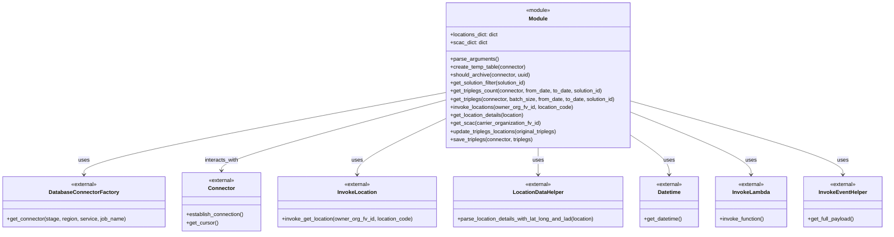
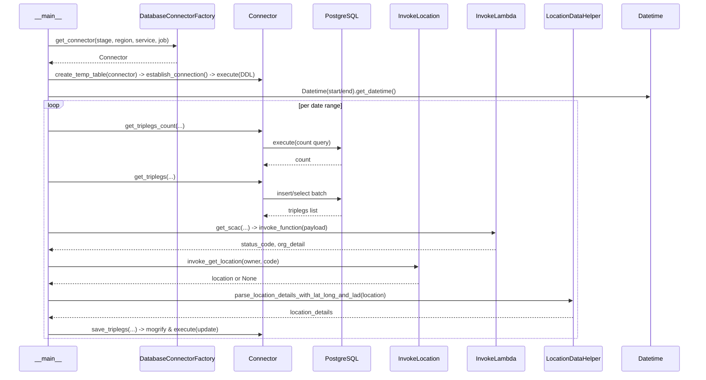

# Diagram: partview_core/partview_service/scripts/BackfillTriplegLocDetails.py


> Auto-generated by Obscura crawlers

## Diagram 1

```mermaid
flowchart LR
    A[parse_arguments()] --> B[create_temp_table(connector)]
    B --> C{dates_ranges not empty}
    C -->|yes| D[select date range]
    D --> E[get_triplegs_count(connector, from_date, to_date, solution_id)]
    E --> F[for i in range(triplegs_count // batch_size + 1)]
    F --> G[get_triplegs(connector, batch_size, from_date, to_date, solution_id)]
    G --> H[update_triplegs_locations(triplegs)]
    H --> I[save_triplegs(connector, triplegs_updated)]
    I --> J[remove processed date range]
    J --> C
    C -->|no| K[exit]
```

> SVG rendering failed for this diagram.

## Diagram 2



### SVG

<svg id="container" width="2631.71875" xmlns="http://www.w3.org/2000/svg" class="classDiagram" height="696" viewBox="0 0 2631.71875 696" role="graphics-document document" aria-roledescription="class"><style>#container{font-family:"trebuchet ms",verdana,arial,sans-serif;font-size:16px;fill:#333;}@keyframes edge-animation-frame{from{stroke-dashoffset:0;}}@keyframes dash{to{stroke-dashoffset:0;}}#container .edge-animation-slow{stroke-dasharray:9,5!important;stroke-dashoffset:900;animation:dash 50s linear infinite;stroke-linecap:round;}#container .edge-animation-fast{stroke-dasharray:9,5!important;stroke-dashoffset:900;animation:dash 20s linear infinite;stroke-linecap:round;}#container .error-icon{fill:#552222;}#container .error-text{fill:#552222;stroke:#552222;}#container .edge-thickness-normal{stroke-width:1px;}#container .edge-thickness-thick{stroke-width:3.5px;}#container .edge-pattern-solid{stroke-dasharray:0;}#container .edge-thickness-invisible{stroke-width:0;fill:none;}#container .edge-pattern-dashed{stroke-dasharray:3;}#container .edge-pattern-dotted{stroke-dasharray:2;}#container .marker{fill:#333333;stroke:#333333;}#container .marker.cross{stroke:#333333;}#container svg{font-family:"trebuchet ms",verdana,arial,sans-serif;font-size:16px;}#container p{margin:0;}#container g.classGroup text{fill:#9370DB;stroke:none;font-family:"trebuchet ms",verdana,arial,sans-serif;font-size:10px;}#container g.classGroup text .title{font-weight:bolder;}#container .nodeLabel,#container .edgeLabel{color:#131300;}#container .edgeLabel .label rect{fill:#ECECFF;}#container .label text{fill:#131300;}#container .labelBkg{background:#ECECFF;}#container .edgeLabel .label span{background:#ECECFF;}#container .classTitle{font-weight:bolder;}#container .node rect,#container .node circle,#container .node ellipse,#container .node polygon,#container .node path{fill:#ECECFF;stroke:#9370DB;stroke-width:1px;}#container .divider{stroke:#9370DB;stroke-width:1;}#container g.clickable{cursor:pointer;}#container g.classGroup rect{fill:#ECECFF;stroke:#9370DB;}#container g.classGroup line{stroke:#9370DB;stroke-width:1;}#container .classLabel .box{stroke:none;stroke-width:0;fill:#ECECFF;opacity:0.5;}#container .classLabel .label{fill:#9370DB;font-size:10px;}#container .relation{stroke:#333333;stroke-width:1;fill:none;}#container .dashed-line{stroke-dasharray:3;}#container .dotted-line{stroke-dasharray:1 2;}#container #compositionStart,#container .composition{fill:#333333!important;stroke:#333333!important;stroke-width:1;}#container #compositionEnd,#container .composition{fill:#333333!important;stroke:#333333!important;stroke-width:1;}#container #dependencyStart,#container .dependency{fill:#333333!important;stroke:#333333!important;stroke-width:1;}#container #dependencyStart,#container .dependency{fill:#333333!important;stroke:#333333!important;stroke-width:1;}#container #extensionStart,#container .extension{fill:transparent!important;stroke:#333333!important;stroke-width:1;}#container #extensionEnd,#container .extension{fill:transparent!important;stroke:#333333!important;stroke-width:1;}#container #aggregationStart,#container .aggregation{fill:transparent!important;stroke:#333333!important;stroke-width:1;}#container #aggregationEnd,#container .aggregation{fill:transparent!important;stroke:#333333!important;stroke-width:1;}#container #lollipopStart,#container .lollipop{fill:#ECECFF!important;stroke:#333333!important;stroke-width:1;}#container #lollipopEnd,#container .lollipop{fill:#ECECFF!important;stroke:#333333!important;stroke-width:1;}#container .edgeTerminals{font-size:11px;line-height:initial;}#container .classTitleText{text-anchor:middle;font-size:18px;fill:#333;}#container .label-icon{display:inline-block;height:1em;overflow:visible;vertical-align:-0.125em;}#container .node .label-icon path{fill:currentColor;stroke:revert;stroke-width:revert;}#container :root{--mermaid-font-family:"trebuchet ms",verdana,arial,sans-serif;}</style><g><defs><marker id="container_class-aggregationStart" class="marker aggregation class" refX="18" refY="7" markerWidth="190" markerHeight="240" orient="auto"><path d="M 18,7 L9,13 L1,7 L9,1 Z"></path></marker></defs><defs><marker id="container_class-aggregationEnd" class="marker aggregation class" refX="1" refY="7" markerWidth="20" markerHeight="28" orient="auto"><path d="M 18,7 L9,13 L1,7 L9,1 Z"></path></marker></defs><defs><marker id="container_class-extensionStart" class="marker extension class" refX="18" refY="7" markerWidth="190" markerHeight="240" orient="auto"><path d="M 1,7 L18,13 V 1 Z"></path></marker></defs><defs><marker id="container_class-extensionEnd" class="marker extension class" refX="1" refY="7" markerWidth="20" markerHeight="28" orient="auto"><path d="M 1,1 V 13 L18,7 Z"></path></marker></defs><defs><marker id="container_class-compositionStart" class="marker composition class" refX="18" refY="7" markerWidth="190" markerHeight="240" orient="auto"><path d="M 18,7 L9,13 L1,7 L9,1 Z"></path></marker></defs><defs><marker id="container_class-compositionEnd" class="marker composition class" refX="1" refY="7" markerWidth="20" markerHeight="28" orient="auto"><path d="M 18,7 L9,13 L1,7 L9,1 Z"></path></marker></defs><defs><marker id="container_class-dependencyStart" class="marker dependency class" refX="6" refY="7" markerWidth="190" markerHeight="240" orient="auto"><path d="M 5,7 L9,13 L1,7 L9,1 Z"></path></marker></defs><defs><marker id="container_class-dependencyEnd" class="marker dependency class" refX="13" refY="7" markerWidth="20" markerHeight="28" orient="auto"><path d="M 18,7 L9,13 L14,7 L9,1 Z"></path></marker></defs><defs><marker id="container_class-lollipopStart" class="marker lollipop class" refX="13" refY="7" markerWidth="190" markerHeight="240" orient="auto"><circle stroke="black" fill="transparent" cx="7" cy="7" r="6"></circle></marker></defs><defs><marker id="container_class-lollipopEnd" class="marker lollipop class" refX="1" refY="7" markerWidth="190" markerHeight="240" orient="auto"><circle stroke="black" fill="transparent" cx="7" cy="7" r="6"></circle></marker></defs><g class="root"><g class="clusters"></g><g class="edgePaths"><path d="M1318.977,276.069L1140.06,309.557C961.143,343.046,603.31,410.023,424.393,450.678C245.477,491.333,245.477,505.667,245.477,512.833L245.477,520" id="id_Module_DatabaseConnectorFactory_1" class="edge-thickness-normal edge-pattern-solid relation" style=";;;" data-edge="true" data-et="edge" data-id="id_Module_DatabaseConnectorFactory_1" data-points="W3sieCI6MTMxOC45NzY1NjI1LCJ5IjoyNzYuMDY4NzMwODM2MjU0NTN9LHsieCI6MjQ1LjQ3NjU2MjUsInkiOjQ3N30seyJ4IjoyNDUuNDc2NTYyNSwieSI6NTI2fV0=" marker-end="url(#container_class-dependencyEnd)"></path><path d="M1318.977,298.379L1207.633,328.149C1096.289,357.919,873.602,417.46,762.258,452.396C650.914,487.333,650.914,497.667,650.914,502.833L650.914,508" id="id_Module_Connector_2" class="edge-thickness-normal edge-pattern-solid relation" style=";;;" data-edge="true" data-et="edge" data-id="id_Module_Connector_2" data-points="W3sieCI6MTMxOC45NzY1NjI1LCJ5IjoyOTguMzc4NTg4OTE0MjU0MX0seyJ4Ijo2NTAuOTE0MDYyNSwieSI6NDc3fSx7IngiOjY1MC45MTQwNjI1LCJ5Ijo1MTR9XQ==" marker-end="url(#container_class-dependencyEnd)"></path><path d="M1318.977,353.856L1275.009,374.38C1231.042,394.904,1143.107,435.952,1099.139,463.643C1055.172,491.333,1055.172,505.667,1055.172,512.833L1055.172,520" id="id_Module_InvokeLocation_3" class="edge-thickness-normal edge-pattern-solid relation" style=";;;" data-edge="true" data-et="edge" data-id="id_Module_InvokeLocation_3" data-points="W3sieCI6MTMxOC45NzY1NjI1LCJ5IjozNTMuODU2MDM0OTk4NDUwNDd9LHsieCI6MTA1NS4xNzE4NzUsInkiOjQ3N30seyJ4IjoxMDU1LjE3MTg3NSwieSI6NTI2fV0=" marker-end="url(#container_class-dependencyEnd)"></path><path d="M1597.16,440L1597.16,446.167C1597.16,452.333,1597.16,464.667,1597.16,478C1597.16,491.333,1597.16,505.667,1597.16,512.833L1597.16,520" id="id_Module_LocationDataHelper_4" class="edge-thickness-normal edge-pattern-solid relation" style=";;;" data-edge="true" data-et="edge" data-id="id_Module_LocationDataHelper_4" data-points="W3sieCI6MTU5Ny4xNjAxNTYyNSwieSI6NDQwfSx7IngiOjE1OTcuMTYwMTU2MjUsInkiOjQ3N30seyJ4IjoxNTk3LjE2MDE1NjI1LCJ5Ijo1MjZ9XQ==" marker-end="url(#container_class-dependencyEnd)"></path><path d="M1875.344,402.583L1894.664,414.986C1913.984,427.389,1952.625,452.194,1971.945,471.764C1991.266,491.333,1991.266,505.667,1991.266,512.833L1991.266,520" id="id_Module_Datetime_5" class="edge-thickness-normal edge-pattern-solid relation" style=";;;" data-edge="true" data-et="edge" data-id="id_Module_Datetime_5" data-points="W3sieCI6MTg3NS4zNDM3NSwieSI6NDAyLjU4Mjc3NzQ1Mjg5NDd9LHsieCI6MTk5MS4yNjU2MjUsInkiOjQ3N30seyJ4IjoxOTkxLjI2NTYyNSwieSI6NTI2fV0=" marker-end="url(#container_class-dependencyEnd)"></path><path d="M1875.344,334.231L1935.393,358.026C1995.443,381.821,2115.542,429.41,2175.591,460.372C2235.641,491.333,2235.641,505.667,2235.641,512.833L2235.641,520" id="id_Module_InvokeLambda_6" class="edge-thickness-normal edge-pattern-solid relation" style=";;;" data-edge="true" data-et="edge" data-id="id_Module_InvokeLambda_6" data-points="W3sieCI6MTg3NS4zNDM3NSwieSI6MzM0LjIzMTE3MDE5Nzc5NjN9LHsieCI6MjIzNS42NDA2MjUsInkiOjQ3N30seyJ4IjoyMjM1LjY0MDYyNSwieSI6NTI2fV0=" marker-end="url(#container_class-dependencyEnd)"></path><path d="M1875.344,301.299L1980.73,330.582C2086.116,359.866,2296.888,418.433,2402.274,454.883C2507.66,491.333,2507.66,505.667,2507.66,512.833L2507.66,520" id="id_Module_InvokeEventHelper_7" class="edge-thickness-normal edge-pattern-solid relation" style=";;;" data-edge="true" data-et="edge" data-id="id_Module_InvokeEventHelper_7" data-points="W3sieCI6MTg3NS4zNDM3NSwieSI6MzAxLjI5ODY4MTE4NDc4ODU2fSx7IngiOjI1MDcuNjYwMTU2MjUsInkiOjQ3N30seyJ4IjoyNTA3LjY2MDE1NjI1LCJ5Ijo1MjZ9XQ==" marker-end="url(#container_class-dependencyEnd)"></path></g><g class="edgeLabels"><g class="edgeLabel" transform="translate(245.4765625, 477)"><g class="label" data-id="id_Module_DatabaseConnectorFactory_1" transform="translate(-16.4921875, -12)"><foreignObject width="32.984375" height="24"><div xmlns="http://www.w3.org/1999/xhtml" class="labelBkg" style="display: table-cell; white-space: nowrap; line-height: 1.5; max-width: 200px; text-align: center;"><span class="edgeLabel"><p>uses</p></span></div></foreignObject></g></g><g class="edgeLabel" transform="translate(650.9140625, 477)"><g class="label" data-id="id_Module_Connector_2" transform="translate(-51.09375, -12)"><foreignObject width="102.1875" height="24"><div xmlns="http://www.w3.org/1999/xhtml" class="labelBkg" style="display: table-cell; white-space: nowrap; line-height: 1.5; max-width: 200px; text-align: center;"><span class="edgeLabel"><p>interacts_with</p></span></div></foreignObject></g></g><g class="edgeLabel" transform="translate(1055.171875, 477)"><g class="label" data-id="id_Module_InvokeLocation_3" transform="translate(-16.4921875, -12)"><foreignObject width="32.984375" height="24"><div xmlns="http://www.w3.org/1999/xhtml" class="labelBkg" style="display: table-cell; white-space: nowrap; line-height: 1.5; max-width: 200px; text-align: center;"><span class="edgeLabel"><p>uses</p></span></div></foreignObject></g></g><g class="edgeLabel" transform="translate(1597.16015625, 477)"><g class="label" data-id="id_Module_LocationDataHelper_4" transform="translate(-16.4921875, -12)"><foreignObject width="32.984375" height="24"><div xmlns="http://www.w3.org/1999/xhtml" class="labelBkg" style="display: table-cell; white-space: nowrap; line-height: 1.5; max-width: 200px; text-align: center;"><span class="edgeLabel"><p>uses</p></span></div></foreignObject></g></g><g class="edgeLabel" transform="translate(1991.265625, 477)"><g class="label" data-id="id_Module_Datetime_5" transform="translate(-16.4921875, -12)"><foreignObject width="32.984375" height="24"><div xmlns="http://www.w3.org/1999/xhtml" class="labelBkg" style="display: table-cell; white-space: nowrap; line-height: 1.5; max-width: 200px; text-align: center;"><span class="edgeLabel"><p>uses</p></span></div></foreignObject></g></g><g class="edgeLabel" transform="translate(2235.640625, 477)"><g class="label" data-id="id_Module_InvokeLambda_6" transform="translate(-16.4921875, -12)"><foreignObject width="32.984375" height="24"><div xmlns="http://www.w3.org/1999/xhtml" class="labelBkg" style="display: table-cell; white-space: nowrap; line-height: 1.5; max-width: 200px; text-align: center;"><span class="edgeLabel"><p>uses</p></span></div></foreignObject></g></g><g class="edgeLabel" transform="translate(2507.66015625, 477)"><g class="label" data-id="id_Module_InvokeEventHelper_7" transform="translate(-16.4921875, -12)"><foreignObject width="32.984375" height="24"><div xmlns="http://www.w3.org/1999/xhtml" class="labelBkg" style="display: table-cell; white-space: nowrap; line-height: 1.5; max-width: 200px; text-align: center;"><span class="edgeLabel"><p>uses</p></span></div></foreignObject></g></g></g><g class="nodes"><g class="node default" id="classId-Module-0" transform="translate(1597.16015625, 224)"><g class="basic label-container"><path d="M-278.18359375 -216 L278.18359375 -216 L278.18359375 216 L-278.18359375 216" stroke="none" stroke-width="0" fill="#ECECFF" style=""></path><path d="M-278.18359375 -216 C-111.83758163199693 -216, 54.50843048600615 -216, 278.18359375 -216 M-278.18359375 -216 C-95.42841770025277 -216, 87.32675834949447 -216, 278.18359375 -216 M278.18359375 -216 C278.18359375 -45.78716325915343, 278.18359375 124.42567348169314, 278.18359375 216 M278.18359375 -216 C278.18359375 -80.22621693365303, 278.18359375 55.54756613269393, 278.18359375 216 M278.18359375 216 C100.48850393076344 216, -77.20658588847311 216, -278.18359375 216 M278.18359375 216 C149.1427357627499 216, 20.101877775499815 216, -278.18359375 216 M-278.18359375 216 C-278.18359375 104.78570363572113, -278.18359375 -6.428592728557732, -278.18359375 -216 M-278.18359375 216 C-278.18359375 116.82715694386141, -278.18359375 17.65431388772282, -278.18359375 -216" stroke="#9370DB" stroke-width="1.3" fill="none" stroke-dasharray="0 0" style=""></path></g><g class="annotation-group text" transform="translate(-36.6015625, -192)"><g class="label" style="" transform="translate(0,-12)"><foreignObject width="73.203125" height="24"><div xmlns="http://www.w3.org/1999/xhtml" style="display: table-cell; white-space: nowrap; line-height: 1.5; max-width: 123px; text-align: center;"><span class="nodeLabel markdown-node-label" style=""><p>«module»</p></span></div></foreignObject></g></g><g class="label-group text" transform="translate(-27.09375, -168)"><g class="label" style="font-weight: bolder" transform="translate(0,-12)"><foreignObject width="54.1875" height="24"><div xmlns="http://www.w3.org/1999/xhtml" style="display: table-cell; white-space: nowrap; line-height: 1.5; max-width: 104px; text-align: center;"><span class="nodeLabel markdown-node-label" style=""><p>Module</p></span></div></foreignObject></g></g><g class="members-group text" transform="translate(-266.18359375, -120)"><g class="label" style="" transform="translate(0,-12)"><foreignObject width="145.453125" height="24"><div xmlns="http://www.w3.org/1999/xhtml" style="display: table-cell; white-space: nowrap; line-height: 1.5; max-width: 203px; text-align: center;"><span class="nodeLabel markdown-node-label" style=""><p>+locations_dict: dict</p></span></div></foreignObject></g><g class="label" style="" transform="translate(0,12)"><foreignObject width="110.453125" height="24"><div xmlns="http://www.w3.org/1999/xhtml" style="display: table-cell; white-space: nowrap; line-height: 1.5; max-width: 168px; text-align: center;"><span class="nodeLabel markdown-node-label" style=""><p>+scac_dict: dict</p></span></div></foreignObject></g></g><g class="methods-group text" transform="translate(-266.18359375, -48)"><g class="label" style="" transform="translate(0,-12)"><foreignObject width="143.390625" height="24"><div xmlns="http://www.w3.org/1999/xhtml" style="display: table-cell; white-space: nowrap; line-height: 1.5; max-width: 201px; text-align: center;"><span class="nodeLabel markdown-node-label" style=""><p>+parse_arguments()</p></span></div></foreignObject></g><g class="label" style="" transform="translate(0,12)"><foreignObject width="226.109375" height="24"><div xmlns="http://www.w3.org/1999/xhtml" style="display: table-cell; white-space: nowrap; line-height: 1.5; max-width: 283px; text-align: center;"><span class="nodeLabel markdown-node-label" style=""><p>+create_temp_table(connector)</p></span></div></foreignObject></g><g class="label" style="" transform="translate(0,36)"><foreignObject width="240.859375" height="24"><div xmlns="http://www.w3.org/1999/xhtml" style="display: table-cell; white-space: nowrap; line-height: 1.5; max-width: 298px; text-align: center;"><span class="nodeLabel markdown-node-label" style=""><p>+should_archive(connector, uuid)</p></span></div></foreignObject></g><g class="label" style="" transform="translate(0,60)"><foreignObject width="233.609375" height="24"><div xmlns="http://www.w3.org/1999/xhtml" style="display: table-cell; white-space: nowrap; line-height: 1.5; max-width: 291px; text-align: center;"><span class="nodeLabel markdown-node-label" style=""><p>+get_solution_filter(solution_id)</p></span></div></foreignObject></g><g class="label" style="" transform="translate(0,84)"><foreignObject width="460.15625" height="24"><div xmlns="http://www.w3.org/1999/xhtml" style="display: table-cell; white-space: nowrap; line-height: 1.5; max-width: 518px; text-align: center;"><span class="nodeLabel markdown-node-label" style=""><p>+get_triplegs_count(connector, from_date, to_date, solution_id)</p></span></div></foreignObject></g><g class="label" style="" transform="translate(0,108)"><foreignObject width="495.765625" height="24"><div xmlns="http://www.w3.org/1999/xhtml" style="display: table-cell; white-space: nowrap; line-height: 1.5; max-width: 553px; text-align: center;"><span class="nodeLabel markdown-node-label" style=""><p>+get_triplegs(connector, batch_size, from_date, to_date, solution_id)</p></span></div></foreignObject></g><g class="label" style="" transform="translate(0,132)"><foreignObject width="369.34375" height="24"><div xmlns="http://www.w3.org/1999/xhtml" style="display: table-cell; white-space: nowrap; line-height: 1.5; max-width: 427px; text-align: center;"><span class="nodeLabel markdown-node-label" style=""><p>+invoke_locations(owner_org_fv_id, location_code)</p></span></div></foreignObject></g><g class="label" style="" transform="translate(0,156)"><foreignObject width="224.71875" height="24"><div xmlns="http://www.w3.org/1999/xhtml" style="display: table-cell; white-space: nowrap; line-height: 1.5; max-width: 282px; text-align: center;"><span class="nodeLabel markdown-node-label" style=""><p>+get_location_details(location)</p></span></div></foreignObject></g><g class="label" style="" transform="translate(0,180)"><foreignObject width="268.734375" height="24"><div xmlns="http://www.w3.org/1999/xhtml" style="display: table-cell; white-space: nowrap; line-height: 1.5; max-width: 326px; text-align: center;"><span class="nodeLabel markdown-node-label" style=""><p>+get_scac(carrier_organization_fv_id)</p></span></div></foreignObject></g><g class="label" style="" transform="translate(0,204)"><foreignObject width="325.265625" height="24"><div xmlns="http://www.w3.org/1999/xhtml" style="display: table-cell; white-space: nowrap; line-height: 1.5; max-width: 383px; text-align: center;"><span class="nodeLabel markdown-node-label" style=""><p>+update_triplegs_locations(original_triplegs)</p></span></div></foreignObject></g><g class="label" style="" transform="translate(0,228)"><foreignObject width="247.9375" height="24"><div xmlns="http://www.w3.org/1999/xhtml" style="display: table-cell; white-space: nowrap; line-height: 1.5; max-width: 305px; text-align: center;"><span class="nodeLabel markdown-node-label" style=""><p>+save_triplegs(connector, triplegs)</p></span></div></foreignObject></g></g><g class="divider" style=""><path d="M-278.18359375 -144 C-139.95666177004327 -144, -1.7297297900865374 -144, 278.18359375 -144 M-278.18359375 -144 C-88.36130960513981 -144, 101.46097453972038 -144, 278.18359375 -144" stroke="#9370DB" stroke-width="1.3" fill="none" stroke-dasharray="0 0" style=""></path></g><g class="divider" style=""><path d="M-278.18359375 -72 C-107.10689082157461 -72, 63.96981210685078 -72, 278.18359375 -72 M-278.18359375 -72 C-153.52937601936367 -72, -28.875158288727334 -72, 278.18359375 -72" stroke="#9370DB" stroke-width="1.3" fill="none" stroke-dasharray="0 0" style=""></path></g></g><g class="node default" id="classId-DatabaseConnectorFactory-1" transform="translate(245.4765625, 601)"><g class="basic label-container"><path d="M-237.4765625 -75 L237.4765625 -75 L237.4765625 75 L-237.4765625 75" stroke="none" stroke-width="0" fill="#ECECFF" style=""></path><path d="M-237.4765625 -75 C-108.26515280845027 -75, 20.946256883099466 -75, 237.4765625 -75 M-237.4765625 -75 C-80.05987816535904 -75, 77.35680616928192 -75, 237.4765625 -75 M237.4765625 -75 C237.4765625 -32.72535491720647, 237.4765625 9.549290165587067, 237.4765625 75 M237.4765625 -75 C237.4765625 -39.9365896627904, 237.4765625 -4.873179325580793, 237.4765625 75 M237.4765625 75 C107.75734999098168 75, -21.96186251803664 75, -237.4765625 75 M237.4765625 75 C48.45155862300399 75, -140.57344525399202 75, -237.4765625 75 M-237.4765625 75 C-237.4765625 29.03717662149409, -237.4765625 -16.92564675701182, -237.4765625 -75 M-237.4765625 75 C-237.4765625 20.691406956134415, -237.4765625 -33.61718608773117, -237.4765625 -75" stroke="#9370DB" stroke-width="1.3" fill="none" stroke-dasharray="0 0" style=""></path></g><g class="annotation-group text" transform="translate(-38.65625, -51)"><g class="label" style="" transform="translate(0,-12)"><foreignObject width="77.3125" height="24"><div xmlns="http://www.w3.org/1999/xhtml" style="display: table-cell; white-space: nowrap; line-height: 1.5; max-width: 127px; text-align: center;"><span class="nodeLabel markdown-node-label" style=""><p>«external»</p></span></div></foreignObject></g></g><g class="label-group text" transform="translate(-98.1875, -27)"><g class="label" style="font-weight: bolder" transform="translate(0,-12)"><foreignObject width="196.375" height="24"><div xmlns="http://www.w3.org/1999/xhtml" style="display: table-cell; white-space: nowrap; line-height: 1.5; max-width: 244px; text-align: center;"><span class="nodeLabel markdown-node-label" style=""><p>DatabaseConnectorFactory</p></span></div></foreignObject></g></g><g class="members-group text" transform="translate(-225.4765625, 21)"></g><g class="methods-group text" transform="translate(-225.4765625, 51)"><g class="label" style="" transform="translate(0,-12)"><foreignObject width="352.765625" height="24"><div xmlns="http://www.w3.org/1999/xhtml" style="display: table-cell; white-space: nowrap; line-height: 1.5; max-width: 410px; text-align: center;"><span class="nodeLabel markdown-node-label" style=""><p>+get_connector(stage, region, service, job_name)</p></span></div></foreignObject></g></g><g class="divider" style=""><path d="M-237.4765625 -3 C-61.9587547548947 -3, 113.5590529902106 -3, 237.4765625 -3 M-237.4765625 -3 C-52.99652657871269 -3, 131.48350934257462 -3, 237.4765625 -3" stroke="#9370DB" stroke-width="1.3" fill="none" stroke-dasharray="0 0" style=""></path></g><g class="divider" style=""><path d="M-237.4765625 21 C-71.0372143687728 21, 95.40213376245441 21, 237.4765625 21 M-237.4765625 21 C-76.6232504674528 21, 84.23006156509439 21, 237.4765625 21" stroke="#9370DB" stroke-width="1.3" fill="none" stroke-dasharray="0 0" style=""></path></g></g><g class="node default" id="classId-Connector-2" transform="translate(650.9140625, 601)"><g class="basic label-container"><path d="M-117.9609375 -87 L117.9609375 -87 L117.9609375 87 L-117.9609375 87" stroke="none" stroke-width="0" fill="#ECECFF" style=""></path><path d="M-117.9609375 -87 C-40.2357224195315 -87, 37.489492660937 -87, 117.9609375 -87 M-117.9609375 -87 C-57.18739751547169 -87, 3.5861424690566253 -87, 117.9609375 -87 M117.9609375 -87 C117.9609375 -47.328232248504804, 117.9609375 -7.656464497009608, 117.9609375 87 M117.9609375 -87 C117.9609375 -25.921254398315376, 117.9609375 35.15749120336925, 117.9609375 87 M117.9609375 87 C66.63479103292914 87, 15.308644565858273 87, -117.9609375 87 M117.9609375 87 C34.5990002319578 87, -48.762937036084395 87, -117.9609375 87 M-117.9609375 87 C-117.9609375 26.89014086484017, -117.9609375 -33.21971827031966, -117.9609375 -87 M-117.9609375 87 C-117.9609375 30.327725201294776, -117.9609375 -26.34454959741045, -117.9609375 -87" stroke="#9370DB" stroke-width="1.3" fill="none" stroke-dasharray="0 0" style=""></path></g><g class="annotation-group text" transform="translate(-38.65625, -63)"><g class="label" style="" transform="translate(0,-12)"><foreignObject width="77.3125" height="24"><div xmlns="http://www.w3.org/1999/xhtml" style="display: table-cell; white-space: nowrap; line-height: 1.5; max-width: 127px; text-align: center;"><span class="nodeLabel markdown-node-label" style=""><p>«external»</p></span></div></foreignObject></g></g><g class="label-group text" transform="translate(-37.421875, -39)"><g class="label" style="font-weight: bolder" transform="translate(0,-12)"><foreignObject width="74.84375" height="24"><div xmlns="http://www.w3.org/1999/xhtml" style="display: table-cell; white-space: nowrap; line-height: 1.5; max-width: 125px; text-align: center;"><span class="nodeLabel markdown-node-label" style=""><p>Connector</p></span></div></foreignObject></g></g><g class="members-group text" transform="translate(-105.9609375, 9)"></g><g class="methods-group text" transform="translate(-105.9609375, 39)"><g class="label" style="" transform="translate(0,-12)"><foreignObject width="173.265625" height="24"><div xmlns="http://www.w3.org/1999/xhtml" style="display: table-cell; white-space: nowrap; line-height: 1.5; max-width: 231px; text-align: center;"><span class="nodeLabel markdown-node-label" style=""><p>+establish_connection()</p></span></div></foreignObject></g><g class="label" style="" transform="translate(0,12)"><foreignObject width="94.640625" height="24"><div xmlns="http://www.w3.org/1999/xhtml" style="display: table-cell; white-space: nowrap; line-height: 1.5; max-width: 152px; text-align: center;"><span class="nodeLabel markdown-node-label" style=""><p>+get_cursor()</p></span></div></foreignObject></g></g><g class="divider" style=""><path d="M-117.9609375 -15 C-45.87765291301669 -15, 26.20563167396662 -15, 117.9609375 -15 M-117.9609375 -15 C-66.03617113933993 -15, -14.11140477867984 -15, 117.9609375 -15" stroke="#9370DB" stroke-width="1.3" fill="none" stroke-dasharray="0 0" style=""></path></g><g class="divider" style=""><path d="M-117.9609375 9 C-28.05132652122569 9, 61.85828445754862 9, 117.9609375 9 M-117.9609375 9 C-24.92809576675758 9, 68.10474596648484 9, 117.9609375 9" stroke="#9370DB" stroke-width="1.3" fill="none" stroke-dasharray="0 0" style=""></path></g></g><g class="node default" id="classId-InvokeLocation-3" transform="translate(1055.171875, 601)"><g class="basic label-container"><path d="M-236.296875 -75 L236.296875 -75 L236.296875 75 L-236.296875 75" stroke="none" stroke-width="0" fill="#ECECFF" style=""></path><path d="M-236.296875 -75 C-79.065926974239 -75, 78.16502105152199 -75, 236.296875 -75 M-236.296875 -75 C-103.19448332437798 -75, 29.907908351244032 -75, 236.296875 -75 M236.296875 -75 C236.296875 -19.756657436199887, 236.296875 35.486685127600225, 236.296875 75 M236.296875 -75 C236.296875 -23.34459792732539, 236.296875 28.310804145349223, 236.296875 75 M236.296875 75 C118.17117214647632 75, 0.0454692929526459 75, -236.296875 75 M236.296875 75 C117.39319080342322 75, -1.5104933931535527 75, -236.296875 75 M-236.296875 75 C-236.296875 26.161532251567145, -236.296875 -22.67693549686571, -236.296875 -75 M-236.296875 75 C-236.296875 37.80473934958642, -236.296875 0.6094786991728398, -236.296875 -75" stroke="#9370DB" stroke-width="1.3" fill="none" stroke-dasharray="0 0" style=""></path></g><g class="annotation-group text" transform="translate(-38.65625, -51)"><g class="label" style="" transform="translate(0,-12)"><foreignObject width="77.3125" height="24"><div xmlns="http://www.w3.org/1999/xhtml" style="display: table-cell; white-space: nowrap; line-height: 1.5; max-width: 127px; text-align: center;"><span class="nodeLabel markdown-node-label" style=""><p>«external»</p></span></div></foreignObject></g></g><g class="label-group text" transform="translate(-55.703125, -27)"><g class="label" style="font-weight: bolder" transform="translate(0,-12)"><foreignObject width="111.40625" height="24"><div xmlns="http://www.w3.org/1999/xhtml" style="display: table-cell; white-space: nowrap; line-height: 1.5; max-width: 160px; text-align: center;"><span class="nodeLabel markdown-node-label" style=""><p>InvokeLocation</p></span></div></foreignObject></g></g><g class="members-group text" transform="translate(-224.296875, 21)"></g><g class="methods-group text" transform="translate(-224.296875, 51)"><g class="label" style="" transform="translate(0,-12)"><foreignObject width="392.890625" height="24"><div xmlns="http://www.w3.org/1999/xhtml" style="display: table-cell; white-space: nowrap; line-height: 1.5; max-width: 450px; text-align: center;"><span class="nodeLabel markdown-node-label" style=""><p>+invoke_get_location(owner_org_fv_id, location_code)</p></span></div></foreignObject></g></g><g class="divider" style=""><path d="M-236.296875 -3 C-95.33689949021633 -3, 45.62307601956735 -3, 236.296875 -3 M-236.296875 -3 C-48.06910036002722 -3, 140.15867427994556 -3, 236.296875 -3" stroke="#9370DB" stroke-width="1.3" fill="none" stroke-dasharray="0 0" style=""></path></g><g class="divider" style=""><path d="M-236.296875 21 C-91.36558377741105 21, 53.56570744517791 21, 236.296875 21 M-236.296875 21 C-93.04200915668613 21, 50.21285668662773 21, 236.296875 21" stroke="#9370DB" stroke-width="1.3" fill="none" stroke-dasharray="0 0" style=""></path></g></g><g class="node default" id="classId-LocationDataHelper-4" transform="translate(1597.16015625, 601)"><g class="basic label-container"><path d="M-255.69140625 -75 L255.69140625 -75 L255.69140625 75 L-255.69140625 75" stroke="none" stroke-width="0" fill="#ECECFF" style=""></path><path d="M-255.69140625 -75 C-76.1073363686875 -75, 103.476733512625 -75, 255.69140625 -75 M-255.69140625 -75 C-67.06917931592858 -75, 121.55304761814284 -75, 255.69140625 -75 M255.69140625 -75 C255.69140625 -44.51376688563614, 255.69140625 -14.027533771272275, 255.69140625 75 M255.69140625 -75 C255.69140625 -34.44476203941028, 255.69140625 6.110475921179443, 255.69140625 75 M255.69140625 75 C98.4930235250028 75, -58.705359199994405 75, -255.69140625 75 M255.69140625 75 C148.56987742269618 75, 41.44834859539236 75, -255.69140625 75 M-255.69140625 75 C-255.69140625 25.741095821513255, -255.69140625 -23.51780835697349, -255.69140625 -75 M-255.69140625 75 C-255.69140625 44.110820705716876, -255.69140625 13.221641411433744, -255.69140625 -75" stroke="#9370DB" stroke-width="1.3" fill="none" stroke-dasharray="0 0" style=""></path></g><g class="annotation-group text" transform="translate(-38.65625, -51)"><g class="label" style="" transform="translate(0,-12)"><foreignObject width="77.3125" height="24"><div xmlns="http://www.w3.org/1999/xhtml" style="display: table-cell; white-space: nowrap; line-height: 1.5; max-width: 127px; text-align: center;"><span class="nodeLabel markdown-node-label" style=""><p>«external»</p></span></div></foreignObject></g></g><g class="label-group text" transform="translate(-72.7578125, -27)"><g class="label" style="font-weight: bolder" transform="translate(0,-12)"><foreignObject width="145.515625" height="24"><div xmlns="http://www.w3.org/1999/xhtml" style="display: table-cell; white-space: nowrap; line-height: 1.5; max-width: 195px; text-align: center;"><span class="nodeLabel markdown-node-label" style=""><p>LocationDataHelper</p></span></div></foreignObject></g></g><g class="members-group text" transform="translate(-243.69140625, 21)"></g><g class="methods-group text" transform="translate(-243.69140625, 51)"><g class="label" style="" transform="translate(0,-12)"><foreignObject width="414.625" height="24"><div xmlns="http://www.w3.org/1999/xhtml" style="display: table-cell; white-space: nowrap; line-height: 1.5; max-width: 472px; text-align: center;"><span class="nodeLabel markdown-node-label" style=""><p>+parse_location_details_with_lat_long_and_lad(location)</p></span></div></foreignObject></g></g><g class="divider" style=""><path d="M-255.69140625 -3 C-120.7628022046421 -3, 14.165801840715801 -3, 255.69140625 -3 M-255.69140625 -3 C-94.89902667311011 -3, 65.89335290377977 -3, 255.69140625 -3" stroke="#9370DB" stroke-width="1.3" fill="none" stroke-dasharray="0 0" style=""></path></g><g class="divider" style=""><path d="M-255.69140625 21 C-133.45895248550437 21, -11.22649872100871 21, 255.69140625 21 M-255.69140625 21 C-140.78974084963716 21, -25.88807544927431 21, 255.69140625 21" stroke="#9370DB" stroke-width="1.3" fill="none" stroke-dasharray="0 0" style=""></path></g></g><g class="node default" id="classId-Datetime-5" transform="translate(1991.265625, 601)"><g class="basic label-container"><path d="M-88.4140625 -75 L88.4140625 -75 L88.4140625 75 L-88.4140625 75" stroke="none" stroke-width="0" fill="#ECECFF" style=""></path><path d="M-88.4140625 -75 C-40.53683683937268 -75, 7.340388821254635 -75, 88.4140625 -75 M-88.4140625 -75 C-22.35578055062453 -75, 43.70250139875094 -75, 88.4140625 -75 M88.4140625 -75 C88.4140625 -31.216233849977115, 88.4140625 12.56753230004577, 88.4140625 75 M88.4140625 -75 C88.4140625 -32.96251338032653, 88.4140625 9.074973239346946, 88.4140625 75 M88.4140625 75 C27.156797100449865 75, -34.10046829910027 75, -88.4140625 75 M88.4140625 75 C35.97951270191838 75, -16.455037096163238 75, -88.4140625 75 M-88.4140625 75 C-88.4140625 20.679596971108396, -88.4140625 -33.64080605778321, -88.4140625 -75 M-88.4140625 75 C-88.4140625 38.98644550533363, -88.4140625 2.9728910106672544, -88.4140625 -75" stroke="#9370DB" stroke-width="1.3" fill="none" stroke-dasharray="0 0" style=""></path></g><g class="annotation-group text" transform="translate(-38.65625, -51)"><g class="label" style="" transform="translate(0,-12)"><foreignObject width="77.3125" height="24"><div xmlns="http://www.w3.org/1999/xhtml" style="display: table-cell; white-space: nowrap; line-height: 1.5; max-width: 127px; text-align: center;"><span class="nodeLabel markdown-node-label" style=""><p>«external»</p></span></div></foreignObject></g></g><g class="label-group text" transform="translate(-33.3984375, -27)"><g class="label" style="font-weight: bolder" transform="translate(0,-12)"><foreignObject width="66.796875" height="24"><div xmlns="http://www.w3.org/1999/xhtml" style="display: table-cell; white-space: nowrap; line-height: 1.5; max-width: 116px; text-align: center;"><span class="nodeLabel markdown-node-label" style=""><p>Datetime</p></span></div></foreignObject></g></g><g class="members-group text" transform="translate(-76.4140625, 21)"></g><g class="methods-group text" transform="translate(-76.4140625, 51)"><g class="label" style="" transform="translate(0,-12)"><foreignObject width="114.171875" height="24"><div xmlns="http://www.w3.org/1999/xhtml" style="display: table-cell; white-space: nowrap; line-height: 1.5; max-width: 172px; text-align: center;"><span class="nodeLabel markdown-node-label" style=""><p>+get_datetime()</p></span></div></foreignObject></g></g><g class="divider" style=""><path d="M-88.4140625 -3 C-20.88341963431276 -3, 46.64722323137448 -3, 88.4140625 -3 M-88.4140625 -3 C-32.59896661786422 -3, 23.216129264271558 -3, 88.4140625 -3" stroke="#9370DB" stroke-width="1.3" fill="none" stroke-dasharray="0 0" style=""></path></g><g class="divider" style=""><path d="M-88.4140625 21 C-34.63926840926145 21, 19.135525681477105 21, 88.4140625 21 M-88.4140625 21 C-28.67710062713521 21, 31.05986124572958 21, 88.4140625 21" stroke="#9370DB" stroke-width="1.3" fill="none" stroke-dasharray="0 0" style=""></path></g></g><g class="node default" id="classId-InvokeLambda-6" transform="translate(2235.640625, 601)"><g class="basic label-container"><path d="M-105.9609375 -75 L105.9609375 -75 L105.9609375 75 L-105.9609375 75" stroke="none" stroke-width="0" fill="#ECECFF" style=""></path><path d="M-105.9609375 -75 C-61.381187688418315 -75, -16.80143787683663 -75, 105.9609375 -75 M-105.9609375 -75 C-60.01790906267912 -75, -14.074880625358233 -75, 105.9609375 -75 M105.9609375 -75 C105.9609375 -19.084857095119062, 105.9609375 36.830285809761875, 105.9609375 75 M105.9609375 -75 C105.9609375 -22.4701751951739, 105.9609375 30.059649609652197, 105.9609375 75 M105.9609375 75 C28.730172317368016 75, -48.50059286526397 75, -105.9609375 75 M105.9609375 75 C60.649414931001154 75, 15.337892362002307 75, -105.9609375 75 M-105.9609375 75 C-105.9609375 39.03729361601093, -105.9609375 3.0745872320218552, -105.9609375 -75 M-105.9609375 75 C-105.9609375 28.776882833495435, -105.9609375 -17.44623433300913, -105.9609375 -75" stroke="#9370DB" stroke-width="1.3" fill="none" stroke-dasharray="0 0" style=""></path></g><g class="annotation-group text" transform="translate(-38.65625, -51)"><g class="label" style="" transform="translate(0,-12)"><foreignObject width="77.3125" height="24"><div xmlns="http://www.w3.org/1999/xhtml" style="display: table-cell; white-space: nowrap; line-height: 1.5; max-width: 127px; text-align: center;"><span class="nodeLabel markdown-node-label" style=""><p>«external»</p></span></div></foreignObject></g></g><g class="label-group text" transform="translate(-53.484375, -27)"><g class="label" style="font-weight: bolder" transform="translate(0,-12)"><foreignObject width="106.96875" height="24"><div xmlns="http://www.w3.org/1999/xhtml" style="display: table-cell; white-space: nowrap; line-height: 1.5; max-width: 156px; text-align: center;"><span class="nodeLabel markdown-node-label" style=""><p>InvokeLambda</p></span></div></foreignObject></g></g><g class="members-group text" transform="translate(-93.9609375, 21)"></g><g class="methods-group text" transform="translate(-93.9609375, 51)"><g class="label" style="" transform="translate(0,-12)"><foreignObject width="134.4375" height="24"><div xmlns="http://www.w3.org/1999/xhtml" style="display: table-cell; white-space: nowrap; line-height: 1.5; max-width: 192px; text-align: center;"><span class="nodeLabel markdown-node-label" style=""><p>+invoke_function()</p></span></div></foreignObject></g></g><g class="divider" style=""><path d="M-105.9609375 -3 C-55.91038237256483 -3, -5.859827245129665 -3, 105.9609375 -3 M-105.9609375 -3 C-42.062513209103486 -3, 21.83591108179303 -3, 105.9609375 -3" stroke="#9370DB" stroke-width="1.3" fill="none" stroke-dasharray="0 0" style=""></path></g><g class="divider" style=""><path d="M-105.9609375 21 C-30.75397398259524 21, 44.45298953480952 21, 105.9609375 21 M-105.9609375 21 C-29.580651772327585 21, 46.79963395534483 21, 105.9609375 21" stroke="#9370DB" stroke-width="1.3" fill="none" stroke-dasharray="0 0" style=""></path></g></g><g class="node default" id="classId-InvokeEventHelper-7" transform="translate(2507.66015625, 601)"><g class="basic label-container"><path d="M-116.05859375 -75 L116.05859375 -75 L116.05859375 75 L-116.05859375 75" stroke="none" stroke-width="0" fill="#ECECFF" style=""></path><path d="M-116.05859375 -75 C-25.751947300811295 -75, 64.55469914837741 -75, 116.05859375 -75 M-116.05859375 -75 C-33.99993236709328 -75, 48.05872901581344 -75, 116.05859375 -75 M116.05859375 -75 C116.05859375 -27.92146086741851, 116.05859375 19.15707826516298, 116.05859375 75 M116.05859375 -75 C116.05859375 -37.43358916270217, 116.05859375 0.13282167459566097, 116.05859375 75 M116.05859375 75 C42.76765503804744 75, -30.523283673905127 75, -116.05859375 75 M116.05859375 75 C29.518771786066438 75, -57.021050177867124 75, -116.05859375 75 M-116.05859375 75 C-116.05859375 19.482570291866047, -116.05859375 -36.034859416267906, -116.05859375 -75 M-116.05859375 75 C-116.05859375 37.47344182244603, -116.05859375 -0.05311635510794588, -116.05859375 -75" stroke="#9370DB" stroke-width="1.3" fill="none" stroke-dasharray="0 0" style=""></path></g><g class="annotation-group text" transform="translate(-38.65625, -51)"><g class="label" style="" transform="translate(0,-12)"><foreignObject width="77.3125" height="24"><div xmlns="http://www.w3.org/1999/xhtml" style="display: table-cell; white-space: nowrap; line-height: 1.5; max-width: 127px; text-align: center;"><span class="nodeLabel markdown-node-label" style=""><p>«external»</p></span></div></foreignObject></g></g><g class="label-group text" transform="translate(-69.0859375, -27)"><g class="label" style="font-weight: bolder" transform="translate(0,-12)"><foreignObject width="138.171875" height="24"><div xmlns="http://www.w3.org/1999/xhtml" style="display: table-cell; white-space: nowrap; line-height: 1.5; max-width: 187px; text-align: center;"><span class="nodeLabel markdown-node-label" style=""><p>InvokeEventHelper</p></span></div></foreignObject></g></g><g class="members-group text" transform="translate(-104.05859375, 21)"></g><g class="methods-group text" transform="translate(-104.05859375, 51)"><g class="label" style="" transform="translate(0,-12)"><foreignObject width="139.03125" height="24"><div xmlns="http://www.w3.org/1999/xhtml" style="display: table-cell; white-space: nowrap; line-height: 1.5; max-width: 196px; text-align: center;"><span class="nodeLabel markdown-node-label" style=""><p>+get_full_payload()</p></span></div></foreignObject></g></g><g class="divider" style=""><path d="M-116.05859375 -3 C-39.56917814527509 -3, 36.92023745944982 -3, 116.05859375 -3 M-116.05859375 -3 C-40.893042938114974 -3, 34.27250787377005 -3, 116.05859375 -3" stroke="#9370DB" stroke-width="1.3" fill="none" stroke-dasharray="0 0" style=""></path></g><g class="divider" style=""><path d="M-116.05859375 21 C-52.57670542554809 21, 10.905182898903817 21, 116.05859375 21 M-116.05859375 21 C-35.581300720485615 21, 44.89599230902877 21, 116.05859375 21" stroke="#9370DB" stroke-width="1.3" fill="none" stroke-dasharray="0 0" style=""></path></g></g></g></g></g></svg>

## Diagram 3



### SVG

<svg id="container" width="1886" xmlns="http://www.w3.org/2000/svg" height="1042" viewBox="-50 -10 1886 1042" role="graphics-document document" aria-roledescription="sequence"><g><rect x="1636" y="956" fill="#eaeaea" stroke="#666" width="150" height="65" name="Time" rx="3" ry="3" class="actor actor-bottom"></rect><text x="1711" y="988.5" dominant-baseline="central" alignment-baseline="central" class="actor actor-box" style="text-anchor: middle; font-size: 16px; font-weight: 400;"><tspan x="1711" dy="0">Datetime</tspan></text></g><g><rect x="1421" y="956" fill="#eaeaea" stroke="#666" width="165" height="65" name="LocHelper" rx="3" ry="3" class="actor actor-bottom"></rect><text x="1503.5" y="988.5" dominant-baseline="central" alignment-baseline="central" class="actor actor-box" style="text-anchor: middle; font-size: 16px; font-weight: 400;"><tspan x="1503.5" dy="0">LocationDataHelper</tspan></text></g><g><rect x="1221" y="956" fill="#eaeaea" stroke="#666" width="150" height="65" name="InvLam" rx="3" ry="3" class="actor actor-bottom"></rect><text x="1296" y="988.5" dominant-baseline="central" alignment-baseline="central" class="actor actor-box" style="text-anchor: middle; font-size: 16px; font-weight: 400;"><tspan x="1296" dy="0">InvokeLambda</tspan></text></g><g><rect x="1021" y="956" fill="#eaeaea" stroke="#666" width="150" height="65" name="InvLoc" rx="3" ry="3" class="actor actor-bottom"></rect><text x="1096" y="988.5" dominant-baseline="central" alignment-baseline="central" class="actor actor-box" style="text-anchor: middle; font-size: 16px; font-weight: 400;"><tspan x="1096" dy="0">InvokeLocation</tspan></text></g><g><rect x="821" y="956" fill="#eaeaea" stroke="#666" width="150" height="65" name="PG" rx="3" ry="3" class="actor actor-bottom"></rect><text x="896" y="988.5" dominant-baseline="central" alignment-baseline="central" class="actor actor-box" style="text-anchor: middle; font-size: 16px; font-weight: 400;"><tspan x="896" dy="0">PostgreSQL</tspan></text></g><g><rect x="598" y="956" fill="#eaeaea" stroke="#666" width="150" height="65" name="Conn" rx="3" ry="3" class="actor actor-bottom"></rect><text x="673" y="988.5" dominant-baseline="central" alignment-baseline="central" class="actor actor-box" style="text-anchor: middle; font-size: 16px; font-weight: 400;"><tspan x="673" dy="0">Connector</tspan></text></g><g><rect x="334" y="956" fill="#eaeaea" stroke="#666" width="214" height="65" name="DBF" rx="3" ry="3" class="actor actor-bottom"></rect><text x="441" y="988.5" dominant-baseline="central" alignment-baseline="central" class="actor actor-box" style="text-anchor: middle; font-size: 16px; font-weight: 400;"><tspan x="441" dy="0">DatabaseConnectorFactory</tspan></text></g><g><rect x="0" y="956" fill="#eaeaea" stroke="#666" width="150" height="65" name="Main" rx="3" ry="3" class="actor actor-bottom"></rect><text x="75" y="988.5" dominant-baseline="central" alignment-baseline="central" class="actor actor-box" style="text-anchor: middle; font-size: 16px; font-weight: 400;"><tspan x="75" dy="0">__main__</tspan></text></g><g><line id="actor7" x1="1711" y1="65" x2="1711" y2="956" class="actor-line 200" stroke-width="0.5px" stroke="#999" name="Time"></line><g id="root-7"><rect x="1636" y="0" fill="#eaeaea" stroke="#666" width="150" height="65" name="Time" rx="3" ry="3" class="actor actor-top"></rect><text x="1711" y="32.5" dominant-baseline="central" alignment-baseline="central" class="actor actor-box" style="text-anchor: middle; font-size: 16px; font-weight: 400;"><tspan x="1711" dy="0">Datetime</tspan></text></g></g><g><line id="actor6" x1="1503.5" y1="65" x2="1503.5" y2="956" class="actor-line 200" stroke-width="0.5px" stroke="#999" name="LocHelper"></line><g id="root-6"><rect x="1421" y="0" fill="#eaeaea" stroke="#666" width="165" height="65" name="LocHelper" rx="3" ry="3" class="actor actor-top"></rect><text x="1503.5" y="32.5" dominant-baseline="central" alignment-baseline="central" class="actor actor-box" style="text-anchor: middle; font-size: 16px; font-weight: 400;"><tspan x="1503.5" dy="0">LocationDataHelper</tspan></text></g></g><g><line id="actor5" x1="1296" y1="65" x2="1296" y2="956" class="actor-line 200" stroke-width="0.5px" stroke="#999" name="InvLam"></line><g id="root-5"><rect x="1221" y="0" fill="#eaeaea" stroke="#666" width="150" height="65" name="InvLam" rx="3" ry="3" class="actor actor-top"></rect><text x="1296" y="32.5" dominant-baseline="central" alignment-baseline="central" class="actor actor-box" style="text-anchor: middle; font-size: 16px; font-weight: 400;"><tspan x="1296" dy="0">InvokeLambda</tspan></text></g></g><g><line id="actor4" x1="1096" y1="65" x2="1096" y2="956" class="actor-line 200" stroke-width="0.5px" stroke="#999" name="InvLoc"></line><g id="root-4"><rect x="1021" y="0" fill="#eaeaea" stroke="#666" width="150" height="65" name="InvLoc" rx="3" ry="3" class="actor actor-top"></rect><text x="1096" y="32.5" dominant-baseline="central" alignment-baseline="central" class="actor actor-box" style="text-anchor: middle; font-size: 16px; font-weight: 400;"><tspan x="1096" dy="0">InvokeLocation</tspan></text></g></g><g><line id="actor3" x1="896" y1="65" x2="896" y2="956" class="actor-line 200" stroke-width="0.5px" stroke="#999" name="PG"></line><g id="root-3"><rect x="821" y="0" fill="#eaeaea" stroke="#666" width="150" height="65" name="PG" rx="3" ry="3" class="actor actor-top"></rect><text x="896" y="32.5" dominant-baseline="central" alignment-baseline="central" class="actor actor-box" style="text-anchor: middle; font-size: 16px; font-weight: 400;"><tspan x="896" dy="0">PostgreSQL</tspan></text></g></g><g><line id="actor2" x1="673" y1="65" x2="673" y2="956" class="actor-line 200" stroke-width="0.5px" stroke="#999" name="Conn"></line><g id="root-2"><rect x="598" y="0" fill="#eaeaea" stroke="#666" width="150" height="65" name="Conn" rx="3" ry="3" class="actor actor-top"></rect><text x="673" y="32.5" dominant-baseline="central" alignment-baseline="central" class="actor actor-box" style="text-anchor: middle; font-size: 16px; font-weight: 400;"><tspan x="673" dy="0">Connector</tspan></text></g></g><g><line id="actor1" x1="441" y1="65" x2="441" y2="956" class="actor-line 200" stroke-width="0.5px" stroke="#999" name="DBF"></line><g id="root-1"><rect x="334" y="0" fill="#eaeaea" stroke="#666" width="214" height="65" name="DBF" rx="3" ry="3" class="actor actor-top"></rect><text x="441" y="32.5" dominant-baseline="central" alignment-baseline="central" class="actor actor-box" style="text-anchor: middle; font-size: 16px; font-weight: 400;"><tspan x="441" dy="0">DatabaseConnectorFactory</tspan></text></g></g><g><line id="actor0" x1="75" y1="65" x2="75" y2="956" class="actor-line 200" stroke-width="0.5px" stroke="#999" name="Main"></line><g id="root-0"><rect x="0" y="0" fill="#eaeaea" stroke="#666" width="150" height="65" name="Main" rx="3" ry="3" class="actor actor-top"></rect><text x="75" y="32.5" dominant-baseline="central" alignment-baseline="central" class="actor actor-box" style="text-anchor: middle; font-size: 16px; font-weight: 400;"><tspan x="75" dy="0">__main__</tspan></text></g></g><style>#container{font-family:"trebuchet ms",verdana,arial,sans-serif;font-size:16px;fill:#333;}@keyframes edge-animation-frame{from{stroke-dashoffset:0;}}@keyframes dash{to{stroke-dashoffset:0;}}#container .edge-animation-slow{stroke-dasharray:9,5!important;stroke-dashoffset:900;animation:dash 50s linear infinite;stroke-linecap:round;}#container .edge-animation-fast{stroke-dasharray:9,5!important;stroke-dashoffset:900;animation:dash 20s linear infinite;stroke-linecap:round;}#container .error-icon{fill:#552222;}#container .error-text{fill:#552222;stroke:#552222;}#container .edge-thickness-normal{stroke-width:1px;}#container .edge-thickness-thick{stroke-width:3.5px;}#container .edge-pattern-solid{stroke-dasharray:0;}#container .edge-thickness-invisible{stroke-width:0;fill:none;}#container .edge-pattern-dashed{stroke-dasharray:3;}#container .edge-pattern-dotted{stroke-dasharray:2;}#container .marker{fill:#333333;stroke:#333333;}#container .marker.cross{stroke:#333333;}#container svg{font-family:"trebuchet ms",verdana,arial,sans-serif;font-size:16px;}#container p{margin:0;}#container .actor{stroke:hsl(259.6261682243, 59.7765363128%, 87.9019607843%);fill:#ECECFF;}#container text.actor&gt;tspan{fill:black;stroke:none;}#container .actor-line{stroke:hsl(259.6261682243, 59.7765363128%, 87.9019607843%);}#container .innerArc{stroke-width:1.5;stroke-dasharray:none;}#container .messageLine0{stroke-width:1.5;stroke-dasharray:none;stroke:#333;}#container .messageLine1{stroke-width:1.5;stroke-dasharray:2,2;stroke:#333;}#container #arrowhead path{fill:#333;stroke:#333;}#container .sequenceNumber{fill:white;}#container #sequencenumber{fill:#333;}#container #crosshead path{fill:#333;stroke:#333;}#container .messageText{fill:#333;stroke:none;}#container .labelBox{stroke:hsl(259.6261682243, 59.7765363128%, 87.9019607843%);fill:#ECECFF;}#container .labelText,#container .labelText&gt;tspan{fill:black;stroke:none;}#container .loopText,#container .loopText&gt;tspan{fill:black;stroke:none;}#container .loopLine{stroke-width:2px;stroke-dasharray:2,2;stroke:hsl(259.6261682243, 59.7765363128%, 87.9019607843%);fill:hsl(259.6261682243, 59.7765363128%, 87.9019607843%);}#container .note{stroke:#aaaa33;fill:#fff5ad;}#container .noteText,#container .noteText&gt;tspan{fill:black;stroke:none;}#container .activation0{fill:#f4f4f4;stroke:#666;}#container .activation1{fill:#f4f4f4;stroke:#666;}#container .activation2{fill:#f4f4f4;stroke:#666;}#container .actorPopupMenu{position:absolute;}#container .actorPopupMenuPanel{position:absolute;fill:#ECECFF;box-shadow:0px 8px 16px 0px rgba(0,0,0,0.2);filter:drop-shadow(3px 5px 2px rgb(0 0 0 / 0.4));}#container .actor-man line{stroke:hsl(259.6261682243, 59.7765363128%, 87.9019607843%);fill:#ECECFF;}#container .actor-man circle,#container line{stroke:hsl(259.6261682243, 59.7765363128%, 87.9019607843%);fill:#ECECFF;stroke-width:2px;}#container :root{--mermaid-font-family:"trebuchet ms",verdana,arial,sans-serif;}</style><g></g><defs><symbol id="computer" width="24" height="24"><path transform="scale(.5)" d="M2 2v13h20v-13h-20zm18 11h-16v-9h16v9zm-10.228 6l.466-1h3.524l.467 1h-4.457zm14.228 3h-24l2-6h2.104l-1.33 4h18.45l-1.297-4h2.073l2 6zm-5-10h-14v-7h14v7z"></path></symbol></defs><defs><symbol id="database" fill-rule="evenodd" clip-rule="evenodd"><path transform="scale(.5)" d="M12.258.001l.256.004.255.005.253.008.251.01.249.012.247.015.246.016.242.019.241.02.239.023.236.024.233.027.231.028.229.031.225.032.223.034.22.036.217.038.214.04.211.041.208.043.205.045.201.046.198.048.194.05.191.051.187.053.183.054.18.056.175.057.172.059.168.06.163.061.16.063.155.064.15.066.074.033.073.033.071.034.07.034.069.035.068.035.067.035.066.035.064.036.064.036.062.036.06.036.06.037.058.037.058.037.055.038.055.038.053.038.052.038.051.039.05.039.048.039.047.039.045.04.044.04.043.04.041.04.04.041.039.041.037.041.036.041.034.041.033.042.032.042.03.042.029.042.027.042.026.043.024.043.023.043.021.043.02.043.018.044.017.043.015.044.013.044.012.044.011.045.009.044.007.045.006.045.004.045.002.045.001.045v17l-.001.045-.002.045-.004.045-.006.045-.007.045-.009.044-.011.045-.012.044-.013.044-.015.044-.017.043-.018.044-.02.043-.021.043-.023.043-.024.043-.026.043-.027.042-.029.042-.03.042-.032.042-.033.042-.034.041-.036.041-.037.041-.039.041-.04.041-.041.04-.043.04-.044.04-.045.04-.047.039-.048.039-.05.039-.051.039-.052.038-.053.038-.055.038-.055.038-.058.037-.058.037-.06.037-.06.036-.062.036-.064.036-.064.036-.066.035-.067.035-.068.035-.069.035-.07.034-.071.034-.073.033-.074.033-.15.066-.155.064-.16.063-.163.061-.168.06-.172.059-.175.057-.18.056-.183.054-.187.053-.191.051-.194.05-.198.048-.201.046-.205.045-.208.043-.211.041-.214.04-.217.038-.22.036-.223.034-.225.032-.229.031-.231.028-.233.027-.236.024-.239.023-.241.02-.242.019-.246.016-.247.015-.249.012-.251.01-.253.008-.255.005-.256.004-.258.001-.258-.001-.256-.004-.255-.005-.253-.008-.251-.01-.249-.012-.247-.015-.245-.016-.243-.019-.241-.02-.238-.023-.236-.024-.234-.027-.231-.028-.228-.031-.226-.032-.223-.034-.22-.036-.217-.038-.214-.04-.211-.041-.208-.043-.204-.045-.201-.046-.198-.048-.195-.05-.19-.051-.187-.053-.184-.054-.179-.056-.176-.057-.172-.059-.167-.06-.164-.061-.159-.063-.155-.064-.151-.066-.074-.033-.072-.033-.072-.034-.07-.034-.069-.035-.068-.035-.067-.035-.066-.035-.064-.036-.063-.036-.062-.036-.061-.036-.06-.037-.058-.037-.057-.037-.056-.038-.055-.038-.053-.038-.052-.038-.051-.039-.049-.039-.049-.039-.046-.039-.046-.04-.044-.04-.043-.04-.041-.04-.04-.041-.039-.041-.037-.041-.036-.041-.034-.041-.033-.042-.032-.042-.03-.042-.029-.042-.027-.042-.026-.043-.024-.043-.023-.043-.021-.043-.02-.043-.018-.044-.017-.043-.015-.044-.013-.044-.012-.044-.011-.045-.009-.044-.007-.045-.006-.045-.004-.045-.002-.045-.001-.045v-17l.001-.045.002-.045.004-.045.006-.045.007-.045.009-.044.011-.045.012-.044.013-.044.015-.044.017-.043.018-.044.02-.043.021-.043.023-.043.024-.043.026-.043.027-.042.029-.042.03-.042.032-.042.033-.042.034-.041.036-.041.037-.041.039-.041.04-.041.041-.04.043-.04.044-.04.046-.04.046-.039.049-.039.049-.039.051-.039.052-.038.053-.038.055-.038.056-.038.057-.037.058-.037.06-.037.061-.036.062-.036.063-.036.064-.036.066-.035.067-.035.068-.035.069-.035.07-.034.072-.034.072-.033.074-.033.151-.066.155-.064.159-.063.164-.061.167-.06.172-.059.176-.057.179-.056.184-.054.187-.053.19-.051.195-.05.198-.048.201-.046.204-.045.208-.043.211-.041.214-.04.217-.038.22-.036.223-.034.226-.032.228-.031.231-.028.234-.027.236-.024.238-.023.241-.02.243-.019.245-.016.247-.015.249-.012.251-.01.253-.008.255-.005.256-.004.258-.001.258.001zm-9.258 20.499v.01l.001.021.003.021.004.022.005.021.006.022.007.022.009.023.01.022.011.023.012.023.013.023.015.023.016.024.017.023.018.024.019.024.021.024.022.025.023.024.024.025.052.049.056.05.061.051.066.051.07.051.075.051.079.052.084.052.088.052.092.052.097.052.102.051.105.052.11.052.114.051.119.051.123.051.127.05.131.05.135.05.139.048.144.049.147.047.152.047.155.047.16.045.163.045.167.043.171.043.176.041.178.041.183.039.187.039.19.037.194.035.197.035.202.033.204.031.209.03.212.029.216.027.219.025.222.024.226.021.23.02.233.018.236.016.24.015.243.012.246.01.249.008.253.005.256.004.259.001.26-.001.257-.004.254-.005.25-.008.247-.011.244-.012.241-.014.237-.016.233-.018.231-.021.226-.021.224-.024.22-.026.216-.027.212-.028.21-.031.205-.031.202-.034.198-.034.194-.036.191-.037.187-.039.183-.04.179-.04.175-.042.172-.043.168-.044.163-.045.16-.046.155-.046.152-.047.148-.048.143-.049.139-.049.136-.05.131-.05.126-.05.123-.051.118-.052.114-.051.11-.052.106-.052.101-.052.096-.052.092-.052.088-.053.083-.051.079-.052.074-.052.07-.051.065-.051.06-.051.056-.05.051-.05.023-.024.023-.025.021-.024.02-.024.019-.024.018-.024.017-.024.015-.023.014-.024.013-.023.012-.023.01-.023.01-.022.008-.022.006-.022.006-.022.004-.022.004-.021.001-.021.001-.021v-4.127l-.077.055-.08.053-.083.054-.085.053-.087.052-.09.052-.093.051-.095.05-.097.05-.1.049-.102.049-.105.048-.106.047-.109.047-.111.046-.114.045-.115.045-.118.044-.12.043-.122.042-.124.042-.126.041-.128.04-.13.04-.132.038-.134.038-.135.037-.138.037-.139.035-.142.035-.143.034-.144.033-.147.032-.148.031-.15.03-.151.03-.153.029-.154.027-.156.027-.158.026-.159.025-.161.024-.162.023-.163.022-.165.021-.166.02-.167.019-.169.018-.169.017-.171.016-.173.015-.173.014-.175.013-.175.012-.177.011-.178.01-.179.008-.179.008-.181.006-.182.005-.182.004-.184.003-.184.002h-.37l-.184-.002-.184-.003-.182-.004-.182-.005-.181-.006-.179-.008-.179-.008-.178-.01-.176-.011-.176-.012-.175-.013-.173-.014-.172-.015-.171-.016-.17-.017-.169-.018-.167-.019-.166-.02-.165-.021-.163-.022-.162-.023-.161-.024-.159-.025-.157-.026-.156-.027-.155-.027-.153-.029-.151-.03-.15-.03-.148-.031-.146-.032-.145-.033-.143-.034-.141-.035-.14-.035-.137-.037-.136-.037-.134-.038-.132-.038-.13-.04-.128-.04-.126-.041-.124-.042-.122-.042-.12-.044-.117-.043-.116-.045-.113-.045-.112-.046-.109-.047-.106-.047-.105-.048-.102-.049-.1-.049-.097-.05-.095-.05-.093-.052-.09-.051-.087-.052-.085-.053-.083-.054-.08-.054-.077-.054v4.127zm0-5.654v.011l.001.021.003.021.004.021.005.022.006.022.007.022.009.022.01.022.011.023.012.023.013.023.015.024.016.023.017.024.018.024.019.024.021.024.022.024.023.025.024.024.052.05.056.05.061.05.066.051.07.051.075.052.079.051.084.052.088.052.092.052.097.052.102.052.105.052.11.051.114.051.119.052.123.05.127.051.131.05.135.049.139.049.144.048.147.048.152.047.155.046.16.045.163.045.167.044.171.042.176.042.178.04.183.04.187.038.19.037.194.036.197.034.202.033.204.032.209.03.212.028.216.027.219.025.222.024.226.022.23.02.233.018.236.016.24.014.243.012.246.01.249.008.253.006.256.003.259.001.26-.001.257-.003.254-.006.25-.008.247-.01.244-.012.241-.015.237-.016.233-.018.231-.02.226-.022.224-.024.22-.025.216-.027.212-.029.21-.03.205-.032.202-.033.198-.035.194-.036.191-.037.187-.039.183-.039.179-.041.175-.042.172-.043.168-.044.163-.045.16-.045.155-.047.152-.047.148-.048.143-.048.139-.05.136-.049.131-.05.126-.051.123-.051.118-.051.114-.052.11-.052.106-.052.101-.052.096-.052.092-.052.088-.052.083-.052.079-.052.074-.051.07-.052.065-.051.06-.05.056-.051.051-.049.023-.025.023-.024.021-.025.02-.024.019-.024.018-.024.017-.024.015-.023.014-.023.013-.024.012-.022.01-.023.01-.023.008-.022.006-.022.006-.022.004-.021.004-.022.001-.021.001-.021v-4.139l-.077.054-.08.054-.083.054-.085.052-.087.053-.09.051-.093.051-.095.051-.097.05-.1.049-.102.049-.105.048-.106.047-.109.047-.111.046-.114.045-.115.044-.118.044-.12.044-.122.042-.124.042-.126.041-.128.04-.13.039-.132.039-.134.038-.135.037-.138.036-.139.036-.142.035-.143.033-.144.033-.147.033-.148.031-.15.03-.151.03-.153.028-.154.028-.156.027-.158.026-.159.025-.161.024-.162.023-.163.022-.165.021-.166.02-.167.019-.169.018-.169.017-.171.016-.173.015-.173.014-.175.013-.175.012-.177.011-.178.009-.179.009-.179.007-.181.007-.182.005-.182.004-.184.003-.184.002h-.37l-.184-.002-.184-.003-.182-.004-.182-.005-.181-.007-.179-.007-.179-.009-.178-.009-.176-.011-.176-.012-.175-.013-.173-.014-.172-.015-.171-.016-.17-.017-.169-.018-.167-.019-.166-.02-.165-.021-.163-.022-.162-.023-.161-.024-.159-.025-.157-.026-.156-.027-.155-.028-.153-.028-.151-.03-.15-.03-.148-.031-.146-.033-.145-.033-.143-.033-.141-.035-.14-.036-.137-.036-.136-.037-.134-.038-.132-.039-.13-.039-.128-.04-.126-.041-.124-.042-.122-.043-.12-.043-.117-.044-.116-.044-.113-.046-.112-.046-.109-.046-.106-.047-.105-.048-.102-.049-.1-.049-.097-.05-.095-.051-.093-.051-.09-.051-.087-.053-.085-.052-.083-.054-.08-.054-.077-.054v4.139zm0-5.666v.011l.001.02.003.022.004.021.005.022.006.021.007.022.009.023.01.022.011.023.012.023.013.023.015.023.016.024.017.024.018.023.019.024.021.025.022.024.023.024.024.025.052.05.056.05.061.05.066.051.07.051.075.052.079.051.084.052.088.052.092.052.097.052.102.052.105.051.11.052.114.051.119.051.123.051.127.05.131.05.135.05.139.049.144.048.147.048.152.047.155.046.16.045.163.045.167.043.171.043.176.042.178.04.183.04.187.038.19.037.194.036.197.034.202.033.204.032.209.03.212.028.216.027.219.025.222.024.226.021.23.02.233.018.236.017.24.014.243.012.246.01.249.008.253.006.256.003.259.001.26-.001.257-.003.254-.006.25-.008.247-.01.244-.013.241-.014.237-.016.233-.018.231-.02.226-.022.224-.024.22-.025.216-.027.212-.029.21-.03.205-.032.202-.033.198-.035.194-.036.191-.037.187-.039.183-.039.179-.041.175-.042.172-.043.168-.044.163-.045.16-.045.155-.047.152-.047.148-.048.143-.049.139-.049.136-.049.131-.051.126-.05.123-.051.118-.052.114-.051.11-.052.106-.052.101-.052.096-.052.092-.052.088-.052.083-.052.079-.052.074-.052.07-.051.065-.051.06-.051.056-.05.051-.049.023-.025.023-.025.021-.024.02-.024.019-.024.018-.024.017-.024.015-.023.014-.024.013-.023.012-.023.01-.022.01-.023.008-.022.006-.022.006-.022.004-.022.004-.021.001-.021.001-.021v-4.153l-.077.054-.08.054-.083.053-.085.053-.087.053-.09.051-.093.051-.095.051-.097.05-.1.049-.102.048-.105.048-.106.048-.109.046-.111.046-.114.046-.115.044-.118.044-.12.043-.122.043-.124.042-.126.041-.128.04-.13.039-.132.039-.134.038-.135.037-.138.036-.139.036-.142.034-.143.034-.144.033-.147.032-.148.032-.15.03-.151.03-.153.028-.154.028-.156.027-.158.026-.159.024-.161.024-.162.023-.163.023-.165.021-.166.02-.167.019-.169.018-.169.017-.171.016-.173.015-.173.014-.175.013-.175.012-.177.01-.178.01-.179.009-.179.007-.181.006-.182.006-.182.004-.184.003-.184.001-.185.001-.185-.001-.184-.001-.184-.003-.182-.004-.182-.006-.181-.006-.179-.007-.179-.009-.178-.01-.176-.01-.176-.012-.175-.013-.173-.014-.172-.015-.171-.016-.17-.017-.169-.018-.167-.019-.166-.02-.165-.021-.163-.023-.162-.023-.161-.024-.159-.024-.157-.026-.156-.027-.155-.028-.153-.028-.151-.03-.15-.03-.148-.032-.146-.032-.145-.033-.143-.034-.141-.034-.14-.036-.137-.036-.136-.037-.134-.038-.132-.039-.13-.039-.128-.041-.126-.041-.124-.041-.122-.043-.12-.043-.117-.044-.116-.044-.113-.046-.112-.046-.109-.046-.106-.048-.105-.048-.102-.048-.1-.05-.097-.049-.095-.051-.093-.051-.09-.052-.087-.052-.085-.053-.083-.053-.08-.054-.077-.054v4.153zm8.74-8.179l-.257.004-.254.005-.25.008-.247.011-.244.012-.241.014-.237.016-.233.018-.231.021-.226.022-.224.023-.22.026-.216.027-.212.028-.21.031-.205.032-.202.033-.198.034-.194.036-.191.038-.187.038-.183.04-.179.041-.175.042-.172.043-.168.043-.163.045-.16.046-.155.046-.152.048-.148.048-.143.048-.139.049-.136.05-.131.05-.126.051-.123.051-.118.051-.114.052-.11.052-.106.052-.101.052-.096.052-.092.052-.088.052-.083.052-.079.052-.074.051-.07.052-.065.051-.06.05-.056.05-.051.05-.023.025-.023.024-.021.024-.02.025-.019.024-.018.024-.017.023-.015.024-.014.023-.013.023-.012.023-.01.023-.01.022-.008.022-.006.023-.006.021-.004.022-.004.021-.001.021-.001.021.001.021.001.021.004.021.004.022.006.021.006.023.008.022.01.022.01.023.012.023.013.023.014.023.015.024.017.023.018.024.019.024.02.025.021.024.023.024.023.025.051.05.056.05.06.05.065.051.07.052.074.051.079.052.083.052.088.052.092.052.096.052.101.052.106.052.11.052.114.052.118.051.123.051.126.051.131.05.136.05.139.049.143.048.148.048.152.048.155.046.16.046.163.045.168.043.172.043.175.042.179.041.183.04.187.038.191.038.194.036.198.034.202.033.205.032.21.031.212.028.216.027.22.026.224.023.226.022.231.021.233.018.237.016.241.014.244.012.247.011.25.008.254.005.257.004.26.001.26-.001.257-.004.254-.005.25-.008.247-.011.244-.012.241-.014.237-.016.233-.018.231-.021.226-.022.224-.023.22-.026.216-.027.212-.028.21-.031.205-.032.202-.033.198-.034.194-.036.191-.038.187-.038.183-.04.179-.041.175-.042.172-.043.168-.043.163-.045.16-.046.155-.046.152-.048.148-.048.143-.048.139-.049.136-.05.131-.05.126-.051.123-.051.118-.051.114-.052.11-.052.106-.052.101-.052.096-.052.092-.052.088-.052.083-.052.079-.052.074-.051.07-.052.065-.051.06-.05.056-.05.051-.05.023-.025.023-.024.021-.024.02-.025.019-.024.018-.024.017-.023.015-.024.014-.023.013-.023.012-.023.01-.023.01-.022.008-.022.006-.023.006-.021.004-.022.004-.021.001-.021.001-.021-.001-.021-.001-.021-.004-.021-.004-.022-.006-.021-.006-.023-.008-.022-.01-.022-.01-.023-.012-.023-.013-.023-.014-.023-.015-.024-.017-.023-.018-.024-.019-.024-.02-.025-.021-.024-.023-.024-.023-.025-.051-.05-.056-.05-.06-.05-.065-.051-.07-.052-.074-.051-.079-.052-.083-.052-.088-.052-.092-.052-.096-.052-.101-.052-.106-.052-.11-.052-.114-.052-.118-.051-.123-.051-.126-.051-.131-.05-.136-.05-.139-.049-.143-.048-.148-.048-.152-.048-.155-.046-.16-.046-.163-.045-.168-.043-.172-.043-.175-.042-.179-.041-.183-.04-.187-.038-.191-.038-.194-.036-.198-.034-.202-.033-.205-.032-.21-.031-.212-.028-.216-.027-.22-.026-.224-.023-.226-.022-.231-.021-.233-.018-.237-.016-.241-.014-.244-.012-.247-.011-.25-.008-.254-.005-.257-.004-.26-.001-.26.001z"></path></symbol></defs><defs><symbol id="clock" width="24" height="24"><path transform="scale(.5)" d="M12 2c5.514 0 10 4.486 10 10s-4.486 10-10 10-10-4.486-10-10 4.486-10 10-10zm0-2c-6.627 0-12 5.373-12 12s5.373 12 12 12 12-5.373 12-12-5.373-12-12-12zm5.848 12.459c.202.038.202.333.001.372-1.907.361-6.045 1.111-6.547 1.111-.719 0-1.301-.582-1.301-1.301 0-.512.77-5.447 1.125-7.445.034-.192.312-.181.343.014l.985 6.238 5.394 1.011z"></path></symbol></defs><defs><marker id="arrowhead" refX="7.9" refY="5" markerUnits="userSpaceOnUse" markerWidth="12" markerHeight="12" orient="auto-start-reverse"><path d="M -1 0 L 10 5 L 0 10 z"></path></marker></defs><defs><marker id="crosshead" markerWidth="15" markerHeight="8" orient="auto" refX="4" refY="4.5"><path fill="none" stroke="#000000" stroke-width="1pt" d="M 1,2 L 6,7 M 6,2 L 1,7" style="stroke-dasharray: 0, 0;"></path></marker></defs><defs><marker id="filled-head" refX="15.5" refY="7" markerWidth="20" markerHeight="28" orient="auto"><path d="M 18,7 L9,13 L14,7 L9,1 Z"></path></marker></defs><defs><marker id="sequencenumber" refX="15" refY="15" markerWidth="60" markerHeight="40" orient="auto"><circle cx="15" cy="15" r="6"></circle></marker></defs><g><line x1="64" y1="267" x2="1514.5" y2="267" class="loopLine"></line><line x1="1514.5" y1="267" x2="1514.5" y2="936" class="loopLine"></line><line x1="64" y1="936" x2="1514.5" y2="936" class="loopLine"></line><line x1="64" y1="267" x2="64" y2="936" class="loopLine"></line><polygon points="64,267 114,267 114,280 105.6,287 64,287" class="labelBox"></polygon><text x="89" y="280" text-anchor="middle" dominant-baseline="middle" alignment-baseline="middle" class="labelText" style="font-size: 16px; font-weight: 400;">loop</text><text x="814.25" y="285" text-anchor="middle" class="loopText" style="font-size: 16px; font-weight: 400;"><tspan x="814.25">[per date range]</tspan></text></g><text x="257" y="80" text-anchor="middle" dominant-baseline="middle" alignment-baseline="middle" class="messageText" dy="1em" style="font-size: 16px; font-weight: 400;">get_connector(stage, region, service, job)</text><line x1="76" y1="113" x2="437" y2="113" class="messageLine0" stroke-width="2" stroke="none" marker-end="url(#arrowhead)" style="fill: none;"></line><text x="260" y="128" text-anchor="middle" dominant-baseline="middle" alignment-baseline="middle" class="messageText" dy="1em" style="font-size: 16px; font-weight: 400;">Connector</text><line x1="440" y1="161" x2="79" y2="161" class="messageLine1" stroke-width="2" stroke="none" marker-end="url(#arrowhead)" style="stroke-dasharray: 3, 3; fill: none;"></line><text x="373" y="176" text-anchor="middle" dominant-baseline="middle" alignment-baseline="middle" class="messageText" dy="1em" style="font-size: 16px; font-weight: 400;">create_temp_table(connector) -&gt; establish_connection() -&gt; execute(DDL)</text><line x1="76" y1="209" x2="669" y2="209" class="messageLine0" stroke-width="2" stroke="none" marker-end="url(#arrowhead)" style="fill: none;"></line><text x="892" y="224" text-anchor="middle" dominant-baseline="middle" alignment-baseline="middle" class="messageText" dy="1em" style="font-size: 16px; font-weight: 400;">Datetime(start/end).get_datetime()</text><line x1="76" y1="257" x2="1707" y2="257" class="messageLine0" stroke-width="2" stroke="none" marker-end="url(#arrowhead)" style="fill: none;"></line><text x="373" y="317" text-anchor="middle" dominant-baseline="middle" alignment-baseline="middle" class="messageText" dy="1em" style="font-size: 16px; font-weight: 400;">get_triplegs_count(...)</text><line x1="76" y1="350" x2="669" y2="350" class="messageLine0" stroke-width="2" stroke="none" marker-end="url(#arrowhead)" style="fill: none;"></line><text x="783" y="365" text-anchor="middle" dominant-baseline="middle" alignment-baseline="middle" class="messageText" dy="1em" style="font-size: 16px; font-weight: 400;">execute(count query)</text><line x1="674" y1="398" x2="892" y2="398" class="messageLine0" stroke-width="2" stroke="none" marker-end="url(#arrowhead)" style="fill: none;"></line><text x="786" y="413" text-anchor="middle" dominant-baseline="middle" alignment-baseline="middle" class="messageText" dy="1em" style="font-size: 16px; font-weight: 400;">count</text><line x1="895" y1="446" x2="677" y2="446" class="messageLine1" stroke-width="2" stroke="none" marker-end="url(#arrowhead)" style="stroke-dasharray: 3, 3; fill: none;"></line><text x="373" y="461" text-anchor="middle" dominant-baseline="middle" alignment-baseline="middle" class="messageText" dy="1em" style="font-size: 16px; font-weight: 400;">get_triplegs(...)</text><line x1="76" y1="494" x2="669" y2="494" class="messageLine0" stroke-width="2" stroke="none" marker-end="url(#arrowhead)" style="fill: none;"></line><text x="783" y="509" text-anchor="middle" dominant-baseline="middle" alignment-baseline="middle" class="messageText" dy="1em" style="font-size: 16px; font-weight: 400;">insert/select batch</text><line x1="674" y1="542" x2="892" y2="542" class="messageLine0" stroke-width="2" stroke="none" marker-end="url(#arrowhead)" style="fill: none;"></line><text x="786" y="557" text-anchor="middle" dominant-baseline="middle" alignment-baseline="middle" class="messageText" dy="1em" style="font-size: 16px; font-weight: 400;">triplegs list</text><line x1="895" y1="590" x2="677" y2="590" class="messageLine1" stroke-width="2" stroke="none" marker-end="url(#arrowhead)" style="stroke-dasharray: 3, 3; fill: none;"></line><text x="684" y="605" text-anchor="middle" dominant-baseline="middle" alignment-baseline="middle" class="messageText" dy="1em" style="font-size: 16px; font-weight: 400;">get_scac(...) -&gt; invoke_function(payload)</text><line x1="76" y1="638" x2="1292" y2="638" class="messageLine0" stroke-width="2" stroke="none" marker-end="url(#arrowhead)" style="fill: none;"></line><text x="687" y="653" text-anchor="middle" dominant-baseline="middle" alignment-baseline="middle" class="messageText" dy="1em" style="font-size: 16px; font-weight: 400;">status_code, org_detail</text><line x1="1295" y1="686" x2="79" y2="686" class="messageLine1" stroke-width="2" stroke="none" marker-end="url(#arrowhead)" style="stroke-dasharray: 3, 3; fill: none;"></line><text x="584" y="701" text-anchor="middle" dominant-baseline="middle" alignment-baseline="middle" class="messageText" dy="1em" style="font-size: 16px; font-weight: 400;">invoke_get_location(owner, code)</text><line x1="76" y1="734" x2="1092" y2="734" class="messageLine0" stroke-width="2" stroke="none" marker-end="url(#arrowhead)" style="fill: none;"></line><text x="587" y="749" text-anchor="middle" dominant-baseline="middle" alignment-baseline="middle" class="messageText" dy="1em" style="font-size: 16px; font-weight: 400;">location or None</text><line x1="1095" y1="782" x2="79" y2="782" class="messageLine1" stroke-width="2" stroke="none" marker-end="url(#arrowhead)" style="stroke-dasharray: 3, 3; fill: none;"></line><text x="788" y="797" text-anchor="middle" dominant-baseline="middle" alignment-baseline="middle" class="messageText" dy="1em" style="font-size: 16px; font-weight: 400;">parse_location_details_with_lat_long_and_lad(location)</text><line x1="76" y1="830" x2="1499.5" y2="830" class="messageLine0" stroke-width="2" stroke="none" marker-end="url(#arrowhead)" style="fill: none;"></line><text x="791" y="845" text-anchor="middle" dominant-baseline="middle" alignment-baseline="middle" class="messageText" dy="1em" style="font-size: 16px; font-weight: 400;">location_details</text><line x1="1502.5" y1="878" x2="79" y2="878" class="messageLine1" stroke-width="2" stroke="none" marker-end="url(#arrowhead)" style="stroke-dasharray: 3, 3; fill: none;"></line><text x="373" y="893" text-anchor="middle" dominant-baseline="middle" alignment-baseline="middle" class="messageText" dy="1em" style="font-size: 16px; font-weight: 400;">save_triplegs(...) -&gt; mogrify &amp; execute(update)</text><line x1="76" y1="926" x2="669" y2="926" class="messageLine0" stroke-width="2" stroke="none" marker-end="url(#arrowhead)" style="fill: none;"></line></svg>
