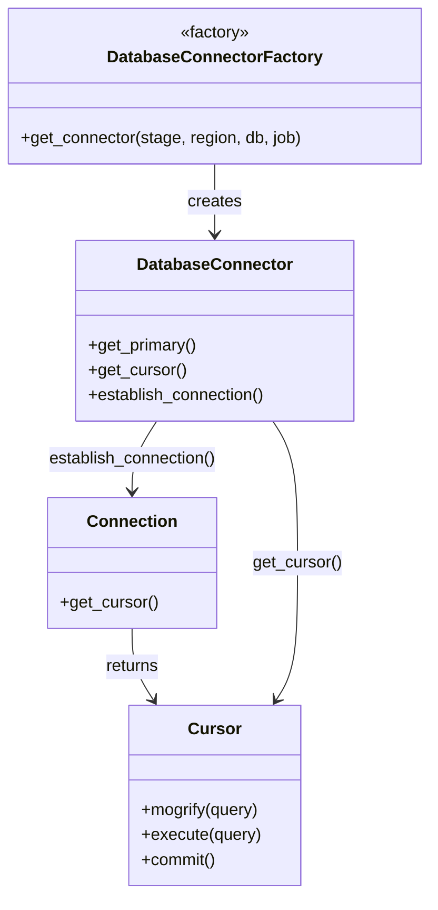

# Diagram: partview_core/partview_service/scripts/RemoveSearchesWithOrgFromPv.py


> Auto-generated by Obscura crawlers

## Diagram 1

```mermaid
flowchart TD
    Start[Start script] --> ParseArgs[parse_arguments()]
    ParseArgs --> GetConnector[DatabaseConnectorFactory.get_connector(stage, region, db, job)]
    GetConnector --> Primary[.get_primary()]
    Primary --> Establish[connector.establish_connection()]
    Establish --> Cursor[.get_cursor()]
    Cursor --> Mogrify[mogrify(DELETE query)]
    Mogrify --> Execute[connector.get_cursor().execute(mogrified)]
    Execute --> Commit[connector.get_cursor().commit()]
    Commit --> End[End]
```

> SVG rendering failed for this diagram.

## Diagram 2



### SVG

<svg id="container" width="410.703125" xmlns="http://www.w3.org/2000/svg" class="classDiagram" height="862" viewBox="0 0 410.703125 862" role="graphics-document document" aria-roledescription="class"><style>#container{font-family:"trebuchet ms",verdana,arial,sans-serif;font-size:16px;fill:#333;}@keyframes edge-animation-frame{from{stroke-dashoffset:0;}}@keyframes dash{to{stroke-dashoffset:0;}}#container .edge-animation-slow{stroke-dasharray:9,5!important;stroke-dashoffset:900;animation:dash 50s linear infinite;stroke-linecap:round;}#container .edge-animation-fast{stroke-dasharray:9,5!important;stroke-dashoffset:900;animation:dash 20s linear infinite;stroke-linecap:round;}#container .error-icon{fill:#552222;}#container .error-text{fill:#552222;stroke:#552222;}#container .edge-thickness-normal{stroke-width:1px;}#container .edge-thickness-thick{stroke-width:3.5px;}#container .edge-pattern-solid{stroke-dasharray:0;}#container .edge-thickness-invisible{stroke-width:0;fill:none;}#container .edge-pattern-dashed{stroke-dasharray:3;}#container .edge-pattern-dotted{stroke-dasharray:2;}#container .marker{fill:#333333;stroke:#333333;}#container .marker.cross{stroke:#333333;}#container svg{font-family:"trebuchet ms",verdana,arial,sans-serif;font-size:16px;}#container p{margin:0;}#container g.classGroup text{fill:#9370DB;stroke:none;font-family:"trebuchet ms",verdana,arial,sans-serif;font-size:10px;}#container g.classGroup text .title{font-weight:bolder;}#container .nodeLabel,#container .edgeLabel{color:#131300;}#container .edgeLabel .label rect{fill:#ECECFF;}#container .label text{fill:#131300;}#container .labelBkg{background:#ECECFF;}#container .edgeLabel .label span{background:#ECECFF;}#container .classTitle{font-weight:bolder;}#container .node rect,#container .node circle,#container .node ellipse,#container .node polygon,#container .node path{fill:#ECECFF;stroke:#9370DB;stroke-width:1px;}#container .divider{stroke:#9370DB;stroke-width:1;}#container g.clickable{cursor:pointer;}#container g.classGroup rect{fill:#ECECFF;stroke:#9370DB;}#container g.classGroup line{stroke:#9370DB;stroke-width:1;}#container .classLabel .box{stroke:none;stroke-width:0;fill:#ECECFF;opacity:0.5;}#container .classLabel .label{fill:#9370DB;font-size:10px;}#container .relation{stroke:#333333;stroke-width:1;fill:none;}#container .dashed-line{stroke-dasharray:3;}#container .dotted-line{stroke-dasharray:1 2;}#container #compositionStart,#container .composition{fill:#333333!important;stroke:#333333!important;stroke-width:1;}#container #compositionEnd,#container .composition{fill:#333333!important;stroke:#333333!important;stroke-width:1;}#container #dependencyStart,#container .dependency{fill:#333333!important;stroke:#333333!important;stroke-width:1;}#container #dependencyStart,#container .dependency{fill:#333333!important;stroke:#333333!important;stroke-width:1;}#container #extensionStart,#container .extension{fill:transparent!important;stroke:#333333!important;stroke-width:1;}#container #extensionEnd,#container .extension{fill:transparent!important;stroke:#333333!important;stroke-width:1;}#container #aggregationStart,#container .aggregation{fill:transparent!important;stroke:#333333!important;stroke-width:1;}#container #aggregationEnd,#container .aggregation{fill:transparent!important;stroke:#333333!important;stroke-width:1;}#container #lollipopStart,#container .lollipop{fill:#ECECFF!important;stroke:#333333!important;stroke-width:1;}#container #lollipopEnd,#container .lollipop{fill:#ECECFF!important;stroke:#333333!important;stroke-width:1;}#container .edgeTerminals{font-size:11px;line-height:initial;}#container .classTitleText{text-anchor:middle;font-size:18px;fill:#333;}#container .label-icon{display:inline-block;height:1em;overflow:visible;vertical-align:-0.125em;}#container .node .label-icon path{fill:currentColor;stroke:revert;stroke-width:revert;}#container :root{--mermaid-font-family:"trebuchet ms",verdana,arial,sans-serif;}</style><g><defs><marker id="container_class-aggregationStart" class="marker aggregation class" refX="18" refY="7" markerWidth="190" markerHeight="240" orient="auto"><path d="M 18,7 L9,13 L1,7 L9,1 Z"></path></marker></defs><defs><marker id="container_class-aggregationEnd" class="marker aggregation class" refX="1" refY="7" markerWidth="20" markerHeight="28" orient="auto"><path d="M 18,7 L9,13 L1,7 L9,1 Z"></path></marker></defs><defs><marker id="container_class-extensionStart" class="marker extension class" refX="18" refY="7" markerWidth="190" markerHeight="240" orient="auto"><path d="M 1,7 L18,13 V 1 Z"></path></marker></defs><defs><marker id="container_class-extensionEnd" class="marker extension class" refX="1" refY="7" markerWidth="20" markerHeight="28" orient="auto"><path d="M 1,1 V 13 L18,7 Z"></path></marker></defs><defs><marker id="container_class-compositionStart" class="marker composition class" refX="18" refY="7" markerWidth="190" markerHeight="240" orient="auto"><path d="M 18,7 L9,13 L1,7 L9,1 Z"></path></marker></defs><defs><marker id="container_class-compositionEnd" class="marker composition class" refX="1" refY="7" markerWidth="20" markerHeight="28" orient="auto"><path d="M 18,7 L9,13 L1,7 L9,1 Z"></path></marker></defs><defs><marker id="container_class-dependencyStart" class="marker dependency class" refX="6" refY="7" markerWidth="190" markerHeight="240" orient="auto"><path d="M 5,7 L9,13 L1,7 L9,1 Z"></path></marker></defs><defs><marker id="container_class-dependencyEnd" class="marker dependency class" refX="13" refY="7" markerWidth="20" markerHeight="28" orient="auto"><path d="M 18,7 L9,13 L14,7 L9,1 Z"></path></marker></defs><defs><marker id="container_class-lollipopStart" class="marker lollipop class" refX="13" refY="7" markerWidth="190" markerHeight="240" orient="auto"><circle stroke="black" fill="transparent" cx="7" cy="7" r="6"></circle></marker></defs><defs><marker id="container_class-lollipopEnd" class="marker lollipop class" refX="1" refY="7" markerWidth="190" markerHeight="240" orient="auto"><circle stroke="black" fill="transparent" cx="7" cy="7" r="6"></circle></marker></defs><g class="root"><g class="clusters"></g><g class="edgePaths"><path d="M205.352,158L205.352,164.167C205.352,170.333,205.352,182.667,205.352,194C205.352,205.333,205.352,215.667,205.352,220.833L205.352,226" id="id_DatabaseConnectorFactory_DatabaseConnector_1" class="edge-thickness-normal edge-pattern-solid relation" style=";;;" data-edge="true" data-et="edge" data-id="id_DatabaseConnectorFactory_DatabaseConnector_1" data-points="W3sieCI6MjA1LjM1MTU2MjUsInkiOjE1OH0seyJ4IjoyMDUuMzUxNTYyNSwieSI6MTk1fSx7IngiOjIwNS4zNTE1NjI1LCJ5IjoyMzJ9XQ==" marker-end="url(#container_class-dependencyEnd)"></path><path d="M149.832,406L145.897,412.167C141.962,418.333,134.091,430.667,130.156,442C126.221,453.333,126.221,463.667,126.221,468.833L126.221,474" id="id_DatabaseConnector_Connection_2" class="edge-thickness-normal edge-pattern-solid relation" style=";;;" data-edge="true" data-et="edge" data-id="id_DatabaseConnector_Connection_2" data-points="W3sieCI6MTQ5LjgzMjMzMDUxOTE1MzIzLCJ5Ijo0MDZ9LHsieCI6MTI2LjIyMDcwMzEyNSwieSI6NDQzfSx7IngiOjEyNi4yMjA3MDMxMjUsInkiOjQ4MH1d" marker-end="url(#container_class-dependencyEnd)"></path><path d="M126.221,606L126.221,612.167C126.221,618.333,126.221,630.667,129.618,642.157C133.015,653.647,139.81,664.295,143.207,669.618L146.605,674.942" id="id_Connection_Cursor_3" class="edge-thickness-normal edge-pattern-solid relation" style=";;;" data-edge="true" data-et="edge" data-id="id_Connection_Cursor_3" data-points="W3sieCI6MTI2LjIyMDcwMzEyNSwieSI6NjA2fSx7IngiOjEyNi4yMjA3MDMxMjUsInkiOjY0M30seyJ4IjoxNDkuODMyMzMwNTE5MTUzMjMsInkiOjY4MH1d" marker-end="url(#container_class-dependencyEnd)"></path><path d="M260.871,406L264.806,412.167C268.741,418.333,276.612,430.667,280.547,453.5C284.482,476.333,284.482,509.667,284.482,543C284.482,576.333,284.482,609.667,281.085,631.657C277.688,653.647,270.893,664.295,267.496,669.618L264.098,674.942" id="id_DatabaseConnector_Cursor_4" class="edge-thickness-normal edge-pattern-solid relation" style=";;;" data-edge="true" data-et="edge" data-id="id_DatabaseConnector_Cursor_4" data-points="W3sieCI6MjYwLjg3MDc5NDQ4MDg0Njc3LCJ5Ijo0MDZ9LHsieCI6Mjg0LjQ4MjQyMTg3NSwieSI6NDQzfSx7IngiOjI4NC40ODI0MjE4NzUsInkiOjU0M30seyJ4IjoyODQuNDgyNDIxODc1LCJ5Ijo2NDN9LHsieCI6MjYwLjg3MDc5NDQ4MDg0Njc3LCJ5Ijo2ODB9XQ==" marker-end="url(#container_class-dependencyEnd)"></path></g><g class="edgeLabels"><g class="edgeLabel" transform="translate(205.3515625, 195)"><g class="label" data-id="id_DatabaseConnectorFactory_DatabaseConnector_1" transform="translate(-26.171875, -12)"><foreignObject width="52.34375" height="24"><div xmlns="http://www.w3.org/1999/xhtml" class="labelBkg" style="display: table-cell; white-space: nowrap; line-height: 1.5; max-width: 200px; text-align: center;"><span class="edgeLabel"><p>creates</p></span></div></foreignObject></g></g><g class="edgeLabel" transform="translate(126.220703125, 443)"><g class="label" data-id="id_DatabaseConnector_Connection_2" transform="translate(-82.640625, -12)"><foreignObject width="165.28125" height="24"><div xmlns="http://www.w3.org/1999/xhtml" class="labelBkg" style="display: table-cell; white-space: nowrap; line-height: 1.5; max-width: 200px; text-align: center;"><span class="edgeLabel"><p>establish_connection()</p></span></div></foreignObject></g></g><g class="edgeLabel" transform="translate(126.220703125, 643)"><g class="label" data-id="id_Connection_Cursor_3" transform="translate(-26.265625, -12)"><foreignObject width="52.53125" height="24"><div xmlns="http://www.w3.org/1999/xhtml" class="labelBkg" style="display: table-cell; white-space: nowrap; line-height: 1.5; max-width: 200px; text-align: center;"><span class="edgeLabel"><p>returns</p></span></div></foreignObject></g></g><g class="edgeLabel" transform="translate(284.482421875, 543)"><g class="label" data-id="id_DatabaseConnector_Cursor_4" transform="translate(-43.328125, -12)"><foreignObject width="86.65625" height="24"><div xmlns="http://www.w3.org/1999/xhtml" class="labelBkg" style="display: table-cell; white-space: nowrap; line-height: 1.5; max-width: 200px; text-align: center;"><span class="edgeLabel"><p>get_cursor()</p></span></div></foreignObject></g></g></g><g class="nodes"><g class="node default" id="classId-DatabaseConnectorFactory-0" transform="translate(205.3515625, 83)"><g class="basic label-container"><path d="M-197.3515625 -75 L197.3515625 -75 L197.3515625 75 L-197.3515625 75" stroke="none" stroke-width="0" fill="#ECECFF" style=""></path><path d="M-197.3515625 -75 C-40.662807154648874 -75, 116.02594819070225 -75, 197.3515625 -75 M-197.3515625 -75 C-89.83767312820842 -75, 17.676216243583156 -75, 197.3515625 -75 M197.3515625 -75 C197.3515625 -44.406589580151014, 197.3515625 -13.813179160302028, 197.3515625 75 M197.3515625 -75 C197.3515625 -25.127731426155854, 197.3515625 24.74453714768829, 197.3515625 75 M197.3515625 75 C112.67252785229532 75, 27.993493204590635 75, -197.3515625 75 M197.3515625 75 C66.18780736041472 75, -64.97594777917055 75, -197.3515625 75 M-197.3515625 75 C-197.3515625 20.526615800572415, -197.3515625 -33.94676839885517, -197.3515625 -75 M-197.3515625 75 C-197.3515625 16.787051876033843, -197.3515625 -41.425896247932315, -197.3515625 -75" stroke="#9370DB" stroke-width="1.3" fill="none" stroke-dasharray="0 0" style=""></path></g><g class="annotation-group text" transform="translate(-34.2734375, -51)"><g class="label" style="" transform="translate(0,-12)"><foreignObject width="68.546875" height="24"><div xmlns="http://www.w3.org/1999/xhtml" style="display: table-cell; white-space: nowrap; line-height: 1.5; max-width: 119px; text-align: center;"><span class="nodeLabel markdown-node-label" style=""><p>«factory»</p></span></div></foreignObject></g></g><g class="label-group text" transform="translate(-98.1875, -27)"><g class="label" style="font-weight: bolder" transform="translate(0,-12)"><foreignObject width="196.375" height="24"><div xmlns="http://www.w3.org/1999/xhtml" style="display: table-cell; white-space: nowrap; line-height: 1.5; max-width: 244px; text-align: center;"><span class="nodeLabel markdown-node-label" style=""><p>DatabaseConnectorFactory</p></span></div></foreignObject></g></g><g class="members-group text" transform="translate(-185.3515625, 21)"></g><g class="methods-group text" transform="translate(-185.3515625, 51)"><g class="label" style="" transform="translate(0,-12)"><foreignObject width="272.515625" height="24"><div xmlns="http://www.w3.org/1999/xhtml" style="display: table-cell; white-space: nowrap; line-height: 1.5; max-width: 330px; text-align: center;"><span class="nodeLabel markdown-node-label" style=""><p>+get_connector(stage, region, db, job)</p></span></div></foreignObject></g></g><g class="divider" style=""><path d="M-197.3515625 -3 C-44.50364014749914 -3, 108.34428220500172 -3, 197.3515625 -3 M-197.3515625 -3 C-75.89419255258612 -3, 45.56317739482776 -3, 197.3515625 -3" stroke="#9370DB" stroke-width="1.3" fill="none" stroke-dasharray="0 0" style=""></path></g><g class="divider" style=""><path d="M-197.3515625 21 C-40.34734188507247 21, 116.65687872985507 21, 197.3515625 21 M-197.3515625 21 C-66.7009433166491 21, 63.949675866701796 21, 197.3515625 21" stroke="#9370DB" stroke-width="1.3" fill="none" stroke-dasharray="0 0" style=""></path></g></g><g class="node default" id="classId-DatabaseConnector-1" transform="translate(205.3515625, 319)"><g class="basic label-container"><path d="M-134.42578125 -87 L134.42578125 -87 L134.42578125 87 L-134.42578125 87" stroke="none" stroke-width="0" fill="#ECECFF" style=""></path><path d="M-134.42578125 -87 C-27.55018537168654 -87, 79.32541050662692 -87, 134.42578125 -87 M-134.42578125 -87 C-29.80480710323414 -87, 74.81616704353172 -87, 134.42578125 -87 M134.42578125 -87 C134.42578125 -44.86473766582993, 134.42578125 -2.729475331659856, 134.42578125 87 M134.42578125 -87 C134.42578125 -32.638107427887775, 134.42578125 21.72378514422445, 134.42578125 87 M134.42578125 87 C31.836292602972307 87, -70.75319604405539 87, -134.42578125 87 M134.42578125 87 C30.282765022552667 87, -73.86025120489467 87, -134.42578125 87 M-134.42578125 87 C-134.42578125 46.861494083450445, -134.42578125 6.72298816690089, -134.42578125 -87 M-134.42578125 87 C-134.42578125 44.635955164791966, -134.42578125 2.271910329583932, -134.42578125 -87" stroke="#9370DB" stroke-width="1.3" fill="none" stroke-dasharray="0 0" style=""></path></g><g class="annotation-group text" transform="translate(0, -63)"></g><g class="label-group text" transform="translate(-71.5859375, -63)"><g class="label" style="font-weight: bolder" transform="translate(0,-12)"><foreignObject width="143.171875" height="24"><div xmlns="http://www.w3.org/1999/xhtml" style="display: table-cell; white-space: nowrap; line-height: 1.5; max-width: 192px; text-align: center;"><span class="nodeLabel markdown-node-label" style=""><p>DatabaseConnector</p></span></div></foreignObject></g></g><g class="members-group text" transform="translate(-122.42578125, -15)"></g><g class="methods-group text" transform="translate(-122.42578125, 15)"><g class="label" style="" transform="translate(0,-12)"><foreignObject width="105.890625" height="24"><div xmlns="http://www.w3.org/1999/xhtml" style="display: table-cell; white-space: nowrap; line-height: 1.5; max-width: 163px; text-align: center;"><span class="nodeLabel markdown-node-label" style=""><p>+get_primary()</p></span></div></foreignObject></g><g class="label" style="" transform="translate(0,12)"><foreignObject width="94.640625" height="24"><div xmlns="http://www.w3.org/1999/xhtml" style="display: table-cell; white-space: nowrap; line-height: 1.5; max-width: 152px; text-align: center;"><span class="nodeLabel markdown-node-label" style=""><p>+get_cursor()</p></span></div></foreignObject></g><g class="label" style="" transform="translate(0,36)"><foreignObject width="173.265625" height="24"><div xmlns="http://www.w3.org/1999/xhtml" style="display: table-cell; white-space: nowrap; line-height: 1.5; max-width: 231px; text-align: center;"><span class="nodeLabel markdown-node-label" style=""><p>+establish_connection()</p></span></div></foreignObject></g></g><g class="divider" style=""><path d="M-134.42578125 -39 C-61.06855318557385 -39, 12.288674878852305 -39, 134.42578125 -39 M-134.42578125 -39 C-30.44052350364798 -39, 73.54473424270404 -39, 134.42578125 -39" stroke="#9370DB" stroke-width="1.3" fill="none" stroke-dasharray="0 0" style=""></path></g><g class="divider" style=""><path d="M-134.42578125 -15 C-51.09321059451071 -15, 32.23936006097858 -15, 134.42578125 -15 M-134.42578125 -15 C-63.741302276149085 -15, 6.94317669770183 -15, 134.42578125 -15" stroke="#9370DB" stroke-width="1.3" fill="none" stroke-dasharray="0 0" style=""></path></g></g><g class="node default" id="classId-Connection-2" transform="translate(126.220703125, 543)"><g class="basic label-container"><path d="M-79.93359375 -63 L79.93359375 -63 L79.93359375 63 L-79.93359375 63" stroke="none" stroke-width="0" fill="#ECECFF" style=""></path><path d="M-79.93359375 -63 C-27.492907412978013 -63, 24.947778924043973 -63, 79.93359375 -63 M-79.93359375 -63 C-40.51487769337359 -63, -1.0961616367471834 -63, 79.93359375 -63 M79.93359375 -63 C79.93359375 -34.139104561364775, 79.93359375 -5.278209122729557, 79.93359375 63 M79.93359375 -63 C79.93359375 -25.001799243491583, 79.93359375 12.996401513016835, 79.93359375 63 M79.93359375 63 C27.37019793459678 63, -25.193197880806437 63, -79.93359375 63 M79.93359375 63 C40.05902861016092 63, 0.18446347032184462 63, -79.93359375 63 M-79.93359375 63 C-79.93359375 36.42849114623711, -79.93359375 9.856982292474221, -79.93359375 -63 M-79.93359375 63 C-79.93359375 33.76032798858479, -79.93359375 4.520655977169589, -79.93359375 -63" stroke="#9370DB" stroke-width="1.3" fill="none" stroke-dasharray="0 0" style=""></path></g><g class="annotation-group text" transform="translate(0, -39)"></g><g class="label-group text" transform="translate(-41.2265625, -39)"><g class="label" style="font-weight: bolder" transform="translate(0,-12)"><foreignObject width="82.453125" height="24"><div xmlns="http://www.w3.org/1999/xhtml" style="display: table-cell; white-space: nowrap; line-height: 1.5; max-width: 132px; text-align: center;"><span class="nodeLabel markdown-node-label" style=""><p>Connection</p></span></div></foreignObject></g></g><g class="members-group text" transform="translate(-67.93359375, 9)"></g><g class="methods-group text" transform="translate(-67.93359375, 39)"><g class="label" style="" transform="translate(0,-12)"><foreignObject width="94.640625" height="24"><div xmlns="http://www.w3.org/1999/xhtml" style="display: table-cell; white-space: nowrap; line-height: 1.5; max-width: 152px; text-align: center;"><span class="nodeLabel markdown-node-label" style=""><p>+get_cursor()</p></span></div></foreignObject></g></g><g class="divider" style=""><path d="M-79.93359375 -15 C-36.184293600961475 -15, 7.565006548077051 -15, 79.93359375 -15 M-79.93359375 -15 C-35.42520651673283 -15, 9.083180716534343 -15, 79.93359375 -15" stroke="#9370DB" stroke-width="1.3" fill="none" stroke-dasharray="0 0" style=""></path></g><g class="divider" style=""><path d="M-79.93359375 9 C-44.45127415207905 9, -8.968954554158103 9, 79.93359375 9 M-79.93359375 9 C-40.93994060015794 9, -1.9462874503158787 9, 79.93359375 9" stroke="#9370DB" stroke-width="1.3" fill="none" stroke-dasharray="0 0" style=""></path></g></g><g class="node default" id="classId-Cursor-3" transform="translate(205.3515625, 767)"><g class="basic label-container"><path d="M-81.9375 -87 L81.9375 -87 L81.9375 87 L-81.9375 87" stroke="none" stroke-width="0" fill="#ECECFF" style=""></path><path d="M-81.9375 -87 C-25.738913154592275 -87, 30.45967369081545 -87, 81.9375 -87 M-81.9375 -87 C-38.95897309077032 -87, 4.019553818459357 -87, 81.9375 -87 M81.9375 -87 C81.9375 -30.834213112749048, 81.9375 25.331573774501905, 81.9375 87 M81.9375 -87 C81.9375 -19.06918220550716, 81.9375 48.86163558898568, 81.9375 87 M81.9375 87 C28.046329048358373 87, -25.844841903283253 87, -81.9375 87 M81.9375 87 C25.082481468408012 87, -31.772537063183975 87, -81.9375 87 M-81.9375 87 C-81.9375 28.858407007674273, -81.9375 -29.283185984651453, -81.9375 -87 M-81.9375 87 C-81.9375 41.28517652371572, -81.9375 -4.429646952568561, -81.9375 -87" stroke="#9370DB" stroke-width="1.3" fill="none" stroke-dasharray="0 0" style=""></path></g><g class="annotation-group text" transform="translate(0, -63)"></g><g class="label-group text" transform="translate(-23.90625, -63)"><g class="label" style="font-weight: bolder" transform="translate(0,-12)"><foreignObject width="47.8125" height="24"><div xmlns="http://www.w3.org/1999/xhtml" style="display: table-cell; white-space: nowrap; line-height: 1.5; max-width: 98px; text-align: center;"><span class="nodeLabel markdown-node-label" style=""><p>Cursor</p></span></div></foreignObject></g></g><g class="members-group text" transform="translate(-69.9375, -15)"></g><g class="methods-group text" transform="translate(-69.9375, 15)"><g class="label" style="" transform="translate(0,-12)"><foreignObject width="115.296875" height="24"><div xmlns="http://www.w3.org/1999/xhtml" style="display: table-cell; white-space: nowrap; line-height: 1.5; max-width: 173px; text-align: center;"><span class="nodeLabel markdown-node-label" style=""><p>+mogrify(query)</p></span></div></foreignObject></g><g class="label" style="" transform="translate(0,12)"><foreignObject width="115.96875" height="24"><div xmlns="http://www.w3.org/1999/xhtml" style="display: table-cell; white-space: nowrap; line-height: 1.5; max-width: 173px; text-align: center;"><span class="nodeLabel markdown-node-label" style=""><p>+execute(query)</p></span></div></foreignObject></g><g class="label" style="" transform="translate(0,36)"><foreignObject width="72.75" height="24"><div xmlns="http://www.w3.org/1999/xhtml" style="display: table-cell; white-space: nowrap; line-height: 1.5; max-width: 130px; text-align: center;"><span class="nodeLabel markdown-node-label" style=""><p>+commit()</p></span></div></foreignObject></g></g><g class="divider" style=""><path d="M-81.9375 -39 C-29.911676848831874 -39, 22.114146302336252 -39, 81.9375 -39 M-81.9375 -39 C-30.059711847664424 -39, 21.818076304671152 -39, 81.9375 -39" stroke="#9370DB" stroke-width="1.3" fill="none" stroke-dasharray="0 0" style=""></path></g><g class="divider" style=""><path d="M-81.9375 -15 C-35.15182024810132 -15, 11.633859503797353 -15, 81.9375 -15 M-81.9375 -15 C-37.86164186583961 -15, 6.214216268320783 -15, 81.9375 -15" stroke="#9370DB" stroke-width="1.3" fill="none" stroke-dasharray="0 0" style=""></path></g></g></g></g></g></svg>
