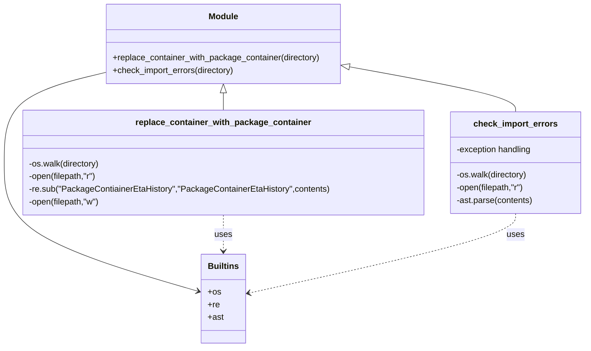

# Diagram: partview_core/partview_service/scripts/Rename_files.py


> Auto-generated by Obscura crawlers

## Diagram 1

```mermaid
flowchart TD
    Start[[Script start]]
    A[Set parent_directory = "partview_service"]
    B{For each subdir in parent_directory}
    C1[check_import_errors(subdir_path)]
    C2[replace_container_with_package_container(subdir_path)]
    End[[Script end]]

    Start --> A --> B
    B -->|isdir| C1
    B -->|isdir| C2
    B -->|not isdir| End
    C1 --> C2
    C2 --> End
```

> SVG rendering failed for this diagram.

## Diagram 2



### SVG

<svg id="container" width="1091.796875" xmlns="http://www.w3.org/2000/svg" class="classDiagram" height="656" viewBox="-35 0 1091.796875 656" role="graphics-document document" aria-roledescription="class"><style>#container{font-family:"trebuchet ms",verdana,arial,sans-serif;font-size:16px;fill:#333;}@keyframes edge-animation-frame{from{stroke-dashoffset:0;}}@keyframes dash{to{stroke-dashoffset:0;}}#container .edge-animation-slow{stroke-dasharray:9,5!important;stroke-dashoffset:900;animation:dash 50s linear infinite;stroke-linecap:round;}#container .edge-animation-fast{stroke-dasharray:9,5!important;stroke-dashoffset:900;animation:dash 20s linear infinite;stroke-linecap:round;}#container .error-icon{fill:#552222;}#container .error-text{fill:#552222;stroke:#552222;}#container .edge-thickness-normal{stroke-width:1px;}#container .edge-thickness-thick{stroke-width:3.5px;}#container .edge-pattern-solid{stroke-dasharray:0;}#container .edge-thickness-invisible{stroke-width:0;fill:none;}#container .edge-pattern-dashed{stroke-dasharray:3;}#container .edge-pattern-dotted{stroke-dasharray:2;}#container .marker{fill:#333333;stroke:#333333;}#container .marker.cross{stroke:#333333;}#container svg{font-family:"trebuchet ms",verdana,arial,sans-serif;font-size:16px;}#container p{margin:0;}#container g.classGroup text{fill:#9370DB;stroke:none;font-family:"trebuchet ms",verdana,arial,sans-serif;font-size:10px;}#container g.classGroup text .title{font-weight:bolder;}#container .nodeLabel,#container .edgeLabel{color:#131300;}#container .edgeLabel .label rect{fill:#ECECFF;}#container .label text{fill:#131300;}#container .labelBkg{background:#ECECFF;}#container .edgeLabel .label span{background:#ECECFF;}#container .classTitle{font-weight:bolder;}#container .node rect,#container .node circle,#container .node ellipse,#container .node polygon,#container .node path{fill:#ECECFF;stroke:#9370DB;stroke-width:1px;}#container .divider{stroke:#9370DB;stroke-width:1;}#container g.clickable{cursor:pointer;}#container g.classGroup rect{fill:#ECECFF;stroke:#9370DB;}#container g.classGroup line{stroke:#9370DB;stroke-width:1;}#container .classLabel .box{stroke:none;stroke-width:0;fill:#ECECFF;opacity:0.5;}#container .classLabel .label{fill:#9370DB;font-size:10px;}#container .relation{stroke:#333333;stroke-width:1;fill:none;}#container .dashed-line{stroke-dasharray:3;}#container .dotted-line{stroke-dasharray:1 2;}#container #compositionStart,#container .composition{fill:#333333!important;stroke:#333333!important;stroke-width:1;}#container #compositionEnd,#container .composition{fill:#333333!important;stroke:#333333!important;stroke-width:1;}#container #dependencyStart,#container .dependency{fill:#333333!important;stroke:#333333!important;stroke-width:1;}#container #dependencyStart,#container .dependency{fill:#333333!important;stroke:#333333!important;stroke-width:1;}#container #extensionStart,#container .extension{fill:transparent!important;stroke:#333333!important;stroke-width:1;}#container #extensionEnd,#container .extension{fill:transparent!important;stroke:#333333!important;stroke-width:1;}#container #aggregationStart,#container .aggregation{fill:transparent!important;stroke:#333333!important;stroke-width:1;}#container #aggregationEnd,#container .aggregation{fill:transparent!important;stroke:#333333!important;stroke-width:1;}#container #lollipopStart,#container .lollipop{fill:#ECECFF!important;stroke:#333333!important;stroke-width:1;}#container #lollipopEnd,#container .lollipop{fill:#ECECFF!important;stroke:#333333!important;stroke-width:1;}#container .edgeTerminals{font-size:11px;line-height:initial;}#container .classTitleText{text-anchor:middle;font-size:18px;fill:#333;}#container .label-icon{display:inline-block;height:1em;overflow:visible;vertical-align:-0.125em;}#container .node .label-icon path{fill:currentColor;stroke:revert;stroke-width:revert;}#container :root{--mermaid-font-family:"trebuchet ms",verdana,arial,sans-serif;}</style><g><defs><marker id="container_class-aggregationStart" class="marker aggregation class" refX="18" refY="7" markerWidth="190" markerHeight="240" orient="auto"><path d="M 18,7 L9,13 L1,7 L9,1 Z"></path></marker></defs><defs><marker id="container_class-aggregationEnd" class="marker aggregation class" refX="1" refY="7" markerWidth="20" markerHeight="28" orient="auto"><path d="M 18,7 L9,13 L1,7 L9,1 Z"></path></marker></defs><defs><marker id="container_class-extensionStart" class="marker extension class" refX="18" refY="7" markerWidth="190" markerHeight="240" orient="auto"><path d="M 1,7 L18,13 V 1 Z"></path></marker></defs><defs><marker id="container_class-extensionEnd" class="marker extension class" refX="1" refY="7" markerWidth="20" markerHeight="28" orient="auto"><path d="M 1,1 V 13 L18,7 Z"></path></marker></defs><defs><marker id="container_class-compositionStart" class="marker composition class" refX="18" refY="7" markerWidth="190" markerHeight="240" orient="auto"><path d="M 18,7 L9,13 L1,7 L9,1 Z"></path></marker></defs><defs><marker id="container_class-compositionEnd" class="marker composition class" refX="1" refY="7" markerWidth="20" markerHeight="28" orient="auto"><path d="M 18,7 L9,13 L1,7 L9,1 Z"></path></marker></defs><defs><marker id="container_class-dependencyStart" class="marker dependency class" refX="6" refY="7" markerWidth="190" markerHeight="240" orient="auto"><path d="M 5,7 L9,13 L1,7 L9,1 Z"></path></marker></defs><defs><marker id="container_class-dependencyEnd" class="marker dependency class" refX="13" refY="7" markerWidth="20" markerHeight="28" orient="auto"><path d="M 18,7 L9,13 L14,7 L9,1 Z"></path></marker></defs><defs><marker id="container_class-lollipopStart" class="marker lollipop class" refX="13" refY="7" markerWidth="190" markerHeight="240" orient="auto"><circle stroke="black" fill="transparent" cx="7" cy="7" r="6"></circle></marker></defs><defs><marker id="container_class-lollipopEnd" class="marker lollipop class" refX="1" refY="7" markerWidth="190" markerHeight="240" orient="auto"><circle stroke="black" fill="transparent" cx="7" cy="7" r="6"></circle></marker></defs><g class="root"><g class="clusters"></g><g class="edgePaths"><path d="M380.566,175.25L380.566,176.542C380.566,177.833,380.566,180.417,380.566,185.875C380.566,191.333,380.566,199.667,380.566,203.833L380.566,208" id="id_Module_replace_container_with_package_container_1" class="edge-thickness-normal edge-pattern-solid relation" style=";;;" data-edge="true" data-et="edge" data-id="id_Module_replace_container_with_package_container_1" data-points="W3sieCI6MzgwLjU2NjQwNjI1LCJ5IjoxNTh9LHsieCI6MzgwLjU2NjQwNjI1LCJ5IjoxODN9LHsieCI6MzgwLjU2NjQwNjI1LCJ5IjoyMDh9XQ==" marker-start="url(#container_class-extensionStart)"></path><path d="M620.893,127.064L671.738,136.387C722.584,145.71,824.274,164.355,875.12,178.344C925.965,192.333,925.965,201.667,925.965,206.333L925.965,211" id="id_Module_check_import_errors_2" class="edge-thickness-normal edge-pattern-solid relation" style=";;;" data-edge="true" data-et="edge" data-id="id_Module_check_import_errors_2" data-points="W3sieCI6NjAzLjkyNTc4MTI1LCJ5IjoxMjMuOTUzNDMxNDA3NjU3ODJ9LHsieCI6OTI1Ljk2NDg0Mzc1LCJ5IjoxODN9LHsieCI6OTI1Ljk2NDg0Mzc1LCJ5IjoyMTF9XQ==" marker-start="url(#container_class-extensionStart)"></path><path d="M157.207,137.803L126.506,145.336C95.805,152.869,34.402,167.934,3.701,196.134C-27,224.333,-27,265.667,-27,309C-27,352.333,-27,397.667,33.176,438.199C93.352,478.731,213.704,514.461,273.881,532.327L334.057,550.192" id="id_Module_Builtins_3" class="edge-thickness-normal edge-pattern-solid relation" style=";;;" data-edge="true" data-et="edge" data-id="id_Module_Builtins_3" data-points="W3sieCI6MTU3LjIwNzAzMTI1LCJ5IjoxMzcuODAzMTg1ODMwNTI5OX0seyJ4IjotMjcsInkiOjE4M30seyJ4IjotMjcsInkiOjMwN30seyJ4IjotMjcsInkiOjQ0M30seyJ4IjozMzkuODA4NTkzNzUsInkiOjU1MS44OTk2NTIwODg5MDQyfV0=" marker-end="url(#container_class-dependencyEnd)"></path><path d="M380.566,406L380.566,412.167C380.566,418.333,380.566,430.667,380.566,442C380.566,453.333,380.566,463.667,380.566,468.833L380.566,474" id="id_replace_container_with_package_container_Builtins_4" class="edge-thickness-normal edge-pattern-dashed relation" style=";;;" data-edge="true" data-et="edge" data-id="id_replace_container_with_package_container_Builtins_4" data-points="W3sieCI6MzgwLjU2NjQwNjI1LCJ5Ijo0MDZ9LHsieCI6MzgwLjU2NjQwNjI1LCJ5Ijo0NDN9LHsieCI6MzgwLjU2NjQwNjI1LCJ5Ijo0ODB9XQ==" marker-end="url(#container_class-dependencyEnd)"></path><path d="M925.965,403L925.965,409.667C925.965,416.333,925.965,429.667,842.834,454.776C759.704,479.886,593.443,516.772,510.312,535.215L427.182,553.658" id="id_check_import_errors_Builtins_5" class="edge-thickness-normal edge-pattern-dashed relation" style=";;;" data-edge="true" data-et="edge" data-id="id_check_import_errors_Builtins_5" data-points="W3sieCI6OTI1Ljk2NDg0Mzc1LCJ5Ijo0MDN9LHsieCI6OTI1Ljk2NDg0Mzc1LCJ5Ijo0NDN9LHsieCI6NDIxLjMyNDIxODc1LCJ5Ijo1NTQuOTU3NjI4NDUzOTY4Nn1d" marker-end="url(#container_class-dependencyEnd)"></path></g><g class="edgeLabels"><g class="edgeLabel"><g class="label" data-id="id_Module_replace_container_with_package_container_1" transform="translate(0, 0)"><foreignObject width="0" height="0"><div xmlns="http://www.w3.org/1999/xhtml" class="labelBkg" style="display: table-cell; white-space: nowrap; line-height: 1.5; max-width: 200px; text-align: center;"><span class="edgeLabel"></span></div></foreignObject></g></g><g class="edgeLabel"><g class="label" data-id="id_Module_check_import_errors_2" transform="translate(0, 0)"><foreignObject width="0" height="0"><div xmlns="http://www.w3.org/1999/xhtml" class="labelBkg" style="display: table-cell; white-space: nowrap; line-height: 1.5; max-width: 200px; text-align: center;"><span class="edgeLabel"></span></div></foreignObject></g></g><g class="edgeLabel"><g class="label" data-id="id_Module_Builtins_3" transform="translate(0, 0)"><foreignObject width="0" height="0"><div xmlns="http://www.w3.org/1999/xhtml" class="labelBkg" style="display: table-cell; white-space: nowrap; line-height: 1.5; max-width: 200px; text-align: center;"><span class="edgeLabel"></span></div></foreignObject></g></g><g class="edgeLabel" transform="translate(380.56640625, 443)"><g class="label" data-id="id_replace_container_with_package_container_Builtins_4" transform="translate(-16.4921875, -12)"><foreignObject width="32.984375" height="24"><div xmlns="http://www.w3.org/1999/xhtml" class="labelBkg" style="display: table-cell; white-space: nowrap; line-height: 1.5; max-width: 200px; text-align: center;"><span class="edgeLabel"><p>uses</p></span></div></foreignObject></g></g><g class="edgeLabel" transform="translate(925.96484375, 443)"><g class="label" data-id="id_check_import_errors_Builtins_5" transform="translate(-16.4921875, -12)"><foreignObject width="32.984375" height="24"><div xmlns="http://www.w3.org/1999/xhtml" class="labelBkg" style="display: table-cell; white-space: nowrap; line-height: 1.5; max-width: 200px; text-align: center;"><span class="edgeLabel"><p>uses</p></span></div></foreignObject></g></g></g><g class="nodes"><g class="node default" id="classId-Module-0" transform="translate(380.56640625, 83)"><g class="basic label-container"><path d="M-223.359375 -75 L223.359375 -75 L223.359375 75 L-223.359375 75" stroke="none" stroke-width="0" fill="#ECECFF" style=""></path><path d="M-223.359375 -75 C-83.22362778141476 -75, 56.912119437170475 -75, 223.359375 -75 M-223.359375 -75 C-47.31140011270713 -75, 128.73657477458573 -75, 223.359375 -75 M223.359375 -75 C223.359375 -31.388586854949793, 223.359375 12.222826290100414, 223.359375 75 M223.359375 -75 C223.359375 -15.875816784637998, 223.359375 43.248366430724005, 223.359375 75 M223.359375 75 C124.15049677180008 75, 24.941618543600157 75, -223.359375 75 M223.359375 75 C63.20036496101744 75, -96.95864507796512 75, -223.359375 75 M-223.359375 75 C-223.359375 43.97464921678975, -223.359375 12.9492984335795, -223.359375 -75 M-223.359375 75 C-223.359375 26.43227814177353, -223.359375 -22.13544371645294, -223.359375 -75" stroke="#9370DB" stroke-width="1.3" fill="none" stroke-dasharray="0 0" style=""></path></g><g class="annotation-group text" transform="translate(0, -51)"></g><g class="label-group text" transform="translate(-27.09375, -51)"><g class="label" style="font-weight: bolder" transform="translate(0,-12)"><foreignObject width="54.1875" height="24"><div xmlns="http://www.w3.org/1999/xhtml" style="display: table-cell; white-space: nowrap; line-height: 1.5; max-width: 104px; text-align: center;"><span class="nodeLabel markdown-node-label" style=""><p>Module</p></span></div></foreignObject></g></g><g class="members-group text" transform="translate(-211.359375, -3)"></g><g class="methods-group text" transform="translate(-211.359375, 27)"><g class="label" style="" transform="translate(0,-12)"><foreignObject width="395.625" height="24"><div xmlns="http://www.w3.org/1999/xhtml" style="display: table-cell; white-space: nowrap; line-height: 1.5; max-width: 453px; text-align: center;"><span class="nodeLabel markdown-node-label" style=""><p>+replace_container_with_package_container(directory)</p></span></div></foreignObject></g><g class="label" style="" transform="translate(0,12)"><foreignObject width="233.703125" height="24"><div xmlns="http://www.w3.org/1999/xhtml" style="display: table-cell; white-space: nowrap; line-height: 1.5; max-width: 291px; text-align: center;"><span class="nodeLabel markdown-node-label" style=""><p>+check_import_errors(directory)</p></span></div></foreignObject></g></g><g class="divider" style=""><path d="M-223.359375 -27 C-87.23985422452606 -27, 48.87966655094789 -27, 223.359375 -27 M-223.359375 -27 C-129.45731133191757 -27, -35.55524766383513 -27, 223.359375 -27" stroke="#9370DB" stroke-width="1.3" fill="none" stroke-dasharray="0 0" style=""></path></g><g class="divider" style=""><path d="M-223.359375 -3 C-122.04782747559636 -3, -20.736279951192728 -3, 223.359375 -3 M-223.359375 -3 C-129.488990553551 -3, -35.61860610710201 -3, 223.359375 -3" stroke="#9370DB" stroke-width="1.3" fill="none" stroke-dasharray="0 0" style=""></path></g></g><g class="node default" id="classId-replace_container_with_package_container-1" transform="translate(380.56640625, 307)"><g class="basic label-container"><path d="M-372.56640625 -99 L372.56640625 -99 L372.56640625 99 L-372.56640625 99" stroke="none" stroke-width="0" fill="#ECECFF" style=""></path><path d="M-372.56640625 -99 C-136.95116025587797 -99, 98.66408573824407 -99, 372.56640625 -99 M-372.56640625 -99 C-175.89131365357906 -99, 20.783778942841877 -99, 372.56640625 -99 M372.56640625 -99 C372.56640625 -35.25929417093011, 372.56640625 28.481411658139777, 372.56640625 99 M372.56640625 -99 C372.56640625 -24.22989283187968, 372.56640625 50.54021433624064, 372.56640625 99 M372.56640625 99 C165.1330680885106 99, -42.300270072978776 99, -372.56640625 99 M372.56640625 99 C183.24688978149794 99, -6.072626687004117 99, -372.56640625 99 M-372.56640625 99 C-372.56640625 55.80773582334574, -372.56640625 12.615471646691475, -372.56640625 -99 M-372.56640625 99 C-372.56640625 58.39298296748764, -372.56640625 17.78596593497528, -372.56640625 -99" stroke="#9370DB" stroke-width="1.3" fill="none" stroke-dasharray="0 0" style=""></path></g><g class="annotation-group text" transform="translate(0, -75)"></g><g class="label-group text" transform="translate(-157.9453125, -75)"><g class="label" style="font-weight: bolder" transform="translate(0,-12)"><foreignObject width="315.890625" height="24"><div xmlns="http://www.w3.org/1999/xhtml" style="display: table-cell; white-space: nowrap; line-height: 1.5; max-width: 363px; text-align: center;"><span class="nodeLabel markdown-node-label" style=""><p>replace_container_with_package_container</p></span></div></foreignObject></g></g><g class="members-group text" transform="translate(-360.56640625, -27)"></g><g class="methods-group text" transform="translate(-360.56640625, 3)"><g class="label" style="" transform="translate(0,-12)"><foreignObject width="134.9375" height="24"><div xmlns="http://www.w3.org/1999/xhtml" style="display: table-cell; white-space: nowrap; line-height: 1.5; max-width: 192px; text-align: center;"><span class="nodeLabel markdown-node-label" style=""><p>-os.walk(directory)</p></span></div></foreignObject></g><g class="label" style="" transform="translate(0,12)"><foreignObject width="130.75" height="24"><div xmlns="http://www.w3.org/1999/xhtml" style="display: table-cell; white-space: nowrap; line-height: 1.5; max-width: 188px; text-align: center;"><span class="nodeLabel markdown-node-label" style=""><p>-open(filepath,"r")</p></span></div></foreignObject></g><g class="label" style="" transform="translate(0,36)"><foreignObject width="563.1875" height="24"><div xmlns="http://www.w3.org/1999/xhtml" style="display: table-cell; white-space: nowrap; line-height: 1.5; max-width: 621px; text-align: center;"><span class="nodeLabel markdown-node-label" style=""><p>-re.sub("PackageContiainerEtaHistory","PackageContainerEtaHistory",contents)</p></span></div></foreignObject></g><g class="label" style="" transform="translate(0,60)"><foreignObject width="135.96875" height="24"><div xmlns="http://www.w3.org/1999/xhtml" style="display: table-cell; white-space: nowrap; line-height: 1.5; max-width: 193px; text-align: center;"><span class="nodeLabel markdown-node-label" style=""><p>-open(filepath,"w")</p></span></div></foreignObject></g></g><g class="divider" style=""><path d="M-372.56640625 -51 C-175.45864156166525 -51, 21.649123126669508 -51, 372.56640625 -51 M-372.56640625 -51 C-97.80908616607007 -51, 176.94823391785985 -51, 372.56640625 -51" stroke="#9370DB" stroke-width="1.3" fill="none" stroke-dasharray="0 0" style=""></path></g><g class="divider" style=""><path d="M-372.56640625 -27 C-154.10437233599447 -27, 64.35766157801106 -27, 372.56640625 -27 M-372.56640625 -27 C-104.69847029887967 -27, 163.16946565224066 -27, 372.56640625 -27" stroke="#9370DB" stroke-width="1.3" fill="none" stroke-dasharray="0 0" style=""></path></g></g><g class="node default" id="classId-check_import_errors-2" transform="translate(925.96484375, 307)"><g class="basic label-container"><path d="M-122.83203125 -96 L122.83203125 -96 L122.83203125 96 L-122.83203125 96" stroke="none" stroke-width="0" fill="#ECECFF" style=""></path><path d="M-122.83203125 -96 C-72.77303526935935 -96, -22.714039288718695 -96, 122.83203125 -96 M-122.83203125 -96 C-45.669541294961775 -96, 31.49294866007645 -96, 122.83203125 -96 M122.83203125 -96 C122.83203125 -20.608437483751374, 122.83203125 54.78312503249725, 122.83203125 96 M122.83203125 -96 C122.83203125 -50.6725154029842, 122.83203125 -5.345030805968406, 122.83203125 96 M122.83203125 96 C66.2158216651085 96, 9.599612080217014 96, -122.83203125 96 M122.83203125 96 C34.33822462051086 96, -54.155582008978286 96, -122.83203125 96 M-122.83203125 96 C-122.83203125 36.02879765717938, -122.83203125 -23.942404685641236, -122.83203125 -96 M-122.83203125 96 C-122.83203125 46.67153343424183, -122.83203125 -2.6569331315163396, -122.83203125 -96" stroke="#9370DB" stroke-width="1.3" fill="none" stroke-dasharray="0 0" style=""></path></g><g class="annotation-group text" transform="translate(0, -72)"></g><g class="label-group text" transform="translate(-76.2734375, -72)"><g class="label" style="font-weight: bolder" transform="translate(0,-12)"><foreignObject width="152.546875" height="24"><div xmlns="http://www.w3.org/1999/xhtml" style="display: table-cell; white-space: nowrap; line-height: 1.5; max-width: 200px; text-align: center;"><span class="nodeLabel markdown-node-label" style=""><p>check_import_errors</p></span></div></foreignObject></g></g><g class="members-group text" transform="translate(-110.83203125, -24)"><g class="label" style="" transform="translate(0,-12)"><foreignObject width="145.375" height="24"><div xmlns="http://www.w3.org/1999/xhtml" style="display: table-cell; white-space: nowrap; line-height: 1.5; max-width: 203px; text-align: center;"><span class="nodeLabel markdown-node-label" style=""><p>-exception handling</p></span></div></foreignObject></g></g><g class="methods-group text" transform="translate(-110.83203125, 24)"><g class="label" style="" transform="translate(0,-12)"><foreignObject width="134.9375" height="24"><div xmlns="http://www.w3.org/1999/xhtml" style="display: table-cell; white-space: nowrap; line-height: 1.5; max-width: 192px; text-align: center;"><span class="nodeLabel markdown-node-label" style=""><p>-os.walk(directory)</p></span></div></foreignObject></g><g class="label" style="" transform="translate(0,12)"><foreignObject width="130.75" height="24"><div xmlns="http://www.w3.org/1999/xhtml" style="display: table-cell; white-space: nowrap; line-height: 1.5; max-width: 188px; text-align: center;"><span class="nodeLabel markdown-node-label" style=""><p>-open(filepath,"r")</p></span></div></foreignObject></g><g class="label" style="" transform="translate(0,36)"><foreignObject width="145.390625" height="24"><div xmlns="http://www.w3.org/1999/xhtml" style="display: table-cell; white-space: nowrap; line-height: 1.5; max-width: 203px; text-align: center;"><span class="nodeLabel markdown-node-label" style=""><p>-ast.parse(contents)</p></span></div></foreignObject></g></g><g class="divider" style=""><path d="M-122.83203125 -48 C-59.667619713628795 -48, 3.4967918227424093 -48, 122.83203125 -48 M-122.83203125 -48 C-64.15126887918213 -48, -5.470506508364252 -48, 122.83203125 -48" stroke="#9370DB" stroke-width="1.3" fill="none" stroke-dasharray="0 0" style=""></path></g><g class="divider" style=""><path d="M-122.83203125 0 C-25.389309789305557 0, 72.05341167138889 0, 122.83203125 0 M-122.83203125 0 C-27.806336791732576 0, 67.21935766653485 0, 122.83203125 0" stroke="#9370DB" stroke-width="1.3" fill="none" stroke-dasharray="0 0" style=""></path></g></g><g class="node default" id="classId-Builtins-3" transform="translate(380.56640625, 564)"><g class="basic label-container"><path d="M-40.7578125 -84 L40.7578125 -84 L40.7578125 84 L-40.7578125 84" stroke="none" stroke-width="0" fill="#ECECFF" style=""></path><path d="M-40.7578125 -84 C-12.93056038550202 -84, 14.896691728995961 -84, 40.7578125 -84 M-40.7578125 -84 C-22.983163548161752 -84, -5.2085145963235036 -84, 40.7578125 -84 M40.7578125 -84 C40.7578125 -30.415473981569747, 40.7578125 23.169052036860506, 40.7578125 84 M40.7578125 -84 C40.7578125 -49.081538037872555, 40.7578125 -14.16307607574511, 40.7578125 84 M40.7578125 84 C16.602352083567276 84, -7.553108332865449 84, -40.7578125 84 M40.7578125 84 C12.566551833500643 84, -15.624708832998714 84, -40.7578125 84 M-40.7578125 84 C-40.7578125 46.82184610006894, -40.7578125 9.643692200137878, -40.7578125 -84 M-40.7578125 84 C-40.7578125 48.009178909666446, -40.7578125 12.018357819332891, -40.7578125 -84" stroke="#9370DB" stroke-width="1.3" fill="none" stroke-dasharray="0 0" style=""></path></g><g class="annotation-group text" transform="translate(0, -60)"></g><g class="label-group text" transform="translate(-27.96875, -60)"><g class="label" style="font-weight: bolder" transform="translate(0,-12)"><foreignObject width="55.9375" height="24"><div xmlns="http://www.w3.org/1999/xhtml" style="display: table-cell; white-space: nowrap; line-height: 1.5; max-width: 105px; text-align: center;"><span class="nodeLabel markdown-node-label" style=""><p>Builtins</p></span></div></foreignObject></g></g><g class="members-group text" transform="translate(-28.7578125, -12)"><g class="label" style="" transform="translate(0,-12)"><foreignObject width="24.8125" height="24"><div xmlns="http://www.w3.org/1999/xhtml" style="display: table-cell; white-space: nowrap; line-height: 1.5; max-width: 82px; text-align: center;"><span class="nodeLabel markdown-node-label" style=""><p>+os</p></span></div></foreignObject></g><g class="label" style="" transform="translate(0,12)"><foreignObject width="22.40625" height="24"><div xmlns="http://www.w3.org/1999/xhtml" style="display: table-cell; white-space: nowrap; line-height: 1.5; max-width: 80px; text-align: center;"><span class="nodeLabel markdown-node-label" style=""><p>+re</p></span></div></foreignObject></g><g class="label" style="" transform="translate(0,36)"><foreignObject width="29.546875" height="24"><div xmlns="http://www.w3.org/1999/xhtml" style="display: table-cell; white-space: nowrap; line-height: 1.5; max-width: 87px; text-align: center;"><span class="nodeLabel markdown-node-label" style=""><p>+ast</p></span></div></foreignObject></g></g><g class="methods-group text" transform="translate(-28.7578125, 84)"></g><g class="divider" style=""><path d="M-40.7578125 -36 C-21.551040562358818 -36, -2.3442686247176354 -36, 40.7578125 -36 M-40.7578125 -36 C-21.199226342461973 -36, -1.6406401849239458 -36, 40.7578125 -36" stroke="#9370DB" stroke-width="1.3" fill="none" stroke-dasharray="0 0" style=""></path></g><g class="divider" style=""><path d="M-40.7578125 60 C-18.466977594777376 60, 3.8238573104452485 60, 40.7578125 60 M-40.7578125 60 C-18.58532678976132 60, 3.587158920477357 60, 40.7578125 60" stroke="#9370DB" stroke-width="1.3" fill="none" stroke-dasharray="0 0" style=""></path></g></g></g></g></g></svg>
